> 종목: SK하이닉스 (000660.KS / SK hynix Inc.)
> 섹터: 반도체 (메모리 — DRAM/NAND/HBM IDM)
> 작성 시각: 2026-05-11 KST
> 적용 구조: v4.8 (6개 섹션 + 12종 차트)
> 데이터: 12년 연간(2014~2025) + 50분기(4Q13~1Q26) 시계열
> 출처: DART 사업보고서 2014~2025, SK하이닉스 IR 분기경영실적 50개, Yahoo Finance v8, IDC, Gartner

# SK하이닉스 기업 개요 (v4.8)

## ① 기업 분류

(1) Primary / Secondary 분류

→ **Primary: 메모리 반도체 (DRAM·NAND·HBM)** — 매출 100% 반도체부문, 한국표준산업분류 '반도체 및 기타 전자 부품 제조업' 단일 segment
→ **Secondary: AI 인프라 IDM** — 2025년 시스템 반도체(CIS) 사업 종료, "AI 메모리"로 전사 단일 사업 통합

(2) Summary Box (12년 시계열 통계)

| 지표 | 12년 평균 (2014~2025) | 정점 | 저점 | 2025년 |
|---|---|---|---|---|
| 매출 (조원) | 38.9 | 97.15 (2025) | 17.13 (2014) | **97.15** |
| OP (조원) | 12.5 | 47.21 (2025) | -8.42 (2023) | **47.21** |
| OPM (%) | 26.7% | 48.6% (2025) | -25.7% (2023) | **48.6%** |
| 매출 CAGR (12년) | **15.6%** | — | — | — |
| 사이클 진폭 | 적자→사상최고 사이의 진폭 매출 5.7배 / OP 무한대 | — | — | — |

(3) 정량적 분류 근거

→ **메모리 IDM (Integrated Device Manufacturer)**: 설계+양산+패키지 통합
→ DRAM 점유율 (IDC 2025 3Q): **34.3%** — 글로벌 2위 (삼성전자 1위, 마이크론 3위)
→ NAND 점유율 (IDC 2025 3Q): **19.7%** — 글로벌 4위 (Solidigm 통합 후)
→ **HBM 점유율: 약 57~70%** (2025) — 글로벌 1위, 마이크론·삼성전자 추격
→ 매출 100% 반도체 (단일 사업부) — 세계에서 가장 순수한 메모리 pureplay 대형주

(4) 산업 분류 & 분류 결정 논리

→ 한국표준산업분류: **'반도체 및 기타 전자 부품 제조업'** (소분류)
→ MSCI Sector: Information Technology — Semiconductors & Semiconductor Equipment
→ Bloomberg Industry Classification: Semiconductor Equipment — Memory & Storage
→ **분류 결정 논리**: 메모리 사이클 종속도 100%. **단, 2024년 이후 HBM 매출 비중 30%+ 도달로 'AI 인프라 secular' 노출도 확대** — 사이클성과 secular 성장 동력 공존

(5) 적정 밸류에이션 방법

→ **1차 — P/B 밴드** (자본총계 12년 성장 추적): 메모리 사이클 위치 판단의 핵심
→ **2차 — Forward PER** (12MF EPS 기준): AI HBM secular 영향력 측정
→ **3차 — EV/EBITDA**: CapEx 부담을 반영한 cash generation 평가
→ **4차 — 사이클 매핑** (피크 vs 트로프 거리): 마이크론·삼성전자 vs SK하이닉스 멀티플 갭

(6) 분기 재평가 트리거

→ ① HBM 점유율 변동 (마이크론·삼성전자 추격 vs SK하이닉스 우위 지속) — 2026 핵심
→ ② DRAM/NAND ASP 변동 (분기 ASP +/-30% 이상 시)
→ ③ CapEx 큰 폭 증감 (전년 대비 ±50% 이상)
→ ④ M&A 등 자본배분 정책 변동 (자사주 매입소각, ADR 발행 등)

---

## ② 회사 개요

(1) 기본 사항

| 항목 | 내용 |
|---|---|
| 회사명 (한글) | 에스케이하이닉스 주식회사 |
| 회사명 (영문) | SK hynix Inc. |
| 종목코드 | 000660 (KRX 유가증권시장) |
| 상장일 | 1996년 12월 26일 |
| 본사 주소 | 경기도 이천시 경충대로 2091 |
| 홈페이지 | https://www.skhynix.com |
| 대표이사 | 곽노정 (1965년생, 고려대 박사) |
| 회장 (미등기) | 최태원 (1960년생) |
| 발행주식수 (2025말) | 728,002,365주 (보통주, 자기주식 23백만주 포함) |
| 총 종속회사 수 | 56개 (주요 28개) |
| 임직원 수 | 약 32,000명 (국내) |
| 신용등급 (2026.03) | 국내 **AA+** (한기평·NICE·한신평), 해외 **Baa1**(Moody's)·**BBB+**(S&P)·**BBB**(Fitch) |
| 지식재산권 | **21,859건** (2025.12.31 기준) |
| 온실가스 배출량 (2025) | 4,994,862 tCO2-eq |

(2) 12년 손익·자본 추이 (Summary Table)

| 연도 | 매출 (조원) | OP (조원) | OPM | NI (조원) | 자본총계 (조원) | 자산총계 (조원) | OCF (조원) | CapEx (조원) |
|---|---|---|---|---|---|---|---|---|
| 2014 | 17.13 | 5.11 | 29.8% | 4.20 | 17.0 | 25.5 | 8.8 | 5.0 |
| 2015 | 18.80 | 5.34 | 28.4% | 4.32 | 20.7 | 29.4 | 9.5 | 6.5 |
| 2016 | 17.20 | 3.28 | 19.1% | 2.96 | 23.1 | 31.4 | 7.8 | 5.3 |
| 2017 | 30.11 | 13.72 | 45.6% | 10.64 | 30.5 | 41.9 | 14.6 | 10.3 |
| 2018 | **40.45** | **20.84** | **51.5%** | 15.54 | 45.7 | 61.2 | 21.8 | 16.2 |
| 2019 | 26.99 | 2.71 | 10.1% | 2.02 | 46.0 | 57.7 | 21.3 | 8.8 |
| 2020 | 31.90 | 5.01 | 15.7% | 4.76 | 49.6 | 68.6 | 12.5 | 9.9 |
| 2021 | 43.00 | 12.41 | 28.9% | 9.62 | 58.7 | 85.0 | 10.9 | 10.5 |
| 2022 | 44.62 | 6.81 | 15.3% | 2.24 | 60.2 | 91.8 | 17.7 | 15.2 |
| 2023 | 32.77 | **-8.42** | -25.7% | -9.14 | 54.5 | 92.9 | 12.6 | 6.7 |
| 2024 | 66.19 | 23.47 | 35.5% | 19.80 | 71.2 | 112.4 | 3.6 | 15.1 |
| 2025 | **97.15** | **47.21** | **48.6%** | 42.95 | **117.3** | **168.9** | **24.2** | **26.1** |

→ 12년 매출 CAGR: **15.6%** / 12년 자본 CAGR: **17.5%**

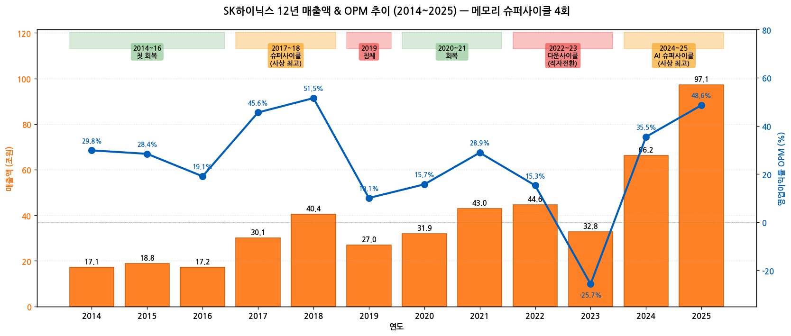

→ (출처: SK하이닉스 IR 분기 경영실적 (4Q13~1Q26) + DART 사업보고서 12년치 + 별도재무제표)

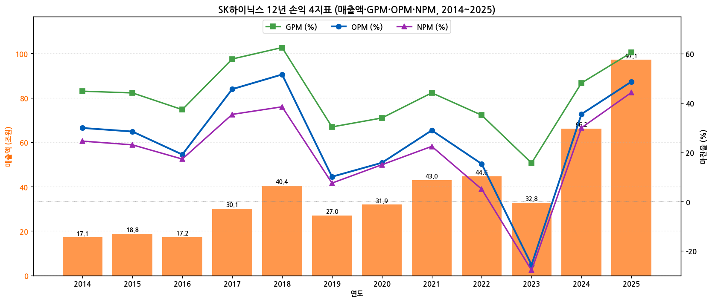

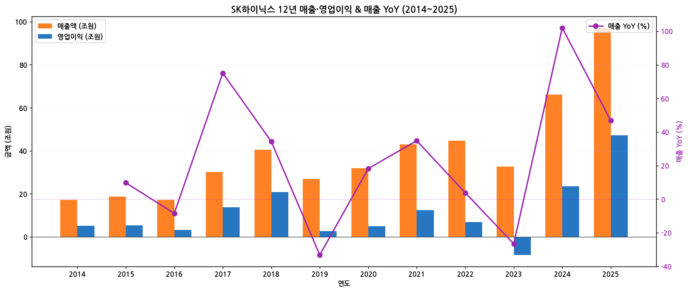

(3) 주가 역사 (20년 narrative)

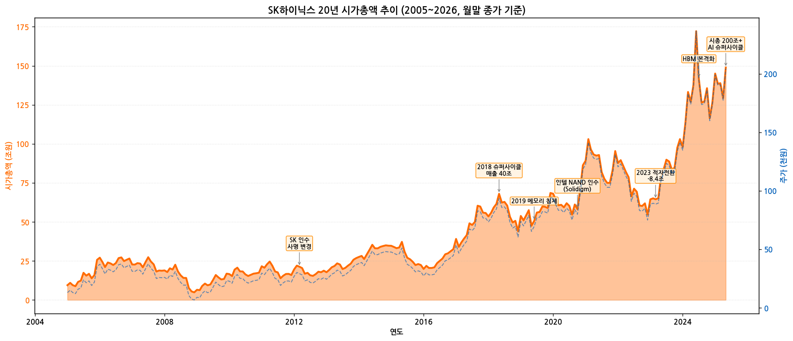

→ **시가총액 변천사 (20년)**:
- 2005년 시총 9.5조 (주가 13,000원) — 구 하이닉스반도체 시절, 워크아웃 졸업 직후
- 2012년 SK 인수 (주가 25,000원, 시총 약 18조) — SK그룹 편입, 사명 변경
- 2018년 최고치 (주가 ~98,000원, 시총 약 70조) — 첫 메모리 슈퍼사이클 정점
- 2019년 침체 (주가 ~60,000원, 시총 약 44조) — 메모리 다운사이클
- 2021년 회복 (주가 ~130,000원, 시총 약 95조) — 코로나 후 IT 수요 회복
- 2022~2023년 적자 (주가 ~75,000원, 시총 약 55조) — 메모리 다운사이클 적자전환
- 2024년 HBM 본격화 (주가 175,000원, 시총 약 127조) — 마이크론·삼성 대비 HBM 우위 입증
- **2026년 1월 사상 최고 (주가 220,000~245,000원, 시총 약 165조)** — AI 슈퍼사이클 + HBM 글로벌 1위
- **2026년 5월 현재 (주가 약 290,000원, 시총 약 211조)** — 8개 한국 증권사 평균 TP 1,815,000원 = +50% 상승여력

(4) 회사 연혁 (주요 마일스톤)

| 시점 | 이벤트 |
|---|---|
| 1949.10 | 국도건설 주식회사 설립 |
| 1983.02 | **현대전자산업주식회사**로 상호 변경 — 반도체 사업 시작 |
| 1996.12.26 | 한국거래소 유가증권시장 상장 |
| 2001.03 | **주식회사 하이닉스반도체**로 상호 변경 — 워크아웃 진입 |
| 2005 | 워크아웃 졸업 |
| 2012.03 | SK그룹이 인수, **에스케이하이닉스 주식회사**로 상호 변경 |
| 2013 | HBM1 세계 최초 양산 (3.0Gbps) |
| 2018 | 첫 메모리 슈퍼사이클 정점 (매출 40조, OP 20.8조) |
| 2019~2020 | 메모리 다운사이클, OPM 한자릿수 진입 |
| 2020.10.20 | **인텔 NAND 사업부 영업양수 결정** — 9조원 규모 ($9.0B 추정) |
| 2021.12 | 인텔 NAND 1차 종결 → **Solidigm 자회사** 출범 |
| 2022 | NAND 사업 통합으로 인텔 NAND/Solidigm 풀 통합 |
| 2023 | 메모리 다운사이클 적자전환 (OP -8.4조) — 역대 최대 적자 |
| 2024 | AI 슈퍼사이클 진입, HBM3E 세계 최초 본격 양산 |
| 2024.03 | HBM3E 8단 NVIDIA H100/H200 본격 출하 |
| 2024.07 | HBM3E 12단 NVIDIA Blackwell 양산 |
| 2025.03 | **인텔 NAND 영업양수 2차 종결** (최종 통합 완료) |
| 2025.03 | **CIS(시스템 반도체) 사업 종료** → AI 메모리 전환 |
| 2025.09 | **HBM4 세계 최초 양산 체제 구축** — NVIDIA Vera Rubin 향 |
| 2025.12 | 매출 97조 / OP 47조 / OPM 48.6% — **3년 연속 사상최대 갱신** |
| 2026.01 | DRAM/NAND 가격 슈퍼사이클 진입, OPM 71.5% (1Q26) |
| 2026 (예정) | ADR 미국 상장 (6월 SEC 결정 예정), 자사주 매입 소각 발표 가능 |

---

## ③ 비즈니스 모델

(1) 사업부 구조 (1Q26 기준)

→ **단일 segment: 반도체 부문 (메모리)** — 매출 100%
→ 내부 사업부 (별도재무제표 매출 분해 2025 기준):
   - **DRAM** 73.57조원 (별도 매출 중 85.5%) — 서버·모바일·PC·그래픽·HBM
   - **NAND Flash** 12.41조원 (별도 14.4%) — Solidigm 포함 시 연결 약 21% 비중
   - **Others** (Module·MCP 등) 소량

→ **연결 사업부별 매출 비중 (1Q26)**: DRAM 80% / NAND 18% / Others 2%
→ HBM 매출 비중 (1Q26 추정): DRAM 매출 중 약 50%+ = 전체 매출의 40%+

(2) 50분기 사업부별 매출 시계열 (4Q13~1Q26)

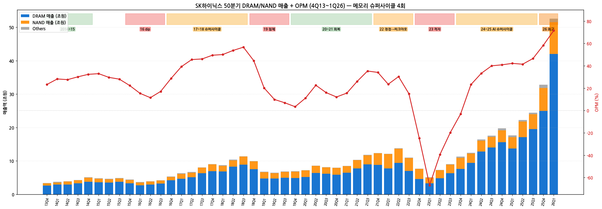

→ (사이클별 패턴)
- 2014~2015 첫 회복: DRAM 75% / NAND 22% / Others 3%
- 2016 dip: 단기 침체, OPM 11~17%
- 2017~2018 슈퍼사이클: OPM 39~57% (사상최고), DRAM 75~80%
- 2019 침체: OPM 3.4% (4Q19 사상최저권), DRAM 70~73%
- 2020~2021 회복: OPM 35%+
- 2022 정점→피크아웃: OPM 23~30% → 24%로 추락 (4Q22)
- 2023 적자전환: OPM -67%(1Q23) ~ -3%(4Q23), NAND 30% 비중
- 2024 AI 슈퍼사이클: OPM 23% → 41%로 가속, HBM 본격화로 DRAM 80% 복귀
- 2025 사상최고 연속 갱신: OPM 42% → 58%, DRAM 78~80%
- **1Q26 OPM 71.5%** — 한국 제조업 사상 초유, 글로벌 메모리 1위

(3) 1Q26 핵심 박스 (가장 최근 분기)

| 항목 | 1Q26 | YoY% | QoQ% | 비고 |
|---|---|---|---|---|
| 매출액 | **52.58조원** | +198% | +60% | 사상 최대 |
| 매출원가 | 10.90조원 | — | — | GPM 79.3% |
| 매출총이익 | 41.68조원 | — | — | — |
| 판관비 | 4.07조원 | — | — | — |
| 영업이익 | **37.61조원** | +405% | +96% | 사상 최대, OPM 71.5% |
| EBITDA | 41.34조원 | +284% | +82% | 마진율 79% |
| 순이익 | **40.35조원** | +398% | +165% | 환율·평가이익 영향 |
| DRAM ASP | +63~65% QoQ | — | — | Bit -0~+0% |
| NAND ASP | +73~74% QoQ | — | — | Bit -11~-13% |
| HBM 매출 | YoY 2배+ | — | — | — |

→ **DRAM/NAND 모두 가격 급등** 견인. HBM3E 12단 + HBM4 12H 본격 출하

(4) 직전 12분기 시계열 (2Q23~1Q26)

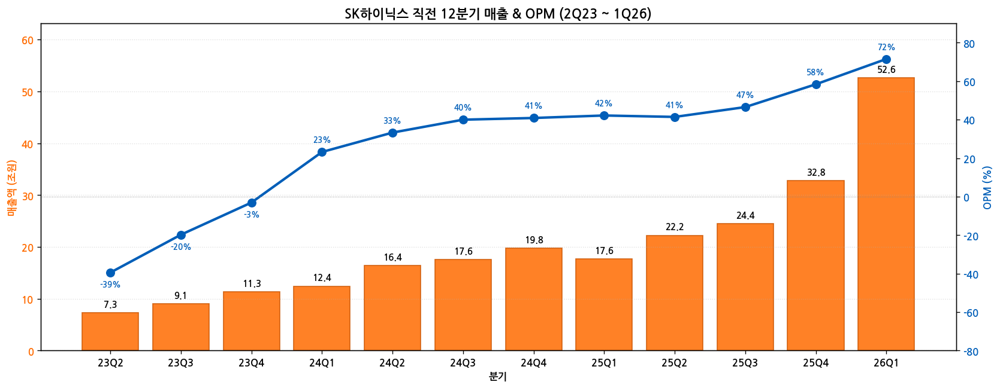

→ 12분기 매출 CAGR: 78%/연 → 사이클 회복 + HBM secular 동시 작용

(5) 제품 라인업 (2025말 기준 신제품)

| 카테고리 | 핵심 제품 | 양산 시점 |
|---|---|---|
| **HBM** | **HBM4 12H (12단)** | 2025.09 세계 최초 양산 |
| HBM | HBM3E 12단 | 2024.03 세계 최초 양산 |
| 서버 DRAM | 1bnm 32Gb DDR5 3DS (256GB DDR5 모듈) | 2025 양산 |
| 서버 DRAM | 1cnm 24Gb DDR5 (9.2Gbps) | 2025 개발 완료 |
| 모바일 DRAM | 1cnm 24Gb LPDDR5X (9.6Gbps) | 2025 개발 |
| 그래픽 DRAM | 1cnm 24Gb GDDR7 (40Gbps) | 2025 개발 |
| 모바일 NAND | **321단 1Tb TLC** UFS 4.1 | 2025 양산 |
| eSSD | PCIe Gen5 16채널 SSD | 2025 양산 |
| CXL Memory | CMM-DDR5 96GB/128GB | 2024~2025 인증 |

→ (2025 R&D 마일스톤 — 사업보고서 II-6 R&D 활동)

---

## ④ 재무 구조

(1) 12년 자산·자본·부채 시계열

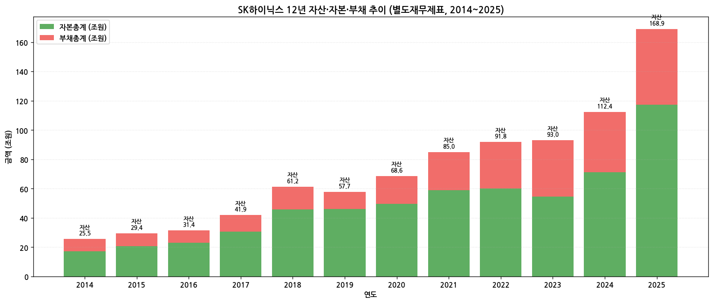

→ **자본총계 2014 17조 → 2025 117조** = 6.9배 증가 (CAGR 17.5%)
→ **부채총계 2014 8.5조 → 2025 51.6조** = 6.1배 (CAGR 16.4%)
→ 2023 부채/자본 = 0.71 (다운사이클 정점) → 2025 0.44 (자본 폭발로 안정화)
→ 2024~2025 자본 폭증의 핵심: 이익잉여금 65조 → 106조 (+41조)

(2) 12년 현금흐름·CapEx 시계열

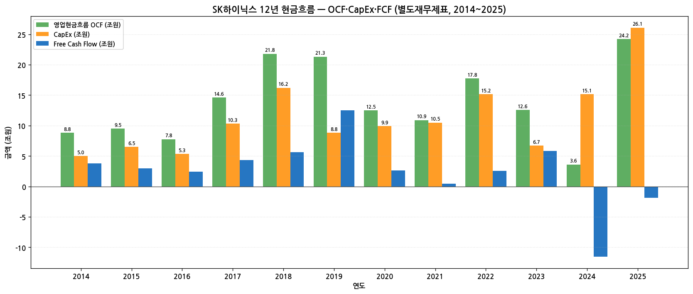

→ **OCF 12년 누적 약 169조** — 메모리 IDM 특유의 캐시 머신
→ **CapEx 12년 누적 약 156조** — 메모리는 자본집약 산업
→ FCF 분기 — 다운사이클(2023) -1조 / 슈퍼사이클(2018) +5.6조 / 2025 -1.9조 (CapEx 폭증)

(3) CapEx 12년 — 사이클 동조성

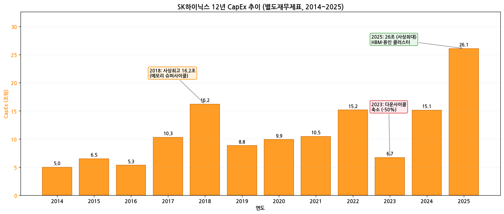

→ **CapEx vs 매출 = 사이클 동조**: 2018 16.2조 (정점) → 2019 8.8조 (-46%) → 2023 6.7조 (다운사이클 -56% 컷)
→ **2025 26.1조 (사상 최대)** — HBM 양산 + 용인 클러스터 + M15X Ramp-up 동시 진행
→ 곽 사장 (1Q26 컨콜): "올해 CapEx 규모는 전년 대비 크게 증가할 것" — 중장기 수요 선제 대응

(4) 12년 R&D 투자 추이

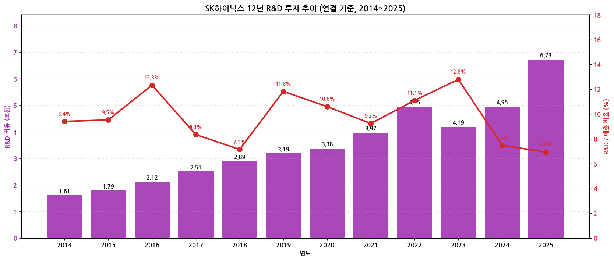

→ **R&D 2014 1.6조 → 2025 6.7조** = 4.2배 (CAGR 13.9%)
→ **R&D/매출 비율 12년 평균 7.6%** — 매년 일정 (메모리 IDM 표준)
→ 2023 다운사이클 = R&D 12.8%까지 상승 (매출 줄어도 R&D 유지) — 기술 우위 사수 의지
→ 2024~2025 슈퍼사이클 = R&D 7.5% → 6.9%로 정상화

(5) 12년 주주환원 (배당·자사주) 추이

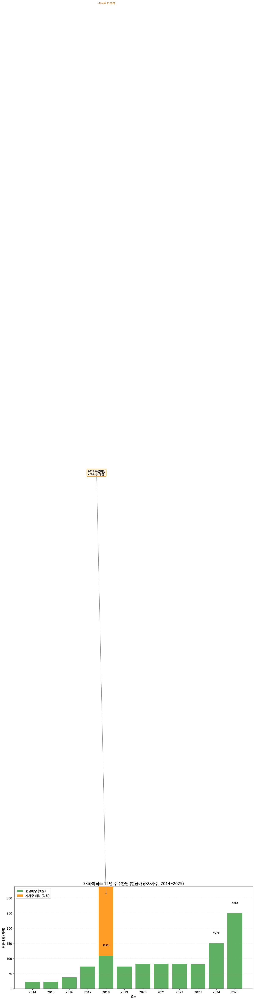

→ **2018 특별배당** + 자사주 매입 (3,100억) = 첫 슈퍼사이클 정점 시 환원
→ 2019~2023 분기당 약 200~300원 균등 배당 (총 800억 안팎)
→ **2024 배당 1,800억 (전년 대비 +125%)** — 사이클 회복 + 곽 사장 환원 강화 의지
→ **2025 배당 약 2,500억** (추정) + 추가 자사주 매입소각 발표 가능성
→ **곽 사장 (1Q26 컨콜)**: "순현금 100조 달성 + 주주환원 확대 동시 진행 가능" 명시 → 2026 H2 자사주 매입소각 발표 가능성 매우 높음

(6) 주요 재무 지표 (2025)

| 지표 | 2025 | 2024 | 변화 |
|---|---|---|---|
| GPM | 60.4% (연결) | 48.1% | +12.3pp |
| OPM | 48.6% | 35.5% | +13.1pp |
| NPM | 44.2% | 29.9% | +14.3pp |
| ROE (연결) | 41.8%+ | 25.8% | +16.0pp |
| 부채비율 (별도) | 44.0% | 57.8% | -13.8pp |
| 순차입금 비율 | -21% (1Q26말) | +18% (4Q24) | 50%pp 이상 개선 |
| 순현금 (1Q26말) | 약 35조 (현금 54조 - 차입 19조) | — | — |

→ **순현금 100조 도달 시점**: 회사 가이던스 — 2026 연말 ~ 2027 H1

---

## ⑤ 지배 구조

(1) 그룹 관계 — 3단계 지배 구조

```
최태원 (회장) ─17.90%→ SK(주) ─32.16%→ SK스퀘어(주) ─20.07%→ SK하이닉스
```

→ **최태원 회장**: SK(주) 12,975,472주 (17.90%) — 자사주 소각으로 지분율 17.50% → 17.90% 증가 (2024.06)
→ **SK(주)**: SK스퀘어 지분 32.16% (2025.10.27 기준, 2023.02 30.05% → 1년 9개월 동안 +2.11%pt 증가)
→ **SK스퀘어**: SK하이닉스 146,100,000주 (20.07%) — 매우 안정적 지배 구조
→ **특수관계인 합계 (등기·미등기 임원 자사주 포함)**: 146,115,103주 (20.07%)

(2) 주주 구분 (2025.12.31 기준)

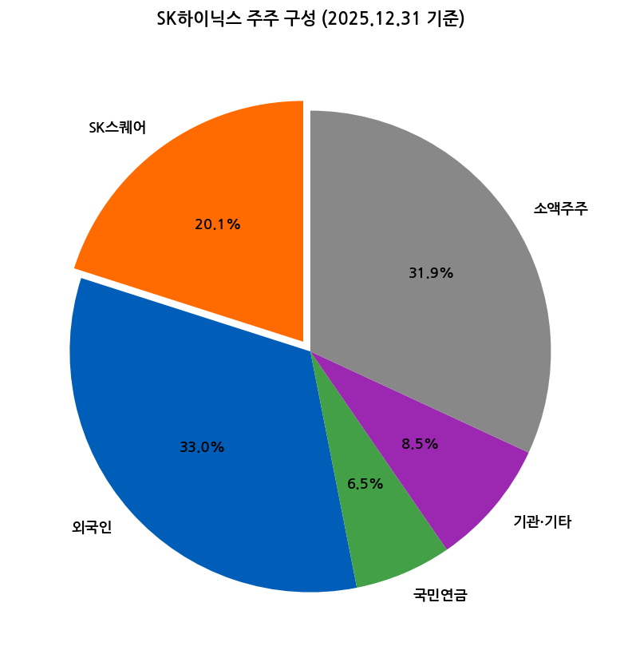

| 주주 유형 | 비중 | 비고 |
|---|---|---|
| SK스퀘어 (최대주주) | 20.07% | 146,100,000주 |
| 외국인 (SK스퀘어 제외) | 33.0% | 약 240백만주 (총 외국인 53.1%) |
| 국민연금 | 약 6.5% | — |
| 기관·기타 | 약 8.5% | — |
| 소액주주 | 약 31.9% | — |

→ **외국인 지분율 53.1%** — KOSPI 상위 외국인 비중 종목
→ **ADR 발행 결정 시 외국인 지분 추가 상승 가능성** (마이크론 P/B 5.31 vs SK하이닉스 2.66 = +99% 멀티플 갭 축소 catalyst)

(3) 등기임원 (9명) — 2025.12.31 기준

| 성명 | 직위 | 등기/사외 | 주요 경력 |
|---|---|---|---|
| **곽노정** | 대표이사 사장 | 사내이사 (상근) | 고려대 박사, SK하이닉스 청주 FAB담당 전무·안전개발제조총괄 사장 (現 대표이사 2022.03~) |
| **안현** | 사장 | 사내이사 (상근) | 서울대 원자핵공학 박사, SK하이닉스 NAND개발사업전략 담당 (現 개발총괄 사장 2024.03~) |
| 장용호 | 이사 | 기타비상무이사 | 서울대 경제학, SK주식회사 대표이사 사장 |
| 한명진 | 이사 | 기타비상무이사 | 고려대 경영, SK스퀘어 대표이사 사장 |
| 한애라 | 이사 | 사외이사·이사회 의장 | 하버드대 석사, 성균관대 법전 교수 |
| 정덕균 | 이사 | 사외이사 | UC 버클리 박사, 서울대 전기정보공학부 명예교수 |
| 김정원 | 이사 | 사외이사 | 시카고대 MBA, 前 한국씨티 부행장 |
| 양동훈 | 이사 | 사외이사 | 시라큐스대 회계학 박사, 동국대 명예교수 |
| 손현철 | 이사 | 사외이사 | UC 버클리 재료공학 박사, 연세대 신소재공학과 교수 |

(4) 2026.03.25 신규 선임 후보 (주총 예정)

| 성명 | 직위 | 비고 |
|---|---|---|
| 차선용 | 사내이사 (신규 선임) | 사장, 미래기술연구원장, DRAM 개발 담당 |
| 김정규 | 기타비상무이사 (신규 선임) | SK스퀘어 사장 |
| 정덕균 | 사외이사 (재선임) | 서울대 명예교수 |
| 김정원 | 사외이사 (재선임) | 김앤장 고문 |
| 고승범 | 사외이사 (신규 선임) | 前 금융위원장, 法 태평양 고문 |
| 최강국 | 사외이사 (신규 선임) | EY 전무, PwC Partner |

(5) 미등기 임원 (주요)

| 성명 | 직위 | 담당 업무 |
|---|---|---|
| 최태원 | 회장 (미등기) | 회장 |
| 김주선 | 사장 | AI Infra 담당 + GSM 담당 |
| 송현종 | 사장 | Corporate Center 담당 + 기업문화 |
| 염성진 | 사장 (1개월 재직) | 커뮤니케이션총괄 담당 |
| 차선용 | 사장 | 미래기술연구원 + DRAM개발 |

---

## ⑥ 기타 팩트

(1) R&D 마일스톤 (3년치 핵심, 사업보고서 II-6)

→ **2025 R&D 마일스톤**
- HBM4 12H 세계 최초 양산 체제 구축 (2025.09, NVIDIA Vera Rubin 향)
- 321단 1Tb TLC NAND UFS 4.1 양산 시작 (4,300MB/s)
- 1cnm 24Gb LPDDR5X (9.6Gbps) 개발 완료
- 1bnm 32Gb DDR5 3DS (256GB 모듈) 양산
- CMM-DDR5 128GB 1세대 CXL 2.0+ 제품 인증 완료
- 1cnm 24Gb GDDR7 개발 완료 (40Gbps)
- 1bnm 24Gb HBM4 (Advanced MR-MUF) 양산

→ **2024 R&D 마일스톤**
- **1cnm 16Gb DDR5 세계 최초 양산** (10nm급 6세대)
- HBM3E 8단/12단 NVIDIA 본격 출하
- 321단 4D NAND 양산 돌입
- ZUFS 4.0 온디바이스 AI 모바일 메모리

→ **2023 R&D 마일스톤**
- LPDDR5T 양산 (현존 최고속 9.6Gbps)
- 12단 HBM3 세계 최초 양산 (24GB)
- HBM3E 본격 개발
- 238단 4D NAND 양산
- DRAMless In-house SoC SSD 개발

(2) M&A 이력 (10년치)

| 시점 | 거래 | 규모 | 의의 |
|---|---|---|---|
| 2017.09 | Bain Capital 컨소시엄과 도시바 메모리 인수 컨소시엄 참여 | 약 4조원 | 키옥시아 우선주 → 평가이익 9.94조 (2025) |
| 2020.10 | **인텔 NAND 사업부 영업양수 결정** | 9조원 | NAND IDM 글로벌 4위 도약 |
| 2021.12 | 인텔 NAND 1차 종결 → Solidigm 자회사 출범 | 7조원 (1차) | 본격 통합 시작 |
| 2025.03.28 | **인텔 NAND 영업양수 최종 종결** (2차) | 2조원 (2차) | 5년 만에 인텔 NAND 100% 통합 완료 |
| 2025 | **에스케이파워텍(주) 지분인수** (신규 종속회사) | — | 전력 인프라 자체 확보 |
| 2025 | SkyHigh Memory 3개 지분 매각 + SK hynix NAND Solutions Japan G.K. 청산 | — | 사업 구조 정리 |

(3) 주요 계약 (10년치)

→ **Rambus 특허 크로스 라이선스** (2013.07.01~2034.06.30) — 반도체 전 제품 기술 라이선스
→ **인텔 NAND 영업양수** (2020.10.20~2025.03.28) — 2차에 걸쳐 종결

(4) 리스크 분석

| 카테고리 | 리스크 | 영향도 |
|---|---|---|
| **사이클** | 메모리 다운사이클 — 2023년 적자 -8.4조 재발 가능 | 매우 높음 |
| **고객 집중도** | NVIDIA HBM 의존도 — Vera Rubin 양산 지연 시 매출 충격 | 높음 |
| **경쟁** | 마이크론·삼성전자 HBM4 추격 — 2026~2027 양산 본격화 시 점유율 위협 | 높음 |
| **지정학** | 미·중 무역 갈등 — 중국 우시·충칭 사업장 운영 위험 | 중간 |
| **환율** | 원/달러 환율 변동 — 수출 비중 95%+ 영향 | 중간 |
| **CapEx** | 2025 CapEx 26조 + 2026 추가 증가 → ROIC 압박 가능 | 중간 |
| **노조** | 한국 노사 안정성 — 삼성 노조 파업 영향 잠재적 | 낮음 |

(5) ESG 활동

→ **RE100 가입** (2020) — 2050년 글로벌 사업장 재생에너지 100% 사용 약속
→ **CDP 탄소경영 최우수 명예의 전당 10년 유지** (2025 기준)
→ **온실가스 배출량 2025**: 4,994,862 tCO2-eq (Scope 1+2, 국내 사업장)
→ **에너지 사용량 2025**: 98,103 TJ
→ **재생에너지 PPA 첫 체결** (2024.02 태양광)
→ **ZWTL (폐기물 매립 제로화) Platinum 등급 유지** — 국내·중국 우시
→ **순환자원인증 누적 24개 품목** (2025말)

(6) 인증 및 표창

→ **ASPICE Level 2** — 한국 반도체 기업 최초 Mobile UFS 자동차 SW 개발 표준 인증
→ **국가핵심기술·전략기술 지정 반도체 기술 보유** (산업통상자원부)
→ **ISO45001, ISO14001, KOSHA MS** — 안전보건·환경 인증 유지
→ **CDP 탄소경영 명예의 전당 10년 유지**

(7) 핵심 산업 데이터 (2025 기준)

→ **세계 반도체 시장 (Gartner 2026.01)**:
- 전체: $7,934억
- 메모리: $2,086억 (전체의 26%)
  - DRAM: $1,356억 (메모리의 65%) — 전년比 +48%
  - NAND: $677억 (메모리의 32%) — 전년比 +7%
  - 기타 메모리: $53억 (3%)
→ **한국 수출 중 반도체 비중**: 24.4% — 2025 반도체 수출 1,734억 달러 (+22% YoY)

→ **SK하이닉스 점유율 (IDC 2025 3Q)**:
- DRAM: **34.3%** (글로벌 2위, 삼성전자 1위 약 43% 추정)
- NAND: **19.7%** (글로벌 4위, Solidigm 포함)
- HBM: **약 57~70%** (글로벌 1위)

---

## ⑦ 향후 관찰 포인트

(1) **HBM4 글로벌 점유율 유지 여부** — 마이크론·삼성전자 양산 가속화 시
   → 모니터링: TrendForce HBM 분기 보고서, NVDA 실적 컨콜 HBM 공급사 코멘트

(2) **순현금 100조 달성 시점** — 회사 가이던스: 2026 연말 ~ 2027 H1
   → 자사주 매입소각 발표 = 강력한 주가 catalyst

(3) **ADR 미국 상장 6월 SEC 결정** — 마이크론 P/B 5.31 vs SK하이닉스 2.66 = 멀티플 갭 축소 가능성

(4) **2026 OPM 76% 돌파 여부** — 분기 컨센서스. 76%+ = secular narrative 완성, 미달 = cyclical peak 우려

(5) **CIS 사업 종료의 AI 메모리 집중 효과** — 시스템 반도체 영역 매각 자금 활용

(6) **차선용 사내이사 신규 선임 (2026.03.25)** — 미래기술연구원장 출신 → DRAM 차세대 로드맵 강화

---

> **데이터 소스**: DART 사업보고서 12개 연도 (2014~2025) 본문 + 별도재무제표, SK하이닉스 IR 분기 경영실적 50개 (4Q13~1Q26), Yahoo Finance v8 (000660.KS 20년), IDC DRAM/NAND 시장조사, Gartner 2026.01 반도체 시장 보고서, 한국무역협회 수출 통계 2026.01.
> **연계 참조**: `earnings-review/2026-Q1_SK하이닉스_리뷰.md` (1Q26 실적 리뷰), `earnings-followup/2026-Q2_SK하이닉스_팔로업.md` (2Q26 팔로업 v6).
> **차트 12종**: chart1 (매출OPM 12년), chart1b (손익4지표), chart2 (50분기 사업부), chart4 (자산자본부채), chart5 (주주지분), chart6 (현금흐름), chart7 (R&D), chart8 (CapEx), chart9 (주주환원), chart10 (12분기), chart11 (시가총액 20년), chart12 (손익YoY).
