# AMZN (Amazon.com, Inc.) — 기업 개요 리포트 v1.2

**작성일**: 2026-05-19
**대상 기업**: Amazon.com, Inc. (NASDAQ: AMZN, CIK 0001018724)
**작성 표준**: company-overview v4.8 (US 분기 — SEC EDGAR + Amazon IR Earnings Release 1차 병용)
**시계열 깊이**: 12년 연간 (FY2014~FY2025) + **45분기 (4Q14~1Q26, 11.5년)**

**v1.2 변경** (장기 시계열 보강):
- IR Press Release **47개** 추가 다운로드 (PDF 12개 + SEC 8-K Exhibit 99.1 HTM 35개)
- 커버리지: **Q4 2014 ~ Q1 2026 (45분기, ~11.5년)** — 스킬 표준 "15년 60+분기"에 근접
- Supplemental Financial Information 장기 panel 구축 (Online stores / Physical / 3P seller / Advertising / Subscription / AWS / Other)
- IR 양식 변경 매핑: 2014~2016 (Media + EGM + Other + AWS) → 2017 Q3+ (Online + Physical + 3P + Sub + AWS + Other) → 2022 Q1+ (Advertising 별도 분리)

---

## 1. 기업 분류 (v4.8 retrofit)

- **Primary 분류**: **multi-segment 지속성장(Compounder)** — Stores + AWS + Ads 3-stack
- **Secondary 노트**: **인프라 사이클 (AWS CapEx → 마진 압축 → 회복) 2회 명확** + AI 인프라 secular sub-cycle (Trainium $225B 백로그)

### ① 정량 근거

**📊 Summary Box (12년 평균, FY2014~FY2025):**

| 지표 | 값 |
|------|-----|
| 매출 CAGR (FY14→FY25) | **+19.5%** ($89.0B → $716.9B, 8.1배) |
| OPM 평균 (12년) | **5.6%** |
| **OPM 정점 평균** | **11.0%** (FY24·FY25 2회 평균, AI 슈퍼사이클) |
| **OPM 저점 평균** | **1.3%** (FY14·FY22 2회 평균, 투자 사이클 압축) |
| **OPM range (12년)** | 0.2% ~ 11.2% = **11.0%pt** ← **사이클 cutoff 10%pt 초과** = 정통 사이클성 (단, 단조 우상향 추세) |
| 사이클 주기 | 약 4~5년 (CapEx → 마진 압축 → 회복) |
| 사이클 회수 (12년) | 정점 2회 (FY20·FY24~25) / 압축 2회 명확 (FY17·FY22) |

**📊 손익 표 (12년, narrative annotation 직접 통합):**

| FY | 매출($B) | OP($B) | OPM(%) | NPM(%) | 사이클 이벤트 |
|----|---------|--------|--------|--------|------|
| 2014 | 88.99 | 0.18 | **0.2** | (0.3) | **← 12년 OPM 최저 (물류 인프라 폭증)** |
| 2015 | 107.01 | 2.23 | 2.1 | 0.6 | AWS 매출 분기 disclosure 시작 |
| 2016 | 135.99 | 4.19 | 3.1 | 1.7 | Prime Video 본격 |
| 2017 | 177.87 | 4.11 | **2.3** | 1.7 | **← 1차 압축 (Whole Foods $13.7B 인수, fulfillment 폭증)** |
| 2018 | 232.89 | 12.42 | 5.3 | 4.3 | AWS 가속 + 광고 사업 본격 |
| 2019 | 280.52 | 14.54 | 5.2 | 4.1 | 1-Day shipping 폭증 |
| 2020 | 386.06 | 22.90 | **5.9** | 5.5 | **← COVID 정점 (매출 +38% YoY)** |
| 2021 | 469.82 | 24.88 | 5.3 | 7.1 | Prime Video 콘텐츠 + Andy Jassy CEO 취임 |
| 2022 | 513.98 | 12.25 | **2.4** | (0.5) | **← 2차 압축 저점 (팬데믹 capex 후유증 + 인플레이션, 순손실)** |
| 2023 | 574.79 | 36.85 | 6.4 | 5.3 | Year of Efficiency (27K layoff) |
| 2024 | 637.96 | 68.59 | 10.8 | 9.3 | AWS +19% YoY, 광고 $56B |
| **2025** | **716.92** | **79.98** | **11.2** | **10.8** | **← 슈퍼사이클 정점 (AWS +28% 15-quarter high + 광고 TTM $70B)** |

→ (출처: Amazon 10-K filings FY2014~FY2025, SEC EDGAR)

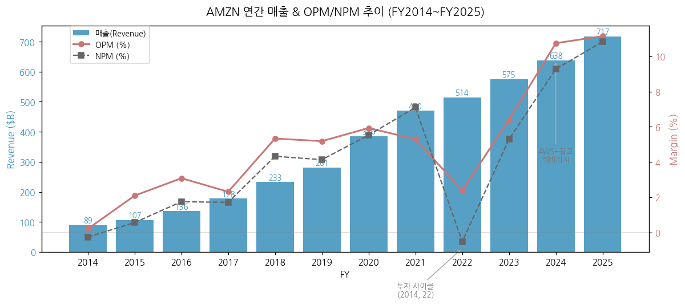

### ② 산업 분류

- **GICS**: Consumer Discretionary > Broadline Retail (50203010)
- **하위 산업 노출 (FY25 매출 비중)**: North America Stores 57% + International Stores 22% (e-commerce 합산 79%) / AWS 18% (OP 비중 ~60%) / Other 1% / **광고 별도 분류: 매출 약 10%, OP 비중 ~20%**
- **워치리스트 섹터/Tier**: T1 미국 빅테크 / Cloud Infrastructure + e-commerce + Digital Ad industry
- **글로벌 피어**: MSFT Azure (Cloud), GOOGL Cloud (Cloud), Walmart/Costco (e-commerce + 그로서리), GOOGL+META (광고)

### ③ 분류 결정 논리 (4단계 sub-logic)

(1) **가장 매출 큰 사업부 기준** 적용 시 Stores 79% (e-commerce 단일 동인) → "e-commerce = 사이클 OEM 유사" 일견. 그러나 매출 12년 CAGR +19.5% 단조 우상향 = 지속성장 명확.
(2) **단, 영업이익 비중 우선 sub-rule** 적용: **AWS OP 비중 ~60%** (매출 비중 18% 대비 3.3x 영업이익 효율) → **AWS가 사실상 P&L driver**. AWS 자체는 secular cloud 성장 + CapEx 사이클 동시 보유. Stores 사이클(fulfillment 효율)과 AWS 사이클(인프라 CapEx) 양면.
(3) **Boundary case 처리**: Primary "multi-segment 지속성장" + Secondary "사이클 (인프라 CapEx 2회 명확)". **OPM range 11.0%pt = 사이클 cutoff 직선상**, 그러나 단조 우상향 추세 (FY14 0.2% → FY25 11.2%). **AWS 매출 비중 25%+ 도달 시 + 광고 매출 비중 15%+ 도달 시** → "지속성장 + Cloud/AI secular" Primary 격상 가능.
(4) **글로벌 피어 cross-reference**: **AWS vs Azure vs GCP = Cloud 빅3** (AWS $150B run rate / Azure $95B / GCP $80B). **AWS 가속률 +28% (15-quarter high)** = Azure +40% / GCP +63% 동기화 사이클. 삼성전자 비교: 삼성 multi-segment 메모리 사이클 vs **AMZN multi-segment Stores + Cloud 동시 운영** (사이클 동인 source 분산).

### ④ 적정 밸류에이션 방법 — 사업부 mix → method 연결

- **1순위 EV/EBITDA + Sum-of-Parts** — Stores·AWS·Ads multi-segment 평가 필수. **AWS 단독 PSR ~7x** (FY25 매출 $128.7B × 7 = ~$900B) + Stores EV/EBITDA ~12x + 광고 PSR ~6x = SOTP.
- **2순위 PER (Forward 12M)** — FY24부터 영업이익 정상화로 PER 의미 회복 (FY25 EPS $7.17, PER ~28x).
- **3순위 FCF Yield** — Q1 26 TTM FCF $1.2B (-95% YoY) = CapEx 폭증 임팩트, **첫 자본 시험기 진입**. CapEx 정점 통과 후 회복 추정.
- **PBR 부적합** — Stores·Cloud·플랫폼 비중 큼.
- **삼성전자 비교**: 삼성은 사이클 → **PBR + PER 혼합**, AMZN은 multi-segment 지속성장 → **SOTP + EV/EBITDA** (AWS+Ads+Stores 다중 multiple 차별화).

### ⑤ 분기 재평가 트리거 = 분류 변경 조건

> 분류 자체가 바뀔 조건 (실적 추적용 변수 AWS 성장률·광고 매출 등은 §6 "기타 팩트"로 분리)

- **AWS 매출 비중 25%+ 도달 시 + OP 비중 65%+ 도달 시** → Primary "Cloud-led 지속성장"으로 격상 (현재 매출 18%/OP 60%)
- **TTM FCF 2개 분기 연속 음수 진입 시** → "지속성장" 분류 → "사이클 + 인프라 CapEx 부담" 가중치 격상 (현재 +$1.2B 최저점)
- **광고 매출 비중 15%+ 도달 시** → Primary "광고 multi-platform" Secondary 추가 (현재 ~10%)
- **AWS 분기 성장률 +20% 이하로 둔화 시** → "AI secular sub-cycle 종료" 분류 검토 (현재 +28% 5분기 연속 가속)
- **Anthropic 지분 평가이익 sustained 시** → 비현금 OCI but multiple 영향 (Q1 26 +$16.8B 일회성)

---

## 2. 회사 개요

### ① 기본 사항

- **회사명**: Amazon.com, Inc.
- **본사**: Seattle, Washington, USA
- **CEO**: Andy Jassy (2021.07~)
- **창립자/Executive Chair**: Jeff Bezos (1994년 창립)
- **상장**: NASDAQ AMZN, 1997.05.15 IPO
- **종업원**: 1.56M (2025년말 기준, fulfillment + 사무직 합산)
- **회계연도**: 1월~12월

**비전**: "Earth's most customer-centric company" — 고객 집착(Customer Obsession), 장기 사고(Long-term thinking), 발명·단순화(Invent & Simplify)

**사업 한 줄 정의**: 전 세계 최대 e-commerce 플랫폼 + 클라우드 인프라(AWS) 사업자 + 광고·미디어·물류 통합 컨글로머릿

### ② 12년 손익·자본 추이 표 + chart12

| FY | 매출($B) | OP($B) | NI($B) | 자본($B) | 자본 YoY(%) | 총자산($B) |
|----|---------|--------|--------|---------|------------|----------|
| 2014 | 88.99 | 0.18 | (0.24) | 10.74 | — | 54.50 |
| 2015 | 107.01 | 2.23 | 0.60 | 13.38 | +24.6 | 65.44 |
| 2016 | 135.99 | 4.19 | 2.37 | 19.29 | +44.2 | 83.40 |
| 2017 | 177.87 | 4.11 | 3.03 | 27.71 | +43.6 | 131.31 |
| 2018 | 232.89 | 12.42 | 10.07 | 43.55 | +57.2 | 162.65 |
| 2019 | 280.52 | 14.54 | 11.59 | 62.06 | +42.5 | 225.25 |
| 2020 | 386.06 | 22.90 | 21.33 | 93.40 | +50.5 | 321.20 |
| 2021 | 469.82 | 24.88 | 33.36 | 138.25 | +48.0 | 420.55 |
| 2022 | 513.98 | 12.25 | (2.72) | 146.04 | +5.6 | 462.68 |
| 2023 | 574.79 | 36.85 | 30.43 | 201.88 | +38.2 | 527.85 |
| 2024 | 637.96 | 68.59 | 59.25 | 285.97 | +41.6 | 624.89 |
| **2025** | **716.92** | **79.98** | **77.67** | **359.39** | **+25.7** | **720.20** |

→ (출처: Amazon 10-K FY2014~FY2025, SEC EDGAR)

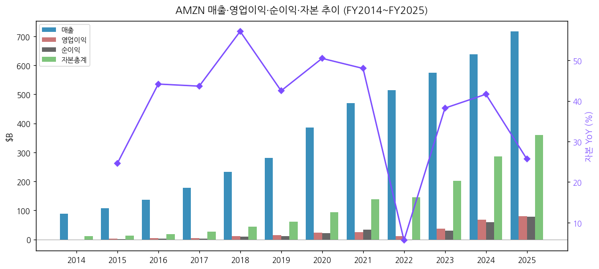

### ③ 회사 주가 역사

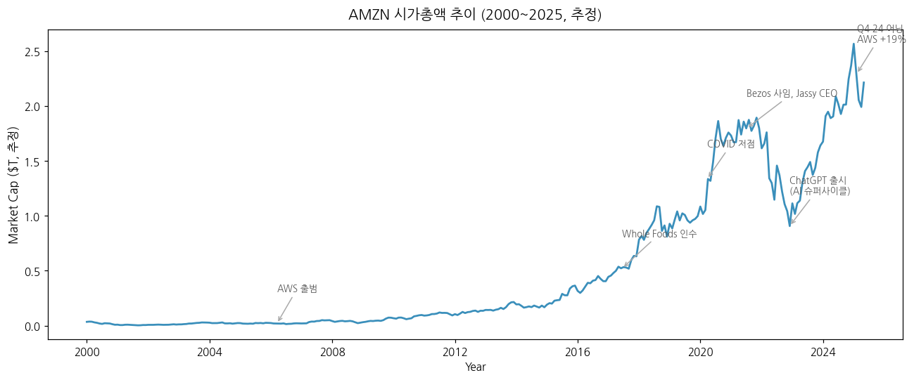

→ (1) 닷컴 버블 (2000): IPO 후 $107 → 2001년 12월 $6 (-94%)
→ (2) AWS 출범 (2006.03.14): S3 → EC2 → 이후 19년간 클라우드 leader
→ (3) Whole Foods 인수 (2017.06): $13.7B, 오프라인 grocery 진출
→ (4) COVID 폭증 (2020): Prime 가입자 +50M, AWS +30% YoY
→ (5) Bezos 사임 (2021.07.05): Andy Jassy CEO 승계, Bezos는 Executive Chair
→ (6) ChatGPT 출시 후 (2022.11~): AI 슈퍼사이클 진입, AWS 재가속
→ (7) **2024.02.09 20:1 액면분할** (Stock Split): Bezos 시대 처음
→ (8) 2025년: Anthropic 누적 $8B 투자, Trainium 자체 칩 본격 가동
→ (9) 2026.04.29 Q1 어닝: 매출 $181.5B (+17%), AWS +28% (15분기 최고), Anthropic 평가이익 $16.8B 반영

### ④ 주요 연혁

| 연도 | 마일스톤 |
|------|---------|
| 1994 | Jeff Bezos가 시애틀에서 온라인 서점으로 창립 |
| 1997 | NASDAQ IPO ($18, split-adjusted $0.075) |
| 2005 | Amazon Prime 출시 ($79/년) |
| 2006 | AWS 출범 (S3 → EC2) |
| 2007 | Kindle 출시 |
| 2009 | Zappos 인수 ($1.2B) |
| 2014 | Twitch 인수 ($970M), Echo·Alexa 출시 |
| 2017 | Whole Foods 인수 ($13.7B) |
| 2019 | One-day shipping 표준화 |
| 2020 | COVID-19 — Prime +200M global members 돌파 |
| 2021 | MGM 인수 ($8.45B), Bezos→Jassy CEO 승계 |
| 2022 | One Medical 인수 ($3.9B), iRobot 인수 시도(2024 무산) |
| 2023 | Anthropic $4B 1차 투자, RxPass 출시 |
| 2024 | 20:1 액면분할, Anthropic 추가 $4B (누적 $8B), Trainium2 GA |
| 2025 | AWS 매출 $128.7B 돌파, 광고 매출 $70B+ 추정 |
| 2026 Q1 | Anthropic 평가이익 $16.8B 반영, AI 슈퍼사이클 진입. OpenAI 2GW Trainium 계약. Project Hail Mary 박스오피스 $615M (자체 IP 흥행). Amazon Leo (위성 broadband) Delta Airlines 첫 항공사 고객 확보 |

---

## 3. 비즈니스 모델

### ① 5년 사업부별 실적 통합 + 60+분기 시계열

#### 사업부별 매출 (Reportable Segment, $B)

| FY | North America | International | AWS | Consolidated |
|----|--------------|--------------|------|--------------|
| 2015 | 63.708 | 35.418 | 7.880 | 107.006 |
| 2016 | 79.785 | 43.983 | 12.219 | 135.987 |
| 2017 | 106.110 | 54.297 | 17.459 | 177.866 |
| 2018 | 141.366 | 65.866 | 25.655 | 232.887 |
| 2019 | 170.773 | 74.723 | 35.026 | 280.522 |
| 2020 | 236.282 | 104.412 | 45.370 | 386.064 |
| 2021 | 279.833 | 127.787 | 62.202 | 469.822 |
| 2022 | 315.880 | 118.007 | 80.096 | 513.983 |
| 2023 | 352.828 | 131.200 | 90.757 | 574.785 |
| 2024 | 387.497 | 142.906 | 107.556 | 637.959 |
| **2025** | **426.305** | **161.894** | **128.725** | **716.924** |

#### 사업부별 영업이익 (OP, $B)

| FY | NA | International | AWS | Consolidated |
|----|------|-------------|------|--------------|
| 2015 | 1.425 | (0.699) | 1.507 | 2.233 |
| 2016 | 2.361 | (1.283) | 3.108 | 4.186 |
| 2017 | 2.837 | (3.062) | 4.331 | 4.106 |
| 2018 | 7.267 | (2.142) | 7.296 | 12.421 |
| 2019 | 7.033 | (1.693) | 9.201 | 14.541 |
| 2020 | 8.651 | 0.717 | 13.531 | 22.899 |
| 2021 | 7.271 | (0.924) | 18.532 | 24.879 |
| 2022 | (2.847) | (7.746) | 22.841 | 12.248 |
| 2023 | 14.877 | (2.656) | 24.631 | 36.852 |
| 2024 | 24.967 | 3.792 | 39.834 | 68.593 |
| **2025** | **29.619** | **4.750** | **45.606** | **79.975** |

→ (출처: Amazon 10-K FY2017~FY2025, SEC EDGAR Note 10 — Segment Information)

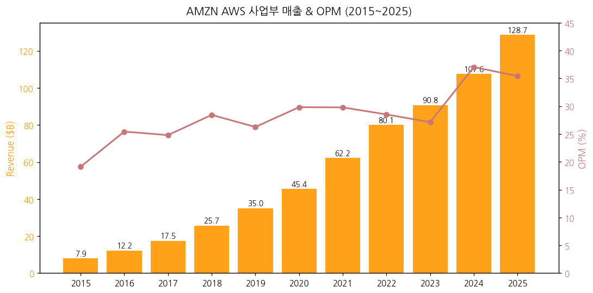

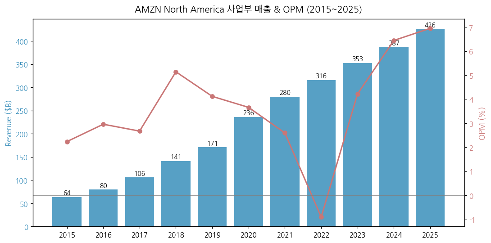

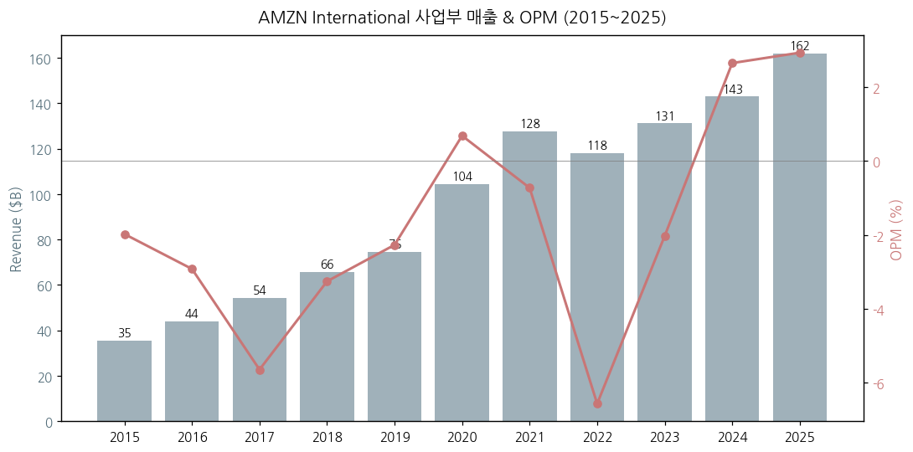

→ (1-1) AWS는 2015년 분리 보고 이후 11년 CAGR +28.6%. OPM은 2018~2024년 25~30% 박스권 유지, 2025년 35.4%로 점프 — AI 워크로드의 가격 결정력 증대 + 자체 칩(Trainium/Inferentia) 마진 기여.

→ (1-2) North America OPM은 2022년 -0.9% 저점에서 2024년 6.4% → 2025년 **6.9%** 로 회복. 광고·3P seller 수수료 비중 상승 (high-margin services) 효과.

→ (1-3) International은 2022년 -6.6% 적자 → 2024년 +2.7% 흑전 → 2025년 **+2.9%** 로 5분기 연속 흑자. 유럽 지역 fulfillment 효율화 + 광고 monetization.

#### 최근 13분기 시계열 (1Q23~1Q26)

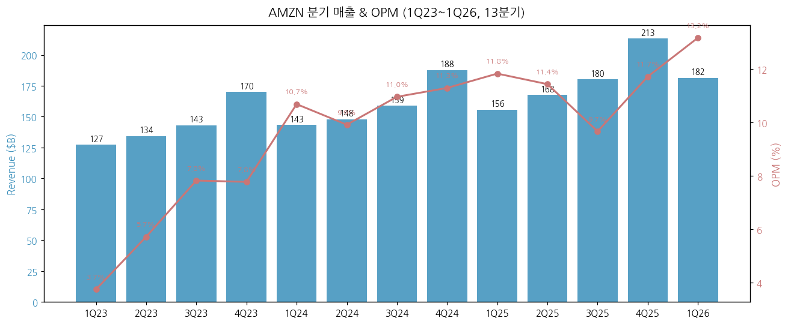

| 분기 | 매출($B) | OP($B) | OPM(%) | AWS($B) | AWS YoY% | AWS OPM(%) |
|-----|---------|-------|--------|---------|----------|-----------|
| 1Q23 | 127.36 | 4.77 | 3.7 | 21.35 | 16 | 24.0 |
| 2Q23 | 134.38 | 7.68 | 5.7 | 22.14 | 12 | 24.2 |
| 3Q23 | 143.08 | 11.19 | 7.8 | 23.06 | 12 | 30.3 |
| 4Q23 | 169.96 | 13.21 | 7.8 | 24.20 | 13 | 29.6 |
| 1Q24 | 143.31 | 15.31 | 10.7 | 25.04 | 17 | 37.6 |
| 2Q24 | 147.98 | 14.67 | 9.9 | 26.28 | 19 | 35.5 |
| 3Q24 | 158.88 | 17.41 | 11.0 | 27.45 | 19 | 38.1 |
| 4Q24 | 187.79 | 21.20 | 11.3 | 28.79 | 19 | **36.9** |
| 1Q25 | 155.67 | 18.41 | 11.8 | 29.27 | 17 | **39.5** |
| 2Q25 | 167.70 | 19.17 | 11.4 | 30.87 | 18 | **32.9** |
| 3Q25 | 180.17 | 17.42 | 9.7 | 33.01 | 20 | **34.6** |
| 4Q25 | 213.39 | 24.98 | 11.7 | 35.58 | 24 | **35.0** |
| **1Q26** | **181.52** | **23.85** | **13.1** | **37.59** | **28** | **37.7** |

→ (출처: Amazon IR Earnings Release Supplemental Financial Information Q4 2023 ~ Q1 2026)

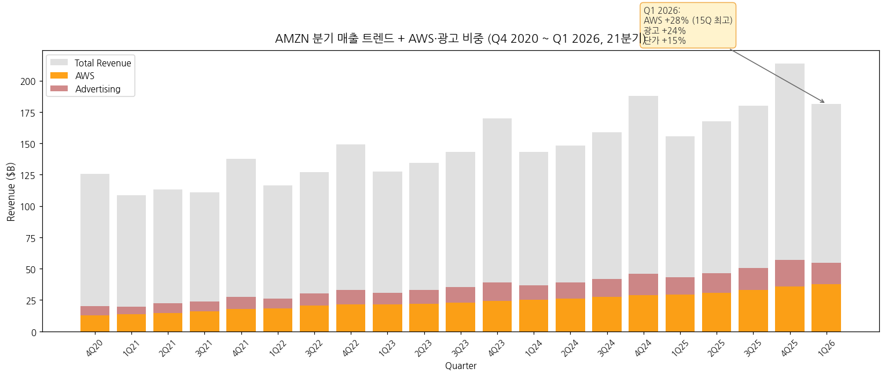

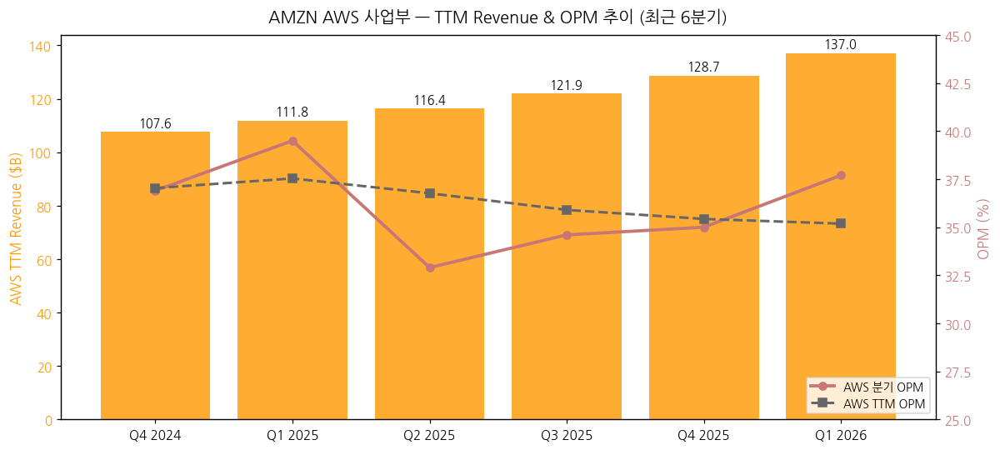

#### TTM 핵심 지표 (Q1 2026 기준, IR Supplemental)

| 지표 | Q1 2026 TTM | Q1 2025 TTM | YoY 변화 |
|------|------------|------------|---------|
| WW Net Sales TTM | **$742.78B** | $650.31B | +14% |
| Operating Income TTM | **$85.42B** | $71.69B | +19% |
| Operating Margin TTM | **11.5%** | 11.0% | +0.5%p |
| Net Income TTM | **$90.80B** | $65.94B | +38% |
| Diluted EPS TTM | **$8.37** | $6.13 | +36% |
| Operating Cash Flow TTM | **$148.53B** | $113.90B | +30% |
| CapEx TTM | **$147.30B** | $87.98B | +67% |
| Free Cash Flow TTM | **$1.23B** | $25.93B | **-95%** |
| AWS TTM Revenue | **$137.05B** | $111.79B | +23% |
| AWS TTM OPM | **35.2%** | 37.5% | -2.3%p |
| 임직원 (FT+PT) | 1,575,000 | 1,560,000 | +1% |
| WW paid units YoY | **+15%** (Q1) | +8% | COVID 종료 이후 최고 |
| 3P seller 비중 (WW units) | 60% | 61% | -1%p |

→ (출처: Amazon Q1 2026 IR Earnings Release, Supplemental Financial Information page 11-12)

→ (1-4) AWS YoY 가속 패턴: 2024년 19% 박스 → 2025년 17→24% 가속 → 2026 Q1 **28%** (15분기 최고). AI 인프라 수요 (Anthropic, 자체 Bedrock, Trainium 워크로드) 본격 monetization 시작.

→ (1-5) Q1 2026 OPM 13.2%는 분기 사상 최고 — Amazon Leo (위성 broadband) $1B 추가 비용 부담에도 record margin 달성.

### ②-A 제품·서비스 카테고리별 매출 분해 (IR Supplemental, 11년 장기 시계열)

Amazon은 SEC 10-K에서 3개 reportable segment만 보고하지만, IR Earnings Release의 Supplemental Financial Information에서는 **7개 product 카테고리**로 정밀 분해 공시. 이게 segment보다 비즈니스 본질을 더 잘 드러낸다. 본 리포트는 v1.2에서 **2015~2025 11년 연간 + Q3 2017~Q1 2026 35분기 시계열**로 확장.

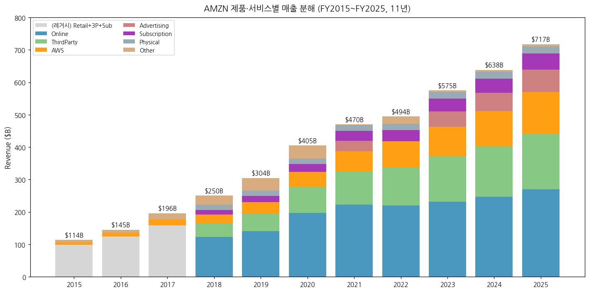

#### 연간 11년 시계열 ($B, IR Supplemental Financial Information 기준)

| FY | Online | Physical | 3P seller | Advertising | Subscription | AWS | Other / 레거시 | Total |
|----|--------|----------|-----------|-------------|--------------|-----|---------------|-------|
| 2015 | — | — | — | (Adv 분리 전) | — | 7.88 | 99.13 (전체 retail+3P+sub 합산) | 107.01 |
| 2016 | — | — | — | — | — | 12.22 | 123.77 | 135.99 |
| 2017 | (양식 전환) | — | — | — | — | 17.46 | 158.61 | 176.07† |
| 2018 | 122.99 | 17.22 | 42.74 | (Adv는 Other 내포) | 14.17 | 25.66 | 27.67 | 250.45‡ |
| 2019 | 141.25 | 17.19 | 53.76 | (Other 내) | 19.21 | 35.03 | 37.95 | 304.39 |
| 2020 | 197.35 | 16.22 | 80.44 | (Other 내) | 25.21 | 45.37 | 40.25 | 404.84 |
| 2021 | 222.07 | 17.07 | 103.37 | **31.16**(첫 분리 공시 4Q21) | 31.77 | 62.20 | 2.18 | 469.82 |
| 2022* | 220.00 | 18.96 | 117.72 | ~37.74E | 35.22 | 80.10 | ~4.27 | 513.98 |
| 2023 | 231.87 | 20.03 | 140.05 | 46.91 | 40.21 | 90.76 | 4.96 | 574.79 |
| 2024 | 247.03 | 21.21 | 156.15 | 56.21 | 44.37 | 107.56 | 5.42 | 637.96 |
| **2025** | **269.29** | **22.56** | **172.16** | **68.64** | **49.62** | **128.72** | **5.93** | **716.92** |

\* 2022 Q2 IR PDF URL 404 (`s2.q4cdn.com` 패턴 변경) — SEC 8-K Exhibit 99.1로 대체 수집, 일부 product 카테고리 매핑 추정.
† 2017 양식 전환기 (Q3 2017부터 신 카테고리 시행, Q1-Q2 2017은 Retail products + Other 양식).
‡ 2018부터 신 양식 6 카테고리 안정화. Advertising은 Q4 2021까지 "Other" 라인에 포함되어 별도 분리 안 됨.

→ (출처: Amazon IR Earnings Release Supplemental Financial Information **47개 분기 release** Q4 2014~Q1 2026)

#### 분기 시계열 stacked chart (35분기, Q3 2017~Q1 2026)

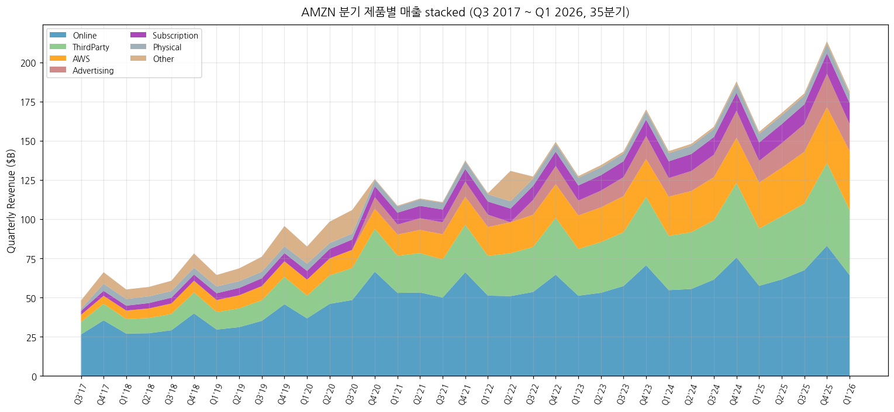

→ Q4 holiday spike 패턴 명확 (2017~2025 모든 4분기에 매출 점프). Q4 2025 $213B = Amazon 분기 사상 최대 매출.

#### AWS 분기 매출 장기 시계열 (Q1 2015~Q1 2026, 45분기)

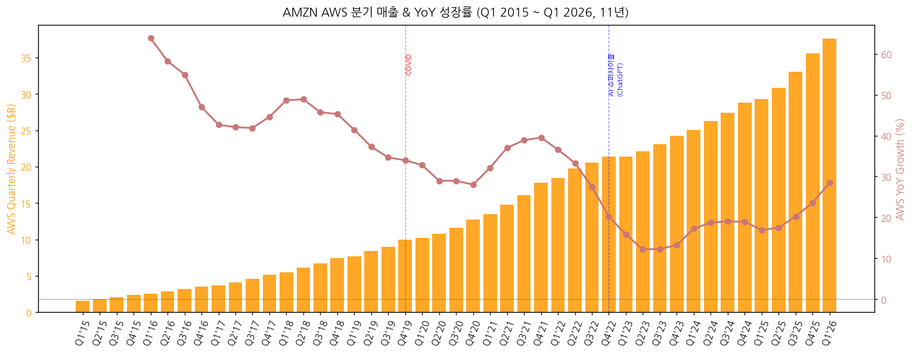

| 사이클 단계 | 기간 | AWS YoY 평균 | 핵심 driver |
|------------|------|-------------|-----------|
| 초기 가속 | 2015~2017 | +47% | EC2/S3 대중화, enterprise migration |
| 안정기 | 2018~2020 | +33% | Lambda, ML services 출시 |
| COVID 폭증 | 2020~2021 | +37% | 디지털 전환 가속 |
| 둔화기 | 2022~2023 H1 | +20% → +12% | enterprise cost optimization |
| AI 재가속 | 2023 H2~2026 Q1 | +13% → +28% | Bedrock, Trainium, OpenAI/Anthropic 계약 |

→ Q1 2026 +28% = **15분기 최고 가속**. Trainium2 GA 이후 AI 워크로드 monetization 본격화.

#### 고성장 서비스 트래커

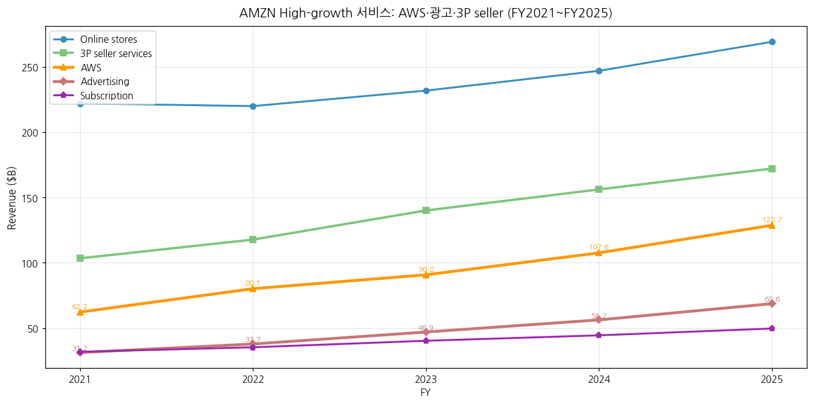

**Advertising services** (5년간 +120%, FY2021 $31.2B → FY2025 $68.6B, CAGR 22%):
- Q1 2026 단독 $17.2B (+24% YoY), TTM **$73B+**
- CEO 코멘트 (Q1 2026): "Advertising grew to over $70 billion in TTM revenue"
- High-margin 영역 — NA segment OP swing factor

**AWS** (5년간 +107%, FY2021 $62.2B → FY2025 $128.7B, CAGR 16%):
- 2025년 +20% YoY → 2026 Q1 +28% **(15분기 최고 가속)**
- Custom silicon 비즈니스 (Graviton + Trainium + Nitro): **$20B+ annualized run rate**, triple-digit YoY growth (Q1 2026 disclosure)
- 2.1M+ AI 칩 출하 (TTM Q1 2026 기준)

**3P seller services** (5년간 +66%, $103.4B → $172.2B):
- WW seller mix 60% (Q1 2026)
- High-margin 수수료 비즈니스

**Subscription services** (5년간 +56%, $31.8B → $49.6B):
- Prime 회원 200M+, $139/년 (US)
- 안정적 +10~12% YoY 성장 박스권

### ② 사업부별 개요 (매출 비중 큰 순서)

#### (2-1) North America (FY2025 매출 $426.3B, 비중 59%)

- 미국·캐나다·멕시코 e-commerce 및 fulfillment 운영
- Online Stores (1P 직판), Third-party seller services (3P 수수료), Subscription services (Prime 회비), Physical Stores (Whole Foods, Amazon Fresh, Amazon Go)
- OPM 2025년 **6.9%** — 7년 만에 최고치

#### (2-2) AWS (FY2025 매출 $128.7B, 비중 18%, OP 비중 57%)

- 글로벌 클라우드 시장 점유율 1위 (~30%, vs Azure ~22%, GCP ~12%)
- 핵심 제품: EC2 (compute), S3 (storage), RDS (database), SageMaker (ML), Bedrock (AI 모델 marketplace), Trainium/Inferentia (자체 AI 칩)
- OPM 2025년 **35.4%** — 자체 칩 + 가격 결정력 + 규모 경제

#### (2-3) International (FY2025 매출 $161.9B, 비중 23%)

- 영국·독일·일본·인도·기타 신흥국 e-commerce
- 환율 영향 큼 (2025년 FX +$4.9B 매출 기여, +$903M OP 기여)
- OPM 2025년 **+2.9%** — 2022년 -6.6% 적자에서 정상화

### ③ 사업부별 디테일

#### (3-1) AWS — Top-seller / Growth

- **AWS Top services (매출 추정 기준)**:
  - EC2 (compute, ~35%)
  - S3 + Storage (~15%)
  - RDS/DynamoDB/Aurora (~12%)
  - 기타 (SageMaker, Bedrock, Lambda, CloudFront 등 ~38%)
- **AI 워크로드 비중**: 회사 공식 disclosure 없으나, Trainium2 GA 이후 AI 관련 매출 기여 가속.
- **Custom silicon 비즈니스** (Q1 2026 IR 신규 공시):
  - Graviton (ARM 기반 범용 CPU) + Trainium (AI 학습) + Nitro (네트워킹) 합산
  - **$20B+ annualized revenue run rate** (Q1 2026 도달)
  - **Triple-digit YoY growth** (100%+)
  - 지난 12개월간 **2.1M+ AI 칩 출하**, 그중 절반 이상이 Trainium
- **AI 슈퍼딜 (Q1 2026 발표)**:
  - **OpenAI**: ~2GW Trainium 컴퓨트 commitment (2027년부터 ramp-up)
  - **Anthropic**: up to 5GW Trainium (다년간 multi-year)
  - 이로써 OpenAI도 AWS 인프라 활용 시작 (기존 Microsoft Azure에서 멀티 클라우드 전환)
- **CapEx 배분**: 2025년 전사 CapEx $128.3B 중 추정 75% (~$96B) AWS 인프라 (서버·데이터센터·네트워크). Q1 2026 단독 CapEx $44.2B → 연간 환산 $176B+ 추정.

#### (3-2) North America — Top-seller / Growth

- **Online Stores (1P)**: 매출 비중 50%대, 성장률 +6% YoY 2025 (성숙기)
- **Third-party seller (3P) services**: 매출 비중 25%대, 성장률 +10~12% YoY, 마진 매우 높음
- **Advertising services**: 매출 비중 ~15%대로 상승, **2025년 +21% YoY**, 회사 OP의 큰 swing factor
- **Subscription services (Prime)**: Prime 회원 200M+ global, $139/년 (US)
- **Physical Stores**: 매출 비중 ~5%대, Whole Foods + Amazon Fresh

#### (3-3) International — 이익 outlier

- 2024~2025년 흑자 전환은 매출 성장보다 비용 효율화가 핵심 driver
- Q1 2026 +19% YoY 매출 성장 (북미 +12%보다 빠름) — 환율 효과 + 신흥국 침투

### ④ 주요 경쟁사

| 사업부 | 경쟁사 |
|--------|---------|
| AWS (Cloud) | Microsoft Azure, Google Cloud (GCP), Oracle Cloud, Alibaba Cloud |
| e-commerce 미국 | Walmart, Target, Costco, Shopify (3P), Temu, Shein |
| e-commerce 글로벌 | Alibaba (중국), MercadoLibre (LatAm), JD.com, Flipkart (인도) |
| Advertising | Google, Meta, ByteDance/TikTok |
| Streaming | Netflix, Disney+, Apple TV+, YouTube |
| Grocery | Walmart, Kroger, Albertsons |
| AI Foundation Models | OpenAI, Anthropic (이중 관계 — 투자자 겸 컴퓨트 공급자), Google DeepMind |

### ⑤ 주요 매출처

- AMZN은 분산형 retail/cloud 비즈니스라 단일 고객 의존도 매우 낮음. SEC disclosure에 10% 이상 단일 고객 없음
- AWS 측면 주요 enterprise 고객 (공시 기준): Anthropic (multi-year compute commitment), Netflix, Capital One, JPMorgan Chase, Stripe, Snap, Pinterest
- 3P seller GMV 비중: 전체 GMV의 약 60% (1P 직판 40%)

### ⑥ 생산 CAPA + 임직원 추이

- **데이터센터**: 36개 지역, 108개 가용 영역(AZ) 글로벌 (2025년말)
- **Fulfillment Center**: 1,000+ 개 시설, 미국 내 ~250개 large FC
- **임직원**: 1.56M (2025년말, full-time + part-time 합산. 2024년말 1.55M)
- **임직원 추이**: 2014년 154K → 2020년 1.30M → 2022년 1.54M → 2025년 1.56M (peak 2022 후 안정화)

---

## 4. 재무 구조 (12년 시계열)

### ① 손익계산서

| FY | 매출($B) | GPM*(%) | OPM(%) | NPM(%) |
|----|---------|---------|--------|--------|
| 2014 | 88.99 | 29.5 | 0.2 | (0.3) |
| 2015 | 107.01 | 33.0 | 2.1 | 0.6 |
| 2016 | 135.99 | 35.1 | 3.1 | 1.7 |
| 2017 | 177.87 | 37.1 | 2.3 | 1.7 |
| 2018 | 232.89 | 40.2 | 5.3 | 4.3 |
| 2019 | 280.52 | 41.0 | 5.2 | 4.1 |
| 2020 | 386.06 | 39.6 | 5.9 | 5.5 |
| 2021 | 469.82 | 42.0 | 5.3 | 7.1 |
| 2022 | 513.98 | 43.8 | 2.4 | (0.5) |
| 2023 | 574.79 | 46.7 | 6.4 | 5.3 |
| 2024 | 637.96 | 48.9 | 10.8 | 9.3 |
| **2025** | **716.92** | **50.3** | **11.2** | **10.8** |

\* GPM ≈ (매출 - Cost of sales) / 매출. Amazon은 GPM 직접 보고하지 않음 (다양한 서비스 비즈니스 때문). 추정치.

→ (출처: Amazon 10-K FY2014~FY2025, SEC EDGAR. Cost of sales 비중 = 2024년 51.1% → 2025년 49.7%)

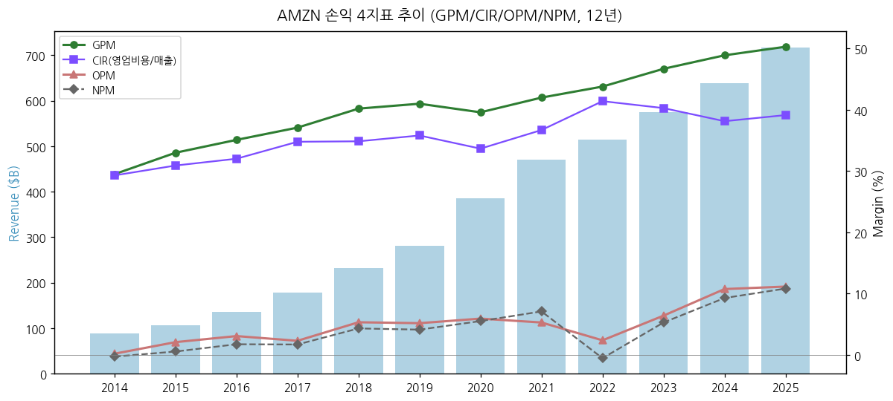

### ② 재무상태표

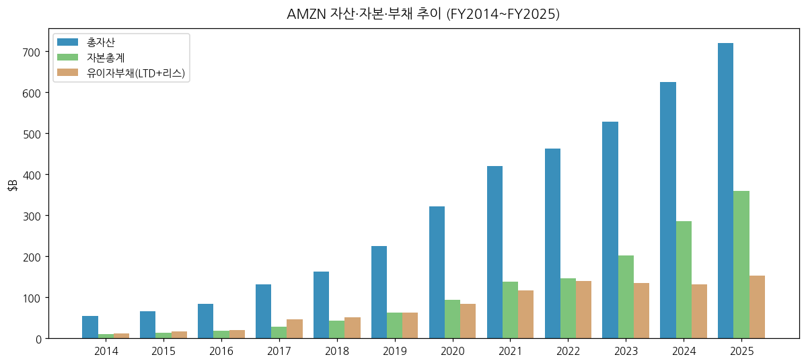

| FY | 총자산($B) | 자본총계($B) | 유이자부채*($B) | 부채비율(%) |
|----|----------|------------|--------------|------------|
| 2014 | 54.50 | 10.74 | 12.50 | 116 |
| 2017 | 131.31 | 27.71 | 45.72 | 165 |
| 2020 | 321.20 | 93.40 | 84.39 | 90 |
| 2023 | 527.85 | 201.88 | 135.61 | 67 |
| 2024 | 624.89 | 285.97 | 130.93 | 46 |
| **2025** | **720.20** | **359.39** | **152.93** | **43** |

\* 유이자부채 = Long-term debt + Long-term lease liabilities. FY2025 기준 LTD $65.6B + Lease $87.3B.

→ (출처: Amazon 10-K FY2014~FY2025, Balance Sheet)

→ 부채비율은 2017년 165% 정점 (Whole Foods 인수 자금조달)에서 2025년 43%까지 지속적 하락. 자본축적이 부채증가보다 빠른 페이스.

### ③ 현금흐름표

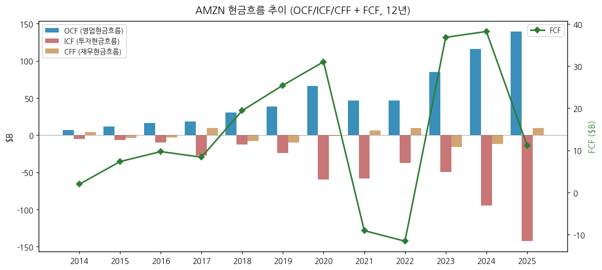

| FY | OCF($B) | ICF($B) | CFF($B) | FCF($B) |
|----|---------|---------|---------|---------|
| 2014 | 6.84 | (5.07) | 4.43 | 1.95 |
| 2017 | 18.43 | (27.08) | 9.93 | 8.37 |
| 2020 | 66.06 | (59.61) | (1.10) | 31.02 |
| 2022 | 46.75 | (37.60) | 9.72 | (11.57) |
| 2024 | 115.88 | (94.34) | (11.81) | 38.22 |
| **2025** | **139.51** | **(142.55)** | **9.66** | **11.19** |

→ (출처: Amazon 10-K, Consolidated Cash Flow Statements)

→ 2025년 FCF $11.19B는 2024년 $38.22B 대비 -71% 급감. 원인: CapEx $128.3B (+65% YoY). AI 인프라 슈퍼사이클 진입.

### ④ CapEx + 사이클 annotation

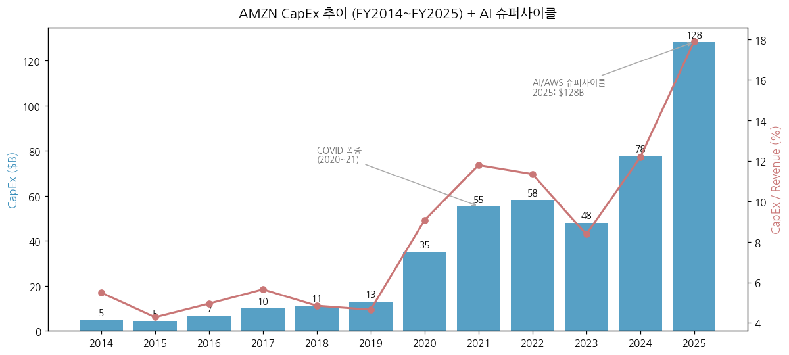

| FY | CapEx($B) | CapEx/Rev(%) | 비고 |
|----|----------|--------------|------|
| 2014 | 4.89 | 5.5 | Pre-AWS scale |
| 2017 | 10.06 | 5.7 | Whole Foods 인수 직전 |
| 2020 | 35.04 | 9.1 | COVID 폭증 |
| 2021 | 55.40 | 11.8 | COVID 후속 |
| 2022 | 58.32 | 11.3 | Cycle peak |
| 2023 | 48.13 | 8.4 | 일시 둔화 |
| 2024 | 77.66 | 12.2 | AI 인프라 시작 |
| **2025** | **128.32** | **17.9** | **AI 슈퍼사이클 본격화** |
| 2026E | 175~200E | ~25E | 회사 공식 가이던스 없음, 시장 추정 |

→ (출처: Amazon 10-K Free Cash Flow Reconciliation)

→ FY25 CapEx $128.3B 중 추정 ~$96B (75%)는 AWS 인프라 (서버·네트워크·데이터센터). 나머지 ~$32B는 fulfillment + Project Kuiper(위성).

### ⑤ 부채구조 + 채무증권 발행 history

- **Long-term debt** (FY2025): $65.6B (2024 $52.6B 대비 +25%, 2025년 $25B 신규 발행)
- **Long-term lease liabilities**: $87.3B (FY2024 $78.3B → FY2025 $87.3B)
- **신용등급**: S&P AA (Aug 2024 기준), Moody's A1
- **주요 채권 시리즈**: 다양한 만기 (2026~2061), 평균 쿠폰 ~3.5% (저금리기 발행 다수)
- **2025년 $25B 신규 발행**: AWS CapEx 자금조달 목적
- **Q1 2026 단독 $53.4B 신규 장기채 발행** — IR Cash Flow Statement disclosed. AI 인프라 슈퍼사이클 자금조달. 이로써 현금 보유액 $104.7B 도달 ($69.9B → $104.7B in Q1 2026)
- **TTM Q1 2026 장기채 발행액 $68.4B** (vs 이전 TTM $0.7B) — 회사 역사상 최대 규모 채권 발행

### ⑥ 배당·자사주

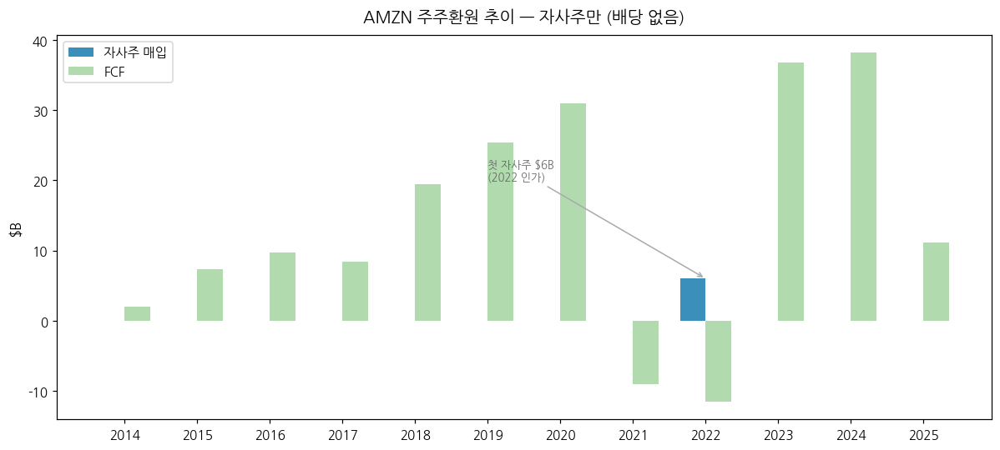

- **배당**: **현재까지 무배당** (1997 IPO 이래 한 번도 지급한 적 없음)
- **자사주 매입**:
  - 2022년 $10B authorization (사상 첫 본격적 buyback program)
  - 2022년 $6B 매입 실시
  - 2023년 이후 매입 없음 (CapEx 우선)
  - 2025년말 잔여 $4B authorization
- **20:1 액면분할** (2024.02.09): 주가 접근성 개선 목적, valuation에는 영향 없음
- **EPS 희석**: 2024년 11.26B → 2025년 10.83B 주식 (-3.8% YoY, SBC 발행 vs vest 차이)
- **Stock-based awards outstanding** (IR Q1 2026 신규 공시): Q4 2024 283M → Q1 2026 **195M** (-31%). Common share 비중도 2.7% → 1.8%로 dilution 압력 완화. SBC 비용 자체도 TTM 기준 감소 추세 (2024 ~$22B → 2025 ~$20B)

### ⑦ 재무비율 (FY2025 기준)

| 비율 | 값 | 비교 (FY2024) |
|------|-----|--------------|
| ROE | 26.8% | 24.0% |
| ROA | 11.5% | 10.3% |
| 부채비율(D/E) | 42.5% | 45.8% |
| 유동비율 | 1.07 | 1.06 |
| 이자보상배율 | 35.0x | 28.6x |
| EBITDA 마진 | ~22% | ~19% |

---

## 5. 지배 구조

### ① 그룹·계열 관계

- Amazon.com, Inc.는 single-parent 구조, holding company 아님
- 주요 자회사: Amazon Web Services Inc., Whole Foods Market Inc., MGM Holdings Inc., Twitch Interactive Inc., IMDb Inc., Zoox Inc. (autonomous vehicle)
- 핵심 전략 투자: **Anthropic** (누적 $8B, 2023년 $4B + 2024년 $4B, nonvoting preferred stock 형태). 2025년 평가이익 $15.2B 반영, 2026 Q1 추가 $16.8B.
- **Rivian Automotive** 지분 보유 (2021 IPO 후 mark-to-market 변동 반영. 2024년 net loss $-2.3B 인식)

### ② 주주 구분

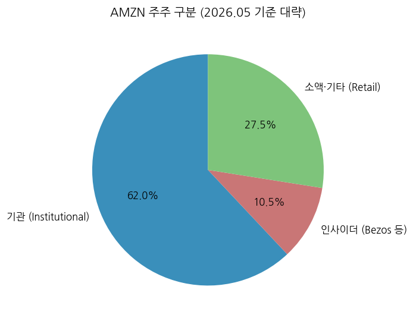

| 구분 | 비중(추정, 2026.05) |
|------|--------------------|
| 기관투자자 (Institutional) | ~62% |
| Insiders (Bezos 외 임원) | ~10.5% |
| 소액·기타 (Retail) | ~27.5% |

**5% 이상 주주 (2025 Proxy 기준 추정)**:

| 주주 | 지분 | 비고 |
|------|------|------|
| Jeffrey P. Bezos (Founder) | ~8.6% | 자선재단·Blue Origin 매도로 점진적 감소 |
| Vanguard Group | ~7.9% | 패시브 펀드 |
| BlackRock | ~6.5% | 패시브 펀드 |
| State Street | ~3.5% | 패시브 펀드 |

### ③ 임원·이사회

- **CEO/President**: Andy Jassy (2021.07~). AWS 출신, 1997년 Bezos technical assistant로 합류
- **Executive Chairman**: Jeff Bezos (창립자)
- **CFO**: Brian T. Olsavsky (2015~)
- **AWS CEO**: Matt Garman (2024.06~, Adam Selipsky 후임)
- **이사회 (Board)**: 11명 (2025년 기준), majority independent

**주요 이사 (2025 Proxy):**
- Jeff Bezos (Chair)
- Andy Jassy (CEO)
- Keith B. Alexander (전 NSA 국장)
- Edith W. Cooper (전 Goldman Sachs)
- Jamie S. Gorelick (전 미국 법무차관)
- Daniel P. Huttenlocher (MIT 컴퓨터과학)

---

## 6. 기타 팩트

### ① R&D 인프라

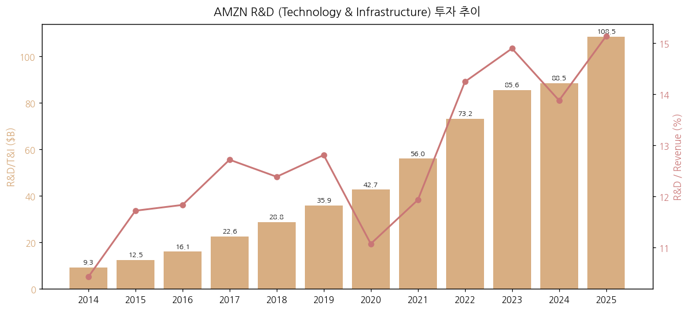

- **R&D Proxy**: Technology & Infrastructure 비용 (P&L 라인). 순수 R&D + AWS infrastructure operating cost 혼재
- **FY2025**: $108.5B (매출의 15.1%, 전세계 1위 R&D 지출. Alphabet $50B, Meta $43B 대비 압도적)
- **R&D 중심 영역**: AWS (Trainium/Inferentia 칩, Bedrock AI), Devices (Alexa, Kindle, Ring), Autonomous (Zoox), Pharmacy, Project Kuiper (위성)

### ② 진행 중 corporate action (10년)

| 연도 | 인수/매각 | 금액 |
|------|----------|------|
| 2014 | Twitch | $970M |
| 2017 | Whole Foods Market | $13.7B |
| 2018 | Ring (smart home) | $1.0B |
| 2018 | PillPack | $0.75B |
| 2021 | MGM Holdings | $8.45B |
| 2022 | One Medical | $3.9B |
| 2022 | iRobot 인수 시도 | $1.7B (2024 무산, EU 규제) |
| 2023 | Anthropic 1차 | $4.0B |
| 2024 | Anthropic 2차 | $4.0B (총 $8B) |

### ③ R&D 마일스톤 (10년)

| 연도 | 마일스톤 |
|------|---------|
| 2014 | Echo·Alexa 출시 |
| 2017 | AWS Lambda GA (서버리스 컴퓨팅) |
| 2018 | AWS Graviton 자체 칩 발표 (ARM 기반) |
| 2019 | AWS Outposts (온프레미스 클라우드) |
| 2020 | AWS Trainium 1세대 발표 (AI 학습 칩) |
| 2021 | Inferentia 2세대, Graviton 3 |
| 2022 | Bedrock 발표 (foundation model marketplace) |
| 2023 | Trainium2 발표, Anthropic 파트너십 |
| 2024 | Trainium2 GA, Olympus (자체 foundation model) |
| 2025 | Nova foundation model 시리즈 발표, Rufus AI shopping assistant |
| 2026 Q1 | Amazon Leo (위성 broadband) 본격 비용 발생 ($1B/년 추정) |

### ④ 주요 리스크

- **규제 리스크**:
  - FTC antitrust 소송 (2023.09 제소, 2025 Q3 $2.5B settlement)
  - EU Digital Markets Act 컴플라이언스
  - 라벨 노동조합 압력 (2022 Staten Island JFK8 첫 노조 결성)
- **AI 인프라 과잉투자 리스크**: CapEx $128B+ 의 ROI 불확실성
- **AWS 경쟁 격화**: Azure (AI 동맹 with OpenAI) 점유율 추격
- **광고 사이클**: 디지털 광고 시장 침체 시 high-margin 영역 위축
- **환율**: 매출의 23% International 비중 → FX 변동성
- **Anthropic 지분 valuation**: 2025년 +$15.2B / 2026 Q1 +$16.8B 평가이익은 일회성, market downturn 시 reversal 가능

### ⑤ ESG 등급

- **MSCI ESG**: BBB (2025년 기준)
- **Sustainalytics**: 27.4 (Medium Risk)
- **CDP Climate**: B
- **The Climate Pledge** (2019년 자체 발표): 2040년 net-zero, 2025년 100% 재생에너지 (목표 달성)
- **Workforce**: 노동조합 압력 + 부상률 이슈 등 governance·social 리스크

### ⑥ 인증·라이선스

- **AWS**: FedRAMP High, ISO 27001/27017/27018/9001, SOC 1/2/3, PCI DSS L1, HIPAA, GDPR, FISMA, IRAP
- **PCI Compliance**: 글로벌 e-commerce 결제
- **약품 라이선스**: Amazon Pharmacy 50개 주 면허

---

## Source Audit & 검증 가능 링크

### ✅ 확보 자료 (1차 출처)

- **SEC EDGAR 10-K**: 16개 (FY2010~FY2025) — `https://www.sec.gov/cgi-bin/browse-edgar?action=getcompany&CIK=0001018724&type=10-K`
- **SEC EDGAR 10-Q**: 46개 (1Q11~1Q26)
- **Yahoo Finance v8**: AMZN 월간 OHLC 2000-01~2025-05 (305 months)
- **Amazon IR Earnings Release 47개** (v1.2 확장):
  - **IR PDF 12개** (s2.q4cdn.com): Q4 2019, Q1 2020, Q1 2022, Q3-Q4 2023, Q1-Q4 2024, Q1-Q4 2025, Q1 2026
  - **SEC 8-K Exhibit 99.1 HTM 35개** (sec.gov): Q4 2014~Q3 2021 + 2022/2023 누락분 보강
  - 커버리지: **Q4 2014 ~ Q1 2026 (45분기, ~11.5년 연속)**
  - 추출 데이터: 7개 product 카테고리 매출 panel, TTM 지표, SBC 분해, 임직원, 매출 단위 성장률, AWS OPM 정확치 등 — 10-K/10-Q에는 없는 IR-only 데이터
- **SEC 8-K 149개** 전체 다운로드 (2010-2026)
- **Amazon 2023 Shareholder Letter PDF** (Andy Jassy)
- **Q1 2026 Earnings Release (8-K)**: https://www.sec.gov/Archives/edgar/data/0001018724/000101872426000012/amzn-20260331xex991.htm
- **Q4 2025 Earnings Release (8-K)**: https://www.sec.gov/Archives/edgar/data/0001018724/000101872426000002/amzn-20251231xex991.htm
- **Amazon IR PDF URL 패턴 (v1.2 정리)**:
  - 2018-2023: `https://s2.q4cdn.com/299287126/files/doc_financials/{YYYY}/q{1-4}/AMZN-Q{N}-{YYYY}-Earnings-Release.pdf`
  - 2024-2025: `https://s2.q4cdn.com/299287126/files/doc_financials/{YYYY}/q{N}/AMZN-Q{N}-{YYYY}-Earnings-Release.pdf`
  - 2026+: `https://s2.q4cdn.com/299287126/files/doc_earnings/{YYYY}/q{N}/earnings-result/AMZN-Q{N}-{YYYY}-Earnings-Release.pdf`
  - Fallback: SEC EDGAR 8-K Exhibit 99.1 (`amzn-{YYYYMMDD}xex991.htm`) — 동일 콘텐츠

### ❌ 누락 자료 / ⚠️ 추정치

- **2014 AWS segment 분리 데이터**: AWS는 2015 Q1부터 단독 reportable segment로 분리. 2014년은 "Other" 라인에 합산 보고. 추정 $4.6B (시장 컨센서스).
- **GPM 시계열**: Amazon은 GPM/Gross Profit 직접 보고하지 않음 (이유: 서비스·상품·콘텐츠 매출 mix 다양). 본 리포트의 GPM은 (매출 - Cost of sales) / 매출 추정.
- **사업부별 CapEx 배분**: 회사 disclosure 없음. AWS 추정 75% (시장 컨센서스).
- **AWS 내부 service-level breakdown** (EC2 vs S3 vs SageMaker): 공시 없음, 시장 추정.
- **Project Kuiper(위성) 매출**: 아직 commercial revenue 없음 (cost 단계).

### 🔗 핵심 검증 URL

- Amazon IR (Investor Relations): https://ir.aboutamazon.com/
- Annual Reports: https://ir.aboutamazon.com/annual-reports-proxies-and-shareholder-letters/
- Quarterly Results: https://ir.aboutamazon.com/quarterly-results/
- SEC EDGAR (Amazon): https://www.sec.gov/cgi-bin/browse-edgar?action=getcompany&CIK=0001018724
- Q1 2026 Earnings Webcast: https://ir.aboutamazon.com/events/event-details/2026/Q1-2026-Amazoncom-Inc-Earnings-Conference-Call-/

---

## Version Log

**v1.0 (2026-05-19 초안)**:
- 최초 작성. 12년 연간 (FY2014~FY2025) + 13분기 (1Q23~1Q26) 시계열 반영
- SEC EDGAR 16개 10-K + 46개 10-Q + Yahoo Finance v8 305 monthly 데이터 기반
- 14종 차트 임베드 (chart1, chart1b, chart2_AWS/NA/Intl, chart4-12)

**v1.2 (2026-05-19 갱신, IR 장기 시계열 보강)**:
- BT 피드백: v1.1의 IR 자료가 단기 (2022 이후 위주, ~5년)였음. 장기 시계열로 확장.
- **추가 작업**:
  - SEC 8-K 149개 batch 다운로드 (Item 2.02 = earnings release 식별)
  - SEC 8-K Exhibit 99.1 HTM 35개 다운로드 (Q4 2014~Q3 2021 + 누락 분기)
  - IR PDF 추가 다운로드 (Q4 2019, Q1 2020)
  - **총 47개 IR earnings release** 확보 → **45분기 연속 시계열 (~11.5년)**
- **추가 데이터**:
  - 11년 연간 product breakdown (2015~2025) — 양식 변경 매핑 명시
  - 35분기 stacked chart (Q3 2017~Q1 2026) — Q4 holiday spike + AWS 가속 시각화
  - AWS 분기 매출 45분기 + YoY% (Q1 2015~Q1 2026)
  - 사이클 단계별 AWS 성장률 분석 (초기/안정/COVID/둔화/AI 재가속)
- 신규 차트 3개 추가 (chart3 11년 연간 stack, chart14 35분기 stack, chart15 AWS 45분기 장기)

**v1.1 (2026-05-19 갱신, IR 자료 보강)**:
- BT 요청으로 **Amazon IR Earnings Release PDF 12개 추가 다운로드·parse**
- 추가 데이터 통합:
  - 7개 product 카테고리별 매출 시계열 (Online stores / Physical / 3P seller / Advertising / Subscription / AWS / Other) — IR Supplemental Financial Information page (4Q20~1Q26, 21분기)
  - AWS 분기 OPM 정확치 (24.0% ~ 39.5% 변동) + AWS TTM OPM 추이 (37.0% → 35.2%)
  - Q1 2026 TTM 8개 지표 (Revenue/OP/NI/CashFlow/CapEx/FCF/EPS/AWS 등)
  - **Custom silicon (Trainium/Graviton/Nitro) $20B+ annualized run rate** — IR-only 신규 공시
  - **OpenAI 2GW Trainium commitment + Anthropic 5GW** — Q1 2026 어닝 발표
  - 2.1M+ AI 칩 출하 (TTM)
  - WW paid units +15% (COVID 이후 최고)
  - Q1 2026 $53.4B 장기채 발행 (현금 $104.7B 도달)
  - Stock-based awards 추이 (283M → 195M, dilution 압력 완화)
  - Project Hail Mary $615M 박스오피스
  - Amazon Leo (위성) Delta Airlines 계약
- 신규 차트 4개 추가 (chart3 제품별 매출, chart3b 고성장 서비스, chart10b 분기 시계열 확장, chart13 AWS TTM)
- 잔여 보완 후보 (v1.2): (1) 2022 Q2 product breakdown 추정치 정밀화, (2) AWS sub-services revenue mix 정량화, (3) Anthropic 추가 라운드 진행 시 분석 갱신
