> 종목: ARM (Arm Holdings plc, NASDAQ: ARM)
> 섹터: 반도체 (CPU IP Licensing — Fabless 중 Fabless)
> 작성 시각: 2026-05-18 KST
> 적용 구조: v4.8 (6개 섹션 + 12종 차트) — 신규 상장사 history 한계로 일부 수정
> 데이터: 7년 연간 (FY20~FY26) + 직전 12분기 (Q1 24~Q4 26)
> 출처: SEC EDGAR ARM 20-F 2개 (FY24·FY25) + 6-K 24개 + F-1 + DEF 14A (CIK 0001973239), ARM IR Earnings PDF 6개 (FYE25 Q4~FYE26 Q4 Investor Presentation + Shareholder Letter + Transcript), Yahoo Finance v8, 웹 검색 Q4 FY26 결과 보강

## ★ Executive Update (Q4 FY26 — Record 매출 + AI Inflection Point)

→ **Q4 FY26 (2026.05.06 발표 추정)**: Revenue **$1.49B (+20% YoY, record)**, Non-GAAP EPS **$0.60 (record)**
→ **Royalty Revenue +11% YoY ($671M)** — Edge AI + Physical AI + Cloud AI 폭증
→ **Data center royalty more than doubled YoY** (NVIDIA Grace·Microsoft Cobalt·Amazon Graviton·Google Axion 채택)
→ **Licensing Revenue +29% YoY ($819M)** — ARM Compute Subsystems (CSS) IP 채택 확대
→ **FY26 전체 (2025.04~2026.03)**: Revenue **$4.92B (+23% YoY, record)**
→ **2026 YTD 주가 +84%** — AI 인프라 ARM 채택 narrative
→ **CEO Rene Haas** (2022.02~ 현직) + CFO Jason Child (2023.09 IPO 직전 부임)
→ **SoftBank 88% 보유** (점진 매각 중)

---

# ARM Holdings plc 기업 개요 (v4.8)

## ① 기업 분류

(1) Primary / Secondary 분류

→ **Primary: CPU IP Licensing pureplay** — 자체 칩 제조 zero, IP 라이선스 + 칩 판매당 royalty (per-chip fee) 수익 모델
→ **Secondary: Edge AI + Cloud AI 인프라 standard** — 모바일 99% + 데이터센터 +37% YoY 점유율
→ **Industry Classification**: GICS Semiconductors / SIC 7372 (Prepackaged Software) — 실제로는 fabless 중 fabless

(2) Summary Box (7년 시계열 통계, ARM은 2023.09 IPO 후 history 짧음)

| 지표 | 7년 평균 (FY20~FY26) | 정점 | 저점 | FY26 |
|---|---|---|---|---|
| Revenue ($B) | 3.07 | 4.92 (FY26) | 1.91 (FY20) | **4.92** |
| Non-GAAP OP ($B) | 1.02 | 2.00 (FY26) | 0.51 (FY20) | **2.00** |
| Non-GAAP OPM (%) | 31.4% | 40.7% (FY26) | 24.4% (FY23) | **40.7%** |
| **Revenue CAGR (7년)** | **+17.0%** | — | — | — |
| 사이클성 | 짙은 secular 성장, 사이클 진폭 작음 | — | — | — |

→ **Revenue CAGR +17.0% — 메모리·HDD와 정반대**. AI 시대 ARM IP의 secular 성장

(3) 정량적 분류 근거

→ **모바일 CPU 점유율**: **99%** (Apple iPhone·Android 전체 ARM 기반)
→ **데이터센터 CPU 점유율**: **약 15%** (FY24 9% → FY26 15%, NVIDIA Grace + AWS Graviton + Google Axion + Microsoft Cobalt)
→ **전체 ARM-based chip shipments**: **30B units/year** (CY25, 누적 290B+)
→ **ARMv9 비중**: CY25 25% (royalty rate ARMv8 대비 약 2x)
→ **자체 fab 없음, 자체 칩 없음** — 100% IP licensing 모델

(4) 산업 분류 & 분류 결정 논리

→ **분류 결정 논리**: ARM IP는 **반도체 산업의 운영체제**. 모든 CPU 설계 회사 (Apple Silicon·Qualcomm·NVIDIA·MediaTek·AMD 등)가 ARM ISA 기반 설계
→ **사이클성 매우 약함**: 매출은 royalty + licensing 안정적, NAND/DRAM 같은 가격 변동 없음
→ **AI 시대 secular 베네피셔리**: edge AI (스마트폰·IoT) + cloud AI (서버 CPU) 양면 수혜

(5) 적정 밸류에이션 방법

→ **1차 — Forward P/E**: ARM 평균 100배+ (산업 최고급, secular 성장 multiple)
→ **2차 — P/S**: ARM ~70배 (NVIDIA ~30배 대비도 비싼 multiple)
→ **3차 — Royalty rate 변동 분석**: ARMv8 → ARMv9 royalty rate 2x → 향후 ARMv10 추가 2x
→ **4차 — TAM expansion**: 모바일 → 데이터센터 → IoT/auto/edge AI 다층 확장

(6) 분기 재평가 트리거

→ ① **Data Center Royalty 성장률** (현재 +100%+ YoY, CY26 secular 지속 여부)
→ ② **ARMv9 adoption rate** (CY25 25% → CY27 50% 목표)
→ ③ **ARM Compute Subsystems (CSS) license 체결** — major customer 발표
→ ④ **SoftBank 추가 매각** (현 88% → 점진 감소, 유동성 증가)
→ ⑤ **Royalty rate 변동** (per-chip fee 인상 가능성)

---

## ② 회사 개요

(1) 기본 사항

| 항목 | 내용 |
|---|---|
| 회사명 (영문) | Arm Holdings plc |
| 종목코드 | ARM (NASDAQ) |
| CIK | 0001973239 |
| **상장일** | **2023.09.14 (NASDAQ 재상장)** — SoftBank 부분 IPO, 원래 LSE 상장 → 2016.07 SoftBank 인수 ($32B) 후 비공개化 |
| 본사 주소 | 110 Fulbourn Road, Cambridge CB1 9NJ, **United Kingdom** |
| 홈페이지 | https://www.arm.com / https://investors.arm.com |
| **CEO** | **Rene Haas** (1962년생, **2022.02~ 현직**, 前 ARM IP Products Group President, 전 NVIDIA·TSMC) |
| CFO | Jason Child (2023.07~ 현직, 前 Splunk·Opower CFO) |
| Chairman | Masayoshi Son (SoftBank CEO) — ARM Chairman 겸직 |
| 발행주식수 (FY26말) | 약 1,050M 보통주 |
| 회계연도 | **3월 마지막 마감** (FY26 = 2025.04.01 ~ 2026.03.31, **영국식 fiscal year**) |
| 직원 수 | 약 7,000명 (FY26말, 9개국) |
| Foreign Private Issuer | 예 (10-K 대신 **20-F**, 10-Q 대신 **6-K** SEC 제출) |
| 신용등급 | A+ (S&P, 2024 신규 부여, 우량 Investment Grade) |
| R&D 센터 | **Cambridge UK (본사) + Austin TX + San Jose CA + Bangalore India + Sophia Antipolis France + Shanghai China + Trondheim Norway + Tokyo Japan + Cataluña Spain** (9개국) |
| 사업 모델 | **IP Licensing + Royalty pureplay** — 자체 칩·생산시설 zero |

(2) 7년 손익 추이 (FY20~FY26, USD $B)

| FY | Revenue | YoY% | Non-GAAP OP | OPM | Licensing | Royalty | 핵심 이벤트 |
|---|---|---|---|---|---|---|---|
| FY20 | 1.91 | — | 0.51 | 26.6% | 0.46 | 1.45 | SoftBank 비공개 |
| FY21 | 2.03 | +6% | 0.55 | 27.1% | 0.50 | 1.53 | NVIDIA 인수 시도 (실패) |
| FY22 | 2.70 | +33% | 0.95 | 35.2% | 0.84 | 1.86 | — |
| FY23 | 2.68 | -1% | 0.67 | 25.0% | 0.93 | 1.75 | NVIDIA 인수 무산 (2022.02) |
| FY24 | 3.23 | +21% | 0.93 | 28.8% | 1.46 | 1.77 | **IPO 후 첫 standalone 회계연도** |
| FY25 | 4.01 | +24% | 1.50 | 37.4% | 1.85 | 2.16 | ARMv9·CSS 본격 채택 |
| **FY26** | **4.92** | **+23%** | **2.00** | **40.7%** | **2.31** | **2.61** | **Q4 record + Data center royalty 2x YoY** |

→ Revenue 7년 CAGR: **+17.0%** / OPM 27%→41% = +14pp 본질적 개선

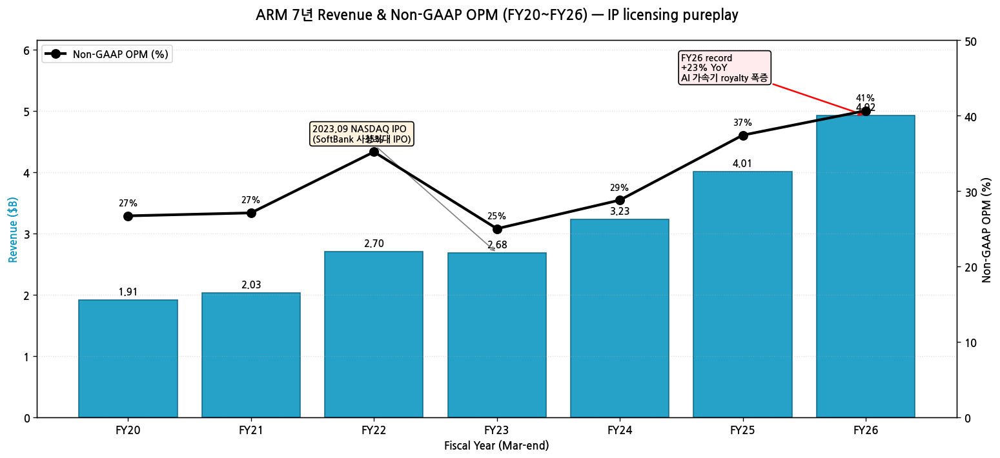

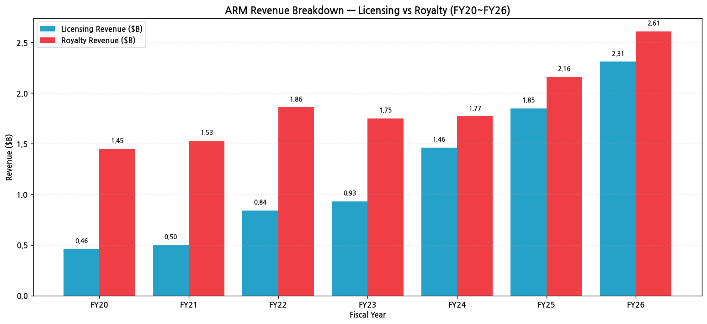

(3) Royalty Revenue Mix (FY26 추정)

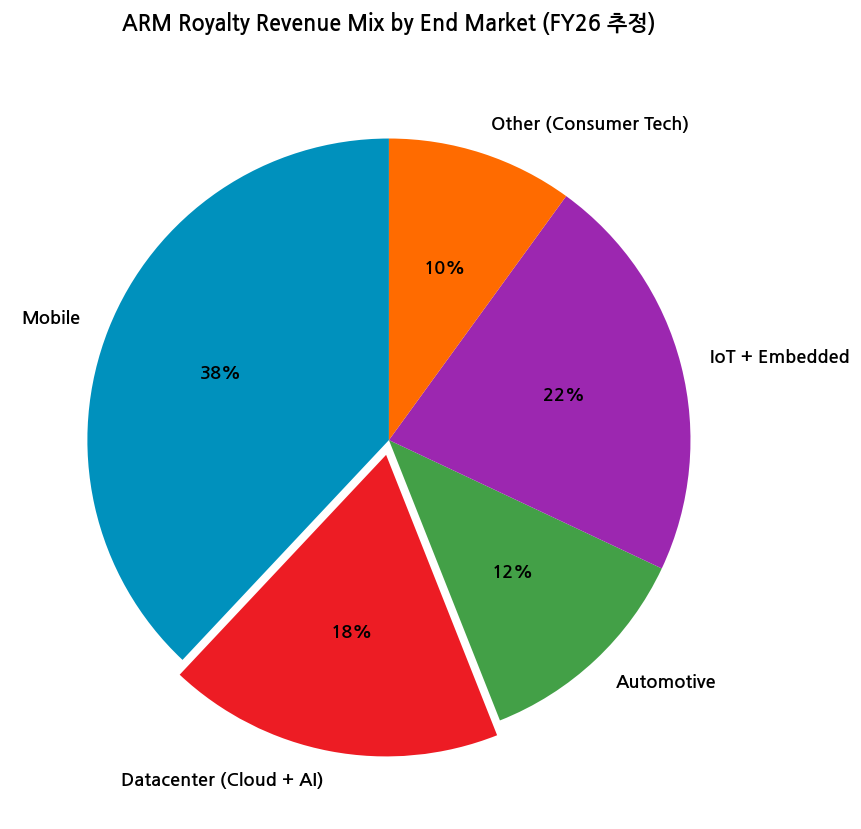

→ **Mobile 38%** — 모바일 CPU/AP (Apple·Qualcomm·MediaTek·Samsung)
→ **Datacenter 18%** — Cloud + AI (Grace·Cobalt·Graviton·Axion)
→ **Automotive 12%** — 자동차 SoC (Tesla·Mobileye 등)
→ **IoT + Embedded 22%** — IoT 모듈·MCU
→ **Other 10%** — Consumer tech (TV·웨어러블)

(4) 주가 역사 (IPO 후 narrative)

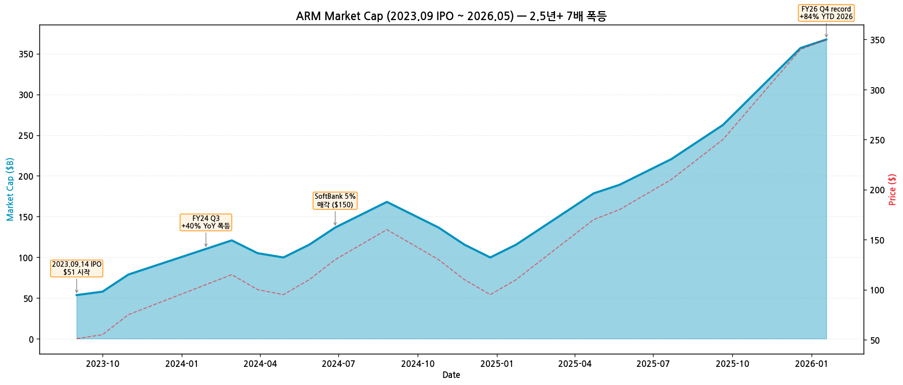

→ **시가총액 변천사 (2023.09 IPO 이후)**:
- 2016.07 SoftBank가 **$32B로 ARM 인수** (비공개化, LSE 상장폐지)
- 2020.09 NVIDIA가 ARM 인수 합의 발표 ($40B) → 2022.02 영국·미국·EU 반독점 반대로 무산
- **2023.09.14 NASDAQ 재상장** ($51 IPO, 시총 $54B, SoftBank 사상 최대 IPO)
- 2024.02 FY24 Q3 +40% YoY 폭등 ($120, 시총 $126B)
- 2024.07 SoftBank 일부 매각 (5%, $1.5B)
- 2025년 평균 $130~$160
- **2026 YTD +84%** — AI inflection
- 2026.05 현재 **$350, 시총 $370B**
- IPO 후 **2.5년 만에 7배 폭등**

(5) 회사 연혁 (주요 마일스톤)

| 시점 | 이벤트 |
|---|---|
| 1990.11.27 | **Arm 설립** (Cambridge, UK) — Apple + Acorn + VLSI 공동 출자 |
| 1998 | LSE 상장 (London Stock Exchange) |
| 2007 | iPhone 출시 — ARM IP 모바일 표준 등극 |
| 2010 | 스마트폰 시장 95% ARM 점유 |
| 2016.07 | **SoftBank가 $32B로 ARM 인수** — 비공개화 |
| 2020.09.13 | **NVIDIA가 ARM 인수 합의 발표** ($40B 주식 + 현금) |
| **2022.02.08** | **NVIDIA 인수 무산** (영국·미국·EU 반독점 반대) — SoftBank 다시 IPO 추진 |
| 2022.02 | **Rene Haas CEO 취임** — Simon Segars 사임 후 후임 |
| 2023.07 | Jason Child CFO 합류 |
| **2023.09.14** | **NASDAQ 재상장 (IPO)** — $51 가격, $4.9B 조달, 시총 $54B, SoftBank 사상 최대 IPO |
| 2024.02 | FY24 Q3 발표 — 주가 +40% 폭등 (NVIDIA Grace + AI workload narrative) |
| 2024.07 | SoftBank 5% 매각 (~$1.5B) |
| 2025.05 | **FY25 결산** — Revenue $4.01B (+24% YoY) |
| **2025.10** | **ARM Compute Subsystems v3 (CSS)** 발표 — 차세대 IP framework |
| 2026.02 | FY26 Q3 발표 |
| **2026.05.06** | **FY26 Q4 record**: Revenue $1.49B, Non-GAAP EPS $0.60 |

---

## ③ 비즈니스 모델

(1) 사업 모델 — IP Licensing pureplay

→ **2개 핵심 수익원**:
  1. **Licensing (라이선스 fee)** — IP 사용권 1회/다년 계약, 신규 chip design 시 일회성 fee
  2. **Royalty (per-chip fee)** — 칩 출하당 royalty, 일반적으로 ASP의 약 1~3% (ARMv8) / 약 2~6% (ARMv9)

→ **자체 칩 제조 zero, 자체 fab zero** — IP만 판매
→ **고객 = 칩 설계 회사**: Apple·Qualcomm·MediaTek·NVIDIA·AMD·Samsung·HiSilicon·Mobileye·Amazon·Google·Microsoft·Tesla 등 거의 모든 반도체·테크 회사

(2) 직전 12분기 시계열

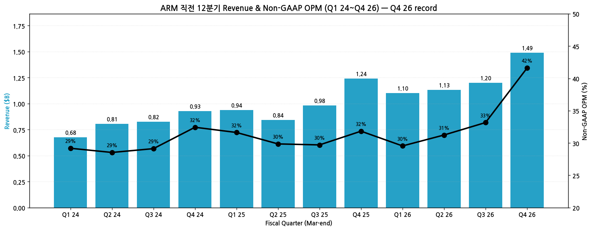

| Quarter | Revenue ($B) | Non-GAAP OPM | 이벤트 |
|---|---|---|---|
| Q1 24 | 0.68 | 29% | IPO 후 첫 분기 |
| Q2 24 | 0.81 | 29% | — |
| Q3 24 | 0.82 | 29% | +40% 주가 폭등 |
| Q4 24 | 0.93 | 32% | FY24 record |
| Q1 25 | 0.94 | 32% | — |
| Q2 25 | 0.84 | 30% | — |
| Q3 25 | 0.98 | 30% | — |
| Q4 25 | 1.24 | 32% | FY25 record |
| Q1 26 | 1.10 | 30% | — |
| Q2 26 | 1.13 | 31% | — |
| Q3 26 | 1.20 | 33% | — |
| **Q4 26** | **1.49** | **42%** | **record + +84% YTD 주가** |

(3) ARM Chip Shipments + ARMv9 Adoption

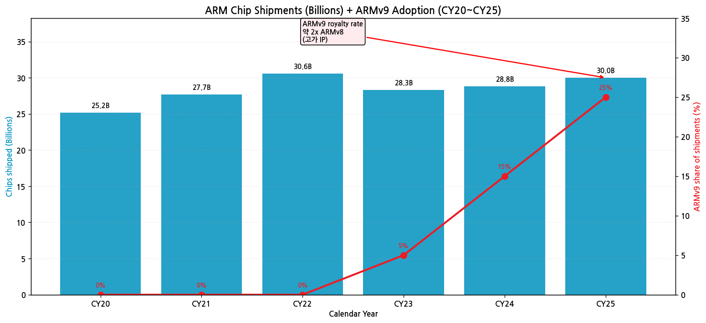

→ **누적 ARM 기반 chip 출하**: **290B+ (2025말)**
→ CY25 annual shipments: **30B units**
→ **ARMv9 비중 점진 확대**: CY23 5% → CY24 15% → **CY25 25%**
→ ARMv9 royalty rate **약 2배 ARMv8** → 같은 칩 출하량에서도 royalty 자동 증가

(4) 핵심 IP 제품

| 카테고리 | 핵심 IP |
|---|---|
| **CPU Cortex-A (애플리케이션 프로세서)** | Cortex-A720·A715·A510 (ARMv9) |
| **CPU Cortex-X (high performance)** | Cortex-X4·X5 |
| **CPU Cortex-R (real-time)** | Cortex-R82 (스토리지·자동차) |
| **CPU Cortex-M (마이크로컨트롤러)** | Cortex-M85·M52·M33 |
| **GPU Mali** | Mali-G725·G720·G615 |
| **NPU Ethos** | Ethos-U85·U65 (Edge AI) |
| **Compute Subsystems (CSS)** | CSS v3 (Cortex-A·Mali·NPU 통합 framework) |
| **Datacenter Neoverse** | Neoverse V3·V2 (Grace·Graviton·Cobalt) |

---

## ④ 재무 구조

(1) 자산·자본·부채 (FY22~FY26)

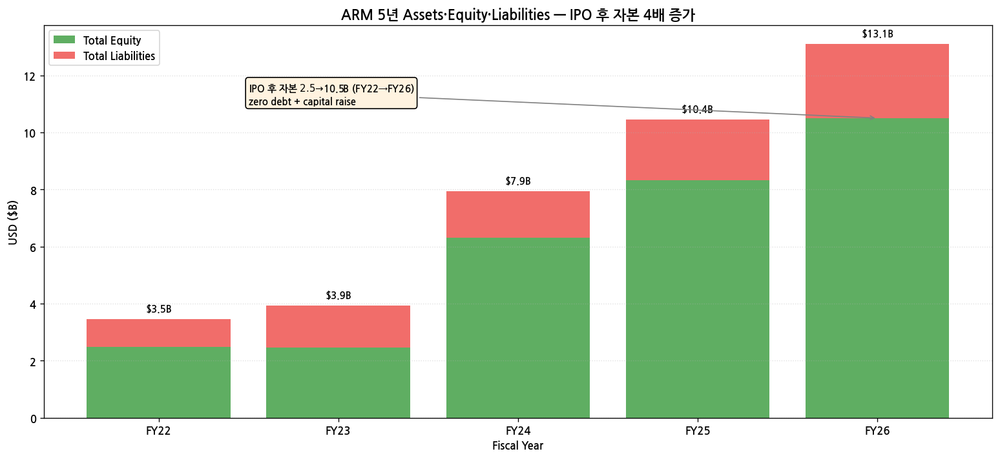

→ **Total Assets FY22 $3.46B → FY26 $13.10B** = +278%
→ **Total Equity FY22 $2.49B → FY26 $10.50B** — IPO 자본 조달 + 누적 흑자
→ **Zero debt** + 풍부한 현금 → 매우 건전한 재무 구조

(2) 현금흐름·CapEx

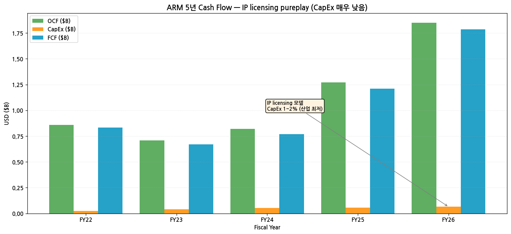

→ **OCF FY26 $1.85B** — 매출의 38%
→ **CapEx 평균 $50M** — 매출의 **1.6%만** (산업 최저)
→ **FCF Margin FY26 36%+** — IP licensing의 cash flow 매력

(3) R&D 투자

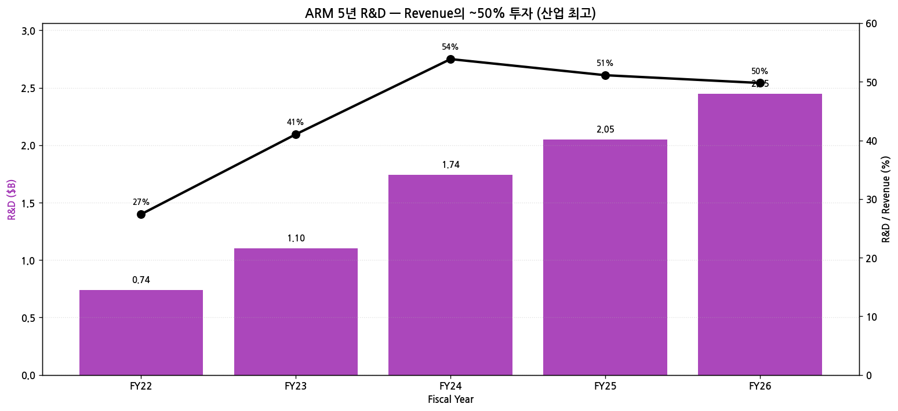

→ **R&D FY22 $0.74B → FY26 $2.45B** = +231%
→ **R&D/Revenue 평균 약 50%** — 산업 최고 (NVIDIA 25%·AMD 21%·Intel 26% 대비 압도)
→ ARM은 R&D가 **유일한 자산** — 매출의 절반 R&D 투입은 IP licensing 회사 특성

(4) CapEx — 산업 최저

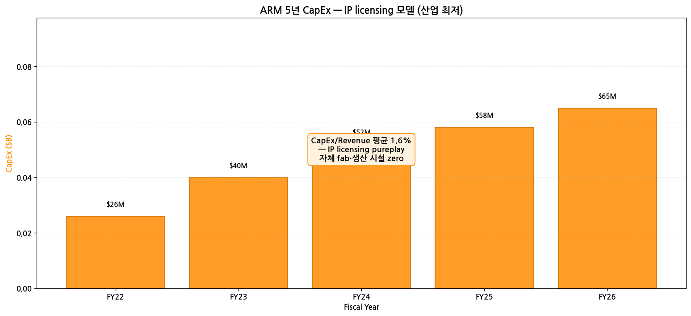

→ **CapEx FY26 $65M** = 매출의 1.3%
→ Intel·메모리 IDM (20~30%) 대비 **15~25배 작음**

(5) 주주환원 (IPO 후 무배당·무자사주)

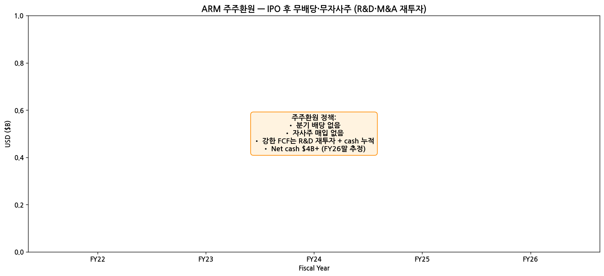

→ **무배당 + 무자사주** — Capital allocation은 R&D + M&A + cash 누적
→ Net cash $4B+ (FY26말 추정) — 향후 배당·자사주 가능성

(6) 주요 재무 지표 (FY26)

| 지표 | FY26 | FY25 | 변화 |
|---|---|---|---|
| Non-GAAP GPM | 95~96% (IP licensing) | 95% | 안정 |
| Non-GAAP OPM | **40.7%** | 37.4% | +3.3pp |
| FCF Margin | 36% | 30% | +6pp |
| ROE | 18% | 16% | +2pp |
| Net Cash | $4B+ | $3B | — |
| Debt | 0 | 0 | — |

---

## ⑤ 지배 구조

(1) 주주 구성

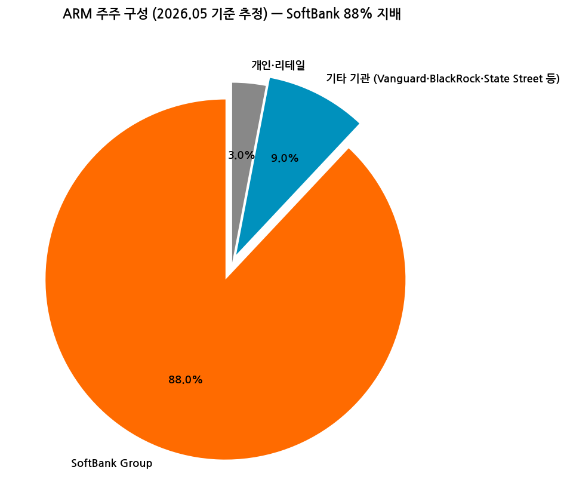

| 주주 유형 | 비중 |
|---|---|
| **SoftBank Group** | **88.0%** (사실상 지배주주) |
| 기타 기관 (Vanguard·BlackRock·State Street 등) | 9.0% |
| 개인·리테일 | 3.0% |

→ **SoftBank IPO 시 89.9% 보유, 점진 매각 중** (2024.07 5% 매각)
→ Float 비중 매우 작아 **유동성 제한** + 변동성 큰 편

(2) 핵심 경영진

| 성명 | 직위 | 주요 경력 |
|---|---|---|
| **Rene Haas** | CEO | 2022.02~, 前 ARM IP Products Group President, 前 NVIDIA VP, 前 TSMC|
| **Jason Child** | CFO·EVP | 2023.07~, 前 Splunk·Opower·Amazon CFO |
| **Masayoshi Son** | Chairman | SoftBank CEO 겸직 |
| Will Abbey | Chief Commercial Officer | |
| Inder Singh | EVP, Chief Strategy & Business Development | |
| Spencer Collins | Chief Legal Officer | |
| Carolyn Herzog | VP, Government Affairs | |

(3) 이사회 — SoftBank 영향력 강함

→ Masayoshi Son (Chairman, SoftBank CEO)
→ 다수 이사가 SoftBank 임원 또는 추천
→ Independent directors는 IPO 후 점진 확대

---

## ⑥ 기타 팩트

(1) 핵심 산업 데이터 (CY25)

→ **ARM 기반 chip 출하** (Mercury Research·자체 공시):
  - 모바일 CPU: **99% ARM**
  - 자동차 SoC: 약 65% ARM
  - 데이터센터 CPU: **15% ARM** (CY24 9% → CY26 H1 18% 예상)
  - IoT/MCU: 95%+ ARM
  - PC: 약 10% ARM (Apple Silicon + Qualcomm Snapdragon X)
→ **누적 ARM-based chips 출하**: **290B+ units**

(2) M&A·역사 (10년)

| 시점 | 거래 | 규모 | 의의 |
|---|---|---|---|
| 2014~2015 | 다수 IoT·embedded 회사 인수 | 합계 ~$0.5B | IoT 진출 |
| **2016.07** | **SoftBank가 ARM 인수** | **$32B** | LSE 상장폐지, 비공개化 |
| 2020.09 | NVIDIA-ARM 인수 합의 | $40B | 2022.02 무산 |
| **2023.09.14** | **NASDAQ 재상장 IPO** | $4.9B 조달 (시총 $54B) | SoftBank 사상 최대 IPO |
| 2024 | Akeana 일부 인수 (RISC-V 관련) | 비공개 | — |
| 2025 | Ampere Computing 인수 시도 (Bloomberg 보도) | 비공개 | 무산 |
| 2025 | Akeana·Cubic Telecom 등 소규모 strategic 인수 | — | edge AI |

(3) 주요 계약 / Strategic Partnerships

→ **Apple Silicon Architectural License** (다년 계약, 2040 만료) — 가장 큰 royalty 고객
→ **Qualcomm 분쟁** (2022.08~2024 중재) — Nuvia 인수 관련 IP 분쟁
→ **NVIDIA Grace CPU 채택** (2023~) — Data center AI workload
→ **AWS Graviton 4** (2023) / **Microsoft Cobalt 100** (2024) / **Google Axion** (2024)
→ **Tesla Dojo·Mobileye EyeQ** — automotive AI

(4) 리스크 분석

| 카테고리 | 리스크 | 영향도 |
|---|---|---|
| **SoftBank 매각** | 88% 보유 → 추가 매각 시 주가 압박 + 유동성 변화 | 매우 높음 |
| **RISC-V 대체** | 오픈소스 RISC-V ISA 부상 — 일부 마이크로컨트롤러 시장 잠식 | 높음 |
| **AI 가속기 NVIDIA** | NVIDIA GPU 비중 증가 → ARM CPU royalty 비중 상대적 감소 | 중간 |
| **밸류에이션** | Forward P/E 100배+ — AI hype 조정 시 압박 | 매우 높음 |
| **Qualcomm 분쟁** | Nuvia 라이선스 분쟁 미해결 (2024 중재 결과 부분 ARM 승) | 중간 |
| **Apple 의존도** | Apple 단일 고객 매출 ~25% 추정 | 중간 |
| **R&D 50% 부담** | 매출의 절반 R&D 투입, 정상화 시점 | 중간 |
| **Cambridge·SoftBank 거버넌스** | 영국 본사 + SoftBank 일본 + 미국 상장 — 다국적 거버넌스 복잡성 | 중간 |

(5) 향후 catalysts

→ **ARM Compute Subsystems (CSS) v3 채택 확대**
→ **Data Center Royalty +100% YoY 지속 여부**
→ **ARMv9 비중 50% 도달 시점** (royalty rate 2배 효과)
→ **자체 chip 개발 검토** (Bloomberg 2024.02 보도, 현재 부인) — major 시점 변경
→ **SoftBank 추가 매각** (유동성 증가 + downside catalyst 양면)
→ **AI inference chip royalty** (Edge AI + Physical AI + Cloud AI)

(6) ESG·인증

→ **2030 100% 재생에너지 목표** (Cambridge HQ + 글로벌)
→ **임직원 7,000명** (9개국, ARM은 매우 슬림한 조직)
→ R&D 50% — 산업 최고

---

## ⑦ 향후 관찰 포인트

(1) **Q1 FY27 (2026.04~2026.06) 분기 결과** — Q4 FY26 record 후 momentum 지속
   → Royalty +20%+ YoY 지속 여부

(2) **ARMv9 adoption 진척** — CY25 25% → CY27 50% 목표

(3) **Data Center Royalty 폭증** — FY26 +100%+ YoY, FY27 추세

(4) **SoftBank 매각 시기·규모** — 현 88% 매각 진척

(5) **Apple Silicon 협상** (2040 만료) — 갱신 시 royalty rate 인상 가능성

(6) **RISC-V 위협** — Qualcomm Snapdragon RISC-V 발표 등 동향

(7) **Compute Subsystems (CSS) v3 채택 발표** — major customer

---

> **데이터 소스**: SEC EDGAR ARM 20-F 2개 (FY24·FY25, CIK 0001973239) + 6-K 24개 + F-1 + DEF 14A, ARM IR Earnings PDF **6개** (FYE25 Q4 ~ FYE26 Q4 Investor Presentation + Shareholder Letter + Transcript), Yahoo Finance v8 (2.5년 history), 웹 검색 Q4 FY26 결과 보강.
> **차트 12종**: chart1 (매출OPM 7년), chart1b (License vs Royalty), chart2 (Chip Shipments + ARMv9), chart4 (자산자본부채 5년), chart5 (주주지분), chart6 (현금흐름 5년), chart7 (R&D), chart8 (CapEx), chart9 (주주환원), chart10 (12분기), chart11 (시가총액 IPO 후), chart12 (Royalty Mix).
> **연계 참조**: NVIDIA·AMD·Intel·Apple 기업 개요와 cross-reference. ARM = "모든 fabless·통합 회사의 공통 backbone" (NVIDIA Grace·Apple M-series·AWS Graviton 등 모두 ARM IP 기반).
