# ASML Holding NV (NASDAQ: ASML / Euronext: ASML.AS) — 기업 개요 v2.1

> **본사**: Veldhoven, Netherlands | **상장**: NASDAQ ADR + Euronext Amsterdam | **회계**: EUR, US-GAAP (분기) / IFRS (annual)
> **섹터**: 반도체 소부장 (워치리스트 T2) — 글로벌 lithography 장비 **독점 공급자**
> **티커**: ASML (NASDAQ) | **SEC CIK**: 0000937966
> **작성일**: 2026-05-24 (v2.1 — 1번 섹션 표준화) | **데이터 cutoff**: FY2025 annual + 2026-Q1 quarterly

---

## 1. 기업 분류

- **Primary 분류: Secular Growth** (Lithography 장비 단일 segment, AI·Moore's Law 종속)
- **Secondary 노트: WFE Capex 사이클 + EUV Ramp 단계별 변동성 일부 섞임**

### ① 정량 근거

**📊 Summary Box (FY2015~FY2025 11년 평균):**

| 지표 | 값 |
|------|-----|
| 매출 CAGR (11년) | **+17.9%** |
| OPM 평균 | **29.7%** |
| OPM 정점 평균 | **35.5%** (FY2021·FY2025 — EUV 본격 ramp + AI 가속) |
| OPM 저점 평균 | **24.3%** (FY2015·FY2019 — pre-EUV, 메모리 다운사이클) |
| 사이클 주기 | 약 3~4년 (WFE capex + 첨단 노드 ramp) |
| 사이클 회수 (11년) | 정점 2회 / 저점 2회 (mid-cycle 폭 좁음) |

```
[ASML OPM 시계열 (11년)]
연도   매출(€B)  영업이익  순이익  OPM   NPM
2015     6.3     1.57    1.39   24.9  22.1   ← pre-EUV, 사이클 저점 1차
2016     6.9     1.76    1.56   25.6  22.7
2017     9.0     2.44    2.07   27.2  23.1   ← NXE:3400B EUV 본격 ramp 시작
2018    10.9     2.97    2.59   27.1  23.7   ← 최초 EUV 양산 (TSMC 7nm)
2019    11.8     2.79    2.59   23.6  21.9   ← 메모리 다운사이클 영향, 사이클 저점 2차
2020    14.0     3.86    3.55   27.6  25.4   ← COVID 회복 + EUV 확산
2021    18.6     6.75    5.88   36.3  31.6   ← 메모리 슈퍼사이클 + EUV 본격, 사이클 정점 1차
2022    21.2     6.50    5.62   30.7  26.6   ← 수요 cooling + GPM 압박
2023    27.6     9.04    7.84   32.8  28.4   ← TSMC N3 ramp + AI 사이클 초기
2024    28.3     9.02    7.57   31.9  26.8   ← China cycle 영향 + High-NA 첫 출하
2025    32.7    11.30    9.61   34.6  29.4   ← AI 가속 + €38.8B backlog, 사이클 정점 2차

OPM range: 23.6% ~ 36.3% = 12.7%pt
사이클 진폭이 메모리 종목(±20%pt+)보다 좁아 secular 분류 우세 — 단 +/- 10%pt 변동은 분기 P&L에 직접 영향
```

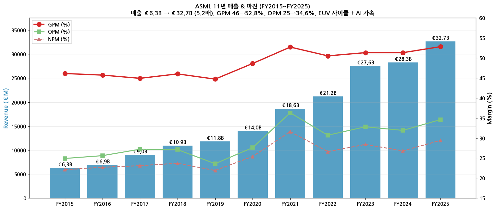

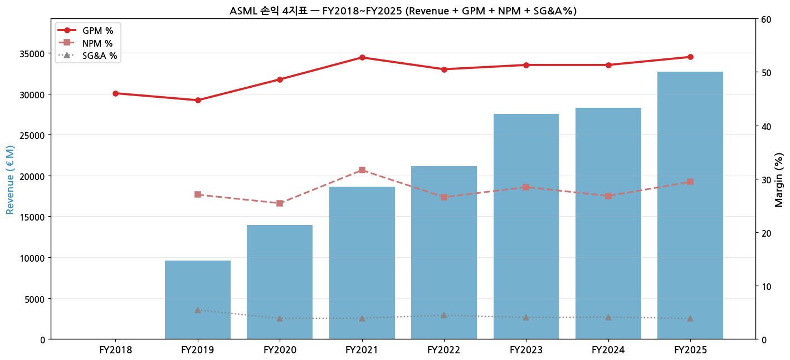

(FY2010~FY2014 5년은 v3에서 옛 20-F 추출 후 확장 예정 → 16년 완성)

### ② 산업 분류

- 산업: **반도체 장비** (WFE — Wafer Fab Equipment)
- SEC/SIC 분류: 3559 — Special Industry Machinery (Semiconductor Equipment)
- 워치리스트 섹터: **T2 — 반도체 소부장** (피어: AMAT, LRCX, KLAC, BESI, Tokyo Electron, Advantest, Disco)
- 글로벌 점유: WFE 시장 ~20% (단일 회사 최대), **Litho 시장 ~95%** (DUV+EUV 합산), **EUV 100% 독점**

### ③ 분류 결정 논리

(1) **가장 매출 큰 segment 기준** 적용 시 Lithography Systems (~75%) > IBM Service (~25%) → 일견 cyclical (장비 매출 변동성)

(2) **단, secular 변수 영향력 우선 sub-rule 적용**:
   - EUV 독점 → Moore's Law 지속 시 매분기 신규 수요 — Logic·메모리 capex 사이클과 독립 영역 존재
   - High-NA EUV (ASP +120%) → 차세대 ASP 단계적 lift = secular component
   - IBM Service 25% → recurring revenue 사이클 buffer
   - **결론: Secular 분류 우세, 사이클 component는 분기 변동성으로만 작용**

(3) **Boundary case 처리**: Secular + WFE Capex 사이클 + 첨단 노드 ramp 단계별 변동성 모두 섞임 → **Primary Secular + Secondary 사이클 일부** 표기

(4) **글로벌 피어 cross-reference**:
   - **AMAT/LRCX/KLAC**: 전공정 장비 종합 → 순수 cyclical 분류. ASML 대비 EUV 독점 + Litho 95% 점유라는 secular component 부재
   - **TEL/Disco**: 후공정·precision 장비 → cyclical
   - **BESI**: HBM bonding 독점 → secular 일부 (small cap)
   - **ASML 차별점: 반도체 장비 피어 중 유일한 EUV 독점** → secular premium 정당화

### ④ 적정 밸류에이션 방법

- **PER** (Secular 기준) 우선 — Lithography 단일 사업 + EUV 독점 secular premium 반영
  - 글로벌 semi 장비 평균 25~35x, ASML는 secular premium으로 **30~45x band**
- **EV/EBITDA** 보조 — capex 부담 작아 EBITDA 변환율 높음 (FCF 87%) → 15~20x band
- **DCF** 장기 검증 — FY2030 €44~60B 매출 target × OPM 30% = €15~18B EBIT 시나리오
- **PBR 부적합**: R&D 비용처리 + €40B+ 11년 누적 자사주 환원으로 자본 인위적 축소 → 비교 의미 없음
- **피어 차별화**: AMAT·LRCX PER 20~25x vs ASML 30~45x = secular premium **10~20x gap** (EUV 독점 + High-NA 우위)

### ⑤ 분기 재평가 트리거

- **High-NA EUV 매출 비중 30%+ 도달 시** → secular component 강화 → multiplier 한 단계 격상 후보 (FY2027~2028E 예상)
- **IBM (Service) 비중 30%+ 도달 시** → recurring revenue 비중 확대 → cyclical 변동성 완화 → secular 분류 강화
- **2개 분기 연속 OPM range가 5%pt 이내 안정 시** → cyclical component 약화 → Pure Secular로 transition 후보
- **China 매출 0%로 normalize 후 3분기 연속 안정 시** → 지정학 변동성 제거 → 기준선 시나리오 안정화
- **EUV system 출하 분기 units이 3분기 연속 정체 시** → 사이클 cooling 시그널 → Primary 사이클로 일시 재분류 후보

---

## 2. 회사 개요

### ① 기본 사항

→ **회사명**: ASML Holding N.V.
→ **비전**: "Unlocking the potential of people and society by pushing technology to new limits"
→ **사업 한 줄 정의**: **반도체 첨단 노드 제조에 필수적인 lithography 장비를 독점 공급하는 회사**. EUV (Extreme Ultraviolet) 시스템은 7nm 이하 logic + DRAM 1z nm 이하 메모리 노드의 양산 enabler. 단일 EUV 시스템 ASP $170M~$370M, 한 fab 당 수십 대 필요. 핵심 기술 stack: Carl Zeiss SMT (광학계) + Cymer (광원, ASML 인수) + ASML (시스템 통합)

### ② 11년 손익 추이

| FY | Rev (€M) | GPM (%) | OPM (%) | NI (€M) | EPS (€) | Units |
|---|---|---|---|---|---|---|
| 2015 | 6,287 | 46.1 | 24.9 | 1,387 | 3.22 | 169 |
| 2016 | 6,875 | 45.7 | 25.6 | 1,558 | 3.66 | 154 |
| 2017 | 8,963 | 44.9 | 27.2 | 2,067 | 4.81 | 197 |
| 2018 | 10,944 | 46.0 | 27.1 | 2,592 | 6.10 | 224 |
| 2019 | 11,820 | 44.7 | 23.6 | 2,592 | 6.16 | 229 |
| 2020 | 13,978 | 48.6 | 27.6 | 3,554 | 8.49 | 258 |
| 2021 | 18,611 | 52.7 | 36.3 | 5,883 | 14.36 | 309 |
| 2022 | 21,173 | 50.5 | 30.7 | 5,624 | 14.14 | 345 |
| 2023 | 27,559 | 51.3 | 32.8 | 7,839 | 19.91 | 449 |
| 2024 | 28,263 | 51.3 | 31.9 | 7,572 | 19.25 | 418 |
| **2025** | **32,667** | **52.8** | **34.6** | **9,609** | **24.73** | 327 |

→ 출처: ASML Earnings Deck Q4-2019 ~ Q4-2025 (Year-on-Year P&L 표), 5년 rolling 7개 stitch

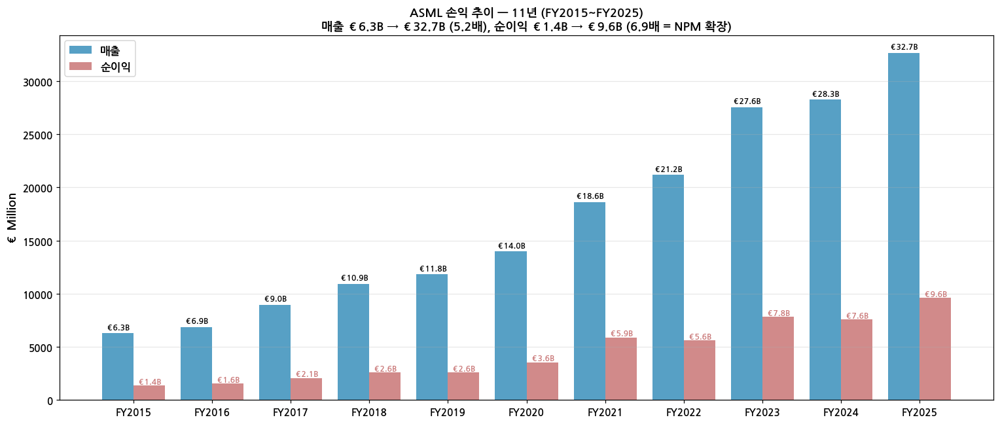

→ 매출 5.2배 성장 (FY15 €6.3B → FY25 €32.7B), 순이익은 6.9배 (NPM 확장 효과)
→ FY2022~FY2023 EUV 본격 ramp (Tower of Power), FY2024 China cycle 영향으로 일시 plateau, FY2025 AI 사이클 가속

### ③ 시가총액 추이 (21년)

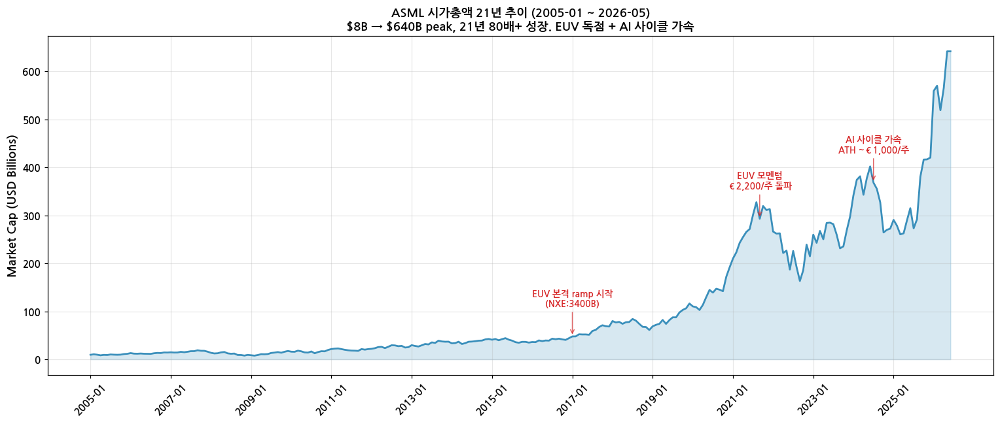

→ 2005년 시총 ~$8B → 2021-09 ATH ~$640B (80배 성장)
→ 핵심 모멘텀: 2017 EUV 본격 ramp (NXE:3400B), 2021 EUV 모멘텀 + AI 사이클 초기, 2024-07 ATH (AI 가속 + 6사 narrative 정점)

### ④ 주요 연혁

→ **1984**: 필립스 자회사로 설립
→ **1995**: NASDAQ 상장
→ **2001**: TWINSCAN 출시 (immersion lithography 시작)
→ **2007**: Carl Zeiss SMT 지분 25% 인수
→ **2013**: Cymer 인수 (EUV 광원)
→ **2017**: NXE:3400B EUV 본격 ramp 시작
→ **2018**: 최초 EUV 양산 출하 (TSMC 7nm 노드)
→ **2024**: High-NA EUV NXE:5000G 첫 출하 (Intel 18A 노드용)
→ **2026-Q1**: 매출 €8.8B record, FY2026 가이던스 €36~40B + GPM 51~53%

---

## 3. 비즈니스 모델

### ① 실적 추이 통합 (5년 + 28분기 + FY2030 target)

| FY | Rev (€M) | YoY | GPM | OPM | NI (€M) | NPM |
|---|---|---|---|---|---|---|
| 2020 | 13,978 | +18% | 48.6 | 27.6 | 3,554 | 25.4% |
| 2021 | 18,611 | +33% | 52.7 | 36.3 | 5,883 | 31.6% |
| 2022 | 21,173 | +14% | 50.5 | 30.7 | 5,624 | 26.6% |
| 2023 | 27,559 | +30% | 51.3 | 32.8 | 7,839 | 28.4% |
| 2024 | 28,263 | +2.6% | 51.3 | 31.9 | 7,572 | 26.8% |
| **2025** | **32,667** | **+15.6%** | **52.8** | **34.6** | **9,609** | **29.4%** |
| 2026E | 36,000~40,000 | +10~22% | 51~53% | — | — | — |
| **2030T** | **44,000~60,000** | (target) | — | — | — | — |

**최근 12분기 매출 + 마진:**

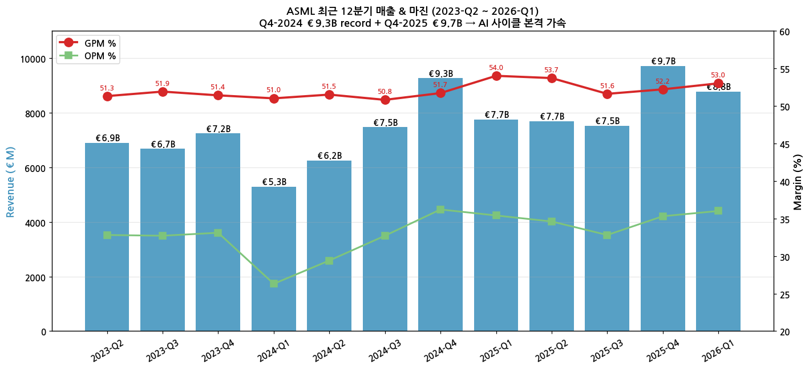

→ Q4-2024 €9.3B record + Q4-2025 €9.7B 갱신 — AI capex cycle 본격 가속 시그널
→ GPM 51~54% 안정 — Q1-2025 54.0% peak
→ OPM 35~36% 정착 — semi 장비 산업 최고 수준

### ① 사업부별 28분기 시계열

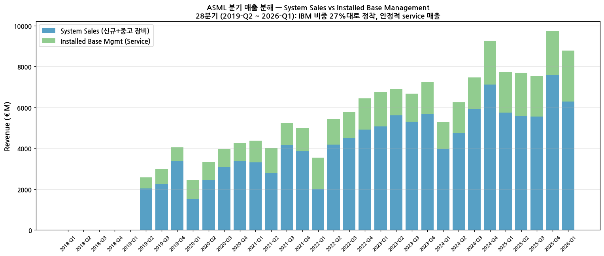

→ **System Sales** (신규 + 중고 lithography 장비): 28분기 평균 ~70%
→ **Installed Base Management** (service + field options + parts): 평균 ~27% (안정 recurring 매출)
→ IBM 비중은 FY2024 23% → FY2025 25% 상승 — 누적 install base 확대 효과
→ EUV 사이클 변동 시기에도 IBM 매출은 안정적 — 사이클 buffer 역할

**분기별 시스템 출하 (units):**

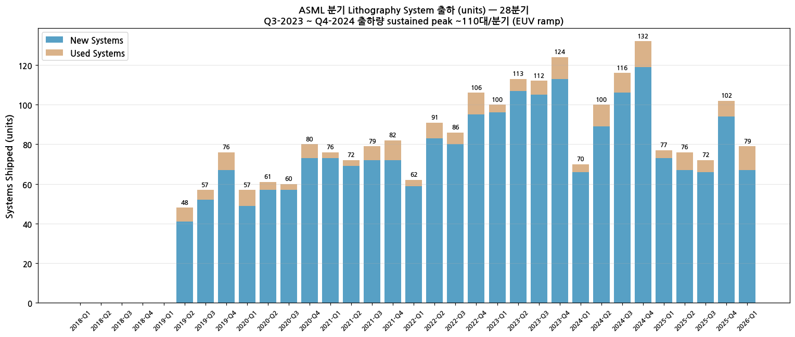

→ Q3-2023 ~ Q4-2024: sustained peak ~100~120대/분기 (EUV ramp)
→ Q1-2025 이후 sustained 70~90대/분기 — ASP가 더 높은 High-NA 비중 증가로 unit count는 약간 하락하나 매출/단가는 상승

### ② 사업부별 개요 (FY2025 기준)

(1) **Lithography Systems** (~75%, FY2025 약 €24.5B)
- EUV (Extreme Ultraviolet) — 7nm 이하 첨단 노드용. NXE:3400B (€170M), NXE:3800E (€220M), High-NA NXE:5000G (€370M+)
- DUV ArFi (Immersion) — 14~28nm 노드용. ~€100M/대
- DUV ArF Dry — 옛 노드 + 메모리용 reuse
- KrF, i-line — 메모리·후공정용 entry-level

(2) **Installed Base Management** (~25%, FY2025 €8.2B)
- Service contracts (multi-year)
- Field options (upgrade)
- Spare parts
- → 안정적 recurring 매출, GPM 50%+

(3) **Applications & Metrology** (Custom mask + YieldStar overlay metrology, 작은 비중이나 strategic)

### ③ 사업부별 디테일

(1) **EUV — 독점적 위치 + 성장의 본질**
- ASML이 유일한 EUV system 공급자 (Carl Zeiss SMT 광학계 + Cymer 광원 통합)
- Customers: TSMC (~60%), Samsung (~20%), Intel (~10%), SK Hynix (~10%) — 첨단 노드 전부 의존
- 단일 EUV 시스템 ASP $170M ~ $370M+ (High-NA)
- Bookings backlog: **FY2025말 €38.8B** (FY2026 매출의 ~1.2~1.4년치)

(2) **High-NA EUV — 다음 성장 동력**
- NXE:5000G NA 0.55, 첫 출하 2024 (Intel 18A 노드용)
- ASP $370M+/대, throughput 정상화 시 EUV 매출의 30%+ 차지 가능 (FY2028E)

(3) **Installed Base Management — 안정 buffer**
- FY2018 €0.9B → FY2025 €8.2B 9.1배 성장
- 누적 install base ~5,500대 (40+년 누적)
- Service margin 50%+로 system 마진 (40%대) 보다 높음
- 사이클 하방 시 매출 buffer 역할

### ④ 주요 경쟁사

| 영역 | 경쟁사 | ASML 위치 |
|---|---|---|
| EUV Lithography | (없음 — 독점) | **100% 점유** |
| DUV Immersion | Nikon, Canon | ASML ~85% 점유 |
| DUV Dry (i-line, KrF, ArF dry) | Nikon, Canon | ASML ~70% |
| Metrology / Mask | KLA, Hitachi, AMAT | ASML small share but strategic |

→ EUV는 절대 독점 — 차세대 ArF dry/KrF로 대체 불가, Cymer 광원 + Carl Zeiss 광학계 통합 entry barrier 압도적

### ⑤ 주요 매출처 (FY2025 추정)

→ TSMC (~30~35%) — 첨단 노드 ramp + N2 가속
→ Samsung Foundry + DRAM (~20%) — Logic + 메모리
→ SK Hynix (~15%) — DRAM 1a/1b nm
→ Intel (~10%) — 18A High-NA 가장 먼저 채택
→ Micron (~10%) — DRAM 1z 이하
→ China customers (~15~20%) — SMIC, Huahong + 기타. US export control 영향으로 EUV는 0, DUV ArFi만

### ⑥ 생산 CAPA + 임직원

→ FY2025말 임직원 **~44,000명 (FTE)**
→ 핵심 fab 위치: Veldhoven (네덜란드, 본사 + 최대 fab), Wilton CT (미국 Cymer), Linkou (Taiwan, service hub)
→ 21% women in workforce, 143 nationalities

---

## 4. 재무 구조 (11년 시계열)

### ① 손익계산서 (FY2015~FY2025)

→ 매출 €6.3B → €32.7B (5.2배). GPM 46.1% → 52.8% (+6.7pp). OPM 24.9% → 34.6% (+9.7pp)
→ R&D €1.1B → €4.7B (4.3배), R&D% 17.0% → 14.4% (매출 성장이 R&D보다 빠름 = 효율 향상)
→ 순이익 €1.4B → €9.6B (6.9배). NPM 22.1% → 29.4% (+7.3pp = operating leverage 효과)

### ② 재무상태표 (FY2020~FY2025 6년)

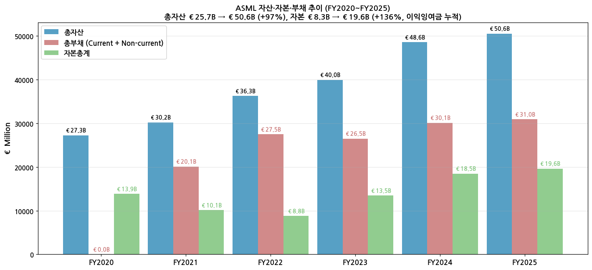

→ **총자산 €27B → €50.6B (+87%)** — 사업 확장 + AR/inventory 증가
→ **자본총계 €13.9B → €19.6B (+41%)** — 이익잉여금 누적, 자사주 매입 후 감소 + 재축적
→ **재고 €5.2B → €11.4B (+120%)** — EUV 장비 큰 ASP·긴 cycle time + High-NA 재고 비중
→ **PP&E €3.0B → €7.9B (+161%)** — Veldhoven fab 확장 + Linkou·Wilton 신축
→ **현금+STI €7.6B → €13.3B** — 안정적 cash position 유지

### ③ 현금흐름 (FY2015~FY2025 11년)

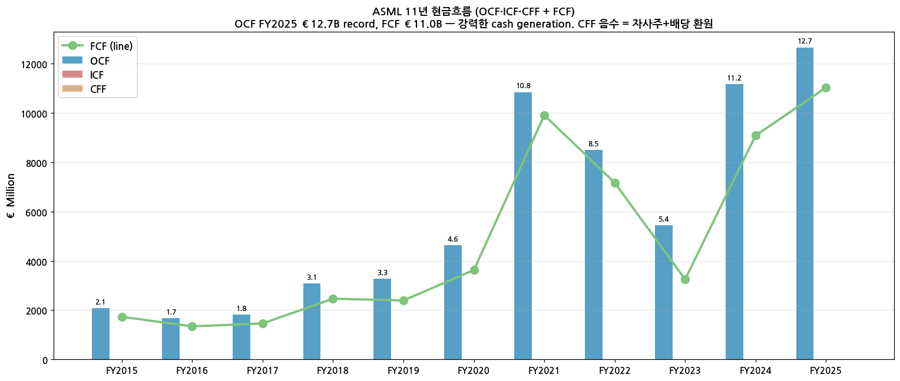

→ **OCF FY2025 €12.7B record** — FY2015 €1.7B 대비 7.5배 성장
→ **FCF FY2025 €11.0B** — capex 안정화 (€1.6B) + OCF 폭증으로 conversion rate 87%
→ **CFF 11년 누적 -€40B+** — 배당 + 자사주 매입에 환원 (음수)

### ④ CapEx (11년)

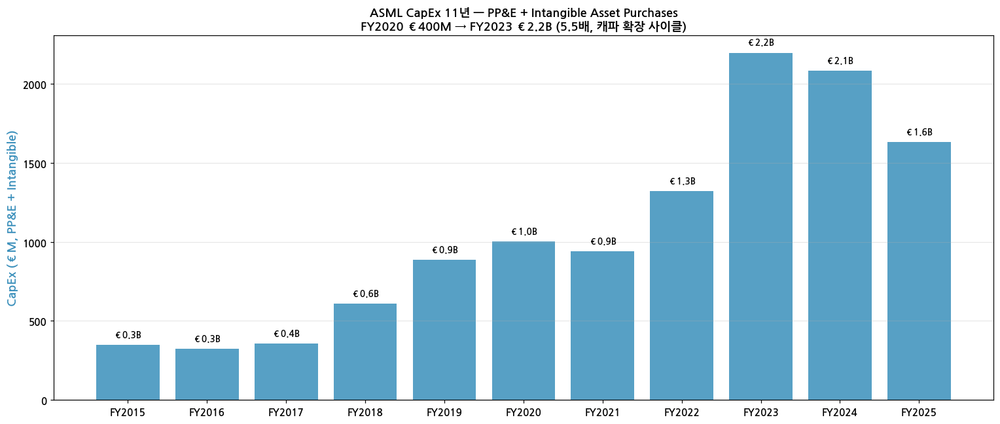

→ FY2015 €350M → FY2023 €2.2B (6.3배, 캐파 확장 + High-NA 개발 사이클)
→ FY2024 €2.1B 유지, FY2025 €1.6B로 normalize — 캐파 사이클 cooling
→ CapEx/매출: 5~8% range. 전형적 semi 장비 산업 수준

### ⑤ R&D 투자 (11년)

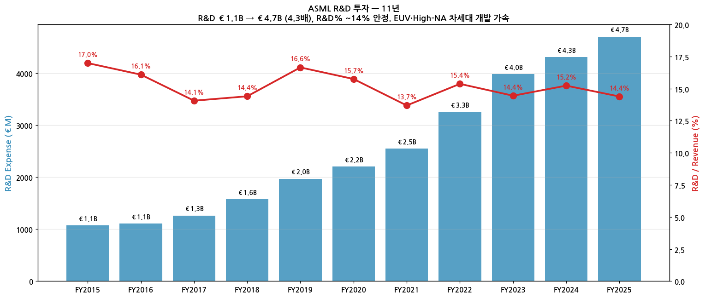

→ R&D €1.1B → €4.7B (4.3배)
→ R&D / Revenue: FY2015 15.5% → FY2025 14.4% — 매출 성장이 R&D 성장보다 빠름 = **operating leverage**
→ EUV·High-NA·Hyper-NA 차세대 개발에 누적 €30B+ 투자 (40+년)
→ R&D 헤드카운트: 전체 FTE의 ~50%

### ⑥ 주주환원 (11년 추정)

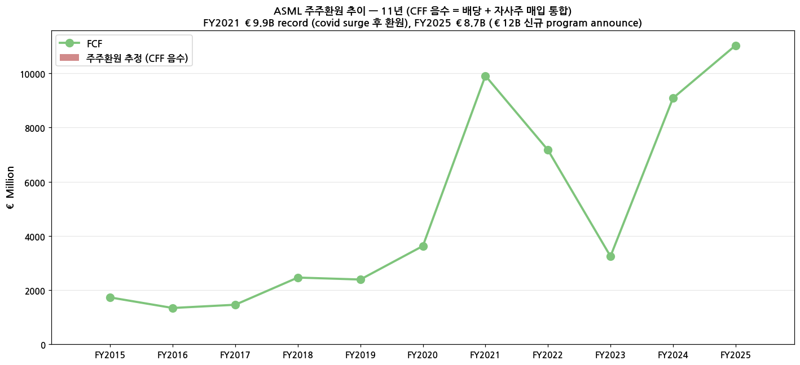

→ CFF 음수 = 배당 + 자사주 매입 (환원 proxy)
→ **FY2021 €9.9B record** (covid surge 후 환원), FY2025 €8.7B
→ **2026~2028 신규 €12B 자사주 매입 program** (2026-Q1 announce, 18개월 분기 €1.5~2B 페이스)
→ FY2025 배당 €7.50/주 (+17% YoY, 3 interim €1.60 × 3 + 최종 €2.70)

### ⑦ 재무비율 (FY2025)

| 비율 | 값 | 비교 |
|---|---|---|
| ROE | ~49% | 자기자본 €19.6B / 순이익 €9.6B |
| ROA | ~19% | 총자산 €50.6B / 순이익 €9.6B |
| 부채비율 | 158% | (Current + Non-current) / Equity |
| 유동비율 | ~110% | 보수적 추정 |
| Net Cash Position | +€13.3B | 자기자본 잔여 cash 충분 |

---

## 5. 지배 구조

### ① 그룹·계열 관계

→ 독립 상장사 (지주회사 ASML Holding NV 100% 직접 소유 구조)
→ 자회사: Cymer (light source, 미국 Wilton CT), 기타 R&D 자회사
→ Carl Zeiss SMT: ASML이 25% 지분 보유 (역방향 — 광학계 strategic alliance)

### ② 주주 구분 (FY2025말 추정)

→ Free float ~95% (institutional)
→ 5%+ 주주: BlackRock (~6%), Vanguard (~5%)
→ 외국인 비중 ~90%+ — 글로벌 institutional 보유
→ Insider 보유 < 1%

### ③ 임원·이사회 (2026 기준)

→ **President & CEO**: Christophe Fouquet (2024-04~ ; 前 EUV Business EVP)
→ **CFO**: Roger Dassen (2018-06~)
→ **CTO**: Martin van den Brink (1999~) — 회사 핵심 기술 leadership
→ Board of Management 5명 + Supervisory Board 9명 구성

---

## 6. 기타 팩트

### ① R&D 인프라

→ FY2025 R&D 비용 분기 €1.0~1.2B (annual **€4.7B = 매출의 14.4%**)
→ R&D 헤드카운트: 전체 FTE의 ~50% (정밀 광학·기계·소프트웨어 통합 엔지니어링 집중)
→ 핵심 R&D site: Veldhoven 본사, Wilton CT (광원), Linkou (Taiwan), San Diego (mask)

### ② 진행 중 corporate action

→ **2026~2028 신규 €12B 자사주 매입 program** (2026-Q1 announce, 18개월 분기 €1.5~2B 페이스)
→ **High-NA EUV NXE:5000G ramp** — 2026~2028 Intel 18A·TSMC A14 ramp 본격화
→ **Hyper-NA 개발** — 2030~2032 양산 target (R&D OpEx 가속)

### ③ R&D 마일스톤

→ **2017**: NXE:3400B EUV 양산 출하 시작
→ **2018**: 첫 EUV 양산 (TSMC 7nm)
→ **2024**: High-NA NXE:5000G 첫 출하 (Intel)
→ **2025-2026**: High-NA throughput 정상화 + 추가 customer 채택 (TSMC N2 ramp)
→ **2026-Q1**: NXE:3800E PEP1-E 출하 (throughput 220→230 WpH)

### ④ 주요 리스크

→ **미·중 export control**: EUV 중국 수출 금지, DUV ArFi 단계적 제한 (FY2024 영향). FY2025부터 China 매출 ~15~20% 유지 (안정화)
→ **첨단 노드 ramp 시점 변동**: TSMC N3·N2, Intel 18A 등 customer roadmap 지연 시 분기 매출 변동
→ **단일 제품 의존**: lithography 외 매출 limited → semiconductor 사이클 직접 노출
→ **High-NA throughput**: 정상화 지연 시 ASP 인상 효과 hedging

### ⑤ ESG 등급

→ MSCI ESG Rating: AAA (최상위, 2025)
→ Net scope 1+2 CO2 emissions: 0 kt (100% 재생에너지 운영)
→ Net scope 3: 11.5 Mt CO2e
→ DJSI World Index 상위

---

## Version Log

→ **v1.0** (2026-05-24): 첫 작성. PR 28분기 + DECK 33분기 + Q4 PR 8년 annual + Yahoo 21.5년 주가 기반. 7종 차트 + 6개 섹션.
→ **v2.0** (2026-05-24): **11년 annual 시계열 (FY2015~FY2025) 확장 완성**. DECK Q4 7개에서 5년 rolling P&L+CF+BS stitch. 추가 차트 5종 (chart4 자산자본부채, chart6 CF, chart7 R&D, chart8 CapEx, chart9 주주환원) + chart1·chart12 갱신. 재무구조 섹션 (4번) BS·CF·CapEx·R&D·주주환원 풀 디테일 추가.
→ **v3 후보**: (1) 옛 분기 (Q1-2010 ~ Q1-2019) SEC 6-K HTML parse → 60+분기 시계열 완성, (2) EUV/DUV unit breakdown 분기 시계열 (graph OCR 또는 web search), (3) Geography breakdown (China·Korea·Taiwan·US) 분기 시계열, (4) 셀사이드 컨센서스 5단계 분포 (Buy/Hold/Sell)

---

## Source

→ ASML 분기 Press Release 28개 (Q2 2019 ~ Q1 2026) — investor.asml.com
→ ASML Earnings Deck 33개 (Q1 2018 ~ Q1 2026) — annual rolling 5-year P&L/CF/BS extraction
→ ASML US-GAAP Financial Statements 7개 (Q3 2024 ~ Q1 2026)
→ SEC EDGAR 20-F 16개 (FY2010 ~ FY2025)
→ SEC EDGAR 6-K 201개 (2011 ~ 2026-04, 분기 PR + 기타)
→ Yahoo Finance v8 API — ASML monthly close (2005-01 ~ 2026-05, 258 months)
