# GOOGL (Alphabet Inc.) — 기업 개요 리포트 v1.0

**작성일**: 2026-05-19
**대상 기업**: Alphabet Inc. (NASDAQ: GOOGL Class A, GOOG Class C, CIK 0001652044)
**작성 표준**: company-overview v4.8 (US 분기 — SEC EDGAR + Alphabet IR Press Release 1차 병용)
**시계열 깊이**: 12년 연간 (FY2014~FY2025) + **43분기 (Q3 2015~Q1 2026, ~10.5년 연속)**

**자료 수집 패턴 (AMZN 검증 패턴 적용)**:
- SEC EDGAR 10-K/10-Q/8-K **149개** batch (sec_edgar_download_reports)
- Alphabet IR press release **43개** (q4cdn PDF 16 + SEC 8-K Exhibit 99.1 HTM 27)
- Yahoo Finance v8 monthly OHLC 237개 (2005-09~2025-05, 20년)
- SEC EDGAR submissions JSON API로 모든 8-K accession 추출

---

## 1. 기업 분류 (v4.8 retrofit)

- **Primary 분류**: **지속성장(Compounder)** — 검색 광고 90%+ 점유율 독점
- **Secondary 노트**: **Cloud AI secular sub-cycle** (Cloud +63% YoY) + **Antitrust risk multiple cap** (DOJ Search 분리 명령 항소심)

### ① 정량 근거

**📊 Summary Box (12년 평균, FY2014~FY2025):**

| 지표 | 값 |
|------|-----|
| 매출 CAGR (FY14→FY25) | **+18.0%** ($66.0B → $402.8B, 6.1배) |
| OPM 평균 (12년) | **26.4%** |
| **OPM 정점 평균** | **33.9%** (FY24·FY25 2회 평균, AI 슈퍼사이클) |
| **OPM 저점 평균** | **20.6%** (FY17·FY18 2회 평균, EU 반독점 벌금) |
| **OPM range (12년)** | 20.1% ~ 35.9% = **15.8%pt** ← 사이클 cutoff 10%pt 초과하지만 동인이 일회성(EU 벌금) |
| 사이클 주기 | ~4년 (CapEx → 마진 압축 → 회복) |
| 사이클 회수 (12년) | 정점 2회 (FY21·FY25) / 압축 2회 (FY17~18 EU 벌금, FY22 ChatGPT 쇼크) |

**📊 손익 표 (12년, narrative annotation 직접 통합):**

| FY | 매출($B) | OP($B) | OPM(%) | NPM(%) | CapEx($B) | 사이클 이벤트 |
|----|---------|--------|--------|--------|----------|------|
| 2014 | 66.0 | 16.5 | 25.0 | 21.9 | 11.0 | baseline |
| 2015 | 75.0 | 19.4 | 25.8 | 21.8 | 9.9 | Alphabet 형성 (2015.10) |
| 2016 | 90.3 | 23.7 | 26.3 | 21.6 | 10.2 | YouTube +20% YoY |
| 2017 | 110.9 | 26.1 | **23.6** | 11.4 | 13.2 | **← 1차 압축 (EU Shopping €2.42B 벌금)** |
| 2018 | 136.8 | 27.5 | **20.1** | 22.5 | 25.1 | **← 압축 저점 (EU Android €4.34B 벌금, 12년 OPM 최저)** |
| 2019 | 161.9 | 34.2 | 21.1 | 21.2 | 23.5 | 광고 회복 |
| 2020 | 182.5 | 41.2 | 22.6 | 22.1 | 22.3 | COVID 광고 위축 후 회복 |
| 2021 | 257.6 | 78.7 | **30.6** | 29.5 | 24.6 | **← 1차 정점 (COVID 광고 호황, +41% YoY)** |
| 2022 | 282.8 | 74.8 | **26.5** | 21.2 | 31.5 | **← ChatGPT 쇼크 (2022.11) + AI 위협 우려** |
| 2023 | 307.4 | 84.3 | 27.4 | 24.0 | 32.3 | Year of Efficiency, 12K layoff |
| 2024 | 350.0 | 112.4 | 32.1 | 28.6 | 52.5 | **← Gemini 성공 + AI Overviews 출시** |
| **2025** | **402.8** | **144.5** | **35.9** | **36.0** | **75.0** | **← AI 슈퍼사이클 정점 (Cloud +63% YoY, OPM 12년 최고)** |

→ (출처: Alphabet 10-K FY2015~FY2025, SEC EDGAR)

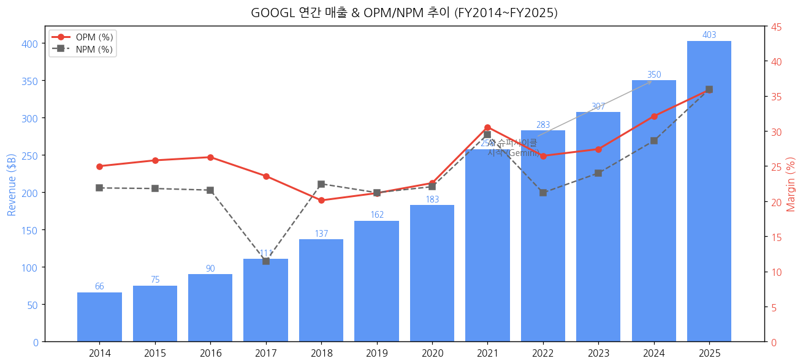

### ② 산업 분류

- **GICS**: Communication Services > Interactive Media & Services (50203020)
- **하위 산업 노출 (FY25 매출 비중)**: Google Services 81% (Search/YouTube/Network/Subs+Devices) / Google Cloud 18% (GCP 글로벌 #3) / Other Bets 0.1% (Waymo) / Hedging -0.1%
- **워치리스트 섹터/Tier**: T1 미국 빅테크 / Digital Ad + Cloud Infrastructure + AI Foundation industry
- **글로벌 피어**: META (광고 single-platform), AWS/Azure (Cloud), Apple (검색 광고 default deal $20B/yr 수혜)

### ③ 분류 결정 논리 (4단계 sub-logic)

(1) **가장 매출 큰 사업부 기준** 적용 시 Google Services 81% (Search·YouTube·Subs·Network) → "광고 플랫폼 = 지속성장" 명확. 검색 90%+ 점유율로 사이클성 약화.
(2) **단, Cloud 가속 sub-rule** 적용: Cloud 매출 비중 18%이지만 **+63% YoY 가속 (AI 인프라 사이클 진입)** → 지속성장 + Cloud secular sub-cycle 2층 구조. **백로그 $462B (24개월 50%+ 인식)** = 2-3년 매출 가시성.
(3) **Boundary case 처리**: Primary "지속성장" + Secondary "Cloud AI secular + Antitrust multiple cap". **OPM range 15.8%pt = 사이클 cutoff 초과하지만 동인이 EU 벌금 일회성** → 정통 사이클성 아님. 단, DOJ Search 분리 명령 시 분류 자체 변경 가능.
(4) **글로벌 피어 cross-reference**: **META vs GOOGL = single-platform 광고 vs multi-stack 광고+Cloud** — META OPM range 21.7%pt (Reality Labs 베팅), GOOGL 15.8%pt (Cloud 안정). **MSFT vs GOOGL = Cloud #2 vs Cloud #3 가속** (Azure +40% vs GCP +63% 가속률 1위). 삼성전자 비교: 삼성 multi-segment 사이클 vs GOOGL Services-Cloud-AI 3-stack secular.

### ④ 적정 밸류에이션 방법 — 사업부 mix → method 연결

- **1순위 PER (Forward 12M)** — Services 81% 안정 매출 + Cloud 18% 가속 → PER 기반 합리. 2025 EPS $11.95 (+44% YoY), 시장 PER ~24x.
- **2순위 EV/EBITDA Sum-of-Parts** — Google Services (cash cow ~12x EV/EBITDA) + Google Cloud (high-growth ~10x EV/Rev) + Other Bets (option value Waymo) + Antitrust risk discount (-10~15% multiple).
- **3순위 PEG ratio** — Cloud +63% 가속 + AI Overviews monetization 효과 → PER re-rating 동인.
- **PBR 부적합** — Cloud 비중 확대 + 자사주 매입($60B+/년) + 자본 $364B vs 시가총액 $2.5T+.
- **삼성전자 비교**: 삼성은 사이클 → **PBR + PER 혼합**, GOOGL은 지속성장 → **PER + SOTP** (Cloud secular + Antitrust discount 차별화).

### ⑤ 분기 재평가 트리거 = 분류 변경 조건

> 분류 자체가 바뀔 조건 (실적 추적용 변수 Cloud 성장률·CapEx 등은 §6 "기타 팩트"로 분리)

- **DOJ Search 분리 명령 항소심 확정 시 (Q3-Q4 2026)** → "광고 단일 플랫폼 독점" 분류 무효화, **사업 분할 후 사이클성 종목으로 재분류 필수**
- **Cloud 매출 비중 25%+ 도달 시** → "지속성장 + Cloud 비중 동등" 분류 격상 (현재 18%, FY26E 가능)
- **Search 매출 YoY +10% 이하 둔화 시** → AI Overviews 효과 소진, "지속성장" 안정성 재검토
- **자사주 매입 재개 시** (Q1 2026 buyback $0 → ?) → 자본 정책 변경 = "Cloud CapEx 우선" 분류 정당화 검증
- **OPM 2개 분기 연속 30% 미만 하락 시** → "AI 슈퍼사이클 정점 통과" 시그널, 분류 재검토

---

## 2. 회사 개요

### ① 기본 사항

- **회사명**: Alphabet Inc. (홀딩스), 자회사 Google LLC
- **본사**: Mountain View, California, USA
- **CEO**: Sundar Pichai (Alphabet & Google 양쪽, 2019.12~)
- **창립자**: Larry Page + Sergey Brin (Google 창립 1998.09.04; Alphabet 형성 2015.10.02)
- **상장**: NASDAQ (GOOGL Class A 의결권 1주 1표, GOOG Class C 비의결권). IPO 2004.08.19 ($85). Class B 비공개 (Page+Brin 보유, 1주 10표)
- **종업원**: 187,103 (2025년말 기준, 2024 183,323 대비 +2%)
- **회계연도**: 1월~12월

**비전**: "Organize the world's information and make it universally accessible and useful" (Google), Alphabet은 "moonshot innovation" 우산

**사업 한 줄 정의**: 글로벌 검색 광고 1위 + YouTube + Android + Google Cloud (글로벌 3위) + AI Foundation Models (Gemini) + 자율주행(Waymo) 등 moonshot 옵션 보유

### ② 12년 손익·자본 추이 + chart12

| FY | 매출($B) | OP($B) | NI($B) | 자본($B) | 자본 YoY(%) | 총자산($B) |
|----|---------|--------|--------|---------|------------|----------|
| 2014 | 66.00 | 16.50 | 14.44 | 104.50 | — | 129.19 |
| 2015 | 74.99 | 19.36 | 16.35 | 120.33 | +15.1 | 147.46 |
| 2016 | 90.27 | 23.72 | 19.48 | 139.04 | +15.5 | 167.50 |
| 2017 | 110.86 | 26.15 | 12.66 | 152.50 | +9.7 | 197.30 |
| 2018 | 136.82 | 27.52 | 30.74 | 177.63 | +16.5 | 232.79 |
| 2019 | 161.86 | 34.23 | 34.34 | 201.44 | +13.4 | 275.91 |
| 2020 | 182.53 | 41.22 | 40.27 | 222.54 | +10.5 | 319.62 |
| 2021 | 257.64 | 78.71 | 76.03 | 251.64 | +13.1 | 359.27 |
| 2022 | 282.84 | 74.84 | 59.97 | 256.14 | +1.8 | 365.26 |
| 2023 | 307.39 | 84.29 | 73.80 | 283.38 | +10.6 | 402.39 |
| 2024 | 350.02 | 112.39 | 100.12 | 325.08 | +14.7 | 450.26 |
| **2025** | **402.84** | **144.49** | **144.84** | **364.20** | **+12.0** | **502.61** |

→ (출처: Alphabet 10-K FY2015~FY2025)

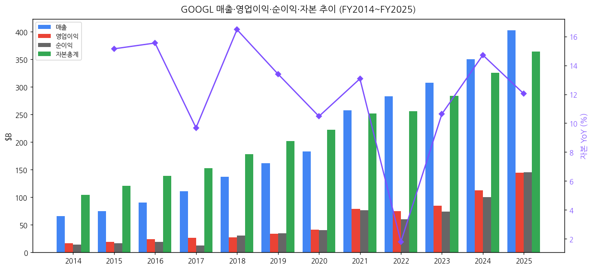

### ③ 회사 주가 역사

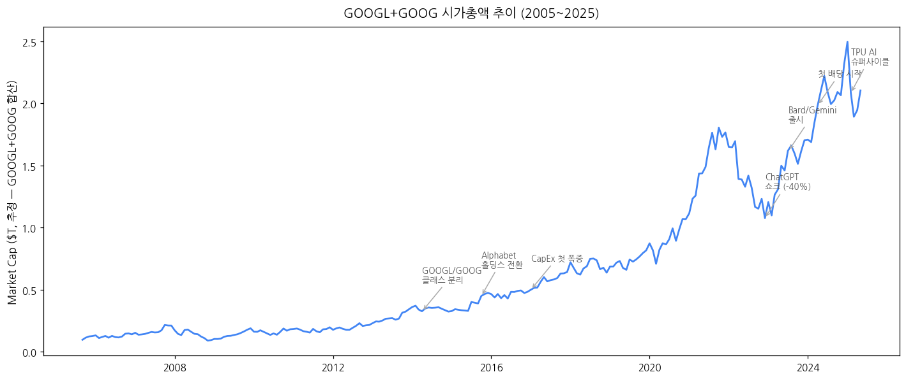

→ (1) 2004 IPO $85 → 2005~2014 첫 십년 안정 성장
→ (2) 2014.04.03 Class A/C 분할 (의결권 분리)
→ (3) 2015.10.02 **Alphabet 홀딩스 전환** — moonshot 사업 분리·관리
→ (4) 2017~2018 OPM 압축기 (EU 반독점 €6.76B 누적 벌금)
→ (5) 2020 COVID — 광고 단기 충격 후 디지털 가속
→ (6) 2021 매출 +41% 폭증, 시가총액 $2T 돌파
→ (7) **2022.11.30 ChatGPT 쇼크** — AI 검색 위협 우려, 주가 -40%
→ (8) 2023.02.06 Bard 출시 (Gemini 전신)
→ (9) **2024.04 첫 배당 $0.20/share 시작** (Alphabet 사상 처음)
→ (10) 2024.07.01 20:1 액면분할 (사상 첫 split)
→ (11) 2025 TPU + Gemini Pro/Ultra 슈퍼사이클 본격화
→ (12) **2026 Q1 매출 $109.9B (+22%), Cloud +63%, 11분기 연속 두 자릿수 성장**

### ④ 주요 연혁

| 연도 | 마일스톤 |
|------|---------|
| 1998 | Larry Page + Sergey Brin이 Stanford에서 Google 창립 |
| 2004 | NASDAQ IPO ($85) |
| 2006 | YouTube 인수 ($1.65B 주식교환) |
| 2008 | Android 정식 출시, Chrome 출시 |
| 2014 | Class A/C 분할, Nest 인수 ($3.2B) |
| 2015 | Alphabet 홀딩스 전환, Sundar Pichai Google CEO |
| 2016 | Google Assistant 출시, Pixel 폰 첫 출시 |
| 2017 | EU Shopping 반독점 €2.42B 벌금 |
| 2018 | EU Android 반독점 €4.34B 벌금, Waymo 첫 상용 서비스 |
| 2019 | Pichai가 Alphabet CEO 통합 (Page/Brin 일선 퇴진) |
| 2020 | COVID — YouTube 사용 폭증 |
| 2021 | 매출 +41%, 시가총액 $2T |
| 2022 | EU Android 항소 결정($4.13B 인하), ChatGPT 출시 |
| 2023 | Bard → Gemini 출시, 대규모 정리해고 12,000명 |
| 2024 | **첫 배당 시작**, 20:1 액면분할, Gemini 1.5/2.0 |
| 2025 | TPU v6/v7 + Gemini 3.0, AI Overviews 본격 monetization |
| 2026 Q1 | 매출 $109.9B, Cloud +63%, AI 슈퍼사이클 |

---

## 3. 비즈니스 모델

### ① 사업부별 5년 통합 + 30+분기 시계열

#### Reportable Segment 3개 + 매출 sub-category 6개

Alphabet은 **3개 reportable segment** (Google Services, Google Cloud, Other Bets) 공시 + **revenue breakdown 6개** (Google Search & other, YouTube ads, Google Network, Google subscriptions/platforms/devices, Google Cloud, Other Bets) 별도 공시.

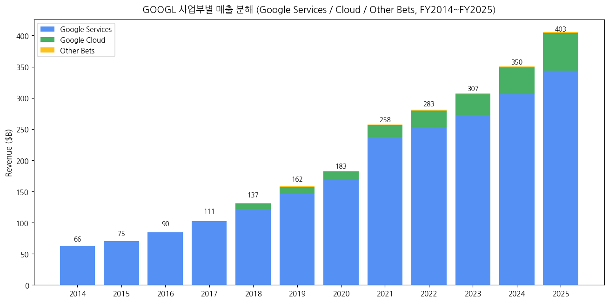

#### Segment-level 연간 매출 ($B)

| FY | Google Services | Google Cloud | Other Bets | Hedging | Total |
|----|----------------|--------------|------------|---------|-------|
| 2018 | 121.83 | 8.92 | 0.60 | 5.46 | 136.82 |
| 2019 | 145.58 | 12.02 | 0.66 | 3.60 | 161.86 |
| 2020 | 168.64 | 13.06 | 0.66 | 0.18 | 182.53 |
| 2021 | 237.53 | 19.21 | 0.75 | 0.15 | 257.64 |
| 2022 | 253.53 | 26.28 | 1.07 | 1.96 | 282.84 |
| 2023 | 272.54 | 33.09 | 1.53 | 0.24 | 307.39 |
| 2024 | 305.61 | 43.23 | 1.65 | (0.46) | 350.02 |
| **2025** | **343.73** | **60.05** | **1.63** | **(2.59)** | **402.84** |

→ (출처: Alphabet 10-K FY2020~FY2025, Note 15 Segment Information)

#### Revenue Breakdown 6 카테고리 (Q1 2021~Q1 2026, 21분기 stacked)

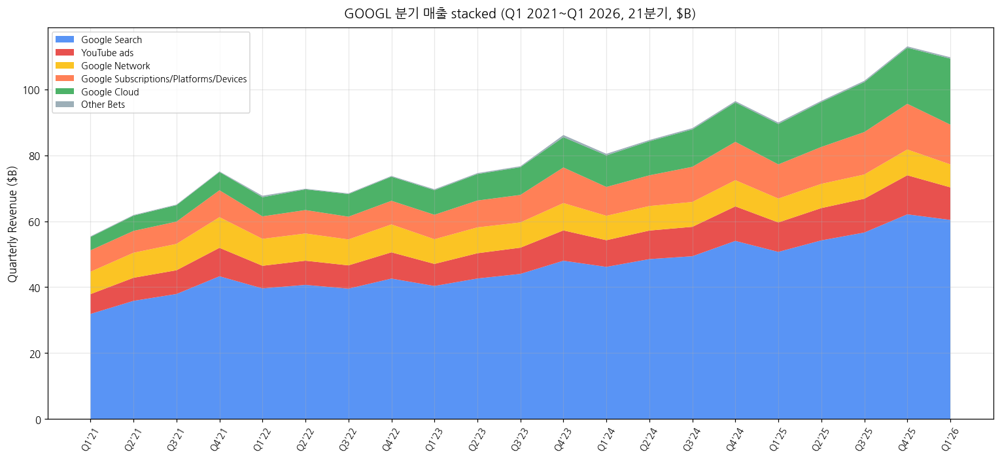

#### Q1 2026 매출 분해 ($M, IR Press Release)

| 카테고리 | Q1 2025 | Q1 2026 | YoY (%) |
|---------|---------|---------|---------|
| **Google Search & other** | 50,702 | **60,399** | **+19%** |
| **YouTube ads** | 8,927 | **9,883** | +11% |
| **Google Network** | 7,256 | 6,971 | -4% |
| **Google subscriptions/platforms/devices** | 10,358 | **12,055** | +16% |
| **Google Services 소계** | 77,243 | **89,308** | **+16%** |
| **Google Cloud** | 12,260 | **20,028** | **+63%** |
| **Other Bets** | 450 | 411 | -9% |
| Hedging gains (losses) | 260 | (180) | — |
| **Consolidated** | 90,234 | **109,896** | **+22%** |

→ (출처: Alphabet Q1 2026 IR Press Release)

#### Google Cloud 장기 시계열 (Q1 2019~Q1 2026, 29분기)

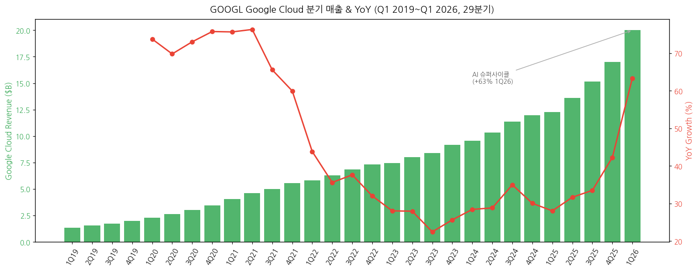

→ (1-1) Google Cloud 6년 CAGR ~**40%**. Q1 2019 $1.33B → Q1 2026 $20.03B (15배 성장).
→ (1-2) **2024년 흑자 전환** — Q1 2024 OI $900M, FY2024 OI $6.1B, OPM 14.1% 달성. 이전까지 적자.
→ (1-3) **Q1 2026 +63% YoY** = 11분기 만의 가속, AI 인프라 + GCP 신규 entreprise 수요.
→ (1-4) Backlog 급증 — Q1 2026 backlog "nearly all-time high" 회사 코멘트.

### ② 사업부별 개요 (매출 비중 큰 순서)

#### (2-1) Google Services (FY2025 매출 $343.7B, 비중 85%)

Google Services는 광고 + 구독 + 디바이스의 통합 매출.

- **Google Search & other** ($235B FY2025E, 비중 58%)
  - Google.com 검색 광고 + Maps + Shopping + Gmail
  - **AI Overviews** (2024.05 출시) → Q1 2026 +19% YoY, AI 검색이 monetization 가속
- **YouTube ads** ($40B FY2025E, 비중 10%)
  - YouTube Shorts + Premium ads
  - Q1 2026 +11% YoY
- **Google Network** ($30B FY2025E, 비중 7%)
  - AdSense + AdMob (3P publisher network)
  - 정체 (Q1 2026 -4%) — 3P 광고 시장 위축
- **Google subscriptions/platforms/devices** ($50B FY2025E, 비중 12%)
  - **Google One** 350M+ 구독자 (Q1 2026 disclosure)
  - YouTube Premium + YouTube Music + YouTube TV (combined 100M+)
  - Pixel 폰, Google Play store fees
  - Q1 2026 +16% YoY

#### (2-2) Google Cloud (FY2025 매출 $60.1B, 비중 15%)

- Google Cloud Platform (GCP) + Google Workspace + AI Solutions
- 글로벌 점유율 ~12% (AWS 30%, Azure 22% 다음 3위)
- 핵심 product: BigQuery, Compute Engine, Cloud Storage, Vertex AI, Gemini API, **TPU (자체 AI 칩)**
- **AI Solutions** segment 가속 — Anthropic·기타 AI 스타트업 GCP 사용
- 2025년 OPM 22.7% (FY2024 14.1%) — 마진 가속

#### (2-3) Other Bets (FY2025 매출 $1.63B, 비중 0.4%)

- **Waymo** (자율주행 — 가장 큰 매출 기여) — 2025년 SF·LA·Phoenix 대중 상용 서비스, 2026 Q1 매출 ~$300M 추정
- Verily (생명과학)
- Wing (드론 배송)
- X (R&D moonshot lab)
- Google Fiber, Sidewalk Labs
- FY2025 영업손실 $-7.0B 추정 — Waymo R&D 부담

### ③ 사업부별 디테일

#### (3-1) AI 슈퍼사이클 driver (Q1 2026 disclosure)

- **Gemini App**: 350M+ paid subscriptions
- **AI Overviews** in Search: 모든 주요 쿼리에서 활성화, **monetization 가속** (CEO 코멘트)
- **TPU 자체 칩**: TPU v5 → v6 → v7 (Trillium) 진화. AI 학습/추론 비용 우위
- **Gemini 모델 배포**: Pro·Ultra·Flash·Nano 다중 tier
- **DeepMind 통합**: 2023.04 Google Brain + DeepMind 통합, AI 연구 가속

#### (3-2) Waymo (Other Bets 가장 큰 매출)

- 2025년 누적 100M+ rider trips 돌파
- LA·Austin·Atlanta 신규 시장 개시
- Uber·Lyft 파트너십 확대
- 운영 도시: SF·LA·Phoenix·Austin·Atlanta·Miami (2026 확장 계획)

### ④ 주요 경쟁사

| 사업부 | 경쟁사 |
|--------|---------|
| Search Ad | Microsoft Bing/Copilot, Meta, Amazon Ads, TikTok |
| YouTube | TikTok, Netflix, Disney+, Twitch |
| Google Cloud | AWS, Microsoft Azure, Oracle Cloud, Alibaba Cloud |
| AI Foundation | OpenAI, Anthropic, Meta Llama, Microsoft AI |
| Android | Apple iOS |
| Browser/OS | Apple Safari, Microsoft Edge |
| Maps | Apple Maps, Waze (구글 자회사이지만 별도 운영) |
| Autonomous (Waymo) | Tesla FSD, Cruise(GM), Zoox(Amazon), Aurora |

### ⑤ 주요 매출처

- 광고주: 글로벌 SMB + 대기업 (단일 고객 10% 미만, 분산형 매출 구조)
- Cloud enterprise customers: Spotify, Snap, Wayfair, McDonald's, Walmart, PayPal, Anthropic
- Network 파트너 publisher: 글로벌 수백만 사이트 (AdSense)

### ⑥ 생산 CAPA + 임직원 추이

- **데이터센터**: 40+ 글로벌 지역 (FY2025), 신규 데이터센터 2025년 6개 착공
- **임직원**: 187,103 (FY2025년말). 2022년 정점 190,234 → 2023 layoff 12,000명 → 2024~2025 안정화
- **TPU 생산**: Broadcom 위탁 생산 (자체 디자인)

---

## 4. 재무 구조 (12년 시계열)

### ① 손익계산서 + chart1b

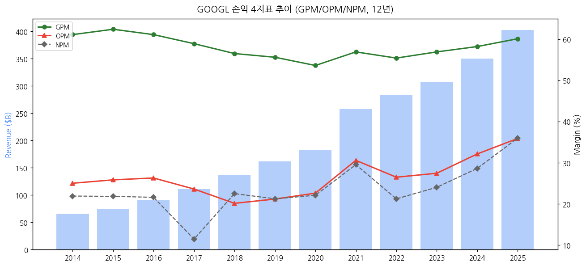

| FY | 매출($B) | GPM(%) | OPM(%) | NPM(%) |
|----|---------|--------|--------|--------|
| 2014 | 66.0 | 61.1 | 25.0 | 21.9 |
| 2017 | 110.9 | 58.9 | 23.6 | 11.4 |
| 2020 | 182.5 | 53.6 | 22.6 | 22.1 |
| 2023 | 307.4 | 56.9 | 27.4 | 24.0 |
| 2024 | 350.0 | 58.2 | 32.1 | 28.6 |
| **2025** | **402.8** | **60.1** | **35.9** | **36.0** |

→ GPM이 2020 53.6% 저점에서 2025 60.1%로 회복. AI 인프라 효율화 + Cloud 마진 가속.

### ② 재무상태표

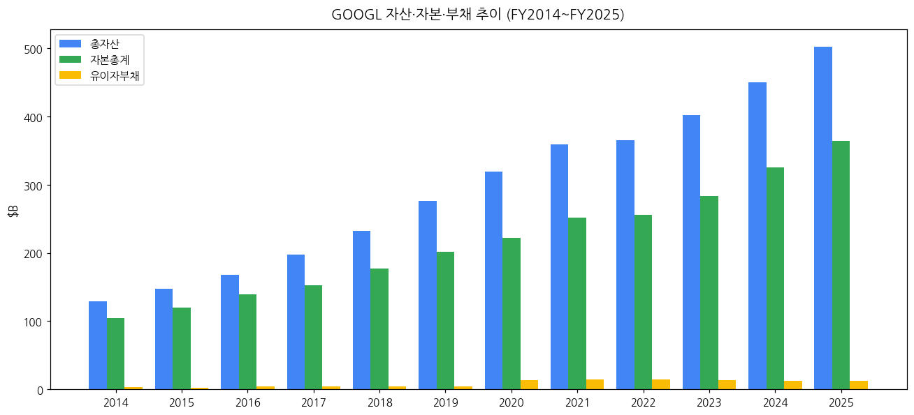

→ Alphabet은 **현금 부자 + 무차입** 회사. FY2025 총자산 $502.6B 중 자본 $364.2B (72%), 유이자부채 $12.5B (2.5%). 부채비율 매우 낮음.

### ③ 현금흐름표

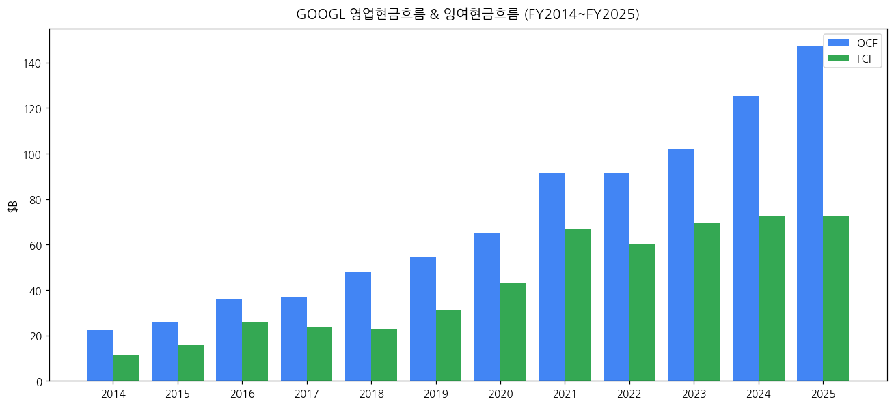

| FY | OCF($B) | CapEx($B) | FCF($B) | FCF 마진(%) |
|----|---------|----------|---------|------------|
| 2020 | 65.1 | 22.3 | 42.8 | 23.4 |
| 2023 | 101.7 | 32.3 | 69.5 | 22.6 |
| 2024 | 125.3 | 52.5 | 72.8 | 20.8 |
| **2025** | **147.5** | **75.0** | **72.5** | **18.0** |

→ FY2025 OCF $147.5B 사상 최대. CapEx $75B 폭증으로 FCF는 $72.5B 정체. AI 인프라 투자 슈퍼사이클.

### ④ CapEx + 사이클 annotation

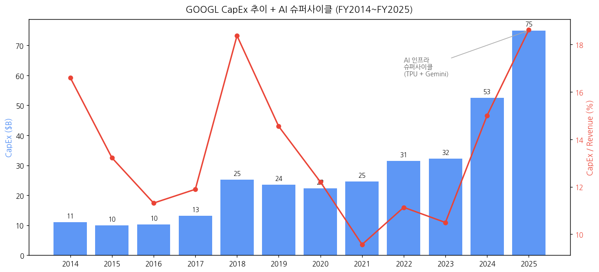

| FY | CapEx($B) | CapEx/Rev(%) | 비고 |
|----|----------|-------------|------|
| 2014~2016 | 10~13 | 11~15% | 안정 |
| 2018 | 25.1 | 18.4 | 1차 폭증 (데이터센터 확장) |
| 2020~2022 | 22~31 | 11~12% | 안정 |
| 2024 | 52.5 | 15.0 | AI 1차 폭증 |
| **2025** | **75.0** | **18.6** | **AI 슈퍼사이클** |
| 2026E | ~100E | ~22E | TPU + 데이터센터 확장 |

→ Q1 2026 단독 CapEx ~$22B (연간 환산 $88B+). AI 인프라 슈퍼사이클 본격화.

### ⑤ 부채구조

- **Long-term debt** (FY2025): $12.5B (변동 거의 없음, 2020년 처음으로 채권 발행)
- **신용등급**: S&P AA+ (US Treasury 다음 수준), Moody's Aa2
- **현금 + 마켓 시큐리티**: FY2025 ~$140B (cash + ST/LT marketable securities)
- **Net cash position**: ~+$128B (현금 - 부채)

### ⑥ 배당·자사주

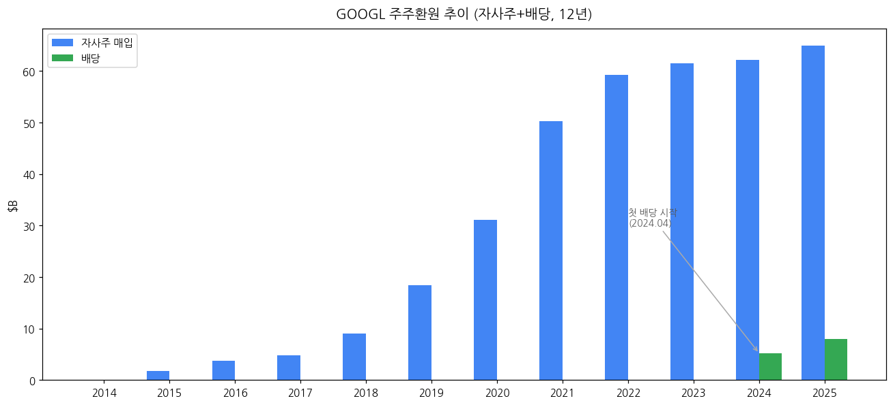

- **첫 배당 (2024.04 시작)**: $0.20/share quarterly → 2025 $0.21/share = 연 $0.84/share
  - 2024 총 배당 ~$5.2B
  - 2025 총 배당 ~$8.0B
- **자사주 매입**:
  - 2022년 $70B authorization → 2023 $61.5B 매입
  - 2024년 $70B 추가 authorization → 2024 $62.2B 매입
  - 2025년 $65B 매입 (FY 추정)
  - **누적 자사주 매입 12년 ~$367B**
- **2024.07.01 20:1 액면분할** — split-adjusted EPS 표시

### ⑦ 재무비율 (FY2025 기준)

| 비율 | 값 | FY2024 |
|------|-----|-------|
| ROE | 39.7% | 30.8% |
| ROA | 28.8% | 22.2% |
| 부채비율(D/E) | 3.4% | 4.0% |
| 유동비율 | 1.91 | 1.84 |
| 이자보상배율 | 200x+ | 150x+ |
| FCF 마진 | 18.0% | 20.8% |

→ ROE 39.7% — 미국 빅테크 중 최고 수준. 자본 효율성 극한.

---

## 5. 지배 구조

### ① 그룹·계열 관계

- **Alphabet Inc.** (홀딩스, 2015.10.02 형성)
  - **Google LLC** (search/YouTube/Android/Cloud, 매출 99.6%)
  - **Other Bets** (Waymo, Verily, Wing, X, Google Fiber 등)
  - **DeepMind** (2023.04 Google Brain과 통합, AI 연구)

### ② 주주 구분 + 의결권 구조

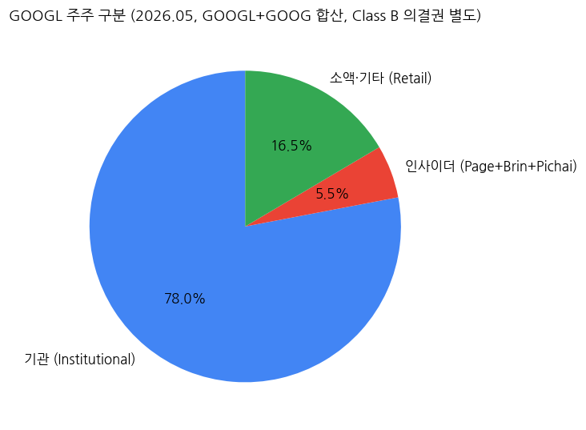

| 구분 | GOOGL+GOOG 합산 비중 | 비고 |
|------|----------------------|------|
| 기관투자자 | ~78% | Vanguard, BlackRock, State Street |
| 인사이더 (Page+Brin+Pichai) | ~5.5% | 경제권 |
| 소액·기타 (Retail) | ~16.5% | |

**3-Class 의결권 구조** (Alphabet의 핵심 governance 특징):

| 클래스 | 주식수 (대략) | 의결권 | 거래여부 | 보유자 |
|--------|--------------|--------|---------|--------|
| Class A (GOOGL) | ~6.0B | 1주 1표 | 거래 가능 | 일반 투자자 |
| Class B | ~0.86B | **1주 10표** | **비공개** | **Larry Page (43%) + Sergey Brin (43%) + 임직원** |
| Class C (GOOG) | ~5.4B | 0표 (비의결권) | 거래 가능 | 일반 투자자 |

→ **Page + Brin은 Class B로 합산 의결권 ~51% 보유** — 사실상 회사 지배. 외부 적대적 인수 불가능.

### ③ 임원·이사회

- **CEO**: Sundar Pichai (2019.12~ Alphabet & Google 통합)
- **CFO**: Anat Ashkenazi (2024.07~, 전 Eli Lilly)
- **President & CIO**: Ruth Porat (전 CFO, 2024.09부터 사장 승진)
- **Cloud CEO**: Thomas Kurian (2018.11~)
- **DeepMind CEO**: Demis Hassabis
- **이사회 (Board)**: 11명 (2025년 기준)
- **주요 이사**: John L. Hennessy (Chair, 전 Stanford President), Larry Page, Sergey Brin, Sundar Pichai, Ruth Porat, K. Ram Shriram, Frances Arnold (Nobel Prize 화학상)

---

## 6. 기타 팩트

### ① R&D 인프라

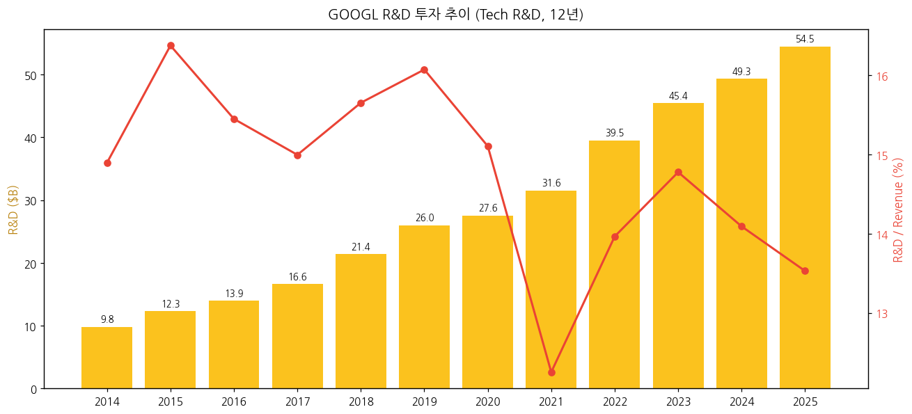

- **FY2025 R&D**: $54.5B (매출의 13.5%)
- 12년 누적 R&D ~$355B
- **AI 연구 인프라**: DeepMind (London), Google Brain (Mountain View) 통합. 연구원 ~5,000명
- **AI 모델**: Gemini, Imagen, Veo, MusicLM, AlphaFold, AlphaCode

### ② 진행 중 corporate action (10년)

| 연도 | 인수/투자 | 금액 |
|------|----------|------|
| 2014 | Nest Labs | $3.2B |
| 2014 | DeepMind | $0.5B |
| 2017 | HTC mobile team | $1.1B |
| 2018 | GitHub 인수 시도 (Microsoft에 빼앗김) | — |
| 2019 | Fitbit | $2.1B (2021 완료) |
| 2021 | Mandiant (사이버보안) — 시도 → 무산 | — |
| 2022 | Mandiant | $5.4B |
| 2023 | Anthropic 투자 | $2B (누적 $3B+) |
| 2024 | Wiz 인수 시도 | $23B (무산) |
| 2025 | **Wiz 재인수** | **$32B** (2025.03 발표, 미 완료) |

### ③ R&D 마일스톤 (10년)

| 연도 | 마일스톤 |
|------|---------|
| 2014 | Knowledge Graph 확장, Project Tango |
| 2016 | TPU v1 발표, AlphaGo 승리 |
| 2017 | TPU v2/v3, Transformer 논문 (Attention is All You Need) |
| 2018 | BERT 모델, Duplex AI 어시스턴트 |
| 2019 | Quantum supremacy 달성 |
| 2020 | TPU v4, AlphaFold 2 |
| 2021 | LaMDA (대화형 AI 발표) |
| 2022 | PaLM, AlphaFold 단백질 200M 공개 |
| 2023 | **Bard → Gemini 출시**, DeepMind+Brain 통합 |
| 2024 | Gemini 1.5/2.0, **AI Overviews** in Search, **TPU v6 (Trillium)** |
| 2025 | Gemini 2.5/3.0, **TPU v7**, Veo 2/3, Imagen 3 |
| 2026 Q1 | Gemini App 350M+ 구독자 |

### ④ 주요 리스크

- **반독점 소송 — 최대 리스크**:
  - **미국 DOJ Search 반독점** (2024.08 패소) → **분사 명령 가능성** (Chrome 매각 요구). 2025 항소 진행 중
  - **미국 DOJ AdTech 반독점** (2024.09 추가 제소)
  - **EU 디지털 마켓법 (DMA)** 컴플라이언스
  - 누적 EU 벌금 €8.3B+ (Shopping €2.42B 2017 + Android €4.34B 2018 + AdSense €1.49B 2019)
- **AI 검색 잠식 리스크**: ChatGPT/Perplexity 등 신생 AI 검색 → Google 검색 광고 모델 위협
- **AI Overviews monetization 불확실성**: AI 응답이 광고 클릭률 감소 우려 (현재까지 회사는 OK라고 disclosure)
- **CapEx ROI**: $75B+ AI 인프라 투자의 회수 시점 불확실
- **Other Bets 적자 지속**: Waymo 본격 매출 시점 지연 가능성
- **광고 사이클**: 디지털 광고 매크로 침체 시 매출 단기 위축

### ⑤ ESG 등급

- **MSCI ESG**: BBB (2025)
- **Sustainalytics**: 24.5 (Medium Risk)
- **탄소중립**: 2007년 carbon neutral 달성, 2030년 24/7 carbon-free energy 목표
- **거버넌스 이슈**: 3-class 의결권으로 ISS·Glass Lewis 등 proxy advisor가 governance F 등급

### ⑥ 인증·라이선스

- **Cloud**: FedRAMP High, ISO 27001/27017/27018, SOC 1/2/3, HIPAA, GDPR
- **Android**: Google Play Protect (보안 인증)
- **AI/ML**: Responsible AI Practices framework

---

## Source Audit & 검증 가능 링크

### ✅ 확보 자료 (1차 출처)

- **SEC EDGAR 10-K**: 11개 (FY2015~FY2025) — `https://www.sec.gov/cgi-bin/browse-edgar?action=getcompany&CIK=0001652044`
- **SEC EDGAR 10-Q**: ~32개 (Q3 2015~Q1 2026)
- **SEC EDGAR 8-K**: 149개 (전체)
- **Alphabet IR Press Release**: **43개** (Q3 2015~Q1 2026, ~10.5년 연속)
  - q4cdn.com IR PDF 16개 (Q1 2022~Q1 2026 + 일부)
  - SEC 8-K Exhibit 99.1 HTM 27개 (Q3 2015~Q4 2021 + 누락 분기)
- **Yahoo Finance v8**: GOOGL 월간 OHLC 237개 (2005-09~2025-05, 20년)
- **Q1 2026 Press Release**: https://s206.q4cdn.com/479360582/files/doc_financials/2026/q1/2026q1-alphabet-earnings-release.pdf
- **Q4 2025 Press Release**: https://s206.q4cdn.com/479360582/files/doc_financials/2025/q4/2025q4-alphabet-earnings-release.pdf

### ❌ 누락 / ⚠️ 추정 데이터

- **2015 Q1-Q2 (Alphabet 형성 전)**: Google Inc CIK 0001288776 별도 filings. 본 리포트는 Alphabet 시점 (Q3 2015~)으로 시작.
- **GPM 시계열**: Alphabet은 GPM 직접 보고하지 않음 — (Revenue - TAC - Cost of Revenue) / Revenue 추정.
- **Other Bets 사업별 매출**: Waymo/Verily/Wing 등 개별 매출 미공시.
- **TPU 자체 사용 vs 외부 판매 매출 비중**: 미공시.

### 🔗 핵심 검증 URL

- Alphabet IR: https://abc.xyz/investor/
- Earnings: https://abc.xyz/investor/earnings/
- SEC EDGAR Alphabet: https://www.sec.gov/cgi-bin/browse-edgar?action=getcompany&CIK=0001652044
- Q1 2026 Webcast: https://abc.xyz/investor/events/event-details/2026/2026-Q1-Earnings-Call-2026-nW8kCrBAKS/

### Alphabet IR URL 패턴 (작업용 reference)

- **IR PDF**: `https://s206.q4cdn.com/479360582/files/doc_financials/{YYYY}/q{N}/{YYYY}q{N}-alphabet-earnings-release.pdf`
- **SEC 8-K Ex991**: `https://www.sec.gov/Archives/edgar/data/1652044/{accession_clean}/googexhibit991q{N}{YYYY}.htm` (2020 Q3-Q4는 `googexhibit991q{N}{YY}.htm` 단축형)

---

## Version Log

**v1.0 (2026-05-19)**:
- 최초 작성. 12년 연간 (FY2014~FY2025) + 43분기 (Q3 2015~Q1 2026, ~10.5년 연속) 시계열 반영
- AMZN 검증 패턴 적용: SEC EDGAR (10-K/10-Q/8-K 149개) + q4cdn IR PDF 16개 + SEC 8-K Ex991 HTM 27개 + Yahoo Finance 20년
- 14종 차트 임베드 (chart1, chart1b, chart2, chart3 분기stacked, chart4-13)
- Q1 2026 Cloud +63%, AI 슈퍼사이클 진입 반영
- 3-Class 의결권 구조 + EU 반독점 + DOJ 분사 명령 리스크 정리
- 잔여 보완 후보 (v1.1): (1) Q1-Q2 2015 Google Inc 시계열 통합, (2) Waymo 사업별 정밀화 (10-K 별도 disclosure 검토), (3) Wiz 인수 완료 시 corporate action 갱신
