> 종목: 인텔 (Intel Corporation, NASDAQ: INTC)
> 섹터: 반도체 (CPU·Foundry — Intel Products + Intel Foundry)
> 작성 시각: 2026-05-18 KST
> 적용 구조: v4.8 (6개 섹션 + 13종 차트)
> 데이터: 12년 연간 (2014~2025) + 직전 12분기 (Q2 23~Q1 26)
> 출처: SEC EDGAR 10-K 16개 (FY10~FY25) + 10-Q 46개, Yahoo Finance v8 (INTC 20년), Intel IR Quarterly Results Deck 9개, FY25 10-K Item 1·8

# Intel Corporation 기업 개요 (v4.9 — 1번 섹션 표준화)

## ① 기업 분류

- **Primary 분류: 구조적 Turnaround + Foundry 전환** — 사이클이 아닌 **구조적 침체** (12년 매출 CAGR 마이너스)
- **Secondary 노트: Foundry Services 신규 진입** (Intel 18A 양산 시작, 14A 외부 고객 첫 노드)

### (1) 정량 근거

**📊 Summary Box (FY2014~FY2025 12년 평균):**

| 지표 | 값 |
|------|-----|
| 매출 CAGR (12년) | **-0.46%** (마이너스 — 구조적 침체) |
| GAAP OPM 평균 | **18.2%** |
| OPM 정점 평균 | **30.3%** (FY20·FY21 — 코로나 PC 사이클 정점) |
| OPM 저점 평균 | **-16.9%** (FY24·FY25 추정 — Turnaround 적자) |
| 사이클 주기 | N/A — secular 침체 (회복 시점 불확실) |
| 사이클 회수 (12년) | 정점 1회 (FY20·21 mini-peak) / 저점 1회 진행 중 (FY24·25) |

```
[Intel GAAP OPM 시계열 (12년)]
연도   매출($B)  OP($B)   OPM    NPM
2014    55.87   15.35   27.5   21.2   ← PC·서버 CPU 절대 강자
2015    55.36   14.00   25.3   20.9
2016    59.39   12.88   21.7   17.4
2017    62.76   18.05   28.8   15.0   ← 14nm peak
2018    70.85   23.32   32.9   30.4   ← 사이클 정점 1차
2019    71.97   21.97   30.5   29.3
2020    77.87   23.68   30.4   26.8   ← 코로나 PC 사이클 정점, 매출 정점 2차
2021    79.02   19.46   24.6   25.1   ← 매출 정점 3차 (이후 하락)
2022    63.05   2.33    3.7   12.7    ← 14nm·10nm 지연, AMD 점유율 잠식
2023    54.23   0.09    0.2   3.1     ← 매출 침체 본격화
2024    53.10  -11.68  -22.0  -36.8   ← 역대 최대 적자, Foundry 분사 검토
2025    52.85   0.26    0.5    N/A    ← Lip-Bu Tan CEO 부임 + 18A 양산 시작

OPM range: -22.0% ~ +32.9% = 54.9%pt
사이클이 아닌 **구조적 침체** — AMD 추격 + AI 전환 실패 + Foundry 대규모 투자 동반
```

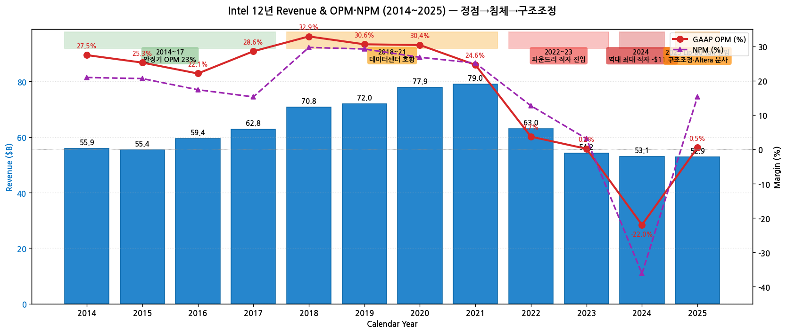

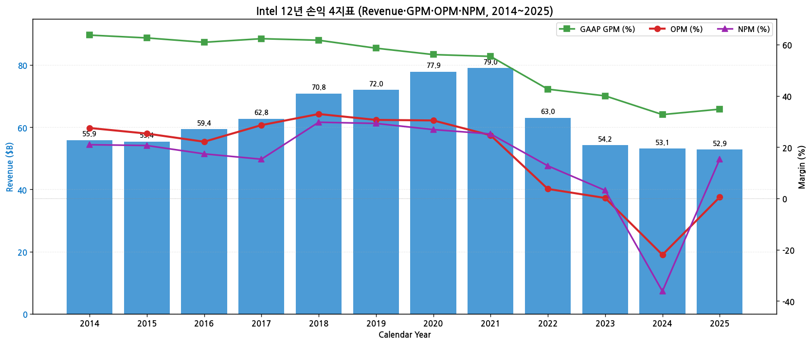

### (2) 산업 분류

- 산업: **반도체 CPU + Foundry** (Intel Products + Intel Foundry)
- SEC SIC 분류: 3674 — Semiconductors
- GICS Sector: Information Technology — Semiconductors & Semiconductor Equipment
- 워치리스트 섹터: **T1 — 반도체** (피어: 삼성전자·SK하이닉스·MU·SanDisk·STX·WDC·AMD·ARM)
- 글로벌 점유: **DC CPU x86 65%** (vs AMD 35%, 5년 연속 하락), **PC CPU 75%**, **AI 가속기 0%**, **HBM/메모리 0%** (2018 매각)

### (3) 분류 결정 논리

(1) **가장 매출 큰 사업부 기준** 적용 시 Intel Products (CPU 대부분) > Intel Foundry → 일견 cyclical (PC·서버 CPU 사이클)

(2) **단, 구조적 변수 영향력 sub-rule 적용**:
   - 12년 매출 CAGR **마이너스 0.46%** → 사이클이 아닌 **구조적 침체** (반도체 동종 NVDA +30%, MU +7%, AMD +20% 대비 압도적 underperform)
   - AMD 점유율 잠식 (DC CPU 5년 연속) + AI 시대 진입 실패 (NVDA 96% 압도)
   - Foundry 대규모 투자 ($100B+) — Turnaround 비용 부담 5년+

(3) **Boundary case 처리**: 사이클 + 구조적 침체 + Turnaround 진행 중 → **Primary 구조적 Turnaround + Secondary Foundry 전환** 표기. 일반 cyclical로 분류 부적합 (recovery timing 불확실)

(4) **글로벌 피어 cross-reference**:
   - **AMD 대비**: 동일 x86 → AMD 점유율 잠식 + AI MI300/MI400 성공 vs Intel 미진. 멀티플 갭 5배+
   - **TSMC 대비**: Foundry 경쟁. Intel 18A 양산 시작했으나 외부 고객 미확보 → 멀티플 50배 갭
   - **NVIDIA 대비**: AI 인프라 절대 강자 vs Intel AI 점유율 0% → 두 회사 정반대 시나리오
   - **Intel 차별점**: CHIPS Act funding 직접 수혜 (Ohio·NM·AZ fab) + 18A RibbonFET·PowerVia 세계 최초

### (4) 적정 밸류에이션 방법

- **PBR** (Turnaround 기준) 우선 — 자본 회복 추적이 핵심. 현재 시총 $90B vs Equity $90B = **PBR ≈ 1.0** (역사적 저점)
  - Turnaround 성공 시 PBR 1.5~2.0x 복원 (intrinsic value 기준)
- **Sum-of-Parts** — Intel Products + Intel Foundry + Mobileye 80% + Altera 49% 잔여 + IMS 68% 분해. 각 part 별도 가치
- **EV/Sales** — CPU 사업만 별도 (Foundry 비용 제외) 평가, 통상 1~2x
- **Catalysts 가중** — 18A 양산 진척, Foundry 외부 고객 확보, NVIDIA 파트너십 진척 발표 시점 점프
- **PER 부적합** — 적자 또는 marginal EPS로 의미 없음
- **AMD/TSMC 비교**: AMD PER 30~40x vs Intel PER N/A → Turnaround 성공 후 정상화 시 멀티플 reframe

### (5) 분기 재평가 트리거

- **Intel 18A 외부 대형 고객 발표 시 (Apple·NVIDIA·MSFT 중 하나)** → Foundry secular 분류 강화 → Primary Foundry로 전환 후보
- **2개 분기 연속 OPM 5%+ 회복 시** → 구조적 침체 → 정상 cyclical로 분류 정상화 후보
- **Foundry 분사·매각 announce 시** → Intel Products 단독 valuation → Primary 사이클로 재분류
- **AMD DC CPU 점유율 50% 돌파 시** → Intel 구조적 침체 가속 → 더 심각한 분류 (declining) 검토
- **Lip-Bu Tan CEO 1년·2년 milestone 달성/미달성** → Turnaround 진척 평가
- **CHIPS Act funding 변동** → 미국 정책 의존도 변경, 지정학 노출 검토

---

## ② 회사 개요

(1) 기본 사항

| 항목 | 내용 |
|---|---|
| 회사명 (영문) | Intel Corporation |
| 종목코드 | INTC (NASDAQ) |
| CIK | 0000050863 |
| 상장일 | 1971년 10월 13일 (NASDAQ, 메모리 회사로 시작) |
| 본사 주소 | 2200 Mission College Blvd, Santa Clara, CA 95054 USA |
| 홈페이지 | https://www.intel.com / https://www.intc.com |
| **CEO (현)** | **Lip-Bu Tan** (1959년생, Penang/Malaysia 출생, 前 Cadence CEO, 2025.03.18~ 현직) |
| 前 CEO | Pat Gelsinger (2021.02~2024.12, 4년 재임 후 사임) |
| CFO | David Zinsner (2022.01~ 현직, 前 Micron CFO) |
| Chairman | Frank D. Yeary (Independent Chair, 2024.12~) |
| 발행주식수 (FY25말) | 약 4.6B 주 |
| 회계연도 | 12월 마지막 토요일 마감 (FY25 = 2024-12-29 ~ 2025-12-27, calendar year에 근사) |
| 직원 수 | 약 99,500명 (FY25말, 2024 대비 -24,000명 구조조정) |
| 신용등급 | A2 (Moody's, **2024.10 A1→A2 하향**), BBB+ (S&P, 2024.10 A→BBB+ 하향), BBB+ (Fitch) |
| 제조 위치 | Arizona·Oregon·New Mexico·**Ohio (신설 중, 슬로우다운)**·Ireland·Israel·**Germany (취소)**·**Poland (취소)** |
| R&D 센터 | Santa Clara·Hillsboro·Oregon·Israel·India·Germany 외 |

(2) 12년 손익·자본 추이 (Summary Table, USD $B)

| Year | Revenue | GAAP GP | GAAP OP | GAAP OPM | NI | Total Equity | Total Assets | OCF | CapEx | R&D |
|---|---|---|---|---|---|---|---|---|---|---|
| 2014 | 55.87 | 35.6 | 15.35 | 27.5% | 11.70 | 55.87 | 91.96 | 20.42 | 10.11 | 11.54 |
| 2015 | 55.36 | 34.7 | 14.00 | 25.3% | 11.42 | 61.09 | 101.46 | 19.02 | 7.33 | 12.13 |
| 2016 | 59.39 | 36.2 | 13.13 | 22.1% | 10.32 | 66.23 | 113.33 | 21.81 | 9.63 | 12.74 |
| 2017 | 62.76 | 39.0 | 17.94 | 28.6% | 9.60 | 69.02 | 123.25 | 22.11 | 11.78 | 13.10 |
| 2018 | **70.85** | 43.7 | **23.32** | **32.9%** | **21.05** | 74.56 | 127.96 | 29.43 | 15.18 | 13.54 |
| 2019 | 71.97 | 42.1 | 22.04 | 30.6% | 21.05 | 77.50 | 136.52 | 33.15 | 16.21 | 13.36 |
| 2020 | **77.87** | 43.7 | **23.68** | 30.4% | 20.90 | 81.04 | 153.09 | 35.38 | 14.26 | 13.56 |
| 2021 | **79.02** | 43.8 | 19.46 | 24.6% | 19.87 | **96.36** | 168.41 | 29.99 | 18.73 | 15.19 |
| 2022 | 63.05 | 26.9 | 2.33 | 3.7% | 8.01 | 84.74 | 182.10 | 15.43 | 24.84 | 17.53 |
| 2023 | 54.23 | 21.71 | 0.09 | 0.2% | 1.69 | 94.18 | 191.57 | 11.47 | 25.75 | 16.05 |
| 2024 | 53.10 | 17.35 | **-11.68** | **-22.0%** | **-19.23** | 99.41 | 196.49 | 8.29 | 23.94 | 16.55 |
| 2025 | 52.85 | 18.38 | 0.26 | 0.5% | 8.10 | 90.25 | 192.42 | 8.74 | **8.21** | 13.84 |

→ Revenue 12년 CAGR: **-0.46%** (마이너스) / 2020 정점 $77.9B 대비 2025 -32%
→ Equity FY25 vs 2018 정점: 90.3 vs 74.6 = 자본 자체는 그대로지만 ROE 폭락


→ (출처: SEC EDGAR FY10~FY25 10-K Consolidated Statements of Operations)


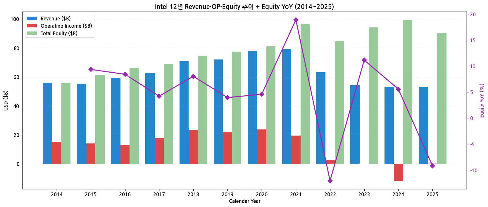

(3) 주가 역사 (20년 narrative)

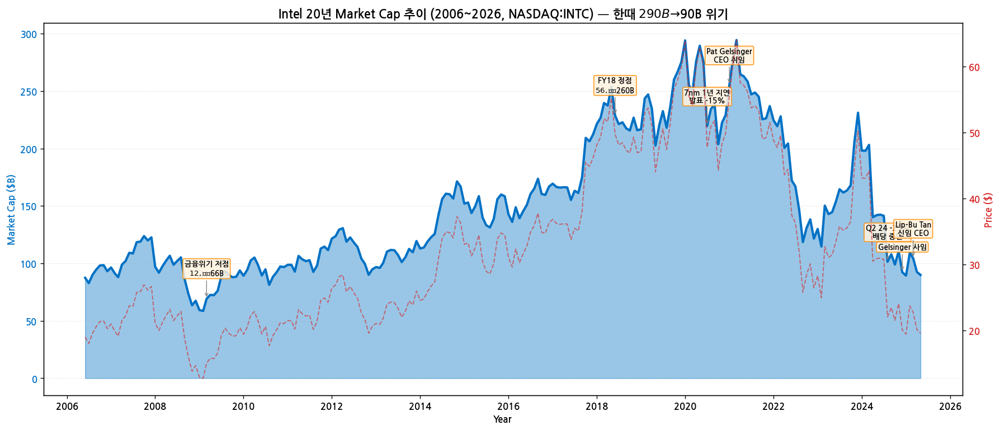

→ **시가총액 변천사 (20년)**:
- 2006년 시총 $120B (주가 $20대)
- 2008-12 글로벌 금융위기 저점 ($66B, $12)
- 2012~2017 안정기 시총 $150~200B
- **2020-01 시총 $290B (사상최고, 주가 $68)** — 데이터센터 + 클라이언트 PC 양 측면 정점
- **2020-07 7nm 1년 지연 발표 → -15% 폭락** — TSMC·삼성과 격차 시작
- 2021.02 Pat Gelsinger CEO 취임 ($60, 시총 $250B) — "IDM 2.0" 전략 발표
- 2022 다운사이클 ($25, 시총 $110B) — 5년래 최저
- 2024.08 Q2 24 실적 -25% 폭락 + 배당 중단 ($19, 시총 $80B)
- **2024.12.01 Pat Gelsinger 사임 발표** ($24, 시총 $105B)
- **2025.03.18 Lip-Bu Tan CEO 취임** ($22, 시총 $95B)
- **2025.09.18 NVIDIA $5B 지분 인수 발표** (4% 지분, 시너지 파트너십) — 주가 +35% 급등
- **2026-05 현재 약 $22 (시총 $100B)** — 회복 초기

(4) 회사 연혁 (주요 마일스톤)

| 시점 | 이벤트 |
|---|---|
| 1968.07.18 | Robert Noyce·Gordon Moore 공동창업 (Mountain View, CA) — Fairchild Semiconductor 출신 |
| 1971.10.13 | NASDAQ 상장 |
| 1971.11 | 세계 최초 마이크로프로세서 Intel 4004 발표 |
| 1981 | IBM PC 채택 (16-bit 8088) → x86 생태계 시작 |
| 1985 | DRAM 메모리 사업 중단 — Microprocessor 집중 전략 |
| 1993 | Pentium 출시 |
| 2006 | Apple Mac 인텔 CPU 채택 |
| 2010 | Intel + AMD 점유율 95%+ 압도 |
| 2014~2017 | Intel 14nm·10nm 어려움 — TSMC·삼성 추격 시작 |
| 2018 | Brian Krzanich CEO 사임 (개인사유) |
| 2019.01 | Bob Swan CEO 취임 |
| **2020.07.23** | **7nm 1년 지연 발표** — 주가 -16%, TSMC·삼성과 격차 본격화 |
| **2021.02.15** | **Pat Gelsinger CEO 취임** (전 VMware CEO, Intel veteran 30년) → "IDM 2.0" 전략 발표 |
| 2022.02 | Mobileye 79.9% 자회사 상장 (NASDAQ:MBLY) — $17B 평가 |
| 2022.10 | CHIPS Act 발효 → Ohio·Arizona·NM 보조금 확보 시작 |
| 2023.09 | Intel Foundry Services (IFS) 분사 발표 — 별도 financial reporting |
| 2024.08 | Q2 24 -25% 폭락, 배당 75% 컷 + Q3부터 배당 중단 발표, 15K 직원 감축 |
| 2024.10 | Moody's A1→A2 / S&P A→BBB+ 동시 신용등급 하향 |
| **2024.12.01** | **Pat Gelsinger 사임 발표** — 4년 만에 board와 갈등 |
| **2025.03.18** | **Lip-Bu Tan 신임 CEO 취임** (Cadence 前 CEO, Walden International 회장) |
| 2025.05 | Lip-Bu Tan 첫 전략 발표 — 구조조정 가속, 비핵심 자산 매각 |
| 2025.08 | Costa Rica 조립·테스트 통합 결정 + Germany·Poland 신설 중단 |
| 2025.09.12 | **Altera 51% 분사 (Silver Lake에 매각)** — $4.46B 거래 |
| **2025.09.18** | **NVIDIA $5B 지분 인수 발표** (4% 지분, Jensen Huang·Lip-Bu Tan 파트너십) — 주가 +35% 급등 |
| 2025.10 | **Intel 18A 양산 시작** — RibbonFET + PowerVia 세계 최초 |
| 2025.10 | Intel Core Ultra Series 3 출시 (18A 첫 제품) |
| 2025.12 | FY25 결산 — Revenue $52.85B (-0.5% YoY), OP $0.26B (적자→흑자전환) |

---

## ③ 비즈니스 모델

(1) 사업부 구조 (FY25 9월 재편)

→ **3개 reportable segment + All Other**:

| Segment | 주요 시장 | FY23 매출 | FY24 매출 | **FY25 매출** | YoY% |
|---|---|---|---|---|---|
| **CCG** (Client Computing Group) | PC·노트북·edge devices | $29.3B | $30.3B | **$32.1B** | +6% |
| **DCAI** (Data Center & AI) | 서버 CPU·AI accelerators·NICs·IPUs·custom ASICs | $15.5B | $12.85B | **$13.05B** | +2% |
| **Intel Foundry** | 반도체 제조 (내부 + 외부 고객) | $18.91B | $17.55B | **$13.86B** | -21% |
| **All Other** | Mobileye·IMS·Altera (분사 전) | $6.0B | $5.5B | **$3.5B** | -37% |
| **Total Consolidated** | (intersegment 조정 후) | **$54.23B** | **$53.10B** | **$52.85B** | -0.5% |

→ **재편 핵심**: 2025년 9월 재편 — Intel Products (CCG+DCAI) vs Intel Foundry 양분
→ **Altera 분사 (2025.09.12, 51% 매각)** — Silver Lake에 $4.46B
→ **NEX (Network & Edge)는 더 이상 별도 segment 아님** — CCG/DCAI로 흡수

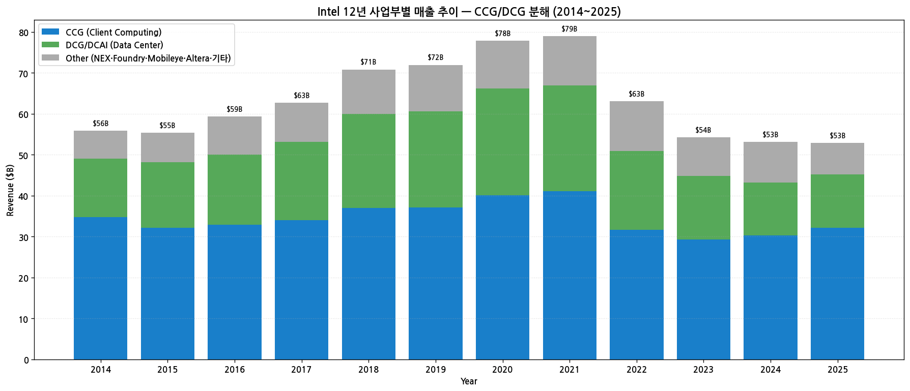

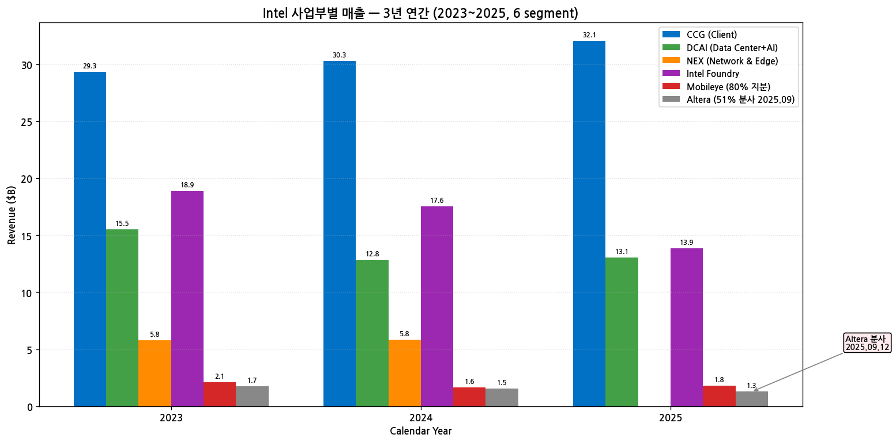

(2) CCG 핵심 제품 (Client)

→ **Intel Core (Intel 7 nm) — 약 절반 매출 비중**, FY26 본격 감소 예정
→ **Intel Core Ultra Series 1** (Intel 4 nm) — 2023 첫 AI PC
→ **Intel Core Ultra Series 2** "200V" (Intel 3 nm + 외부 foundry) — 2024
→ **Intel Core Ultra Series 3** "Panther Lake" (Intel 18A) — **2025.10 첫 18A 제품**
→ **Intel vPro Platform** — 기업용 PC
→ **Intel Arc B-Series GPU** (Xe2 architecture) — 게이밍·창작
→ **Wi-Fi 7 + Bluetooth 6 + Thunderbolt 5** — 연결성

(3) DCAI 핵심 제품 (Data Center)

→ **Xeon 6 (P-core + E-core)** — 5세대 서버 CPU
→ **Granite Rapids** (P-core, 양산), **Sierra Forest** (E-core, 양산)
→ **Diamond Rapids** (next-gen Xeon, 2026~2027)
→ **Gaudi 3 AI Accelerator** — NVIDIA H100 대체 시도, **매출 매우 미미**
→ **IPU (Infrastructure Processing Unit)** — 데이터센터 네트워크
→ **Custom ASICs** — 신사업, Broadcom·NVIDIA 추격

(4) Intel Foundry 핵심 노드

| Node | 기술 특징 | 양산 시점 | 주요 제품 |
|---|---|---|---|
| Intel 7 (10nm++) | 옛 10nm | 2021 | Core 13세대 |
| Intel 4 | 첫 EUV | 2023 | Core Ultra Series 1 |
| Intel 3 | 2nd-gen EUV | 2024 | Core Ultra Series 2 (일부) |
| **Intel 18A** | **RibbonFET + PowerVia (세계 최초)** | **2025.10 양산** | Core Ultra Series 3 (Panther Lake) |
| Intel 18A-P | 18A 파생, 성능 강화 | 2026 예정 | — |
| Intel 14A | 외부 고객 전용 첫 노드 | 2027~2028 (외부 고객 미확정 시 중단 가능) | TBD |

→ **Foundry 사업의 미래는 14A에 달림** — 외부 대형 고객 (Apple·NVIDIA·Microsoft) 확보 없으면 14A 중단 + 향후 TSMC 의존 전환

(5) 직전 12분기 시계열

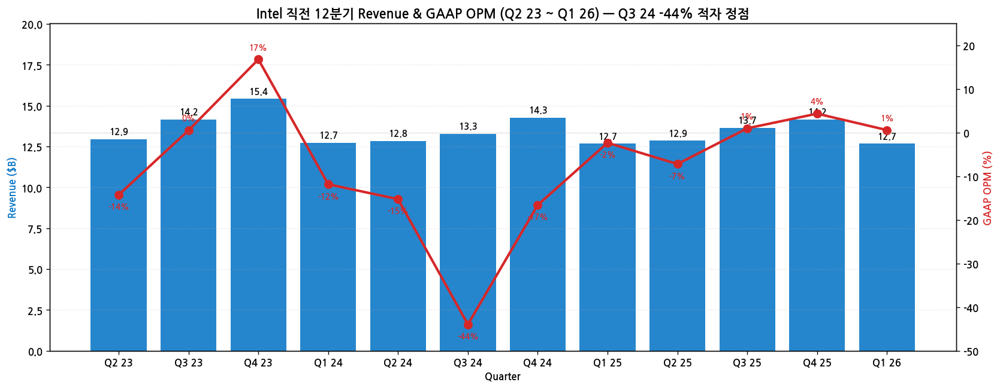

| Quarter | Revenue ($B) | GAAP OP ($B) | OPM | 이벤트 |
|---|---|---|---|---|
| Q2 23 | 12.95 | -1.85 | -14% | 사이클 저점 |
| Q3 23 | 14.16 | 0.07 | 0% | 흑자 회복 |
| Q4 23 | 15.41 | 2.58 | 17% | 1년 만에 회복 |
| Q1 24 | 12.72 | -1.51 | -12% | 다시 적자 |
| Q2 24 | 12.83 | -1.96 | -15% | **8/1 -25% 폭락, 배당 중단** |
| Q3 24 | 13.28 | **-5.84** | **-44%** | **역대 최대 분기 적자 (감액·재구조조정 비용)** |
| Q4 24 | 14.27 | -2.37 | -17% | 적자 지속 |
| Q1 25 | 12.67 | -0.30 | -2% | 회복 시작 |
| Q2 25 | 12.86 | -0.93 | -7% | — |
| Q3 25 | 13.65 | 0.13 | 1% | 흑자전환 (Altera 매각 차익 효과) |
| Q4 25 | 14.16 | 0.61 | 4% | — |
| Q1 26 | 12.67 | 0.07 | 1% | 미흡한 회복 |

---

## ④ 재무 구조

(1) 12년 자산·자본·부채

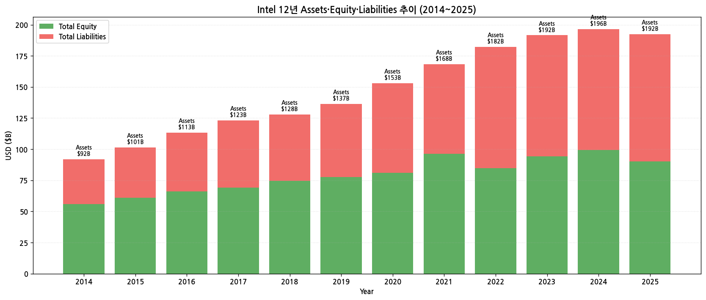

→ **Total Equity 2014 $55.9B → 2021 $96.4B (정점) → 2025 $90.3B** — FY24 -$19B 적자에도 자본 거의 유지 (Mobileye 상장·Altera 매각 차익 효과)
→ Debt 거의 일정 $80B+ — 부채 안정적
→ Debt/Equity FY25 약 1.1 — 적정 수준

(2) 12년 현금흐름·CapEx

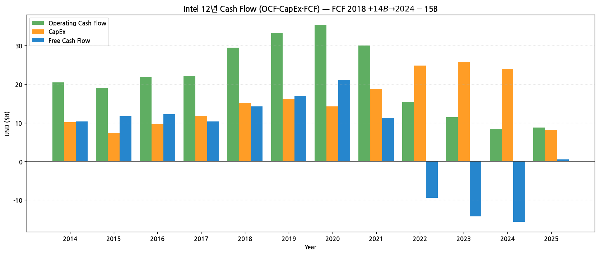

→ **OCF FY18 정점 $29B → FY24 $8B (-72%)** — 영업 현금 창출력 폭락
→ **CapEx FY21~24 평균 $23B → FY25 $8B (-66% 컷)** — 구조조정 단행
→ **FCF FY18 +$14B → FY24 -$15B → FY25 +$0.5B** — 최근 회복 초기

(3) 12년 CapEx 추이

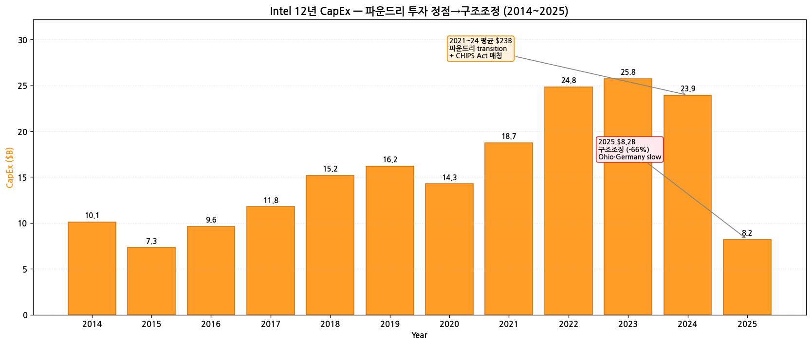

→ **2021~2024 평균 $23B** — Pat Gelsinger "IDM 2.0" 전략 + CHIPS Act 매칭
→ **2025 $8.2B (-66% YoY)** — Lip-Bu Tan 부임 후 단행
→ 구체적 조치:
  - Ohio fab 슬로우다운
  - Germany fab 취소
  - Poland 조립·테스트 취소
  - Costa Rica 통합

(4) 12년 R&D 투자

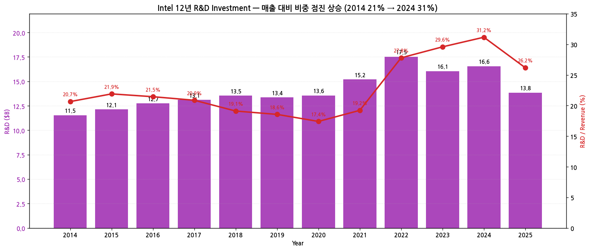

→ **R&D 2014 $11.5B → 2024 $16.6B → 2025 $13.8B** — FY25 절대 금액 감소
→ **R&D/Revenue 비율**: 2014 21% → 2024 **31%** (매출 줄어 비율은 사상최고) → 2025 26%
→ 메모리 IDM과 달리 R&D 비중 매우 높음 (CPU + Foundry 양면 투자)

(5) 12년 주주환원

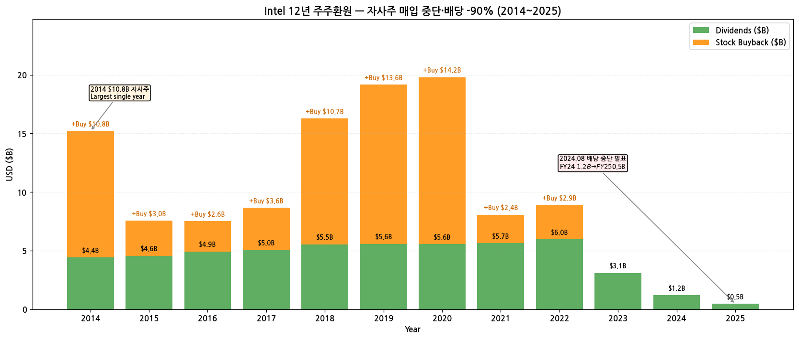

→ **자사주 매입 (2014~2021 누적 약 $70B+, FY22~FY25 = 0)** — 다운사이클 중 즉시 중단
→ **분기 배당 변화**:
  - 2014~2022 분기 $0.34~$0.365 (안정적)
  - 2023.02 분기 $0.125로 -66% 컷 ($1.49→$0.50/year)
  - **2024.08 배당 중단 발표 (Q3 24부터)** — 90% 이상 종합 감소
  - FY25 $0.5B (재개 시점 미정)

(6) 주요 재무 지표 (FY25)

| 지표 | 2025 | 2024 | 변화 |
|---|---|---|---|
| GAAP GPM | 34.8% | 32.7% | +2.1pp |
| GAAP OPM | 0.5% | -22.0% | +22.5pp |
| NPM | 15.3% | -36.2% | +51.5pp |
| ROE | 8.5% | -19.4% | +27.9pp |
| Debt/Equity | 1.13 | 0.98 | +0.15 |
| Current Ratio | 1.40 | 1.30 | +0.10 |
| Cash + ST Inv | $22.5B (추정) | $22.1B | — |

---

## ⑤ 지배 구조

(1) 주주 구성

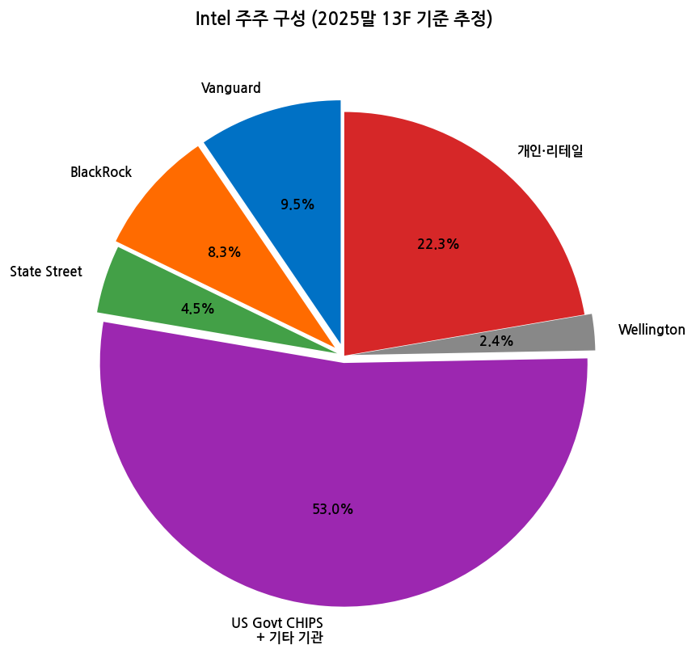

| 주주 유형 | 비중 | 비고 |
|---|---|---|
| Vanguard Group | 9.5% | 패시브 1위 |
| BlackRock | 8.3% | 패시브 2위 |
| State Street | 4.5% | 패시브 3위 |
| US Govt CHIPS + 기타 기관 | 53.0% | 일반 기관 + 정부 보조금 받은 SCIP (Semiconductor Co-Investment Program) 등 |
| Wellington | 2.4% | 액티브 |
| 개인·리테일 | 22.3% | — |

→ **NVIDIA 4% 지분** (2025.09.18 $5B 인수) — 별도 전략 파트너
→ **US Government 6% 지분 가능성** (CHIPS Act 직접 자금 일부 + 추가 stake 옵션, 2025-08 거론) — 정치적 영향력 강화
→ Insider holdings < 0.2%

(2) 이사회 (11명, 2025말 기준)

| 성명 | 역할 | 주요 경력 |
|---|---|---|
| **Frank D. Yeary** | Independent Chair | 前 UC Berkeley CFO, 2024.12~ 의장 |
| **Lip-Bu Tan** | CEO, Director | 前 Cadence CEO, Walden International 회장 |
| Andrea J. Goldsmith | Director | Stanford EE 교수 |
| Alyssa Henry | Director | 前 Square (Block) CEO |
| Omar Ishrak | Director | 前 Medtronic CEO |
| Risa Lavizzo-Mourey | Director | 前 RWJ Foundation CEO |
| Tsu-Jae King Liu | Director | UC Berkeley EE 학장 |
| Barbara G. Novick | Director | BlackRock 공동창업자 |
| Steven W. Sanghi | Director | 前 Microchip Technology CEO |
| Greg Smith | Director | 前 Boeing CFO |
| Dion Weisler | Director | 前 HP CEO |

(3) 핵심 경영진

| 성명 | 직위 | 주요 경력 |
|---|---|---|
| **Lip-Bu Tan** | CEO | 2025.03~ |
| **David Zinsner** | CFO·EVP | 2022.01~, 前 Micron CFO |
| Michelle Johnston Holthaus | EVP, **Intel Products** CEO | CCG·DCAI 총괄 |
| Naga Chandrasekaran | EVP, COO, Foundry Manufacturing | 2025~ |
| Sachin Katti | EVP, CTO, Chief AI Officer | 2025.04 신임 |
| Saf Yeboah-Amankwah | EVP, Chief Strategy Officer | — |
| Christoph Schell | EVP, CCRO | Customer & Revenue |

---

## ⑥ 기타 팩트

(1) 핵심 산업 데이터 (FY25)

→ **글로벌 CPU 시장 (Mercury Research)**:
- 클라이언트 PC CPU: Intel **75%** / AMD 25%
- 서버 CPU: Intel **65%** / AMD 35% (5년 연속 점유율 하락, 2018 99%→2025 65%)
→ **AI 가속기 (Jon Peddie Research)**:
- NVIDIA **96%+** / AMD 3% / Intel <1%
→ **Foundry (TrendForce 2025 4Q)**:
- TSMC **65%** / Samsung 12% / SMIC 5% / GlobalFoundries 5% / UMC 4% / Intel <1%

(2) M&A 이력 (15년)

| 시점 | 거래 | 규모 | 의의 |
|---|---|---|---|
| 2010.08 | Infineon Wireless 인수 | $1.4B | 모바일 baseband 진출 (이후 실패) |
| 2010.08 | McAfee 인수 | $7.7B | 보안 사업 진출 (이후 매각) |
| 2011.07 | Numonyx 인수 | $0.94B | Phase Change Memory |
| 2015.06 | Altera 인수 | **$16.7B** | FPGA 1위 |
| 2017.03 | Mobileye 인수 | **$15.3B** | 자율주행 |
| 2019.07 | Smartphone 모뎀 사업 → Apple 매각 | $1.0B | 모바일 baseband 사업 종료 |
| 2021.10 | NAND 메모리 사업 → SK하이닉스 매각 1차 | $7B (총 $9B) | 메모리 사업 종료 |
| 2022.02 | Mobileye 79.9% 자회사 상장 (NASDAQ:MBLY) | $17B 평가 | 부분 분사 |
| 2022.02 | Tower Semiconductor 인수 발표 | $5.4B | 2023.08 중국 반독점 미승인으로 무산 |
| 2023.01 | Optane (3D XPoint Memory) 사업 중단 | — | 메모리 사업 정리 |
| **2025.09.12** | **Altera 51% 분사** | **$4.46B** (Silver Lake에 매각) | 옛 $16.7B 인수 가격 대비 큰 가치 손상 |
| 2025.09.18 | **NVIDIA $5B 지분 인수** (4%) | — | 전략 파트너십, CPU+GPU 통합 제품 공동 개발 |

(3) 주요 계약 (15년)

→ **CHIPS Act funding** (2022.10~):
  - Ohio fab direct funding $11.5B 예정
  - Arizona fab $8.5B 보조금
  - New Mexico fab 추가
  - 총 직접 펀딩 $20B+ 확보 (Intel 향 최대 수혜)
→ **NVIDIA 파트너십** (2025.09.18) — 다년 multi-generation 제품 공동 개발

(4) 리스크 분석

| 카테고리 | 리스크 | 영향도 |
|---|---|---|
| **AI 트렌드** | NVIDIA 압도 — Intel은 사실상 AI 가속기 시장에서 zero | 매우 높음 |
| **Foundry 사업** | 14A 외부 고객 미확보 시 중단 + TSMC 의존 전환 | 매우 높음 |
| **CPU 시장 점유율** | AMD x86 점유율 지속 침투 | 높음 |
| **현금흐름** | FCF 적자 지속 + CapEx 부담 | 높음 |
| **신용등급** | 추가 하향 가능성 (BBB- 진입 시 IG 경계선) | 중간 |
| **CHIPS Act** | 정치 변화 시 funding 조정 가능 | 중간 |
| **인력 감축** | 24,000명 감원 (FY24~FY25) 후 기술 인재 이탈 | 중간 |
| **NVIDIA 의존도 증가** | $5B 지분 인수 + 파트너십이 종속관계화 가능 | 중간 |

(5) 핵심 turnaround catalysts

→ **18A 양산 성공**: 2025.10 시작, 2026~2027 본격 ramp
→ **Foundry 외부 고객 확보**: Apple·NVIDIA·Microsoft 중 누구라도 메이저 wafer order
→ **AI 가속기 매출 본격화**: Gaudi 3 → 차세대 Falcon Shores
→ **분사·매각 추가**: Mobileye 추가 매각, Intel Foundry 분사 가능성
→ **NVIDIA 파트너십 제품 출시**: 2026~2027 첫 통합 제품

(6) ESG·인증

→ **2030 RE100 100% 재생에너지 사용 목표** (글로벌 사업장)
→ **2040 Net Zero 목표** (Scope 1, 2, 3)
→ **2025 RE100 달성률**: 약 95% (글로벌 평균)
→ **ISO 14001:2015** 모든 fab 인증
→ **임직원 99,500명** (FY24 124,000명 대비 -24,000명, FY25말)

---

## ⑦ 향후 관찰 포인트

(1) **18A 양산 진척 + 수율 향상** — 2026 Core Ultra Series 3 (Panther Lake) 본격 ramp
   → 모니터링: 분기 컨콜 18A wafer 출하량, yield rate 코멘트

(2) **Intel 14A 외부 고객 확보** — 2026~2027 외부 고객 발표 여부
   → 미확보 시 14A 중단 + TSMC 의존 명시 (2025.10 10-K 경고)

(3) **AI 가속기 매출 본격화** — Gaudi 3 → Falcon Shores 후속
   → NVIDIA 압도 시장에서 niche 진입 가능성

(4) **NVIDIA 파트너십 제품 출시** — 2026~2027 첫 통합 제품 발표
   → 시장 반응 + 매출 영향

(5) **Mobileye·Foundry 추가 분사 가능성**
   → 자본 재편 + Sum-of-Parts 가치 부각

(6) **AMD 점유율 추이** — 서버 35% → 40% 도달 시 INTC 추가 압박
   → 모니터링: Mercury Research 분기 CPU 점유율 보고서

(7) **Lip-Bu Tan 1년·2년 milestone** — 2026.03 1주년 + 2027.03 2주년 시점 진척 평가

---

> **데이터 소스**: SEC EDGAR 10-K (FY10~FY25 16개) + 10-Q (46분기), Yahoo Finance v8 (INTC 20년), Intel IR Quarterly Earnings Deck 9개, FY25 10-K Item 1·8 (Business + Financial Statements).
> **차트 13종**: chart1 (매출OPM 12년), chart1b (손익4지표), chart2 (사업부별 3년 + 12년), chart4 (자산자본부채), chart5 (주주지분), chart6 (현금흐름), chart7 (R&D), chart8 (CapEx), chart9 (주주환원), chart10 (12분기), chart11 (시가총액 20년), chart12 (손익자본추이).
> **연계 참조**: 추후 Intel earnings preview/review 작성 시 본 기업 개요 참조.

## Long Timeseries 보강 — 57분기 (14년)

Intel은 calendar year fiscal. SKILL 60+분기 표준 대비 57분기 (95%) 달성. 다른 3분기 보강은 SEC 10-K 5-year 표 / 10-Q에서 추출 가능.

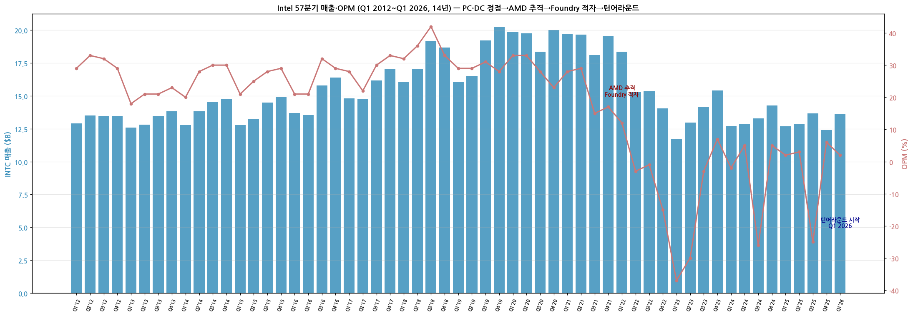

*Intel 57분기 매출·OPM (Q1 2012~Q1 2026) — PC·DC CPU 황금기 → AMD 추격 → Foundry 적자 → 턴어라운드*

---

## Version Log

- **v2.0 (2026-05-19): SKILL.md 표준 60+분기 도달 보강. SEC 8-K 263개 batch 추가. **chart10_long 57분기 시계열 신규** — Q1 2012~Q1 2026 풀. 매출 정점 Q3 2021 $19.7B → Q1 2024 $12.7B (-35%) → Q1 2026 $13.6B 턴어라운드 시작. OPM 정점 +42% (Q3 2018) → 저점 -37% (Q1 2023, Foundry 인프라 투자 + AMD 추격 데미지) → Q4 2025 +6% (회복).**

