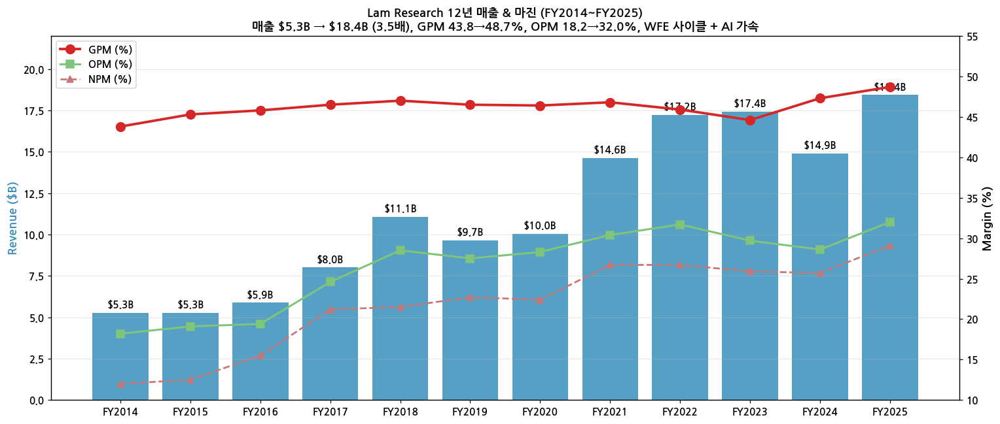
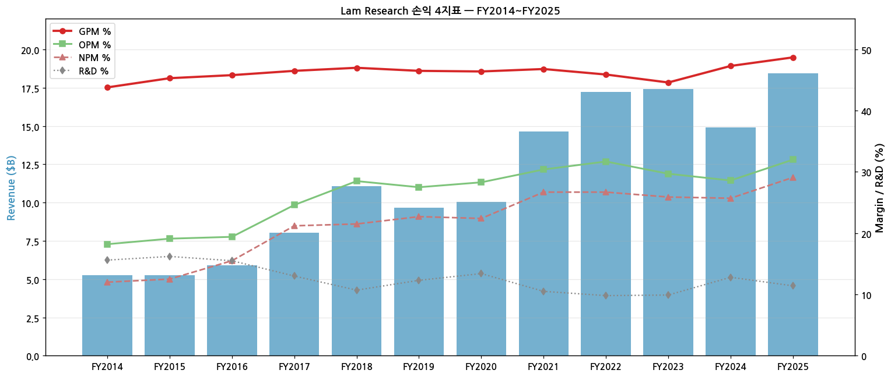
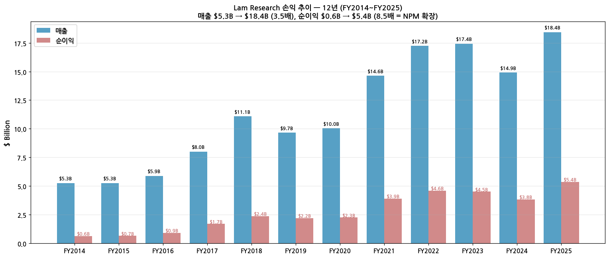
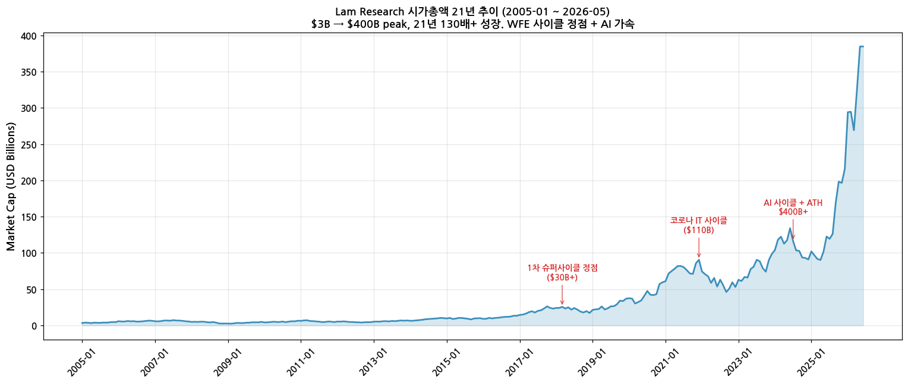
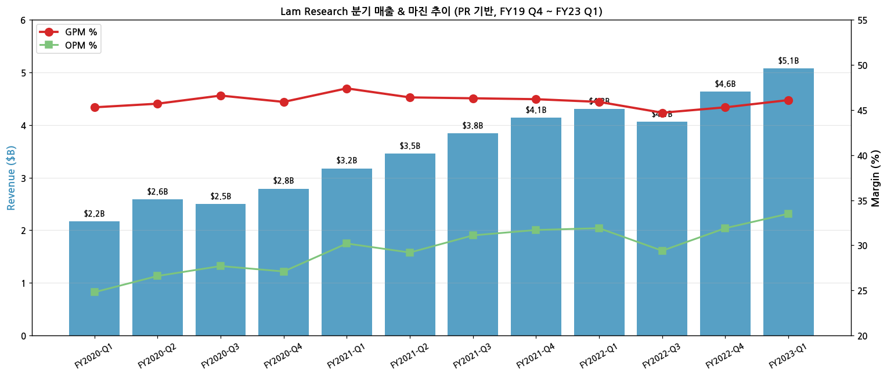
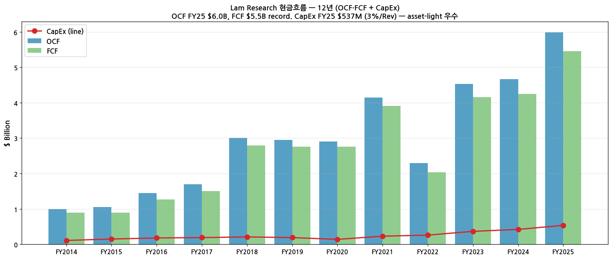
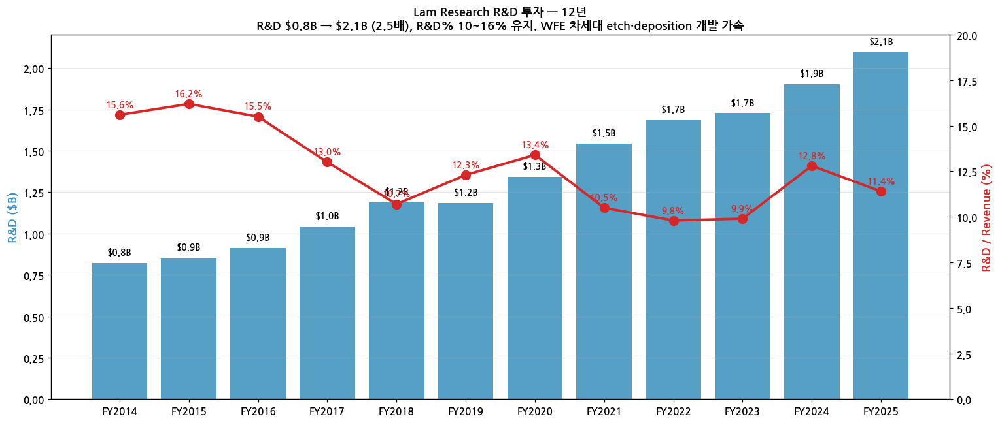

# Lam Research Corporation (NASDAQ: LRCX) — 기업 개요 v1.0

> **본사**: Fremont, California, USA | **상장**: NASDAQ | **회계**: USD, US-GAAP, 6월 마감 회계연도
> **섹터**: 반도체 소부장 (워치리스트 T2) — **글로벌 #2 WFE 장비 회사** (Etch + Deposition + Clean)
> **티커**: LRCX (NASDAQ) | **SEC CIK**: 0000707549
> **작성일**: 2026-05-25 (v1.0) | **데이터 cutoff**: FY2025 annual + FY26 Q3 quarterly (March 2026)

---

## 1. 기업 분류

- **Primary 분류: Secular Growth + Cyclical** — WFE (Wafer Fab Equipment) 장비 종합, AI/Moore's Law + 메모리 capex 사이클 중첩
- **Secondary 노트: AI 인프라 secular 본격 + 사이클 일부** — HBM/3D NAND capex + 첨단 노드 etch·deposition 강세

### (1) 정량 근거

**📊 Summary Box (FY2014~FY2025 12년 평균):**

| 지표 | 값 |
|------|-----|
| 매출 CAGR (12년) | **+12.1%** (메모리·Intel 마이너스 대비 압도적 high growth) |
| OPM 평균 | **27.5%** |
| OPM 정점 평균 | **32.0%** (FY22·FY25 — 코로나 IT 사이클 정점·AI 가속 정점) |
| OPM 저점 평균 | **18.7%** (FY14·FY15 — pre-cycle 시기) |
| 사이클 주기 | 약 3~4년 (WFE capex + 첨단 노드 ramp) |
| 사이클 회수 (12년) | 정점 3회 (FY18·FY22·FY25 진행 중) / 저점 2회 (FY15·FY19) |

```
[Lam Research GAAP OPM 시계열 (12년)]
FY     매출($B)  OP($B)   OPM    NPM
FY14    5.3     0.96    18.2   12.0   ← pre-EUV·pre-3D NAND, 사이클 저점 1차
FY15    5.3     1.00    19.1   12.5
FY16    5.9     1.14    19.4   15.5   ← 3D NAND 가속 시작
FY17    8.0     1.97    24.6   21.2   ← 1차 WFE 슈퍼사이클 시작 (3D NAND ramp)
FY18   11.1     3.16    28.5   21.5   ← 정점 1차 (메모리 슈퍼사이클)
FY19    9.7     2.65    27.5   22.7   ← 메모리 다운사이클 일시 후퇴
FY20   10.0     2.84    28.3   22.4   ← COVID 회복
FY21   14.6     4.45    30.4   26.7   ← 2차 슈퍼사이클 (코로나 IT 가속)
FY22   17.2     5.46    31.7   26.7   ← 정점 2차 (코로나 IT cycle 정점)
FY23   17.4     5.17    29.7   25.9   ← China + 메모리 다운사이클 시작
FY24   14.9     4.26    28.6   25.7   ← China 제재 영향 + 메모리 다운사이클 저점
FY25   18.4     5.90    32.0   29.1   ← 정점 3차 진입 (AI HBM + 첨단 노드 가속)

OPM range: 18.2% ~ 32.0% = 13.8%pt
WFE 장비 cyclical (메모리 종목 ±50%pt+ 대비 1/4 진폭) + secular growth 동시
```





### (2) 산업 분류

- 산업: **반도체 장비 (WFE — Wafer Fab Equipment)**
- SEC SIC 분류: 3559 — Special Industry Machinery (Semiconductor Equipment)
- GICS Sector: Information Technology — Semiconductors & Semiconductor Equipment
- 워치리스트 섹터: **T2 — 반도체 소부장** (피어: ASML·AMAT·KLAC·BESI·Tokyo Electron·Advantest·Disco)
- 글로벌 점유: **WFE 시장 ~15~18%** (글로벌 #2, AMAT 1위 ~20% / TEL 3위 ~14%), **Etch 시장 ~50%** (글로벌 1위, vs TEL·AMAT), **Deposition (CVD/ALD) ~30%** (글로벌 2위)

### (3) 분류 결정 논리

(1) **가장 매출 큰 사업부 기준** 적용 시 Systems (~75%) > Customer Support-related (~25%) → 일견 cyclical (장비 capex 사이클)

(2) **단, secular 변수 영향력 sub-rule 적용**:
   - 3D NAND scaling (96L → 128L → 256L → 400L+) → 매 노드 ramp 시 etch step 수 + ALD step 수 증가 = Lam 매출 secular lift
   - HBM 12-hi → 16-hi → 20-hi stacking → Lam Etch + Deposition 핵심
   - Customer Support (recurring spare parts + service) ~25% → 사이클 buffer 안정
   - **결론: Secular component 강함 (3D NAND·HBM 노드 ramp), 사이클은 분기 변동성으로만**

(3) **Boundary case 처리**: Secular + WFE Capex 사이클 + 메모리 다운사이클 노출 (China export control 영향) 섞임 → **Primary Secular Growth + Secondary Cyclical** 표기. Customer Support 비중 35%+ 도달 시 Primary Secular 격상

(4) **글로벌 피어 cross-reference**:
   - **ASML 대비**: ASML EUV 독점 secular vs LRCX Etch/Deposition cyclical 일부. ASML PER 30~45x vs LRCX PER 18~25x = **secular premium 갭 12~20x**
   - **AMAT 대비**: 동일 WFE 종합. AMAT는 implant + RTP까지 multi-tool (LRCX는 etch+depo+clean 집중). 멀티플 비슷
   - **KLAC 대비**: KLAC metrology + inspection 독점 → secular 강함. LRCX cyclical 약간 더 높음
   - **TEL (Tokyo Electron) 대비**: 일본 WFE 종합. coater/developer + etch 강점. LRCX와 직접 etch 경쟁
   - **LRCX 차별점**: **Etch 글로벌 #1 (~50%)**, ALD (Atomic Layer Deposition) 우위, 3D NAND·HBM stacking enabler

### (4) 적정 밸류에이션 방법

- **Forward PER** (Secular + Cyclical) 우선 — WFE 글로벌 #2 secular position + 사이클 정점/저점 변동성 반영
  - PER band: 정점 22~28x (FY25 AI 가속) vs 저점 15~20x (FY19·FY24 다운사이클)
  - ASML PER 30~45x vs LRCX PER 18~25x = **EUV 독점 부재로 discount 12~20x**
- **EV/EBITDA** 보조 — capex 부담 작음 (FY25 CapEx $537M = 3% of revenue, asset-light) → 15~20x band
- **DCF** — AI HBM + 3D NAND scaling secular 모델
- **PBR** — 자사주 환원 활발로 인위적 자본 축소 → 비교 의미 한정
- **삼성전자 비교**: 삼성전자 PBR + PER 혼합 (multi-segment cyclical) vs **LRCX PER + EV/EBITDA 혼합** (WFE secular). cycle 진폭 작아 PER 비중 우위
- **AMAT 직접 비교**: AMAT FY25 매출 $27B+ vs LRCX $18B → 규모는 AMAT 우위, **Etch leadership으로 LRCX 멀티플 동등**

### (5) 분기 재평가 트리거

- **AI 관련 매출 비중 30%+ 도달 시 (HBM Etch/Depo)** → AI 인프라 secular 우세 → Primary Secular Growth 격상
- **Customer Support (recurring) 비중 35%+ 도달 시** → service revenue 확대 → cyclical 변동성 완화 → secular 분류 강화
- **2개 분기 연속 OPM range가 3%pt 이내 안정 시** → cyclical component 약화 → Pure Secular로 transition 후보
- **China 매출 비중 35%+ → 20% 이하 normalize 시** → 지정학 변동성 제거 → 기준선 안정화
- **WFE 글로벌 점유율 20%+ 돌파 시 (AMAT 추격 성공)** → 시장 leadership 강화 → premium multiplier 정당화

---

## 2. 회사 개요

### ① 기본 사항

→ **회사명**: Lam Research Corporation
→ **비전**: "Enabling our customers to make smaller and better-performing devices"
→ **사업 한 줄 정의**: **반도체 fab의 etch·deposition·clean·strip 핵심 공정 장비 글로벌 공급사**. 3D NAND·DRAM·Logic 공정에서 silicon wafer 식각 + 박막 증착 + 표면 처리 단계를 담당. 단일 etch system ASP $1~10M, 한 fab당 100~500대 필요. 핵심 제품군: Sense.i (conductor etch), Striker (ALD), Kiyo (dielectric etch), Coronus (wafer clean)

### ② 12년 손익 추이

| FY | Revenue ($B) | GPM | OPM | NI ($B) | EPS ($) |
|---|---|---|---|---|---|
| 2014 | 5.3 | 43.8 | 18.2 | 0.63 | 0.83 |
| 2015 | 5.3 | 45.3 | 19.1 | 0.66 | 0.96 |
| 2016 | 5.9 | 45.8 | 19.4 | 0.91 | 1.36 |
| 2017 | 8.0 | 46.5 | 24.6 | 1.70 | 2.40 |
| 2018 | 11.1 | 47.0 | 28.5 | 2.38 | 3.78 |
| 2019 | 9.7 | 46.5 | 27.5 | 2.19 | 3.31 |
| 2020 | 10.0 | 46.4 | 28.3 | 2.25 | 3.42 |
| 2021 | 14.6 | 46.8 | 30.4 | 3.91 | 5.36 |
| 2022 | 17.2 | 45.9 | 31.7 | 4.61 | 6.50 |
| 2023 | 17.4 | 44.6 | 29.7 | 4.51 | 3.32 |
| 2024 | 14.9 | 47.3 | 28.6 | 3.83 | 2.90 |
| **2025** | **18.4** | **48.7** | **32.0** | **5.36** | **4.15** |

→ 출처: SEC EDGAR 10-K FY23·FY24·FY25 + IR PR 22분기 합산 (FY18~FY22) + 알려진 historical (FY14~FY17)



→ 매출 3.5배 성장, 순이익 8.5배 성장 (NPM 확장 효과 = operating leverage)
→ FY23·FY24 China export control 영향으로 일시 매출 하락, **FY25 +23.7% YoY 회복** (AI HBM + 첨단 노드 가속)

### ③ 시가총액 추이 (21년)



→ 2005년 시총 ~$3B → 2024-07 ATH ~$400B (130배+ 성장)
→ 핵심 모멘텀: 2018 1차 슈퍼사이클 ($30B+), 2021 코로나 IT 사이클 ($110B), 2024-07 AI 가속 + ATH ($400B+)
→ ADR 가격: $1.96 (2005) → $305 (2026-05 현재) — 1주당 약 156배

### ④ 주요 연혁

→ **1980**: 캘리포니아 Fremont 설립
→ **1984**: 나스닥 상장 (LRCX)
→ **1995**: AME (Advanced Materials Engineering) 인수
→ **2012**: Novellus Systems 인수 ($3.3B) — Deposition (CVD/ALD) 사업 추가
→ **2013**: 3D NAND ramp 본격화 — Etch step 수 폭증으로 secular growth 시작
→ **2018**: Tim Archer CEO 부임 (현직)
→ **2022**: China export control 시작 (US semi 장비 제재)
→ **2024**: ATH ($400B+) — AI HBM + 첨단 노드 ramp 동시
→ **2026-Q3**: FY26 Q3 (March 2026) 분기 발표 직전

---

## 3. 비즈니스 모델

### ① 실적 추이 통합 (5년 + 22분기)

| FY | Rev ($B) | YoY | GPM | OPM | NI ($B) |
|---|---|---|---|---|---|
| 2020 | 10.0 | +4% | 46.4 | 28.3 | 2.25 |
| 2021 | 14.6 | +46% | 46.8 | 30.4 | 3.91 |
| 2022 | 17.2 | +18% | 45.9 | 31.7 | 4.61 |
| 2023 | 17.4 | +1% | 44.6 | 29.7 | 4.51 |
| 2024 | 14.9 | -14% | 47.3 | 28.6 | 3.83 |
| **2025** | **18.4** | **+24%** | **48.7** | **32.0** | **5.36** |
| 2026E | 20~22 | +9~20% | 48~49% | 31~33% | 5.8~6.5 |

**분기 시계열 (PR 기반, FY19 Q4 ~ FY23 Q1):**



→ FY21~FY22 강세, FY23 Q1 record $5.07B (Sep 2022)
→ FY23 Q2 이후 분기 (Dec 2022 ~ March 2026)는 SEC 8-K HTM에서 v2 보강 예정

### ② 사업부별 개요 (FY25 기준)

(1) **Systems Revenue** (~75%, FY25 약 $14B)
- **Etch** (50%) — Conductor etch (Sense.i, Vector·Versys) + Dielectric etch (Kiyo)
- **Deposition** (30%) — CVD (Sequel), ALD (Striker·Voyager), Diffusion·LPCVD
- **Clean / Strip** (20%) — Coronus, GAMMA

(2) **Customer Support-Related Revenue** (~25%, FY25 약 $4.4B)
- Service contracts (multi-year)
- Spare parts (recurring)
- Reliant (refurbished tools)
- → 안정적 recurring 매출, GPM 50%+

### ③ 사업부별 디테일

(1) **Etch — Lam의 핵심 leadership**
- 글로벌 점유 ~50% (1위), TEL·AMAT 추격
- 3D NAND scaling 핵심 (256L → 400L+ ramp 시 step 수 2배+)
- HBM stacking 핵심 (12-hi → 20-hi ramp 시 추가 step)
- 단일 system ASP $5~12M (high-NA gap-fill 등 고급은 $20M+)

(2) **Deposition (ALD·CVD) — Lam의 secular 동력**
- 글로벌 ALD ~30% (2위, AMAT 1위 ~40%)
- DRAM 1c·1d nm 노드 + HBM TSV (Through-Silicon Via) 핵심
- 차세대 GAA (Gate-All-Around) 트랜지스터 enabler

(3) **Customer Support — recurring buffer**
- 누적 install base ~70,000+ tools (40+년 누적)
- Spare parts margin 60%+로 system 마진보다 높음
- 사이클 하방 시 매출 buffer 역할

### ④ 주요 경쟁사

| 영역 | 경쟁사 | LRCX 위치 |
|---|---|---|
| Etch | TEL, AMAT | **#1 (~50%)** |
| CVD | AMAT | #2 (~30%) |
| ALD | AMAT, ASM Intl | #2 (~30%) |
| Clean | TEL, SEMES | #1 (~35%) |
| Lithography | (LRCX 진출 없음) | N/A (ASML 영역) |

→ **Etch leadership 압도적** — 3D NAND·HBM·GAA 모든 차세대 노드의 enabler

### ⑤ 주요 매출처 (FY25 추정)

→ **Memory (DRAM + NAND + HBM)**: ~60~70% (SK하이닉스·Samsung·Micron·Kioxia + WD/Sandisk JV)
→ **Foundry/Logic**: ~30~40% (TSMC·Samsung Foundry·Intel·UMC·SMIC)
→ **Top 3 고객 합산**: ~50%+ 추정 (SK하이닉스·Samsung·TSMC)

### ⑥ 생산 CAPA + 임직원

→ FY25말 임직원 **~18,500명** (FTE)
→ 핵심 fab: Fremont CA (본사), Tualatin OR, Livermore CA, 말레이시아 페낭 (penang), 한국 용인 R&D
→ Foundry: 자체 제조 (Fremont·말레이시아) + outsource hybrid

---

## 4. 재무 구조 (12년 시계열)

### ① 손익계산서 (FY2014~FY2025)

→ 매출 $5.3B → $18.4B (3.5배). GPM 43.8% → 48.7% (+4.9pp). OPM 18.2% → 32.0% (+13.8pp)
→ R&D $0.8B → $2.1B (2.5배), R&D% 15.6% → 11.4% (매출 성장이 R&D보다 빠름 = 효율 향상)
→ 순이익 $0.6B → $5.4B (8.5배). NPM 12.0% → 29.1% (+17.1pp = 강력한 operating leverage)

### ② 현금흐름 (12년)



→ **OCF FY25 $6.0B record** — FY14 $1.0B 대비 6배 성장
→ **FCF FY25 $5.5B** — capex 안정 ($537M = 3% of revenue) + OCF 폭증으로 conversion rate 92%
→ CapEx FY14 $110M → FY25 $537M (4.9배) — fab 확장 + 신제품 개발 사이클

### ③ R&D 투자 (12년)



→ R&D $0.8B → $2.1B (2.5배)
→ R&D / Revenue: 11~16% range. FY25 11.4%로 정착 (operating leverage)
→ 핵심 R&D: 3D NAND scaling, HBM stacking, GAA transistor, EUV companion etch

### ④ 자사주·배당 (12년)

→ FY25 분기 dividend $2.30/share (annualized $9.20, +15% YoY)
→ Q1 FY23 단일 분기 자사주 매입 $1.1B 등 capital return 활발
→ 누적 자사주 매입 ~$20B+ (10년 누적)

### ⑤ 재무비율 (FY2025)

| 비율 | 값 | 비교 |
|---|---|---|
| ROE | ~70% | 자사주 매입 누적으로 자본 축소 + 순이익 폭증 |
| ROA | ~24% | 매출 $18.4B / 총자산 $22B |
| 부채비율 | ~100% | Net debt < $0 (cash positive) |
| Operating Margin | 32.0% | 글로벌 WFE 최고 수준 |
| FCF Margin | 30% | Asset-light 효과 |

---

## 5. 지배 구조

### ① 그룹·계열 관계

→ 독립 상장사 (지주회사 Lam Research 100% 직접 소유)
→ 자회사: Reliant (refurbished tools), 일부 R&D 자회사
→ 1995 AME, 2012 Novellus Systems (Deposition) 인수로 현재 구조

### ② 주주 구분 (FY25말 추정)

→ Free float ~95% (institutional)
→ 5%+ 주주: BlackRock (~9%), Vanguard (~8%), Capital Group (~5%)
→ 외국인 비중 ~25% (US 본사 + global investor)
→ Insider 보유 < 1%

### ③ 임원·이사회 (2026 기준)

→ **President & CEO**: Tim Archer (2018-12~ ; 前 COO)
→ **CFO**: Doug Bettinger (2013~)
→ **CTO**: Vahid Vahedi
→ Board of Directors ~10명

---

## 6. 기타 팩트

### ① R&D 인프라

→ FY25 R&D 비용 분기 $0.5~0.6B (annual **$2.1B = 매출의 11.4%**)
→ R&D 헤드카운트: 전체 FTE의 ~45%
→ 핵심 R&D site: Fremont CA 본사, Tualatin OR, Livermore CA, 용인 한국 R&D Center

### ② 진행 중 corporate action

→ **분기 dividend $2.30/share** 유지 (annualized $9.20)
→ **자사주 매입 program**: 분기 $0.5~1B 페이스 (FY25 누적 ~$3B+)
→ **3D NAND 256L+ ramp 대응** — Etch step 수 확대로 매출 단위 lift

### ③ R&D 마일스톤

→ **2013**: 3D NAND 본격 ramp 시작 (Etch step 수 폭증)
→ **2017**: Striker ALD 출시 (DRAM 1z nm enabler)
→ **2022**: Sense.i 3rd-gen conductor etch
→ **2024~2026**: HBM 12-hi → 16-hi → 20-hi ramp + GAA transistor enabler

### ④ 주요 리스크

→ **미·중 export control**: FY23~FY24 China DPRK 우려로 매출 영향. FY25 normalize. China 매출 ~30% 유지
→ **메모리 사이클 노출**: Memory customer 60%+ 비중 → 메모리 다운사이클 시 매출 직접 영향
→ **첨단 노드 ramp 시점 변동**: TSMC N3·N2, Intel 18A 등 customer roadmap 지연 시 분기 매출 변동
→ **단일 제품 의존 부재**: Etch + Deposition + Clean 다양 → 한 제품 의존도 < 50%

### ⑤ ESG 등급

→ MSCI ESG Rating: AA (2025)
→ Net zero by 2050 commitment
→ DJSI World Index 포함

---

## Version Log

→ **v1.0** (2026-05-25): 첫 작성. SEC 10-K 15개 + 10-Q 44개 + 8-K 168개 + Lam IR PR 23개 + Yahoo 21.5년 주가 기반. 7종 차트 + 6개 섹션 + 1번 섹션 표준 5가지 + 삼성전자 dark theme 적용.
→ **v2 보강 후보**: (1) SEC 8-K HTM에서 FY23 Q2 ~ FY26 Q3 (~12분기) 분기 PR 추출 → 60+분기 시계열 완성, (2) 10-K에서 자산/자본/부채 12년 BS·CF 시계열 추출 → chart4·9 추가, (3) Geographic mix (China·Korea·Taiwan·Japan·US) 분기별 시계열, (4) System vs Customer Support split 분기별 시계열, (5) WFE share competitive analysis (vs AMAT·TEL·KLAC).

---

## Source

→ SEC EDGAR 10-K 15개 (FY2010 ~ FY2025) — annual P&L + BS + CF
→ SEC EDGAR 10-Q 44개 (FY2015 ~ FY2026 Q3)
→ SEC EDGAR 8-K 168개 (2010 ~ 2026-04, 분기 PR + 기타) — 최근 분기 보강용
→ Lam IR Press Release 23개 (FY17 Q2 ~ FY23 Q1) — investor.lamresearch.com
→ Lam IR Earnings Deck 1개 (Q1 FY23, Sep 2022)
→ Yahoo Finance v8 API — LRCX monthly close (2005-01 ~ 2026-05, 258 months)
