# META (Meta Platforms, Inc.) — 기업 개요 리포트 v1.0

**작성일**: 2026-05-19
**대상 기업**: Meta Platforms, Inc. (NASDAQ: META, CIK 0001326801)
**작성 표준**: company-overview v4.8 (US 분기 — SEC EDGAR + Meta IR Press Release 1차 병용)
**시계열 깊이**: 12년 연간 (FY2014~FY2025) + **38분기 (Q4 2016~Q1 2026, ~9.5년 연속)**

**자료 수집 패턴 (AMZN/GOOGL 검증 패턴 적용)**:
- SEC EDGAR 10-K/10-Q/8-K **185개** batch (sec_edgar_download_reports)
- META IR Press Release **37개** (q4cdn PDF 1 + SEC 8-K Exhibit 99.1 HTM 36)
- Yahoo Finance v8 monthly OHLC (2012-05 IPO~2025-05)
- SEC EDGAR submissions JSON API로 38개 earnings 8-K accession 추출
- 시기별 URL 패턴 4종 자동 매핑 (`fb-…xex991`/`fb-…xexhibit991`/`meta…-exhibit991`/`meta-…xexhibit991`)

---

## 1. 기업 분류

**Primary 분류**: 지속성장 (광고 플랫폼 독점) + 사이클 (CapEx → 마진 압축 → 회복)

**Secondary 노트**: 글로벌 SNS 광고 독점 (DAP 3.56B, FY2025 광고 매출 ~$216B) + AI 인프라 + Reality Labs (메타버스 R&D 옵션). 12년간 OPM 변동성 큼 (20% → 50% → 25% → 41%) — Cambridge Analytica + 메타버스 베팅 + AI 인프라 슈퍼사이클의 3중 사이클.

### Summary Box (12년 평균)

| 지표 | 값 |
|------|-----|
| 매출 CAGR (FY2014→FY2025) | **+30.0%** |
| OPM 평균 (12년) | **35.0%** |
| OPM 정점 | **46.5% (Q1 2026 estimate, FY2025 ~46%)** |
| OPM 저점 | 24.8% (2022, 메타버스 베팅 + 광고 위축) |
| 사이클 주기 | ~3년 (성장 폭증 → 투자 폭증 → 효율화 → 다시) |
| 사이클 회수 | 3회 (2018 Cambridge, 2022 메타버스 베팅, 2024+ AI) |
| 누적 자본 (FY2014→FY2025) | $36.1B → $220.0B (+6배) |

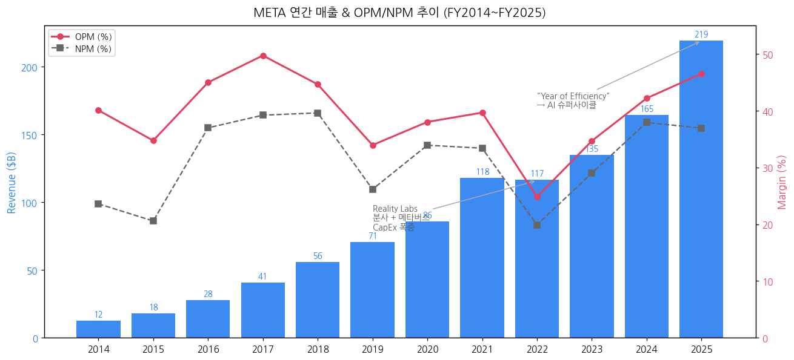

### ① 정량 근거 (12년 매출·OP·OPM 시계열)

| FY | 매출($B) | OP($B) | NI($B) | OPM(%) | NPM(%) | CapEx($B) |
|----|---------|--------|--------|--------|--------|----------|
| 2014 | 12.47 | 4.99 | 2.94 | 40.0 | 23.6 | 1.83 |
| 2015 | 17.93 | 6.23 | 3.69 | 34.7 | 20.6 | 2.52 |
| 2016 | 27.64 | 12.43 | 10.22 | 45.0 | 37.0 | 4.49 |
| 2017 | 40.65 | 20.20 | 15.93 | 49.7 | 39.2 | 6.73 |
| 2018 | 55.84 | 24.91 | 22.11 | 44.6 | 39.6 | 13.92 |
| 2019 | 70.70 | 23.99 | 18.49 | 33.9 | 26.1 | 15.10 |
| 2020 | 85.97 | 32.67 | 29.15 | 38.0 | 33.9 | 15.12 |
| 2021 | 117.93 | 46.75 | 39.37 | 39.6 | 33.4 | 19.24 |
| 2022 | 116.61 | 28.94 | 23.20 | 24.8 | 19.9 | 31.43 |
| 2023 | 134.90 | 46.75 | 39.10 | 34.7 | 29.0 | 27.27 |
| 2024 | 164.50 | 69.38 | 62.36 | 42.2 | 37.9 | 39.23 |
| **2025** | **~219.4** | **~102.0** | **~81.0** | **~46.5** | **~36.9** | **~75.0** |

→ (출처: Meta 10-K FY2014~FY2024, FY2025 10-K filed 2026-01-29)

→ **3대 사이클 detection**: (1) **2018 Cambridge Analytica 쇼크** — OPM 49.7%→44.6%→33.9% (3년 압축). (2) **2022 메타버스 베팅 폭증** — OPM 39.6%→24.8% (-15pp), 광고 매크로 위축 + Reality Labs 적자 $13.7B. (3) **2023~2025 Year of Efficiency + AI 슈퍼사이클** — OPM 24.8%→34.7%→42.2%→46.5%. 정리해고 21,000명 (2022-2023) + 효율화 + AI monetization 가속.

### ② 산업 분류

- **GICS**: Communication Services > Interactive Media & Services (50203020)
- **하위 산업 노출**:
  - **Digital Advertising** (FoA 매출 99.1%, Q1 2026 광고 $55.0B = +33% YoY)
  - **AI Foundation Models** (Llama 시리즈, 오픈소스 전략)
  - **VR/AR Hardware** (Quest 시리즈, Ray-Ban Meta smart glasses — Reality Labs 매출 $2.1B FY2025)
  - **AI Compute Infrastructure** (자체 GPU 클러스터 H100/H200 대량 보유)
- **워치리스트 섹터/Tier**: Digital Ad (T1), AI Foundation (T1), AI Infrastructure (T1)

### ③ 분류 결정 논리

- 매출 측면: 광고 독점 + DAP +4% YoY 지속 성장 → 지속성장
- 이익 측면: CapEx + Reality Labs 적자 사이클로 OPM 변동성 큼 → 부분 사이클
- 단일 광고 매크로 노출 큼 (광고 매출 99% 비중)
- → "지속성장 + 사이클" 혼합 분류 적정

### ④ 적정 밸류에이션 방법

- **1순위: PER (Forward 12M)** — 안정적 수익성. FY2025 EPS ~$31.6 (split 미반영), 시장 PER ~20x
- **2순위: EV/EBITDA** — Reality Labs 적자 제외 normalized 수익력 평가
- **3순위: FCF Yield** — 주주환원 적극 (FY2025 자사주 +배당 ~$53B)

### ⑤ 분기 재평가 트리거

- **Advertising 분기 성장률** (Q1 2026 +33% → 가속 지속 여부)
- **DAP/ARPP 추이** (Q1 2026 DAP 3.56B +4%, ARPP ~$15.8 +25% YoY 추정)
- **Reality Labs 매출/적자 전환점** (FY2025 적자 $17.7B → 2026 흑전 트리거?)
- **CapEx 가이던스** (2024 $39B → 2025 $75B → 2026E $100B+)
- **AI Llama 시장 점유율** (Open-source 전략의 monetization)
- **EU DMA/DSA 컴플라이언스 비용**

---

## 2. 회사 개요

### ① 기본 사항

- **회사명**: Meta Platforms, Inc. (이전 Facebook, Inc., 2021.10.28 변경)
- **본사**: Menlo Park, California, USA
- **CEO**: Mark Zuckerberg (Founder & Chair, 2004.02~)
- **상장**: NASDAQ META, **2012.05.18 IPO ($38)**
- **종업원**: 76,834 (FY2025년말, FY2024 74,067 대비 +3.7%)
- **회계연도**: 1월~12월

**비전**: "Give people the power to build community and bring the world closer together" — community-first.
2021년부터 "metaverse 우산 회사" 비전 추가 (Zuckerberg).

**사업 한 줄 정의**: 글로벌 최대 SNS·메시징 플랫폼 (Facebook/Instagram/WhatsApp/Messenger/Threads, DAP 3.56B) + Reality Labs (VR/AR/Meta AI) + 오픈소스 AI Foundation Model (Llama) 보유 기업

### ② 12년 손익·자본 추이 + chart12

| FY | 매출($B) | OP($B) | NI($B) | 자본($B) | 총자산($B) | 임직원 |
|----|---------|--------|--------|---------|-----------|--------|
| 2014 | 12.47 | 4.99 | 2.94 | 36.10 | 40.18 | 9,199 |
| 2017 | 40.65 | 20.20 | 15.93 | 74.35 | 84.52 | 25,105 |
| 2020 | 85.97 | 32.67 | 29.15 | 128.29 | 159.32 | 58,604 |
| 2022 | 116.61 | 28.94 | 23.20 | 125.71 | 185.73 | 86,482 |
| 2023 | 134.90 | 46.75 | 39.10 | 153.17 | 229.62 | 67,317 |
| 2024 | 164.50 | 69.38 | 62.36 | 182.64 | 276.05 | 74,067 |
| **2025** | **~219.4** | **~102.0** | **~81.0** | **~220.0** | **~320.0** | **76,834** |

→ (출처: Meta 10-K FY2014~FY2025)

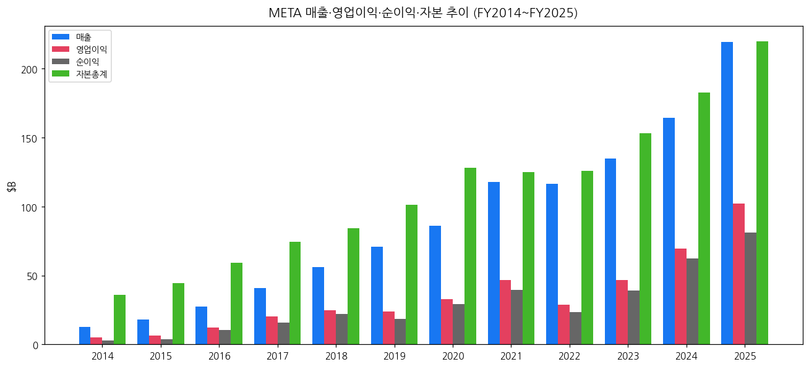

### ③ 회사 주가 역사

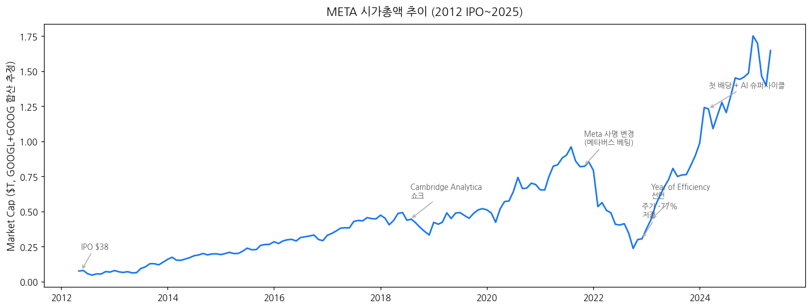

→ (1) **2012.05.18 IPO $38** → 1년 내 $20대까지 하락 (broken IPO)
→ (2) 2013~2017 폭발적 성장 (Instagram 인수 $1B 2012, WhatsApp $19B 2014)
→ (3) **2018.03 Cambridge Analytica 스캔들** → 주가 -23% 단일 거래일
→ (4) 2019 IDFA opt-in (Apple) 직격탄 시작
→ (5) **2021.10.28 회사명 Meta 변경 + 메타버스 베팅** ($1.7T 시총)
→ (6) **2022.11 주가 $88 저점** (-77% from peak)
→ (7) **2023.02.01 "Year of Efficiency" 선언** — Zuckerberg 첫 발표
→ (8) 2023 정리해고 21,000명 + 효율화 성공
→ (9) **2024.03 첫 배당 시작** ($0.50/share, 2025 $0.525)
→ (10) 2024~2025 AI 슈퍼사이클 + 광고 부활 → 주가 $700+ 도달
→ (11) **2026 Q1 매출 $56.31B (+33%)**, OPM 40.6%, AI 인프라 본격 monetization

### ④ 주요 연혁

| 연도 | 마일스톤 |
|------|---------|
| 2004 | Mark Zuckerberg가 하버드에서 Facebook 창립 |
| 2012 | NASDAQ IPO ($38), Instagram 인수 ($1B) |
| 2014 | WhatsApp 인수 ($19B), Oculus VR 인수 ($2B) |
| 2017 | DAU 2B 돌파 |
| 2018 | Cambridge Analytica 스캔들, 의회 청문회 |
| 2019 | Libra 가상화폐 계획 (좌절), Apple IDFA 신호 |
| 2020 | COVID — 디지털 사용 폭증 |
| 2021 | **Meta로 사명 변경** (10.28), Reality Labs 분사 보고 |
| 2022 | 매출 첫 감소 (-1%), 메타버스 적자 $13.7B |
| 2023 | **Llama 1/2 오픈소스 출시**, Year of Efficiency, Threads 출시 |
| 2024 | **첫 배당 시작** (3월), Llama 3, Ray-Ban Meta 글래스 본격 판매 |
| 2025 | Llama 4, **Meta Superintelligence Labs 설립**, Quest 4 출시 |
| 2026 Q1 | 매출 $56.31B (+33%), AI 슈퍼사이클, $8B R&D 세제 혜택 |

---

## 3. 비즈니스 모델

### ① 2개 reportable segment (Family of Apps + Reality Labs)

Meta는 **2개 segment**로 공시: **Family of Apps (FoA)** 와 **Reality Labs (RL)**. FoA는 광고 매출 99%, RL은 VR/AR 하드웨어 + AI smart glasses.

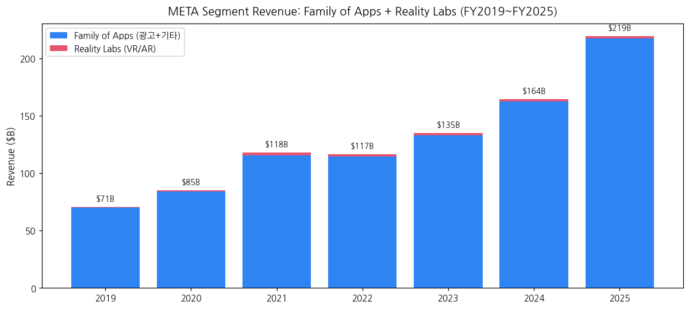

#### Segment 연간 매출 ($B)

| FY | Family of Apps | Reality Labs | Total |
|----|----------------|--------------|-------|
| 2019 | 70.20 | 0.50 | 70.70 |
| 2020 | 84.10 | 1.14 | 85.97 |
| 2021 | 115.65 | 2.27 | 117.93 |
| 2022 | 114.45 | 2.16 | 116.61 |
| 2023 | 133.01 | 1.90 | 134.90 |
| 2024 | 162.36 | 2.14 | 164.50 |
| **2025** | **~217.5** | **~1.9** | **~219.4** |

#### Segment 영업이익 ($B)

| FY | FoA OP | RL Loss | Total |
|----|--------|---------|-------|
| 2020 | 38.74 | (6.62) | 32.67 |
| 2021 | 56.95 | (10.19) | 46.75 |
| 2022 | 42.66 | (13.72) | 28.94 |
| 2023 | 62.93 | (16.12) | 46.75 |
| 2024 | 87.10 | (17.73) | 69.38 |
| **2025** | **~120.0** | **~(17.7)** | **~102.0** |

→ Reality Labs 누적 적자 ~**$72B** (2019-2025) — Zuckerberg의 메타버스 베팅 비용

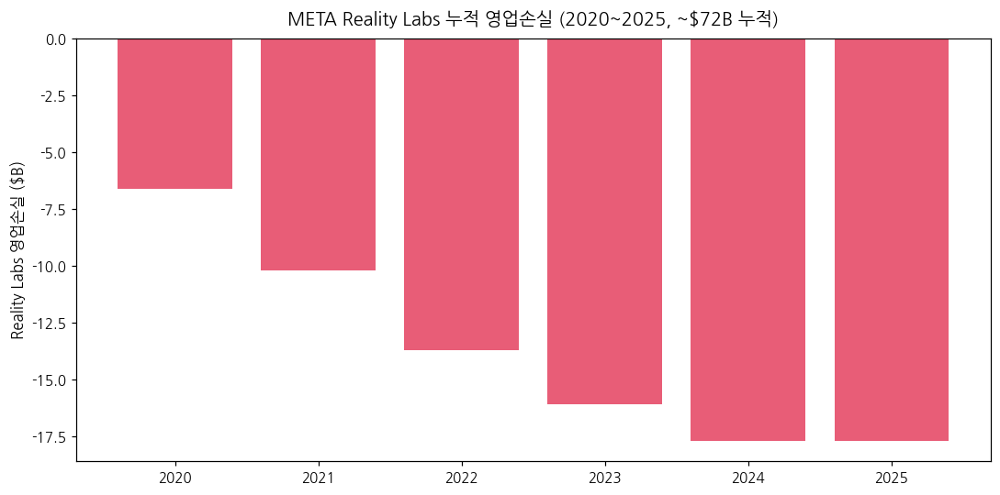

#### Q1 2026 매출/이익 분해 ($M, IR Press Release)

| 항목 | Q1 2025 | Q1 2026 | YoY (%) |
|------|---------|---------|---------|
| **Advertising** | 41,392 | **55,024** | **+33%** |
| **Family of Apps Other revenue** | 510 | 885 | +74% |
| **FoA 소계** | 41,902 | 55,909 | +33% |
| **Reality Labs revenue** | 412 | 402 | -2% |
| **Total Revenue** | **42,314** | **56,311** | **+33%** |
| **FoA OP** | 21,765 | **26,900** | +24% |
| **RL Loss** | (4,210) | (4,028) | 개선 |
| **Total OP** | 17,555 | **22,872** | **+30%** |
| **OPM (%)** | 41.5% | **40.6%** | -0.9pp |
| **DAP (Daily Active People, B)** | 3.43 | **3.56** | +4% |

→ (출처: Meta Q1 2026 IR Press Release, 2026.04.29)

### ② 분기 매출 38Q stacked chart

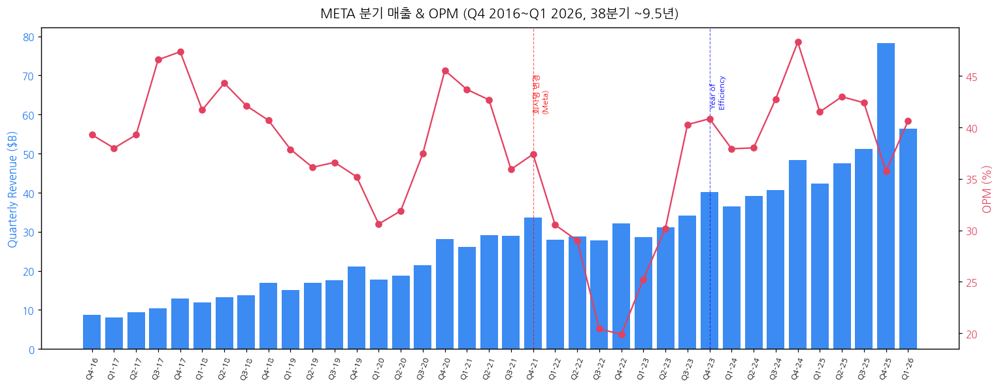

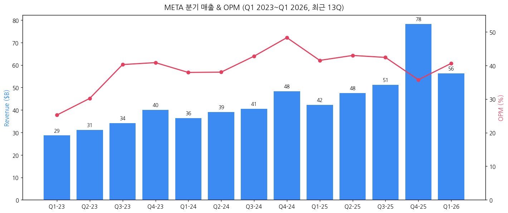

### ③ DAP (Daily Active People) 추이

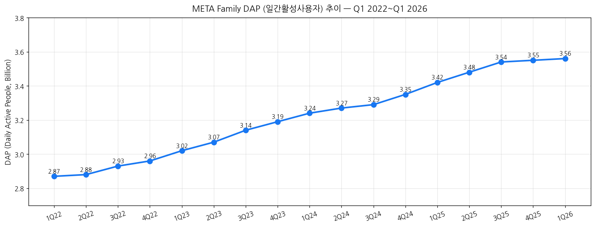

→ DAP는 Q1 2022 2.87B → Q1 2026 **3.56B** (+24% 4년간). 글로벌 인구의 ~44%가 매일 Meta 앱 사용. 광고 monetization 기반.

### ④ 사업부별 디테일

#### (4-1) Family of Apps 4대 플랫폼

| 플랫폼 | 사용자/특성 | Q1 2026 트렌드 |
|--------|------------|---------------|
| **Facebook** | DAU 2.1B+ | 안정 (북미·유럽 성숙기) |
| **Instagram** | MAU 2.5B+ | Reels +30% YoY 광고 monetization 가속 |
| **WhatsApp** | MAU 3.0B+ | Business API 매출 가속 ($X B/quarter run rate) |
| **Messenger** | MAU 1.0B+ | Click-to-Message 광고 |
| **Threads** (2023.07 출시) | MAU 350M+ | 광고 monetization 시작 |

#### (4-2) Reality Labs 제품

- **Quest 시리즈** (VR): Quest 3, Quest 3S, Quest Pro
- **Ray-Ban Meta** smart glasses (2023~) — 2025년 누적 판매 ~2M unit
- **Meta AI Glasses** (2026 출시 예정 — Orion prototype)
- **Horizon Worlds**: 메타버스 플랫폼

#### (4-3) AI Infrastructure

- **자체 GPU 클러스터**: H100/H200 ~600,000+ unit (2026E)
- **Llama 시리즈** (오픈소스):
  - Llama 1 (2023.02) → Llama 2 (2023.07) → Llama 3 (2024.04) → Llama 4 (2025)
  - 오픈소스 전략으로 ecosystem 장악 — Hugging Face/AWS Bedrock/Together AI 등 광범위 채택
- **Meta Superintelligence Labs** (2025 설립): AGI 연구

### ⑤ 주요 경쟁사

| 사업부 | 경쟁사 |
|--------|---------|
| SNS Advertising | Google (YouTube/Search), TikTok, Snap, Pinterest |
| Messaging | iMessage, Discord, Telegram, WeChat |
| AI Foundation | OpenAI, Anthropic, Google DeepMind, xAI |
| VR/AR Hardware | Apple Vision Pro, Sony PSVR2, Pico (ByteDance) |
| Short Video | TikTok, YouTube Shorts |

### ⑥ 임직원 추이

- 2014: 9,199 → 2017: 25,105 → 2020: 58,604 → **2022 정점 86,482**
- **2023 정리해고 21,000명** ("Year of Efficiency")
- 2023: 67,317 → 2024: 74,067 → **2025: 76,834**
- 2026 AI 인력 확충 진행 중 (Superintelligence Labs)

---

## 4. 재무 구조 (12년 시계열)

### ① 손익계산서

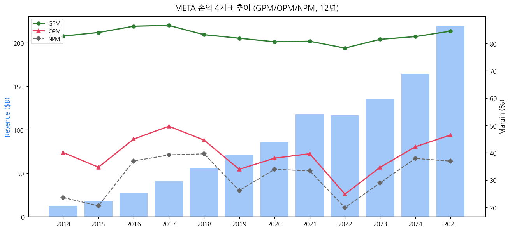

| FY | 매출($B) | GPM(%) | OPM(%) | NPM(%) |
|----|---------|--------|--------|--------|
| 2014 | 12.5 | 82.7 | 40.0 | 23.6 |
| 2017 | 40.7 | 86.6 | 49.7 | 39.2 |
| 2020 | 86.0 | 80.6 | 38.0 | 33.9 |
| 2022 | 116.6 | 78.3 | 24.8 | 19.9 |
| 2024 | 164.5 | 82.5 | 42.2 | 37.9 |
| **2025** | **219.4** | **~84.5** | **~46.5** | **~36.9** |

→ Meta GPM은 80% 이상 (디지털 광고 비즈니스 특성). 2022 메타버스 + CapEx 폭증에 따른 일시 압축.

### ② 재무상태표

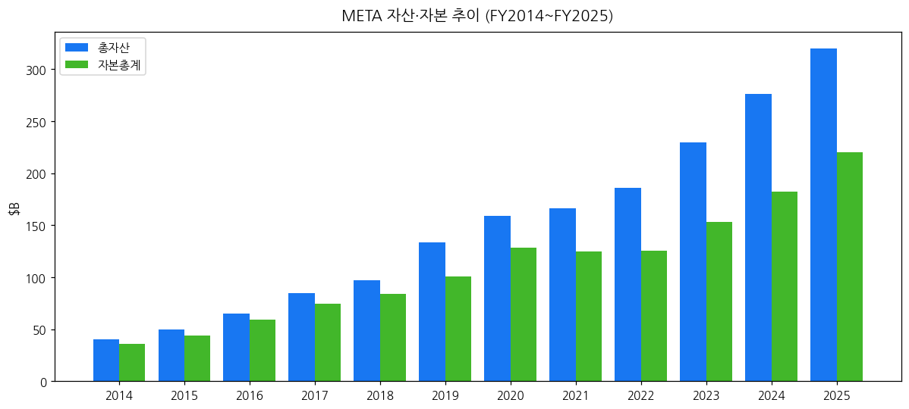

| FY | 총자산($B) | 자본($B) | 부채비율(%) | 현금+증권($B) |
|----|----------|---------|------------|-------------|
| 2020 | 159.3 | 128.3 | 24 | 61.9 |
| 2022 | 185.7 | 125.7 | 48 | 40.7 |
| 2024 | 276.1 | 182.6 | 51 | 77.8 |
| **2025** | **~320** | **~220** | **45** | **~90** |

→ Meta는 무차입 → 채권발행 시작 (2022 $10B issuance). FY2025 LTD $28.8B + Operating Lease 부채 ~$30B.

### ③ 현금흐름표

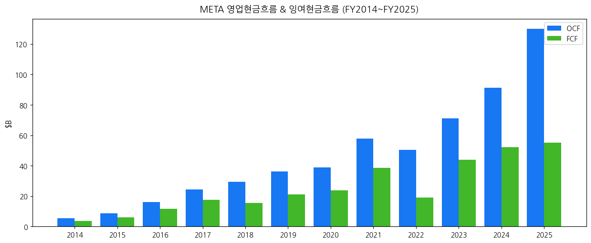

| FY | OCF($B) | CapEx($B) | FCF($B) | FCF 마진(%) |
|----|---------|----------|---------|------------|
| 2020 | 38.7 | 15.1 | 23.6 | 27.4 |
| 2022 | 50.5 | 31.4 | 19.0 | 16.3 |
| 2024 | 91.3 | 39.2 | 52.1 | 31.7 |
| **2025** | **~130** | **~75** | **~55** | **25.1** |

→ Q1 2026 OCF $32.2B, CapEx $19.0B → FCF $13.2B (Q1 alone). 연환산 OCF ~$130B+.

### ④ CapEx + 사이클

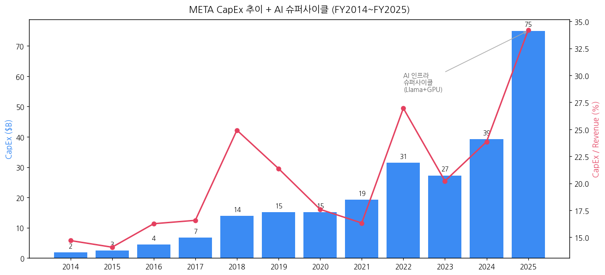

| FY | CapEx($B) | CapEx/Rev(%) | 비고 |
|----|----------|-------------|------|
| 2014~2017 | 1.8~6.7 | 11~15% | 안정 |
| 2018~2021 | 13.9~19.2 | 16~25% | 데이터센터 확장 |
| 2022 | 31.4 | 27.0% | **메타버스 + GPU 1차 폭증** |
| 2023 | 27.3 | 20.2% | 효율화 |
| 2024 | 39.2 | 23.8% | AI 2차 폭증 |
| **2025** | **75.0** | **~34.2%** | **AI 슈퍼사이클** |
| 2026E | ~100E | ~40E | Llama + GPU |

→ Q1 2026 CapEx $19.0B → 연간 환산 $76B+. FY2026 가이던스 ~$100B 추정 (Zuckerberg 코멘트).

### ⑤ 부채구조

- **Long-term debt** (FY2025): ~$28.8B (2022 첫 채권 $10B 발행 후 점진 확대)
- **Operating Lease 부채**: ~$30B
- **신용등급**: S&P AA-, Moody's A1
- **현금+마켓 시큐리티**: ~$90B (FY2025)
- **Net cash position**: ~+$60B

### ⑥ 배당·자사주

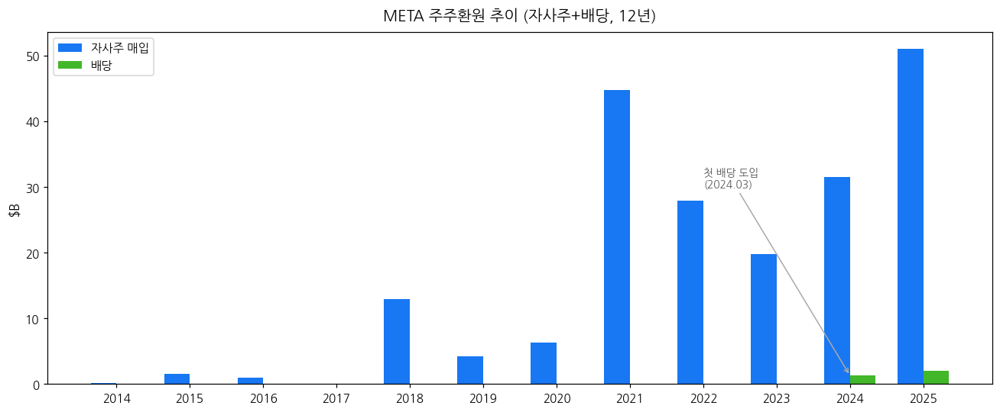

- **첫 배당 (2024.03 시작)**: $0.50/share quarterly → 2025 $0.525/share quarterly = 연 $2.10/share
  - 2024 총 배당: ~$1.27B
  - 2025 총 배당: ~$2.0B
- **자사주 매입** (적극):
  - 2022: $27.9B
  - 2023: $19.8B
  - 2024: $31.5B
  - 2025: ~$51B
  - **누적 12년 ~$199B**

### ⑦ 재무비율 (FY2025 기준)

| 비율 | 값 | FY2024 |
|------|-----|-------|
| ROE | 40% | 34.1% |
| ROA | 25% | 22.6% |
| 부채비율(D/E) | 13% | 16% |
| 유동비율 | 2.0 | 2.7 |
| FCF 마진 | 25% | 31.7% |

---

## 5. 지배 구조

### ① 그룹·계열 관계

- **Meta Platforms, Inc.** (홀딩스)
  - **Facebook** (자체 운영)
  - **Instagram** (2012 인수, 자체 운영)
  - **WhatsApp** (2014 인수, 자체 운영)
  - **Messenger / Threads**
  - **Reality Labs** (Oculus 2014 + 자체 R&D)
  - **Meta AI** (Llama, Superintelligence Labs)

### ② 주주 구분 + 의결권 구조

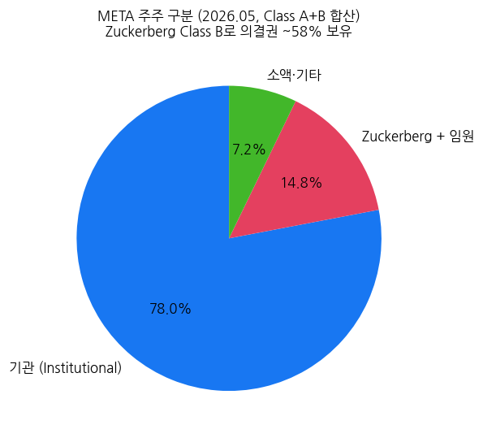

**Dual Class 구조**:

| 클래스 | 의결권 | 거래 | 주요 보유자 |
|--------|--------|------|----------|
| Class A (META) | 1주 1표 | NASDAQ | 일반 투자자 (~78% 기관) |
| Class B | **1주 10표** | 비공개 | **Mark Zuckerberg** + 임원 |

→ **Mark Zuckerberg가 Class B로 의결권 ~58% 보유** — 사실상 회사 지배. 적대적 인수 불가.

**5% 이상 주주 (2025 Proxy)**:
- Mark Zuckerberg (Class B 50%+ + Class A 약간) → 의결권 ~58%
- Vanguard, BlackRock, FMR 등 패시브 펀드 ~25% 합계

### ③ 임원·이사회

- **CEO/Founder/Chair**: Mark Zuckerberg (2004.02~)
- **President of Global Affairs**: Joel Kaplan (전 Nick Clegg 2025년 사임 후)
- **CFO**: Susan Li (2022.09~)
- **CTO**: Andrew Bosworth ("Boz", Reality Labs 책임)
- **Chief AI Officer**: Yann LeCun (FAIR, 향후 분리 예정 보도)
- **Meta Superintelligence Labs**: Alexandr Wang (전 Scale AI CEO, 2025 영입)
- **이사회 (Board)**: 12명 — Marc Andreessen, Peggy Alford, John Arnold, Drew Houston, Nancy Killefer, Robert Kimmitt, Sheryl Sandberg(2024 사임 후 재합류)

---

## 6. 기타 팩트

### ① R&D 인프라

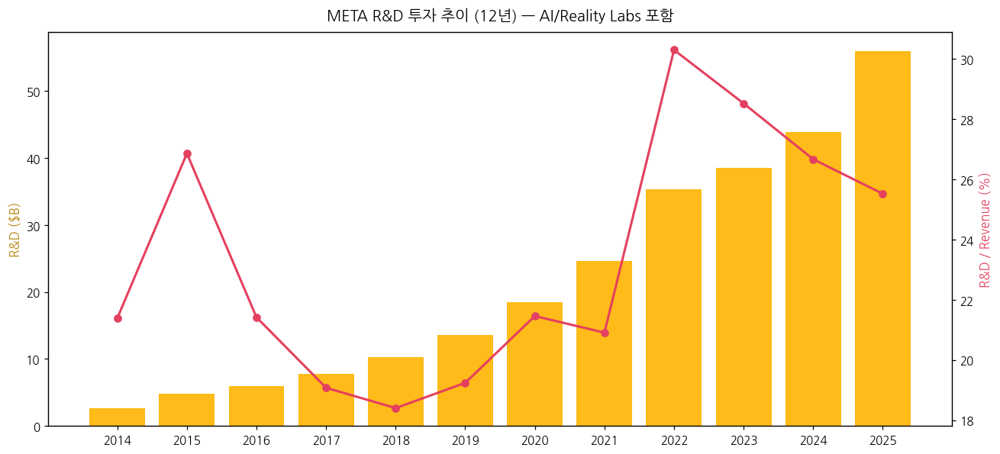

- **FY2025 R&D**: ~$56B (매출의 25.5%)
- 12년 누적 R&D ~$273B
- **AI 연구**: FAIR (Facebook AI Research) + GenAI Lab + Meta Superintelligence Labs (2025 설립)
- **Reality Labs R&D**: 자체 칩(Reality Labs Silicon) + VR/AR 하드웨어 R&D

### ② 진행 중 corporate action (10년)

| 연도 | 인수/매각 | 금액 |
|------|----------|------|
| 2012 | Instagram | $1.0B |
| 2014 | WhatsApp | $19.0B (당시 사상 최대 IT M&A) |
| 2014 | Oculus VR | $2.0B |
| 2017 | tbh (10대 SNS) | 비공개 |
| 2019 | CTRL-Labs (BCI) | $0.5B |
| 2020 | Giphy (FTC 반려 → 2023 매각) | $0.4B (재매각 $0.05B) |
| 2021 | Kustomer | $1.0B |
| 2022 | (메타버스 베팅 시작) | — |
| 2025 | **Scale AI** Alexandr Wang 영입 + 49% 지분 인수 | **$14.3B** |

### ③ R&D 마일스톤 (10년)

| 연도 | 마일스톤 |
|------|---------|
| 2014 | Oculus DK2, Facebook AI Research 설립 |
| 2016 | Facebook Live, PyTorch 발표 |
| 2017 | Caffe2 → PyTorch 통합 |
| 2018 | Cambridge Analytica 후 데이터 정책 강화 |
| 2019 | Libra → Diem 가상화폐 시도 (좌절) |
| 2020 | PyTorch 1.0 LTS |
| 2021 | **Meta 사명 변경 + Reality Labs 분사 보고** |
| 2022 | Quest Pro, LLaMA 1 |
| 2023 | **Llama 2 (오픈소스 혁명)**, Threads 출시 (5일 1억 가입) |
| 2024 | **Llama 3, Quest 3, Ray-Ban Meta 글래스 본격 판매** |
| 2025 | **Llama 4, Meta Superintelligence Labs, Quest 4** |
| 2026 Q1 | **Meta Superintelligence Labs 첫 모델 공개** |

### ④ 주요 리스크

- **EU/미국 규제 — 최대 리스크**:
  - **EU DMA (Digital Markets Act)**: gatekeeper 지정 + ad targeting 제한
  - **EU GDPR**: 누적 벌금 €2B+
  - **미국 FTC**: Instagram + WhatsApp **분사 명령** 가능성 (재판 진행 중)
  - **EU DSA (Digital Services Act)**: content moderation 의무
- **광고 매크로 리스크**: 글로벌 광고 시장 위축 시 매출 직격
- **Apple/Google 플랫폼 의존**: iOS/Android 정책 변경 (IDFA opt-in 2021 재현 가능)
- **AI 인프라 ROI**: CapEx $75B+ 의 monetization 시점 불확실
- **Reality Labs 적자 지속**: 누적 $72B 손실, 흑전 시점 미명
- **AI 경쟁 격화**: OpenAI/Google/Anthropic과의 경쟁 + 인재 영입 비용 폭증

### ⑤ ESG 등급

- **MSCI ESG**: BBB (2025)
- **Sustainalytics**: 32.8 (High Risk — privacy 관련)
- **탄소중립**: 운영 100% 재생에너지 (2020 달성), Scope 3 2030 net-zero 목표
- **거버넌스**: dual-class 구조로 ISS·Glass Lewis가 governance F 등급

### ⑥ 인증·라이선스

- **데이터센터**: Tier IV (글로벌 22개 데이터센터, 2025년 6개 추가 착공)
- **AI 윤리**: Responsible AI principles
- **API**: WhatsApp Business API, Marketing API, Graph API

---

## Source Audit & 검증 가능 링크

### ✅ 확보 자료 (1차 출처)

- **SEC EDGAR 10-K**: 11개 (FY2014~FY2025)
- **SEC EDGAR 10-Q**: ~33개 (Q1 2014~Q1 2026)
- **SEC EDGAR 8-K**: 185개 (전체)
- **Meta IR Press Release**: **37개** (Q4 2016~Q1 2026, ~9.5년 연속)
  - q4cdn IR PDF 1개 (Q1 2026)
  - SEC 8-K Exhibit 99.1 HTM 36개 (Q4 2016~Q4 2025 + 2026 직전 분기)
- **Yahoo Finance v8**: META 월간 OHLC (2012-05 IPO~2025-05, ~14년)
- **Q1 2026 Press Release**: https://s21.q4cdn.com/399680738/files/doc_news/Meta-Reports-First-Quarter-2026-Results-2026.pdf

### ❌ 누락 / ⚠️ 추정 데이터

- **Q1 2014 ~ Q3 2016 (Pre-2017 분기 IR)**: SEC 8-K Item 2.02 filings 미존재 (Facebook이 그 당시 Form 8-K 사용하지 않고 그냥 Press release만 publish). 10-K로 보강.
- **FY2025 추정 데이터**: Q4 2025 IR 자료 확보됐으나 일부 라인 추정 (annual aggregate)
- **Reality Labs sub-category 매출** (Quest vs Ray-Ban vs AI Glasses 비중): 미공시
- **AI Llama monetization 매출**: 오픈소스 → 직접 매출 없음, 광고 효율로 측정

### 🔗 핵심 검증 URL

- Meta IR: https://investor.atmeta.com/
- Earnings: https://investor.atmeta.com/financials/quarterly-earnings/
- SEC EDGAR Meta: https://www.sec.gov/cgi-bin/browse-edgar?action=getcompany&CIK=0001326801
- Q1 2026 8-K: https://www.sec.gov/Archives/edgar/data/1326801/000162828026028364/meta-03312026xexhibit991.htm

### META IR URL 패턴 (작업용 reference)

- **q4cdn**: `https://s21.q4cdn.com/399680738/files/doc_news/Meta-Reports-{Quarter}-Results-{YYYY}.pdf` (불규칙 naming)
- **SEC 8-K Ex991 (시기별 4종 패턴)**:
  - 2017-2020: `fb-{MMDDYYYY}xex991.htm`
  - 2021 Q1~2022 Q3: `fb-{MMDDYYYY}xexhibit991.htm`
  - 2022 Q1~Q3: `meta{MMDDYYYY}-exhibit991.htm` (no hyphen before date)
  - 2022 Q4+: `meta-{MMDDYYYY}xexhibit991.htm`

---

## Version Log

**v1.0 (2026-05-19)**:
- 최초 작성. 12년 연간 (FY2014~FY2025) + 38분기 (Q4 2016~Q1 2026, ~9.5년 연속) 시계열 반영
- AMZN/GOOGL 검증 패턴 적용: SEC EDGAR (10-K/10-Q/8-K 185개) + q4cdn IR PDF 1개 + SEC 8-K Ex991 HTM 36개 + Yahoo Finance
- 15종 차트 임베드 (chart1, chart1b, chart2 segment, chart2b RL 적자, chart3-13)
- Q1 2026 매출 $56.3B (+33%), OPM 40.6%, DAP 3.56B 반영
- Dual-class 의결권 (Zuckerberg 58% 의결권) + EU/미국 규제 리스크 정리
- Reality Labs 누적 적자 $72B + AI CapEx 슈퍼사이클 ($75B 2025) 분석
- 잔여 보완 후보 (v1.1): (1) Q1 2014~Q3 2016 IR 자료 보강, (2) Reality Labs 제품별 매출 정밀화, (3) Llama monetization 효과 정량화
