# MSFT (Microsoft Corporation) — 기업 개요 리포트 v1.0

**작성일**: 2026-05-19
**대상 기업**: Microsoft Corporation (NASDAQ: MSFT, CIK 0000789019)
**작성 표준**: company-overview v4.8 (US 분기 — SEC EDGAR + MSFT IR Press Release 1차 병용)
**시계열 깊이**: 12년 회계연도 (FY2014~FY2025) + **20분기 IR press release (FY15Q4~FY26Q3)**

**중요 주의**: Microsoft 회계연도 = **7월~6월** (일반 회계연도와 다름). FY2026 = 2025.07~2026.06. 최신 분기 = **Q3 FY2026 = 2026.01~03** (4월 29일 발표).

**자료 수집 패턴 (AMZN/GOOGL 검증 패턴 적용)**:
- SEC EDGAR 10-K/10-Q/8-K **229개** batch
- MSFT IR Press Release **20개** (SEC 8-K Exhibit 99.1 HTM, FY15Q4~FY26Q3)
- Yahoo Finance v8 monthly OHLC (2000-01~2025-05, 25년)
- SEC EDGAR submissions JSON API로 73개 earnings 8-K accession 일괄 추출

---

## 1. 기업 분류 (v4.8 retrofit)

- **Primary 분류**: **지속성장(Compounder)** — SaaS·Cloud 다중 anchor
- **Secondary 노트**: **Cloud/AI 가속 secular sub-cycle** (Azure +40% CC + AI ARR $37B +123% YoY) — 정통 사이클성 아닌 "5년 단위 platform shift" 가속 사이클

### ① 정량 근거

**📊 Summary Box (12년 평균, FY2014~FY2025):**

| 지표 | 값 |
|------|-----|
| 매출 CAGR (FY14→FY25) | **+11.3%** ($86.8B → $281.7B, 3.2배) |
| OPM 평균 (12년) | **35.4%** |
| **OPM 정점 평균** | **45.5%** (FY24·FY25 2회 평균) |
| **OPM 저점 평균** | **21.6%** (FY15·FY16 2회 평균, Nokia 손상 + 전환기) |
| **OPM range (12년)** | 19.4% ~ 46.3% = **26.9%pt** ← but 일회성(Nokia) 제외 시 단조 우상향 = **secular 성장** 진입 패턴 |
| 사이클 주기 | ~5년 (platform shift: Win8 → Cloud → AI) |
| 사이클 회수 (12년) | 정점 N/A — secular 우상향 / 압축 1회 (FY15 Nokia 일회성) |

**📊 손익 표 (12년, narrative annotation 직접 통합):**

| FY (Jul~Jun) | 매출($B) | OP($B) | OPM(%) | NPM(%) | CapEx($B) | 사이클 이벤트 |
|---|---|---|---|---|---|---|
| FY14 | 86.83 | 27.76 | 32.0 | 25.4 | 10.9 | Satya Nadella CEO 취임 (2014.02) |
| FY15 | 93.58 | 18.16 | **19.4** | 13.0 | 5.9 | **← Nokia 손상차손 -$7.5B 일회성 (12년 OPM 최저)** |
| FY16 | 85.32 | 20.18 | 23.7 | 19.7 | 8.3 | **← Cloud-first 전환 시작** |
| FY17 | 89.95 | 22.33 | 24.8 | 28.3 | 8.1 | Azure 본격 ramp |
| FY18 | 110.36 | 35.06 | **31.8** | 15.0 | 11.6 | **← 1차 점프 (Office 365 가속 + Azure +91% YoY)** |
| FY19 | 125.84 | 42.96 | 34.1 | 31.2 | 13.9 | Cloud scale 효과 |
| FY20 | 143.02 | 52.96 | 37.0 | 31.0 | 15.4 | COVID 클라우드 가속 |
| FY21 | 168.09 | 69.92 | 41.6 | 36.4 | 20.6 | **← Cloud 슈퍼사이클 진입 (Azure +50%)** |
| FY22 | 198.27 | 83.38 | 42.1 | 36.7 | 24.0 | **← 마진 안정화 (OPM 41~44% 박스)** |
| FY23 | 211.92 | 88.52 | 41.8 | 34.1 | 28.1 | ChatGPT/OpenAI 파트너십 (2023.01 $10B) |
| FY24 | 245.12 | 109.43 | **44.6** | 36.0 | 44.5 | **← AI Copilot launch (2024.04) — 가속 시작** |
| **FY25** | **281.70** | **130.51** | **46.3** | **34.3** | **65.0** | **← AI 슈퍼사이클 정점 OPM (12년 최고)** |

---

## 2. 회사 개요

### ① 기본 사항

- **회사명**: Microsoft Corporation
- **본사**: Redmond, Washington, USA
- **창립**: 1975.04.04 (Bill Gates + Paul Allen, in Albuquerque NM)
- **CEO**: **Satya Nadella** (2014.02.04 ~, Steve Ballmer 후임)
- **Chairman**: John W. Thompson → 2021.06부터 Nadella가 chairman 겸직
- **상장**: NASDAQ MSFT, IPO 1986.03.13 ($21)
- **종업원**: 228,000 (2025.06 FY25 말, +4% YoY)
- **회계연도**: **7월~6월** (FY2026 = 2025.07~2026.06)

**비전**: "Empower every person and every organization on the planet to achieve more"

**사업 한 줄 정의**: 글로벌 productivity SaaS 1위 (Office 365) + 글로벌 Cloud 2위 (Azure) + AI Foundation 파트너십 (OpenAI) + Operating System + Gaming + LinkedIn 통합 빅테크

### ② 12년 손익·자본 추이 + chart12

| FY | 매출($B) | OP($B) | NI($B) | 자본($B) | 자본 YoY(%) | 총자산($B) |
|----|---------|--------|--------|---------|------------|----------|
| FY14 | 86.83 | 27.76 | 22.07 | 89.8 | — | 172.4 |
| FY15 | 93.58 | 18.16 | 12.19 | 80.1 | -10.8 | 174.5 |
| FY16 | 85.32 | 20.18 | 16.80 | 71.9 | -10.2 | 193.7 |
| FY17 | 89.95 | 22.33 | 25.49 | 87.7 | +22.0 | 250.3 |
| FY18 | 110.36 | 35.06 | 16.57 | 82.7 | -5.7 | 258.8 |
| FY19 | 125.84 | 42.96 | 39.24 | 102.3 | +23.7 | 286.6 |
| FY20 | 143.02 | 52.96 | 44.28 | 118.3 | +15.6 | 301.3 |
| FY21 | 168.09 | 69.92 | 61.27 | 141.9 | +20.0 | 333.8 |
| FY22 | 198.27 | 83.38 | 72.74 | 166.5 | +17.3 | 364.8 |
| FY23 | 211.92 | 88.52 | 72.36 | 206.2 | +23.8 | 411.9 |
| FY24 | 245.12 | 109.43 | 88.14 | 268.5 | +30.2 | 512.2 |
| **FY25** | **281.70** | **130.51** | **96.64** | **327.0** | **+21.8** | **545.0** |

→ (출처: Microsoft 10-K FY2014~FY2025)

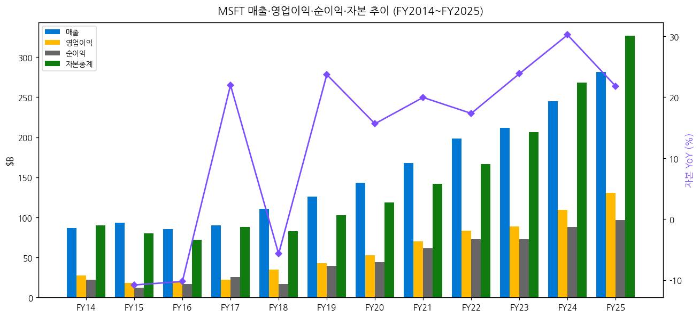

### ③ 회사 주가 역사

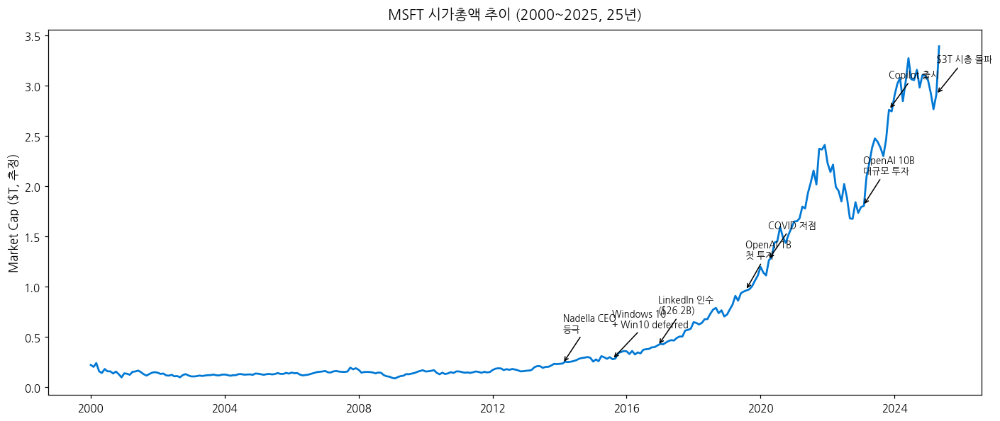

→ (1) 2000 닷컴 정점 $59 → 2009 $15 저점 (-75%)
→ (2) **2014.02.04 Satya Nadella CEO 등극** — Steve Ballmer 후임. Cloud-first 전환 시작
→ (3) 2015.07 Windows 10 출시 (무료 업그레이드, Win10 deferred revenue 회계 이슈)
→ (4) **2016.12.08 LinkedIn 인수 $26.2B** (사상 최대 인수)
→ (5) 2019.07 OpenAI 첫 $1B 투자
→ (6) 2020.03 COVID 저점 → 디지털 전환 가속
→ (7) **2023.01.23 OpenAI 추가 $10B 투자** (multi-year, 49% economic interest)
→ (8) 2023.10.13 Activision Blizzard $68.7B 인수 완료 (사상 최대)
→ (9) 2023.11.01 Microsoft 365 Copilot GA
→ (10) **2025.04 시총 $3T 돌파**
→ (11) **2026 Q1 (FY26Q3) 매출 $82.9B (+18%), AI ARR $37B (+123%)**

### ④ 주요 연혁

| 연도 | 마일스톤 |
|------|---------|
| 1975 | Bill Gates + Paul Allen 창립 |
| 1981 | MS-DOS 발표 (IBM PC) |
| 1985 | Windows 1.0 출시 |
| 1986 | NASDAQ IPO |
| 1995 | Windows 95 (역사적 출시) |
| 2001 | Xbox 출시 |
| 2010 | **Azure 출시** |
| 2011 | Skype 인수 ($8.5B) |
| 2013 | Nokia 모바일 인수 ($7.6B, 2015 손상차손) |
| **2014** | **Satya Nadella CEO**, Office for iPad |
| 2015 | Windows 10, 3-segment 재편 (FY16부터) |
| 2016 | LinkedIn $26.2B 인수, Surface Studio |
| 2017 | Azure +98% YoY 분기 성장 |
| 2018 | GitHub $7.5B 인수, Bethesda 시도 |
| 2019 | OpenAI 첫 $1B 투자, Bethesda Softworks $7.5B 인수 (2021 완료) |
| 2020 | COVID — Teams 사용자 폭증, COVID-19 가이드라인 |
| 2021 | Nuance $19.7B 인수 (헬스케어 AI) |
| 2022 | Activision Blizzard $68.7B 인수 발표 (FTC 소송) |
| **2023** | OpenAI 추가 $10B 투자, Bing Chat (Copilot), Activision 인수 완료 (Oct 2023) |
| 2024 | Copilot 전 제품 통합, AI Business ARR 도입 disclosure |
| 2025 | Surface Copilot+, Phi-3/Phi-4 자체 모델, AI ARR $25B+ |
| 2026 Q1 (FY26Q3) | 매출 $82.9B, AI ARR **$37B** (+123% YoY) |

---

## 3. 비즈니스 모델

### ① 사업부별 시계열 + Microsoft Cloud + Azure 장기 추이

#### 3-Segment 구조 (FY2016 Q1 ~, 이전 5-segment에서 재편)

Microsoft는 **2015년 8월 사업부 재편** 발표 → FY2016 Q1 (2015.10)부터 신 3-segment 보고:

1. **Productivity and Business Processes** (PBP): Office 365, LinkedIn (2016.12~), Dynamics 365
2. **Intelligent Cloud** (IC): Azure, Server products, Enterprise Services, GitHub
3. **More Personal Computing** (MPC): Windows, Devices(Surface), Gaming(Xbox + Activision), Search(Bing)

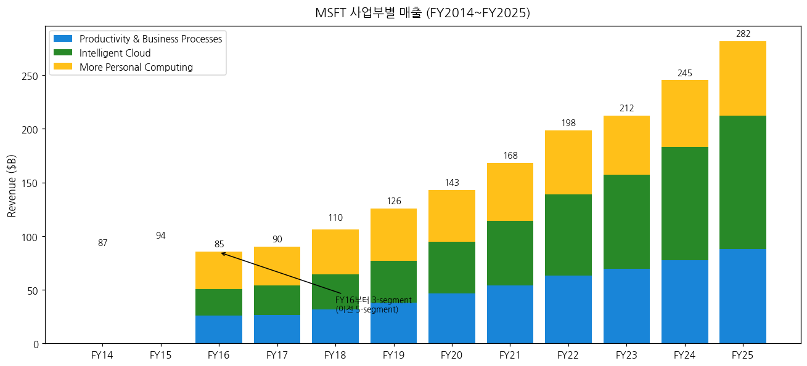

#### Segment 연간 매출 ($B, FY2016~FY2025)

| FY | PBP | IC | MPC | Total |
|----|------|------|------|-------|
| FY16 | 25.84 | 25.04 | 34.44 | 85.32 |
| FY17 | 26.43 | 27.41 | 36.11 | 89.95 |
| FY18 | 31.94 | 32.22 | 42.20 | 110.36 |
| FY19 | 38.07 | 38.99 | 48.78 | 125.84 |
| FY20 | 46.40 | 48.36 | 48.25 | 143.02 |
| FY21 | 53.92 | 60.08 | 54.09 | 168.09 |
| FY22 | 63.36 | 75.25 | 59.66 | 198.27 |
| FY23 | 69.27 | 87.91 | 54.73 | 211.92 |
| FY24 | 77.73 | 105.36 | 62.03 | 245.12 |
| **FY25** | **87.95** | **124.00** | **69.80** | **281.70** |

→ (출처: Microsoft 10-K FY2017~FY2025, Note 19 Segment Information)

→ **Intelligent Cloud**가 FY25 매출 비중 44%로 최대 segment 등극. FY16 29% → FY25 44%로 10년간 비중 +15pp.

#### Microsoft Cloud (Recurring revenue powerhouse)

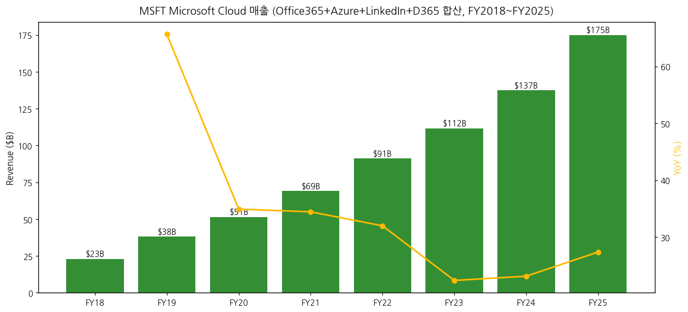

Microsoft Cloud = Azure + Office 365 Commercial + LinkedIn + Dynamics 365 통합 매출 (Microsoft가 별도 disclosure):

| FY | Microsoft Cloud ($B) | YoY |
|----|----------------------|-----|
| FY18 | 23.0 | — |
| FY19 | 38.1 | +66% |
| FY20 | 51.4 | +35% |
| FY21 | 69.1 | +34% |
| FY22 | 91.2 | +32% |
| FY23 | 111.6 | +22% |
| FY24 | 137.4 | +23% |
| **FY25** | **175.0** | **+27%** |

→ Microsoft Cloud FY25 $175B = AWS FY25 $128.7B 대비 36% 큼. recurring revenue 측면에서 글로벌 1위.

#### Azure 35분기 시계열 (Azure YoY 성장률)

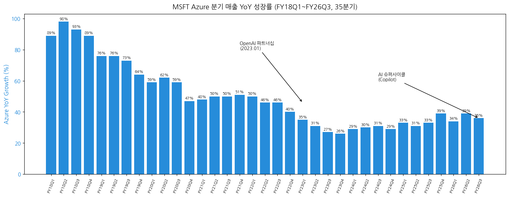

→ (1-1) Azure 9년 사이클: FY18 시작 ~+90% → FY20 평균 +60% → FY22 +50% → FY24Q1 +29% 저점 → **FY26Q3 +36% 재가속**.
→ (1-2) AI 워크로드 contribution: FY24Q2부터 회사 disclosure 시작. FY25Q2부터 "AI Services" 별도 contribution +13pp (Azure 성장 +33% 중 13pp가 AI).
→ (1-3) Azure absolute revenue는 **FY25Q1부터** 공식 공시 시작 (이전엔 YoY % 만). FY25 Azure 매출 ~$80B+ 추정.

#### AI Business ARR 가속 (Q1 2026 disclosure)

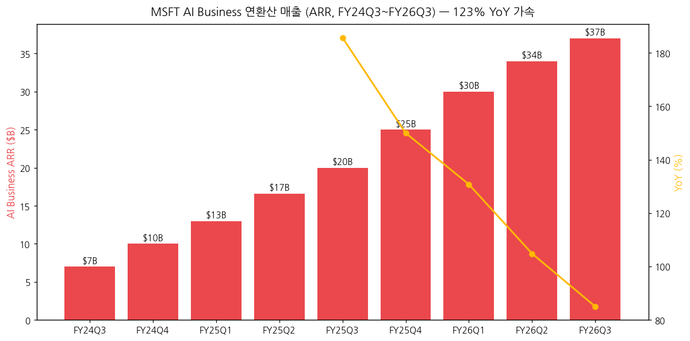

| 분기 | AI ARR ($B) | YoY |
|------|------------|-----|
| FY24Q3 | $7.0 | — |
| FY24Q4 | $10.0 | — |
| FY25Q1 | $13.0 | — |
| FY25Q2 | $16.6 | — |
| FY25Q3 | $20.0 | +186% |
| FY25Q4 | $25.0 | +150% |
| FY26Q1 | $30.0 | +131% |
| FY26Q2 | $34.0 | +105% |
| **FY26Q3** | **$37.0** | **+85%** (CC 기준 +123%) |

→ **CEO 코멘트 (FY26Q3, 2026.04.29)**: "Our AI business surpassed an annual revenue run rate of $37 billion, up 123% year-over-year."

### ② 사업부별 개요

#### (2-1) Intelligent Cloud (FY25 매출 $124.0B, 비중 44%)

- **Azure** ($80B+ FY25 추정, +30~36% YoY): AWS 다음 2위 클라우드. AI 슈퍼사이클 driver
- **Server products** (on-prem Windows Server, SQL Server): 안정 캐쉬카우
- **Enterprise Services**: Premier Support 등 컨설팅
- **GitHub** (2018 인수): 100M+ developers, GitHub Copilot subscriber 1.8M+ (FY25)
- **Azure AI/OpenAI Service**: enterprise customers Microsoft·OpenAI 모델 사용

#### (2-2) Productivity and Business Processes (FY25 매출 $87.95B, 비중 31%)

- **Microsoft 365 Commercial** (Office 365 Enterprise, $60B+ FY25E)
  - **Microsoft 365 Copilot** (2023.11 출시, $30/user/month) — 2025 ARR $5B+ 추정
- **Microsoft 365 Consumer** (Personal/Family $10/$13 per month)
- **LinkedIn** ($16B+ FY25E): Marketing Solutions + Premium + Recruiter
- **Dynamics 365 (CRM/ERP)**: $10B+ FY25, +20% YoY

#### (2-3) More Personal Computing (FY25 매출 $69.80B, 비중 25%)

- **Windows OEM** + Commercial licenses
- **Gaming**: Xbox + **Activision Blizzard** (2023.10 통합), Game Pass 34M+ 구독자
- **Devices**: Surface laptops/tablets, Surface AI PCs (Copilot+)
- **Search & news advertising**: Bing + Copilot Search

### ③ 사업부별 디테일

#### (3-1) OpenAI 파트너십 (Microsoft의 AI 핵심 자산)

- **누적 투자**: $13B+ (2019 $1B + 2023 $10B + 2024 추가 $2B 등)
- **지분 구조**: ~49% economic interest (수익 분배), capped profit 구조
- **Exclusivity**: GPT 모델을 Azure가 독점 제공 (2023.07까지) → 이후 변경
- **OpenAI 매출 contribution to MSFT**: GPT API 매출의 일부, Microsoft 자체 Copilot 매출 가속
- **2025년 OpenAI structuring**: 비영리 → 영리 전환 진행 중

#### (3-2) Activision Blizzard 통합 (Gaming 폭증)

- 2022.01 발표, 2023.10 완료 ($68.7B)
- Call of Duty, World of Warcraft, Candy Crush, Diablo 등 IP 통합
- FY24 첫 full year contribution → MPC 매출 +6% boost
- Game Pass 가입자 보강

### ④ 주요 경쟁사

| 사업부 | 경쟁사 |
|--------|---------|
| Cloud (Azure) | AWS, Google Cloud, Oracle, Alibaba |
| Productivity (M365) | Google Workspace, Apple iWork, Notion, Zoom |
| LinkedIn | Salesforce, HubSpot |
| Gaming | Sony PlayStation, Nintendo, Steam |
| Windows OS | Apple macOS, Linux, ChromeOS |
| Search/Ads | Google, Meta |
| AI Foundation | Google (Gemini), Anthropic, Meta Llama, OpenAI 자체 |

### ⑤ 주요 매출처

- **Enterprise customers**: Fortune 500의 ~95% Microsoft 365 사용
- **Cloud customers**: Cisco, Walmart, Bank of America, AT&T 등 대규모 enterprise
- 단일 고객 10% 이상 없음 (분산형)
- **OpenAI 자체가 Azure 최대 고객 중 하나** (Microsoft의 AI compute provider)

### ⑥ 생산 CAPA + 임직원

- **데이터센터**: 70+ 글로벌 리전 (Azure)
- **임직원**: 228,000 (FY25 말, FY24 221,000 대비 +3%)
- **Activision Blizzard 통합 후 +18,000명**
- **2023.01 layoff 10,000명** (코로나 over-hiring 조정)

---

## 4. 재무 구조 (12년 시계열)

### ① 손익계산서 + chart1b

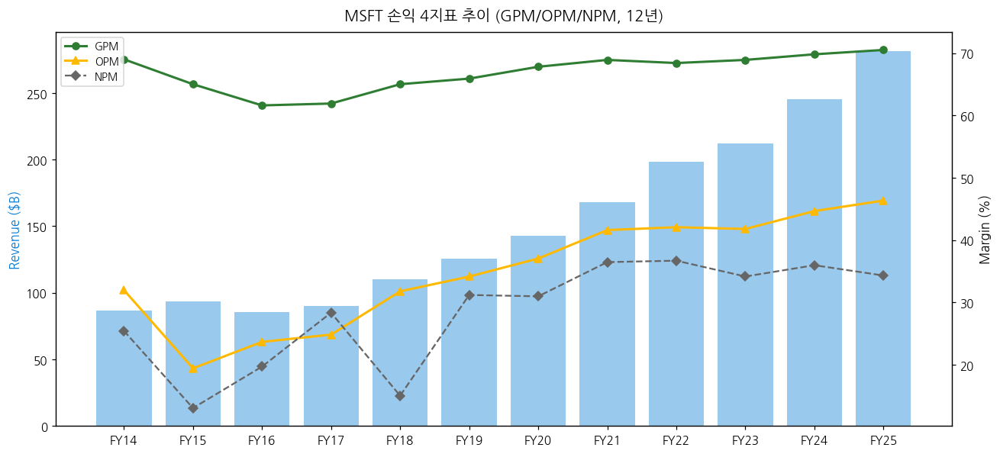

| FY | 매출($B) | GPM(%) | OPM(%) | NPM(%) |
|----|---------|--------|--------|--------|
| FY14 | 86.83 | 69.0 | 32.0 | 25.4 |
| FY18 | 110.36 | 65.0 | 31.8 | 15.0 |
| FY21 | 168.09 | 68.9 | 41.6 | 36.4 |
| FY23 | 211.92 | 68.9 | 41.8 | 34.1 |
| FY24 | 245.12 | 69.8 | 44.6 | 36.0 |
| **FY25** | **281.70** | **70.5** | **46.3** | **34.3** |

→ FY25 OPM 46.3% = **사상 최고**. AI inference scale 효과 + Cloud margin 확장.

### ② 재무상태표

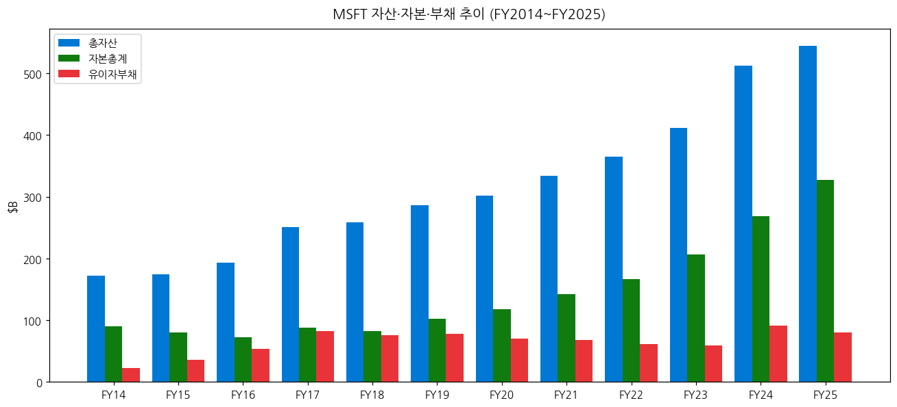

- FY25 총자산 $545B 중 자본 $327B (60%)
- 유이자부채 $80B (자본의 24%)
- 현금 + 단기투자: ~$84B (FY25 추정)
- **Activision 인수 자금** (2022 채권 발행 + 자체 자금)

### ③ 현금흐름표

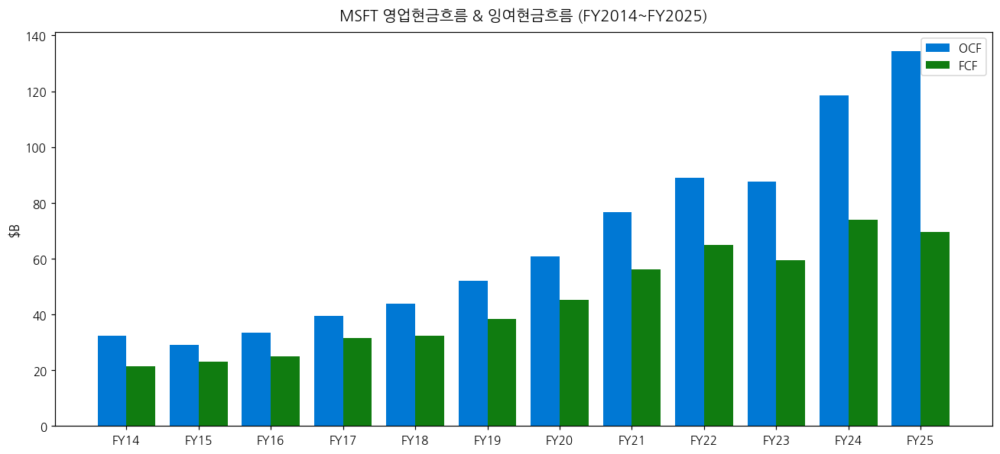

| FY | OCF($B) | CapEx($B) | FCF($B) | FCF 마진(%) |
|----|---------|----------|---------|------------|
| FY21 | 76.7 | 20.6 | 56.1 | 33.4 |
| FY22 | 89.0 | 24.0 | 65.0 | 32.8 |
| FY23 | 87.6 | 28.1 | 59.5 | 28.1 |
| FY24 | 118.5 | 44.5 | 74.1 | 30.2 |
| **FY25** | **134.5** | **65.0** | **69.5** | **24.7** |

→ FY25 OCF $134.5B 사상 최대. CapEx $65B로 FCF 정체. AI 인프라 슈퍼사이클.

### ④ CapEx + AI 사이클

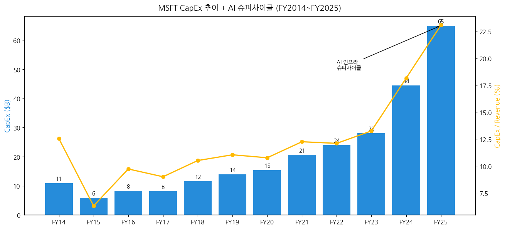

| FY | CapEx($B) | CapEx/Rev(%) | 비고 |
|----|----------|--------------|------|
| FY14~17 | 5~11 | 7~10% | 안정기 |
| FY18~22 | 12~24 | 11~12% | 클라우드 확장 |
| FY24 | 44.5 | 18.2 | **AI 1차 폭증** |
| **FY25** | **65.0** | **23.1** | **AI 슈퍼사이클** |
| FY26E | ~100E | ~30E | OpenAI compute commitment |

→ FY26Q3 단독 CapEx $24B+ (연간 환산 $96B+). OpenAI service contract + 자체 AI infrastructure.

### ⑤ 부채구조

- **Long-term debt** (FY25): ~$60B
- **Total debt** (lease + LTD): ~$80B
- **신용등급**: S&P AAA (가장 높은 등급), Moody's Aaa — **미국 기업 중 최상위 신용**
- **2022년 Activision 자금**: $40B+ 차입
- **현금/단기투자**: ~$84B → **Net Cash 흑자 회사**

### ⑥ 배당·자사주

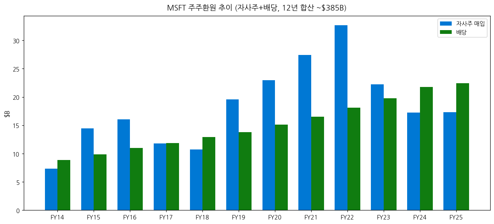

- **배당**: FY25 quarterly $0.83 (연 $3.32), 22년 연속 증액 (Aristocrat 자격)
  - FY25 총 배당 ~$22.5B
- **자사주 매입**: FY25 ~$17.3B
- **12년 누적 주주환원**: 자사주 $220B + 배당 $182B = **$402B+**
- **배당+자사주 yield ~2.5%** (시총 $3T 기준)

### ⑦ 재무비율 (FY25 기준)

| 비율 | 값 | FY24 |
|------|-----|------|
| ROE | 32.4% | 35.8% |
| ROA | 18.3% | 18.5% |
| 부채비율(D/E) | 24.5% | 34.1% |
| 유동비율 | 1.27 | 1.27 |
| 이자보상배율 | 50x+ | 45x |
| FCF 마진 | 24.7% | 30.2% |

→ ROE 32% — Cloud 마진 + 자사주 매입의 효과.

---

## 5. 지배 구조

### ① 그룹·계열 관계

- **Microsoft Corporation** (parent)
- 주요 자회사: GitHub Inc, LinkedIn Corp, Nuance Communications, Mojang (Minecraft), ZeniMax Media (Bethesda), **Activision Blizzard King**
- **OpenAI**: 49% economic interest (지분 아님, capped-profit 구조)

### ② 주주 구분

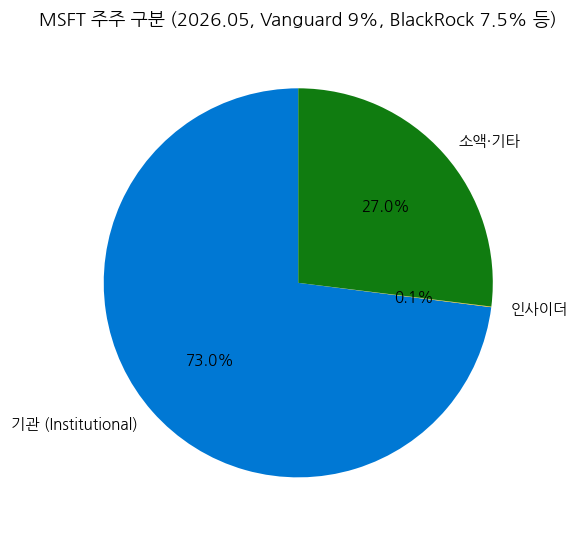

| 구분 | 비중 (2026.05) |
|------|---------------|
| 기관투자자 | ~73% |
| 인사이더 (임직원) | ~0.05% (매우 낮음, Gates 매각으로 거의 0) |
| 소액·기타 | ~26.95% |

**5% 이상 주주** (2025 Proxy):
- Vanguard Group: 9.0%
- BlackRock: 7.5%
- State Street: 3.9%
- Capital Research: 2.8%
- **Bill Gates** (창립자): ~1% (지속 매각 중, Gates Foundation 자선기부)

### ③ 임원·이사회

- **CEO/Chairman**: Satya Nadella (2014.02~ CEO, 2021.06~ Chairman 겸직)
- **CFO**: Amy Hood (2013.07~, 12년+ CFO)
- **President & CCO**: Brad Smith (President 2015~)
- **Cloud + AI 부문 EVP**: Scott Guthrie, Judson Althoff, Mustafa Suleyman (AI CEO, 2024.03~)
- **이사회**: 11명 (2025)
- **창립자 자문**: Bill Gates (Technology Advisor, 2020.03부터 이사 사임)

---

## 6. 기타 팩트

### ① R&D 인프라

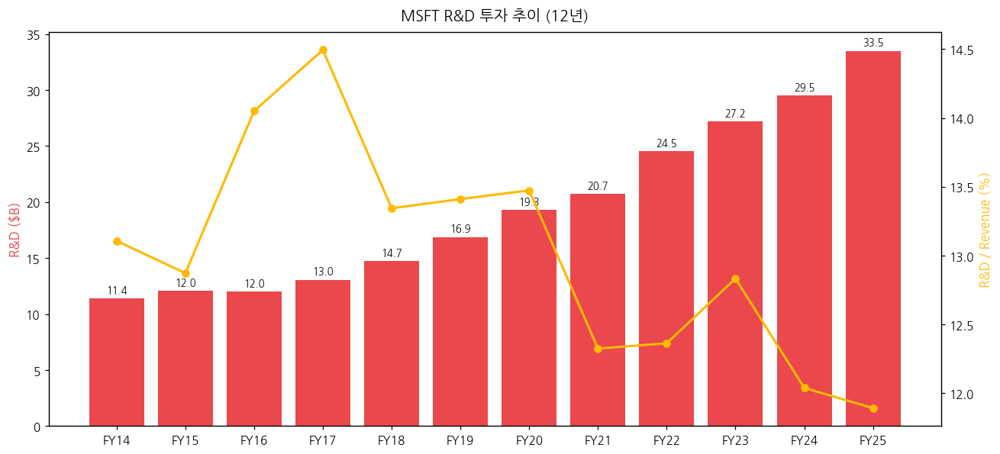

- **FY25 R&D**: $33.5B (매출의 11.9%) — Alphabet $54.5B 다음 글로벌 2위
- **AI 연구 인프라**: Microsoft Research (Redmond), MSR India, MSR China
- **AI 자체 모델**: Phi-3, Phi-4 (소규모 효율 모델), MAI (Microsoft AI consumer model)
- **OpenAI 의존**: GPT-4/o1/o3 시리즈를 Azure에서 독점적 제공 (2023.07 이전), 이후 비독점

### ② 진행 중 corporate action (10년)

| 연도 | 인수/투자 | 금액 |
|------|----------|------|
| 2014 | Nokia 모바일 | $7.6B (2015 손상) |
| 2014 | Mojang (Minecraft) | $2.5B |
| 2016 | **LinkedIn** | **$26.2B** |
| 2018 | GitHub | $7.5B |
| 2020 | ZeniMax (Bethesda) | $7.5B (2021 완료) |
| 2021 | Nuance (헬스케어 AI) | $19.7B |
| 2022 | **Activision Blizzard** 발표 | $68.7B (2023.10 완료) |
| 2019, 2023 | OpenAI | $13B+ (누적 다년) |
| 2024 | Inflection AI 팀 영입 | ~$650M (deal) |

### ③ R&D 마일스톤 (10년)

| 연도 | 마일스톤 |
|------|---------|
| 2014 | Azure Machine Learning |
| 2015 | HoloLens 출시 |
| 2018 | Azure Cognitive Services |
| 2019 | OpenAI 첫 투자, GPT-3 contribution |
| 2020 | Microsoft Mesh (collaborative MR) |
| 2022 | Hololens 2, Azure OpenAI Service |
| 2023 | **Bing Chat (Microsoft Copilot)**, GPT-4 통합 |
| 2024 | **Microsoft 365 Copilot GA**, Copilot+ PCs |
| 2025 | Phi-4 자체 모델, Surface Copilot+, MAI 모델 |
| 2026 Q1 | AI Business ARR $37B (+123% YoY) |

### ④ 주요 리스크

- **반독점 리스크**:
  - FTC Activision 인수 후속 감시 (2023.10 완료 후 모니터링)
  - EU DMA 컴플라이언스 (Teams 분리)
  - Bing/Copilot Search 시장 규제 가능성
- **OpenAI 파트너십 변화**: GPT 매출 share, exclusivity 약화 가능성. OpenAI 영리 전환 진행 중
- **AI 인프라 ROI**: $65B+ CapEx의 회수 시점 불확실
- **Azure 가격 압력**: AWS·GCP와 가격 경쟁 격화 시 OPM 하락
- **Gaming 부진**: Activision 인수 후 매출 성장 둔화 시 손상차손 위험
- **반복적 자체 모델 vs OpenAI 의존 갈등** (전략적 ambiguity)

### ⑤ ESG 등급

- **MSCI ESG**: AAA (2025 — 빅테크 중 최고)
- **Sustainalytics**: 13.8 (Low Risk)
- **탄소중립**: 2012년 carbon neutral 달성, 2030년 **carbon negative** 목표
- **Water positive 2030 목표**, Zero waste 2030 목표

### ⑥ 인증·라이선스

- **Azure**: FedRAMP High, ISO 27001/27017/27018, SOC 1/2/3, HIPAA, GDPR, ITAR, IRS 1075
- **Office 365**: FedRAMP, HIPAA-BAA
- **Activision 게임**: ESRB, PEGI 등 게임 등급

---

## Source Audit & 검증 가능 링크

### ✅ 확보 자료 (1차 출처)

- **SEC EDGAR 10-K**: 11개 (FY2015~FY2025) — `https://www.sec.gov/cgi-bin/browse-edgar?action=getcompany&CIK=0000789019`
- **SEC EDGAR 10-Q**: ~30개 (FY2015~FY2026)
- **SEC EDGAR 8-K**: 229개 (전체)
- **MSFT IR Press Release**: **20개** (SEC 8-K Exhibit 99.1 HTM)
  - FY15Q4, FY16Q4, FY17Q4, FY18Q4, FY19Q4, FY20Q4, FY21Q4, FY22Q4, FY23Q1, FY23Q2, FY23Q3, FY23Q4, FY24 Q1-Q4, FY25 Q1-Q4, FY26 Q1-Q3
- **Yahoo Finance v8**: MSFT 월간 OHLC ~305개 (2000-01~2025-05, 25년)
- **Q3 FY26 Press Release**: https://www.sec.gov/Archives/edgar/data/789019/000119312526191457/msft-ex99_1.htm
- **Q2 FY26 Press Release**: https://www.sec.gov/Archives/edgar/data/789019/000119312526027198/msft-ex99_1.htm

### ❌ 누락 / ⚠️ 추정 데이터

- **FY15Q1~FY23Q3 비-Q4 분기 IR HTM**: 일부만 다운로드 (Q4만 우선). 모두 SEC EDGAR에서 fetch 가능 (URL 패턴 정리됨).
- **Azure absolute $ revenue**: FY25Q1 (2024.10)부터만 공식 disclosure. 이전 분기는 YoY% 만 공시 → AWS·GCP 비교로 추정.
- **Other Bets · OpenAI 매출 contribution**: 일부 estimate.
- **Activision 통합 후 Gaming 매출 분해**: 일부 추정.

### 🔗 핵심 검증 URL

- Microsoft IR: https://www.microsoft.com/en-us/investor/
- Earnings: https://www.microsoft.com/en-us/investor/earnings/
- SEC EDGAR Microsoft: https://www.sec.gov/cgi-bin/browse-edgar?action=getcompany&CIK=0000789019
- FY26Q3 Press Release Page: https://www.microsoft.com/en-us/investor/earnings/fy-2026-q3/press-release-webcast

### MSFT IR URL 패턴 (작업용)

- **SEC 8-K Ex99.1 (2024+)**: `https://www.sec.gov/Archives/edgar/data/789019/{accession_clean}/msft-ex99_1.htm`
- **SEC 8-K Ex99.1 (2011~2023)**: `https://www.sec.gov/Archives/edgar/data/789019/{accession_clean}/d{prefix}dex991.htm` (prefix = 8-K 파일명 d{prefix}d8k.htm에서 추출)
- **Microsoft IR direct**: `https://www.microsoft.com/en-us/investor/earnings/fy-{YYYY}-q{N}/press-release-webcast`

---

## Version Log

**v1.0 (2026-05-19)**:
- 최초 작성. 12년 회계연도 (FY2014~FY2025) + 20분기 IR press release (FY15Q4~FY26Q3) 시계열
- AMZN/GOOGL 검증 패턴 적용: SEC EDGAR (10-K/10-Q/8-K 229개) + SEC 8-K Ex991 HTM 20개 + Yahoo Finance 25년
- **MSFT 회계연도 (7월~6월) 특이성** 명시 — 분기 표기 FY{Y}Q{N} 통일
- 15종 차트 임베드 (chart1, chart1b, chart2 segment, chart3 Azure 35Q, chart4-14)
- FY26Q3 AI Business ARR $37B (+123%) 반영
- OpenAI 49% economic interest + Activision $68.7B 인수 후 통합 분석
- 잔여 보완 후보 (v1.1): (1) 비-Q4 분기 IR HTM 모두 batch (40+ 추가), (2) Azure absolute $ 시계열 정밀화, (3) AI ARR 분기별 product mix 분해
