> 종목: 마이크론 테크놀로지 (Micron Technology, Inc., NASDAQ: MU)
> 섹터: 반도체 (메모리 — DRAM/NAND/HBM IDM)
> 작성 시각: 2026-05-18 KST
> 적용 구조: v4.8 (6개 섹션 + 12종 차트)
> 데이터: 12년 연간 (FY14~FY25) + 직전 12분기 (FY23 Q3~FY26 Q2)
> 출처: SEC EDGAR 10-K 15개 (FY11~FY25) + 10-Q 47개, Yahoo Finance v8 (MU 20년), Micron IR Quarterly Results, FY25 10-K Item 1·8

# Micron Technology 기업 개요 (v4.8)

## ① 기업 분류

(1) Primary / Secondary 분류

→ **Primary: 메모리 반도체 (DRAM·NAND·HBM)** — FY25 매출 100% 반도체부문 (DRAM $28.58B + NAND $8.50B + NOR/Other $0.30B)
→ **Secondary: AI 인프라 IDM** — FY25 CMBU (Cloud Memory + HBM) 사업부 $13.52B = 전체 매출의 36%, HBM이 매출 성장의 핵심 동력
→ **Industry Classification**: GICS Semiconductors & Semiconductor Equipment / SIC 3674 (Semiconductors)

(2) Summary Box (12년 시계열 통계)

| 지표 | 12년 평균 (FY14~FY25) | 정점 | 저점 | FY25 |
|---|---|---|---|---|
| Revenue ($B) | 23.1 | 37.38 (FY25) | 12.40 (FY16) | **37.38** |
| Operating Income GAAP ($B) | 4.91 | 14.13 (FY18) | -5.75 (FY23) | **11.98** |
| GAAP OPM (%) | 19.3% | 46.5% (FY18) | -37.0% (FY23) | **32.0%** |
| Revenue CAGR (12년) | **7.0%** | — | — | — |
| 사이클 진폭 | FY16 적자→FY18 $14B / FY23 적자→FY25 $12B | — | — | — |

(3) 정량적 분류 근거

→ **메모리 IDM (Integrated Device Manufacturer)**: Design + Fab + Assembly + Test
→ DRAM 시장 점유율 (3Q26 추정): **약 22~25%** — 글로벌 3위 (삼성전자 1위, SK하이닉스 2위)
→ NAND 시장 점유율 (3Q26 추정): **약 12~14%** — 글로벌 5위
→ **HBM 점유율 (FY26 진입)**: **약 20%** — 1년 만에 0→20%, NVIDIA H200/B100 진입으로 급속 확대
→ 매출 100% 메모리·스토리지 (단일 segment 아래 4 BU 운영)
→ DRAM 매출 비중 FY25 **76.4%** — DRAM·HBM 사이클 동조 매우 강함

(4) 산업 분류 & 분류 결정 논리

→ **GICS Sector**: Information Technology — Semiconductors
→ **Bloomberg Industry**: Semiconductor Equipment — Memory & Storage
→ **분류 결정 논리**: 메모리 사이클 종속도 100%. **단, FY24~FY25 HBM CMBU 폭발로 'AI infra secular' 노출도 급격히 확대** — 사이클 4회 (FY14~15, FY17~18, FY21~22, FY24~25) 명확

(5) 적정 밸류에이션 방법

→ **1차 — P/B 밴드** (자본 12년 성장 추적): 메모리 사이클 위치 판단
→ **2차 — Forward P/E** (Non-GAAP EPS 기준): AI HBM secular 영향력
→ **3차 — EV/EBITDA**: CapEx 부담 반영한 cash generation 평가
→ **4차 — DCF 시나리오**: AI HBM secular 성장 모델
→ **5차 — 글로벌 메모리 3사 (Samsung·SK Hynix·Micron) 멀티플 갭 분석**

(6) 분기 재평가 트리거

→ ① HBM 점유율 변동 (SK하이닉스 70% vs MU 20% 따라잡기)
→ ② DRAM/NAND ASP 변동 (분기 ASP +/-30% 이상)
→ ③ CapEx 큰 폭 증감 (전년 대비 ±50% 이상)
→ ④ Strategic Customer Agreement (SCA) 추가 체결 (5년 다년 계약, 가격 가시성)
→ ⑤ CHIPS Act funding 변동 (Idaho·NY fab 보조금)

---

## ② 회사 개요

(1) 기본 사항

| 항목 | 내용 |
|---|---|
| 회사명 (영문) | Micron Technology, Inc. |
| 종목코드 | MU (NASDAQ) |
| CIK | 0000723125 |
| 상장일 | 1984년 6월 1일 (NASDAQ) |
| 본사 주소 | 8000 S. Federal Way, Boise, Idaho 83716 USA |
| 홈페이지 | https://www.micron.com |
| CEO | Sanjay Mehrotra (1958년생, Stanford BS/MS, 前 SanDisk 공동창업자, 2017.05~ 현직) |
| CFO | Mark J. Murphy (2024.10~ 현직, 前 Qorvo CFO) |
| 발행주식수 (FY25말) | 1,266M 보통주 (자기주식 144M 제외 시 outstanding 1,122M) |
| 회계연도 | 8월 마지막 목요일 마감 (FY25 = 2024-08-30 ~ 2025-08-28) |
| 직원 수 | 약 53,000명 (FY25말) |
| 특허 | 누적 60,000+건, active US 15,000건 + 해외 7,500건 (FY25말) |
| 신용등급 | Baa1 (Moody's, 2025.12.12 상향 from Baa2), BBB+ (S&P, 2026.02 상향 from BBB), BBB (Fitch) |
| 제조 위치 | Taiwan, Singapore, Japan, **USA (Idaho·Virginia·New York 신설 중)**, Malaysia, China, India (신설 중) |
| R&D 센터 | Boise·San Jose·India·Japan·Taiwan·Singapore·China·Italy·Mexico·Germany·Malaysia |

(2) 12년 손익·자본 추이 (Summary Table)

| FY | Revenue ($B) | GAAP OP ($B) | GAAP OPM | NI ($B) | Total Equity ($B) | Total Assets ($B) | OCF ($B) | CapEx ($B) |
|---|---|---|---|---|---|---|---|---|
| FY14 | 16.36 | 3.09 | 18.9% | 3.05 | 21.92 | 33.51 | 5.71 | 3.41 |
| FY15 | 16.19 | 2.90 | 17.9% | 2.90 | 21.61 | 31.45 | 3.95 | 4.06 |
| FY16 | 12.40 | -0.06 | -0.5% | -0.28 | 19.89 | 28.85 | 3.17 | 5.82 |
| FY17 | 20.32 | 5.83 | 28.7% | 5.09 | 25.36 | 35.34 | 8.15 | 5.07 |
| FY18 | **30.39** | **14.13** | **46.5%** | 14.14 | 38.59 | 46.10 | 17.40 | 8.88 |
| FY19 | 23.41 | 6.59 | 28.1% | 6.31 | 36.45 | 49.91 | 13.19 | 9.78 |
| FY20 | 21.44 | 2.99 | 13.9% | 2.71 | 36.16 | 53.66 | 8.31 | 8.39 |
| FY21 | 27.71 | 6.91 | 24.9% | 5.86 | 41.10 | 60.69 | 12.47 | 9.78 |
| FY22 | 30.76 | 9.06 | 29.5% | 8.69 | 47.30 | 66.28 | 15.18 | 12.07 |
| FY23 | 15.54 | **-5.75** | -37.0% | -5.83 | 49.91 | 64.25 | 1.56 | 7.68 |
| FY24 | 25.11 | 1.34 | 5.3% | 0.78 | 45.13 | 69.42 | 8.51 | 8.10 |
| FY25 | **37.38** | **11.98** | **32.0%** | 8.54 | **54.17** | **82.80** | **17.39** | **13.86** |

→ Revenue 12년 CAGR: **7.0%** / Equity 12년 CAGR: **7.9%**

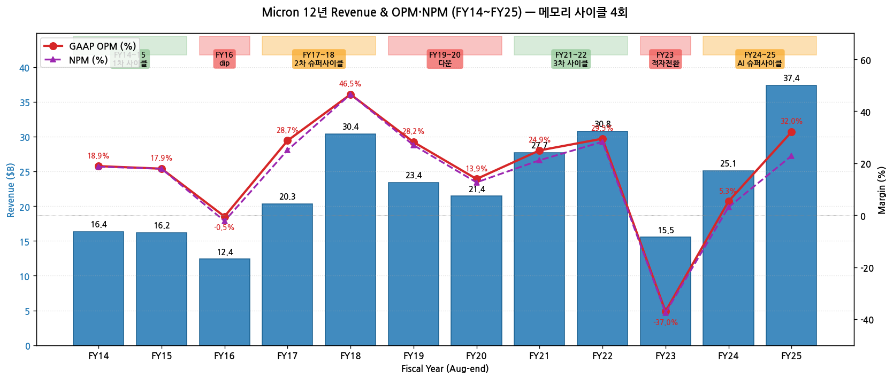

→ (출처: SEC EDGAR FY11~FY25 10-K Consolidated Statements of Operations)

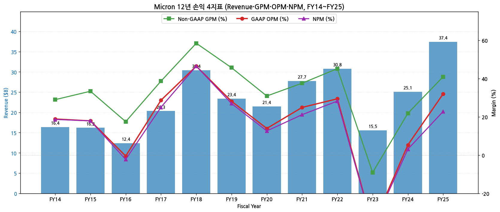

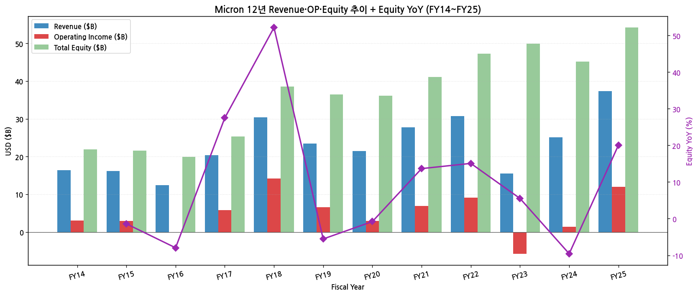

(3) 주가 역사 (20년 narrative)

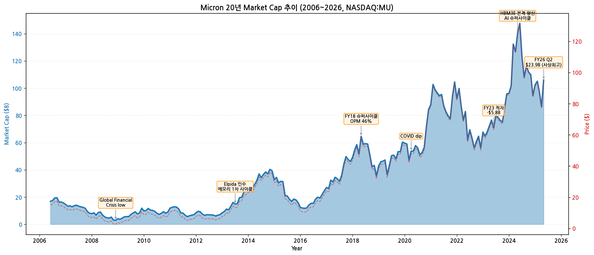

→ **시가총액 변천사 (20년)**:
- 2006년 시총 $12B (주가 $15, NAND 가격 폭락 직후 후폭풍)
- 2008-12 글로벌 금융위기 저점 ($2.4B, $2.5 도달)
- 2013-07 Elpida 인수 ($2.5B 거래 가격) → 메모리 1차 사이클 회복
- 2017 메모리 2차 슈퍼사이클 ($55, 시총 $63B)
- 2018-05 첫 분기배당 0.07$ 발표, 자사주 매입 $10B 승인 ($60, 시총 $69B)
- 2019-06 메모리 다운사이클 ($31, 시총 $34B)
- 2020-04 COVID dip ($40, 시총 $44B) → 2021-04 회복 ($96, 시총 $107B)
- 2022-08 다운사이클 진입 ($50, 시총 $54B)
- 2023-06 적자 -$5.8B 발표 ($63, 시총 $69B)
- 2024-03 HBM3E 8단 NVIDIA 본격 출하 발표 ($120, 시총 $132B)
- **2026-03-18 FY26 Q2 매출 $23.86B (사상최대), Non-GAAP EPS $12.20 (사상최대 Beat) → 폭락 -30% (GPM 피크 시그널)**
- **2026-05 현재 약 $542 (시총 $602B), 6주 평균 PT $267 → $517 (+94%) 상향**

(4) 회사 연혁 (주요 마일스톤)

| 시점 | 이벤트 |
|---|---|
| 1978.10 | Micron Technology 설립 (Boise, Idaho, Joe·Ward Parkinson 형제 + Doug Pitman·Dennis Wilson) |
| 1984.06 | NASDAQ 상장 |
| 1995-96 | 1차 메모리 슈퍼사이클 |
| 2006.04 | Crucial Technology 인수 (consumer DRAM/SSD 브랜드) |
| 2006.05 | Lexar Media 인수 (Flash memory cards) |
| 2008.09 | Inotera (DRAM 합작사) 지분 인수 |
| 2010.06 | Numonyx 인수 ($1.3B, NOR Flash) |
| 2013.07 | **Elpida Memory 인수** ($2.5B, 일본 DRAM 제조사) — Hiroshima fab 확보, 글로벌 DRAM 3위 → 2위 도약 |
| 2014~15 | 1차 사이클 회복, FY14 매출 $16B (전년 $9B 대비 +80%) |
| 2016.12 | Inotera 100% 인수 ($4B) |
| 2017.05 | **Sanjay Mehrotra CEO 취임** (前 SanDisk 공동창업자) |
| 2018 | 2차 메모리 슈퍼사이클 정점, FY18 Revenue $30B / OPM 46% / NI $14B (사상최고) |
| 2018.05 | Stock buyback $10B 승인 (현재까지 운영, 누적 $13.6B 매입) |
| 2019 | 메모리 다운사이클, OPM 28%로 감소 |
| 2020.04 | COVID dip |
| 2021.08 | **분기 배당 첫 발표** ($0.07/share, 향후 점진 인상) |
| 2021~22 | 3차 사이클 회복 |
| 2022.10 | CHIPS Act 발효 → Boise·Manassas·New York fab 보조금 확보 시작 |
| 2023.05 | China CAC 결정: 마이크론 제품 critical 인프라 사용 금지 |
| 2023 | 메모리 다운사이클 적자전환 (FY23 OP -$5.75B) — 역대 최대 적자 |
| 2024.02 | **HBM3E 8단 양산 시작** (NVIDIA H200 채택) — HBM 시장 진입 |
| 2024.07 | HBM3E 12단 양산 — NVIDIA Blackwell 채택 |
| 2025.06 | **HBM4 36GB 12-high 샘플 다수 고객 제공** — HBM4 양산 calendar 2026 예정 |
| 2025.09 | CMBU/CDBU/MCBU/AEBU 4 BU 재편 (Q4 FY25) |
| 2025.10 | FY25 결산 — Revenue $37.38B (+49% YoY), Non-GAAP OPM 32% (사상최고) |
| 2025.12 | Moody's Baa2 → Baa1 신용등급 상향 |
| 2026.03 | FY26 Q2 발표: Revenue $23.86B (+196% YoY), Non-GAAP EPS $12.20 (사상최대) — GPM 피크 시그널로 주가 -30% |
| 2026.05 | 6주 평균 PT $267 → $517 (+94%) 상향, FY27 EPS 컨센 $35 → $100 |

---

## ③ 비즈니스 모델

(1) 사업부 4 BU 구조 (FY25 Q4 재편)

→ FY25 4분기에 segment 재편됨. 모든 이전 기간 retrospectively adjust.

| Business Unit | 영문 | 주요 시장 | FY23 매출 | FY24 매출 | **FY25 매출** | YoY% |
|---|---|---|---|---|---|---|
| **CMBU** | Cloud Memory BU | Hyperscale cloud + HBM | $1.87B | $3.79B | **$13.52B** | **+257%** |
| **CDBU** | Core Data Center BU | Mid-tier cloud + Enterprise + Data Center SSD | $2.12B | $4.98B | **$7.23B** | +45% |
| **MCBU** | Mobile + Client BU | Smartphone + PC + Crucial | $7.39B | $11.67B | **$11.86B** | +2% |
| **AEBU** | Auto + Embedded BU | Auto + Industrial + Consumer | $4.14B | $4.63B | **$4.75B** | +3% |
| **Total** | — | — | **$15.54B** | **$25.11B** | **$37.38B** | +49% |

→ **CMBU 폭발 ($1.87B → $13.52B in 2년 = +624%)** — HBM3E 본격 양산 + AI 가속기 수요 폭증
→ 사업부 비중 (FY25): CMBU 36% / CDBU 19% / MCBU 32% / AEBU 13%

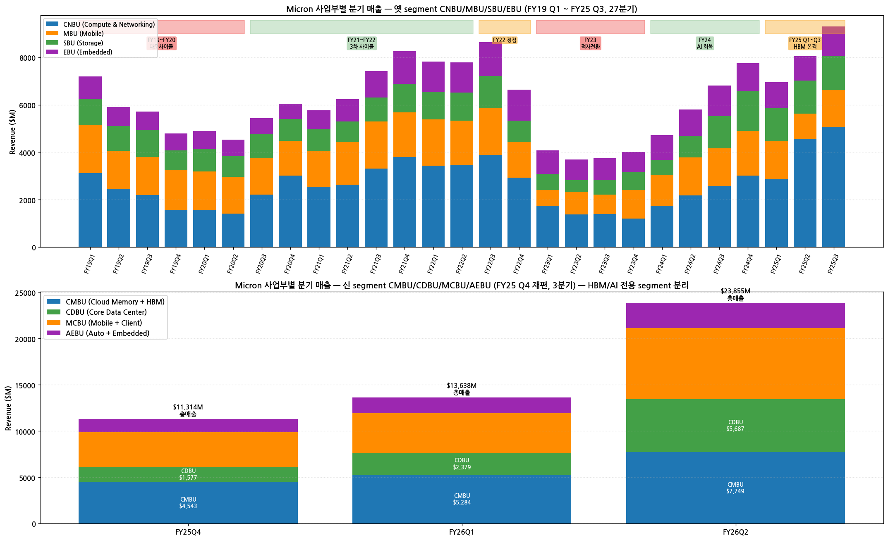

### 30분기 사업부별 매출 시계열 (FY19 Q1 ~ FY26 Q2)

→ **FY25 Q4에 segment 재편** — 옛 4 BU (CNBU/MBU/SBU/EBU) → 신 4 BU (CMBU/CDBU/MCBU/AEBU)
→ 옛 segment 27분기 + 신 segment 3분기 시계열로 사이클 동조성 + AI HBM 폭발 확인

| FY-Q | 옛 사업부 ($M) — CNBU / MBU / SBU / EBU | 사이클 | Total |
|---|---|---|---|
| FY19Q1 | 3,127 / 2,017 / 1,115 / 933 | 정점 | $7,192 |
| FY19Q2 | 2,466 / 1,599 / 1,045 / 799 | 다운 | $5,909 |
| FY19Q3 | 2,197 / 1,603 / 1,142 / 775 | 다운 | $5,717 |
| FY19Q4 | 1,572 / 1,665 / 848 / 705 | 저점 | $4,790 |
| FY20Q1 | 1,547 / 1,639 / 968 / 734 | 저점 | $4,888 |
| FY20Q2 | 1,407 / 1,564 / 870 / 696 | 회복 시작 | $4,537 |
| FY20Q3 | 2,218 / 1,525 / 1,014 / 675 | 회복 | $5,432 |
| FY20Q4 | 3,020 / 1,462 / 913 / 654 | 회복 | $6,049 |
| FY21Q1 | 2,546 / 1,501 / 911 / 809 | 회복 | $5,767 |
| FY21Q2 | 2,636 / 1,811 / 850 / 935 | 사이클 | $6,232 |
| FY21Q3 | 3,304 / 1,999 / 1,009 / 1,105 | 사이클 | $7,417 |
| FY21Q4 | 3,794 / 1,892 / 1,203 / 1,360 | 정점 | $8,249 |
| FY22Q1 | 3,441 / 1,948 / 1,166 / 1,271 | 정점 | $7,826 |
| FY22Q2 | 3,461 / 1,875 / 1,171 / 1,277 | 정점 | $7,784 |
| FY22Q3 | 3,895 / 1,967 / 1,341 / 1,435 | 정점 | $8,638 |
| FY22Q4 | 2,931 / 1,511 / 891 / 1,303 | 피크아웃 | $6,636 |
| FY23Q1 | 1,746 / 655 / 680 / 1,000 | 다운 | $4,081 |
| FY23Q2 | 1,375 / 945 / 507 / 865 | 적자 | $3,693 |
| FY23Q3 | 1,389 / 819 / 627 / 912 | 적자 | $3,752 |
| FY23Q4 | 1,200 / 1,211 / 739 / 860 | 적자 | $4,010 |
| FY24Q1 | 1,737 / 1,293 / 653 / 1,037 | 회복 | $4,726 |
| FY24Q2 | 2,185 / 1,598 / 905 / 1,111 | 회복 | $5,824 |
| FY24Q3 | 2,573 / 1,588 / 1,353 / 1,294 | 회복 | $6,811 |
| FY24Q4 | 3,018 / 1,875 / 1,681 / 1,172 | AI 시작 | $7,750 |
| FY25Q1 | 2,865 / 1,591 / 1,402 / 1,098 | AI | $8,710 |
| FY25Q2 | 4,564 / 1,068 / 1,392 / 1,025 | AI | $8,053 |
| FY25Q3 | 5,069 / 1,551 / 1,451 / 1,227 | AI | $9,300 |

→ **FY25 Q4 재편 후 신 segment**:

| FY-Q | 신 사업부 ($M) — CMBU / CDBU / MCBU / AEBU | OPM (CMBU/CDBU/MCBU/AEBU) | Total |
|---|---|---|---|
| FY25Q4 | 4,543 / 1,577 / 3,760 / 1,434 | 48% / 25% / 29% / 20% | $11,314 |
| FY26Q1 | 5,284 / 2,379 / 4,255 / 1,720 | 55% / 37% / 47% / 36% | $13,638 |
| FY26Q2 | **7,749** / **5,687** / 7,711 / 2,708 | **66% / 67% / 76% / 62%** | **$23,855** |

→ **CMBU + CDBU (Data Center 합산) FY25 Q4 $6.1B → FY26 Q2 $13.4B = 2분기 만에 +120%** — HBM·AI 가속기 폭발
→ **OPM 전 BU 60%+ 진입** (FY26 Q2) — 메모리 사상 최고 마진 구간

(2) DRAM/NAND 제품별 매출 시계열 12년

| FY | DRAM ($B) | NAND ($B) | Other ($B) | DRAM 비중 |
|---|---|---|---|---|
| FY14 | 11.45 | 3.40 | 1.51 | 70% |
| FY15 | 10.75 | 4.43 | 1.01 | 66% |
| FY16 | 7.41 | 4.20 | 0.79 | 60% |
| FY17 | 13.96 | 5.46 | 0.90 | 69% |
| FY18 | 22.62 | 6.74 | 1.03 | 74% |
| FY19 | 16.84 | 5.46 | 1.11 | 72% |
| FY20 | 14.92 | 5.49 | 1.03 | 70% |
| FY21 | 19.86 | 7.36 | 0.49 | 72% |
| FY22 | 21.97 | 8.13 | 0.66 | 71% |
| FY23 | 10.98 | 4.21 | 0.35 | 71% |
| FY24 | 17.60 | 7.23 | 0.28 | 70% |
| **FY25** | **28.58** | **8.50** | **0.30** | **76%** |

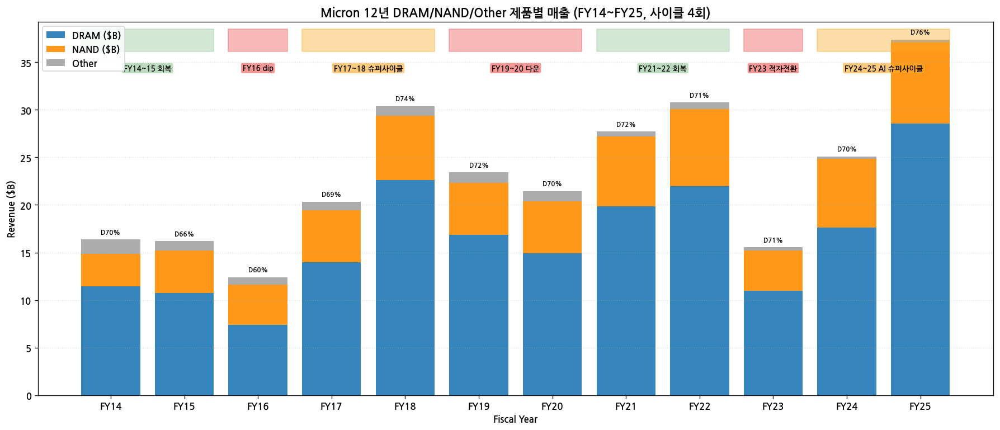

→ DRAM 비중 70~76% (12년 평균 72%) — 메모리 IDM 중 DRAM 의존도 가장 높음
→ HBM은 DRAM 안에 포함 (별도 공시 없음) — FY25 HBM 매출 추정 $6B+

(3) 직전 12분기 시계열 (FY23 Q3 ~ FY26 Q2)

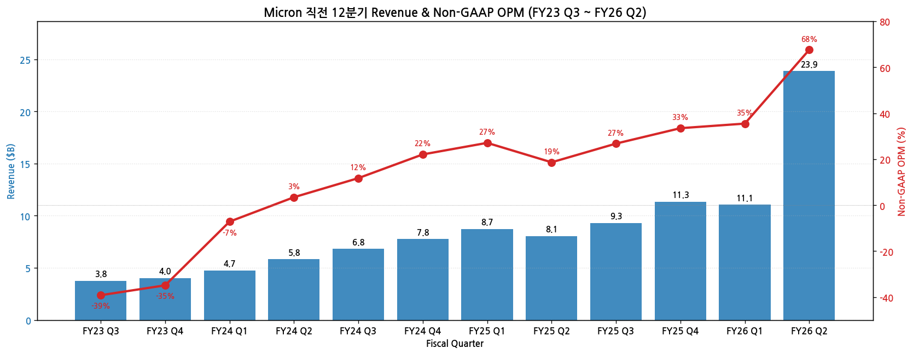

| Quarter | Revenue ($B) | Non-GAAP OP ($B) | OPM | 이벤트 |
|---|---|---|---|---|
| FY23 Q3 | 3.75 | -1.47 | -39% | 사이클 저점 |
| FY23 Q4 | 4.01 | -1.40 | -35% | 적자 지속 |
| FY24 Q1 | 4.73 | -0.34 | -7% | 회복 시작 |
| FY24 Q2 | 5.82 | 0.20 | 3% | 흑자전환 |
| FY24 Q3 | 6.81 | 0.80 | 12% | HBM3E 8단 양산 시작 |
| FY24 Q4 | 7.75 | 1.71 | 22% | |
| FY25 Q1 | 8.71 | 2.36 | 27% | |
| FY25 Q2 | 8.05 | 1.50 | 19% | NAND 약세 |
| FY25 Q3 | 9.30 | 2.49 | 27% | HBM3E 12단 본격 |
| FY25 Q4 | 11.32 | 3.79 | 34% | FY25 record |
| FY26 Q1 | 11.05 | 3.92 | 35% | |
| **FY26 Q2** | **23.86** | **16.13** | **68%** | 사상최대, GPM 75% (가이던스 +6.9pp 비트) |

→ FY26 Q2 폭발적 성장의 90%는 ASP (DRAM +mid-60% QoQ, NAND +high-70% QoQ)
→ Bit growth는 mid-single digits 부합

(4) FY25 핵심 제품 라인업

| 카테고리 | 핵심 제품 | 시점 |
|---|---|---|
| **HBM** | **HBM3E 12-high** (24GB, 1β node) | FY25 Q4 majority 출하 |
| HBM | **HBM4 36GB 12-high** | FY25 샘플, calendar 2026 양산 |
| Server DRAM | **DDR5 128GB module** (monolithic 32Gb die, 1β) | FY24 출하 시작 |
| Server DRAM | **SOCAMM LPDDR5** (server form factor) | FY25 양산 시작 |
| Mobile DRAM | **LPDDR5X (1γ node)** | FY25 첫 1γ node DRAM (EUV) 양산 |
| Client SSD | **Micron G9 NAND QLC** (Adaptive Write Tech) | FY25 출하 |
| Data Center SSD | **9550 series** (G8 NAND, PCIe Gen5) | FY25 양산 |
| Data Center SSD | **6550 ION SSD** (low power, high density) | FY25 양산 |
| Storage | **PCIe Gen6 SSDs** (G9 기반) | FY25 출하 |
| 자동차 | LPDDR5X automotive, 4150 SSD automotive-qualified | FY25 |

---

## ④ 재무 구조

(1) 12년 자산·자본·부채 시계열

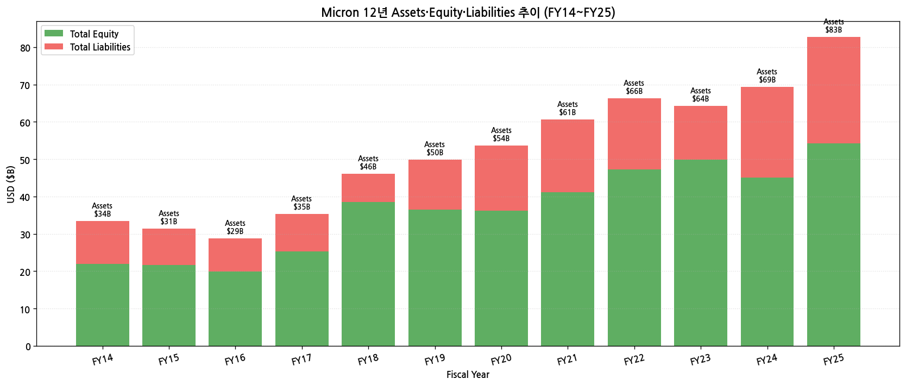

→ **Total Equity FY14 $21.9B → FY25 $54.2B** = 2.5배 (12년 CAGR 7.9%)
→ **Total Assets FY14 $33.5B → FY25 $82.8B** = 2.5배
→ **Total Liabilities FY25 $28.6B** (Long-term debt $14.0B + Current liabilities $11.5B)
→ Debt/Equity = 0.53 — 안정적 자본 구조
→ FY23 다운사이클에서 Equity 거의 일정 유지 (49.9 → 49.9) — Treasury 매입 중단으로 보존

(2) 12년 현금흐름·CapEx 시계열

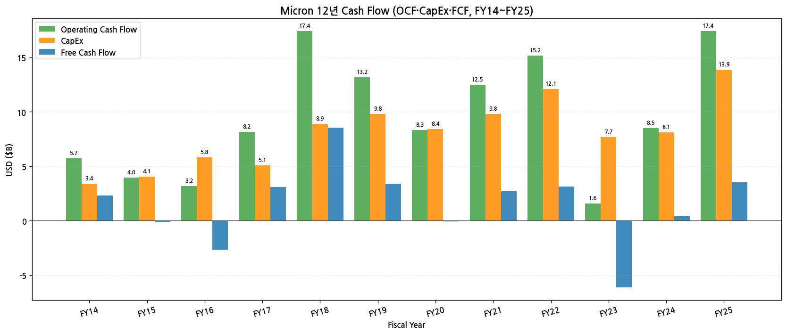

→ **OCF 12년 누적 약 $130B** — 메모리 IDM 캐시 머신
→ **CapEx 12년 누적 약 $107B** — DRAM/NAND fab 자본집약
→ FY23 다운사이클 OCF $1.6B (-89% YoY) → CapEx도 $7.7B로 -36% cut

(3) 12년 CapEx — 사이클 동조성

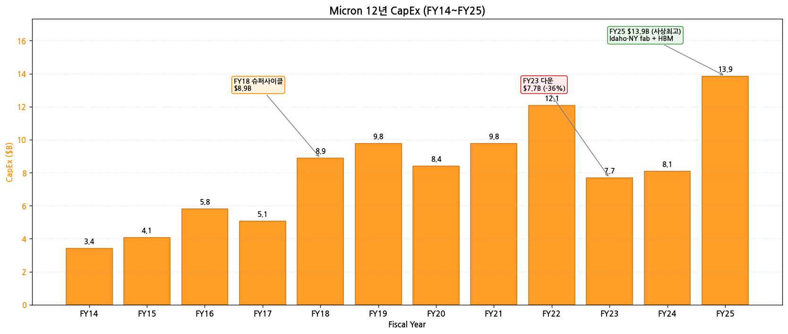

→ **CapEx FY18 $8.9B (정점) → FY23 $7.7B (-36% cut)** — 사이클 동조 명확
→ **FY25 $13.86B (사상최고)** — HBM·Idaho fab·NY fab·India fab 동시 진행
→ CHIPS Act funding: Boise/Clay NY direct funding 확보, Manassas VA 보조금

(4) 12년 R&D 투자 추이

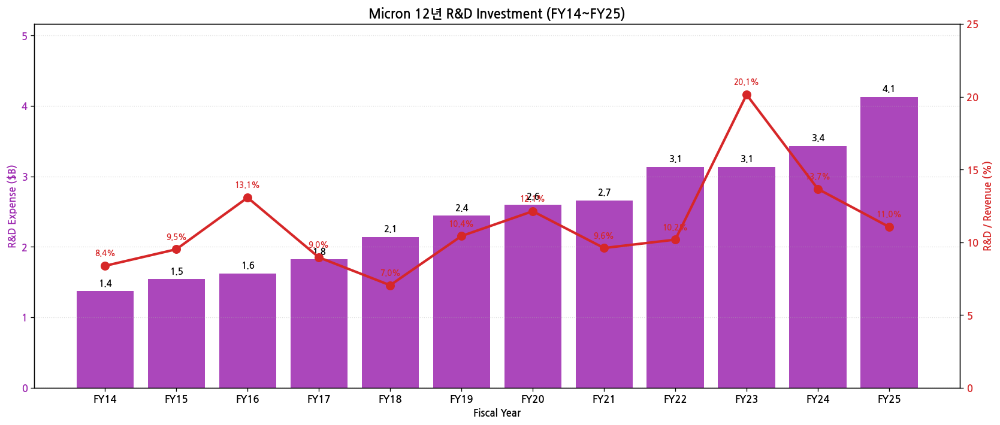

→ **R&D FY14 $1.4B → FY25 $4.1B** = 3배 (12년 CAGR 9.8%)
→ **R&D/Revenue 비율 12년 평균 11.5%** — 메모리 IDM 표준 수준
→ FY23 다운사이클 = R&D 20%까지 상승 (매출 줄어도 R&D 유지) — 기술 우위 사수 의지
→ FY25 R&D 11.0% 정상화

(5) 12년 주주환원 (배당·자사주)

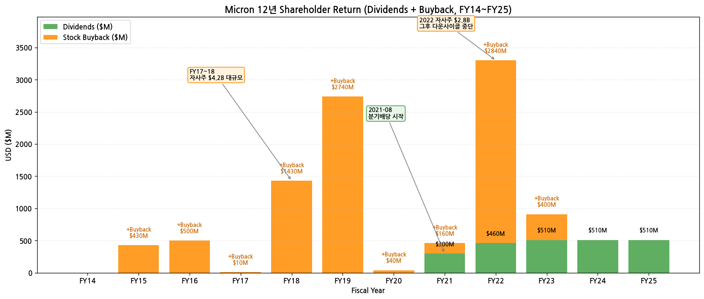

→ **분기 배당 시작**: 2021-08 ($0.07/share) → 점진 인상
→ **Buyback 누적 $13.6B** (FY15~FY25): FY17~18 $4.2B 집중, FY22 $2.8B
→ FY23 다운사이클 이후 buyback 일시 중단, FY25 슈퍼사이클 후 재개 가능성

(6) 주요 재무 지표 (FY25)

| 지표 | FY25 | FY24 | 변화 |
|---|---|---|---|
| GAAP GPM | 41.0% | 21.9% | +19.1pp |
| GAAP OPM | 32.0% | 5.3% | +26.7pp |
| Net Profit Margin | 22.8% | 3.1% | +19.7pp |
| ROE | 17.2% | 1.7% | +15.5pp |
| Debt/Equity | 0.53 | 0.54 | -0.01 |
| Current Ratio | 2.52 | 2.63 | -0.11 |
| Cash + ST Inv (FY25말) | $14.36B | $11.36B | +$3B |

→ **순현금 (Cash $14.4B - Total Debt $14.6B) = -$0.2B** — 매우 안정적, FY26 슈퍼사이클로 양수 전환 예정

---

## ⑤ 지배 구조

(1) 주주 구성 — 13F 기준

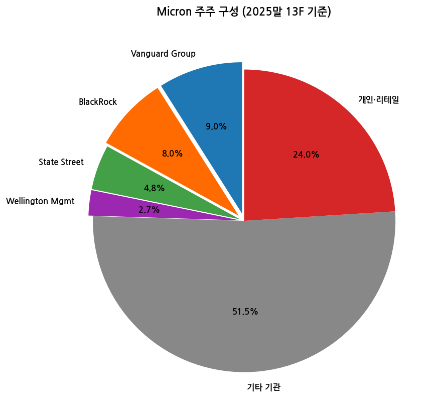

| 주주 유형 | 비중 | 비고 |
|---|---|---|
| Vanguard Group | 9.0% | 패시브 1위 |
| BlackRock | 8.0% | 패시브 2위 |
| State Street | 4.8% | 패시브 3위 |
| Wellington Management | 2.7% | 액티브 1위 |
| 기타 기관 | 51.5% | 액티브 multi |
| 개인·리테일 | 24.0% | — |

→ **기관 비중 76%** — S&P 500 편입 종목 표준 수준
→ 최대주주 부재 (founders 형제 Parkinson 가족도 일반 주주 수준)
→ Insider holdings < 0.5% (경영진·이사진 자기주식 보유분)

(2) 이사회 (12명, 2025말 기준)

| 성명 | 역할 | 주요 경력 |
|---|---|---|
| **Sanjay Mehrotra** | CEO, President, Director | Stanford BS/MS, 前 SanDisk 공동창업자·CEO |
| **Robert L. Bailey** | Chairman of the Board | 前 PMC-Sierra CEO |
| Lynn A. Dugle | Director, Audit Committee Chair | 前 Engility Holdings CEO |
| Steven J. Gomo | Director | 前 NetApp CFO |
| Linnie M. Haynesworth | Director | 前 Northrop Grumman SVP |
| MaryAnn Wright | Director | 前 Johnson Controls VP |
| **Mary Pat McCarthy** | Director (2025 신규) | 前 KPMG Vice Chair |
| Karthik Sridhar | Director | 前 Cisco SVP |
| Heng-Yi (Andy) Lin | Director | 前 TSMC SVP |
| Susan E. Engel | Director | 前 Dura Automotive CEO |
| Patrick J. Byrne | Director | 前 Mentor Graphics |
| Kevin J. Faulconer | Director | 前 San Diego Mayor |

(3) 핵심 경영진

| 성명 | 직위 | 주요 경력 |
|---|---|---|
| **Sanjay Mehrotra** | CEO·President | 2017.05~ 현직 |
| **Mark J. Murphy** | CFO·EVP | 2024.10~ 현직, 前 Qorvo CFO |
| **Manish Bhatia** | EVP, Global Operations | Global manufacturing 책임 |
| **April S. Arnzen** | EVP, Chief People Officer | 1996년 입사 |
| **Scott R. Allen** | VP, Chief Accounting Officer | 2020.10~ |
| Sumit Sadana | EVP, Chief Business Officer | 메모리 segment 책임 |
| Scott DeBoer | EVP, Technology & Products | 차세대 노드 R&D 책임 |
| Naga Chandrasekaran | EVP, COO | 글로벌 operations |

---

## ⑥ 기타 팩트

(1) R&D 마일스톤 (FY23~FY25 핵심)

→ **FY25 (마지막 10-K)**
- **1γ (1-gamma) DRAM 첫 양산** — Micron 최초 EUV 적용 노드, 1β 대비 power 효율/density 개선
- **G9 NAND 양산** (3D 9세대)
- HBM3E 12-high 양산 (24GB)
- HBM4 36GB 12-high 샘플 다수 고객 제공
- LPDDR5X 1γ node 양산
- DDR5 128GB module (server) 양산
- SOCAMM (server LPDDR) form factor 양산
- 9550 series SSD (Gen5, AI workload) 양산

→ **FY24**
- HBM3E 8-high 양산 (NVIDIA H200)
- HBM3E 12-high 본격 양산 (NVIDIA Blackwell)
- DDR5 128GB 모듈 출하 시작
- G9 NAND 본격 양산 시작

→ **FY23**
- 1β DRAM 양산
- 232단 NAND 양산
- HBM3E 개발 진척

(2) M&A 이력 (15년치)

| 시점 | 거래 | 규모 | 의의 |
|---|---|---|---|
| 2010.06 | **Numonyx 인수** | $1.3B | NOR Flash 사업 진입 (Phase Change Memory 포함) |
| 2013.07 | **Elpida Memory 인수** | $2.5B | 일본 DRAM 인수, Hiroshima fab 확보, 글로벌 DRAM 3위 → 2위 도약 |
| 2016.12 | Inotera 100% 인수 | $4B | 대만 DRAM JV 완전 통합 |
| 2019.10 | Intel-Micron Flash JV 종결 | — | NAND 사업 단독화 |

(3) 주요 계약 (10년치)

→ **CHIPS Act funding** (2022.08~): Boise/Clay NY direct funding (수십억 달러), Manassas VA 추가 보조금, India central + Gujarat state 보조금
→ **Strategic Customer Agreements (SCA)**: 최근 첫 5년 SCA 체결 (3/2025 발표), HBM3E + HBM4 multi-year sold out CY2026

(4) 리스크 분석

| 카테고리 | 리스크 | 영향도 |
|---|---|---|
| **사이클** | 메모리 다운사이클 — FY23 적자 -$5.75B 재발 가능 | 매우 높음 |
| **고객 집중도** | NVIDIA HBM 의존도 — Blackwell·Vera Rubin 양산 지연 시 매출 충격 | 높음 |
| **경쟁** | SK하이닉스 HBM 70% 점유율 — MU 20% 따라잡기 도전 | 높음 |
| **지정학** | 중국 CAC 결정 (2023.05) — critical infra 사용 금지 | 중간 (이미 반영) |
| **CHIPS Act** | 정치 변화 시 funding 조정 가능 | 중간 |
| **CapEx** | FY25 $13.9B + FY26 추가 증가 → ROIC 압박 | 중간 |
| **CXMT/YMTC** | 중국 국가 지원 메모리 업체 ramp | 중장기 |

(5) ESG·인증

→ **ISO 14001:2015** environmental management 인증 (모든 wafer fab)
→ **RBA (Responsible Business Alliance)** 회원
→ **2025 Sustainability Report** 발행
→ **53,000명 직원** — 5 well-being pillars (Physical/Mental/Social/Career/Financial)
→ Employee Resource Groups 10개

(6) 핵심 산업 데이터 (FY25 기준)

→ **글로벌 메모리 시장 (Gartner 2026.01)**:
- DRAM: $135.6B (전년 +48%)
- NAND: $67.7B (전년 +7%)
- HBM (DRAM 안): 추정 $25B+ (글로벌)
→ **Micron 점유율**:
- DRAM: 22~25% (글로벌 3위)
- NAND: 12~14% (글로벌 5위)
- HBM: 약 20% (글로벌 3위, SK하이닉스 70%·삼성 23% 대비)

→ **공급-수요 균형 (회사 공식)**:
- **HBM3E + HBM4 100% sold out CY2026** (회사 공식, 3/2025 컨콜)
- "Supply-demand tight beyond CY2026" — CFO 명시
- DRAM/NAND industry bit shipment CY2026 +20%대 outlook

---

## ⑦ 향후 관찰 포인트

(1) **HBM4 양산 진척** — Calendar 2026 양산 onTrack, NVIDIA Vera Rubin platform 출하 일정 연동
   → 모니터링: 분기 컨콜 HBM4 ramp 코멘트, TrendForce HBM 보고서

(2) **HBM 점유율 SK하이닉스 따라잡기** — MU 20% → 25%+ 도달 시점
   → 모니터링: TrendForce HBM 분기 보고서, IDC HBM 점유율

(3) **GPM 81% 가이던스 sustainability** — FY26 Q3 가이던스 GPM 81% (사상최고). Q4 forward outlook이 진짜 시그널
   → 폭락 1차 트리거가 GPM 피크 시그널이었던 점 감안

(4) **추가 SCA 체결** — 첫 5년 SCA 체결 후 hyperscaler 추가 체결 가능성
   → 가능성 후보: Microsoft, Google, AWS 중

(5) **FY27 가이던스 시그널** — Q3 FY26 컨콜 정성적 톤 ("exceptional growth continues" vs "moderation expected")
   → FY27 OP $115B 컨센 미달 시 sell-the-news

(6) **CHIPS Act funding 진척** — Boise·NY fab 진척, India fab 신설

---

> **데이터 소스**: SEC EDGAR FY11~FY25 10-K (15개) + 10-Q (47분기), Yahoo Finance v8 (MU 20년), Gartner 2026.01 memory market report, IDC DRAM/NAND market share, Micron FY25 10-K Item 1·8 (Business + Financial Statements).
> **연계 참조**: `earnings-review/2026-Q1_MU_리뷰.md` (FY26 Q2 실적 리뷰 v2), `earnings-followup/2026-Q2_MU_팔로업.md` (FY26 Q3 팔로업 v6).
> **차트 13종**: chart1 (매출OPM 12년), chart1b (손익4지표), chart2_사업부별 (FY23~25 4 BU), chart2_제품별 (12년 DRAM/NAND), chart4 (자산자본부채), chart5 (주주지분), chart6 (현금흐름), chart7 (R&D), chart8 (CapEx), chart9 (주주환원), chart10 (12분기), chart11 (시가총액 20년), chart12 (손익자본추이).
