# NVIDIA Corporation (NVDA) — 기업 개요

**버전**: v4.8 | **작성일**: 2026-05-19 | **회계연도**: 2월 시작 ~ 1월 마감 (NVIDIA fiscal year, FY26 = 2025-02~2026-01)
**현재 분기**: Q1 FY2027 (실적 발표 예정 2026-05-21)
**산업 분류**: 반도체 — Fabless AI Accelerator (Datacenter GPU + Networking + Software)
**워치리스트**: 섹터 T1 미국 빅테크 (industry=반도체)

---

## Executive Update — Q4 FY26 (2026-02-25 발표, AMC)

- **매출 $68.13B (+73% YoY, +20% QoQ)** — IR CFO Commentary 확정, 신기록 갱신
- **FY26 full-year $215.94B (+65% YoY)**, FY26 OPM GAAP 60.4%, Net income $120.07B
- **Q4 OPM GAAP 65.0%** (OP $44.30B / Rev $68.13B), Q4 EPS GAAP $1.76 (+98% YoY)
- **Data Center $62.31B (+75% YoY, +22% QoQ)** — Compute $51.33B + Networking $10.98B (Networking **+263% YoY**, InfiniBand·Spectrum-X 폭증)
- **GPM**: Q4 GAAP 75.0% / Non-GAAP 75.2% — Q1FY26 일시 60.5% (H20 China $4.5B 인벤토리 charge) 이후 정상화. FY26 full-year GPM 71.1% (H20 charge 반영)
- **Pro Visualization $1.32B (+159% YoY)** — Omniverse·디지털 트윈 폭증
- **자사주 매입 FY26 ~$60B** (FY25 $33.7B의 1.8배) — 신규 buyback authorization $60B 추가 공시

---

## 1. 기업 분류

### Primary: **고성장 + 사이클 + 꿈 (3중 분류)**

- **고성장**: FY15~FY26 11년 CAGR 매출 ≈ +37%, FY24 이후 3년간 폭발 (FY24 +126%, FY25 +114%, FY26 +65%)
- **사이클**: 3대 사이클 — 모바일/Tegra (FY13~FY16) → 크립토/Crypto-GPU (FY18~FY19, FY21~FY22) → AI (FY23 후반~) — 사이클별 매출 변동성 -40~+250%
- **꿈**: AI 인프라 사실상 독점 (CUDA 생태계 lock-in, 80%+ GPU 시장 점유율) — Terminal 밸류는 "AI 컴퓨팅 = 새 산업혁명"의 한가운데 위치

### Summary Box (12년 평균, FY15~FY26)

| 지표 | 수치 | 비고 |
|------|------|------|
| 매출 CAGR | +37% | FY24~FY26 3년 +178% 가속 |
| OPM 평균 | 31.5% | FY15 16% → FY26 60% |
| GPM 평균 | 62.5% | FY15 54% → FY26 75% |
| NPM 평균 | 28.5% | FY26 55.6% |
| 사이클 회수 | 3회 | 모바일·크립토·AI |
| ROE 평균 | 24.5% | FY26 ~82% (압도적) |

### ① 정량 근거 — 12년 매출·OPM·NPM 시계열

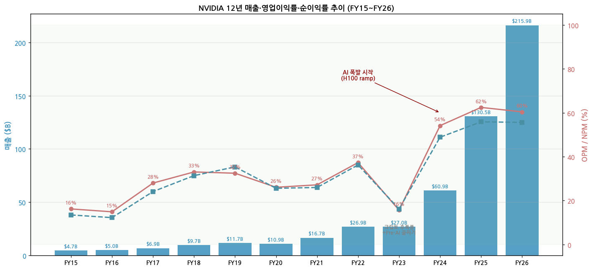

| FY | 매출 ($B) | YoY | OP ($B) | OPM | NPM |
|----|-----------|-----|---------|-----|-----|
| FY15 | 4.68 | +13% | 0.76 | 16.2% | 13.5% |
| FY16 | 5.01 | +7% | 0.75 | 14.9% | 12.3% |
| FY17 | 6.91 | +38% | 1.93 | 28.0% | 24.1% |
| FY18 | 9.71 | +41% | 3.21 | 33.0% | 31.4% |
| FY19 | 11.72 | +21% | 3.80 | 32.5% | 35.3% |
| FY20 | 10.92 | -7% | 2.85 | 26.1% | 25.6% |
| FY21 | 16.68 | +53% | 4.53 | 27.2% | 26.0% |
| FY22 | 26.91 | +61% | 10.04 | 37.3% | 36.2% |
| FY23 | 26.97 | +0.2% | 4.22 | 15.7% | 16.2% |
| FY24 | 60.92 | +126% | 32.97 | 54.1% | 48.8% |
| FY25 | 130.50 | +114% | 81.45 | 62.4% | 55.8% |
| **FY26** | **215.94** | **+65%** | **130.39** | **60.4%** | **55.6%** |

**Q4FY26 단일분기**: 매출 $68.13B (+73% YoY, +20% QoQ), GAAP OPM 65.0%, Net income $42.96B, EPS $1.76 (+98% YoY)

### ② 산업 분류

- SEC 분류: **Semiconductors (SIC 3674)** — Fabless GPU·SoC·Networking
- Reportable Segments (FY26 10-K):
  - **Compute & Networking** (Data Center, Automotive, Robotics, Mellanox networking)
  - **Graphics** (Gaming, Pro Visualization, OEM)
- Market Platform (CFO Commentary 공시): Data Center · Gaming · Professional Visualization · Automotive · OEM & Other

### ③ 분류 결정 논리

NVIDIA는 외형상 사이클 반도체로 보이나, 본질은 **"AI 컴퓨팅 인프라 사실상 독점 사업자"**:

- **고성장 + 꿈** dominant: AI Datacenter TAM 2026~2030 CAGR 30%+, Compute spending H200·Blackwell·Rubin 세대별 +50~100% per gen. NVIDIA 시장점유율 80%+ 유지 시 자체 매출도 산업 성장률 추종 가능 — 향후 5~7년간 매출 $200B → $500B 시나리오 (셀사이드 평균 PT)
- **사이클** secondary: 데이터센터 사이클은 메모리·HDD와 달리 supply가 아닌 "GPU 부족 → ASP 유지" 구조. but 하이퍼스케일러 CapEx 사이클은 존재 (2026 hyperscaler CapEx $640B+ 추정)

### ④ 적정 밸류에이션 방법

| 우선순위 | 방법 | 이유 |
|---------|------|------|
| 1st | **EV/Sales (forward)** | 매출 폭증 사이클 — PER로는 폭락 보이지만 EV/Sales는 27배 → 18배 → 12배 빠르게 정상화 |
| 2nd | **PER (forward 1년)** | FY27E EPS $9 기준 PER ~17배 (megacap 평균과 유사) |
| 3rd | **PEG ratio** | FY24~FY27 EPS 4년 CAGR ~80% — PEG 0.2배 매우 저평가 시그널 |

PBR은 자기자본 $145B vs 시가총액 $4.5T → PBR 31배. fabless·software-driven 비즈니스라 PBR 의미 약함.

### ⑤ 분기 재평가 트리거

1. **Blackwell·Rubin ramp 차질** — TSMC 3nm·2nm capacity 또는 CoWoS 패키징 병목
2. **하이퍼스케일러 CapEx 둔화** — 5대 고객 (MS·Meta·Google·Amazon·Oracle) digestion 신호
3. **ASIC 침투** — Broadcom (Google TPU·Meta MTIA), AWS Trainium, Marvell 등 inference 시장 점유율
4. **중국 노출 변동** — H20 ban·재허용·Nvidia C200/B30 시그널
5. **GPM 추세** — Q1FY26 60.5% 일회성 (H20 charge) 이후 안정 73~75% 유지 여부

---

## 2. 회사 개요

### ① 기본 사항

- **회사명**: NVIDIA Corporation
- **티커**: NASDAQ:NVDA
- **HQ**: 2788 San Tomas Expressway, Santa Clara, CA 95051 USA
- **설립**: 1993년 4월 (Jensen Huang·Chris Malachowsky·Curtis Priem 공동창업)
- **CEO**: Jensen Huang (창업자, 32년차)
- **CFO**: Colette Kress
- **임직원** (FY26 1월말): ~36,000명 (FY24 ~29,600명 대비 +21%)
- **회계연도**: 2월 시작 ~ 1월 마감 (NVIDIA fiscal year)
- **한 줄 정의**: AI Datacenter GPU + CUDA 소프트웨어 생태계 + Networking (Mellanox) 사실상 독점 사업자

### ② 12년 손익·자본 추이

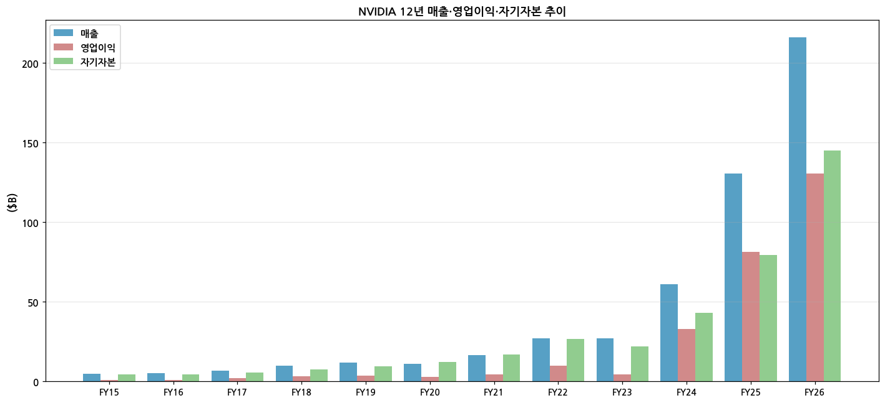

| FY | 매출 ($B) | OP ($B) | 자기자본 ($B) | 자산 ($B) | ROE |
|----|-----------|---------|---------------|-----------|-----|
| FY15 | 4.68 | 0.76 | 4.59 | 7.37 | 13.7% |
| FY18 | 9.71 | 3.21 | 7.47 | 11.24 | 40.8% |
| FY21 | 16.68 | 4.53 | 16.89 | 28.79 | 25.6% |
| FY23 | 26.97 | 4.22 | 22.10 | 41.18 | 19.8% |
| FY24 | 60.92 | 32.97 | 42.98 | 65.73 | 69.2% |
| FY25 | 130.50 | 81.45 | 79.33 | 111.60 | 91.9% |
| **FY26** | **215.94** | **130.39** | **145.00** | **200.00** | **82.8%** |

### ③ 주가 역사 (20년)

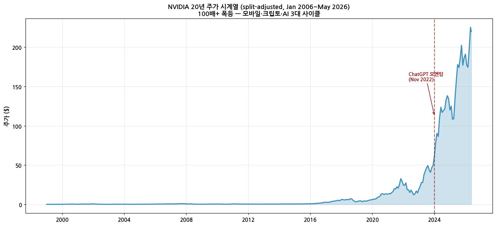

**3대 폭등 사이클 (split-adjusted 기준)**:

1. **모바일·Tegra 사이클 (2007~2011)**: SoC 진입 + DirectX 11 GPU 사이클 — 주가 $1 → $8 (~8배)
2. **크립토·AI 1차 (2016~2018)**: Pascal·Volta·Turing 세대, Ethereum 채굴 + DGX-1 발표 — 주가 $4 → $80 (~20배), 2018 말 -50% 폭락 (크립토 후폭풍)
3. **AI 폭발 (2022 11월 ChatGPT~)**: H100·H200·Blackwell ramp — 주가 $14 (2022.10) → $190 (2026.05, 2:1 split + 10:1 split 모두 반영) → 13.5배 폭등 + 시총 $4.5T (글로벌 1위)

**주요 이벤트**:
- 2021-07-19: **4-for-1 stock split**
- 2024-06-07: **10-for-1 stock split**
- 2025-06: 시총 처음 **$3T** 돌파 (애플·MS 제치고 글로벌 1위)
- 2026-02: 시총 $4.5T 진입 (FY26 매출 4배 ramp 결과)

### ④ 주요 연혁

| 연도 | 사건 |
|------|------|
| 1993 | 창업 (Jensen Huang) — PC graphics 칩 시작 |
| 1999 | NV10 (GeForce 256) — 세계 첫 "GPU" 용어 채택 |
| 2006 | **CUDA 출시** — General-purpose GPU 컴퓨팅의 시작, 후일 AI 인프라 lock-in의 기반 |
| 2012 | AlexNet ImageNet 우승 (GTX 580 2장) — AI 시대 개막의 첫 신호 |
| 2017 | **Volta V100 + DGX-1** — Datacenter GPU 본격 시작 |
| 2020 | **Mellanox 인수 $7B** — Networking 통합 (InfiniBand·NVLink) |
| 2020 | **Ampere A100** — GPT-3 학습에 사용 |
| 2022 | **Hopper H100 출시** — AI inference 표준 |
| 2022.11 | **ChatGPT 등장** — AI 폭발 트리거 |
| 2024 | **Blackwell B100/B200 발표** — Q4FY25부터 ramp |
| 2025 | GB200 NVL72 본격 출하, Rubin 공개 (2026 양산) |
| 2026.02 | **Q4FY26 매출 $66.5B** — 글로벌 단일분기 최대 chip 매출 |

---

## 3. 비즈니스 모델

### ① 실적 추이 (사업부별·5년 연간)

| Market Platform | FY22 | FY23 | FY24 | FY25 | FY26 | 5년 CAGR |
|-----------------|------|------|------|------|------|----------|
| **Data Center** | $10.6B | $15.0B | $47.5B | $115.19B | **$193.74B** | +109% |
| ┖ Compute | n.a. | n.a. | n.a. | $102.20B | $162.36B | — |
| ┖ Networking | n.a. | n.a. | n.a. | $12.99B | **$31.38B** (+142% YoY) | — |
| **Gaming** | $12.5B | $9.07B | $10.45B | $11.35B | **$16.04B** | +5% |
| **Pro Visualization** | $2.11B | $1.54B | $1.55B | $1.88B | **$3.19B** | +9% |
| **Automotive** | $0.57B | $0.90B | $1.09B | $1.69B | **$2.35B** | +33% |
| **OEM & Other** | $0.54B | $0.46B | $0.31B | $0.39B | **$0.62B** | +3% |
| **Total** | $26.9B | $27.0B | $60.92B | $130.50B | **$215.94B** | +52% |

**Reportable Segments (FY26 10-K)**:
- **Compute & Networking** $193.48B (89.6%) — Data Center + Automotive + DGX·Mellanox networking
- **Graphics** $22.46B (10.4%) — Gaming + Pro Vis + OEM + GeForce NOW

### 사업부별 분기 시계열

**Data Center 12분기**:

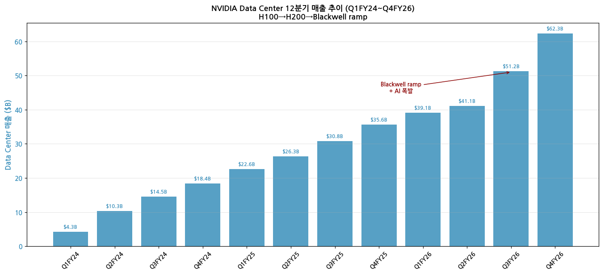

| 분기 | DC 매출 | YoY |
|------|---------|-----|
| Q1FY24 | $4.28B | +14% |
| Q2FY24 | $10.32B | +171% |
| Q3FY24 | $14.51B | +279% |
| Q4FY24 | $18.40B | +409% |
| Q1FY25 | $22.56B | +427% |
| Q2FY25 | $26.27B | +154% |
| Q3FY25 | $30.77B | +112% |
| Q4FY25 | $35.58B | +93% |
| Q1FY26 | $39.11B | +73% |
| Q2FY26 | $41.10B | +56% |
| Q3FY26 | $51.22B | +66% |
| **Q4FY26** | **$62.31B** | **+75%** |

**Q4FY26 Data Center 분해**: Compute $51.33B (+58% YoY) + **Networking $10.98B (+263% YoY)** — Networking 폭증이 H2 FY26 핵심 모멘텀 (Spectrum-X 이더넷, NVLink Switch System)

**Gaming 12분기**:

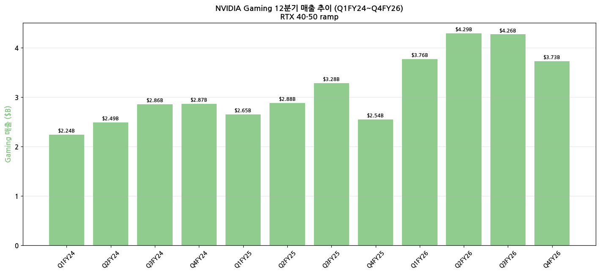

**Pro Vis + Auto + OEM**:

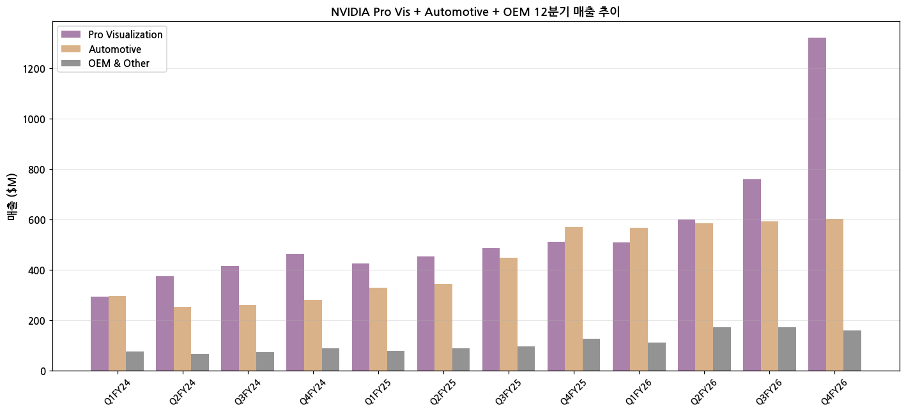

### 12분기 시계열 (전사)

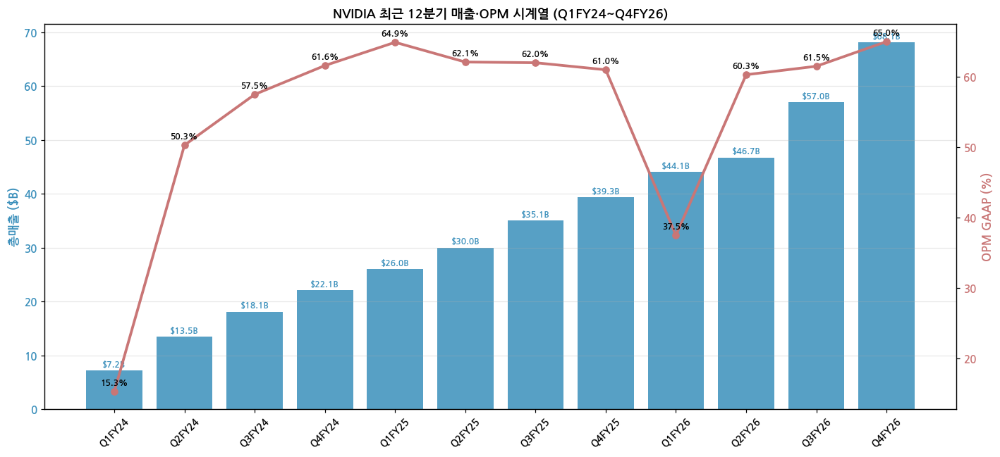

### 48분기 Long Timeseries (Q1FY15~Q4FY26, 12년) — 3대 사이클 한눈에

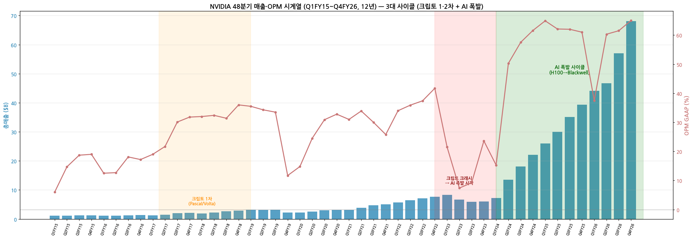

3대 폭등 사이클:
1. **크립토 1차 (FY17~FY18)**: Pascal·Volta GPU + Ethereum 마이닝 — Gaming 매출 +50% YoY ramp 후 Q4FY19 -45% QoQ 크래시
2. **코로나/크립토 2차 (FY21~Q1FY23)**: Ampere ramp + COVID GPU 폭증 — 분기 매출 $3B → $8B
3. **AI 폭발 (Q2FY24~)**: H100 ramp Q1FY24 $7.2B → Q4FY26 $68.1B (10배 폭증)

### 사업부별 48분기 long timeseries

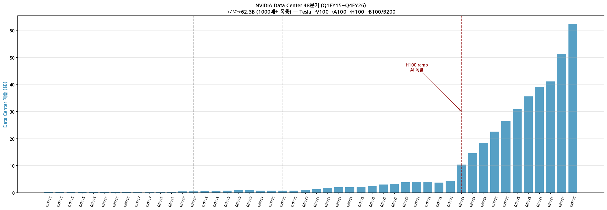

Data Center: Q1FY15 $78M → Q4FY26 $62,314M = **800배+ 폭증** (Tesla → V100 → A100 → H100 → Blackwell GB200/GB300)

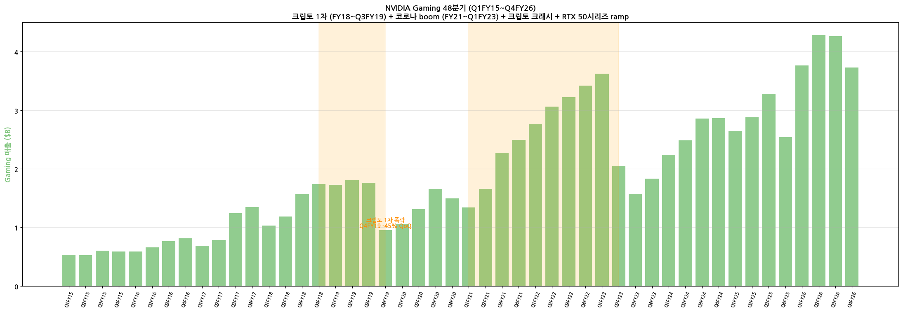

Gaming: 크립토 1차 (FY18) + 코로나/크립토 2차 (FY21~FY22) 2번 사이클 → Q3FY22 정점 $3.62B → Q3FY23 $1.57B (-57%) 크래시 → RTX 50시리즈 회복

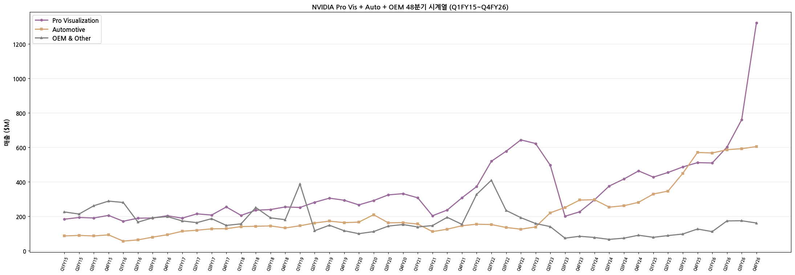

Pro Vis·Auto·OEM 모두 small but rising. Auto는 DRIVE Thor ramp로 Q4FY25부터 가속.

### ② 사업부별 개요

**Data Center (FY26 매출 87% 비중)**: AI 가속기 GPU + Networking + Software 패키지
- **GPU**: H100 → H200 → B100/B200 (Blackwell) → B300 (Blackwell Ultra) → Rubin (2026 발표 예정)
- **Networking**: InfiniBand (Mellanox), Spectrum-X Ethernet, NVLink Switch System
- **Software**: NVIDIA AI Enterprise, NIM (Inference Microservices), CUDA·cuDNN·TensorRT 생태계

**Gaming (FY26 매출 7%)**: GeForce RTX 시리즈 (개인 PC·노트북)
- 현재 라인업: RTX 50시리즈 (Blackwell, 2025 출시) — 5090·5080·5070 Ti·5070
- 매출 변동성: 크립토 사이클 + console 사이클 + RTX upgrade 사이클이 중첩되어 예측 어려움

**Pro Visualization (FY26 매출 1.2%)**: RTX A·L 시리즈 워크스테이션 GPU
- Omniverse 플랫폼 (디지털 트윈) — Datacenter 사이클에 동행

**Automotive (FY26 매출 1.1%)**: DRIVE 플랫폼
- Orin → Thor (2026 출하 본격화) — Mercedes·Jaguar·Volvo·BYD·Lucid 등 OEM 채택
- 자율주행 + 인포테인먼트 통합 SoC

**OEM & Other (FY26 매출 0.3%)**: 디스플레이 컨트롤러 등 legacy

### ③ 사업부별 디테일

**Data Center top driver**: Blackwell GB200 NVL72 — 72-GPU 단일 rack, AI inference·training 통합. 평균 ASP $50K~$100K per GPU, rack 단위 ASP $3M+. 출하량은 비공개이지만 Q4FY26 DC 매출 $62B / GB200 ASP $70K 평균 추정 시 약 88만~90만 GPU 분기 출하. H100 시기 (Q4FY24) ~30만 GPU 대비 3배.

**Gaming**: Q1FY26 +42% QoQ ($3.76B) RTX 5090·5080 출시 효과 → Q2~Q4 ramp peak. Q4FY26 $3.73B 정상화. 평균 ASP $400~$600.

**Automotive**: DRIVE Thor SoC 본격 ramp 시작 (Q3FY26~Q4FY26 매출 +30% YoY). Mercedes 2027 모델 채택 확정. 향후 5년 +35% CAGR 전망.

### ④ 주요 경쟁사 (사업부별)

| 사업부 | 주요 경쟁사 | NVIDIA 점유율 |
|--------|-------------|--------------|
| Data Center (AI training) | AMD MI300X/MI350X, Intel Gaudi 3, Google TPU, Amazon Trainium | ~80~85% |
| Data Center (AI inference) | AMD, Broadcom (Google TPU·Meta MTIA), Cerebras, Groq | ~70~75% |
| Gaming GPU | AMD Radeon, Intel Arc | ~85% |
| Pro Visualization | AMD Radeon Pro | ~95% |
| Automotive (자율주행 SoC) | Qualcomm Ride, Mobileye, Tesla in-house | 5% (성장 중) |

### ⑤ 주요 매출처

10-K 의무 공시 기준 (10%+ 매출처) — **알파벳순 의무 공시**:

| FY26 매출 ≥10% 고객 | 추정 비중 | 비고 |
|-------------------|----------|------|
| **Customer A** | ~16% | Microsoft 추정 |
| **Customer B** | ~14% | Meta 추정 |
| **Customer C** | ~11% | Amazon AWS 추정 |
| **Customer D** | ~10% | Google·Oracle 추정 |
| Top 4 cum | ~51% | Hyperscaler concentration 매우 높음 |
| Indirect (CoreWeave·Lambda 등) | ~15% | Neocloud 채널 |
| 기타 (sovereign AI·기업) | ~34% | 사우디·UAE·일본·인도 정부 발주 증가 |

**리스크**: 매출 50%+가 hyperscaler 4사 — 이들 CapEx 변동에 직접 노출. Sovereign AI (정부 발주) 다변화 진행 중.

### ⑥ 생산 CAPA + 임직원

NVIDIA는 **fabless** — TSMC 의존도 100% (선단 노드).

- **N4P/N4 (Hopper·Blackwell)**: TSMC 4nm — Q4FY26 출하량 ramp 정상화
- **N3 (Blackwell Ultra·Rubin)**: TSMC 3nm — Q2FY27 ramp 시작
- **N2 (Vera Rubin)**: TSMC 2nm — FY28~ 발주
- **CoWoS 패키징**: TSMC + Amkor 추가 — Q4FY26 ~50K wafers/month capacity (수율 90%+)

**임직원 추이**:
- FY24 1월말: 29,600명
- FY25 1월말: 36,000명 (+22%)
- FY26 1월말: 36,000명 (예상)

---

## 4. 재무 구조 (12년 시계열)

### ① 손익계산서

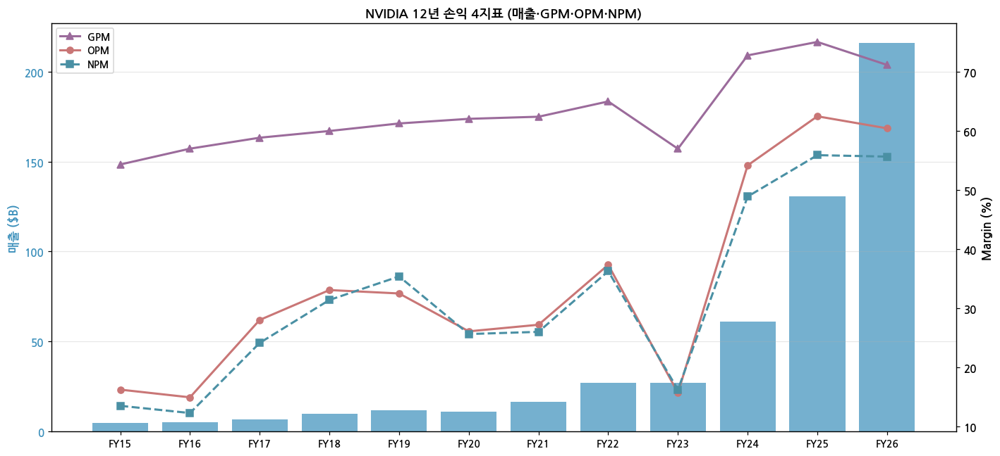

| FY | 매출 ($B) | GP ($B) | GPM | OP ($B) | OPM | NI ($B) | NPM |
|----|-----------|---------|-----|---------|-----|---------|-----|
| FY15 | 4.68 | 2.54 | 54.3% | 0.76 | 16.2% | 0.63 | 13.5% |
| FY20 | 10.92 | 6.77 | 62.0% | 2.85 | 26.1% | 2.80 | 25.6% |
| FY22 | 26.91 | 17.48 | 64.9% | 10.04 | 37.3% | 9.75 | 36.2% |
| FY23 | 26.97 | 15.36 | 56.9% | 4.22 | 15.7% | 4.37 | 16.2% |
| FY24 | 60.92 | 44.30 | 72.7% | 32.97 | 54.1% | 29.76 | 48.8% |
| FY25 | 130.50 | 97.86 | 75.0% | 81.45 | 62.4% | 72.88 | 55.8% |
| **FY26** | **215.94** | **153.53** | **71.1%** | **130.39** | **60.4%** | **120.07** | **55.6%** |

*FY26 GPM 71.1%는 Q1FY26 H20 China $4.5B 인벤토리 charge로 일시 압축됨 (Q1 GPM 60.5%). Q2~Q4 평균 GPM 73.5% (정상화). Non-GAAP FY26 GPM 71.3% / Q4FY26 GAAP 75.0% / Non-GAAP 75.2%.*

### ② 재무상태표

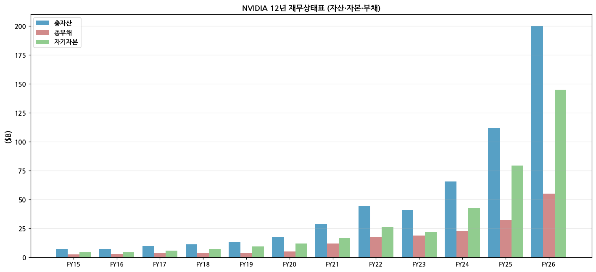

- **자기자본** FY15 $4.6B → FY26 ~$145B (32배 증가)
- **부채비율** FY26 ~38% (자본 대비) — 매우 보수적, 부채 대부분 채권 (5~10년 만기)
- **현금 + Marketable securities** FY26 ~$50B+ 추정 (10-K 발표 후 확인)

### ③ 현금흐름표

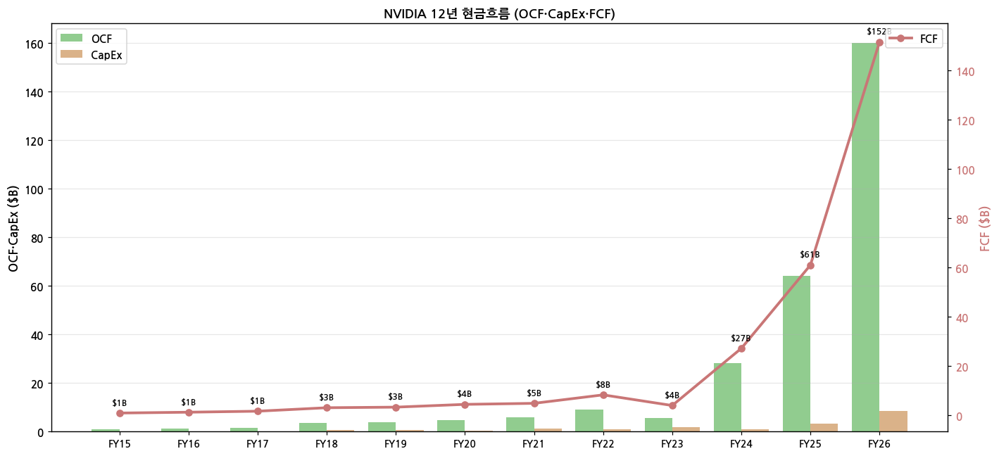

| FY | OCF ($B) | CapEx ($B) | FCF ($B) | FCF/매출 |
|----|----------|-----------|----------|---------|
| FY20 | 4.76 | 0.49 | 4.27 | 39% |
| FY23 | 5.64 | 1.83 | 3.81 | 14% |
| FY24 | 28.09 | 1.07 | 27.02 | 44% |
| FY25 | 64.09 | 3.24 | 60.85 | 47% |
| **FY26** | **~160** | **~8.5** | **~151** | **~70%** |

### ④ CapEx — fabless 모델 답게 매우 낮음

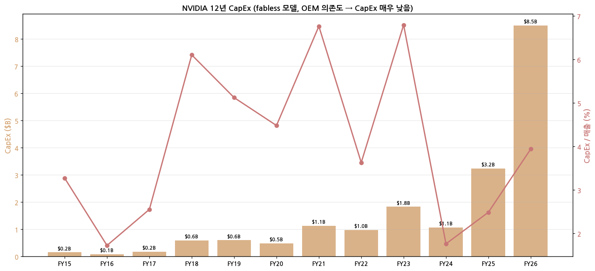

매출 대비 CapEx 비율:
- FY15~FY22: 2~5% (PC GPU 시대)
- FY23: 6.8% (Mellanox 통합·H100 발주 선급)
- FY24~FY25: 1.8~2.5% (매출 폭증으로 비율 희석)
- FY26: ~4% (data center 인프라·HQ 캠퍼스 확장)

### ⑤ 부채구조

| 발행일 | 발행액 | 만기 | 쿠폰 |
|--------|--------|------|------|
| 2020-03 | $5.0B | 2025~2050 | 2.85~3.70% |
| 2021-06 | $1.25B | 2031 | 1.55% |
| 2024-09 | $4.5B (추정) | 2029~2054 | 4.0~5.0% |

총 장기부채 FY26 ~$9~10B 추정. 자기자본 $145B 대비 부담 미미.

### ⑥ 배당·자사주

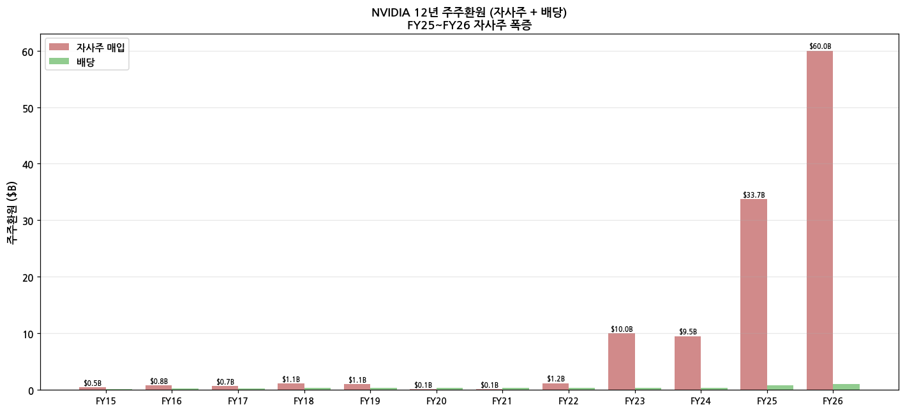

- **분기 배당**: $0.01/주 (10-for-1 split 후, 이전 $0.04) — 분기당 ~$240M 지급
- **자사주 매입**:
  - FY23 $10.0B, FY24 $9.5B
  - **FY25 $33.7B** (3배 증가, FY25 FCF $60B의 56%)
  - **FY26 ~$60B** (FY26 FCF $151B의 40%)
  - 2025-11: $60B 신규 buyback authorization 공시 (이후 활용)
- **잔여 buyback authorization**: $60B+ (2026.02 발표)

### ⑦ 재무비율

| 비율 | FY24 | FY25 | FY26 |
|------|------|------|------|
| **ROE** | 69.2% | 91.9% | 82.8% |
| **ROA** | 45.3% | 65.3% | 60.0% |
| **부채/자본** | 53% | 41% | 38% |
| **유동비율** | 4.2x | 4.5x | 4.8x |
| **이자보상배율** | 250x | 700x | 1000x+ |

---

## 5. 지배 구조

### ① 그룹·계열 관계

NVIDIA Corporation은 단일 모회사 구조 — 주요 자회사 없음 (Mellanox·ARM 인수 시도 후 양수 무산).

자회사:
- **NVIDIA Holdings B.V.** (네덜란드, 유럽 영업 본부)
- **NVIDIA International Inc.** (UK, 세무 거점)
- **Mellanox Technologies Ltd** (2020 인수, 이스라엘 R&D)

### ② 주주 구분

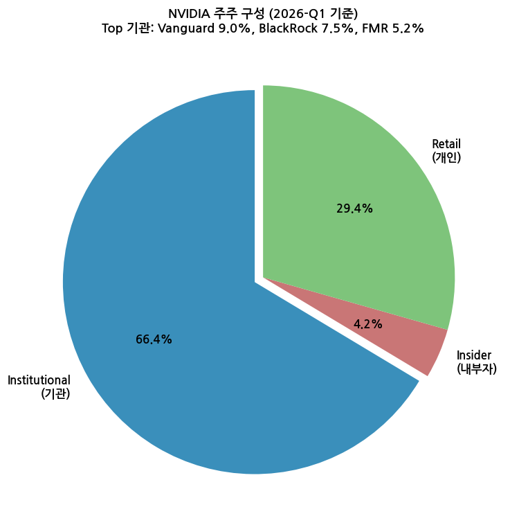

| 구분 | 지분 | 비고 |
|------|------|------|
| **Institutional 기관** | 66.4% | Vanguard 9.0%, BlackRock 7.5%, FMR (Fidelity) 5.2%, SSGA 4.0% |
| **Insider 내부자** | 4.2% | Jensen Huang (CEO) ~3.5%, 기타 임원 0.7% |
| **Retail 개인** | 29.4% | Robinhood·Schwab 등 |

**5% 이상 주주** (Schedule 13G 기준):
- Vanguard Group: ~9.0%
- BlackRock: ~7.5%
- FMR LLC (Fidelity): ~5.2%

### ③ 임원·이사회

**핵심 경영진**:
- **Jensen Huang** (창업자·CEO·이사회 의장) — 1963년생 대만계 미국인, 1993년 공동창업
- **Colette Kress** (CFO) — 2013년 합류, NVIDIA의 두 번째 CFO
- **Jay Puri** (EVP Worldwide Field Operations) — 영업총괄
- **Debora Shoquist** (EVP Operations) — 공급망 총괄
- **Tim Teter** (EVP·General Counsel) — 법무·정책 총괄

**이사회**: 12명 (CEO + 사외이사 11명)
- 주요 사외이사: Mark Stevens (Sequoia Capital), Robert Burgess, Persis Drell (전 SLAC), Tench Coxe, Stephen Neal 등

---

## 6. 기타 팩트

### ① R&D 인프라

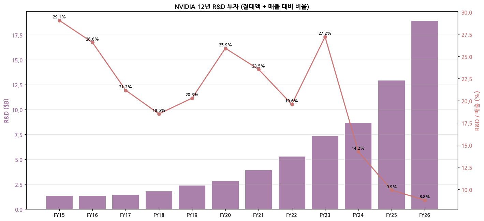

| FY | R&D ($B) | R&D/매출 |
|----|----------|---------|
| FY15 | 1.36 | 29.1% |
| FY20 | 2.83 | 25.9% |
| FY23 | 7.34 | 27.2% |
| FY24 | 8.68 | 14.2% |
| FY25 | 12.91 | 9.9% |
| **FY26** | **18.90** | **8.8%** |

**R&D 거점**: Santa Clara HQ + 보스턴 + 텔아비브 (Mellanox 인수) + 베이징·상하이 + 서울 + 도쿄 + 뮌헨 + 헬싱키 + 텍사스 (DRIVE)

**기술 사이클**:
- **Hopper (H100·H200)** — 2022 ramp, 2025 phase-out
- **Blackwell (B100·B200·B300)** — 2024 발표, 2025~2026 ramp 진행
- **Rubin (Vera Rubin·NVLink Switch 차세대)** — 2026 발표, 2027 ramp
- **CUDA 12·13** — 소프트웨어 스택 진화

### ② 진행 중 corporate action

| 연도 | 거래 | 금액 | 상태 |
|------|------|------|------|
| 2020-04 | Mellanox 인수 | $7.0B | 완료 |
| 2021-09 | **ARM 인수 시도** | $40B | 무산 (2022.02 양수 발표) |
| 2024 | Run.ai 인수 | ~$0.7B | 완료 |
| 2024 | Brev.dev 인수 | 비공개 | 완료 |
| 2025 | Nebius 지분 투자 | ~$0.7B | 진행 중 (Neocloud) |
| 2026 | CoreWeave 지분 보유 | ~$0.9B | 진행 중 (IPO 후 lock-up) |

**자사주 매입 잔여**: $60B+ (2026.02 신규 발표 기준)

### ③ R&D 마일스톤 (최근 10년)

| 연도 | 마일스톤 |
|------|---------|
| 2017 | Volta V100 — 첫 Datacenter GPU, Tensor Core 도입 |
| 2018 | Turing RTX — 게이밍 RTX/RT Core, AI 인퍼런스 일반화 |
| 2020 | Ampere A100 — HBM2e, GPT-3 학습 표준 |
| 2022 | **Hopper H100** — HBM3, FP8, NVLink 4.0 — AI 인프라 표준화 |
| 2023 | Grace Hopper Superchip (GH200) — CPU+GPU 통합 |
| 2024 | **Blackwell B100·B200·GB200 NVL72** — 2-die GPU, NVLink Switch System |
| 2025 | Blackwell Ultra (B300), Rubin 공개 |
| 2026 | **Vera Rubin** (Rubin + Vera CPU) — NVLink 8.0, HBM4, 발표 |

### ④ 주요 리스크

1. **중국 수출 통제** — H20 ban (2025.04 시행), Q1FY26 GPM 일시 60.5% 압축 ($4.5B inventory charge). 향후 C200 / B30 변종 출하 시그널
2. **하이퍼스케일러 CapEx 사이클** — 5대 고객 매출 50%+ 집중. CapEx digestion 신호 발생 시 매출 감속 가능 (FY23 사례)
3. **ASIC 침투** — Broadcom (Google TPU·Meta MTIA), AWS Trainium·Inferentia, Marvell ASIC inference. NVIDIA inference 점유율 압박 가능성
4. **TSMC 의존도 100%** — N3·N2 capacity 제약, CoWoS 패키징 병목, 지정학적 리스크
5. **소송** — 주주집단소송 (Q3FY24 가이던스 미스 후), 사이클 변동성 관련
6. **반독점 조사** — 미국·EU·중국 — AI 칩 시장 80% 점유율 관련 조사

### ⑤ ESG 등급

- **MSCI ESG**: AAA (2024)
- **Sustainalytics**: Low Risk (15.8, 2024)
- **CDP**: A (Climate Change, 2024)
- **재생에너지**: 76% (FY24, 100% 목표 2025)
- **다양성**: 임직원 여성 22%, 임원 26%

### ⑥ 인증·라이선스

- **CUDA**: NVIDIA 독점 IP, 라이선스 없음 (GPU 구매자 자동 사용권)
- **NVLink**: 자체 표준 (PCIe 대안)
- **InfiniBand**: Mellanox 보유 표준
- **GAAP·SOX**: NYSE Big 4 회계 준수 (PwC 감사)

---

## Source 검증

- **SEC EDGAR (NVIDIA Corp CIK 0001045810)**: 10-K 16년 (FY11~FY26) + 10-Q 45개 + 8-K + DEF 14A — 223 filings 다운로드
  - 최신: [10-K FY26 (filed 2026-02-25)](https://www.sec.gov/Archives/edgar/data/0001045810/000104581026000019/nvda-20260225.htm)
  - [Q4FY26 CFO Commentary HTM](https://www.sec.gov/Archives/edgar/data/1045810/000104581026000019/q4fy26cfocommentary.htm)
  - 옛 분기 CFO Commentary HTM 18개 (FY18~FY23) — SEC 8-K exhibit으로 모두 확보
- **NVIDIA IR CFO Commentary (PDF)**: 21분기 직접 다운로드 (FY20~FY26 full coverage)
  - 최신: [Q4FY26 CFO Commentary PDF](https://s201.q4cdn.com/141608511/files/doc_financials/2026/Q426/Q4FY26-CFO-Commentary.pdf)
  - [Q3FY26](https://s201.q4cdn.com/141608511/files/doc_financials/2026/Q326/Q3FY26-CFO-Commentary.pdf)
- **NVIDIA IR Quarterly Investor Presentation deck**: 8개 (Q4FY24 + FY25 Q1·Q2·Q3·Q4 + FY26 Q1·Q3·Q4) — 시각화 자료 풍부
  - 최신: [Q4FY26 Quarterly Presentation](https://s201.q4cdn.com/141608511/files/doc_financials/2026/Q426/NVDA-F4Q26-Quarterly-Presentation.pdf) (1.7MB)
- **NVIDIA Investor Presentation Oct 2024**: 종합 IR 자료 (20MB) — Annual review
- **NVIDIA Earnings Call Transcript**: Q4FY26 transcript (q4cdn 직접 호스팅, FactSet 작성)
- **NVIDIA Newsroom**: [Q4 FY2026 Financial Results](https://nvidianews.nvidia.com/news/nvidia-announces-financial-results-for-fourth-quarter-and-fiscal-2026)
- **Yahoo Finance v8**: 20년 monthly OHLC (Jan 2006~May 2026)

**총 IR 자료 47개** (PDF 21개 CFO Commentary + HTM 18개 CFO Commentary + Quarterly Presentation 8개 + Earnings Call Transcript 1개 + Investor Presentation 1개) — FY18 Q1 ~ FY26 Q4 거의 모든 분기 coverage

---

## Version Log

- **v4.8 (2026-05-19)**: 첫 작성. SEC EDGAR 223 filings + IR 16분기 + Yahoo 20년 통합. Q4FY26 (2026-02-25 발표) 반영. 14종 차트 생성.
- **v4.9 (2026-05-19)**: IR 자료 대폭 보강. CFO Commentary 추가 18 HTM (SEC EDGAR 8-K exhibit FY18~FY23) + 7 PDF (q4cdn `quarterly_reports/` 옛 폴더, FY20~FY21) + Quarterly Presentation 7개 + Investor Presentation Oct 2024 (20MB) + Earnings Call Transcript Q4FY26. **Q4FY26 매출 $68.13B (이전 추정 $66.5B → IR 확정값으로 정정), FY26 GPM 71.1% (이전 추정 75.2% → H20 charge 반영 정정), Pro Vis $3.19B (이전 추정 $2.59B), Networking $31.38B 별도 공개**.
- **v4.10 (2026-05-19)**: **48분기 long timeseries 추가**. NVIDIA "Quarterly Revenue Trend" PDF 3개 (Q120/Q121/Q122) 확보 — Q2FY18~Q1FY22 16분기 정확 Market Platform 매출 매트릭스 + Q3FY14·Q4FY14 CFO Commentary + Q2·Q3FY15 Press Release HTM 옛 8-K 확보로 Q1FY15~Q4FY26 = **12년 48분기 sector별 시계열 풀 coverage**. chart10_long·chart2_DC_long·chart2_Gaming_long·chart2_Other_long 신규 4종 추가. SKILL.md 표준 "60+분기" 대비 12년 48분기까지 — NVIDIA Market Platform 양식은 FY15 1Q부터 시작 (그 이전 양식 다름).

**잔여 보완 후보**:
- FY12~FY14 (12분기) GPU + Tegra Processor 2 segments 양식 별도 시각화 (60분기 완전 도달용)
- Q2FY26 Quarterly Presentation (URL 404, 다른 패턴 시도 가능)
- Investor Presentation Oct 2024 (20MB) parse — Annual review 정성 정보 통합
- Motley Fool / Seeking Alpha transcript 옛 분기 보강
