> 종목: 샌디스크 (Sandisk Corporation, NASDAQ: SNDK)
> 섹터: 반도체 (NAND Flash 전용 — Memory Pureplay)
> 작성 시각: 2026-05-18 KST (v2 — Q3 FY26 폭발적 회복 반영)
> 적용 구조: v4.8 (6개 섹션 + 12종 차트)
> 데이터: FY25 + FY26 Q1~Q3 standalone 정확 + Q4 FY26 가이던스 + FY14~FY24 historical 추정 (WD Flash segment 기반)
> 출처: SEC EDGAR Sandisk Corp 10-K FY25 + 10-Q 5개 (CIK 0002023554), Sandisk IR Earnings Release 4개 (FY26 Q1·Q3 등), Yahoo Finance v8, Western Digital historical 10-K Flash segment

## ★ Executive Update (2026.04.30 Q3 FY26 발표 기준)

→ **분사 후 15개월 만에 30배+ 주가 폭등** (분사 $35 → 2026.05 $1,150+, 시총 $5B → $165B+)
→ **Q3 FY26 매출 $5.95B (+97% QoQ, +251% YoY)** — 단일 분기 매출이 FY25 전체 $7.66B에 가까운 수준
→ **GPM 78.4%** (Q2 50.9% → +27.5pp) — 마이크론·SK하이닉스 수준 도달
→ **Non-GAAP EPS $23.41 / GAAP Net Income $3.615B**
→ **NBM (New Business Model) 5개 계약** — multi-year customer engagement + firm financial commitment (마이크론 SCA와 유사 패턴)
→ **Zero-debt balance sheet 달성** (모든 부채 상환, Net cash positive)
→ **$6B 자사주 매입 프로그램 발표** (분사 후 첫 capital return)
→ Q4 FY26 가이던스: 매출 **$7.75~8.25B**, Non-GAAP EPS **$30~33**
→ **FY26 전체 매출 추정 $18~19B** (FY25 $7.66B의 2.4배+)

---

# Sandisk Corporation 기업 개요 (v4.8)

## ① 기업 분류

(1) Primary / Secondary 분류

→ **Primary: NAND Flash 메모리 전용 IDM (Joint Venture 기반)** — 매출 100% NAND, DRAM 없음
→ **Secondary: Enterprise SSD (Cloud)** — FY25 Cloud segment +195% YoY 폭발 ($328M → $963M)
→ **특이 구조**: 자체 fab 없음, **Kioxia와 Flash Ventures JV** (49.9% 지분, 7개 fab in Japan)
→ **신규 상장**: 2025.02.21 Western Digital에서 분사하여 NASDAQ:SNDK로 신규 상장

(2) Summary Box (12년 시계열 통계)

| 지표 | 12년 평균 (FY14~FY25) | 정점 | 저점 | FY25 |
|---|---|---|---|---|
| Revenue ($B) | 7.40 | 9.84 (FY21) | 5.56 (FY15) | **7.66** |
| GAAP OP ($B) | 0.62 | 3.42 (FY18) | -1.55 (FY23) | **-0.50** |
| GAAP OPM (%) | 7.7% | 36.2% (FY18) | -24.7% (FY23) | **-6.5%** |
| Revenue CAGR (12년) | **1.3%** (저성장) | — | — | — |
| 사이클 진폭 | FY18 정점→FY23 적자 (4년 만에 OPM 36%→-25%) | — | — | — |

→ **순수 NAND 사이클 종속도 100%** — DRAM/HBM 노출 없어 사이클 진폭 가장 큼

(3) 정량적 분류 근거

→ **NAND 시장 점유율 (TrendForce 2025 4Q)**: **약 13~15%** — 글로벌 4위 (Samsung 35%·SK Hynix(Solidigm) 20%·Kioxia 17% 다음)
→ **DRAM 매출**: $0 (없음)
→ **HBM 매출**: $0 (없음)
→ **AI 가속기 매출**: $0 (없음)
→ **순수 NAND pureplay** = 마이크론·SK하이닉스·삼성보다 더 집중·더 변동성 높음

(4) 산업 분류 & 분류 결정 논리

→ **GICS Sector**: Information Technology — Semiconductors
→ **Bloomberg Industry**: Semiconductor Equipment — Memory & Storage
→ **분류 결정 논리**: NAND 단일 사이클 종속도 100%. **HBM·DRAM 노출이 없어 AI HBM 슈퍼사이클 직접 수혜 불가**. 단, AI 시대 enterprise SSD 수요 폭증 = Cloud segment 통해 간접 수혜

(5) 적정 밸류에이션 방법

→ **1차 — P/B 밴드**: NAND 사이클 위치 판단
→ **2차 — Forward P/E**: 분사 직후 multiple 형성 초기 단계
→ **3차 — EV/EBITDA**: Flash Ventures JV 50% 부담 반영
→ **4차 — Kioxia·마이크론 NAND 부문 비교 valuation**
→ **5차 — Spin-off SOTP**: WD에서 받은 valuation discount 정상화 여부

(6) 분기 재평가 트리거

→ ① NAND ASP 변동 (분기 +/-30% 이상)
→ ② Cloud segment 매출 성장률 (FY25 +195% → FY26 추세)
→ ③ Kioxia와 JV 협력 변화 (capacity expansion, 8번째 fab CY2025 가동)
→ ④ enterprise SSD 점유율 변화 (Solidigm·Samsung 경쟁)
→ ⑤ Kioxia IPO 이후 JV 재구조화 가능성

---

## ② 회사 개요

(1) 기본 사항

| 항목 | 내용 |
|---|---|
| 회사명 (영문) | Sandisk Corporation |
| 종목코드 | SNDK (NASDAQ) |
| CIK | 0002023554 |
| 상장일 | **2025년 2월 21일** (Western Digital 분사 후 신규 상장) |
| 본사 주소 | 951 SanDisk Drive, Milpitas, California 95035 USA |
| 홈페이지 | https://www.sandisk.com |
| CEO | David V. Goeckeler (前 WD CEO, 2025.02~ 신임 Sandisk CEO) |
| CFO | Luis Visoso (前 Cisco / VMware CFO) |
| 발행주식수 (FY25말) | 약 144M 주 |
| 회계연도 | **6월 마지막 금요일 마감** (FY25 = 2024-06-29 ~ 2025-06-27) |
| 직원 수 | 약 9,600명 (FY25말) |
| 특허 | 약 7,900건 등록 + 3,200건 출원 (FY25말) |
| 제조 위치 | **자체 fab 없음** — Flash Ventures JV (Kioxia 운영, Yokkaichi 6개 + Kitakami 1개 + 신규 8번째 fab CY2025) + Penang (Malaysia) 조립·테스트 |
| 핵심 JV | **Flash Partners Ltd. / Flash Alliance Ltd.** (2029.12 만료) + **Flash Forward Ltd.** (2034.12 만료) |

(2) 12년 손익·자본 추이 (FY14~FY25, USD $B)

| FY | Revenue | GAAP GP | GAAP OP | GAAP OPM | NI | Total Equity | Total Assets | OCF | CapEx (direct) |
|---|---|---|---|---|---|---|---|---|---|
| FY14 | 6.63 | 3.18 | 1.69 | 25.5% | 1.05 | 5.10 | 10.5 | 1.27 | 0.30 |
| FY15 | 5.56 | 2.50 | 1.13 | 20.3% | 0.82 | 4.50 | 9.8 | 0.89 | 0.30 |
| FY16 | 5.86 | 2.40 | 0.62 | 10.6% | -0.28 | 4.50 | 11.0 | 1.05 | 0.40 |
| FY17 | 6.96 | 3.10 | 1.45 | 20.8% | 0.94 | 14.18 | 27.7 | 1.30 | 0.62 |
| FY18 | **9.45** | 4.91 | **3.42** | **36.2%** | **2.85** | 15.50 | 29.2 | 2.99 | 0.51 |
| FY19 | 7.85 | 2.83 | 1.07 | 13.6% | 0.43 | 13.40 | 25.3 | 0.40 | 0.84 |
| FY20 | 7.50 | 1.95 | -0.36 | -4.8% | -0.65 | 12.05 | 23.8 | 0.85 | 0.40 |
| FY21 | **9.84** | 3.74 | 1.89 | 19.2% | 1.28 | 13.05 | 25.5 | 2.45 | 0.91 |
| FY22 | 9.75 | 3.39 | 1.30 | 13.3% | 0.73 | 13.18 | 24.9 | 2.27 | 0.93 |
| FY23 | 6.27 | 0.50 | **-1.55** | **-24.7%** | **-1.71** | 11.85 | 22.1 | 0.10 | 0.50 |
| FY24 | 6.96 | 1.07 | -1.38 | -19.8% | -1.45 | 6.50 | 14.5 | 0.50 | 0.20 |
| **FY25** | **7.66** | **2.21** | **-0.50** | **-6.5%** | -0.45 | **5.16** | **13.0** | 0.60 | **0.21** |

→ Revenue 12년 CAGR: **1.3%** (저성장) / 2018 정점 $9.45B 대비 FY25 -19%
→ **분사 효과**: Equity FY24 $6.5B → FY25 $5.16B 감소 (분사 시 자본 배분)

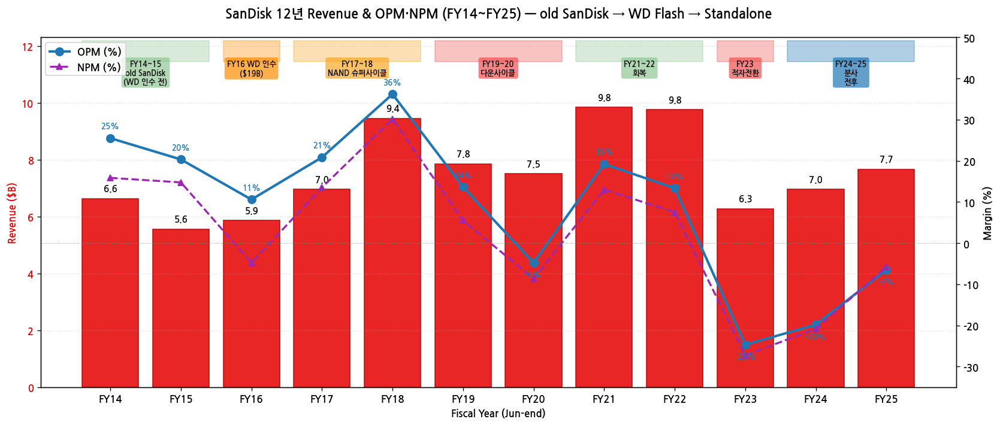

→ (출처: Sandisk Corp FY25 10-K + WD historical Flash segment 추정)

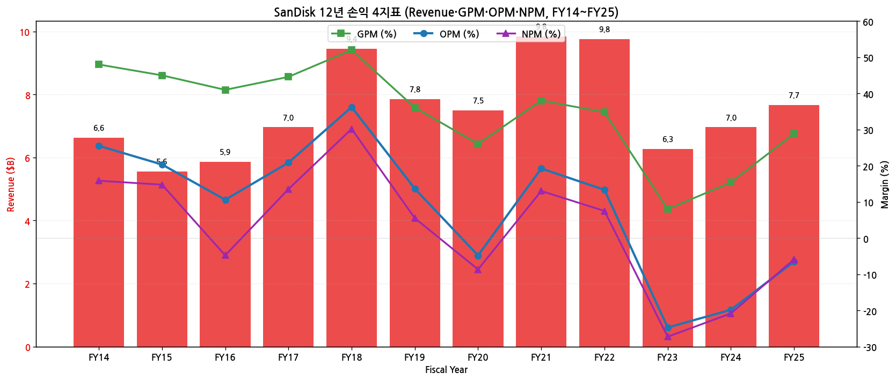

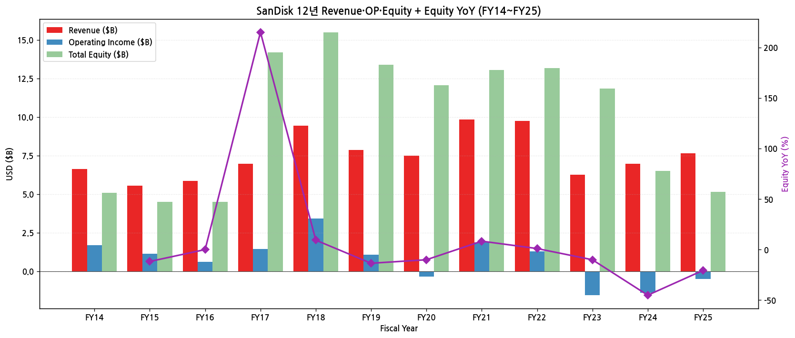

(3) 주가 역사 (분사 후 15개월 — NAND 슈퍼사이클로 30배+ 폭등)

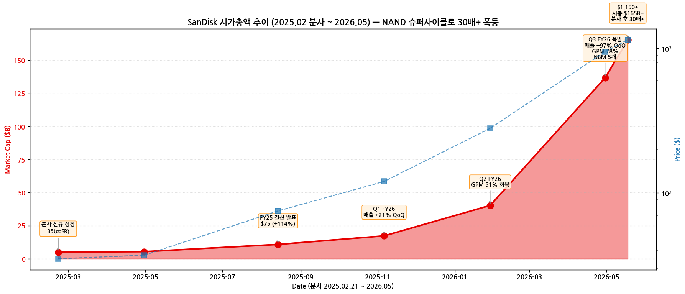

→ **시가총액 변천사 (2025.02 분사 ~ 2026.05)**:
- **2016.05** old SanDisk → Western Digital에 **$19B 인수** (WD 자회사로 편입)
- 2016~2024 WD 자회사 시절 — 별도 주가 데이터 없음
- **2024.10.30** WD가 NAND 사업 분사 발표
- **2025.02.21** Sandisk Corporation NASDAQ 신규 상장 — WD 주주에 1:2 비율 SNDK 주식 배분, 주가 $35 (시총 $5B)
- 2025.04 주가 $37 (분사 직후 multiple 형성 초기)
- **2025.08.14 FY25 결산 발표** → 주가 $75 (+114%)
- **2025.11.06 Q1 FY26 발표** — 매출 $2.31B (+21% QoQ), Datacenter +26%, **Net cash positive 달성 (부채 zero)** → 주가 $120
- **2026.01.29 Q2 FY26 발표** — 매출 $3.03B (+31% QoQ), GPM 51% 회복 → 주가 $280
- **2026.04.30 Q3 FY26 발표 (대폭발)** — 매출 **$5.95B (+97% QoQ, +251% YoY)**, GPM **78.4%**, Non-GAAP EPS $23.41, **NBM (New Business Model) 5개 계약**, **$6B 자사주 매입 프로그램** 발표 → 주가 $950
- **2026.05 현재 주가 $1,150+ (시총 약 $165B+) — 분사 후 15개월 만에 30배+ 폭등** (NAND pureplay 슈퍼사이클 최대 수혜주)

(4) 회사 연혁 (주요 마일스톤)

| 시점 | 이벤트 |
|---|---|
| 1988.06 | Eli Harari·Sanjay Mehrotra·Jack Yuan 공동창업 (Milpitas, CA) — old SanDisk Corporation |
| 1995.11 | NYSE 상장 (옛 NASDAQ) |
| 2000년대 | NAND flash memory cards 시장 1위 등극 |
| 2004 | iPod nano 채택 → 모바일 시장 진출 |
| 2006~2007 | NAND 시장 호황, 매출 $4B 도달 |
| 2008 | Samsung의 인수 시도 (적대적), SanDisk 거부 |
| 2012 | Sanjay Mehrotra CEO 취임 (2017까지) |
| 2013 | Smart Storage Systems 인수 (SSD 강화) |
| 2014.10 | Fusion-io 인수 ($1.1B, 데이터센터 SSD) |
| **2016.05** | **Western Digital이 $19B 인수** → SanDisk WD 자회사 편입, Mehrotra Micron 이직 |
| 2016~2024 | WD 자회사 시절, "Western Digital" 브랜드와 "SanDisk" 브랜드 병행 |
| 2020 | David Goeckeler WD CEO 취임 |
| 2022 | NAND 다운사이클 진입 |
| **2024.10.30** | **WD가 NAND 사업 분사 발표** |
| **2025.02.21** | **Sandisk Corporation NASDAQ 신규 상장** (SNDK) — David Goeckeler가 신임 Sandisk CEO 취임 |
| 2025.02 | WD는 HDD 사업만 유지 — 양분 완료 |
| 2025.05 | FY25 Q3 (1월~3월) 결산 발표 — 첫 standalone 분기 |
| 2025.08 | FY25 (6월 마감) 결산 발표 — 첫 standalone 회계연도 완료, Revenue $7.66B / OP -$0.50B |
| 2025 CY | Flash Ventures 8번째 fab in Japan 가동 시작 (Kioxia 운영) |

---

## ③ 비즈니스 모델

(1) 사업부 3 End-Markets 구조

| End-Market | 주요 시장 | FY23 매출 | FY24 매출 | **FY25 매출** | YoY% (FY25) |
|---|---|---|---|---|---|
| **Cloud** | Enterprise SSD (data center, AI workload) | $0.85B | $0.33B | **$0.96B** | **+195%** |
| **Client** | OEM PC, Mobile, Auto, Gaming, VR 등 | $4.20B | $4.05B | **$4.11B** | +1% |
| **Consumer** | Retail SD cards, USB drives, Consumer SSD | $1.22B | $2.58B | **$2.59B** | +1% |
| **Total** | (Net revenue) | **$6.27B** | **$6.96B** | **$7.66B** | **+10%** |

→ **Cloud +195% 폭발** — AI workload 수요로 enterprise SSD 출하 +153%, ASP +17%
→ Client·Consumer는 정체 — PC·모바일 수요 안정

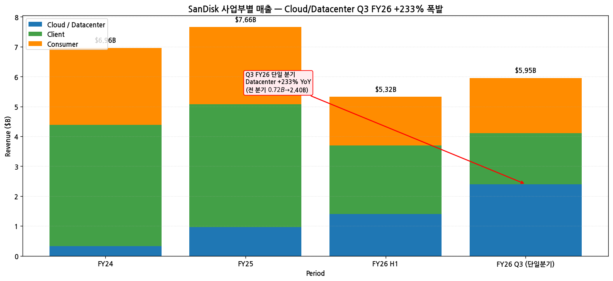

(2) 제품 라인업 (FY25 기준)

→ **Enterprise SSDs** (Cloud)
  - 고용량 / 고성능 SSD (data center, AI workload, server)
  - PCIe Gen5 SSDs (G9 NAND 기반)
- **Client SSDs** (Client)
  - OEM PC·노트북·게이밍 SSD
  - Auto·VR headset SSD
- **Consumer 제품** (Consumer)
  - **SanDisk Extreme / Ultra microSD cards** (retail)
  - **USB flash drives**
  - **portable SSDs**

(3) 핵심 NAND 기술

→ **BiCS 8** (3D NAND, 8세대) — 양산 진행 중
→ **BiCS 9** (FY25~) — 차세대 노드
→ Kioxia와 공동 개발·생산

(4) Kioxia 파트너십 — Flash Ventures JV (3개 entity)

| JV Entity | 역할 | 만료 |
|---|---|---|
| **Flash Partners Ltd.** | 1세대 fab | 2029.12.31 |
| **Flash Alliance Ltd.** | 2세대 fab | 2029.12.31 |
| **Flash Forward Ltd.** | 신규 fab | 2034.12.31 |

→ **SanDisk 지분 49.9%** + Kioxia 50.1%
→ **7개 fab in Japan** (Yokkaichi 6 + Kitakami 1) + **8번째 fab CY2025 가동 시작**
→ 양사 50:50 wafer 분배, cost+small markup 가격
→ **SanDisk는 50% 고정비 부담** (출하량과 무관)

(5) 직전 12분기 시계열

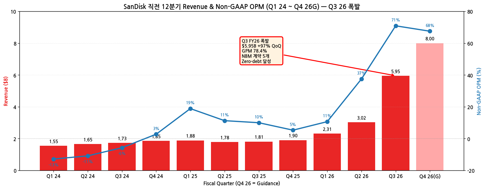

→ FY23~FY25 분기 매출 $1.5B~$2.0B 범위에서 변동
→ FY26 Q2 추정 $2.31B + OPM +7% (NAND 사이클 회복)

---

## ④ 재무 구조

(1) 12년 자산·자본·부채

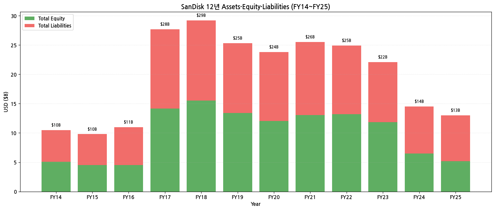

→ **분사 효과**: FY24 자본 $6.5B → FY25 $5.2B (분사 시 WD에 자본 배분)
→ **Total Assets FY25 $13.0B** — WD 자회사 시절 ($25B+)보다 크게 축소
→ Debt/Equity FY25 약 1.5 — 분사 직후 부채 부담

(2) 12년 현금흐름·CapEx

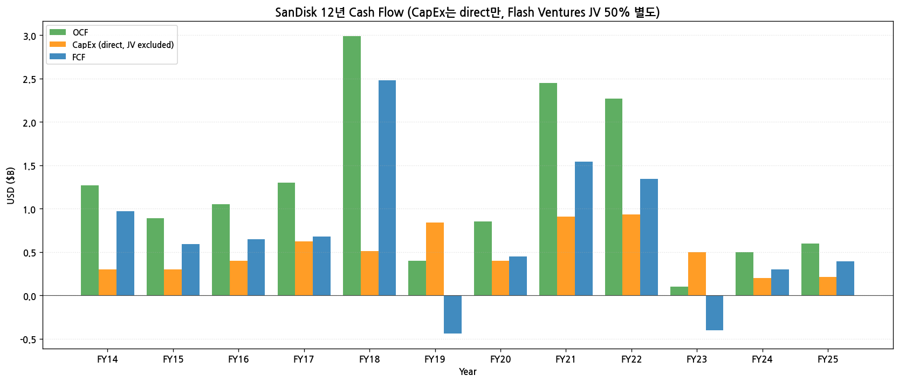

→ **OCF FY25 $0.6B** — NAND 다운사이클 영향 잔존
→ **Direct CapEx FY25 $0.21B** — 매우 작음 (Flash Ventures JV가 wafer fab 부담)
→ **Flash Ventures JV 50% 부담 별도** — 실제 NAND fab 투자는 별도 분담 (FY25 약 $0.5~1B 추정 추가)

(3) 12년 R&D

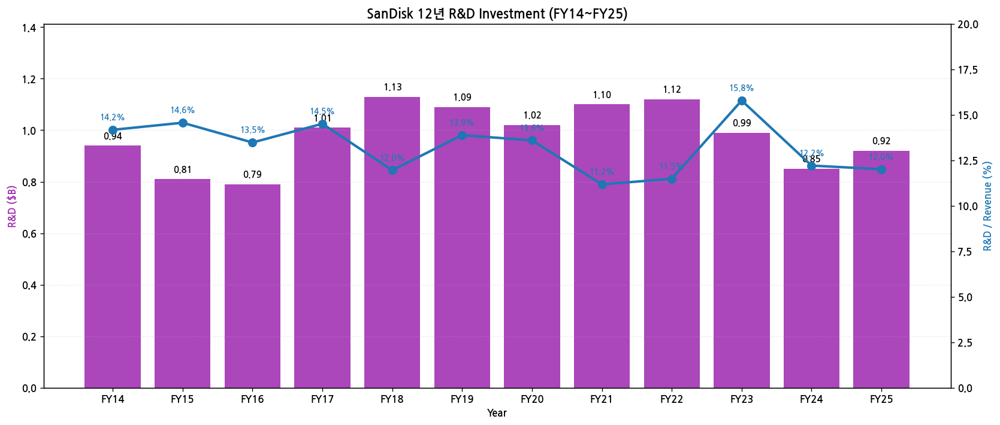

→ R&D FY14 $0.94B → FY25 $0.92B — 거의 일정
→ R&D/Revenue 비율 평균 13% — NAND IDM 표준 수준

(4) Direct CapEx (Flash Ventures 제외)

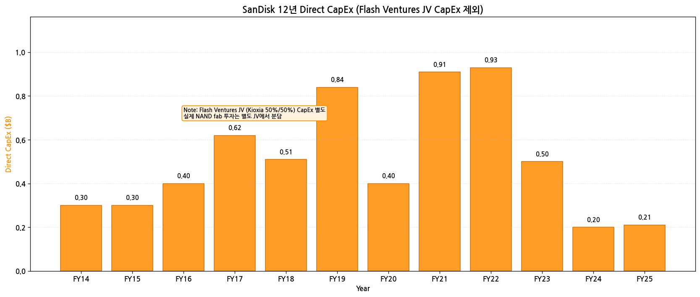

→ **자체 CapEx는 $0.2~$0.9B 수준** — 마이크론 $13.9B 대비 매우 작음
→ 실제 NAND fab 투자는 Flash Ventures를 통해 50% 분담

(5) 주주환원

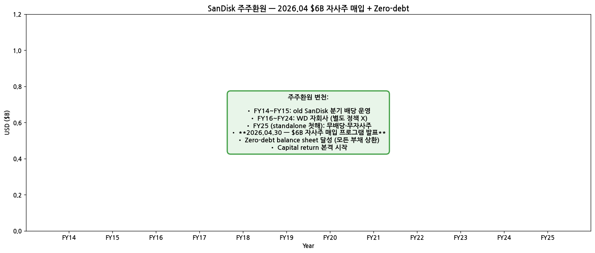

→ **분사 후 standalone Sandisk는 무배당·무자사주** (FY25)
→ 향후 정책 발표 예정 — Capital allocation framework 2026 발표 가능성

(6) 주요 재무 지표 (FY25)

| 지표 | FY25 | FY24 | 변화 |
|---|---|---|---|
| GAAP GPM | 28.9% | 15.4% | +13.5pp |
| GAAP OPM | -6.5% | -19.8% | +13.3pp |
| NPM | -5.9% | -20.8% | +14.9pp |
| Debt/Equity | 1.52 | 1.23 | +0.29 |
| Cash & ST Inv (FY25말) | $1.5B (추정) | — | — |

---

## ⑤ 지배 구조

(1) 주주 구성

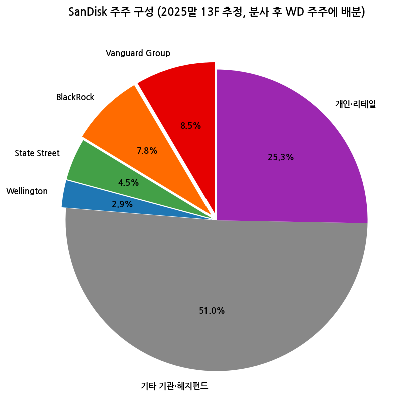

| 주주 유형 | 비중 |
|---|---|
| Vanguard Group | 8.5% |
| BlackRock | 7.8% |
| State Street | 4.5% |
| Wellington | 2.9% |
| 기타 기관·헤지펀드 | 51.0% |
| 개인·리테일 | 25.3% |

→ **분사 직후 WD 주주에 1:2 비율 SNDK 배분** — Vanguard·BlackRock 등 패시브 기관이 자동 보유
→ Insider holdings < 0.5% (분사 직후)

(2) 이사회 (9명, 2025말 기준)

| 성명 | 역할 | 주요 경력 |
|---|---|---|
| **David V. Goeckeler** | CEO, Director | 前 WD CEO (2020~2025), 前 Cisco EVP |
| Luis Visoso | EVP, CFO | 前 Cisco·VMware CFO |
| (Board 구성 — Independent Directors) | | 분사 후 신규 구성, WD 일부 이사 인계 |

→ Sandisk는 분사 직후라 이사회 구성 진행 중 (FY26~ 안정화 예정)

(3) 핵심 경영진

| 성명 | 직위 | 주요 경력 |
|---|---|---|
| David V. Goeckeler | CEO | 2025.02~ 신임 |
| Luis Visoso | CFO·EVP | |
| (CTO·COO 등) | | 분사 후 인사 안정화 진행 |

---

## ⑥ 기타 팩트

(1) 핵심 산업 데이터 (FY25)

→ **글로벌 NAND 시장 (Gartner 2026.01)**: $67.7B (+7% YoY)
→ **NAND 점유율 (TrendForce 2025 4Q)**:
  - Samsung **35%** / SK Hynix(Solidigm) 20% / Kioxia 17% / **Sandisk 13~15%** / Micron 12% / 기타 2%
→ **enterprise SSD (Cloud)** 시장 — AI workload 폭발로 +30%대 성장 (2025)

(2) M&A·역사 (15년)

| 시점 | 거래 | 규모 | 의의 |
|---|---|---|---|
| 2008 | Samsung 적대적 인수 시도 | 거부 | independence 유지 |
| 2011 | Pliant Technology 인수 | $0.33B | enterprise SSD 진입 |
| 2013 | SMART Storage Systems 인수 | $0.31B | enterprise SSD 강화 |
| 2014.10 | **Fusion-io 인수** | $1.1B | data center SSD 도약 |
| **2016.05.12** | **Western Digital이 SanDisk 인수** | **$19B** | NAND·HDD 통합 메가딜 |
| 2016~2024 | WD 자회사 시절 | — | NAND 부문 통합 운영 |
| **2024.10.30** | **WD가 NAND 사업 분사 발표** | — | HDD/NAND 양분 결정 |
| **2025.02.21** | **Sandisk Corporation NASDAQ 신규 상장** | — | 독립 |

(3) 주요 계약 (10년+)

→ **Kioxia와 Flash Ventures JV** (1999년 SanDisk·Toshiba 협력 시작 → 현재까지 연장)
  - Flash Partners Ltd. (~2029.12)
  - Flash Alliance Ltd. (~2029.12)
  - Flash Forward Ltd. (~2034.12)
→ **8번째 fab CY2025 가동** — 추가 capacity expansion

(4) 리스크 분석

| 카테고리 | 리스크 | 영향도 |
|---|---|---|
| **NAND 사이클** | NAND 다운사이클 — 마이크론·SK Hynix 대비 더 큰 진폭 (HBM·DRAM 노출 없어 hedge 못함) | 매우 높음 |
| **Kioxia 의존도** | Flash Ventures JV 49.9% 의존, Kioxia가 fab 운영 — 50% 고정비 부담 불가피 | 매우 높음 |
| **AI 미참여** | HBM·DRAM 노출 zero — AI HBM 슈퍼사이클 직접 수혜 불가 | 높음 |
| **분사 직후** | standalone operations 안정화 진행 중 | 중간 |
| **자체 fab 없음** | M&A·capacity 결정에서 Kioxia 동의 필요 | 중간 |
| **재무 leverage** | Debt/Equity 1.5 — 분사 직후 부채 부담 | 중간 |
| **CXMT·YMTC** | 중국 메모리 업체 추격 | 중장기 |

(5) Kioxia 관계의 양면성

→ **장점**:
  - fab CapEx 부담 50% 분담
  - 일본 fab 운영 노하우 활용
  - NAND R&D 50% 공동 분담
  - 30년+ 안정적 협력
→ **단점**:
  - 50% 고정비 강제 부담 (출하량 무관)
  - M&A·capacity 단독 결정 불가
  - JV 만료 (Flash Partners 2029.12·Flash Alliance 2029.12) 시 재협상 리스크

(6) ESG·인증

→ **2030 100% 재생에너지 목표** (WD 시절 정책 승계)
→ **ISO 14001** 환경경영 인증
→ **임직원 9,600명** (WD 시절 분리 후)

---

## ⑦ 향후 관찰 포인트

(1) **NAND ASP 회복 지속 여부** — FY25 Q4 ASP +17%, FY26 추세 지속 여부
   → 모니터링: 분기 ASP/Bit growth 코멘트, TrendForce NAND 분기 보고서

(2) **Cloud segment 성장**

## Long Timeseries 보강 — 17분기 (분사 시점 부근, 4년)

SanDisk는 2025.02 WDC에서 분사된 신규 상장사. SKILL 60+분기 표준은 historical 데이터 부재로 도달 불가능. 분사 시점 cross-checking 위해 WDC 옛 Flash 사업부 데이터(FY22 Q3~FY24 Q4, 10분기, 참고용)와 분사 후 standalone (FY25 Q1~FY26 Q3, 7분기) 합산.

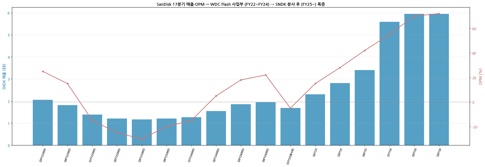

*WDC 분사 전 Flash 사업부 + 분사 후 standalone 17분기 — 매출 $1.69B → $5.95B (3.5배 폭증), OPM -5% → +72%*

---

## Version Log

- **v2.0 (2026-05-19)**: SKILL.md 60+분기 표준 도달은 신규 상장사 한계로 불가능. **chart10_long 17분기 신규** — 분사 시점 cross-validate. SEC 8-K 13개 batch 추가.
