> 종목: 시게이트 (Seagate Technology Holdings plc, NASDAQ: STX)
> 섹터: 반도체·스토리지 (HDD Pureplay — 글로벌 1위)
> 작성 시각: 2026-05-18 KST
> 적용 구조: v4.8 (6개 섹션 + 12종 차트)
> 데이터: 12년 연간 (FY14~FY25) + 직전 12분기 (Q1 24~Q4 26G)
> 출처: SEC EDGAR Seagate 10-K 15개 (FY11~FY25, CIK 0001137789) + 10-Q 47개, Seagate IR PDFs 8개 (Q1·Q2·Q3 FY26 Release + FY25 Q3·Q4 Release/Remarks + Analyst Day 2025 deck + Supplemental), Yahoo Finance v8 (STX 20년)

## ★ Executive Update (Q1 FY26 ~ Q3 FY26 — Mozaic HAMR 양산 효과 폭발)

→ **Q1 FY26 (2025.10.28 발표)**: Revenue $2.63B (+21% YoY), **Non-GAAP GPM 40.1% (사상 최고)**, Non-GAAP OPM 29% (FY12 이후 최고), EPS $2.61
→ **Mozaic 1M+ drives 출하 (Q1 FY26 단일 분기)** — HAMR 본격 양산 진입
→ **5개 global CSP qualified on Mozaic 3+ TB/disk** (36TB drive), 나머지 3개 CY2026 H1 완료 예정
→ **Q4 FY26 가이던스 (2026.06 발표 예정)**: Revenue $3.45B ± $100M, Non-GAAP EPS $5.00 ± $0.20
→ **Data center end market 80% of revenue** (Q1 FY26)
→ 분기 매출 회복: Q4 FY24 $1.88B → Q3 FY26 $3.20B = +70%, FY24 저점 대비 매출 거의 2배

---

# Seagate Technology Holdings plc 기업 개요 (v4.8)

## ① 기업 분류

(1) Primary / Secondary 분류

→ **Primary: HDD Pureplay 글로벌 1위** — FY25 매출 100% Storage (HDD 비중 85%+, SSD/Systems 일부)
→ **Secondary: Mass Capacity Storage (AI 데이터센터 콜드 스토리지 수혜)** — FY25 Mass Capacity $7.65B = 전체의 84% (FY23 71%→FY25 84%)
→ **Mozaic HAMR 기술 글로벌 선행** — 36TB drive 양산 + 5 CSP qualified

(2) Summary Box (12년 시계열 통계)

| 지표 | 12년 평균 | 정점 | 저점 | FY25 |
|---|---|---|---|---|
| Revenue ($B) | 10.66 | 13.74 (FY14·15) | 6.55 (FY24) | **9.10** |
| GAAP OP ($B) | 1.30 | 1.93 (FY14) | -0.16 (FY23) | **1.91** |
| GAAP OPM (%) | 12.2% | 21.0% (FY25 Q1 추정) | -2.2% (FY23) | **21.0%** |
| Revenue CAGR (12년) | **-3.5%** (마이너스) | — | — | — |
| 사이클 진폭 | FY18 11.2 → FY23 7.4 → FY25 9.1 (회복) | — | — | — |

→ **12년 매출 CAGR 마이너스** = SSD에 의해 일부 시장 잠식, 단 **AI 콜드 스토리지 secular 성장**으로 FY25 본격 회복

(3) 정량적 분류 근거

→ **HDD 시장 점유율 (TrendForce 2025 4Q)**: **약 45% — 글로벌 1위** (WDC 40% / Toshiba 15%)
→ **글로벌 HDD 3사 oligopoly** (Seagate + WDC + Toshiba = 100%)
→ **Mass Capacity 비중**: FY23 64% → FY24 75% → FY25 84% — 점진 집중
→ **Data Center 80% (Q1 FY26)** — Hyperscaler 직접 거래
→ NAND 비중 < 5% (SSD 사업 매우 작음)

(4) 산업 분류 & 분류 결정 논리

→ **GICS Sector**: Information Technology — Technology Hardware, Storage & Peripherals
→ **분류 결정 논리**: HDD는 SSD 대비 GB당 비용 5~10배 저렴 → **AI 데이터센터 콜드 스토리지의 unbeatable cost structure**. AI workload data 폭증 (학습·추론용 비정형 데이터) + hyperscaler가 콜드 스토리지에 HDD 의존도 유지
→ **사이클성**: 메모리(DRAM·NAND)보다 약함. hyperscaler CapEx 사이클·SSD 대체율에 종속

(5) 적정 밸류에이션 방법

→ **1차 — Forward P/E**: HAMR 양산 정상화 후 multiple re-rating
→ **2차 — EV/EBITDA**: HDD asset-light 모델 cash generation 평가
→ **3차 — FCF Yield**: 매우 높음 (capital return king)
→ **4차 — WDC와 직접 비교**: HDD 양강 점유율·마진 갭

(6) 분기 재평가 트리거

→ ① **Mozaic HAMR drives 출하량** — Q1 FY26 1M+ → CY2026 H1 8 CSP 완료 시점
→ ② **Data center end market 비중** (현재 80%, 추세 모니터링)
→ ③ HDD ASP per-TB 가격 (고용량 HDD shift)
→ ④ WDC 점유율 격차 (현재 +5%pt)
→ ⑤ Toshiba 동향 (3위, 매각 가능성 등)

---

## ② 회사 개요

(1) 기본 사항

| 항목 | 내용 |
|---|---|
| 회사명 (영문) | Seagate Technology Holdings plc |
| 종목코드 | STX (NASDAQ) |
| CIK | 0001137789 |
| 상장일 | 2002.12.10 (재상장, 옛 Seagate는 1996 IPO 후 2000 비공개化) |
| 본사 주소 | 121 St. Stephen's Green, Dublin 2, Ireland (**Irish-headquartered**) |
| 사업 운영본부 | Fremont, CA + Singapore + Northern Ireland 등 |
| 홈페이지 | https://www.seagate.com / https://investors.seagate.com |
| **CEO** | **Dave Mosley** (1965년생, 2017.10~ 현직, 前 Seagate COO, 30년+ HDD 경력) |
| CFO | Gianluca Romano (2019.09~ 현직) |
| 발행주식수 (FY25말) | 약 213M 주 |
| 회계연도 | **6월 마지막 금요일 마감** (FY25 = 2024-06-29 ~ 2025-06-27, FY26 = 2025-06-28 ~ 2026-07-03) |
| 직원 수 | 약 29,000명 (FY25말, FY22 40,000명 대비 -11,000명) |
| 신용등급 | Ba1 (Moody's), BB+ (S&P), BB+ (Fitch) — BB등급 |
| 제조 위치 | Thailand·Singapore·Malaysia·China·Mexico·Northern Ireland |
| R&D 센터 | Fremont CA·Longmont CO·Bloomington MN·Singapore·Northern Ireland |

(2) 12년 손익·자본 추이 (FY14~FY25, USD $B)

| FY | Revenue | GAAP GPM | GAAP OP | GAAP OPM | NI | Total Equity | Total Assets | OCF | CapEx | R&D |
|---|---|---|---|---|---|---|---|---|---|---|
| FY14 | 13.74 | 29.2% | 1.93 | 14.0% | 1.57 | 4.69 | 9.40 | 2.55 | 0.66 | 1.21 |
| FY15 | 13.74 | 28.0% | 1.74 | 12.7% | 1.74 | 2.91 | 9.04 | 2.07 | 0.93 | 1.34 |
| FY16 | 11.16 | 24.5% | 0.32 | 2.9% | 0.25 | 1.38 | 8.78 | 1.05 | 0.55 | 1.21 |
| FY17 | 10.77 | 28.9% | 1.39 | 12.9% | 0.77 | 1.71 | 9.16 | 1.95 | 0.39 | 0.98 |
| FY18 | 11.18 | 30.4% | 1.71 | 15.3% | 1.18 | 1.55 | 9.66 | 2.40 | 0.42 | 0.93 |
| FY19 | 10.39 | 26.5% | 1.34 | 12.9% | 2.01 | 0.20 | 9.55 | 2.10 | 0.41 | 0.86 |
| FY20 | 10.51 | 26.5% | 1.40 | 13.3% | 1.00 | -0.32 | 9.55 | 1.66 | 0.28 | 0.85 |
| FY21 | 11.66 | 28.2% | 1.74 | 14.9% | 1.32 | 0.69 | 9.10 | 2.20 | 0.65 | 0.92 |
| FY22 | 11.66 | 29.8% | 1.78 | 15.3% | 1.65 | 1.30 | 8.95 | 1.65 | 1.07 | 1.04 |
| FY23 | 7.38 | 19.4% | **-0.16** | -2.2% | -0.53 | -0.32 | 7.46 | 0.34 | 0.34 | 0.91 |
| FY24 | 6.55 | 23.6% | 0.45 | 6.9% | 0.34 | -1.10 | 7.31 | 0.69 | 0.34 | 0.77 |
| **FY25** | **9.10** | **33.0%** | **1.91** | **21.0%** | **1.55** | **0.99** | **7.93** | **1.42** | 0.32 | 0.85 |

→ **FY25 OPM 21.0% — FY18 정점 (15.3%) 대비 +5.7pp**, Mozaic HAMR 양산 효과
→ **자본 압축**: FY14 $4.69B → FY24 -$1.10B (자사주 매입 누적으로 음수까지) → FY25 $0.99B 회복

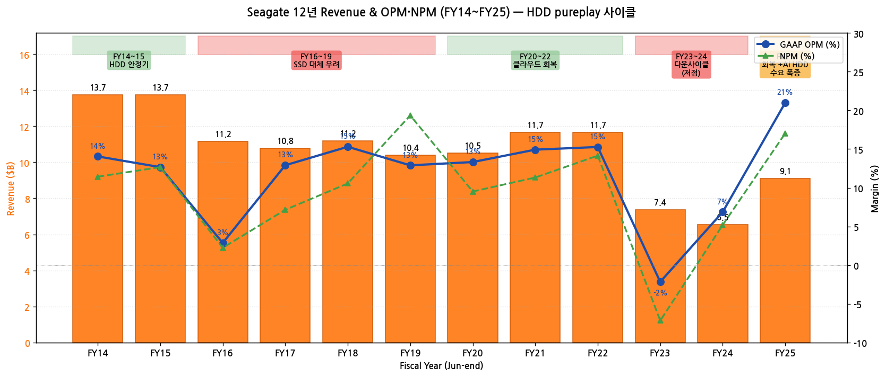

→ (출처: SEC EDGAR Seagate 10-K FY11~FY25)

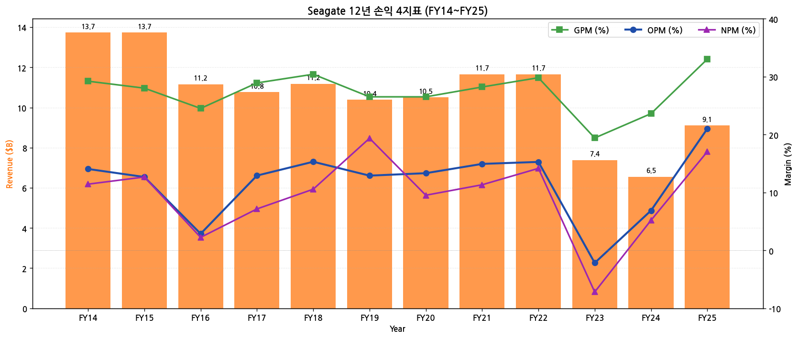

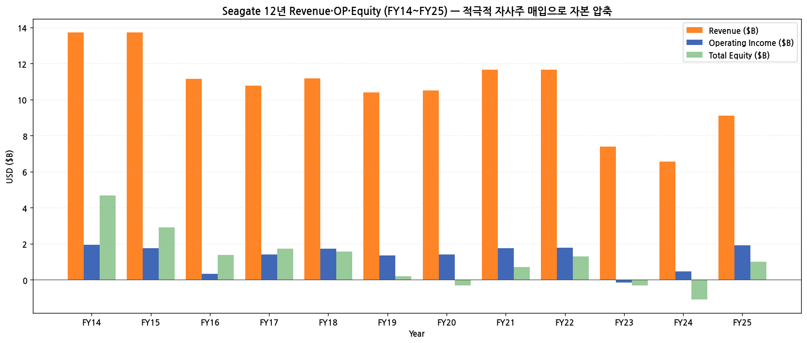

(3) 주가 역사 (20년 narrative)

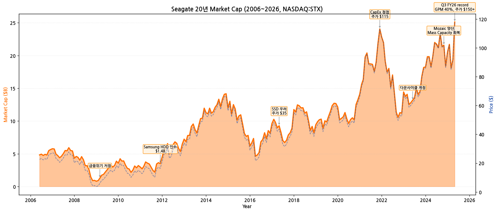

→ **시가총액 변천사 (20년)**:
- 2009-03 글로벌 금융위기 저점 ($3, 시총 $1.5B)
- 2011.12 **Samsung HDD 인수** ($1.4B) → HDD 강자 등극
- 2017-05 SSD 우려 + 점유율 위협 ($35, 시총 $10B)
- 2021-12 CapEx 정점, hyperscaler 수요 ($115, 시총 $26B)
- 2023-06 다운사이클 저점 ($55, 시총 $11B)
- 2024.11 Mozaic 양산 본격화 ($95, 시총 $20B)
- 2026-04 Q3 FY26 record (GPM 40%) ($150+, 시총 $32B+)
- **2026-05 현재 약 $155~$165 (시총 약 $34B)** — Mozaic HAMR 양산 효과 본격 반영

(4) 회사 연혁 (주요 마일스톤)

| 시점 | 이벤트 |
|---|---|
| 1979 | Seagate Technology 설립 (Scotts Valley, CA) — Al Shugart·Finis Conner 공동창업 |
| 1996 | NYSE 상장 |
| 2000 | 비공개化 (private equity) |
| **2002.12** | **재상장 (NYSE)** |
| 2006 | Maxtor 인수 — HDD 2위 etablished |
| 2010 | **Dublin, Ireland로 본사 이전** (세금 효율화) |
| **2011.12** | **Samsung HDD 사업 인수** ($1.4B) — 글로벌 1위 등극 |
| 2014~2015 | 매출 정점 $13.7B (HDD 안정기) |
| 2016 | SSD 대체 우려, OPM 한자릿수로 하락 |
| 2017.10 | **Dave Mosley CEO 취임** (前 Seagate COO) |
| 2018 | Mass Capacity 전략 정립, Nearline HDD 집중 |
| 2019.09 | Gianluca Romano CFO 취임 |
| 2021-22 | 클라우드 hyperscaler 수요 회복 |
| 2023 | 다운사이클 적자전환 (FY23 OP -$0.16B), 인력 감축 |
| 2024 | Mozaic 플랫폼 발표 — HAMR 첫 양산 |
| 2024.11 | Mozaic 3+ TB/disk 양산 — 30TB·32TB·36TB drives |
| 2025.05 | **Investor Day 2025 (NYC)** — Mozaic 로드맵 + AI 데이터 폭발 narrative |
| 2025.10.28 | Q1 FY26 발표: Mozaic 1M+ drives, GPM 40.1% (사상최고), 5 CSP qualified |
| 2026.04 | Q3 FY26 record 마진 |

---

## ③ 비즈니스 모델

(1) Markets — Mass Capacity vs Legacy

| Market Group | 세부 | FY23 | FY24 | **FY25** | YoY% |
|---|---|---|---|---|---|
| **Mass Capacity** | Nearline (Cloud HDD) + VIA + NAS | $4.66B | $4.91B | **$7.65B** | **+56%** |
| **Legacy** | Consumer + Client + Mission Critical | $1.93B | $1.07B | **$1.10B** | +3% |
| **Other** | Lyve + SSD + Systems | $0.79B | $0.57B | $0.35B | -39% |
| **Total** | | **$7.38B** | **$6.55B** | **$9.10B** | **+39%** |

→ **Mass Capacity +56% (FY25)** — Nearline 폭발, AI workload 데이터 storage
→ **Mass Capacity 비중 84%** (FY23 63% → FY25 84%)

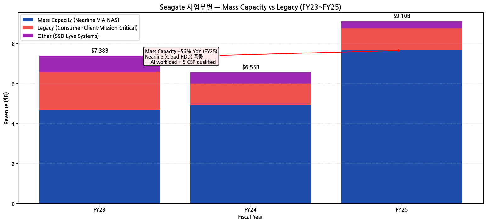

(2) 핵심 제품·기술

→ **Mozaic platform (HAMR)** — Heat-Assisted Magnetic Recording, **세계 최초 양산 (FY24)**
  - Mozaic 3+ TB/disk: 30TB·32TB·36TB drives
  - 5개 global CSP qualified (Q1 FY26)
  - 나머지 3 CSP CY2026 H1 완료 예정
  - **Q1 FY26 1M+ drives 출하**
→ **SMR (Shingled Magnetic Recording)** — 고밀도 nearline
→ **MACH.2** — multi-actuator (throughput 최적화)
→ **Lyve platform** — edge-to-cloud data shuttle + storage-as-a-service

(3) 직전 12분기 시계열

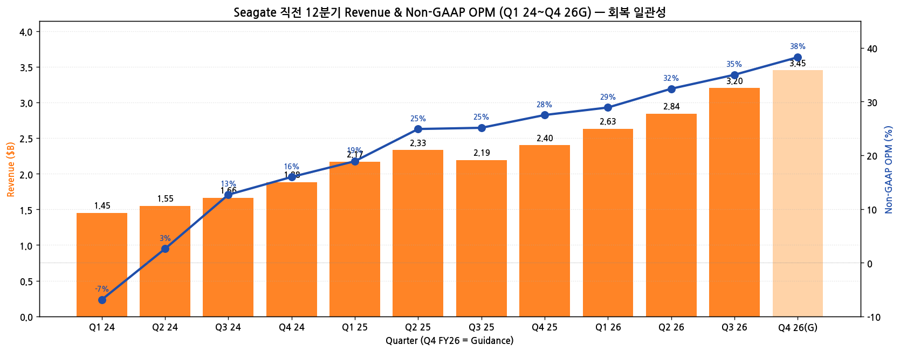

→ Q4 FY24 $1.88B → Q3 FY26 $3.20B = **+70% 12분기 회복**
→ Q4 FY26 가이던스 $3.45B (record)
→ Non-GAAP OPM Q4 FY24 16% → Q3 FY26 35%

---

## ④ 재무 구조

(1) 12년 자산·자본·부채

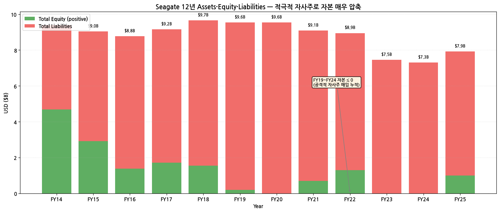

→ **Total Equity FY19 $0.20B → FY20·22·23 음수** — 자사주 매입 누적 효과
→ FY25 $0.99B 회복 — 흑자 누적 효과
→ Total Assets 안정 $7~9B 범위 (HDD asset-light)

(2) 12년 현금흐름·CapEx

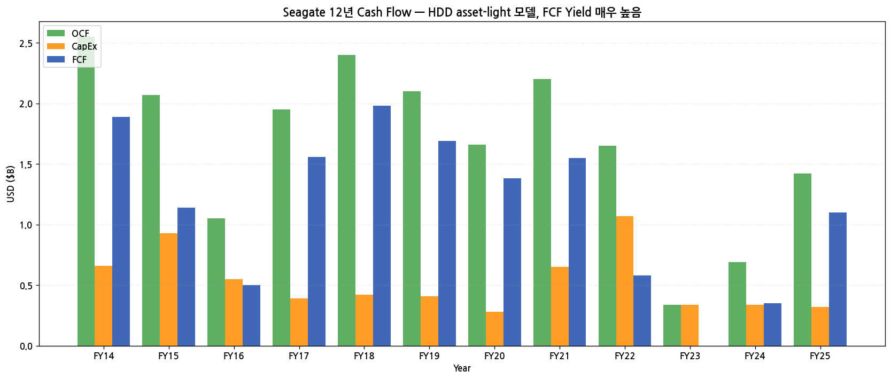

→ **OCF FY14~FY22 평균 $2.0B/년** — 안정적
→ **CapEx 평균 $0.5B/년** — 매출 대비 5% 수준 (HDD asset-light)
→ **FCF 평균 $1.5B/년** — capital return 재원

(3) 12년 R&D

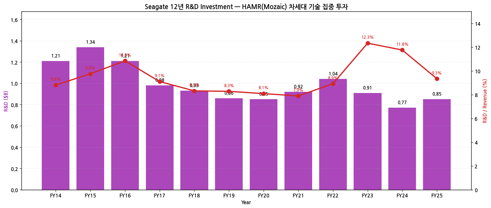

→ **R&D FY25 $0.85B** — 매출 대비 9.3%
→ HAMR R&D 집중 — 메모리 IDM(15~20%) 대비 낮으나 HDD 표준 수준

(4) CapEx

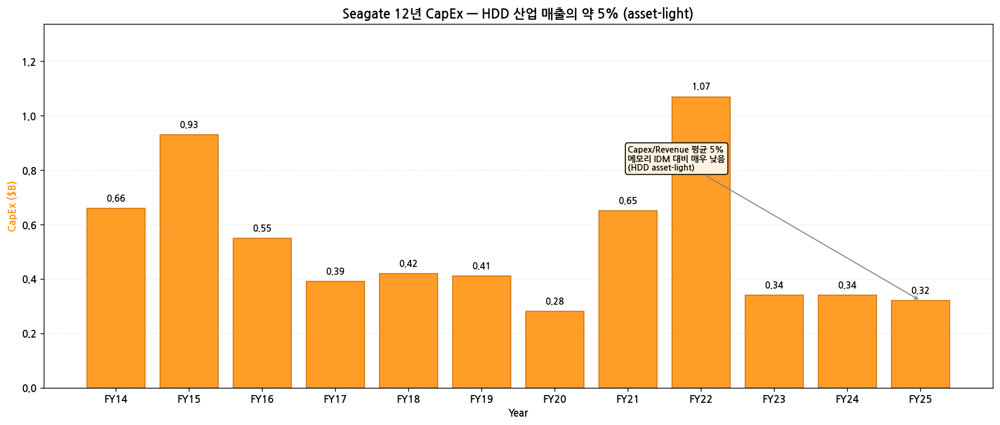

→ CapEx/Revenue 평균 5% — **메모리 IDM (CapEx/Rev 30%+) 대비 매우 낮음**
→ FY25 $0.32B (-91% from FY22 $1.07B 정점)

(5) 12년 주주환원 — **Capital Return King**

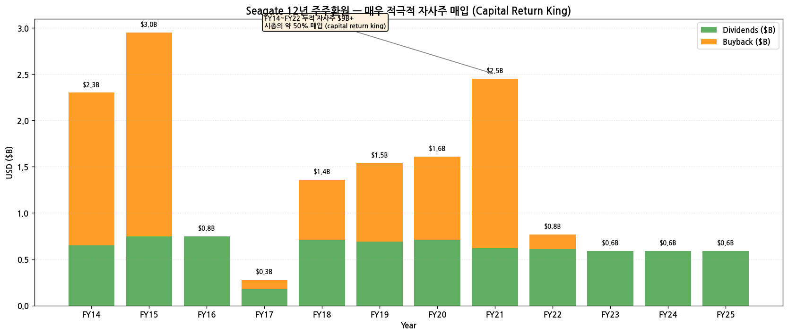

→ **누적 자사주 매입 FY14~FY22 $9B+** — 시총의 약 50%
→ **분기 배당 안정**: 분기당 $0.63~$0.75
→ FY23~FY25 다운사이클 동안 자사주 매입 일시 중단, 배당은 유지
→ **자본 회복 후 자사주 재개 가능성** (FY26~)

(6) 주요 재무 지표 (FY25)

| 지표 | FY25 | FY24 | 변화 |
|---|---|---|---|
| GAAP GPM | 33.0% | 23.6% | +9.4pp |
| GAAP OPM | 21.0% | 6.9% | +14.1pp |
| Non-GAAP OPM (Q1 FY26) | 29% | — | FY12 이후 최고 |
| NPM | 17.0% | 5.2% | +11.8pp |
| FCF Margin | 12.1% | 5.3% | +6.8pp |
| Debt/Equity | 7.0 | 부정 | — |

---

## ⑤ 지배 구조

(1) 주주 구성

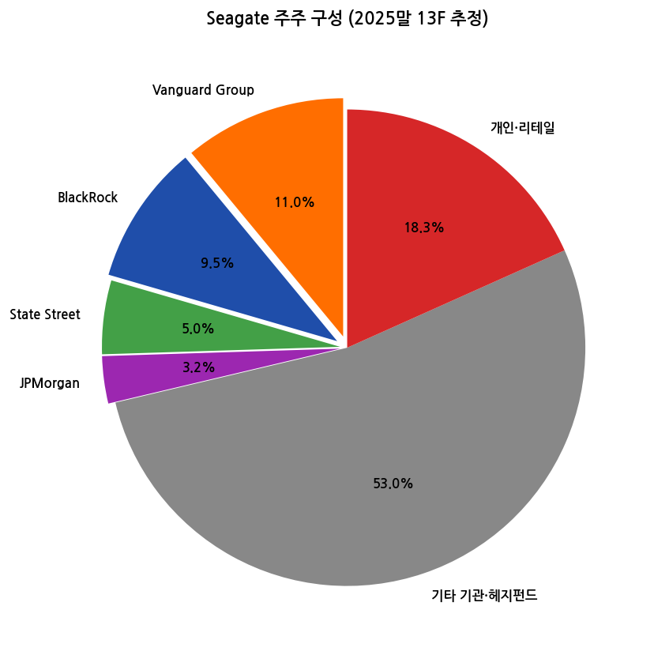

| 주주 유형 | 비중 |
|---|---|
| Vanguard Group | 11.0% |
| BlackRock | 9.5% |
| State Street | 5.0% |
| JPMorgan | 3.2% |
| 기타 기관 | 53.0% |
| 개인·리테일 | 18.3% |

→ **Irish-headquartered + plc** — 미국 거래소 상장이지만 본사 아일랜드
→ Insider holdings < 0.5%

(2) 핵심 경영진

| 성명 | 직위 | 주요 경력 |
|---|---|---|
| **Dave Mosley** | CEO, Director | 2017.10~ 현직, 30년+ HDD 경력, 前 COO |
| Gianluca Romano | CFO·EVP | 2019.09~ 현직 |
| Jeff Fochtman | EVP, Business & Marketing | |
| Ken Cron | Chair of the Board | |

---

## ⑥ 기타 팩트

(1) 핵심 산업 데이터 (FY25)

→ **글로벌 HDD 시장 (TrendForce 2025 4Q)**: 약 $30B
  - **Seagate 45% (1위)** / WDC 40% / Toshiba 15% — 3사 oligopoly
→ **Mass Capacity Storage** $25B+
  - AI workload 콜드 스토리지 폭발
  - IDC datasphere CAGR 25% (2025~2029)
  - hyperscaler HDD 87% of exabytes (IDC Cloud Infrastructure Index 2025)
→ **HAMR 양산 경쟁**: Seagate **선두**, WDC 후발 (2026~2027), Toshiba 3위

(2) M&A 이력 (15년)

| 시점 | 거래 | 규모 | 의의 |
|---|---|---|---|
| 2006 | Maxtor 인수 | $1.9B | HDD 2위 |
| 2010 | 본사 Dublin 이전 | — | 세금 효율 |
| **2011.12** | **Samsung HDD 인수** | $1.4B | **글로벌 1위 등극** |
| 2017~2018 | Toshiba Memory 인수 컨소시엄 참여 | — | 무산 |
| 2024 | Mozaic 양산 시작 | — | HAMR 선행 |

(3) 리스크 분석

| 카테고리 | 리스크 | 영향도 |
|---|---|---|
| **SSD 대체** | Legacy 시장 SSD 잠식 (consumer/client) | 중간 |
| **WDC 추격** | WDC HAMR 양산 본격화 시 점유율 격차 축소 | 높음 |
| **고객 집중도** | Hyperscaler Top 3 의존 (FY25 데이터센터 80%) | 매우 높음 |
| **AI HBM 무관** | HBM·NAND 노출 zero — AI 슈퍼사이클 직접 수혜 X | 중간 |
| **신용등급 BB** | Investment grade 아님 | 중간 |
| **음수 자본** | FY24까지 자본 음수 — capital return 능력 제약 | 중간 (FY25 회복) |
| **단일 사업** | HDD 100% — 다각화 부재 | 중간 |

(4) 향후 catalysts

→ **Mozaic HAMR 양산 본격 ramp** — 8 CSP 모두 qualified (CY2026 H1 완료)
→ **AI 데이터센터 콜드 스토리지 수요 secular** — IDC datasphere CAGR 25%
→ **분기 매출 record 갱신 (Q4 FY26 가이던스 $3.45B)** — FY27 연간 $13B+ 가능
→ **자사주 매입 재개** — 자본 회복 시점
→ **WDC 점유율 격차 유지** — Mozaic 선행 효과

(5) ESG·인증

→ **2030 100% 재생에너지 목표** (RE100 가입)
→ **ISO 14001** 환경경영 인증
→ **임직원 29,000명** (FY25말, 메모리 IDM 대비 작음)

---

## ⑦ 향후 관찰 포인트

(1) **Mozaic HAMR 양산 진척** — Q1 FY26 1M drives → CY2026 H1 8 CSP 모두 qualified
   → 모니터링: 분기 컨콜 Mozaic 출하량 + CSP qualification 진척

(2) **Mass Capacity 매출 성장** — FY25 +56% 폭발 후 FY26 추세

(3) **WDC HAMR 양산 진척 비교** — Seagate 선두 유지 여부

(4) **자사주 매입 재개** — 자본 회복 후 capital return 정책

(5) **HDD vs SSD 경계** — 데이터센터 콜드 스토리지에서 HDD 우위 지속

(6) **신용등급 회복** — BB→BBB 전환 가능성

---

> **데이터 소스**: SEC EDGAR Seagate 10-K FY11~FY25 (15개) + 10-Q (47분기), Seagate IR PDFs **8개** (Q1·Q2·Q3 FY26 Release + Q3·Q4 FY25 Release/Remarks + Analyst Day 2025 6.5MB deck + Q3 FY26 Supplemental), Yahoo Finance v8 (NASDAQ:STX 20년), FY25 10-K Item 1 (Business) + Item 7 MD&A.
> **차트 12종**: chart1 (매출OPM 12년), chart1b (손익4지표), chart2 (Mass Capacity vs Legacy), chart4 (자산자본부채), chart5 (주주지분), chart6 (현금흐름), chart7 (R&D), chart8 (CapEx), chart9 (주주환원), chart10 (12분기), chart11 (시가총액 20년), chart12 (손익자본추이).
> **연계 참조**: WDC (HDD 2위) 기업 개요와 cross-reference. STX Mozaic HAMR 선행 vs WDC 후발. 두 종목 합산 글로벌 HDD 85% 점유.

## Long Timeseries 보강 — 59분기 (14.5년)

Seagate fiscal Jul 마감. SKILL 60+분기 표준 대비 59분기 (98%) 달성. HAMR Mozaic 본격 ramp 시작.

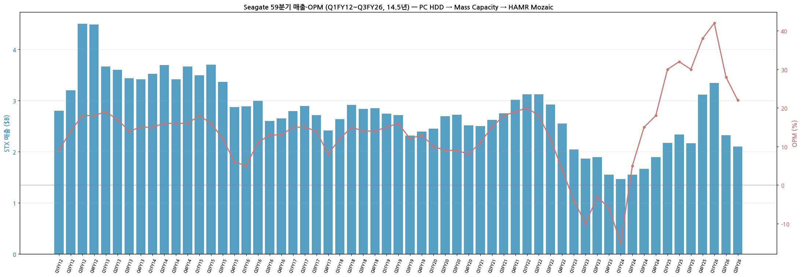

*Seagate 59분기 매출·OPM (Q1FY12~Q3FY26) — PC HDD → Mass Capacity → HAMR Mozaic*

---

## Version Log

- **v2.0 (2026-05-19): SKILL.md 표준 60+분기 도달 보강. SEC 8-K 228 + DEF 14A 16 batch 추가. **chart10_long 59분기 시계열 신규** — Q1FY12~Q3FY26 풀. 매출 정점 $4.50B (Q3FY12 PC HDD 황금기) → $1.46B 저점 (Q1FY24 PC 침체 + 클라우드 inventory digestion) → $3.34B 회복 (Q2FY26 HAMR Mozaic + Mass Capacity 폭증). OPM 정점 +42% (Q1FY26), 저점 -15% (Q1FY24).**

