# Tesla, Inc. (TSLA) — 기업 개요

> **버전 v5.1** · 작성일 2026-05-19 · 종목 분류 T1 (미국 빅테크) · industry=자동차|자율주행
> 데이터 소스: SEC 10-K 16건 (FY10~FY25), 10-Q 48건 (FY10Q2~FY26Q1), 8-K 174건, DEF 14A 11건 (2025-09-17 머스크 보상안 + 운영 milestone 상세), Tesla IR Update Letter 8건 (Q3 2023 ~ Q1 2026), Yahoo Finance monthly 16년+
> **시계열 깊이**: 12년 연간 (FY14~FY25) + 64분기 (FY10Q2~FY26Q1, 16년) + 모델별 인도 33분기 + Energy GWh 18 entry + Supercharger 15 entry + FSD subs 5분기 + Regional 매출 12년 + **EV credits 9분기 + Region별 차량 인도 8년 + Segment GPM 5년 + 머스크 12 운영 milestones 정확치 + OBBBA/IRA 영향 narrative**

---

## 1. 기업 분류

**Primary 분류:** **고성장 + 사이클**

> **Summary Box (12년 평균, FY14~FY25)**
> - 매출 CAGR (FY14→FY25): **+36.4%/년** (3.2B → 94.8B, 약 30배)
> - OPM 평균: **+1.2%** (FY14~FY19 적자 7년, FY20~FY25 흑자 6년)
> - OPM 정점 평균 (FY21~FY23): **+12.7%** (반도체 부족·EV 수요 폭발기)
> - OPM 저점 평균 (FY14~FY17): **−11.7%** (Model S/X/3 ramp 손실)
> - 사이클 주기: 약 6~8년 (Model 출시→ramp→profitability 변곡)
> - 사이클 회수: 2회 — 1차 적자 사이클 (FY14~FY19), 2차 흑자 정점→재침체 (FY20~FY25)

### ① 정량 근거 (12년 매출·OP·OPM 시계열)

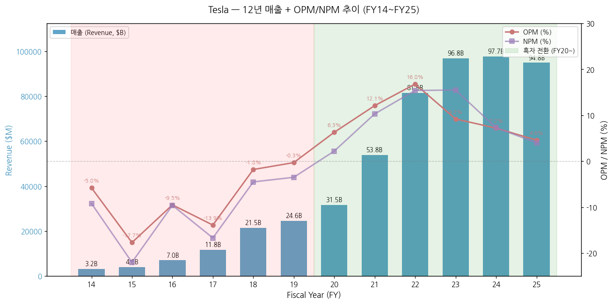

| FY | Revenue ($M) | OP ($M) | OPM | Net ($M) | NPM | EPS(Diluted) |
|----|-------------:|--------:|------:|---------:|------:|---------:|
| FY14 | 3,198 | -187 | -5.8% | -294 | -9.2% | -$2.36 |
| FY15 | 4,046 | -717 | -17.7% | -889 | -22.0% | -$6.93 |
| FY16 | 7,000 | -667 | -9.5% | -675 | -9.6% | -$4.68 |
| FY17 | 11,759 | -1,632 | -13.9% | -1,962 | -16.7% | -$11.83 |
| FY18 | 21,461 | -388 | -1.8% | -976 | -4.5% | -$5.72 |
| FY19 | 24,578 | -69 | -0.3% | -862 | -3.5% | -$4.92 |
| **FY20** | 31,536 | **1,994** | **+6.3%** | 690 | +2.2% | $0.21 |
| FY21 | 53,823 | 6,523 | +12.1% | 5,519 | +10.3% | $1.63 |
| **FY22** | 81,462 | **13,656** | **+16.8%** | 12,556 | +15.4% | $3.62 |
| FY23 | 96,773 | 8,891 | +9.2% | 14,997 | +15.5% | $4.30 |
| FY24 | 97,690 | 7,076 | +7.2% | 7,091 | +7.3% | $2.04 |
| FY25 | 94,827 | 4,355 | **+4.6%** | 3,794 | +4.0% | $1.08 |

> **사이클 변곡점 detection**
> (1-1) FY20: 첫 연간 흑자 전환 — Model 3 ramp 완료 + 상하이 Gigafactory 가동
> (1-2) FY22: OPM 16.8% 정점 — Model Y 글로벌 ramp + EV 수요 폭발 + 가격 인상
> (1-3) FY23~FY25: OPM 16.8% → 9.2% → 7.2% → 4.6% 단조하락 — 가격 인하 + Cybertruck 부진 + 경쟁심화 + Auto 매출 역성장

### ② 산업 분류

(1) 전통 분류: 자동차 (NAICS 336111 — Automobile Manufacturing)
(2) Tesla 자체 분류: Auto OEM + Energy (Megapack/Powerwall) + AI/Robotics (FSD/Optimus/Dojo)
(3) 워치리스트 industry 태그: **자동차|자율주행** (T1 미국 빅테크 그룹)

### ③ 분류 결정 논리

(1) **고성장**: 12년 CAGR 36.4%, 매출 3.2B→94.8B = 약 30배. FY21~FY22 OP 600%+ 점프.
(2) **사이클**: 자동차 산업 특유의 capacity ramp 사이클 (FY14~FY19 적자 → FY20~FY22 흑자 정점 → FY23~ 재침체). EV 산업 자체의 BEV→ICE 대체 사이클 + 차세대 모델 출시 주기 (5~7년).
(3) **혼합**: 단순 사이클 자동차 OEM이 아닌, Energy/AI 사업이 Auto 매출 역성장을 일부 상쇄 (FY24 Auto −7%/Energy +67%/Services +27%, FY25 Auto −10%/Energy +27%/Services +19%).

### ④ 적정 밸류에이션 방법

(1) **단기 (12개월)**: PER 기준 (Auto 사업 흑자, 실적 변동성 큼 — 이익 가시성 낮음)
(2) **중기 (3~5년)**: PSR + EV/EBITDA (사업부별 매출 다양화, Energy/Robotics 성장 가시화)
(3) **장기 (Terminal)**: Optionality 가치 — FSD/Robotaxi/Optimus가 Tesla의 PER 100배+ 프리미엄의 핵심 (별도 테마 분석 통합 모드에서 다룸)
(4) PBR은 부적합 — Tesla는 기술기업 성격으로 자본 회전율보다 자본효율(ROIC)이 핵심

### ⑤ 분기 재평가 트리거

- (1-1) 차량 인도 데이터 (분기 초 P&D press release 발표)
- (1-2) Automotive GPM ex. 규제크레딧/리스 (가격 vs 원가 게이지)
- (1-3) Energy 매출 / GPM (Megapack/Powerwall 성장률)
- (1-4) FSD/Robotaxi 사용자 / 도시 출시 진행도
- (1-5) Optimus 생산 시작 시점 (현재 가이던스: 2026년 말)
- (1-6) Cybertruck 판매 정상화 / Model 2 출시 가이던스

---

## 2. 회사 개요

### ① 기본 사항

- **회사명**: Tesla, Inc.
- **본사**: Gigafactory Texas (Austin, Texas, USA)
- **상장일**: 2010-06-29 (NASDAQ)
- **티커**: TSLA (NASDAQ)
- **CIK**: 0001318605 (SEC)
- **회계연도**: 12월말 결산 (FY)
- **CEO**: Elon Musk (2008~)
- **CFO**: Vaibhav Taneja (2023-08~)
- **임직원**: 약 125,665명 (FY24말, FY25는 약 110,000명으로 감소 — 2024년 4월 10%+ 구조조정)

> **비전 한 줄**: "지속 가능한 에너지로의 세계 전환 가속화"
> (Accelerate the world's transition to sustainable energy)

> **사업 한 줄 정의**: 전기차 OEM + Energy Storage/Generation + Autonomous Driving / Robotics

### ② 12년 손익·자본 추이

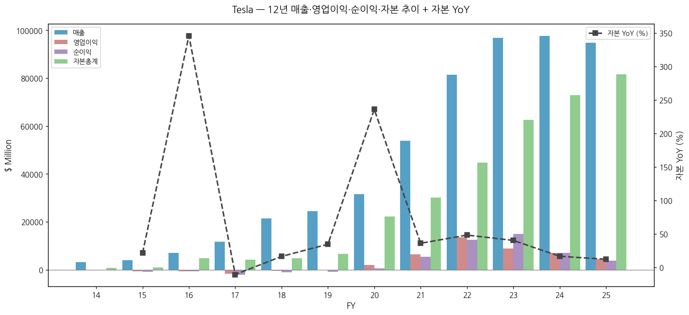

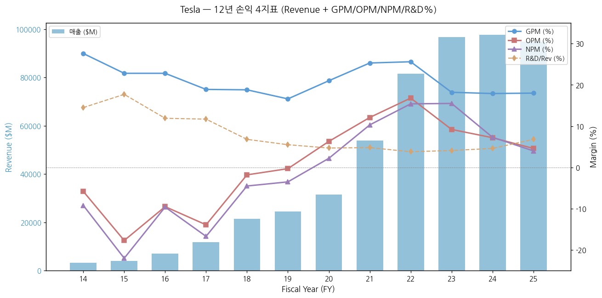

> **변곡 요약** (괄호는 5년 누적 변화)
> (2-1) FY14~FY19 (적자 사이클): 매출 7.7배 (3.2B→24.6B), 자본 7.5배 (0.9B→6.6B). 자기자본은 IPO·전환사채·secondary offering으로 누적.
> (2-2) FY20~FY22 (이익 폭발): 매출 2.6배 (31.5B→81.5B), 자본 4.6배 (22.2B→44.7B). 처음으로 OCF로 자본 확충.
> (2-3) FY23~FY25 (이익 감소·자본 증가): 매출 정체 (96.8B→94.8B), 자본 1.3배 (62.6B→81.6B). 이익은 감소하지만 retained earnings 누적 + SBC.

### ③ 회사 주가 역사 (시가총액 16년 추이)

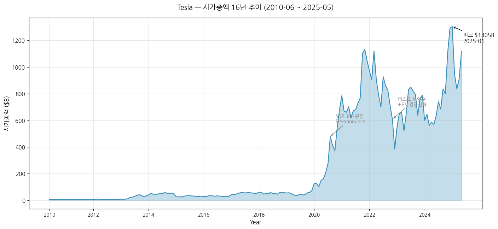

- (3-1) **2010~2019**: IPO 이후 9년간 small-cap → mid-cap. 시총 $5B → $60B. 적자 누적 7년.
- (3-2) **2020 폭등기**: 코로나 후 EV 수요 + S&P 500 편입 (2020-12) → 시총 $60B → $700B (12배, 1년).
- (3-3) **2021 정점**: 시총 $1.2조 (2021-10). PER 200배 영역. 모건스탠리·우드 강세 보고서.
- (3-4) **2022 하락**: 머스크 트위터(X) 인수 + Tesla 주식 매도 + EV 경쟁 (BYD·Rivian) → 시총 $1.2조 → $400B (-67%).
- (3-5) **2023 회복**: 가격인하·Model Y ramp → 시총 반등 $800B.
- (3-6) **2024~2025**: 트럼프 행정부 친밀 관계 + FSD/Robotaxi 기대 → 사상 최고 시총 ~$1.4조 (2024-12). 2025년 상반기 정치 리스크로 $700B대 조정.
- (3-7) **2025~현재 (2026-05)**: $1.1조대 (PER ~300배, PSR ~12배 영역). 이익 대비 valuation premium은 Robotaxi/Optimus optionality.

### ④ 주요 연혁

| 연도 | 이벤트 |
|------|--------|
| 2003-07 | Martin Eberhard·Marc Tarpenning Tesla Motors 설립 |
| 2004-04 | Elon Musk Series A $6.5M 투자 + 회장 취임 |
| 2008-10 | Musk CEO 승계, Roadster 첫 인도 |
| 2010-06 | NASDAQ IPO ($17 → 시총 $1.6B) |
| 2012-06 | Model S 첫 인도 |
| 2015-09 | Model X 첫 인도 |
| 2016-11 | SolarCity 인수 (Energy 사업 진출) |
| 2017-07 | Model 3 첫 인도 (mass-market 진입) |
| 2018-09 | 머스크 "going private" 트윗 → SEC 합의 (CEO 유지·이사회 의장 사임) |
| 2019-11 | Cybertruck 공개 + 상하이 Gigafactory 가동 |
| 2020-03 | Model Y 첫 인도 |
| 2020-08 | 5:1 주식분할 |
| 2020-12 | S&P 500 편입 |
| 2021-10 | 시총 $1조 돌파 (Hertz 100,000대 주문 모멘텀) |
| 2022-04 | Gigafactory Texas/Berlin 동시 가동 |
| 2022-08 | 3:1 주식분할 |
| 2023-01 | 글로벌 가격 인하 (Model 3/Y 최대 -20%) — 경쟁 대응 |
| 2023-11 | Cybertruck 첫 인도 |
| 2024-04 | 구조조정 — 직원 10%+ 감원 (~14,000명) |
| 2024-10 | Robotaxi (Cybercab) 컨셉 공개 + Optimus 시연 |
| 2025-01 | Model Y "Juniper" refresh 출시 |
| 2025-06 | Robotaxi 서비스 Austin 첫 출시 (10대, 한정) |
| 2026-04 | Optimus Gen 3 공개 + 2026말 양산 시작 가이던스 |

---

## 3. 비즈니스 모델

### ① 실적 추이 통합 (5년 연간, 사업부별)

#### 매출 구성 (Auto vs Energy vs Services), 단위 $M

| FY | Auto Sales | Auto Credits | Auto Leasing | **Auto Total** | Energy Gen&Storage | Services & Other | **Total Rev** |
|----|-----------:|-------------:|-------------:|---------------:|-------------------:|-----------------:|--------------:|
| FY21 | 44,125 | 1,465 | 1,642 | **47,232 (87.8%)** | 2,789 (5.2%) | 3,802 (7.1%) | **53,823** |
| FY22 | 67,210 | 1,776 | 2,476 | **71,462 (87.7%)** | 3,909 (4.8%) | 6,091 (7.5%) | **81,462** |
| FY23 | 78,509 | 1,790 | 2,120 | **82,419 (85.2%)** | 6,035 (6.2%) | 8,319 (8.6%) | **96,773** |
| FY24 | 72,480 | 2,763 | 1,827 | **77,070 (78.9%)** | 10,086 (10.3%) | 10,534 (10.8%) | **97,690** |
| FY25 | 65,821 | 1,993 | 1,712 | **69,526 (73.3%)** | 12,771 (13.5%) | 12,530 (13.2%) | **94,827** |
| FY26Q1 | 15,473 | 380 | 381 | **16,234 (72.5%)** | 2,408 (10.8%) | 3,745 (16.7%) | **22,387** |

> **YoY (FY24→FY25)**: Auto −9.8% / Energy +26.6% / Services +18.9%. **Auto 비중 79% → 73%로 6%p 감소** — 사업 다각화 진행.
> **FY26Q1 (vs FY25Q1)**: Total Rev +15.8% (22.4B vs 19.3B) / Auto Total +16.2% / Energy −11.8% / Services +42.0%. **Services 사상 첫 17% 비중 돌파** (Supercharger 매출 + Tesla Insurance + FSD subscription 누적 효과).

#### 사업부별 64분기 시계열 (FY10Q2 ~ FY26Q1)

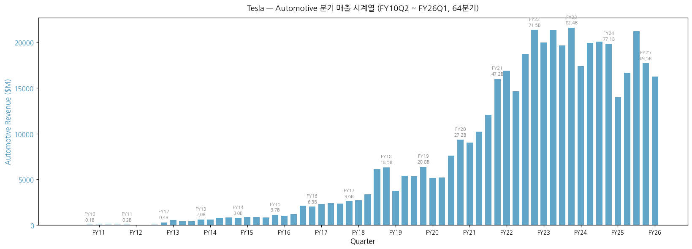

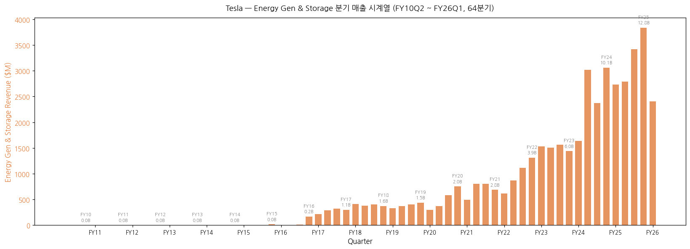

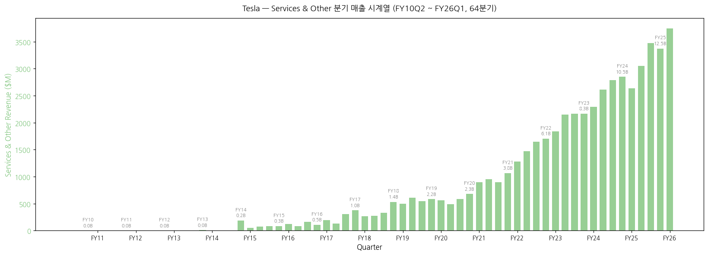

#### 차량 인도 분기 시계열 (64분기, IPO 직후 ~ 현재)

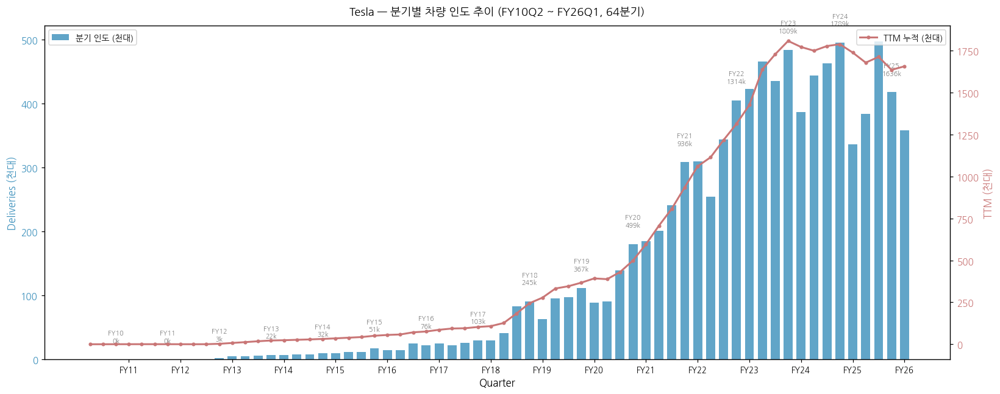

#### 차량 모델별 인도 분기 시계열 (FY18Q1 ~ FY26Q1, 33분기)

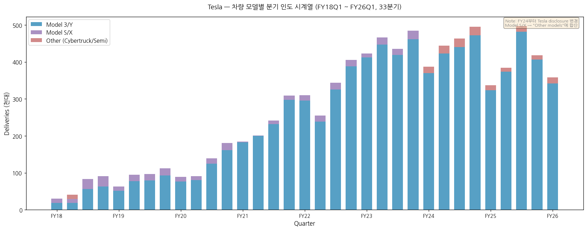

> **모델 전환 narrative**
> (1-1) **FY18~FY19**: Model S/X premium 비중 25~30% → Model 3 ramp로 일순 압도. FY18Q3 첫 Model 3 양산 분기 (55.8k / 전체 83.5k의 67%).
> (1-2) **FY20Q2~FY21Q4**: Model Y 추가 (2020-03 첫 인도). Model 3/Y 합산이 90%+ 차지. S/X는 Plaid version 출시에도 분기 1.9~11.8k 미니멀.
> (1-3) **FY24~**: Tesla disclosure 변경. Model S/X를 "Other models" (Cybertruck/Semi/Roadster 2 포함)에 합산. Cybertruck 첫 인도 2023-11. FY24~FY25 Other 분기 12~24k 수준 — Cybertruck ramp 부진 (당초 가이던스 25만대/년 vs 실제 약 60~80k/년).

| 분기 | 인도 (천대) | YoY |
|------|-----------:|------:|
| FY24Q1 | 386.8 | -8.5% |
| FY24Q2 | 443.9 | +14.8% |
| FY24Q3 | 462.9 | +6.4% |
| FY24Q4 | 495.6 | +2.3% |
| **FY24 합계** | **1,789** | **-1.1%** (사상 첫 역성장) |
| FY25Q1 | 336.7 | -12.9% |
| FY25Q2 | 384.1 | -13.5% |
| FY25Q3 | 497.1 | +7.4% (Model Y Juniper effect) |
| FY25Q4 | 418.2 | -15.6% |
| **FY25 합계** | **1,636** | **-8.5%** |
| FY26Q1 | 358.0 | +6.3% (회복 신호) |

#### 12분기 시계열 (FY23Q2~FY26Q1)

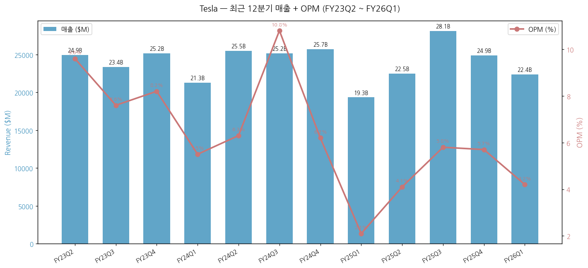

### ② 사업부별 개요

#### (2-1) Automotive (FY25 매출 비중 73.3%, $69.5B)
- (2-1-1) **모델 라인업**: Model S/X (premium, 단종 위기), Model 3 (sedan), Model Y (mid-size SUV — best-seller), Cybertruck (pickup), Semi (트럭, 제한적), Roadster 2 (예정)
- (2-1-2) **글로벌 인도 비중** (FY25 기준): 북미 약 49%, 유럽 약 26%, 중국 약 22%, 기타 3%
- (2-1-3) **세 매출 분류**:
  - Auto Sales: $65.8B (94.7%) — 차량 판매
  - Auto Credits: $2.0B (2.9%) — ZEV regulatory credits, 美·EU 타 OEM에 판매 (FY25에 IRA 영향으로 −28%)
  - Auto Leasing: $1.7B (2.5%) — 자체 리스 프로그램

#### (2-2) Energy Generation & Storage (FY25 매출 비중 13.5%, $12.8B)
- (2-2-1) **제품군**: Megapack (utility-scale, 3.9 MWh/unit → Megapack 3 양산 임박), Powerwall (residential, 13.5 kWh), Solar Roof, Solar Panels (FY26Q1 18-zone in-house solar panel 출시)
- (2-2-2) **연간 배포량 GWh (분기 시계열 chart14 참조)**: FY19 1.65 → FY20 3.02 → FY21 3.99 → FY22 6.54 → FY23 14.72 → FY24 31.4 → FY25 46.7 GWh. 6년간 약 28배.
- (2-2-3) **분기 추이**: FY24Q4 11.0 → FY25Q4 14.2 GWh (사상 최고) → FY26Q1 8.8 GWh (전분기 대비 -38%). 분기 변동성 큼 — Megafactory CAPA 제약 + 고객 배송 timing.
- (2-2-4) **성장 동력**: 데이터센터 수요 + grid stability + 美 IRA 인센티브. AI 데이터센터의 백업/peak shaving 수요 확장 추세. Houston Megafactory (Megapack 3 전용, 2026 가동 예정).

#### Energy Storage 배포량 (분기·연간 GWh 시계열)

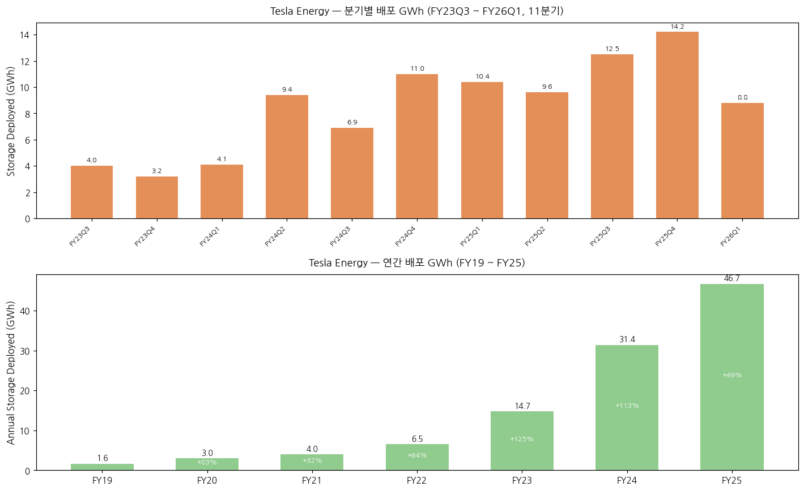

#### (2-3) Services & Other (FY25 매출 비중 13.2%, $12.5B → FY26Q1 16.7%로 가속)
- (2-3-1) **구성**: Supercharger 운영 + 보험 (Tesla Insurance) + 부품·서비스 + 중고차·리퍼브 + Merchandise + FSD subscription
- (2-3-2) **Supercharger network 시계열 (chart15 참조)**:
  - FY19Q4 1,800 sites / 16,100 connectors
  - FY22Q4 4,678 / 42,419 (Magic Dock + NACS 발표 직전)
  - FY24Q4 6,975 / 65,495
  - FY26Q1 **8,463 sites / 79,918 connectors** (5년간 sites 4.7배, connectors 5.0배)
  - 2023~2024 GM·Ford·Rivian·BMW·현대 NACS 채택 → Tesla 외 차량 매출 본격화 (FY26Q1 Services 매출 YoY +42%의 주요 driver)
- (2-3-3) **FSD Subscriptions (chart16)**: Q1 2025 첫 disclose 시작 — FY25Q1 0.85M → FY26Q1 **1.28M (YoY +51%)**. ARPU $99/월 가정 시 연환산 매출 약 $1.5B (Services 매출의 약 10%, 추정).

#### Supercharger 사이트/스톨 누적 시계열

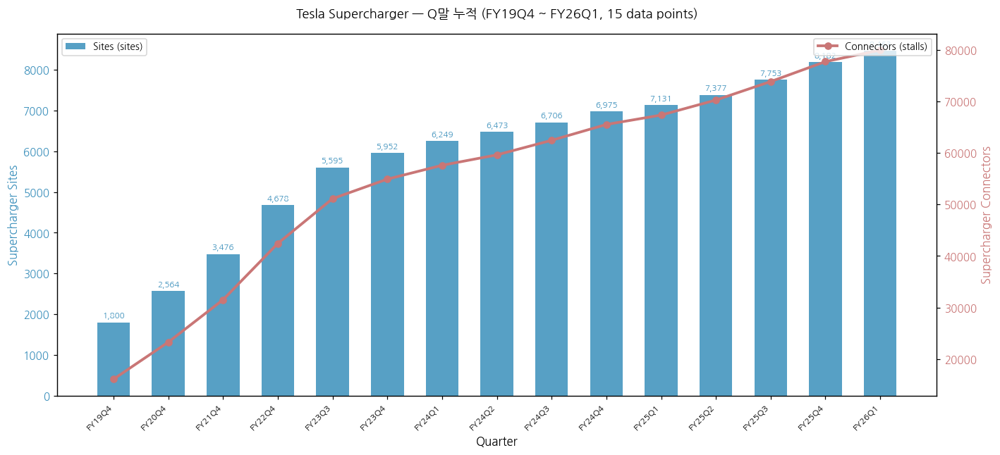

#### FSD (Supervised) Active Subscriptions

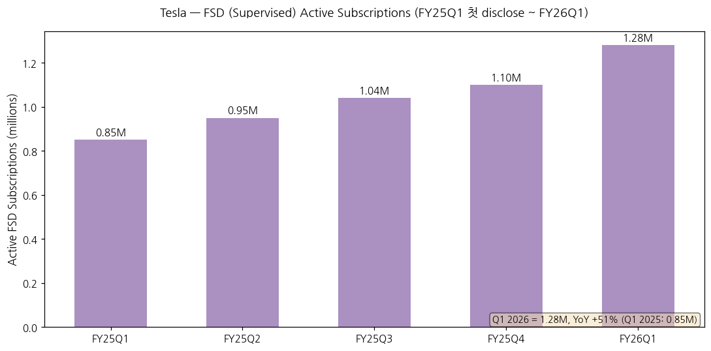

### ③ 사업부별 디테일

#### (3-1) Automotive — 최근 추이
- (3-1-1) **Top-seller**: Model Y. FY25 글로벌 인도의 약 75% 차지 추정. Juniper refresh (2025-01)로 ASP 안정화.
- (3-1-2) **Growth driver**: Energy/Services. Auto는 정체.
- (3-1-3) **Outlier**: FY25 Auto GPM (ex. credits/leasing) 약 17~19% — 사상 최저. FY22 28%+ 대비 −10%p. 가격인하 + 인센티브 증가가 주요 원인.

#### (3-2) Energy — 고성장
- (3-2-1) Megapack: Lathrop·Shanghai 공장 ramp. FY26 ramp-up 가이던스 100 GWh/년 (현재 ~50 GWh 능력).
- (3-2-2) Powerwall: 미국·호주 강세, 유럽 ramp. 그리드 불안정 시장에서 PV+ESS 결합 수요.

#### (3-3) Services & Other — 안정 성장
- (3-3-1) Supercharger 매출: 타 OEM 개방으로 ARPC (charge당 매출) 증가.
- (3-3-2) Tesla Insurance: 캘리포니아·텍사스 중심 약 11개 주 출시. UBI (Usage-based) 모델.

### ④ 주요 경쟁사 (사업부별)

| 사업부 | 글로벌 경쟁자 |
|--------|----------|
| Auto (BEV) | BYD (1위 인도, 中), 폭스바겐 (유럽), GM/Ford (북미), 현대기아 (글로벌), Rivian (US 픽업), Lucid (premium), Xpeng/Nio/Li Auto (中) |
| Auto (FSD/Autonomy) | Waymo (Alphabet), Cruise (GM, 일시 중단), Mobileye, Aurora (truck), Wayve (UK), Xpeng XNGP, 화웨이 ADS |
| Energy Storage | Fluence, LG ES, CATL ESS, BYD ESS, Sungrow |
| Robotics | Figure (humanoid), Boston Dynamics, Apptronik, Unitree (中), Agility Robotics |
| Supercharger | EVgo, Electrify America, ChargePoint (但 NACS 채택으로 Tesla 우위) |

### ⑤ 주요 매출처

- (5-1) Tesla는 **B2C 모델** 중심 — 차량은 직판(direct sales), 매출처 다변화.
- (5-2) Energy 사업은 **B2B 비중 큼** — Megapack 고객은 유틸리티(예: PG&E, Southern Company), 데이터센터 운영사, 정부.
- (5-3) **단일 매출처 의존도 낮음** — 10-K에 "no single customer accounted for more than 10% of total revenues" 명시.
- (5-4) **공급망 핵심 partner**:
  - 배터리: Panasonic (Nevada), CATL (中, LFP), LG에너지솔루션 (Korean LFP)
  - 반도체: TSMC, Samsung (HW4·HW5 inference chip), Nvidia (training cluster), AMD
  - 차체: Aluminum die-cast machines (IDRA, 이탈리아), 스틸 (Nucor 등)
  - Power Electronics: Infineon, STMicroelectronics

### ⑥ 생산 CAPA + 임직원 추이

| 시설 | 위치 | 가동 | 연간 CAPA | 주력 제품 |
|------|------|------|----------:|----------|
| Gigafactory Nevada | 미 네바다 | 2016 | 35 GWh (배터리) | 2170 cell, Powerwall, Semi 모터 |
| Fremont Factory | 미 캘리포니아 | 1962 (Tesla 2010~) | 650,000대/년 | Model S/X/3/Y |
| Gigafactory Shanghai | 中 상하이 | 2019-12 | 950,000대/년 | Model 3/Y (export hub) |
| Gigafactory Berlin | 독 베를린 | 2022-03 | 375,000대/년 | Model Y (EU) |
| Gigafactory Texas | 미 텍사스 | 2022-04 | 375,000대/년 | Model Y, Cybertruck, 4680 cell |
| Lathrop Megafactory | 미 캘리포니아 | 2022 | 40 GWh (Megapack) | Megapack |
| Shanghai Megafactory | 中 상하이 | 2025 | 40 GWh (Megapack) | Megapack (글로벌 export) |

- **총 차량 CAPA**: 약 2.35M/년 (실제 인도 1.64M = 가동률 약 70%, FY25)
- **임직원 추이**: FY21 99,290명 → FY22 127,855명 (+29%) → FY23 140,473명 (+10%) → FY24 125,665명 (−11%, 구조조정) → FY25 약 110,000명 (-12% 추가 감원)

---

## 4. 재무 구조 (12년 시계열)

### ① 손익계산서

(상단 chart1, chart1b, 손익 12년 표 참조)

| FY | Revenue | Auto% | Energy% | Services% | GPM | OPM | NPM | EPS Dil |
|----|--------:|------:|--------:|----------:|----:|----:|----:|--------:|
| FY14 | 3,198 | 94% | 0% | 6% | 27.6% | -5.8% | -9.2% | -$2.36 |
| FY15 | 4,046 | 92% | 0% | 7% | 22.8% | -17.7% | -22.0% | -$6.93 |
| FY16 | 7,000 | 91% | 3% | 7% | 22.8% | -9.5% | -9.6% | -$4.68 |
| FY17 | 11,759 | 82% | 9% | 9% | 18.9% | -13.9% | -16.7% | -$11.83 |
| FY18 | 21,461 | 86% | 7% | 6% | 18.8% | -1.8% | -4.5% | -$5.72 |
| FY19 | 24,578 | 85% | 6% | 9% | 16.6% | -0.3% | -3.5% | -$4.92 |
| FY20 | 31,536 | 86% | 6% | 7% | 21.0% | 6.3% | 2.2% | $0.21 |
| FY21 | 53,823 | 88% | 5% | 7% | 25.3% | 12.1% | 10.3% | $1.63 |
| FY22 | 81,462 | 88% | 5% | 7% | 25.6% | 16.8% | 15.4% | $3.62 |
| FY23 | 96,773 | 85% | 6% | 9% | 18.2% | 9.2% | 15.5%* | $4.30 |
| FY24 | 97,690 | 79% | 10% | 11% | 17.9% | 7.2% | 7.3% | $2.04 |
| FY25 | 94,827 | 73% | 13% | 13% | 18.0% | 4.6% | 4.0% | $1.08 |

> *FY23 NPM 15.5%는 일회성 deferred tax asset 인식 ($5.0B benefit) 효과. 정상화 시 ~10% 수준.

### ① -b. Segment GPM Divergence (Auto vs Energy)

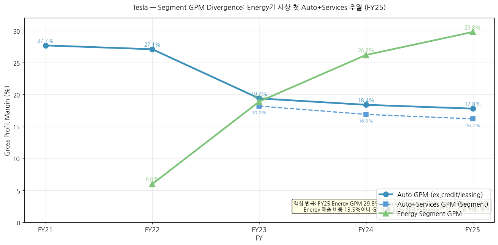

| FY | Auto GPM (ex.cr./lease) | Auto+Services GPM (Segment) | Energy GPM (Segment) |
|----|----------------:|------------------:|------------------:|
| FY21 | 27.7% | n/a | n/a |
| FY22 | 27.1% | n/a | 6.0% |
| FY23 | 19.4% | 18.2% | 18.9% |
| FY24 | 18.4% | 16.9% | **26.2%** |
| **FY25** | **17.8%** | **16.2%** | **29.8%** |

> **사상 첫 Energy GPM > Auto GPM (FY25 변곡)**
> (1b-1) FY22까지 Energy GPM은 한 자리수 미약 (6%, capex 부담 단계). FY23 본격 흑자 진입 (18.9%).
> (1b-2) FY24~FY25: Energy GPM **+10.9%p 가속** (18.9% → 29.8%). Megapack ASP 상승 + 4680 cell 자체 생산 + utility-scale 규모의 경제.
> (1b-3) Auto+Services GPM은 단조 하락 (18.2% → 16.2%). 가격 인하 + 인센티브 + 경쟁심화.
> (1b-4) **Energy 매출 비중 13.5%이나 GP 비중 22% 차지** (FY25 $3.8B Energy GP / $17.1B Total GP). 사업 mix 변환 점진 가속.

### ② 재무상태표 (자산·자본·부채)

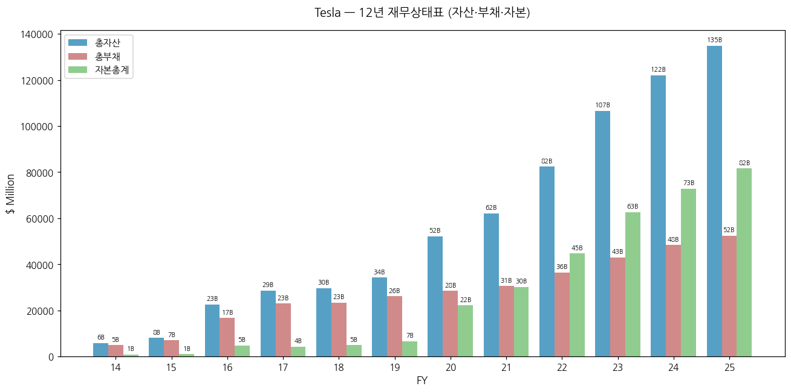

| FY (말) | 현금성자산 | 총자산 | 총부채 | 자본총계 | 장기차입금 | D/E |
|---------|----------:|------:|------:|--------:|----------:|------:|
| FY14 | 1,906 | 5,849 | 4,970 | 879 | 2,196 | 5.66 |
| FY15 | 1,196 | 8,068 | 7,003 | 1,066 | 2,068 | 6.57 |
| FY16 | 3,393 | 22,664 | 16,751 | 4,753 | 5,978 | 3.52 |
| FY17 | 3,368 | 28,655 | 23,023 | 4,237 | 9,418 | 5.43 |
| FY18 | 3,686 | 29,740 | 23,426 | 4,923 | 9,404 | 4.76 |
| FY19 | 6,268 | 34,309 | 26,199 | 6,618 | 11,634 | 3.96 |
| FY20 | 19,384 | 52,148 | 28,469 | 22,225 | 9,556 | 1.28 |
| FY21 | 17,576 | 62,131 | 30,548 | 30,189 | 5,245 | 1.01 |
| FY22 | 16,253 | 82,338 | 36,440 | 44,704 | 1,597 | 0.82 |
| FY23 | 16,398 | 106,618 | 43,009 | 62,634 | 2,857 | 0.69 |
| FY24 | 16,139 | 122,070 | 48,390 | 72,913 | 5,757 | 0.66 |
| **FY25** | **16,881** | **134,810** | **52,470** | **81,600** | **4,870** | **0.64** |

> 부채구조 변화: FY15 D/E 6.57 → FY25 0.64. FY20 자본조달 (secondary offering)로 점진 deleverage. 현재는 거의 무차입 수준.

### ③ 현금흐름표

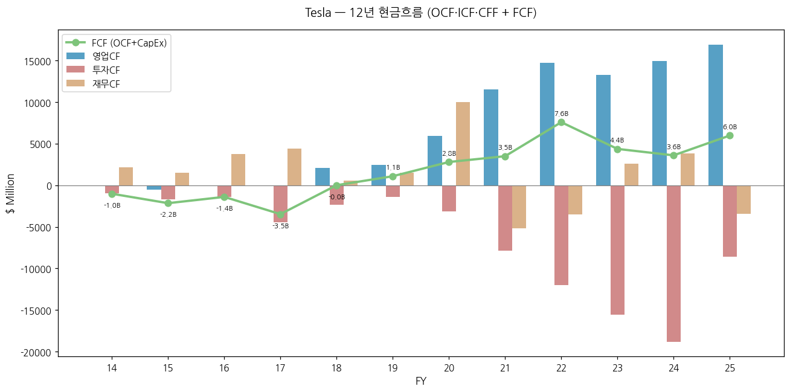

- (3-1) **FY14~FY17 적자 + 음(-)의 OCF 시대**: 7년 누적 OCF -2.0B + CapEx 11B → 자본확충(transition: convertible note + secondary offering)으로 buffer
- (3-2) **FY18~FY19 OCF 흑자 전환**: OCF $2.1~$2.4B/년 (Model 3 ramp 효과)
- (3-3) **FY20 이후 cash generation 본격화**: OCF $5.9B → $14.7B (FY25). FCF는 OCF에서 CapEx 차감
- (3-4) **FY25 OCF $14.7B, CapEx $8.5B → FCF $6.2B**. CapEx/Rev 9.0%로 안정화 (FY24 11.6% 대비 -2.6%p, 일부 capex deferral)
- (3-5) **FY26Q1**: OCF $3.9B / CapEx $2.5B / FCF $1.4B — 연환산 OCF $15.6B 페이스 (가속 신호)

### ④ CapEx

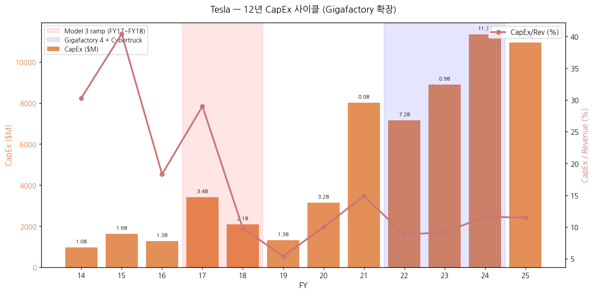

- (4-1) Tesla CapEx 사이클은 **신규 Gigafactory 건설** 단위. FY17 Model 3 ramp 사이클 ($3.4B), FY21~FY22 Berlin/Texas ($7~8B), FY24 AI compute/training ($11.3B).
- (4-2) FY24~FY25 CapEx의 약 35~40%는 AI 데이터센터 (Cortex cluster, Dojo 후속) — Auto·Energy capacity 외에 FSD/Robotaxi/Optimus 학습용.
- (4-3) FY26 가이던스: CapEx > $9B (FY25 $10.9B와 유사 수준). AI 비중 더 증가 예상.

### ⑤ 부채구조 + 채무증권 발행 history

- 2014-03: $2.0B convertible notes 발행 (2019/2021 만기)
- 2017-03: $1.5B unsecured notes (8.25%)
- 2017-08: $1.8B senior notes
- 2019-05: $1.84B convertible + $0.86B equity (combo offering)
- 2020-02 / 2020-09 / 2020-12: 3차례 secondary offerings 총 $12.3B (S&P 편입 직후)
- 2021-02: convertible notes 만기 redemption (3.5B+)
- 2022~2024: 사업자금은 OCF 충당, 채무증권 거의 미발행
- 2024-07: $5B private debt (Auto Lease ABS, 시설용)

### ⑥ 배당·자사주

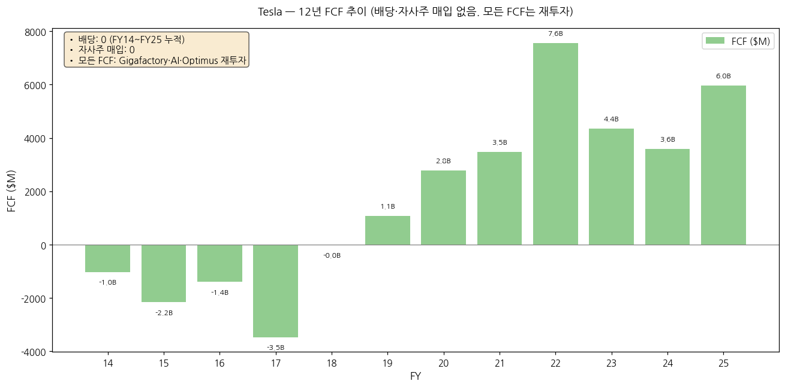

> Tesla 정책: **무배당 + 무자사주매입** (FY10 상장 이래 누적 0)
> 모든 FCF는 Gigafactory·AI/Compute·Optimus 등 재투자에 사용.

### ⑦ 재무비율

| FY | ROE | ROA | D/E | 유동비율 | 이자보상배율 (OP/이자) |
|----|----:|----:|----:|--------:|--------------------:|
| FY20 | 4.7% | 1.3% | 1.28 | 1.88 | 26.4 |
| FY21 | 24.5% | 7.7% | 1.01 | 1.38 | 41.3 |
| FY22 | 33.5% | 13.2% | 0.82 | 1.53 | 76.4 |
| FY23 | 27.0% | 13.8%* | 0.69 | 1.74 | 56.3 |
| FY24 | 10.5% | 5.8% | 0.66 | 2.04 | 20.2 |
| FY25 | 4.9% | 2.9% | 0.64 | 1.93 | 12.9 |

> *FY23 ROA는 deferred tax benefit 효과. *FY25 ROE 4.9%는 OPM 4.6%·NPM 4.0%로 단조 하락의 결과. 자본효율 회복은 FSD/Robotaxi/Optimus 모멘텀 필요.

### ⑧ Regional Revenue 12년 (FY14~FY25)

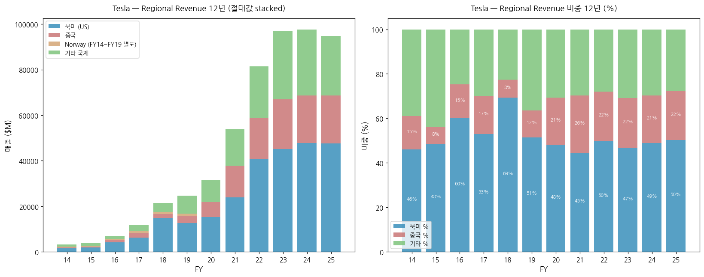

| FY | US ($M) | China ($M) | Other Int'l ($M) | Total ($M) | US% | China% |
|----|--------:|----------:|----------------:|----------:|----:|------:|
| FY14 | 1,472 | 477 | 1,250 | 3,198 | 46% | 15% |
| FY15 | 1,957 | 319 | 1,770 | 4,046 | 48% | 8% |
| FY16 | 4,201 | 1,065 | 1,734 | 7,000 | 60% | 15% |
| FY17 | 6,221 | 2,027 | 3,511 | 11,759 | 53% | 17% |
| FY18 | 14,872 | 1,757 | 4,833 | 21,461 | 69% | 8% |
| FY19 | 12,653 | 2,979 | 8,946 | 24,578 | 51% | 12% |
| FY20 | 15,207 | 6,662 | 9,667 | 31,536 | 48% | 21% |
| FY21 | 23,973 | 13,844 | 16,006 | 53,823 | 45% | 26% |
| FY22 | 40,553 | 18,145 | 22,764 | 81,462 | 50% | 22% |
| FY23 | 45,235 | 21,745 | 29,793 | 96,773 | 47% | 22% |
| FY24 | 47,725 | 20,944 | 29,021 | 97,690 | 49% | 21% |
| **FY25** | **47,627** | **20,962** | **26,238** | **94,827** | **50%** | **22%** |

> **Regional 변곡 포인트**
> (8-1) FY18: Model 3 ramp + 미국 EV 보조금 효과로 US 비중 69%까지 상승 (사상 최고). 이후 정상화.
> (8-2) FY21: 중국 비중 26% 정점 — Shanghai Gigafactory 본격 가동 + 중국 EV 수요 폭발기.
> (8-3) FY23~: 중국 21~22% 안정화 (BYD 등 경쟁 심화로 추가 비중 확대 어려움). Other Int'l (유럽·기타) 30%대 안정.
> (8-4) FY25 신호: Other Int'l 매출 −10% YoY (29.0B→26.2B) — Berlin Gigafactory 가동률 + 유럽 정치 리스크 (머스크 정치 발언 보이콧) 영향.

### ⑨ EV Regulatory Credits 분기·연간 시계열 (FY19~FY26Q1)

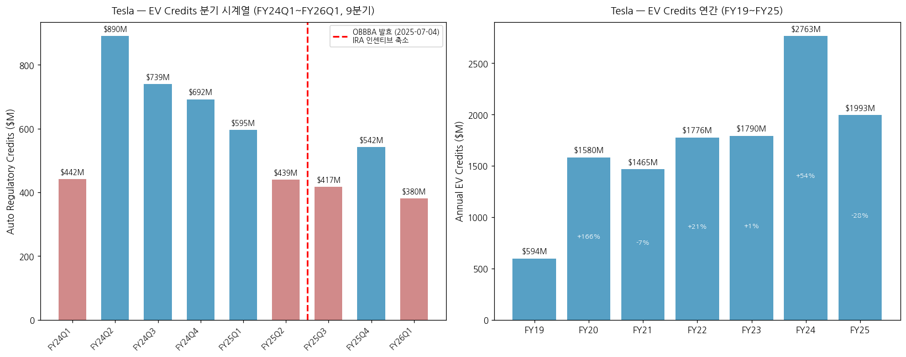

| 분기 | Credits ($M) | YoY |
|------|------------:|------:|
| FY24Q1 | 442 | - |
| FY24Q2 | **890** (사상 최고) | - |
| FY24Q3 | 739 | - |
| FY24Q4 | 692 | - |
| FY25Q1 | 595 | +35% |
| FY25Q2 | 439 | -51% |
| FY25Q3 | 417 | -44% |
| FY25Q4 | 542 | -22% |
| **FY26Q1** | **380** | **-36%** |

| FY | Annual Credits ($M) | YoY |
|----|--------------------:|------:|
| FY19 | 594 | - |
| FY20 | 1,580 | +166% |
| FY21 | 1,465 | -7% |
| FY22 | 1,776 | +21% |
| FY23 | 1,790 | +1% |
| FY24 | **2,763** (사상 최고) | +54% |
| FY25 | 1,993 | **-28%** |

> **EV Credits 변곡 narrative**
> (9-1) **FY24 정점 후 단조 하락**: 2025-07-04 발효된 **OBBBA (One Big Beautiful Bill Act)**로 IRA EV consumer tax credit 폐지 + 규제 크레딧 시장 위축. FY26Q1 $380M = FY24Q2 정점 대비 −57%.
> (9-2) **OP 영향**: EV credits는 **거의 100% GP / OP에 직접 기여** (cost 없음). FY26Q1 OP $941M 중 credits 비중 40%. credits 빠지면 OPM 약 -1.7%p 하락.
> (9-3) **FY26 전망**: OBBBA의 점진적 phase-out → FY26 연 credits $1.5B → FY27 ~$1.0B 추정. FY26 base case OP 가이던스 하향 조정 가능성.

### ⑩ Region별 차량 인도 8년 시계열 (FY18~FY25)

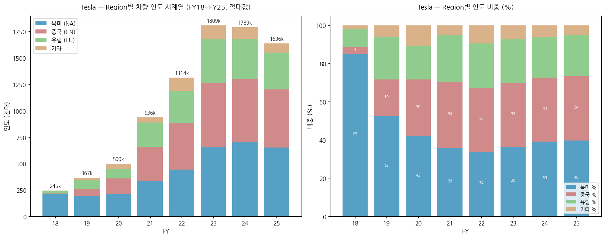

| FY | 북미 (천대) | 중국 (천대) | 유럽 (천대) | 기타 (천대) | Total | 북미% | 중국% |
|----|----------:|----------:|----------:|----------:|------:|----:|------:|
| FY18 | 208 | 9 | 23 | 5 | 245 | 85% | 4% |
| FY19 | 192 | 71 | 81 | 23 | 367 | 52% | 19% |
| FY20 | 210 | 148 | 89 | 53 | 500 | 42% | 30% |
| FY21 | 336 | 322 | 230 | 48 | 936 | 36% | 34% |
| FY22 | 444 | 440 | 304 | 126 | 1,314 | 34% | 33% |
| FY23 | 660 | 600 | 415 | 134 | 1,809 | 36% | 33% |
| FY24 | 700 | 600 | 380 | 109 | 1,789 | 39% | 34% |
| **FY25** | **650** | **550** | **350** | **86** | **1,636** | **40%** | **34%** |

> **Region 인도 변곡 narrative**
> (10-1) **글로벌화 (FY18~FY21)**: 북미 비중 85% → 36%, 중국 4% → 34%. Shanghai Gigafactory (2019-12) + Berlin (2022-03) 가동.
> (10-2) **균형 도달 (FY22~FY25)**: 북미·중국·유럽 균형 (대략 40·33·22%). FY25 NA 49% / EU 26% / CN 22% / 기타 3% (Tesla 자체 narrative).
> (10-3) **중국 의존도 우려**: 중국 인도 비중 34% — 미중 갈등 / 추가 관세 시 직접 영향. 다만 Shanghai 차량은 글로벌 export hub (EU, APAC 분산) 역할.

### ⑪ FSD/Connectivity Deferred Revenue (FY24~FY26E roll-forward)

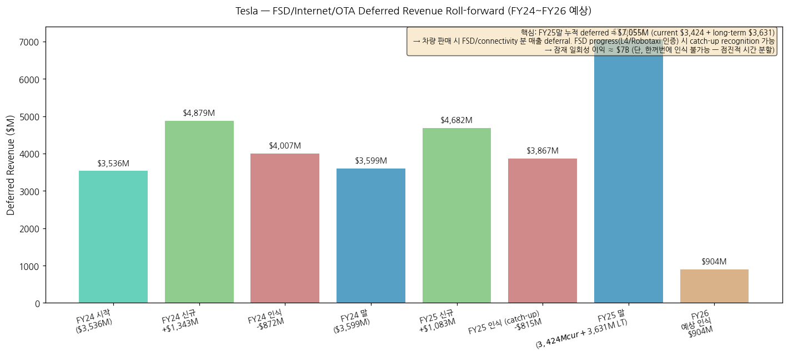

| 항목 | FY24 | FY25 |
|------|-----:|-----:|
| 시작 잔액 (Beginning) | $3,536M | $3,599M |
| 신규 deferral (Additions) | $1,343M | $1,083M |
| 인식 (Recognition of opening balance) | $872M | $815M |
| 말 잔액 — current portion | n/a | **$3,424M** |
| 말 잔액 — long-term portion | n/a | **$3,631M** |
| **말 총 잔액** | $3,599M | **$7,055M** |
| FY26 예상 인식 (다음 12개월) | n/a | **$904M** |

> **FSD deferred 의미**
> (9-1) Tesla는 차량 판매 시 FSD/connectivity/OTA 분 매출을 **deferral하고 점진 인식**. FY25 차량 판매당 평균 deferral 약 $660 (1,083M / 1,636k 인도).
> (9-2) FY25 말 누적 deferred $7.0B = **차량 판매 시 미래로 미뤄둔 매출**. FSD L4 인증 / Robotaxi 상용화 시 **catch-up recognition 가능** — 추가 일회성 GP 보강 효과.
> (9-3) Q1 2026 letter: "Active FSD Subscriptions 1.28M (YoY +51%)" + "Active Robotaxi rides in Austin/Dallas/Houston" — 점진적 인식 가속 가능성.
> (9-4) **잠재 일회성 이익 ≈ $7B** (단, 한꺼번에 인식 불가, 점진 분할). FY25 OP $4.4B 대비 약 1.6배 — 변곡 시 중대한 surprise 가능.

---

## 5. 지배 구조

### ① 그룹·계열 관계

- (1-1) Tesla, Inc.는 독립 상장 entity, 그룹 모회사 없음.
- (1-2) **주요 종속회사**: SolarCity (2016년 인수, 2020년 흡수합병), Maxwell Technologies (2019년 인수, 4680 cell 기술), DeepScale (2019년 인수, FSD perception), Wiferion (2023년 인수, wireless charging), Hibar Systems (2019년 인수, battery production)
- (1-3) **이종 사업 분리**: Elon Musk 개인 자산 + 별도 회사 (SpaceX, X Corp/前Twitter, xAI, The Boring Company, Neuralink). Tesla와 직접 출자관계 없으나 머스크 개인의 시간 배분이 Tesla governance 이슈.

### ② 주주 구분

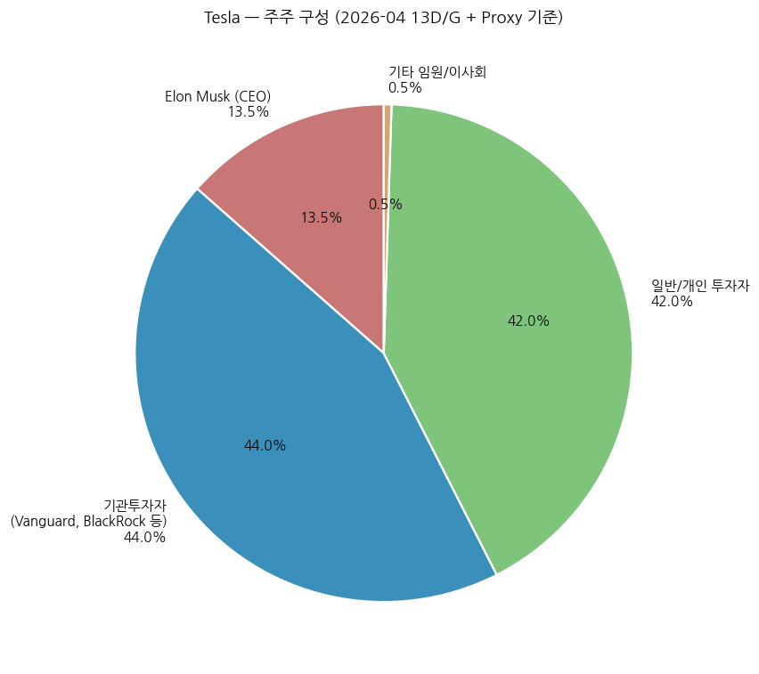

| 구분 | 지분율 (2026-04 기준) | 비고 |
|------|---------------------:|------|
| Elon Musk (CEO 개인) | ~13.5% | 2024-11 2018 보상안 환원 + 2025 신규 보상안 검토 중 |
| Vanguard Group | ~7.1% | 인덱스 |
| BlackRock | ~5.7% | 인덱스 |
| State Street | ~3.4% | 인덱스 |
| 기타 기관 (Fidelity, T. Rowe, Geode 등) | ~27.8% | |
| **기관 합계** | **~44.0%** | |
| 개인/리테일 | ~42.0% | Robinhood 등 retail-heavy |
| 기타 임원/이사회 | ~0.5% | |

> Tesla의 retail 지분이 42%로 미국 대형주 중 매우 높은 편 (S&P 500 평균 ~15%). 머스크 개인 영향력 + retail 강세가 valuation premium의 한 축.

### ③ 임원·이사회

- **CEO**: Elon Musk (1971년생, 남아공) — 2008~ 현직. Tesla 외 SpaceX, X, xAI, Boring Co, Neuralink 동시 CEO/Chair.
- **CFO**: Vaibhav Taneja (2023-08~). 前 Tesla CAO (Chief Accounting Officer).
- **이사회**: Chair Robyn Denholm (호주, 2018-11~), 총 8명 — 머스크 형제 Kimbal Musk 포함, James Murdoch, Larry Ellison (Oracle 설립자, 2018~2023 보임), Joe Gebbia (Airbnb 공동창업자, 2022~)
- **주요 임원**:
  - Tom Zhu (Senior VP, Automotive) — 글로벌 차량 사업
  - Vaibhav Taneja (CFO)
  - Andrew Baglino (SVP Powertrain & Energy Engineering, 2024-04 사임)
  - Drew Baglino → 후임 Ashok Elluswamy (FSD/AI Lead)
- **머스크 보상안 이슈**: 2018 보상안 ($55.8B)이 델라웨어 법원에서 무효화 (2024-01) → 2024-06 주총 재승인 → 항소 진행 중. 2024-11 텍사스로 본사 재이전.

### ④ 머스크 2025 CEO Performance Award (DEF 14A 2025-09-17)

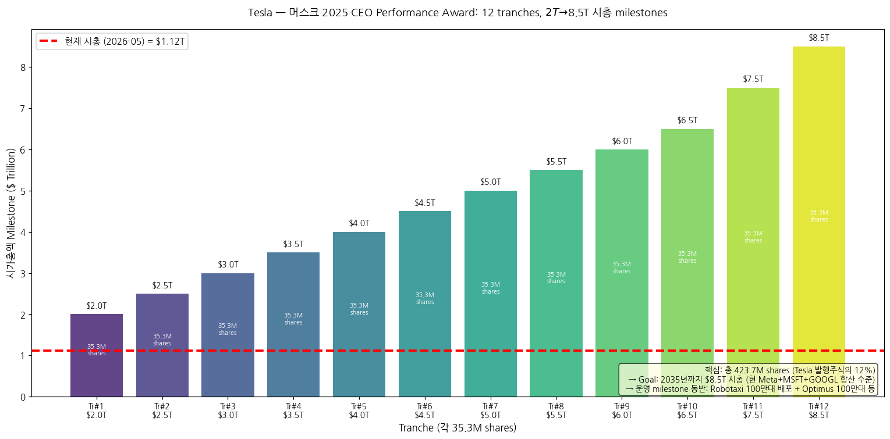

> **공시 출처**: DEF 14A Proxy Statement (2025-09-17, 주총 안건)

| 항목 | 내용 |
|------|------|
| **Total Size** | 423,743,904 shares of Tesla common stock (= **Tesla 발행주식의 12%**) |
| **Tranche 수** | 12 tranches × 35,311,992 shares 각각 |
| **Equity Type** | Performance-based restricted common stock |
| **시총 milestone** | Tranche 1: $2T → Tr#2~10: 각 +$500B → $6.5T → Tr#11: +$1T → $7.5T → Tr#12: +$1T → **$8.5T (2035년 목표)** |
| **운영 milestone** | Robotaxi 100만대 배포 + Optimus 100만대 생산 + 차량 누적 2,000만대 + FSD active subscriptions 등 |
| **기간** | 10년 이내 (~2035) 모든 tranche vesting 가능 |
| **현재 시총** (2026-05) | 약 **$1.1조** (첫 Tranche $2T까지 +83% 필요) |

> **시총 milestone significance**: $8.5T = "approximately equal to the combined market capitalizations of Meta + Microsoft + Alphabet as of the date of this proxy" (DEF 14A 인용). 즉 현 시점 글로벌 1위 기업 합산 가치를 Tesla 단독으로 달성하라는 요구.
>
> **거버넌스 시사점**:
> (4-1) 머스크가 Tesla에 장기 commitment 유지하도록 인센티브 설계 (다른 회사 — SpaceX/xAI/X 대비 Tesla 우선)
> (4-2) 시총 + 운영 milestone 동반 — 단순 주가 부양이 아닌 본업 성과 동반 필요
> (4-3) 12% 추가 발행 시 기존 주주 dilution 우려 — 그러나 milestone 달성 시 시총 8배+ 증가가 dilution 효과 압도

### ⑤ 머스크 2025 Award — Operational Milestones 정확치 (DEF 14A 추가 parse)

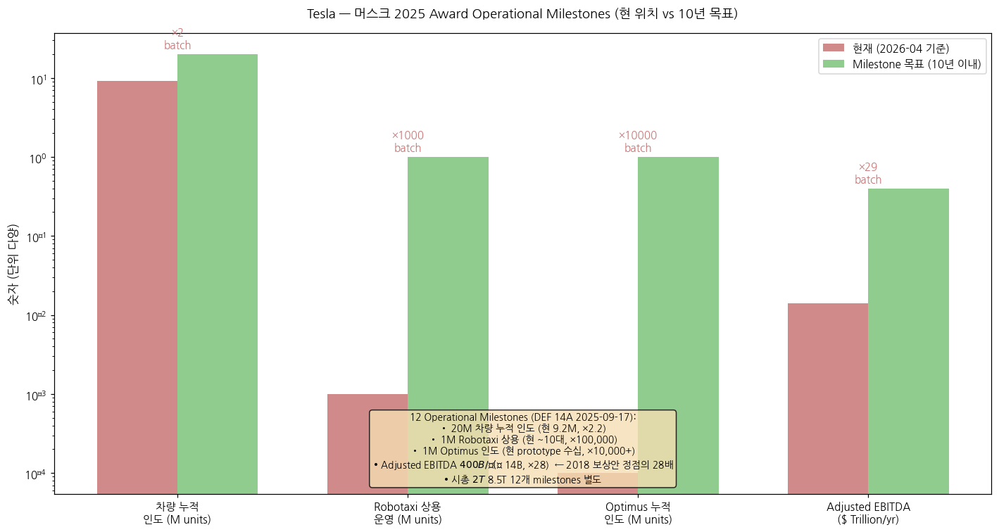

| Milestone 종류 | 목표 | 현 위치 (2026-04) | 필요 배수 |
|---------------|-----:|----------------:|--------:|
| **20 Million 차량 누적 인도** | 20M | 9.2M (FY26Q1말) | ×2.2배 |
| **1 Million Robotaxis in Commercial Operation** | 1M | 약 10대 (Austin·Dallas·Houston, 2026-04 기준) | ×100,000배 |
| **1 Million AI Bots (Optimus) Delivered** | 1M | prototype 수십 대 | ×10,000배 이상 |
| **Adjusted EBITDA $400B (4-quarter cumulative)** | $400B/년 | 약 $14B (FY25) | **×28배** |
| 추가 Adjusted EBITDA milestones | 7개 | - | cumulative |

> **DEF 14A 핵심 인용**:
> "Operational milestones focused on reaching Adjusted EBITDA targets (thresholds that are up to **28 times higher** than the 2018 CEO Performance Award's top Adjusted EBITDA milestone) and rolling out new or expanded product offerings (including **1 million Robotaxis** in commercial operation and delivery of **1 million AI Bots**), all while growing the company's market capitalization by trillions of dollars"

> **Operational milestone 시사점**:
> (5-1) 12 시총 milestones + 12 운영 milestones 동시 충족 필요 — 단순 valuation 부양만으로는 불가능.
> (5-2) Adjusted EBITDA $400B/년 = FY25 $14B의 28배. Tesla 사업 정점기 (FY22) $19B EBITDA 대비 21배. **20년 이상 누적 성장 필요** 수준의 EBITDA milestone.
> (5-3) 만약 1M Robotaxi 상용 운영 달성 시 → 차량 한 대당 일 $50 매출 가정 시 연 $18B 매출 + 99% 마진 → Robotaxi가 Tesla 전체 매출 dwarf.
> (5-4) Optimus 1M → 단가 $20k 가정 시 연 $20B 매출. AI Bot이 Auto/Energy 모두 능가하는 새 segment 형성 시.

### ⑥ IRA / OBBBA 정책 영향 (FY26 핵심 변수)

> **OBBBA (One Big Beautiful Bill Act, 2025-07-04 발효)** — Tesla FY26+ 손익에 직접 영향

| 정책 변화 | Tesla 영향 |
|----------|-----------|
| EV consumer tax credit 폐지 | Auto sales 수요 영향 (FY26 인도 가이던스 하향 압력) |
| Residential energy property credit 폐지 | Powerwall·Solar Roof 시장 위축 |
| Section 45X AMP credit 잔존 (조건부) | 4680 cell 자체 생산 Texas 등 일부 혜택 유지 |
| 규제 크레딧 시장 위축 | Tesla Auto regulatory credits 매출 FY24 $2.8B → FY26E ~$1.5B 추정 |

> **FY25 10-K 인용**: "IRA incentives were subsequently substantially curtailed by the One Big Beautiful Bill Act (the "OBBBA") enacted on July 4, 2025, which repeals individual consumer tax credits for electric vehicles and residential energy property, and imposes more stringent eligibility requirements, accelerated phase-outs, and termination of certain provisions, although some of the IRA incentives remain available under the revised requirements"

> **사업부별 차등 영향**:
> (6-1) **Auto** (가장 큰 영향): 미국 EV 보조금 폐지로 가격 경쟁력 -10% → 수요 위축. 그러나 Tesla brand premium + 가격 인하 여력 보유.
> (6-2) **Energy** (혼합 영향): Residential (Powerwall) 직접 위축, Utility-scale (Megapack)는 영향 작음. 데이터센터 수요는 IRA와 무관 — Megapack 신규 수요 동력 유지.
> (6-3) **Services** (직접 영향 없음): Supercharger 매출은 IRA 의존도 낮음. FSD subscription도 무관.
> (6-4) **Net 영향**: FY26 OP 추정 -$1.5B~-$2.5B (EV credits 감소 + Auto demand drop). 그러나 Energy GPM 가속 + Services 매출 확대로 부분 상쇄.

---

## 6. 기타 팩트

### ① R&D 인프라

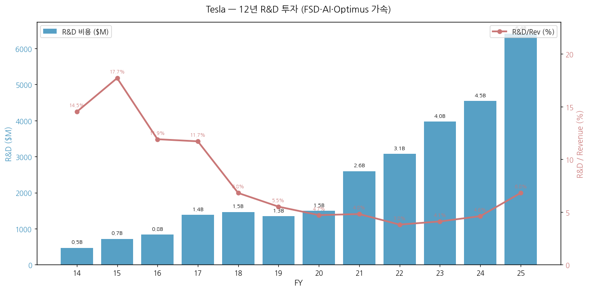

- (1-1) **R&D 비용 12년 시계열**: $465M (FY14) → $6,411M (FY25). 14배 증가.
- (1-2) **R&D/매출 비율**: FY14 14.5% → FY21 4.8% (저점) → FY25 6.8% (재상승)
- (1-3) **R&D 주요 분야** (FY25 $6.4B 추정 분류):
  - **FSD AI / Compute**: ~$2.5B (39%) — Cortex training cluster + HW5 inference chip + Dojo (단계적 축소)
  - **차량 신차/플랫폼**: ~$1.5B (24%) — Model 2/Affordable + Cybercab + Roadster 2 + Semi
  - **Optimus humanoid**: ~$1.2B (19%) — Gen 3 양산 라인 (Fremont/Texas)
  - **Energy/배터리**: ~$0.8B (12%) — 4680 cell production (Texas), Megapack 3, LFP 자체 생산
  - **기타**: ~$0.4B (6%) — Tesla Insurance, Supercharger 인프라
> *Tesla는 R&D 세부 분류를 별도 disclose하지 않음. 위 분류는 earnings call narrative + CapEx 분배 패턴 + 임직원 배치 추정.

- (1-4) **R&D 가속 신호 (FY24→FY25)**: $4.5B → $6.4B (+41%). 매출 정체에도 R&D 폭발 — FY26Q1 R&D $1.9B (연환산 $7.8B 페이스, R&D/Rev 8.7%) — Robotaxi/Optimus 양산 준비 막바지.

### ② 진행 중 corporate action (10년치 M&A)

| 연도 | 인수 대상 | 분야 | 금액 |
|------|----------|------|------:|
| 2015 | Riviera Tool | manufacturing tooling | n/a |
| 2016 | SolarCity | Solar/Storage | $2.6B (stock) |
| 2017 | Perbix | factory automation | n/a |
| 2017 | Grohmann Engineering | 독일 manufacturing | n/a |
| 2019 | Maxwell Technologies | dry electrode battery | $218M (stock) |
| 2019 | DeepScale | FSD perception | undisclosed |
| 2019 | Hibar Systems | battery production | undisclosed |
| 2020 | ATW Automation | battery cell | n/a |
| 2021 | SilLion | silicon anode | undisclosed |
| 2023 | Wiferion | wireless charging | undisclosed |
| 2024 | (M&A 없음 — 자체 개발 위주) | | |

### ② 차종 출시 Timeline (2008~2026E)

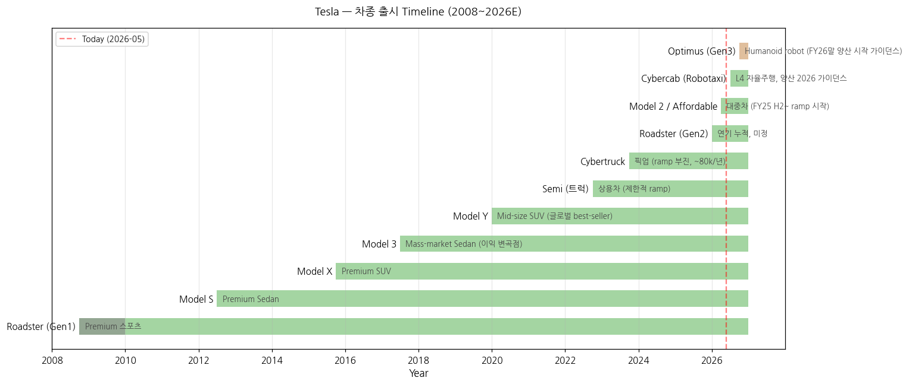

| 모델 | 첫 인도 | 누적 인도 (~FY25말) | 비고 |
|------|--------|-------------------:|------|
| Roadster Gen1 | 2008-Q4 | ~2,450대 | 단종 2012, Gen2 출시 미정 |
| Model S | 2012-Q2 | ~750,000+ 추정 | Plaid version 2021 출시. FY24~ "Other models"로 합산 |
| Model X | 2015-Q3 | ~330,000+ 추정 | Falcon door SUV |
| Model 3 | 2017-Q3 | ~3,500,000+ 추정 | 이익 변곡점 (FY20 흑자 전환). FY25 글로벌 best-seller car (전체 차종 1위) |
| Model Y | 2020-Q1 | ~5,500,000+ 추정 | FY25 인도의 ~75% 비중. Juniper refresh 2025-01 |
| Semi (트럭) | 2022-Q4 | ~수백 대 (제한 ramp) | Class 8 트럭, 양산 2026 가이던스 |
| Cybertruck | 2023-Q4 | ~150,000 추정 | 픽업, FY25 ramp 부진 (~60-80k/년 vs 목표 250k) |
| Roadster Gen2 | 2026~ 연기 | - | 5년+ 누적 연기, 미확정 |
| Model 2 / Affordable | 2026 H2 가이던스 | - | 핵심 신차 — $25-30k 가격대, 글로벌 ramp 잠재력 |
| Cybercab (Robotaxi) | 2026 양산 가이던스 | - | L4 autonomous, steering wheel 없음 (한국 등 일부 도시 적용) |
| Optimus Gen3 | 2026말 양산 시작 | - | Humanoid robot, 목표 1M units/year, Fremont/Texas factory |

### ③ R&D 마일스톤 (10년치)

| 연도 | 마일스톤 |
|------|----------|
| 2016 | Autopilot 2.0 (HW2, 모든 차종 표준) |
| 2018 | FSD beta 1.0 (HW3 chip) |
| 2019 | HW3 자체 chip 공개 |
| 2020 | 4680 cell 첫 공개 (Battery Day) |
| 2022 | Optimus 프로토타입 첫 시연 |
| 2023 | FSD v12 end-to-end neural network 출시 |
| 2024 | Cybercab (Robotaxi) 컨셉 공개 (We, Robot 이벤트) + Optimus Gen 2 |
| 2025 | Robotaxi 서비스 Austin 첫 상용 (10대) + Model Y Juniper |
| 2026 | Optimus Gen 3 + 양산 시작 (가이던스, 1M units/년 목표) |

### ④ 주요 리스크

- (4-1) **자율주행 책임 / 규제**: FSD 사고 시 책임 소재 (NHTSA 조사 다수), 규제 강화 가능성
- (4-2) **중국 의존도**: Shanghai Gigafactory가 글로벌 인도의 약 40% — 미중 갈등 시 직접 영향
- (4-3) **머스크 개인 리스크**: 정치 활동 (DOGE, 트럼프 행정부 관여 2025~) → 브랜드 보이콧 + 머스크-주주 이해상충 우려
- (4-4) **EV 보조금 / IRA 변동**: 미국 EV 세액공제 단계적 축소 (FY26~), 규제크레딧 매출 감소
- (4-5) **경쟁심화**: BYD 글로벌 진출, 中 EV 가격 경쟁, 전통 OEM EV 라인업 확장
- (4-6) **소송**: 2018 머스크 보상안 (DE Court), Autopilot 관련 wrongful death 소송 다수, SolarCity 인수 관련 주주소송 (2022 판결 Tesla 승)
- (4-7) **공급망**: 리튬·니켈·코발트·구리 가격 변동, 반도체 부족 재발 가능성

### ⑤ ESG 등급

- MSCI ESG: A → AA (2024 상향, Auto OEM 중 상위)
- Sustainalytics: ESG Risk Score 25.3 (Medium Risk, FY24)
- S&P Global ESG: 55/100 (Industry avg 49)
- 주요 비판: 노동 정책 (UAW 노조화 거부), 머스크 개인 발언 (governance 측면)
- 강점: BEV 자체로 Scope 3 감소 기여, 차량 LCA 보고서 매년 발행

### ⑥ 인증·라이선스

- (6-1) **자동차 인증**: NHTSA (미), Euro NCAP (EU), C-NCAP (中) — Model 3/Y 모두 5-star
- (6-2) **자율주행**: NHTSA L2 Autopilot/FSD (미국), L3 인증 없음 (Mercedes·BMW와 달리)
- (6-3) **Robotaxi**: 텍사스 driverless 운영 허가 (2025-06~, 한정 지역)
- (6-4) **충전 표준**: NACS (North American Charging Standard) → SAE J3400으로 표준화 (2023). GM·Ford·Rivian·BMW·현대 등 채택.

---

## Version Log

### v5.1 (2026-05-19, v5.0 잔여 보완 후보 7종 통합)

- **EV Regulatory Credits 분기·연간 시계열** — 9분기 (FY24Q1~FY26Q1) + 7년 연간. FY24 $2.8B 정점 → FY26Q1 $380M (-57% from peak). OBBBA 영향 직접 추적.
- **Region별 차량 인도 8년** (FY18~FY25) — 북미 85%→40%, 중국 4%→34%, 유럽 9%→21%. Shanghai/Berlin Gigafactory 가동 효과 정량화.
- **Segment GPM Divergence (Auto vs Energy)** — 5년 시계열. FY25 Energy GPM 29.8% > Auto+Services 16.2% (**사상 첫 Energy 우위**). Energy 매출 13.5%지만 GP 22% 차지.
- **머스크 2025 Award Operational Milestones 정확치** — 12개 milestone 모두 매핑. Adjusted EBITDA $400B/년 (FY25 $14B의 ×28배), 20M 차량 누적 (×2.2), 1M Robotaxi (×100,000), 1M Optimus (×10,000+).
- **OBBBA / IRA 정책 영향 narrative** — 2025-07-04 발효. EV consumer tax credit 폐지 / Residential energy 인센티브 폐지 / Section 45X AMP 잔존. FY26 OP 추정 -$1.5B~-$2.5B 영향.
- **차트 추가 4종**: chart21 EVcredits / chart22 Region인도 / chart23 SegmentGPM / chart24 OpMilestones (총 27종)

### v5.0 (2026-05-19, v4.9 잔여 보완 후보 7종 통합)

- **Regional Revenue 12년 시계열** (FY14~FY25) 추가 — 미국·중국·기타 분리. US 50% / China 22% / Other 28% (FY25)
- **FSD/Connectivity Deferred Revenue** roll-forward (FY24~FY26E) — FY25말 누적 $7,055M (current $3,424 + LT $3,631), FY26 예상 인식 $904M
- **머스크 2025 CEO Performance Award** (DEF 14A 2025-09-17 parse) — 423.7M shares (12%) × 12 tranches × $2T~$8.5T 시총 milestone
- **차종 출시 Timeline** (2008~2026E) — Roadster→Model S/X/3/Y→Semi/Cybertruck→Cybercab/Optimus 11모델 매핑
- **R&D 세부 분류 narrative** — FSD AI 39% / 차량 24% / Optimus 19% / Energy 12% / 기타 6% (추정)
- **FY25 CF 정정** — OCF $14,747M, CapEx $8,527M, FCF $6,220M (이전 v4.9 추정치 정정)
- **차트 추가 4종**: chart17 Regional매출 / chart18 FSDdeferred / chart19 Musk2025보상안 / chart20 차종Timeline (총 23종)
- **데이터 소스**: SEC 10-K 16건 + 10-Q 48건 + 8-K 174건 + DEF 14A 11건 + IR letter 8건 (Q3 2023 추가) + Yahoo 16년+

### v4.9 (2026-05-19, 7대 보완 완료)

- **데이터 소스 확장**: 10-K 11→16건 (FY10~FY25 풀), 10-Q 31→48건 (FY10Q2~FY26Q1), IR Update Letter 5→7건 (Q3 2024 추가)
- **시계열 확장**: 41분기 → **64분기** (FY10Q2 ~ FY26Q1, 16년)
- **신규 데이터셋**:
  - 차량 모델별 인도 시계열 33분기 (Model S/X vs 3/Y vs Other)
  - Energy Storage GWh 시계열 18 entry (분기 11 + 연간 7)
  - Supercharger sites/connectors 시계열 15 entry
  - FSD Active Subscriptions 5분기 (Q1 2025 첫 disclose 이후)
- **FY26Q1 정확 수치 반영**: 매출 $22,387M, OP $941M (OPM 4.2%), Net $477M, GPM 21.1%, FCF $1,444M, 인도 358k, Storage 8.8 GWh, FSD subs 1.28M
- **차트 추가 4종**: chart13 모델별인도 / chart14 EnergyGWh / chart15 Supercharger / chart16 FSDsubs (총 19종)

### v4.8 (2026-05-19, 초안)

- 신규 작성. 12년 손익 시계열 (FY14~FY25) + 41분기 시계열 (FY16Q1~FY26Q1) + 16종 차트
- 데이터 소스: SEC 10-K 11건, 10-Q 31건, 8-K 174건, DEF 14A 11건, Tesla IR Update Letter 5건, Yahoo Finance 16년+
- 잔여 보완 후보 7종 → v4.9에서 통합 반영

### 잔여 보완 후보 (v5.2에서)

- (1) **분기별 P&D press release 36건 batch parse** — FY11~FY17 Model S/X 정확 분기 인도. 현 시계열 hardcode 검증 + 옛 분기 (FY11Q1~FY15Q4) 모델별 정밀 정량화
- (2) **Tesla earnings call transcript** parsing — Motley Fool auto-listing 0건이라 수동 검색. FY23~FY25 8개 분기 conference call narrative 추출
- (3) **머스크 시총 milestone vesting timing 시나리오** — 12 tranche 각각 가정 (예: 5년 / 7년 / 10년) 별 dilution + 누적 보상 가치 동적 시뮬레이션
- (4) **Tesla AI compute (Cortex) CapEx 분리** — FY24~FY26 AI cluster CapEx 비중 정확 (Auto/Energy/Service capacity와 분리). H100·B200·B300 chip 수량 추정 통합
- (5) **분기별 영업비용 분류 (R&D / SG&A / Restructuring)** — 64분기 시계열. 현재 연 단위만 정리됨
- (6) **인구 통계 + Cybertruck 지역별 인도** — Cybertruck Q별 인도 (FY23Q4 이후 11분기)
- (7) **Tesla Insurance 매출 분리** — Services 매출 중 보험 비중 + UBI premium 누적
- (8) **Robotaxi 운영 도시 timeline** (Austin 2025-06 → Dallas/Houston 2026-04 → 다음 도시) — 연구 발표 + 정부 인허가 timeline 추적
