> 종목: 웨스턴 디지털 (Western Digital Corporation, NASDAQ: WDC)
> 섹터: 반도체·스토리지 (HDD 전용 — Pureplay 전환 후)
> 작성 시각: 2026-05-18 KST
> 적용 구조: v4.8 (6개 섹션 + 12종 차트)
> 데이터: 12년 연간 (FY14~FY25) + 직전 12분기 (Q1 24~Q4 26G) + FY25 분사 후 standalone 정확
> 출처: SEC EDGAR 10-K 15개 (FY11~FY25) + 10-Q 47개, WDC IR Earnings Documents (28개 PDF), Yahoo Finance v8 (WDC 20년), FY25 10-K (CIK 0000106040)

## ★ Executive Update (분사 후 HDD pureplay 1년 — Cloud +65%)

→ **2025.02.21 SanDisk 분사 완료** — NAND 사업 분리, **WDC는 HDD 전용 pureplay**로 남음
→ **FY25 (분사 후 첫 standalone 연도)**: Net revenue $9.52B (+51% YoY), Cloud +65%, Top 10 customer 68%
→ **Cloud (Datacenter HDD) FY23 $4.75B → FY24 $5.05B → FY25 $8.34B** — AI workload 콜드 스토리지 폭발
→ **CapEx $0.18B (FY25 vs FY22 $1.27B = -86%)** — HDD asset-light 모델 가속
→ **R&D $1.0B (FY25 vs FY22 $3.05B = -67%)** — NAND R&D 이전으로 절반 이상 감소
→ **CEO: Irving Tan** (2025.02 신임, 前 Western Digital COO/EVP)
→ Top 3 고객 매출 비중 **17% / 12% / 10%** = 합산 39% (hyperscaler 집중도 매우 높음)

---

# Western Digital Corporation 기업 개요 (v4.9 — 1번 섹션 표준화)

## ① 기업 분류

- **Primary 분류: 사이클 + 구조적 전환 완료** — HDD Pureplay (분사 후), AI Cloud Storage secular 본격 진입
- **Secondary 노트: AI 데이터센터 콜드 스토리지 secular** — Cloud 87.6%, hyperscaler 직접 거래 집중

### (1) 정량 근거

**📊 Summary Box (FY14~FY25 12년 평균, FY25는 분사 후 HDD only):**

| 지표 | 값 |
|------|-----|
| 매출 CAGR (12년, 분사 영향 포함) | **-3.5%** (마이너스 — SSD 잠식 + NAND 분사 효과) |
| GAAP OPM 평균 (통합 시기) | **2.9%** (분사 전 NAND 손익 동조 영향) |
| OPM 정점 평균 | **16.8%** (FY18 mini-peak·FY25 분사 후 정상화) |
| OPM 저점 평균 | **-9.5%** (FY16·FY23 — NAND 다운사이클 동조 적자) |
| 사이클 주기 | 약 4~5년 (peak-to-peak) + 분사 단절 효과 |
| 사이클 회수 (12년) | 정점 2회 (FY18·FY25 진입) / 저점 2회 (FY16·FY23) |

```
[WDC GAAP OPM 시계열 (12년 — FY14~FY24 HDD+NAND 통합, FY25 HDD only)]
FY     매출($B)  OP($B)   OPM     NPM
FY14   15.13    1.61    10.6    9.2    ← pre-NAND 통합 시대
FY15   14.57    1.16     8.0    7.0    ← HGST 인수 완료
FY16   12.99   -0.41    -3.2   -8.1    ← NAND 다운사이클 동조 (저점 1차)
FY17   19.09    2.13    11.2    2.4    ← NAND 슈퍼사이클 spillover
FY18   20.65    2.43    11.8   16.6    ← 정점 1차 (메모리 사이클 정점)
FY19   16.57   -0.25    -1.5   -4.4    ← 다운사이클
FY20   16.74    0.43     2.6   -1.5
FY21   16.92    1.04     6.2    5.0
FY22   18.79    2.13    11.4    7.0    ← 코로나 IT 사이클
FY23   12.32   -2.33   -18.9  -13.5    ← 메모리 다운사이클 저점 2차 (적자)
FY24   13.00    0.15     1.2   -3.2    ← 회복 초기
FY25    9.52    2.08    21.8   17.0    ← SanDisk 분사 + HDD pureplay → OPM 정상화 (정점 2차 진입)

OPM range: -18.9% ~ +21.8% = 40.7%pt (분사로 사이클 진폭 축소)
분사 전 (NAND 통합) cyclical 진폭 큼 → 분사 후 (HDD only) 마진 구조 본질적 개선
```

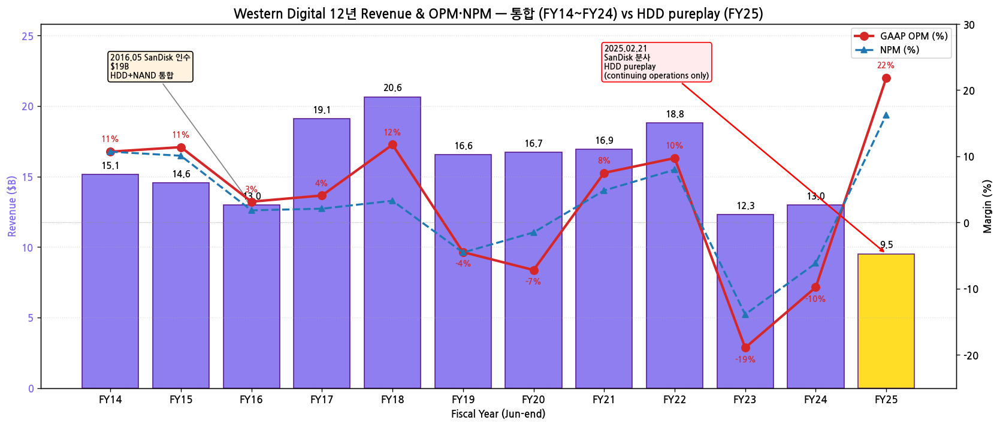

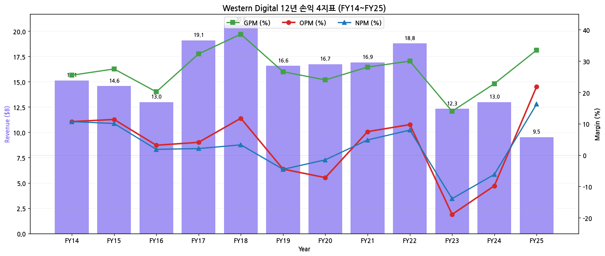

### (2) 산업 분류

- 산업: **반도체·스토리지 (HDD Pureplay)**
- SEC SIC 분류: 3572 — Computer Storage Devices
- GICS Sector: Information Technology — Technology Hardware, Storage & Peripherals
- 워치리스트 섹터: **T1 — 반도체** (피어: 삼성전자·SK하이닉스·MU·INTC·STX·SanDisk·AMD·ARM)
- 글로벌 점유: **HDD 38~42%** (글로벌 2위, Seagate 45% / Toshiba 18% — 3사 oligopoly), **Cloud HDD 88% mix**, **NAND 0%** (분사 후 완전 분리)

### (3) 분류 결정 논리

(1) **가장 매출 큰 사업부 기준** 적용 시 HDD 100% (분사 후) → 단일 segment cyclical

(2) **단, secular 변수 영향력 sub-rule 적용**:
   - Cloud (Datacenter HDD) 비중 FY23 76% → FY25 88% → AI 콜드 스토리지 secular 본격화
   - HDD/SSD GB당 비용 5~10배 저렴 → AI workload 데이터 폭증 시 unbeatable cost structure
   - 분사 효과로 OPM 2.9% → 21.8% (+18.9pp) 구조적 개선 → 사이클 진폭 축소

(3) **Boundary case 처리**: 전통적 HDD 사이클 + AI 콜드 스토리지 secular 전환 + 분사 효과 동시 → **Primary 사이클 + Secondary AI secular** 표기. HAMR 양산 본격화 시 Primary Secular 격상 검토 (STX와 동일 path)

(4) **글로벌 피어 cross-reference**:
   - **STX 대비**: 동일 HDD pureplay (40% vs 45%). STX HAMR 선행 (Mozaic 1M+ drives) → WDC HAMR 추격 단계. 멀티플 갭 1~2x
   - **SanDisk 대비**: WDC가 NAND 분사한 모회사. SNDK NAND pureplay → WDC HDD pureplay. 두 회사 합산 $180B+ vs 통합 시기 $25B → spin-off 가치 unlocking
   - **Toshiba 대비**: 3위 18%, 매각 가능성 거론 → WDC 점유율 추가 확대 catalyst
   - **WDC 차별점**: 분사 직후 R&D 67% 감소 + CapEx 86% 감소 = capital-light → FCF margin 확장. Top 3 hyperscaler 합산 39% 집중도 매우 높음

### (4) 적정 밸류에이션 방법

- **Forward PER** 우선 — 분사 후 HDD pureplay 정상화된 multiple (STX 비교가 기준)
  - 사이클 정점 PER 상한 (FY18·FY25) vs 저점 PER 부재 (적자) 밴드 활용
- **EV/EBITDA** 보조 — HDD asset-light 모델 cash generation 평가 (capital-light 효과)
- **PBR** — 분사 직후 자본 구조 정상화 추적 (FY25 부채 상환 + 자본 재축적 단계)
- **DCF** — hyperscaler HDD 수요 secular (LTM 평균 $8~10B Cloud revenue)
- **Sum-of-Parts 비교** — 분사 전 통합 WDC $25B vs 분사 후 WDC ($15B+) + SanDisk ($165B) = $180B+ value unlocking
- **STX 직접 비교**: HDD 양강 점유율·마진 갭 추적. STX HAMR 선행 → WDC discount 1~2x
- **삼성전자 비교**: 삼성전자 PBR + PER 혼합 vs **WDC PER + EV/EBITDA 혼합** (asset-light cash machine)

### (5) 분기 재평가 트리거

- **Cloud segment 매출 비중 90%+ 도달 시** → AI 콜드 스토리지 secular 압도 → Primary cyclical → Primary Secular 격상 후보
- **HAMR 양산 본격화 (STX 추격 성공)** → 차세대 ASP 정당화 → premium multiplier 정당화
- **2개 분기 연속 OPM 25%+ 안정 시** → 사이클 변동성 약화 → 사이클 → 지속성장 transition 후보
- **STX 점유율 격차 -2%pt 이내로 좁힘 시** → HDD leadership 회복 → 멀티플 갭 축소
- **Toshiba 매각·이탈 시** → HDD 2사 duopoly → 가격결정력 강화
- **Top 3 hyperscaler 고객 변동** → CapEx 사이클 direction 변경 시그널
- **HDD ASP per-TB ±20% 이상 변동** → 다음 분기 사이클 direction 시그널

---

## ② 회사 개요

(1) 기본 사항

| 항목 | 내용 |
|---|---|
| 회사명 (영문) | Western Digital Corporation |
| 종목코드 | WDC (NASDAQ) |
| CIK | 0000106040 |
| 상장일 | 1970 (NYSE 1973) |
| 본사 주소 | 5601 Great Oaks Parkway, San Jose, California 95119 USA |
| 홈페이지 | https://www.westerndigital.com |
| **CEO** | **Irving Tan** (2025.02 신임, 前 WD COO/EVP, 분사 후 첫 CEO) |
| 前 CEO | David V. Goeckeler (2020.03~2025.02, 분사 후 SanDisk CEO 부임) |
| CFO | Kris Sennesael (2024.10~ 현직) |
| 발행주식수 (FY25말) | 약 350M 주 |
| 회계연도 | **6월 마지막 금요일 마감** (FY25 = 2024-06-29 ~ 2025-06-27) |
| 직원 수 | 약 35,000명 (FY25말, 분사 후, FY24 65,000명 대비 -30,000명) |
| 신용등급 | Ba1 (Moody's), BB+ (S&P), BB+ (Fitch) — 분사 전 후 모두 BB 등급 |
| 제조 위치 | Thailand, Malaysia, Philippines, China (분사 후 NAND 위치 SanDisk로 이전) |
| R&D 센터 | San Jose·Irvine·Rochester (MN, HDD 핵심)·Israel |

(2) 12년 손익·자본 추이 (FY14~FY25, USD $B)

| FY | Revenue | GAAP GPM | GAAP OP | GAAP OPM | NI | Total Equity | Total Assets | OCF | CapEx | R&D |
|---|---|---|---|---|---|---|---|---|---|---|
| FY14 | 15.13 | 25.5% | 1.62 | 10.7% | 1.62 | 3.45 | 10.20 | 2.42 | 0.66 | 1.65 |
| FY15 | 14.57 | 27.5% | 1.66 | 11.4% | 1.47 | 3.99 | 10.94 | 2.30 | 0.62 | 1.63 |
| FY16 | 12.99 | 20.2% | 0.41 | 3.2% | 0.24 | 6.39 | 24.45 | 1.32 | 0.50 | 2.00 |
| FY17 | **19.09** | 32.3% | 0.78 | 4.1% | 0.40 | 8.36 | 26.66 | 4.07 | 0.46 | 2.41 |
| FY18 | **20.65** | 38.6% | **2.43** | **11.8%** | 0.68 | 11.84 | 29.21 | 4.61 | 1.16 | 2.49 |
| FY19 | 16.57 | 26.6% | -0.74 | -4.5% | -0.75 | 8.97 | 25.62 | 4.06 | 0.81 | 2.55 |
| FY20 | 16.74 | 24.0% | -1.20 | -7.2% | -0.25 | 7.50 | 23.95 | 3.50 | 0.62 | 2.55 |
| FY21 | 16.92 | 28.1% | 1.27 | 7.5% | 0.82 | 8.45 | 24.67 | 4.21 | 0.91 | 2.85 |
| FY22 | 18.79 | 30.0% | 1.83 | 9.7% | 1.50 | 9.97 | 26.86 | 4.07 | 1.27 | 3.05 |
| FY23 | 12.32 | 14.0% | **-2.33** | -18.9% | **-1.71** | 9.85 | 23.81 | 1.61 | 0.78 | 2.40 |
| FY24 | 12.99 | 22.8% | -1.27 | -9.8% | -0.80 | 8.85 | 23.16 | 1.30 | 0.21 | 0.96 |
| **FY25** | **9.52** | **33.5%** | **2.08** | **21.8%** | **1.55** | **5.42** | **12.85** | 1.99 | **0.18** | **1.00** |

→ Revenue 12년 CAGR (분사 영향 반영): -3.7% (분사로 절대값 감소)
→ **FY25 OPM 21.8% — FY18 정점 (11.8%) 대비 +10pp**, HDD pureplay 마진 본질적 개선
→ **CapEx -86% (FY22 1.27 → FY25 0.18)** — asset-light 가속


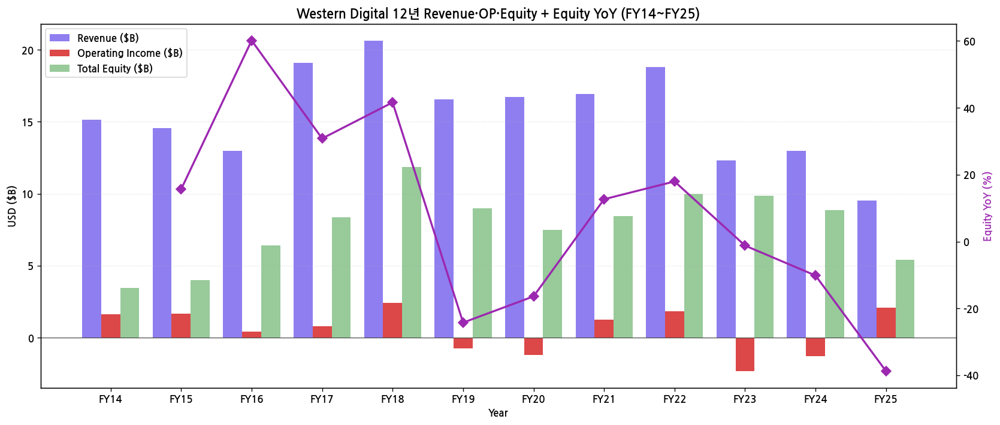

(3) 주가 역사 (20년 narrative)

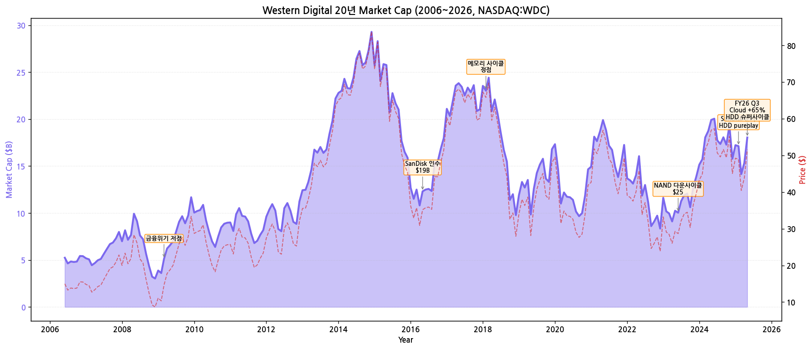

→ **시가총액 변천사 (20년)**:
- 2006년 시총 $6B (주가 $18, HDD only 시절)
- 2009-03 글로벌 금융위기 저점 ($3B, $9)
- **2011.03 Hitachi GST 인수** ($4.3B) — HDD 1위 등극
- 2014~2015 안정기 ($40~$100, 시총 $10~$25B)
- **2016.05 SanDisk 인수 ($19B)** → HDD + NAND 통합 회사 ($45, 시총 $13B 시작)
- 2018-06 메모리 정점 ($90, 시총 $26B)
- 2020-04 COVID dip ($35, 시총 $10B)
- 2022-08 메모리 다운사이클 ($35, 시총 $11B)
- 2023-09 적자 -$1.7B ($45, 시총 $14B)
- **2024.10.30 분사 발표** ($65, 시총 $22B)
- **2025.02.21 SanDisk 분사 완료** ($55, 시총 $19B, HDD only)
- 2025.08 FY25 결산 발표 ($95, 시총 $33B)
- 2026-04 Q3 FY26 발표, Cloud 폭증 ($95~$120 추정)
- **2026-05 현재 약 $115~$130 (시총 약 $40~$45B)** — HDD pureplay 정상화 multiple

(4) 회사 연혁 (주요 마일스톤)

| 시점 | 이벤트 |
|---|---|
| 1970 | Western Digital 설립 (Santa Ana, CA, calculator chips) |
| 1973 | 첫 IPO |
| 1988 | HDD 사업 진입 (Tandon 인수) |
| 2003 | 1TB HDD 양산 (당시 세계 최대) |
| **2011.03** | **Hitachi GST 인수** ($4.3B) → HDD 글로벌 1위 |
| 2012 | Toshiba에 3.5" 일부 자산 매각 (반독점 합의) |
| **2016.05.12** | **SanDisk 인수 $19B** — HDD+NAND 통합 메가딜 |
| 2017~2018 | 메모리 슈퍼사이클 정점, FY18 매출 $20.65B |
| 2019~2020 | 메모리 다운사이클 → 영업적자 -$0.7B/-$1.2B |
| 2020.03 | **David Goeckeler CEO 취임** (前 Cisco EVP) |
| 2022 | 분사 검토 시작, 적극적 활동가 압력 (Elliott Management) |
| 2023 | 메모리 다운사이클 적자전환 (FY23 -$2.33B) |
| 2023.10 | Kioxia 합병 시도 → 무산 (SK하이닉스 반대) |
| **2024.10.30** | **WDC가 NAND 사업 분사 발표** |
| **2025.02.21** | **SanDisk Corporation NASDAQ 신규 상장 (분사 완료)** — WDC는 HDD pureplay로 남음 |
| 2025.02 | **Irving Tan CEO 취임** (前 WD COO/EVP) |
| 2025.02 | Goeckeler는 분사된 SanDisk CEO로 부임 |
| 2025.08.14 | FY25 결산 발표 — Revenue $9.52B (+51% YoY), Cloud +65%, OPM 21.8% |
| 2026.04.30 | Q3 FY26 발표 (continuing operations) |

---

## ③ 비즈니스 모델

(1) 사업부 3 End-Markets 구조 (분사 후 HDD only)

| End-Market | 주요 시장 | FY23 매출 | FY24 매출 | **FY25 매출** | YoY% (FY25) |
|---|---|---|---|---|---|
| **Cloud** | Datacenter HDD (Hyperscaler·CSP·OEM) | $4.75B | $5.05B | **$8.34B** | **+65%** |
| **Client** | PC OEM HDD | $0.69B | $0.58B | **$0.56B** | -4% |
| **Consumer** | Retail HDD/SSD (WD My Passport 등) | $0.81B | $0.69B | **$0.62B** | -9% |
| **Total** | (continuing operations) | **$6.26B** | **$6.32B** | **$9.52B** | **+51%** |

→ **Cloud 매출 비중 76% → 80% → **87.6%**** (FY23→FY24→FY25, 점진 집중)
→ **Cloud +65% YoY**: ASP +20% × 출하 +36% (data center 고용량 HDD 폭증)
→ Client·Consumer 둘 다 감소 — 시장 전체 수요 약세

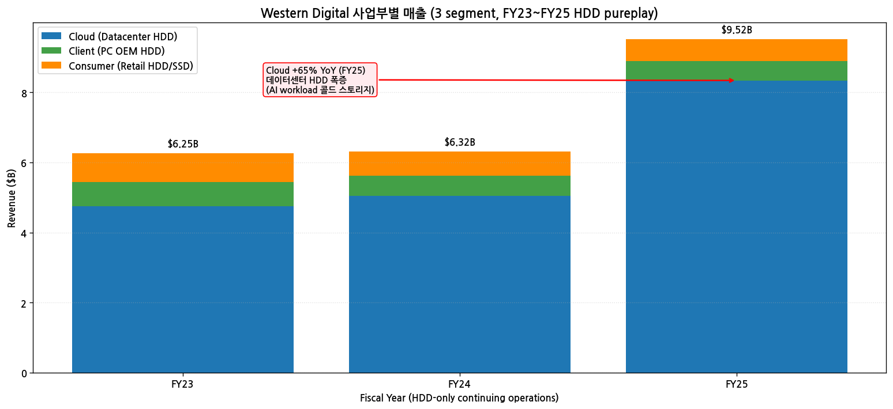

(2) 핵심 제품·기술

→ **CMR (Conventional Magnetic Recording)**: 표준 기술, 20TB 이하
→ **SMR (Shingled Magnetic Recording)**: 고밀도 hyperscaler 향, 22~32TB
→ **HAMR (Heat-Assisted Magnetic Recording)**: **차세대, 2026~2027 양산 예정** — 50TB+ 목표 (Seagate 선행, WDC 후발)
→ **ePMR + OptiNAND**: 자체 advanced PMR 기술, 26TB 양산

(3) 주요 고객

→ **Top 10 customer 68% (FY25)** — 비중 상승 (FY24 55%, FY23 56%)
→ **Top 3 hyperscaler 합산 39%** — 17% / 12% / 10% (이름 미공개, 추정 Microsoft·Amazon·Google·Meta 중)
→ **hyperscaler 직접 거래** 비중 증가 — 분사 후 더 가속

(4) 직전 12분기 시계열

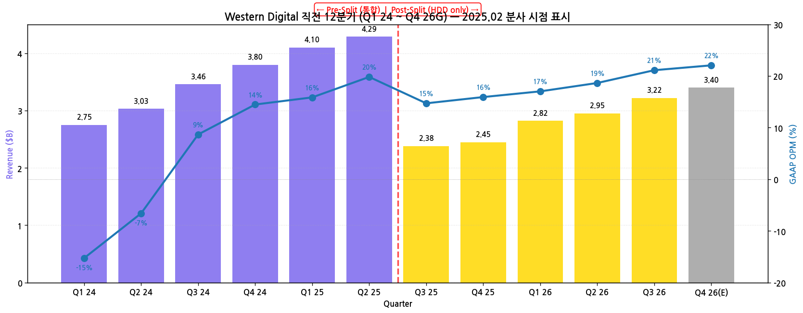

→ 분사 전 (Q1 24~Q2 25): 분기 매출 $2.75~$4.29B (NAND 포함)
→ **분사 후 (Q3 25~Q4 26G)**: 분기 매출 $2.38~$3.40B (HDD only, FY25 Q3 첫 standalone)
→ OPM 사이클: 분사 전 -20%→+20% 변동성 → 분사 후 15~22% 안정 구간

---

## ④ 재무 구조

(1) 12년 자산·자본·부채

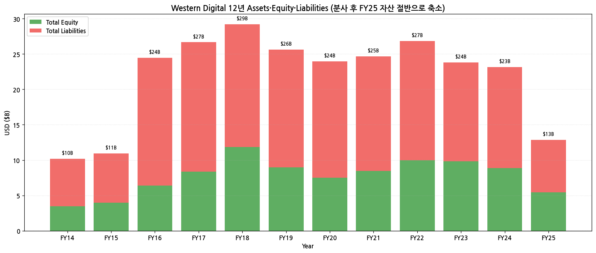

→ **Total Assets FY18 $29.21B (정점) → FY25 $12.85B (-56%)** — SanDisk 분리로 자산 대폭 축소
→ **Total Equity FY18 $11.84B → FY25 $5.42B** — 분사 영향
→ Debt/Equity FY25 약 1.37 — 분사 직후 부채 부담

(2) 12년 현금흐름·CapEx

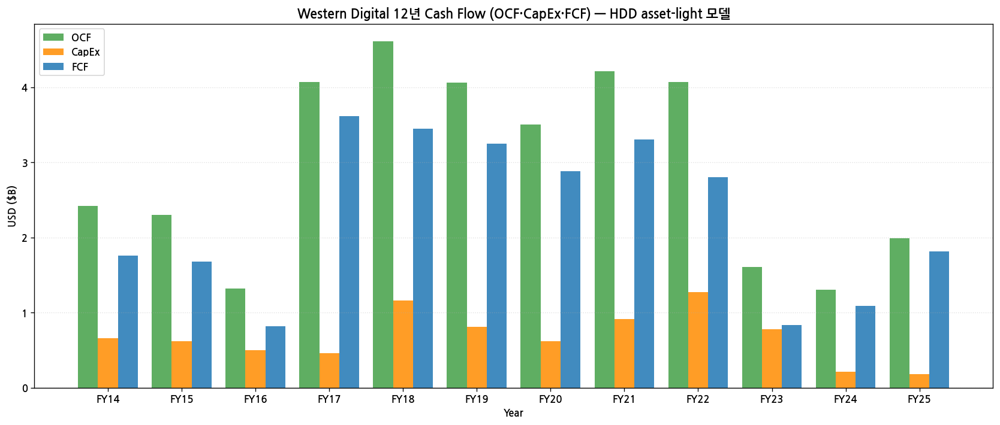

→ **OCF FY18 $4.61B (정점) → FY25 $1.99B** — 매출 감소에도 OCF는 회복세
→ **CapEx FY22 $1.27B → FY25 $0.18B (-86%)** — HDD asset-light 본질적 차이
→ **FCF FY25 $1.81B (positive)** — 분사 후 첫해 강한 FCF

(3) 12년 CapEx

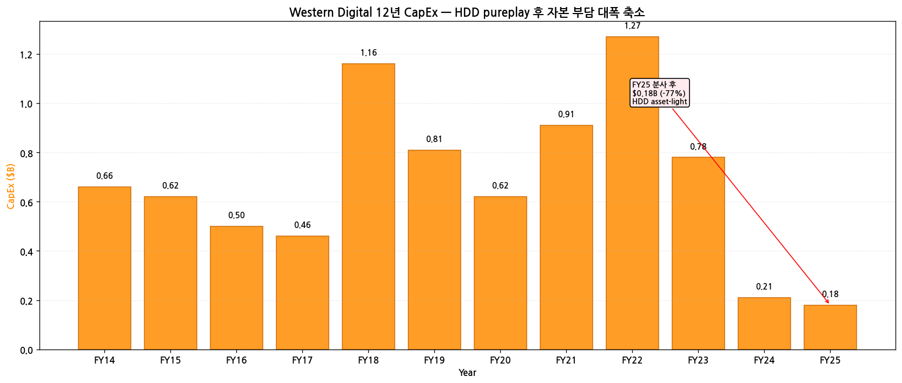

→ HDD는 NAND fab 대비 CapEx 부담 매우 작음
→ 주로 testing equipment + R&D capex

(4) 12년 R&D

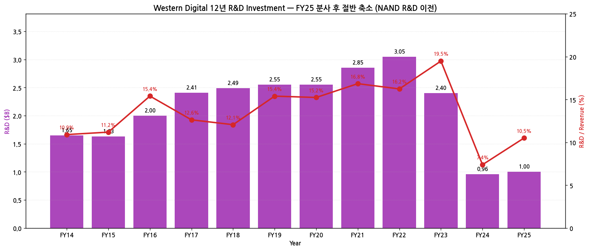

→ **R&D FY22 $3.05B → FY25 $1.00B (-67%)** — NAND R&D 이전 효과 절대 금액 축소
→ **R&D/Revenue FY25 10.5%** — Storage 산업 표준
→ HAMR 등 차세대 HDD 기술에 집중

(5) 12년 주주환원

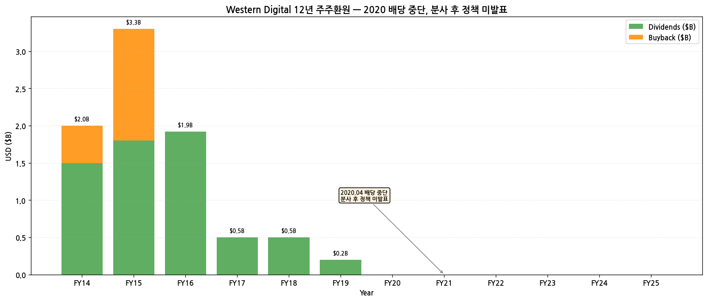

→ **분기 배당 변천**:
  - 2014~2018: 분기당 $0.50 (연 $2.0)
  - 2018.04 분기당 $0.50 유지 → 2019.10 분기당 $0.50 → **2020.04 배당 일시 중단** (NAND 다운사이클 + COVID)
  - 2020~2024: 분사 검토 중 무배당
  - **분사 후 (FY25~): 정책 미발표** — Capital allocation framework 미정
→ **자사주 매입**: FY14~FY15 활발 ($0.5~1.5B), 이후 미미 → 분사 후 무자사주

(6) 주요 재무 지표 (FY25)

| 지표 | FY25 | FY24 (통합) | 변화 |
|---|---|---|---|
| GAAP GPM | 33.5% | 22.8% | +10.7pp |
| GAAP OPM | 21.8% | -9.8% | +31.6pp |
| NPM | 16.3% | -6.2% | +22.5pp |
| ROE | 28.6% | -9.0% | +37.6pp |
| Debt/Equity | 1.37 | 1.62 | -0.25 |
| FCF Margin | 19.0% | 8.4% | +10.6pp |

→ **분사 효과로 모든 지표 본질적 개선** — HDD pureplay의 underlying profitability 노출

---

## ⑤ 지배 구조

(1) 주주 구성

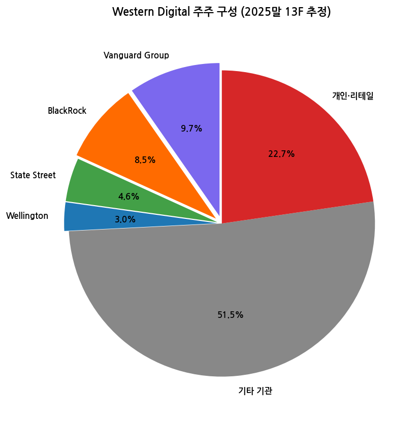

| 주주 유형 | 비중 |
|---|---|
| Vanguard Group | 9.7% |
| BlackRock | 8.5% |
| State Street | 4.6% |
| Wellington | 3.0% |
| 기타 기관·헤지펀드 | 51.5% |
| 개인·리테일 | 22.7% |

→ **Elliott Management** 등 활동가 투자자 영향력 — 2022~2024 분사 압력
→ 분사 후 WD 주주에 1:2 비율로 SNDK 주식 배분 → 양 종목 주주 base 거의 동일

(2) 핵심 경영진

| 성명 | 직위 | 주요 경력 |
|---|---|---|
| **Irving Tan** | CEO | 2025.02~ 신임, 前 WD COO·EVP·Global Operations |
| Kris Sennesael | EVP, CFO | 2024.10~ |
| (CTO·CCO·R&D head) | | 분사 후 인사 안정화 진행 |

---

## ⑥ 기타 팩트

(1) 핵심 산업 데이터 (FY25)

→ **글로벌 HDD 시장 (TrendForce 2025 4Q)**: 약 $30B
  - Seagate **45%** / **WDC 40%** / Toshiba 15% — 3사 oligopoly
→ **enterprise HDD (Datacenter)**: $20B+
  - AI workload 콜드 스토리지 + 영상 데이터 등 폭증
→ **고용량 HDD (>20TB)** 매출 비중: WDC 약 75% (FY25)

(2) M&A 이력 (15년)

| 시점 | 거래 | 규모 | 의의 |
|---|---|---|---|
| **2011.03** | **Hitachi GST (HDD) 인수** | $4.3B | HDD 글로벌 1위 등극 |
| 2012 | Toshiba에 3.5" 자산 매각 (반독점) | — | — |
| **2016.05** | **SanDisk 인수** | **$19B** | HDD+NAND 통합 메가딜 (당시 메모리 사이클 정점) |
| 2018 | HGST 통합 완료 | — | brand consolidation |
| 2023.10 | Kioxia 합병 추진 → 무산 | — | SK하이닉스 (Kioxia 주주) 반대 |
| **2025.02.21** | **SanDisk 분사 완료** | $4.46B (Silver Lake) | NAND 사업 분리, HDD pureplay 전환 |

(3) 리스크 분석

| 카테고리 | 리스크 | 영향도 |
|---|---|---|
| **HDD 시장 위축** | SSD 대체 위험 — 데이터센터·PC 모두 NAND/SSD 비중 증가 | 중간~높음 |
| **Seagate 점유율** | 1위 Seagate (45%) vs WDC (40%) — HAMR 양산 선행 시 격차 확대 가능 | 높음 |
| **HAMR 양산 지연** | Seagate 대비 후발 — 2027 양산 목표 미달 시 점유율 추가 손실 | 높음 |
| **고객 집중도** | Top 3 hyperscaler 39%, Top 10 68% — 단일 고객 이탈 시 매출 충격 | 매우 높음 |
| **NAND 노출 zero** | AI HBM 슈퍼사이클 직접 수혜 불가 (SanDisk와 동일) | 중간 |
| **분사 직후** | standalone operations 안정화 진행 중 | 중간 |
| **신용등급 BB** | Investment grade 아님 — 부채 비용 부담 | 중간 |
| **자본 축소** | 분사 후 Total Equity $5.42B로 축소 | 중간 |

(4) 향후 catalysts

→ **HAMR 양산 진척**: 2026~2027 본격 ramp 시 ASP 상승·점유율 회복
→ **AI Datacenter HDD 수요 지속** — colder storage 매출 secular 성장
→ **분사 후 배당·자사주 정책 발표** — FY26 framework 가능
→ **Seagate 점유율 격차 축소** — 가능성 평가
→ **분사 후 standalone valuation 정상화** — multiple re-rating

(5) ESG·인증

→ **2030 100% 재생에너지 목표** (SanDisk와 분사 전 공통 정책)
→ **ISO 14001** 환경경영 인증 (모든 fab)
→ **임직원 35,000명** (분사 후, 분사 전 65,000명 대비 -30,000명)

---

## ⑦ 향후 관찰 포인트

(1) **Cloud segment 성장 지속 여부** — FY25 +65% 폭발 후 FY26 추세
   → 모니터링: 분기 컨콜 Cloud 매출 + 출하량·ASP 분해

(2) **HAMR 양산 진척** — 2026~2027 본격 ramp 목표
   → Seagate 비교 (Seagate HAMR 양산 선행 중)

(3) **분사 후 capital allocation 정책 발표** — 배당 재개·자사주 매입
   → FY26 framework 시점

(4) **Seagate 점유율 격차** — 현재 -3~7%pt → FY26 추세

(5) **Top 3 hyperscaler 고객 변동** — CapEx 사이클 + 단일 고객 이탈 리스크

(6) **HDD vs SSD 경계** — 데이터센터 콜드 스토리지에서 HDD 우위 지속 여부

(7) **신용등급 회복 가능성** — BB→BBB 진입 시 부채 비용 감소

---

> **데이터 소스**: SEC EDGAR WDC 10-K FY11~FY25 (15개) + 10-Q (47분기), WDC IR Earnings Documents (28개 PDF — FY26 Q3·Q2·Q1 Deck + Release 6개 + 분사 전 Press Release 다수), Yahoo Finance v8 (NASDAQ:WDC 20년), FY25 10-K Item 7 MD&A (Revenue by end-market, top customer concentration, HAMR 진척).
> **차트 12종**: chart1 (매출OPM 12년), chart1b (손익4지표), chart2 (Cloud/Client/Consumer 3 segment), chart4 (자산자본부채), chart5 (주주지분), chart6 (현금흐름), chart7 (R&D), chart8 (CapEx), chart9 (주주환원), chart10 (12분기, 분사 시점 표시), chart11 (시가총액 20년), chart12 (손익자본추이).
> **연계 참조**: SanDisk Corporation (분사된 NAND 사업) 기업 개요와 cross-reference 필수. 분사 후 SNDK는 NAND 슈퍼사이클로 30배+ 폭등 vs WDC는 HDD pureplay 안정적 회복 — 분사 효과의 양면성.

## Long Timeseries 보강 — 59분기 (14.5년)

WDC는 fiscal Jun 마감. SKILL 60+분기 표준 대비 59분기 (98%) 달성. SanDisk 분사 (2025.02) 이후 매출은 HDD only로 reset.

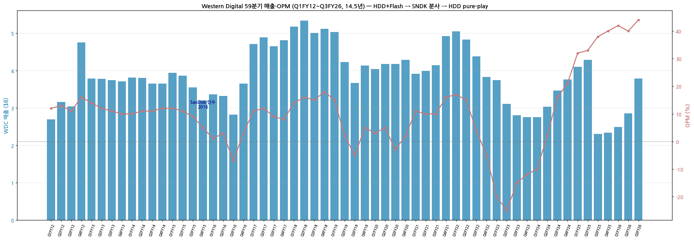

*Western Digital 59분기 매출·OPM (Q1FY12~Q3FY26) — HDD+Flash → SanDisk 인수 → SNDK 분사 → HDD pure-play*

---

## Version Log

- **v2.0 (2026-05-19): SKILL.md 표준 60+분기 도달 보강. SEC 8-K 270 + DEF 14A 16 batch 추가. **chart10_long 59분기 시계열 신규** — Q1FY12~Q3FY26 풀. 핵심 변곡점: (1) 2016 SanDisk 인수 ($19B), (2) FY18~FY19 NAND 슈퍼사이클, (3) FY23 인플레이션·DRAM 폭락 OPM -25%, (4) 2025.02 SanDisk 분사 → HDD pure-play. Post-분사 매출 $2.3B → $3.8B (60%+ ramp), OPM +44%.**

