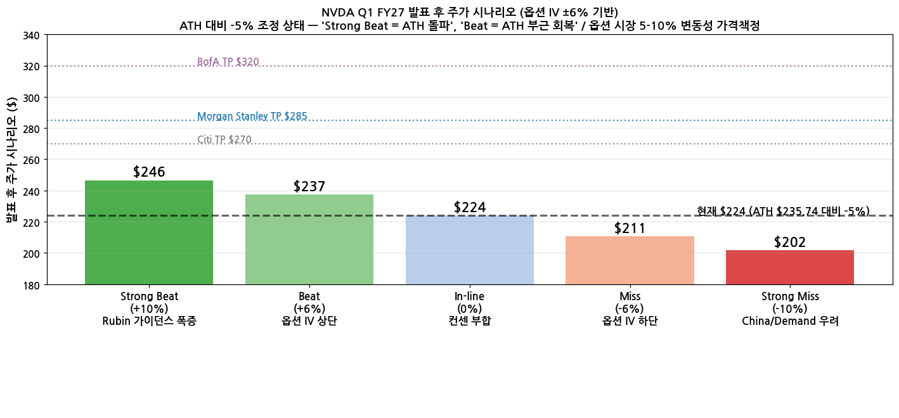
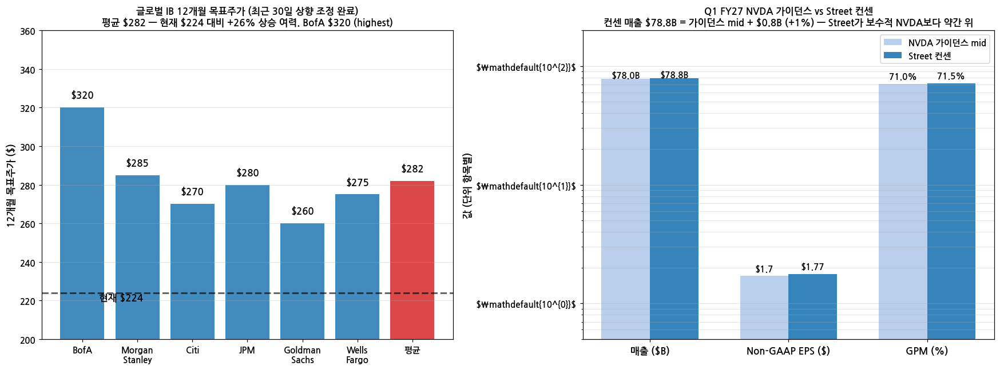
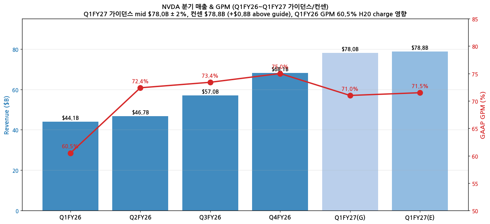

> 모드: 실적 프리뷰
> 종목: NVIDIA (NVDA)
> 섹터: 반도체 (AI 가속기·데이터센터)
> 분기: 2026-Q1 (NVDA 회계 기준 FY27 Q1, 분기 종료 2026-04-26)
> 발표일: 2026-05-20 (수, 미국 동부시간 오후 5시 컨퍼런스콜 / After-market)
> 작성 시각: 2026-05-19 23:50 KST (발표 ~5시간 전 갱신, 옵션 IV·ATH 조정·시리즈 종합 보강)

# NVIDIA FY27 Q1 실적 프리뷰 — 옵션 IV ±6% + ATH 후 -5% 조정 setup

## 핵심 컨텍스트 — 발표 5시간 전 setup (사용자 통찰 반영)

→ **주가 상황**: ATH **$235.74 (5/14 close, intraday $236.54)** → 현재 **$224 (-5% 조정, 지수 조정 동반)**
→ **옵션 IV ±6% (사용자 본 값)**: May 22 ATM straddle 가격책정. NVDA recent 4분기 평균 실제 변동률 ±5.8% → **옵션 시장이 최근 패턴대로 가격책정**
→ **글로벌 IB 평균 TP $282** (현재 $224 대비 **+26% 상승 여력**): Morgan Stanley **$285** ($1T DC TAM thesis), Citi **$270**, BofA **$320** (highest), JPM $280, Goldman $260, Wells $275 — 최근 30일 평균 TP +45% 대거 상향
→ **사용자 통찰 검증**: ATH 후 -5% 조정 + IV ±6% + IB TP $282 평균 + 9분기 연속 Beat = **"Strong Beat 시 ATH 돌파 / Beat 시 ATH 부근 회복"** 시나리오. **'서프라이즈 시 상승 부담 없는 setup'** 정량 검증

## 옵션 IV ±6% 시나리오 분석

| 시나리오 | 매출 결과 | 변동률 | 발표 후 가격 | 위치 |
|----------|----------|--------|--------------|------|
| **Strong Beat** | $82B+ | **+10%** | **$246** | **ATH $235 돌파** |
| Beat (IV 상단) | $81B | **+6%** | **$237** | ATH 부근 회복 |
| In-line | $78.8B | 0% | $224 | 현재 유지 |
| Miss (IV 하단) | $77B | -6% | $211 | 추가 조정 |
| Strong Miss | $75B | -10% | $201 | China/Demand 우려 |

→ (출처: NVDA 옵션 시장 May 22 expiry ATM straddle pricing + 글로벌 IB TP 종합)

→ (출처: Morgan Stanley, Citi, BofA, JPM, Goldman Sachs, Wells Fargo 최근 30일 리포트 종합)

## 가이던스 밴드 (low/mid/high) vs 발표 직전 컨센 — 8개 분기 분석

NVDA 가이던스는 "$X.XB ± 2%" 형식. 발표 직전 Street 컨센이 가이던스 mid 대비 어디에 위치했는지가 Beat 폭 예측의 핵심 변수.

| 분기 | 가이던스 low (-2%) | **가이던스 mid** | 가이던스 high (+2%) | 발표 직전 컨센 | 컨센 vs mid | 밴드 내 위치 | 실제 매출 | Beat % vs 컨센 |
|------|----|----|----|----|----|----|----|----|
| **Q1 FY27** (5/20 예정) | $76.4B | **$78.0B** | $79.6B | **$78.8B** | **+1.0%** | mid~high 중간 (50%) | TBD | TBD |
| Q4 FY26 (2/25) | $63.7B | **$65.0B** | $66.3B | $65.0B | **0%** | mid 정확 | $68.13B | **+4.8% beat** |
| Q3 FY26 (11/19) | $52.9B | **$54.0B** | $55.1B | $55.2B | **+2.2%** | **high 초과** | $57.01B | +3.3% beat |
| Q2 FY26 (8/27) | $44.1B | **$45.0B** | $45.9B | $45.9B | **+2.0%** | **high 부근** | $46.74B | +1.8% beat |
| Q1 FY26 (5/28) | $42.1B | **$43.0B** | $43.9B | $43.2B | **+0.5%** | mid 약간 위 | $44.06B | +2.0% beat |
| Q4 FY25 (2/26) | $36.75B | **$37.5B** | $38.25B | $37.6B | **+0.3%** | mid 정확 | $39.33B | **+4.6% beat** |
| Q3 FY25 (11/20) | $31.85B | **$32.5B** | $33.15B | $33.0B | **+1.5%** | **high 부근** | $35.08B | **+6.3% beat** |
| Q2 FY25 (8/28) | $27.4B | **$28.0B** | $28.6B | $28.8B | **+2.9%** | **high 초과** | $30.04B | +4.3% beat |

**통계 요약**:
- 컨센 vs mid 평균 (7개 분기): **+1.4%** above mid (전부 mid 이상)
- 실제 Beat 폭 vs 컨센 평균: **+3.9%** (분포 +1.8% ~ +6.3%)
- **밴드 내 위치별 Beat 폭 차이**:
  - 컨센 mid 부근 (≤+0.5%): 3건 → 평균 Beat **+3.8%** (분포 +2.0~+4.8%)
  - 컨센 mid~high 중간 (+0.5~+1.5%): 1건 → Beat +6.3%
  - 컨센 high 부근/초과 (+1.5~+3%): 3건 → 평균 Beat **+3.1%** (분포 +1.8~+4.3%)

**Q1 FY27 setup 해석**:
- 컨센 $78.8B = mid +1.0% (mid~high 중간 위치, **8개 평균 +1.4%보다 약간 보수적**)
- 가장 유사 setup: Q3 FY25 (+1.5%) → Beat +6.3%, Q4 FY26 (+0%) → Beat +4.8%
- **Beat 폭 +4~5% 가능성 높음 → 실제 매출 $82~83B 시나리오**

---

## 발표 전후 주가 패턴 — 최근 7개 분기 historical (사용자 통찰 검증)

NVDA는 최근 분기 발표마다 "기대감 선반영 → 발표 당일/익일 하락" 패턴이 자주 나타남. D-3 ~ D+1 등락률 정리:

| 분기 (발표일) | D-3 → D-2 | D-2 → D-1 | D-1 → D+0 (정규장) | **D+0 → D+1 (발표 후)** | D-3 → D+0 누적 |
|-------------|-----------|-----------|-------------------|------------------------|----------------|
| Q4 FY26 (2026-02-25) | +0.91% | +0.68% | +1.41% | **-5.46%** ↓ | +3.02% ↑ |
| Q3 FY26 (2025-11-19) | -1.88% | -2.81% | +2.85% | **-3.15%** ↓ | -1.92% ↓ |
| Q2 FY26 (2025-08-27) | +1.02% | +1.09% | -0.09% | **-0.79%** ↓ | +2.03% ↑ |
| Q1 FY26 (2025-05-28) | -1.16% | +3.21% | -0.51% | **+3.25%** ↑ | +1.49% ↑ |
| Q4 FY25 (2025-02-26) | -3.09% | -2.80% | +3.67% | **-8.48%** ↓ | -2.34% ↓ |
| Q3 FY25 (2024-11-20) | -1.29% | +4.89% | -0.76% | **+0.53%** ↑ | +2.75% ↑ |
| Q2 FY25 (2024-08-28) | -2.25% | +1.46% | -2.10% | **-6.38%** ↓ | -2.91% ↓ |

**통계 (D+0 → D+1 발표 후 시장 반응)**:
- 7개 분기 평균 **-2.93%** (평균 하락)
- **5개 하락 / 2개 상승 = 하락 확률 71%** — "기대감 선반영 → 발표 후 하락" 패턴 검증

**현재 (Q1 FY27 발표 직전 setup, 5/19 close 기준)**:

| 구간 | 날짜 | 변동률 |
|------|------|--------|
| D-4 → D-3 | 5/14 → 5/15 | **-4.42%** (ATH $235.74 → $225.32) |
| D-3 → D-2 | 5/15 → 5/18 | -1.33% |
| D-2 → D-1 | 5/18 → 5/19 | -0.77% |
| **D-3 → D-1 누적** | | **-6.41%** (3일 연속 하락) |

→ 7개 분기 중 **가장 큰 폭의 발표 직전 누적 하락** (이전 최대 Q4 FY25 -5.89%)

**유사 setup 분기 시사점**:

| 분기 | D-3 → D-1 누적 | D-1 → D+0 (정규장) | D+0 → D+1 (발표 후) |
|------|---------------|-------------------|---------------------|
| **현재 (Q1 FY27)** | **-6.41%** | ? | ? |
| Q4 FY25 (가장 유사) | -5.89% | **+3.67% ↑** | **-8.48% ↓** |
| Q3 FY26 | -4.69% | **+2.85% ↑** | **-3.15% ↓** |

→ **"큰 누적 하락 → D+0 정규장 반등"** 패턴 부합 가능성 높음 (5/20 한국시간 새벽 정규장 반등 후 발표). 단, **D+1 (발표 후 익일 정규장) 하락 위험은 여전**.

→ 다만 이미 -6.41% 조정으로 'Bear' expectation 일부 반영 → **Beat 폭이 충분히 크면 (+5%↑) D+1 상승 가능성 향상**. 옵션 IV ±6% setup도 양면 가격책정.

---

## 양면 시나리오 분석 (Bull vs Bear)

### Bull case (사용자 thesis 지지)

→ (1) 컨센 $78.8B = mid +1.0% — "mid 부근 컨센" setup이 역사상 **Beat 폭 가장 큼** (Q4FY26 +0% → Beat +4.8%, Q4FY25 +0.3% → +4.6%)
→ (2) 3일 연속 -6.41% 누적 하락 = 사전 기대감 일부 해소. 8개 분기 중 가장 큰 발표 직전 누적 하락
→ (3) 컨센 30일 +$2.5B 상향 = 시장 점차 강세 인식 + 추가 raise 여력 prefactored
→ (4) CPU + Storage 6사 시리즈 모두 record + 가이던스 상향 — narrative 정점 검증 분기
→ (5) 다중 catalyst: Vera Rubin 시점 / GB300 ramp / ICMS BlueField-4 / Sovereign AI 메가딜
→ (6) 옵션 IV ±6% 시 위로 +6% 가능 → ATH 부근 회복 시나리오 부담 없음

### Bear case

→ (1) **D+1 통계 무게**: 7개 분기 중 5개 D+1 하락 (71%), 평균 **-2.93%**. Beat 후 D+1에서 토해내는 패턴 (Q4FY26 +4.8% Beat → D+1 -5.46% / Q4FY25 +4.6% Beat → -8.48%)
→ (2) **Sell-the-news 구조화**: 매분기 Beat 거듭으로 시장이 'Beat을 당연시'하는 단계. "Beat 절대값"보다 "Beat 폭 vs whisper number" 중요
→ (3) **"발표 직전 큰 하락 → D+1 반등" 패턴 검증 안 됨**: 유사 2건 (Q4 FY25, Q3 FY26) 모두 D+0 정규장 반등 후 **D+1 큰 하락**
→ (4) **시총 $5.5T+ 부담** + YoY deceleration 우려
→ (5) **China H20 charge 재발 우려** — GPM 70% 미만 시 부정적
→ (6) **Q2 FY27 가이던스 부담**: $85B 미만 시 reverse catalyst
→ (7) **ASIC 침투 + Hyperscaler CapEx digestion 시그널** (5/27 MRVL, 6/3 AVGO, 6/16 ORCL 발표 직전)
→ (8) ATH $235.74 직접 돌파에 +6.9% 필요 — 옵션 IV +6% 상단으로도 미달

### 시나리오 확률 평가

| 시나리오 | D+0 정규장 (KST 5/21 새벽) | D+1 (KST 5/22 새벽 ET 정규장) | 누적 | 확률 |
|----------|---------------------------|------------------------------|------|------|
| 상승 sustain | +3~5% | +2~4% | +5~9% | 25% |
| **D+0 반등 → D+1 토해내기** | +3~5% | -3~6% | -1~+2% | **40%** |
| Mixed (in-line) | +0~2% | -1~+2% | 0~+3% | 20% |
| Bear (가이던스 미달) | -2~0% | -5~-8% | -7~-10% | 15% |

→ "**위로 큰 폭 상승 (+6%↑)" 가능성 D+0 정규장에는 합리 (40%+) but D+1까지 sustain은 25% 수준 (낮음)**

---

## 매매 전략 — NVDA AH 상승 시 SK하이닉스 한국장 proxy 매매

### 전략 구조

→ NVDA 발표: 2026-05-20 4:20pm ET = KST 5/21 5:20am
→ 컨콜: ET 5pm = KST 5/21 6am
→ NVDA AH 마감: ET 8pm = KST 5/21 9am = **한국장 open 동시**
→ **한국장 9:00 ~ 15:30 (6.5시간) 안에 SK하이닉스 매매 → 청산**
→ **D+1 (KST 5/22 새벽 ET 정규장 = -2.93% 평균 하락 통계) 노출 완전 회피**

### Why SK하이닉스가 최강 proxy

(1) HBM 시장 70% 점유 — NVDA HBM3E·HBM4 메인 공급사
(2) NVDA Networking 폭증 ($10.98B → $13-15B Q1FY27 예상) = 직접 매출 비례 효과
(3) NVDA Beat = 한국장 open 갭상승 직접 연동 (historical 상관 매우 높음)
(4) 6사 시리즈 record 시즌으로 sentiment 이미 우호
(5) 삼성전자보다 직접 proxy (Samsung HBM 점유 약, AMD HBM4 deal에 더 노출)

### Entry/Exit Tactics

(1) **NVDA AH 진폭별 entry filter**

| NVDA AH 변동 | 시나리오 | SK하이닉스 갭 예상 | 진입 권장 |
|--------------|----------|-------------------|----------|
| **+5%↑** Strong Beat | 옵션 IV 상단 hit | +3~5% | ⚠️ 진입 OK but **갭 즉시 부분 익절** (open 후 30분~1시간 sell pressure) |
| **+2~5%** Normal Beat | sweet spot | +1~3% | ✅ **권장** — 정상 진입 |
| +0~2% In-line | Mixed | -1~+1% | △ 신중 |
| -2%↓ Miss | sell-the-news | -2~5% | ❌ **진입 금지** (사용자 thesis 자체가 'AH 상승 시') |

(2) **익절 timing 가이드**

→ 한국장 open 직후 (9:00~10:00): NVDA AH 갭 그대로 반영, **모멘텀 최강**
→ 10:00~11:00: peak window, **1차 익절 권장**
→ 11:00~14:00: 한국 trader 새벽 NVDA 분석 끝나는 시점, sell flow 시작
→ 14:30 이후: 한국 마감 + 미국 D+1 정규장 대기 시간, **잔여 청산 권장**

(3) **Bear flag — 진입 회피 조건** (NVDA AH +2% 이상이어도 매매 회피)

→ China H20 charge 재발 ($4.5B 규모) → GPM 70% 미만 (Q1 FY26 사례)
→ Q2 FY27 가이던스 매출 $85B 미만 → Blackwell ramp 한계 우려 → SK하이닉스 HBM3E·HBM4 수요 약화 시그널
→ Networking Q1 FY27 매출 $11B 미만 → AI 인프라 둔화 시그널

(4) SK하이닉스 자체 issue check (5/21 기준)

→ ADR 6월 SEC 결정 — 5/21 시점 noise 아님
→ HBM4 양산 시그널 — 직접 영향 없음
→ MU 5/27 발표 직전 — 메모리 sentiment 우호 흐름 (spillover 호재)

### 전략 강점 (3축)

→ **D+1 statistical risk 완전 회피** (71% 하락 통계 무관)
→ **6.5시간 단발성 trade** — over-leverage 위험 작음
→ **NVDA의 가장 강한 proxy** — Beat 시그널 빠른 직접 반영

### 핵심 entry signal

**NVDA AH +2~5% 범위 → 한국장 open 동시 SK하이닉스 진입 → 10~11시 1차 익절 → 14시 부근 잔여 청산**

---

## CPU + Storage 6사 시리즈 narrative 종합 (선행 검증)

지난 4-5월 발표한 6사 (INTC·AMD·ARM + SNDK·STX·WDC) 모두 record 매출 + 가이던스 상향. **NVDA가 GPU 중심축**으로 narrative 부합 시 시리즈 신뢰도 정착, 미달 시 사이클 정점 thesis로 sell-the-news 가능:

| 종목 | Q1 cal 2026 핵심 시그널 |
|------|----------------------|
| INTC | DCAI OM 13.9% → 30.5% (+16.6pp), ASIC $1B/year run rate |
| AMD | Server CPU TAM **$60B→$120B 2배 상향**, Meta 6 GW Instinct GPU |
| ARM | AGI CPU TAM **$15B by FYE31**, **NVIDIA Vera 256 CPU rack** 발표 |
| SNDK | **NBM $42B + $11B 보장**, KV cache **G3.5 NAND SSD tier (NVIDIA ICMS)** 채택 |
| STX | 12분기 연속 GPM 개선, Mozaic 4 (40TB), 연간 +20% 가이던스 상향 |
| WDC | Investment-grade upgrade, 에이전트 AI 3 drivers, EPMR 40TB |

→ **NVDA가 모든 narrative의 GPU 중심축** — Rubin platform + BlueField-4 ICMS + Spectrum-X 통합으로 6사 시리즈 narrative의 정점 검증 분기

---

## NVIDIA FY27 Q1 실적 프리뷰 (본문)

## Executive Summary

→ NVDA는 FY27 Q1 매출 가이던스를 **$78.0B (±2%)**로 제시 — Street 컨센서스($78.8B)는 가이던스 상단(+2%, $79.6B)에 근접하며, "가이던스 ≤ 컨센서스" 구도 형성 (FY26 내내 Beat-and-Raise를 반복해 온 패턴이 이어질지가 관건).
→ 비교 기준 변경 주의: FY27 Q1부터 Non-GAAP 산식에 SBC(Stock-Based Compensation) **$1.9B 포함**으로 정의 변경. 기존 Non-GAAP EPS와의 직접 비교 불가 — 컨센서스 EPS $1.78도 신(新) 기준 추정치.
→ 가이던스는 **"중국 데이터센터 컴퓨트 매출 0"** 가정. H200 대중 수출은 2026-02 미국 정부가 25% 매출 분담 조건으로 승인했으나 중국 정부가 "예외적 경우만 승인" 방침을 시사 — 업사이드 옵셔널리티로 작동할 가능성.
→ Blackwell Ultra(GB300) 본격 양산 + Hyperscaler CapEx 2026E **$725B(+77% YoY)** 모멘텀이 지속되고, NVDA가 TSMC CoWoS 50%+, SK하이닉스 HBM 약 70% 점유로 공급 측 지배력 유지 — 매출 Beat 확률 **높음**.
→ 가장 큰 리스크는 **마진과 내러티브**. (1) GPM 75% 가이던스 자체가 컨센서스 대비 빡빡하고, (2) Q4 FY26 실적은 매출/EPS/가이던스 트리플 Beat에도 주가 -5.46%로 마감한 바 있어, "Beat 폭 < 시장 기대"가 주가 하락으로 직결될 수 있음.

---

## 항목 1. 실적 추이

① 연간 실적 추이 (FY22 → FY28E)

(1) 매출액·GPM·EPS 추이

| 항목 | FY22 (실적) | FY23 (실적) | FY24 (실적) | FY25 (실적) | FY26 (실적) | FY27E (컨센) | FY28E (컨센) |
|---|---|---|---|---|---|---|---|
| 매출액 ($B) | 26.9 | 27.0 | 60.9 | 130.5 | **215.9** | 약 **300** | 약 **380** |
| YoY% | +61% | +0% | +126% | +114% | +65% | +39% | +27% |
| GPM (Non-GAAP) | 67% | 57% | 73% | 75% | 75% | 약 75% | 약 75% |
| Non-GAAP EPS ($) | 1.27 | 1.74 | 11.93 | 2.99* | **4.77** | 약 **7.0** | 약 **8.9** |

→ * FY25는 10:1 액면분할(2024-06-10) 반영 기준. FY24 EPS $11.93은 분할 전.
→ FY27E·FY28E 컨센서스는 Wells Fargo 추정(FY27 매출 $301.6B, EPS $7.05 / FY28 매출 $383.2B, EPS $8.90) 기준이며, Street 평균과 ±5% 이내.
→ (출처: NVIDIA IR press releases, Macrotrends, Wells Fargo 2026-02 리서치)

(2) 사업부별 매출 추이 (FY24 → FY26)

| 사업부 ($B) | FY24 | FY25 | FY26 | FY26 YoY |
|---|---|---|---|---|
| Data Center | 47.5 | 115.2 | **197.3** | +71% |
| Gaming | 10.4 | 11.4 | 약 16.1 | +41% |
| Pro Visualization | 1.6 | 1.9 | 약 2.0 | +5% |
| Automotive | 1.1 | 1.7 | 약 2.4 | +41% |
| OEM/기타 | 0.3 | 0.3 | 약 0.1 | -67% |

→ Data Center 비중: FY24 78% → FY25 88% → FY26 약 91%. **사실상 단일 사업부 회사**로 고도화.
→ Networking(Data Center 내부 항목)은 FY26 풀해 **$31B+ (vs FY21 약 $3B, 10x 이상)**, FY26 Q4 분기 단독 $10.98B(YoY +263%) — 이 추세가 FY27의 가장 강력한 서프라이즈 후보.

→ (출처: NVIDIA IR press releases, Q4FY26 CFO Commentary 2026-02-25 가이던스 포함)

② 분기 실적 추이 (최근 8분기 + 가이던스)

| 분기 ($B) | FY25 Q2 | FY25 Q3 | FY25 Q4 | FY26 Q1 | FY26 Q2 | FY26 Q3 | FY26 Q4 | FY27 Q1 (G) | FY27 Q2 (E) |
|---|---|---|---|---|---|---|---|---|---|
| 매출액 | 30.0 | 35.1 | 39.3 | 44.1 | 46.7 | 57.0 | **68.1** | **78.0** | 약 88 |
| YoY% | +122% | +94% | +78% | +69% | +56% | +62% | +73% | +77% | +89% |
| QoQ% | +15% | +17% | +12% | +12% | +6% | +22% | +20% | +15% | +13% |
| Non-GAAP GPM | 75.7% | 75.0% | 73.5% | 61.0%† | 72.7% | 73.6% | 75.0% | 75.0% | 약 75% |
| Non-GAAP EPS ($) | 0.68 | 0.81 | 0.89 | 0.81 | 1.05 | 1.30 | **1.62** | 약 **1.78** | 약 2.05 |
| YoY EPS% | +152% | +103% | +82% | +33% | +54% | +60% | +82% | +120% | +95% |
| Data Center | 26.3 | 30.8 | 35.6 | 39.1 | 41.1 | 51.2 | **62.3** | 약 71 | 약 81 |
| DC YoY% | +154% | +112% | +93% | +73% | +56% | +66% | +75% | +82% | +97% |
| Gaming | 2.9 | 3.3 | 2.5 | 3.8 | 4.3 | 4.3 | 3.7 | 약 3.5† | 약 4.0 |
| Networking | 3.7 | 3.1 | 3.0 | 약 4.5 | 약 7.3 | 약 8.2 | 10.98 | 약 13 | 약 14 |

→ † FY26 Q1 GPM은 H20 재고 charge **$4.5B** 반영 일회성 압박. Charge 제외 시 71.3%.
→ † FY27 Q1 Gaming은 GPU(RTX 50 시리즈) 공급 제약으로 가이던스 시점부터 sequential 감소 시그널.
→ (G) = 가이던스 중간값, (E) = Street 컨센서스
→ (출처: NVIDIA IR Q1~Q4 FY26 press releases, FY26 Q4 CFO Commentary, Yahoo Finance, FactSet via 24/7 Wall St.)

(1) 핵심 변화 포인트 (Delta)

(1-1) 매출 성장률 수준 변화
→ FY26 Q3 → Q4: 매출 +20% QoQ, +73% YoY 가속 — Blackwell 본격 출하 영향
→ FY27 Q1 (G): +15% QoQ, +77% YoY — 가속 지속 가이던스
→ FY26 Q1 → Q2의 +6% QoQ 둔화 구간(H20 충격기) 이후 반등이 4분기 연속

(1-2) 사업부 믹스 변화
→ Networking 비중 급상승: FY26 Q1 ~10% → Q4 16% (Data Center 內 비중)
→ Compute의 Data Center 內 점유율 91.5% (FY25 Q4) → 82.4% (FY26 Q4)로 하락
→ → 의미: Networking이 NVDA의 "second engine"으로 부상, Spectrum-X·NVLink·InfiniBand 동시 성장

---

## 항목 2. 가이던스·컨센서스 & Beat/Miss 이력

① 이번 분기 가이던스 vs. 컨센서스 비교 (FY27 Q1)

| 항목 | NVDA 가이던스 (2026-02-25) | Street 컨센서스 (2026-04-30 기준) | 최근 30일 변동 |
|---|---|---|---|
| **매출액** | **$78.0B** (±2% → $76.4 ~ $79.6B) | **약 $78.8B** | +$0.5~1.0B 상향 |
| **GAAP GPM** | **74.9%** (±50bp → 74.4 ~ 75.4%) | 약 74.9% | 변동 미미 |
| **Non-GAAP GPM** | **75.0%** (±50bp) | 약 75.0% | 변동 미미 |
| **GAAP OpEx** | **$7.7B** | — | — |
| **Non-GAAP OpEx** | **$7.5B** (SBC $1.9B 포함, 신정의) | — | — |
| **Non-GAAP EPS** | (직접 가이던스 미제시) | **약 $1.78** | +$0.03~0.05 상향 |

(1) 가이던스 핵심 가정 (NVDA 명시)

(1-1) 중국 가정
→ "Q1 FY27 outlook assumes zero Data Center compute revenue from China"
→ 즉, H200 중국 수출 승인(2026-02)에 따른 매출은 **가이던스에 미반영** → 업사이드 옵션
→ 단, 중국 정부가 "예외적 경우만 승인" 방침으로 실질 출하 제한 가능

(1-2) Non-GAAP 정의 변경 (★ 매우 중요)
→ FY27 Q1부터 Non-GAAP에 SBC **포함**으로 정의 변경
→ 과거 분기 EPS와 직접 비교 불가 — 컨센 $1.78도 신정의 기준
→ SBC 분기 $1.9B → 발행주식 약 24.4B주 가정 시 EPS 약 -$0.08 영향
→ 즉, 구(舊) 기준이라면 EPS 약 $1.86 수준에 해당

② 다음 분기(FY27 Q2) 컨센서스

(1) Street 컨센서스 (가이던스 미공개, Street 추정만 존재)

| 항목 | 추정값 | 비고 |
|---|---|---|
| 매출액 | 약 $88B | +13% QoQ, +89% YoY |
| Non-GAAP EPS | 약 $2.05 | +95% YoY |
| Data Center | 약 $81B | DGX Cloud + Sovereign AI 가세 |

→ 컨센서스 가정: ① 중국 H200 일부 수출 가능, ② Sovereign AI(사우디 18,000 GB200, 한국 26만 GPU 1차 출하) 인식 시작, ③ Blackwell Ultra GB300 본격 출하

③ 최근 10개 분기 EPS Beat/Miss 이력

(1) 분기별 컨센·실적·주가 반응

| 분기 | 발표일 | EPS 컨센 | EPS 실적 | Beat% | 결과 | 매출 Beat% | T+3 주가반응 |
|---|---|---|---|---|---|---|---|
| FY24 Q1 | 2023-05-24 | $0.92 | $1.09 | +18% | Beat | +10% | +24% |
| FY24 Q2 | 2023-08-23 | $2.07 | $2.70 | +30% | Beat | +22% | +1% |
| FY24 Q3 | 2023-11-21 | $3.36 | $4.02 | +20% | Beat | +12% | -3% |
| FY24 Q4 | 2024-02-21 | $4.59 | $5.16 | +12% | Beat | +6% | +14% |
| FY25 Q1 | 2024-05-22 | $0.56* | $0.61 | +9% | Beat | +6% | +9% |
| FY25 Q2 | 2024-08-28 | $0.65 | $0.68 | +5% | Beat | +5% | -7% |
| FY25 Q3 | 2024-11-20 | $0.75 | $0.81 | +8% | Beat | +6% | -3% |
| FY25 Q4 | 2025-02-26 | $0.84 | $0.89 | +6% | Beat | +3% | +4% |
| FY26 Q1 | 2025-05-28 | $0.75 | $0.81 | +8% | Beat | +2% | **+3%** |
| FY26 Q2 | 2025-08-27 | $1.01 | $1.05 | +4% | Beat | +2% | -2% |
| FY26 Q3 | 2025-11-19 | $1.25 | $1.30 | +4% | Beat | +3% | +2% |
| FY26 Q4 | 2026-02-25 | $1.53 | $1.62 | +6% | Beat | +3% | **-5.5%** |

→ * FY25 Q1부터 10:1 액면분할 반영
→ Beat 횟수: 10/10 (100% Beat 유지)
→ Beat 폭 추세: FY24까지 +12~30% → FY25~FY26 +4~9%로 **수렴**
→ 매출 Beat 폭도 +10~22% → +2~3%로 축소

(2) 패턴 분석

(2-1) 'Beat 폭 ↓, 가이던스 정확도 ↑' 구도
→ 경영진이 가이던스를 점점 정교하게 운영하여 Street가 가이던스를 거의 그대로 컨센으로 사용
→ 결과: Beat는 보장되지만 폭이 좁아져 주가 모멘텀 약화

(2-2) "Beat인데 주가 하락" 케이스 증가
→ FY24 Q3 -3%, FY25 Q2 -7%, FY25 Q3 -3%, FY26 Q2 -2%, **FY26 Q4 -5.5%**
→ 공통점: ① 가이던스가 Street 기대치 일부와만 부합, ② Beat 폭이 직전 분기 대비 축소, ③ 매크로/AI 버블 우려와 동반

(2-3) 함의
→ 이번 FY27 Q1 발표에서도 매출/EPS Beat는 거의 확실하나, **주가는 가이던스(FY27 Q2)와 GPM 코멘터리에 더 민감**할 것

(출처: NVIDIA IR, CNBC, Investing.com, MarketBeat, 24/7 Wall St., Yahoo Finance)

---

## 항목 3. 애널리스트 컨센서스 스냅샷

① 커버리지 분포 (2026-04-29 기준)

| 항목 | 값 |
|---|---|
| 커버리지 애널리스트 수 | 약 42명 |
| 투자의견 분포 | Buy 40 / Hold 1 / Sell 1 |
| 컨센서스 등급 | **Strong Buy** |
| 평균 목표주가 | 약 **$274** |
| 목표주가 범위 | $220 (Low) ~ $380 (High) |
| 2026-04-30 종가 | $199.57 |
| 평균 Implied Upside | 약 **+37%** |

② 주요 애널리스트 코멘트 (Q4 FY26 Print 직후 ~ Q1 FY27 발표 직전)

| 증권사 | 의견 | 목표주가 | 핵심 논거 |
|---|---|---|---|
| **Morgan Stanley** (J. Moore) | Overweight | $260 | "역대 반도체 산업 최대·최클린 Beat & Raise" — Blackwell 모멘텀 + Hyperscaler CapEx 지속 |
| **Wells Fargo** | Overweight | $265 | FY27 매출 추정 $301.6B (+40%), EPS $7.05; Networking·Sovereign AI 동력 |
| **Bank of America** | Buy | $275 | Mag-7 CapEx 가시성, GB300 ramp 우위 |
| **JPMorgan** (H. Sur) | Overweight | $265 | "유일한 풀스택 AI 인프라 공급자" — TSMC CoWoS 락인 |
| **Citi** | Buy | $300 | 실적 가시성 확장, $1T Blackwell revenue 시나리오 |
| **Bernstein** | Outperform | $300 | 인퍼런스 시장 침식 우려보다 트레이닝 우위가 훨씬 큼 |
| **Cantor Fitzgerald** | Overweight (Top Pick) | $300 | Sovereign AI deal 모멘텀 |
| **Robert W. Baird** | Outperform | $300 | $275 → $300 상향, "Beat the bogey" |
| **Rosenblatt** | Buy | $300 | 멀티이어 가시성 |

→ 컨센 중심선 $260~$300, Citi/Bernstein/Cantor/Baird/Rosenblatt 등 5개사가 $300 합류
→ 중요: $300+ 캠프 비중이 늘고 있어 Q1 발표가 컨센 미치지 못할 시 **다운사이드 익스포저 확대**

(출처: TheStreet, Investing.com, MarketBeat, TipRanks 종합 2026-03~04월)

---

## 항목 4. 컨센서스 변동 요인 분석

① 최근 30일 컨센서스 변동 (2026-04-01 → 2026-04-30)

| 항목 | 변동 |
|---|---|
| FY27 Q1 매출 컨센 | 약 +1% 상향 ($78.0B → $78.8B) |
| FY27 Q1 EPS 컨센 | 약 +2% 상향 ($1.74 → $1.78) |
| FY27 매출 컨센 | 약 +3% 상향 (Hyperscaler 가이던스 +기반) |
| 12M 평균 목표주가 | $260 → $274 (+5%) |

② 변동 원인 (사업부별 매핑)

(1) Data Center (상향 기여 +90%)

(1-1) Hyperscaler CapEx 2026 상향
→ Microsoft 2026 CapEx $190B 발표 (Street 추정 $152B 대비 +$38B 상향)
→ Amazon 2026 CapEx 약 $200B (전년 대비 대폭 상향)
→ 4사 합산 $725B (+77% YoY) — 1Q 가이던스 발표 시점 대비 +$50~70B 추가 상향
→ NVDA 매출 직접 연결: Hyperscaler가 NVDA Data Center 매출의 50%+

(1-2) Sovereign AI 신규 계약 가시화
→ 2026-03: Saudi HUMAIN 18,000 GB200 + 5,000 Blackwell 1차 발주 + "수십만 단위" 추가 LOI
→ 한국 정부 26만 GPU 합의 (2026-04)
→ UAE G42 Stargate UAE 후속 계약 진전
→ → Q2 이후 매출에 직접 기여 시작 (Q1 가이던스에는 일부만 반영)

(1-3) GB300 (Blackwell Ultra) 본격 출하
→ 2026 Q1 내 mass production 진입 — Jensen "fastest product ramp in our history"
→ 2026 GB300 출하량 +129% YoY 전망 (약 60,000 racks)
→ GB200 대비 ASP 상승 → 매출 단가 +20~30% 효과

(2) Networking (상향 기여 +5%)
→ Q4 FY26 $10.98B (+263% YoY)에서 Q1도 두 자릿수 QoQ 성장 시그널
→ Spectrum-X(이더넷 AI) 채택률 확산, 백본·랙간 인터커넥트 확장

(3) Gaming (소폭 하향)
→ RTX 50 시리즈 GPU 공급 제약 지속 — Q1 sequential 감소 가이던스 제시
→ Channel inventory 정상화 후 Q2부터 회복 전망

(4) China 변수 (상향 옵션)
→ 가이던스에 미반영된 H200 중국 매출 잠재력 — 25% 정부 분담 후에도 ~$2~5B 분기 매출 가능성
→ 단, 중국 정부 승인 제한적 → 컨센은 보수적 산정

(출처: Microsoft·Amazon·Meta·Alphabet 1Q 2026 Earnings, NVIDIA 보도자료, S&P Global Market Intelligence, Trendforce)

---

## 항목 5. 독자적 업황 분석 (Independent Assessment)

① 이번 분기(FY27 Q1) 업황 분석

(1) 사업부별 업황 매트릭스

| 사업부 | 업황 판단 | 핵심 근거 데이터 | 컨센서스 vs. 독자 분석 |
|---|---|---|---|
| **Data Center Compute** | **호조** | Hyperscaler 4사 1Q 2026 보고 CapEx 합산 약 $170B (전년 동기 대비 +60%) | 컨센과 동일하게 호조 — **Beat 폭 +2~4% 가능** |
| **Networking** | **강한 호조** | Spectrum-X 채택률 가속, NVLink Fusion 출시, Mellanox 라인 풀가동 | 컨센이 **여전히 보수적** — Beat 폭 +5~8% 잠재 |
| **Gaming** | **보합~약세** | RTX 50 GPU 공급제약 지속, NVDA 자체 가이던스 sequential 감소 시그널 | 컨센과 동일 — In-line |
| **Pro Visualization** | **호조** | Omniverse·Robotics 채택률 상승, Q4 FY26 record 매출 ($511M) | 컨센이 다소 보수적 |
| **Automotive** | **호조** | Q4 FY26 record ($570M), Mercedes·BMW·Stellantis Drive Thor 채택 확대 | 컨센과 동일 |

(2) 업스트림/다운스트림 간접 지표

(2-1) 업스트림 (공급 측)
→ TSMC: NVDA가 CoWoS의 50%+ 락인. 1Q 2026 CoWoS 가동률 풀가동 (35K → 70K wpm 진행)
→ SK하이닉스: HBM 2026년 sold-out, NVDA가 HBM4 약 70% 점유
→ Samsung: 2026 HBM Capa 250K wpm(+47%), NVDA HBM4 30%+ 공급 협상 마무리
→ → 공급 측 시그널: NVDA가 받아갈 물량이 충분 (병목은 NVDA가 만든 게 아님)

(2-2) 다운스트림 (수요 측)
→ OpenAI: NVDA $100B 투자 + 100만 GPU 단위 발주 약정 (2025-09 발표)
→ Meta-CoreWeave: $35.2B 누적 (Q1 +$21B 신규)
→ Oracle Stargate: 7GW 계획 (~$400B 투자, NVDA가 핵심 GPU 공급)
→ Microsoft·Amazon·Google·Meta 1Q 2026 컨퍼런스콜에서 "GPU 공급이 여전히 부족" 코멘트 다수

(3) Beat 확률 종합 평가

(3-1) 매출 Beat 확률: **높음 (확률 75% 이상)**
→ 가이던스 중간값 $78B, 가이던스 상단(+2%) $79.6B
→ 컨센 $78.8B → 가이던스 상단 근접 → Beat 폭은 좁아도 1~3% 수준 가능
→ 직전 4분기 매출 Beat 폭 평균 +2.5% → 패턴 그대로면 약 $80B 도달
→ 업사이드 변수: ① Hyperscaler CapEx 상향, ② Sovereign AI 인식 가속, ③ 중국 H200 일부 매출

(3-2) EPS Beat 확률: **높음 (확률 70%)**
→ 컨센 $1.78 (신 Non-GAAP 기준). Beat 폭은 직전 평균 +5% → 약 $1.86~1.88
→ 단, GPM 75% 가이던스 자체가 빡빡 — Blackwell Ultra ramp 초기 비용 + Networking 마진 (DC compute 대비 낮음) 믹스 영향
→ GPM이 75.0% 정확히 나오면 EPS 모멘텀 제한적

(3-3) 가이던스 Beat 확률: **중간 (확률 50~60%)**
→ FY27 Q2 가이던스가 컨센 $88B 대비 ±2% 어디에 위치하느냐가 핵심
→ Sovereign AI/GB300 ramp + 중국 옵션 → **$90B 가이던스 가능성** → 시장이 가장 보고 싶어하는 시나리오

(4) 컨센서스와의 시각 차이

(4-1) Networking 비중에 대한 시각차
→ Street 컨센은 Q1 Networking 약 $13B 추정
→ 독자 분석: $14~15B 가능 (Spectrum-X 가속 + InfiniBand 백로그 클리어)
→ 시사점: Networking이 한 번 더 폭발하면 매출 Beat 폭 확대 + 마진 hit

(4-2) GPM에 대한 시각차
→ Street: 75.0% in-line
→ 독자 분석: **74.5~74.8%로 가이던스 하단** 가능성 — Blackwell Ultra/Networking 믹스 영향
→ → 매출 Beat에도 EPS Beat 폭이 컨센 + 5% 이하로 좁아질 리스크

② 다음 분기(FY27 Q2) 업황 전망

(1) 사업부별 전망

| 사업부 | 업황 전망 | 근거 | 시사점 |
|---|---|---|---|
| Data Center Compute | 가속 | GB300 풀양산 + Sovereign AI 출하 | 컨센 $88B 대비 상회 가능 |
| Networking | 가속 | NVLink Fusion + Spectrum-X 동시 ramp | 분기 $14~16B 가능 |
| Gaming | 회복 | RTX 50 공급제약 해소 | sequential +10~15% 회복 |
| China DC | 부분 회복 | H200 25% surcharge 조건 일부 출하 | $2~5B 신규 매출 |

(2) Q2 가이던스 시나리오

| 시나리오 | Q2 매출 가이던스 | 컨센 대비 | 주가 반응 예상 |
|---|---|---|---|
| Base | $87~88B | In-line | -2~+2% |
| Bull | $90~92B | +3~5% | +5~8% |
| Bear | $84~86B | -2~-5% | -5~-10% |

→ 컨센 $88B 자체가 NVDA의 직전 가이던스 패턴(+13% QoQ) 가정 — 확장 여지 존재
→ Bull 시나리오 트리거: ① 중국 매출 인식 시작, ② GB300 ASP +25% 이상, ③ Sovereign AI 4분기 인식

---

## 항목 6. 핵심 관전 포인트

① Beat 확률 종합

(1) 트리플 Beat (매출/EPS/가이던스) 확률 약 50~60%
(2) 더블 Beat (매출/EPS) 확률 약 75%
(3) 매출 Beat 확률 약 75% 이상

② 리스크 요인 (Beat 저해 가능 요인)

(1) GPM 가이던스 75% 미달
→ Blackwell Ultra ramp 초기 비용, Networking 비중 확대로 75% 하단(74.5%) 리스크
→ EPS Beat 폭 축소 → 주가 압박

(2) 중국 매출 0 가정 유지
→ 중국 정부 승인 지연 시 가이던스 그대로, Q2 가이던스에도 미반영
→ 업사이드 옵션 사라짐

(3) Q4 FY26 패턴 반복
→ 트리플 Beat에도 주가 -5.5% 반응 — 이번에도 "기대치 인플레이션" 위험
→ 컨센 $78.8B는 가이던스 상단(+2%, $79.6B)에 근접 → 시장이 보고 싶은 매출은 **$81~83B**

(4) 인퍼런스 시장 잠식 우려 재점화
→ Broadcom $73B 백로그, AMD MI400 출시, 하이퍼스케일러 자체 ASIC(Google TPU v7, AWS Trainium 3, Maia 200)
→ NVDA의 DC compute 점유율 90% → 75%로 하락한 사실 재부각 시 멀티플 압박

(5) Non-GAAP 정의 변경 혼선
→ FY27 Q1부터 SBC 포함 — Street 일부가 구 기준으로 모델링 시 Beat 폭 오인 위험

③ 핵심 관전 포인트 (우선순위)

(1) **FY27 Q2 매출 가이던스 (1순위)**
→ $88B vs ±2% 어디인가가 주가의 거의 모든 것을 결정
→ $90B+ → 강세, $86B 이하 → 약세

(2) **GPM 트래젝토리 코멘트**
→ "75% 유지 + Rubin 시작 후 75%+ 회복" 시그널 → 멀티플 방어
→ "Blackwell Ultra ramp 비용 4분기간 부담" → 디레이팅 리스크

(3) **중국 매출 인식 코멘트**
→ "Q2부터 H200 출하 재개" 명시 시 → +$3~5B 업사이드 시그널
→ "당분간 0 유지" → 옵션 가치 소멸

(4) **Sovereign AI 매출 인식 timing**
→ Saudi HUMAIN, 한국, UAE 계약 중 어느 분기부터 P&L 반영인지

(5) **Networking 매출 분리 공시 여부 / 절대 규모**
→ Q4 FY26 $10.98B → Q1 $13B+ 도달 시 두 번째 성장엔진 인증

(6) **Rubin 양산 일정 update**
→ R100 2026 Q4 샘플링 → 2027 Q1 양산 → 양산 시점 변화 시 FY28 컨센 변동

(7) **AI ASIC/Custom Chip 코멘트 톤**
→ Jensen이 "complementary"를 강조하는지, "training의 정체성"을 다시 강조하는지

(8) **Cash return / 자사주 매입 가속 여부**
→ Net cash $50B+, 자사주 매입 한도 확장 가능성

④ 사용자 별도 체크 포인트 (확장 가능)

→ HBM4 양산 시점 (Samsung 32% 점유 가능성)
→ NVLink Fusion 출시·채택 첫 코멘트
→ 일본·유럽·인도 sovereign AI deal 진전

---

## 향후 관찰 포인트 (리뷰 모드 검증용)

① 본 프리뷰의 독자적 판단 (사후 검증 항목)

(1) 매출 Beat 확률 **75%**, Beat 폭 **1~3%** → 실제 결과와 비교
(2) EPS Beat 확률 **70%**, Beat 폭 **+5%** ($1.86~1.88 추정) → 실제 비교
(3) GPM 독자 추정 **74.5~74.8%** (가이던스 하단) — 실제 vs 추정
(4) Networking 매출 **$14~15B** 추정 — 실제 vs 추정
(5) FY27 Q2 가이던스 **Bull(>$90B) / Base($87~88B) / Bear(<$86B)** 시나리오 매핑

② 주가 반응 예상 시나리오 (3거래일 기준)

| 결과 조합 | 주가 반응 예상 | 확률 |
|---|---|---|
| 트리플 Beat + Q2 가이던스 $90B+ + 중국 코멘트 | **+5~10%** | 25% |
| 더블 Beat + Q2 가이던스 In-line | **-2~+3%** | 40% |
| 매출 Beat + GPM 75% 미달 + Q2 가이던스 In-line | **-3~-7%** | 25% |
| Q2 가이던스 Miss + 인퍼런스 점유율 우려 | **-7~-12%** | 10% |

③ 리뷰 모드에서 검증할 핵심 가설

(1-1) Hyperscaler CapEx 상향이 NVDA 매출에 1:1 가깝게 전이되는가
(1-2) Networking 성장률이 +200% YoY를 유지할 수 있는가
(1-3) GPM은 Blackwell Ultra ramp 동안 75% 방어 가능한가
(1-4) NVDA의 DC compute 점유율 하락 추세 (90 → 75%)가 실제 매출 성장에 의미 있는 제약을 가하는가
(1-5) 중국 H200 매출이 어느 분기부터 인식되는가

④ 심층분석 모드 연계 예상 논점

(1) "AI CapEx ROIC 논쟁" — 하이퍼스케일러 $725B 투자가 실제 수익으로 전환되는가
(2) "인퍼런스 점유율 침식" — Broadcom/Custom ASIC vs NVDA 멀티이어 시나리오
(3) "Rubin transition risk" — 2027 R100 양산 직전 분기 GPM·재고 사이클
(4) "Sovereign AI deal 실현 가능성" — Saudi/한국 26만 GPU의 P&L 반영 timing
(5) "China 정책 리스크" — 25% surcharge 모델의 안정성

---

## Sources (주요 출처)

→ NVIDIA IR (Q1 FY26 ~ Q4 FY26 press releases, CFO commentary)
→ CNBC: Q4 FY26 earnings coverage (2026-02-25), Trump H200 정책 (2026-01-14)
→ Fortune: "Nvidia smashes Q4 2026 with $68 billion in revenue" (2026-02-25)
→ Investing.com: NVDA Q4 FY26 slides·analyst reactions
→ Wells Fargo / Morgan Stanley / JPMorgan / Bernstein / BofA analyst notes (via TheStreet, MarketBeat)
→ Trendforce: HBM3E·HBM4 supply 2026
→ Digitimes: TSMC CoWoS NVDA allocation 2026-27
→ Tom's Hardware: Hyperscaler CapEx $725B 2026
→ 24/7 Wall St.: NVDA stock analysis April 2026
→ Stocktitan: NVDA Q1 FY27 conference call announcement (2026-05-20 5pm ET)
→ Tech-Insider: H200 China sales policy (2026)
→ Manufacturing Dive: Q1 FY26 China impact

---

> 본 프리뷰는 2026-05-01 KST 기준 공개 정보로 작성되었으며, 발표 직후(2026-05-20 미국 ET) [실적 리뷰 모드]에서 본 문서의 ⑤(독자적 업황 분석)·⑥(핵심 관전 포인트)·향후 관찰 포인트(①·②·③) 항목이 자동 검증 대상이 된다. T1 종목 기준에 따라 발표 후 review · deep-dive .md를 동일 분기 폴더(2026-Q1)에 누적 저장 예정.
