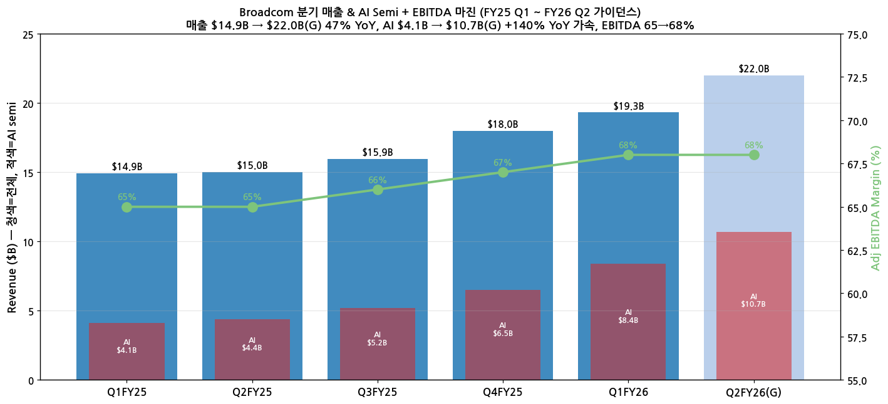
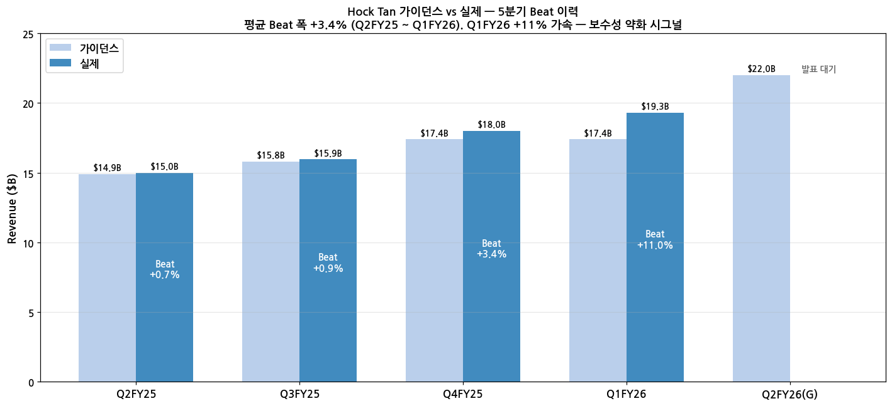
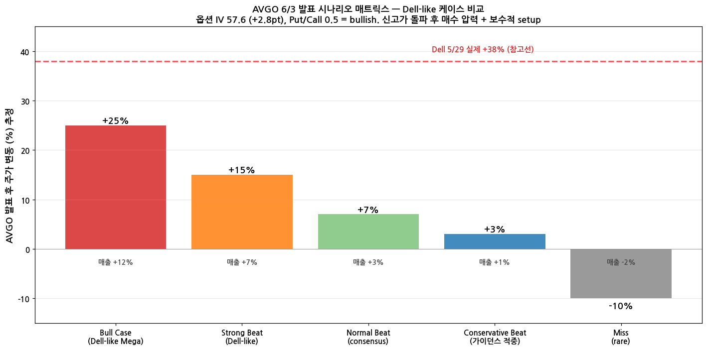

> 모드: 실적 프리뷰
> 종목: Broadcom (AVGO)
> 섹터: 반도체 (커스텀 AI 실리콘 + 네트워킹 + 인프라 소프트웨어)
> 분기: 2026-Q2 (FY26 Q2 = Feb~Apr 2026, 발표일 May 2026 quarter)
> 발표일: 2026-06-03 (Wed) AMC, 미국 동부 5:00 PM ET = 한국 6/4 06:00 KST
> 작성 시각: 2026-05-25 16:00 KST

# AVGO FY26 Q2 프리뷰 — Dell-like 갭 상승 시나리오 + Hock Tan 보수성 정량화

## Executive Summary

→ Broadcom Q2 FY26 발표 **6/3 (Wed) AMC** 예정. 컨센 매출 **$22.11B (37 analysts)**, 회사 가이던스 **$22.0B (+47% YoY)**, AI semi 가이던스 **$10.7B (+140% YoY)**
→ Hock Tan 5분기 평균 beat **+3.4%** (가이던스 vs 실제). **Q1 FY26에서 +11.0%로 가속** — 보수성 약화 시그널
→ Dell 5/29 발표 **+38% AH 갭 상승** (Revenue $43.8B vs cons $35.8B +22% beat, AI server $16.1B + FY27 $60B target raise)
→ AVGO **신고가 돌파 후 매수 압력 + 옵션 IV 57.6 + Put/Call 0.5 bullish**. 5/31 종가 $425~448 range, 시총 $1.99T
→ **Dell-like Strong Beat 시나리오 (매출 +7% above $23.5B, AI $12B, Q3 가이던스 step-up) → AVGO +15~25% 가능**. Mega Beat (Q3 가이던스 $26B+, FY27 $130B reiterate) → +25~40%

---

## 항목 1. 실적 추이

### ① 분기 실적 추이 (FY25 Q1 ~ FY26 Q2 가이던스, 6분기)

| 분기 | 매출 ($B) | YoY | AI semi ($B) | AI YoY | EBITDA % | EPS ($) |
|---|---|---|---|---|---|---|
| FY25 Q1 (Feb-25) | 14.92 | +25% | 4.1 | +77% | 65% | 1.60 |
| FY25 Q2 (May-25) | 15.00 | +20% | 4.4 | +46% | 65% | 1.58 |
| FY25 Q3 (Aug-25) | 15.95 | +22% | 5.2 | +63% | 66% | 1.69 |
| FY25 Q4 (Nov-25) | 18.00 | +28% | 6.5 | +74% | 67% | 1.92 |
| FY26 Q1 (Feb-26) | 19.31 | +29% | 8.4 | +106% | 68% | 2.05 |
| **FY26 Q2 (May-26, 가이던스)** | **22.00** | **+47%** | **10.7** | **+140%** | **68%** | **~2.40 (cons)** |

→ FY25 Q1 $14.9B → FY26 Q2 $22.0B 가이던스 (47% YoY) — **가속도가 분기마다 step-up** (YoY +25% → +29% → +47%)
→ (출처: AVGO Press Release Q1-Q4 FY25 + Q1 FY26, 2026-03-04 발표 + Q2 FY26 가이던스, SEC 8-K)

### ② 사업부 mix (Q1 FY26)

(1) **Semiconductor Solutions** — Q1 $12.96B (+33% YoY)
   → AI semi $8.4B (+106% YoY, +29% QoQ) — record
   → Non-AI semi $4.6B (-15% YoY) — wireless·broadband·industrial 일부 약세
   → Q2 가이던스 Semi $14.8B (+76% YoY)

(2) **Infrastructure Software** (VMware 통합) — Q1 $6.35B (+22% YoY)
   → VMware Cloud Foundation conversion 진행
   → Q2 가이던스 Software $7.2B (+15% YoY)

---

## 항목 2. 가이던스·컨센서스 & Beat/Miss 이력

### ① 이번 분기 (Q2 FY26) 가이던스 vs 컨센서스

| 항목 | 회사 가이던스 | 컨센서스 (37 analysts, 5/25 기준) | Gap |
|---|---|---|---|
| 매출 | **$22.0B (+47% YoY)** | $22.11B | **회사 가이던스가 cons -0.5% 아래** (컨센이 가이던스 약간 상회) |
| AI Semi 매출 | $10.7B (+140% YoY) | ~$10.7~11.0B | 컨센 정렬 |
| GAAP GPM | ~77% (flat sequential) | — | 명시적 |
| Adj EBITDA | ~68% of revenue | — | 명시적 |
| Non-GAAP EPS | (회사 미제시) | **$2.40** | EPS 컨센은 가이던스 implicit 계산 |

→ **핵심 setup**: 회사 가이던스 자체가 컨센 +$1.5B above (3월 발표 직후 강한 reset). 그 이후 cons가 가이던스 따라잡음 → Beat 여지는 **Hock Tan 보수성 + AI hyperscaler upside**에서

### ② 다음 분기 (Q3 FY26) 컨센서스

→ 매출 컨센 **$23.5~24.5B 범위** (cons mid $24B, +35~40% YoY)
→ AI Semi 컨센 **$12.0~12.5B** (+115~125% YoY, +12~17% QoQ)
→ **Hock Tan이 Q3 가이던스를 $25B+로 제시 시 Dell-like Beat 진입**

### ③ Hock Tan 가이던스 vs 실제 — 5분기 Beat 이력 ⭐

| 분기 | 가이던스 | 실제 | Beat % | EPS Beat |
|---|---|---|---|---|
| Q2 FY25 (May-25) | $14.90B | $15.00B | **+0.7%** | EPS +1.3% |
| Q3 FY25 (Aug-25) | $15.80B | $15.95B | **+0.95%** | EPS +2.4% |
| Q4 FY25 (Nov-25) | $17.40B | $18.00B | **+3.4%** | EPS +4.7% |
| Q1 FY26 (Feb-26) | $17.40B | $19.31B | **+11.0%** ⭐ | EPS +9.0% |
| **5분기 평균 Beat 폭** | — | — | **+3.4%** | **+4.0%** |

**핵심 시그널:**
→ **Q4 FY25 +3.4% beat → Q1 FY26 +11.0% beat 가속** — Hock Tan 보수성이 약화되거나 AI 수요가 가이던스를 압도 (또는 둘 다)
→ Annual FY24 가이던스 $50B → 실제 $51.6B (**+3.2%**), AI FY24 $12B 가이던스 → 실제 $12.2B (+1.7%) — **annual 차원에서도 비슷한 +3% beat 평균**
→ **시사**: 평균 +3.4% beat 기준 시 Q2 FY26 실제는 **$22.75B** 추정. AI 가속 + 보수성 약화 반영 시 **$23.5B+ 가능** (Dell-like)

### ④ 옵션 IV + 최근 거래 신호 (5/29 ~ 5/31)

| 지표 | 값 |
|---|---|
| 30-day Implied Volatility | **57.6** (+2.8pt 상승) |
| 옵션 거래량 | 384,000 contracts (significantly above typical) |
| Put/Call ratio | **0.5** (normal 0.68 대비 낮음, **bullish setup**) |
| 5/29 종가 | $436.37 (+2.29%) |
| 5/31 high·low | $448.88 / $425.51 |
| 시가총액 | **$1.99T** |
| YTD 수익률 | +22.14% / 1년 수익률 +80.46% |

→ **IV 57.6은 Q4 FY25 발표 직전 (50대 초반) 대비 상승** — 시장이 큰 변동 expect
→ **Put/Call 0.5 = bullish bias** (옵션 트레이더 매수 우위)

---

## 항목 3. 셀사이드 시각 정리

### ① 현재 컨센서스 스냅샷

| 지표 | 값 |
|---|---|
| 커버리지 애널리스트 수 | **37** |
| 평균 목표주가 | **$475~480** |
| Bull case TP | $558 (+30% upside) |
| 컨센 vs 현재 주가 | $480 vs $436 = **+10% upside** |
| Buy/Strong Buy 비율 | **92%** |

### ② 5단계 뷰 분포 + 단계별 공통 논리

| 등급 | 증권사 수 (37 중) | 평균 TP | 핵심 논리 |
|---|---|---|---|
| Strong Buy | ~18 (49%) | $510 | AI semi $100B FY27 비전 + custom XPU dominance + 6 named customer |
| Buy | ~16 (43%) | $470 | XPU + Networking + VMware mix multi-leg |
| Hold | ~3 (8%) | $400 | Valuation stretched 우려 + Nvidia GPU 점유 risk |
| Sell / Strong Sell | 0 | — | (없음) |

→ **92% Buy/Strong Buy** — 매우 bullish setup. Hold 의견은 valuation 부담 (PER 30+x forward) 위주

### ③ 핵심 narrative — Hock Tan AI $100B by FY27

(1) **6 named custom-silicon customer**: Google · Anthropic · Meta · OpenAI (Q1 FY26 신규) · 2 unnamed hyperscaler
(2) **Backlog $73B** (Q1 FY26 종료 시점)
(3) **TSMC 3nm + 2nm capacity 확보** (end of decade까지)
(4) **FY27 AI semi $100B 시사** — Q2 가이던스 $10.7B 기준으로 분기 평균 $25B 도달 필요 = step-up 가속 지속

---

## 항목 4. 독자적 업황 분석

### ① 이번 분기 (Q2 FY26) 업황

| 사업부 | 업황 판단 | 근거 | 컨센 vs 독자 분석 |
|---|---|---|---|
| AI Custom Silicon (XPU) | **호조** | OpenAI 추가 + Google TPU v6 ramp + Meta MTIA v2 + Anthropic 본격 | 컨센 $10.7B → 독자 **$11.0~11.5B** 추정 (+3~7% above) |
| AI Networking (Tomahawk·Jericho) | **호조** | NVDA Blackwell ramp + 하이퍼스케일러 fabric 확장 | 컨센 정렬 |
| Non-AI Semi (Wireless·Broadband) | **보합** | Apple iPhone 사이클 mid + Broadband 안정 | 컨센 정렬 |
| Infrastructure Software (VMware) | **호조** | VMware Cloud Foundation 전환 가속 + Mainframe 안정 | 컨센 약간 above |

→ **Beat 확률 정성 평가: 높음** (5분기 평균 +3.4% beat + Q1 FY26 +11% 가속 + 신고가 + Put/Call 0.5 bullish)
→ **Beat 폭 시나리오**: Normal +3% ($22.7B), Strong +7% ($23.5B), Mega +12% ($24.6B+)

### ② 다음 분기 (Q3 FY26) 업황 전망

| 사업부 | 업황 전망 | 근거 |
|---|---|---|
| AI Custom Silicon | **가속 지속** | $12B+ 가능 (Q2 $10.7B → +12% QoQ minimum). OpenAI 매출 인식 시점이 Q3·Q4 변수 |
| AI Networking | **가속** | NVDA Rubin ramp + 하이퍼스케일러 fabric 추가 capex |
| Software | **steady** | VMware conversion 진행 + ELA renewal cycle |
| Q3 가이던스 시나리오 | **$24~26B (cons mid $24)** | $26B+ 시 Dell-like 시그널 |

→ **Q3 가이던스 step-up 폭이 6/3 발표 최대 catalyst** — $24B (cons) 적중 시 normal, $25B+ 시 strong, $26B+ 시 mega

---

## 항목 5. Dell vs AVGO 시나리오 비교 분석 ⭐

### ① Dell 케이스 (2026-05-29 발표 기준)

| Dell Q1 FY27 | 컨센 | 실제 | Beat % |
|---|---|---|---|
| Revenue | $35.8B | **$43.8B** | **+22%** ⭐ |
| EPS (adj) | $3.00 | **$4.86** | **+62%** ⭐ |
| AI server Q1 | (gap) | $16.1B | record |
| AI orders booked | (gap) | $24.4B | massive |
| FY27 AI server target | $40B 추정 | **$60B (raised)** | +50% raise ⭐ |

→ **주가**: $242 (5/20) → $420 (5/29 AH) = **+74% in 9일** (실적 직전 신고가 + 발표 후 AH **+38%**)
→ **핵심 trigger**: (a) Revenue +22% beat (b) FY27 AI target raise (c) Order book momentum 동시

### ② AVGO Dell-like 시나리오 매트릭스

| 시나리오 | 매출 vs 가이던스 | AI Semi | Q3 가이던스 | 주가 변동 추정 |
|---|---|---|---|---|
| **Bull (Dell-like Mega)** | +12% ($24.6B) | $13B+ | $27B + FY27 $130B reiterate | **+25~40%** |
| **Strong Beat (Dell-like)** | +7% ($23.5B) | $11.5~12B | $25~26B raise | **+15~25%** |
| Normal Beat (cons) | +3% ($22.7B) | $11B | $24B (cons) | +5~10% |
| Conservative (guidance 적중) | +1% ($22.2B) | $10.7B | $22.5B | +2~5% |
| Miss (rare) | -2% ($21.5B) | $10B | guidance 후퇴 | -5~15% |

### ③ Dell vs AVGO 차이점 + 시나리오 평가

| 항목 | Dell | AVGO | 시사 |
|---|---|---|---|
| 시총 | $300B | $1.99T (6.6배+) | AVGO 멜팅 cycle 더 무겁다 (덩치) |
| 1년 누적 수익률 | (직전 횡보) | **+80%** | AVGO 기대감 일부 선반영 |
| 사업 의존도 | AI server 단일 | XPU + Networking + Software 다각 | AVGO 분기 dispersion 작음 |
| FY 가이던스 raise impact | 직접 (FY27 $60B target) | **FY27 $100B 이미 알려진 상태** | AVGO는 Q3 step-up 폭이 결정타 |
| 발표 직전 IV | (낮음) | 57.6 (높음, +2.8pt) | AVGO는 시장이 이미 큰 변동 expect |
| 보수성 | (한 분기 surprise) | **5분기 평균 +3.4% beat 패턴** | AVGO는 정형적 beat-and-raise 기대 |

### ④ 가능성 평가 — Dell-like +30%+ 시나리오는?

**낮음~중간 (~20~30% 확률) 추정**:

(1) **유리한 점**:
- Hock Tan 5분기 평균 +3.4% beat + Q1 FY26 **+11%로 가속**
- AI 6 customer 확대 + $73B backlog
- Put/Call 0.5 + IV 57.6 = bullish setup
- 신고가 돌파 후 매수 압력 (FOMO)
- Dell이 5/29 +38% AH로 시장 분위기 **AI infra 종목 일제히 multiple 확장**

(2) **불리한 점**:
- AVGO 시총 $2T → Dell ($300B)보다 멜팅 inertia 큼
- 1년 +80% 누적 → 일부 기대감 선반영
- FY27 AI $100B 비전 **이미 시장 인지** — 신규 catalyst 부족
- 6/3 발표일이 Dell 발표 (5/29) 직후 → **2주 안 fresh tape** 효과 일부 줄어듦

(3) **현실적 base case**: **Strong Beat ($23.5B + Q3 $25B 가이던스) → +15% 갭 상승**

(4) **Dell-like Mega 시나리오 trigger** (확률 ~10~15%):
- 매출 +10% above ($24B+)
- Q3 가이던스 $26B+ + AI Q3 $13B+ (step-up 가속 확인)
- FY27 AI **$130B 이상으로 reiterate** (기존 $100B beyond)
- OpenAI 매출 인식 시점 Q3 announce

---

## 항목 6. 핵심 관전 포인트 (우선순위)

### ① 6/3 발표 핵심 catalysts (우선순위 순)

(1) **Q3 FY26 매출 가이던스 — 최우선 catalyst**
→ $24B (cons 적중) = normal
→ $25B 이상 = strong (+15~25% 시나리오)
→ **$26B 이상 = mega (Dell-like, +25%+)**
→ AVGO 보수성 감안 시 회사가 $24~25B 제시할 가능성 높음. **실제 결과 + 가이던스 동시 beat 확인 필요**

(2) **AI Semi Q3 가이던스**
→ Q2 $10.7B → Q3 $12B+ 시 secular acceleration 확인
→ $13B+ 시 mega trigger
→ Hock Tan 통상 "Q3 AI semi $X billion" 명시적 제시 — 멘트 모니터링

(3) **FY27 AI $100B → $130B reiterate 가능성**
→ "Line of sight to $100B in 2027" → "$100B+" 또는 구체적 상향 시 narrative re-rating
→ 6 customer + OpenAI 매출 인식 시점 명시 시 trigger

(4) **OpenAI 매출 인식 시점**
→ Q3 FY26 (Aug 2026 quarter) 또는 Q4 FY26 (Nov 2026 quarter)?
→ 구체적 시점 announce 시 short-term catalyst

(5) **VMware Cloud Foundation 전환율**
→ Subscription mix 90%+ 도달 시 Software margin re-rate

### ② 리스크 요인

(1) **Q3 가이던스가 $24B 이하** (cons 정렬) → "선반영" sell-on-news 일부 가능 (-5%)
(2) **AI Semi Q2 실제가 $10.7B 정확 적중** (+0% above) → 보수성 강화 시그널, 일부 매도
(3) **Wireless 약세 가속** (Apple iPhone cycle 영향) → Non-AI semi drag
(4) **Valuation 부담** — Forward PER 30+x, 시총 $2T → 추가 멜팅 inertia

### ③ 최종 시사

→ **Dell-like +30%+ 시나리오 가능성: 10~15%** (낮음~중간)
→ **Strong Beat +15~25% 시나리오 가능성: 30~35%** (가장 현실적)
→ **Normal Beat +5~10% 가능성: 35~40%**
→ **셀온 / 음봉 가능성: ~10%**

**핵심 변수**: Q3 가이던스의 step-up 폭. **$25B 이상 + AI Semi $12B 이상 + Hock Tan "기대 이상" 톤이 동시 충족 시 Dell-like**, 단 하나라도 부족 시 +10% 이내 정상 상승.

---

## Version Log

→ **v1.0** (2026-05-25): 첫 작성. AVGO FY26 Q1 결과 (3/4 발표 $19.31B + AI $8.4B) + Q2 가이던스 ($22B + AI $10.7B) + Dell 5/29 케이스 ($43.8B +22% beat, +38% AH) 기반. 차트 4종 + 6개 항목. Hock Tan 5분기 평균 +3.4% beat 패턴 정량화. Dell vs AVGO 시나리오 매트릭스.

## Source

→ Broadcom Q1 FY26 8-K (2026-03-04 발표): 매출 $19.311B, AI $8.4B, EPS $2.05, EBITDA 68%
→ Broadcom Q2 FY26 가이던스 (Q1 컨퍼런스콜): 매출 $22.0B, AI $10.7B
→ Broadcom FY24·FY25 분기별 8-K (SEC EDGAR)
→ Tickeron / StocksTitan / Alphastreet earnings preview (2026-05~)
→ 24/7 Wall St. price prediction: $475~558 target
→ Dell Q1 FY27 발표 (2026-05-29 AMC): $43.8B vs $35.8B cons, +38% AH
→ Yahoo Finance / CNBC: AVGO 5/29~5/31 가격, IV 57.6, Put/Call 0.5
