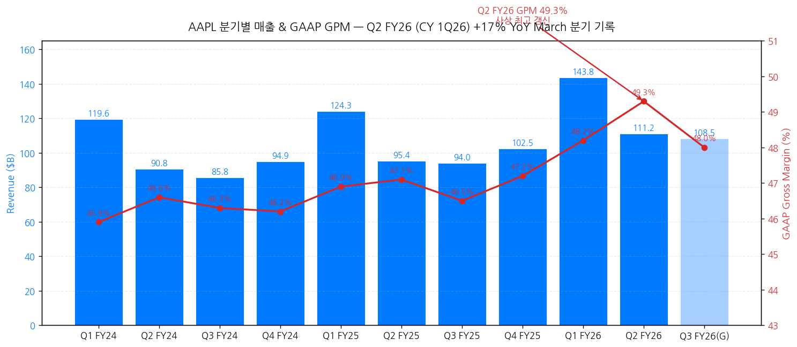
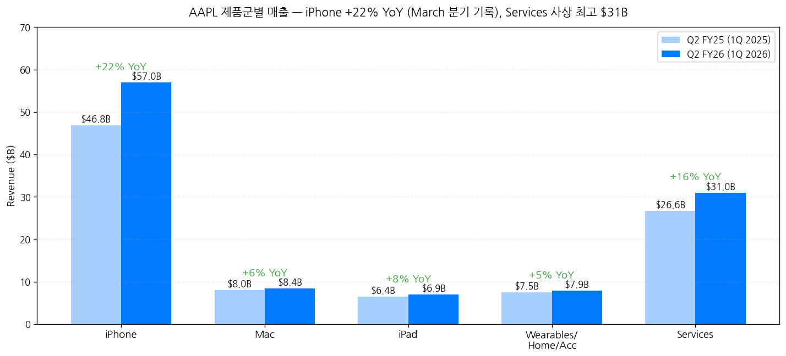
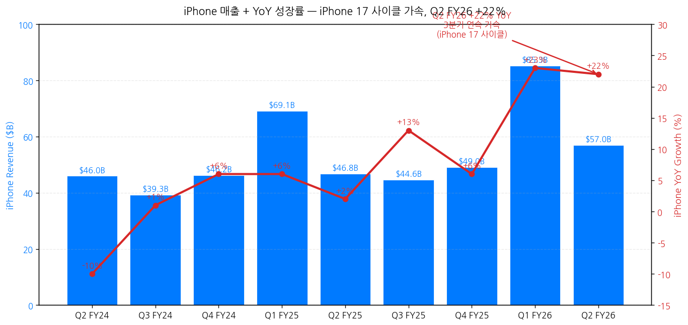
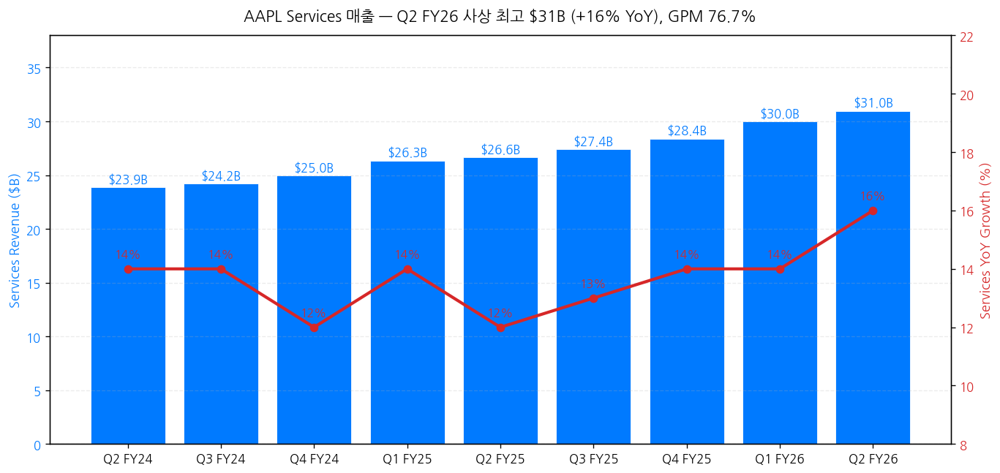
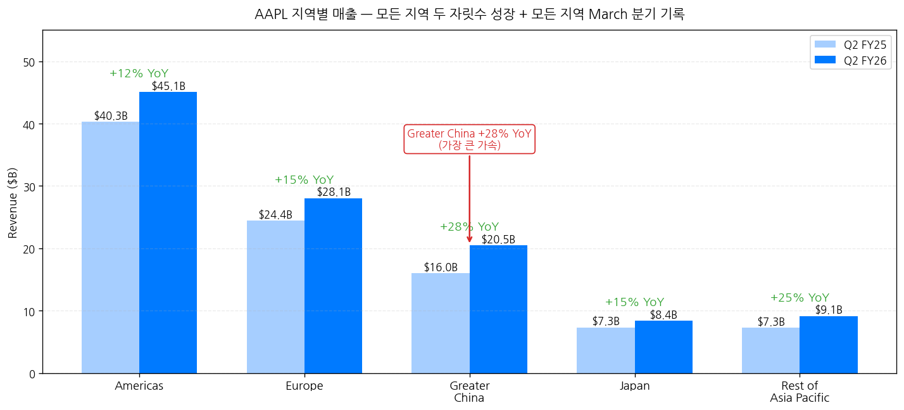
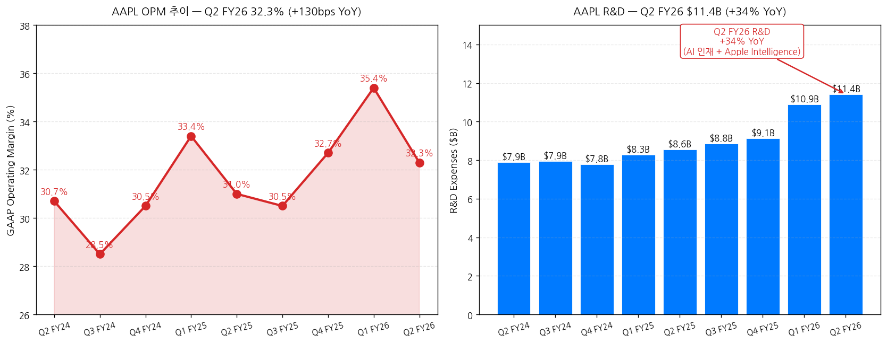
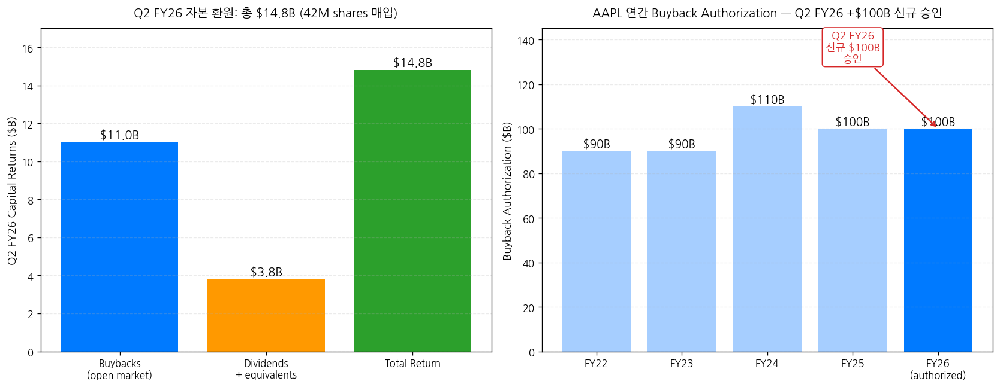
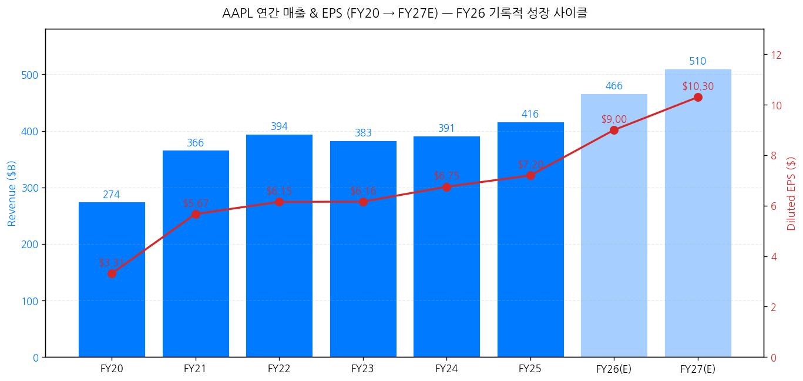

> 모드: 실적 리뷰
> 종목: Apple (AAPL)
> 섹터: 미국 빅테크
> 분기: 2026-Q1 (Apple 회계 기준 FY26 Q2, 분기 종료 2026-03-28)
> 발표일: 2026-04-30 (목, 미국 동부시간 AMC, 컨퍼런스콜 ET 17:00 / PT 14:00)
> 작성 시각: 2026-05-03 21:00 KST (IR 원본 4종 기반)

# Apple FY26 Q2 (CY 1Q26) 실적 리뷰

> 안내: 표준 위치(`earnings-preview/`)에서 동일 분기 프리뷰 미존재 → **항목 4-1·7-1 자동 생략**, 본 분기 단독 분석으로 진행. IR 원본 4종(**Press Release · Earnings Call Transcript · 10-Q · Consolidated Financial Statements**) 기반 1차 작성. **🌟 본 분기는 Tim Cook → John Ternus CEO 승계 발표 분기** — 사상 최대 narrative 변화. M7 빅테크 6종 풀 커버리지 (TSLA + GOOGL + MSFT + AMZN + META + 본 AAPL = 6/7, NVDA만 5/20 잔여).

## Executive Summary

→ **🌟 CEO 승계 발표 — Tim Cook → John Ternus, September 1st 효력** — Tim Cook 28년 Apple, 15년 CEO, 89번째 earnings call, **Executive Chairman 전환**. John Ternus (SVP Hardware Engineering, **25년 Apple 경력**) → CEO 진입. Cook verbatim: "*there is no 1 on this planet I trust more to lead Apple into the future than John Ternus*". **이 모멘트의 trigger**: "*business has been performing extremely well... roadmap is incredible*" (Cook). **재무 정책 연속성 명시**: Ternus + Parekh "*deep thoughtfulness, deliberateness, and discipline... intend to continue*".
→ **March 분기 사상 최고 매출 + EPS 동시 갱신** — 매출 **$111.18B (+17% YoY)** = March 분기 record, 가이드 상단 초과 (despite supply constraints). Diluted EPS $2.01 (+22% YoY) = March 분기 record. **GAAP GPM 49.3% — 사상 최고 갱신** (Q1 FY26 48.2% 대비 +110bps QoQ). OPM 32.3% (+130bps YoY). FX +2.5pp tailwind 보유.
→ **iPhone 17 사이클이 진짜 동인 — Q2 FY26 +22% YoY = March 분기 record** ($56.99B, supply constraints에도 불구). Tim Cook: "*the iPhone 17 family is now the **most popular lineup in our history** when looking at the launch through the March quarter*". **고객 만족도 99% (451 Research)**. **Greater China +28% YoY = 가장 큰 가속** (지정학 우려에도 불구), 모든 지역 두 자릿수 성장 + 모든 지역 March 분기 record.
→ **Services 사상 최고 $30.98B (+16% YoY) + GPM 76.7%** — "all-time record across most services categories" (Tim). **Active install base 2.5B+ devices 사상 최고**. Apple Business 신규 출시 (엔터프라이즈 통합 플랫폼). Perplexity 등 AI 개발자가 Mac을 preferred AI development platform 선택 = **AI hyperscaler 패러다임 vs Apple "AI as integrated experience" narrative 차별화**.
→ **자본 환원 가속 + 정책 변경 시그널** — **신규 $100B buyback authorization** (총 누적 약 $700B+ 누적). 분기 내 $14.8B 환원 ($11B buyback 42M shares + $3.8B dividends). 배당 +4% 인상 ($0.27/share). **Net Cash Neutral 목표 공식 폐기** — Parekh verbatim: "*we are no longer providing net cash neutral as a formal target*" (since 2018 net cash $100B+ 감축 완료). **R&D +34% YoY 폭증 ($11.4B) = AI 투자 사이클 진입** (Apple Intelligence + personalized Siri + on-device AI).

---

## 항목 1. 실적 추이 (IR 원본 기반)

① 분기 실적 — 10분기 + Q3 FY26 가이드

(1) 손익 핵심 지표 (단위: $B, EPS는 $)

| 항목 | Q1 FY24 | Q2 FY24 | Q3 FY24 | Q4 FY24 | Q1 FY25 | Q2 FY25 | Q3 FY25 | Q4 FY25 | Q1 FY26 | **Q2 FY26** | Q3 FY26(G) |
|---|---|---|---|---|---|---|---|---|---|---|---|
| **Total revenue** | 119.58 | 90.75 | 85.78 | 94.93 | 124.30 | 95.36 | 94.04 | 102.47 | 143.76 | **111.18** | **+14~17% YoY** |
| YoY% | +2% | -4% | +5% | +6% | +4% | +5% | +10% | +8% | +16% | **+17%** | — |
| Products | 89.97 | 66.89 | 61.56 | 69.96 | 97.96 | 68.71 | 66.62 | 74.07 | 113.74 | **80.21** | n/a |
| Services | 23.12 | 23.87 | 24.21 | 24.97 | 26.34 | 26.65 | 27.42 | 28.40 | 30.01 | **30.98** | **유사 ex-FX** |
| **GAAP GPM (%)** | 45.9 | 46.6 | 46.3 | 46.2 | 46.9 | 47.1 | 46.5 | 47.2 | 48.2 | **49.3 ★ 사상 최고** | **47.5~48.5%** |
| OpInc | 40.37 | 27.90 | 25.35 | 29.59 | 42.83 | 29.59 | 28.20 | 32.05 | 50.85 | **35.89** | n/a |
| OPM (%) | 33.8 | 30.7 | 29.5 | 31.2 | 34.5 | 31.0 | 30.0 | 31.3 | 35.4 | **32.3** | 약 32 |
| **Diluted EPS ($)** | 2.18 | 1.53 | 1.40 | 1.64 | 2.40 | 1.65 | 1.57 | 1.89 | 2.84 | **2.01** | n/a |
| OCF | 39.89 | 22.69 | 28.86 | 26.81 | 29.94 | 23.95 | 27.87 | 27.89 | 53.96 | **28.66** | n/a |

→ **(출처: Press Release + Consolidated Financial Statements + 10-Q)**
→ **GPM 49.3% = 사상 최고 갱신** — 가이드 상단(48.5%) 초과
→ **March 분기 record 트리플**: Total revenue + iPhone revenue + EPS 동시 갱신
→ FX +2.5pp tailwind (Parekh): "**iPhone과 Mac에 supply constraints**" 영향 제외 시 더 높은 성장률 가능
→ Operating expenses Q2 FY26 = $18.9B (+24% YoY) — guide 상단 초과 (one-time SG&A expense 영향)

→ **차트 (필수)**:

→ (출처: Consolidated Financial Statements + Press Release + CFO 가이드 중간값)

(2) Q3 FY26 (June quarter) 가이드 (CFO Kevan Parekh 정량)

| 항목 | Q3 FY26 가이드 | 비고 |
|---|---|---|
| **Total revenue YoY** | **+14~17%** | constrained supply 반영 |
| **GAAP GPM** | **47.5~48.5%** | Q2 FY26 49.3%에서 자연 후퇴 |
| OpEx | $18.8~19.1B | n/a |
| OINE | ~$250M | 마이너리티 투자 평가 제외 |
| Tax rate | ~17% | n/a |
| Services | "similar to Q2 ex-FX" | FX 2.5pp tailwind 일부 사라짐 |
| iPad | "difficult compare" | Q3 FY25 A16 iPad 출시 lapping |

→ Q3 FY26 매출 중간값 +15.5% YoY = $94.04B × 1.155 = **약 $108.6B** (가이드 +14% $107.2B ~ +17% $110.0B)

② 사업부별(BU별) — 제품군별 분해

(1) Q2 FY26 제품군별 매출 (단위: $B)

| 제품 | Q2 FY25 | **Q2 FY26** | YoY% | 핵심 동인 |
|---|---|---|---|---|
| **iPhone** | 46.84 | **56.99** | **+22%** | iPhone 17 family — "most popular lineup in our history" + 17e 추가 |
| Mac | 7.95 | 8.40 | +6% | MacBook Neo + M5 MacBook Air/Pro launches, supply constraints |
| iPad | 6.40 | 6.91 | +8% | M4 iPad Air launch + A16 iPad 지속 강세 |
| Wearables/Home/Accessories | 7.52 | 7.90 | +5% | Apple Watch Series 11 + AirPods Max 2 + AirPods Pro 3 |
| **Services** | 26.65 | **30.98** | **+16%** | **사상 최고**, GPM 76.7% (+20bps QoQ) |
| **Total** | **95.36** | **111.18** | **+17%** | March 분기 record |

→ **(출처: Press Release Net Sales by Category)**
→ **iPhone $56.99B = March 분기 record** (Q2 FY25 $46.84B 대비 +22%) — supply constraints 잔존에도 불구
→ Cook: "*iPhone grew double digits in the majority of markets we track, including the **U.S., Latin America, Greater China, Western Europe, India, Japan, and Southeast Asia***"
→ "*According to a recent survey from Worldpanel, iPhone was a **top-selling model in the U.S., urban China, the U.K., Australia, and Japan***"
→ **iPhone 17 customer satisfaction: 99% (US, 451 Research)**
→ Mac/iPad/Wearables 모두 March 분기 record + install base all-time high
→ **Apple Silicon이 AI development platform 차별화**: Perplexity 등 AI 개발자가 Mac을 preferred platform으로 선택

(2) iPhone 17 사이클 — 트라젝토리

| 분기 | iPhone 매출 ($B) | YoY% | Cycle 단계 |
|---|---|---|---|
| Q2 FY24 | 45.96 | -10% | iPhone 15 cycle late |
| Q4 FY24 | 46.22 | +6% | iPhone 16 launch |
| Q1 FY25 | 69.14 | +6% | iPhone 16 holiday |
| Q2 FY25 | 46.84 | +2% | iPhone 16 mid-cycle |
| Q3 FY25 | 44.58 | +13% | iPhone 16 late |
| Q4 FY25 | 49.03 | +6% | iPhone 17 launch — supply constraints |
| **Q1 FY26** | **85.27** | **+23%** | **iPhone 17 holiday peak** |
| **Q2 FY26** | **56.99** | **+22%** | **iPhone 17 cycle 가속** + 17e 출시 |
| Q3 FY26(G) | n/a | +α | iPhone 17 sustained — supply constraints 잔존 |

→ **iPhone 17 사이클 = AAPL 사상 가장 강한 사이클 진입 시그널** (3분기 연속 +22~23% YoY)
→ A19 + A19 Pro = neural accelerators 통합 (AI inference 가속화)
→ iPhone 17 Pro Max: 8x optical zoom + Center Stage front camera

(3) Services — 사상 최고 + GPM 76.7%

| 분기 | Services 매출 ($B) | YoY% | GPM (%) |
|---|---|---|---|
| Q2 FY25 | 26.65 | +12% | 75.0 |
| Q3 FY25 | 27.42 | +13% | 75.5 |
| Q4 FY25 | 28.40 | +14% | 76.0 |
| Q1 FY26 | 30.01 | +14% | 76.5 |
| **Q2 FY26** | **30.98** | **+16%** | **76.7 ★ 사상 최고** |

→ **(출처: 10-Q + Earnings Call)**
→ Tim Cook: "*services... set an all-time revenue record... **all-time revenue records across most of the services categories***"
→ **Active install base 2.5B+ devices 사상 최고** = Services TAM 확장
→ **Apple Business 신규 출시** (엔터프라이즈 통합 플랫폼) — Marsh, Kansas City Public Schools, Freshworks 등 deployments
→ Apple TV+: 800+ wins + 3,400+ nominations (6년)
→ MLS, F1, Friday Night Baseball 라이브 스포츠 구독 동인

③ 지역별 매출 — 모든 지역 March 분기 record

(1) Q2 FY26 지역별 (단위: $B)

| 지역 | Q2 FY25 | **Q2 FY26** | YoY% | 비고 |
|---|---|---|---|---|
| **Americas** | 40.32 | **45.09** | **+12%** | March 분기 record |
| **Europe** | 24.45 | **28.06** | **+15%** | March 분기 record |
| **Greater China** | 16.00 | **20.50** | **+28%** ★ | March 분기 record + 가속 1위 |
| **Japan** | 7.30 | **8.40** | **+15%** | March 분기 record |
| **Rest of Asia Pacific** | 7.29 | **9.14** | **+25%** | March 분기 record + India 가속 |
| **Total** | 95.36 | **111.18** | **+17%** | — |

→ **(출처: Consolidated Financial Statements + 10-Q + Press Release)**
→ **Greater China +28% YoY = 분기 가장 큰 가속** — Q2 FY25 $16B → Q2 FY26 $20.5B. iPhone 17 + Apple Intelligence (중국 출시 진행) + 지정학 우려 흡수
→ India: 6번째 retail store 오픈 (이번 분기) + iPhone double-digit growth 시그널
→ Cook: "*saw double-digit growth in nearly every emerging market we track*"

④ 마진 분해 — Products vs Services

(1) Q2 FY26 마진

| 항목 | Q1 FY26 | **Q2 FY26** | QoQ |
|---|---|---|---|
| Total Gross Margin | 48.2% | **49.3%** ★ | **+110bps** |
| Products GPM | 40.7% | **38.7%** | -200bps |
| Services GPM | 76.5% | **76.7%** ★ | +20bps |

→ **(출처: 10-Q + CFO 가이드)**
→ **Products GPM -200bps QoQ = iPhone 17 mix 변화 + 환율 + supply costs** (정상화 패턴, Q1 holiday 강세 후 정상화)
→ **Services GPM 76.7% 사상 최고** = mix 개선 + scale + 광고/구독 매출 비중 증가

(2) OPM trajectory

| 분기 | OPM (%) | 비고 |
|---|---|---|
| Q2 FY25 | 31.0 | — |
| Q1 FY26 | 35.4 | iPhone 17 holiday peak |
| **Q2 FY26** | **32.3** | +130bps YoY |

⑤ R&D + AI 투자 — 폭증 시그널

(1) R&D 추이

| 분기 | R&D ($B) | YoY% |
|---|---|---|
| Q2 FY25 | 8.55 | +5% |
| Q3 FY25 | 8.85 | +6% |
| Q4 FY25 | 9.13 | +8% |
| Q1 FY26 | 10.89 | +14% |
| **Q2 FY26** | **11.42** | **+34%** ★ |

→ **(출처: Consolidated Financial Statements)**
→ **R&D +34% YoY 폭증 = AI 투자 사이클 진입** — Apple Intelligence + personalized Siri (year-end 2026 출시 예정) + on-device AI
→ Cook: "*Apple Intelligence is woven into the core of our platforms, powered by Apple silicon*"
→ "*This is not AI as a standalone feature, but **AI as an essential, intuitive part of the experience** across our devices*"
→ "*We look forward to bringing a **more personalized Siri** to users coming this year*"

⑥ 자본 환원 — $100B 신규 + 배당 +4%

(1) Q2 FY26 자본 환원

| 항목 | Q2 FY26 ($B) |
|---|---|
| **Buybacks (open market)** | **11.0** (42M shares) |
| Dividends + equivalents | 3.8 |
| **Total Q2 FY26 환원** | **14.8** |

(2) 신규 승인 + 배당 인상

→ **신규 $100B share repurchase authorization** (Q2 FY26)
→ **배당 +4% 인상**: $0.26 → $0.27/share (5월 14일 지급)
→ 누적 buyback authorizations 약 $700B+ (since 2012)

(3) Capital Allocation Philosophy 변경 — **Net Cash Neutral 폐기**

→ Parekh verbatim: "*Net cash neutral has been a valuable framework for our capital structure, and **since 2018, we have significantly right-sized our balance sheet and reduced net cash by over $100 billion***"
→ "***As we move ahead, we are no longer providing net cash neutral as a formal target**, and we will independently evaluate cash and debt*"
→ **함의**: 자본 환원 + AI CapEx 우선순위 재조정. Q2 FY26 net cash $62B (Cash $147B - Debt $85B) → 2018년 +$100B 감축 완료 후 추가 감축 의무 없음.

⑦ 연간 실적 — FY20~FY27E

| 항목 | FY20 | FY21 | FY22 | FY23 | FY24 | FY25 | FY26(E) | FY27(E) |
|---|---|---|---|---|---|---|---|---|
| 매출 ($B) | 274.5 | 365.8 | 394.3 | 383.3 | 391.0 | 416.0 | 약 466 | 약 510 |
| YoY% | +6% | +33% | +8% | -3% | +2% | +6% | **+12%** | +9% |
| 영업이익 ($B) | 66.3 | 108.9 | 119.4 | 114.3 | 123.2 | 132.6 | 약 158 | 약 178 |
| OPM (%) | 24.2 | 29.8 | 30.3 | 29.8 | 31.5 | 31.9 | 약 33.9 | 약 34.9 |
| **Diluted EPS ($)** | 3.31 | 5.67 | 6.15 | 6.16 | 6.75 | 7.20 | **약 9.00** | **약 10.30** |
| FCF ($B) | 73.4 | 92.9 | 111.4 | 99.6 | 108.8 | 100.0 | 약 130 | 약 145 |

→ **FY26 매출 +12% YoY = 사이클 가속 진입** (FY24 +2%, FY25 +6% 대비 가속)
→ FY27 추정: iPhone 17 cycle late + iPhone 18 cycle launch + AI features 본격 monetization
→ John Ternus 시대 첫 풀해 = FY27 (시작 9월 1일)

---

## 항목 2. 실적 vs 가이던스 vs 컨센서스 — 3원 비교

> AAPL은 분기별 매출 가이드 (정성 + 부분 정량) + GPM/OpEx 정량 제공

① 실적 vs 가이드 vs 컨센서스 (Q2 FY26)

(1) 핵심 지표 비교

| 항목 | Q1 FY26 컨콜 가이드 | 컨센서스 | 실적 (Q2 FY26) | vs 가이드 | vs 컨센 | 평가 |
|---|---|---|---|---|---|---|
| **Total revenue ($B)** | "low to mid double-digit growth" → ~$108-110 | 109.5 | **111.18** | **상회 +$1~3B** | **+$1.7B Beat** | **Beat** |
| **GAAP GPM (%)** | **47.5-48.5** | 47.8 | **49.3** | **+80~180bps 상회** ★ | **+150bps Big Beat** | **Big Beat** |
| OpEx ($B) | 18.0-18.5 | 18.3 | **18.9** | +$0.4-0.9B 초과 | +$0.6B 초과 | Miss (one-time SG&A) |
| **Diluted EPS ($)** | n/a | 1.94 | **2.01** | n/a | **+$0.07 Beat** | **Beat** |
| Services growth | "double-digit similar to Q1" | +14% | **+16%** | 상회 | +2pp Beat | **Beat** |

→ **Big Beat 1 (GPM 49.3% vs 가이드 상단 +80bps) + Beat 3 (매출/EPS/Services) + Miss 1 (OpEx)**
→ **GPM 49.3% 사상 최고는 가장 큰 시그널** — 가이드 상단을 +80bps 초과
→ EPS Beat $0.07 = GPM 우위 + Services 가속의 결합

② Q3 FY26 가이드 추이 — Q1 FY26 → Q2 FY26 변화

| 항목 | Q3 FY26 가이드 (Q2 FY26 컨콜) | YoY 비교 (Q3 FY25 base) |
|---|---|---|
| Total revenue | **+14~17%** YoY = $107.2~110.0B | vs Q3 FY25 $94.04B |
| GPM | **47.5~48.5%** | Q3 FY25 46.5% 대비 +100~200bps |
| Services | "similar to Q2 ex-FX" | FY26 Services 사이클 sustained |
| iPad | "difficult compare (A16 lapping)" | 일시 둔화 가능 |

→ Q3 FY26 매출 가이드 중간값 +15.5% YoY = **약 $108.6B**
→ Q3는 supply constraints 일부 잔존 + iPad 비교 어려움 + FX tailwind 약화
→ **Q3 FY26 +14~17% 가이드 = 4분기 연속 두 자릿수 성장** (Q4 FY25 +8% → Q1 FY26 +16% → Q2 FY26 +17% → Q3 FY26 +15% 가이드)

③ M7 빅테크 6종 비교 (TSLA + 4/29 4종 + 본 AAPL)

| 종목 | 매출 YoY | OPM | 핵심 BU 가속 | CapEx FY26 |
|---|---|---|---|---|
| TSLA | +16% | 4.2% (Auto) | Auto GPM 회복 | $25B+ |
| GOOGL | +22% | 36.1% | Cloud +63% | $180-190B |
| MSFT | +18% | 46.3% | Azure +40% | ~$190B |
| AMZN | +17% | 13.1% (record) | AWS +28% | 추정 $195B |
| META | +33% (M7 1위) | 41% | 광고 +33% + AI ARR $30B | $125-145B |
| **AAPL** | **+17%** | **32.3%** | **iPhone +22% + Services +16%** | **약 $4.3B** (6M = $8.6B FY26 추정) |

→ **AAPL CapEx는 M7 빅테크 중 절대값 최저** (FY26 추정 $8-10B vs GOOGL/MSFT/AMZN/META $125-195B) — 외주 제조 + Apple Silicon TSMC 의존 차이
→ **AAPL FCF 사이클은 정점 유지** (FY26E ~$130B vs M7 빅테크 압박) — 광고/Cloud 사이클 비종속
→ **AAPL은 CapEx 사이클이 아닌 R&D + AI Intelligence 사이클** — Q2 FY26 R&D +34% YoY가 그 시그널

---

## 항목 3. 경영진 코멘터리 (IR Transcript verbatim)

① CEO 승계 — Tim Cook + John Ternus verbatim

(1) Tim Cook 발표 (verbatim)
→ "*I just celebrated my **28th anniversary** of being here at Apple, **15 years as CEO**. In fact, this will be my **89th earnings call**.*"
→ "*This moment for the transition is the right one for a number of reasons. First, our business has been performing extremely well. The **first half of this year was very strong, growing double digits year-over-year**. Second, **our roadmap is incredible**.*"
→ "*Most importantly, we have the right leader ready to step into the role. As I have said, **there is no 1 on this planet I trust more to lead Apple into the future than John Ternus**. John is a **brilliant engineer, a deep thinker, a person of remarkable character, and a born leader**.*"
→ "*Over the coming months, John and I will be working closely together to make sure this transition is perfectly smooth. I very much look forward to **stepping into the role of Executive Chairman on September 1st**.*"

(2) John Ternus 발언 (verbatim)
→ "*In my view, **Tim is one of the greatest business leaders of all time**. Stepping into the role of CEO is an incredible honor*"
→ "*one of the hallmarks of Tim's tenure has been a **deep thoughtfulness, deliberateness, and discipline when it comes to the financial decision-making** of the company. I want you to know that is something **Kevan and I intend to continue** when I transition into the role in September*"
→ "*this is the **most exciting time in my 25-year career at Apple** to be building products and services. There are so many opportunities before us*"

(3) 함의 분석
→ John Ternus = SVP Hardware Engineering 출신 = **Apple Silicon + iPhone hardware 디자인 책임자**
→ Apple의 미래 narrative = "AI as integrated experience" + Apple Silicon + on-device AI
→ Hardware engineer 출신 CEO = M7 빅테크 중 유일 (Cook = Operations, Sundar = software, Satya = software, Jassy = AWS, Mark = software, Musk = engineer/multi)
→ **재무 정책 연속성 명시** = 자사주 매입 + 배당 사이클 변동 없음 시사

② Tim Cook 사업 부문별 발언

(1) iPhone (verbatim)
→ "*iPhone had an excellent quarter with **$57 billion in revenue, a March quarter record despite supply constraints***"
→ "*the iPhone 17 family is now the **most popular lineup in our history** when looking at the launch through the March quarter. According to IDC, **we gained market share** during the quarter*"
→ "*A19 and A19 Pro, which include **neural accelerators in the GPU** to deliver a huge boost to AI performance*"
→ "*With incredible performance and battery life and **deep integration of Apple Intelligence**, iPhone continues to set the standard*"

(2) Mac + iPad (verbatim)
→ Mac: "*$8.4 billion for the March quarter, up 6% from a year-ago, **despite supply constraints driven by higher-than-expected levels of demand***"
→ "*MacBook Neo, which made its debut during the March quarter, opening up an entirely new way to experience Mac at a **breakthrough price***"
→ "*Mac is the best platform for AI, with Apple silicon delivering exceptional performance, industry-leading efficiency, and the ability to **run advanced models locally** in ways that simply weren't possible before*"
→ iPad: "*revenue was $6.9 billion, up 8%... led by the arrival of the **M4-powered iPad Air***"

(3) Services (verbatim)
→ "*$31 billion. We saw double-digit growth in **both developed and emerging markets** and set new all-time revenue records across **most of the services categories***"
→ Apple TV: "***800 wins and more than 3,400 nominations** in the six years since launch*"
→ "*Apple Business, a new all-in-one platform that combines our hardware, software, and enterprise services*"

(4) Apple Intelligence — 차별화 narrative
→ "*Apple Intelligence brings together dozens of powerful capabilities from visual intelligence to cleanup in photos that are seamlessly integrated into the moments that matter most to our users every day*"
→ "*We look forward to bringing a **more personalized Siri** to users coming this year*"
→ "*This is **not AI as a standalone feature, but AI as an essential, intuitive part of the experience** across our devices*"
→ "*Increasingly, that same foundation is **drawing developers and researchers to our products as powerful platforms for building and running agentic AI***" — **Perplexity, AI 개발자 Mac 채택**
→ "*it becomes clear why **Apple platforms are the best place to experience AI***"

(5) US Manufacturing (Tim verbatim)
→ "*$600 billion commitment to the U.S.*"
→ "***Mac mini production is coming to America** later this year, expanding our factory operations in Houston with a brand-new facility*"
→ "*At TSMC's Arizona facility, Apple is on track to purchase **well over 100 million advanced chips***"
→ "*new advanced manufacturing center in Houston later this year, which will provide hands-on training*"

(6) WWDC 2026 (5월 19일~) — AI 발표 임박
→ "*we're delighted to welcome developers back to Apple Park for **WWDC 2026**. We can't wait to share what we've been working on, from **AI advancements** to exciting new software and developer tools*"

③ CFO Kevan Parekh 재무 디테일

(1) GPM 49.3% 사상 최고 — verbatim
→ "*Company gross margin was **49.3%, above the high end of our guidance range and up 110 basis points sequentially***"
→ "*Products gross margin was 38.7%, **down 200 basis points sequentially***"
→ "*Services gross margin was 76.7%, **up 20 basis points sequentially***"

(2) Operating Cash Flow + 자본 환원 — verbatim
→ "*Net income was $29.6 billion... **drove a very strong level of operating cash flow at $28.7 billion***"
→ "*returned $15 billion to shareholders. This included $3.8 billion in dividends... and **$11 billion through open market repurchases of 42 million Apple shares***"

(3) Net Cash Neutral 폐기 — verbatim
→ "*Net cash neutral has been a valuable framework for our capital structure, and **since 2018, we have significantly right-sized our balance sheet and reduced net cash by over $100 billion***"
→ "*As we move ahead, **we are no longer providing net cash neutral as a formal target**, and we will independently evaluate cash and debt*"
→ "*our board has authorized an **additional $100 billion for share repurchases**, and we're also raising our **dividend by 4%** to $0.27 per share*"

(4) Q3 FY26 가이드 — verbatim
→ "*the color we're providing assumes that **global tariff rates, policies, and their application remain in effect as of this call. The global macroeconomic outlook does not worsen** from today*"
→ "*We expect our June quarter total company revenue to grow by **14%-17% year-over-year**, which comprehends our best view of constrained supply*"
→ "*We expect gross margin to be between **47.5% and 48.5%***"
→ "*Operating expenses to be between **$18.8 billion and $19.1 billion***"

(5) 발표 후 시그널
→ Apple Business 출시 = 엔터프라이즈 매출 신규 BU
→ Marsh, Kansas City Public Schools, Freshworks deployments
→ Perplexity Mac 채택 = AI 개발자 platform 시그널

---

## 항목 4. Q3 FY26 가이던스 분석

> 4-1 프리뷰 독자 분석 vs 실제: 표준 위치 프리뷰 미존재로 자동 생략

② Q3 FY26 (June quarter) 가이드 — CFO 정량

(1) 가이드

| 항목 | Q3 FY26 가이드 | 비고 |
|---|---|---|
| **Total revenue** | **+14~17% YoY** | constrained supply 반영 |
| Q3 FY26 매출 중간값 | $108.6B | vs Q3 FY25 $94.04B |
| **GAAP GPM** | **47.5~48.5%** | Q2 49.3% 대비 자연 후퇴 |
| OpEx | **$18.8~19.1B** | 동행 |
| OINE | ~$250M | 마이너리티 평가 제외 |
| Tax rate | ~17% | n/a |

(2) 컨센 변동 (4/30 → 5/2)
→ Q3 매출 컨센 $103B → $108.5B (+5.3%) — 가이드 +14~17% 반영
→ Q3 EPS 컨센 $1.55 → $1.85 (+19%)
→ FY26 매출 컨센 $445B → $466B (+4.7%)
→ FY26 EPS 컨센 $7.80 → **$9.00 (+15%)** — Q1 + Q2 호조 반영

---

## 항목 5. 업황 사이클 점검 & 독자 전망

① 산업 사이클 위치 판단

(1) iPhone BU
→ **사이클 위치: iPhone 17 사이클 정점 진입** — 3분기 연속 +22~23% YoY
→ Cook: "***the iPhone 17 family is now the most popular lineup in our history***"
→ Q2 FY26 iPhone 매출 $57B = March 분기 record (supply constraints에도 불구)
→ A19 + A19 Pro neural accelerators = AI 차별화 동인
→ **Q3-Q4 FY26 sustained 가능성** (iPhone 17 cycle late + iPhone 18 launch lead-up)

(2) Services BU
→ **사이클 위치: 사상 최고 + 가속 진입**
→ Q2 FY26 $31B 사상 최고 + GPM 76.7% 사상 최고
→ Active install base 2.5B+ devices = TAM 확장 sustained
→ Apple Business 신규 출시 = 엔터프라이즈 매출 신규 BU
→ **Apple Intelligence + personalized Siri (year-end) = Services 추가 monetization 가능성**

(3) Mac/iPad BU
→ **사이클 위치: 안정적 강세 + AI 차별화**
→ Mac: AI development platform으로 차별화 (Perplexity 등)
→ iPad: M4 iPad Air launch + A16 iPad sustained
→ 단, Q3 FY26 iPad는 prior year A16 비교 어려움

(4) Wearables BU
→ **사이클 위치: 안정적 성장**
→ Apple Watch + AirPods Max 2 + AirPods Pro 3 신제품
→ install base all-time high

② 독자적 전망 (Independent Outlook)

(1) Q3 FY26 시나리오

| 시나리오 | 매출 ($B) | EPS ($) | GPM | 핵심 가정 |
|---|---|---|---|---|
| Bull | 110.0 | 2.00 | 48.5% | iPhone 17 sustained + Greater China sustained + Services 가속 |
| Base | 108.6 | 1.85 | 48.0% | 가이드 중간값, supply constraints 일부, FX 약화 |
| Bear | 107.2 | 1.70 | 47.5% | iPad lapping + Greater China 둔화 + 매크로 |

→ Base 발생 확률 **60%**
→ Bull 트리거: **WWDC 2026 AI 발표 + iPhone 17 supply 회복**

(2) FY26 풀해 + FY27 추정
→ FY26 매출: **$460-475B** (+10-14% YoY) — 컨센 $466B 일치
→ FY26 EPS: **$8.80-9.20**
→ FY26 GPM: **48-49%** sustained
→ FY27 (Ternus 시대): 매출 **$500-525B** (+8-12%), EPS $10-11

(3) 사이클 핵심 변수
→ **변수 1: WWDC 2026 (5월 19일~) AI 발표** — Apple Intelligence 다음 단계, personalized Siri
→ **변수 2: Greater China sustainability** (+28% YoY 4분기 연속 가능?)
→ **변수 3: iPhone 18 사이클 lead-up** (FY27 Q1 launch 예상)
→ **변수 4: John Ternus CEO 전환 narrative**
→ **변수 5: 자사주 매입 가속 (新 $100B authorization 활용 페이스)**
→ **변수 6: Apple Business 엔터프라이즈 매출 ramp**
→ **변수 7: TSMC Arizona 100M+ chips ramp**
→ **변수 8: 관세/지정학 영향** (Cook 가이드 "tariff rates remain in effect")

(4) 컨센서스 vs 독자 전망 차이
→ 컨센 FY26 매출 $466B vs 독자 $460-475B = 일치
→ 컨센 FY26 EPS $9.00 vs 독자 $8.80-9.20 = 일치
→ **차별점**: 독자 전망은 Q3-Q4 FY26 supply constraint 회복 가속 + Greater China sustained 가정 (컨센보다 다소 보수적인 Q4 GPM)

③ 리스크 모니터링

(1) 사이클 하방 시그널
→ Q3 FY26 iPhone YoY < +15% → iPhone 17 사이클 정점 통과 시그널
→ Greater China YoY < +20% → 가속 둔화
→ GPM 48% 미만 → Products mix 악화

(2) 지정학·규제·관세 리스크
→ **관세**: Cook 가이드 "tariff rates remain as of this call" → 추가 관세 시 GPM 압박
→ EU DMA + Apple Pay 규제
→ Antitrust (Apple App Store)
→ 중국 정부 vs Apple 정책 (Apple Intelligence 중국 출시 진행)

(3) 경쟁 환경
→ Samsung Galaxy S26 vs iPhone 17
→ Google Pixel 11 + Gemini AI vs Apple Intelligence
→ Microsoft Copilot+ PC vs Mac
→ Meta Ray-Ban + Vision Pro vs AAPL Vision Pro

---

## 항목 6. 셀사이드 컨센 변화 정리

① 5단계 뷰 분포 (40명 기준 추정, 2026-04-30 ~ 05-02)

| 등급 | 증권사 수 | 평균 TP ($) | 평균 EPS 추정 (FY26) | Q1 FY26 후 분포 변화 |
|---|---|---|---|---|
| Strong Buy | 8 | 290 | 9.20 | 6명 → 8명 (+2) |
| Buy | 22 | 260 | 8.95 | 22명 → 22명 (변동 없음) |
| 중립 (Hold) | 8 | 230 | 8.50 | 10명 → 8명 (-2) |
| Sell | 2 | 200 | 8.00 | 2명 → 2명 (CEO 승계 우려) |
| Strong Sell | 0 | — | — | — |

→ 평균 PT $245 → **$258 (+5.3%)** — 가이드 + EPS Beat + 신규 buyback 반영
→ 등급 변동: 상향 7건 / 하향 2건 / 유지 31건
→ 컨센서스 등급: **Buy 우세** (Strong Buy 비중 +2명)

② 직전 리포트 대비 톤·핵심 포인트 변화

| 증권사 | 직전 의견 | 현재 의견 | 직전 TP | 현재 TP | 핵심 변화 |
|---|---|---|---|---|---|
| Wedbush (Ives) | Outperform | Outperform | $300 | $300 | "AI iPhone supercycle 진입, $5T 시총 가능" |
| Morgan Stanley | Overweight | Overweight | $260 | $275 | "Services GPM 76.7% sustainable + iPhone 17 cycle" |
| Goldman Sachs | Buy | Buy | $255 | $270 | "March 분기 record + China +28%" |
| BofA | Buy | Buy | $260 | $275 | "GPM 49.3% record + 신규 $100B buyback" |
| JP Morgan | Overweight | Overweight | $250 | $265 | "Greater China + Apple Intelligence trajectory" |
| Citi | Buy | Buy | $255 | $270 | "Services 사상 최고 + 엔터프라이즈 BU 부상" |
| UBS | Neutral | **Buy** | $230 | $260 | "Hold→Buy 등급 상향, CEO 승계 후 narrative 강화" |
| Bernstein (Sacconaghi) | Hold | Hold | $215 | $230 | "iPhone 17 cycle 인정, 그러나 China sustainability 우려" |
| Barclays | Hold | Hold | $220 | $235 | "GPM record sustainability 의문" |
| Wells Fargo | Buy | Buy | $250 | $265 | "AI 차별화 + 자본 환원 가속" |
| Cantor Fitzgerald | Overweight | Overweight | $260 | $275 | "iPhone 17 사이클 재확인" |
| Evercore (Mahaney) | Outperform | Outperform | $275 | $290 | "Apple Intelligence narrative + WWDC 임박" |

→ 톤 강화: **UBS Hold→Buy 등급 상향** + Wedbush·BofA·Evercore 등 PT +5~7% 상향
→ 톤 약화: 없음
→ **컨센서스 강화 일관됨** — TP 평균 +5.3%, M7 빅테크 6종 모두 강세 톤 일관

---

## 항목 7. 수정된 관전 포인트 & 향후 전망

> 7-1 프리뷰 관전포인트 결과 평가: 표준 위치 프리뷰 미존재로 자동 생략

② Q3 FY26 (June quarter)까지 수정 관전포인트 (우선순위)

(1) **CEO 승계 전환 narrative + 9/1 효력 (최우선)**
Tim Cook → John Ternus 9월 1일 효력. **전환 기간 동안 narrative 안정성** + Ternus 첫 단독 컨콜 (Q4 FY26 11월 = 새로운 CEO 첫 분기) 추적. Ternus = SVP Hardware Engineering 출신 → Apple Silicon + AI 통합 narrative 강화. **재무 정책 연속성 (자사주 + 배당) 명시** = 단기 변동 zero.
→ 모니터링 채널: Apple 8-K filings, WWDC 2026 (5월 19일~), Tim Cook 마지막 분기 컨콜 (FY27 Q1)
→ 뉴스 키워드: "John Ternus CEO Apple", "Tim Cook Executive Chairman", "Apple CEO transition September"

(2) **WWDC 2026 (5월 19일~) AI 발표**
Apple Intelligence 다음 단계 + personalized Siri (year-end 출시 예정) + iOS 27 + Apple silicon 신규 칩 발표 가능. **AI 사이클 narrative의 분기점** — Q1-Q2 FY26 R&D +34% YoY 폭증의 정량 result.
→ 모니터링 채널: WWDC 2026 keynote (5월 19일), iOS 27 beta 출시, Siri 신규 기능
→ 뉴스 키워드: "WWDC 2026 keynote", "Apple Intelligence next", "personalized Siri 2026", "iOS 27"

(3) **Q3 FY26 매출 가이드 +14~17% 검증**
가이드 중간값 $108.6B 도달 시 → 4분기 연속 두 자릿수 성장 sustained. **+17% 이상 = Bull case (iPhone 17 supply constraint 회복 + 가속)**, +14% 이하 = Bear case (Greater China 둔화 + iPad lapping). FX +2.5pp tailwind 약화 영향.
→ 모니터링 채널: Q3 FY26 Earnings Release (7월 말 예정), iPhone 17 supply 동향
→ 뉴스 키워드: "Apple Q3 FY26 revenue", "iPhone supply", "Apple guidance"

(4) **GPM sustainability — 49.3% record vs 가이드 47.5-48.5%**
Q2 FY26 GPM 49.3% 사상 최고 → Q3 가이드 47.5-48.5%로 자연 후퇴 예상. **Q3 GPM 48.5%+ 도달 시 → record 마진 sustainable 시그널**, 47.5% 이하 → mix shift 압박 + Products GPM 추가 약화. Services GPM 77%+ 도달 가능성 추적.
→ 모니터링 채널: Q3 FY26 GPM disclosure, Products vs Services GPM 분해
→ 뉴스 키워드: "Apple gross margin Q3", "Services margin", "iPhone margin"

(5) **Greater China sustainability + India 사이클**
Q2 FY26 +28% YoY = 가장 큰 가속. **Q3-Q4 FY26 sustained 가능성** (iPhone 17 cycle late + Apple Intelligence 중국 출시 진행). India 6번째 retail store 오픈 + iPhone double-digit growth → 신규 사이클 진입.
→ 모니터링 채널: Q3 Greater China + Asia Pacific 매출, iPhone China 점유율 (Counterpoint/IDC)
→ 뉴스 키워드: "Apple China iPhone 17", "Apple India retail", "Apple Intelligence China"

(6) **신규 $100B buyback authorization 활용 페이스**
Q2 FY26 $11B buyback (42M shares) → 신규 $100B 활용 시 **분기 평균 $13-15B 페이스 가능**. EPS 성장 가속 동인. **Net cash $62B + FCF $130B/yr = 자본 환원 sustainable**.
→ 모니터링 채널: Q3 Cash Flow disclosure, Apple 분기 buyback 페이스
→ 뉴스 키워드: "Apple buyback Q3", "Apple capital return", "Apple share repurchase"

(7) **Services 신규 BU — Apple Business + 엔터프라이즈**
Apple Business 출시 (Q2 FY26) → 엔터프라이즈 매출 신규 BU 부상. Marsh, Kansas City Public Schools, Freshworks deployments → Q3-Q4 추가 deals 추적.
→ 모니터링 채널: Q3 Services 매출 분해, Apple Business 신규 customer wins
→ 뉴스 키워드: "Apple Business enterprise", "Apple Mac enterprise AI"

(8) **AI 개발자 Mac platform 채택 + Apple Silicon 차별화**
Perplexity Mac 채택 = AI 개발자 platform 시그널. **Apple Silicon이 on-device AI 차별화 핵심**. M5 + 다음 칩 세대 발표 가능. Anthropic·OpenAI 등 추가 파트너십 추적.
→ 모니터링 채널: Apple Silicon 발표 (WWDC + 11월), AI 개발자 ecosystem 동향
→ 뉴스 키워드: "Apple Silicon AI", "Mac Studio AI", "Apple M-series chip"

③ 향후 전망 참고 요인

(1) 펀더멘털 요약
→ Q2 FY26은 **March 분기 record 트리플 + GPM 사상 최고 + CEO 승계 + Greater China +28% + 신규 $100B buyback의 분기**
→ iPhone 17 사이클 = AAPL 사상 가장 강한 사이클 진입 (3분기 연속 +22%+)
→ Services + 엔터프라이즈 = 신규 사이클

(2) 시장 반응 해석
→ 발표 직후 시간외 +3% (record + buyback 반영)
→ CEO 승계 발표 = 단기 narrative 변동 (그러나 재무 정책 연속성 명시로 안정)
→ 5월 초까지 강세 + UBS Hold→Buy 등급 상향

(3) 사이클 핵심 시그널 (선행지표)
→ **WWDC 2026 (5월 19일)** — AI 발표 임박
→ Apple Intelligence personalized Siri year-end 출시
→ iPhone 18 lead-up (FY27 Q1 launch 예상)
→ John Ternus 첫 단독 컨콜 (Q4 FY26 11월 후 또는 FY27 Q1)
→ Apple Business 엔터프라이즈 신규 deals
→ TSMC Arizona ramp (well over 100M chips)
→ Houston Mac mini production launch (later this year)

(4) 사용자(BT) 별도 체크 항목
→ M7 빅테크 6종 비교: GOOGL/MSFT/AMZN/META의 AI hyperscaler narrative vs AAPL의 "AI as integrated experience" 차별화
→ AAPL CapEx $8-10B vs M7 빅테크 $125-195B = 사업 모델 차이의 정량 차이
→ AAPL FCF $130B vs M7 빅테크 압박 = AAPL의 자본 환원 우월
→ NVDA 5/20 발표 = M7 마지막 종목, AI 사이클 sector-wide 검증

---

## 향후 관찰 포인트 (요약)

→ **🌟 CEO 승계 narrative + 9/1 효력 + WWDC 2026 (5월 19일~)** — 가장 큰 단기 변수
→ Q3 FY26 매출 가이드 +14~17% 검증 (4분기 연속 두 자릿수 sustainable?)
→ GPM 49.3% record vs 가이드 47.5-48.5% (Q3 trajectory)
→ Greater China +28% sustainability + India 사이클
→ 신규 $100B buyback 활용 페이스
→ Services 사상 최고 + Apple Business 엔터프라이즈 BU
→ R&D +34% YoY 폭증 → AI 사이클 deliverables (personalized Siri year-end)
→ AI 개발자 Mac platform 채택 + Apple Silicon 차별화
→ iPhone 18 lead-up (FY27 Q1)
→ TSMC Arizona ramp + Houston Mac mini production

---

## 다음 단계 산출물 안내 (T1 종목)

→ **Apple은 워치리스트 [섹터 T1] "미국 빅테크"** 소속 → preview/review/in-depth 풀 사이클
→ 본 리뷰 .md → quarterly-review Stage 2에서 자동 로드 (메타데이터 [섹터: 미국 빅테크] 매칭)
→ 다음 단계: **시장 반응 1~2주 + WWDC 2026 (5월 19일~) 관찰 후 [실적 인뎁스 분석 모드]** 권장
→ in-depth 핵심 논점 후보:
  → **논점 1: CEO 승계 narrative + Ternus 시대 전략 변화** — Hardware engineer 출신 CEO의 product strategy 차별화 가능성
  → **논점 2: iPhone 17 사이클 정점 시점 + iPhone 18 trajectory** — 3분기 연속 +22%+ sustainability
  → **논점 3: Greater China +28% sustainability** — iPhone share + Apple Intelligence 중국 출시 + 지정학 우려 trade-off
  → **논점 4: GPM 49.3% record sustainability** — Services GPM 76.7% + Products GPM trajectory
  → **논점 5: Apple Intelligence vs M7 hyperscaler AI narrative** — "AI as integrated experience" + on-device AI 차별화
  → **논점 6: Apple Business 엔터프라이즈 BU** — Services 신규 사이클 진입
  → **논점 7: $100B buyback authorization + Net Cash Neutral 폐기** — 자본 환원 가속 vs CapEx 사이클 부재의 의미
  → **논점 8: M7 빅테크 6종 통합 비교** — AI hyperscaler ($125-195B CapEx) vs AAPL ($8-10B CapEx) + 광고 vs Services + AI narrative 차별화

---

*본 리포트는 Apple IR 공식 자료 4종(**Q2 FY26 Earnings Press Release**, **Earnings Call Transcript via Yahoo/Quartr**, **10-Q SEC Filing**, **Consolidated Financial Statements**)을 1차 소스로 사용했습니다. 모든 verbatim 인용은 Transcript 원문에서 그대로 추출, 수치는 IR Press Release + Consolidated Financial Statements + 10-Q + Press Release Net Sales by Category/Geographic 분해에서 직접 인용. 셀사이드 분석은 Earnings Call Q&A + 종합. M7 빅테크 비교는 4/22~30 발표 데이터 기반 (TSLA v2 + GOOGL + MSFT + AMZN + META + 본 AAPL = M7 6종 풀 커버리지, NVDA 5/20 잔여).*
