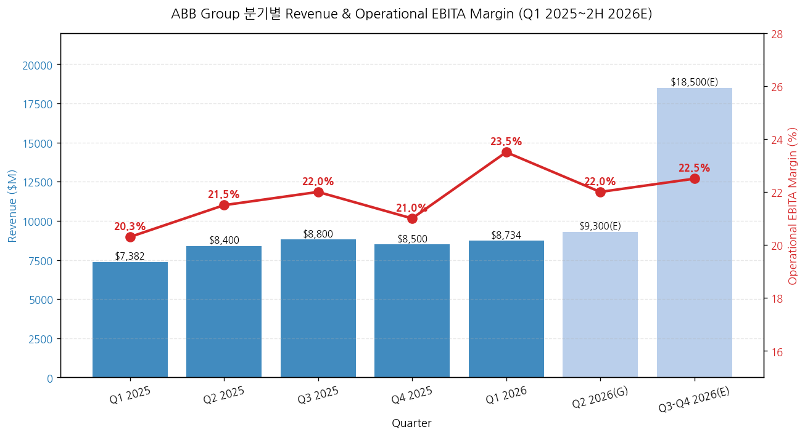
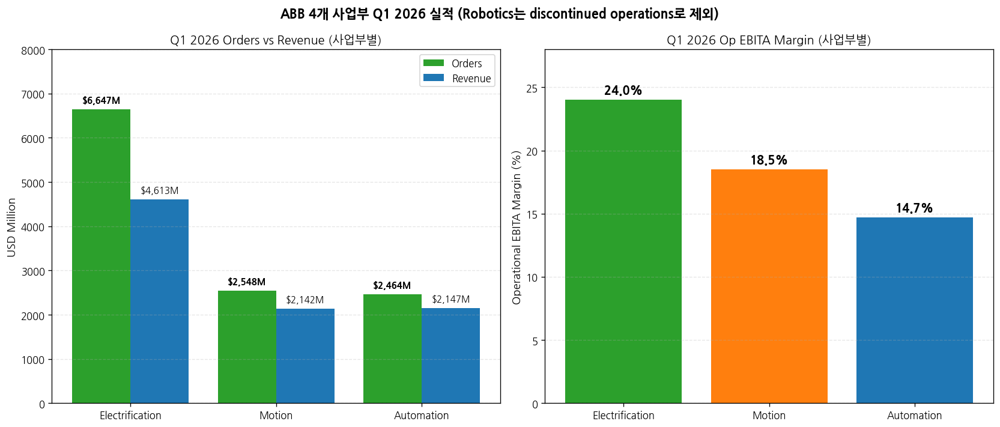
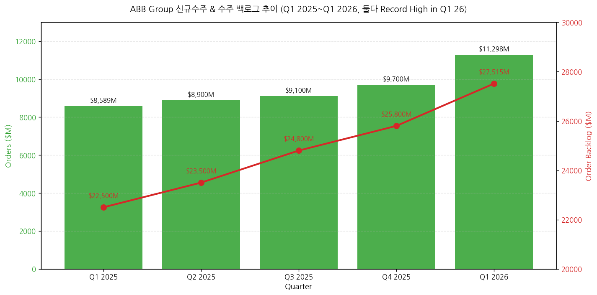
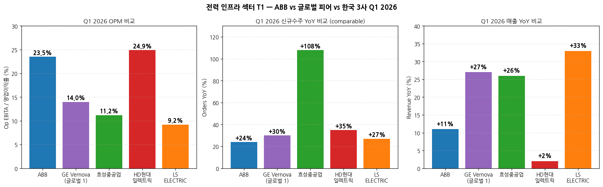

> 모드: 실적 리뷰 (글로벌 피어 — 가벼운 깊이)
> 종목: ABB Ltd (ABB / NYSE ADR, ABBN.SW Swiss primary)
> 섹터: 전력 인프라
> 분기: 2026-Q1 (Q1 FY26, 분기 종료 2026-03-31)
> 발표일: 2026-04-22 (수, Zurich) — IR자료 + Earnings Call (4:00 AM EDT) 동시 발행
> 작성 시각: 2026-05-03 21:00 KST

# ABB Q1 2026 실적 리뷰 (글로벌 피어 — 한국 전력 인프라 3사 선행 cue)

> **본 리뷰는 글로벌 피어 워크플로우 (workflow rule 4)에 따라 한국 종목 review 7개 항목 중 핵심 4-5개로 압축 작성**: 1번 실적 추이, 3번 경영진 코멘터리, 5번 업황 사이클(특히 한국 3사 cross-ref), 7번 관전포인트. 컨센·셀사이드 5단계는 글로벌 피어 가벼운 깊이 룰에 따라 생략.
> **본 리뷰의 1차 목적**: ABB(4/22 발표) → LS일렉트릭(4/21) → GEV(4/23) → 효성(4/25) → HD(4/28) 순서로 같은 분기 내 발표되는 한국 전력 인프라 3사 review·인뎁스 분석 시 산업 사이클 cue로 활용.
> 동일 폴더 한국 3사 review (`2026-Q1_효성중공업_리뷰.md`, `2026-Q1_HD현대일렉트릭_리뷰.md`, `2026-Q1_LS일렉트릭_리뷰.md`) 자동 cross-reference.

## Executive Summary — 한국 3사에 미치는 5대 시그널

→ **데이터센터 수요 = 명확한 stand-out 영역** — Electrification 사업부 데이터센터 신규수주 **triple-digit YoY 증가**, 2019~2025 CAGR 35%. CFO Christian Nilsson 인용: "Pipeline looks good, expect another strong year". **이는 LS일렉트릭의 빅테크 LTA 패키지 narrative + HD현대일렉트릭의 AIDC 온사이트 발전 thesis + 효성중공업의 765kV 모멘텀 모두 confirm**.
→ **Utilities 그리드 투자 호조** — Electrification 백로그 $11.5B (+38% comparable), book-to-bill 1.44. **한국 3사의 765kV·HVDC 모멘텀이 단일 기업 호조가 아닌 산업 전체 슈퍼사이클 입증**. CEO 인용: "Investment in efficient, smart, and reliable grid are needed to make power available and accessible. We see this happening particularly in the U.S."
→ **미국 신규수주 +67% YoY (comparable) 폭증** — Americas 전체 +48%, US +67%. **한국 3사의 미국 비중 확대 narrative (효성 잔고 53%·HD 69%·LS 빅테크 직수주) 강하게 confirm**. CEO: "U.S. base orders 30% 개선" (large bookings 제외 underlying 강도)
→ **Q1 2026 OPM 23.5%로 사상 최강 (real estate 250bps gain 제외 시 21%)** — +320bps YoY 중 +70bps는 real business improvement. **한국 3사 OPM (효성 11.2%·HD 24.9%·LS 9.2%) 비교 시 ABB가 효성·LS보다 높고 HD와 비슷**. 글로벌 피어 OPM 20%대가 정상화 reference로 자리잡음 → **HD 24.9%·HD-equivalent 정당화**.
→ **2026 가이던스 상향** — 종전 "slightly improve" → 신규 "high single-digit to low double-digit comparable revenue growth + OPM improve YoY". **한국 3사 가이던스 상향 가능성에 대한 강한 leading indicator** (효성 7.6조 → 11~13조 추정, HD 42억$ → 50~60억$ 추정 narrative와 동조).

---

## 항목 1. 실적 추이 (Q1 2026 + Outlook)

① 핵심 손익 (Q1 2026 vs Q1 2025, USD $M)

| 항목 | Q1 2026 | Q1 2025 | YoY (USD) | YoY Comparable | 코멘트 |
|---|---|---|---|---|---|
| **신규수주** | **11,298** | 8,589 | **+32%** | **+24%** | **사상 최대 분기** (Q1, 새로운 record) |
| 매출 | 8,734 | 7,382 | +18% | +11% | 단기 cycle 강세 + FX +6% |
| Gross Profit | 3,440 | 3,122 | +10% | +3% | GPM 39.4% (-290bps, FX/원자재 hedge 영향) |
| Income from operations | 1,780 | 1,474 | +21% | — | OPM 20.4% (+40bps) |
| **Operational EBITA** | **2,049** | 1,495 | **+37%** | **+28%** | **margin 23.5% (+320bps)** |
| ┗ ex-real estate gain | ~1,672 | — | ~+12% | — | margin ~21% (+70bps real biz) |
| Net income (ABB) | 1,324 | 1,102 | +20% | — | — |
| EPS (basic) | $0.73 | $0.60 | +21% | — | — |
| **Free Cash Flow** | **1,250** | 652 | **+92%** | — | **Q1 사상 최강** (real estate $425M 포함) |
| **Order Backlog** | **27,515** | ~22,500 | **+27%** | **+22%** | **사상 최대** |
| ROCE | 27.2% | 24.4% | +280bps | — | — |
| Book-to-bill | **1.29** | — | — | — | 모든 사업부 positive |

→ (출처: ABB Q1 2026 Press Release page 1, Group Presentation page 3)

→ (출처: ABB Q1 2026 Press Release Additional figures + Earnings Call Outlook)
→ Q2 2026 가이던스: 매출 high single-digit to low double-digit comparable growth, OPM improve YoY
→ FY 2026 가이던스 상향: 매출 동일 범위, OPM YoY improve **excluding real estate gain** (= 강한 underlying 모멘텀)

② 사업부별 (Electrification·Motion·Automation, Robotics는 discontinued)

(1) Q1 2026 사업부별 (USD $M)

| 사업부 | Orders | YoY Comp | Revenue | YoY Comp | Op EBITA | OPM | OPM Δ YoY | Backlog | Backlog YoY Comp |
|---|---|---|---|---|---|---|---|---|---|
| **Electrification** | **6,647** | **+44%** | 4,613 | +15% | **1,105** | **24.0%** | **+80bps** | **11,460** | **+38%** |
| Motion | 2,548 | +9% | 2,142 | +7% | 398 | 18.5% | -110bps (Gamesa 희석) | 6,597 | +8% |
| Automation | 2,464 | +5% | 2,147 | +10% | 311 | 14.7% | +50bps | 10,350 | +21% |
| **Group 합계** | **11,298** | **+24%** | 8,734 | +11% | **2,049** | **23.5%** | **+320bps** | **27,515** | **+22%** |

→ (출처: ABB Q1 2026 Press Release page 6-8)

(1-1) Electrification — **한국 3사와 가장 직접 비교 가능 사업부**
→ **신규수주 $6.6B (+44% comparable) — 사상 최대 분기**
→ 데이터센터 triple-digit YoY (2019~25 CAGR 35%) — **LS일렉트릭 빅테크 패키지 narrative 동조**
→ Utilities double-digit + 모든 customer segment double-digit — **효성·HD 765kV 모멘텀 동조**
→ Americas +80% comparable orders — **한국 3사 미국 비중 확대 thesis confirm**
→ Backlog $11.5B (+38%), book-to-bill **1.44** — **한국 3사 Backlog 형성 패턴과 다름** (효성 4년·HD 3년 백로그 vs ABB Electrification 백로그/매출 ≈ 2.5년)
→ **OPM 24.0% (+80bps real business)** — HD현대일렉트릭 24.9%와 거의 동일 = HD 멀티플 reference 정당화

(1-2) Motion — Process 산업 mixed
→ Orders +9% comparable, HVAC + Power 강세, Rail 일시 감소
→ OPM 18.5% (-110bps) — Gamesa Electric 인수 dilution 70bps + High Power division 일시 비효율 15bps + project mix
→ 한국 3사 직접 비교 사업부 없음 (HD 회전기기와 일부 겹침)

(1-3) Automation — 한국 3사 cross-ref 약함
→ Orders +5% comparable. Marine·Ports·Mining 강세, O&G·Chemical 약세
→ OPM 14.7% (+50bps), Backlog $10.4B (5분기 매출 커버)
→ Middle East 영향 일부 발생 — Energy plants 공격으로 일부 customer disrupt (전체 매출의 5% 미만 영향)

③ 지역별 (Q1 2026)

| 지역 | Orders ($M) | YoY USD | YoY Comp | Revenue ($M) | YoY USD | YoY Comp |
|---|---|---|---|---|---|---|
| **Americas** | **4,584** | **+52%** | **+48%** | 3,391 | +21% | +18% |
| ┗ US (highlight) | n/a | **+70%** | **+67%** | n/a | n/a | n/a |
| Europe | 3,755 | +26% | +13% | 2,992 | +17% | +3% |
| Asia/Middle East/Africa | 2,959 | +14% | +10% | 2,351 | +16% | +12% |
| ┗ China | n/a | +9% | +3% | n/a | n/a | n/a |

→ (출처: ABB Q1 2026 Press Release page 3)
→ **US +67% comparable orders 폭증 = 한국 3사 미국 모멘텀 strong leading indicator**

---

## 항목 3. 경영진 코멘터리 (Earnings Call 핵심 인용)

① CEO Morten Wierod 핵심 발언

(1) 시장 환경
→ "We have had a strong start to the year with a supportive overall market environment and improved business performance. Orders were at a record-high level and increased 24% on a comparable basis, supported by all three business areas. Overall demand remained robust throughout the period."
→ "Looking at the developments through the quarter, the overall demand remained strong throughout. For us, the Middle East conflict has not changed the overall demand picture so far."
→ "Market momentum remains strongest in the data center segment, but also positive for grid investments. Other strong areas include electrical upgrades of land-based transport infrastructure, marine, port automation, HVAC and buildings."
→ "Customer activity is more muted in parts of the process industry-related areas." (Chemical·Pulp·Paper 약세 — Motion·Automation 일부 영향)

(2) 데이터센터 디테일 (CFO Christian Nilsson)
→ "Looking at data centers, it was up triple digits. For this segment, we have an order CAGR of close to 35% in 2019 to 2025. The data center orders were very strong in both Q4 and in Q1. Pipeline looks good, and we expect this year to be another strong year."
→ CEO 추가: **"90% of ABB is not data center, and that is growing very strongly, but then you put the data center growth on top, that is giving the very strong performance of the Q1."**
→ CFO Buildings: "Buildings, at about 30% of revenues. 2/3 of that goes to commercial segment. This market continues to be strong."

(3) Pricing & Costs
→ CFO: "We had a price-cost gap. Pricing did not quite fully offset higher costs for commodities and tariffs. We expect that this will gradually improve as we progress through the year."
→ CEO: "About 1% (price increase) for the whole company. We do see more, as expected, of price increase in Americas and less in Asia due to a bit of, like China as one example."
→ **한국 3사 cross-ref**: 효성·HD·LS도 1Q26에 원자재 (은·전기동) 상승 vs 판가 인상 시점 mismatch로 일시 마진 부담 발생 — ABB의 동일 패턴 confirm

(4) 가이던스 상향 근거
→ CEO: "We raise our growth and margin expectations for 2026, although acknowledging risks from geopolitical uncertainties."
→ "We have a backlog of $27.5 billion. Markets were overall strong in Q1, and so far, our customer interactions give us confidence for the year."
→ "We now expect comparable revenue growth to be in the high single-digit to low double-digit range, and the operational EBITDA margin should improve year-on-year, even when excluding the real estate gain in the Q1 of 2026. **This is up from previous guidance of slightly improve**."

(5) M&A 의지 (CEO 명시)
→ "I've already messaged that we want to allocate more capital to acquisitions. Cash flow should continue to be strong. With net debt to EBITDA of 0.3, we have plenty of headroom."
→ "Big to me would be along the lines of $4 billion we spent on Thomas & Betts and Baldor a few years ago. It would be great if we could get some deals up to that size."
→ "Key for us is the long-term value creation. I would rather make no deals than bad deals."

(6) Capital Allocation
→ 자사주 매입 $2B 신규 launch (2026/2/9) — 직전 $1.5B 프로그램 1/28 완료
→ 인도 manufacturing $75M 투자 (4번째 큰 시장)
→ Dividend CHF 0.94 (1.3% yield)
→ Q1 자사주 매입 $225M (2.6M shares)

(7) Middle East 영향 (5% 매출 비중)
→ CEO: "For us, the Middle East conflict has not changed the overall demand picture so far. The group, the Middle East represents just below 5% of revenues, and Automation is about 1/3 of this exposure."
→ "Gulf states as an isolated group, this is about 3.5% of sales."
→ **한국 3사 cross-ref**: 효성 11~12%, HD 16% 중동 매출 비중 → **ABB 5%보다 한국 3사 영향 더 클 수 있음 (특히 HD)**

② CFO Christian Nilsson 핵심 발언

(1) Cash flow 가이던스
→ "We aim to slightly improve the full-year free cash flow from last year's $4.6 billion. This will be supported by higher cash flow in the business and a higher real estate impact."
→ Q1 FCF $1.25B 중 $425M는 real estate sale 기여

(2) 운전자본 관리
→ Trade NWC 12.5% of revenues (작년 14.1% 대비 1.6pp 개선)
→ Net debt $2,268M (Q4 25 $1,683M 대비 +$585M, 배당 timing 영향)

(3) Robotics 사업부 매각 진행 (SoftBank deal)
→ Discontinued operations로 분리 표기
→ 2026 closing 시 $300M 세금 cash impact, 2027년 추가 $100M
→ Robotics hub 스웨덴 신축 CapEx +$100M

---

## 항목 5. 업황 사이클 점검 — **한국 3사 cross-reference (본 리뷰의 핵심)**

① 산업 사이클 위치 — **확장 가속 (slope steepening)**

(1) 데이터센터 — secular 슈퍼사이클 진입 확정
→ ABB Electrification 데이터센터 2019~2025 CAGR 35% → 2026 가속
→ **한국 3사 적용**: LS일렉트릭 빅테크 LTA 패키지(X·A·B사 누적 1.5조+) + HD현대일렉트릭 AIDC 온사이트 발전 (그룹사 협의체 6,800억) + 효성중공업 765kV (미국 9,200억 단일 PJT)
→ **시그널**: ABB가 데이터센터 단독 triple-digit + 90% non-DC 부문도 강세 → 한국 3사 데이터센터 narrative는 secular thesis 강화

(2) US Utilities + 765kV 그리드 투자 — 본격 개화
→ ABB Americas Orders +48% comparable, US +67% — Electrification 핵심 driver
→ **한국 3사 적용**: 효성중공업 미국 비중 53% (잔고) + HD현대일렉트릭 69% + LS 빅테크 직수주 — 모두 ABB와 동조
→ **시그널**: ABB의 US +67%가 가장 강력한 단일 leading indicator. 한국 3사 인뎁스 분석 시 "미국 RTO 765kV LRTP Tranche 2 확정 (2025년 말, MISO)" 일관 narrative confirm

(3) Process 산업 — Mixed (Chemical·Pulp·Paper 약세)
→ ABB Motion·Automation에서 약세 시그널
→ **한국 3사 cross-ref**: 한국 3사는 process 산업 비중 작음 (효성 0%·HD 5%·LS 자동화 6%만) → 영향 제한적
→ **단**: LS의 자동화 부문 OPM 3.3% (Process 약세 영향 일부) + Automation 회복 신호는 LS 자동화 회복 시그널

(4) Marine·Ports·HVAC — 견조
→ ABB Motion·Automation 강세 영역
→ **한국 3사 cross-ref**: HD현대일렉트릭 회전기기 +39.5% QoQ (선박용) — 동조

② 글로벌 피어 vs 한국 3사 Q1 2026 비교 (cross-reference 핵심)

(1) OPM 비교

| 종목 | Q1 2026 OPM | 코멘트 |
|---|---|---|
| HD현대일렉트릭 | **24.9%** | 한국 3사 1위, ABB Electrification 24.0%와 동급 |
| **ABB Group (전체)** | **23.5%** | Real estate gain 250bps 포함, real biz 21% |
| ABB Electrification (사업부) | 24.0% | HD현대일렉트릭과 거의 동일 |
| 효성중공업 | 11.2% | 자체 일회성 이연 400억 가산 시 14.1% |
| ABB Motion (사업부) | 18.5% | Gamesa 희석 영향 |
| ABB Automation (사업부) | 14.7% | — |
| LS일렉트릭 | 9.2% | 일회성 100~150억 제외 시 10.2%, 자동화·자회사 희석 |

→ **시그널**: HD가 ABB Electrification과 동급 OPM 입증 → HD 멀티플 정당화. LS·효성은 사업 mix·일회성 영향으로 절대 OPM 낮으나 회복 trajectory 동일

(2) 신규수주 YoY% 비교

| 종목 | Q1 26 신규수주 YoY (Comp/USD) | 사상 최대 여부 |
|---|---|---|
| **효성중공업** | **+108%** USD | ✓ 단일 분기 사상 최대 |
| HD현대일렉트릭 | +35% USD (+76% 북미) | ✓ 단일 분기 사상 최대 |
| LS ELECTRIC | +27% USD | ✗ (4Q25가 1.57조 최대) |
| **ABB Group** | **+24%** comparable (+32% USD) | ✓ 단일 분기 사상 최대 |
| ABB Electrification | **+44%** comparable | ✓ 단일 분기 사상 최대 |

→ **시그널**: 4사 중 3사 (효성·HD·ABB)가 단일 분기 사상 최대 신규수주 동시 달성 → **산업 전체 슈퍼사이클 진입 확정**

(3) 매출 YoY% 비교

→ LS +33% > 효성 +26% > GEV +27% > ABB +11% (comparable) > HD +2.1%
→ **시그널**: HD 매출 +2.1%는 일시 회계 이연 (북미·중동·유럽 3개 지역 PJT 2Q26 이월). 정상화 시 ABB·효성과 비슷한 +20%대로 가속 예상

③ 독자적 전망 (한국 3사 인뎁스 분석 시 활용)

(1) FY 2026 가이던스 상향이 주는 시사
→ ABB FY26 매출 가이던스: high single to low double-digit comparable growth (종전 mid single-digit) → **+5pp 이상 상향**
→ ABB OPM 가이던스: improve YoY (real estate excl.) → **종전 "slightly improve"보다 강화**
→ **한국 3사 적용**: 효성 가이던스 7.6조 신규수주는 거의 확실히 11~13조로 상향. HD 42억$ → 50~60억$ 상향. LS 30년 매출 10조 목표는 1년+ 조기 달성 가능성

(2) 가이던스 상향 시점 추정
→ ABB는 1Q 발표 시점에 FY 가이던스 상향 — 가장 빠른 신호
→ 한국 3사: 통상 2Q 발표 시점에 가이던스 상향 (8월 중)
→ **시그널**: 8월 중 한국 3사 일제 가이던스 상향 가능성 매우 높음 → 7월 중 한국 3사 프리뷰 작성 시 적극 반영

(3) Pricing 회복 timeline
→ ABB CFO: "Pricing will gradually improve as we progress through the year"
→ 효성·HD·LS 모두 1Q26에 동일 패턴 (3월 국내·4월 해외 판가 인상)
→ **시그널**: 2H26부터 한국 3사 OPM 점진 회복 — 한국 3사 인뎁스 분석 시 2H 마진 회복 가정 정당화

---

## 항목 7. 관전 포인트 — 한국 3사 분석 시 활용 cue

⑦ 한국 3사 다음 분기 분석 시 ABB 시그널 활용 가이드

(1) **데이터센터 수주 가속 narrative 강화 근거**
→ ABB Q1 데이터센터 triple-digit + 2019~25 CAGR 35% — 한국 3사 빅테크 수주 narrative 정당화
→ **활용**: LS일렉트릭 빅테크 B사 수주 5,000억+ 도달, HD AIDC 온사이트 발전 후속 수주 시 narrative 인용

(2) **US +67% 폭증 = 한국 3사 미국 비중 확대 confirm**
→ ABB Americas Q1 신규수주 +48% comparable, US +67%
→ **활용**: 효성 미국 잔고 53%·HD 69%·LS 빅테크 직수주 narrative 모두 강화

(3) **OPM 23.5%가 정상화 reference**
→ ABB Real business OPM 21% (real estate excl.) = 한국 3사 정상화 OPM 목표 reference
→ **활용**: HD 24.9% 정당화, 효성·LS의 2H26 OPM 16~18% 가속 예상 정당화

(4) **가이던스 상향 leading indicator**
→ ABB가 FY26 가이던스 mid single → high single/low double 상향 — 한국 3사 가이던스 상향 leading indicator
→ **활용**: 7월 한국 3사 프리뷰 작성 시 "가이던스 상향 가능성 매우 높음" narrative

(5) **Middle East 영향 5% — 한국 3사 reference**
→ ABB는 중동 5% 매출 비중에서 영향 제한적
→ **활용**: 효성 11~12%·HD 16% 중동 비중 → ABB보다 영향 더 클 수 있음. 한국 3사 인뎁스 분석 시 중동 정성적 risk monitoring 강화

(6) **M&A 가속 신호**
→ ABB CEO "$4B deals welcome" + 자사주 매입 $2B + 인도 $75M
→ **활용**: 글로벌 피어 M&A 가속 → 한국 3사 자체 M&A 가능성 (HD 그룹사 협의체 패키지 확장 등) 모니터링

⑦ ABB 자체 다음 분기 (Q2 2026) 모니터링

(1) Q2 매출 high single ~ low double 가이드 달성 여부 (vs 1Q 11% comparable)
(2) Q2 OPM YoY 개선 (1Q 기저 효과 없음)
(3) 데이터센터 신규수주 triple-digit YoY 지속 여부 (단순 base 효과 vs secular)
(4) Middle East 영향 확대 여부 (1Q는 5월 말까지만 영향)
(5) M&A 발표 가능성 ($4B 규모 deal 언급)

---

## [향후 관찰 포인트] — 한국 3사 분석 timing

→ **2026 5월 중**: GE Vernova(4/23 발표 완료) + Schneider/Hitachi(4/30 발표 완료) review 추가 작성 → 글로벌 피어 4사 (ABB·GEV·Schneider·Hitachi) 통합 cross-reference 완성
→ **2026 5/16 quarterly-review Stage 2**: ABB·GEV·SE·HE·ETN·SiE 6개 글로벌 피어 + 효성·HD·LS 3개 한국 종목 = **전력 인프라 9사 통합 분석** 자동 수행
→ **2026 7월 중**: 한국 3사 2Q26 프리뷰 작성 시 **본 ABB review + 글로벌 피어 5사 review = 6개 산업 모멘텀 cue 자동 활용** (다음 분기부터 프리뷰 워크플로우 정착)
→ **2026 8월 중**: 한국 3사 2Q26 잠정실적 발표 시 글로벌 피어 가이던스 상향 vs 한국 3사 가이던스 상향 timing 비교

---

> **다음 단계**: 글로벌 피어 5사 (GEV·Schneider Electric·Hitachi Energy·Eaton·Siemens Energy) 자료 첨부 시 발표일 빠른 순으로 차례 review 작성. 각각 본 ABB review 형식 (가벼운 깊이 4-5개 항목 + 한국 3사 cross-ref 강조) 따라 작성 권장.
> **Stage 2 자동 연계**: ABB review = `2026-Q1_ABB_리뷰.md` + 메타데이터 [섹터: 전력 인프라] 표준 위치 저장 → 5/16 quarterly-review Stage 2 자동 로드 → 9사 통합 사이클·논쟁·시장시각 통합본 산출.
> **인뎁스 분석 잠재 논점**: ① 데이터센터 secular vs cyclical 정량화 (CAGR 35% sustainability), ② 글로벌 피어 OPM 21~25% reference의 한국 3사 적용 한계, ③ M&A 가속이 글로벌 산업 구조 변화에 미치는 영향, ④ Middle East 영향 정량화 (한국 3사 vs ABB 5% 차이).
