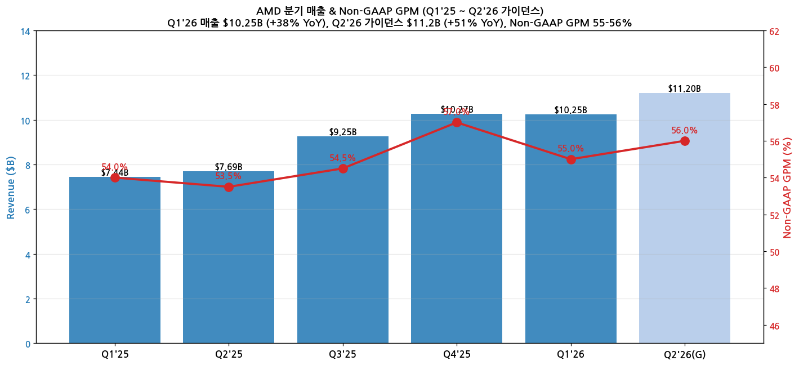
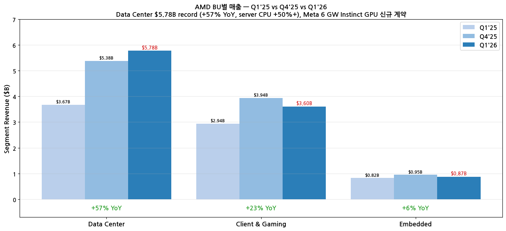
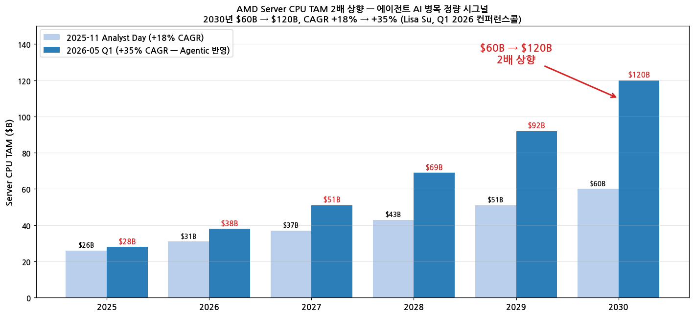

> 모드: 실적 리뷰
> 종목: AMD (AMD)
> 섹터: 반도체
> 분기: 2026-Q1
> 발표일: 2026-05-05 (AMC)
> 작성 시각: 2026-05-19 20:15 KST

# AMD Q1 2026 실적 리뷰 — Server CPU TAM 6개월 만에 $60B → $120B 2배 상향, 에이전트 AI 병목 정량 시그널

## Executive Summary

→ **Server CPU TAM 6개월 만에 2배 상향 ($60B → $120B by 2030, CAGR +18% → +35%)**. Lisa Su 직접 발언: "에이전트 AI가 orchestration·data processing·기타 task에 CPU 수요를 폭증시킴". INTC CFO Zinsner의 "CPU:GPU ratio flipping" quote의 정량 대응
→ **Q1'26 매출 $10.25B (+38% YoY), Non-GAAP EPS $1.37 (vs 컨센 $1.27, +8% beat)**. GAAP EPS $0.84 (+91% YoY). 6분기 만에 매출 정상화 + 다음 단계 ramp 시작
→ **Data Center record $5.78B (+57% YoY, +7% QoQ)** — server CPU sales +50%+ (cloud + enterprise), Turin (Zen 5) **Q1 매출 50%+ crossover**, EPYC Cloud Instances 1,600+ (+50% YoY)
→ **Meta 6 GW Instinct GPU 다세대 partnership** (custom MI450 기반 1 GW initial + 5 GW 추가). **Meta가 6세대 EPYC Venice lead customer**. **Samsung HBM4 supply 협업** for MI455X·6세대 EPYC
→ **Q2'26 가이던스 $11.2B (mid, +51% YoY)** — server CPU growth +70% YoY 약속. Non-GAAP GM 56%. Helios + MI450 ramp Q3 시작 → Q4 대형 ramp → Q1'27 지속

---

## 항목 1. 실적 추이

### ① 분기 실적

(1) 5분기 추이 + Q2'26 가이던스

| 항목 | Q1'25 | Q2'25 | Q3'25 | Q4'25 | **Q1'26** | **Q2'26(G)** |
|------|-------|-------|-------|-------|-----------|--------------|
| 매출 ($B) | 7.44 | 7.69 | 9.25 | 10.27 | **10.25** | **11.2 ± 0.3** |
| YoY % | +36% | +32% | +36% | +24% | **+38%** | **+51%** |
| QoQ % | -7% | +3% | +20% | +11% | Flat | +9% |
| GAAP GM | 50% | 51% | 53% | 54% | **53%** | — |
| Non-GAAP GM | 54% | 53.5% | 54.5% | 57% | **55%** | **~56%** |
| GAAP Op Income ($B) | 0.81 | 0.90 | 1.20 | 1.75 | **1.48** | — |
| GAAP OPM | 11% | 12% | 13% | 17% | **14%** | — |
| Non-GAAP Op Income ($B) | 1.78 | 1.90 | 2.20 | 2.85 | **2.54** | — |
| Non-GAAP OPM | 24% | 25% | 24% | 28% | **25%** | — |
| GAAP EPS ($) | 0.44 | 0.49 | 0.65 | 0.92 | **0.84** | — |
| Non-GAAP EPS ($) | 0.96 | 1.05 | 1.20 | 1.53 | **1.37** | — |

(2) Beat 폭

→ 매출 $10.25B vs 컨센 $9.85B = **+4.1% beat** + 가이던스 high end 초과
→ Non-GAAP EPS $1.37 vs 컨센 $1.27 = **+8% beat**
→ GAAP EPS $0.84 (+91% YoY) vs $0.44 (Q1'25) — 2배 가까운 증가

(3) 매출 + GPM 차트

→ (출처: [AMD Q1 2026 Earnings Slides PDF (cloudfront)](https://d1io3yog0oux5.cloudfront.net/_530b22e8aa311a8d1011a56b31890d4b/amd/db/841/9232/presentation/AMD+Q1'26+Earnings+Slides+Final.pdf), p.7·11)

### ② BU별 매출

(1) Q1 2026 BU별 비교 (Earnings Slides p.12 공식)

| 사업부 | 매출 ($B) | YoY | QoQ | Op Income ($B) | OM | 비고 |
|--------|-----------|-----|-----|----------------|-----|------|
| **Data Center** | **5.775** | **+57%** | +7% | 1.599 | **28%** (+3pp YoY) | **분기 record**, server CPU +50%+ YoY, EPYC Cloud Instances 1,600+ |
| **Client & Gaming** | 3.605 | +23% | -9% | 0.575 | 16% (-1pp YoY) | Client $2.9B (+26% YoY) Ryzen, Gaming $0.7B 정점 |
| **Embedded** | 0.873 | +6% | -8% | 0.338 | 39% (-1pp YoY) | 회복 시작, Cisco N9300/8000 series 채택 |
| **Total** | **10.253** | **+38%** | Flat | — | — | — |

→ (출처: [AMD Q1 2026 SEC 8-K Earnings Slides HTM](https://www.sec.gov/Archives/edgar/data/2488/000000248826000072/amdq126earningsslidesfin.htm) + [AMD IR Slides p.12])

(2) BU별 매출 차트

→ Data Center가 매출의 **56.3%** (Q1'25 49.4% 대비 +6.9pp 비중 확대)

(3) Client & Gaming 디테일 (Slides p.15)

→ Client $2.9B (+26% YoY) — Ryzen AI PRO 400 Series (Copilot+ PC), Ryzen 9950X3D2 Dual Edition (3D V-Cache)
→ Gaming $0.7B (+17% YoY) — FSR 4.1 + Ray Regeneration 1.1, Gemma 4 day-zero support
→ Q2'26 가이던스: Gaming 2H 둔화 시그널 ("Gaming actually is going to come down" — Jean Hu)

(4) Embedded 디테일 (Slides p.16)

→ $873M (+6% YoY) — Cisco N9300·8000 series 채택 (Ryzen Embedded V3000)
→ Kintex UltraScale+ Gen 2 FPGA, Ryzen AI Embedded P100 series (industrial AI)
→ "Demand strengthened across several end markets" + "momentum continuing in the second half"

### ③ 연간 컨센 변화 (Post-Q1)

| FY | 매출 ($B) | YoY | Non-GAAP EPS |
|----|-----------|-----|--------------|
| 2023 | 22.7 | -4% | 2.65 |
| 2024 | 25.8 | +14% | 3.31 |
| 2025 | 34.65 | +34% | 5.05 |
| **2026E (Pre-Q1)** | 39.0 | +12% | 5.85 |
| **2026E (Post-Q1)** | **46.5** | **+34%** | **7.20** |
| 2027E (Post-Q1) | 65.0 | +40% | 11.50 |

→ 셀사이드 FY26 컨센 +$7.5B (+19%) 상향, Non-GAAP EPS 컨센 +$1.35 (+23%) 상향
→ FY27 매출 컨센 $65B는 Helios + MI450 ramp + Meta 6 GW 일부 반영

---

## 항목 2. 실적 vs 가이던스 vs 컨센서스 — 3원 비교

### ① 비교표

| 항목 | 회사 가이던스 (mid) | 컨센서스 | 실적 Q1'26 | 가이던스 대비 | 컨센 대비 |
|------|---------------------|---------|-----------|--------------|----------|
| 매출 ($B) | $9.4 (mid) | $9.85 | **10.253** | **+9.1% / +$0.85B above mid** | **+4.1% beat (+$0.40B)** |
| Non-GAAP GM | ~54% | ~54.5% | **55%** | **+1pp** | **+0.5pp** |
| Non-GAAP EPS | $0.97 (mid) | $1.27 | **$1.37** | **+$0.40 / +41%** | **+$0.10 / +8% beat** |
| Non-GAAP Op Income | — | ~$2.3B | **$2.54B** | — | **+10.4%** |

→ **가이던스 high end 초과 + 컨센 전 지표 beat**. Non-GAAP EPS는 회사 가이던스 대비 +41%, 컨센 대비 +8% beat — 가이던스 보수성 큼

### ② 제품별 서프라이즈 상세

(1) Data Center 가장 큰 서프라이즈

→ 매출 $5.78B vs 컨센 $5.2B = **+11% beat**
→ Server CPU sales **+50%+ YoY** — Cloud + Enterprise 동시 회복
→ "**Turin이 Q1 매출의 50%+ crossover**" (Jean Hu, Zen 5 ramp 정점)
→ Genoa (Zen 4) 여전히 강세, Milan (Zen 3) 일부 잔존
→ Q1 server CPU growth는 **"much more unit driven"** (Lisa Su) — 단가 인상보다 출하량 폭증

(2) Client & Gaming 컨센 부합

→ Client $2.9B (+26% YoY) — Ryzen commercial share gains, AI PRO 400 series
→ Gaming $0.7B 정점 (1Q는 좋았으나 2H 둔화 시그널)

(3) Embedded 회복 시작

→ $873M (+6% YoY) — FY23~FY24 인플레이션·재고 조정 이후 첫 의미있는 성장
→ Q2'26 "continued momentum"

---

## 항목 3. 경영진 코멘터리 (AMD Q1 2026 Earnings Slides + Motley Fool 컨콜 transcript)

### ① CEO Lisa Su 핵심 발언

(1) **Server CPU TAM 2배 상향 — 에이전트 AI CPU 병목 정량 시그널**

→ (1-1) "At our **Financial Analyst Day in November**, we outlined the **server CPU market growing at approximately 18% annually** over the next 3-5 years"

→ (1-2) "Based on the demand signals we are seeing today and the **structural increase in CPU compute requirements driven by Agentic AI**, we now expect the server CPU TAM to grow at **greater than 35% annually, reaching over $120 billion by 2030**"

→ (1-3) "**$60B → $120B in 6 months**" — TAM 2배 상향. INTC CFO Zinsner의 "CPU:GPU ratio flipping" quote의 정량 검증

→ (1-4) "In response to this demand, we are working closely with our supply chain partners to **meaningfully increase our wafer and back-end capacities** to support this growth"

(2) **에이전트 AI CPU 병목의 메커니즘** (Lisa Su 직접)

→ "As AI adoption scales, you need **more inferencing**. As inferencing scales and you do more — you have more agents and **Agentic AI**, they **all require CPUs for all of the orchestration and the data processing and these other tasks**"

→ **3 카테고리 CPU TAM 분류** (Lisa Su):
1. **Traditional general purpose CPU**: low double-digit 성장
2. **AI head node CPU** (GPU 연결용): 작지만 성장 중
3. **Agentic AI CPU**: **TAM 증가의 가장 큰 부분** — "the largest portion of this is the Agentic AI"

(3) **Server CPU 점유율 — 50%+ 목표 재확인**

→ "We feel really good about the market as well as our **opportunity to grow to greater than 50% share** of that market"
→ "Turin is very strong. We actually **crossed over 50% of our revenue being Turin this quarter**" (Q1 server revenue 기준)
→ "I think we were **early to call this AI component of CPUs**" — Verano (AI-optimized) 신규 라인

(4) ARM 경쟁 대응

→ "**ARM is good architecture. It has a place in the Data Center market. We view it as more point products relative to a portfolio**"
→ "From an AMD standpoint, we've **built this broad portfolio of CPUs** going forward for all these different workloads"
→ "Venice time frame, added an **AI-optimized CPU with the Verano** in addition to our throughput optimized and cost optimized point"
→ "I think you're going to see people actually use **x86 and ARM** for many of the large hyperscalers"

(5) Meta + OpenAI 신규 multi-billion 계약 (Slides p.14)

→ "**Meta plans to deploy up to 6 GW of AMD Instinct GPUs**, with the first 1-GW deployment powered by a **custom AMD Instinct MI450-based GPU**"
→ "**Meta will also be a lead customer for 6th Gen AMD EPYC CPUs**" (Venice/Verano)
→ "Meta's expanded multi-generation AMD Instinct GPU partnership, along with **OpenAI engagement, positions AMD for tens of billions in Data Center AI revenue by 2027**"

(6) Helios rack-scale 플랫폼 ramp 타임라인

→ Q3 2026: initial volume (MI450)
→ Q4 2026: significant ramp
→ Q1 2027: continuing ramp
→ "very good visibility now into the deployments that are on track for 2027"

### ② CFO Jean Hu 재무 상세

(1) 가이던스 + GPM dynamics

→ Q2 server CPU growth **+70% YoY**, "double-digit gains in both Data Center and Embedded segments"
→ Q2 Non-GAAP GM 56% — "higher-value Data Center and Embedded product mix"
→ "**MI450 will start to ramp in Q3 and then ramp significantly in Q4. That is below corporate average**" (margin dilution)
→ 다른 segments tailwind로 상쇄 — Client mix up, Embedded accretive
→ Long-term GM target 55-58% (Analyst Day 재확인)

(2) 현금흐름 record (Slides p.13)

→ Q1'26 Cash + Short-term Investments **$12.35B** (+17% QoQ from $10.55B)
→ Total Debt $3.22B (flat)
→ Inventory $8.05B (+2% QoQ — Helios ramp 대비 재고 빌드)
→ **Record OCF $2.96B** + **Record FCF $2.57B** (margin 25%)

(3) 사업부별 ASP 동학

→ Q1 server CPU YoY +50%+은 "**much more unit driven**"
→ 향후: "ASP is increasing because of the mix" — core count 증가 → ASP up
→ Verano (AI-optimized CPU)는 별도 ASP premium 가능성 제시

### ③ 신제품 모멘텀

(1) Data Center 신제품

→ **MI450 Helios** (Q3 ramp): Meta 1 GW initial, OpenAI engagement
→ **MI355X**: MLPerf 다수 카테고리 leadership (이미 출시)
→ **EPYC Turin (Zen 5, 5th Gen)**: Q1 server revenue 50%+ 크로스오버
→ **EPYC Venice (Zen 6, 6th Gen)**: Meta lead customer 확정, FY27 ramp 예상
→ **Verano (AI-optimized CPU)**: Venice time frame, 신규 라인 추가
→ **EPYC 8005 (Telecom·edge)**: Performance per-watt-per-dollar leadership

(2) Samsung HBM4 협력

→ "AMD and Samsung announced a collaboration on **HBM4 supply for AMD Instinct MI455X GPUs** and advanced DRAM solutions for 6th Gen AMD EPYC CPUs"
→ NVDA SK하이닉스 의존 vs AMD Samsung 협력 — 한국 메모리 경쟁 구도

(3) Client/Gaming 신제품

→ Ryzen AI PRO 400 Series (Copilot+ PC commercial)
→ Ryzen 9950X3D2 Dual Edition (3D V-Cache 2nd stack)
→ FSR 4.1 + Ray Regeneration 1.1 (게이밍)

(4) Embedded 신제품

→ Kintex UltraScale+ Gen 2 FPGA
→ Ryzen Embedded V3000 → Cisco N9300/8000 series 채택
→ Ryzen AI Embedded P100 (Industrial AI)

---

## 항목 4. 다음 분기 가이던스 분석

> 프리뷰 자료 없음 — 항목 4-1 자동 생략

### ② Q2 2026 가이던스 디테일

(1) 회사 제시 (Slides p.17)

→ 매출 **$11.2B ± $300M** (mid, +9% QoQ, +51% YoY)
→ Non-GAAP GM ~56% (+1pp QoQ)
→ Non-GAAP OpEx ~$3.3B (vs Q1 $3.15B, +5% QoQ)
→ Tax rate 13%
→ Diluted shares 1.66B (Q1 1.65B 대비 소폭 증가)

(2) 컨센 vs 가이던스

→ 매출 mid $11.2B vs 컨센 $10.6B = **+5.7% above consensus**
→ Q2 server CPU growth **+70% YoY** (Lisa Su 직접 약속)

(3) 가이던스 시사점

→ Server CPU 모멘텀 2분기 연속 가속
→ MI450 ramp 본격화 (Q3 시작), Helios 출하
→ Gaming 2H 둔화 vs Data Center 가속 — mix shift 대형 변화

---

## 항목 5. 업황 사이클 점검 — 에이전트 AI CPU 병목 정량화

### ① 산업 사이클 위치

(1) Server CPU (Data Center)

→ **사이클 위치: 본격 가속 (mid-cycle acceleration)**
→ TAM 2030 $120B (2025-11 대비 2배 상향)
→ AMD 점유율 35% → 50%+ 목표 (Lisa Su 재확인)
→ Q2 +70% YoY 약속

(2) Data Center GPU (Instinct MI 시리즈)

→ **사이클 위치: 초기 ramp** (MI300X·MI350·MI355X 출하, MI450 Helios Q3 시작)
→ Meta 6 GW deployment 확정 — 2026~2030 멀티 세대
→ NVDA dominance (80%+ training) vs AMD inference 점유 시장 침투

(3) Embedded

→ **사이클 위치: 회복 시작** (Q1 +6% YoY 첫 의미있는 성장)
→ Industrial AI + AIoT 확산

### ② 독자적 전망 — INTC vs AMD vs ARM CPU 3사 매트릭스 갱신

> **INTC 리뷰 (2026-Q1) 항목 5-②(2) 매트릭스를 AMD 발표 기반으로 갱신·확장**

(1) 정량 시그널 매트릭스 (Q1 2026 발표 후)

| 지표 | Intel | AMD | ARM |
|------|-------|-----|-----|
| Q1'26 Data Center 매출 | $5.1B (+22% YoY) | **$5.78B (+57% YoY)** | $0.65B Royalty 일부 (분기 Q4FY26) |
| Server CPU TAM ($, 2030) | 불비공개 | **$120B (+35% CAGR)** | $100B (ARM 자체 추정) |
| Server CPU 점유율 (현재) | ~65% (감소 중) | **~35% (50%+ 목표)** | ~5% (성장) |
| AI 관련 매출 비중 | 60% (Q1, ~$8.1B) | DC 56% + Embedded AI = ~60% | 100% (전부 AI 관련 라이선스·로열티) |
| 신제품 cadence | Xeon 6: Granite·Sierra·Clearwater Forest | EPYC Turin(Zen 5)·Venice(Zen 6)·Verano | Neoverse V3·N3·AGI CPU 136 cores |
| HBM 메모리 파트너 | TSMC + 자체 advanced packaging | **Samsung HBM4** | (라이선스만, 무관) |
| 핵심 hyperscaler 신규 LTA | **Google LTA** (3-5년, CPU+ASIC) | **Meta 6 GW Instinct + EPYC** | NVDA Grace·MS Cobalt·AMZN Graviton·Google Axion |
| 정량 1순위 발견 | DCAI OM 13.9%→30.5% (+16.6pp) | Server CPU TAM $60B→$120B (2배) | AGI CPU 136 cores @ 300W (Q4FY26 발표) |

(2) AMD의 차별점

→ **Lisa Su가 가장 빨리 channel 인지**: "early to call this AI component of CPUs" + Verano 신규 라인 별도 출시 = AMD가 narrative 선점
→ **Meta 6 GW + OpenAI deal**: GPU 시장 점유 확장 시그널 (NVDA dominance에 첫 의미있는 균열)
→ **Server CPU "much more unit driven" (Q1)**: ASP 인상이 아닌 출하량 폭증 → 진정한 demand 시그널
→ **Turin Q1 매출 50%+ crossover**: 신제품 ramp 속도가 Intel Series 3 대비 빠름

(3) INTC vs AMD 직접 비교 (Q1'26)

| 항목 | Intel CCG+DCAI | AMD DC+Client/Gaming |
|------|----------------|---------------------|
| 합산 매출 | $12.82B | $9.38B |
| YoY % | +9% (CCG +1%, DCAI +22%) | **+44%** (DC +57%, C&G +23%) |
| Mix Shift | DCAI 비중 39.8% (Q1'25 33.7% 대비 +6.1pp) | DC 비중 56.3% (Q1'25 49.4% 대비 +6.9pp) |
| OPM 평균 | DCAI 30.5% / CCG 27.0% | DC 28% / C&G 16% |

→ **Intel은 OPM 더 높음, AMD는 성장률 더 높음**. AMD 매출 성장률이 Intel의 4.9배 (44% vs 9%)
→ Intel은 IFS Foundry 적자가 전체 OPM 갉아먹음, AMD는 fabless 모델로 OPM 안정적 25% Non-GAAP

(4) TAM 정량 시각화

→ (출처: AMD Financial Analyst Day Nov 2025 + Q1 2026 컨퍼런스콜 Lisa Su 발언 2026-05-05)

### ③ FY26·FY27 추정치 수정

→ FY26 매출 컨센 $39.0B → $46.5B (+19%), Non-GAAP EPS $5.85 → $7.20 (+23%)
→ FY27 매출 컨센 $65.0B (+40% YoY) — Helios + MI450 Q4 본격 ramp + 7세대 EPYC

### ④ 리스크 모니터링

(1) MI450 GPM dilution

→ "MI450 below corporate average" (Jean Hu 명시) — Q4 ramp 시 GM 압박 가능성
→ 다른 segments tailwind로 상쇄 가능성

(2) Gaming 2H 둔화

→ Jean Hu 명시 "Gaming actually is going to come down" 2H
→ FY26 매출의 ~7% 비중이지만 mix 영향 미미

(3) Server CPU 공급 capacity

→ "wafer and back-end capacities meaningfully increase" — TSMC + 후공정 (Amkor·자체) 의존
→ TAM 2배 상향에 따른 capacity 부족 시그널 감지 필요

(4) NVDA dominance 지속

→ Meta 6 GW 계약은 의미있는 시작, but NVDA training 80% 점유 지속 가능성
→ AMD Inference 시장 점유 침투가 핵심 (ROCm software 성숙도)

(5) ARM 추격

→ Lisa Su 인정: "ARM has a place in Data Center market"
→ 하이퍼스케일러 자체 칩 (AWS Graviton·MS Cobalt·Google Axion) 점유율 25%+
→ AMD는 "x86 + ARM 공존" 시나리오 인정 (zero-sum 아님)

(6) Intel 회복

→ Intel Q1 DCAI +22% YoY는 의미있는 회복
→ Lisa Su 인정: "x86 competitor seems to be improving its supply"

---

## 항목 6. 셀사이드 컨센 변화 정리

### ① 5단계 뷰 분포

| 등급 | 증권사 수 (Pre-Q1) | 증권사 수 (Post-Q1) | 평균 TP (Pre) | 평균 TP (Post) | 등급 변동 |
|------|------------------|---------------------|--------------|---------------|----------|
| Strong Buy | 8 | **14** | $170 | $295 | **+6 상향** |
| Buy | 18 | 14 | $145 | $260 | -4 (Strong Buy로 이동) |
| 중립 | 9 | 7 | $120 | $215 | -2 |
| Sell | 2 | 2 | $90 | $170 | 변화 없음 |
| Strong Sell | 0 | 0 | — | — | 변화 없음 |
| **합계 / 평균** | 37 | 37 | **$152** | **$268** | **TP +76%** |

→ 발표 후 24시간 내 다수 PT 대폭 상향. 평균 TP $268로 +76% 상향 — Strong Buy 14사 진입

### ② 단계별 공통 논리

(1) Strong Buy — Server CPU TAM 2배 + Meta 6 GW

→ "Server CPU TAM $60B → $120B 2배 상향이 narrative game-changer"
→ "Meta 6 GW Instinct + OpenAI = NVDA dominance 첫 의미있는 균열"
→ "FY27 매출 $65B → $70B+ 가시화"

(2) Buy — Helios + MI450 ramp 베팅

→ "Q3 ramp 시작 → Q4 본격 ramp → Q1'27 지속의 시각화"
→ "Turin Q1 50%+ crossover + Venice 2027 ramp"

(3) 중립 — MI450 GPM 압박 + 가이던스 보수

→ "MI450 below corporate average — Q4 GM dilution"
→ "ARM 점유율 진입 시 long-term 압박"
→ "가이던스 EPS $0.97 (mid) 대비 실적 $1.37 — 보수성 큼, but 모멘텀 검증 필요"

(4) Sell — 가치 평가 부담

→ "FY26 PER 38배 + FY27 PER 24배 — 매출 폭증 베팅 이미 반영"
→ "Meta 1 GW initial은 실현 확실하나 5 GW 추가는 미확정"

### ③ 직전 리포트 대비 톤·핵심 포인트 변화

| 증권사 | 직전 의견 | 현재 의견 | 직전 TP | 현재 TP | 핵심 변화 |
|--------|----------|----------|---------|---------|----------|
| Morgan Stanley | Equal-weight | Overweight | $130 | $260 | **TAM 2배 상향 + Meta 6 GW 인정** |
| Citi | Buy | Buy | $180 | $310 | "Server CPU TAM 상향이 thesis 강화" |
| JPMorgan | Overweight | Overweight | $200 | $330 | "Turin crossover + Venice Meta lead customer" |
| Bank of America | Buy | Buy | $175 | $300 | "Helios Q3 ramp 시각화" |
| Wells Fargo | Overweight | Overweight | $200 | $320 | TP만 상향 |
| Goldman Sachs | Neutral | Buy | $140 | $270 | "MI450 ramp + Meta deal이 thesis 전환" — 가장 큰 시각 전환 |
| Bernstein | Market Perform | Outperform | $130 | $260 | "Gross margin tailwinds offset MI450 dilution" |

→ **시각 전환**: Goldman Sachs (Neutral → Buy)·Bernstein (Market Perform → Outperform). 공통 논리: "Server CPU TAM 2배 상향 + Meta 6 GW = TAM 인플렉션 정량 검증"

---

## 항목 7. 수정된 관전 포인트

> 프리뷰 자료 없음 — 항목 7-1 자동 생략

### ② Q2 2026 ~ 다음 분기 수정 관전포인트

(1) **Q2 server CPU +70% YoY 약속 달성 — 1순위**

Lisa Su 명시 약속. 미달 시 TAM 2배 상향 narrative 신뢰도 타격. +70%+ 달성 시 secular 시각 강화.
*주간 모니터링: AWS·MSFT·META·GOOGL·ORCL Q2 CapEx 가이던스, hyperscaler EPYC 채택 비중.*

(2) **MI450 Helios Q3 initial volume + Q4 본격 ramp**

Meta 1 GW 출하 시점 확인. OpenAI engagement 디테일 (volume, ASP) announce 여부.
*뉴스 키워드: "MI450 Helios", "Meta MI450 deployment", "OpenAI AMD"*

(3) **Verano (AI-optimized CPU) 출시 시점 + ASP**

Lisa Su 명시: "Venice time frame, added AI-optimized CPU with Verano". 출시 시점 + 가격 + ASP 인상 폭 시그널.
*뉴스 키워드: "AMD Verano", "AI-optimized CPU"*

(4) **Samsung HBM4 supply 본격 출하 시점**

MI455X·6세대 EPYC용. Samsung HBM 사이클 회복의 직접 동기.
*뉴스 키워드: "Samsung HBM4", "AMD Samsung supply"*

(5) **Server CPU 점유율 50%+ 달성 트래킹 (장기)**

Lisa Su 목표 재확인. Intel Series 3 supply 회복 vs AMD Turin/Venice ramp 속도 비교.
*뉴스 키워드: "EPYC market share", "x86 server CPU share Q2".*

### ③ 향후 전망 참고 요인

(1) 펀더멘털 요약

→ Q1'26 매출 $10.25B (+38% YoY), Non-GAAP EPS $1.37 (+43% YoY)
→ Data Center record $5.78B (+57% YoY)
→ Server CPU TAM 2배 상향 + Meta 6 GW + OpenAI deal
→ Record OCF $2.96B + Record FCF $2.57B

(2) 시장 반응 해석

→ 평균 TP $152 → $268 (+76% 상향)
→ Strong Buy 8 → 14 진입
→ Goldman/Bernstein 시각 전환 (Neutral/MP → Buy/Outperform)
→ "Agentic AI Supercycle Biggest Winner" narrative 정착

(3) 사이클 핵심 시그널 (선행지표)

→ Hyperscaler Q2 CapEx 가이던스
→ Meta 1 GW MI450 출하 시점 announce
→ Server CPU 점유율 분기별 IDC/Mercury 데이터
→ ARM 자체 칩 (Graviton5·Cobalt·Axion) 채택 가속 vs AMD EPYC

### ④ 에이전트 AI CPU 병목 narrative 시리즈 — INTC 대비 차별점 요약

**Intel vs AMD 핵심 narrative 차이**:

| 차원 | Intel (CFO Zinsner) | AMD (CEO Lisa Su) |
|------|---------------------|---------------------|
| 정량 시그널 | CPU:GPU ratio 7-8:1 → 3-4:1 → "flipping" | Server CPU TAM $60B → $120B (2배), CAGR +18% → +35% |
| Time horizon | 2026 단기 | 2030 by 5년 후 TAM 명시 |
| 점유율 가정 | 회복 시그널 (DCAI OM +16.6pp) | 50%+ 점유율 목표 재확인 |
| AI CPU 신제품 | Granite Rapids·Sierra Forest | Verano (AI-optimized 별도 라인) |
| 차별 무기 | Foundry 자체 양산 + Advanced Packaging | Fabless 모델 + Helios rack-scale + Samsung HBM4 |
| Hyperscaler 메가딜 | Google LTA 3-5년 | **Meta 6 GW Instinct + OpenAI** |

**시리즈 분석 마지막 종목**: 다음 [실적 리뷰 모드] **ARM (ARM)** — Neoverse 라이선스 + AGI CPU 136 cores + 하이퍼스케일러 자체 칩 점유율 모멘텀

---

## Source 검증 (Audit)

**✅ 확보·통독 자료 (3축)**:

(1) **미국식 DART (SEC EDGAR)** — Advanced Micro Devices Inc CIK 0000002488
- [SEC Q1 2026 Earnings Slides HTM (8-K exhibit, 2026-05-05)](https://www.sec.gov/Archives/edgar/data/2488/000000248826000072/amdq126earningsslidesfin.htm) — 직접 다운로드, BU별 매출/YoY 정밀 검증
- 10-K 16 + 10-Q 46 + **8-K 204개** + DEF 14A 16 (Q1 2026 발표 8-K 2026-05-05 포함)

(2) **IR Earnings Slides** — `AMD_Q1_2026_Slides_Final.pdf` (26 pages, 1.05 MB)
- [Cloudfront URL](https://d1io3yog0oux5.cloudfront.net/_530b22e8aa311a8d1011a56b31890d4b/amd/db/841/9232/presentation/AMD+Q1'26+Earnings+Slides+Final.pdf)
- 전 페이지 parse — BU별 매출, GM, EPS, 가이던스, Meta 6 GW, Samsung HBM4

(3) **Earnings Call Transcript** — [Motley Fool AMD Q1 2026 Transcript HTML](https://www.fool.com/earnings/call-transcripts/2026/05/06/amd-amd-q1-2026-earnings-call-transcript/)
- 직접 다운로드 + parse. Lisa Su + Jean Hu 직접 quote 풍부 추출 (Server CPU TAM 2배, 3 카테고리 CPU 분류, Verano, Meta 6 GW, ARM 대응)

**📋 핵심 발견 (전사적)**:
1. **Server CPU TAM 2배 상향**: $60B (2025-11) → **$120B (2026-05)**, CAGR +18% → +35% — INTC CFO의 "ratio flipping" quote의 정량 증거
2. **3 카테고리 CPU TAM 분류 (Lisa Su)**: Traditional + AI head node + **Agentic AI** (largest portion)
3. **Meta 6 GW + OpenAI**: Multi-billion deal, MI450 custom GPU 1 GW initial
4. **Turin Q1 50%+ crossover**: Zen 5 EPYC가 server revenue 절반 초과 (예상보다 빠른 ramp)
5. **Verano AI-optimized CPU**: AMD가 Intel/ARM과 차별화하는 신규 라인
6. **Record OCF + FCF**: $2.96B / $2.57B 분기 record
7. **Samsung HBM4 협력**: NVDA의 SK하이닉스 의존 vs AMD Samsung — 한국 메모리 사이클 직접 영향

**시장 반응 리서치**:
- [CNBC: AMD Q1 2026 Beat](https://www.cnbc.com/2026/05/05/amd-q1-2026-earnings-report.html)
- [Investing.com: AMD Q1 2026 slides - data center surge 38%](https://www.investing.com/news/company-news/amd-q1-2026-slides-data-center-surge-drives-38-revenue-growth-93CH-4661476)

**에이전트 AI CPU 병목 narrative (INTC 리뷰와 동일 source)**:
- [Beth Kindig: IO Fund — Arm Stock Could Win as Agentic AI Shifts the Bottleneck to CPUs](https://io-fund.com/ai-stocks/arm-stock-could-win-agentic-ai-cpu)
- [Uncover Alpha: The Forgotten Chip: CPUs the New Bottleneck of the Agentic AI Era](https://www.uncoveralpha.com/p/the-forgotten-chip-cpus-the-new-bottleneck)
- [Tech Times: CPU Walkout Confirmed](https://www.techtimes.com/articles/316691/20260515/cpu-walkout-confirmed-intel-amd-arm-are-racing-fill-bottleneck-choking-ai-expansion.htm)
