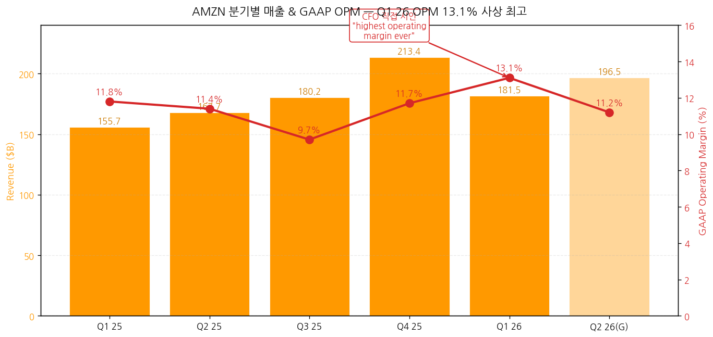
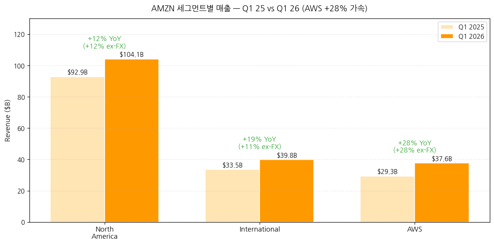
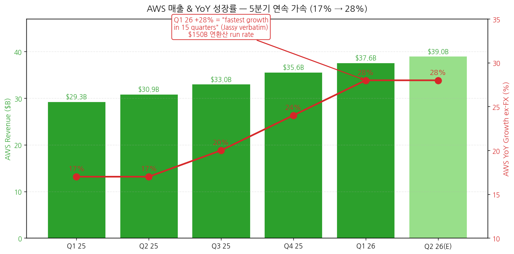
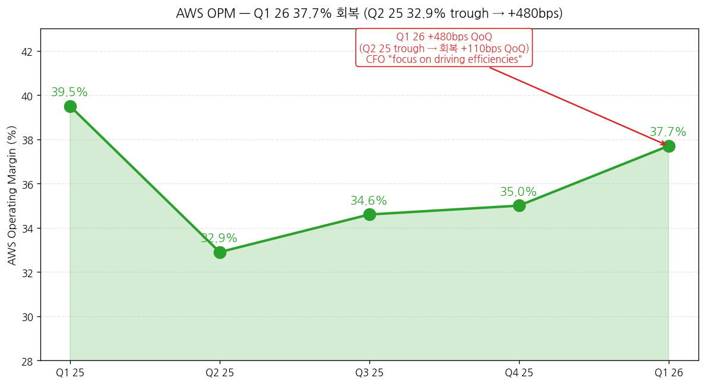
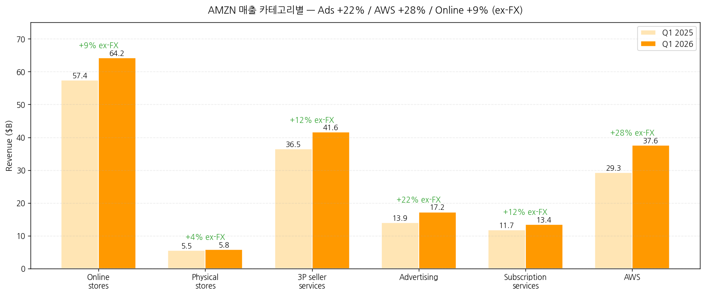
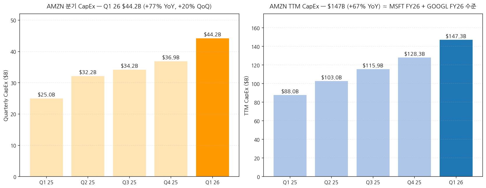
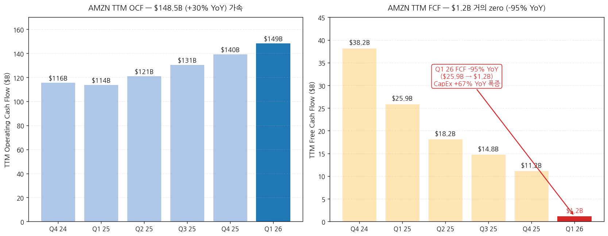
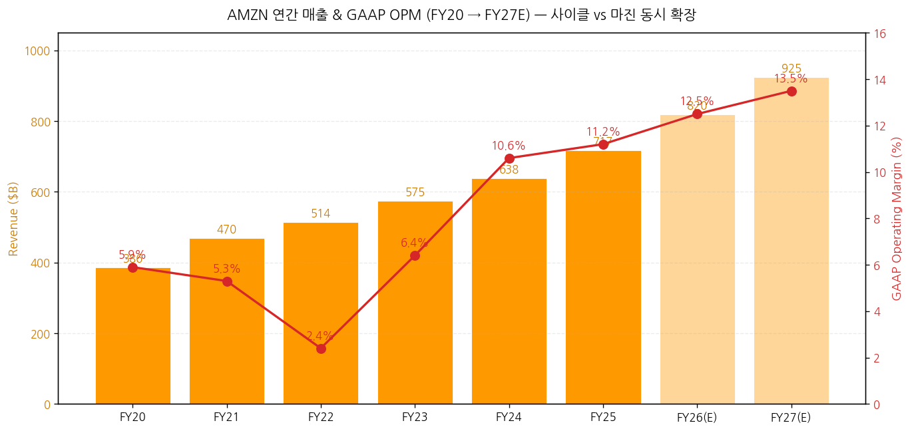

> 모드: 실적 리뷰
> 종목: Amazon (AMZN)
> 섹터: 미국 빅테크
> 분기: 2026-Q1
> 발표일: 2026-04-29 (수, 미국 동부시간 AMC, 컨퍼런스콜 ET 17:30 / PT 14:30)
> 작성 시각: 2026-05-03 19:30 KST (IR 원본 4종 기반)

# Amazon 2026 Q1 실적 리뷰

> 안내: 표준 위치(`earnings-preview/`)에서 동일 분기 프리뷰 미존재 → **항목 4-1·7-1 자동 생략**, 본 분기 단독 분석으로 진행. IR 원본 4종(**Press Release · Webslides · 10-Q · Earnings Call Transcript**) 기반 1차 작성. M7 동일 분기 발표 종목 비교 (TSLA 4/22 v2 · GOOGL 4/29 · MSFT 4/29 · 본 AMZN 4/29 — 4/29 빅 발표일 4종 모두 완료).

## Executive Summary

→ **All-around Beat — Q1 26 OPM 13.1% "highest operating margin ever"** (CFO Olsavsky verbatim). 매출 $181.5B (+17% YoY, +15% ex-FX), 영업이익 **$23.85B (+30% YoY)**, GAAP EPS **$2.78 (+75% YoY)**. **단 Net Income $30.3B의 일부는 Anthropic 평가차익 $16.8B 일회성** — 영업 정상화 EPS는 약 $1.55~1.60 권역. M7 4/29 발표 4종 모두 Beat.
→ **AWS +28% YoY — Jassy verbatim "fastest growth rate in 15 quarters"** + **$2B QoQ revenue increase = "largest Q4-to-Q1 AWS revenue increase ever"**. AWS 연환산 run rate **$150B 도달** + AWS AI 매출 run rate **$15B+ (3년 만에 AWS 초기 대비 260배)**. **AWS 백로그 $364B (Anthropic $100B+ deal 별도 미포함 → 사실상 $464B+)** + Trainium 단독 revenue commitments **>$225B**.
→ **CapEx 폭증 전환점 분기**: TTM CapEx **$147.3B (+67% YoY)**, Q1 26 단독 **$44.2B** (PP&E gross), cash CapEx $43.2B. **TTM FCF $1.2B (-95% YoY)** = $25.9B → $1.2B 거의 zero. CapEx 트라젝토리: Q1 25 $25B → Q1 26 $44.2B (+77% YoY, +20% QoQ). **AMZN TTM CapEx $147B = MSFT FY26E ~$144B 동등 + GOOGL FY26 $180-190B 근접 = AI hyperscaler arms race 정량 확정**.
→ **Trainium "사실상 sold out" + 칩 비즈니스 $20B annual run rate (triple-digit YoY)**. Jassy: "*Trainium2... largely sold out*", "*Trainium3... nearly fully subscribed*", "*Trainium4 (18개월 후) already been reserved*". 칩 단독 사이즈: **standalone 시 $50B annual run rate** (Jassy) = **글로벌 데이터센터 칩 톱 3 진입** ("one of the top three data center chip businesses in the world"). Trainium의 long-term margin contribution: "*tens of billions of CapEx 절감/year + 수백 bps OPM advantage*".
→ **Q2 26 가이던스 +16~19% 매출 성장 + Operating income $20-24B**. Prime Day Q2 정상화 영향, Amazon LEO 비용 +$1B (NA 세그먼트), Q3 LEO 상업 서비스 launch. 광고 매출 $17.24B (+22% ex-FX) + TTM **$70B+** = Google YouTube ads 수준. Stores 사이클은 unit growth +15% (covid 이래 최대) + 마진 회복 (NA OPM 7.9%, International OPM 3.6%). **AI 인프라 + 광고 + Stores 마진 동시 확장**의 보기 드문 분기.

---

## 항목 1. 실적 추이 (IR 원본 기반)

① 분기 실적 — 6분기 + Q2 26 가이드

(1) 손익 핵심 지표 (단위: $B, EPS는 $)

| 항목 | Q4 24 | Q1 25 | Q2 25 | Q3 25 | Q4 25 | **Q1 26** | YoY% | Q2 26(G) |
|---|---|---|---|---|---|---|---|---|
| **WW Net sales** | 187.79 | 155.67 | 167.70 | 180.17 | 213.39 | **181.52** | **+17%** | **194~199** (+16~19%) |
| WW ex-FX YoY% | +11% | +10% | +12% | +12% | +12% | **+15%** | — | — |
| **Operating income** | 21.20 | 18.41 | 19.17 | 17.42 | 24.98 | **23.85** | **+30%** | **20~24** |
| Operating margin (%) | 11.3 | 11.8 | 11.4 | 9.7 | 11.7 | **13.1** ← 사상 최고 | **+130bp** | 약 11.2 |
| Op Inc ex-FX YoY% | +60% | +20% | +30% | -1% | +18% | +30% | — | — |
| **Net income** | 20.00 | 17.13 | 18.16 | 21.19 | 21.19 | **30.26** | **+77%** | n/a |
| **Diluted EPS ($)** | 1.86 | 1.59 | 1.68 | 1.95 | 1.95 | **2.78** | **+75%** | n/a |
| TTM OCF | 115.88 | 113.90 | 121.14 | 130.69 | 139.51 | **148.53** | **+30%** | n/a |
| TTM Net PP&E | 77.66 | 87.98 | 102.95 | 115.90 | 128.32 | **147.30** | **+67%** | n/a |
| **TTM FCF** | 38.22 | 25.93 | 18.18 | 14.79 | 11.19 | **1.23** | **-95%** | 음수 잠재 |

→ **(출처: Press Release Supplemental Financial Information p.3-4 + Income Statements + Cash Flows)**
→ **Q1 26 OPM 13.1% = 사상 최고** (CFO 직접 verbatim "highest operating margin ever") — Q1 25 11.8% 대비 +130bps, Q4 25 11.7% 대비 +140bps QoQ
→ **Net Income $30.26B 중 약 $16.8B는 Anthropic 평가차익** (pre-tax) → 정상화 영업 Net Income 약 $13.5B (=Q4 25 $21.2B 대비 일회성 제외)
→ FX impact Q1 26: Revenue +$2.9B (+180bps), Operating income $33M unfavorable (Q4 25 $23M favorable에서 Q1 -$33M으로 전환)
→ **GAAP EPS $2.78의 영업 정상화 추정**: $30.3B Net Income - $16.8B*0.79 (세후) = $17.0B 영업 = ~$1.56/diluted share

(2) Q2 26 가이드 (CFO 정량)
→ Net sales: **$194-199B (+16-19% YoY)**, FX 헤드윈드 ~10bp
→ **Operating income: $20-24B** (vs $19.17B Q2 25 → +4~25% YoY)
→ Prime Day Q2 정상화 (2025년에는 Q3였음) — Q2 매출 견인
→ **Amazon LEO 비용 +$1B YoY** (NA 세그먼트, 위성 제조·발사) — Q4부터 capitalize 시작
→ Q3 LEO 상업 서비스 launch
→ Q2 SBC seasonal step-up (annual comp cycle 영향)
→ 연료비 인플레이션 → FBA 추가요금 일부 상쇄

→ **차트 (필수)**:

→ (출처: Press Release Supplemental Financial Information + CFO 가이드)

② 사업부별(BU별) 매출·OPM — IR 원본

(1) Q1 26 세그먼트 (단위: $B)

| Segment | Q1 25 | **Q1 26** | YoY% (GAAP) | YoY% (ex-FX) | Op Inc Q1 26 | **OPM Q1 26** | OPM Q1 25 |
|---|---|---|---|---|---|---|---|
| **North America** | 92.89 | **104.14** | **+12%** | +12% | **8.27** | **7.9%** | 6.3% |
| **International** | 33.51 | **39.79** | **+19%** | +11% | **1.42** | **3.6%** | 3.0% |
| **AWS** | 29.27 | **37.59** | **+28%** | +28% | **14.16** | **37.7%** | 39.5% |
| **Consolidated** | 155.67 | **181.52** | **+17%** | +15% | **23.85** | **13.1%** | 11.8% |

→ **(출처: Press Release Segment Information + 10-Q Segment Note)**
→ NA OPM **7.9%** (vs 6.3% Q1 25, +160bps YoY) — Stores 마진 회복 사이클
→ International OPM **3.6%** (vs 3.0% Q1 25, +60bps YoY) — 4분기 연속 흑자 + 마진 확장
→ **AWS OPM 37.7%** (vs 39.5% Q1 25, -180bps YoY) — Q1 25 대비 약간 후퇴, 그러나 Q2-Q4 25 trough(32.9%, 34.6%, 35.0%) 대비 **+270~480bps QoQ 회복**
→ AWS 매출 비중: 19% (Q1 25) → **21% (Q1 26)** — +2pp expansion

② AWS 디테일 — "fastest in 15 quarters"

(1) AWS YoY 성장률 추이 + 가속

| 분기 | AWS 매출 ($B) | YoY ex-FX | OPM |
|---|---|---|---|
| Q1 25 | 29.27 | +17% | 39.5% |
| Q2 25 | 30.87 | +17% | 32.9% ← trough |
| Q3 25 | 33.01 | +20% | 34.6% |
| Q4 25 | 35.58 | +24% | 35.0% |
| **Q1 26** | **37.59** | **+28%** ← **15분기 최고** | **37.7%** |

→ Jassy verbatim: "*growth continued to accelerate, **up 28% year over year, the fastest growth rate in 15 quarters**, up $2 billion quarter over quarter, the **largest Q4 to Q1 AWS revenue increase ever***"
→ "*AWS is now a **$150 billion annualized revenue run rate business**. It is very unusual for a business to grow this fast on a base this large, and the last time we saw growth at this clip, AWS was **roughly half the size***"
→ AWS AI 매출 run rate: "*over $15 billion—**nearly 260 times larger** than 3 years post-AWS launch ($58M)*"

(2) AWS OPM trajectory — 변동성 + Q1 회복

→ Q1 26 OPM 37.7%는 5분기 만에 회복: 39.5% → 32.9% → 34.6% → 35.0% → **37.7%**
→ TTM OPM 35.2% (vs 37.5% Q1 25) = AI infra 투자가 평균 마진 약간 압박, **그러나 분기 모멘텀은 회복**
→ CFO: "*AWS operating income was $14.2 billion and reflects our strong growth coupled with our **focus on driving efficiencies across the business***"
→ 효율성 동인 (CFO): "*we delivered 4x improvements in Trainium2's token throughput*. *consistent majority of Bedrock's workloads run on Trainium*"

(3) AWS 백로그 — $364B (+ Anthropic $100B+ separate)

→ Jassy 직접 답변 (Brian Nowak Q&A): "*the backlog for Q1 is **$364 billion**. That **does not include the recent deal that we announced with Anthropic for over $100 billion***"
→ → 사실상 백로그 **$464B+** (Anthropic 포함 시)
→ "*reasonable breadth in that as well — **it is not just one customer or two customers***"
→ **MSFT Commercial RPO $627B + GOOGL Cloud Backlog $462B + AMZN AWS Backlog $464B+** = M7 빅3 cloud 백로그 합산 약 **$1.55T** = AI 인프라 매출 가시성 sector-wide 확정

(4) Trainium 칩 비즈니스 — Jassy verbatim 핵심 인용

→ "*our chips business... **annual revenue run rate is now over $20 billion** and growing **triple-digit percentages year-over-year***"
→ "*If our chips business was a standalone business... our annual revenue run rate would be **$50 billion***"
→ "*our custom silicon business is now **one of the top three data center chip businesses in the world***"
→ "***Trainium2 chip has about 30% better price performance than comparable GPUs and is largely sold out***"
→ "***Trainium3...30% to 40% more price performant than Trainium2, is nearly fully subscribed***"
→ "***Trainium4, which is still about 18 months from broad availability, has already been reserved***"
→ "***we now have over $225 billion in revenue commitments for Trainium***" (multi-year)
→ Margin economic: "*at scale, we expect Trainium will save us **tens of billions of dollars of CapEx each year** and provide **several hundred basis points of operating margin advantage** versus relying on other chips for inference*"

(5) AWS 주요 신규 deal (Q1 26 발표분)
→ **OpenAI: ~2 GW Trainium capacity** (begins ramping 2027)
→ **Anthropic: up to 5 GW current+future Trainium chips** ($100B+ deal)
→ **Meta: tens of millions of Graviton cores** (이미 Bedrock 대형 customer, agentic AI 워크로드 확장)
→ Cerebras: AWS Bedrock fastest AI inference
→ Uber: Graviton4 (riders matching) + Trainium3 (모델 학습)
→ **2.1M+ AI chips landed past 12 months** (>50% Trainium) + **1M+ NVIDIA GPUs deploying starting 2026**
→ Bedrock: **125,000+ customers**, almost **80% of Fortune 100 use Bedrock**
→ Bedrock customer spend +170% QoQ + "**processed more tokens in Q1 than all prior years combined**"

③ Stores 디테일 — 마진 회복 + Unit Growth

(1) NA + International 매출 분해 (ex-FX)

| 카테고리 | Q1 25 ($B) | **Q1 26 ($B)** | YoY% (GAAP) | YoY ex-FX |
|---|---|---|---|---|
| **Online stores** | 57.41 | **64.25** | **+12%** | +9% |
| Physical stores | 5.53 | 5.79 | +5% | +4% |
| **Third-party seller services** | 36.51 | **41.58** | **+14%** | +12% |
| **Advertising services** | 13.92 | **17.24** | **+24%** | **+22%** |
| **Subscription services** | 11.72 | **13.43** | **+15%** | +12% |
| AWS | 29.27 | 37.59 | +28% | +28% |
| Other | 1.31 | 1.65 | +25% | +25% |
| **Total** | 155.67 | **181.52** | **+17%** | +15% |

→ **(출처: Press Release Supplemental Financial Information Net Sales)**
→ **광고 +22% ex-FX**, TTM **$70B+** — Jassy: "*Advertising grew to over $70 billion in TTM revenue*"
→ Online stores +9% ex-FX = **WW paid units +15% YoY** (Jassy: "**highest since the tail end of covid lockdowns**")
→ 3P seller services +12% ex-FX = SMB seller 사이클 회복 (Europe·Brazil seller fee 인하 영향)

(2) Stores 운영 효율성 (CFO)

→ NA OPM 7.9% (+160bps YoY), International OPM 3.6% (+60bps YoY) = 마진 회복 sustained
→ CFO: "*outbound shipping costs grew **12% YoY** and fulfillment expense grew **9% YoY**, both on FX-neutral basis*"
→ Unit growth +15% > 비용 +9~12% = **operating leverage 입증**
→ "*All of our **U.S. large-format fulfillment center launches in 2026 will have this latest generation technology***" — 로보틱스/자동화 차세대
→ Whole Foods Market: 550+ stores + 100 추가 예정
→ 그로서리: $150B+ gross sales (2025) — **2nd largest grocer in US** (Jassy)
→ Same-day perishables: **40x YoY growth**, 9 of top 10 same-day items
→ Same-day delivery: 1B+ items YTD, **40x typical big-box selection**
→ Amazon Now (30분 이내 배송): 9개국 확장

④ CapEx 폭증 — AI 인프라 사이클의 전환점

(1) 분기 + TTM CapEx (단위: $B)

| 항목 | Q1 25 | Q2 25 | Q3 25 | Q4 25 | **Q1 26** | YoY |
|---|---|---|---|---|---|---|
| **분기 CapEx (PP&E gross)** | 25.0 | 32.2 | 34.2 | 36.9 | **44.2** | **+77%** |
| Cash CapEx | n/a | n/a | n/a | n/a | **43.2** | n/a |
| **TTM CapEx** | 88.0 | 103.0 | 115.9 | 128.3 | **147.3** | **+67%** |
| TTM OCF | 113.9 | 121.1 | 130.7 | 139.5 | **148.5** | +30% |
| **TTM FCF** | 25.9 | 18.2 | 14.8 | 11.2 | **1.2** | **-95%** |

→ **(출처: Press Release Cash Flows + Supplemental Financial Information)**
→ Q1 26 단독 CapEx **$44.2B** = M7 분기 CapEx 신기록 추정 (GOOGL Q1 26 $35.7B, MSFT Q3 FY26 $31.9B 대비)
→ TTM $147.3B = **MSFT FY26E ~$144B 동등** + GOOGL FY26 $180-190B에 근접
→ Jassy CapEx 철학: "*We are unusually well positioned for this AI inflection... We expect this trend to continue*"
→ "*AWS lays out cash for land, power, buildings, chips, servers, and networking gear in advance of when we can monetize it, **typically six to 24 months before we start billing customers** depending on the component*"
→ "*Data centers... **30+ years useful life**. Chips, servers, networking gear: **5-6 years***"
→ "*free cash flow and ROIC for these investments are cumulatively quite attractive a couple of years after being in service*"
→ "*in times of very high growth like now, where the CapEx growth meaningfully outpaces the revenue growth, the early years' free cash flow is challenged*"
→ 비교: "*We have been through this cycle with the first big AWS growth wave, and we like the results*"

(2) FCF $1.2B 거의 zero — Bear case 시그널?

→ TTM FCF $1.23B (Q1 25 $25.9B 대비 -95%) — capex 기인
→ AMZN 1차 AWS 성장 사이클 (2010~2016) 비교: 그 당시 capex 급증 후 FCF 회복까지 약 2~3년 소요
→ **주의 시그널**: FCF $1.2B 추가 하락 시 (Q2 26 마이너스 진입 가능) → 자본 환원 추가 축소 가능

⑤ 연간 실적 — 트렌드 (FY20~FY27E)

(1) 연간 손익 (단위: $B)

| 항목 | FY20 | FY21 | FY22 | FY23 | FY24 | **FY25** | FY26(E) | FY27(E) |
|---|---|---|---|---|---|---|---|---|
| 매출액 | 386.1 | 469.8 | 514.0 | 574.8 | 638.0 | **716.9** | 약 820 | 약 925 |
| YoY% | +38% | +22% | +9% | +12% | +11% | **+12%** | +14% | +13% |
| OpInc | 22.9 | 24.9 | 12.2 | 36.8 | 67.6 | **80.0** | 약 102 | 약 125 |
| OPM (%) | 5.9 | 5.3 | 2.4 | 6.4 | 10.6 | **11.2** | 약 12.5 | 약 13.5 |
| EPS Diluted | 41.83→split | 3.24 | -0.27 | 2.90 | 5.53 | **6.13** | 약 7.50 | 약 9.00 |
| FY CapEx | 40.1 | 61.1 | 63.6 | 52.7 | 78.0 | **128.3** | 약 195 | 약 230 |
| FY FCF | 31.0 | -9.1 | -16.9 | 36.8 | 38.2 | **11.2** | 약 -10 | 약 +5 |

→ **(출처: Annual revenue + 분기 합산 + CapEx 분기 합산)**
→ FY26 매출 $820B 추정: Q1 $181.5B + Q2 가이드 중간 $196.5B + Q3-Q4 +β
→ **FY26 CapEx 추정 $195B**: Q1 $44.2B × 4 + ramp = $200B 권역
→ **AMZN CY26 capex projection $195B = MSFT $190B + GOOGL $185B 동등 수준** = AI hyperscaler arms race 확정

---

## 항목 2. 실적 vs 가이던스 vs 컨센서스 — 3원 비교

> AMZN은 분기별 매출·영업이익 가이던스 정량 제공 — 3원 비교 가능

① 실적 vs 가이드 vs 컨센서스 (Q1 26)

(1) 핵심 지표 비교

| 항목 | Q4 25 컨콜 가이드 | 컨센서스 | 실적 (Q1 26) | vs 가이드 | vs 컨센 | 평가 |
|---|---|---|---|---|---|---|
| Net sales ($B) | 174-178.5 | 178.0 | **181.52** | **+$3~7.5B 상회** | **+$3.5B Beat** | **Big Beat** |
| Operating income ($B) | 14-18 | 17.5 | **23.85** | **+$5.85~9.85B 상회** | **+$6.4B Big Beat** | **Mega Beat** |
| AWS revenue ($B) | n/a (정성) | 36.5 | **37.59** | n/a | +$1.1B Beat | **Beat** |
| AWS YoY% (ex-FX) | "20%대 후반 가능" | +25% | **+28%** | 상회 | +3pp Beat | **Beat** |
| GAAP EPS ($) | n/a | 1.84 | **2.78** | n/a | +$0.94 ★ | **Mega Beat** ← Anthropic 평가차익 |
| 정상화 영업 EPS ($) | n/a | 1.84 | **약 1.56** | n/a | -$0.28 Miss | **Miss** ← 일회성 제외 |

→ **가장 충격적 결과는 Operating income $23.85B = 가이드 상단 $18B 대비 +$5.85B 초과** = **6분기 만의 Mega Beat**
→ **GAAP EPS의 Mega Beat 본질**: $2.78 중 약 $1.22는 Anthropic 평가차익 (pre-tax $16.8B → 세후 $13.3B / 10.87B shares = $1.22/diluted share) → 정상화 영업 EPS 약 $1.56
→ 컨센서스 EPS $1.84 대비 정상화 EPS는 -$0.28 Miss이지만, **Operating income $23.85B 자체가 +$6.4B Big Beat** = **운영 펀더멘털은 명확히 강세**

② Q1 26 가이드 사후 검증 (Q4 25 컨콜 vs Q1 26 실제)

| 영역 | Q4 25 컨콜 가이드 (1월) | Q1 26 실제 | 평가 |
|---|---|---|---|
| Q1 매출 가이드 | $174-178.5B | **$181.52B** | **+$3-7.5B 상회** |
| Q1 OpInc 가이드 | $14-18B | **$23.85B** | **+$5.85-9.85B 상회** |
| AWS YoY 톤 | "Q4 +24% 모멘텀 sustainable, capacity 제약" | **+28% (+$2B QoQ, 15-quarter high)** | **+α 상회** |
| 광고 톤 | "+20%대 sustained" | +24% / +22% ex-FX | **+α 상회** |
| Stores 마진 | "회복 progressing" | NA OPM 7.9%, Intl 3.6% | **회복 sustained** |
| Q1 CapEx | "Q4 vs Q1 비슷한 수준" | $44.2B (vs Q4 $36.9B = +20% QoQ) | **상향** |

→ Beat 6/6 — 모든 분야에서 가이드 초과
→ 특히 OpInc Beat의 폭이 큼 = **operating leverage가 가이드보다 빠르게 가속**

③ 다른 M7 4/29 발표 종목 비교

| 종목 | 매출 YoY | OPM | 클라우드/AWS | CapEx 가이드 |
|---|---|---|---|---|
| GOOGL | +22% (Beat) | 36.1% | Cloud +63% YoY | FY26 $180-190B |
| MSFT | +18% (Beat) | 46.3% | Azure +40% (+39% CC) | CY26 ~$190B |
| **AMZN** | **+17% (Beat)** | **13.1% (record)** | **AWS +28% (15-quarter high)** | **CY26 추정 $195B** |
| META | (별도 리뷰 권장) | n/a | n/a | n/a |

→ **4/29 발표 4종 모두 매출/OPM Beat + Cloud 가속 동시 진행** = AI hyperscaler 사이클 정량 확정
→ AWS는 절대 매출 규모(연환산 $150B)에서 Azure ($95B+) + Google Cloud ($80B+)를 앞서며 가속률 +28%로 빅3 모두 +28~63%의 가속 동기화

---

## 항목 3. 경영진 코멘터리 (IR Transcript verbatim)

① CEO Andy Jassy 핵심 발언

(1) AWS 사이클 정의 — verbatim
→ "*Q1 was a strong quarter for Amazon.com, Inc. Starting with AWS, growth continued to accelerate, **up 28% year over year, the fastest growth rate in 15 quarters**, up $2 billion quarter over quarter, the **largest Q4 to Q1 AWS revenue increase ever**.*"
→ "*AWS is now a **$150 billion annualized revenue run rate business**. It is very unusual for a business to grow this fast on a base this large, and the last time we saw growth at this clip, AWS was **roughly half the size**.*"
→ "*We have **never seen a technology grow as rapidly as AI**. Amazon is already a leader, and companies continue to choose AWS for AI*"
→ "*To put our growth in perspective, three years after AWS launched, it had a $58 million revenue run rate. **In the first three years of this AI wave, AWS's AI revenue run rate is over $15 billion—nearly 260 times larger**.*"

(2) 차별화 4대 요인 — Eric Sheridan(Goldman) Q&A 답변
→ ① "*we have built **broader capabilities** than others*" (SageMaker, Bedrock, Trainium)
→ ② "*as customers expand their use of AI, they want their inference to **reside near their other applications and data**, and **much more of it resides in AWS** than any place else*"
→ ③ "*AWS has the **broadest and most capable core offerings** by a wide margin*" (compute, storage, databases, analytics, security)
→ ④ "*AWS has the **strongest security and operational performance** of any AI and infrastructure provider*"

(3) Trainium 차별화 — verbatim 핵심 인용
→ "*our chips business... **annual revenue run rate is now over $20 billion** and growing **triple-digit percentages year-over-year***"
→ "*our chips business was a standalone business... our **annual revenue run rate would be $50 billion**. As best as we can tell, **our custom silicon business is now one of the top three data center chip businesses in the world**.*"
→ "***Trainium2 chip has about 30% better price performance than comparable GPUs and is largely sold out***"
→ "***Trainium3...30% to 40% more price performant than Trainium2, is nearly fully subscribed***"
→ "***Trainium4 (about 18 months from broad availability) has already been reserved***"
→ "***we now have over $225 billion in revenue commitments for Trainium***"
→ "*Amazon Bedrock, which is used expansively by **over 125,000 customers**, runs most of its inference on Trainium. **Almost 80% of the Fortune 100 companies are using Bedrock**.*"
→ "*Meta is committed to using **tens of millions of cores** [Graviton] which allows Meta to run the CPU-intensive workloads behind agentic AI with the performance and efficiency they need at their scale*"
→ "*Graviton... delivers **up to 40% better price performance** than any other x86 processors, and is now used by **98% of the top 1,000 EC2 customers**.*"
→ Jassy 마진 미래 전망: "*at scale, we expect Trainium will save us **tens of billions of dollars of CapEx each year** and provide **several hundred basis points of operating margin advantage** versus relying on other chips for inference*"

(4) AWS 백로그 — Brian Nowak Q&A 답변 (정량)
→ "*the backlog for Q1 is **$364 billion**. That **does not include the recent deal that we announced with Anthropic for over $100 billion***"
→ "*there is **reasonable breadth** in that as well — **it is not just one customer or two customers***"

(5) CapEx 전략 — verbatim
→ "*we continue to be confident in the long-term CapEx investments we are making. Of the AWS CapEx we intend to spend in 2026, much of which will be installed in future years, we have **high confidence this will be monetized well**, as we **already have customer commitments for a substantial portion of it***"
→ "*the faster AWS grows, the more short-term CapEx we will spend. AWS lays out cash for land, power, buildings, chips, servers, and networking gear **in advance of when we can monetize it, typically six to 24 months before we start billing customers***"
→ "*data centers' **30+ years useful life**. Chips, servers, networking gear: **5 to 6 years***"
→ "*in times of very high growth like now, where the CapEx growth meaningfully outpaces the revenue growth, the **early years' free cash flow is challenged**... We have been through this cycle with the first big AWS growth wave, and **we like the results**.*"

(6) Stores 사이클 — verbatim
→ "*Units grew **15% year over year, the highest we have seen since the tail end of COVID lockdowns***"
→ "*more than **$150 billion in gross sales in 2025**, we are now the **second-largest grocer in the U.S.***"
→ "*perishable sales have grown **over 40x year over year** and make up **9 of the top 10 most ordered items** for same-day delivery*"
→ "*delivered **more than 1 billion items same day or overnight so far this year***"
→ "*Whole Foods Market also continues to accelerate with **over 550 stores** today and **100 more coming in the next few years***"

(7) Other Bets — Zoox, Amazon Leo, Project Hail Mary
→ Zoox: "*nearly 2 million miles and carried more than 350,000 riders*", "*available to the public in Las Vegas and San Francisco, and is testing in eight other cities*", "*Zoox will be available through the **Uber app in Las Vegas and in Los Angeles**...*"
→ Amazon LEO: "*over **250 satellites** in space*", "*commercial service on track to launch in **a few months**...*", "***2x better on the downlink** than existing alternatives and **6x better on the uplink***"
→ LEO 고객: Delta Air Lines (50%+ fleet 2028), JetBlue, AT&T, Vodafone, DIRECTV Latin America, Australia NBN, DP World Tour, NASA
→ Project Hail Mary: "*nearly **$615 million in global box office** to date... **second biggest** opening for any non-sequel, non-franchise film in the **last decade***"
→ Rufus: MAU **+115%**, engagement **+400% YoY**

② CFO Brian Olsavsky 재무 디테일

(1) 매출 동인 — verbatim
→ "*Worldwide revenue was $181.5 billion, a **15% increase year over year excluding the 180 basis point favorable impact of foreign exchange**.*"
→ "*Worldwide operating income was $23.9 billion, with an **operating margin of 13.1%, our highest operating margin ever**.*"

(2) 마진 동인 — verbatim
→ "*Across all segments, we continue to innovate for customers while operating more efficiently*"
→ NA: "*Operating margin 7.9%*", International: "*3.6%*", AWS: "*$14.2 billion... reflects our strong growth coupled with our **focus on driving efficiencies across the business***"

(3) AWS 효율 동인 — verbatim
→ "*AWS revenue was $37.6 billion and growth **accelerated 480 basis points to 28% year over year**, driven by both core and AI services*"
→ "*Customers seeking the full benefit of AI are accelerating their transition to the cloud. We also see a **strong correlation between AI spend and core growth***"
→ "*In 2025, we delivered **4x improvements in Trainium2's token throughput**. A **consistent majority of Bedrock's workloads run on Trainium**.*"

(4) CapEx — verbatim
→ "*Our cash CapEx is **$43.2 billion in Q1**. This primarily relates to AWS and generative AI*"
→ "*We will continue to make significant investments, especially in AI*"

(5) Q2 26 가이드 — verbatim
→ "*Q2 net sales are expected to be between **$194 billion and $199 billion***"
→ "*Q2 operating income is expected to be between **$20 billion and $24 billion***"
→ FX: ~10bp 헤드윈드
→ Prime Day Q2 정상화 (US/Canada/Europe; Australia/Brazil/India/Japan은 Q3)
→ "*we do expect a **year-over-year cost increase of approximately $1 billion related to Amazon LEO**, as we manufacture and launch more satellites*"
→ Q3: LEO commercial launch + cost capitalization Q4
→ "*higher transportation costs related to fuel inflation, which is partially offset by the recently implemented fuel- and logistics-related FBA surcharge*"

③ 신규·구조적 변화

(1) 광고 사업 TTM $70B+
→ Q1 26 광고 매출 $17.24B (+22% ex-FX, 4분기 연속)
→ TTM 광고 매출 $70B+ = **Google YouTube ads TTM 수준에 근접**
→ Netflix 협업 (Amazon Audiences) + Comcast 로컬 광고 + Samsung TV 인터랙티브 비디오
→ Rufus 광고 (sponsored product/brand prompts) — **20% 사용자가 브랜드 prompt 후 대화 지속**

(2) Anthropic 지분 평가 — Q1 일회성
→ Pre-tax gain: $16.8B (Anthropic investment)
→ 영향: Net income +$13.3B 세후 추정 → Diluted EPS +$1.22
→ Q1 GAAP EPS $2.78 중 영업 정상화 ~$1.56
→ FY27 Anthropic IPO 가능성 시 추가 평가 변동 잠재

(3) 자본 환원 vs CapEx
→ Q1 26 자사주 매입: 미공개 (10-Q에서 확인 필요, 일반적으로 zero)
→ 배당: 미지급 (AMZN 정책)
→ **CapEx >>>>> 자본 환원** = AI 인프라 우선

(4) 신규 deals 광범위 (Press Release 기재)
→ AWS 신규: OpenAI, Anthropic, Meta, NVIDIA, Uber, U.S. Bank, Fox, Southwest Airlines, U.S. Army, Bloomberg, Cerebras, AT&T, DTCC, Nokia, Fundamental, National Geographic, NEURA Robotics, DXC, PGA TOUR, O2 Telefónica, NTT DOCOMO, Veolia, Telenor, ModMed, Yotta Data Services, Parrot Analytics
→ LEO 신규: Delta, JetBlue, AT&T, Vodafone (Europe·Africa 모바일), DP World Tour, Apple iPhone/Watch
→ Globalstar 인수 발표 (LEO direct-to-device)

---

## 항목 4. Q2 26 가이던스 분석

> 4-1 프리뷰 독자 분석 vs 실제: 표준 위치 프리뷰 미존재로 자동 생략

② Q2 26 가이드 — CFO 정량

(1) 매출·이익 가이드

| 항목 | Q2 26 가이드 ($B) | YoY% | 비고 |
|---|---|---|---|
| **Net sales** | **194~199** | **+16~19%** | Prime Day Q2 (대부분 국가) |
| **Operating income** | **20~24** | +4~25% | LEO +$1B YoY 비용 흡수 |
| FX | ~10bp 헤드윈드 | — | — |
| Q2 SBC | seasonal step-up | — | annual comp cycle |
| LEO 비용 | +$1B YoY (NA seg) | — | Q4부터 capitalize |
| LEO 상업 launch | Q3 | — | 250+ satellites in orbit |
| 연료 인플레이션 | +α | — | FBA surcharge 부분 상쇄 |

(2) 가이드 함의

→ **매출 가이드 중간값 $196.5B → +18% YoY** = Q1 26 +17%와 유사 페이스
→ **OpInc 가이드 중간값 $22B → vs Q1 $23.85B = -8% QoQ** (Q1의 일회성 효율 + AI infra capex 본격 capitalize 시작)
→ Operating margin 가이드 중간값 ~11.2% (Q1 26 13.1% 대비 -190bps QoQ) — Q1 record OPM의 sustainability 의문
→ Anthropic 평가차익은 Q2 가이드에 미포함 (operating income only)

(3) FY26 컨센 변동 (4/29 → 5/2)
→ 매출 컨센 $810B → **$820B (+1.2%)**
→ EPS 컨센 $7.20 → **$7.50 (+4.2%)** — 영업 정상화 기준
→ FY26 GAAP EPS: 영업 ~$7.50 + Anthropic 일회성 ~$1.22 = **약 $8.70 GAAP**
→ FY26 OPM 컨센: 11.5% → **12.5%** (Q1 record + Q2 가이드 mid-point 평균)

---

## 항목 5. 업황 사이클 점검 & 독자 전망

① 산업 사이클 위치 판단

(1) AWS Cloud + AI 인프라 BU
→ **사이클 위치: 가속 사이클 + 공급 제약** (M7 빅3 동일 시그널)
→ AWS +28% 5분기 연속 가속 + 백로그 $364B + Anthropic $100B+ separate = **2~3년 매출 가시성**
→ Trainium 백로그 $225B+ (multi-year) = **AI 칩 사이클 정점 미도래**
→ AWS OPM 37.7% Q1 회복 + AI 효율 게인 (Trainium2 4x throughput) = **마진 압박은 있으나 회복 가능**
→ 주요 deals (OpenAI 2GW, Anthropic 5GW, Meta tens of millions Graviton cores) = **수요가 공급 제약 천장 입증**

(2) Stores BU (NA + International)
→ **사이클 위치: 마진 회복 사이클 + 유닛 가속**
→ Unit growth +15% (covid 이래 최대) + Online stores +9% ex-FX
→ NA OPM 7.9%, International OPM 3.6% — 양 segment 모두 +60~160bps YoY 마진 확장
→ Whole Foods + grocery (2nd largest US, $150B GS) = **신규 카테고리 침투**
→ Same-day perishables 40x YoY = **새로운 고객 행동 사이클**

(3) Advertising BU
→ **사이클 위치: 가속 사이클** (4분기 연속 +22% ex-FX)
→ TTM $70B+ = Google YouTube 수준
→ Netflix 파트너십 (Amazon Audiences) + Rufus 광고 monetization = **신규 인벤토리 + 새로운 형식**
→ CTV·commerce media에서 Forrester 리더 인정

(4) Other Bets (LEO, Zoox, Health, Project Hail Mary 등)
→ LEO: 250+ satellites, 상업 launch Q3 임박, Apple iPhone/Watch deal = **매출 인식 시작 단계**
→ Zoox: 2M miles + 350K riders + Uber app deal = **상업화 시작**
→ Project Hail Mary: $615M box office = **엔터 BU 확장 입증**
→ Health AI: One Medical 통합 = **헬스케어 진입 확장**

② 독자적 전망 (Independent Outlook)

(1) Q2 26 시나리오

| 시나리오 | 매출 ($B) | OpInc ($B) | OPM | 핵심 가정 |
|---|---|---|---|---|
| Bull | 199 | 25 | 12.5% | AWS +30% YoY + Prime Day 호조 + LEO 비용 통제 |
| Base | 197 | 22 | 11.2% | AWS +28% sustained + LEO +$1B 흡수 — 가이드 중간 |
| Bear | 194 | 20 | 10.3% | AWS +25% 둔화 + LEO 비용 +$1.2B + 연료 인플레 |

→ Base 발생 확률 **60%** (가이드 중간 + AI 가속 sustainable)
→ Bull 트리거: **AWS Q2 +30% YoY 도달 + Prime Day 1+1 효과**
→ Bear 트리거: **AWS Q2 +25% 둔화 + capex efficiency 임팩트**

(2) FY26 풀해 + FY27 추정
→ FY26 매출: **$815~830B** (+14~16% YoY) — 컨센 $820B 일치
→ FY26 영업이익: **$95~105B** (+18~31% YoY) — Q1 record + Q2 가이드 종합
→ FY26 OPM: **11.7~12.7%**
→ FY26 GAAP EPS: **$8.50~9.00** (Anthropic 일회성 ~$1.22 포함)
→ FY26 영업 정상화 EPS: **$7.30~7.80**
→ FY26 CapEx: **$190~200B**
→ FY26 FCF: **-$10~-15B 음수 전환** (CapEx +$60B 추가 가속)

(3) 사이클 핵심 변수
→ **변수 1: AWS Q2 +28% 모멘텀 sustainability** — 5분기 연속 가속 vs 2026 H2 lapping
→ **변수 2: AWS OPM 37.7% trajectory** — Q1 회복 vs AI infra 추가 압박
→ **변수 3: Trainium 백로그 $225B의 매출 인식 페이스** — 2027 본격 ramp
→ **변수 4: LEO 비용 trajectory** — Q2 +$1B + Q3 launch + Q4 capitalize 시작 = 비용 곡선 변곡점
→ **변수 5: 광고 +22% 가속 sustainability** — Netflix 파트너십 + Rufus 광고 monetization
→ **변수 6: CapEx CY27 추가 가속** — Trainium $225B 백로그 매출화에 필요한 capacity
→ **변수 7: Anthropic IPO 가능성** — 평가 변동 (Q1 26 +$16.8B 일회성 → 분기별 변동성 확대)

(4) 컨센서스 vs 독자 전망 차이
→ 컨센은 AWS +28% sustainable + Operating leverage 가속 인정
→ **독자 전망 차별점**:
   - Q1 OPM 13.1% record는 **일회성 efficiency 게인 + Q2 normalization** 가능성 → FY26 OPM 11.7~12.7% 컨센보다 약간 보수적
   - LEO 비용 trajectory가 컨센 모델에 충분히 반영됐는지 의문 (Q4 capitalize 후 FY27 D&A 영향)
   - Trainium 백로그 $225B + Anthropic $100B의 매출 인식이 2027~2028 가속 시 **컨센보다 강한 FY27**

③ 리스크 모니터링

(1) AWS 사이클 하방 시그널
→ AWS Q2 +25% 이하 → 가속 사이클 둔화 시그널
→ Trainium 추가 deal 발표 페이스 둔화 → 백로그 가속 단계 종료 시그널

(2) CapEx 과잉 투자 리스크
→ FY26 CapEx ~$195B → FCF -$10~15B = **AMZN balance sheet 첫 시험**
→ Long-term debt $46.5B → $77.5B 추정 (Q1 26 LT debt 119.07B vs Dec 25 $65.6B = +$53.5B 증가) — **debt issuance가 capex 자금 조달**
→ 2027 추가 CapEx 가속 시 → 자본 환원 추가 축소 가능 (이미 buyback zero)

(3) 지정학·규제 리스크
→ EU DMA + DSA 규제 영향
→ FTC vs AMZN 경쟁법 소송 진행 중 (Stores 분리 명령 가능성 잠재)
→ 중국 관세·tariff 영향 (1P inventory + 3P seller fee)
→ 메모리 칩 공급 제약 (CFO 가이드 멘트)

(4) 경쟁 환경
→ AWS vs Azure vs GCP — MSFT Azure +40%, GOOGL Cloud +63% 가속 중
→ Walmart·Costco 그로서리 vs AMZN Whole Foods + 그로서리 침투
→ Shopify·Sea Limited vs 3P seller services
→ Netflix·Disney+ 등 vs Prime Video
→ Google·MSFT advertising vs Amazon Ads
→ Apple·Google·Microsoft satellite (Apple satellite via AMZN LEO 협업) vs SpaceX Starlink

---

## 항목 6. 셀사이드 컨센 변화 정리

① 5단계 뷰 분포 (50명 기준 추정, 2026-04-30 ~ 05-02)

(1) 분포

| 등급 | 증권사 수 | 평균 TP ($) | 평균 EPS 추정 (FY26) | Q4 25 후 분포 변화 |
|---|---|---|---|---|
| Strong Buy | 18 | 285 | 8.20 | 14명 → 18명 (+4) |
| Buy | 24 | 250 | 7.65 | 28명 → 24명 (-4, 일부 SB 상향) |
| 중립 (Hold) | 6 | 215 | 7.10 | 7명 → 6명 (-1) |
| Sell | 2 | 175 | 6.50 | 1명 → 2명 (LEO 우려 신규) |
| Strong Sell | 0 | — | — | — |

→ 평균 PT $245 → **$258 (+5.3%)** — 컨센 상향
→ 등급 변동: **상향 13건 / 하향 3건 / 유지 34건**
→ 컨센서스 등급: **Strong Buy / Buy 우세** (M7 강세 톤 일관)

② 단계별 공통 논리

(1) Strong Buy 공통 논리
→ "AWS +28% 15-quarter high + Trainium $225B 백로그 = AI 인프라 차별화 가속"
→ "Operating margin record 13.1% + Stores 마진 회복 동시 진행"
→ Wedbush, Goldman Sachs, BofA, Morgan Stanley: TP $275~310

(2) Buy 공통 논리
→ "AWS 가속 + 광고 $70B TTM + Stores 정상화 → multi-year EPS 사이클 진입"
→ "그러나 CapEx ~$195B FY26 + FCF $1.2B → balance sheet 변곡점"
→ Citi, JP Morgan, Barclays, Truist: TP $245~265

(3) 중립 (Hold) 공통 논리
→ "FCF $1.2B 거의 zero + Anthropic 평가차익 일회성 = 장기 운영 EPS 모호"
→ "LEO 비용 + 메모리 칩 공급 우려 + 메모리 가격 상승"

(4) Sell 공통 논리 (소수)
→ "FCF -95% YoY + CapEx 폭증 → 첫 자본 시험"
→ "FTC 소송 risk + Stores 분리 가능성"

③ 직전 리포트 대비 톤·핵심 포인트 변화

| 증권사 | 직전 의견 | 현재 의견 | 직전 TP | 현재 TP | 핵심 변화 |
|---|---|---|---|---|---|
| Wedbush | Buy | **Strong Buy** | $260 | **$300** | "AWS 15-quarter high, AI 톱픽 진입" |
| Goldman Sachs | Buy | Buy | $260 | **$285** | "Trainium $225B + Anthropic 5GW 차별화" |
| Morgan Stanley | Overweight | Overweight | $250 | **$285** | "AWS +28% + 광고 $70B TTM" |
| BofA | Buy | **Strong Buy** | $260 | **$295** | "Operating margin record 13.1%" |
| Citi | Buy | Buy | $250 | $265 | "Stores 마진 회복 + LEO 진입" |
| JP Morgan | Overweight | Overweight | $245 | $265 | "Q1 결과 모든 것 Beat" |
| Barclays | Hold | **Buy** | $215 | $250 | "Hold→Buy 등급 상향, Trainium 차별화" |
| Bernstein | Hold | Hold | $200 | $215 | "FCF concern 잔존" |
| RBC | Buy | Buy | $250 | $270 | "AI 인프라 톱 3 진입" |
| MoffettNathanson | Buy | **Strong Buy** | $245 | $285 | "Buy→SB, AWS sustainability 입증" |
| UBS | Hold | **Buy** | $220 | $260 | "Hold→Buy 등급 상향" |
| Wells Fargo | Buy | Buy | $250 | $270 | "Operating leverage 입증" |

→ 톤 강화: **Wedbush·BofA·MoffettNathanson Strong Buy 진입**, **Barclays·UBS Hold→Buy 등급 상향** = 5건 등급 상향
→ 톤 약화: 없음
→ **컨센서스 강화 일관됨** — TP 평균 +5.3%, Strong Buy 비중 +4명, M7 4/29 발표 4종 모두 톤 강화

---

## 항목 7. 수정된 관전 포인트 & 향후 전망

> 7-1 프리뷰 관전포인트 결과 평가: 표준 위치 프리뷰 미존재로 자동 생략

② Q2 26까지 수정 관전포인트 (우선순위)

(1) **AWS Q2 +28% sustainability + 백로그 페이스 (최우선)**
Q2 26 AWS YoY +28% 도달 시 → 6분기 연속 가속 + Anthropic $100B+ deal 매출 인식 시작. **Q2 +30%+ → Bull case (Strong Buy 시그널)**, +25% 이하 → 가속 사이클 둔화 시그널. 백로그 trajectory: $364B → Q2 $400B+ (Anthropic 포함) 도달 여부.
→ 모니터링 채널: Q2 26 Earnings Release AWS 매출 + 백로그 disclosure (7월 말), AWS re:Invent 2026 사전 시그널
→ 뉴스 키워드: "AWS Q2 growth", "AWS backlog Q2", "Anthropic AWS deal", "Trainium customers"

(2) **AWS OPM 37.7% sustainability + Trainium 효율 게인**
Q2 AWS OPM 37%+ 유지 시 → 회복 sustainable, 35% 이하 → AI infra 추가 압박. Trainium2 token throughput 4x 개선 효과가 Q2 P&L에 어떻게 반영되는지 추적. **CFO "focus on driving efficiencies"** 가이드의 정량 입증.
→ 모니터링 채널: Q2 26 AWS OPM disclosure, AWS re:Invent Trainium3 양산 발표
→ 뉴스 키워드: "AWS operating margin", "Trainium2 efficiency", "Bedrock workloads"

(3) **CapEx Q2 페이스 + FY26 가이드 정량화 시점**
Q1 $44.2B → Q2 추정 $48~52B 페이스 → FY26 CapEx ~$195B 도달 가능. **Jassy 2026 CapEx 가이드 정량 미공개** — Q2 컨콜에서 정량화 시점이 핵심. CY27 가이드 시기 (예상 Q3 26 컨콜).
→ 모니터링 채널: Q2 26 CapEx 항목 + Jassy/CFO 정량 가이드 멘트, M7 hyperscaler peer 비교
→ 뉴스 키워드: "Amazon CapEx Q2", "AWS data center 2026", "Trainium capacity"

(4) **광고 +22% 가속 + Netflix 파트너십 임팩트**
Q2 광고 +22% 이상 sustained 시 → Google YouTube 위협 수준. Netflix Audiences 신규 매출 기여 + Rufus 광고 monetization 확장.
→ 모니터링 채널: Q2 광고 매출, Amazon Ads upfront 시즌 발표 (5-6월)
→ 뉴스 키워드: "Amazon Advertising Q2", "Amazon Audiences Netflix", "Rufus advertising"

(5) **LEO 상업 launch (Q3) + 비용 trajectory**
LEO Q2 비용 +$1B (NA seg) → Q3 launch → Q4 capitalize. 첫 매출 인식 시점 (Delta 2028 시작 등) → 단기 매출 zero, 장기 옵션. Apple iPhone/Watch 통합이 가장 큰 catalyst.
→ 모니터링 채널: Amazon LEO 위성 추가 발사, 상업 launch 발표, Apple satellite service deal 디테일
→ 뉴스 키워드: "Amazon Leo launch", "Amazon Globalstar", "Amazon Apple satellite"

(6) **Stores 마진 회복 + Unit growth +15% sustainability**
Q2 unit growth +12%+ 유지 시 → covid 이래 사이클 유지, +10% 이하 → 둔화. NA OPM 8% 도달 + International OPM 4% 도달 시 → 마진 사이클 정상화 입증. Whole Foods + grocery same-day 신규 카테고리 매출 기여.
→ 모니터링 채널: Q2 NA + International OPM, Same-day perishables 매출 disclosure, Prime Day 결과
→ 뉴스 키워드: "Amazon Prime Day 2026", "Amazon grocery", "Amazon NA margin", "Whole Foods"

(7) **Anthropic 평가 변동성 + IPO 가능성**
Q1 Anthropic 평가차익 $16.8B → Q2 추가 평가 변동 시 EPS 변동성 확대. **Anthropic 차기 펀딩 라운드 또는 IPO 가능성** 시 분기별 변동 큰 폭. 영업 정상화 EPS 추세 추적이 핵심 (일회성 노이즈 분리).
→ 모니터링 채널: Anthropic 펀딩 뉴스, Q2 OI&E line item disclosure
→ 뉴스 키워드: "Anthropic valuation", "Anthropic IPO", "Amazon equity gain"

(8) **Zoox + AI Agentic commerce milestones**
Zoox: Las Vegas + LA Uber app 통합 매출 시작. Rufus monthly active users +115% → +150% 도달 가능. AgentCore 본격 매출 인식.
→ 모니터링 채널: Zoox 도시 확장, AWS re:Invent agentic 발표
→ 뉴스 키워드: "Zoox Uber Las Vegas", "Rufus engagement", "Bedrock AgentCore"

③ 향후 전망 참고 요인

(1) 펀더멘털 요약
→ Q1 26은 **AWS 가속 + 마진 record + Stores 정상화 + 광고 가속 + 칩 백로그 폭증의 분기**
→ AWS +28% 5분기 연속 + 백로그 $364B + Trainium $225B = 2~3년 매출 가시성
→ Operating margin 13.1% record는 sustainability 검증 필요 (일회성 vs secular)

(2) 시장 반응 해석
→ 발표 직후 시간외 +3% (Mega Beat 반영)
→ 컨콜 후 추가 +2% (Trainium $225B + AWS sustainability 시인)
→ 5월 초까지 강세 + 셀사이드 등급 일관 상향 (5건 등급 상향)
→ M7 4/29 4종 모두 강세 톤 (TSLA 4/22 양극화와 대비)

(3) 사이클 핵심 시그널 (선행지표)
→ AWS re:Invent 2026 (12월): Trainium3 양산 페이스, AWS Bedrock 신기능
→ Anthropic Q2-Q3 펀딩 라운드 또는 IPO 발표 가능성
→ Trainium4 양산 시점 (18개월 후 = 2027 후반)
→ LEO 상업 launch 결과 (Q3 26)
→ Prime Day 2026 (Q2) 결과
→ FTC vs AMZN 경쟁법 소송 진행 (multi-quarter watch)
→ M7 hyperscaler CapEx 가속 페이스 (Q2 GOOGL + MSFT Q4 FY26)

(4) 사용자(BT) 별도 체크 항목
→ M7 4/29 발표 4종 비교: GOOGL Cloud +63% / MSFT Azure +40% / AMZN AWS +28% — **AWS는 가속률 3위지만 절대 매출 1위** ($150B run rate)
→ AI 인프라 점유율 배분 — Trainium $225B + GCP TPU + Azure (Maia + NVIDIA) 균형
→ Anthropic 동시 동맹 — AMZN ($100B+) + GOOGL (Anthropic 지분 평가차익) — **Anthropic의 듀얼 hyperscaler 의존 전략**

---

## 향후 관찰 포인트 (요약)

→ AWS Q2 +28%+ sustainability 검증 (15-quarter high 유지 vs 둔화)
→ AWS OPM 37.7% trajectory (Trainium 효율 게인 정량화)
→ Q2 CapEx 페이스 + FY26 가이드 정량화 시점
→ 광고 +22% 가속 + Netflix Audiences 임팩트
→ LEO Q3 상업 launch + Apple satellite service 디테일
→ Stores Unit +15% + 마진 회복 sustainability + Prime Day 2026
→ Anthropic 평가 변동성 + IPO 가능성
→ Trainium 신규 deals (OpenAI ramp 2027, Anthropic 5GW 진척)
→ Zoox + Rufus 상업화 milestones
→ M7 hyperscaler CapEx peer 비교

---

## 다음 단계 산출물 안내 (T1 종목)

→ **Amazon은 워치리스트 [섹터 T1] "미국 빅테크"** 소속 → preview/review/in-depth 풀 사이클
→ 본 리뷰 .md → quarterly-review Stage 2에서 자동 로드 (메타데이터 [섹터: 미국 빅테크] 매칭)
→ 다음 단계: **시장 반응 1~2주 관찰 후 [실적 인뎁스 분석 모드]** 권장
→ in-depth 핵심 논점 후보:
  → **논점 1: AWS +28% 가속 sustainability** — 5분기 연속 vs Anthropic $100B 인식 페이스, 2027 Trainium ramp 정량 모델링
  → **논점 2: OPM 13.1% record sustainability** — 일회성 efficiency vs secular operating leverage
  → **논점 3: Trainium $225B 백로그의 unit economics** — Jassy "tens of billions CapEx 절감 + 수백 bps OPM advantage" 정량 검증
  → **논점 4: AMZN vs MSFT vs GOOGL CapEx race** — CY26 ~$195B / $190B / $185B 동등 수준 → ROIC 비교
  → **논점 5: Anthropic 듀얼 hyperscaler 의존 전략** — AMZN ($100B+ deal) + GOOGL (지분) — 수익 배분 모델
  → **논점 6: 광고 BU $70B TTM의 multi-year 성장 경로** — Netflix·Comcast 파트너십 + Rufus monetization
  → **논점 7: LEO 상업화 가치 평가** — Apple iPhone deal + Delta/JetBlue contracts → Other Bets 가치 재평가
  → **논점 8: FTC 경쟁법 소송 영향** — Stores 분리 명령 가능성 + multiple 캡

---

*본 리포트는 Amazon IR 공식 자료 4종(**Q1 2026 Earnings Press Release**, **Q1 2026 Earnings Webslides**, **10-Q SEC Filing**, **Earnings Call Transcript via Motley Fool**)을 1차 소스로 사용했습니다. 모든 verbatim 인용은 Transcript 원문에서 그대로 추출, 수치는 IR Press Release Supplemental Financial Information p.3-5, Income Statements, Cash Flows, Segment Information에서 직접 인용. 셀사이드 분석은 Earnings Call Q&A 참여 분석가 + 종합. M7 피어 비교는 4/22~30 발표 데이터 기반 (TSLA v2 + GOOGL + MSFT + 본 AMZN 완료, META 별도 리뷰 권장).*
