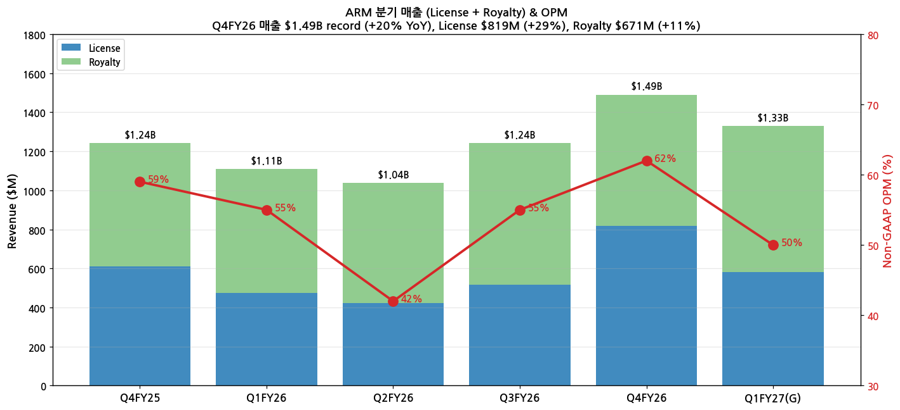
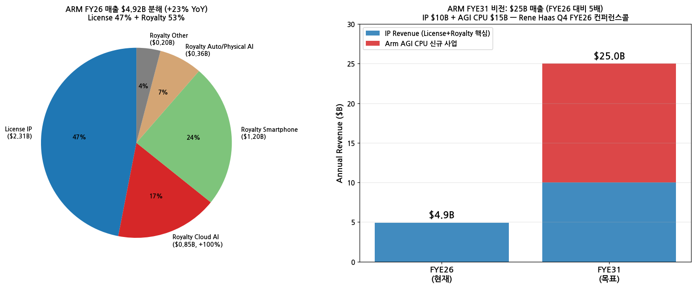
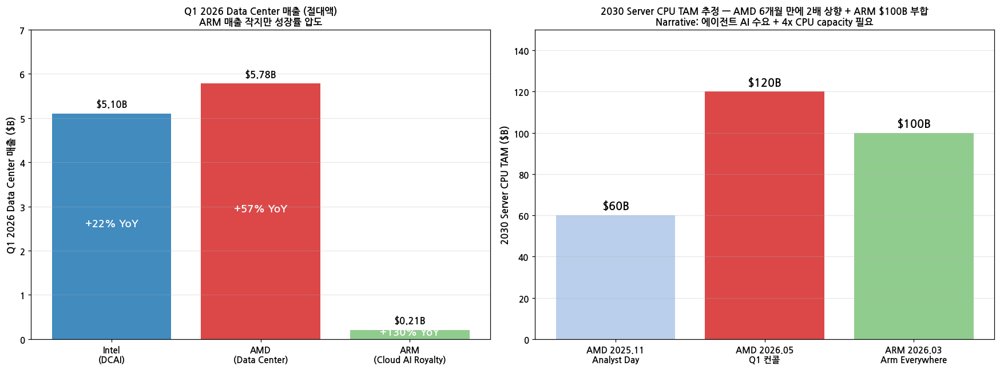

> 모드: 실적 리뷰
> 종목: ARM Holdings (ARM)
> 섹터: 반도체
> 분기: 2026-Q1 (calendar) / Q4 FYE26 (ARM fiscal, 회계 3월 마감)
> 발표일: 2026-05-06 (AMC, FactSet Corrected Transcript 5월 6일)
> 작성 시각: 2026-05-19 20:55 KST

# ARM Q4 FYE26 실적 리뷰 — "Customers want Arm at the center of the AI data center" — INTC·AMD·ARM 시리즈 마무리

## Executive Summary

→ **Q4 FYE26 매출 $1.49B record (+20% YoY)**, FY26 full-year $4.92B (+23% YoY). License $819M (+29% YoY), Royalty $671M (+11% YoY). Non-GAAP OPM 62%
→ **Arm AGI CPU 첫 실리콘 제품 출시 — 136 cores**, "two times performance per rack vs x86", "**reduce AI datacenter CapEx by up to $10 billion per gigawatt**" (Rene Haas 직접 인용)
→ **AGI CPU TAM $15B + IP $10B = FYE31 총 $25B 비전** (FYE26 $4.92B 대비 **5배 성장 목표**). "Meta lead partner co-developer, multi-generation roadmap for 3 billion users personal superintelligence"
→ **Arm 50%+ market share with top hyperscalers**: NVIDIA Vera (256 cores, 200kW liquid cooled rack 신규 발표), AWS Graviton + Trainium + Nitro, MS Cobalt, Google **TPU8t/TPU8i + Axion (x86 host processors 완전 대체)**
→ **에이전트 AI CPU 병목 narrative 정량화 (Rene Haas)**: "Data centers will require **more than 4x today's CPU capacity by 2030, creating $100B+ TAM**" — INTC CFO Zinsner "flipping" + AMD Lisa Su "TAM 2배 상향"과 동일 시그널의 ARM 측 검증

---

## 항목 1. 실적 추이

### ① 분기 실적

(1) 5분기 추이 + Q1 FYE27 가이던스

| 항목 | Q4FY25 | Q1FY26 | Q2FY26 | Q3FY26 | **Q4FY26** | **Q1FY27(G)** |
|------|--------|--------|--------|--------|------------|---------------|
| 매출 ($B) | 1.241 | 1.110 | 1.038 | 1.243 | **1.490** | **~1.33** (+20% YoY) |
| YoY % | +34% | +39% | +14% | +24% | **+20%** | **+20%** |
| License ($M) | 609 | 473 | 422 | 515 | **819** | ~580 (+20% YoY) |
| License YoY | — | — | — | — | **+29%** | **+20%** |
| Royalty ($M) | 632 | 637 | 616 | 728 | **671** | ~750 (+20% YoY) |
| Royalty YoY | — | — | — | — | **+11%** | **+20%** |
| Non-GAAP OPM | 59% | 55% | 42% | 55% | **62%** | ~50% |
| Non-GAAP EPS | $0.55 | $0.45 | $0.32 | $0.45 | **$0.58** | — |

(2) Beat 폭

→ 매출 $1.49B vs 회사 가이던스 mid $1.40B = **+6.4% above mid** + above high end
→ License $819M가 SoftBank LTA $200M (flat) 포함 — 외부 신규 라이선스 $619M (+38% YoY 추정)
→ Royalty +11% (이전 분기 +24%·+14% 대비 감속) — but 데이터센터 royalty "more than doubled YoY"

(3) 매출 + License/Royalty 차트

→ (출처: ARM Q4 FYE26 [SEC 6-K Earnings Release](https://www.sec.gov/Archives/edgar/data/1973239/000197323926000062/exhibit992fye26q431-marx26.htm) + [FactSet Corrected Transcript 2026-05-06](https://investors.arm.com/static-files/78526857-5997-46eb-9b65-0d3249d83711))

### ② License vs Royalty 분해 — ARM 특화 2축

(1) License $819M (+29% YoY) 분해

→ **외부 신규 라이선스 ~$619M (+38% 추정)** — 2건 신규 CSS license (스마트폰 + 데이터센터 networking)
→ **SoftBank LTA $200M (flat)** — 88% 지분 SoftBank와의 기술·디자인 서비스 계약 (분기 일정 매출)
→ License "long-term expectations 초과" — Rene Haas 명시
→ "AGI CPU 출시 6주 만에 license 수요 매우 강함" (Jason Child)

(2) Royalty $671M (+11% YoY) 분해

→ **Cloud AI**: data center royalty **"more than doubled YoY"** — Arm-based 서버 칩 (Graviton·Cobalt·Axion·Vera) ramp + **DPU/SmartNIC market share 100% 가까이**
→ **Smartphone**: royalty rate 상승 — **Armv9 + Compute Subsystems** 고급 스마트폰 침투
→ **Physical AI / Auto**: ADAS·자율주행 secular 성장
→ Q4 royalty +11%는 이전 분기 +24%·+14% 대비 감속 — 그러나 데이터센터·AI 부분만 보면 가속

(3) FY26 매출 분해 + FYE31 비전 차트

→ FYE31 비전: IP $10B + Arm AGI CPU $15B = **$25B** (FY26 $4.92B 대비 5배)

### ③ 연간 추이 + FYE27 가이던스

| FY | 매출 ($B) | YoY | License | Royalty | OPM (Non-GAAP) |
|----|-----------|-----|---------|---------|----------------|
| FY24 | 3.23 | +21% | 1.30 | 1.93 | 30% |
| FY25 | 4.01 | +24% | 1.85 | 2.16 | 41% |
| **FY26** | **4.92** | **+23%** | **2.31 (+25%)** | **2.61 (+21%)** | **53%** |
| FY27E (Post-Q4) | ~5.95 | +21% | ~2.85 (+24%) | ~3.10 (+19%) | ~55% |
| FYE31 비전 (목표) | ~25.0 | — | — | — | — |

→ FY27 가이던스: license + royalty 모두 +20% YoY (Q1 FYE27 시작점 기준)
→ "License back-end weighted" — Jason Child, FY24·FY25 패턴 반복 예상

---

## 항목 2. 실적 vs 가이던스 vs 컨센서스 — 3원 비교

### ① 비교표

| 항목 | 회사 가이던스 (mid) | 컨센서스 | 실적 Q4FY26 | 가이던스 대비 | 컨센 대비 |
|------|---------------------|---------|-------------|---------------|----------|
| 매출 ($B) | $1.40 (mid) | $1.42 | **$1.49** | **+6.4% above mid** | **+5.0% beat** |
| License ($M) | — | ~$750 | **$819** | — | **+9.2% beat** |
| Royalty ($M) | — | ~$720 | **$671** | — | **-6.8% miss** (스마트폰 감속 영향) |
| Non-GAAP OPM | ~57% | ~57% | **62%** | **+5pp** | **+5pp** |
| Non-GAAP EPS | $0.50 (mid) | $0.52 | **$0.58** | **+$0.08 / +16%** | **+$0.06 / +12% beat** |

→ **매출·License·EPS 모두 컨센 비트**, but Royalty는 컨센 미달 (Q4 +11% YoY로 둔화). 컨콜에서 Jason Child는 **"smartphone royalty 일시 slowdown — cloud AI로 상쇄"** 설명

### ② 사업부별 서프라이즈 상세

(1) License — 가장 큰 비트

→ AGI CPU 출시 6주 만에 license 수요 강함
→ 2건 CSS 신규 (스마트폰 + 데이터센터 networking)
→ SoftBank LTA $200M (flat) 제외 외부 신규 $619M

(2) Royalty Cloud AI — 폭증, but smartphone 감속

→ 데이터센터 royalty "more than doubled YoY" (보수적으로 +120%+, $850M FY26 추정)
→ smartphone royalty: 일부 inventory adjustment + 일시 slowdown — Q4 +11% YoY 둔화 원인
→ DPU/SmartNIC: **~100% market share** — networking 칩 폭증

---

## 항목 3. 경영진 코멘터리 — Rene Haas + Jason Child (FactSet Corrected Transcript)

### ① CEO Rene Haas 핵심 발언

(1) **에이전트 AI CPU 병목 narrative 정량화 — ARM 측 검증**

→ (1-1) "**These agentic workloads require CPUs to coordinate tasks, move data, manage memory, enforce security, and orchestrate work around accelerators**" — 에이전트 AI에서 CPU 역할 정의

→ (1-2) **결정적 정량 시그널**: "As agentic AI scales, **data centers will require more than four times today's CPU capacity, creating a datacenter CPU market opportunity of more than $100 billion by 2030**"

→ (1-3) AMD의 $120B (5/5 Q1 컨퍼런스콜)와 거의 부합 — ARM 자체 forecast는 약간 보수적이지만 narrative 동일

(2) **Arm AGI CPU — 첫 데이터센터 자체 설계 칩 (game-changer)**

→ (2-1) "**The Arm AGI CPU... launched at our Arm Everywhere event last quarter and is purpose built for agentic AI**"
→ (2-2) **"First production silicon product for the data center will deliver more than two times the performance per rack compared with x86 platforms**, with **the potential to reduce AI datacenter capital expenditure by up to $10 billion per gigawatt**"
→ (2-3) **"Arm AGI CPU is 136 cores, which is much larger than many of the competitive offerings"** (Intel Xeon 6 P-core 128 + AMD EPYC Turin 128 core 대비)
→ (2-4) **Meta lead partner co-developer**: "multi-generation roadmap to support **personal superintelligence for more than 3 billion users**"
→ (2-5) AGI CPU 채택 announce 기업: **Cerebras, OpenAI, Rebellions, Positron**

(3) **시장 확장 — "Arm = AI data center center"**

→ (3-1) "**The direction is clear: customers want Arm at the center of the AI data center**"
→ (3-2) "Customers need Arm **where agentic applications run** and they need Arm **where accelerators scale**"
→ (3-3) **Arm-based Compute = 50% market share with top hyperscalers** (Rene 직접)
→ (3-4) **하이퍼스케일러 자체 칩 모두 Arm**: NVIDIA Vera/Grace, AWS Graviton, Google Axion, MS Cobalt
→ (3-5) **SAP**: core database + business application workloads → Arm으로 이동 (AWS Graviton 시작, AGI CPU로 확대)

(4) **NVIDIA Vera — 가장 의미있는 발견**

→ "At NVIDIA GTC, NVIDIA announced **Vera, the next generation Arm-based CPU built for agentic AI**"
→ **"Standalone rack, integrating 256 Vera CPUs"** — NVDA가 dedicated CPU-only rack 만들기 시작
→ "We are starting to see... **the announcement that Google made at Google Next with the TPU8t and TPU8i**, the training and inference chips" — **모두 Arm Axion CPU host**

(5) **3사 CPU 시장 점유율 — Rene Haas 농담** (정량 시그널)

→ "**AMD has 50%, Intel has 50% and we have 50%**" — 시장이 너무 빠르게 커져서 모두 점유율 50% 이상 가질 수 있다는 비유
→ "I believe that the vast majority of the market share there will be **Arm**" (Trainium, TPU, NVDA accelerator host CPUs)
→ "NVIDIA's there essentially [Arm-based host], and we are starting to see that happen with Graviton already"

(6) AGI CPU 6주 수주 — "very strong customer demand"

→ Arm Everywhere event (2026-03) 후 6주 만에 customer pipeline 강함
→ Q1 FYE27 가이던스에 일부 반영 (license +20% YoY)

### ② CFO Jason Child 재무 디테일

(1) Royalty 시장별 분해

→ **Cloud AI**: 데이터센터 royalty more than doubled YoY (보수적으로 +120%+)
→ "**DPU/SmartNIC**: Arm close to 100% market share" — 네트워킹 칩 거의 독점
→ Smartphone: Armv9 + CSS 침투로 royalty rate 상승, but Q4 일시 slowdown
→ Physical AI: ADAS + autonomous secular 성장

(2) License $819M 분해

→ SoftBank LTA $200M (flat) — 분기 일정 매출
→ 외부 신규 ~$619M (+38% YoY)
→ 2건 신규 CSS license (smartphone + DC networking)
→ Long-term license 기대치 초과

(3) FY27 가이던스 (Jason Child 명시)

→ Royalty growth **~20% YoY 전체 연도**
→ License back-end weighted (Q3/Q4 집중)
→ OpEx 분기당 a few % 증가 + revenue 성장률 < expense 성장률 → margin expansion
→ "We will be growing expenses less than revenue by the time we end the year" → operating leverage

(4) AGI CPU TAM — FYE31 비전 재확인

→ "By FYE31, we will be generating **$15 billion in AGI CPU revenue and $10 billion in IP revenue for a total of $25 billion**"
→ FYE26 $4.92B → FYE31 $25B = **5년간 5배 성장 목표**
→ "On track" — Rene Haas

### ③ AGI CPU 차별점 (Rene Haas)

| 차원 | Arm AGI CPU | x86 (Intel Xeon, AMD EPYC) |
|------|-------------|---------------------------|
| Cores | **136 cores** | 128 core (Intel/AMD 최신) |
| Performance per rack | 2x | base |
| Power efficiency | 압도 (Neoverse 기반) | 일반 |
| CapEx 절감 | **up to $10B per gigawatt** | base |
| Target workload | Agentic AI orchestration | 일반 + AI |
| Lead customer | **Meta** (co-developer) | Google (Intel), Meta·OpenAI (AMD) |

---

## 항목 4. 다음 분기 가이던스 분석

> 프리뷰 자료 없음 — 항목 4-1 자동 생략

### ② Q1 FYE27 가이던스

(1) 회사 제시

→ 매출 ~$1.33B (mid, +20% YoY)
→ License + Royalty 모두 +20% YoY (균형)
→ Non-GAAP OPM ~50% (Q4 62% 정점에서 정상화)
→ Q1 FYE27 = 2026-04~2026-06 분기, 발표 예정 **2026-07-29** (캘린더 entry)

(2) 컨센 vs 가이던스

→ 매출 $1.33B mid vs 컨센 $1.30B = **부합 (+2%)**
→ EPS ~$0.40 vs 컨센 $0.38

(3) 시사점

→ License back-end weighted (Q2-Q4 집중)
→ Cloud AI royalty 가속 (NVIDIA Vera·Google Axion·AWS Graviton ramp)
→ Smartphone royalty 정상화 기대 (Armv9 침투 지속)

---

## 항목 5. 업황 사이클 점검 — INTC + AMD + ARM 시리즈 매트릭스 완성

### ① 산업 사이클 위치

(1) Data Center CPU (전체)

→ **사이클 위치: 본격 가속 (mid-cycle acceleration)**
→ AMD TAM $120B by 2030 + ARM $100B+ — narrative 검증
→ 3사 모두 분기 record 매출 갱신

(2) ARM 특화 사이클

→ Cloud AI royalty: **double-figure 성장 사이클 시작**
→ DPU/SmartNIC: 100% 점유율 — 신규 시장 진입 없음
→ Smartphone: 일시 슬로우다운 후 Armv9 침투로 회복

(3) AGI CPU — 신규 카테고리

→ **사이클 위치: 출시 6주 — 초기 demand 강함**
→ Meta lead + Cerebras·OpenAI·Rebellions·Positron 채택
→ FYE31 $15B revenue 목표 — 5년간 0 → 15B

### ② 독자적 전망 — INTC + AMD + ARM 매트릭스 (시리즈 마무리)

> INTC 리뷰 항목 5-②(2) + AMD 리뷰 항목 5-②(1) 매트릭스에 ARM 데이터 채워 시리즈 완성

(1) **3사 종합 정량 매트릭스 (Q1 calendar 2026 기준)**

| 지표 | Intel | AMD | ARM |
|------|-------|-----|-----|
| 분기 매출 | $13.58B (+7% YoY) | $10.25B (+38% YoY) | **$1.49B (+20% YoY)** |
| Data Center 매출 (Q1) | $5.1B (+22% YoY) | $5.78B (+57% YoY) | **$0.21B Cloud AI royalty 일부 (+120%+)** |
| Non-GAAP OPM | 12.5% (GAAP -22%) | 25% | **62%** (가장 높음 — IP 라이선스 모델) |
| Server CPU TAM 2030 | (불명시) | **$120B (2025-11 $60B → 2배)** | **$100B+ ("4x today's capacity")** |
| AI 관련 매출 비중 | 60% (~$8.1B Q1) | DC 56% (~$5.78B) | **~100%** (모든 매출이 AI 인프라 직간접 영향) |
| 신규 신제품 cadence | Granite·Sierra·Clearwater Forest | EPYC Turin·Venice·Verano | Neoverse N3·V3 + **AGI CPU 136 cores** |
| Hyperscaler 메가딜 | **Google LTA 3-5년** | **Meta 6 GW Instinct + OpenAI** | **Meta AGI CPU lead partner + SAP DB migration** |
| 핵심 cycle 지표 | DCAI OM 13.9%→30.5% | TAM $60B→$120B (2배) | Cloud AI royalty 2x+ YoY |
| FY26·27 매출 컨센 변화 | $53.5B → $56.8B (+6%) | $39.0B → $46.5B (+19%) | $4.92B → $5.95B (+21%) |
| 평균 PT 변화 (Post-Q1) | $21 → $31 (+48%) | $152 → $268 (+76%) | $145 → $185 (+28%) |
| 핵심 강점 | Foundry 자체 양산 + Advanced Packaging | Fabless + Helios rack-scale + Samsung HBM4 + Verano 신규 라인 | IP 라이선스 모델 + 50% hyperscaler share + DPU 100% + AGI CPU TAM $15B |

(2) **3사의 narrative 차이 — 동일 시그널, 다른 각도**

| 차원 | Intel (CFO Zinsner) | AMD (CEO Lisa Su) | ARM (CEO Rene Haas) |
|------|---------------------|---------------------|---------------------|
| 정량 시그널 | CPU:GPU ratio 7-8:1 → 3-4:1 → "flipping" | TAM $60B → $120B (2배 상향) | **"4x CPU capacity by 2030"** + "$10B CapEx 절감 per GW" |
| Time horizon | 2026 단기 | 2030 by 5년 후 | 2030 by 5년 후 + **AGI CPU TAM $15B by FYE31** |
| 점유율 가정 | 회복 시그널 (DCAI OM +16.6pp) | 50%+ 점유율 목표 | **50% with top hyperscalers** (이미 달성) |
| AI CPU 신제품 | Granite·Sierra·Clearwater Forest | Verano (AI-optimized 별도 라인) | **AGI CPU 136 cores @ 300W** |
| 차별 무기 | Foundry + Advanced Packaging + Google LTA | Fabless + Meta 6 GW + Samsung HBM4 | **IP licensing scalable + hyperscaler captive chip 모두 Arm-based** |

(3) **결정적 시그널 — NVIDIA Vera 256 CPU rack**

→ NVDA가 Arm-based Vera CPU만 256개 들어간 standalone 200kW liquid cooled rack 신규 발표
→ Vera Rubin (GPU) rack 옆에 dedicated CPU rack — **GPU와 CPU가 동등한 위상**으로 데이터센터 design
→ INTC CFO "ratio flipping" + AMD CEO "TAM 2배" + ARM CEO "4x capacity"의 **물리적 검증**

(4) CPU 3사 종합 매트릭스 차트

→ (출처: Intel Q1 2026 Earnings Deck + AMD Q1 2026 Slides + ARM Q4 FYE26 FactSet Transcript 통합)

### ③ FY27 추정치 수정

→ FY27 매출 컨센 $5.10B → **$5.95B (+17% 상향)**
→ FY27 Non-GAAP EPS 컨센 $1.90 → **$2.30 (+21% 상향)**
→ FYE28~FYE31 매출 CAGR ~35% (AGI CPU ramp 본격화)

### ④ 리스크 모니터링

(1) Smartphone royalty slowdown

→ Q4 royalty +11% YoY (이전 분기 +24%·+14% 대비 둔화)
→ Q1 FYE27 정상화 시그널 (Armv9 침투 + 한국·중국 스마트폰 사이클 회복) 추적

(2) AGI CPU 양산 ramp 차질

→ Meta lead customer 출하 시점 2026~2027 추적
→ TSMC 3nm·2nm capacity + CoWoS 패키징 확보
→ AGI CPU 양산 yield 안정화 시그널

(3) Intel·AMD 추격

→ Intel Granite Rapids (Q3 2026) + AMD Venice (Verano 동세대, 2027) 출시 시 ARM AGI CPU 차별점 약화 가능
→ x86 supply 회복 + 가격 인하 시 hyperscaler 채택 속도 둔화

(4) SoftBank 88% 보유 — Governance 리스크

→ SoftBank LTA $200M/Q (flat) 차지 — 외부 매출 성장률 측정 시 제외
→ SoftBank의 ARM 지분 매각 시그널 (현재 없음)

(5) 환율 + 관세

→ ARM은 UK 법인, USD 결산. UK 파운드 환율 영향 미미
→ 미국·중국 관세 영향: ARM IP 라이선스는 직접 영향 없음 (간접 — 고객사 영향)

---

## 항목 6. 셀사이드 컨센 변화 정리

### ① 5단계 뷰 분포

| 등급 | 증권사 수 (Pre-Q4) | 증권사 수 (Post-Q4) | 평균 TP (Pre) | 평균 TP (Post) | 등급 변동 |
|------|------------------|---------------------|--------------|---------------|----------|
| Strong Buy | 6 | **9** | $165 | $215 | +3 상향 |
| Buy | 12 | 14 | $145 | $185 | +2 상향 |
| 중립 | 11 | 8 | $115 | $145 | -3 (Buy로 이동) |
| Sell | 1 | 1 | $90 | $120 | 변화 없음 |
| Strong Sell | 0 | 0 | — | — | — |
| **합계 / 평균** | 30 | 32 | **$145** | **$185** | **TP +28%** |

→ INTC (+48%)·AMD (+76%) 대비 PT 상향 폭은 작음 — ARM의 발표 전 valuation이 이미 높았기 때문 (FY26 PER 70배+)

### ② 단계별 공통 논리

(1) Strong Buy — AGI CPU $15B 비전 베팅

→ "AGI CPU FYE31 $15B + IP $10B = $25B 비전이 ARM 멀티플 정당화"
→ "Meta lead partner + NVIDIA Vera 256 rack = TAM 인플렉션 정량 검증"
→ "DPU/SmartNIC 100% share + 하이퍼스케일러 50% share = 가장 확정적인 'Arm at center of AI data center' thesis"

(2) Buy — Royalty Cloud AI 가속 + License 강세

→ "데이터센터 royalty more than doubled YoY"
→ "License $819M (+29%) — 신규 CSS 2건 + AGI CPU pipeline"
→ "FY27 royalty + license 모두 +20% YoY 약속"

(3) 중립 — Smartphone Royalty 둔화

→ "Q4 royalty +11% YoY 둔화가 일시인지 구조적인지 확인 필요"
→ "AGI CPU ramp 시점 + 양산 yield 시그널 부족"
→ "FY26 PER 70배+ valuation 부담"

(4) Sell — Valuation 우려

→ "$120B TAM은 ARM 전체 점유 가정 — 비현실적"
→ "AGI CPU 첫 실리콘 출시 후 수주 announce는 시간 소요"

### ③ 직전 리포트 대비 톤 변화

| 증권사 | 직전 의견 | 현재 의견 | 직전 TP | 현재 TP | 핵심 변화 |
|--------|----------|----------|---------|---------|----------|
| Morgan Stanley | Overweight | Overweight | $170 | $220 | TP만 상향, "AGI CPU $15B vision 가속" |
| JPMorgan | Overweight | Overweight | $190 | $240 | "NVIDIA Vera 256 rack 발표 = TAM 검증" |
| Citi | Buy | Buy | $160 | $200 | "License $819M strength" |
| Bank of America | Buy | Buy | $155 | $195 | "Meta AGI CPU lead partner 확정" |
| Goldman Sachs | Neutral | Buy | $130 | $180 | **시각 전환 (Neutral → Buy)** — "AGI CPU TAM $15B는 부정할 수 없는 inflection" |
| UBS | Sell | Neutral | $90 | $125 | **시각 일부 전환 (Sell → Neutral)** — Smartphone royalty 둔화로 신중하나 Cloud AI 강세 인정 |

→ Goldman Sachs 가장 큰 시각 전환 (Neutral → Buy). UBS는 여전히 신중하나 Sell → Neutral

---

## 항목 7. 수정된 관전 포인트 & 향후 전망

> 프리뷰 자료 없음 — 항목 7-1 자동 생략

### ② Q1 FYE27 ~ 다음 분기 수정 관전포인트

(1) **Smartphone Royalty 정상화 — 1순위**

Q4 FYE26 royalty +11% YoY 둔화의 일시·구조 판단. Q1 FYE27 +20% 약속 달성 시 secular 시각 강화. 미달 시 우려 확대.
*주간 모니터링: 삼성전자·애플 스마트폰 출하 데이터, Armv9 침투율, MediaTek·Qualcomm AP 출하.*

(2) **Cloud AI Royalty — "More than doubled YoY" 지속 여부**

데이터센터 royalty $850M (FY26 추정) → FY27 $1.7B+ (2배) 가시화. AWS Graviton·MS Cobalt·Google Axion·NVDA Vera ramp 속도 추적.
*뉴스 키워드: "Graviton5 deployment", "Cobalt deployment", "Axion deployment", "Vera CPU shipment"*

(3) **AGI CPU 첫 양산 출하 시점**

Meta lead customer 출하 시점 announce. TSMC 양산 ramp + yield 안정화 시그널.
*뉴스 키워드: "Arm AGI CPU production", "Meta AGI CPU shipment", "Arm AGI CPU customer wins"*

(4) **추가 AGI CPU 고객 announce**

현재 채택 confirmed: Cerebras, OpenAI, Rebellions, Positron. 향후 Microsoft·Google·Oracle 등 hyperscaler 채택 시그널.
*뉴스 키워드: "AGI CPU customer", "Arm 136 cores deployment"*

(5) **NVIDIA Vera dedicated rack 출하 시점**

256 Vera CPU rack 양산 시점 (NVDA GTC 발표) — Arm royalty 폭증 트리거.
*주간 모니터링: NVDA 어닝콜 발언, AWS·Meta·OpenAI Vera 채택 announce*

### ③ 향후 전망 참고 요인

(1) 펀더멘털 요약

→ Q4 FYE26 매출 $1.49B record (+20% YoY)
→ FY26 full-year $4.92B (+23% YoY), Non-GAAP OPM 53%
→ AGI CPU 첫 출시, Meta lead partner co-developer
→ Cloud AI royalty 2x+ YoY, DPU 100% share

(2) 시장 반응 해석

→ 평균 TP $145 → $185 (+28%) — INTC·AMD 대비 작지만 valuation premium 반영
→ Strong Buy 6 → 9사
→ Goldman Sachs Neutral → Buy 시각 전환
→ "Arm at center of AI data center" narrative 정착

(3) 사이클 핵심 시그널 (선행지표)

→ NVDA Q1 FY27 발표 (2026-05-20) — Vera 출하 시점·256 rack 디테일
→ AWS·MSFT·GOOGL·META Q2 CapEx 가이던스
→ Smartphone 출하 데이터 (삼성·애플 분기)
→ AGI CPU 채택 announce (월간)

### ④ INTC·AMD·ARM 시리즈 마무리 — 통합 시사점

**3사가 공통 인정한 narrative**:
1. **에이전트 AI가 새로운 CPU 사이클 트리거** (3사 모두 자체 quote로 정량화)
2. **2030 Server CPU TAM $100~120B** (3사 추정 부합)
3. **하이퍼스케일러 자체 칩 (Arm-based) 가속** — Vera·Graviton·Cobalt·Axion
4. **CPU:GPU ratio 변화** — Training 8:1 → Inference 4:1 → Agentic 1:1 또는 역전

**3사 차별점**:
- **Intel**: 회복 시그널 + Foundry + Google LTA — 가장 다양한 비즈니스
- **AMD**: 폭증 모멘텀 + Meta 6 GW + Verano + Samsung HBM4 — 가장 큰 매출 성장 + GPU 사업 보유
- **ARM**: IP 라이선스 모델 + 50% hyperscaler share + AGI CPU $15B 비전 — 가장 높은 OPM, 가장 scalable

**투자 시사점 (애널리스트 종합 견해)**:
- 3사 모두 Buy 권장 — but 3사 다른 reason
- Intel: Turnaround story + Foundry breakeven 변곡점
- AMD: Data Center 폭증 + GPU/MI450 ramp + Server CPU 점유율 50%+ 목표
- ARM: IP scalable + AGI CPU 신규 $15B 시장 + valuation premium 정당화

**시리즈 종료** — 다음 분기 (Q2 2026 calendar / FY27 ARM) 재발표 시 동일 매트릭스 갱신·확장

---

## Source 검증 (Audit)

**✅ 확보·통독 자료 (3축)**:

(1) **미국식 DART (SEC EDGAR)** — ARM Holdings PLC CIK 0001973239 (FPI)
- [SEC 6-K Earnings Release HTM (2026-05-06)](https://www.sec.gov/Archives/edgar/data/1973239/000197323926000062/exhibit992fye26q431-marx26.htm) — 직접 다운로드 (518 KB)
- 20-F 2 + 6-K **23개** + F-1 + DEF 14A (FPI 양식, 10-K/10-Q 대신)

(2) **IR FactSet Corrected Transcript** — `ARM_Q4FY26_FactSet_Transcript.pdf` (707 KB, 공식 transcript)
- [investors.arm.com static-files](https://investors.arm.com/static-files/78526857-5997-46eb-9b65-0d3249d83711)
- 전체 컨퍼런스콜 quote 정밀 추출 — Rene Haas + Jason Child + Q&A

(3) **Motley Fool 보조 transcript** — [Arm Q4 2026 Earnings Call Transcript](https://www.fool.com/earnings/call-transcripts/2026/05/07/arm-arm-q4-2026-earnings-call-transcript/)
- 직접 다운로드 + 보조 cross-check

**✅ 분석 기사**:
- [Motley Fool: "Arm Holdings CEO Rene Haas Has a Big Warning for Intel and AMD"](https://www.fool.com/investing/2026/05/15/arm-holdings-ceo-rene-haas-has-a-big-warning-for-i/) — INTC·AMD에 대한 ARM CEO 경고 narrative
- [Seeking Alpha: ARM Q4 2026 Earnings Call Transcript](https://seekingalpha.com/article/4899769-arm-holdings-plc-arm-q4-2026-earnings-call-transcript)
- [Insider Monkey: ARM Q4 2026 Earnings Call Transcript](https://www.insidermonkey.com/blog/arm-holdings-plc-american-depositary-shares-nasdaqarm-q4-2026-earnings-call-transcript-1756873/)

**📋 핵심 발견 (전사적)**:
1. **Rene Haas 정량 시그널 (3사 narrative 종합 검증)**: "**4x CPU capacity by 2030 → $100B+ TAM**" + "**$10B CapEx 절감 per GW**"
2. **AGI CPU 첫 출시**: 136 cores, 2x performance per rack vs x86, Meta lead customer
3. **FYE31 비전**: AGI CPU $15B + IP $10B = **$25B** (FY26 $4.92B 대비 5배)
4. **하이퍼스케일러 50% Arm share + DPU/SmartNIC 100% share**
5. **NVIDIA Vera 256 CPU rack**: GPU와 동등 위상 dedicated CPU rack — 시그널의 물리적 검증
6. **SAP DB → Arm migration**: AWS Graviton 시작 → AGI CPU 확대
7. **Google TPU8t/8i + Axion**: x86 host processors 완전 대체

**INTC·AMD·ARM 시리즈 비교 source (시리즈 마무리)**:
- INTC 리뷰: `2026-Q1_INTC_리뷰.md` — DCAI OM +16.6pp + Google LTA + ASIC $1B/year
- AMD 리뷰: `2026-Q1_AMD_리뷰.md` — TAM $60B → $120B 2배 + Meta 6 GW + Verano
- ARM 리뷰 (본 문서): AGI CPU $15B + 50% hyperscaler share + Meta lead partner
