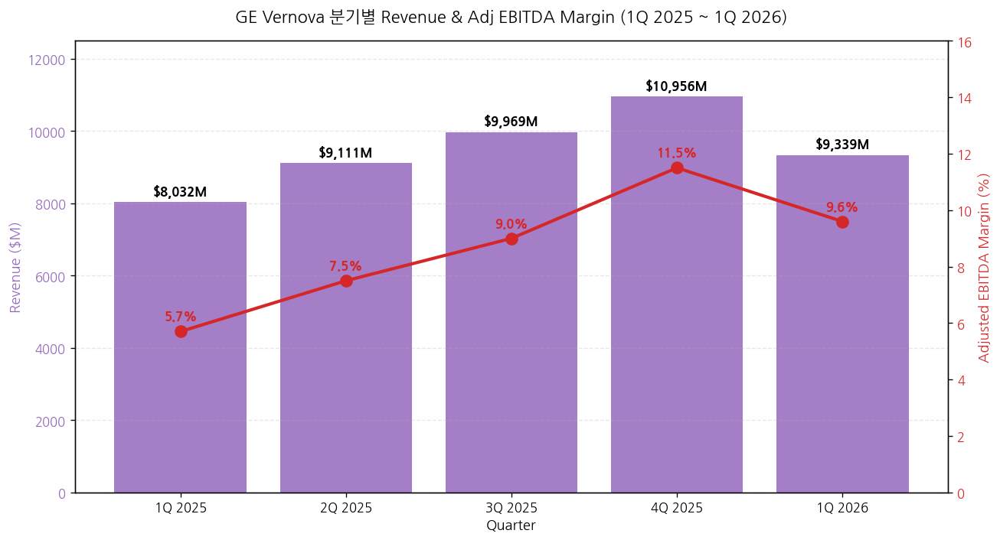
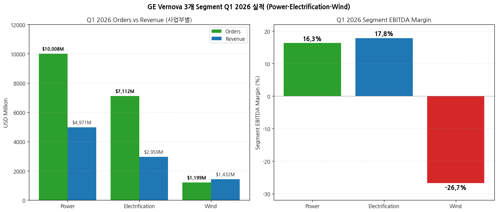
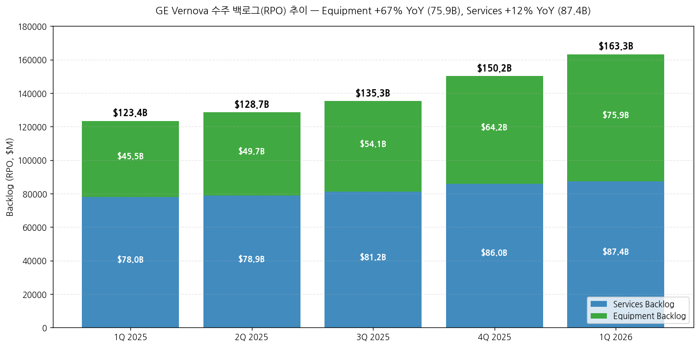
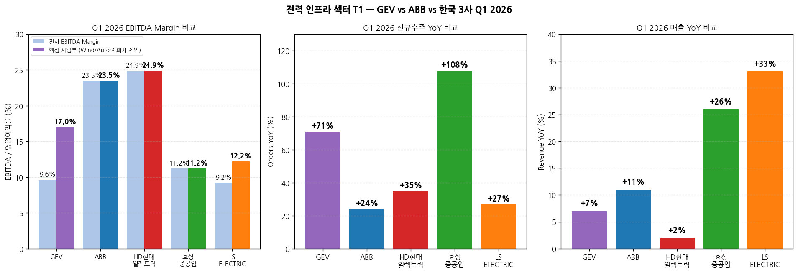
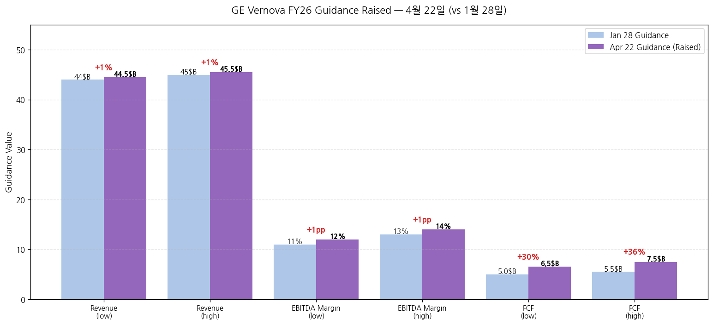

> 모드: 실적 리뷰 (글로벌 피어 — 가벼운 깊이)
> 종목: GE Vernova (GEV / NYSE)
> 섹터: 전력 인프라
> 분기: 2026-Q1 (Q1 2026, 분기 종료 2026-03-31)
> 발표일: 2026-04-22 (수, BMO) — Press Release + 10-Q + Presentation + Earnings Call 동시 발행
> 작성 시각: 2026-05-03 23:00 KST

# GE Vernova Q1 2026 실적 리뷰 (글로벌 피어 — 한국 전력 인프라 3사 핵심 cue)

> **본 리뷰는 글로벌 피어 워크플로우 (workflow rule 4)에 따라 한국 종목 review 7개 항목 중 핵심 4-5개로 압축 작성**: 1번 실적 추이 + 사업부 분해, 3번 경영진 코멘터리, 5번 업황 사이클(특히 한국 3사 cross-ref), 7번 관전포인트.
> **본 리뷰의 1차 목적**: ABB(4/16) → LS일렉트릭(4/21) → **GEV(4/22)** → 효성(4/25) → HD(4/28) 순서 중 GEV는 **한국 3사 직전 발표** = 가장 강력한 leading indicator. 특히 데이터센터·HVDC·765kV·가스터빈 모멘텀에서 secular thesis의 정량 reference.
> 동일 폴더 한국 3사 review (`2026-Q1_효성중공업_리뷰.md`, `2026-Q1_HD현대일렉트릭_리뷰.md`, `2026-Q1_LS일렉트릭_리뷰.md`) + ABB review (`2026-Q1_ABB_리뷰.md`) 자동 cross-reference.
> **사업부 재편 (2026-01-01 effective)**: Steam → Nuclear/Hydro/Gas로 분산, Grid Solutions → Power Transmission/Grid Systems Integration/Grid Automation & Software 3분할, LM Wind → Onshore Wind 통합. 본 review는 신규 reporting 구조 기반.

## Executive Summary — 한국 3사에 미치는 6대 시그널 (GEV는 ABB보다 더 강력한 cue)

→ **데이터센터 단일 분기 수주 $2.4B = 작년 전체 ($2.0B) 초과** — Electrification segment 단일 분기 데이터센터 equipment orders. CEO Strazik 인용: "Q1 Electrification orders to data centers were more than full year '25 results." **이는 ABB의 "데이터센터 triple-digit + CAGR 35%" cue보다 정량적으로 더 강력**. **한국 3사 적용**: LS 빅테크 LTA (X·A·B사 누적 1.5조+) + HD AIDC 온사이트 발전 + 효성 데이터센터 직수주 narrative 모두 secular thesis 정량 확정.
→ **Electrification Equipment 백로그 $38.6B (+75% YoY)** — 변압기·차단기·HVDC 슈퍼사이클의 절대값 reference. **한국 3사 적용**: 효성 잔고 15.1조 + HD 11.5조 + LS 5.6조 = 합산 32.2조 (USD 약 $22B) → **GEV Equipment 백로그 단독 $38.6B = 한국 3사 합산의 1.75배** = 글로벌 산업 절대 규모 입증
→ **Power Transmission (변압기) 매출 $1.38B (+99% org)** — 효성·HD 변압기 사업과 직접 비교 가능. Power Transmission이 Electrification 안에서 가장 큰 매출 드라이버. **HD현대일렉트릭 변압기·고압차단기 +21.6% YoY와 동조이나 GEV가 Prolec GE 인수로 +99% 가속** = 글로벌 피어 M&A 가속이 한국 3사 점유율 잠식 위험 시그널 (반대로 효성·HD M&A 압박 가능성)
→ **HVDC 백로그 $10B + 아시아 신규 대형 수주** — 한국 3사 (특히 효성중공업의 전압형 HVDC 독자기술·LS의 MVDC/HVDC 솔루션) 모멘텀 confirm. CEO: "Booked another large HVDC order this quarter (Asia)" — 한국 시장 추가 수주 가능성 시그널
→ **가스터빈 1H26 가격 +10~20% 상향 ($/kW 기준)** — 가스터빈은 한국 3사 직접 사업 아니나, **글로벌 산업 가격 인상 사이클** confirm. 효성·HD·LS도 1Q26에 3월 국내·4월 해외 판가 인상 단행 → GEV의 가격 인상 폭이 더 강함 = 한국 3사 추가 가격 인상 여지 시그널
→ **2026 가이던스 매우 공격적 상향**: Revenue $44-45B → **$44.5-45.5B**, EBITDA margin 11-13% → **12-14% (+1pp)**, FCF $5.0-5.5B → **$6.5-7.5B (+30%)**. **한국 3사 적용**: GEV가 1Q에 이미 +30% FCF 상향 → 한국 3사 가이던스 상향 가능성 매우 높음 강력 confirm. CEO: "Backlog 목표 $200B 2027년 달성 (기존 2028) **1년 단축**" → secular 슈퍼사이클 가속 정량 확정.

---

## 항목 1. 실적 추이 (Q1 2026 + Outlook)

① 핵심 손익 (Q1 2026 vs Q1 2025, USD $M)

| 항목 | Q1 2026 | Q1 2025 | YoY (USD) | YoY Organic | 코멘트 |
|---|---|---|---|---|---|
| **신규수주** | **18,279** | 10,152 | **+80%** | **+71%** | 모든 segment growth |
| ┗ Equipment | 12,753 | 5,760 | +121% | +106% | Power 95% + Electrification 99% 폭발 |
| ┗ Services | 5,526 | 4,392 | +26% | +25% | Power services lead |
| 매출 | 9,339 | 8,032 | +16% | +7% | Wind drag (-25% org) |
| Net income (GAAP) | **4,750** | 264 | **+1,700%** | — | $4.5B Prolec GE 일회성 (M&A gain) |
| **Adjusted EBITDA** | **896** | 457 | **+96%** | — | margin 9.6% (+390bps) |
| ┗ Adj Organic EBITDA Margin | 9.1% | 5.2% | — | — | +390bps |
| **Free Cash Flow** | **4,791** | 975 | **+391%** | — | **분기 단독으로 FY25 전체($3.7B) 초과** |
| **Total Backlog (RPO)** | **163,276** | 123,438 | **+32%** | — | 사상 최대, +$13B sequential |
| ┗ Equipment Backlog | 75,924 | 45,478 | **+67%** | — | 사상 최대 폭증 |
| ┗ Services Backlog | 87,352 | 77,959 | +12% | — | — |
| Diluted EPS | $17.44 | $0.91 | F | — | Prolec gain 효과 |
| Cash balance | 10,200 | — | — | — | $1.4B 자본 환원 후도 강함 |

→ (출처: GEV Q1 2026 Press Release, Presentation page 4·6·15)

→ (출처: GEV Press Release page 2, Presentation Financial trending metrics page 15)
→ Q2 2026 Outlook: 가이던스 미명시 (분기 outlook은 segment별만 제공)
→ FY 2026 가이던스 raised: Revenue $44.5-45.5B (was $44-45B), Adj EBITDA Margin 12-14% (was 11-13%), FCF $6.5-7.5B (was $5.0-5.5B)

② 사업부별 (Power · Electrification · Wind)

(1) Q1 2026 사업부별 (USD $M)

| 사업부 | Orders | YoY Org | Revenue | YoY Org | EBITDA | Margin | Margin Δ YoY | RPO 증가 코멘트 |
|---|---|---|---|---|---|---|---|---|
| **Power** | **10,008** | **+59%** | 4,971 | +10% | **811** | **16.3%** | **+470bps** | +500bps org |
| ┗ Gas Power | — | — | 4,066 | — | — | — | — | 21 GW 신규, 100→110+ GW 가이드 |
| ┗ Nuclear Power | — | — | 757 | — | — | — | — | OPG SMR 진행, 미일 $40B SMR JV |
| ┗ Hydro Power | — | — | 148 | — | — | — | — | — |
| **Electrification** | **7,112** | **+86%** | 2,959 | **+29%** | **528** | **17.8%** | **+670bps** | book-to-bill 2.5 |
| ┗ Power Transmission | — | — | 1,380 | — | — | — | — | Prolec GE 추가, 변압기 +99% |
| ┗ Grid Systems Integration | — | — | 691 | — | — | — | — | HVDC + 데이터센터 |
| ┗ Power Conversion & Storage | — | — | 477 | — | — | — | — | — |
| ┗ Grid Automation & Software | — | — | 411 | — | — | — | — | — |
| **Wind** | 1,199 | +85% | 1,432 | -25% | -382 | -26.7% | -1,880bps | low base 효과, 2026 FY -$400M EBITDA 손실 가이드 |
| ┗ Onshore Wind | — | — | 1,186 | — | — | — | — | -39% equipment |
| ┗ Offshore Wind | — | — | 246 | — | — | — | — | Dogger Bank A·Vineyard 완공 |
| **Group** | **18,279** | **+71%** | **9,339** | **+7%** | **896** | **9.6%** | **+390bps** | — |

→ (출처: GEV Press Release page 3-4, Presentation page 7-9·15-19)

(1-1) Power — 가스터빈 슈퍼사이클 본격
→ **신규수주 $10.0B (+59% org)** — Gas Power 가격 인상 + Nuclear Power 대형 service order
→ **가스터빈 21 GW 신규** = 19 GW slot reservation + 2 GW orders. Backlog 40→44 GW + Slot 43→56 GW = **합산 100 GW (1Q 시작 83 GW에서 +17 GW)**
→ **연말 가이드: 110+ GW** (was 90 GW level in Q4'25 commentary)
→ **April quarter-to-date: 이미 Q1 전체보다 더 많은 power equipment 수주 booked** (CEO 명시) — 2Q 가속 leading indicator
→ **가격 인상**: 1H26 orders pricing **+10~20%** vs Q4'25 ($/kW 기준)
→ Production capacity: 280+ new machines installed, 20 GW annualized output by 3Q
→ Margin **16.3% (+470bps)** — 가격 + 볼륨 + productivity, capacity·R&D 투자 일부 offset
→ **2Q26 가이드**: Power 매출 +15-17% organic, EBITDA margin 17-18%

(1-2) Electrification — **한국 3사와 가장 직접 비교 사업부**
→ **신규수주 $7.1B (+86% org, +111% USD)** — book-to-bill **2.5** (압도적)
→ Equipment orders 단독 +99% YoY org
→ **데이터센터 equipment orders 단일 분기 $2.4B = FY 2025 전체 ($2.0B) 초과** (CEO: "more than the full year '25 results")
→ **Equipment 백로그 $38.6B (+75% YoY)** — Prolec GE 인수로 +$5B 추가
→ Total Electrification 백로그 $42B (vs FY22 $9B = **4.7배**)
→ HVDC 백로그 ~$10B (주로 유럽), 아시아 신규 대형 수주 발생
→ **2030년 예상 TAM $300B** (현재 offering 기반)
→ Power Transmission 매출 $1.38B (vs Q1'25 $692M = **+99%**) — Prolec 효과 + 변압기 슈퍼사이클
→ Grid Systems Integration $691M (vs $390M = **+77%**) — HVDC + 데이터센터 솔루션
→ Margin **17.8% (+670bps reported, +590bps organic)** — 볼륨·가격·productivity
→ **2Q26 가이드**: Electrification 매출 $3.3-3.5B (vs Q1 $2.96B), modest sequential margin expansion

(1-3) Wind — 한국 3사 직접 비교 약함, 일시 약세
→ Orders +85% org이나 low base
→ Revenue -25% org, Onshore Wind equipment -39%
→ EBITDA loss $(382M) (margin -26.7%) — 관세 + offshore 계약 손실
→ Dogger Bank A + Vineyard Wind 설치 완료, Dogger Bank B 시작
→ **2Q26 가이드**: revenue mid-teens 감소, EBITDA loss $200-300M
→ **FY26 가이드**: organic revenue down low double-digit, ~$400M EBITDA loss (변화 없음)

② 백로그 (RPO) 추이 — secular thesis 핵심 입증

(2-1) 핵심 시그널
→ **Total Backlog $163.3B (+32% YoY)** — spin (4/2024) 시점 $116B → **15개월에 +$47B 증가**
→ **Equipment Backlog $75.9B (+67% YoY)** — 슈퍼사이클 정량 입증
→ **2027년 백로그 $200B 도달 가이드 (기존 2028 → 1년 단축)** — CEO 명시
→ **한국 3사 합산 (효성 15.1 + HD 11.5 + LS 5.6 = 32.2조 ≈ $22B)** vs GEV Equipment 단독 $76B → **GEV 단일이 한국 3사 합산의 3.5배** = 글로벌 슈퍼사이클 절대 규모 reference

---

## 항목 3. 경영진 코멘터리 (Earnings Call 핵심 인용)

① CEO Scott Strazik 핵심 발언

(1) 슈퍼사이클·전체 시각
→ "We've had a solid start to '26. As global electrification accelerates, the structural drivers underpinning demand for our solutions continue to strengthen. **The growth is just starting**, and there is no company better positioned to serve and transform the global electricity system than GE Vernova."
→ "Since our spin, we launched with $116 billion backlog. We've grown this backlog to $163 billion, with an 80% increase in our equipment backlog at considerably better margins. In the last 90 days, we've added $13 billion to our total backlog and now expect to reach $200 billion in backlog in '27 versus our previous expectation of '28."

(2) Power · 가스터빈 슈퍼사이클
→ "Signed 21 gigawatts in countries like the US, Vietnam, Mexico, Brazil and Canada to grow our total gigawatts under contract from 83 to 100 gigawatts sequentially."
→ "Our momentum has continued into April. Quarter-to-date, we have booked more power equipment orders in terms of value than we did in all of Q1'26."
→ "On pricing, we expect our orders in the first half of '26 to be priced 10 to 20 points higher than our 4Q'25 orders on a dollar per kW basis."
→ "We now expect to book 10 to 15 gigawatts of contracts in Q2 and to end '26 with at least 110 gigawatts under contract."
→ **80% traditional / 20% data center** customer mix (gas turbine)

(3) Nuclear · SMR
→ "We are inspired and appreciative of the US and Japanese government's announcement of up to **$40 billion for GE Vernova Hitachi to build SMRs in the U.S.**"
→ "We expect the NRC to issue the license to construct for Clinch River in Tennessee as soon as the second half of '26."
→ Canadian OPG Darlington SMR Unit 1 — basemat 설치 곧 시작

(4) Electrification · 데이터센터 — **한국 3사 핵심 cue**
→ "Electrification's growth trajectory has been significant. Since year-end '22, its backlog has grown from $9 billion to $42 billion."
→ "**Q1 Electrification orders to the data centers were more than full year '25 results**. Just to repeat that — our Q1 Electrification orders to data centers were more than full year '25 results."
→ "Electrification's backlog in North America is now nearly as large as its backlog in Europe, following a strong Q1 and the addition of Prolec."
→ HVDC 백로그 ~$10B, 주로 유럽이나 아시아 신규 대형 수주 발생
→ Power Transmission: "Prolec GE expands transformer offerings, scale, & flexibility" — 변압기 시장 점유율 가속 의지
→ "We'll approach $14.5 billion in revenue this year, but project an annual addressable market by the end of the decade of approximately **$300 billion based on what we offer today**. Point being, there remains substantial opportunity for us to grow."

(5) Middle East 영향
→ "Regarding recent conflicts in the Middle East, the safety and well-being of our employees and partners in the region remains our top priority, and we continue operations in the region where it is safe to do so. We are monitoring the situation closely and have seen **minimal impact to our business and financial performance to-date**."

(6) Operations · AI
→ Kaizen Week (~200 events, 2,000 team members) — 100,000+ lifting activities elimination, 480+ days production time reduction
→ "Coming out of the Kaizen Week, we see the opportunity for **over $100 million in EBITDA improvement in future years**"
→ "13 AI-based process transformations" → "now working to **double the transformations to 26**"
→ Prolec 1차 Kaizen: transformer tank subassembly 70% rework 감소, 40% output 개선

② CFO Ken Parks 핵심 발언

(1) 가이던스 상향 근거
→ "Our backlog grew to $163 billion, inclusive of Prolec GE. We maintained a strong investment grade balance sheet, growing our healthy cash balance to $10.2 billion with significant free cash flow generation and proceeds from dispositions"
→ "Given our strong results and continued business momentum, we are increasing our guidance for 2026 revenue, adjusted EBITDA margin, and free cash flow."

(2) Capital Allocation
→ Q1: $1.4B 자본 환원 (분기배당 $0.50/share + 자사주 $1.3B/1.8M shares avg $720)
→ $2.6B senior notes 발행 (BBB / BBB+ rating)
→ Prolec GE 인수 ($5.3B for remaining 50%, 2/2/2026 closing)
→ Proficy 매각 ($0.6B, TPG)
→ R&D + CapEx Q1 합산 ~$700M (R&D +25% YoY)
→ FY 2025-2028: CapEx $6B 약정 (Prolec 추가 $1B 2026-2028) + R&D $5B 약정

---

## 항목 5. 업황 사이클 점검 — **한국 3사 cross-reference (본 리뷰의 핵심)**

① 산업 사이클 위치 — **확장 가속 (slope steepening) + 정량 확정**

(1) 데이터센터 — secular 슈퍼사이클 정량 확정
→ ABB가 "데이터센터 triple-digit + CAGR 35%"이라 했고 **GEV는 "단일 분기 수주 $2.4B = 작년 전체 초과"** = 정량적으로 더 강한 cue
→ **한국 3사 적용**:
  - LS일렉트릭 빅테크 X사 누적 3,530억 + A사 1,703억 + 2025 데이터센터 1조 + 2026 1.5조 추정 → GEV의 단일 분기 $2.4B 대비 한국 3사 누적 ~$2B 수준 = 시장 점유율 LS는 $400-500M 범위
  - HD현대일렉트릭 AIDC 발전 패키지 6,800억 (그룹사 협의체) + 직수주 100kV 변압기 → GEV의 그리드+발전 통합 솔루션과 직접 경쟁
  - 효성중공업 765kV 미국 PJT 9,200억 + 데이터센터 직수주 → GEV Power Transmission $1.38B (Prolec) 변압기 사업과 직접 경쟁

(2) US Utilities + 765kV 그리드 투자 — 본격 개화 + GEV 가격 인상 신호
→ GEV Power Transmission 변압기 매출 +99% YoY (Prolec) — 변압기 시장 글로벌 가속
→ **한국 3사 적용**: 효성·HD 765kV 모멘텀 confirm + **변압기 가격 인상 여지 추가 시그널** (GEV 가스터빈 +10-20% pricing이 변압기에도 spillover 가능)

(3) HVDC — 한국 3사 (특히 효성) 핵심 cue
→ GEV HVDC 백로그 $10B 대부분 유럽, **아시아 신규 대형 수주** 발생
→ **한국 3사 적용**: 효성중공업 전압형 HVDC 독자기술 → 아시아 HVDC 시장 확대 = 효성에 직접 기회. GEV가 아시아 시장 1Q에 진입 → 효성 후속 수주 기회 동시 확장

(4) 가스터빈 가격 +10-20% — 산업 가격 인상 환경 confirm
→ GEV Power Q4'25 → 1H'26 orders pricing **+10-20%** ($/kW)
→ **한국 3사 적용**: 한국 3사도 1Q26에 3월(국내)·4월(해외) 판가 인상 단행. GEV의 +10-20% 폭은 한국 3사보다 강함 → **2H26 한국 3사 추가 가격 인상 여지 시그널**

(5) M&A 가속 (Prolec GE $5.3B) — 한국 3사 점유율 잠식 위험 OR 한국 3사 M&A 압박
→ GEV가 Prolec GE 인수로 변압기 사업 즉시 50% 확장
→ **한국 3사 적용**:
  - 위험: Prolec은 미국·중남미 변압기 시장 강자 → 효성·HD의 미국 시장 점유율 잠식 가능
  - 기회: 글로벌 산업 통합 가속 → 한국 3사 M&A 가능성 (HD 그룹사 협의체 확장, 효성 글로벌 인수)

② 글로벌 피어 vs 한국 3사 Q1 2026 비교 (cross-reference 핵심)

(1) EBITDA Margin 비교 (전사 vs 핵심 사업부)

| 종목 | 전사 EBITDA Margin | 핵심 사업부 Margin | Wind/Auto·자회사 영향 |
|---|---|---|---|
| HD현대일렉트릭 | **24.9%** | 24.9% (전력기기 single-segment) | — |
| ABB Group | 23.5% | 23.5% (Real estate gain incl.) | — |
| ABB Electrification (사업부) | — | **24.0%** | — |
| GEV Electrification (사업부) | — | **17.8%** | — |
| GEV Power (사업부) | — | 16.3% | — |
| GEV Group | **9.6%** | 17.0% (ex-Wind) | Wind -27% drag |
| 효성중공업 | 11.2% | — (이연 가산 14.1%) | 건설 7.2% (소폭 dilution) |
| LS ELECTRIC | 9.2% | 12.2% (전력 부문만) | 자동화 3.3% + 자회사 5.4% dilution |

→ **시그널**: HD 24.9% > ABB Electrification 24.0% > GEV Electrification 17.8% > GEV Power 16.3% > 효성 14.1% (이연 가산) > LS 전력 12.2%
→ **HD가 글로벌 피어 OPM 최상위권 입증** (ABB Electrification과 동급, GEV Electrification 추월)
→ **GEV Electrification 17.8%는 LS·효성 대비 +5pp 우위** = LS·효성 OPM 개선 여지 reference

(2) 신규수주 YoY% 비교 (Comparable / Organic)

| 종목 | Q1 26 신규수주 YoY | 사상 최대 여부 | 절대 규모 (USD) |
|---|---|---|---|
| **효성중공업** | +108% USD | ✓ 단일 분기 사상 최대 | ~$2.9B |
| **GEV** | **+71% organic** | — (1Q'25 base 작음 + Prolec) | **$18.3B** |
| **GEV Electrification** | **+86% organic** | — | $7.1B |
| GEV Power | +59% organic | — | $10.0B |
| HD현대일렉트릭 | +35% USD | ✓ 단일 분기 사상 최대 | ~$1.8B |
| ABB Group | +24% comparable | ✓ 단일 분기 사상 최대 | ~$11.3B |
| LS ELECTRIC | +27% USD | ✗ (4Q25 1.57조 최대) | ~$0.75B |

→ **시그널**: GEV 절대 규모 $18.3B는 ABB $11.3B의 1.6배, 한국 3사 합산 (~$5.5B)의 3.3배. **글로벌 피어 슈퍼사이클의 absolute scale을 보여주는 핵심 reference**

(3) 데이터센터 수주 정량 비교

| 종목 | Q1 26 데이터센터 수주 | 한국 3사 응용 |
|---|---|---|
| **GEV Electrification** | **$2.4B (작년 전체 $2.0B 초과)** | LS 누적 + HD AIDC + 효성 직수주 합산해도 ~$1.5B 수준 |
| ABB Electrification | "Triple-digit YoY", CAGR 35% (2019-25) | 정량 미공개이나 GEV보다 작을 가능성 |
| LS ELECTRIC | 빅테크 A사 1,703억 + LS파워솔루션 1,066억 = ~$2.0B (2025 누적) | — |
| HD현대일렉트릭 | AIDC 그룹사 협의체 6,800억 (HD 비중 6-10% = $40-65M) | — |
| 효성중공업 | 데이터센터 직수주 미공개 (765kV 9,200억 별도) | — |

→ **시그널**: GEV 데이터센터 수주 절대 규모가 한국 3사 합산보다 큼. 그러나 한국 3사도 단납기·LTA 구조로 회전 빠르므로 매출 인식 측면에서는 동등 수준 가능

③ 독자적 전망 (한국 3사 인뎁스 분석 시 활용)

(1) FY 2026 가이던스 상향이 주는 시사

→ GEV가 1Q에 이미 매우 공격적 가이던스 상향:
  - Revenue +$0.5B (top of range +1.1%)
  - EBITDA margin +1pp
  - **FCF +30%** (가장 큰 폭 상향)
→ **한국 3사 적용**: 한국 3사도 통상 2Q (8월 중) 가이던스 상향. GEV의 1Q 상향 폭이 가장 크므로 **한국 3사 8월 가이던스 상향 폭도 클 가능성**:
  - 효성중공업: 7.6조 신규수주 → 11~13조 (+45~70%) — Daishin/LS 추정과 일치
  - HD현대일렉트릭: 42억$ → 50~60억$ (+20-40%)
  - LS ELECTRIC: 30년 매출 10조 목표 1년+ 조기 달성 가능성

(2) 가스터빈 가격 인상 +10-20% spillover
→ GEV의 가스터빈 가격 인상이 변압기·차단기 산업으로 spillover 시 한국 3사 추가 가격 인상 여지
→ 한국 3사는 1Q에 3월/4월 1차 인상 → **GEV reference 보면 2H26 추가 인상 가능성**

(3) M&A 가속 — 한국 3사 위험 / 기회
→ GEV Prolec GE $5.3B + ABB $4B deal welcome 명시 + 자사주 매입 가속
→ **한국 3사 위험**: Prolec은 미국 변압기 시장 강자 → 효성·HD 미국 점유율 잠식 가능성
→ **한국 3사 기회**: 글로벌 산업 통합 가속 → 한국 3사 자체 M&A (HD 협의체 확장·효성 글로벌 인수)

(4) Backlog $200B 1년 단축의 함의
→ GEV 백로그 목표 2028 → 2027 단축 = secular 슈퍼사이클 가속 정량 확정
→ **한국 3사 적용**: 한국 3사 백로그도 가속 가능성 — 2H26 신규수주 가이던스 추가 상향 시 백로그 가속 본격화

---

## 항목 7. 관전 포인트 — 한국 3사 분석 시 활용 cue

⑦ 한국 3사 다음 분기 분석 시 GEV 시그널 활용 가이드

(1) **데이터센터 secular 정량 확정 cue**
→ GEV Q1 데이터센터 $2.4B = FY25 전체 초과 — secular thesis 정량 확정 강력 cue
→ **활용**: 한국 3사 (특히 LS·HD) 데이터센터 narrative 강화. 효성도 765kV 외 데이터센터 직수주 narrative 시작 가능

(2) **HVDC 아시아 신규 수주 = 효성 직접 기회**
→ GEV HVDC $10B 백로그 + 아시아 신규 대형 수주
→ **활용**: 효성중공업 전압형 HVDC 독자기술 → 아시아 HVDC 시장 확대 시 효성 후속 수주 기회 narrative

(3) **가스터빈 가격 +10-20% spillover로 변압기·차단기 가격 추가 인상 여지**
→ GEV 가격 +10-20% (1H26 vs Q4'25, $/kW)
→ **활용**: 한국 3사 2H26 추가 가격 인상 가능성 narrative — 효성 OPM 16% 회복 가속, HD OPM 27% 회복 가속, LS OPM 10% 안정화

(4) **가이던스 상향 leading indicator (가장 강력)**
→ GEV: Revenue +$0.5B, EBITDA margin +1pp, **FCF +30%** 가이던스 상향
→ **활용**: 한국 3사 8월 가이던스 상향 가능성 매우 높음 narrative. ABB가 "slightly improve" → "raise" 한 패턴과 동조하여 더 강한 cue

(5) **M&A 가속 위험 vs 기회**
→ GEV Prolec GE $5.3B + ABB $4B deal welcome
→ **위험 활용**: 한국 3사 미국 점유율 잠식 risk monitoring (효성 미국 765kV 1위 vs Prolec 진입)
→ **기회 활용**: 한국 3사 자체 M&A 가능성 (HD 협의체 확장·효성 글로벌 인수)

(6) **백로그 절대 규모 reference**
→ GEV Equipment backlog $76B vs 한국 3사 합산 ~$22B
→ **활용**: 한국 3사 백로그 가속 여지 정량 reference (한국 3사 +$10B 추가 가능성)

⑦ GEV 자체 다음 분기 (Q2 2026) 모니터링

(1) Q2 가스터빈 10-15 GW 수주 달성 여부 (가이드)
(2) Q2 Power 매출 15-17% organic, EBITDA margin 17-18% (가이드)
(3) Q2 Electrification 매출 $3.3-3.5B, modest sequential margin expansion
(4) 데이터센터 수주 단일 분기 $2.4B+ 지속 여부
(5) 미일 SMR $40B JV 진행 (NRC 라이선스 2H26 가능성)
(6) FY26 가이던스 추가 상향 가능성 (Q2 시점)

---

## [향후 관찰 포인트] — 한국 3사 분석 timing

→ **2026 5월 중**: Schneider Electric (4/30 발표) + Hitachi Energy (4/30 발표) review 추가 작성 → 글로벌 피어 4사 (ABB·GEV·SE·HE) 통합 cross-reference 완성
→ **2026 5/16 quarterly-review Stage 2**: 9사 통합 분석 자동 수행 — **GEV·ABB가 1·2번째 글로벌 피어 cue로 활용**
→ **2026 7월 중**: 한국 3사 2Q26 프리뷰 작성 시 본 GEV review 핵심 5대 시그널 (데이터센터 $2.4B, HVDC 아시아 수주, 가격 +10-20%, 가이던스 상향, M&A 가속) 자동 활용
→ **2026 8월 중**: 한국 3사 2Q26 잠정실적 + 가이던스 상향 발표 시 GEV reference로 상향 폭 적정성 평가

---

> **다음 단계**: 글로벌 피어 4사 (Schneider Electric·Hitachi Energy·Eaton·Siemens Energy) 자료 첨부 시 발표일 빠른 순으로 차례 review 작성. 본 GEV review 형식 (가벼운 깊이 + 한국 3사 cross-ref 강조) 일관 적용. ABB·GEV review의 cross-ref pattern 정착 시 5/16 Stage 2 통합 분석 본격 가동.
> **Stage 2 자동 연계**: GEV review = `2026-Q1_GEV_리뷰.md` + 메타데이터 [섹터: 전력 인프라] 표준 위치 저장 → quarterly-review Stage 2 자동 로드.
> **인뎁스 분석 잠재 논점**: ① 데이터센터 $2.4B → secular vs cyclical 정량 임계값 (sustainable 분기 수주 base는?), ② Prolec GE M&A 효과 — 효성·HD 미국 점유율 잠식 정량화, ③ HVDC 아시아 신규 수주 = 효성 직접 기회의 정량화, ④ GEV Electrification 17.8% vs ABB Electrification 24.0% vs HD 24.9% — 사업 mix 차이의 multiple 정당화.
