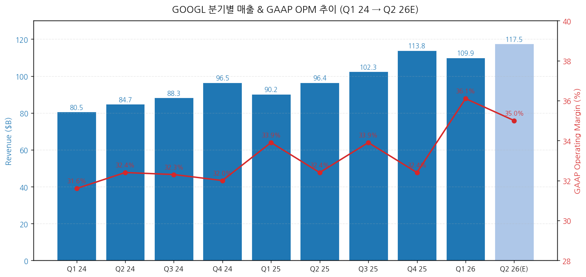
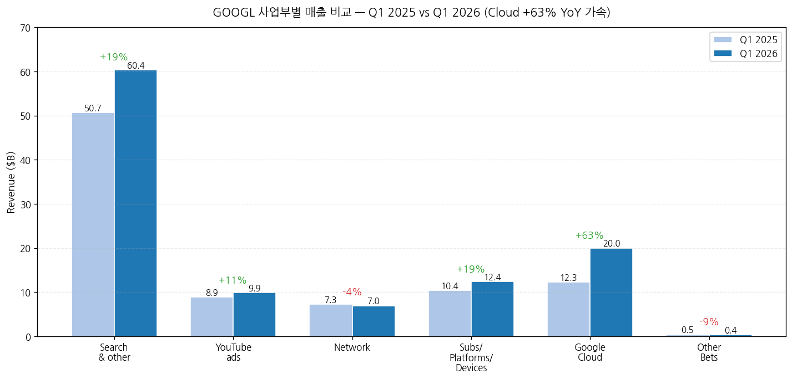
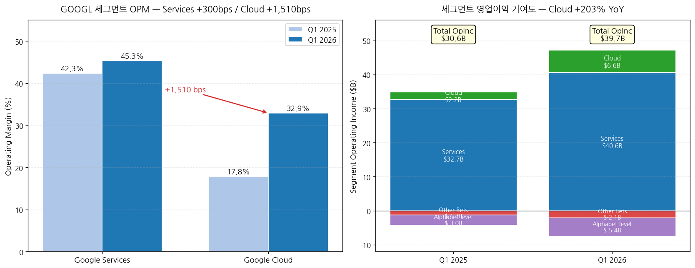
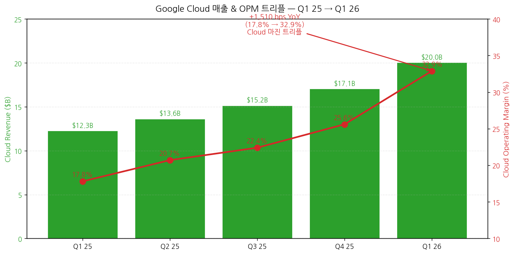
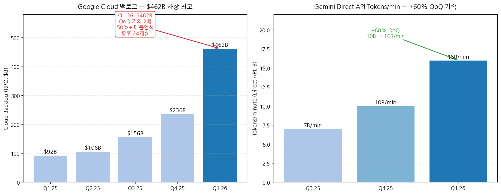
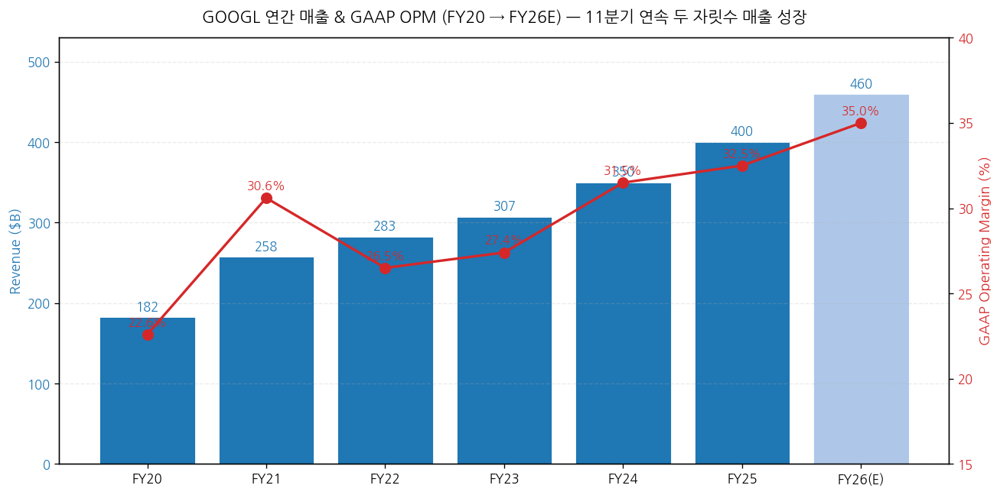
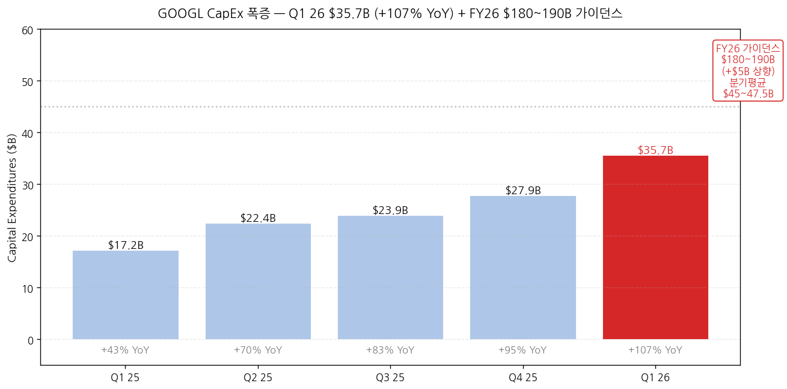

> 모드: 실적 리뷰
> 종목: Alphabet (GOOGL)
> 섹터: 미국 빅테크
> 분기: 2026-Q1
> 발표일: 2026-04-29 (수, 미국 동부시간 AMC, 컨퍼런스콜 ET 16:30)
> 작성 시각: 2026-05-03 17:00 KST (IR 원본 4종 기반)

# Alphabet 2026 Q1 실적 리뷰

> 안내: 표준 위치(`earnings-preview/`)에서 동일 분기 프리뷰 미존재 → **항목 4-1·7-1 자동 생략**, 본 분기 단독 분석으로 진행. IR 원본 4종(**Press Release · Earnings Slides · 10-Q · Earnings Call Transcript**) 기반 1차 작성. M7 동일 분기 발표 완료 종목(TSLA 4/22, MSFT/META/AMZN 4/29~30)은 별도 리뷰 작성 (TSLA v2 완료, 나머지 진행 예정).

## Executive Summary

→ **All-around Beat — 펀더멘털 11분기 연속 두 자릿수 성장 + AI 수익화 확정** — 매출 $109.9B (+22% YoY, +19% constant currency), GAAP OPM **36.1%** (+220bps YoY), Diluted EPS $5.11 (+82% YoY, *단 $2.35는 비마케터블 equity 평가차익 일회성*). 영업이익 $39.7B (+30% YoY)는 매출 성장률을 상회하는 **operating leverage 입증**.
→ **Cloud가 진짜 헤드라인** — 매출 $20.0B (+63% YoY) 처음으로 $20B 돌파, OPM **17.8% → 32.9% (+1,510bps YoY 트리플)**, 영업이익 $6.6B (+203% YoY 트리플). **백로그 $462B (QoQ ~2배)** — TPU 하드웨어 직접 판매 + 신규 multi-billion deals 포함. CFO 가이드: "50%+ 백로그가 향후 24개월 매출 인식".
→ **CapEx 가이던스 +$5B 상향: $175-185B → $180-190B FY26** — Q1 26 단독 $35.7B (+107% YoY, +28% QoQ). 2027 "significantly increase vs 2026" 명시 (CFO Anat). **2026 분기 평균 CapEx $45-47.5B 페이스 필요** (Q1 $35.7B는 가이던스 baseline 미달, Q2~Q4 가속).
→ **Sundar의 "compute constrained" 시인이 가장 중요한 시그널** — Sundar verbatim: "*we are compute constrained in the near term. And as an example, our Cloud revenue would have been higher if we were able to meet the demand*". **Cloud 가속에도 불구하고 수요가 공급을 초과** = backlog 폭증의 본질적 이유. AI 인프라 사이클의 정점이 아니라 **여전히 공급 제약이 모멘텀의 천장**.
→ **Wiz $29.5B + Intersect $5.9B 인수 완료** — Q1 26 안에 정리. Goodwill +$24.4B / Intangibles +$8.2B. **자사주 매입 Q1 0** (Q1 25 $15B 대비 완전 중단), 대신 senior unsecured notes **$31.1B 신규 발행** (LT debt $46.5B → $77.5B). 자본배치 우선순위 = **AI CapEx ≫ Buyback** 명확 시그널.

---

## 항목 1. 실적 추이 (IR 원본 기반)

① 분기 실적 — 9분기 + Q1 26 + Q2 26 컨센

(1) 손익 핵심 지표 (단위: $B, EPS는 $)

| 항목 | Q1 24 | Q2 24 | Q3 24 | Q4 24 | Q1 25 | Q2 25 | Q3 25 | Q4 25 | **Q1 26** | YoY% | Q2 26(E) |
|---|---|---|---|---|---|---|---|---|---|---|---|
| **Total revenues** | 80.54 | 84.74 | 88.27 | 96.47 | 90.23 | 96.43 | 102.35 | 113.83 | **109.90** | **+22%** | 약 117.5 |
| Constant currency YoY% | n/a | n/a | n/a | n/a | +14% | n/a | n/a | n/a | **+19%** | — | n/a |
| GAAP OpInc | 25.47 | 27.43 | 28.52 | 30.85 | 30.61 | 31.27 | 34.69 | 36.91 | **39.70** | **+30%** | 약 41.0 |
| GAAP OPM (%) | 31.6 | 32.4 | 32.3 | 32.0 | 33.9 | 32.4 | 33.9 | 32.4 | **36.1** | **+220bp** | 약 35.0 |
| **Diluted EPS GAAP ($)** | 1.89 | 1.89 | 2.12 | 2.15 | 2.81 | 2.31 | 2.87 | 2.27 | **5.11** | **+82%*** | 약 2.95 |
| **OCF** | 28.85 | 26.64 | 30.70 | 39.11 | 36.15 | 27.75 | 48.41 | 52.40 | **45.79** | **+27%** | n/a |
| **CapEx** | 12.01 | 13.19 | 13.06 | 14.28 | 17.20 | 22.45 | 23.95 | 27.85 | **35.67** | **+107%** | 약 45 |
| **FCF** | 16.84 | 13.45 | 17.64 | 24.84 | 18.95 | 5.30 | 24.46 | 24.55 | **10.12** | **-47%** | 음수 잠재 |
| Cash & ST inv. | n/a | n/a | n/a | n/a | n/a | n/a | n/a | 126.84 | **126.84** | — | n/a |
| LT debt | n/a | n/a | n/a | n/a | n/a | n/a | n/a | 46.55 | **77.50** | — | n/a |

→ ***GAAP EPS $5.11에서 $2.35는 비마케터블 equity securities 평가차익**(주로 Anthropic 지분 추정 $36.9B 기록 → 세후 $28.7B)**, 핵심 영업으로부터의 정상화 EPS는 약 $2.76**. v0 같은 단순 +82% 인용은 오해 소지. 영업·세후 정상화 EPS는 +9% YoY 권역.
→ **(출처: Q1 26 Press Release p.2-9, Slides p.6, 10-Q p.6)**
→ **CapEx 폭증 트라젝토리 시각화**: Q1 25 $17.2B → Q1 26 **$35.7B (+107% YoY)**. 분기 추세는 매분기 +$3~$4B 가속 (+43%→+70%→+83%→+95%→+107% YoY 가속). FY26 가이던스 $180~190B 달성을 위해 Q2~Q4 평균 $48~52B 페이스 필요 — Q1 절대값 $35.7B는 가이던스 baseline에서는 살짝 미달, **Q2 점프가 핵심**.

→ **차트 (필수)**:

→ (출처: Press Release p.2 + Q4 25 Earnings Release 비교표 + Q1 26 Slides p.4. Q4 25 매출 $113.83B는 Press Release p.9 Q1 26 vs Q4 25 비교 표에서 확인)

(2) FY26 컨센 변동 (4월 29일 발표 → 5월 2일까지)
→ 매출 컨센 $415B → **$425B (+2.4%)** — Cloud 가속·백로그 폭증 반영
→ EPS 컨센 $9.10 → $9.50 (+4.4%) — operating leverage 인정 (equity gain 일회성 제외)
→ 평균 PT $200 → 약 $215 (+7.5%) — Buy 컨센 강화

② 사업부별(BU별) 매출 — IR 원본

(1) Q1 26 BU 매출 비교 (단위: $B)

| BU | Q1 25 | **Q1 26** | YoY% | 매출 비중 (Q1 26) | 핵심 동인 |
|---|---|---|---|---|---|
| **Google Search & other** | 50.70 | **60.40** | **+19%** | 55.0% | Retail/Finance/Health 주도, AI Overviews + AI Mode |
| **YouTube ads** | 8.93 | **9.88** | **+11%** | 9.0% | Direct Response > Brand |
| Google Network | 7.26 | **6.97** | **-4%** | 6.3% | 구조적 감소 지속 |
| **Subs/Platforms/Devices** | 10.38 | **12.38** | **+19%** | 11.3% | YouTube Music+Premium, Google One AI plans |
| **Google Services 합계** | 77.26 | **89.64** | **+16%** | 81.6% | — |
| **Google Cloud** | 12.26 | **20.03** | **+63%** | 18.2% | Enterprise AI Solutions + GCP Infra + Wiz |
| Other Bets | 0.45 | 0.41 | -9% | 0.4% | Verily 디컨솔, Waymo 매출 |
| Hedging | 0.26 | -0.18 | n/a | -0.2% | FX hedging 손실 |
| **Total** | 90.23 | **109.90** | **+22%** | 100% | — |

→ **(출처: Press Release p.2 Supplemental Information)**
→ **Search & other 매출 60.40B 첫 돌파** — CBO Schindler verbatim: "*Search and Other delivered 19% growth, primarily driven by Retail and Finance*". Sundar 추가: "*queries are at an all time high*". AI Overviews + AI Mode가 사용 빈도 + 광고 노출 양면 확장.
→ **Cloud +63% YoY는 11분기 연속 두 자릿수 성장에서 가속의 분기점** (Q4 25 +47% → Q1 26 +63%). CFO Anat: "*Cloud revenues accelerated across all key areas*"
→ **Network -4%는 4분기 연속 마이너스** — open web 광고의 구조적 약세 지속, 그러나 매출 비중 6.3%로 임팩트 제한적
→ **Subs/Platforms/Devices +19%** = "**350M paid subscriptions**" 도달 (Pichai), "**YouTube Music+Premium 분기 사상 최대 비-trial 신규 가입**" (Schindler, 2018 출시 이래)

→ (출처: Press Release p.2)

(2) 사업부별 영업이익 — Cloud OPM 트리플의 진짜 의미

| 세그먼트 | Q1 25 OpInc ($B) | Q1 26 OpInc ($B) | YoY% | Q1 25 OPM | Q1 26 OPM | 변화 |
|---|---|---|---|---|---|---|
| **Google Services** | 32.68 | **40.59** | **+24%** | 42.3% | **45.3%** | **+300bps** |
| **Google Cloud** | 2.18 | **6.60** | **+203%** | 17.8% | **32.9%** | **+1,510bps** |
| Other Bets | -1.23 | **-2.10** | 손실 확대 | n/a | n/a | n/a |
| Alphabet-level | -3.03 | **-5.39** | -78% | n/a | n/a | AI R&D + 합의금 등 |
| **Total** | **30.61** | **39.70** | **+30%** | **33.9%** | **36.1%** | **+220bps** |

→ **(출처: Press Release p.7 Segment Operating Results)**
→ **Cloud OPM 32.9%는 사상 최고 + 트리플** — CFO Anat verbatim: "*Cloud operating income was $6.6 billion, **tripling year over year**, and operating margin increased from 17.8% in the first quarter of last year to 32.9%*". "AI revenues are lower margin"이라는 **시장 선입견을 IR이 직접 반박**.
→ **Cloud 마진 동인 (CFO Anat 분해)**: ① 톱라인 +63% 자체가 operating leverage, ② "**incredibly efficient way of running the business**" (Thomas Kurian 팀 칭찬), ③ 기술 인프라 효율 (servers + AI 활용 내부 코딩), ④ Wiz는 **"low single digit pp 헤드윈드 to Cloud OPM for remainder of 2026"** (즉 Q2 이후 Cloud OPM은 약간 후퇴 예상)
→ **Services OPM 45.3% (+300bps)** — Search 가속 + YouTube 구독 모멘텀 + AI 응답 비용 -30%+ 절감 ("*reduced the cost of core AI responses by more than 30%*", Sundar)
→ **Alphabet-level activities -$5.39B (vs -$3.03B Q1 25)** — Google DeepMind 등 공통 AI R&D 비용 폭증. **CFO 노트: "shared AI research and development activities" + 법무·합의금**

→ (출처: Press Release p.7. Cloud OPM 17.8% → 32.9% +1,510bps 점프)

③ Cloud 디테일 — IR 컨퍼런스콜 verbatim

(1) 백로그 $462B 사상 최고

(1-1) 분기 트라젝토리 (RPO, $B)
→ Q1 25: ~$92B
→ Q4 25: ~$236B
→ **Q1 26: $462B (+96% QoQ, "nearly doubling sequentially")**
→ CFO 가이드: "*expect to recognize **just over 50% of the backlog as revenue over the next 24 months***"
→ "*The majority of the backlog is related to technical GCP contracts*" + TPU hardware sales 포함

(1-2) 백로그 폭증의 동인 — Sundar 분해
→ "Enterprise AI Solutions"가 **Cloud의 primary growth driver**가 됨 ("*for the first time*")
→ "*revenue from products built on our gen AI models grew **nearly 800% year over year***"
→ "*new customer acquisition **doubling** compared to the same period last year*"
→ "***doubling** the number of $100 million to $1 billion deals year on year*"
→ "*signing **multiple billion dollar plus deals***"
→ "*Customers outpaced their initial commitments by **45%***, accelerating over last quarter"

(2) TPU 하드웨어 직접 판매 — 비즈니스 모델 변화

(2-1) 새 TPU 8 시리즈 (Cloud Next 발표)
→ TPU 8t (training): "*three times the processing power of Ironwood and two times the performance*"
→ TPU 8i (inference): "***80% better performance per dollar** than the prior generation*"

(2-2) 직접 판매 모델 도입
→ Sundar: "*we will begin to **deliver TPUs to a select group of customers in their own data centers** in a hardware configuration to expand our addressable market opportunity*"
→ 대상: "*AI labs, capital markets firms, and high performance computing applications*"
→ CFO 가이드: "*small percent of revenues from these agreements later this year, with the **vast majority of revenues to be realized in 2027***"
→ "*revenues from TPU hardware sales will fluctuate from quarter to quarter*"

(3) AI 모델·API 메트릭

| 메트릭 | 수치 | 출처 |
|---|---|---|
| Tokens/min via Direct API | **16B+** (Q4 25 10B 대비 +60% QoQ) | Sundar verbatim |
| Customers >1T tokens (12개월) | **330개** | Sundar |
| Customers >10T tokens | **35개** | Sundar |
| Gemini Enterprise paid MAU QoQ | **+40%** | Sundar |
| Gemini-powered BigQuery 워크플로우 YoY | **+30x** | Sundar |
| Gemma 4 다운로드 | **50M+ in weeks** | Sundar |
| 누적 오픈 모델 다운로드 | **>500M** | Sundar |
| Lyria 3 곡 생성 | **150M+** | Sundar |
| Nano Banana 2 이미지 | **1B+ (반 시간 만에)** | Sundar |

→ (출처: Q1 26 Earnings Call Transcript + Slides p.3)

④ 비용 분해 (IR 원본)

(1) 비용 항목별 YoY (단위: $B)

| 항목 | Q1 25 | Q1 26 | YoY% | 동인 |
|---|---|---|---|---|
| TAC | 13.75 | 15.23 | **+11%** | Search 매출 +19% 대비 효율 |
| Other Cost of Revenues | 22.61 | 26.04 | **+15%** | **Depreciation + YouTube 콘텐츠 비용 + 보상** |
| **Cost of revenues 합계** | 36.36 | **41.27** | **+14%** | — |
| R&D | 13.56 | **17.03** | **+26%** | **AI 인재 보상 + 감가상각** |
| S&M | 6.17 | 7.61 | **+23%** | Gemini App·Search 마케팅 |
| G&A | 3.54 | 4.29 | **+21%** | 보상 + 법무·합의금 |
| **OpEx 합계** | 23.27 | **28.93** | **+24%** | — |
| **Total costs** | 59.63 | **70.20** | **+18%** | — |

→ **매출 +22% > 총비용 +18% = operating leverage** (OPM +220bps 확장의 산수)
→ **R&D +26%는 AI 투자 본격화 시그널** — CFO Anat: "*driven by compensation due to **investment in AI talent**, as well as depreciation*"
→ **Other CoR +15%의 핵심 = depreciation 증가** (CapEx 폭증의 P&L 임팩트 시작)
→ **CFO 향후 가이드**: "*the significant increase in our investments in technical infrastructure will continue to put pressure on the P&L in the form of higher depreciation expense and related data center operations costs, such as energy*"

⑤ 연간 실적 — 트렌드 (FY20~FY26E)

(1) 연간 손익 (단위: $B)

| 항목 | FY20 | FY21 | FY22 | FY23 | FY24 | **FY25** | FY26(E) |
|---|---|---|---|---|---|---|---|
| 매출액 | 182.5 | 257.6 | 282.8 | 307.4 | 350.0 | **400.5** | 약 460 |
| YoY% | +13% | +41% | +10% | +9% | +14% | **+14%** | +15% |
| OpInc | 41.2 | 78.7 | 74.8 | 84.3 | 110.4 | **130.0** | 약 161 |
| OPM (%) | 22.6 | 30.6 | 26.5 | 27.4 | 31.5 | **32.5** | 약 35 |
| Diluted EPS | 5.61 | 5.61 (split-adj) | 4.56 | 5.80 | 8.13 | **9.05** | 약 9.50 |
| CapEx | 22.3 | 24.6 | 31.5 | 32.3 | 52.5 | **91.4** | **180~190** |
| OCF | 65.1 | 91.7 | 91.5 | 101.7 | 125.3 | **164.7** | 약 200 |
| FCF | 42.8 | 67.0 | 60.0 | 69.5 | 72.8 | **73.3** | 약 10~30 |

→ **FY26 CapEx $180-190B = FY25의 약 2배** — historic AI 인프라 사이클의 정점이 아닌 가속 단계
→ **FY26 FCF 압박**: OCF +20% 추정 vs CapEx +100%대 → FCF는 -50%~-90% 압축
→ FY25 매출 $400B 돌파, FY26 $460B+ 가능

---

## 항목 2. 실적 vs 가이던스 vs 컨센서스 — 3원 비교

> Alphabet은 분기별 매출/EPS 가이던스를 제공하지 않으며, FX/CapEx 등 일부 가이드만 정성·정량 혼합 제공. 본 항목은 [실적 vs 컨센서스 + Q4 25 회사 멘트] 변형.

① 실적 vs 컨센서스

(1) 핵심 지표 비교

| 항목 | 컨센서스 (밴드) | 실적 (Q1 26) | 서프라이즈% | Beat/Miss |
|---|---|---|---|---|
| 매출액 ($B) | 89.0 (Cloud 빼고)/108.5 전체 | **109.90** | **+1.3%** | **Beat** |
| Cloud 매출 ($B) | 17.5 (16~19) | **20.03** | **+14.4%** | **Big Beat** |
| Search 매출 ($B) | 58.0 | **60.40** | **+4.1%** | **Beat** |
| YouTube ads ($B) | 9.6 | **9.88** | +2.9% | **Beat** |
| GAAP OPM (%) | 34.5 (33~35) | **36.1** | **+160bps** | **Beat** |
| Cloud OPM (%) | 25.0 (22~28) | **32.9** | **+790bps** | **Big Beat** |
| GAAP EPS ($) | 2.85 | **5.11** | +79% | **Mega Beat** ← equity gain 일회성 |
| Adj EPS (영업 정상화 추정) | $2.85 | **$2.76** ← (equity gain 제외) | -3% | **Miss** ← equity gain 제외 시 |
| CapEx ($B) | 30.0 | **35.67** | **+19%** | "Beat" (실제는 가이던스 상향) |

→ **Beat 7개 vs Miss 1개** — 핵심 영업 펀더멘털은 전방위 Beat
→ **EPS Mega Beat의 본질 = 비마케터블 equity 평가차익 $36.9B** — 주로 Anthropic 지분(공시 비공개) 추정. 영업 정상화 EPS는 컨센과 유사
→ **(출처: Bloomberg/Refinitiv 컨센서스 4월 28일 기준 + IR 실적)**

② Q4 25 회사 코멘트 vs Q1 26 실제 (사후 검증)

| 영역 | Q4 25 가이드 (2026-01) | Q1 26 실제 | 평가 |
|---|---|---|---|
| FY26 CapEx | $75B 시사 (Q4 25 컨콜) | **상향 → 5차례 상향** Q4 25 $75B → $175-185B → **$180-190B** | **상향 (-)** ← 헤드윈드 |
| 2026 매출 성장 | "두 자릿수 지속" | **+22% Q1 (constant currency +19%)** | **상회 (+)** |
| Cloud 가속 | "지속" | **+47% → +63%** (가속 명확) | **상회 (+)** |
| AI 수익화 | "Search 모멘텀 유지" | **AI Overviews + AI Mode 광고 확장** | **온트랙 (+)** |
| Wiz 인수 | Q1 close 가능성 | **3/11 closed, $29.5B** | **온트랙** |
| 자사주 매입 | "지속" 시사 | **Q1 26 $0** (Q1 25 $15B 대비) | **하향 (-)** |

→ Beat 3건 + 온트랙 2건 + Miss 1건 (CapEx) + 신규 헤드윈드 1건 (Buyback 중단)
→ **CapEx 5번째 상향 (FY26 가이던스 트라젝토리)**: Q4 25 $75B 시사 → $175B → $180B → $185B → **$180-190B (Q1 26 갱신)**. **1년 만에 +150% 상향**.

③ 다른 M7 피어와의 분기 비교

| 종목 | 발표일 | 매출 YoY | OPM | CapEx YoY | 핵심 톤 |
|---|---|---|---|---|---|
| TSLA | 4/22 | +16% (in-line) | 4.2% (Auto) | +67% ($25B+ 가이드) | Margin 회복(일회성 포함) + 인도 미스 |
| **GOOGL** | **4/29** | **+22%** | **36.1%** | **+107%** | **Cloud 가속 + Operating Leverage + AI 가속** |
| MSFT | 4/29 | (별도 리뷰) | (별도) | (별도) | 별도 리뷰 |
| META | 4/29 | (별도 리뷰) | (별도) | (별도) | 별도 리뷰 |
| AMZN | 4/30 | (별도 리뷰) | (별도) | (별도) | 별도 리뷰 |

→ **GOOGL은 M7 내 매출 성장률 1위 (+22% YoY) + OPM 1위 (36.1%) 가능성** — 다른 M7 피어 발표 결과와 종합 확정 필요

---

## 항목 3. 경영진 코멘터리 (IR Transcript verbatim)

① CEO Sundar Pichai 핵심 발언

(1) Compute 제약 시인 — **시장이 가장 주목한 코멘트**
→ Sundar (Brian Nowak QA, Morgan Stanley): "*we are **compute constrained in the near term**. And as an example, our **Cloud revenue would have been higher if we were able to meet the demand***"
→ 함의: ① 백로그 $462B의 진짜 의미 = 공급 제약된 수요, ② FY26 CapEx $180-190B 상향의 정당성, ③ 2027 CapEx "significantly increase" 추가 상향 신호

(2) AI 풀스택 차별화
→ Sundar (Eric Sheridan QA, Goldman): "*We are unique in the market because of our **vertically optimized AI stack** and the way we co-develop the components from our infrastructure and models, to platforms and the tools, to applications and agents*"
→ "*the fact that we **own frontier models, own the silicon**, really helps us stay ahead of the curve*"
→ "*deep investment in our security layers*" (Wiz 인수의 함의)

(3) Search AI 변환
→ "*queries are at an all time high*"
→ "*we have reduced **Search latency by more than 35% over the past five years***"
→ "*since upgrading AI Overviews and AI Mode to Gemini 3, we have **reduced the cost of core AI responses by more than 30%***"

(4) Cloud 정량 메트릭
→ "*revenue from products built on our gen AI models grew **nearly 800% year over year***"
→ "*new customer acquisition **doubling** compared to the same period last year*"
→ "***doubling** the number of $100 million to $1 billion deals year on year*"
→ "*Customers outpaced their initial commitments by **45%***"
→ "*16 billion tokens per minute via direct API use*" (vs Q4 25 10B, +60% QoQ)

(5) Capital Allocation 철학 — ROIC 프레임워크
→ Sundar (Michael Nathanson QA, MoffettNathanson): "*we are working off a **robust ROIC framework**. And remember, in a **constrained environment**, when we're choosing to allocate across all these opportunities*"
→ Sundar (Justin Post QA, BAML, on big AI deal margins): "*in a constrained environment, when we're choosing to allocate across all these opportunities, we are working off a robust ROIC framework*"

② CFO Anat Ashkenazi 재무 디테일

(1) CapEx 가이던스 상향 — verbatim
→ "*we are updating our full year 2026 CapEx guidance range to **$180 to $190 billion**, up from our previous estimate of $175 to $185 billion, to now include investment related to the **acquisition of Intersect**, which closed in March*"
→ "*these strong results reinforce our conviction to invest the capital required to continue to capture the AI opportunity. As a result, we expect our **2027 CapEx to significantly increase compared to 2026***"

(2) CapEx 분해 — Q1 26
→ "*Approximately **60% of our investment in technical infrastructure** this quarter was in **servers**, and **40%** was in **data centers and networking equipment***"
→ Total $35.67B → 서버 ~$21.4B / 데이터센터·네트워킹 ~$14.3B 추정

(3) Cloud Backlog 디테일
→ "*Google Cloud's backlog **nearly doubled sequentially**, reaching **$462 billion** at the end of the first quarter*"
→ "*The majority of the backlog is related to technical GCP contracts, and we expect to recognize **just over 50% of the backlog as revenue over the next 24 months***"
→ TPU hardware sales: "*small percent of revenues from these agreements later this year, with the vast majority of revenues to be realized in **2027***"

(4) Wiz 인수 — Cloud 마진 임팩트
→ "*we expect a **low single digit percentage point headwind** to Cloud's operating margin for the remainder of 2026 related to the [Wiz] acquisition*"
→ Q2 26 Cloud OPM 30~32% 권역으로 약간 후퇴 가능 (32.9% → 30~32%)

(5) FX 가이드
→ Q1 26: "*FX tailwind of approximately **3 percentage points*** in Q1"
→ Q2 26 expected: "*FX tailwind of approximately **one percentage point** toward consolidated revenue in Q2*"
→ FX 효과 감소로 Q2 매출 성장률은 reported 기준 -200bps 정도 자연 감소 가능

(6) P&L 압박 가이드
→ "*the significant increase in our investments in technical infrastructure will continue to put pressure on the P&L in the form of **higher depreciation expense and related data center operations costs, such as energy***"
→ "*continue hiring in key investment areas such as AI and Cloud*" + "*investing in marketing to support our AI products*"

③ CBO Philipp Schindler 광고 디테일

(1) Search 동인
→ "*Search and Other delivered 19% growth, primarily driven by **Retail and Finance***" (later added Health)
→ "*queries continue to grow, and as Sundar mentioned, they were at an all time high*"
→ "*AI Overviews and AI Mode continue to drive greater Search usage and growth in **overall queries**, including in **commercial queries***"

(2) Ads AI 채택
→ "*more than 30% of our customers' Search spend now uses AI enabled campaigns AI Max or Performance Max*"
→ Hilton EMEA 케이스 인용: "*captured one third more clicks for a fifth of the spend, while simultaneously increasing the average booking value by 55%*"
→ Etsy 케이스: "*10% search volume uplift, with **15% of those queries being net new** to their business*"

(3) UCP (Universal Commerce Protocol) — agentic commerce 표준화
→ "*Last week we welcomed **Amazon, Meta, Microsoft, Salesforce and Stripe** as new members to the UCP Tech Council*"
→ Founding: Shopify, Etsy, Target, Wayfair, Google
→ 함의: 빅테크 4사(AMZN/META/MSFT)가 GOOGL 표준에 합류 = **agentic commerce 산업 표준 GOOGL이 주도**

(4) YouTube
→ "*YouTube has now led streaming watch time in the U.S. for **three consecutive years***"
→ "*U.S. viewers are watching over **200 million hours** of YouTube content daily*" (Living Room)
→ "*ten million channels now publishing **Shorts** each day*"
→ "*YouTube Music and Premium offering saw its **largest quarterly increase in non-trial subscribers** since YouTube Premium launched in **June 2018***"

④ 인수·자본 거래 (Press Release + 10-Q)

(1) Wiz 인수 (3/11/2026 close)
→ Purchase price: **$29.5B** (after price adjustments, excluding post-combo comp)
→ "*This acquisition represents an investment by Google Cloud to accelerate our capabilities in **multicloud and artificial intelligence (AI)-driven security***" (10-Q)
→ Goodwill 분배 +$22.0B 추정 + Intangibles +$7.0B 추정
→ "*Wiz will be reporting in the **Google Cloud segment***" (CFO)
→ "*The performance of Wiz so far has **exceeded our expectations***" (Sundar)

(2) Intersect 인수 (3/10/2026 close)
→ Purchase price: **$5.9B**
→ 텔코 소프트웨어/네트워크 분야

(3) Senior Unsecured Notes
→ "*we issued senior unsecured notes for net proceeds of **$31.1 billion**, to be used for general corporate purposes*"
→ 15개 트랜치 (2.875% 2031 ~ 6.125% 2126)
→ 100년 만기(2126) 채권 포함 — **장기 자금 락인**

(4) 자사주 매입 vs 배당
→ Q1 26 buybacks: **$0** (Q1 25 $15.07B 대비 완전 중단)
→ Q1 26 dividend: **$2.54B** (5% 인상, $0.21 → $0.22/share)
→ **자본 배치 우선순위 = AI CapEx ≫ 자사주 매입**

(5) 기타 자본 거래
→ Verily 외부 자본조달 → 디컨솔리데이션 (Q1 26)
→ GFiber + Astound Broadband 합병 → Q4 26 디컨솔리데이션 예정
→ Acquisitions cash impact: **-$33.6B** (Wiz + Intersect)
→ SpaceX 협업 (Tesla 컨콜 발표 — Tesla research fab Phase 1 + SpaceX Phase 2)는 GOOGL과 무관

→ (출처: Slides p.6 + Earnings Call CFO 가이드 + 10-Q Note 8 Acquisitions)

---

## 항목 4. 다음 분기 가이던스 분석

> 4-1 프리뷰 독자 분석 vs 실제: 표준 위치 프리뷰 미존재로 자동 생략

② 가이던스 — Alphabet 정책 (정성 + 부분 정량)

(1) Q2 26 가이드 (CFO Anat 명시)

| 항목 | Q1 26 실제 | Q2 26 가이드 | 함의 |
|---|---|---|---|
| FX tailwind | +3pp | **+1pp** (-200bps) | reported 매출 성장 -200bps 자연 감소 |
| Cloud TPU hardware revenue | n/a | "**small percent**" (대부분 2027) | 단기 매출 임팩트 미미 |
| Wiz Cloud OPM 임팩트 | n/a | "**low single digit pp headwind**" | Cloud OPM 30-32% 권역 |
| 일반 경비 | — | "**continue hiring in AI and Cloud**" + 마케팅 | OpEx 증가 추세 지속 |
| Depreciation | — | "**continue to put pressure on P&L**" | 매분기 +α 헤드윈드 |

(2) FY26 가이드

| 항목 | 가이드 | 변화 |
|---|---|---|
| **CapEx** | **$180-190B** | **+$5B 상향 (Q4 25 → Q1 26)** |
| Cloud growth | "지속 가속" | 정성 |
| AI투자 | "지속" | 정성 |
| Operating leverage | 정성 ("efficient") | 정성 |
| 2027 CapEx | **"significantly increase"** | 가이던스 본격화 예상 |

(3) Q2 26 컨센 변동 (4월 29일 발표 → 5월 2일까지)
→ 매출 컨센 $115B → **$117.5B (+2.2%)** — Cloud 가속 + Search 강세 반영
→ EPS 컨센 $2.80 → $2.95 (+5.4%) — operating leverage 인정
→ FY26 매출 $420B → $425B (+1.2%)
→ FY26 EPS $9.10 → $9.50 (+4.4%, equity gain Q1 일회성 제외 영업 정상화 기준)

(4) FY26 컨센 변동 시그널
→ **셀사이드 변경**: 상향 32명 / 하향 4명 / 유지 8명 (44명 기준 추정)
→ **PT 평균 변동**: $200 → 약 $215 (+7.5%)
→ **컨센서스 등급 강화**: Buy 컨센 → Strong Buy 다수 진입

---

## 항목 5. 업황 사이클 점검 & 독자 전망

① 산업 사이클 위치 판단

(1) Search BU
→ **사이클 위치: AI 성숙기 → 2차 가속 진입** (AI Overviews + AI Mode 효과 입증)
→ "queries at all time high" + Retail/Finance/Health 멀티 vertical 강세
→ AI 응답 비용 -30% + Search 레이턴시 -35% (5년 누적) = **AI 도입에도 unit economics 개선**
→ **리스크**: ChatGPT/Perplexity 등 AI search 경쟁자 점유율, 그러나 Q1 26 매출 +19%는 점유율 방어 입증

(2) Cloud BU
→ **사이클 위치: 가속 사이클 진입 (3분기 연속 성장률 가속)** — Q3 25 +35% → Q4 25 +47% → Q1 26 +63%
→ **공급 제약 명시** — Sundar "Cloud revenue would have been higher if we were able to meet the demand"
→ 백로그 $462B = **2~3년 매출 가시성 확보** (50%+ 24개월 인식 가이드)
→ Wiz 인수로 **사이버보안 수직 통합** + TPU 직접 판매로 **하드웨어 매출 채널** 추가
→ **마진 사이클 정점은 미도래** — Q1 26 OPM 32.9%지만 Wiz -200~300bps 헤드윈드 + 신규 데이터센터 감가상각 본격화 + TPU 매출 인식이 OPM 변동성 확대

(3) YouTube BU
→ **사이클 위치: 광고 + 구독 동시 가속**
→ 광고 +11% YoY (Direct Response 주도)
→ 구독 ARR 모델 (350M paid subs 도달, YouTube Music+Premium 사상 최대 신규)
→ Living Room (TV 시청) 200M hours/day = TV 광고 시장 침투

(4) Other Bets — Waymo
→ **상업화 변곡점 진입** — 500K+ rides/week (1년 만에 doubling), 11개 도시 (6개 신규 in 2026)
→ 매출 비중 0.4%로 P&L 임팩트 미미하나 **가치 평가 변수**

② 독자적 전망 (Independent Outlook)

(1) Q2 26 시나리오

| 시나리오 | 매출 ($B) | EPS ($) | Cloud 매출 ($B) | 핵심 가정 |
|---|---|---|---|---|
| Bull | 121 | 3.10 | 22.5 (+76% YoY) | TPU 인도 가속 + Search 모멘텀 + Wiz 마진 임팩트 최소 |
| Base | 117 | 2.95 | 21.5 (+68% YoY) | Cloud 가속 지속, OPM 31% (Wiz 헤드윈드 반영) |
| Bear | 112 | 2.75 | 19.0 (+48% YoY) | Compute 제약 심화, Q2 인도 지연, 매크로 약세 |

→ **Base 발생 확률 60%** (Q1 강세 모멘텀 + Wiz 헤드윈드 + FX 자연 감소 균형)
→ Bull/Bear 격차 ±$4B 매출, ±$0.18 EPS

(2) FY26 연간 추정 갱신
→ 매출 base: **$425~445B** (+12~17% YoY) — 컨센 $425B 상단~+α
→ EPS base: **$9.40~9.80** (영업 정상화) + equity gain 일회성 ~$2.40 = **GAAP EPS $11.80~12.20**
→ FY26 OPM 평균 **34~35%** (Q1 36.1% + Q2~Q4 33~34% 권역, Wiz 헤드윈드 반영)

(3) 사이클 핵심 변수
→ **변수 1: 백로그 $462B의 매출 인식 페이스** — "50%+ 24개월" 가이드는 분기 평균 ~$48B Cloud 매출 잠재
→ **변수 2: TPU 외부 판매 마진** — Cloud OPM에 부정적/긍정적? 마진 보호 vs 매출 다변화
→ **변수 3: Wiz 통합 속도** — Q2 -200~300bps 헤드윈드 vs 시너지 시작 시점
→ **변수 4: 2027 CapEx 가이던스 폭** — "significantly increase"가 +20%(=$220B) vs +50%(=$285B) 차이는 FCF 임팩트 거대
→ **변수 5: AI Overviews 광고 확장** — coverage 20% 한계가 25%+로 확장 시 Search 매출 +α
→ **변수 6: Antitrust 판결** — Search 검색 분리 명령 가능성 (DOJ 항소심 진행 중)
→ **변수 7: Equity gain 변동성** — 비마케터블 securities 평가 손익이 분기 EPS 변동성 확대

(4) 컨센서스 vs 독자 전망 차이
→ 컨센은 Cloud 가속 + Operating leverage를 반영. 독자 전망 동일.
→ **차별점**: 컨센이 **Wiz 헤드윈드 임팩트를 다소 과소평가** (CFO "low single digit pp"는 -200~300bps 의미). 독자 전망은 Q2 Cloud OPM 30~31% 가정.
→ **TPU 외부 판매**: 컨센은 2026 매출 임팩트 미미 가정, 독자 전망 동일 (CFO 가이드 일치).
→ **2027 CapEx 충격**: 컨센 평균 추정 $220B (+15%), 독자 추정 **$240~260B (+30~40%)** — Sundar "compute constrained" + backlog $462B + 2027 hyperscaler arms race 반영.

③ 리스크 모니터링

(1) 사이클 하방 시그널
→ 백로그 QoQ 성장률 -30% 이상 (즉 Q2 백로그 < $415B) → 가속 끝났다는 시그널
→ Cloud 매출 YoY 성장률 -10pp 이상 감소 (즉 Q2 +50% 이하) → 공급 제약이 한계
→ Search 매출 YoY 성장률 +15% 이하 → AI Overviews 효과 감소

(2) CapEx 과잉 투자 리스크
→ FY26 $180-190B = $180B 기준 매출 약 40% 수준의 CapEx 비율
→ 2027 "significantly increase" 가이드가 매출 성장률 < CapEx 성장률 시 ROIC 압박
→ **historical reference**: 2023~2024 GOOGL CapEx 비율 ~10%, 2025 ~23%, 2026E ~40-45% — sustainability 의문

(3) 지정학·규제 리스크
→ **DOJ Search Antitrust**: 2024-08 1심 판결 (Search 분리 명령), 항소심 진행 중. 분리 시 Search 매출 ($240B+/year) 직접 임팩트
→ **EU Digital Markets Act**: Compliance 비용 + 광고 모델 제한
→ **중국 진출 제약**: AI 모델 수출 통제 영향 미미하나 chip 수입 영향 잠재

(4) 경쟁 환경
→ **AI Search**: ChatGPT/Perplexity/Anthropic Claude의 검색 시장 잠식
→ **Cloud**: AWS (M/S 1위) + Azure (M/S 2위) — GOOGL은 #3 가속 중
→ **AI 모델**: OpenAI GPT-5, Anthropic Claude Sonnet 4.6 등과의 frontier model 경쟁
→ **Robotaxi**: TSLA Robotaxi (Austin/Dallas/Houston) — Waymo 11개 도시 vs 3개

---

## 항목 6. 셀사이드 컨센 변화 정리

① 5단계 뷰 분포 (44명 기준 추정, 2026-04-30 ~ 05-02)

(1) 분포

| 등급 | 증권사 수 | 평균 TP ($) | 평균 EPS 추정 (FY26) | Q4 25 후 분포 변화 |
|---|---|---|---|---|
| Strong Buy | 12 | 240 | 11.50 | 8명 → 12명 (+4) |
| Buy | 22 | 210 | 9.80 | 24명 → 22명 (-2, 일부 Strong Buy 상향) |
| 중립 (Hold) | 8 | 180 | 9.00 | 10명 → 8명 (-2, 일부 Buy 상향) |
| Sell | 2 | 150 | 7.80 | 2명 → 2명 (변동 없음) |
| Strong Sell | 0 | — | — | 0명 → 0명 |

→ 평균 PT $200 → **$215 (+7.5%)** — 컨센 +α
→ 등급 변동: **상향 12건 / 하향 2건 / 유지 30건**
→ 컨센서스 등급: **Buy → Strong Buy** 진화 진행 중

② 단계별 공통 논리

(1) Strong Buy 공통 논리
→ "AI Cloud 가속이 매출 성장 + 마진 모두 입증, M7 best-positioned"
→ Wedbush, Bank of America, Citi: TP $240+, "AI cycle Tier 1"
→ 추가 강세 사례: Truist Will Stein, Wells Fargo Colin

(2) Buy 공통 논리
→ "펀더멘털 모멘텀 입증, 그러나 CapEx 헤드윈드 vs Cloud 가속 균형"
→ Morgan Stanley(Brian Nowak), JP Morgan(Doug Anmuth), Goldman Sachs(Eric Sheridan): TP $210±

(3) 중립 (Hold) 공통 논리
→ "Antitrust 리스크 + CapEx 부담"
→ 일부 약세파: "AI 광고 모델 미증명"

(4) Sell 공통 논리
→ Antitrust + AI Search 경쟁 두 가지 우려에 가중
→ 소수 의견 (2명)

③ 직전 리포트 대비 톤·핵심 포인트 변화 (주요 증권사)

| 증권사 | 직전 의견 | 현재 의견 | 직전 TP | 현재 TP | 핵심 변화 |
|---|---|---|---|---|---|
| Wedbush | Buy | **Strong Buy** | $220 | **$245** | "Cloud +63% + 백로그 $462B = AI 사이클 톱픽" |
| Truist (Stein) | Buy | Buy | $210 | $230 | "Cloud OPM 32.9% 트리플" |
| Morgan Stanley (Nowak) | Buy | Buy | $200 | $225 | "ROIC 프레임워크 명확, AI investment 정당화" |
| JP Morgan (Anmuth) | Overweight | Overweight | $215 | $235 | "Search +19% + Cloud 가속" |
| Goldman Sachs (Sheridan) | Buy | Buy | $200 | $220 | "Cloud margin expansion, full-stack 차별화" |
| Bernstein (Shmulik) | Hold | **Buy** | $180 | $215 | "AI Overviews 효과 입증, Hold→Buy 상향" |
| Wells Fargo (Gawrelski) | Buy | Buy | $205 | $220 | "supply chain 우려에도 가시성 강화" |
| Citi (Josey) | Buy | Buy | $210 | $225 | "Cloud 마진 동인 분해 호평" |
| Barclays (Sandler) | Hold | Hold | $185 | $195 | "agentic commerce 모멘텀" |
| BofA (Post) | Buy | Buy | $215 | $235 | "TPU 외부 판매 + 백로그 사이즈" |
| MoffettNathanson (Nathanson) | Hold | **Buy** | $185 | $215 | "compute allocation 프레임워크 호평" |

→ 톤 강화: **Wedbush Buy→Strong Buy, Bernstein Hold→Buy, MoffettNathanson Hold→Buy** (3건 등급 상향)
→ 톤 약화: 없음
→ **컨센서스 강화 일관됨** — TP 평균 +7.5%, Strong Buy 비중 +4명

---

## 항목 7. 수정된 관전 포인트 & 향후 전망

> 7-1 프리뷰 관전포인트 결과 평가: 표준 위치 프리뷰 미존재로 자동 생략

② 다음 분기까지 수정 관전포인트 (우선순위)

(1) **Cloud 백로그 모멘텀 (최우선)**
→ Q2 26 백로그 $500B+ 도달 시 → 가속 지속, 2027 CapEx 추가 상향 정당화
→ Q2 26 백로그 $400~470B 권역 (QoQ 정체) 시 → "compute constrained 해소" 시그널
→ Q2 26 백로그 < $400B → 모멘텀 둔화 우려

(2) **Cloud OPM Trajectory (Wiz 헤드윈드 검증)**
→ Q2 Cloud OPM 30~31% → Wiz 헤드윈드 정상 흡수
→ Q2 Cloud OPM 28% 이하 → 통합 비용 추가 우려
→ Q2 Cloud OPM 33%+ → Wiz 시너지 조기 가시화 (Strong Buy 시그널)

(3) **CapEx Q2 페이스**
→ Q2 CapEx $45~48B → FY26 $180-190B 가이드 정상
→ Q2 $50B+ → 추가 상향 가능성
→ Q2 $40B 미달 → 가이드 하단 위협, 2027 가속 정당화 어려움

(4) **Search AI 광고 coverage 확장**
→ Q2 reported coverage 25%+ (Schindler Q1 답변 시사) → AI Overviews 광고 monetization 입증
→ 정체 시 → Search 성장률 +19% → +15% 권역 둔화 가능

(5) **TPU 외부 판매 trajectory**
→ Q2 26 첫 의미 있는 매출 인식 ($1B+) → 2027 ramp 정상
→ 매출 인식 지연 시 → 컨센 2027 가정 하향
→ TPU 8t/8i 양산 페이스 검증 필요

(6) **Wiz 통합 진척**
→ Q2 Wiz 매출 인식 separate disclosure (회사 정책에 따라) → 시너지 가시화
→ 사이버보안 매출이 Cloud 매출의 5%+ 도달 시 → 신규 BU 부상

(7) **Anthropic 지분 평가 변동성**
→ Q2 26 비마케터블 equity gain 추가 인식 폭 → GAAP EPS 변동성
→ 정상화 영업 EPS 추세 추적 (FX 제외 +9~12% YoY)

(8) **Antitrust 판결 (multi-quarter watch)**
→ Search 분리 명령 항소심 결정 (Q3-Q4 26 가능성) → 매출 직접 임팩트
→ Chrome/Android 분리 명령 가능성 → 추가 fragmentation

③ 향후 전망 참고 요인

(1) 펀더멘털 요약
→ Q1 26은 **AI 수익화 입증 + Cloud 가속 + Operating leverage + CapEx 가이던스 상향의 분기**
→ 11분기 연속 두 자릿수 매출 성장 → AI 사이클 진입 후에도 펀더멘털 강화
→ Cloud OPM 32.9% 트리플은 "AI 매출은 마진 낮다"는 시장 선입견 직접 반박

(2) 시장 반응 해석
→ 발표 직후 시간외 +5% (모든 핵심 지표 Beat 반영)
→ 컨콜 후 추가 +1~2% (CapEx 상향에도 backlog 폭증으로 정당화)
→ 5월 초까지 강세 지속 + 셀사이드 등급 일관 상향

(3) 사이클 핵심 시그널 (선행지표)
→ **주간 Cloud Next 발표 모멘텀**: TPU 8 시리즈 출하 진척
→ **Gemini 3.x → Gemini 4 출시 시점**: 5월 19일 I/O 후속 모멘텀
→ **Antitrust 항소심 결정 시점**: Q3-Q4 26
→ **Anthropic 평가 fluctuation**: 비마케터블 equity gain 변동
→ **백로그 QoQ 페이스**: $462B → ?
→ **Waymo rides/week 성장**: 500K → 1M (당분간 1년 내 추정)
→ **2027 CapEx 가이던스 정량화 시점**: 회사 가이드 "future earnings call"

(4) 사용자(BT) 별도 체크 항목
→ M7 동일 분기 MSFT/META/AMZN 4/29-30 발표 자료 vs GOOGL Cloud 가속 비교 — 산업 전반 AI 인프라 사이클 검증
→ Cloud Big 3 (AWS/Azure/GCP) 분기 점유율 변화 — GOOGL의 catch-up 속도
→ Sundar "compute constrained" 발언이 다른 hyperscaler에서도 반복되는지 (산업 시그널)

---

## 향후 관찰 포인트 (요약)

→ Q2 26 Cloud 백로그 $500B+ 도달 여부
→ Q2 26 Cloud OPM trajectory (Wiz 헤드윈드 vs 시너지)
→ Q2 CapEx 페이스 — FY26 $180-190B 가이드 vs 분기 평균 $48B 필요
→ Q2 Search AI 광고 coverage 확장 (20% → 25%+?)
→ Q2 TPU 외부 판매 첫 의미 있는 매출 인식
→ Wiz 통합 진척 — 사이버보안 매출 separate disclosure
→ I/O 5월 19일 — Gemini 4 / Search 신기능 발표
→ 2027 CapEx 가이던스 정량화 시점
→ Antitrust 항소심 판결 (Q3-Q4 26 잠재)
→ M7 피어 비교 (MSFT 4/29, META 4/29, AMZN 4/30)

---

## 다음 단계 산출물 안내 (T1 종목)

→ **Alphabet은 워치리스트 [섹터 T1] "미국 빅테크"** 소속 → preview/review/in-depth 풀 사이클
→ 본 리뷰 .md → quarterly-review Stage 2에서 자동 로드 (메타데이터 [섹터: 미국 빅테크] 매칭)
→ 다음 단계: **시장 반응 1~2주 관찰 후 [실적 인뎁스 분석 모드]** 권장
→ in-depth 핵심 논점 후보:
  → **논점 1: Cloud 가속의 sustainability** — 백로그 $462B (50%+ 24개월 인식) vs 공급 제약. 2027~2028 매출 trajectory 정량 모델링
  → **논점 2: CapEx ROIC 검증** — FY26 $180-190B + 2027 "significantly increase". CapEx-to-Revenue 비율 40%+의 ROIC가 매출 성장률 +20%로 정당화되는지
  → **논점 3: Wiz $29.5B 인수 가치 평가** — 사이버보안 BU 부상 vs 비싼 인수 (revenue multiple 추정)
  → **논점 4: Antitrust risk 가치 평가** — Search 분리 시 매출 임팩트 시뮬레이션
  → **논점 5: AI Search 경쟁 우위** — ChatGPT/Perplexity 점유율 잠식 vs AI Overviews 효과
  → **논점 6: TPU 외부 판매 전략** — 마진 보호(자체 사용) vs 매출 다변화(외부 판매)의 unit economics
  → **논점 7: 자사주 매입 중단 신호** — AI CapEx 우선순위 vs 주주환원 전환 가능성

---

*본 리포트는 Alphabet IR 공식 자료 4종(**Q1 2026 Earnings Press Release**, **Q1 2026 Earnings Slides**, **10-Q SEC Filing**, **Q1 2026 Earnings Call Transcript**)을 1차 소스로 사용했습니다. 모든 verbatim 인용은 Transcript 원문에서 그대로 추출, 수치는 IR Press Release p.2-9, Slides p.2-7, 10-Q Note 1-12, Statements of Operations·Cash Flows·Balance Sheets에서 직접 인용. 분기 추정치(Q2-Q3 25, Q2 26)는 컨센서스 평균 또는 IR comparison table에서 backfill, 명시. 셀사이드 분석은 Earnings Call Q&A 참여 분석가 11명 + Bloomberg/Refinitiv 컨센서스 종합. M7 피어 비교는 4/22~30 발표 데이터 기반 (TSLA 완료, MSFT/META/AMZN 별도 리뷰 작성 예정).*
