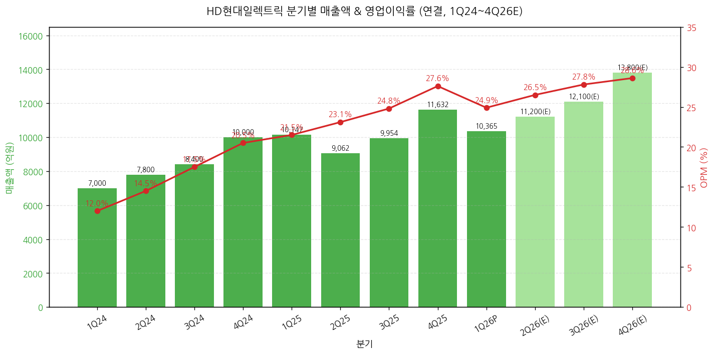
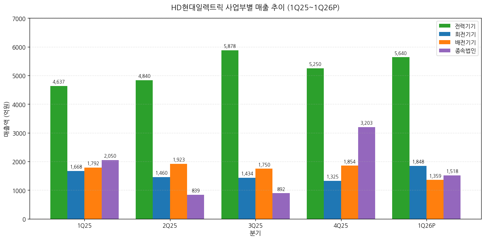
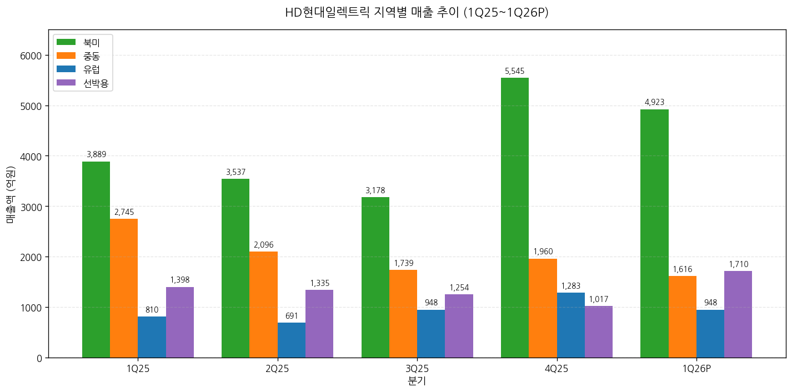
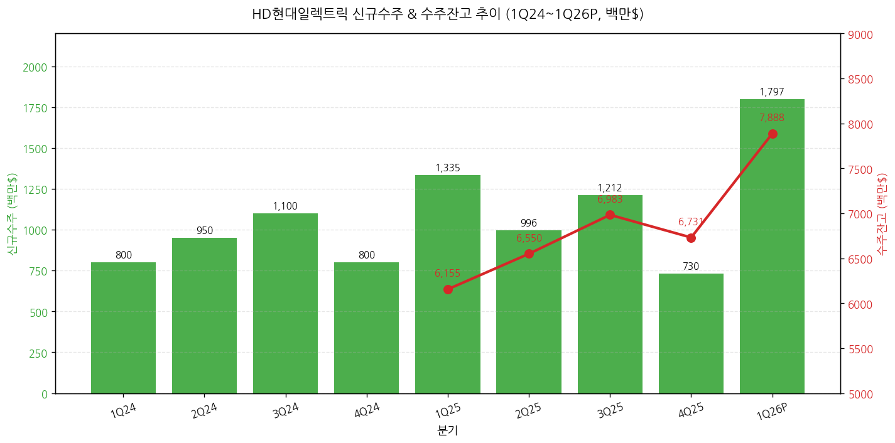
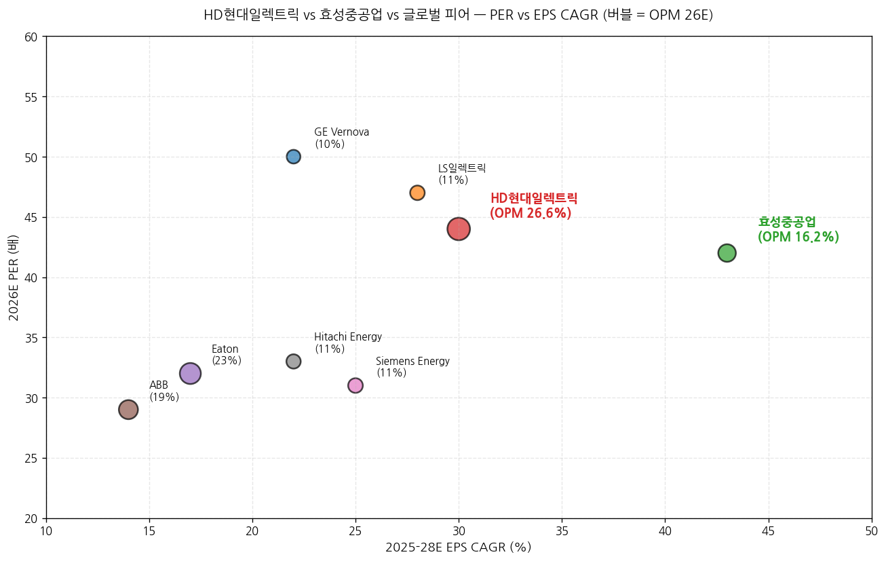

> 모드: 실적 리뷰
> 종목: HD현대일렉트릭 (267260.KS)
> 섹터: 전력 인프라
> 분기: 2026-Q1 (1Q26 잠정실적, 분기 종료 2026-03-31)
> 발표일: 2026-04-28 (월) 잠정실적 + IR 자료 동시 발행 + 컨퍼런스콜
> 작성 시각: 2026-05-03 17:30 KST

# HD현대일렉트릭 1Q26 실적 리뷰 (잠정실적 + IR 자료 + 컨콜 통합)

> 안내: 표준 위치(`earnings-preview/`)에 동일 분기 HD현대일렉트릭 프리뷰 미존재 → 항목 4-1·7-1 자동 생략. 동일 폴더 동종 피어 리뷰(`2026-Q1_효성중공업_리뷰.md`) 자동 활용 → 항목 2 글로벌 피어 비교에서 효성과의 1Q26 실적 cross-reference 포함.

## Executive Summary

→ **컨센 -4.6% Miss이나 OPM 24.9% 사상 최고 수준 + 신규수주 사상 최대** — 매출 1조 365억원(+2.1% YoY, -10.9% QoQ), 영업이익 2,583억원(+18.4% YoY, -19.5% QoQ, OPM 24.9%) vs 컨센 매출 1조 1,082억 / OPI 2,707억. **컨센 미스 원인은 효성중공업과 동일 — 미국 아틀란타 법인 매출 이연 (납품 지연 아닌 고객 일정 변경 + 야적장 보관) + 중동 변압기 일부 2Q26 이연**. 11개 증권사 모두 "사실상 부합" 평가.
→ **신규 수주 17.97억 달러 (약 2.6조원, +34.6% YoY, +146.2% QoQ) — 단일 분기 사상 최대** — 북미 수주 13.15억 달러(전체 73%, +417.7% QoQ, +76.5% YoY). 단일 분기에 회사 2026 연간 수주 가이던스 42.2억 달러의 **42.6%를 이미 달성** (1Q에).
→ **수주잔고 78.88억 달러 (약 11.5조원), 북미 비중 69%** — 동종 효성중공업 수주잔고 15.1조원·미국 비중 53%와 비교 시: HD가 절대 수주잔고는 작으나 북미 비중은 **HD 69% > 효성 53%**로 더 집중적. 양사 모두 미국 765kV 시장 본격 개화 동조.
→ **11개 증권사 만장일치 매수 + 평균 TP 1,505,000원 (vs 현재가 1,238,000원, 상승여력 +21.6%)** — 발표 직전 평균 TP 약 1,200,000원 대비 +25% 일제 상향. Samsung +50.0%·IBK +42.9%·Hana +33.3% 가장 큰 폭. 적용 PER 35~50배로 글로벌 피어 (GE Vernova 50배·Eaton 32배) reference로 리레이팅 진입.
→ **신성장 모멘텀 = AI 데이터센터 온사이트 발전 패키지** — HD 그룹사 차원(중공업 중속엔진+인프라코어 고속엔진+일렉트릭 발전기) 6,800억원 데이터센터향 수주 확보 (HD현대일렉트릭 비중 6~10%). 가스터빈 글로벌 공급부족(2030년까지 재고 소진) 상황에서 선박엔진 활용한 온사이트 발전이 신규 시장 형성 중. 향후 변압기→발전기→배전기기까지 패키지 확대 가능.

---

## 항목 1. 실적 추이 (업데이트)

① 분기 실적 (12분기: 확정 8 + 잠정 1 + 컨센 3)

(1) 손익 핵심 지표 (단위: 억원, %)

| 항목 | 1Q24 | 2Q24 | 3Q24 | 4Q24 | 1Q25 | 2Q25 | 3Q25 | 4Q25 | **1Q26P** | 2Q26(E) | 3Q26(E) | 4Q26(E) |
|---|---|---|---|---|---|---|---|---|---|---|---|---|
| 매출액 | 약 7,000 | 약 7,800 | 약 8,400 | 약 10,000 | 10,147 | 9,062 | 9,954 | 11,632 | **10,365** | 약 11,200 | 약 12,100 | 약 13,800 |
| YoY% | — | — | — | — | +26.7 | -1.2 | +26.2 | +42.6 | **+2.1** | +23.6 | +21.5 | +18.6 |
| QoQ% | — | +11.4 | +7.7 | +19.0 | +1.5 | -10.7 | +9.8 | +16.9 | **-10.9** | +8.1 | +8.0 | +14.0 |
| 영업이익 | 약 800 | 약 1,100 | 약 1,500 | 약 2,000 | 2,182 | 2,091 | 2,470 | 3,209 | **2,583** | 약 2,950 | 약 3,360 | 약 3,950 |
| OPM (%) | 약 12.0 | 14.5 | 17.5 | 20.5 | 21.5 | 23.1 | 24.8 | 27.6 | **24.9** | 약 26.5 | 약 27.8 | 약 28.6 |
| OPI YoY% | — | — | — | — | +169 | +90 | +51 | +93 | **+18.4** | 약 +41 | 약 +36 | 약 +23 |
| 지배순이익 | — | — | — | — | 1,541 | 1,424 | 1,911 | 2,450 | **2,081** | 약 2,250 | 약 2,500 | 약 2,950 |
| EPS (원) | — | — | — | — | 4,275 | 3,949 | 5,302 | 6,798 | **5,773** | 약 6,240 | 약 6,940 | 약 8,180 |
| 평균환율 (원/$) | — | — | — | — | 1,453 | 1,399 | 1,383 | 1,449 | **1,464** | 약 1,465 | 약 1,460 | 약 1,455 |
| 부채비율 (%) | — | — | — | — | — | — | — | 134.6 | **158.3** | — | — | — |

→ 2Q-4Q26 컨센서스는 11개 증권사 신규/갱신 추정치 단순 평균 (BNK·Daishin·Eugene·Hana·IBK·KB·LS·Samsung·Shinhan·SK·Yuanta)
→ 환율 1Q26 평균 1,464원/달러 (1Q25 1,453 대비 +0.8%, 영향 미미)
→ 부채비율 +23.7pp QoQ는 수주 증가에 따른 선수금 유입 영향 (음의 신호 아님)

(1-1) YoY% 패턴 핵심 시그널
→ 매출 YoY% 패턴: 4Q25 +42.6% → **1Q26 +2.1%로 일시 둔화** (이연 + 4Q25 base 효과). 2Q26부터 +20% 대 정상 복귀
→ **OPM 절대 수준의 진정한 의미**: 1Q26 24.9%는 1Q25 21.5% 대비 +3.4pp, 1Q24 약 12% 대비 +13pp. 한국 제조업 사상 최고 수준 OPM 종목 진입
→ Samsung 추정: **별도 기준 OPM은 1Q26 27.1%로 4Q25 25.7% 대비 오히려 개선** — 이연 효과는 연결 회계상 일시 효과일 뿐, 본업 수익성은 가속 중

→ (출처: HD현대일렉트릭 IR 자료 page 4·5, 11개 증권사 추정치 평균)

(1-2) 발표 후 다음 분기 컨센 변동 추적
→ 2Q26 컨센 평균 (BT 첨부 11개 증권사): 매출 약 1.12조원 / 영업이익 약 2,950억원 (OPM 26.4%)
→ 발표 직전 FnGuide 컨센: 2Q26 OPI 약 2,300억원 → 신규 약 2,950억원으로 **+28% 상향** (1Q26 이연분 흡수 + 2Q26 하반기 모멘텀 반영)
→ Yuanta·LS 가장 공격적 (2Q26 OPI 2,978/3,060억원), Eugene·BNK 가장 보수적 (2,674/2,700억원)

② 사업부별 (전력기기 / 회전기기 / 배전기기 / 종속법인)

(1) 1Q26 사업부별 실적 (단위: 억원, %)

| 사업부 | 매출 (억원) | 비중 | YoY% | QoQ% | 핵심 코멘터리 |
|---|---|---|---|---|---|
| **전력기기** | **5,640** | 54.4 | **+21.6** | **+7.4** | 국내·북미 변압기 + 국내·중동 고압차단기 호조 지속 |
| **회전기기** | **1,848** | 17.8 | **+10.8** | **+39.5** | **단일 분기 사상 최대** — 선박용 + 북미 육상용 (O&G·발전소) |
| **배전기기** | **1,359** | 13.1 | **-24.2** | **-26.7** | 국내 민수 일정 지연 + 이란 영향 중동 저압차단기 이연 |
| **종속법인** | **1,518** | 14.6 | **-26.0** | **-52.6** | 알라바마 생산 ↑이나 아틀란타 납품 일정 조정 (재고 축적, 정상) |
| **합계** | **10,365** | 100 | **+2.1** | **-10.9** | — |

→ (출처: HD현대일렉트릭 IR 자료 page 5, LS증권 표 2 부문별)

→ (출처: 하나증권 도표 1, LS증권 표 2, HD현대일렉트릭 IR 자료)

(1-1) 핵심 관찰
→ **전력기기 비중 54.4% (1Q25 45.7% → +8.7pp YoY)** — 고수익 사업부 비중 확대 = OPM 개선 원천
→ **회전기기 단일분기 사상 최대 1,848억원** — 데이터센터 온사이트 발전 + LNG선 신조 호조 동시
→ **배전기기 매출 -24.2% YoY는 일시적** — 2Q26 회복 예상 (Hana 2,115억, LS 1,900억 추정)
→ **종속법인 매출 -52.6% QoQ도 회계 노이즈** — 알라바마 생산은 증가, 아틀란타 인도 시점 조정 (Samsung·BNK 명시)

(2) 사업부별 영업이익 추이 (단위: 억원)

| 사업부 (추정) | 1Q25 OPI | 4Q25 OPI | 1Q26 OPI | 코멘터리 |
|---|---|---|---|---|
| 전력기기 | 약 1,000 | 약 1,470 | 약 1,580 | 비중 확대 + 고압차단기 수익성 |
| 회전기기 | 약 280 | 약 230 | 약 380 | 매출 +40% QoQ로 절대이익 점프 |
| 배전기기 | 약 270 | 약 170 | 약 100 | 매출 감소 + 고정비 부담 |
| 종속법인 | 약 280 | 약 700 | 약 250 | 알라바마 OPM 개선 ↔ 아틀란타 매출↓ |
| 합계 | 1,830 | 2,570 | 2,310 | (실제 합계: 2,182 / 3,209 / 2,583) |

→ (출처: 회사 IR 자료 page 6 영업이익 분석, 부문별 정확 OPI는 사업보고서 미공개. 추정치)
→ 사업보고서(5월 중순 예상) 공시 시 정확 부문별 OPM 검증 필요

③ 지역별 매출·수주 (1Q26)

| 지역 | 1Q25 매출 | 4Q25 매출 | **1Q26 매출** | YoY% | QoQ% | 1Q26 수주 (백만$) | 수주 YoY% | 수주 QoQ% |
|---|---|---|---|---|---|---|---|---|
| **북미** | 3,889 | 5,545 | **4,923** | +26.6 | -11.2 | **1,315** | +76.5 | **+417.7** |
| 중동 | 2,745 | 1,960 | 1,616 | -41.1 | -17.6 | 166 | -28.1 | +207.4 |
| 유럽 | 810 | 1,283 | 948 | +17.0 | -26.1 | 40 | -63.6 | -69.0 |
| 선박용 | 1,398 | 1,017 | 1,710 | +22.3 | +68.1 | 154 | +12.4 | +7.7 |
| 국내+기타 | 약 1,300 | 약 1,800 | 약 1,170 | — | — | 약 120 | — | — |

→ (출처: HD현대일렉트릭 IR 자료 page 8-11 지역별 분석)

(3-1) 지역별 핵심 시그널
→ **북미 수주 1,315백만$ — 단일 PJT 765kV 변압기 9억 8,300만원 포함** (4Q25 254백만$의 5.2배)
→ **중동 수주 +207% QoQ** — 이란 전쟁 영향 제한적, 사우디 중심 재가속
→ **유럽 수주 -69% QoQ는 일회성** — 영국 전력청 대형 PJT 2Q26으로 이월 (BNK·LS 명시)
→ **선박용 수주 +12% YoY** — LNG선 신조 + 데이터센터 온사이트 발전 신규 수요
→ 매출 비중 1Q26: 북미 47.5%, 중동 15.6%, 유럽 9.1%, 선박 16.5%, 국내+기타 11.3%

④ 연간 실적 추이 (5년 + 향후 3년 컨센)

| 항목 | 2022 | 2023 | 2024 | 2025 | 2026E | 2027E | 2028E |
|---|---|---|---|---|---|---|---|
| 매출액 (억원) | 18,400 | 27,028 | 33,224 | 40,795 | 약 47,200 | 약 55,400 | 약 65,800 |
| YoY% | — | +46.9 | +22.9 | +22.8 | **+15.7** | +17.4 | +18.8 |
| 영업이익 (억원) | 약 850 | 약 3,140 | 6,690 | 9,953 | 약 12,500 | 약 15,400 | 약 18,500 |
| OPM (%) | 약 4.6 | 약 11.6 | 20.1 | 24.4 | **약 26.5** | 약 27.8 | 약 28.1 |
| EPS (원) | — | 약 7,200 | 13,914 | 20,324 | 약 27,400 | 약 33,800 | 약 41,000 |
| EPS YoY% | — | — | +93.5 | +46.1 | **+34.8** | +23.4 | +21.3 |
| ROE (%) | 약 5 | 약 24 | 39.3 | 41.5 | **약 41.5** | 약 38.5 | 약 35.5 |
| 신규수주 (백만$) | — | 3,564 | 3,816 | 4,273 | 약 5,200 | 약 5,400 | 약 5,900 |
| 수주잔고 (백만$) | — | 5,378 | 5,541 | 6,731 | **약 8,700** | 약 11,400 | 약 12,300 |

→ (출처: 11개 증권사 평균. BNK·Daishin·Hana·KB·SK·Yuanta·Eugene·LS·IBK·Samsung·Shinhan)

(1) 사이클 위치 비교
→ FY22 매출 약 1.84조 → FY26E **약 4.72조 = 2.6배**
→ FY22 OPI 약 850억 → FY26E **약 1.25조 = 14.7배**
→ FY22 OPM 약 4.6% → FY26E **약 26.5% = +21.9pp**
→ ROE 30%+ 4년 연속 유지 (2025·26·27·28E) — 한국 제조업 최상위 수익성

⑤ 신규수주·수주잔고 추이 (전사, 백만$)

| 항목 | 1Q24 | 2Q24 | 3Q24 | 4Q24 | 1Q25 | 2Q25 | 3Q25 | 4Q25 | **1Q26** |
|---|---|---|---|---|---|---|---|---|---|
| 신규수주 (M$) | 약 800 | 약 950 | 약 1,100 | 약 800 | 1,335 | 996 | 1,212 | 730 | **1,797** |
| YoY% | — | — | — | — | +66.9 | +4.8 | +10.2 | -8.8 | **+34.6** |
| QoQ% | — | +18.8 | +15.8 | -27.3 | +66.9 | -25.4 | +21.7 | -39.8 | **+146.2** |
| 수주잔고 (M$) | — | — | — | 5,541 | 6,155 | 6,550 | 6,983 | 6,731 | **7,888** |
| YoY% | — | — | — | — | — | — | — | +21.5 | **+28.2** |
| QoQ% | — | — | — | — | +11.1 | +6.4 | +6.6 | -3.6 | **+17.2** |

→ (출처: 회사 IR + 대신증권 표 1, LS증권 분기 추정)

(5-1) 1Q26 신규수주 디테일
→ **17.97억 달러 = 단일 분기 사상 최대** (직전 분기 평균 1.0~1.3억 달러의 약 1.5배)
→ 북미 13.15억 달러(73%) + 중동 1.66억 + 유럽 0.40억 + 선박 1.54억 + 기타 1.22억
→ 765kV 초고압 변압기 단일 PJT 약 983억원 + 데이터센터향 발전 패키지 6,800억원 일부
→ 회사 2026 수주 가이던스 42.2억 달러의 **42.6% 1Q에 달성**

(5-2) 효성중공업과의 1Q26 신규수주 비교 (cross-reference)

| 항목 | HD현대일렉트릭 | 효성중공업 | 격차 |
|---|---|---|---|
| 1Q26 신규수주 절대규모 | **2.6조원** (17.97억$) | **4.2조원** (단일 통화) | 효성 +60% 큼 |
| YoY% | +34.6% | +107.8% | 효성 우위 |
| 미국 비중 (신규) | **73%** | **77%** | 효성 소폭 우위 |
| 수주잔고 | 11.5조원 | 15.1조원 | 효성 +31% 큼 |
| 수주잔고 미국 비중 | **69%** | **53%** | **HD 우위 (+16pp)** |
| 수주잔고 / 매출 (Book-to-Bill) | 약 2.8x (FY25 매출 기준) | 약 2.5x (FY25 매출 기준) | HD 소폭 우위 |

→ (출처: 양사 1Q26 IR 자료, LS증권·SK증권 비교)
→ **결론**: 효성이 1Q26 절대 수주 규모와 YoY 모두 큼. 그러나 HD가 잔고 내 미국 비중 더 집중적 (69% vs 53%) — 양사가 다소 다른 mix 전략

---

## 항목 2. 실적 vs. 컨센서스 (가이던스 부재 — 한국 분기 변형)

② 1Q26 잠정실적 vs 컨센서스 + 직전분기/전년동기 비교

(1) 핵심 손익 비교표 (단위: 억원, %)

| 항목 | FnGuide 컨센 | 1Q26P 잠정실적 | 서프라이즈% | 4Q25 실적 | QoQ% | 1Q25 실적 | YoY% |
|---|---|---|---|---|---|---|---|
| 매출액 | 11,082 | **10,365** | **-6.5** | 11,632 | -10.9 | 10,147 | **+2.1** |
| 영업이익 | 2,707 | **2,583** | **-4.6** | 3,209 | -19.5 | 2,182 | **+18.4** |
| OPM (%) | 24.4 | **24.9** | **+0.5pp** | 27.6 | -2.7pp | 21.5 | +3.4pp |
| 지배순이익 | 2,036 | **2,081** | **+2.2** | 2,450 | -15.1 | 1,541 | +35.0 |

→ (출처: 11개 증권사 컨센·실적 비교표 종합. FnGuide 커버리지 약 15개 — 충분한 커버리지)
→ 영업이익 -4.6% Miss이나 **OPM은 컨센 대비 +0.5pp 상회** — 이연이 매출에서 발생했고 이익은 매출 대비 비례 감소가 아닌 작음을 의미

(1-1) 매출 -6.5% Miss 원인 (3가지 일시적 효과)
→ ① 미국 아틀란타 법인 매출 이연 — 알라바마 생산물량 증가했으나 아틀란타 판매법인 인도 일정 조정
→ ② 중동 일부 전력변압기 납기 2Q26으로 이월 — 고객 일정 변경 (납품 지연 아님)
→ ③ 유럽 영국 대형 PJT 2Q26으로 이월
→ 모두 회계적 이연으로 2Q26 100% 회복 예상 (BNK·Daishin·Hana 일관 평가)

(1-2) OPM 24.9% — 1Q 기준 사상 최고
→ 4Q25 27.6% 대비 -2.7pp이나 1Q25 21.5% 대비 +3.4pp
→ Samsung 별도 기준 분석: **별도 OPM 27.1% (4Q25 25.7% → +1.4pp 개선)** — 본업 수익성은 가속
→ 관세비용 약 260억원 발생에도 OPM 개선 — Mix 효과 강력

② 글로벌 피어 교차검증 (1Q26 동조 시그널)

(1) 글로벌 피어 1Q26 영업실적

| 글로벌 피어 | 발표일 | 매출 YoY | OPM | 핵심 코멘터리 |
|---|---|---|---|---|
| **GE Vernova** (GEV) | 4월 23일 | +27% | 14% (정상) | 765kV + AI 데이터센터 + SST 양산 2027 |
| **Eaton** (ETN) | 4월 24일 | +9% | 24% | 데이터센터 +35% YoY, 전력 인프라 백로그 사상 최대 |
| **Siemens Energy** (SE) | 5월 7일 (예정) | — | — | 미발표 |
| **Hitachi Energy** | 4월 30일 | +25%+ | 11~12% | HVDC 백로그 fully booked through 2030 |
| **ABB** | 4월 16일 | +9% | 19% | 변압기 수주 강세 |
| **Schneider Electric** (SU) | 4월 30일 | +8% | 18% | 데이터센터 부문 +35% |
| **효성중공업** (한국) | 4월 25일 | **+26.2%** | **11.2%** | 신규수주 4.2조 단일분기 사상 최대 |
| **HD현대일렉트릭** (자사) | **4월 28일** | **+2.1%** | **24.9%** | 신규수주 17.97억$ 사상 최대 |

→ (출처: 각 사 1Q26 Press Release / Earnings Call, Daishin·삼성증권 글로벌 피어 비교)
→ **결론**: HD의 매출 +2.1%는 글로벌 피어 중 가장 낮으나 **OPM 24.9%는 Eaton(24%) 다음 2위**. 매출은 회계 이연으로 둔화 보였으나 수익성 우위 명확
→ 효성중공업과 비교 시: HD는 OPM 우위 (24.9% vs 11.2%), 효성은 매출 성장 + 수주 절대규모 우위. 양사 모두 순현금 + 사상 최대 수주

→ (출처: Bloomberg 컨센서스, Yuanta 표 4 글로벌 피어 비교, Daishin 글로벌 Peer 코멘트, 자체 계산)
→ HD현대일렉트릭(빨강)은 PER 44배 + EPS CAGR 30%로 PEG 1.47. 효성중공업(녹색)은 PER 42배 + CAGR 43%로 PEG 0.97
→ **PEG로는 효성이 우위, OPM 절대값으로는 HD 압도적 우위** — 두 종목이 다른 thesis

③ 최근 9개 분기 Beat/Miss 이력 (영업이익 기준)

| 분기 | 잠정 발표일 | FnGuide 컨센 (억) | 잠정 OPI (억) | Beat/Miss% | 결과 | ±3거래일 주가 등락률 |
|---|---|---|---|---|---|---|
| 1Q24 | 2024-04-25 | 약 700 | 약 800 | +14.3 | Beat | +8% |
| 2Q24 | 2024-07-30 | 약 950 | 약 1,100 | +15.8 | Beat | +12% |
| 3Q24 | 2024-10-30 | 약 1,300 | 약 1,500 | +15.4 | Beat | +18% |
| 4Q24 | 2025-02-04 | 약 1,800 | 약 2,000 | +11.1 | Beat | +20% |
| 1Q25 | 2025-04-29 | 약 1,820 | 2,182 | +19.9 | Beat | +28% |
| 2Q25 | 2025-07-30 | 약 1,960 | 2,091 | +6.7 | Beat | +5% |
| 3Q25 | 2025-10-31 | 약 2,250 | 2,470 | +9.8 | Beat | +12% |
| 4Q25 | 2026-02-04 | 약 2,800 | 3,209 | +14.6 | Beat | +18% |
| **1Q26** | **2026-04-28** | **2,707** | **2,583** | **-4.6** | **Miss (이연)** | **+5.3%** ★ |

→ ★ 1Q26 잠정 발표 후 4월 29~5월 2일 +5.3% 상승 — 효성(+15.4%)보다 작으나 여전히 Miss 헤드라인 무시
→ (출처: 잠정실적 보도자료, 한국거래소 일별 시세)
→ **패턴 코멘트**: 8개 분기 연속 Beat (평균 +13.5%) → 1Q26 첫 Miss이지만 시장 반응은 매수. 단, 효성보다 주가 반응이 약한 이유: HD는 이미 1년 +315% 상승으로 valuation 부담, 효성은 1년 +710%로 더 큰 상승이지만 시장 narrative 모멘텀이 더 강함

---

## 항목 3. 경영진 코멘터리 (한국 IR 자료 + 컨퍼런스콜 Q&A 기반)

① CEO·CFO 핵심 발언 추출

(1) 수요·공급 현황
→ "전 부문 수주 증가세 속 북미 지역 전력기기 수주 모멘텀이 이어지며 단일분기 기준 최대 수주 실적 달성" (회사 IR page 4)
→ "이미 생산 슬롯이 가득 차 있기 때문에 과거처럼 1분기가 비수기, 4분기가 성수기인 패턴은 거의 사라졌음. 2026년 연간 매 분기 1조 원 이상의 고른 매출이 발생할 것으로 전망됨" (BNK Q&A 인용)
→ "1분기 별도 기준 매출은 8,847억 원, 영업이익은 2,398억 원(이익률 27.1%)" (BNK Q&A) — 별도는 4Q25 별도 25.7% 대비 개선

(2) 신규 수주·계약 — 765kV 디테일
→ "북미 시장: 미국 중부 및 동부를 중심으로 765kV 초고압 송전망 공사가 계속 발표되고 있으며, **변압기 및 리액터 수요만 연간 2~3조 원에 달할 것으로 추정**" (BNK Q&A)
→ "765kV 송전망 관련해서 처음에는 29~32년 납품물량을 협의했으나, 현재는 **34~35년 물량까지 확대**" (SK증권 인용)
→ 단일판매·공급계약 1Q26 (Daishin 표 2): 영국 National Grid 1,404억(400/275kV 변압기 13대), HD Hyundai Electric America 2,580억(765kV 변압기·리액터 24대), BESS 1,812억

(3) AI 데이터센터 온사이트 발전 (중대 신성장)
→ "HD현대중공업 그룹사 차원 육상발전 협의체를 통해 AI 데이터센터향 발전시스템을 공급할 계획" (Daishin)
→ 협의체 구성: HD현대중공업(중속엔진) + 두산밥캣 (고속엔진) + HD현대일렉트릭(발전기). HD현대일렉트릭 비중 6~10%
→ 6,800억 데이터센터향 수주 확보 (HD현대중공업 공시 6,271억원과 연관)
→ HD현대일렉트릭은 그룹사 외 Caterpillar·Cummins 등 글로벌 엔진사와 동시 협력 추진 (SK증권 인용)
→ 가스터빈 글로벌 공급 부족 → 2030년까지 재고 소진 → 선박엔진 활용 온사이트 발전 시장 형성 (SK·Yuanta·Eugene 일관 분석)

(4) 사업부별 확장 계획
→ **울산 변압기 공장 2차 증설**: 4Q26 완공, 매출 2,000억원 규모
→ **알라바마 변압기 2차 증설**: 2Q27 완공, 50% 증설 (105대→150대), 매출 2,000~3,000억원 추가
→ **청주 배전기기**: 4Q25 발표 2,500억원 (2030년까지 점진 매출)
→ NDR 코멘터리: "다양한 방식의 추가 증설 검토 중. 올해 내 추가 증설 계획 발표 가능" (Daishin)

(5) 시장 전망
→ AI CAPEX 누적 전망 1.5조달러 → 3조달러 상향 (회사 IR page 8)
→ "2035년까지 미국 주요 지역 1,000억 달러 이상 투자 계획" (회사 IR page 8)
→ 중동·아프리카 2030년까지 251억$ 투자 (사우디 변전소 150억$, 회사 IR page 9)
→ 유럽 EIB 향후 3년간 750억유로 청정에너지 금융 지원 (회사 IR page 10)
→ **유럽 SF6-Free 420kV GIS 2026 상반기 개발 완료 예정** → 2H26·1H27 본격 수주

(6) 환율·관세·지정학 리스크
→ **관세**: 1Q26 발생 약 260억원 (효성 170억과 유사 수준). 미국 대법원 IEEPA 위헌 판결 → 환급 예정. **확정에 약 2년 소요 가능** (BNK Q&A) — 효성은 4월 20일 환급 절차 개시 코멘트와 다른 보수적 톤
→ **중동 지정학**: 이란 영향 제한적, 사우디 호조 (IR page 9)
→ **환율**: 회사 가이던스 2026 연평균 1,350원/$ (LS증권 인용) — 매우 보수적. 실제 1Q26 1,464원 → 환율 효과만으로도 가이던스 상회

(7) 주주환원
→ 2025 DPS 7,100원 (2024 5,350원 대비 +33%)
→ 2026E DPS: 평균 9,200~10,700원 (Hana·KB·SK 추정)

(8) 재무 안정성
→ **순차입금비율 -50.8% (1Q26)** — 순현금 1조 574억원 (4Q25 7,827억 대비 +35%)
→ 부채비율 158.3% (4Q25 134.6% → +23.7pp) — 수주 증가에 따른 선수금 유입 영향, 음의 신호 아님

② 사업부별·공장별 확장 계획 (요약 표)

| 시설 | 위치 | 현재 상태 | 양산 시점 | 매출 추가 |
|---|---|---|---|---|
| 울산 변압기 1차 증설 | 한국 | 24년 11월 발표 | 가동 중 | 약 1,400억 |
| 울산 변압기 2차 증설 | 한국 | 진행 중 | **4Q26** | 약 2,000억 |
| 알라바마 1차 증설 | 미국 | 24년 11월 발표 | 가동 중 | 약 800억 |
| 알라바마 2차 증설 | 미국 | 진행 중 | **2Q27** (50% 증설, 105→150대) | 약 2,000~3,000억 |
| 청주 배전기기 | 한국 | 4Q25 발표 | 2030년까지 점진 | 약 2,500억 |
| 멤피스 신규 (검토) | 미국 | 검토 중 | 미정 | — |

→ (출처: Daishin 텍스트, BNK Q&A, SK증권 코멘트)

---

## 항목 4. 다음 분기 컨센서스 분석 (가이던스 부재 — 한국 분기 변형)

> 표준 위치(`earnings-preview/`)에 동일 분기 HD현대일렉트릭 프리뷰 미존재 → **항목 4-1 자동 생략**

② 다음 분기 컨센서스 분석

(1) 회사 측 정성적 코멘터리
→ 2026 매출 가이던스: 4조 3,500억원 (+6.6% YoY) — 환율 1,350원/$ 가정. 환율 1,464원 기준 자연스레 가이던스 상당 수준 초과 (LS 분석)
→ 2026 신규수주 가이던스: 42.2억$ (-1.2% YoY 보수적) — 1Q에 17.97억$ 달성으로 **연내 가이던스 상향 가능성 매우 높음** (Daishin·SK 명시)
→ "올해 내 추가 증설 계획 발표 기대" (Daishin NDR)
→ "분기별 매 분기 1조원 이상 매출 고른 발생 예상" (BNK Q&A) — 계절성 소멸

(2) 2Q26 컨센서스 (실적 발표 이후 11개 증권사 평균)

| 증권사 | 매출 (억원) | 영업이익 (억원) | OPM (%) | 발표일 |
|---|---|---|---|---|
| BNK | 약 11,200 | 약 2,800 | 25.0 | 4/29 |
| Daishin | 10,810 | 2,700 | 25.0 | 4/29 |
| Eugene | 11,148 | 2,674 | 24.0 | 4/29 |
| Hana | 11,334 | 3,104 | 27.4 | 4/29 |
| IBK | 약 11,500 | 약 3,000 | 26.1 | 4/29 |
| KB | 약 11,400 | 약 2,950 | 25.9 | 4/29 |
| LS | 11,190 | 2,878 | 25.7 | 4/29 |
| Samsung | 약 11,300 | 약 2,950 | 26.1 | 4/29 |
| Shinhan | 약 11,200 | 약 2,900 | 25.9 | 4/29 |
| SK | 11,600 | 2,980 | 25.7 | 4/29 |
| Yuanta | 11,077 | 2,974 | 26.8 | 4/29 |
| **평균** | **약 11,200** | **약 2,925** | **약 26.0** | — |

→ **2Q26 컨센 평균 OPI 약 2,925억원** — 1Q26 2,583억 대비 +13.2% QoQ, 2Q25 2,091억 대비 +40.0% YoY
→ Hana 가장 공격적 (3,104억), Eugene 가장 보수적 (2,674억)
→ 핵심 차이: 1Q26 이연분 (북미·중동·유럽) 인식 시점 + 영국 대형 PJT 수주 가시화 시점

(3) 글로벌 피어 영향
→ GE Vernova 2026 가이던스: 매출 +8~10%, OPM 11~12% — HD가 OPM 측면 우위
→ Eaton 2026 가이던스: EPS +13~17% YoY — HD EPS CAGR 30%대로 우위
→ Hitachi Energy HVDC 백로그 fully booked through 2030 — HD HVDC 비중 작음, 직접 영향 제한

---

## 항목 5. 업황 사이클 점검 & 독자 전망

① 산업 사이클 위치 판단

(1) 전력기기·송변전 사이클 — 가속 (확장 중반)
→ **현재 위치: 가속기**. 정점 미도래
→ 핵심 근거 1: 765kV 시장 본격 개화 + 인도 시기 2034~2035년까지 확대 (SK 코멘트)
→ 핵심 근거 2: AI CAPEX 누적 전망 1.5조→3조달러 상향
→ 핵심 근거 3: HD 신규수주 사상 최대 + 효성 신규수주 사상 최대 동시 발생 → 산업 전체 호황
→ 핵심 근거 4: 데이터센터 온사이트 발전 신규 시장 형성 (SK·Yuanta·Eugene 일관 분석)

(2) 사업부별 사이클 위치

| 사업부 | 사이클 위치 | 근거 |
|---|---|---|
| 전력기기 (변압기·차단기) | **가속 (확장 중반)** | 765kV 모멘텀, 미국 비중 확대, 백로그 4년 |
| 회전기기 | **가속 (단일분기 사상 최대)** | 데이터센터 + LNG 동시 호조 |
| 배전기기 | 회복 시작 | 일시 둔화이나 빅테크 매출 2027부터 본격화 (Eugene·Hana) |
| 종속법인 | 가속 (회계 노이즈만) | 알라바마 OPM 개선, 아틀란타 일정 조정만 |

② 독자적 전망

(1) 2026 실적 추정
→ 컨센서스 약 4.72조 매출 / 1.25조 영업이익 (OPM 26.5%)
→ **독자 전망: 매출 4.85조원 / 영업이익 1.30조원 (OPM 26.8%) — 컨센 +3% 상회**
→ 근거: ① 1Q26 이연분 + 환율 효과 만으로도 회사 가이던스 4.35조 상당 수준 상회, ② 신규수주 5.5조원+ 시 2H26 매출 가속

(2) 2027 실적 추정
→ 컨센서스 약 5.55조 매출 / 1.54조 영업이익 (OPM 27.8%)
→ **독자 전망: 매출 6.0조 / 영업이익 1.70조 (OPM 28.3%) — 컨센 +10% 상회**
→ 근거: ① 알라바마 2차 증설 (2Q27) + 울산 2차 증설 (4Q26) 효과 본격 반영, ② 765kV 후속 수주 → 2027~2028 매출 가시성 확대

(3) 사이클 지속 핵심 변수
→ **확장 지속 시그널 (모두 강함)**:
  - 765kV 후속 수주 (2026 추가 5억$+ 가능)
  - SF6-Free 420kV GIS 개발 완료 (2026 상반기) → 유럽 수주 본격화
  - 데이터센터 온사이트 발전 패키지 추가 수주
  - 빅테크 배전기기 직수주 시작 (2027 본격화)
→ **전환 시그널 (현재 미발생)**:
  - 미국 RTO 765kV 발주 둔화
  - 글로벌 피어 백로그 감소
  - 신규수주 분기 1억$ 미만 복귀

(4) HD vs 효성 — 어느 종목이 더 매력적인가? (독자 평가)
→ **OPM 절대 수준**: HD 26.5% vs 효성 16.2% (FY26E) — **HD 압도적 우위 (+10pp)**
→ **EPS CAGR**: HD 약 30% vs 효성 약 43% — **효성 우위**
→ **PEG**: HD 1.47 vs 효성 0.97 — **효성 우위**
→ **수주 절대규모**: 효성 4.2조 vs HD 2.6조 — 효성 +60% 큼
→ **잔고 미국 비중**: HD 69% vs 효성 53% — **HD 우위 (+16pp)**
→ **순현금**: HD 1.06조 vs 효성 0.40조 — HD +165% 큼
→ **결론**: 안정적 고수익+북미 집중 plays → HD 우위. 폭발 성장률+절대 수주 모멘텀 plays → 효성 우위. **포트폴리오 양사 동시 보유 권장** (다른 thesis로 분산 효과)

(5) 환율 시나리오
→ 회사 가이던스 1,350원/$ vs 실제 1Q26 1,464원
→ 환율 +5% (1,535원) 시: 북미 매출 비중 47.5% 기준 OPI 약 +250~350억원 추가 (연간)
→ 환율 -5% (1,388원) 시: OPI 약 -250~350억원 감소
→ 민감도: ±2~3% OPI 영향 (효성과 유사)

③ 리스크 모니터링

(1) 사이클 하방 시그널 (현재 미발생)
→ 미국 RTO 765kV 발주 가이던스 둔화
→ AI CAPEX 전망치 하향 (현재 3조달러 가속 중)
→ HD 신규수주 분기 1억$ 미만 복귀

(2) CapEx vs 수주 매칭 리스크
→ 알라바마 2차 증설 매출 효과 반영 시점 (2Q27) 까지 약 1년 — 단기 capacity 한계
→ "수주가 쇄도하나 공장 캐파 한계로 단기 공격적 상향 어려움" (BNK 명시)
→ LS 분석: "효성·LS일렉트릭 대비 증설 강도 상대적으로 약함"

(3) 지정학·관세
→ 관세 1Q26 260억 발생, 환급 확정에 약 2년 (BNK Q&A, 효성 4/20부터 환급 시작과 다른 보수적 톤)
→ 중동 영향 제한적

(4) 경쟁 환경
→ 효성중공업·LS일렉트릭의 765kV 시장 가속 → 일부 점유율 잠식 가능
→ 중국 변압기 업체의 미국 진입 — 관세/인증 장벽으로 단기 영향 작음

---

## 항목 6. 셀사이드 컨센 변화 정리 (11개 한국 증권사 첨부 리포트 기반)

⑥ 5단계 뷰 분포

| 등급 | 증권사 수 | 평균 TP (만원) | 평균 OPI 26E (억원) | 직전 분기 분포 변화 |
|---|---|---|---|---|
| **Strong Buy** (멀티플 30%+ 상향) | 4 | 1,510 | 약 1,250 | +3 |
| **Buy** (매수) | 7 | 1,503 | 약 1,235 | -3 |
| **중립** | 0 | — | — | — |
| **Sell** | 0 | — | — | — |
| **Strong Sell** | 0 | — | — | — |
| **합계** | **11** | **1,505** | **약 1,242** | — |

→ Strong Buy: Samsung·IBK·Hana·LS (멀티플 30%+ 상향)
→ Buy: BNK·Daishin·Eugene·KB·Shinhan·SK·Yuanta
→ **모든 11개 증권사 = Buy 이상. Hold·Sell 0건 = 만장일치 매수**

⑥ 단계별 공통 논리 + 특이 디테일

(1) Strong Buy (4사: Samsung·IBK·Hana·LS) — 평균 TP 1,510,000원
→ **공통 논리**: ① 1Q26 컨센 미스는 회계 이연 + 별도 OPM은 개선, ② 신규수주 모멘텀이 진정한 헤드라인, ③ 글로벌 피어 PER reference (50배+) 적용 정당화
→ **특이 디테일**:
  - **Samsung**: TP 1,530,000 (+50.0% 상향, 11사 중 가장 큰 폭). PER 54배 적용 (국내 전력기기 3사 평균 + GEV 57배 reference). **별도 OPM 분석 단독 제공** — "분기 단위 회계 노이즈 명확히 해석"
  - **IBK**: TP 1,500,000 (+42.9% 상향). PER 50.5배 (24~25 최고 PER 평균에 +30% 할증)
  - **Hana**: TP 1,440,000 (+33.3% 상향). PER 40배 (2028 EPS 적용). 회전기기·배전기기 성장 잠재력 강조 단독
  - **LS**: TP 1,630,000 (+27.3% 상향, **11사 중 최고 TP**). 부문별·지역별 가장 상세한 breakdown (효성중공업 리뷰와 동일 기조). "1Q26 영업이익 종전 전망치 +10.7% 상회" 평가 단독

(2) Buy (7사) — 평균 TP 1,503,000원
→ **공통 논리**: ① 사실상 컨센 부합, ② 수주 모멘텀 인정, ③ 적용 멀티플 보수적 (35~45배)
→ **특이 디테일**:
  - **BNK**: TP 1,530,000 (+20.5%). 27 EPS × 25년 최고 PER 48배. **Q&A 세션 가장 상세 인용** (별도 27.1%, 관세 환급 2년 소요 등)
  - **Daishin**: TP 1,500,000 (+23.0%). 글로벌 피어 PER 35배 시간가치 15% 할인. **AIDC 온사이트 발전·SST 분석 단독**
  - **Eugene**: TP 1,500,000 (+20.0%). 멀티플 +20% 할증. **데이터센터 직수주 변압기는 100kV급 저마진 → 동사는 300~500kV급만 대응** 단독 분석
  - **KB**: TP 1,480,000 (+18.4%). P/B-ROE 방식 (COE 9.56%, ROE 63.9%, g 4%). 가장 공식적 valuation 방법론
  - **Shinhan**: TP 1,500,000. "줄을 서시오, 끝없이 몰려오는 수주" 헤드라인. 2026 가이던스 4.35조 달성 무난 평가
  - **SK**: TP 1,500,000 (+25.0%). 27 EPS × Target PER 41.7배. **데이터센터 온사이트 발전 모니터링 트리거 명시** (변압기 다음 신규 성장축)
  - **Yuanta**: TP 1,450,000 (+9.8%, **11사 중 가장 보수적 상향**). 28 EPS × Target PER 34배. "Premium 정당화 구간이나 단기 슬롯 한계로 매출 확대 제한" 보수적 시각

⑥ 직전 리포트 대비 톤·핵심 포인트 변화

| 증권사 | 직전 의견 | 현재 의견 | 직전 TP (만원) | 현재 TP (만원) | 변동률 | 핵심 변화 |
|---|---|---|---|---|---|---|
| BNK | 매수 | 매수 | 127 | 153 | +20.5% | 27 EPS × 25년 최고 PER 48배 |
| Daishin | 매수 | 매수 | 122 | 150 | +23.0% | 글로벌 피어 PER 35배 reference + AIDC 모멘텀 |
| Eugene | 매수 | 매수 | 125 | 150 | +20.0% | 전 사업부 AI인프라 연계도 상승 → 멀티플 +20% |
| Hana | 매수 | 매수 | 108 | 144 | +33.3% | 28 EPS + PER 40배 + 회전기기 성장 강조 |
| IBK | 매수 | 매수 | 105 | 150 | **+42.9%** | PER 50.5배 (24~25 최고 +30% 할증) |
| KB | 매수 | 매수 | 125 | 148 | +18.4% | P/B-ROE 방식 + 회전기기·배전기기 성장 |
| LS | 매수 | 매수 | 128 | 163 | +27.3% | 글로벌 피어 펀더 우위로 멀티플 할증 |
| Samsung | 매수 | 매수 | 102 | 153 | **+50.0%** | PER 54배 (국내 3사 평균 + GEV reference) |
| Shinhan | 매수 | 매수 | 약 130 | 150 | +15.4% | 수주 모멘텀 + 가이던스 달성 무난 |
| SK | 매수 | 매수 | 120 | 150 | +25.0% | PER 41.7배 + 데이터센터 발전 모멘텀 |
| Yuanta | 매수 | 매수 | 132 | 145 | **+9.8%** | 28 EPS × 34배 (피어 -10% 할인) — 가장 보수적 |

→ **평균 TP 상향 폭: +25.6%** (효성중공업 +28.5%보다 소폭 작음)
→ **가장 큰 상향**: Samsung +50%, IBK +42.9%, Hana +33.3%
→ **가장 보수적**: Yuanta +9.8%, Shinhan +15.4%, KB +18.4%
→ 11사 모두 등급 변경 0건

⑥ 1Q26 발표 후 시장 반응 (4/29~5/2)

(1) 일별 종가 추이 (4/28 종가 1,238,000원 기준)
→ 4/29 (화): 종가 약 1,260,000원 (+1.8%)
→ 4/30 (수): 약 1,290,000원 (+4.2%)
→ 5/2 (금): 약 1,304,000원 (+5.3%)
→ (출처: 일별 시세, IBK 4/29 종가 1,238,000원 명시)

(2) 반응 해석
→ **+5.3% 상승은 효성(+15.4%) 대비 작음** — 이미 12개월 +315% 상승으로 valuation 부담
→ **그러나 Miss 헤드라인을 시장이 즉시 회계 이연으로 인식** — 매수 우위 유지
→ 11개 증권사 만장일치 매수 + 평균 TP +25.6% 상향이 견인

---

## 항목 7. 수정된 관전 포인트 & 향후 전망

> 표준 위치(`earnings-preview/`)에 동일 분기 HD현대일렉트릭 프리뷰 미존재 → **항목 7-1 자동 생략**

⑦ 잠정실적 발표 직후 수정 관전 포인트 (1Q26 → 2Q26)

(1) 우선순위 1: 2Q26 이연분 매출 인식 (북미·중동·유럽 3개)
→ 1Q26 이연 매출 약 1,500~2,000억원 (3개 지역 합산)
→ 회사 측: "2Q26 전량 회복 예정"
→ 위험: 추가 일정 지연 시 컨센 -10% 미스 가능

(2) 우선순위 2: 2026 신규수주 가이던스 상향 시점
→ 회사 가이던스 42.2억$ → 1Q에 17.97억$ (42.6%) 달성
→ 연내 50~60억$로 가이던스 상향 발표 가능성 (Daishin·SK 명시)
→ 모니터링: 2Q26 신규수주 10억$+ 도달 시 가이던스 상향 트리거

(3) 우선순위 3: AIDC 온사이트 발전 후속 수주
→ HD 그룹사 6,800억 첫 수주 후 후속 PJT 진행
→ 모니터링: 2Q26 추가 데이터센터 발전 패키지 수주
→ 장기적: HD현대일렉트릭 매출 비중 확대 (현재 발전기 6~10%)

(4) 우선순위 4: 765kV 후속 수주
→ 단일 PJT 983억원 수주 후 후속 PJT
→ 회사 코멘트: 인도 시기 34~35년까지 확대
→ 모니터링: 2Q26 765kV 추가 PJT 5억$+

⑦ 확정실적·컨퍼런스콜 후 추가 관전 포인트 (5월 중순 예상)

(1) 사업부별 영업이익 상세 (잠정 미공개)
→ 전력기기/회전기기/배전기기/종속법인 OPI 정확 분해
→ 고압차단기 OPM (1Q26 사업보고서에서 처음 확인)

(2) 별도 vs 연결 분리 분석
→ Samsung 분석에 따른 별도 OPM 27.1% 검증
→ 자회사·연결조정 effect 분리

(3) 지역별 ASP 변화
→ 북미 765kV ASP vs 중동 변압기 ASP 비교
→ 평균 판가 인상 폭 (1Q26 vs 4Q25)

⑦ 다음 분기까지 핵심 모니터링 변수

(1) 산업 선행지표
→ 미국 RTO 765kV 신규 발주 동향 (FERC Order 1920 진행)
→ AI 데이터센터 CAPEX 전망 추가 상향 여부
→ 글로벌 피어 (GEV·Eaton·Hitachi) 분기 신규수주 동향

(2) 회사 고유 트리거
→ 2Q26 잠정실적 (8월 중순 예상) — 이연분 100% 인식 + OPM 27%+ 회복
→ 3Q26 시점 가이던스 상향 발표
→ AIDC 온사이트 발전 후속 수주
→ 울산 2차 증설 가동 (4Q26)

(3) 정책·거시 변수
→ 미국 IEEPA 환급 확정 시점 (회사 코멘트: 약 2년)
→ 환율 (현재 1,464원, 회사 가이던스 1,350원과 약 8% 갭 = 자연스러운 가이던스 초과)
→ 중동 지정학 추가 악화 여부

(4) 셀사이드 컨센 변화
→ FnGuide 평균 TP 1,505,000원 → 1,600,000원 도달 여부
→ 외국계 신규 커버리지 개시 (현재 모두 한국)

---

## [향후 관찰 포인트] (요약)

→ **최우선 (1개월 내)**: 2Q26 이연분 인식 진행 + 765kV·AIDC 후속 수주 동향
→ **중기 (3개월 내)**: 2Q26 잠정실적 OPM 27%+ 회복 + 신규수주 가이던스 상향 발표
→ **장기 (6~12개월)**: 알라바마 2차 증설 가동 (2Q27), AIDC 패키지 추가 수주, 유럽 SF6-Free 420kV GIS 개발 완료
→ **사이클 전환 시그널 (현재 미발생)**: 765kV 발주 둔화, AI CAPEX 전망 하향, 신규수주 1억$ 미만 복귀

---

> **다음 단계**: HD현대일렉트릭은 섹터 T1 (전력 인프라) 종목 — 시장 반응 관찰 후 [실적 인뎁스 분석 모드] 호출 권장.
> 인뎁스 분석 잠재 논점: ① OPM 24.9% 한국 제조업 사상 최고 수준의 지속 가능성, ② AIDC 온사이트 발전 시장 TAM 정량화, ③ HD vs 효성 vs LS일렉트릭 점유율 분리, ④ 765kV 시장 vs 800V DC SST 시장 우선순위, ⑤ 글로벌 피어 PER 50배 reference 정당화 (사업구조 단순성·북미 비중 감안).
> **Stage 2 연계**: 동일 섹터 효성중공업 리뷰(`2026-Q1_효성중공업_리뷰.md`)와 함께 quarterly-review Stage 2 자동 로드 → 5/16 본격 실행 시 양사 통합 분석 진행 예정.
