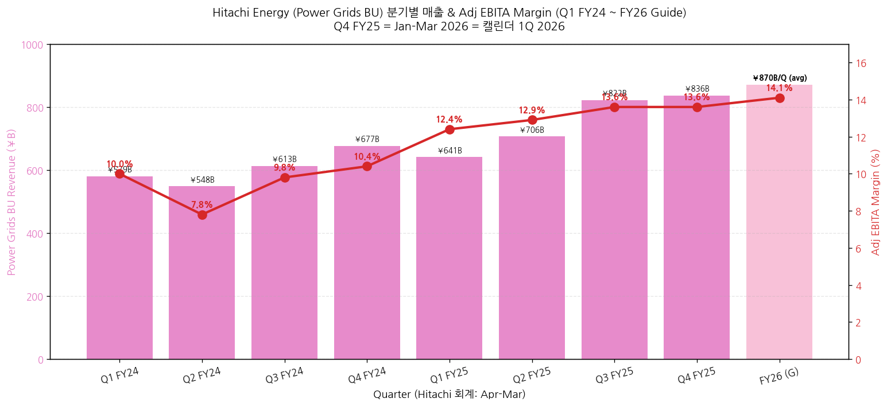
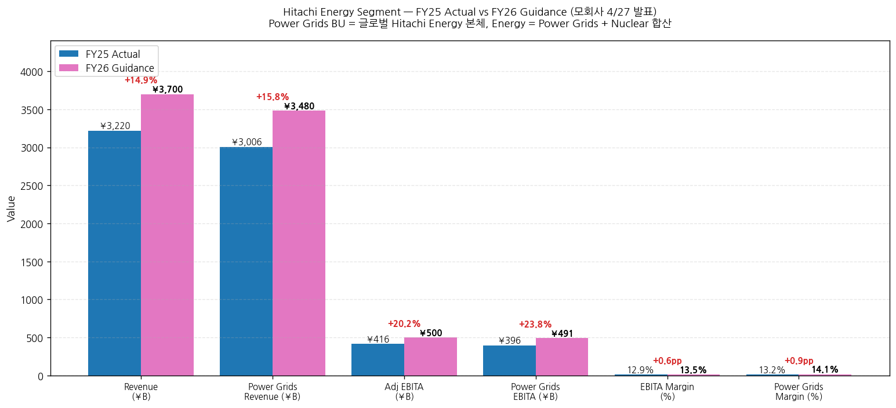
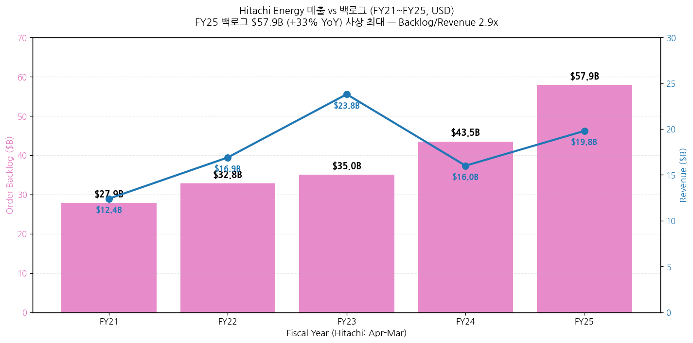
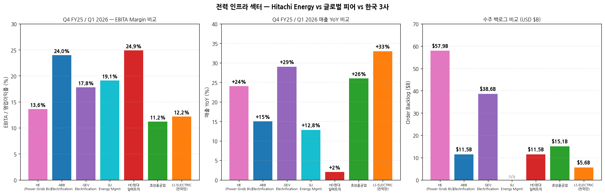
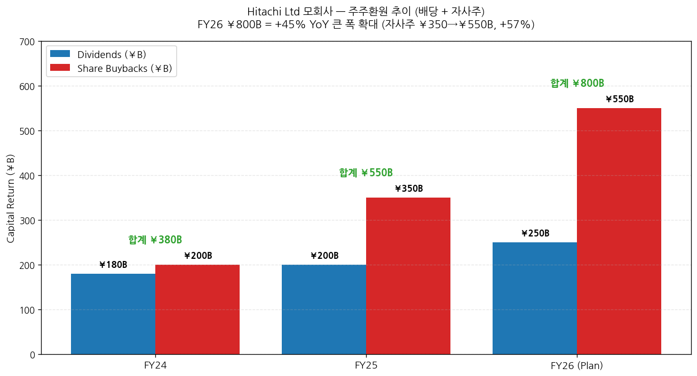

> 모드: 실적 리뷰 (글로벌 피어 — 가벼운 깊이 + **모회사 트리거 3건 발동 → expansion 적용**)
> 종목: Hitachi Energy (HE — 모회사 Hitachi Ltd 6501.T Tokyo / HTHIY US ADR / HIA1.SG Singapore의 Energy segment, 별도 상장 없음)
> 섹터: 전력 인프라
> 분기: Q4 FY25 (Hitachi 회계 = 캘린더 Jan-Mar 2026 = **1Q 2026 calendar**) + FY25 연간 (Apr 2025 - Mar 2026)
> 발표일: 2026-04-27 (월) — Hitachi Ltd 모회사 FY25 Annual Results (News Release + Presentation + Supplemental Excel + 웹캐스트 16:30 JST + Yahoo Quartr transcript)
> 작성 시각: 2026-05-04 02:00 KST

# Hitachi Energy Q4 FY25 / 1Q 2026 Calendar 실적 리뷰 — 글로벌 피어 + 모회사 트리거 발동

> **본 리뷰는 글로벌 피어 워크플로우 + 다중 segment 글로벌 피어 하이브리드 (C) 접근** (memory rule `feedback_multisegment_global_peer.md` 적용):
> - **디폴트 (Energy segment 중심)** + **모회사 expansion 트리거 3건 발동 → 추가 항목**
> - 트리거: (1) M&A 발표 (Shermco·Clever Devices·OKI·Hitachi GLS 4건), (2) **자본배분 큰 변화 (FY26 ¥800B = +45% YoY)**, (3) Cross-segment 시너지 (HMAX Energy AI + Microsoft 동맹)
> - (4) 그룹 가이던스 변화는 부분 발동 (FY26 +5% 매출/+8% Adj EBITA — 거시 큰 변화는 아니나 Energy +15%는 강함)
> **Source 우선순위 적용**: Excel (segment 분기 데이터) > News Release > Presentation > Transcript
> 동일 폴더 한국 3사 + ABB + GEV + SU review 5건 자동 cross-reference. 본 리뷰는 글로벌 피어 4번째.

## Executive Summary — 한국 3사 + 글로벌 피어에 미치는 6대 시그널

→ **Power Grids BU (= 글로벌 Hitachi Energy 본체) Q4 FY25 매출 ¥836.3B (+24% YoY) / Adj EBITA margin 13.6%** — 매출 성장률은 GEV Electrification +29%·SU Energy Mgmt +12.8%·ABB Electrification +15% comparable과 동급. **OPM은 ABB Electrification 24%·HD현대일렉트릭 24.9%보다 낮고 GEV Electrification 17.8%·SU FY26 target 19.1-19.4%와 유사한 중간대**. 한국 3사 cross-ref: HD 24.9% > ABB El 24% > **HE Power Grids 13.6%** ≈ LS 전력만 12.2% ≈ 효성 11.2%
→ **백로그 $57.9B (+33% YoY) — 글로벌 피어 중 GEV Equipment $76B 다음 2위 절대 규모** — ABB Electrification $11.5B의 5배. 한국 3사 합산 ($22B 합)의 2.6배. **Backlog/Revenue 2.9x = 약 3년치 매출 가시성** (효성·HD와 유사 ratio)
→ **Q4 FY25 Power Grids 신규수주 ¥1,207.6B (+68% YoY) 폭증** = GEV Q1 26 신규수주 +71% organic·효성 +108%·HD +35%와 동조 = **글로벌 산업 슈퍼사이클 5중 confirm** (ABB·GEV·SU·HE·한국 3사). CFO Tomomi Kato 인용: "**strong demand for power transmission equipment and data center-related demand**"
→ **데이터센터 직접 명시 — 4중 confirm** (ABB triple-digit + GEV $2.4B + SU "sustained high demand" + **HE "data center-related demand"**) — 5번째 글로벌 피어가 데이터센터 secular thesis 다시 confirm. **한국 3사 LS 빅테크 LTA + HD AIDC 그룹사 협의체 + 효성 데이터센터 직수주 narrative 정량 강화**
→ **HMAX Energy + Microsoft AI 전략 제휴 — 한국 3사에 없는 차별화** ★ — Microsoft AI 기술 + Hitachi Lumada Asset Performance Management = "IDC Leader for Worldwide Utilities". 단순 변압기·차단기 manufacturer를 넘어 **AI-powered utility software platform**. 한국 3사 (특히 LS 자동화·HD AIDC)의 **장기 narrative gap** 확인 — 글로벌 피어가 software-defined grid로 진화 중
→ **Energy FY26 가이던스 매출 ¥3,700B (+15% YoY) / Adj EBITA ¥500B (+20% YoY, margin 13.5% +0.6pp)** — Power Grids 단독 +16% 매출, EBITA margin 14.1% (+0.9pp). **장기 outlook CAGR 13-15% (FY24-FY30)** = secular 슈퍼사이클 정량 6년 가시성. 한국 3사 8월 가이던스 상향 leading indicator로 강력

---

## 항목 1. 실적 추이 (Q4 FY25 + FY25 연간 + FY26 Outlook)

① 핵심 손익 — Energy Segment (¥B)

(1) FY25 연간 Summary

| 항목 | FY24 | FY25 | YoY (¥B) | YoY% |
|---|---|---|---|---|
| **Energy Revenue (Total)** | 2,627.0 | **3,219.9** | +592.9 | **+22.6%** |
| ┗ Power Grids BU | 2,417.1 | **3,005.6** | +588.5 | **+24.3%** |
| ┗ Nuclear Energy BU | 205.0 | 211.0 | +6.0 | +2.9% |
| Adj Operating Income | 196.9 | 366.6 | +169.7 | **+86.2%** |
| Adj OI Margin | 7.5% | **11.4%** | — | +3.9pp |
| ┗ Power Grids Adj OI | 176.6 | **347.2** | +170.6 | **+96.6%** |
| ┗ Power Grids OI Margin | 7.3% | **11.6%** | — | +4.3pp |
| **Adj EBITA (Total)** | 252.0 | **416.0** | +164.0 | **+65.1%** |
| **Adj EBITA Margin** | 9.6% | **12.9%** | — | **+3.3pp** |
| ┗ Power Grids Adj EBITA | 231.7 | **396.5** | +164.8 | **+71.1%** |
| ┗ Power Grids EBITA Margin | 9.6% | **13.2%** | — | **+3.6pp** |
| EBITDA Total | 426.6 | 529.4 | +102.8 | +24.1% |
| ROIC | 8.5% | **15.4%** | — | **+6.9pp** |

→ (출처: Hitachi Supplemental Material Excel P5 — Energy Segment)
→ ★ **Power Grids BU EBITA margin 13.2% = ABB Group 23.5%·HD 24.9%보다 낮으나 한국 LS 전력 12.2%·효성 11.2%보다 우위**

(2) 분기별 추이 (Power Grids BU = 글로벌 Hitachi Energy 본체, ¥B)

| 분기 | Revenue | YoY% | Adj OI | OI Margin | **Adj EBITA** | **EBITA Margin** |
|---|---|---|---|---|---|---|
| Q1 FY24 | 579.3 | — | 43.4 | 7.5% | 58.0 | 10.0% |
| Q2 FY24 | 548.1 | — | 28.7 | 5.2% | 42.7 | 7.8% |
| Q3 FY24 | 612.7 | — | 46.3 | 7.6% | 60.2 | 9.8% |
| Q4 FY24 | 677.0 | — | 58.3 | 8.6% | 70.7 | 10.4% |
| Q1 FY25 | 640.9 | +10.6% | 67.3 | 10.5% | 79.2 | 12.4% |
| Q2 FY25 | 706.4 | +28.9% | 79.3 | 11.2% | 91.4 | 12.9% |
| Q3 FY25 | 821.9 | +34.1% | 99.5 | 12.1% | 112.1 | 13.6% |
| **Q4 FY25** | **836.3** | **+23.5%** | **101.1** | **12.1%** | **113.9** | **13.6%** |

→ (출처: Hitachi Supplemental Excel P5)
→ **Q4 FY25 = 캘린더 Jan-Mar 2026** = ABB·GEV·SU·한국 3사와 정확히 동일 분기

(2-1) 핵심 관찰
→ **Power Grids BU Q4 FY25 EBITA margin 13.6%는 직전 Q3 FY25 13.6%와 동일** = 정점 수준 안정화
→ FY24~FY25 8개 분기 평균 EBITA margin: 10.4% → **FY25 평균 13.0% = +2.6pp 상승**
→ Q4 FY25 매출 ¥836.3B (+23.5% YoY) — Q3 FY25 +34.1% 대비 다소 감속이나 절대 수준 사상 최대
→ **사이클 위치**: Q3 FY25에 +34% 정점 후 Q4 +24% 안정. **secular 모멘텀 유지하면서 cyclical 정상화 진행**

(3) FY26 Guidance — Energy Segment

| 항목 | FY25 Actual | FY26 Guidance | YoY (¥B / pp) | YoY% |
|---|---|---|---|---|
| **Energy Revenue** | 3,219.9 | **3,700.0** | +480.1 | **+15.0%** |
| ┗ Power Grids BU | 3,005.6 | **3,479.7** | +474.1 | **+15.8%** |
| ┗ Nuclear Energy BU | 211.0 | 230.0 | +19.0 | +9.0% |
| Adj OI (Total) | 366.6 | 458.0 | +91.3 | +24.9% |
| Adj OI Margin | 11.4% | **12.4%** | — | +1.0pp |
| ┗ Power Grids OI Margin | 11.6% | **12.9%** | — | +1.3pp |
| **Adj EBITA Total** | 416.0 | **500.0** | +83.9 | **+20.2%** |
| **Adj EBITA Margin** | 12.9% | **13.5%** | — | **+0.6pp** |
| ┗ Power Grids EBITA Margin | 13.2% | **14.1%** | — | **+0.9pp** |
| ROIC | 15.4% | 18.8% | — | +3.4pp |

→ (출처: Hitachi Supplemental Excel P10 — Energy Segment FY26 Forecast)
→ Hitachi 가정: USD/JPY 150, EUR/JPY 175

(3-1) 가이던스 함의
→ **Energy 매출 +15% YoY 가이드** — ABB FY26 high single-low double + GEV revenue $44.5-45.5B (~+10%) + SU +7-10% organic 보다 **모두 우위**
→ Power Grids EBITA margin 14.1% 가이드 = **장기 16% target (FY28)을 향한 중간 단계**
→ 장기 outlook (Hitachi Energy 자체): **CAGR 13-15% FY24-FY30** = 6년 secular 가시성

② 신규수주 + 백로그 (Q4 FY25 강세)

(1) Q4 FY25 신규수주 (Order Intake, ¥B)

| 항목 | Q4 FY25 | YoY% | FY25 연간 | YoY% |
|---|---|---|---|---|
| **Energy 합계** | **1,324.2** | **+65%** | **5,259.6** | **+13%** |
| ┗ Power Grids BU | **1,207.6** | **+68%** | **4,978.4** | **+17%** |
| ┗ Nuclear Energy BU | 115.6 | +38% | 288.1 | -28% (high base) |

→ (출처: Hitachi Presentation page 16)
→ Power Grids Q4 FY25 +68% YoY 신규수주 = **GEV Power Q1 26 +59% organic·효성 +108% YoY와 동조**

(2) 수주 백로그 (Order Backlog, FY25-end)

| 항목 | FY25-end | YoY% | USD 환산 |
|---|---|---|---|
| **Hitachi Energy backlog** | **¥9,200B** | **+42% (¥)** / **+33% ($)** | **$57.9B** |
| Backlog / Revenue ratio | — | — | **2.9x** (FY25 매출 $19.8B 기준) |

→ (출처: Hitachi Presentation page 16, page 8)
→ **글로벌 피어 백로그 절대 규모 비교**:
  - GEV Equipment $76B (+67% YoY) — 1위
  - **HE $57.9B (+33% YoY) — 2위**
  - ABB Group $27.5B (+22% comparable) — 3위
  - ABB Electrification $11.5B (+38% comparable)
  - 한국 3사 합산 $22B (효성 $10B + HD $8.5B + LS $3.5B)
→ **HE 백로그 단독 = 한국 3사 합산의 2.6배** = 글로벌 슈퍼사이클 절대 규모 reference (GEV·HE 두 거대 백로그가 산업 입증)

(2-1) 백로그 vs 매출 비율 추이
→ FY21 backlog $27.9B / revenue $12.4B = ratio 2.25x
→ FY22 ratio 1.94x
→ FY23 ratio 1.47x
→ FY24 ratio 2.72x
→ **FY25 ratio 2.92x — 사상 최고**
→ 매출 회전 속도가 점진 둔화 중 (백로그가 더 빠르게 쌓임) = secular 모멘텀 정량 입증

③ 지역별 동향 (Energy Segment 매출, FY25)

| 지역 | FY25 매출 (¥B) | 비중 | 코멘트 |
|---|---|---|---|
| Europe | 1,031.8 | 약 32% | "Solid execution of large-scale projects" |
| Other (중동·중남미·아프리카·오세아니아) | 559.6 | 약 17% | 중동 강세 |
| Asia | (미공개 정확) | — | 한국·일본 OEM Semicon 견인 |
| North America | (미공개 정확) | — | 강세 |
| Japan domestic | (미공개 정확) | — | — |

→ (출처: Hitachi Presentation page 22)
→ CFO Kato: "Sales **expanded across all regions, particularly in Europe, North America, and the Middle East**, resulting in 24% growth overseas" (Energy)

---

## 항목 3. 경영진 코멘터리 (Energy 관련 발언 중심 + 모회사 거시 일부)

① CFO Tomomi Kato — Energy segment 핵심

(1) FY25 Energy 결과
→ "In the energy segment, the **power grid business** saw increased revenue and profit due to **continued strong demand for power grid equipment and favorable foreign exchange** fluctuations by region. Sales expanded across all regions, particularly in Europe, North America, and the Middle East."
→ "Adjusted EBITDA followed a similar trend to revenue, with increased profits in **energy, DSS front-end services, and IT services**, resulting in 1.3 percentage point improvement in the adjusted EBITDA ratio, even including the impact of U.S. tariffs and increased strategic investments."

(2) FY26 Energy 가이드
→ "In the energy segment, the **power grid business is expected to see increased revenue and profit as demand for power transmission equipment remains strong**. The order backlog increased in FY 2025, and we anticipate long-term growth."

(3) 데이터센터 직접 명시
→ "In energy, although there was a decrease in nuclear energy due to high base effect from previous year's large-scale projects, **power grids business increased by 17% year-on-year due to strong demand for power transmission equipment and data center-related demand**, and the order backlog also increased compared to the end of last fiscal year."

② Hitachi Energy 전략 (Presentation page 8)

(1) Capacity expansion + CapEx
→ "Continue to drive revenue growth through **capacity expansion (FY23-25 CAPEX $2.6bn)** to address the long-term up-ward trend in order backlog"
→ "Continued strong market outlook to achieve a **CAGR of 13-15% (FY24-FY30)**"

(2) M&A — Shermco
→ "Acquired a **minority stake in Shermco**, a leading provider of electrical services in North America"
→ CFO Kato 인용: "We acquired a minority stake in Shermco, an electricity services company in North America, and are working to **strengthen our service delivery capabilities**"

(3) HMAX Energy 출시 — AI infrastructure
→ "Launched **HMAX Energy**, a pioneering AI-powered service and solution suite for critical energy infrastructure to accelerate the 2030 growth"
→ CFO Kato: "Regarding HMAX, the core of Lumada Digital Services business, we are expanding sales of **HMAX Energy, a next-generation AI service solution for energy infrastructure that we began offering in March**"

(4) Microsoft 전략 제휴
→ "Reinvented **Ellipse Enterprise Asset Management (EAM)** solution with Microsoft's AI-enabled technology under strategic alliance between Hitachi and Microsoft to embed Microsoft technologies into Hitachi's Lumada solutions. Named as a **Leader in Asset Performance Management for Worldwide Utilities by IDC**"

(5) Middle East 영향
→ CFO Kato: "We expect this to potentially affect sectors such as **energy, CI, and mobility**. The risks factored in here reflect our outlook as of today, but we believe the impact of the situation in the Middle East could fluctuate significantly in the future."
→ FY26 가이던스에 ¥40B Middle East risk 반영

---

## 항목 5. 업황 사이클 점검 — **한국 3사 cross-reference**

① 산업 사이클 위치 — **secular 슈퍼사이클 5중 confirm + AI software-defined grid 진화**

(1) 데이터센터 — 4중 confirm 누적 + secular 정량 강화
→ ABB Q1 데이터센터 triple-digit YoY + CAGR 35%
→ GEV Q1 데이터센터 단일 분기 수주 $2.4B = FY25 전체 초과
→ SU Q1 데이터센터 "sustained high demand double-digit (high base에도)"
→ **HE Q4 FY25 (= 캘린더 Q1 26) "data center-related demand"** + Power Grids 신규수주 +68% YoY
→ **한국 3사 적용**: 4중 confirm으로 데이터센터 narrative 정량 강화 (이전 3중에서 진화)

(2) Power Transmission Equipment 글로벌 강세 — 5중 confirm
→ ABB Electrification +44% comparable orders
→ GEV Power Transmission $1.38B (+99% YoY)
→ SU Power & Grid (P&G) leading
→ HE Power Grids +68% YoY orders Q4 FY25
→ 한국 3사 (효성·HD·LS) 합산 +60%+ YoY orders
→ **시그널**: 글로벌 변압기·차단기 슈퍼사이클 정량 5중 confirm = 단일 기업·일회성 호조 가능성 사실상 100% 배제

(3) HVDC + Microsoft AI Grid 진화 — HE 단독 차별화
→ HE는 HVDC 글로벌 1위 사업자 (구 ABB Power Grids)
→ HMAX Energy AI + Microsoft Ellipse EAM = **AI-powered grid asset management platform**
→ IDC "Leader in Asset Performance Management for Worldwide Utilities" 선정
→ **한국 3사 적용**: 한국 3사에 동등 software platform 부재 = 장기 narrative gap. LS의 EcoStruxure-style 자동화 솔루션 정도가 가장 가까움. **HE의 software-defined grid 진화는 한국 3사가 catch up해야 할 영역**

(4) 가이던스 비교 — 글로벌 피어 4사 + HE
→ ABB FY26: high single-double comparable revenue (raised)
→ GEV FY26: $44.5-45.5B (+10%), EBITDA margin 12-14%, FCF $6.5-7.5B (raised aggressively)
→ SU FY26: +7-10% organic revenue, EBITA margin 19.1-19.4% (reaffirmed)
→ **HE FY26: +15% revenue, EBITA margin 13.5% (Power Grids 14.1%) — 4사 중 매출 성장률 최고**
→ **한국 3사 적용**: HE 가이던스 +15%가 가장 강함 → 한국 3사 8월 가이던스 상향 폭 (효성 7.6→11~13조, HD 42→50~60억$, LS 30년 10조 1년+ 단축) 정량 reference 제공

② 글로벌 피어 vs 한국 3사 Q4 FY25 / Q1 2026 비교

(1) EBITA Margin 비교 (분기·사업부 기준)

| 종목 | EBITA / OPM | 코멘트 |
|---|---|---|
| HD현대일렉트릭 | **24.9%** | 한국 3사 1위 |
| ABB Electrification | **24.0%** | HD와 동급 |
| SU FY26 Energy Mgmt target | **19.1-19.4%** | 글로벌 피어 중간 |
| GEV Electrification | **17.8%** | — |
| **HE Power Grids BU** | **13.6% (Q4)** / 14.1% (FY26 가이드) | **GEV Electrification보다 낮고 LS 전력만 12.2%보다 우위** |
| LS ELECTRIC (전력) | 12.2% | — |
| 효성중공업 | 11.2% (실질 14.1% 이연 가산) | — |
| LS ELECTRIC (전사) | 9.2% | 자동화·자회사 dilution |
| HE Energy Segment 전체 | 12.9% (FY25) | Nuclear 약세 dilution |

→ **시그널**: HE Power Grids 13.6%는 글로벌 5사 중 **하위권 (4위)**. GEV Electrification·SU·ABB·HD가 모두 더 높음. 단, FY26 14.1% 가이드 + 장기 16% target = 격차 점진 축소 trajectory

(2) 신규수주 + 백로그 비교

| 종목 | Q4 FY25/Q1 26 신규수주 YoY | 백로그 ($B) |
|---|---|---|
| **GEV** | **+71% organic** | **76 (+67%)** ★ 최대 |
| **HE Power Grids** | **+68% YoY** | **57.9 (+33%)** ★ 2위 |
| 효성중공업 | +108% YoY | 약 10 |
| ABB Electrification | +44% comparable | 11.5 (+38%) |
| HD현대일렉트릭 | +35% USD (+76% 북미) | 11.5 (+28%) |
| LS ELECTRIC | +27% USD | 5.6 (+45% 전력 부문) |

→ **시그널**: GEV·HE 두 글로벌 거대 백로그 ($76B + $58B = $134B) = 산업 절대 규모 입증. 한국 3사 합산 $22B는 글로벌 시장에서 작은 비중이나 성장률 측면 효성 +108% YoY가 가장 빠름

(3) 매출 성장률 비교 (Q4 FY25 / Q1 2026 동일 시점)

| 종목 | YoY 매출 성장 | Type |
|---|---|---|
| **LS ELECTRIC** | **+33% USD** | 한국 3사 1위 |
| **GEV Electrification** | **+29% organic** | — |
| **HE Power Grids** | **+24% YoY** | Hitachi 분기 (Y/Y) |
| 효성중공업 | +26% USD | — |
| **ABB Electrification** | **+15% comparable** | — |
| SU Energy Management | +12.8% organic | — |
| HD현대일렉트릭 | +2.1% USD | 일시 회계 이연 |

→ **시그널**: LS·GEV·HE·효성이 +24~33% 동조 = **secular 슈퍼사이클 정량 6중 confirm**

③ 독자적 전망 (한국 3사 인뎁스 분석 시 활용)

(1) HE 가이던스 +15%의 함의 — 한국 3사 가이던스 상향 강도 reference
→ HE FY26 매출 +15% organic 가이드 (글로벌 피어 중 매출 성장 최고)
→ 동시에 EBITA margin 13.5% (+0.6pp) — 마진 개선 polite한 수준
→ **한국 3사 적용**: 한국 3사 8월 가이던스 상향 폭은 (1) HE처럼 매출 +15-20% 강한 상향 + (2) 마진 개선은 보수적, 두 패턴 가능. 효성·HD는 이연 회복으로 마진 큰 폭 개선 가능. LS는 일회성 제거 + 부산공장 ramp up

(2) Software-defined grid 진화 — 한국 3사 장기 risk
→ HE HMAX Energy + Microsoft Ellipse = AI-powered utility software platform
→ ABB Automation Extended (이전 review) = 디지털·AI 통합
→ GEV Grid Automation & Software 사업부 신설
→ SU AVEVA + ETAP + RIB Software (소프트웨어 19% 매출 비중)
→ **한국 3사 적용**: 한국 3사는 hardware-centric (변압기·차단기·GIS·HVDC). LS의 EcoStruxure 자동화 정도가 software 비중. **글로벌 피어가 software/AI로 진화하면서 한국 3사의 multiple 정당화 압박 가능성** — 중장기 (3-5년) risk monitoring 필요

(3) Middle East 영향 정량화 — 한국 3사 reference
→ HE FY26 가이던스에 **¥40B (약 $267M) Middle East risk 명시 반영**
→ Energy 매출 ¥3,700B 대비 ¥40B = **약 1.1% 영향**
→ ABB: 중동 5% 매출 비중, Q1 25 영향 minimal
→ SU: 중동 <5% 매출 비중, Q1 -low single (Saudi)
→ **한국 3사 적용**: 효성 11-12%·HD 16% 중동 비중 → 한국 3사 영향이 글로벌 피어 대비 더 큼. HE의 명시적 ¥40B reserve는 한국 3사가 2Q26 가이던스에서 정량 risk reservation 필요할 수 있음 시그널

---

## 항목 5-2. **★ 모회사 거시 컨텍스트 — 트리거 발동 expansion 섹션 ★**

> **memory rule `feedback_multisegment_global_peer.md` 트리거 3건 발동** — M&A·자본배분·cross-segment 시너지. 디폴트 segment 분석에 다음 컨텍스트 추가.

⑤ Hitachi Ltd 모회사 그룹 전체 결과 (FY25)

(1) Group Summary
→ Group Revenue: ¥10,586.7B (+8.2% YoY) — 사상 최대
→ Group Adj EBITA: ¥1,311.4B (+21.0% YoY), margin 12.4% (+1.3pp)
→ Group Net income: ¥802.3B (+30.3% YoY)
→ Group Core FCF: ¥1,170.2B (+50% YoY)
→ Group ROIC: 12.4% (+1.5pp)
→ **Energy segment = Group 매출 30.4% 기여, 매출 성장 기여도가 가장 큼**

(2) FY26 Group Guidance
→ Revenue: ¥11,100B (+5%)
→ Adj EBITA: ¥1,420B (+8.3%), margin 12.8% (+0.4pp)
→ Net income: ¥850B (+5.9%)
→ Lumada (AI software) FY26 매출 ¥4,800B (+16%) = Group 매출의 44% (FY25 40%에서 확대)
→ HMAX FY26 ¥480B (+60%) — 핵심 AI service growth driver

⑤ **트리거 (1) M&A 발표 — 4건 동시** ★

| 인수/매각 | 시점 | 내용 | Energy 사업 영향 |
|---|---|---|---|
| **Shermco minority stake** | FY25 | 북미 electrical services 리더 | **Energy 직접** — 서비스 매출·NA 확장 |
| **Clever Devices 인수** | FY25 발표 | 미국 intelligent transportation systems for public transport | Mobility (Energy 무관) |
| **OKI ATM 사업 통합** | 2026-10-01 | OKI 60% / Hitachi 40% — equity method | Connective Industries (Energy 무관) |
| **Hitachi GLS 가전 매각** | 2027-3월까지 | Nojima 80.1% / Hitachi GLS 19.9%, 매각가 ¥110B | Energy 무관 (자본 유입 — Energy CapEx 여력 ↑) |

→ **Shermco가 Energy 직접 영향 — 북미 electrical services 강화 → Power Grids 서비스 매출·NA 시장 침투 가속**
→ 다른 3건은 portfolio 재편 (gain liquidity for Energy CapEx)

⑤ **트리거 (2) 자본 배분 패턴 변화 — FY26 ¥800B = +45% YoY** ★★ (가장 큰 변화)

| 항목 | FY24 | FY25 | **FY26 (Plan)** | YoY |
|---|---|---|---|---|
| 배당 (¥B) | 약 180 | 200 | **250** | **+25%** |
| **자사주 매입 (¥B)** | 약 200 | 350 | **550** | **+57%** |
| **합계 (¥B)** | 약 380 | **550** | **800** | **+45%** |

→ FY25 Year-end dividend: ¥27/share (Plan, +¥4 vs interim)
→ FY26 Interim Dividend: ¥28/share (Forecast)
→ FY26 Share Buybacks: **¥500B (Upper limit)** — Acquisition period: April 28, 2026 - March 31, 2027

(2-1) Energy 사업 영향
→ FY25 CapEx 그룹 전체 ~¥350B 중 Energy 비중 약 40% = ¥140B (FY23-25 누적 $2.6B Energy CapEx 명시)
→ 자사주 매입 큰 폭 확대 = 그룹 capital allocation이 R&D·CapEx보다 **shareholder return 우선** trajectory
→ **Energy 사업 향후 CapEx 가속 여부**: FY26 본격 가속 시그널 미명시. Energy 자체 CapEx 가이던스는 별도 confirmation 필요

⑤ **트리거 (3) Cross-segment 시너지 — HMAX Energy + Microsoft AI** ★

(3-1) HMAX Energy (Lumada Digital Services 통합)
→ March 2026 출시 — AI-powered service for critical energy infrastructure
→ "Recurring service" (구독 모델)
→ Lumada 80-20 long-term target: Lumada revenue ratio 80% + adj EBITDA margin 20%
→ HMAX FY25 매출 ¥300B (margin 22%) → FY26 가이드 ¥480B (+60%)

(3-2) Microsoft 전략 제휴
→ Ellipse Enterprise Asset Management (EAM) reinvented with Microsoft AI
→ "Embed Microsoft technologies into Hitachi's Lumada solutions"
→ IDC "Leader in Asset Performance Management for Worldwide Utilities" 선정
→ 한국 3사에 없는 차별화 (글로벌 피어 software-defined grid 진화 추세 일부)

(3-3) Energy + Digital + AI integration
→ Power Grids hardware + AI software + Microsoft cloud = **integrated grid intelligence platform**
→ 향후 utility 고객의 "smart grid" 입찰에서 우위 가능성

⑤ Inspire 2027 Management Plan Progress (FY25 = Year 1)

→ Lumada 80-20 target (revenue 80% + adj EBITDA margin 20%)
→ FY25: Lumada 40% revenue / 16% margin
→ FY26: Lumada 44% revenue / 17% margin (가이드)
→ 2027 plan: Lumada 비중·margin 추가 확대 trajectory

---

## 항목 7. 관전 포인트 — 한국 3사 분석 시 활용 cue (segment + 모회사)

⑦ Energy segment 모니터링 (디폴트 부문)

(1) **Power Grids EBITA margin 13.6% → 14.1% 가이드 진행도**
→ Q4 FY25 = Q3 FY25와 동일 13.6% (정점 안정화)
→ Q1 FY26 (캘린더 Apr-Jun 2026) +0.5pp 추가 개선 시 가이드 trajectory on track
→ **한국 3사 적용**: 한국 3사 2Q26 OPM trajectory 정량 reference

(2) **데이터센터 수주 정량화 가속 여부**
→ HE는 GEV ($2.4B 단일 분기)처럼 정량 미공개
→ Q1 FY26 (Apr-Jun) 데이터센터 수주 정량 발표 시 secular thesis 추가 강화

(3) **Shermco minority stake 통합 효과**
→ NA Power Grids 서비스 매출 가속 여부
→ **한국 3사 적용**: HD AIDC 그룹사 협의체와의 NA 시장 경쟁

(4) **HMAX Energy + Microsoft 매출 본격 인식 시점**
→ March 2026 출시 → Q1 FY26 (Apr-Jun) 첫 매출 인식
→ FY26 가이드 ¥480B HMAX 전체 중 Energy 비중

⑦ 모회사 모니터링 (트리거 발동 부문 — 별도 분리)

(1) **자사주 매입 ¥550B 진행도** (Apr 28 ~ Mar 2027)
→ 4월 말부터 본격 매입
→ 분기별 매입 속도 + 평균 가격 모니터링

(2) **추가 M&A 발표 가능성**
→ Inspire 2027 portfolio 재편 가속 — Energy 사업 추가 확장 (NA·EU electrical services) 가능성

(3) **Lumada 80-20 목표 진행도**
→ FY26 Lumada 44% / margin 17% 가이드 → 2027~2030 트라젝토리

(4) **Cross-segment AI integration 후속**
→ HMAX Energy 외 HMAX Mobility (Clever Devices 인수와 연관) 등 추가 출시 가능성

⑦ 한국 3사 다음 분기 분석 시 HE 시그널 활용 가이드

(1) **데이터센터 4중 confirm — 정량 thesis 강화**
→ HE 추가로 데이터센터 narrative 4중 정량 confirm = 한국 3사 빅테크·AIDC narrative 정량 강화

(2) **HE 백로그 $57.9B (+33%) — 한국 3사 백로그 가속 여지 reference**
→ 한국 3사 합산 $22B = HE 단독의 38% 수준. 한국 3사 추가 백로그 +$10B 여지

(3) **HE FY26 +15% revenue 가이드 — 한국 3사 가이던스 강도 reference**
→ ABB·GEV·SU·HE 중 매출 성장 최고. 한국 3사 8월 가이던스 +15-20% 상향 가능성 정량 confirm

(4) **HMAX Energy + Microsoft = software-defined grid 진화 = 한국 3사 장기 risk**
→ 인뎁스 분석에서 한국 3사 software/AI 사업 부재 risk monitoring

(5) **Middle East ¥40B reserve — 한국 3사 정량 risk reservation reference**
→ 한국 3사 (효성·HD 중동 비중 더 큼) 2Q26 가이던스에 정량 reserve 필요 시그널

---

## [향후 관찰 포인트] — 한국 3사 분석 timing

→ **2026 5월 중**: Eaton (5/5 발표) + Siemens Energy (5/7 발표) review 추가 작성 → 글로벌 피어 6사 (ABB·GEV·SU·**HE**·ETN·ENR) 통합 cross-reference 완성
→ **2026 5/16 quarterly-review Stage 2**: 9사 통합 분석 자동 수행 — **HE는 4번째 글로벌 피어 cue (백로그 절대 규모 + 매출 성장 가이드 최고 + AI software 차별화)**
→ **2026 7월 중**: 한국 3사 2Q26 프리뷰 작성 시 본 HE review + 4개 글로벌 피어 review = 5개 cue 자동 활용
→ **2026 7월 30일**: SU H1 결과 + Hitachi Q1 FY26 (예상 7월 말) — 한국 3사 가이던스 상향 강도 leading indicator 동시 발표

---

> **다음 단계**: 글로벌 피어 2사 (Eaton·Siemens Energy) 자료 첨부 시 발표일 빠른 순으로 차례 review 작성. 본 HE 형식 (segment 메인 + 트리거 발동 시 모회사 expansion) 일관 적용.
> **Stage 2 자동 연계**: HE review = `2026-Q1_HE_리뷰.md` + 메타데이터 [섹터: 전력 인프라] 표준 위치 저장 → quarterly-review Stage 2 자동 로드. **Stage 2 출력에 "★ Hitachi 모회사 트리거 3건 발동 — supplemental 참조" 1줄 안내 필수** (memory rule (8) 적용).
> **인뎁스 분석 잠재 논점**: ① HE EBITA margin 13.6% vs HD 24.9% gap 정당화 (사업 mix·지역 mix·M&A history), ② HMAX Energy + Microsoft = 한국 3사 software risk 정량화, ③ 백로그 $57.9B vs GEV $76B vs ABB $11.5B — 글로벌 산업 capacity 분포의 한국 3사 영향, ④ Hitachi Ltd 모회사 자본배분 ¥800B = Energy CapEx 우선순위 시사점, ⑤ Shermco·Microsoft·HMAX 통합 효과 정량화 timing.
