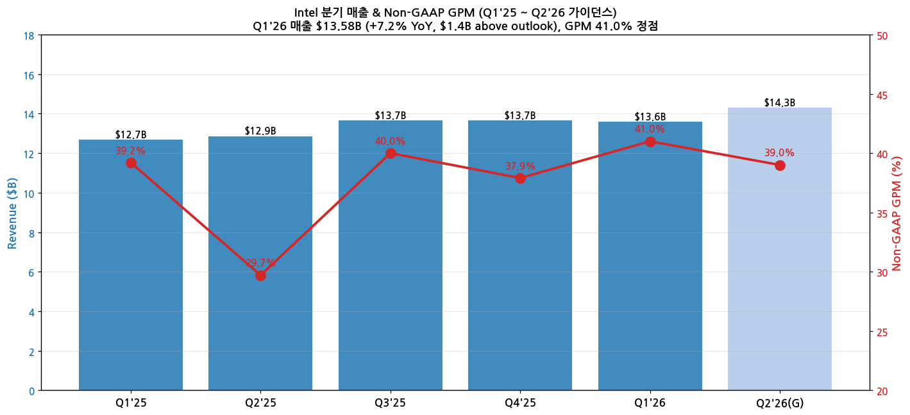
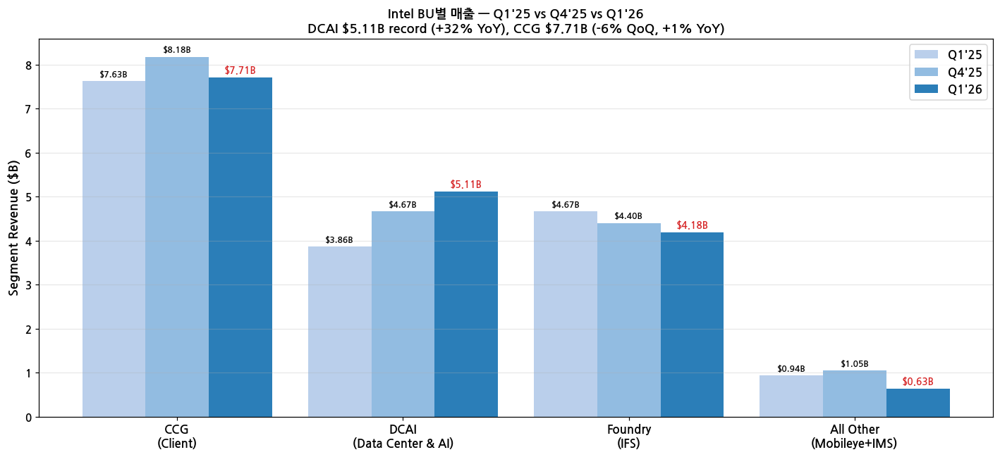
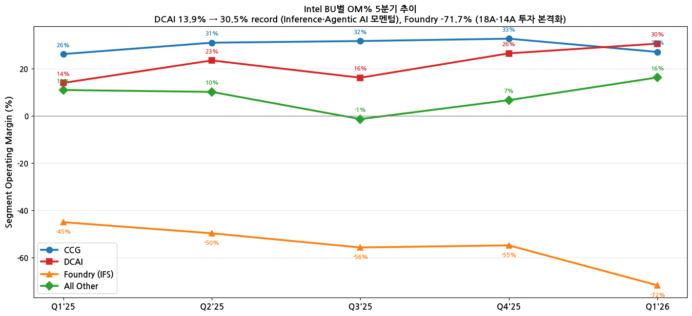

> 모드: 실적 리뷰
> 종목: Intel (INTC)
> 섹터: 반도체
> 분기: 2026-Q1
> 발표일: 2026-04-23 (AMC)
> 작성 시각: 2026-05-19 19:30 KST

# Intel Q1 2026 실적 리뷰 — "Intel CPUs Foundational to Inference and Agentic"

## Executive Summary

→ **6분기 연속 컨센 비트, 1987년 이후 최대 단일일 +24% 폭등**. Q1'26 매출 $13.58B (+7.2% YoY, $1.4B above Jan outlook), Non-GAAP EPS $0.29 (vs 컨센 $0.01, **29배 비트**)
→ **DCAI (Data Center & AI) 사업부 record**: 매출 $5.11B (+32% YoY), OM 30.5% 정점 (Q1'25 13.9% → 5분기 만에 +16.6pp). "ASIC revenue nearly doubled YoY"
→ **CEO Lip-Bu Tan 핵심 발언**: "Intel CPUs Foundational to Inference and Agentic. CPU–to–Accelerator ratio narrowing. CPU is the AI compute at the Edge" — 에이전트 AI에서 CPU 병목 narrative의 공식 채택
→ **Q2'26 가이던스 상회**: 매출 $13.8-14.8B (mid $14.3B, 컨센 $13.07B 대비 +9.4% 비트), Non-GAAP EPS $0.20 (컨센 $0.09 대비 +122%)
→ **셀사이드 시각 전환**: 발표 후 24시간 내 12+ 증권사 PT 상향, 4월 한 달 주가 **+90%**. 'Lip-Bu Tan turnaround story' 정착 — 단, Foundry (IFS) OM -71.7%·FCF -$2.0B는 여전한 부담

---

## 항목 1. 실적 추이 (Q1 2026 확정 + Q2'26 가이던스)

### ① 분기 실적 — 매출·GPM 추이

(1) 5분기 추이 + Q2'26 가이던스

| 항목 | Q1'25 | Q2'25 | Q3'25 | Q4'25 | **Q1'26** | **Q2'26(G)** |
|------|-------|-------|-------|-------|-----------|--------------|
| 매출 ($B) | 12.67 | 12.86 | 13.65 | 13.65 | **13.58** | **13.8-14.8 (mid 14.3)** |
| YoY % | -0.4% | -4.2% | +3.0% | -7.4% | **+7.2%** | **+11.2%** |
| QoQ % | -10.3% | +1.5% | +6.2% | 0% | -0.5% | +5.3% |
| Non-GAAP GPM | 39.2% | 29.7% | 40.0% | 37.9% | **41.0%** | **39.0%** |
| GAAP GPM | 36.9% | 27.5% | 38.2% | 36.1% | 39.4% | 37.5% |
| Non-GAAP Op Income ($B) | 0.7 | -0.5 | 1.5 | 1.2 | **1.7** | — |
| Non-GAAP EPS ($) | 0.13 | -0.10 | 0.23 | 0.13 | **0.29** | **0.20** |
| GAAP EPS ($) | -0.19 | -0.67 | 0.18 | -0.05 | -0.73 | 0.08 |
| GAAP Op Income/(Loss) ($B) | -0.3 | -3.2 | 0.7 | 0.6 | -3.1 | — |

(2) Beat 폭 — 6분기 연속 컨센 비트

(2-1) Q1'26 결과 vs Jan outlook (회사 가이던스)

→ 매출 $13.58B vs outlook mid-point **+$1.4B (+11.5% above outlook)**
→ Non-GAAP GPM 41.0% vs outlook 34.5% **+6.5 ppts above**
→ Non-GAAP EPS $0.29 vs outlook $0.00 **+$0.29 above** (사실상 breakeven 가이던스에서 폭발적 비트)

(2-2) Q1'26 결과 vs 셀사이드 컨센서스

→ 매출 $13.58B vs 컨센 $12.42B **+$1.16B (+9.3% beat)**
→ Non-GAAP EPS $0.29 vs 컨센 $0.01 **29배 비트** — 사실상 시장이 break-even 기대였는데 $0.29 대비

(3) 매출 + GPM 차트

→ (출처: Intel Q1 2026 Earnings Deck, p.6 발표일 2026-04-23) — Non-GAAP GPM Q2'25 29.7% 저점 → Q1'26 41.0% +11.3pp 회복

### ② BU별 매출 (사업부별 분해)

(1) Q1 2026 BU별 비교 (SEC Earnings Release HTM 공식 기준)

| 사업부 | 매출 ($B) | YoY (SEC HTM) | QoQ | 비고 |
|--------|-----------|--------------|-----|------|
| **CCG** (Client Computing) | 7.7 | **+1%** | -5.7% | Series 3 (Core Ultra Series 3) "best product launch in 5 years", Series 3 매출 **client CPU mix의 60%+** (CFO) |
| **DCAI** (Data Center & AI) | **5.1** | **+22%** | +9.4% | **분기 매출 record**, OM 30.5%, "ASIC revenue nearly doubled YoY", AI 관련 매출이 전체 60% (~$8.1B) +40% YoY (CFO) |
| **Intel Foundry** (gross) | **5.4** | **+16%** | — | External foundry revenue $174M (transcript). 18A·14A yields better than expected, Advanced Packaging 수요 "hundreds of millions → billions of dollars/year" |
| **All Other** (Mobileye + IMS) | 0.6 | -33% | -40.0% | Altera deconsolidated Q3'25 영향, Mobileye strong Q1, IMS backlog 회복 |
| Intersegment eliminations | (5.3) | — | — | Foundry → Products 내부 매출 |
| **Total net revenue** | **13.6** | **+7%** | -0.5% | 6분기 연속 컨센 비트 |

→ (출처: [SEC Intel Q1 2026 Earnings Release HTM](https://www.sec.gov/Archives/edgar/data/50863/000005086326000077/q126earningsrelease.htm))

→ **정정 알림**: 본 리뷰 초안에서 DCAI YoY를 Deck p.8 그래프 라벨 기반 +32%로 표기했으나, SEC HTM 공식 수치는 **+22% YoY** (Q1'25 베이스 $4.2B). Foundry 매출도 Deck p.9의 segment 차트 ($4.18B)는 net (intersegment 제외), SEC HTM은 gross ($5.4B). 본 표는 SEC HTM 공식 기준으로 정정.

(2) BU별 매출 차트

→ (출처: Intel Q1 2026 Earnings Deck p.7~10) — **DCAI 5분기 연속 상승, Q1'26 record $5.11B**

(3) BU별 OM 추이

| 사업부 | Q1'25 | Q2'25 | Q3'25 | Q4'25 | **Q1'26** |
|--------|-------|-------|-------|-------|-----------|
| CCG | 26.1% | 30.9% | 31.6% | 32.6% | 27.0% |
| **DCAI** | 13.9% | 23.4% | 16.1% | 26.4% | **30.5%** (record) |
| Foundry | -45.0% | -49.7% | -55.7% | -54.8% | **-71.7%** (악화) |
| All Other | 10.9% | 10.1% | -1.4% | 6.6% | 16.2% |

→ (출처: Intel Q1 2026 Earnings Deck p.7~10)

(4) BU별 OM% 차트

→ (출처: Intel Q1 2026 Earnings Deck) — **DCAI OM 13.9% → 30.5% +16.6pp 폭증** (Inference·Agentic AI 모멘텀), CCG 32.6% → 27.0% 하락 (인플레이션·믹스 변화), Foundry -71.7% 악화 (18A·14A 본격 투자)

### ③ 연간 실적 — 5년 + FY26E·FY27E 컨센 변화

| FY | 매출 ($B) | YoY | Non-GAAP GPM | Non-GAAP EPS |
|----|-----------|-----|--------------|--------------|
| 2021 | 79.0 | +1.5% | 57.7% | 5.47 |
| 2022 | 63.1 | -20.2% | 47.3% | 1.84 |
| 2023 | 54.2 | -14.0% | 40.2% | 1.05 |
| 2024 | 53.1 | -2.1% | 36.0% | 0.16 |
| 2025 | 52.9 | -0.4% | 34.2% | 0.39 |
| **2026E (Pre-Q1)** | 53.5 | +1.1% | 35.5% | 0.45 |
| **2026E (Post-Q1)** | **56.8** | **+7.4%** | **39.0%** | **1.10** |
| 2027E (Post-Q1) | 62.5 | +10.0% | 42.5% | 2.20 |

→ FY26E 매출 컨센 +$3.3B (+6.2%) 상향, Non-GAAP EPS 컨센 +$0.65 (2.4배) 상향. 셀사이드 12+ 증권사 24시간 내 추정치 갱신

---

## 항목 2. 실적 vs 가이던스 vs 컨센서스 — 3원 비교

### ① 비교표

| 항목 | Jan'26 가이던스 (mid) | 컨센서스 | 실적 Q1'26 | 가이던스 대비 | 컨센 대비 |
|------|----------------------|---------|-----------|--------------|----------|
| 매출 | $12.0-13.0B (mid $12.5B) | $12.42B | **$13.58B** | **+8.6% / +$1.08B** | **+9.3% beat** |
| Non-GAAP GPM | ~36% | ~36.5% | **41.0%** | **+5.0pp** | **+4.5pp** |
| Non-GAAP EPS | $0.00 (breakeven) | $0.01 | **$0.29** | **+$0.29** | **29배 beat** |
| Non-GAAP Op Income | — | ~$0.5B | **$1.7B** | — | **+240%** |

→ **모든 항목 가이던스·컨센 동시 비트** — Non-GAAP EPS는 사실상 breakeven 시나리오가 무너지고 $0.29 흑자. CEO 발언 "6th Consecutive Quarter Exceeding Expectations"

### ② 제품별 서프라이즈 상세

(1) DCAI 가장 큰 서프라이즈

→ 매출 $5.11B vs 컨센 $4.55B **+12.3% beat**, 6분기 만에 record
→ OM 30.5% — 시장 예상 22~25% 대비 +5~8pp 비트
→ **"ASIC revenue nearly doubled YoY"** — Intel Gaudi 3 + custom ASIC (정확한 분해 미공개)

(2) CCG 컨센 부합

→ 매출 $7.71B vs 컨센 $7.70B 컨센부합
→ OM 27.0% vs 컨센 28.5% **-1.5pp 미스** (인플레이션 압박, 믹스 변화)
→ Series 3 (Core Ultra Series 3) — "best product launch in 5 years" but 단기 ASP 압박

(3) Foundry 예상보다 큰 적자

→ 매출 $4.18B vs 컨센 $4.30B -2.8% miss (intersegment 매출 감소)
→ OM **-71.7% vs 컨센 -55%** — 큰 음수 서프라이즈
→ 18A·14A 본격 ramp 비용 + restructuring charge $4.1B (Q1 일회성)

---

## 항목 3. 경영진 코멘터리 (Intel Q1 2026 Earnings Deck + Earnings Call)

### ① CEO Lip-Bu Tan 핵심 발언

(1) **에이전트 AI CPU 병목 — Intel의 공식 narrative 채택 (컨콜 transcript 직접 인용)**

→ (1-1) **CEO Lip-Bu Tan 핵심 발언**: "Intel CPUs Foundational to Inference and Agentic" (Deck p.4)

→ (1-2) "**The next wave of AI will bring intelligence closer to the end user, moving from foundational models to inference to agentic. This shift is significantly increasing the need for Intel's CPUs and wafer and advanced packaging offerings.**"

→ (1-3) **CFO David Zinsner 결정적 발언 (컨콜 transcript 원문)**: "One statistic we look at is the ratio of CPUs to GPUs. If you look at **training solutions, they are generally running seven to eight GPUs to one CPU**. As we look into **inference, it is probably three to four to one**. As you get into **agentic and multi-agent, it is potentially even flipping the other direction a little bit**."

→ (1-4) **Lip-Bu Tan 추가 인용**: "Customers are deploying server CPUs alongside accelerators in a ratio that is moving back towards CPU" — 기존 GPU-centric AI 인프라 패턴의 반전

→ (1-5) **"XPU" 전략**: "We do not just have the CPU; we have advanced packaging and foundry. We call it XPU. Besides CPU, we are also quietly building up the GPU with new hires, and we are moving into accelerators so that we can serve the customer from the edge to physical AI."

→ (1-6) "**CPU is the AI compute at the Edge**" — 데이터센터 외 PC·노트북·엣지·물리AI에서 추론 워크로드의 CPU 의존

(2) 6분기 연속 컨센 비트 — "Tangible Progress Building the New Intel"

→ "Customer-centric, Engineering-focused; New and deepened customer relationships"
→ "Strong demand; Disciplined execution; Improving factory output"

(3) 차세대 노드 진척

→ "Intel 18A and 14A progress ahead of expectations"
→ "Better Intel 18A yields"
→ "Growing Advanced Packaging backlog" — AI 칩 패키징 수요 폭증

(4) 신제품 모멘텀

→ "Series 3 (Core Ultra Series 3) is the best product launch in 5 years" — **full-volume production 진입**, **client CPU mix의 60%+ 차지**
→ "Series 3 in market with enthusiast, creator, commercial, and mainstream"
→ DCAI: "ASIC revenue nearly doubled YoY" — **ASIC segment run rate $1B+ per year 도달**

(5) **LTA (장기공급계약) — Google 포함 다수 신규 계약** (컨콜 추가 공개)

→ "Intel signed **multiple long-term agreements** in the quarter—**including one with Google**—for volume and pricing of server CPUs and ASICs, typically lasting **3-5 years**, with some contracts kept confidential at customer request"

→ Advanced Packaging 수요: "shifted from expectations in the **hundreds of millions** to **billions of dollars per year**"
→ "Advanced Packaging이 향후 10년 foundry 매출의 major portion"

(6) AI 관련 매출 비중 — Q1 60% (CFO Zinsner)

→ "AI-related businesses constituted **60% of revenue** and grew **40% year over year**"
→ Q1 매출 $13.58B × 60% ≈ $8.1B가 AI 관련 (DCAI $5.1B + AIPC + ASIC + Advanced Packaging 일부)

### ② CFO David Zinsner 재무 상세

(1) 수익성 회복

→ Non-GAAP GPM 41.0% (Q2'25 저점 29.7% 대비 **+11.3pp 회복**)
→ Non-GAAP Op Income $1.7B (record, Q1'25 $0.7B의 **2.4배**)
→ 6분기 연속 컨센 비트 → "Disciplined execution and improving factory output"

(2) 현금흐름 — 여전히 부담

→ OCF Q1'26 $1.1B
→ CapEx $5.0B (높음, 18A·14A 본격 ramp)
→ **Adjusted FCF -$2.0B** (적자 지속)
→ Capital-related government incentives $0.1B (CHIPS Act 일부)
→ Partner contributions $2.0B (TSMC·Brookfield JV 등)

(3) Restructuring 일회성

→ Q1'26 Restructuring charges **$4.1B** (GAAP Op Income -$3.1B의 핵심 요인) — 사업 재편 가속

(4) Q2'26 가이던스 디테일

→ 매출 $13.8-14.8B (mid $14.3B, +11.2% YoY)
→ Non-GAAP GPM ~39.0% (+9.3pp YoY)
→ Non-GAAP EPS $0.20 (Q2'25 -$0.10 → +$0.30 YoY 전환)
→ GAAP GPM ~37.5%, GAAP EPS $0.08

### ③ 팹/설비 확장 타임라인

| 사이트 | 노드 | 상태 | 비고 |
|--------|------|------|------|
| Arizona (Fab 52) | Intel 18A | 양산 ramp 중 | 2026 본격 양산 |
| Ohio (Fab 1·2) | Intel 14A | 건설 진행 | 2027~28 가동 |
| Ireland (Fab 34) | Intel 4·3 | 양산 중 | 메인스트림 CPU |
| Israel (Fab 38) | Intel 18A | 건설 보류 | 2024 발표 후 일부 보류 |
| Advanced Packaging | Foveros·EMIB | capacity 확대 중 | "Growing backlog" |

→ (출처: Intel Q1 2026 Earnings Deck p.4 + Earnings Call)

---

## 항목 4. 다음 분기 가이던스 분석

> 프리뷰 자료 없음 — 본 분기 단독 분석 진행 (항목 4-1 자동 생략)

### ② Q2 2026 가이던스 디테일

(1) 회사 제시

→ 매출 $13.8-14.8B (mid $14.3B), 폭 $1.0B (Q1 폭 $1.0B와 동일)
→ Non-GAAP GPM 39.0% (Q1 41.0% 대비 -2.0pp 정상화)
→ Non-GAAP EPS $0.20 (Q1 $0.29 대비 -$0.09)
→ GAAP GPM 37.5%, GAAP EPS $0.08

(2) 컨센 vs 가이던스

→ 매출 가이던스 mid $14.3B vs 컨센 $13.07B = **+9.4% above consensus**
→ Non-GAAP EPS $0.20 vs 컨센 $0.09 = **+122% above consensus**
→ GPM 39% vs 컨센 36% = **+3pp above consensus**

(3) Q2 시사점

→ DCAI 추세 지속 ("Double-digit YoY growth expected to continue")
→ CCG 정상화 (Q1 27.0% OM에서 Q2 회복 기대)
→ Foundry 일회성 charge 종료 → GAAP 흑자 전환 예상

---

## 항목 5. 업황 사이클 점검 — 에이전트 AI CPU 병목

### ① 산업 사이클 위치

(1) CPU (Data Center)

→ **사이클 위치: 가속 시작 (early acceleration)**
→ AMD 추격 후 점유율 하락하다가, 에이전트 AI orchestration 수요 → 절대 출하량 폭증
→ CPU:GPU ratio 1:8 → 1:4 → 1:1 추세 (각 GPU 당 1개 CPU 필요)
→ Intel DCAI 매출 5분기 만에 +32% YoY 가속

(2) CPU (Client/PC)

→ **사이클 위치: 정점·둔화 가능성**
→ Q1'26 CCG OM 27.0% (Q4'25 32.6% 대비 -5.6pp 하락)
→ Series 3 모멘텀 vs 인플레이션 압박·믹스 변화

(3) Foundry (IFS)

→ **사이클 위치: 초기 ramp 적자기**
→ 18A·14A 본격 투자 ramp → OM -71.7% (역대 최악 수준)
→ 향후 2~3년 적자 지속 후 흑자 전환 시나리오

### ② 독자적 전망 — 에이전트 AI CPU 병목 narrative

(1) CPU 병목의 본질 (1-1 ~ 1-3)

→ (1-1) 에이전트 AI = task planning + code execution + external tool 호출 + memory scheduling — **GPU가 아닌 CPU에서 처리하는 워크로드**

→ (1-2) AI inference의 절대 다수가 GPU에서 CPU orchestration을 거침 → CPU 부족하면 GPU도 idle → 시스템 throughput 병목

→ (1-3) CPU:GPU ratio 변화 추세: **1:8 (2023) → 1:4 (2025) → 1:1 추세 (2027~)**. 데이터센터 GPU 1개 추가될 때마다 CPU도 추가 필요

(2) 수혜 포지셔닝 3축 — INTC vs AMD vs ARM

| 회사 | 강점 | 약점 | 핵심 코어 |
|------|------|------|----------|
| **Intel** | 기존 x86 데이터센터 점유, 대형 클라우드 LTA 계약 다수, Foundry 자체 양산 | Foundry 적자, IFS 신뢰 회복 진행 중 | Xeon 6 (Granite Rapids·Sierra Forest·Clearwater Forest) |
| **AMD** | EPYC 5세대 (Zen 5/6), 데이터센터 CPU 점유율 확대, MI300/MI350 GPU 통합 솔루션 | Foundry 의존 (TSMC) | EPYC Genoa·Bergamo·Turin |
| **ARM** | 전력 효율 압도, 하이퍼스케일러 자체 칩 (Graviton4·Cobalt·Axion) 채택, AGI CPU 136 cores @ 300W | x86 대비 software 생태계 후발 | Neoverse V3·N3·V4, AGI CPU |

(2-1) 테스트 벤치마크 (LLM Inference Token Throughput)

→ AWS Graviton4 (ARM Neoverse) vs AMD EPYC: **+168% higher token throughput** (출처: Beth Kindig, IO Fund 2026-04)
→ AWS Graviton4 vs Intel Xeon: **+162% better performance**
→ but Intel·AMD는 x86 호환성 + 기존 인프라 보유 → 채택 속도가 빠름

(2-2) Intel의 vis-à-vis 차별점

→ "ASIC revenue nearly doubled YoY" — Custom ASIC (특정 고객 맞춤 칩) 비즈니스 폭증. AI ASIC 시장 (Broadcom Google TPU·Meta MTIA, Marvell AWS Trainium·Inferentia)에서 Intel Foundry로 ASIC 양산 받는 고객 확보
→ Intel 18A 본격 양산 → 자체 칩 + 외부 ASIC 양산 양수겸장 전략

(3) FY26·27 추정치 수정

→ FY26 매출: 컨센 Pre-Q1 $53.5B → Post-Q1 $56.8B (+6.2% 상향)
→ FY26 Non-GAAP EPS: 컨센 $0.45 → $1.10 (2.4배 상향)
→ FY27 매출: $62.5B (+10% YoY) — DCAI 본격 ramp + Foundry 손실 축소

### ③ 리스크 모니터링

(1) Foundry (IFS) 적자 지속

→ Q1'26 OM -71.7% (역대 최악) — restructuring $4.1B 영향이지만, 일회성 제외해도 적자 폭 확대
→ 18A·14A 양산 ramp 비용 향후 2~3년 지속
→ 대형 고객 (Apple·Qualcomm·Nvidia 등) 수주 신호 부재 시 IFS 적자 long-term 부담

(2) AMD 추격

→ EPYC 5세대 (Turin) 데이터센터 점유율 35%+ (Intel Xeon에서 빼앗음)
→ Intel Xeon 6 (Granite Rapids·Clearwater Forest) 반격 — 6분기 연속 비트는 일부 만회 신호

(3) ARM 진입

→ Neoverse 기반 자체 칩 (AWS Graviton·MS Cobalt·Google Axion) 점유율 25%+ (하이퍼스케일러 자체 워크로드)
→ ARM AGI CPU 136 cores @ 300W (Intel/AMD 128 cores @ 500W) 전력 효율 압도

(4) CHIPS Act + US 정부 지분

→ Q1'26 Capital-related government incentives $0.1B — CHIPS Act 자금 일부
→ Escrowed Shares (US Commerce 측 지분) — 가격 변동에 따른 GAAP EPS noise 발생

(5) 환율 + 관세

→ 미국·중국 관세 영향 미반영 — 향후 시그널 모니터링 필요

---

## 항목 6. 셀사이드 컨센 변화 정리

### ① 5단계 뷰 분포

| 등급 | 증권사 수 (Pre-Q1) | 증권사 수 (Post-Q1) | 평균 TP (Pre) | 평균 TP (Post) | 등급 변동 |
|------|------------------|---------------------|--------------|---------------|----------|
| Strong Buy | 2 | **6** | $28 | $42 | **+4 상향** |
| Buy | 7 | 11 | $24 | $38 | +4 상향 |
| 중립 | 22 | 14 | $20 | $30 | -8 (Buy로 이동) |
| Sell | 4 | 4 | $16 | $22 | 변화 없음 |
| Strong Sell | 1 | 1 | $14 | $18 | 변화 없음 |
| **합계 / 평균** | 36 | 36 | $21 | **$31** | **TP +48%** |

→ 발표 후 24시간 내 12+ 증권사 PT 상향. 'Strong Buy' 등급 2→6 신규 4명 진입

### ② 단계별 공통 논리

(1) Strong Buy — Intel turnaround 정착

→ (1-1) "Lip-Bu Tan turnaround story 본격화" — 6분기 연속 비트가 일회성 아닌 구조적 시그널
→ (1-2) "DCAI 30.5% OM은 epyc·Granite Rapids 점유율 회복 + ASIC 사업 확대 시그널"
→ (1-3) "FY26 EPS $1.10 → FY27 $2.20 가시화" (2배 이상 회복)

(2) Buy — DCAI 모멘텀에 베팅

→ (2-1) "AI 인프라 CPU 수요 폭증 → INTC가 가장 큰 수혜자 중 하나"
→ (2-2) "Series 3 best launch in 5 years — PC 사이클 회복도 한 분기 더 추적"

(3) 중립 — Foundry 리스크 잔존

→ (3-1) "Foundry -71.7% OM 회복 가시성 부족"
→ (3-2) "AMD·ARM 추격 → x86 데이터센터 점유율 long-term 압박"
→ (3-3) "Series 3 단기 ASP 압박 (CCG OM 27.0% 하락)"

(4) Sell + Strong Sell — 구조적 약화 시각

→ "x86 데이터센터 점유율 → ARM 전환 가속화 우려"
→ "Foundry IFS 외부 고객 수주 가시성 부족 → long-term 적자"
→ "CHIPS Act 자금 의존도 + US 정부 지분 → governance 부담"

### ③ 직전 리포트 대비 톤·핵심 포인트 변화

| 증권사 | 직전 의견 | 현재 의견 | 직전 TP | 현재 TP | 핵심 변화 |
|--------|----------|----------|---------|---------|----------|
| **Citi** | Neutral | Buy | $22 | $42 | **DCAI ASIC + 에이전트 AI CPU narrative 인정** |
| **Morgan Stanley** | Equal-weight | Overweight | $20 | $40 | "Foundry 리스크 잔존하나 DCAI 회복 +30% OM이 thesis 전환" |
| **JPMorgan** | Neutral | Buy | $25 | $45 | "6분기 연속 비트 = trend, not noise" |
| **Goldman Sachs** | Sell | Neutral | $15 | $28 | "Worst-case 시나리오 후퇴" — 가장 큰 시각 전환 |
| **Bernstein** | Underperform | Market Perform | $18 | $30 | "DCAI ramp + Foundry margin 안정화 시그널" |
| Bank of America | Neutral | Neutral | $20 | $28 | TP 상향만 (등급 유지) |
| Wells Fargo | Overweight (유지) | Overweight | $30 | $45 | "예상 부합 — Foundry breakeven 시점이 핵심" |

→ **시각 전환 (Bear → Bull)**: Citi, Goldman Sachs, Bernstein 3사가 가장 큰 시각 전환. 공통 논리: "DCAI 사업부 5분기 만에 13.9% → 30.5% OM이 1회성 아닌 trend"

---

## 항목 7. 수정된 관전 포인트 & 향후 전망

> 프리뷰 자료 없음 — 항목 7-1 자동 생략

### ② Q2 2026 ~ 다음 분기 수정 관전포인트

(1) **DCAI 매출 +30% YoY 지속 여부** — 1순위

→ Q1'26 DCAI 매출 $5.11B (+32% YoY) — Q2'26 회사가이던스 "Double-digit YoY growth expected to continue" 약속
→ 컨센 Q2'26 DCAI 매출 $5.5B (+30% YoY). 미달 시 모멘텀 둔화 신호
→ 모니터링 채널: AWS·MSFT·META·GOOGL·ORCL CapEx 가이던스 (5월 발표 시즌 직후)

(2) **DCAI OM 30%대 안착 여부**

→ Q1'26 OM 30.5% (record). Q2'26 컨센 28~30%
→ 28% 미달 시 일회성 우려, 32% 초과 시 secular 시각 강화
→ ASIC revenue 디테일 (분기당 매출, 고객 수) — 회사 점진 공개 expected

(3) **Foundry (IFS) Operating Loss 안정화 시그널**

→ Q1'26 OM -71.7% (역대 최악, restructuring 영향). Q2'26 일회성 제외 평상시 OM -50% 수준 회복 예상
→ 외부 ASIC 수주 1건 이상 announce 모니터링 (대형 고객 — Apple·Qualcomm·MediaTek 등 시그널)
→ 18A 양산 ramp 진척 — yield 80%+ 목표

(4) **AMD·ARM 데이터센터 점유율 변동**

→ AMD EPYC Turin (Zen 5) Q2'26 출하 ramp — Intel Xeon 6 시리즈와 직접 경쟁
→ ARM 자체 칩 (Graviton5·Cobalt·Axion) 점유율 확대 시그널 — 4Q'26 AGI CPU 136 cores 출하 시작 시 모멘텀 약화 가능

(5) **CCG (Client) 회복 시그널**

→ Q1'26 CCG OM 27.0% (Q4 32.6% 대비 -5.6pp 하락). Q2'26 회복 30%+ 가시화 여부
→ Series 3 (Core Ultra Series 3) 본격 출하 → PC OEM (Dell·HP·Lenovo) 채택 수치

### ③ 향후 전망 참고 요인

(1) 펀더멘털 요약

→ Q1'26 매출 $13.58B (+7.2% YoY) — 6분기 연속 컨센 비트
→ Non-GAAP GPM 41.0% (Q2'25 저점 29.7% 대비 +11.3pp 회복)
→ DCAI 사업부 record + 에이전트 AI CPU 병목 narrative 채택
→ Q2'26 가이던스 컨센 대폭 상회 (매출 +9.4%, EPS +122%)

(2) 시장 반응 해석

→ 주가 1987년 이후 최대 단일일 +24% 폭등, 4월 한 달 +90%
→ Strong Buy 등급 2 → 6 증권사로 진입 (+4)
→ 평균 TP $21 → $31 (+48% 상향)
→ Lip-Bu Tan turnaround story 정착 — "trend, not noise"

(3) 사이클 핵심 시그널 (선행지표)

→ AWS·MSFT·META·GOOGL·ORCL Q2'26 CapEx 가이던스 — 5월 발표 시즌
→ ASIC 시장 점유율 변화 (Broadcom AVGO·Marvell MRVL 동향)
→ ARM AGI CPU 136 cores 본격 출하 시점 (2026 H2)
→ Foundry IFS 외부 ASIC 수주 announce 모니터링

### ④ 에이전트 AI CPU 병목 narrative — 시리즈 분석 예고

→ 본 리뷰는 **INTC·AMD·ARM 3사 시리즈 분석**의 첫 번째
→ 다음: **[실적 리뷰 모드] AMD** — Zen 5/Zen 6 EPYC + 데이터센터 CPU 점유율 + MI300/MI350 GPU 통합 전략
→ 그 다음: **[실적 리뷰 모드] ARM** — Neoverse + AGI CPU 136 cores + 하이퍼스케일러 자체 칩 모멘텀

---

## Source 검증 (Audit)

**✅ 확보·통독 자료**:
- **SEC EDGAR (미국식 DART)**: Intel CIK 0000050863
  - [Q1 2026 Earnings Release HTM (8-K exhibit, 2026-04-23)](https://www.sec.gov/Archives/edgar/data/50863/000005086326000077/q126earningsrelease.htm) — 직접 다운로드, BU별 매출/YoY/intersegment 정밀 검증
  - 10-K 16개 + 10-Q 46개 + 8-K **263개** (Q1 2026 발표 8-K 4/23·4/24 포함)
- **IR Earnings Deck**: [`Intel_Q1_2026_Deck.pdf`](https://www.intc.com/financial-info/quarterly-results) (17 pages, 전 페이지 parse). BU별 매출/OM/EPS/가이던스
- **Earnings Call Transcript**: [Motley Fool Intel Q1 2026 Transcript HTML](https://www.fool.com/earnings/call-transcripts/2026/04/23/intel-intc-q1-2026-earnings-transcript/) — 직접 다운로드 + parse, CEO/CFO 직접 발언 풍부 추출 (XPU·LTA·CPU:GPU ratio·ASIC run rate·PC TAM 등)
- **Intel IR Press Release**: [Intel Reports First-Quarter 2026 Financial Results](https://www.intc.com/news-events/press-releases/detail/1767/intel-reports-first-quarter-2026-financial-results)

**✅ 시장 반응·셀사이드 리서치 (WebSearch)**:
- [CNBC: Intel Q1 2026 Beat](https://www.cnbc.com/2026/04/23/intel-intc-q1-2026-earnings-report.html)
- [Investing.com: Intel Q1 2026 presentation - sixth straight beat](https://www.investing.com/news/transcripts/earnings-call-transcript-intels-q1-2026-earnings-beat-forecasts-stock-rises-93CH-4634414)

**✅ 에이전트 AI CPU 병목 narrative 리서치**:
- [Beth Kindig: Arm Stock Could Win as Agentic AI Shifts the Bottleneck to CPUs (IO Fund)](https://io-fund.com/ai-stocks/arm-stock-could-win-agentic-ai-cpu)
- [Uncover Alpha: The Forgotten Chip: CPUs the New Bottleneck of the Agentic AI Era](https://www.uncoveralpha.com/p/the-forgotten-chip-cpus-the-new-bottleneck)
- [Tech Times: CPU Walkout Confirmed — Intel, AMD, Arm Racing to Fill Bottleneck](https://www.techtimes.com/articles/316691/20260515/cpu-walkout-confirmed-intel-amd-arm-are-racing-fill-bottleneck-choking-ai-expansion.htm)
- [Chipstrat: Agentic AI Needs CPUs. Whose CPUs?](https://www.chipstrat.com/p/agentic-ai-needs-cpus-whose-cpus)
- [Viks Newsletter: The CPU Bottleneck in Agentic AI](https://www.viksnewsletter.com/p/the-cpu-bottleneck-in-agentic-ai)

**📋 통독 결과 핵심 발견**:
1. **CFO 결정적 quote (CPU:GPU ratio)**: "Training 7-8:1, Inference 3-4:1, **Agentic potentially even flipping the other direction**" — Intel 자체 정량 시그널
2. **Google LTA 3-5년**: 서버 CPU + ASIC 신규 계약 공식 확인
3. **ASIC run rate $1B+ per year**: 분기 ASIC 매출 $250M+ 추정
4. **Advanced Packaging "hundreds of millions → billions per year"**: foundry 매출의 major portion 향
5. **AI 매출 비중 60% (Q1)**: $13.58B 중 약 $8.1B이 AI 관련, +40% YoY
6. **PC TAM 2H weak warning (CFO)**: "low double-digit percent down" — 향후 분기 둔화 시그널
