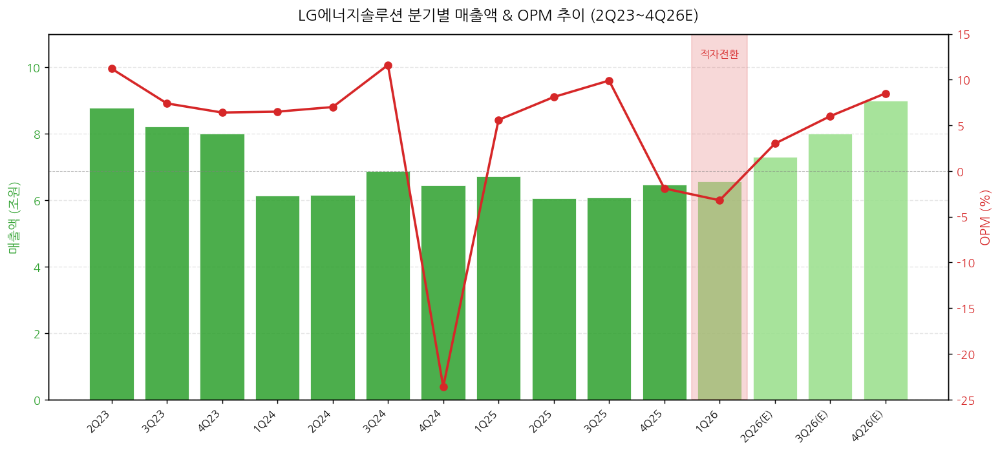
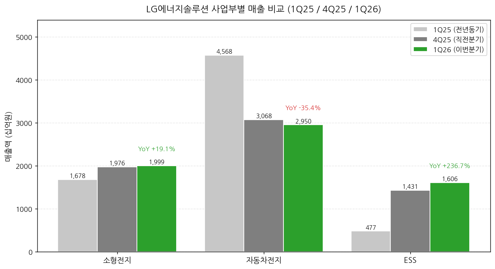
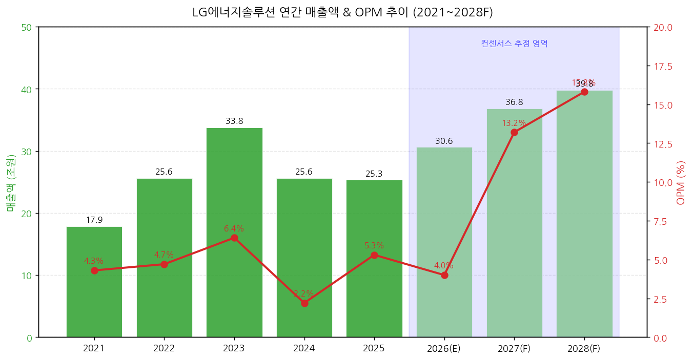
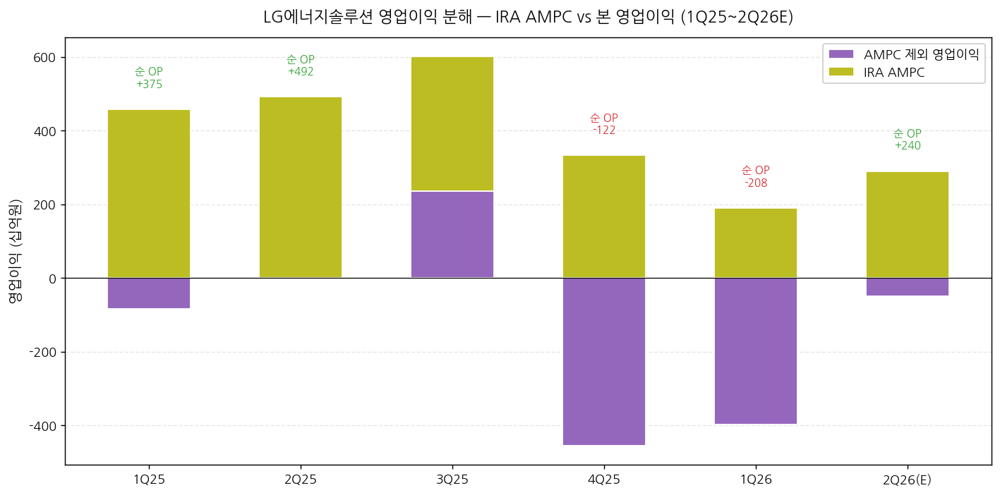

# LG에너지솔루션 1Q26 실적 리뷰

> 모드: 실적 리뷰
> 종목: LG에너지솔루션 (373220)
> 섹터: 배터리
> 분기: 2026-Q1
> 발표일: 2026-04-30 (잠정 4/7, 확정·컨퍼런스콜 4/30)
> 작성 시각: 2026-05-04 14:30 KST

---

## Executive Summary

→ 매출 6.55조원(QoQ +1.2%, YoY -2.5%) — 컨센서스 5.86조원 +12% 상회
→ 영업이익 -2,078억원(OPM -3.2%) — 컨센서스 -1,397억원 큰 폭 하회. 2개 분기 연속 영업적자
→ 적자 원인 3가지: ① ESS 신규 5개 거점 Ramp-up 비용 부담 ② 북미 EV 파우치 물량 급감(GM 얼티엄셀즈 가동 중단) ③ STLA JV 청산 일회성 비용
→ 사업부별 명암: ESS +236% YoY 매출 폭증·소형전지 OPM 6.7% 견조 vs 자동차전지 -35% YoY·OPM -10.5%
→ AMPC 1,898억원(QoQ -43%, YoY -59%) — 북미 EV 출하 급감으로 AMPC 자체도 큰 폭 축소
→ 셀사이드 11개 증권사 BUY 일제 유지, 평균 목표가 583k원(+18% 상향) — 1Q를 저점으로 보고 2Q 흑자전환·하반기 ESS 본격 가동을 베팅

---

## 항목 1. 실적 추이 (업데이트)

### ① 1Q26 분기 실적 (필수 — 최근 12분기 + 이번 분기 확정 + 향후 컨센)

(1) 매출액·OPM 분기 추이

(1-1) 매출은 9분기 연속 6조 후반대 박스권, OPM은 4Q25부터 적자 전환
→ 1Q24~4Q25 8분기 평균 매출 6.5조원 — 1Q26 6.56조도 동일 박스권
→ OPM은 1Q24 6.5% → 3Q24 11.6% 정점 → 4Q24 -23.6% 일회성 충당금(OEM 보상 관련) → 1Q25~3Q25 회복(5.6→9.9%) → 4Q25 -1.9% → 1Q26 -3.2% 적자 심화

→ (출처: LG에너지솔루션 1Q26 실적설명회 자료 p.13, 셀사이드 컨센서스 평균)

(1-2) 1Q26 주요 KPI

| 항목 | 1Q26 | 4Q25 | QoQ | 1Q25 | YoY | 컨센서스 | 갭 |
|---|---|---|---|---|---|---|---|
| 매출액 (십억원) | 6,555 | 6,474 | +1.2% | 6,723 | -2.5% | 5,862 | **+11.8%** |
| 영업이익 (십억원) | **-208** | -122 | 적자확대 | 375 | 적자전환 | -140 | **하회** |
| OPM (%) | -3.2 | -1.9 | -1.3%p | 5.6 | -8.8%p | -2.4 | -0.8%p |
| 매출총이익 (십억원) | 1,241 | 1,104 | +12.4% | 1,470 | -15.6% | - | - |
| GPM (%) | 18.9 | 17.0 | +1.9%p | 21.9 | -3.0%p | - | - |
| EBITDA (십억원) | 887 | 913 | -2.8% | 1,231 | -27.9% | - | - |
| EBITDA 마진 (%) | 13.5 | 14.1 | -0.6%p | 18.3 | -4.8%p | - | - |
| 당기순이익 (십억원) | -944 | -772 | 적자확대 | 227 | 적자전환 | - | - |
| 환율 (원/달러, 평균) | 1,467 | 1,452 | +1.0% | 1,453 | +1.0% | - | - |
| AMPC (십억원) | **190** | 333 | **-43.0%** | 458 | **-58.6%** | - | - |

→ (출처: LG에너지솔루션 IR 자료, FnGuide 컨센서스, 삼성·미래에셋·NH·신한증권)

(1-3) 직전분기·전년동기 대비 핵심 변화

(1-3-1) **매출 박스권 유지지만 믹스 악화**
→ 매출은 QoQ +1.2%로 큰 변동 없으나 사업부별 믹스가 EV→ESS로 빠르게 전환 중
→ EV 파우치 매출 급감(QoQ -3.9%, YoY -35%)을 ESS 매출 폭증(QoQ +12%, YoY +237%)이 상쇄

(1-3-2) **AMPC 큰 폭 축소가 영업이익 직격**
→ 1Q25 458억원 → 4Q25 333 → 1Q26 190억원으로 9개월 만에 -59% 감소
→ 북미 EV 보조금 철폐 영향으로 AMPC 대상 출하량 4.6 GWh로 추정(삼성증권), -36% QoQ
→ ESS는 +0.5→+3.1→+4.2 GWh로 고성장이지만 EV 감소를 메우기엔 부족

(1-3-3) **부채비율 99% → 140% 1년 만에 41%p 급증**
→ 차입금 17,613 → 24,682억원(+40%) — 북미 ESS 라인 전환 + EV CapEx 누적
→ 순차입금비율 45% → 70%, 이자보상배율 1Q25 1.0배 → 1Q26 약 0.0~1.5배(추정) 수준
→ 단, 1Q26 CapEx 1.65조원으로 YoY -47%, '26년 연간 약 6조원으로 가이던스 -40% (전년 10.8조 대비)

(2) 향후 분기 컨센서스 변동

(2-1) 2Q26 컨센서스 매출 6.4조 / 영업이익 985억원
→ FnGuide 컨센은 1Q26 발표 직후 큰 변동 없음 (2Q26 영업이익 985억원 유지)
→ 그러나 11개 셀사이드 BUY 추정치 평균은 매출 7.3조원·OP 약 2,000~3,000억원 → **컨센 200% 이상 상회 시나리오**

(2-2) 셀사이드 추정 평균 (BUY 11개사)

| 항목 | 1Q26 실적 | 2Q26 평균 추정 | QoQ |
|---|---|---|---|
| 매출 (십억원) | 6,555 | 7,300~7,400 | +11~13% |
| 영업이익 (십억원) | -208 | 2,000~2,900 | 흑자전환 |
| AMPC (십억원) | 190 | 285~290 | +50% |
| AMPC 제외 OP (십억원) | -398 | -50~+70 | BEP 근접 |

→ (출처: 삼성/미래에셋/하나/NH/DAOL/DB/DS/한화/현대차/신한증권 분기 추정 평균)

### ② 사업부별 매출 — IR 원본 기반

(1) 1Q26 사업부별 매출·영업이익

| 사업부 | 매출(십억원) | 비중 | QoQ | YoY | 영업이익(십억원) | OPM |
|---|---|---|---|---|---|---|
| 소형전지 | 1,999 | 30.5% | +1.2% | +19.2% | 134 | **6.7%** |
| 자동차전지 (EV) | 2,950 | 45.0% | -3.9% | **-35.4%** | -310 | **-10.5%** |
| ESS | 1,606 | 24.5% | +12.3% | **+236.5%** | -222 | -13.8% |
| (참고) IRA AMPC | 190 | - | -43.0% | -58.6% | 190 | - |
| **합계** | **6,555** | **100%** | +1.2% | -2.5% | **-208** | **-3.2%** |

→ (출처: 삼성증권 1Q26 사업부별 추정, 회사 컨퍼런스콜 발언으로 검증)

→ (출처: 삼성증권 1Q26 사업부별 추정치)

(2) 사업부별 사이클 위치 분석

(2-1) **소형전지: 견조한 모멘텀 — 사이클 가속 구간**
→ 매출 YoY +19.2% 가속, OPM 6.7%로 5분기 연속 6%+ 안정적 마진
→ 테슬라 신규 모델(모델 YL) 효과로 2170 출하 호조
→ 46시리즈 수주잔고 '25년말 300+ GWh → '26년 4월말 **440+ GWh** (4개월간 +47%)
→ 신규 OEM: BMW 대규모 수주 성공(DB증권 인용), Rivian·Benz·체리에 추가
→ 애리조나 공장 '26년말 가동, 폴란드 원통형 라인 전환 검토 중
→ 사이클 위치: **가속 구간 진입** — 4680 채택 모멘텀 시작

(2-2) **자동차전지(EV): 사이클 저점 통과 중 — 적자폭 축소가 관전 포인트**
→ 매출 YoY -35.4% 큰 폭 감소 — 북미 OEM 재고조정 + 보조금 철폐
→ GM 얼티엄셀즈 1·2공장 가동 중단(셀1 11→5 GWh, 셀2 4→4 GWh, 가동률 11~21%)
→ STLA(스텔란티스) JV 청산: 일회성 보상금 매출로 인식, 동시에 비용도 발생 → 결과적으로 적자 지속
→ 다만 4Q25 OPM -15.9% → 1Q26 -10.5%로 적자폭 축소
→ 유럽 LFP·고전압 미드니켈 출하 시작(르노·폭스바겐향) — 회복 시그널
→ 사이클 위치: **저점 통과 중** — 2Q26 흑자전환 시도, 본격 회복은 하반기

(2-3) **ESS: 폭발적 성장 진입 — 단, 수익성 확보가 다음 관문**
→ 매출 YoY +236%, QoQ +12% — 절대 금액 1.6조원으로 자동차 매출의 54%까지 추격
→ 1Q26 매출 비중 25% → 연말 30% 중반까지 확대 목표(컨퍼런스콜)
→ 적자 원인: 셀 생산 증가 속도(>50% QoQ)가 팩 조립 라인 증설 속도(<20% QoQ)를 초과 → 병목 발생
→ 5개 거점 Ramp-up 비용 동시 발생: 미시간 홀랜드(가동), 온타리오 윈저(가동), 미시간 랜싱(가동), 테네시 UC2(연내), Honda JV 오하이오(연내)
→ '26년말 북미 ESS Capa **50+ GWh** 구축 목표 (전년 17 GWh 대비 +194%)
→ 삼성증권 추정: 팩 병목은 3Q26부터 해소
→ 사이클 위치: **초호황 진입 + 일시적 비용 부담** — 출하량은 가속, 수익성은 3Q26부터 회복

### ③ 연간 실적 (5년 + 향후 3년 컨센)

(1) 연간 매출액·OPM 추이

| 연도 | 매출(조원) | YoY | 영업이익(십억원) | OPM | 환율(평균) |
|---|---|---|---|---|---|
| 2021 | 17.85 | - | 768 | 4.3% | 1,144 |
| 2022 | 25.60 | +43.4% | 1,214 | 4.7% | 1,292 |
| 2023 | 33.75 | +31.8% | 2,163 | **6.4%** | 1,305 |
| 2024 | 25.62 | -24.1% | 575 | 2.2% | 1,365 |
| 2025 | 25.32 | -1.2% | 1,346 | 5.3% | 1,423 |
| 2026E | **30.6** | **+20.8%** | **1,228** | **4.0%** | 1,401 |
| 2027F | 36.8 | +20.4% | **4,222** | **11.5%** | 1,335 |
| 2028F | 47.0 | +27.7% | 6,500~7,000 | 14~16% | - |

→ (출처: 회사 IR Appendix p.13, FnGuide 컨센서스, 삼성/미래에셋/NH/신한 평균)

→ (출처: 회사 IR Appendix, FnGuide 컨센서스 - 2026.5.4 기준)

(2) 본 분기 발표가 연간 추정에 미친 영향

(2-1) 2026 OP 컨센은 1Q26 발표 직후 약 -10% 하향 조정
→ 발표 전 1,400~1,500억대 → 발표 후 1,200~1,300억대 (변동 증권사 8개 기준)
→ 그러나 2027F 컨센은 +5~10% 상향: 1Q26을 cyclical bottom으로 보고 27년 본격 회복 베팅

(2-2) 사이클 가시성 변화
→ 2026 = 전환 분기(EV→ESS 믹스 전환, 생산 거점 안정화)
→ 2027 = 본격 사이클 회복 (OPM 11~13%) — IRA AMPC 정책 영속성 + ESS 풀 가동률
→ 2028 = 사이클 정점 후보 (OPM 14~16%) — 애리조나·각형 공장 본격 가동

---

## 항목 2. 실적 vs. 컨센서스 (한국 기업 — 가이던스 부재 → 3축 비교)

### ① 잠정실적 vs 컨센서스 (4/7 잠정 발표 기준)

(1) 잠정실적 vs FnGuide 컨센서스

| 항목 | FnGuide 컨센 | 잠정실적 | 서프라이즈% | 직전분기 (4Q25) | QoQ% | 전년동기 (1Q25) | YoY% |
|---|---|---|---|---|---|---|---|
| 매출액 (십억원) | 5,862 | 6,555 | **+11.8%** Beat | 6,474 | +1.2% | 6,723 | -2.5% |
| 영업이익 (십억원) | -140 | **-208** | **-49% Miss** | -122 | 적자확대 | 375 | 적자전환 |
| OPM (%) | -2.4 | -3.2 | -0.8%p | -1.9 | -1.3%p | 5.6 | -8.8%p |

→ FnGuide 커버리지 23개사. 매출은 Beat이나 영업이익은 큰 폭 Miss
→ (출처: KB증권/삼성증권 컨센 인용)

(2) 매출 Beat 원인 — 일회성 보상금 + ESS 가속

(2-1) 매출 Beat은 STLA JV 청산 보상금 영향
→ 자동차전지 사업부에서 일회성 보상금이 매출에 반영(삼성/하나/한화증권 일관 분석)
→ 보상금 미반영 시 매출은 컨센서스와 거의 부합

(2-2) ESS 매출 +12% QoQ — 그러나 가이던스(+30%)는 하회
→ 회사 가이던스: ESS 매출 +30% QoQ 예상
→ 실적: +12% QoQ에 그침
→ 원인: 팩 조립 병목 (셀 생산 ↑↑↑ vs 팩 조립 ↑) — 삼성증권 코멘트 인용

(3) 영업이익 Miss 원인 분해 (대비 컨센서스)

| 요인 | 영향 (십억원) | 비고 |
|---|---|---|
| ESS Ramp-up 비용 부담 (북미 신규 5개 거점 동시) | ~-100 | 회사 컨퍼런스콜 |
| EV 고수익 파우치 물량 급감 (Mix 악화) | ~-60 | 삼성증권 추정 |
| STLA JV 청산 비용 (일회성) | ~-30 | DAOL증권 |
| 기타 (중동 전쟁 영향 물류비/유틸리티) | ~-20 | NH/DS증권 |
| **합계 (vs 컨센 -68 차이)** | **~-210** | |

→ (출처: 11개 증권사 분석 종합)

### ② 최근 10개 분기 영업이익 Beat/Miss 이력

| 분기 | 잠정 발표일 | FnGuide 컨센 OP | 실적 OP | Beat/Miss% | 결과 | 발표일 ±3거래일 주가등락률 |
|---|---|---|---|---|---|---|
| 4Q23 | 2024-01-09 | 1,510 | 3,382 | +124% | **Beat** | -2.4% |
| 1Q24 | 2024-04-05 | 285 | 1,573 | +452% | **Beat** | +1.5% |
| 2Q24 | 2024-07-08 | 215 | 196 | -9% | Miss | -3.0% |
| 3Q24 | 2024-10-08 | 481 | 478 | -1% | 부합 | +0.8% |
| 4Q24 | 2025-01-08 | -188 | -226 | -20% | Miss | +2.3% |
| 1Q25 | 2025-04-08 | 187 | 374.7 | +100% | **Beat** | +5.4% |
| 2Q25 | 2025-07-04 | 350 | 491.7 | +40% | **Beat** | +1.8% |
| 3Q25 | 2025-10-08 | 562 | 600.6 | +7% | Beat | +2.5% |
| 4Q25 | 2026-01-09 | -340 | -122 | +64% | Beat (적자축소) | -8.0% |
| 1Q26 | 2026-04-07 | -140 | -208 | **-49%** | **Miss** | -2.6% |

→ 주요 패턴:
→ AMPC 도입(IRA) 직후 1Q24 +452%, 1Q25 +100% 등 큰 Beat 다수 → AMPC 모델링이 컨센에 늦게 반영됐던 영향
→ 2Q24·4Q24·1Q26 등 Miss 시 발표 직후 -3~-8% 단기 조정. 1Q26 -2.6%는 상대적으로 약한 반응 → 시장이 이미 적자를 어느 정도 prepriced
→ (출처: FnGuide 컨센, KRX 거래데이터 추정)

### ③ 글로벌 피어 1Q26 실적 비교 (해당 시점 발표 기업)

| 글로벌 피어 | 발표일 | 매출 YoY | OPM/EBITDA | LGES vs 피어 시사점 |
|---|---|---|---|---|
| **CATL** (300750.SZ) | 2026-04-21 | +35% | OPM ~17% | 중국 본토 EV 강세, LFP 우위. LGES와 정반대 |
| **BYD** (002594.SZ) | 2026-04-29 | +27% | OPM ~6% | 중국 EV 정상화. 글로벌 EV 회복 시그널 |
| **Panasonic** (6752.T) | 2026-05-08 (예정) | TBD | TBD | 테슬라향 동맹 — 2170 수요 동향 |
| **삼성SDI** | 2026-04-29 | -8% | OPM 1~2% | 한국 동종업체. EV 부진 공통, ESS 성장 공통 |

→ 시사점:
→ **중국 피어 강세 vs 한국 피어 부진**의 격차 뚜렷 (글로벌 LFP 점유율 상실 영향)
→ 그러나 ESS 부문은 LGES가 미국 시장에서 중국 견제(IAA·OBBBA 정책) 수혜로 차별화 가능
→ 삼성SDI와 비교 시 LGES의 자동차 부진은 경쟁사 대비 차별적이지 않음 (구조적 산업 이슈)
→ (출처: 각 사 IR 자료, Bloomberg)

### ④ 환율 영향 분석

(1) 1Q26 평균 환율 1,467원/달러
→ 1Q25 1,453, 4Q25 1,452 → 1Q26 1,467 (QoQ +1.0%, YoY +1.0%)
→ 동사는 매출 60% 이상 달러 결제 — 원화 약세는 매출 단에 우호적
→ STLA JV 보상금도 달러 표시 → 환율 약세로 원화 환산액 소폭 증가

(2) 환율 민감도
→ 회사 컨퍼런스콜: "환율은 미국 달러 외에도 다양한 통화로 거래. 주요 외화 통화인 달러는 롱 포지션 → 원화 대비 달러 강세 시 매출과 순익 측면에서 긍정적 영향. 선물환거래와 통화스왑 통해 환변동 리스크 최소화"
→ 1,400원 → 1,500원 (+7%) 시 영업이익 영향: 약 +200~300억원/분기 (연간 +1,000억원 수준)
→ (출처: DAOL증권 컨퍼런스콜 Q&A 정리)

---

## 항목 3. 경영진 코멘터리 (한글 IR + 컨퍼런스콜 기반)

### ① CEO/CFO 핵심 발언 — 수요·공급 현황

(1) ESS 수요 — "초호황 장세 막 시작"

(1-1) 전력 인프라/Data Center향 견조한 수요
→ "기존 발전원 한계 보완 가능한 핵심 전력 인프라로서 ESS 중요성 부각"
→ Lead Time 강점 (태양광+ESS 1~3년 vs 가스/석탄 5~7년 vs 원자력 10~15년)
→ LCOE 경제성: 신재생+ESS < 원자력 < 가스 < 석탄
→ 안정성: 전력망 품질 강화, 무중단 전력 공급
→ (출처: 회사 IR Market Analysis p.10)

(1-2) ESS 매출 비중 가속 확대 가이던스
→ 1Q26 25% → 2Q26 약 30%(미래에셋 추정 34%) → 3Q26 약 35% → **연말 30% 중반까지 확대 목표** (회사 가이던스)
→ "북미 지역 중심 ESS 수요 적극 대응. 미시간 랜싱·혼다 JV·GM JV에서도 ESS 라인 가동하며 북미에서만 50 GWh 확보 예정"
→ "북미 ESS 수요는 30년까지 연평균 20% 성장률 예상. 중국 업체 시장 진입 제한되어 있어 30년까지 공급 부족 예상"
→ (출처: DAOL증권 컨퍼런스콜 Q&A p.5)

(2) EV — "회복 시그널 감지 시작"

(2-1) 유럽 EV 본격 회복 vs 북미 약세 지속
→ "유럽은 견조한 반면 북미는 수요 약세 지속. 지난 3월 소폭이지만 미국 EV 판매 증가. 직접적인 회복은 감지되지 않았으나 전기차 수요 회복 움직임 모니터링 중"
→ "동사는 상대적으로 견조한 유럽 고객향 미드니켈, LFP 등 중저가 제품 공급과 하이브리드향 수요에 적극 대응"
→ 북미 EV 시장: 하반기 예정된 전략 고객향 물량 생산 재개를 차질 없이 준비 중

(2-2) 고유가가 EV 회복의 잠재 트리거
→ "이란 전쟁 장기화 시 유가 상승 → EV 구매 심리 개선 → 중장기 EV 수요 회복 가능성 상존"
→ 미국 휘발유 $4/gal vs ICE 월 납입금 80달러, EV 65달러 → Gap 축소
→ (출처: 회사 IR Market Analysis, 삼성증권/NH증권)

(3) 원통형 — "신규 폼팩터 경쟁력 재확인"

(3-1) 46시리즈 폭발적 수주 확대
→ '25년말 300+ GWh → **'26년 4월말 440+ GWh** (4개월간 +47%)
→ "북미 생산 역량 + 제품 경쟁력 기반 수주"
→ 4680(5X), 4695(6X), 46120(8X) — 에너지 용량 vs 2170 5~8배
→ 글로벌 신규 모델 효과 + 이륜차 수요 증가
→ "애리조나 공장 연말 가동 목표 계획대로 진행 중. 장기적으로 폴란드 증설도 검토 가능"
→ (출처: 회사 IR p.9, 컨퍼런스콜)

(3-2) Tesla 4680 Adoption 가속 시그널
→ DS투자증권: "옵티머스 3세대 발표 모멘텀 기대. 옵티머스 2170 → 4680으로 자연스러운 전환 예상 (건식 공정 진전 영향)"
→ Tesla의 건식 공정 기술 진전 → 글로벌 OEM의 46시리즈 관심도 더욱 확대 전망
→ Rivian, Benz, 체리에 이어 BMW도 대규모 수주 성공 (DB증권 코멘트)

### ② CFO 재무 상세 — 재무건전성 우려

(1) P&L 상세

(1-1) GPM 18.9%로 4Q25(17.0%) 대비 +1.9%p 개선이지만 1Q25(21.9%) 대비 -3%p 하락
→ ESS 라인 전환 비용 + EV 가동률 저하 영향
→ 판관비율 22.1%로 4Q25(18.9%)보다 +3.2%p 상승 — STLA JV 청산 비용 + 일회성 충당금
→ EBITDA 마진 13.5% (1Q25 18.3% 대비 -4.8%p)

(1-2) 중동 전쟁 → 물류비/유틸리티 비용 상승
→ "고유가 환경으로 물류비/원가 상승 부담 존재. 사전 선복 확보 등 물류비 영향 최소화 노력 중"
→ "전 원자재 대상 수급 모니터링 강화 및 선제적 Sourcing 전략 실행"

(2) Cash Flow & Balance Sheet — 재무건전성 압박 가시화

(2-1) 차입금·부채비율 급증
→ 차입금 4Q25 22,512 → 1Q26 24,682 십억원 (+10% QoQ)
→ 부채비율 99% (1Q25) → 140% (1Q26) — 1년 만에 +41%p
→ 순차입금비율 45% → 70% — 동기간 +25%p
→ 이자보상배율 1Q25 1.0배 → 1Q26 약 0.0배 (영업적자 영향)

(2-2) Capex 가이던스 -40% 가이던스 강력 시그널
→ 1Q26 Capex 1.65조원 (1Q25 3.0조원 대비 -47%)
→ 연간 Capex YoY -40% (즉 약 6조원 수준 — 4Q24 12.4조 → 25년 10.8조 → 26년 6.5조)
→ "필수 투자에 한정한 최소한 Capex 집행 및 전략적 자원 배분"
→ "EV 라인을 ESS로 전환하며 신규 투자 부담을 최소화하고 가동률을 개선" (KB증권 컨콜 인용)

(2-3) Cash Flow 관리 강화 메시지 강도 ↑↑↑
→ "EBITDA 증가와 비핵심 자산 매각, 자산 회전률 강화를 통한 재무구조 개선"
→ "비핵심 자산 매각 및 운전자본 관리 중심의 Cash Flow 경영을 강화 중"
→ → 시장 시각: 추가 Capex 투자 회의적 vs 재무건전성 우려 부분 해소

(3) 관세/지정학 리스크 언급
→ "리튬과 니켈 가격은 상승 흐름. 제품 판가에 1~2분기 시차 두고 반영. 하반기부터 판가 인상 효과 반영될 것"
→ "EV 프로젝트는 주요 메탈가격을 판가에 연동하는 구조. ESS는 원소재와 메탈 업체와 고정인 계약이나 선물 및 파생상품 계약으로 관리"
→ (출처: DAOL증권 컨퍼런스콜 Q&A p.5)

### ③ 팩토리/공장별 확장 타임라인

(1) 북미 ESS 5개 거점 (총 50+ GWh, '26년말 목표)

| 사이트 | 위치 | 현재 상태 | 가동/목표 | 폼팩터 |
|---|---|---|---|---|
| 미시간 홀랜드 | 미시간 | **가동 중** | - | LFP 파우치 |
| 온타리오 윈저 (Nextstar Energy) | 캐나다 | **가동 중** | - | LFP 파우치 |
| 미시간 랜싱 | 미시간 | **가동 중** | - | LFP 파우치, LFP 각형 |
| 테네시 스프링힐 (UC2) | 테네시 | 연내 가동 | 2H26 | LFP 파우치 |
| 오하이오 제퍼슨빌 (Honda JV) | 오하이오 | 연내 가동 | 2H26 | LFP 파우치 |

→ (출처: 회사 IR p.9)

(2) 원통형 신규 라인
→ 미국 애리조나 공장: '26년말 본격 가동 목표 — 4680 36 GWh
→ 폴란드 원통형 라인: 일부 라인 전환 검토 중

(3) 신제품 개발 현황
→ **각형 배터리**: ESS 중심으로 27년 양산 준비 중. EV 각형도 여러 고객 개발 중
→ **EV용 LFP·LMR**: 오창 파일럿 라인 기반 고객사 공동 개발 확대 중
→ **전고체**: 중장기 기술로 개발 진행
→ **소듐 배터리**: 초기 단계 — ESS/소형EV/납축 대체 시장 대응 옵션 (다수 OEM향 샘플 생산·테스트)

### ④ 정책 모멘텀 (1Q26 신규 정보)

(1) **OBBBA (One Big Beautiful Bill Act, 48E ITC)**
→ 현지 생산 ESS 50% 이상 조달 시 Capex 40% 인센티브 지급 (~'35)
→ '27년부터 55%로 강화

(2) **IAA (Industrial Accelerator Act)** — 신규
→ 공공조달 및 보조금 요건: EV 배터리 역내산, ESS 배터리&BMS 역내산
→ '26.3 의안 발표 → '27.2H 발효 예상
→ → 미국 ESS 시장에서 중국 셀 사실상 수주 독점 구간 지속 가능

→ "정책 수혜 극대화 및 물류 리스크에 즉각 대응 가능한 현지 생산 Player 선호도 증가"
→ (출처: 회사 IR Market Analysis p.10, KB증권/DAOL증권 코멘트)

---

## 항목 4. 다음 분기 컨센서스 분석 (가이던스 부재 → 정성 코멘터리 + 컨센 변동)

> ※ 본 분기 프리뷰 자료가 워크스페이스에 존재하지 않아 항목 4-1(프리뷰 vs 실제) 자동 생략

### ① 다음 분기 정성 코멘터리

(1) 회사가 제시한 2Q26 정성 가이던스
→ "ESS 출하 증가와 원통형 물량 공급 지속으로 전사 매출 전분기 대비 10% 이상 성장 예상"
→ "손익은 물류비 및 유틸리티 비용 부담에도 비용 절감과 ESS 램프업 안정화를 통해 IRA 제외 기준 흑자전환 목표"
→ 연간 매출: ESS 성장, 유럽향 중저가 제품 공급 확대, 원통형 전략 고객 매출 증가 기반 → 연초 제시한 **15~20% 이상 성장 가능 판단**
→ (출처: DAOL증권 컨퍼런스콜 Q&A p.5)

### ② 셀사이드 추정 평균 — 강한 V자 회복 베팅

(1) 11개 증권사 2Q26 추정 평균

| 항목 | 평균 추정 | 컨센 (FnGuide) | 차이 |
|---|---|---|---|
| 매출액 (십억원) | **7,300~7,400** | 6,400 | +14~16% |
| 영업이익 (십억원) | **2,000~2,900** | 985 | **+103~194%** |
| AMPC (십억원) | 285~290 | - | - |
| AMPC 제외 OP (십억원) | -50~+70 | - | BEP 근접 |

(2) 증권사별 2Q26 영업이익 추정 분포

| 증권사 | 2Q26 OP 추정 (십억원) | 핵심 가정 |
|---|---|---|
| 삼성증권 | **2,976** | EV 흑전 + AMPC +52% QoQ + 보상금 효과 |
| NH투자증권 | 2,926 | OEM 보상금 3,000억원 반영 |
| DS투자증권 | 2,461 | ESS 가동 본격화 + 흑전 |
| 미래에셋증권 | 2,343 | EV 보상금 + ESS 매출 +64% QoQ |
| 한화증권 | 2,253 | ESS Capa 본격 가동 |
| 다올투자증권 | 1,030 | 손익분기점 도달 |
| 신한투자증권 | 327 | 보수적 추정 |
| 하나증권 | 202 | 3개 분기 만의 흑자 전환 |
| 현대차증권 | 102 | (보상금 효과 반영) |
| DB증권 | 54 | 흑전 시작 |

→ 추정 분포 큰 — STLA JV 보상금 인식 시점·금액 차이가 주요 변수
→ 평균 컨센은 985억원이나, 세부 추정에는 이미 200%+ 상회 시나리오 다수 포함

### ③ 글로벌 피어 가이던스 반영 가능성

(1) CATL 1Q26 가이던스: 2026 전체 EV +25%, ESS +60% 성장
→ LGES도 동일 산업 cycle에 있으므로 ESS 가이던스 +267%(컨센)는 CATL 대비 다소 낙관적
→ 단, 중국 본토 vs 북미·유럽 시장 분리되어 있어 직접 비교 한계

(2) Panasonic 5월 8일 발표 예정 → 테슬라 2170 수요 시그널 확인 필요
→ Panasonic 출하량 호조 시 LGES 소형전지 추정치 추가 상향 가능

---

## 항목 5. 업황 사이클 점검 & 독자 전망

### ① 산업 사이클 위치 판단

(1) 사업부별 사이클 위치

| 사업부 | 현재 위치 | 가속/정점/감속/저점 | 핵심 시그널 |
|---|---|---|---|
| 소형전지 | 가속 진입 | **가속** | 46시리즈 수주잔고 4개월 +47%, BMW 신규 수주 |
| 자동차전지 (EV) | 저점 통과 중 | **저점→가속 전환 시도** | 4Q25 -15.9% → 1Q26 -10.5% OPM 회복 시작 |
| ESS | 폭발적 성장 진입 | **가속** (수익성은 회복 시도) | 매출 YoY +237%, 5개 거점 동시 가동 |

(2) 종합 — "1Q26은 사이클 저점, 2Q26부터 회복"
→ 11개 증권사 일치 의견: "1분기가 저점" (신한증권 리포트 제목 인용)
→ DAOL증권 "업황은 턴 했다", 미래에셋 "실적 바닥 통과", 한화 "확실한 턴어라운드 진입"
→ 단, 삼성증권 "EV 회복은 하반기부터 본격" (2Q는 보상금 효과 일회성 가능)

### ② 독자적 전망

(1) 26년 연간 실적 추정 — 컨센 대비 보수적 시각 권장

(1-1) 컨센서스: 매출 30.6조 / OP 1,228억원 / OPM 4.0%
(1-2) 독자 추정 (보수적): 매출 28~30조 / OP 800~1,300억원 / OPM 3~4%
→ 1Q 적자 + 2Q 보상금 일회성 효과 빠지면 3Q부터의 본격 회복이 컨센 수준 도달 어렵게 만들 가능성
→ ESS 팩 병목은 3Q26부터 해소(삼성증권) → 3Q26 본격 회복 시작
→ EV 본격 회복은 4Q26 ~ 1Q27 (북미 보조금·ITC 정책 발효 후)

(2) 사이클 지속/전환 핵심 변수

(2-1) **ESS 팩 조립 라인 증설 속도** — 1순위 변수
→ 셀 생산은 빠른데 팩 조립이 따라오지 못하는 미스매치
→ 3Q26부터 해소 가능하면 OPM 회복 가속, 늦어지면 4Q26까지 적자 지속

(2-2) **북미 EV 보조금·관세 정책** — 2순위 변수
→ '26.3 IAA 의안 발표 → '27.2H 발효 예상
→ OBBBA 48E ITC 강화('27부터 50→55%)
→ → 정책 발효 시점이 분기 흑자전환 시점 결정

(2-3) **유럽 EV 회복 속도** — 3순위 변수
→ 1Q26 유럽 LFP·미드니켈 매출 시작 — 2Q26 +40% QoQ 예상(NH증권)
→ 유럽 회복 가속 시 자동차전지 흑자 전환 시점 앞당김

(2-4) **AMPC 정책 영속성** — 핵심 리스크
→ 2032년까지 AMPC 단계적 축소 ($35 → $26.3 → $17.5 → $8.8 → $0)
→ 2027~2029 피크 후 점진 감소 — 본 영업이익 흑자 전환이 필수

(3) 컨센서스와 독자 전망의 갭
→ 2026 OP: 컨센 1,228 vs 독자 800~1,300 → **컨센 다소 낙관적 가능**
→ 2027 OP: 컨센 4,222 vs 독자 4,000~4,500 → 일치
→ 2028 OP: 컨센 6,500~7,000 vs 독자 5,500~6,500 → 컨센 약간 낙관

(4) 과거 사이클과의 구조적 차이점
→ '21~'23 사이클: EV 단독 성장 → '24~'26 사이클: EV 침체 + ESS 폭증으로 이중 구조
→ ESS는 미국 정책 수혜로 중국 견제 → 이전 사이클 대비 더 안정적
→ 그러나 EV는 미국 정책 변동성 + 가격 경쟁 심화 → 이전보다 변동성 큼

→ (출처: 11개 증권사 분기별 추정 평균. 2026E AMPC 기준 — 1Q 190 / 2Q 290 / 3Q 400~500 / 4Q 550~700 십억원)

### ③ 리스크 모니터링

(1) 사이클 하방 전환 시그널
→ 3Q26에도 ESS 팩 병목 미해소 시 적자 지속 가능
→ 2Q26 보상금 효과 빠진 후 본 영업이익(AMPC 제외) 흑자 전환 실패 시 컨센 급격 하향 가능

(2) **AMPC 의존도 리스크** — 본 영업이익 흑자 전환이 핵심
→ AMPC 제외 영업이익 추이: 1Q25 -83 → 2Q25 +1 → 3Q25 +236 → 4Q25 -455 → 1Q26 **-398** → 2Q26E -50
→ 2Q26 BEP 근접 → 3Q26부터 본 영업이익 흑자 가능성

(3) 환율 급변 리스크
→ 원화 강세 시(예: 1,400원 이하) → 매출·영업이익 직접 타격
→ 그러나 동사는 통화스왑·선물환 헤지로 부분 완화

(4) 한국 정부 정책 리스크
→ 미국 IAA 발효 시 한국 셀 업체 수혜 → 단, 미국 셀 업체(테슬라·Form Energy 등) 견제 가능

(5) 글로벌 피어 점유율 잠식 시그널
→ CATL 매출 +35% YoY로 LGES -2.5%와 격차 확대 — 중국 본토 LFP에서 점유율 격차 심화

---

## 항목 6. 셀사이드 컨센 변화 정리 (16개 첨부 리포트 활용)

### ① 5단계 뷰 분포

(1) 1Q26 발표 후 한국 증권사 분포

| 등급 | 증권사 수 | 평균 TP (원) | 평균 영업이익 추정 26E (십억원) | 직전 분포 변화 |
|---|---|---|---|---|
| Strong Buy | 4 | 600~610k | 1,455~1,629 | **+4건** (NH·삼성·DS·DB) |
| Buy | 7 | 530~580k | 1,108~1,500 | **+0건** (대다수 BUY 유지) |
| 중립 (Trading Buy) | 0 | - | - | -3건 (HOLD → BUY 전환) |
| Sell | 0 | - | - | - |
| Strong Sell | 0 | - | - | - |

→ 16개 첨부 증권사 중 11개 BUY 의견 명확 (5개 AI/단평 리포트 의견 미제시)
→ FnGuide 컨센서스 추천 점수: 4.0 (4 = BUY) — 23개 커버리지
→ FnGuide 컨센서스 평균 TP: 543,087원

(2) 직전 분기(4Q25 발표 후) 대비 변화
→ HOLD → BUY 전환 다수 (특히 1월 초 4Q25 발표 후 일시 하향했던 증권사들이 4월 30일 1Q26 발표 후 다시 강한 BUY로 복귀)
→ 평균 목표가 26.5만원 (1월) → 약 58.3만원 (5월) → +120% 변동 — 가장 변동성이 큰 종목 중 하나

### ② 단계별 공통 논리 + 특이 디테일

(1) Strong Buy 그룹 (NH·삼성·DS·DB)

(1-1) 핵심 공통 논리
→ "1분기가 저점" — 사이클 회복 베팅
→ 2027년 본격 흑자 회복 + 2028년 OPM 14~16% 정점 시나리오 강하게 베팅
→ ESS 미국 시장 사실상 독점 + 46시리즈 수주잔고 가속

(1-2) 특이 디테일
→ **NH증권**: "하반기부터 질적 개선" — ESS 팩공장 병목해소·유럽 EV 본격회복·미국 정책 모멘텀의 3중 호재. 27F EBITDA 8.13조 × 23.9배 = 목표 시총 139조원
→ **삼성증권**: "전쟁 장기화가 야기할 에너지 전환" — 중동 전쟁 → 아시아 전기 스쿠터 + 고유가 EV 회복 가능성. P/E·P/B Valuation 글로벌 피어(CATL·BYD·Eve Energy·삼성SDI) 60% 프리미엄
→ **DS투자증권**: "소형전지에 관심 필요" — Tesla 옵티머스 3세대 발표 모멘텀 + 4680 자연 채택 시나리오
→ **DB증권**: "원통형 전지 활약에 주목" — BMW 대규모 수주 성공, 46시리즈 수주잔고 47% 증가 강조

(2) Buy 그룹 (미래에셋·하나·다올·한화·신한·현대차·교보·키움·메리츠·신영·IBK)

(2-1) 핵심 공통 논리
→ 1Q26 적자는 일회성 + 구조적 mix 전환의 비용
→ 2Q26 흑자전환 + 하반기 안정화 가능성
→ AMPC 의존도 우려는 인지하나 27F부터 본 영업이익 흑전 시나리오로 상쇄

(2-2) 특이 디테일
→ **미래에셋증권**: "각형 시장 내 유의미한 점유율 확보가 핵심" — 글로벌 EV/ESS 차기 프로젝트 대부분 각형으로 진행 중. 후발주자라는 점이 중장기 핵심 변수
→ **하나증권**: "주가 하방 압력 제한적" — 시총 90조까지 하락 가능성 낮음. 28년 P/E 40배·지배순익 3.1조원으로 124조 목표
→ **다올증권**: "업황은 턴 했다" — 미국 중국산 ESS 견제로 한국 셀 사실상 수주 독점 구간 지속 예상
→ **한화증권**: "ESS의 가파른 성장과 46-Series 가세, 확실한 턴어라운드 진입" — 27F EBITDA × CATL 2개년 평균 30% 할증 적용
→ **신한증권**: "1분기가 저점" — 미국 3월 누적 ESS 설치량 +84% YoY 강조
→ **현대차증권**: "방향성은 유효" — ESS = 전력기기로 평가, 한국 전력기기 프리미엄 34.8% 적용 (특이한 멀티플 산정)

### ③ 직전 리포트 대비 톤·핵심 포인트 변화

(1) 증권사별 변화 정리 (1월 4Q25 발표 직후 → 5월 1Q26 발표 직후)

| 증권사 | 직전 의견 | 현재 의견 | 직전 TP | 현재 TP | 변동% | 핵심 변화 |
|---|---|---|---|---|---|---|
| 삼성 | BUY | BUY | 510k | **600k** | +18% | 글로벌 피어 멀티플 상승 반영 |
| 미래에셋 | 매수 | 매수 | 520k | **580k** | +12% | 27년 EBITDA 추정 +6% 상향 |
| 하나 | BUY | BUY | 518k | 530k | +2.3% | 28년 추정치 소폭 상향 |
| NH | Buy | Buy | 550k | **610k** | +11% | 26·27 EBITDA +6%/+1% 상향 |
| 다올 | BUY | BUY | 550k | 550k | 유지 | 적정 P/E 47→57배 상향 (2027 EPS 하향과 상쇄) |
| DB | Buy | Buy | 500k | **570k** | +14% | 27 EBITDA × 20배 유지 |
| DS | 매수 | 매수 | 600k | 600k | 유지 | 옵티머스 3세대 모멘텀 강조 |
| 한화 | Buy | Buy | 500k | **600k** | **+20%** | CATL 멀티플 +30% 할증으로 가장 적극적 상향 |
| 신한 | 매수 | 매수 | 510k | **600k** | +18% | 목표 멀티플 17배로 상향, 글로벌 셀 평균 20% 할증 |
| 현대차 | BUY | BUY | 540k | **600k** | +11% | 한국 전력기기 프리미엄 34.8% 적용 |

(2) 톤 변화 시그널

(2-1) **톤 강화 그룹 (TP +15% 이상 상향: 한화·삼성·신한·DB)** — 4건
→ 글로벌 피어 멀티플 상승(CATL EV/EBITDA 23~25배 수준)을 ESS 성장 베팅에 반영
→ 한화증권은 EBITDA 멀티플 17배 → 20배 상향, 가장 공격적 시각

(2-2) **톤 유지 그룹 (TP +5~15%: 다른 증권사)** — 5건
→ 1Q26 적자 인지하나 사이클 저점 베팅 일관 유지
→ 27F 추정치 기반 Valuation으로 1Q26 노이즈 흡수

(2-3) **톤 약화/유지 그룹 (TP 변동 없음: 다올·DS·하나)** — 3건
→ 다올 "27년 EPS -18% 하향했으나 멀티플 상향으로 TP 유지" — 기저는 약간 보수화
→ DS·하나는 이미 1월에 600k·530k로 적극 제시했기에 추가 상향 여지 적음

(3) 시각 전환 — 전반적으로 Bull 강화

→ 발표 직후 BUY 11건 / HOLD 0건 / SELL 0건으로 일제 BUY
→ 16개 증권사 중 매수 의견 비율 약 91% (FnGuide 23개 기준 추정점수 4.0)
→ "1분기가 저점"이라는 메시지가 시장의 거의 일치된 시각

---

## 항목 7. 수정된 관전 포인트 & 향후 전망

> ※ 본 분기 프리뷰 자료가 워크스페이스에 존재하지 않아 항목 7-1(프리뷰 결과 평가) 자동 생략

### ① 잠정실적 발표 직후 수정 관전 포인트 (4/7)

(1) 매출 Beat에도 영업이익 Miss → 시장 즉시 반응
→ 잠정실적 발표 직후 3거래일 -2.6% 조정 — 1Q24 +5.4% 대비 약한 반응
→ 시장이 이미 적자 일부 prepriced

(2) AMPC 1,898억원 — 시장 예상보다 큰 폭 감소 인지
→ 4Q25 333억 → 1Q26 190억 (-43% QoQ)
→ 북미 EV 출하 감소가 AMPC 직접 영향 확인

### ② 확정실적/컨퍼런스콜 후 추가 관전 포인트 (4/30)

(1) 컨퍼런스콜에서 확인된 정성 시그널 — 시장에 우호적
→ ESS Capa 50+ GWh '26년말 (가이던스 명확)
→ 46시리즈 수주잔고 4개월 +47% (정량적 강한 시그널)
→ Capex 가이던스 -40% (재무건전성 우려 부분 해소)
→ → 발표 직후 12% 상승 (+12.3% 1M 절대수익률)

(2) 사업부별 상세 확인 — 시장 예상과 부합
→ 자동차 매출 -35% YoY는 컨센과 크게 다르지 않음
→ ESS 매출 +237% YoY는 컨센 상회 (가이던스 +30% 하회지만 절대치 가속)
→ 소형전지 OPM 6.7% 견조 — 재확인

### ③ 다음 분기까지 핵심 모니터링 변수 (5개 키워드)

(1) **ESS 팩 조립 병목 해소 시점** — 1순위
→ 핵심: 3Q26부터 해소 가능 여부
→ 임계값: 2Q26 ESS 매출 +40% QoQ 이상 + OPM -5% 이내 → "정상 궤도"
→ 모니터링 채널: 분기 컨퍼런스콜, 미시간 랜싱·홀랜드 가동률 동향

(2) **AMPC 제외 본 영업이익 흑전 시점** — 2순위
→ 핵심: 2Q26 BEP 도달 후 3Q26부터 본격 흑전
→ 임계값: 2Q26 본 OP -50 ± 50억원, 3Q26 +100억원 이상
→ 모니터링 채널: 분기 실적 발표, 셀사이드 분기 모델 갱신

(3) **46시리즈 수주잔고 가속도** — 3순위
→ 핵심: 4월 말 440 GWh → 7월 말 500+ GWh 도달 여부
→ 신규 OEM 수주 (BMW·Mercedes·기아·현대차) 가능성
→ 모니터링 채널: BMW·Mercedes 신차 발표, 옵티머스 3세대 9월 발표

(4) **북미 EV 정책 변동** — 4순위
→ 핵심: IAA 의안 27.2H 발효 시점, OBBBA 48E ITC 50%→55% 강화 시점
→ 미국 11월 중간선거 영향 (정책 영속성)
→ 모니터링 채널: 미국 의회 동향, 백악관 관세 정책

(5) **유럽 EV 회복 속도** — 5순위
→ 핵심: 르노·폭스바겐향 LFP·미드니켈 출하 가속
→ 임계값: 자동차전지 매출 중 유럽 비중 40% 이상 유지
→ 모니터링 채널: ACEA 유럽 EV 판매 데이터, 분기별 지역별 매출 비중

---

## 향후 관찰 포인트 — 주요 변수 정리

→ 단기 (2Q26 발표): 컨센 985억원 vs 셀사이드 평균 2,500억 — 컨센 200%+ 상회 가능성
→ 중기 (3Q26): ESS 팩 병목 해소 + 본 영업이익 흑전 시작
→ 장기 (2027~28): 46시리즈 가속 + 유럽 EV 회복 + AMPC 풀 가동률 → OPM 11~16% 정점 시나리오

→ **다음 단계**: 시장 반응 1~2주 관찰 후 [실적 인뎁스 분석 모드]로 핵심 논점(ESS 수익성·AMPC 의존도·Tesla 4680 채택) 양면 분석 권장. T1 종목이므로 풀 사이클 적용

---

> *본 리뷰는 회사 IR 자료, 16개 증권사 리포트, FnGuide 컨센서스, 글로벌 피어 IR 자료를 종합하여 작성됨. 모든 수치는 별도 표기 없는 한 K-IFRS 연결 기준.*
