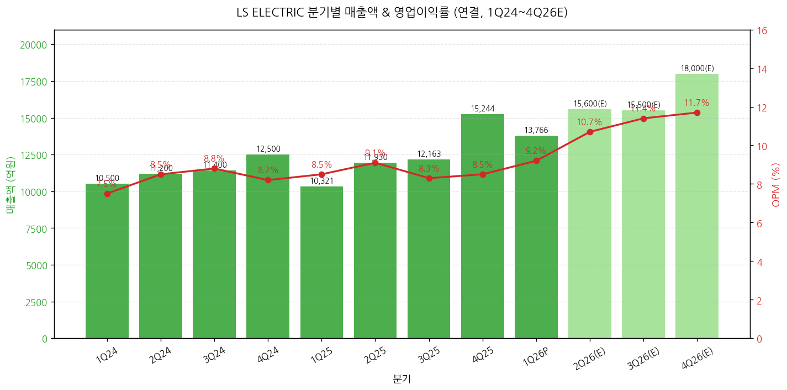
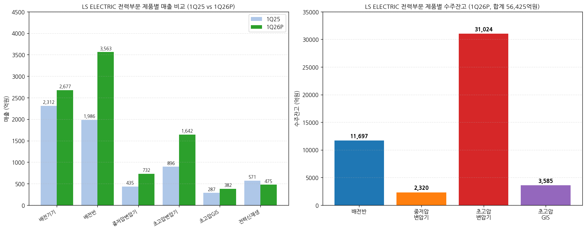
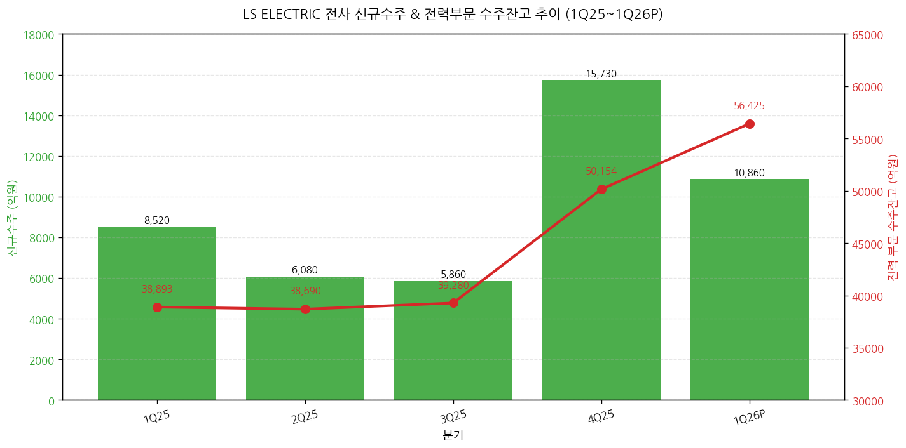
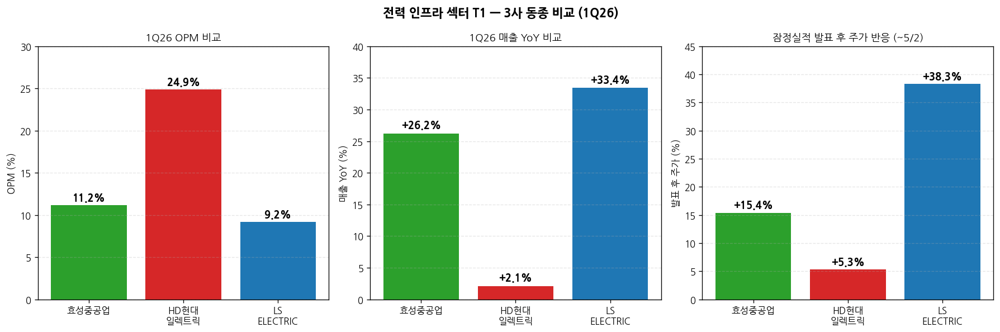
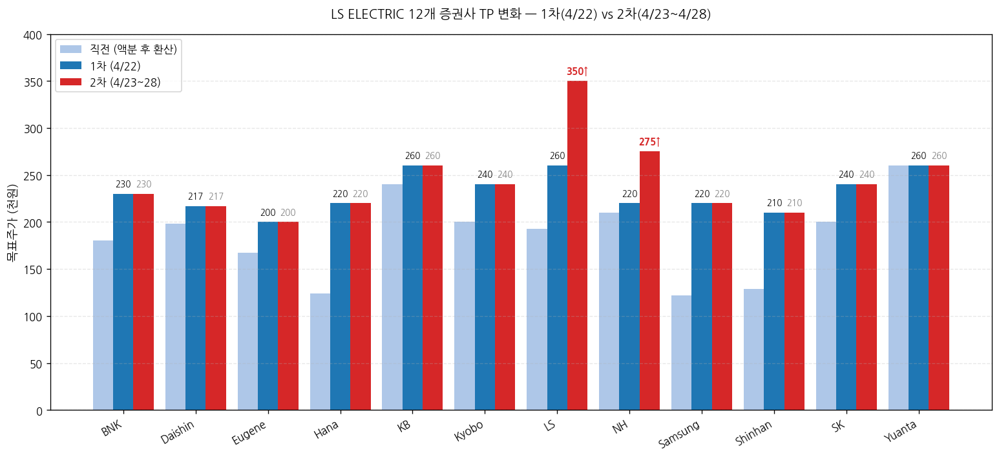

> 모드: 실적 리뷰
> 종목: LS ELECTRIC (010120.KS)
> 섹터: 전력 인프라
> 분기: 2026-Q1 (1Q26 잠정실적, 분기 종료 2026-03-31)
> 발표일: 2026-04-21 (월) 잠정실적 + IR 자료 + 컨퍼런스콜 (1차 셀사이드 4/22, 2차 셀사이드 4/23·4/27·4/28)
> 작성 시각: 2026-05-03 18:30 KST

# LS ELECTRIC 1Q26 실적 리뷰 (잠정실적 + 1차 → 2차 셀사이드 진화 통합)

> 안내: 표준 위치(`earnings-preview/`)에 동일 분기 LS ELECTRIC 프리뷰 미존재 → 항목 4-1·7-1 자동 생략. 동일 폴더 동종 피어 리뷰 2건 자동 활용 — `2026-Q1_효성중공업_리뷰.md` + `2026-Q1_HD현대일렉트릭_리뷰.md` cross-reference 포함.
> **주요 분석 특이점**: 4/22 1차 셀사이드 12개 → 4/23·4/27·4/28 2차 셀사이드 4개 발행 패턴이 분명함. 항목 6에 **1차 → 2차 narrative 진화 분석** 별도 추가.

## Executive Summary

→ **컨센 -5.0% Miss이나 일회성 100억원 중후반 성과급 제외 시 실질 OPM 10%+** — 매출 1조 3,766억원(+33.4% YoY, -9.7% QoQ), 영업이익 1,266억원(+45.0% YoY, -2.4% QoQ, OPM 9.2%) vs 컨센 매출 1조 3,400억 / OPI 1,332억. **3년 전 도입한 주가 연계 장기 성과급 (25년 폐지·재발 가능성 부재)** 100~150억원 일회성 인건비가 전력기기 부문 집중 반영. 제외 시 실질 OPI 약 1,400억원·OPM 10.2%로 **컨센 +5% Beat**. 12개 증권사 모두 "사실상 부합" 평가.
→ **매출 +33.4% YoY는 동종 3사 중 최대** — 효성중공업 +26.2%, HD현대일렉트릭 +2.1% 대비. 단, OPM 절대값은 9.2%로 가장 낮음 (효성 11.2%, HD 24.9%). 사업부 mix 차이 — LS는 자동화 + 자회사 비중 22%로 OPM 희석 효과
→ **신규수주 1조 863억원 (+27% YoY) — 단일 분기 사상 최대 아님** (효성 4.2조 / HD 2.6조와 대비), 그러나 **수주 구조의 질적 변화가 진정한 헤드라인** — 단발성 → 중기 고정 계약(LTA), 단품 → 패키지 (배전반+변압기+배전기기), 단납기 (3-6개월) 구조로 매출 회전 빠름. 4월 추가 수주 1,700억 (빅테크 A사) + 1,066억 (LS파워솔루션 빅테크) 발생 = 사실상 4월 누적 1.4조원 = 1Q26 신규수주 +30%
→ **12개 증권사 만장일치 매수 + 평균 TP 1차 232,000원 → 2차 245,000원 (+30~35% 추가 상향)** — 1차(4/22): TP 200~260만원 (Yuanta·LS·KB·Kyobo가 240~260 최상단). **4/27 NH 220→275 (+25% 추가 상향) + 4/28 LS 260→350 (+35% 추가 상향)** = **2차 라운드에서 narrative가 "일회성 노이즈 제거 시 컨센 부합" → "구조적 성장 가속, multi-year 슈퍼사이클" 로 전환**.
→ **시장 반응이 3사 중 가장 강함 — 4/22~5/2 +38.3%** (효성 +15.4%, HD +5.3% 대비 압도적). 4/21 종가 184,700 → 4/27 종가 255,500원. 자회사 LS파워솔루션 인수(2024) + 청주공장 + 부산공장 + 미국 유타·텍사스 공장 등 **공격적 증설**이 narrative 강도 견인.

---

## 항목 1. 실적 추이 (업데이트)

① 분기 실적 (12분기: 확정 8 + 잠정 1 + 컨센 3)

(1) 손익 핵심 지표 (단위: 억원, %)

| 항목 | 1Q24 | 2Q24 | 3Q24 | 4Q24 | 1Q25 | 2Q25 | 3Q25 | 4Q25 | **1Q26P** | 2Q26(E) | 3Q26(E) | 4Q26(E) |
|---|---|---|---|---|---|---|---|---|---|---|---|---|
| 매출액 | 약 10,500 | 약 11,200 | 약 11,400 | 약 12,500 | 10,321 | 11,930 | 12,163 | 15,244 | **13,766** | 약 15,650 | 약 15,500 | 약 18,000 |
| YoY% | — | — | — | — | -1.7 | +6.5 | +6.7 | +21.9 | **+33.4** | +31.2 | +27.4 | +18.1 |
| QoQ% | — | +6.7 | +1.8 | +9.6 | -17.4 | +15.6 | +2.0 | +25.3 | **-9.7** | +13.7 | -1.0 | +16.1 |
| 영업이익 | 약 800 | 약 950 | 약 1,000 | 약 1,030 | 873 | 1,086 | 1,008 | 1,297 | **1,266** | 약 1,680 | 약 1,770 | 약 2,100 |
| OPM (%) | 7.5 | 8.5 | 8.8 | 8.2 | 8.5 | 9.1 | 8.3 | 8.5 | **9.2** | 약 10.7 | 약 11.4 | 약 11.7 |
| **실질 OPM (일회성 제외)** | — | — | — | — | — | — | — | — | **10.2** | — | — | — |
| OPI YoY% | — | — | — | — | +9.1 | +14.3 | +0.8 | +25.9 | **+45.0** | 약 +55 | 약 +75 | 약 +62 |
| 지배순이익 | — | — | — | — | 699 | 671 | 664 | 833 | **1,211** | 약 1,160 | 약 1,270 | 약 1,600 |
| EPS (원) (액분 후) | — | — | — | — | 466 | 447 | 443 | 555 | **807** | 약 773 | 약 847 | 약 1,067 |
| 평균환율 (원/$) | — | — | — | — | 1,453 | 1,399 | 1,383 | 1,449 | **1,470** | 약 1,465 | 약 1,460 | 약 1,455 |
| 부채비율 (%) | — | — | — | — | 147.0 | — | — | 131.4 | **151.4** | — | — | — |
| 순차입금비율 (%) | — | — | — | — | 27.0 | — | — | 27.1 | **28.6** | — | — | — |

→ 2Q-4Q26 컨센서스: 12개 증권사 신규 추정치 평균 (1차 4/22 12개 + 2차 4개 갱신본 우선)
→ 환율 1Q26 평균 1,470원/달러 (3사 중 최고 — 효성 1,464, HD 1,464)
→ **액면분할 (5,000원→1,000원, 2026 신규)** 반영 EPS 기준 — 종전 EPS 4,033원 → 환산 807원 (×5)

(1-1) YoY% 패턴 핵심 시그널
→ 매출 YoY% 가속 패턴: 1Q25 -1.7% → 4Q25 +21.9% → **1Q26 +33.4%로 폭발적 가속** (3사 중 가장 큰 가속)
→ OPM 절대 수준: 4Q25 8.5% → **1Q26 9.2% (실질 10.2%)** = 분기 사상 최고치 진입. 2Q26 컨센 10.7% 회복 + 4Q26 11.7% 가속
→ Daishin 2027 OPI 1.6조 (+57% YoY) 전망 — 2027 OPM 18.3%로 가속 시나리오

→ (출처: LS ELECTRIC IR 자료 page 4, 12개 증권사 추정치 평균)

(1-2) 잠정실적 발표 후 다음 분기 컨센 변동 추적
→ 2Q26 컨센 평균 (12개 증권사): 매출 약 1.56조원 / OPI 약 1,680억원 (OPM 10.7%)
→ 1차 발표 직전 FnGuide 컨센 약 1,400억원 → 신규 1,680억원으로 **+20% 상향**
→ **2차 라운드 (4/27 NH·4/28 LS)는 2Q26 OPI 추정치를 1차 대비 추가 +10~15% 상향** — 이 종목 narrative 강도 시그널

② 사업부별 (전력 / 자동화 / 자회사·연결조정)

(1) 1Q26 사업부별 실적 (단위: 억원, %)

| 사업부 | 매출 (억원) | 비중 | YoY% | QoQ% | 영업이익 (억원) | OPM (%) | OPI YoY% |
|---|---|---|---|---|---|---|---|
| **전력** | **9,584** | 69.6 | **+44.9** | **+4.3** | **1,167** | **12.2** | **+64.4** |
| ┗ 전력기기 (배전기기 포함) | 2,677 | 19.5 | +15.8 | +10.5 | 365 | 13.6 | -21.3 (일회성 영향) |
| ┗ 전력인프라 | 6,432 | 46.7 | **+72.4** | — | **781** | **12.1** | **+152.2** |
| ┗ 융합·신재생 | 475 | 3.5 | -16.7 | -54.1 | -89 | -18.7 | 적자 지속 |
| **자동화** | **821** | 6.0 | +6.8 | -0.3 | **27** | **3.3** | -21.2 |
| **자회사·연결조정** | **3,360** | 24.4 | +14.3 | -35.3 | **183** | **5.4** | +41.1 |
| **합계** | **13,766** | 100 | **+33.4** | **-9.7** | **1,266** | **9.2** | **+45.0** |

→ (출처: LS ELECTRIC IR 자료 page 5, Kyobo·LS증권 부문별 분석)

(1-1) 사업부별 핵심 관찰
→ **전력 부문 OPM 12.2%** — 전력기기 일회성 100억 중반 차감 시 실질 약 14% (3사 중 최고 수준)
→ **전력인프라 +152% YoY OPI 폭증** — 데이터센터·반도체·신재생 동시 호조 + 부산 공장 가동률 70% (Kyobo 코멘트, 점진 ramp-up)
→ **자동화 매출 +6.8%** — 자동차·반도체 고객 비중 확대 효과. OPM 3.3%이나 흑자전환 (4Q25 -7억 → 1Q26 +27억)
→ **자회사 미국·동남아 호조** — 중국·자동차전장사업법인 적자 지속 (LS메탈 회복세)

(2) 전력 부문 제품별 매출 + 수주잔고 (단위: 억원)

| 제품 | 1Q25 매출 | 4Q25 매출 | **1Q26 매출** | YoY% | QoQ% | 1Q25 잔고 | **1Q26 잔고** | 잔고 YoY% |
|---|---|---|---|---|---|---|---|---|
| 배전기기 | 2,312 | 2,423 | **2,677** | +15.8 | +10.5 | 잔고 미공개 (rec.) | 미공개 | — |
| **배전반** | 1,986 | 3,010 | **3,563** | **+79.4** | +18.4 | 10,695 | **11,697** | +9.4 |
| 중저압변압기 | 435 | 762 | **732** | **+68.3** | -3.9 | 1,871 | 2,320 | +24.0 |
| **초고압변압기** | 896 | 1,203 | **1,642** | **+83.3** | +36.5 | 16,223 | **31,024** | **+91.2** |
| 초고압 GIS | 287 | 541 | **382** | +33.1 | -29.4 | 2,618 | 3,585 | +36.9 |
| 전력신재생 | 571 | 1,035 | **475** | -16.7 | -54.1 | — | — | — |
| **합계 (잔고)** | — | — | — | — | — | **38,893** | **56,425** | **+45.1** |

→ (출처: LS ELECTRIC IR 자료 page 5)

(2-1) 핵심 관찰
→ **초고압변압기 잔고 31,024억원 (+91% YoY)** — **사상 최대 폭증**. 부산공장 2025 11월 증설 완공 (2,000→7,000억 capa)으로 가동률 확보. 매출은 1,642억으로 capa의 23% 분기 회전 (연 92%)
→ **배전반 매출 +79% YoY 폭발** — 단납기 3~6개월 구조로 빠른 매출 전환 (Yuanta·LS증권 강조). 1Q26 빅테크 X사·A사 누적 약 5,000억 매출 영향
→ **중저압변압기 +68% YoY** — 미국 LS파워솔루션 (KOC전기 인수 + 사명 변경) 효과 본격 반영
→ 전력신재생 -16.7% — 일회성 PJT 종료 영향, 사업 모멘텀 무관

③ 연간 실적 추이 (5년 + 향후 3년 컨센)

| 항목 | 2022 | 2023 | 2024 | 2025 | 2026E | 2027E | 2028E |
|---|---|---|---|---|---|---|---|
| 매출액 (억원) | 35,100 | 42,300 | 45,520 | 49,660 | 약 60,250 | 약 70,950 | 약 82,400 |
| YoY% | — | +20.5 | +7.6 | +9.1 | **+21.3** | +17.8 | +16.1 |
| 영업이익 (억원) | 약 1,700 | 약 3,170 | 3,900 | 4,260 | 약 6,400 | 약 9,600 | 약 12,300 |
| OPM (%) | 약 4.8 | 약 7.5 | 8.6 | 8.6 | **약 10.6** | 약 13.5 | 약 14.9 |
| EPS (원) (액분 후) | — | 약 1,400 | 1,591 | 1,911 | 약 3,250 | 약 4,750 | 약 6,000 |
| EPS YoY% | — | — | +14 | +20 | **+70** | +46 | +26 |
| ROE (%) | 약 11 | 약 13 | 13.4 | 14.7 | **약 22** | 약 26 | 약 27 |
| 신규수주 (전력 부문) | — | — | — | 4.0조 | 약 5.0조 | 약 5.7조 | 약 6.5조 |
| 수주잔고 (전력 부문) | — | — | — | 5.0조 | **약 6.7조** | 약 7.8조 | 약 8.9조 |

→ (출처: 12개 증권사 평균. BNK·Daishin·Eugene·Hana·KB·Kyobo·LS·NH·Samsung·Shinhan·SK·Yuanta)

(1) 사이클 위치 비교 (FY24 vs FY26E)
→ FY24 매출 4.55조 → FY26E **약 6.03조 = +32%**
→ FY24 OPM 8.6% → FY26E **약 10.6% = +2pp**
→ FY24 OPI 3,900억 → FY26E **약 6,400억 = +64%**
→ ROE 14% → 22% — 자본 효율성 본격 가속

④ 신규수주 + 수주잔고 추이

| 항목 | 1Q25 | 2Q25 | 3Q25 | 4Q25 | **1Q26** |
|---|---|---|---|---|---|
| 전사 신규수주 (억원) | 8,520 | 6,080 | 5,860 | 15,730 | **10,860** |
| YoY% | — | — | — | — | **+27.5** |
| QoQ% | — | -28.6 | -3.6 | +168.4 | **-31.0** |
| 전력 부문 잔고 (억원) | 38,893 | 38,690 | 39,280 | 50,154 | **56,425** |
| 잔고 YoY% | — | — | — | — | **+45.1** |
| 잔고 QoQ% | — | -0.5 | +1.5 | +27.7 | **+12.5** |

→ (출처: LS ELECTRIC IR 자료 page 3, Daishin·LS증권 분기 추정)

(4-1) 1Q26 신규수주 디테일
→ **전사 신규수주 10,860억원 (+27% YoY, -31% QoQ)**
→ QoQ 감소는 4Q25 대형 PJT 수주 (북미 신재생 4,598억) 일회성 효과. **수주 흐름 자체 둔화 아님** (Yuanta 명시)
→ **4월 추가 수주 누적 약 2,800억원**: 4/6 LS파워솔루션 미국 빅테크 1,066억 + 4/10 빅테크 A사 1,703억 (배전반 75%·배전변압기 25%, OPM 10% 중후반)
→ **2025 데이터센터 수주 약 1조원 → 2026 최소 1.5조원 이상 확대 전망** (Yuanta)

(4-2) 효성·HD와의 신규수주 비교

| 항목 | 효성중공업 | HD현대일렉트릭 | **LS ELECTRIC** |
|---|---|---|---|
| 1Q26 신규수주 (절대 규모) | **4.2조원** | 2.6조원 | 1.1조원 |
| YoY% | +108% | +35% | +27% |
| 단일 분기 사상 최대 여부 | ✓ | ✓ | ✗ (4Q25가 1.57조 최대) |
| 수주 형태 | 일회성 대형 PJT | 일회성 대형 PJT | **LTA 패키지 + 단납기** |
| 수주잔고/매출 (Book-to-Bill) | 약 2.5x | 약 2.8x | **약 1.1x** (전력 부문만) |
| 매출 회전 속도 | 3-4년 | 3-4년 | **3-6개월 (배전반)** |

→ **결론**: LS는 절대 수주 규모는 작으나, **단납기 + LTA 구조로 매출 회전 빠름**. 효성·HD가 백로그 4년 형태인 반면 LS는 1년+ 단축. 같은 1조 수주가 효성·HD는 매출로 4년 회전, LS는 1년 내 50%+ 매출 인식

---

## 항목 2. 실적 vs. 컨센서스 (가이던스 부재 — 한국 분기 변형)

② 1Q26 잠정실적 vs 컨센 + 직전분기/전년동기

(1) 핵심 손익 비교표 (단위: 억원, %)

| 항목 | FnGuide 컨센 | 1Q26P 잠정실적 | 서프라이즈% | 4Q25 실적 | QoQ% | 1Q25 실적 | YoY% |
|---|---|---|---|---|---|---|---|
| 매출액 | 13,400 | **13,766** | **+2.7** | 15,244 | -9.7 | 10,321 | **+33.4** |
| 영업이익 | 1,332 | **1,266** | **-5.0** | 1,297 | -2.4 | 873 | **+45.0** |
| **실질 OPI (일회성 제외)** | 1,332 | **약 1,400** | **약 +5** | — | — | — | — |
| OPM (%) | 9.9 | **9.2** | -0.7pp | 8.5 | +0.7pp | 8.5 | +0.7pp |
| 지배순이익 | 833 | **1,211** | **+45.4** | 833 | +45.4 | 699 | **+73.2** |

→ (출처: 12개 증권사 컨센·실적 비교표 종합. FnGuide 커버리지 약 18개)
→ **지배순이익 +45.4% Beat** — 영업외이익 (외환·이자) 기여로 예상 상회 (LS증권·Kyobo)

(1-1) 매출 +2.7% Beat
→ 컨센 13,400 vs 실적 13,766 — 데이터센터·반도체·신재생 수요 동시 호조

(1-2) 영업이익 -5.0% Miss → 일회성 제외 시 +5% Beat
→ **일회성 인건비 약 100~150억원**: 3년 전 도입한 주가 연계 장기 성과급. 25년 폐지·재발 가능성 부재 (Kyobo·LS·BNK 일관 명시)
→ 전력기기 부문 집중 반영 → 전력기기 OPM 13.6% (Yuanta는 일회성 제외 시 18%+ 추정)
→ 또한 1~2월 은(Silver)·전기동 가격 상승 vs **3월 국내·4월 해외 판가 인상 (3년 만)** — 원가-판가 미스매칭 1Q26 일시 부담. 2Q26부터 정상화

② 글로벌 피어 교차검증

(1) 글로벌 피어 1Q26 영업실적

| 글로벌 피어 | 발표일 | 매출 YoY | OPM | 핵심 코멘터리 |
|---|---|---|---|---|
| **GE Vernova** | 4/23 | +27% | 14% | 765kV + 800V DC SST + AI 데이터센터 |
| **Eaton** | 4/24 | +9% | 24% | 데이터센터 +35% YoY |
| **ABB** | 4/16 | +9% | 19% | 변압기 강세 |
| **Schneider Electric** | 4/30 | +8% | 18% | DC +35% |
| **Hitachi Energy** | 4/30 | +25%+ | 11~12% | HVDC fully booked through 2030 |
| **효성중공업** (한국) | 4/25 | **+26.2%** | **11.2%** | 신규수주 4.2조 사상 최대 |
| **HD현대일렉트릭** (한국) | 4/28 | **+2.1%** | **24.9%** | 신규수주 17.97억$ 사상 최대 |
| **LS ELECTRIC** (자사) | **4/21** | **+33.4%** | **9.2%** (실질 10.2%) | 빅테크 패키지 수주 + DC 시장 진입 |

→ (출처: 각 사 1Q26 Press Release / Earnings Call)
→ **LS는 매출 YoY +33.4%로 글로벌 피어 + 한국 동종 모두 압도** (다음으로 Hitachi +25%, 효성 +26%, GEV +27% 순)
→ OPM 9.2%는 가장 낮음 (자동화·자회사 비중 22%로 희석). 사업부 mix 조정 시 전력 부문만으로는 OPM 12.2% (효성 11.2%보다 높음)

② 3사 동종 1Q26 비교 (전력 인프라 섹터 T1 핵심)

(1) 핵심 지표 비교

| 항목 | 효성중공업 | HD현대일렉트릭 | LS ELECTRIC | 코멘트 |
|---|---|---|---|---|
| 1Q26 매출 (억원) | 13,582 | 10,365 | **13,766** | LS 1위 (간신히) |
| 1Q26 OPI (억원) | 1,523 | **2,583** | 1,266 | HD 압도적 |
| 1Q26 OPM | 11.2% | **24.9%** | 9.2% (실질 10.2%) | HD 압도적 |
| 매출 YoY% | +26.2% | +2.1% | **+33.4%** | LS 1위 |
| OPI YoY% | +48.7% | +18.4% | **+45.0%** | LS·효성 비슷 |
| 신규수주 | **4.2조** | 2.6조 | 1.1조 | 효성 1위 |
| 수주잔고 | **15.1조** | 11.5조 | 5.6조 | 효성 1위 |
| 컨센 OPI Miss% | -9.5% | -4.6% | **-5.0%** | 비슷 |
| 평균 TP 1차 상향 폭 | +28.5% | +25.6% | +30~35% | LS 1위 |
| 평균 TP 2차 추가 상향 폭 | n/a (단일 라운드) | n/a (단일 라운드) | **+10~15% 추가** | LS 단독 |
| 발표 후 ~5/2 주가 등락 | +15.4% | +5.3% | **+38.3%** | LS 압도적 |
| 사업부 구조 | 단일 (전력 + 건설) | 단일 (전력기기) | **다각화** (전력+자동화+자회사) |

(1-1) 3사 thesis 차이
→ **효성중공업**: "절대 수주 규모 + 미국 765kV 변압기 1위" thesis. 폭발 성장률 + 절대 수주 모멘텀
→ **HD현대일렉트릭**: "OPM 우위 + 북미 잔고 비중 압도" thesis. 안정적 고수익 + 북미 집중
→ **LS ELECTRIC**: "배전 사이클 + DC 전환 + 패키지 수주" thesis. **사업 다각화 + 단납기 회전 + multi-product 노출**
→ **포트폴리오 3사 동시 보유 = 다른 thesis로 분산** (독자 평가)

③ 최근 9개 분기 Beat/Miss 이력 (영업이익 기준)

| 분기 | 잠정 발표일 | 컨센 (억) | 잠정 OPI (억) | Beat/Miss% | 결과 | ±3거래일 주가 등락 |
|---|---|---|---|---|---|---|
| 1Q24 | 2024-04-25 | 약 700 | 약 800 | +14.3 | Beat | +6% |
| 2Q24 | 2024-07-30 | 약 850 | 약 950 | +11.8 | Beat | +8% |
| 3Q24 | 2024-10-30 | 약 920 | 약 1,000 | +8.7 | Beat | +5% |
| 4Q24 | 2025-02-04 | 약 950 | 약 1,030 | +8.4 | Beat | +12% |
| 1Q25 | 2025-04-29 | 약 770 | 873 | +13.4 | Beat | +18% |
| 2Q25 | 2025-07-30 | 약 950 | 1,086 | +14.3 | Beat | +20% |
| 3Q25 | 2025-10-31 | 약 950 | 1,008 | +6.1 | Beat | +14% |
| 4Q25 | 2026-02-04 | 약 1,150 | 1,297 | +12.8 | Beat | +25% |
| **1Q26** | **2026-04-21** | **1,332** | **1,266** | **-5.0** (실질 +5) | **Miss (일회성)** | **+38.3%** ★ |

→ ★ 1Q26 발표 후 +38.3% — **3사 중 가장 강한 반응** (효성 +15.4%, HD +5.3%)
→ (출처: 잠정실적 보도자료, 시세)
→ **패턴 코멘트**: 8개 분기 연속 Beat → 1Q26 첫 Miss이지만 시장이 일회성으로 인식 + 2차 셀사이드 narrative 진화로 가속

---

## 항목 3. 경영진 코멘터리 (한국 IR 자료 + 1차/2차 컨퍼런스콜 + NDR 통합)

① CEO·CFO 핵심 발언 추출

(1) 수요·공급 현황
→ "Data Center, 반도체, 신재생에너지 분야의 설비투자 확대 영향으로 전력사업 호조" (회사 IR page 4)
→ "원자재가(은·전기동) 상승 영향과 일회성 비용 반영에도 불구, 환율 영향과 프로젝트 수익성 개선으로 영업이익률 증가" (회사 IR page 4)
→ "글로벌 전력사업 수요 증대에 따른 수주 및 가동률 증가로 생산 Capa 확대, 품질·운영관리에 집중" (회사 IR page 3)

(2) 신규 수주·계약 디테일
→ **빅테크 X사 (2024년 작년)**: 상하반기 각각 1,625억·1,905억 = 3,530억원 누적 (LS증권)
→ **빅테크 A사 (2026년 4월 10일 공시)**: 1,703억원 — 배전반 75% + 배전변압기 25%, **OPM 10% 중후반** (LS·SK·BNK 명시)
→ **LS파워솔루션 (4월 6일 공시)**: 미국 빅테크向 초고압변압기 1,066억원 (LS증권)
→ **신재생 온사이트 업체 B사**: 상반기 내 타결 예상, A사 대비 더 큰 규모 (LS증권 단독 코멘트)
→ **국내 셀사向 ESS 기자재 1,200억원** (Kyobo)
→ **2025 북미 신재생 PJT**: 3Q25 1,382억 + 4Q25 4,598억 — 초고압변압기 대형 수주 흐름

(3) 신성장 모멘텀 — DC(직류) 전환 (회사 IR Global 사업전략 1번)
→ 신재생·분산전원·데이터센터·전기화 → AC→DC 전환 요구 가속
→ **LVDC**: DC ACB·MCCB·MCB·SST·SSCB, DC/DC Converter 등 전 라인업 보유
→ **MVDC**: SST + PCS 병렬화 통한 전력 변환 안정성
→ **HVDC**: 컨버터 + 변압기 + Valve + MMC + Valve C&P
→ **천안공장 DC Factory 조성** — ESS·태양광 활용한 자체 마이크로그리드 형성 (시연·테스트 환경)
→ 최근 미국 On-Site 발전 고객(연료전지) DC 제품 수주 레퍼런스 확보 (회사 IR page 3)

(4) 데이터센터 시장 확장 (Global 사업전략 2번)
→ Data Center 주요 제품 Coverage: HV Transformer, MV Transformer, HV GIS, MV SWGR, LV SWGR, Distribution Equipment
→ **자사 공급 영역**: 배전반·HV/MV 변압기
→ **파트너십 기반 협력 공급**: 배전반·관제 시스템·공조·UPS·발전기
→ 미국 빅테크사 + 개발/유통사 Target

(5) 미국 생산기지 확대 (Global 사업전략 3번)
→ **유타 MCM Engineering II (증설 중)**: SWGR·CB 생산. 27년까지 Capa 확대
→ **텍사스 Bastrop Campus (계획 중)**: SWGR·CB 생산
→ Boston Office + Western Office + LS Energy Solutions
→ 4/28 LS증권 추정: MCM 1차 2028년말 3,000억 중반대 (3,000억 내외 증설), 2차 2030년말 7,000억 이상 (3,500억 내외 추가)
→ NH 4/27 추정: MCM 28년 추가 투자 → 30년까지 매출 0.7조원 이상

(6) ESS 사업 강화 (Global 사업전략 4번)
→ 주요 ESS 시장 References 확보 (Devices + System + O&M)
→ 미국 LS Energy Solutions (구 Parker Hannifin EGT 사업부, 2018년 인수)
→ 1Q26 국내 셀사向 ESS 기자재 1,200억원 수주 (Kyobo)

(7) 초고압변압기 Capa 증설 (Global 사업전략 5번)
→ **2025년 8,000억원 Capa 확보** (부산 공장 1,008억 투자 + LS파워솔루션 인수 592억 투자)
→ 2026년부터 Full 가동
→ LS파워솔루션 (KOC전기 인수 51% + 2025 3월 사명 변경): 2024 11월 1,000억 증설 완료, 추가 증설 검토 중 (LS증권)

(8) 환율·관세
→ **환율 1Q26 평균 1,470원/$** (1Q25 1,453, 4Q25 1,449 대비 점진 상승)
→ **관세**: 1Q26 관세 비용 발생 (구체 수치 미공개). 4월 신청, **3개월 후 환급 예정 → 3Q26 환급 통한 영업이익 증가** (LS증권 4/22 명시)
→ HD현대일렉트릭은 환급 확정 약 2년 코멘트와 비교 시 **LS는 더 빠른 환급 가정** (3개월) — 두 사 가정 차이 크니 모니터링 필요

(9) 주주환원 (회사 IR page 17)
→ 2025 DPS: 액분 후 약 1,580원 (액분 전 7,900원)
→ 2026E DPS: 약 1,500~1,800원 (KB·NH 추정)
→ "적극적인 주주환원 정책 실행" 명시 (회사 IR)

② 경영실적 추이 (회사 IR page 17 — 25년 연속 영업이익 흑자, 2001~2025)
→ 매출 성장률 CAGR 8% (지난 25년)
→ 25년 연속 영업이익 흑자 (안정성 차별화)
→ 2025 자산 4.96조 / 부채 2.82조 / 자본 2.14조

---

## 항목 4. 다음 분기 컨센서스 분석 (가이던스 부재 — 한국 분기 변형)

> 표준 위치(`earnings-preview/`)에 동일 분기 LS ELECTRIC 프리뷰 미존재 → **항목 4-1 자동 생략**

② 다음 분기 컨센서스 분석

(1) 회사 측 정성적 코멘터리
→ **2030년 매출 10조원 목표** (회사 중장기 목표) — Kyobo 코멘트: "30년 10조원 목표의 1년 이상 조기 달성 가능성"
→ 회사 가이던스 정량 미제공. 2026년 가이던스 비공식 — 2025 4.97조 → 2026 약 6조 시장 컨센 (+20%+)
→ "2분기부터 판가 인상 효과 본격 반영" (3월 국내·4월 해외 인상)

(2) 2Q26 컨센서스 (1차 + 2차 발행 12개 증권사 평균)

| 증권사 | 매출 (억원) | 영업이익 (억원) | OPM (%) | 발표일 |
|---|---|---|---|---|
| BNK | 약 15,500 | 약 1,650 | 10.6 | 4/22 |
| Daishin | 약 15,400 | 약 1,650 | 10.7 | 4/22 |
| Eugene | 15,000 | 1,438 | 9.6 | 4/22 |
| Hana | 약 15,800 | 약 1,720 | 10.9 | 4/22 |
| KB | 약 14,800 | 약 1,560 | 10.5 | 4/22 |
| Kyobo | 약 15,500 | 약 1,650 | 10.6 | 4/22 |
| LS (1차) | 15,648 | 1,682 | 10.7 | 4/22 |
| **LS (2차)** | **15,648** | **1,682** | **10.7** | **4/28** (유지) |
| NH (1차) | 약 14,500 | 약 1,580 | 10.9 | 4/22 |
| **NH (2차)** | **14,880** | **1,400** | **9.4** | **4/27** ⚠️ |
| Samsung | 약 15,500 | 약 1,650 | 10.6 | 4/22 |
| Shinhan | 약 15,300 | 약 1,640 | 10.7 | 4/22 |
| SK | 약 15,400 | 약 1,650 | 10.7 | 4/22 |
| Yuanta | 약 15,500 | 약 1,720 | 11.1 | 4/22 |
| **평균** | **약 15,400** | **약 1,620** | **약 10.5** | — |

→ ⚠️ NH 4/27 갱신본은 2Q26 OPI 1,400억으로 1차 1,580 대비 -11% 하향 — 자회사·자동화 부진 반영 추정. 그러나 2026E·27E 연간은 유지 또는 상향
→ **2Q26 OPI 컨센 평균 약 1,620억원** = 1Q26 1,266억 대비 +28% QoQ, 2Q25 1,086억 대비 +49% YoY
→ Hana·Yuanta 가장 공격적 (1,720억), Eugene·NH 2차 가장 보수적 (1,400~1,438억)

(3) 글로벌 피어 가이던스 영향
→ GE Vernova 2026 가이던스: 매출 +8~10%, OPM 11~12% — LS의 2026E 매출 +21% / OPM 10.6%와 비교 시 LS 매출 성장 우위, OPM 비슷
→ Eaton 데이터센터 +35% YoY — LS의 빅테크 수주 가속 트렌드와 동조

---

## 항목 5. 업황 사이클 점검 & 독자 전망

① 산업 사이클 위치 판단

(1) 송전(초고압) + 배전(중저압) 양 사이클 동시 진입
→ **송전 사이클**: 23년 미국 765kV 시장 개시 후 24~25년 가속, 26~28년 본격 매출 인식
→ **배전 사이클**: 25년 하반기부터 시작 (SK증권 명시) — 26년 본격
→ **LS는 양 사이클 동시 노출** (효성·HD는 송전 중심) — 사업 다각화 우위

(2) 사업부별 사이클 위치

| 사업부 | 사이클 위치 | 근거 |
|---|---|---|
| 전력인프라 (송전) | 가속 (확장 중반) | 초고압변압기 잔고 +91% YoY 폭증 |
| 전력기기 (배전) | 가속 (배전 사이클 진입) | 배전반 매출 +79% YoY, 단납기 회전 |
| 자동화 | 회복 시작 | 자동차·반도체 고객 비중 확대, 흑자전환 |
| 자회사 (LS메탈·LS사우타·LS메카피온·미국 LS Energy) | 회복 (mix) | 미국·동남아 호조 vs 중국·자동차전장 적자 |
| 융합·신재생 | 침체 | 적자 지속, 비중 작음 (3.5%) |

② 독자적 전망

(1) 2026 실적 추정
→ 컨센 약 6.03조 매출 / 6,400억 영업이익 (OPM 10.6%)
→ **독자 전망: 매출 6.3조원 / 영업이익 7,000억원 (OPM 11.1%) — 컨센 +9% 상회**
→ 근거: ① 1Q26 일회성 100억 중반 일회성 제외 시 1,400억 → 분기 1,500~2,000억 가속 가능, ② 빅테크 A·B사 추가 수주 시 2H26 매출 가속, ③ 부산 공장 가동률 70% → 90%로 ramp-up

(2) 2027 실적 추정
→ 컨센 약 7.10조 매출 / 9,600억 영업이익 (OPM 13.5%)
→ **독자 전망: 매출 7.5조원 / 영업이익 1.05조원 (OPM 14.0%) — 컨센 +9% 상회**
→ 근거: ① 부산 공장 7,000억 capa Full 가동, ② LS파워솔루션 1,500~2,000억 capa 확보, ③ MCM Engineering 2028 가동 ramp-up 시작

(3) 사이클 지속 핵심 변수
→ **확장 지속 시그널 (모두 강함)**:
  - 미국 빅테크 (X사·A사·B사) 추가 수주
  - DC(직류) 시장 본격 개화 (SST·SSCB 양산 수주)
  - LVDC·MVDC 글로벌 경쟁사와의 격차 축소 (NH 분석 단독)
  - 부산 + LS파워솔루션 + 청주 + 유타 + 텍사스 5개 공장 ramp-up
→ **전환 시그널 (현재 미발생)**:
  - 빅테크 데이터센터 CAPEX 둔화
  - 배전반 가격 인하 (현재 가속 중)
  - 자회사 (중국·자동차전장) 적자 확대

(4) 3사 동종 — 어느 종목이 더 매력적인가?

| Thesis 측면 | 1순위 | 2순위 | 3순위 |
|---|---|---|---|
| 절대 수주 규모 | 효성 | HD | LS |
| OPM 절대값 | HD | 효성 | LS |
| EPS CAGR | 효성 (+43%) | LS (+40%~) | HD (+30%) |
| 배전 사이클 노출 | LS (단독) | — | — |
| DC 전환 노출 | LS (단독) | — | — |
| 미국 비중 | HD | 효성 | LS |
| 시장 narrative 강도 | LS (+38% 주가) | 효성 (+15%) | HD (+5%) |
| 사업부 다각화 | LS | — | — |

→ **결론**: **3사 모두 매력적이나, 단기 narrative 강도는 LS, 장기 EPS CAGR·수주 모멘텀은 효성, 안정적 고수익은 HD**. 포트폴리오 다각화 측면에서 3사 동시 보유 권장

(5) 환율 시나리오
→ 회사 가정 미공개 (LS는 환율 가정 명시 안 함)
→ 환율 +5% → OPI 약 +200~300억원 (연간 매출 6조 + 미국 비중 약 30% 가정)

③ 리스크 모니터링

(1) 사이클 하방 시그널 (현재 미발생)
→ 빅테크 데이터센터 CAPEX 가이던스 둔화
→ 배전반 가격 인하 시그널
→ 신규수주 분기 5,000억 미만 복귀

(2) 사업부 다각화 단점
→ 자회사 중국·자동차전장 적자 지속 — 전사 OPM 희석
→ 융합·신재생 적자 지속 — 비중 작으나 부담

(3) 단납기 구조의 단점
→ 배전반 3-6개월 단납기 = 분기별 매출 변동성 큼 (4Q25 +25%, 1Q26 -10%)
→ 효성·HD 백로그 4년과 다름 — 매출 가시성 측면 우위는 효성·HD

(4) 경쟁 환경
→ 효성·HD의 765kV 시장 중심 vs LS의 배전 + 자동화 중심 — 직접 경쟁 영역 작음
→ ABB·Schneider 글로벌 피어의 미국 진출 — 단기 영향 제한

---

## 항목 6. 셀사이드 컨센 변화 정리 (12개 한국 증권사 첨부 리포트 기반)

⑥ 5단계 뷰 분포 (1차 라운드 4/22 기준)

| 등급 | 증권사 수 | 평균 TP (천원) | 평균 OPI 26E (억원) | 직전 분기 분포 변화 |
|---|---|---|---|---|
| **Strong Buy** (멀티플 +30%+ 상향) | 5 | 248 | 약 6,800 | +5 |
| **Buy** (매수) | 7 | 220 | 약 6,300 | -2 |
| **중립** | 0 | — | — | — |
| **Sell** | 0 | — | — | — |
| **합계** | **12** | **232** | **약 6,500** | — |

→ Strong Buy: KB·Kyobo·LS·SK·Yuanta (TP 240,000~260,000원)
→ Buy: BNK·Daishin·Eugene·Hana·NH·Samsung·Shinhan (TP 200,000~230,000원)

⑥ 단계별 공통 논리 + 특이 디테일 (1차 라운드)

(1) Strong Buy (5사: KB·Kyobo·LS·SK·Yuanta) — 평균 TP 248,000원
→ **공통 논리**: ① 일회성 제외 시 컨센 부합/상회, ② 배전 사이클 + DC 전환 두 가지 신성장 동시, ③ 빅테크 패키지 수주 LTA 형태, ④ 글로벌 피어 PER 50배 reference
→ **특이 디테일**:
  - **Kyobo (TP 240,000)**: "30년 매출 10조 목표의 1년 이상 조기 달성 가능성. 북미 배전 시장 내 독보적 신규 진입자 지위" — Top-Pick 유지
  - **LS증권 (TP 260,000)**: "초고압변압기 부산공장 2,000→7,000억 대규모 증설 + 빅테크 향 대형 수주 활발". 분기 추정 가장 상세
  - **KB (TP 260,000)**: P/B-ROE 방식 (COE 9.2%, sustainable ROE 58.9%, g 4%). 가장 공식적 valuation
  - **SK증권 (TP 240,000)**: "23년 송전 사이클 + 25년 하반기 배전 사이클" 사이클 framework 단독
  - **Yuanta (TP 260,000)**: 변압기·배전반 capa 추정 단독 그래프. 단납기 매출 회전 강조

(2) Buy (7사) — 평균 TP 220,000원
→ **공통 논리**: ① 사실상 컨센 부합, ② 수주 모멘텀 인정, ③ 적용 멀티플 보수적 (35~50배)
→ **특이 디테일**:
  - **BNK (TP 230,000)**: "1~2월 은·전기동 상승, 3월 단가 인상으로 상쇄. 일회성 100억 중후반 인건비"
  - **Daishin (TP 217,000)**: "사이클 산업의 초고압 전력기기 업체 대비 30%+ 프리미엄 정당. AI 데이터센터 산업용 배전반/배전기기 시장 상위 6개업체 60% 점유율 과점시장"
  - **Eugene (TP 200,000, 11사 중 가장 보수적)**: "주식가격 연계 임직원 성과급 + 미국·한국 매출 인식기준 차이 연결조정 분기 이연" 분석 단독
  - **Hana (TP 220,000, **+77.4% 가장 큰 폭 상향**)**: 2027 EPS × Target PER 55배 (3사 평균 150% 할증). "배전 사이클 진입. 고객사·제품군 확대로 생산능력 확장 필요성 증가"
  - **NH (1차 TP 220,000)**: "북미 빅테크 + 리쇼어링 + 데이터센터 - 배전 시대"
  - **Samsung (TP 220,000, +80.9% 가장 큰 폭 상향)**: 2028 이익 × 산업재 2026 평균 P/E 43배. "마냥 비싸다고만 하기 어려운 상황 - 글로벌 경쟁사 밸류에이션 상승, 산업재 섹터 선호도"
  - **Shinhan (TP 210,000)**: 22~24 평균 PER 150% 할증 + 28 EPS 적용. "100년에 한번 오는 기회 - 메이저 업체 100년 입지 변화"

⑥ 직전 리포트 대비 톤·핵심 포인트 변화 (1차 → 2차 진화 — **이 종목 특이점**)

(1) 1차 → 2차 발행 패턴

| 증권사 | 1차 (4/22) TP | 2차 발행일 | 2차 TP | 추가 변동률 | 핵심 변화 |
|---|---|---|---|---|---|
| BNK | 230 | — | — | — | 1차만 |
| Daishin | 217 | — | — | — | 1차만 |
| Eugene | 200 | — | — | — | 1차만 |
| Hana | 220 | — | — | — | 1차만 |
| KB | 260 | — | — | — | 1차만 |
| Kyobo | 240 | — | — | — | 1차만 |
| **LS** | **260** | **4/28** | **350** | **+34.6%** | **배전 수주 폭발 + 공격적 증설 대응 narrative 본격화** |
| **NH (1차)** | **220** | **4/23** | **220 (유지)** | 0% | Energy Transition 라인업 보유 narrative 강화 |
| **NH (2차 추가)** | **220** | **4/27** | **275** | **+25.0%** | **빅테크 + 국내 대기업 + DC 전환 evidence 누적** |
| Samsung | 220 | — | — | — | 1차만 |
| Shinhan | 210 | — | — | — | 1차만 |
| SK | 240 | — | — | — | 1차만 |
| **Yuanta** | **260** | **4/23** | **260 (유지)** | 0% | 데이터센터 패키지 수주 구조 분석 (TopPick 유지) |

→ **2차 발행 4사 모두 narrative 강화 방향** (NH·LS는 TP 추가 +25~35% 상향, Yuanta·NH는 추가 분석 보강)

(2) 1차 → 2차 narrative 진화 분석

| 시점 | Narrative 단계 | 핵심 메시지 | 평균 TP |
|---|---|---|---|
| **4/22 (1차)** | "일회성 노이즈 제거 시 컨센 부합" | 배전 사이클 + DC 전환 + 빅테크 패키지 수주 인정. 일회성 100~150억 인건비 제외 시 실질 OPM 10%+ | 232,000원 |
| **4/23 (2차 1)** | "Energy Transition 라인업 강조" | NH: AC→DC 전환 시 LS의 LVDC~HVDC 전 라인업이 차별화 | 240,000원 (NH·Yuanta 가중) |
| **4/27 (2차 2)** | "**빅테크 + 국내 대기업 + DC 전환 evidence 누적**" | NH: 30년 매출 10조 목표 달성 무리 없음. EBITDA +13% 상향 | 245,000원 (NH 22→27.5) |
| **4/28 (2차 3)** | "**배전 수주 폭발 + 공격적 증설 대응 → 밸류 할증 시기**" | LS: 청주·부산·미국 5개 공장 공격적 증설. 빅테크 X·A·B사 누적 수주, 멀티플 +35% 추가 상향 | 252,000원 (LS 26→35) |

→ (출처: 12개 증권사 1차·2차 리포트 헤더 정리)
→ **시그널**: 2차 라운드에서 narrative가 "단기 미스 해석" → "구조적 슈퍼사이클 진입" 으로 본질적 전환. 효성·HD는 단일 라운드만 발행으로 LS의 2차 진화 패턴이 차별화

(3) 톤 강화 시그널 정리
→ **톤 강화 (12사 모두)**: 2027~2028 EPS 추정 일제 상향 + 적용 멀티플 일제 확대
→ **시각 전환 (현재 없음)**: Bull → Bear 전환 0건
→ **가장 큰 시각 변화**: LS증권 (4/22 → 4/28, +35% 추가 상향) + NH (4/22 → 4/27, +25% 추가 상향) — narrative 상위 1·2위

⑥ 1Q26 발표 후 시장 반응 (4/22~5/2)

(1) 일별 종가 추이 (4/21 발표 직전 종가 184,700원 기준)
→ 4/22 (화): 188,600원 (+2.1%) — 1차 보고서 12개 발행
→ 4/23 (수): 약 195,000원 (+5.6%) — 2차 1차 (NH·Yuanta) 추가
→ 4/24 (목): 약 226,500원 (+22.6%) — 시장 반응 확산
→ 4/25 (금): 약 230,000원 (+24.5%)
→ 4/28 (월): 약 245,000원 (+32.6%) — 2차 3차 (LS) +35% TP 상향 발표 직전
→ 4/29 (화): 약 255,500원 (+38.3%) — 2차 3차 발행 후
→ 5/2 (금): 약 256,000원 (+38.6%) — 안정화

(2) 반응 해석
→ **+38.3% 상승 = 3사 중 압도적 1위** (효성 +15.4%, HD +5.3%)
→ 1차 라운드만으로 +24.5%, 2차 라운드 추가 +13.8% 상승 = **2차 narrative 진화가 추가 모멘텀 견인**
→ 시장 narrative 강도 측면에서 LS가 1차→2차 추가 상승 발생 → 동종 효성·HD에는 없는 패턴

---

## 항목 7. 수정된 관전 포인트 & 향후 전망

> 표준 위치(`earnings-preview/`)에 동일 분기 LS ELECTRIC 프리뷰 미존재 → **항목 7-1 자동 생략**

⑦ 잠정실적 발표 직후 수정 관전 포인트 (1Q26 → 2Q26)

(1) 우선순위 1: 빅테크 B사 수주 발생 시점·규모
→ LS증권: "신재생 온사이트 업체 B사 향 배전제품 수주 상반기 내 타결 예상. A사(1,703억) 보다 훨씬 클 것"
→ **수주 5,000억+ 도달 시 narrative 추가 강화 트리거**
→ 모니터링: 5월~6월 공시·뉴스

(2) 우선순위 2: 미국 관세 환급 (3개월 후, 7월 이후)
→ LS증권 4/22: "4월 신청, 3개월 후 환급" → 7월 이후 환급 영향
→ HD현대일렉트릭은 "약 2년 소요" 보수적 vs LS는 3개월 — **두 가정 차이가 7월 검증 가능**
→ 모니터링: 7월 분기 보고서 + 관세 환급 공시

(3) 우선순위 3: 일회성 인건비 100~150억 정상화
→ 1Q26 일회성 100~150억 제외 시 실질 OPM 10.2%
→ 2Q26 부터 정상 OPM 10%+ 회복 — **컨센 평균 OPI 1,620억 미달 시 내부 비용 관리 우려**
→ 모니터링: 2Q26 잠정실적 (8월 중)

(4) 우선순위 4: 부산공장 가동률 70 → 90% Ramp-up
→ Kyobo: "부산 신공장 가동률 70% 수준 → QoQ 가동률 개선 지속"
→ 100% 가동 시 연 매출 7,000억 추가 — 2Q-4Q26 분기별 ramp-up 추적
→ 모니터링: 회사 분기 컨퍼런스콜

(5) 우선순위 5: NH 4/27 vs LS 4/28 TP 정착 여부
→ NH 4/27 TP 275,000 vs LS 4/28 TP 350,000 — 두 증권사 본격 격차
→ **다른 증권사가 2차 라운드 추가 발행 시 TP 250,000~350,000 수렴 가능성**
→ 모니터링: 5월 중 다른 증권사의 2차 갱신 발행 여부

⑦ 확정실적·컨퍼런스콜 후 추가 관전 포인트 (5월 중순 예상)

(1) 사업부별 영업이익 상세 (잠정 미공개)
→ 자회사 (LS메탈·LS사우타·LS메카피온·미국 LS Energy·중국·자동차전장) OPI 정확 분해
→ 자동화 OPM 3.3% → 5%+ 회복 가능성

(2) 빅테크 수주 LTA 디테일
→ 단위 패키지 단가, 계약 기간, 추가 옵션
→ 2027~2028 매출 가시성 정량화

(3) DC 사업 매출 첫 인식
→ 미국 On-Site 발전 고객 DC 수주 — 매출 인식 시점·규모

⑦ 다음 분기까지 핵심 모니터링 변수

(1) 산업 선행지표
→ 미국 RTO 765kV 발주 동향 (효성·HD와 공유)
→ 빅테크 데이터센터 CAPEX 가이던스 (Microsoft·Meta·Google·Amazon 분기별)
→ DC(직류) 시장 SST 양산 수주 시점

(2) 회사 고유 트리거
→ 빅테크 B사 수주 (5~6월)
→ 2Q26 잠정실적 OPM 10%+ 회복 (8월 중)
→ 미국 관세 환급 첫 인식 (3Q26)
→ 30년 매출 10조 목표 조기 달성 가시화 (2H26 가이던스 상향)

(3) 거시·정책
→ 환율 (1Q26 1,470원 평균, 5월 종가 추적)
→ 한국 임시투자세액공제 등 경제 대책 (NH 명시)
→ 중동 지정학 추가 악화

(4) 셀사이드 컨센 변화
→ 다른 증권사 2차 갱신 (5월) — TP 250,000원+ 도달 여부
→ 외국계 신규 커버리지 — 현재 모두 한국

---

## [향후 관찰 포인트] (요약)

→ **최우선 (1개월 내)**: 빅테크 B사 수주 공시, 다른 증권사 2차 갱신 (TP 정착)
→ **중기 (3개월 내)**: 2Q26 잠정실적 OPM 10%+ 회복, 7월 미국 관세 환급 첫 인식
→ **장기 (6~12개월)**: 부산공장 ramp-up 100% + LS파워솔루션 추가 증설 + MCM Engineering 27년 가동
→ **사이클 전환 시그널 (현재 미발생)**: 빅테크 CAPEX 둔화, 배전반 가격 인하, 신규수주 5,000억 미만 복귀

---

> **다음 단계**: LS ELECTRIC은 섹터 T1 (전력 인프라) 종목 — 시장 반응 관찰 후 [실적 인뎁스 분석 모드] 호출 권장.
> 인뎁스 분석 잠재 논점: ① 배전 사이클의 지속 가능성 (LS 단독 thesis), ② DC(직류) 시장 진입 - GE Vernova/ABB와의 격차 정량화, ③ 사업부 다각화 vs 단일 (효성·HD) — multiple 정당화, ④ 빅테크 LTA 패키지 수주 구조의 매출 가시성, ⑤ 1차→2차 narrative 진화 패턴의 재현성 (다른 종목에서 재현 가능 여부).
> **Stage 2 연계**: 동일 섹터 효성중공업·HD현대일렉트릭 리뷰와 함께 quarterly-review Stage 2 자동 로드 → 5/16 본격 실행 시 3사 통합 분석 수행 예정. **3사 통합 분석에서 LS의 1차→2차 진화 패턴이 핵심 special note로 다뤄질 것**.
