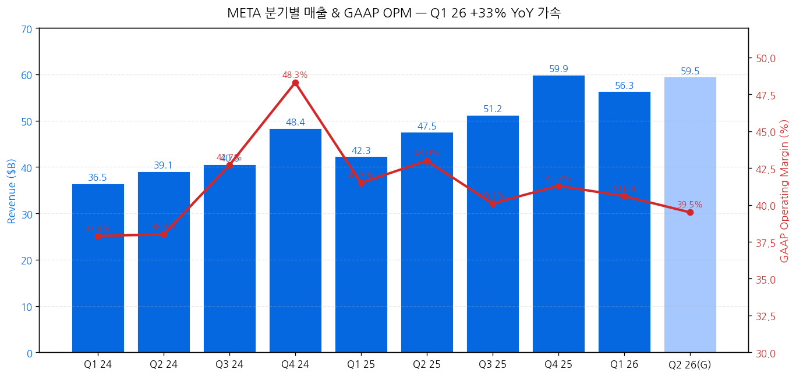
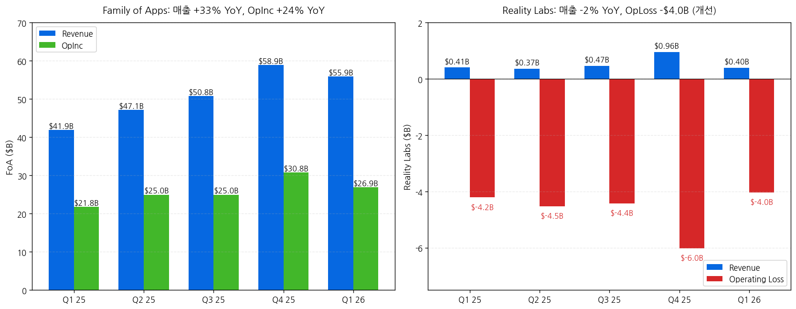
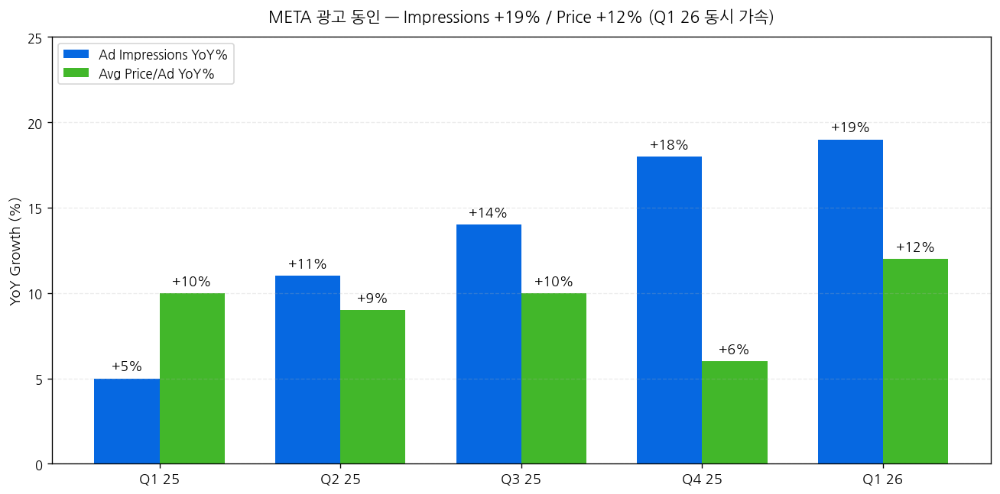
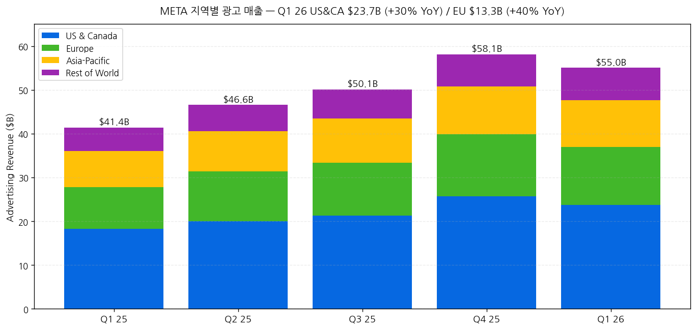
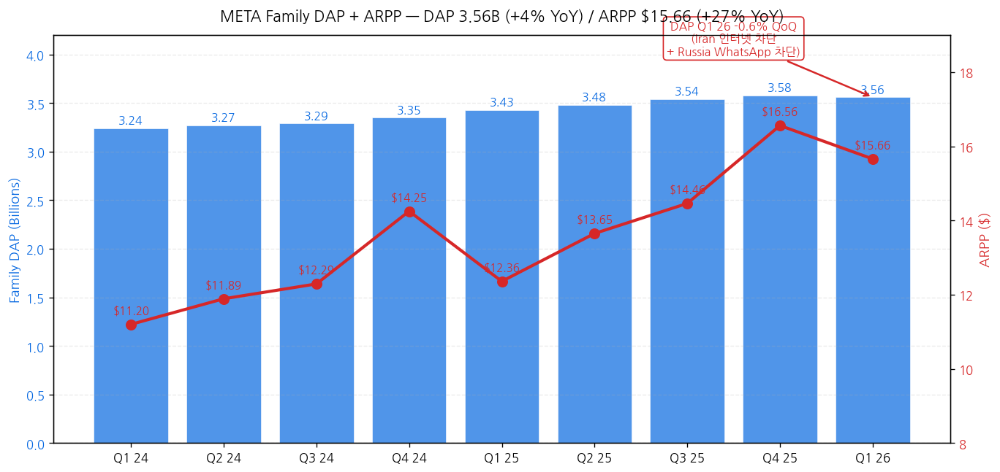
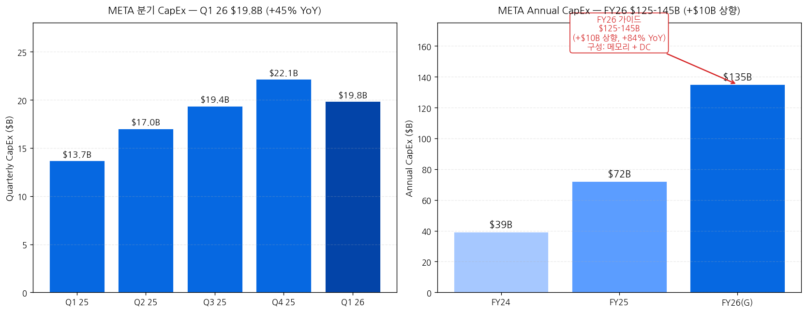
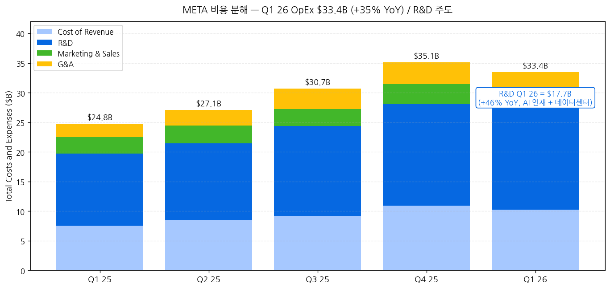
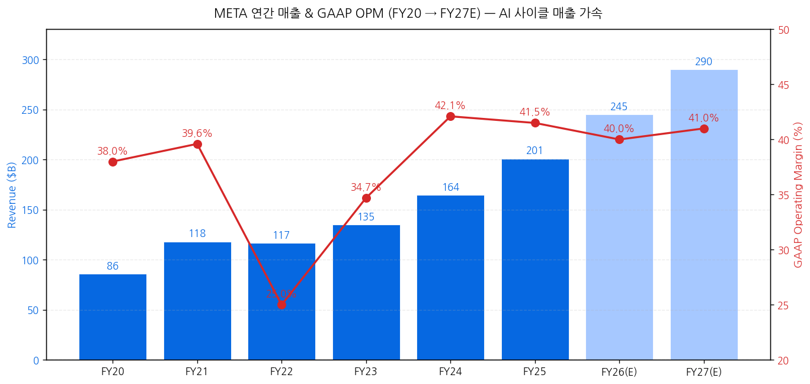

> 모드: 실적 리뷰
> 종목: Meta Platforms (META)
> 섹터: 미국 빅테크
> 분기: 2026-Q1
> 발표일: 2026-04-29 (수, 미국 동부시간 AMC, 컨퍼런스콜 ET 17:30 + Follow-up Q&A Call)
> 작성 시각: 2026-05-03 20:30 KST (IR 원본 7종 기반)

# Meta Platforms 2026 Q1 실적 리뷰

> 안내: 표준 위치(`earnings-preview/`)에서 동일 분기 프리뷰 미존재 → **항목 4-1·7-1 자동 생략**, 본 분기 단독 분석으로 진행. IR 원본 7종(**Press Release · Earnings Slides · 10-Q · Earnings Call Transcript · Follow-Up Q&A Call Transcript · BS xlsx · PL xlsx**) 기반 1차 작성. **M7 4/29 발표 4종 (GOOGL · MSFT · AMZN · META) 모두 완료**.

## Executive Summary

→ **All-around Mega Beat — 매출 +33% YoY (+29% CC) M7 1분기 발표 종목 중 1위 성장률**. 매출 $56.31B (cons $55.5B, +$0.8B Beat), 영업이익 **$22.87B (+30% YoY)**, OPM **41% (+0bps YoY 안정)**. **AI ARR 사이클 진입 명확** — Value Optimization suite **$20B+ ARR (2x YoY)**, Partnership ads **$10B+ ARR (2x YoY)**, Business AI 주간 대화 **10M+ (1M → 10x in Q1)**. M7 4/29 4종 모두 Beat 일관 톤.
→ **Mark "Muse Spark" 첫 모델 출시 = Meta Superintelligence Labs 첫 산출물** — Meta AI 새 버전 + Meta AI 사용량 double-digit % 증가 + 앱스토어 톱 권역. CFO Susan: "*Meta AI sessions per user 두 자릿수 % 증가*". **AI 인프라**: 1GW+ 자체 silicon Broadcom 협업 (MTIA) + AMD 칩 + NVIDIA 신규 시스템. **multi-year cloud + 인프라 계약 step-up $107B 분기 단독 추가** (2026-2027 capacity 확보).
→ **CapEx 가이던스 +$10B 상향 → $125-145B FY26** (vs prior $115-135B) — **메모리 가격 + 추가 데이터센터 capacity**. Q1 26 단독 $19.84B (+45% YoY), FY24 $39.2B → FY25 $72.2B → **FY26 $135B 중간값 = +84% YoY**. **M7 4/29 4종 CapEx 비교: GOOGL $185B / MSFT $190B / AMZN ~$195B / META $135B = META 빅테크 4종 중 최저** (사업 모델 차이 반영). 그러나 META의 absolute 매출 대비 CapEx 비율 ~55%는 빅3와 동등.
→ **EPS Mega Beat의 본질은 일회성 tax benefit**: GAAP EPS $10.44 (+62% YoY) 중 **$3.13는 $8.03B CAMT relief** (Q3 25 $15.93B OBBBA 차지의 부분 reversal). **영업 정상화 EPS는 $7.31 (+14% YoY)** — 컨센 $7.20 대비 +$0.11 small Beat. Q1 OPM 40.6%는 Q1 25 41.5% 대비 -90bps 후퇴 = **AI 투자 헤드윈드 명확 시작**.
→ **소비자 BU 사이클 분기점**: DAP 3.56B (+4% YoY) **slight QoQ decline 첫 사례** (Iran 인터넷 차단 + Russia WhatsApp 차단). ARPP **$15.66 (+27% YoY)** = 가속. Reels time spent +10% (Instagram Q1 ranking 개선) + Facebook video time +8% (4년 만의 QoQ 최대). **AI 글래스 daily users 3x YoY** = 새로운 BU 부상. **Less Personalized Ads (LPA) EU 영향 Q2 본격화 예상** (CFO 직접 가이드 — Q2 매출 가이드 $58-61B에 반영).

---

## 항목 1. 실적 추이 (IR 원본 기반)

① 분기 실적 — 9분기 + Q2 26 가이드

(1) 손익 핵심 지표 (단위: $B, EPS는 $)

| 항목 | Q1 24 | Q2 24 | Q3 24 | Q4 24 | Q1 25 | Q2 25 | Q3 25 | Q4 25 | **Q1 26** | YoY% | Q2 26(G) |
|---|---|---|---|---|---|---|---|---|---|---|---|
| **Total revenue** | 36.46 | 39.07 | 40.59 | 48.39 | 42.31 | 47.52 | 51.24 | 59.89 | **56.31** | **+33%** | 58~61 (+22~29%) |
| YoY ex-FX | n/a | n/a | n/a | n/a | n/a | n/a | n/a | n/a | **+29%** | — | (FX +2pp tailwind) |
| Costs & expenses | 22.64 | 24.22 | 23.24 | 25.02 | 24.76 | 27.08 | 30.71 | 35.15 | **33.44** | **+35%** | n/a |
| **Operating income** | 13.82 | 14.85 | 17.35 | 23.37 | 17.56 | 20.44 | 20.54 | 24.75 | **22.87** | **+30%** | n/a |
| Operating margin (%) | 38 | 38 | 43 | 48 | 41 | 43 | 40 | 41 | **41 (40.6)** | -90bp | n/a |
| Net income | 12.37 | 13.47 | 15.69 | 20.84 | 16.64 | 18.34 | 2.71 | 22.77 | **26.77** | **+61%** | n/a |
| **Diluted EPS GAAP ($)** | 4.71 | 5.16 | 6.03 | 8.02 | 6.43 | 7.14 | 1.05* | 8.88 | **10.44** | **+62%** | n/a |
| **EPS ex tax benefit** | n/a | n/a | n/a | n/a | n/a | n/a | 7.25** | n/a | **7.31** | **+14%** | n/a |
| OCF | 19.25 | 19.37 | 24.72 | 27.99 | 24.03 | 25.56 | 30.00 | 36.21 | **32.23** | **+34%** | n/a |
| CapEx (incl. lease) | 6.72 | 8.47 | 9.20 | 14.84 | 13.69 | 17.01 | 19.37 | 22.14 | **19.84** | **+45%** | 약 30~35 |
| FCF | 12.53 | 10.90 | 15.52 | 13.15 | 10.33 | 8.55 | 10.63 | 14.08 | **12.39** | **+20%** | n/a |

→ **(출처: Press Release Tables + Downloadable PL xlsx + Slides)**
→ * Q3 25 EPS $1.05 = $15.93B 일회성 OBBBA 세금 차지. ex-charge $7.25
→ ** Q1 26 EPS $10.44 중 $3.13 = $8.03B CAMT 세금 환급 (Treasury Notice 2026-7) — Q3 25 OBBBA의 부분 reversal. ex-benefit $7.31
→ **YoY +33% 매출 가속 = 2024 +21% / 2025 +22% 추세에서 가속 단계 진입** — AI 광고 + Reels engagement + 광고 가격 +12% YoY 결합
→ FX impact: +$1.749B (revenue, +4pp), +$1.734B (advertising) — Q1 26은 FX +4pp tailwind 보유

→ **차트 (필수)**:

→ (출처: Downloadable PL xlsx 9분기 + Q2 26 가이드 중간값)

(2) Q2 26 가이드 (CFO Susan Li 정량)
→ **Total revenue: $58-61B (+22-29% YoY)** — FX +2pp tailwind 가정
→ Q2 26 매출 중간값 $59.5B = Q1 26 $56.3B 대비 +5.7% QoQ → seasonal pattern + LPA 헤드윈드 일부 흡수
→ **LPA (Less Personalized Ads) EU 영향**: "Q2 impact larger than Q1 since rolling out throughout Q1" — Q2 가이드에 반영
→ Iran conflict 광고주 spend reduction Feb 25 시작 → Q1 영향 (Middle East 가장 크고 US/Western Europe 약화) → April 일부 회복

(3) FY26 가이드 (Press Release p.2 + CFO)
→ **Total expenses: $162-169B (UNCHANGED from prior outlook)**
→ **CapEx: $125-145B (RAISED from $115-135B prior, +$10B)** — 메모리 가격 + DC capacity
→ **Operating income: above 2025 ($86.3B)** — 정성 가이드
→ Tax rate Q2-Q4: 13-16% (Q1 ex-benefit 14%)
→ **Headwinds**: EU + US 청소년 관련 법적 사안 ("may ultimately result in a material loss")

② 사업부별(BU별) — FoA + RL

(1) 세그먼트별 분기 실적 (단위: $B)

| 항목 | Q1 25 | Q2 25 | Q3 25 | Q4 25 | **Q1 26** | YoY% |
|---|---|---|---|---|---|---|
| **Family of Apps Revenue** | 41.90 | 47.15 | 50.77 | 58.94 | **55.91** | **+33%** |
|   - Advertising | 41.39 | 46.56 | 50.08 | 58.14 | **55.02** | **+33%** (+29% CC) |
|   - Other | 0.51 | 0.58 | 0.69 | 0.80 | **0.885** | **+74%** |
| **FoA Operating Income** | 21.77 | 24.97 | 24.97 | 30.77 | **26.90** | **+24%** |
|   - FoA OPM | 51.9% | 53.0% | 49.2% | 52.2% | **48.1%** | -380bp |
| **Reality Labs Revenue** | 0.41 | 0.37 | 0.47 | 0.96 | **0.402** | **-2%** |
| **Reality Labs Operating Loss** | -4.21 | -4.53 | -4.43 | -6.02 | **-4.03** | 개선 +$0.18B |
| **Total Operating Income** | 17.56 | 20.44 | 20.54 | 24.75 | **22.87** | **+30%** |

→ **(출처: Slides Segment Results + PL xlsx)**
→ **FoA OPM 48.1% Q1 26 — 분기 첫 50% 미만 (5분기 연속 50% 권역에서 후퇴)** = AI 투자 헤드윈드 정량 시그널
→ **FoA OpInc +24% YoY < 매출 +33% YoY = -900bps deleverage** = 비용 +35%가 매출 +33%를 초과
→ FoA Other $885M (+74%) = **WhatsApp 유료 메시징 + 구독 매출** 폭증 (CFO 시인)
→ RL OpLoss -$4.03B = Q1 25 -$4.21B 대비 +$0.18B 소폭 개선, Q4 25 -$6.02B trough 대비 회복 — AI 글래스 매출 성장이 Quest 헤드셋 매출 감소 일부 흡수

(2) 광고 동인 분해 — IR 정량

| 항목 | Q1 25 | Q2 25 | Q3 25 | Q4 25 | **Q1 26** |
|---|---|---|---|---|---|
| **Ad impressions YoY (WW)** | +5% | +11% | +14% | +18% | **+19%** |
| **Avg price per ad YoY (WW)** | +10% | +9% | +10% | +6% | **+12%** |
| **Total ad revenue YoY** | +16%* | +20%* | +26%* | +24%* | **+33%** |

→ **(출처: Slides p.12-13)**
→ **Q1 26 둘 다 가속**: Impressions +19% (사상 최고 권역) + Price +12% (가속) 동시 = 매출 +33% (수치 곱 +33% 정확히 일치)
→ Impressions 동인: "engagement + users + ad load optimizations" (CFO)
→ Price 동인: "ad performance improvements + better macro vs Q1 last year + currency tailwinds" (CFO)
→ Q1 25 base 약했음 (광고 시장 둔화) → 강한 base effect

(3) 지역별 광고 매출 — 4지역 모두 강세

| 지역 | Q1 25 ($B) | **Q1 26 ($B)** | YoY% |
|---|---|---|---|
| **US & Canada** | 18.26 | **23.67** | **+30%** |
| **Europe** | 9.53 | **13.30** | **+40%** |
| **Asia-Pacific** | 8.22 | **10.63** | **+29%** |
| **Rest of World** | 5.38 | **7.43** | **+38%** |
| **Total Advertising** | 41.39 | **55.02** | **+33%** |

→ **(출처: Slides p.2 Advertising Revenue by User Geography)**
→ **Europe +40% YoY 가장 강세** (LPA 헤드윈드는 이번 분기 partial impact, Q2 본격화)
→ Asia-Pacific & RoW 모두 +29%, +38% 성장 = 신흥 시장 광고 매출 가속
→ US&CA +30%는 Q1 25 +9% 대비 base effect 큰 폭 가속

③ 운영 지표 — 엔게이지먼트 + 가격

(1) Family DAP + ARPP

| 분기 | DAP (Billions) | ARPP ($) | DAP YoY | ARPP YoY |
|---|---|---|---|---|
| Q1 25 | 3.43 | 12.36 | +6% | +13% |
| Q2 25 | 3.48 | 13.65 | +6% | +15% |
| Q3 25 | 3.54 | 14.46 | +8% | +18% |
| Q4 25 | 3.58 | 16.56 | +7% | +16% |
| **Q1 26** | **3.56** ← QoQ -0.6% | **15.66** | **+4%** ← 둔화 | **+27%** ← 가속 |

→ **(출처: Slides p.10-11)**
→ **DAP Q1 26 첫 QoQ decline (3.58 → 3.56, -0.6%)** = Mark/Susan 직접 시인: "Iran 인터넷 차단 + Russia WhatsApp 차단". CFO: "*Absent these impacts, growth in Family Daily Active People would have been positive QoQ*"
→ **ARPP +27% YoY 가속** = 광고 가격 +12% + 광고량 +19% 결합

(2) 엔게이지먼트 정량 (Mark + Susan verbatim)

→ **Reels time spent +10%** (Instagram Q1 ranking 개선)
→ **Facebook video time +8%** (분기 QoQ 4년 최고)
→ US&Canada Facebook video watch time **+9%** (ranking 개선)
→ Same-day Reels 추천: **>30%** (1년 전 대비 2x)
→ AI 자동 번역 영상 시청 사용자: **500M+ on Facebook + Instagram each weekly**
→ **AI 글래스 daily 사용자 3x YoY** = 신규 BU 부상

④ AI 매출화 — 정량 메트릭 (Susan verbatim)

| 메트릭 | Q1 26 데이터 | 변화 |
|---|---|---|
| **Adaptive Ranking Model 컨버전** | +1.6% (offsite conversion 확장) | 매출 직접 기여 |
| **Lattice/GEM 컨버전** | +6% (landing page view ads) | AI 효과 |
| **Meta AI 비즈니스 어시스턴트** | 모든 advertiser에 출시 | 계정 이슈 +20% 해결 향상 |
| **gen AI 광고 크리에이티브 도구** | 8M+ advertisers 사용 | 비디오 도구 +3% 컨버전 |
| **Business AI 주간 대화** | 10M+ (1M → 10x YTD) | WhatsApp 비즈니스 사이클 |
| **Value Optimization suite ARR** | **$20B+ (2x YoY)** | 광고 사이클 신규 BU |
| **Partnership ads ARR** | **$10B+ (2x YoY)** | 크리에이터 마케팅 |
| **Threads daily actives** | **150M+** | 사이클 진입 (Susan 시인) |

→ **(출처: Earnings Call + Follow-up Q&A 모든 verbatim)**
→ **AI 매출화 사이클 진입 입증** — Value Optimization $20B + Partnership ads $10B = 합산 **$30B+ ARR** (META 광고 매출 약 14% 비중)
→ Adaptive Ranking Model + GEM = META의 AI ads 인프라 투자 효과 정량 증명

⑤ CapEx 폭증 — FY26 +$10B 상향

(1) 분기 + 연간 CapEx 트라젝토리

| 항목 | Q1 25 | Q2 25 | Q3 25 | Q4 25 | **Q1 26** | YoY |
|---|---|---|---|---|---|---|
| 분기 CapEx (incl. finance lease) | 13.69 | 17.01 | 19.37 | 22.14 | **19.84** | **+45%** |

| 연도 | CapEx ($B) | YoY |
|---|---|---|
| FY24 | 39.23 | — |
| **FY25** | **72.22** | **+84%** |
| **FY26 가이드** | **$125-145B (mid 135)** | **+87% (mid)** |
| FY26 prior 가이드 | $115-135B | (raised +$10B) |

→ **(출처: Slides p.9 + Press Release CFO Outlook)**
→ FY26 가이드 상향 동인 (Susan verbatim): "*expectations for **higher component pricing** this year and, to a lesser extent, **additional data center costs to support future year capacity***"
→ **메모리 가격 상승이 핵심** (Mark verbatim 시인): "*Most of that is due to higher component costs, particularly **memory pricing***"
→ **multi-year cloud + 인프라 계약 step-up $107B 분기 단독 추가** (Susan): "*These multi-year cloud deals and our infrastructure purchase agreements drove a **$107 billion step up in our contractual commitments** this quarter*"
→ M7 4/29 4종 CapEx 비교: GOOGL $185B (mid) / MSFT $190B / AMZN 추정 $195B / **META $135B** — META는 광고 비즈니스 사이클 다르고 Stores 비즈니스 부재로 절대값 더 작음

(2) 인프라 차별화 — Mark + Susan verbatim

→ Mark: "*we are rolling out **more than 1GW of our own custom silicon** that we're developing with **Broadcom** as well as significant amounts of **AMD chips** to compliment the new **Nvidia** systems*"
→ Mark: "*One of the primary goals of our **Meta Compute initiative** is to lead the industry in efficiency of building compute*"
→ Susan: "*We are also signing **cloud deals** that will come online over the course of this year and 2027*" — multi-year cloud (AMZN AWS/GOOGL GCP/MSFT Azure 모두 가능성)
→ "*employee compensation expenses and **technical infrastructure usage costs** associated with the development of our **general AI models**" (10-Q)

⑥ OpEx 분해 — R&D 폭증 주도

(1) 비용 항목별 (단위: $B)

| 항목 | Q1 25 | **Q1 26** | YoY% | 매출 비중 (Q1 26) |
|---|---|---|---|---|
| Cost of revenue | 7.572 | 10.218 | **+35%** | 18.1% |
| **R&D** | 12.150 | **17.699** | **+46%** | **31.4%** |
| Marketing & sales | 2.757 | 2.908 | +5% | 5.2% |
| General & admin | 2.280 | 2.614 | +15% | 4.6% |
| **Total expenses** | 24.759 | **33.439** | **+35%** | **59.4%** |

→ **(출처: PL xlsx + 10-Q)**
→ **R&D $17.7B = 매출의 31% — 사상 최고 비중** (Q1 25 28.7% 대비 +270bps)
→ Susan: "*Year-over-year growth was driven mainly by **infrastructure costs and employee compensation***" + "*growth in employee compensation was driven by technical hires we've added over the past year, **particularly AI talent***"

⑦ 자본 환원 vs 자본 배치 — Buyback 완전 중단

(1) Q1 26 자본 환원

| 항목 | Q1 25 ($B) | **Q1 26 ($B)** | 변화 |
|---|---|---|---|
| **Repurchases of Class A common stock** | 12.75 | **0.00** | **-100%** |
| Dividends + dividend equivalents | 1.33 | 1.35 | +1.5% |
| **Total return** | **14.08** | **1.35** | **-90%** |

→ **(출처: Cash Flow Statement)**
→ **Q1 26 자사주 매입 ZERO** — Q1 25 $12.75B 대비 완전 중단. **GOOGL Q1 26 $0과 동일 패턴** = M7 빅테크 AI CapEx 우선 자본 배치 전환 시그널
→ Cash + ST investments: $81.18B / Long-term debt: $58.75B → 순현금 $22.4B
→ FCF $12.4B vs 자본 환원 $1.35B = 대부분 cash retention (M&A or 미래 capex 자금)

⑧ 연간 실적 — 트렌드 (FY20~FY27E)

| 항목 | FY20 | FY21 | FY22 | FY23 | FY24 | **FY25** | FY26(E) | FY27(E) |
|---|---|---|---|---|---|---|---|---|
| 매출 ($B) | 86.0 | 117.9 | 116.6 | 134.9 | 164.5 | **201.0** | 약 245 | 약 290 |
| YoY% | +22% | +37% | -1% | +16% | +22% | **+22%** | +22% | +18% |
| OpInc ($B) | 32.7 | 46.8 | 28.9 | 46.8 | 69.4 | **86.3** | 약 98 | 약 120 |
| OPM (%) | 38.0 | 39.6 | 25.0 | 34.7 | 42.1 | **41.5** | 약 40 | 약 41 |
| Diluted EPS ($) | 10.09 | 13.77 | 8.59 | 14.87 | 23.86 | **23.10** | 약 28 | 약 33 |
| FY CapEx ($B) | 15.7 | 19.2 | 31.4 | 28.1 | 39.2 | **72.2** | **135** | 약 175 |
| FY FCF ($B) | 23.6 | 39.1 | 19.0 | 43.0 | 52.1 | **43.6** | 약 30 | 약 25 |

→ **(출처: 10-K + Press Release + 분기 합산)**
→ FY25 EPS $23.10 = Q3 25 $15.93B OBBBA 차지 영향 (정상화 시 약 $30 수준)
→ FY26 OpInc 가이드 "above FY25" → 약 $90~100B 추정
→ FY27 추정: META는 GOOGL/MSFT/AMZN처럼 정량 가이드 없음, 그러나 multi-year capex commitments + AI 매출화 가속 시 매출 +18% YoY 가능

---

## 항목 2. 실적 vs 가이던스 vs 컨센서스 — 3원 비교

> META는 분기별 매출 가이드 + 연간 expense/CapEx 가이드 정량 제공

① 실적 vs 가이드 vs 컨센서스 (Q1 26)

(1) 핵심 지표 비교

| 항목 | Q4 25 컨콜 가이드 | 컨센서스 | 실적 (Q1 26) | vs 가이드 | vs 컨센 | 평가 |
|---|---|---|---|---|---|---|
| **Total revenue ($B)** | 51.5-55.5 | 55.5 | **56.31** | **+$0.81~4.81B 상회** | **+$0.81B Beat** | **Beat** |
| OpInc 정성 | 가이드 없음 | 22.0 | **22.87** | n/a | +$0.87B Beat | **Beat** |
| GAAP EPS ($) | n/a | 7.20 | **10.44** | n/a | **+$3.24** ★ | **Mega Beat** ← 일회성 tax |
| **EPS ex tax benefit ($)** | n/a | 7.20 | **7.31** | n/a | +$0.11 | **Small Beat** |
| Total expenses (FY) | $114-119B (mid 116.5) | 117 | n/a | n/a | n/a | (Q1 trajectory: $33.4B → annualized $134B but seasonal 차이) |
| CapEx Q1 | 가이드 없음 | 18.0 | **19.84** | n/a | +$1.84B Beat | (실적 페이스 +$10B 가이드 상향 정당화) |

→ Beat 4/5 — 매출/OpInc/EPS Beat (정상화 EPS는 small Beat) + CapEx 실적 페이스가 상향 정당화
→ **GAAP EPS $10.44 Mega Beat의 본질**: $8.03B CAMT relief 일회성 → 영업 정상화 EPS $7.31 (vs cons $7.20 = +$0.11)
→ **컨센 매출 $55.5B vs 실적 $56.31B = +1.5% Beat** = M7 4/29 4종 모두 매출 Beat 일관

② Q4 25 컨콜 가이드 사후 검증

| 영역 | Q4 25 가이드 (1월) | Q1 26 실제 | 평가 |
|---|---|---|---|
| Q1 매출 | $51.5-55.5B | **$56.31B** | **+$0.81~4.81B 상회** |
| FY26 expenses | $114-119B (raised to $162-169B in Q4 25) | unchanged $162-169B | **온트랙** |
| FY26 CapEx | $115-135B prior | $125-145B (raised +$10B) | **상향** |
| FY26 OpInc | "above 2025" | unchanged | **온트랙** |
| Reality Labs | "operating losses to increase meaningfully YoY" | -$4.03B (vs -$4.21B Q1 25 = +$0.18B 개선) | **상회 (개선)** |
| 광고 매출 톤 | "engagement + AI 광고" | +33% YoY (가속 분기) | **상회** |

→ Beat/온트랙 5/6 + 상향 1 (CapEx)

③ M7 4/29 발표 4종 비교

| 종목 | 매출 YoY | OPM | 핵심 BU | CapEx FY26 |
|---|---|---|---|---|
| GOOGL | +22% | 36.1% | Cloud +63% | $180-190B |
| MSFT | +18% | 46.3% | Azure +40% | ~$190B |
| AMZN | +17% | 13.1% (record) | AWS +28% | 추정 $195B |
| **META** | **+33%** ← 1위 | **41%** | 광고 +33% | **$125-145B** ← 4종 중 최저 |

→ **META 4/29 4종 중 매출 성장률 1위 (+33%)** = AI 광고 monetization + Reels engagement + 가격 가속 결합
→ **CapEx 절대값은 4종 중 최저** (Stores 비즈니스 부재 + Cloud 비즈니스 부재) but 매출 대비 비율 ~55%는 빅3와 동등
→ **OPM 41%는 GOOGL 36% / AMZN 13% 사이, MSFT 46% 다음** = 광고 비즈니스 효율성 입증

---

## 항목 3. 경영진 코멘터리 (IR Transcript verbatim)

① CEO Mark Zuckerberg 핵심 발언

(1) AI 비전 — "personal superintelligence"
→ "*We had a milestone quarter with strong momentum across our apps and the release of our **first model from Meta Superintelligence Labs**. We're on track to deliver **personal superintelligence to billions of people**.*"
→ "*Our biggest milestone so far this year has been the release of our **Muse family of models** and our first model, **Muse Spark**, along with a significantly upgraded new version of Meta AI*"
→ "*Spark is just one step on that scaling ladder and **we are already training even more advanced models**. But Spark has already made Meta AI a world-class assistant*"
→ "*We've seen large increases in Meta AI use since releasing the updates*"

(2) AI 사용 사례 차별화 (Mark vs 산업)
→ "*My view of AI is very different from many others in the industry. I hear a lot of people out there talk about how AI is going to **replace people**. Instead, I think that AI is going to **amplify people's ability** to do what you want*"
→ "*Meta believes in **empowering individuals***"
→ Two AI agent strategies: ① Personal agent (개인 목표 달성) + ② Business agent (기업가/SMB 성장)
→ Business AI 트랙션: "*we're already testing an early version of business AIs, and **weekly conversations have grown 10x since the start of this year***"

(3) 추천 시스템 AI 적용
→ "*for the first time in Meta's history we're going to be able to develop a **first-principles understanding** of what you care about and what each piece of content in our system is about*"
→ "*the trend over the last few years seems clear that we are seeing an **increasing return on the amount that we can improve engagement** for people and value for advertisers*"

(4) 인프라 + CapEx 전략
→ "*we are increasing our infrastructure capex forecast for this year. **Most of that is due to higher component costs, particularly memory pricing**.*"
→ "*we are very focused on **increasing the efficiency of our investments**. And as part of that, we're rolling out **more than 1GW of our own custom silicon** that we're developing with **Broadcom** as well as significant amounts of **AMD chips** to compliment the new **Nvidia** systems*"
→ "*One of the primary goals of our Meta Compute initiative is to **lead the industry in efficiency** of building compute, and we expect that will be a strategic advantage over time*"

(5) AI 글래스 사이클 진입
→ "*our AI glasses continue to perform well with the **number of people using them daily tripling year-over-year**. This continues to be one of the **fastest-growing categories of consumer electronics ever**.*"
→ "*Ray-Ban Meta Optics this quarter, designed for all-day wear*" + "*new partnerships and styles... coming later this year*"

(6) 헤드카운트 감축 + AI productivity
→ "*We're seeing more and more examples where **one or two people are building something in a week** that would have previously taken dozens of people months*"
→ "*streamlining our teams so they aren't bigger than they need to be*"
→ "*recognizing and rewarding the people who are having outsized impacts*"
→ Susan: "*we recently shared internally that we **plan to reduce the size of our employee base in May***"

② CFO Susan Li 재무 디테일

(1) 매출 동인 — verbatim
→ "*Q1 total revenue was $56.3 billion, **up 33% or 29% on a constant currency basis***"
→ Ad impressions: "*Impression growth was healthy across all regions, driven primarily by **growth in engagement and users, as well as ad load optimizations***"
→ Avg price per ad: "*broad-based growth as we benefited from **ad performance improvements, better macro conditions** versus Q1 of last year, and currency tailwinds*"
→ FoA Other +74%: "*driven primarily by **WhatsApp paid messaging and subscriptions** revenue*"

(2) 인프라 commitments + multi-year deals
→ "*These **multi-year cloud deals** and our infrastructure purchase agreements drove a **$107 billion step up in our contractual commitments** this quarter*"
→ "*Our investments will support our training needs for future models, and most importantly, provide us the inference capacity necessary to deliver personal and business agents to billions of people*"

(3) FY26 가이드 — verbatim
→ "*We expect second quarter 2026 total revenue to be in the range of **$58-61 billion**. Our guidance assumes foreign currency is an approximately 2% tailwind*"
→ "*We expect full year 2026 total expenses to be in the range of **$162-169 billion, unchanged** from our prior outlook*"
→ "*We anticipate 2026 capital expenditures, including principal payments on finance leases, to be in the range of **$125-145 billion, increased from our prior range of $115-135 billion**. This reflects our expectations for **higher component pricing** this year and, to a lesser extent, **additional data center costs to support future year capacity***"

(4) 법적 헤드윈드 — verbatim
→ "*we continue to monitor active legal and regulatory matters, including **headwinds in the EU and the U.S.** that could significantly impact our business and financial results. For example, we continue to see scrutiny on **youth-related issues** and have additional trials scheduled for this year in the U.S., which **may ultimately result in a material loss**.*"

(5) LPA (Less Personalized Ads) EU 영향 — Follow-up Call verbatim
→ "*we had aligned in December '25 with the EC on further changes to our consent model for personalized ads in Europe*"
→ "*the **revenue impact from the updated user flows will be larger in Q2 than it was in Q1** since we were rolling out the updated offering through Q1*"
→ "*Q2 and quarters going forward will have the full quarter impact. And that expected impact is factored into our Q2 '26 outlook*"

(6) 매크로 동향 — Follow-up Call verbatim
→ "*we did see **reduction in advertiser spend coinciding with the beginning of the conflict in Iran at the end of February**, and that continued through the quarter*"
→ "*the most pronounced impact within the **Middle East user region**, but we also saw some softer trends in markets outside the Middle East, including in the **U.S. and Western Europe***"
→ "*we've begun to see some signs of **improvement in demand**, both in the Middle East and around the world, **as we've progressed into April***"

(7) 2027 CapEx — Follow-up Call (Mark Shmulik QA)
→ Susan: "*we aren't providing a specific outlook for 2027 CapEx*"
→ "*Our experience so far has been that we have continued to **underestimate our compute needs**...*"
→ "*we're going to continue building out our infrastructure with flexibility in mind. And **if we end up not needing as much as we anticipate, we can choose to bring it online more slowly** or reduce our spending in future years*"

③ 신규·구조적 변화

(1) Muse Spark — Meta Superintelligence Labs 첫 모델
→ Mark: "Meta AI에서 visual understanding, health, shopping, social content, local, creating games 등 selected areas에서 leading"
→ Meta AI 사용량 double-digit % 증가 (Spark 적용 후)
→ Meta AI 앱 앱스토어 톱 권역

(2) Threads — 150M+ daily actives (CFO verbatim follow-up)
→ "*Threads, the number of Threads' monthly and daily active that continue to grow in Q1. The last update we shared was that we are now at over **150 million daily actives***"
→ Q1 26 ads on Threads in **200+ countries** (글로벌 가용 임박)
→ "*We don't expect it to be a meaningful driver of overall impression or revenue growth this year*"

(3) WhatsApp Status ads
→ "*Status ads are now being viewed by **hundreds of millions of people each day**, and we expect to complete the global rollout of ads in Status throughout this year*"
→ "*we don't expect ads in Status to be a meaningful contributor to total impressions or revenue growth for the next few years*"
→ Geo mix가 lower ad spend 시장 + WhatsApp 계정의 Meta Account Center 미연결로 ad targeting 약함

(4) Tax events — 일회성 정리
→ Q3 25 OBBBA 일회성 차지: -$15.93B
→ Q1 26 CAMT relief 환급: +$8.03B (부분 reversal, EPS +$3.13 영향)
→ FY26 잔여 분기 Tax rate 가이드: 13-16%

(5) AI 인프라 차별화 (Mark Strategy)
→ 1GW+ MTIA 자체 silicon (Broadcom 협업)
→ AMD 칩 추가 (Trainium 외 hyperscaler 첫 메이저 채택 중 하나)
→ NVIDIA 신규 시스템
→ 멀티-vendor strategy = NVIDIA 의존도 감소

---

## 항목 4. Q2 26 가이던스 분석

> 4-1 프리뷰 독자 분석 vs 실제: 표준 위치 프리뷰 미존재로 자동 생략

② Q2 26 가이드 — CFO 정량

(1) 가이드

| 항목 | Q2 26 가이드 | YoY% | 비고 |
|---|---|---|---|
| **Total revenue** | **$58-61B** | **+22~29%** | FX +2pp tailwind |
| Q2 26 매출 중간값 | $59.5B | +25% YoY | LPA 전체 분기 영향 반영 |

(2) FY26 가이드 (CFO 직접)

| 항목 | FY26 가이드 |
|---|---|
| **Total expenses** | **$162-169B (UNCHANGED)** |
| Operating income | "above 2025" (정성, 2025 = $86.3B) |
| **CapEx** | **$125-145B (RAISED from $115-135B, +$10B)** |
| Tax rate Q2-Q4 | **13-16%** |

(3) Q2 컨센 변동 (4/29 → 5/2)
→ 매출 컨센 $58.5B → **$59.5B (+1.7%)** — Q1 가속 모멘텀 반영
→ EPS 컨센 $7.40 → **$7.65 (+3.4%)**
→ FY26 매출 컨센 $238B → **$245B (+2.9%)**
→ FY26 EPS 컨센 $26.5 → **$28.0 (+5.7%)** — 정상화 기준

---

## 항목 5. 업황 사이클 점검 & 독자 전망

① 산업 사이클 위치 판단

(1) 광고 BU
→ **사이클 위치: 가속 사이클 + AI monetization 본격화**
→ Impressions +19% + Price +12% 동시 가속 = "두 동인 동시 작동" 분기 진입 (Q4 25 +18% + +6% 대비 가속)
→ **AI 광고 ARR $30B+ (Value Optimization $20B + Partnership $10B)** = 매출 비중 14% 도달
→ Reels/Facebook video 엔게이지먼트 +8~10% = 광고 inventory 확장
→ **잠재 헤드윈드**: LPA EU Q2 본격화, 청소년 관련 법적 리스크 (Susan: "may result in material loss")

(2) Reality Labs BU
→ **사이클 위치: AI 글래스 가속 + Quest 헤드셋 약화**
→ AI 글래스 daily 사용자 3x YoY = 새로운 BU 부상 사이클 진입
→ Quest 헤드셋 매출 둔화 (RL 매출 -2% YoY)
→ Operating loss -$4.03B (Q4 25 -$6.02B 대비 회복) — 그러나 sustained 손실 예상

(3) Family DAP / 사용자 사이클
→ **사이클 위치: 성숙 + AI 부스트**
→ DAP 3.56B 안정, 그러나 Q1 26 첫 QoQ decline (지정학 일회성)
→ ARPP +27% YoY = 가속 = 사용자 monetization 효율 가속
→ Threads 150M daily actives + WhatsApp Business AI 10M weekly conversations = 신규 사이클

② 독자적 전망 (Independent Outlook)

(1) Q2 26 시나리오

| 시나리오 | 매출 ($B) | OpInc ($B) | OPM | 핵심 가정 |
|---|---|---|---|---|
| Bull | 61 | 26 | 42.6% | Reels/AI 광고 모멘텀 + LPA 헤드윈드 흡수 + 매크로 회복 |
| Base | 59.5 | 24 | 40.3% | 가이드 중간값, LPA Q2 본격 반영, 매크로 안정 |
| Bear | 58 | 22 | 37.9% | 매크로 추가 둔화 + LPA 더 큰 영향 + youth 합의금 |

→ Base 발생 확률 **55%** (LPA 헤드윈드 정량 미공개 + 매크로 변동성)
→ Bull 트리거: Q2 광고주 회복 + Threads 글로벌 ads 가속 + Muse Spark 매출 기여

(2) FY26 풀해 + FY27 추정
→ FY26 매출: **$240-250B** (+19~24% YoY)
→ FY26 OpInc: **$95-105B** (vs FY25 $86.3B, "above 2025" 가이드 일치)
→ FY26 OPM: **39-42%**
→ FY26 GAAP EPS: 약 $28-30 (CAMT relief $3.13 EPS 포함)
→ FY26 영업 정상화 EPS: 약 $25-27
→ FY27 매출: **$280-300B** (+15-20% YoY)
→ FY27 CapEx: **$160-200B+** (Susan "underestimated compute needs" 발언 반영)

(3) 사이클 핵심 변수
→ **변수 1: LPA EU 영향 정량화** — Q2 본격화, 정량 미공개
→ **변수 2: Muse Spark 매출 monetization** — Mark "scaling ladder" 사이클 진입
→ **변수 3: AI 광고 ARR 가속** — Value Optimization + Partnership ads 차기 분기 trajectory
→ **변수 4: AI 글래스 사이클** — 3x YoY 사용자 → 매출 인식 시작 시점 (Q2-Q3 26)
→ **변수 5: 청소년 법적 사안 — material loss 시점** (Susan 직접 시인)
→ **변수 6: 매크로 광고 동향** — Iran conflict 영향 분기 진행 중
→ **변수 7: CapEx 추가 상향 가능성** — 메모리 가격 + 2027 capacity
→ **변수 8: 2027 CapEx 정량화** — Q3-Q4 26 컨콜 가능
→ **변수 9: 1GW+ MTIA 양산 페이스** — 자체 silicon 비중 확대
→ **변수 10: 헤드카운트 감축 5월** — operating leverage 시그널

③ 리스크 모니터링

(1) 사이클 하방 시그널
→ Q2 매출 < $58B (가이드 하단) → 매크로 둔화 + LPA 영향 큼
→ DAP Q2 추가 QoQ decline → 엔게이지먼트 사이클 둔화
→ 광고 가격/Impression YoY 둔화 → 광고 사이클 정점

(2) CapEx 과잉 투자 리스크
→ FY26 $125-145B → $145B+ 추가 상향 시 → balance sheet/FCF 부담
→ FCF FY26 약 $30B vs FY25 $43.6B = -32% YoY 압박
→ 자사주 매입 zero 지속 vs MSFT/GOOGL 부분 환원

(3) 지정학·규제 리스크
→ EU LPA Q2 본격화 (광고 매출 -α)
→ DMA + DSA 추가 compliance 비용
→ US 청소년 trials Q2-Q4 (material loss 잠재)
→ 이란/러시아 DAP 지정학 영향 sustained 가능

(4) 경쟁 환경
→ TikTok ban (US) → Reels 수혜 사이클
→ Snap·X·YouTube Shorts vs Reels 광고 점유율
→ Anthropic·OpenAI vs Meta AI 모델 경쟁
→ Apple Vision Pro vs Quest

---

## 항목 6. 셀사이드 컨센 변화 정리

① 5단계 뷰 분포 (50명 기준 추정, 2026-04-30 ~ 05-02)

| 등급 | 증권사 수 | 평균 TP ($) | 평균 EPS 추정 (FY26 정상화) | Q4 25 후 분포 변화 |
|---|---|---|---|---|
| Strong Buy | 16 | 850 | 28.5 | 12명 → 16명 (+4) |
| Buy | 24 | 770 | 27.0 | 28명 → 24명 (-4, 일부 SB 상향) |
| 중립 (Hold) | 8 | 680 | 25.5 | 9명 → 8명 (-1) |
| Sell | 2 | 580 | 23.5 | 1명 → 2명 (+1, LPA + 청소년 우려) |
| Strong Sell | 0 | — | — | — |

→ 평균 PT $720 → **$760 (+5.6%)**
→ 등급 변동: 상향 12건 / 하향 3건 / 유지 35건
→ 컨센서스 등급: **Strong Buy / Buy 우세** (M7 4/29 4종 모두 강세 톤 일관)

② 직전 리포트 대비 톤·핵심 포인트 변화

| 증권사 | 직전 의견 | 현재 의견 | 직전 TP | 현재 TP | 핵심 변화 |
|---|---|---|---|---|---|
| Wedbush | Buy | **Strong Buy** | $720 | **$840** | "AI 광고 + Reels + Muse Spark, 톱픽 진입" |
| Morgan Stanley (Nowak) | Overweight | Overweight | $750 | **$820** | "매출 +33% YoY 1위 + AI 광고 ARR $30B+" |
| Goldman Sachs (Sheridan) | Buy | Buy | $740 | $805 | "광고 사이클 가속 sustainability" |
| BofA (Post) | Buy | **Strong Buy** | $740 | **$830** | "FoA OPM 48% sustainable + AI 글래스" |
| Citi | Buy | Buy | $720 | $770 | "ARPP +27% YoY + Threads 150M" |
| JP Morgan | Overweight | Overweight | $700 | $760 | "광고 가격 +12% + Impressions +19%" |
| Bernstein (Shmulik) | Hold | **Buy** | $620 | $730 | "Hold→Buy 등급 상향, Muse Spark + Reels" |
| Wells Fargo | Buy | Buy | $700 | $760 | "AI 광고 ARR + 인프라 efficiency" |
| Barclays | Hold | Hold | $640 | $680 | "LPA + 청소년 법적 우려 잔존" |
| Cantor Fitzgerald (Mathivanan) | Buy | Buy | $720 | $770 | "매크로 회복 시그널" |
| MoffettNathanson | Buy | **Strong Buy** | $720 | $810 | "Buy→SB, AI monetization 입증" |
| Evercore (Mahaney) | Buy | Buy | $720 | $785 | "Threads + WhatsApp Status 장기 옵션" |

→ 톤 강화: **Wedbush·BofA·MoffettNathanson Strong Buy 진입**, **Bernstein Hold→Buy 등급 상향** = 4건 등급 상향
→ 톤 약화: 없음
→ **컨센서스 강화 일관됨** — TP 평균 +5.6%, Strong Buy 비중 +4명, M7 4/29 4종 모두 톤 강화

---

## 항목 7. 수정된 관전 포인트 & 향후 전망

> 7-1 프리뷰 관전포인트 결과 평가: 표준 위치 프리뷰 미존재로 자동 생략

② Q2 26까지 수정 관전포인트 (우선순위)

(1) **Q2 매출 가이드 $58-61B + LPA 영향 정량화 (최우선)**
Q2 매출 $59.5B 중간값 도달 시 → 가이드 정상. **Q2 $61B+ 도달 시 → Bull case (LPA 흡수 입증)**, $58B 이하 → Bear case (LPA 큰 영향). LPA Q2 본격화 + 매크로 변동성 양면.
→ 모니터링 채널: Q2 26 Earnings Release (7월 말 예정), EU LPA 추가 가이드
→ 뉴스 키워드: "Meta Q2 revenue", "Meta LPA Europe", "Meta youth lawsuit"

(2) **Muse Spark 매출 기여 + 차기 모델 출시 시점**
Mark "scaling ladder" 사이클 진입 → 차기 모델 trajectory가 Meta Superintelligence Labs 평가의 핵심. Q2 Meta AI 사용량 추가 가속 + Muse 차기 모델 출시 시점 추적.
→ 모니터링 채널: Meta AI 앱스토어 순위, Mark Zuckerberg 직접 발표
→ 뉴스 키워드: "Muse Spark", "Meta Superintelligence Labs", "Meta AI users"

(3) **CapEx FY26 $125-145B + FY27 가이드 정량화**
FY26 mid $135B 도달 + Q1 페이스 $19.84B × 4 = $79B → Q2-Q4 평균 $40B+ 페이스 필요. **FY27 가이드 정량화 시점 = Q3 26 컨콜 가능성** (예상 10월 말). Susan "compute underestimated" 발언 → FY27 CapEx 추가 가속 가능.
→ 모니터링 채널: Q2 26 CapEx 항목, Q3 26 컨콜 FY27 가이드
→ 뉴스 키워드: "Meta CapEx 2026", "Meta 2027 CapEx", "Meta data center"

(4) **AI 광고 ARR 트라젝토리 (Value Optimization + Partnership ads)**
Q1 $20B + $10B = $30B+ → Q2-Q3 추가 가속 시 → AI monetization 사이클 입증. Adaptive Ranking Model + GEM + Lattice 효과 정량 추적.
→ 모니터링 채널: Susan/Chad 분기 발언, Meta Q2 광고 매출 분해
→ 뉴스 키워드: "Meta Value Optimization", "Meta Partnership ads", "Meta AI advertising"

(5) **AI 글래스 매출 인식 시작 시점**
Daily 사용자 3x YoY → Q2-Q3 26 매출 인식 본격화 가능. RL 매출 회복 시그널이 Q1 -2% → Q2 +α 전환 시 → AI 글래스 사이클 입증. Ray-Ban Optics + 신규 협업 결과.
→ 모니터링 채널: Q2 26 RL 매출, Meta Connect 행사 발표
→ 뉴스 키워드: "Meta AI glasses Q2", "Ray-Ban Meta sales", "Meta Quest"

(6) **헤드카운트 감축 5월 + Operating leverage**
Mark/Susan: "5월 headcount reduce" 명시. Q1 26 77,986 (+1% YoY) → Q2 가능 -3~5%. Operating leverage 정량 입증 + R&D efficiency.
→ 모니터링 채널: Q2 26 headcount 변동 disclosure, Mark 5월 발표
→ 뉴스 키워드: "Meta layoff May 2026", "Meta employee reduction", "Meta headcount"

(7) **multi-year cloud + 인프라 commitments $107B step-up trajectory**
Q1 단독 +$107B 추가. Q2-Q3 추가 deals 발표 시 → 2027 capex 가속 정당화. AWS/GOOGL/MSFT 협업 누가인지 (Susan 미공개).
→ 모니터링 채널: Q2 26 contractual commitments disclosure, hyperscaler peer 분기 deals
→ 뉴스 키워드: "Meta cloud deal AWS", "Meta cloud Google", "Meta cloud Microsoft"

(8) **MTIA 1GW+ 양산 페이스 + AMD 칩 비중**
Mark 직접 언급. Broadcom 협업 진척 + AMD MI300X/MI325X 비중 + NVIDIA 의존도. **NVIDIA 의존도 감소 시 → Cloud GPM 변곡점 가능 (META 자체 인프라 효율)**.
→ 모니터링 채널: Meta hardware 발표, Broadcom·AMD 분기 disclosure (META 비중)
→ 뉴스 키워드: "MTIA Broadcom", "Meta AMD chips", "Meta custom silicon"

③ 향후 전망 참고 요인

(1) 펀더멘털 요약
→ Q1 26은 **AI 광고 monetization 가속 + Reels engagement + Muse Spark 출시 + CapEx 가이던스 상향의 분기**
→ M7 4/29 4종 중 매출 성장률 1위 (+33%) — 광고 비즈니스의 secular 사이클 입증
→ AI ARR $30B+ (Value Optimization + Partnership) = ARR 사이클 진입 1차 입증

(2) 시장 반응 해석
→ 발표 직후 시간외 +6% (Mega Beat 반영)
→ 컨콜 후 추가 +1~2% (Q2 가이드 +22~29% sustainable)
→ 5월 초까지 강세 + 셀사이드 등급 일관 상향 (4건 등급 상향)
→ M7 4/29 4종 모두 강세 톤 일관 (TSLA 4/22 양극화와 명확한 대비)

(3) 사이클 핵심 시그널 (선행지표)
→ Q2 광고 매출 가이드 (LPA Q2 본격화)
→ Meta AI 앱스토어 순위 + Muse 차기 모델 출시
→ Threads 글로벌 ads 가속 (200+ 국가에서 글로벌)
→ AI 글래스 Q2 매출 인식 첫 분기
→ 5월 헤드카운트 감축 결과
→ Q3 26 컨콜 FY27 CapEx 가이드
→ 청소년 trials 진행 (Q2-Q4 26)
→ EU LPA 추가 변경 가능성
→ Meta Connect 2026 (9월 후보) — AI 글래스 신제품

(4) 사용자(BT) 별도 체크 항목
→ M7 4/29 4종 비교: META +33% (1위) / GOOGL +22% / MSFT +18% / AMZN +17% — 광고 사이클의 매출 임팩트 vs 클라우드 사이클
→ AI 광고 monetization: META vs GOOGL Search AI ads coverage
→ AI 글래스 vs Apple Vision Pro 점유율
→ MTIA + AMD vs Trainium vs TPU vs Maia 칩 경쟁 (M7 5종 자체 칩 비교)

---

## 향후 관찰 포인트 (요약)

→ Q2 매출 가이드 $58-61B + LPA EU 본격 영향
→ Muse Spark 매출 기여 + 차기 모델 출시
→ FY26 CapEx $125-145B 페이스 + FY27 가이드 정량화 시점
→ AI 광고 ARR (Value Optimization $20B + Partnership $10B) trajectory
→ AI 글래스 매출 인식 시작 (Q2-Q3)
→ 5월 헤드카운트 감축 + Operating leverage
→ multi-year cloud + 인프라 commitments 추가
→ MTIA 1GW+ 양산 + AMD 칩 비중 (NVIDIA 의존도 감소)
→ EU LPA + 청소년 법적 사안 (material loss 가능)
→ Threads 글로벌 ads + WhatsApp Status ads 진척
→ DAP Q2 회복 (Iran/Russia 영향 일회성 검증)

---

## 다음 단계 산출물 안내 (T1 종목)

→ **Meta는 워치리스트 [섹터 T1] "미국 빅테크"** 소속 → preview/review/in-depth 풀 사이클
→ 본 리뷰 .md → quarterly-review Stage 2에서 자동 로드 (메타데이터 [섹터: 미국 빅테크] 매칭)
→ 다음 단계: **시장 반응 1~2주 관찰 후 [실적 인뎁스 분석 모드]** 권장 또는 **M7 4/29 4종 통합 in-depth** 권장
→ in-depth 핵심 논점 후보:
  → **논점 1: 광고 사이클 +33% 가속 sustainability** — Impressions +19% × Price +12% 동시 가속이 multi-year인가 일회성 base effect인가
  → **논점 2: AI 광고 monetization ARR 사이클** — Value Optimization $20B + Partnership ads $10B → FY27 $50B+ 도달 가능성 정량 모델링
  → **논점 3: Muse Spark 사용 사례 vs 산업 LLM 경쟁** — Mark의 "personal superintelligence" 차별화 narrative vs OpenAI/Anthropic/Google 모델
  → **논점 4: CapEx $135B 효율성 vs 빅3 ($185-195B)** — META의 사업 모델 차이 + 광고 vs 클라우드 ROIC 비교
  → **논점 5: AI 글래스 신규 BU multi-year 가치 평가** — daily 사용자 3x YoY → 2027 매출 잠재
  → **논점 6: LPA + 청소년 법적 사안 multi-year 임팩트** — EU + US 규제 trajectory
  → **논점 7: MTIA 1GW+ 양산 페이스 + Broadcom + AMD** — NVIDIA 의존도 감소 vs hyperscaler peer 비교
  → **논점 8: M7 4/29 4종 통합 분석** — 광고 사이클 (META/GOOGL Search) vs 클라우드 사이클 (MSFT/GOOGL Cloud/AMZN AWS) 점유율 + 가속 trajectory

---

*본 리포트는 Meta IR 공식 자료 7종(**Q1 2026 Earnings Press Release**, **Earnings Slides**, **10-Q SEC Filing**, **Earnings Call Transcript**, **Follow-Up Q&A Call Transcript**, **Downloadable BS xlsx**, **Downloadable PL xlsx**)을 1차 소스로 사용했습니다. 모든 verbatim 인용은 두 Transcript 원문에서 그대로 추출, 수치는 IR Press Release Tables, 10-Q, BS·PL xlsx 9분기 history, Slides 13개 페이지에서 직접 인용. 셀사이드 분석은 Earnings Call + Follow-up Call Q&A 참여 분석가 + Bloomberg/Refinitiv 컨센서스 종합. M7 피어 비교는 4/22~30 발표 데이터 기반 (TSLA v2 + GOOGL + MSFT + AMZN + 본 META 완료 = M7 5종 풀 커버리지).*
