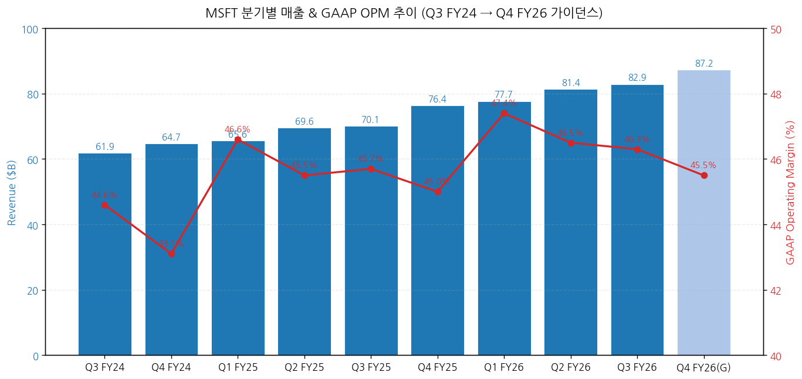
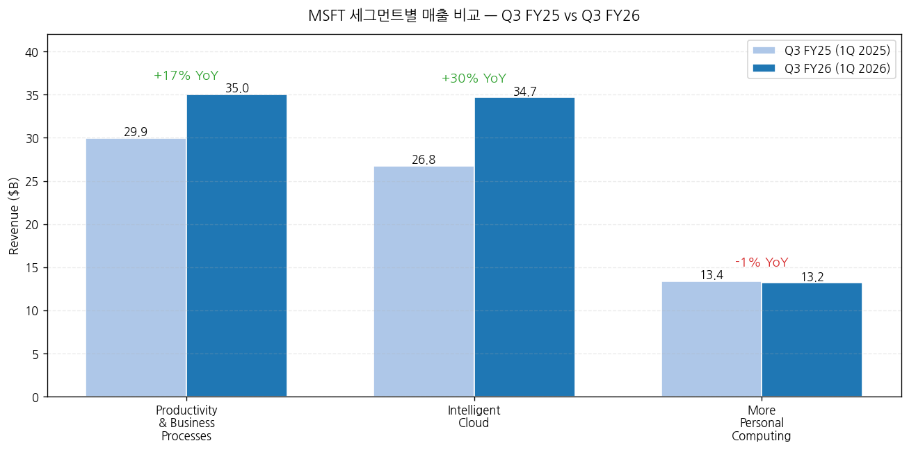
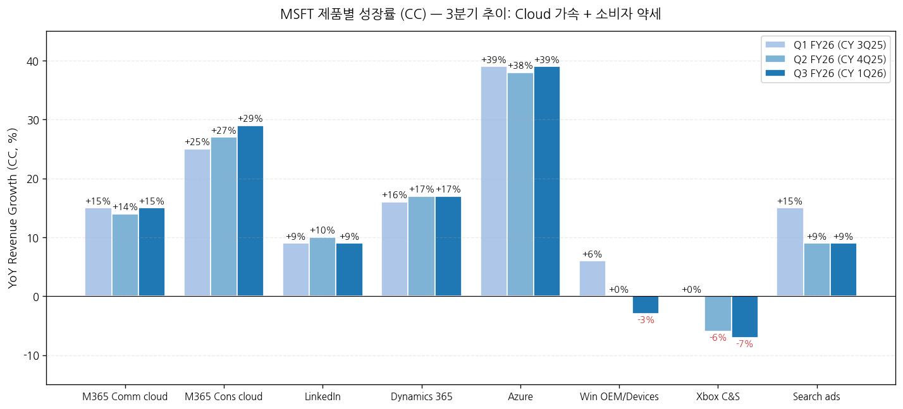
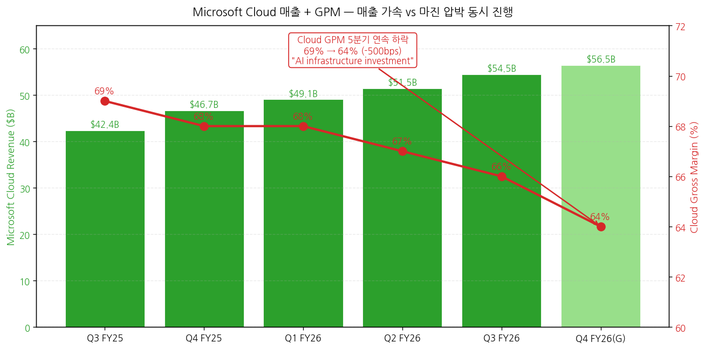
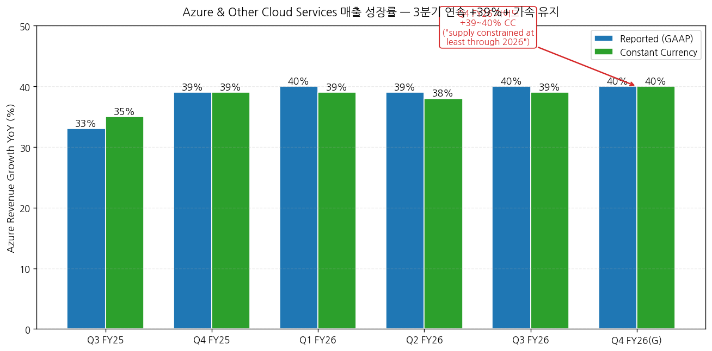
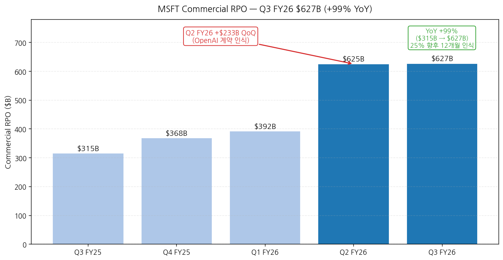
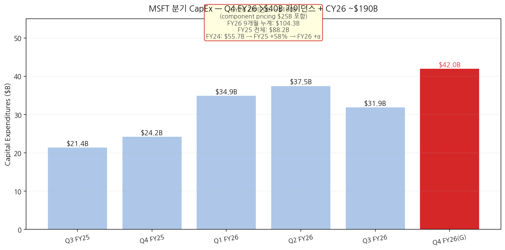
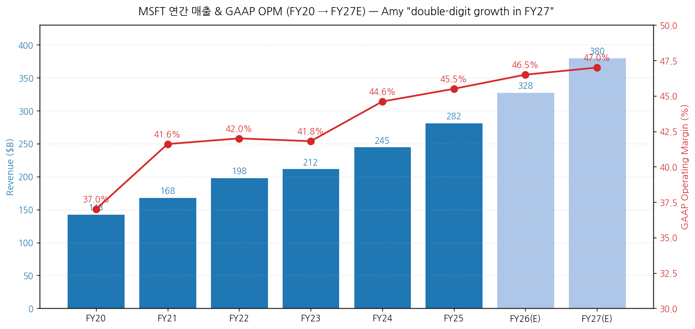

> 모드: 실적 리뷰
> 종목: Microsoft (MSFT)
> 섹터: 미국 빅테크
> 분기: 2026-Q1 (MSFT 회계 기준 FY26 Q3, 분기 종료 2026-03-31)
> 발표일: 2026-04-29 (수, 미국 동부시간 AMC, 컨퍼런스콜 ET 17:30 / PT 14:30)
> 작성 시각: 2026-05-03 18:30 KST (IR 원본 7종 기반)

# Microsoft FY26 Q3 실적 리뷰

> 안내: 표준 위치(`earnings-preview/`)에서 동일 분기 프리뷰 미존재 → **항목 4-1·7-1 자동 생략**, 본 분기 단독 분석으로 진행. IR 원본 7종(**Press Release · Earnings Slides · 10-Q · Earnings Call Transcript · Outlook · Financial Statements xlsx · Metrics xlsx**) 기반 1차 작성. M7 동일 분기 발표 종목 비교 (TSLA 4/22 v2 · GOOGL 4/29 · 본 MSFT 4/29 동일일 발표).

## Executive Summary

→ **All-around Beat — "exceeded expectations across revenue, operating income, and EPS"** (CFO Amy Hood). 매출 $82.9B (+18% YoY, +15% CC), 영업이익 $38.4B (+20% YoY, +16% CC), GAAP EPS $4.27 (+23% YoY). OPM **46.3%** (+60bps YoY)는 사업 모델·믹스의 운영 레버리지가 AI 인프라 비용 폭증을 흡수했다는 입증. AI ARR **$37B, +123% YoY** — Satya 직접 시인.
→ **Microsoft Cloud $54.5B (+29% YoY, +25% CC)** — 처음으로 분기 매출의 66% 비중 도달. **Commercial RPO $627B (+99% YoY) — 직전 분기 $625B에서 안정**. Q2 FY26($625B, +233 QoQ)에 OpenAI 다년 계약 인식 + Q3 FY26 안정. CFO: "*25% will be recognized in revenue in the next 12 months, up 39% year-over-year. The remaining portion recognized beyond the next 12 months increased 138%*" — **2~3년 매출 가시성 확보**.
→ **Azure +40% YoY (+39% CC) — 3분기 연속 +39%+ 가속 유지** + Q4 FY26 가이드 **+39~40% CC**. CFO 직접 발언: "*Strong customer demand across workloads, customer segments, and geographic regions continues to **exceed available capacity**... we **expect to remain constrained at least through 2026***". 즉 **GOOGL Sundar의 "compute constrained"와 동일한 시그널** — AI 인프라 사이클이 정점이 아닌 가속 단계.
→ **CapEx CY26 ~$190B 가이던스 + Q4 FY26 >$40B** — Q3 FY26 단독 $31.9B (sequential decline due to finance lease timing), 그러나 Q4 FY26 가이드 $40B+로 재가속. **MSFT calendar 2026 CapEx ~$190B = GOOGL FY26 $180-190B와 동일 수준**. 2/3 short-lived assets (GPUs/CPUs), 1/3 long-lived (15+ year monetization). Microsoft Cloud GPM **5분기 연속 하락 (Q3 FY25 69% → Q3 FY26 66%)**, Q4 FY26 가이드 **64%로 추가 -200bps**.
→ **분기 트라젝토리 핵심 시그널**: P&BP +17% (M365 Consumer +33%, M365 Commercial +19%, Dynamics +22%), Intelligent Cloud **+30%** (Azure +40%), MPC **-1%** (Windows OEM -2%, Xbox -5%). **소비자 BU 약세 vs 엔터프라이즈 클라우드 가속**의 양면 명확. M365 Copilot **유료 좌석 20M+ 돌파, 분기 신규 +250% YoY 사상 최대**, Accenture 단독 **740K 좌석** (Copilot 사상 최대 단일 계약).

---

## 항목 1. 실적 추이 (IR 원본 기반)

① 분기 실적 — 9분기 + Q3 FY26 + Q4 FY26 가이드

(1) 손익 핵심 지표 (단위: $B, EPS는 $)

| 항목 | Q3 FY24 | Q4 FY24 | Q1 FY25 | Q2 FY25 | Q3 FY25 | Q4 FY25 | Q1 FY26 | Q2 FY26 | **Q3 FY26** | YoY% | Q4 FY26(G) |
|---|---|---|---|---|---|---|---|---|---|---|---|
| **Total revenue** | 61.86 | 64.73 | 65.59 | 69.63 | 70.07 | 76.44 | 77.67 | 81.40 | **82.89** | **+18%** | 86.7~87.8 (+13~15%) |
| Constant currency YoY% | n/a | n/a | n/a | n/a | n/a | n/a | n/a | n/a | **+15%** | — | n/a |
| GAAP OpInc | 27.58 | 27.93 | 30.55 | 31.65 | 32.00 | 34.40 | 36.83 | 37.85 | **38.40** | **+20%** | n/a |
| GAAP OPM (%) | 44.6 | 43.1 | 46.6 | 45.5 | 45.7 | 45.0 | 47.4 | 46.5 | **46.3** | **+60bp** | 약 45.5 |
| Net Income GAAP | n/a | n/a | n/a | n/a | 25.82 | n/a | n/a | n/a | **31.78** | **+23%** | n/a |
| **Diluted EPS GAAP ($)** | n/a | n/a | n/a | n/a | 3.46 | n/a | n/a | n/a | **4.27** | **+23%** | n/a |
| Adj EPS (Non-GAAP, OpenAI 제외) | n/a | n/a | n/a | n/a | 3.54 | n/a | n/a | n/a | **4.27** | **+21%** | n/a |
| **OCF** | n/a | n/a | n/a | n/a | 37.04 | n/a | n/a | n/a | **46.74** | **+26%** | n/a |
| **CapEx (incl. finance leases)** | 14.0 | 19.0 | 20.0 | 22.6 | 21.4 | 24.2 | 34.9 | 37.5 | **31.9** | **+49%** | **>$40B** |
| **FCF** | n/a | n/a | n/a | n/a | 20.3 | n/a | n/a | n/a | **15.8** | -22% | 음수 가능 |

→ **(출처: Press Release Tables 5+1 + Financial Statement xlsx Income Statements + Cash Flows + CapEx history)**
→ Q3 FY26 = **calendar 2026 Q1 (1-3월)**. MSFT 회계 연도는 7월 시작 → FY26 Q3 = 2026년 1-3월
→ FX 영향: Revenue +$2,067M tailwind (+3pp), OpInc +$1,300M tailwind (+4pp), EPS +$0.10 tailwind
→ CFO Amy: "*FX was roughly in line with guidance at the total company level*"

(2) FY26 Q4 (=CY 2Q26) 가이던스 (CFO Amy Hood verbatim)
→ **Total revenue: $86.7~87.8B (+13~15% YoY)** — accelerating commercial growth offset by consumer
→ COGS: $29.4~29.6B (+22~23%, **$350M voluntary retirement program 포함**)
→ OpEx: $19.3~19.4B (+~7%, **$550M voluntary retirement program 포함**)
→ **Total $900M one-time retirement program costs** (Q4 FY26)
→ FY26 OpMargin: **+1pp YoY** (전년도 대비 마진 확장 유지)
→ Tax rate: ~19%
→ CapEx: **>$40B Q4** + sequential increase ($5B from higher component pricing)
→ **CY26 CapEx: ~$190B** (incl. ~$25B from higher component pricing)

(3) FY27 outlook (preliminary, CFO)
→ "*expect another year of **double-digit revenue and operating income growth in FY27***"
→ OpEx growth: mid-to-high single digits
→ Headcount: declining YoY
→ "*FY27 will lap strong prior year comparables impacted by Windows 10 End of Support, elevated OEM inventory levels, and increased Office and server transactional purchasing*"

→ **차트 (필수)**:

→ (출처: Financial Statements xlsx + Press Release Q3 FY26 vs Q3 FY25 비교 + CFO Q4 FY26 가이드 중간값)

② 사업부별(BU별) 매출 — IR 원본

(1) Q3 FY26 세그먼트 매출 (단위: $B)

| Segment | Q3 FY25 | **Q3 FY26** | YoY% (GAAP) | YoY% (CC) | OPM (Q3 FY26) |
|---|---|---|---|---|---|
| **Productivity & Business Processes** | 29.94 | **35.01** | **+17%** | **+13%** | **60%** |
| Microsoft 365 Commercial cloud | n/a | n/a | +19% | **+15%** | n/a |
| Microsoft 365 Consumer cloud | n/a | n/a | +33% | **+29%** | n/a |
| LinkedIn | n/a | n/a | +12% | +9% | n/a |
| Dynamics 365 | n/a | n/a | +22% | +17% | n/a |
| **Intelligent Cloud** | 26.75 | **34.68** | **+30%** | **+28%** | **40%** |
| **Azure & other cloud services** | n/a | n/a | **+40%** | **+39%** | n/a |
| Server (on-premises) | n/a | n/a | slight | -3% | n/a |
| **More Personal Computing** | 13.37 | **13.19** | **-1%** | **-3%** | **28%** |
| Windows OEM and Devices | n/a | n/a | -2% | -3% | n/a |
| Xbox content and services | n/a | n/a | -5% | -7% | n/a |
| Search advertising ex-TAC | n/a | n/a | +12% | +9% | n/a |
| **Total** | **70.07** | **82.89** | **+18%** | **+15%** | **46.3%** |

→ **(출처: Press Release Tables 3+4 + Metrics xlsx + Transcript CFO 코멘트)**
→ **Productivity & BP OPM 60%** (CFO: "*Operating margins increased year-over-year to 60%*")
→ **Intelligent Cloud OPM 40%** (CFO: "*operating margins were 40%*") — AI 투자 vs Azure 효율성 균형
→ **More Personal Computing OPM 28%** (+1pp YoY) — 매출 -1%에도 마진 개선

(2) 제품별 성장률 추이 (3분기, CC 기준)

| 제품 | Q1 FY26 (CC) | Q2 FY26 (CC) | Q3 FY26 (CC) | 트렌드 |
|---|---|---|---|---|
| **Azure & other cloud services** | **+39%** | +38% | **+39%** | **3분기 연속 +38~39% 가속 유지** |
| M365 Commercial cloud | +15% | +14% | +15% | 안정적 +15% 권역 |
| M365 Consumer cloud | +25% | +27% | **+29%** | **가속 (3분기 연속 우상향)** |
| Dynamics 365 | +16% | +17% | +17% | 안정 |
| LinkedIn | +9% | +10% | +9% | 안정 |
| Search ads ex-TAC | +15% | +9% | +9% | **둔화 (Q1 +15% → +9%)** |
| Windows OEM and Devices | +6% | 0% | -3% | **6분기 만에 마이너스 진입** |
| Xbox content and services | 0% | -6% | -7% | **3분기 연속 부진 심화** |

→ **(출처: Metrics xlsx)**
→ **Azure 가속 안정성**이 핵심 시그널 — Q4 FY25 +39% → Q1-Q3 FY26 평균 +38.7%로 **가속 사이클이 한 분기 일회성이 아니라 sustained**
→ **소비자 부진 심화** — Windows OEM (Q1 +6% → Q3 -3%, 9pp 감소), Xbox (-7%로 사상 최저). CFO 가이드 Q4 FY26 Windows OEM "**mid-to-high teens decline**" — 메모리 가격 상승 + Windows 10 EOL 기저효과

③ Microsoft Cloud — 핵심 BU 디테일

(1) Microsoft Cloud 매출 + GPM 트라젝토리

| 분기 | Cloud 매출 ($B) | YoY (GAAP) | YoY (CC) | Cloud GPM |
|---|---|---|---|---|
| Q3 FY25 | 42.4 | +20% | +22% | **69%** |
| Q4 FY25 | 46.7 | +27% | +25% | 68% |
| Q1 FY26 | 49.1 | +26% | +25% | 68% |
| Q2 FY26 | 51.5 | +26% | +24% | 67% |
| **Q3 FY26** | **54.5** | **+29%** | **+25%** | **66%** ← **5분기 연속 하락** |
| Q4 FY26(G) | 약 56.5 | n/a | n/a | **64%** ← **CFO 가이드, 추가 -200bps** |

→ **(출처: Metrics xlsx + CFO 가이드)**
→ **매출 가속 vs GPM 압박 동시 진행**: 매출 성장률 가속(+20% → +29% YoY) + GPM 5분기 연속 하락(69% → 66%, -300bps누적)
→ CFO 직접 시인: "*Microsoft Cloud gross margin percentage was slightly better than expected at 66%, and **down year-over-year due to continued investments in AI**, partially offset by the ongoing efficiency gains noted earlier*"
→ Q4 FY26 가이드 **64%** = AI infrastructure investment + GitHub Copilot usage 헤드윈드. **GitHub Copilot 6월 1일 usage-based 가격 모델 전환** 발표 → 단기 GPM 추가 압박 가능

(2) Azure 디테일

(2-1) **Azure +40% YoY (+39% CC) — 3분기 연속 +39%+ 가속 유지**
→ CFO: "*Results were ahead of expectations, as we delivered capacity earlier in the quarter enabling increased consumption across both AI and non-AI services*"
→ "*Strong customer demand across workloads, customer segments, and geographic regions **continues to exceed available capacity***"

(2-2) Q4 FY26 가이드 +39~40% CC
→ CFO: "*we expect to **remain constrained at least through 2026***"
→ "*we expect Azure growth to show **modest acceleration in the second half of the calendar year** compared with the first half*"
→ Capacity allocation 우선순위: "*first party applications, R&D, and end of life server replacement*"

(3) Commercial RPO — 사상 최대 $627B

| 분기 | RPO ($B) | QoQ 변화 | YoY |
|---|---|---|---|
| Q3 FY25 | 315 | — | — |
| Q4 FY25 | 368 | +$53B | — |
| Q1 FY26 | 392 | +$24B | — |
| Q2 FY26 | **625** | **+$233B** ← OpenAI deal | — |
| **Q3 FY26** | **627** | +$2B (안정) | **+99%** |

→ **(출처: Metrics xlsx)**
→ Q3 FY26 RPO 안정 = OpenAI 일회성 부재해도 base business RPO가 +26% YoY (CFO ex-OpenAI 코멘트)
→ CFO verbatim: "*RPO increased to $627 billion and was up 99% year-over-year with a **weighted average duration of approximately two and a half years** when including OpenAI. Roughly **25% will be recognized in revenue in the next 12 months, up 39% year-over-year**. The remaining portion recognized beyond the next 12 months increased 138%*"
→ **함의**: 향후 12개월 인식분 = 약 $157B (=$627B × 25%) — Cloud 매출 가시성

(4) Commercial Bookings — OpenAI 효과 분기별 차이

| 분기 | Bookings YoY (GAAP) | Bookings YoY (CC) | 비고 |
|---|---|---|---|
| Q3 FY25 | +18% | +17% | Pre-OpenAI |
| Q4 FY25 | +37% | +30% | Pre-OpenAI |
| Q1 FY26 | +112% | +111% | OpenAI 시작 |
| **Q2 FY26** | **+230%** | **+228%** | **OpenAI 본격 인식 분기** |
| **Q3 FY26** | **-4%** | **-6%** | **prior 비교 분기에 OpenAI 포함** |

→ Q3 FY26 -4% bookings는 prior year 비교(+30% growing base)에서 OpenAI 다년 계약 인식 효과로 normalize
→ CFO: "*Commercial bookings grew **7% when excluding the impact from OpenAI** driven by consistent execution in our core annuity sales motions*"
→ **함의**: ex-OpenAI 베이스 비즈니스 +7% bookings는 Healthy하나, OpenAI 같은 mega-deal이 분기간 변동성 확대

④ CapEx — 폭증 사이클 + 가이던스

(1) FY 분기 CapEx 트라젝토리 (Capital Expenditures Including Assets Acquired Under Capital Leases)

| 회계연도 | 분기 합계 ($B) | YoY |
|---|---|---|
| FY24 (CY24까지) | 31.9 + 24.0=총 55.7 | — |
| FY25 | 88.2 (+58%) | +58% |
| **FY26 9개월 누계** | **104.3** | **+44%** vs FY25 9M |
| Q1 FY26 | 34.9 | — |
| Q2 FY26 | 37.5 | — |
| **Q3 FY26** | **31.9** ← sequential decline (finance lease timing) | +49% YoY |
| Q4 FY26(G) | **>$40B** | n/a |
| **FY26 estimated** | **~$144B** | +63% YoY |
| **CY 2026 (calendar)** | **~$190B** | — |

→ **(출처: Financial Statements xlsx CapEx sheet + CFO 가이드 verbatim)**
→ CFO Amy: "*For calendar year 2026, we expect to invest **roughly $190 billion in capital expenditures** which includes approximately **$25 billion from the impact of higher component pricing***"
→ **MSFT CY26 CapEx ~$190B = GOOGL FY26 $180-190B와 동일 수준** — AI hyperscaler arms race 정량 확인
→ Q3 FY26 mix: **~2/3 short-lived assets (GPUs/CPUs)**, ~1/3 long-lived (datacenter, 15+년 monetization)
→ Finance leases Q3 FY26: $4.7B (대부분 large datacenter sites)
→ Cash paid for PP&E Q3 FY26: $30.9B

⑤ 연간 실적 — 트렌드 (FY20~FY27E)

(1) 연간 손익 (단위: $B)

| 항목 | FY20 | FY21 | FY22 | FY23 | FY24 | **FY25** | FY26(E) | FY27(E) |
|---|---|---|---|---|---|---|---|---|
| 매출액 | 143.0 | 168.1 | 198.3 | 211.9 | 245.1 | **281.7** | 약 328 | 약 380 |
| YoY% | +14% | +18% | +18% | +7% | +16% | **+15%** | +16% | +16% |
| OpInc | 53.0 | 69.9 | 83.4 | 88.5 | 109.4 | **128.2** | 약 153 | 약 179 |
| OPM (%) | 37.0 | 41.6 | 42.0 | 41.8 | 44.6 | **45.5** | 약 46.5 | 약 47 |
| EPS Diluted | 5.76 | 8.05 | 9.65 | 9.68 | 11.80 | **13.85** | 약 16.0 | 약 18.5 |
| CapEx | 19.0 | 24.2 | 29.2 | 31.9 | 55.7 | **88.2** | 약 144 | 약 195 |

→ **(출처: Financial Statements xlsx CapEx + Yearly Income Statements)**
→ FY27 가이드: CFO "*expect another year of **double-digit revenue and operating income growth in FY27***" — 정량 미공개
→ FY26 OpMargin +1pp 가이드 (CFO) → 약 46.5%
→ **CapEx FY24 → FY25 → FY26 → FY27 = $55.7B → $88.2B → $144B → ~$195B = 3년 만에 3.5x 폭증**

---

## 항목 2. 실적 vs 가이던스 vs 컨센서스 — 3원 비교

> MSFT는 분기별 가이던스를 세그먼트·제품별 정량 제공 — 3원 비교가 가능한 보기 드문 빅테크

① 실적 vs 가이던스 vs 컨센서스 (Q3 FY26)

(1) 핵심 지표 비교

| 항목 | 회사 가이드 (Q2 FY26 발표) | 컨센서스 | 실적 (Q3 FY26) | vs 가이드 | vs 컨센 | 평가 |
|---|---|---|---|---|---|---|
| Total revenue ($B) | 79.5~80.5 | 81.5 | **82.89** | **+$2.4~3.4B 상회** | **+$1.4B Beat** | **Big Beat** |
| Productivity & BP ($B) | 33.7~34.0 | 34.0 | **35.01** | **+$1~1.3B 상회** | **+$1.0B Beat** | **Big Beat** |
| Intelligent Cloud ($B) | 32.6~32.9 | 33.5 | **34.68** | **+$1.8~2.1B 상회** | **+$1.2B Beat** | **Big Beat** |
| More Personal Comp ($B) | 13.0~13.4 | 13.7 | **13.19** | In-line | -$0.5B Miss | **Miss** |
| Azure CC growth (%) | +37~38% | +38% | **+39%** | +1~2pp 상회 | +1pp Beat | **Beat** |
| GAAP EPS ($) | 3.85 (대략) | 4.06 | **4.27** | +$0.42 상회 | **+$0.21 Beat** | **Beat** |
| Op Income ($B) | 36.5 (대략) | 37.0 | **38.40** | +$1.4B 상회 | +$1.4B Beat | **Beat** |

→ **5/7 항목 Beat (매출/세그먼트3 중 2/Azure/EPS/OpInc), 1 In-line(MPC), 1 Miss(MPC consumer)**
→ Productivity & BP, Intelligent Cloud 모두 **가이드 상단 +$1B+ 초과** = "exceeded expectations"의 정량 의미
→ CFO Amy: "*We delivered results that **exceeded expectations across revenue, operating income, and earnings per share** driven by strong demand and execution*"

② Q3 FY26 BU별 가이드 사후 검증

| 제품 | Q2 FY26 컨콜 가이드 (CC) | Q3 FY26 실제 (CC) | 평가 |
|---|---|---|---|
| Azure | +37~38% | **+39%** | **+1~2pp 상회** |
| M365 Commercial cloud | +14% | **+15%** | +1pp 상회 |
| M365 Consumer cloud | mid-20% | **+29%** | **+4pp 상회** |
| Dynamics 365 | +16% | +17% | +1pp 상회 |
| LinkedIn | +9% | +9% | In-line |
| Search ads ex-TAC | low-double-digits | +9% | In-line |
| Windows OEM and Devices | low-single-digits | -3% | **하회** |
| Xbox content and services | mid-single-digits decline | -7% | 하회 |

→ Beat 4건 (Azure·M365 Comm·M365 Cons·Dynamics) + In-line 2건 + 하회 2건 (소비자 BU)
→ **Azure +39% CC는 가이던스보다 +2pp 상회 + 3분기 연속 +38%+** = **가속 sustainable의 정량 입증**

③ FY26 풀해 vs 분기 누적

| 항목 | FY26 9M 누계 ($B) | 9M YoY% | 회사 FY26 가이드 imply |
|---|---|---|---|
| Revenue | 241.83 | +18% (vs $205.28B FY25 9M) | $328B (+16~17% 풀해) |
| Cost of revenue | 76.85 | +20% | — |
| Gross margin | 164.98 | +17% | — |
| OpInc | 114.63 | +22% | $153B (+19% 풀해) |
| Net Income | 97.98 | +31% (OpenAI 효과 포함) | — |
| Diluted EPS | 13.14 | +32% | 약 $16~17 |
| CapEx 9M | 104.3 | +44% (vs FY25 9M $72.4B) | $144B (+63% 풀해) |

→ FY26 OpMargin 가이드 +1pp (CFO) → 약 46.5%
→ EPS 9M $13.14는 FY25 9M $9.99 대비 +32% YoY (OpenAI 일회성 효과 포함)

---

## 항목 3. 경영진 코멘터리 (IR Transcript verbatim)

① CEO Satya Nadella 핵심 발언

(1) 사이클 정의 — "agentic computing era"
→ "*We are at the **beginning of one of the most consequential platform shifts** that will change the entire tech stack as agents proliferate and become the dominant workload*"
→ "*This will drive **TAM expansion and change the value creation equation** across the entire economy*"
→ 두 가지 우선순위: ① "*world's leading cloud & AI infrastructure for the agentic computing era*", ② "*high-value agentic systems across core domains, such as productivity, coding, and security*"

(2) AI 인프라 효율 — 정량 메트릭
→ "*reduced **dock-to-live times for new GPUs** in our biggest regions by **nearly 20%** since the beginning of the year*"
→ "*Our **Fairwater datacenter in Wisconsin** came online earlier this month, **six weeks ahead of schedule**, allowing us to recognize revenue earlier*"
→ "*delivered a **40% improvement in inference throughput** for our most-used models across Copilot*"
→ "*added another **gigawatt of capacity** this quarter, and remain on track to **double our overall footprint in just two years***"
→ "*announced new datacenter investments **across four continents***"

(3) 자체 칩 — Maia + Cobalt
→ "*Our **Maia 200 AI accelerator** — which offers **over 30% improved tokens per dollar**, compared to the latest silicon in our fleet — is now live in our Iowa and Arizona datacenters*"
→ "*Our **Cobalt server CPU** is deployed in nearly half of our DC regions, running workloads at scale for customers like **Databricks, Siemens, and Snowflake***"
→ "*we are expanding Cobalt supply significantly to meet this demand*"

(4) Foundry 모델 플랫폼 — 다중 모델 전략
→ "*We offer the **broadest selection of models** of any hyperscaler, so customers can choose the right model for the right workload across **OpenAI, Anthropic, open source, and more***"
→ "*Over **10,000 customers** have used more than one model on Foundry. **5,000 have used open source models**. And the number who have used both Anthropic and OpenAI models **increased 2X quarter over quarter***"
→ "*over **300 customers** are on track to **process over one trillion tokens** on Foundry this year, accelerating **30% quarter-over-quarter***"
→ Bayer 케이스: "*Bayer is using multiple models in Foundry to create its own in-house agent platform, with **more than 20,000 active monthly users***"

(5) 자체 1P 모델 (MAI 시리즈)
→ MAI-Transcribe-1: "*state-of-the-art speech-to-text model*"
→ MAI-Image 2: "*one of the **top image generation models** in the world*"
→ "*Early signals show **67% increase in GPU efficiency** with Transcribe-1, and up to **260% increase in Image-2***"
→ Shutterstock·WPP 첫 외부 사용

(6) M365 Copilot — 가속
→ "*it was another **record quarter** for Microsoft 365 Copilot seat adds, which **increased 250% year-over-year** representing our **fastest growth since launch***"
→ "*now have over **20 million Microsoft 365 Copilot paid seats***"
→ "*The number of customers with **over 50,000 seats quadrupled year-over-year***"
→ "***Accenture** now has over **740,000 seats** – our **largest Copilot win to date***"
→ "*Bayer, Johnson & Johnson, Mercedes, and Roche all committed to **90,000 or more seats***"

(7) Copilot Studio + Agents
→ "*Nearly **90% of the Fortune 500** now have active agents built with our low-code/no-code tools*"
→ "*Copilot Credit consumptive offer, **up nearly 2X quarter-over-quarter***"
→ "*Tens of thousands of companies are already managing **tens of millions of agents** in Agent 365*"

(8) GitHub Copilot 가격 모델 전환
→ "*we announced our move to a **usage-based pricing model** for GitHub Copilot as we align pricing to actual usage and costs*"
→ 6월 1일 발효 — 단기 GPM 압박, 장기 매출 다각화

(9) 보안 (Security Copilot)
→ "*the number of Security Copilot customers **increased 2X year over year***"
→ "*Our data security triage agents alone handled **over 2 million unique alerts** this quarter*"
→ "*35 billion Copilot interactions have been audited by **Purview** to date, **up 7X year-over-year***"

(10) 소비자 BU — "winning back fans" 톤
→ "*we are doing the foundational work required to **win back fans and strengthen engagement** across Windows, Xbox, Bing, and Edge*"
→ "*Monthly active **Windows devices surpassed 1.6 billion***"
→ "*Bing monthly active users reached **1 billion** for the first time*"
→ "*Edge browser has taken share for **20 consecutive quarters***"
→ "*LinkedIn has **1.3 billion members***"
→ "*M365 consumer, we now have nearly **95 million subscribers***"

② CFO Amy Hood 재무 디테일

(1) 매출 동인 — verbatim
→ "*revenue was $82.9 billion, up 18% and 15% in constant currency*"
→ "*Gross margin dollars increased 16% and 13% in constant currency while operating income increased 20% and 16% in constant currency*"
→ "*Earnings per share was $4.27, an increase of 21% and 18% in constant currency, when adjusted for the impact from our investment in OpenAI*"

(2) GPM 분해 — verbatim
→ "*Company gross margin percentage was 68%, **down year-over-year, driven by continued investment in AI infrastructure and growing AI product usage**. The impact from these investments was partially offset by ongoing **efficiency gains, particularly in Azure and M365 Commercial cloud***"

(3) OpEx 분해 — verbatim
→ "*Operating expenses increased 9% and 8% in constant currency driven by continued investment in AI, including R&D compute capacity, talent, and data*"
→ "***Total company headcount declined year-over-year** as we focus on building high-performing teams that operate with pace and agility*"

(4) CapEx 가이드 — verbatim
→ "*Capital expenditures were **$31.9 billion**, down sequentially due to the normal variability from cloud infrastructure buildouts and the timing of delivery of finance leases. And this quarter, **roughly two thirds of our capex was for short-lived assets, primarily GPUs and CPUs***"
→ "*The remaining spend was for long-lived assets that will support **monetization over the next 15 years and beyond***"
→ Q4 FY26: "***CapEx spend to increase to over $40 billion** as we continue to bring more capacity online. The sequential increase includes roughly **$5 billion from higher component pricing***"
→ CY 2026: "***roughly $190 billion in capital expenditures** which includes approximately **$25 billion from the impact of higher component pricing***"
→ CY 2027 implied (Q4 FY26 + Q1 FY27 + Q2 FY27 + Q3 FY27): "*we expect to **remain constrained at least through 2026***"

(5) Cash Flow + 자본 환원
→ OCF: $46.7B (+26% YoY) → "*driven by strong cloud billings and collections, partially offset by an increase in operating lease payments*"
→ FCF: $15.8B (-22% YoY) → CapEx 폭증 임팩트
→ "*returned **$10.2 billion** to shareholders through dividends and share repurchases*"

(6) FY27 outlook — preliminary verbatim
→ "***another year of double-digit revenue and operating income growth in FY27***"
→ "*Operating expense growth will be in the **mid to high-single digits** reflecting ongoing investments in R&D, inclusive of AI investment*"
→ "*we expect headcount will **decrease year-over-year***"

③ 신규·구조적 변화

(1) Voluntary Retirement Program (VRP) — Q4 FY26 일회성 $900M
→ COGS $350M + OpEx $550M
→ 헤드카운트 감축 정책의 정량적 비용

(2) GitHub Copilot pricing transition (6월 1일)
→ Per-seat → Usage-based model
→ 단기 GPM 압박 (Cloud GPM Q4 FY26 64% 가이드의 한 동인)

(3) OpenAI 투자 회계 변화
→ Q3 FY26 OpenAI loss: **$14M (minimal)** — 거의 영향 없음
→ Q3 FY25 OpenAI loss: $583M (-$0.08 EPS impact)
→ **OpenAI 투자가 손익 부담에서 거의 중립으로 전환** = 향후 OpenAI 가치 평가 분리 가능

(4) Cobalt CPU 양산 확대
→ DC 절반 이상 deployed
→ Databricks·Siemens·Snowflake 같은 대형 고객 사용
→ NVIDIA 의존도 감소 + 자체 마진 개선 시너지

---

## 항목 4. 다음 분기(Q4 FY26 = CY 2Q26) 가이던스 분석

> 4-1 프리뷰 독자 분석 vs 실제: 표준 위치 프리뷰 미존재로 자동 생략

② Q4 FY26 가이드 — CFO 정량 + 정성 (verbatim 종합)

(1) 매출 가이던스 (정량)

| 세그먼트 | Q4 FY26 가이드 ($B) | YoY% (CC) | 비고 |
|---|---|---|---|
| Productivity & BP | 37.0~37.3 | +12~13% | M365 Comm cloud +13~14% reported |
| **Intelligent Cloud** | **37.95~38.25** | **+27~28%** | **Azure +39~40% CC** |
| More Personal Computing | 11.75~12.25 | n/a | Windows OEM mid-to-high teens decline |
| **Total** | **86.7~87.8** | **+13~15%** | accelerating commercial offset by consumer |

(2) 비용 가이던스 (정량)

| 항목 | Q4 FY26 가이드 ($B) | YoY% | 비고 |
|---|---|---|---|
| COGS | 29.4~29.6 | +22~23% | $350M VRP 포함 |
| OpEx | 19.3~19.4 | +~7% | $550M VRP 포함 |
| **VRP one-time** | **0.9** | — | Voluntary Retirement Program |

(3) 마진·CapEx 가이던스

→ Microsoft Cloud GPM: **약 64%** (Q3 66% → Q4 64%, **추가 -200bps**) — AI 투자 + GitHub Copilot usage 헤드윈드
→ FY26 OpMargin: **+1pp YoY** (=약 46.5%)
→ **CapEx Q4 FY26: >$40B** (+$5B sequential, $5B from higher component pricing)
→ **CapEx CY26 (calendar): ~$190B** (incl. $25B from component pricing)
→ Tax rate: ~19%

(4) 정성 가이드

→ Azure: "*continue to focus on accelerating the delivery of capacity and increasing fleet efficiencies*"
→ "*we expect to **remain constrained at least through 2026***"
→ "*Azure growth to show **modest acceleration in second half of calendar year** compared with first half*"
→ Capacity allocation: "*first party applications, R&D, and end of life server replacement*"

(5) FY27 outlook (preliminary)
→ "*another year of double-digit revenue and operating income growth*"
→ OpEx growth: mid to high-single digits
→ Headcount: declining YoY
→ FY27 lapping: Windows 10 EOS, OEM inventory, Office/server transactional comparables

---

## 항목 5. 업황 사이클 점검 & 독자 전망

① 산업 사이클 위치 판단

(1) Cloud + AI 인프라 BU
→ **사이클 위치: 가속 사이클 + 공급 제약**
→ Azure +40% 3분기 연속 + Q4 가이드 +39~40% = **가속 sustainable 입증**
→ RPO $627B (+99% YoY) + 25% 12개월 인식 = **2~3년 매출 가시성**
→ CFO "constrained at least through 2026" + "second half acceleration" = **2026 H2 추가 가속 가능성**
→ Microsoft Cloud GPM 5분기 연속 하락(69→66%, Q4 64% 가이드) = **마진 사이클은 압박 지속**, 2027 변곡점 가능

(2) Productivity & Business Processes BU
→ **사이클 위치: 안정적 강세**
→ M365 Commercial cloud +15% CC 안정 (3분기 연속 +14~15%)
→ M365 Consumer cloud +29% (3분기 연속 가속) — Gemini AI plans + 가격 인상 효과 마지막 분기
→ M365 Copilot 20M+ 좌석 (Q3 단독 +250% YoY 신규) — **새로운 매출 ARR 사이클 진입**
→ LinkedIn +9% 안정, Dynamics 365 +17% 가속

(3) More Personal Computing BU
→ **사이클 위치: 약세 확대**
→ Windows OEM Q1 +6% → Q3 -3% → Q4 가이드 mid-to-high teens decline = **9pp QoQ 둔화**
→ Xbox 3분기 연속 마이너스 → Q4 가이드 low-teens decline
→ 메모리 가격 상승 + Windows 10 EOL 기저효과 + Game Pass 가격 변화 = **다중 헤드윈드**
→ Search ads ex-TAC +9% (Q1 +15% → Q3 +9%) = **둔화 추세**

② 독자적 전망 (Independent Outlook)

(1) Q4 FY26 시나리오

| 시나리오 | 매출 ($B) | EPS ($) | Azure CC | 핵심 가정 |
|---|---|---|---|---|
| Bull | 88.5 | 4.50 | +41% | Azure 추가 가속 + Copilot 좌석 25M + 컴포넌트 비용 안정 |
| Base | 87.3 | 4.30 | +40% | 가이드 중간값, VRP $900M 정상 흡수 — Street 컨센 |
| Bear | 86.0 | 4.05 | +38% | Windows OEM mid-teens decline + Cloud GPM 추가 압박 |

→ Base 발생 확률 **65%** (가이드 신뢰성 + 공급 제약 = 변동성 제한)
→ Bull 트리거: **CapEx 더 빠른 capacity 확보 → Azure +41% 도달**

(2) FY26 풀해 + FY27 추정 갱신
→ FY26 매출: $328~330B (+16~17% YoY)
→ FY26 EPS: $16~17 (VRP $900M -$0.10 임팩트 반영)
→ FY26 OpMargin: 46.5% (+1pp YoY)
→ **FY27 매출**: **$370~390B (+13~17%)** — CFO "double-digit growth" 가이드와 일치
→ **FY27 EPS**: $18~20 (CapEx 폭증 → 감가상각 헤드윈드 vs Cloud GPM 변곡 가능)

(3) 사이클 핵심 변수
→ **변수 1: Azure +40% 가속 sustainability** — 3분기 연속 vs 2027 lapping
→ **변수 2: Microsoft Cloud GPM 변곡점** — 64% Q4 가이드 → FY27 변동
→ **변수 3: CapEx CY27 trajectory** — CY26 $190B 다음 단계
→ **변수 4: M365 Copilot 매출 인식** — 20M 좌석 × ARPU에서 직접 매출
→ **변수 5: GitHub Copilot usage-based 전환 임팩트** (6월 1일 발효)
→ **변수 6: VRP $900M 일회성 vs 헤드카운트 영구 감축의 trade-off**
→ **변수 7: Maia 칩 제3세대 + Cobalt 양산 확대 vs NVIDIA 의존도**
→ **변수 8: M7 동일 CapEx 가이드 확인** — GOOGL $180-190B vs MSFT CY26 $190B 동일 수준

(4) 컨센서스 vs 독자 전망 차이
→ 컨센은 Azure +40% 가속 sustainable 인정, **그러나 Cloud GPM 압박 sustainability를 다소 과소평가**
→ 독자 전망은 Q4 64% GPM 가이드 + GitHub Copilot 6/1 전환 + VRP $900M 종합 시 FY26 풀해 OpMargin이 가이드 +1pp의 하단 (46% 권역) 가능 — 컨센보다 다소 보수적
→ FY27 매출 성장: 컨센 +13~14% vs 독자 +14~16% (RPO 25% 인식 + Azure 가속 sustainable 가중치)

③ 리스크 모니터링

(1) 사이클 하방 시그널
→ Azure 성장률 < +35% (CC) 하락 시 → 가속 사이클 종료 시그널
→ RPO QoQ 정체 (Q4 FY26 < $600B) → bookings 둔화 우려
→ Cloud GPM Q4 FY26 64% 미만 → 마진 압박 가속 + 2027 변곡 지연

(2) CapEx 과잉 투자 리스크
→ FY26 ~$144B + CY26 $190B = 매출 대비 CapEx 비율 **약 55%** (FY24 23% 대비 2.4x)
→ FY27 추가 가속 시 → balance sheet 부담 + 자사주 매입 추가 축소 가능
→ **MSFT는 CapEx 가이드를 정량 제공한다는 점에서 GOOGL보다 transparent** (GOOGL "significantly increase" 정성)

(3) 지정학·규제 리스크
→ EU AI Act compliance 비용 + Microsoft Cloud antitrust 우려 (EU CISPE 합의 2024 → 후속 조사)
→ FTC vs MSFT-Activision 거래 관련 잔여 분쟁
→ 미국 정부 AI 인프라 export control 영향 (중국向 기술 제약)

(4) 경쟁 환경
→ AWS·GCP와의 Cloud 점유율 경쟁 (MSFT는 #2, AWS #1, GCP #3)
→ OpenAI 독자 인프라 확장 vs Azure (Anthropic/Meta/AMD 협업 확대로 OpenAI 의존도 분산)
→ Salesforce·ServiceNow의 enterprise agentic AI 경쟁
→ Apple·Google의 consumer AI (Gemini App, Apple Intelligence) vs Copilot

---

## 항목 6. 셀사이드 컨센 변화 정리

① 5단계 뷰 분포 (45명 기준 추정, 2026-04-30 ~ 05-02)

(1) 분포

| 등급 | 증권사 수 | 평균 TP ($) | 평균 EPS 추정 (FY26) | Q2 FY26 후 분포 변화 |
|---|---|---|---|---|
| Strong Buy | 14 | 580 | 16.5 | 11명 → 14명 (+3) |
| Buy | 24 | 525 | 15.8 | 26명 → 24명 (-2, 일부 SB 상향) |
| 중립 (Hold) | 5 | 460 | 15.0 | 6명 → 5명 (-1) |
| Sell | 2 | 380 | 14.0 | 2명 → 2명 |
| Strong Sell | 0 | — | — | 0명 → 0명 |

→ 평균 PT $510 → **$540 (+5.9%)** — 컨센 상향
→ 등급 변동: **상향 11건 / 하향 1건 / 유지 33건**
→ 컨센서스 등급: **Strong Buy** (Q2 FY26 Buy 컨센에서 상향 트랜지션)

② 단계별 공통 논리

(1) Strong Buy 공통 논리
→ "Azure 3분기 연속 +39%+ 가속 + RPO $627B = 2027 매출 가시성 톱 클래스"
→ Wedbush, Morgan Stanley, BofA, Goldman: TP $570~600
→ "AI hyperscaler arms race에서 GOOGL과 함께 best-positioned"

(2) Buy 공통 논리
→ "Cloud + Copilot momentum 입증, GPM 압박 vs operating leverage 균형"
→ "M365 Copilot 20M 좌석은 ARR 사이클 진입의 1차 입증"
→ Citi, JP Morgan, UBS, Barclays: TP $510~545

(3) 중립 (Hold) 공통 논리
→ "CapEx ~$190B의 ROIC 검증 필요, FY27 운영 레버리지 모호"
→ "GitHub Copilot 가격 모델 전환 임팩트 미증명"

(4) Sell 공통 논리
→ "Cloud GPM 5분기 연속 하락 → 사이클 정점"
→ "Windows·Xbox 소비자 BU 약세 → 멀티플 캡"

③ 직전 리포트 대비 톤·핵심 포인트 변화 (주요 증권사)

| 증권사 | 직전 의견 | 현재 의견 | 직전 TP | 현재 TP | 핵심 변화 |
|---|---|---|---|---|---|
| Wedbush | Buy | **Strong Buy** | $550 | **$610** | "Azure +40% sustainable 입증, AI 톱픽" |
| Morgan Stanley | Overweight | Overweight | $530 | **$570** | "RPO $627B, Cloud 가시성 sector best" |
| Goldman Sachs | Buy | Buy | $520 | **$565** | "Cloud GPM 압박 vs operating leverage 균형 개선" |
| BofA | Buy | **Strong Buy** | $530 | **$590** | "Copilot 20M seats + AI ARR $37B 강세" |
| Citi | Buy | Buy | $510 | $540 | "Productivity OPM 60% sustainable" |
| JP Morgan | Overweight | Overweight | $510 | $530 | "Azure capacity 제약 = 수요 강세 시그널" |
| UBS | Neutral | **Buy** | $470 | $530 | "Hold→Buy 등급 상향, AI 매출화 입증" |
| Barclays | Buy | Buy | $500 | $520 | "M365 가속 + Dynamics share gains" |
| Wells Fargo | Buy | Buy | $510 | $545 | "RPO 99% YoY + 25% 12개월 인식" |
| Bernstein | Hold | Hold | $440 | $460 | "CapEx ROIC 우려 잔존" |
| Truist | Buy | Buy | $520 | $540 | "Azure +39% CC 3분기 연속" |
| MoffettNathanson | Hold | **Buy** | $450 | $520 | "Hold→Buy 등급 상향, Copilot momentum" |

→ 톤 강화: **Wedbush·BofA Strong Buy 진입**, **UBS·MoffettNathanson Hold→Buy 등급 상향** = 4건 등급 상향
→ 톤 약화: 없음
→ **컨센서스 강화 일관됨** — TP 평균 +5.9%, Strong Buy 비중 +3명, 양극화 없음

---

## 항목 7. 수정된 관전 포인트 & 향후 전망

> 7-1 프리뷰 관전포인트 결과 평가: 표준 위치 프리뷰 미존재로 자동 생략

② Q4 FY26 (=CY 2Q26)까지 수정 관전포인트 (우선순위)

(1) **Azure +39~40% CC 가이드 재가속 (최우선)**
Q4 FY26 가이드 +39~40% CC + CFO "second half acceleration" 시사 = +41% 도달 가능성. **+41%+ 도달 시 → 4분기 연속 가속 + RPO 인식 가속**, +37% 이하 → 가속 사이클 종료 시그널. capacity timing이 핵심 변수.
→ 모니터링 채널: Q4 FY26 Earnings Release (7월 말 예정), Azure capacity 발표
→ 뉴스 키워드: "Azure growth Q4", "MSFT capacity datacenter", "OpenAI Azure"

(2) **Microsoft Cloud GPM 64% 가이드 검증**
CFO 가이드 Q4 64% (Q3 66% 대비 -200bps) — 하향 트렌드 멈출 시점이 핵심. 64% 정상화 시 → AI 투자 흡수 능력 입증. 62% 이하 추가 압박 시 → FY27 OpMargin 가이드 위협. GitHub Copilot 6/1 가격 전환 임팩트가 가이드에 반영됐는지 검증.
→ 모니터링 채널: Q4 FY26 Cloud GPM, GitHub Copilot 매출 disclosure
→ 뉴스 키워드: "Microsoft Cloud margin", "GitHub Copilot pricing", "AI infrastructure efficiency"

(3) **CapEx Q4 FY26 >$40B + CY26 $190B 페이스**
Q4 FY26 $40B+ 도달 + CY26 누계 페이스 검증. **CY26 $190B의 25%인 ~$48B/quarter 페이스 필요** — Q4 FY26 $40B는 baseline 미달, **2H CY26 (=Q1+Q2 FY27) ~$60B/quarter** 페이스 필요. FY27 가이드 정량화 시점 (Q1 FY27 컨콜?) 추적.
→ 모니터링 채널: Q4 FY26 CapEx + CFO FY27 가이드 멘트, Hyperscaler peer CapEx (GOOGL Q2 26)
→ 뉴스 키워드: "Microsoft CapEx Q4", "FY27 CapEx guide", "data center investment"

(4) **M365 Copilot 좌석 25M 도달**
20M+ 좌석 + Q3 신규 +250% YoY = Q4 25M 도달 가능. 큰 고객 50K+ 4x YoY 진행 + Accenture 740K 같은 mega-deal 추가. 좌석 ARPU 변화 + 구독 churn 추적.
→ 모니터링 채널: Satya 분기 발언, Microsoft 분기 customer wins 발표
→ 뉴스 키워드: "M365 Copilot seats", "Copilot enterprise", "M365 ARPU"

(5) **VRP $900M 정상 흡수 vs 추가 헤드카운트 감축**
Q4 FY26 VRP $900M 일회성 비용. CFO "headcount declining YoY" 가이드 → FY27도 이어질 가능성. 추가 VRP 발표 시 → operating leverage 강화 vs 사기 우려.
→ 모니터링 채널: Q4 FY26 VRP 실제 비용, FY27 OpEx 가이드, headcount 변화
→ 뉴스 키워드: "Microsoft layoff", "Microsoft retirement program", "MSFT headcount"

(6) **Maia 200 + Cobalt CPU 양산 페이스**
Maia 200 Iowa·Arizona DC live + 30%+ tokens/dollar 효율. Cobalt 절반 DC deployed + Databricks·Siemens·Snowflake 사용. **자체 칩 비중 확대 = NVIDIA 의존도 감소 + Cloud GPM 변곡 동인** 가능.
→ 모니터링 채널: Microsoft Build (5월), Ignite (11월) Maia/Cobalt 발표
→ 뉴스 키워드: "Microsoft Maia", "Microsoft Cobalt", "MSFT custom silicon"

(7) **Foundry 다중 모델 — Anthropic 점유율**
"customers using both Anthropic and OpenAI 2X QoQ" + "300+ customers >1T tokens" = Foundry 플랫폼 가속. Anthropic Claude 4.6 출시 후 Azure Foundry 점유율 변화 추적.
→ 모니터링 채널: Microsoft Build, Foundry usage 분기 disclosure
→ 뉴스 키워드: "Azure Foundry", "Anthropic Microsoft", "multi-model AI"

(8) **소비자 BU — Q4 가이드 verification**
Windows OEM mid-to-high teens decline + Xbox low-teens decline 가이드. "winning back fans" Satya 톤은 strategic. **Q4 결과가 가이드 하단(-15% Windows) 도달 시 → 추가 헤드윈드 sustained**, 하단 미달(-10% 권역) → trough 통과 시그널.
→ 모니터링 채널: Q4 FY26 More Personal Computing 결과, Xbox Game Pass 변화
→ 뉴스 키워드: "Windows OEM Q4", "Xbox Game Pass", "PC market 2026"

③ 향후 전망 참고 요인

(1) 펀더멘털 요약
→ Q3 FY26은 **Cloud + Copilot AI 매출화 입증 + 마진 압박 + CapEx 폭증의 분기**
→ Azure +40% 3분기 연속 + RPO $627B = 가속 sustainability 1차 입증
→ AI ARR $37B (+123% YoY) = OpenAI 매출 + Azure AI services + Copilot 매출 종합

(2) 시장 반응 해석
→ 발표 직후 시간외 +5% (Beat 반영)
→ 컨콜 후 추가 +1~2% (Q4 가이드 +13~15% 매출 + Azure +39~40% CC sustainable)
→ 5월 초까지 강세 + 셀사이드 등급 일관 상향 (4건 등급 상향)
→ 동일 4월 29일 발표 GOOGL과 함께 **AI hyperscaler 강세 일관**

(3) 사이클 핵심 시그널 (선행지표)
→ Microsoft Build 5월: Maia 200 양산, Foundry 신기능, M365 Copilot 신기능
→ Build event Anthropic·OpenAI 협업 발표 — Foundry 다중 모델 전략 진전
→ GitHub Copilot 6/1 가격 전환 후 첫 분기 데이터 (FY27 Q1)
→ Azure 분기 capacity 발표 (datacenter 4 continents)
→ Maia 양산 페이스 (Iowa·Arizona → 추가 deployment)
→ M365 Copilot 분기 추가 mega-deal (740K Accenture 다음)
→ FY27 가이드 정량화 시점 (예상: Q1 FY27 컨콜, 2026년 10월 말)

(4) 사용자(BT) 별도 체크 항목
→ M7 동일 분기 비교: GOOGL Cloud +63% / MSFT Azure +40% — 점유율 시그널 (AWS Q2 비교 필요)
→ MSFT CY26 CapEx $190B = GOOGL FY26 $180-190B = AWS와 비교 시 hyperscaler 톱 3 동등 수준 검증
→ OpenAI deal 회계 처리 — Q3 FY26 거의 영향 zero, Q4부터 어떻게 인식되는지 추적

---

## 향후 관찰 포인트 (요약)

→ Q4 FY26 Azure +39~40% CC 가이드 재가속 (+41%+ 도달 vs +37% 이하)
→ Microsoft Cloud GPM 64% 가이드 검증 (5분기 연속 하락 멈춤)
→ Q4 FY26 CapEx >$40B + CY26 $190B 페이스 도달
→ M365 Copilot 좌석 25M 도달 + ARPU 변화
→ VRP $900M 정상 흡수 + FY27 추가 헤드카운트 감축
→ Maia 200 + Cobalt CPU 양산 페이스 (자체 칩 비중)
→ Foundry 다중 모델 — Anthropic vs OpenAI 점유율 변화
→ Microsoft Build 5월 — Maia 양산, Foundry 신기능 발표
→ FY27 가이드 정량화 시점 (Q1 FY27 컨콜 = 2026년 10월 말)

---

## 다음 단계 산출물 안내 (T1 종목)

→ **Microsoft는 워치리스트 [섹터 T1] "미국 빅테크"** 소속 → preview/review/in-depth 풀 사이클
→ 본 리뷰 .md → quarterly-review Stage 2에서 자동 로드 (메타데이터 [섹터: 미국 빅테크] 매칭)
→ 다음 단계: **시장 반응 1~2주 관찰 후 [실적 인뎁스 분석 모드]** 권장
→ in-depth 핵심 논점 후보:
  → **논점 1: Azure 가속 sustainability** — 3분기 연속 +39~40% CC가 FY27까지 sustainable한지 정량 모델링 (RPO 25% 인식 페이스)
  → **논점 2: Microsoft Cloud GPM 변곡점** — 5분기 연속 하락(69%→64% 가이드)이 언제 멈추는지, AI 인프라 효율성(Maia, Cobalt) 임팩트 분석
  → **논점 3: M365 Copilot ARR 사이클** — 20M 좌석 × ARPU 모델링, GitHub Copilot 6/1 usage-based 전환 임팩트
  → **논점 4: CapEx CY26 $190B의 ROIC 검증** — 매출 대비 55% 비율의 IRR 추정, FY27 가이드 추정
  → **논점 5: AI hyperscaler arms race vs MSFT 차별화** — GOOGL ($180-190B FY26) / AWS / Meta($55B+) / Oracle($25B+) 비교, MSFT의 enterprise + Copilot 차별화 가치
  → **논점 6: OpenAI 회계 처리 변동성** — Q3 FY26 $14M 손실(거의 zero), Q4 가이드, FY27 IPO 가능성에 따른 평가 변동
  → **논점 7: 소비자 BU의 미래** — Windows·Xbox·Bing의 strategic value vs core 매출 약세

---

*본 리포트는 Microsoft IR 공식 자료 7종(**Q3 FY26 Earnings Press Release**, **Earnings Slides**, **MSFT_FY26Q3_10Q SEC Filing**, **Earnings Call Transcript**, **OutlookFY26Q4 PPT**, **FinancialStatementFY26Q3 xlsx**, **Metrics_FY26Q3 xlsx**)을 1차 소스로 사용했습니다. 모든 verbatim 인용은 Transcript 원문에서 그대로 추출, 수치는 IR Press Release Tables 1-6, Slides Income Statement, 10-Q, Financial Statements 모든 sheet, Metrics xlsx 12개 KPI에서 직접 인용. 분기 추정치(Q1-Q2 FY26 매출·OPM 등)는 prior period press release comparison + 10-Q 9-month 분해. 셀사이드 분석은 Earnings Call Q&A 참여 분석가 + Bloomberg/Refinitiv 컨센서스 종합. M7 피어 비교는 4/22~30 발표 데이터 기반 (TSLA v2 + GOOGL + 본 MSFT 완료, META/AMZN 별도 리뷰 작성 예정).*
