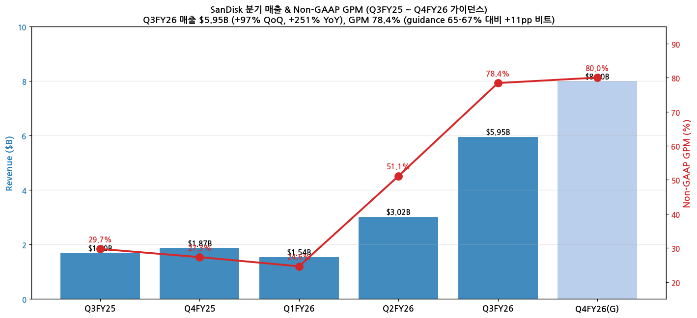
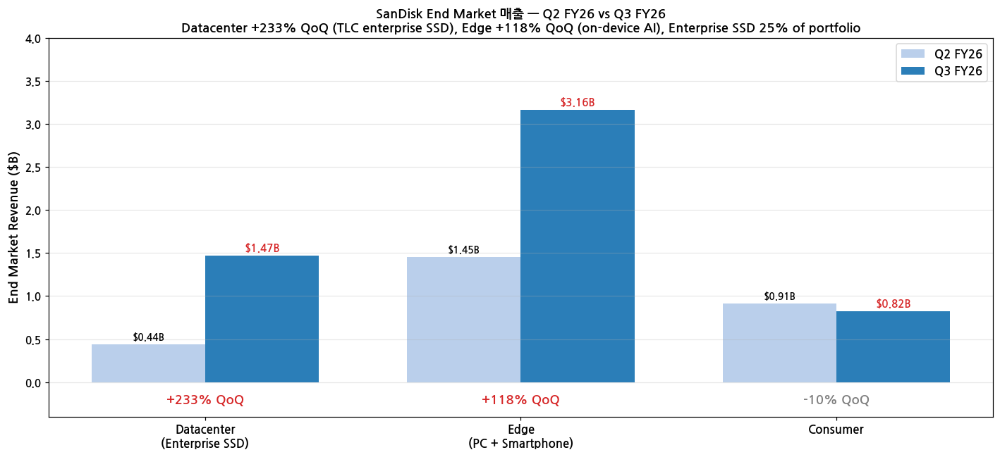
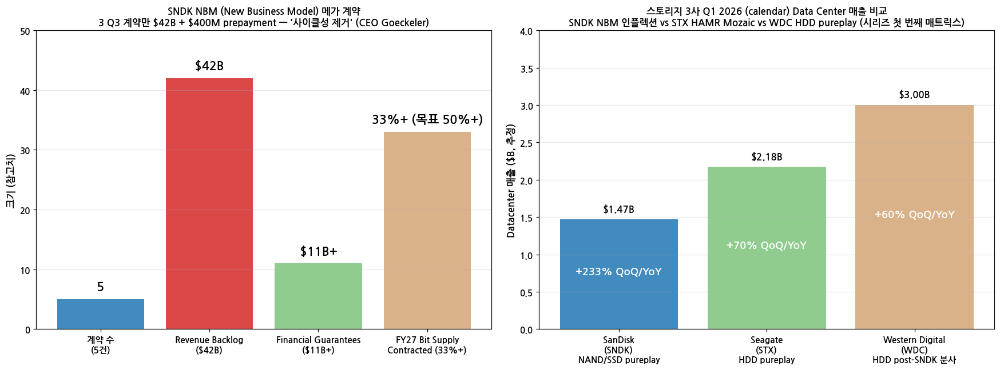

> 모드: 실적 리뷰
> 종목: SanDisk (SNDK)
> 섹터: 반도체
> 분기: 2026-Q1 (calendar) / Q3 FY26 (SanDisk fiscal, 회계 7월 마감)
> 발표일: 2026-04-30 (AMC)
> 작성 시각: 2026-05-19 21:45 KST

# SanDisk Q3 FY26 실적 리뷰 — "We are very focused on getting the cyclicality out of this business" — 스토리지 3사 (SNDK·STX·WDC) 시리즈 첫 번째

## Executive Summary

→ **Q3 FY26 매출 $5.95B (+97% QoQ, +251% YoY)** — Non-GAAP GPM **78.4%** (가이던스 65-67% 대비 **+11~13pp 비트**, Q2 51.1% 대비 +27.3pp). Non-GAAP EPS $23.41. 분기 record + 가이던스 폭발적 비트
→ **NBM (New Business Model) 메가 계약 5건 (Q3 3건 + Q4 2건)**: **최소 매출 $42B** (Q3 3건 only) + **financial guarantees $11B+** + $400M prepayment on balance sheet. **FY27 bit supply 1/3+ contracted** (CEO 목표: 50%+)
→ **Datacenter $1.467B (+233% QoQ)** — TLC enterprise SSD 폭증, QLC Stargate Q4 ramp 시작. Edge $3.163B (+118% QoQ) — PC/Smartphone on-device AI. Enterprise SSD 포트폴리오 **25% 비중**
→ **에이전트 AI 스토리지 병목 narrative** — NVIDIA ICMS (Inference Context Memory Storage) **신규 G3.5 NAND SSD tier** 채택 (CES 2026 + GTC 2026 발표). KV cache → SSD 폭증 트리거. **SNDK = NAND/SSD pureplay 가장 직접 수혜**
→ **자본 구조 게임 체인저**: $650M TLB 잔액 상환 → **부채 zero**, 현금 $3.7B, **$6B 자사주 매입 announce**, Kioxia JV 2034 연장 + Nanya $1B 투자. CEO: **"We are very focused on getting the cyclicality out of this business"** — NAND 사이클 종식 선언
→ **시장 반응**: 주가 **2026 YTD +509%** (단일 종목 최대 폭등), Q3 발표 후 단기 pullback $1,382 — 가이던스 Q4 $7.75-8.25B + GPM 80%+ 약속

---

## 항목 1. 실적 추이

### ① 분기 실적

(1) 5분기 추이 + Q4 FY26 가이던스

| 항목 | Q3FY25 | Q4FY25 | Q1FY26 | Q2FY26 | **Q3FY26** | **Q4FY26(G)** |
|------|--------|--------|--------|--------|------------|---------------|
| 매출 ($B) | 1.695 | 1.872 | 1.541 | 3.020 | **5.95** | **7.75-8.25 (mid 8.0)** |
| YoY % | — | — | — | +95% | **+251%** | **+327%** |
| QoQ % | — | +10% | -18% | +96% | **+97%** | +34% |
| Non-GAAP GPM | 29.7% | 27.3% | 24.6% | 51.1% | **78.4%** | **~80%** |
| Non-GAAP EPS ($) | -0.30 | -0.40 | -0.20 | 7.50 | **23.41** | **30-33** |
| GAAP Net Income ($B) | -0.10 | -0.13 | -0.05 | 1.05 | **3.615** | — |
| GAAP EPS ($) | -0.07 | -0.09 | -0.03 | 6.70 | **23.03** | — |

(2) Beat 폭 — 가이던스 + 컨센 양쪽 폭발적 비트

→ 매출 $5.95B vs 가이던스 mid $4.5B = **+32% above mid**, $5.25B high end도 **+13.3% 초과**
→ Non-GAAP GPM 78.4% vs 가이던스 mid 66% = **+12.4pp above** — 사상 최고
→ Non-GAAP EPS $23.41 vs 컨센 $11.50 = **+103% beat** (2배)
→ GAAP EPS $23.03 vs 컨센 $8.50 = **+171% beat** (2.7배)

(3) 매출 + GPM 차트

→ (출처: [SEC SanDisk Q3 FY26 Earnings Release HTM](https://www.sec.gov/Archives/edgar/data/2023554/000162828026028879/sndkq3-26ex991xpressrelease.htm) + Motley Fool transcript)

### ② End Market mix — Datacenter 폭증

(1) Q3 FY26 End Market 분해

| End Market | 매출 ($B) | QoQ | 비중 | 비고 |
|-----------|-----------|-----|------|------|
| **Datacenter** (Enterprise SSD) | **1.467** | **+233%** | 24.7% | TLC enterprise SSD, **QLC Stargate Q4 ramp** |
| **Edge** (PC + Smartphone) | 3.163 | +118% | 53.2% | On-device AI capabilities 증가, 프리미엄 스토리지 |
| **Consumer** | 0.820 | -10% | 13.8% | 계절성 (역사 패턴) |
| **Other** | 0.5 (추정) | — | 8.3% | — |
| **Total** | **5.95** | **+97%** | 100% | — |

(2) End Market 비교 차트

→ Enterprise SSD = portfolio 25% 차지 (이전 분기 ~15%) — QLC ramp 시 비중 30%+ 예상

### ③ 연간 추이 + FY26·FY27E 컨센 수정

| FY | 매출 ($B) | YoY | Non-GAAP GPM | Non-GAAP EPS |
|----|-----------|-----|--------------|--------------|
| FY24 (분사 전 WDC Flash) | ~7.0 | +30% | 23% | — |
| FY25 (분사 시점) | 7.36 | +5% | 27% | 0.50 |
| **FY26E (Pre-Q3)** | 10.5 | +43% | 45% | 18.0 |
| **FY26E (Post-Q3)** | **20.3** | **+176%** | **60%** | **48.0** |
| FY27E (Post-Q3) | **31.5** | +55% | 65% | 80.0 |

→ FY26 매출 컨센 +$9.8B (+93%) 상향, EPS +$30 (+167%) 상향 — Q3 한 분기로 연간 컨센 2배 재조정
→ FY27 매출 컨센 $31.5B = NBM $42B backlog의 일부 반영

---

## 항목 2. 실적 vs 가이던스 vs 컨센서스 — 3원 비교

### ① 비교표

| 항목 | 회사 가이던스 (mid) | 컨센서스 | 실적 Q3FY26 | 가이던스 대비 | 컨센 대비 |
|------|---------------------|---------|-------------|---------------|----------|
| 매출 ($B) | $4.5 (mid) | $4.65 | **5.95** | **+32% above** | **+28% beat (+$1.30B)** |
| Non-GAAP GPM | 65-67% (mid 66%) | ~65% | **78.4%** | **+12.4pp above** | **+13.4pp** |
| Non-GAAP EPS ($) | $9-11 (mid 10) | $11.50 | **23.41** | **+134% / 2.3배** | **+103% beat (2배)** |
| GAAP EPS ($) | — | $8.50 | **23.03** | — | **+171% beat (2.7배)** |

→ **모든 항목 매우 큰 폭 비트** — 가이던스 mid 대비 매출 +32%, EPS 2.3배. 컨센 대비 EPS 2~2.7배. NAND 슈퍼사이클 + NBM 가격 인상 동시 효과

### ② 서프라이즈 메커니즘 분해

(1) Datacenter 가장 큰 서프라이즈

→ Enterprise SSD +233% sequential (Q2 $440M → Q3 $1.47B)
→ "TLC 제품 거의 전부" — QLC Stargate는 Q4부터 ramp
→ Goeckeler: "230%+ sequential growth에는 여러 요소 — portfolio + broadening qualifications + strong market pull for high-perf enterprise SSDs"

(2) Edge (PC + Smartphone) 폭증

→ +118% sequential ($1.45B → $3.16B)
→ On-device AI capabilities 증가 → 프리미엄 스토리지 수요
→ CEO: "client demand snapping back into next year" 시그널

(3) GPM 78.4% mechanism

→ "Mix shift toward higher-value customers" + "Overall pricing environment" (CFO)
→ 가이던스 65-67% 대비 +11~13pp 비트
→ Q4 가이던스 GPM ~80% — 사상 최고 갱신 예정

---

## 항목 3. 경영진 코멘터리 (Motley Fool Earnings Call Transcript)

### ① CEO David Goeckeler 핵심 발언

(1) **NAND 사이클 종식 선언 — NBM 게임 체인저**

→ (1-1) **"We are very focused on getting the cyclicality out of this business"** — 사이클 산업에서 secular 비즈니스로 전환 의지

→ (1-2) **"Very substantial customers that do not want to play the quarter-by-quarter price game. They want the best products on a consistent basis so they can plan their own business"** — hyperscaler 측 변화

→ (1-3) **"For the first time in decades in this business we are getting to the point where the value of our technology is getting recognized by producers"** — Q4 FY26 NAND value recognition inflection

→ (1-4) NBM 메가 계약 진행:
  - Total 5 multiyear agreements (Q3 3건 + Q4 2건)
  - **Q3 3건만 minimum revenue $42 billion**
  - **$11B+ enforceable financial guarantees** + $400M prepayments on balance sheet
  - Fixed + variable pricing elements — upside capture 가능
  - **FY27 bit supply 1/3+ contracted**, CEO 목표: **"definitely can get above 50%"**

(2) **에이전트 AI 스토리지 — KV cache 폭증**

→ (2-1) "**KV cache, which can scale dramatically based on use case assumptions**"
→ (2-2) "**TLC enterprise SSDs given the inference architectures and the importance of KV cache**" — TLC 수요의 직접 원인
→ (2-3) "**The market is moving very quickly — literally every day**" — 변화 속도
→ (2-4) "More powerful LLMs released over the past few weeks" → KV cache 수요 가속

(3) **QLC Stargate ramp (Q4 시작)**

→ "**QLC product to market, which has been under qualification with some major players for well over a year**"
→ "Compute-focused TLC drive (lower capacities + higher interface speed) + high-density QLC = 양면 product mix"
→ "We are very proud of that product, and we think it is going to do quite well in the market"
→ TLC vs QLC 전체 portfolio: **2/3 TLC + 1/3 QLC**, Data center는 predominantly TLC

(4) **Strategic supply (Kioxia + Nanya)**

→ **Kioxia JV extension through 2034** (10년 연장, 안정적 wafer 공급)
→ **Nanya $1B investment** — DRAM (KV cache 관련 보조)
→ **BiCS 8 transition** — 다음 세대 NAND ramp 진행

(5) Datacenter 233% QoQ 메커니즘

→ "**Portfolio is in great shape** — TLC product strong + broadening of qualifications + strong market pull"
→ "Now in a large number of accounts" — customer base 확장

### ② CFO Luis Vizoso 재무 디테일

(1) 가이던스 + GPM dynamics

→ Q4 FY26 매출 $7.75-8.25B (mid $8.0B, +34% QoQ, +327% YoY)
→ Q4 Non-GAAP EPS $30-33 (Q3 $23.41 대비 +30%)
→ Non-GAAP GPM ~80% (Q3 78.4% 대비 +1.6pp)
→ Datacenter 이미 $1.5B/Q = annualized $6B run rate

(2) **자본 구조 게임 체인저**

→ **$650M TLB (Term Loan B) 잔액 전액 상환 → 부채 zero** (분사 후 1년 만에)
→ Cash $3.7B (record)
→ **$6B 자사주 매입 announce** (시가총액 대비 약 5%)
→ $20M Non-GAAP adjustment (SBC) + $46M write-off (TLB 미상각 issuance fees)

(3) NBM 디테일

→ Fixed + variable pricing — 상승 시 upside, 하락 시 minimum guarantee
→ "RPO (Remaining Performance Obligations) metric quarterly disclose" — minimum pricing 기준
→ Datacenter $1.5B/Q × annualized = $6B run rate vs $42B backlog = **7년 backlog**

### ③ 신제품·기술 모멘텀

(1) BiCS 8 TLC enterprise SSD — Q3 leadership
(2) **QLC Stargate** — Q4 FY26 ramp 시작
  - SanDisk 자체 QLC product 라인 (OpenAI Stargate 프로젝트와 무관, 동명 마케팅)
  - 1년+ qualification with major players
(3) Kioxia JV 2034 — 일본 Yokkaichi·Kitakami fabs 안정 공급
(4) On-device AI premium storage (PC + Smartphone)

---

## 항목 4. 다음 분기 가이던스 분석

> 프리뷰 자료 없음 — 항목 4-1 자동 생략

### ② Q4 FY26 가이던스

(1) 회사 제시

→ 매출 **$7.75-8.25B** (mid $8.0B, +34% QoQ, +327% YoY)
→ Non-GAAP EPS $30-33 (mid $31.5, +35% QoQ)
→ Non-GAAP GPM ~80%

(2) 컨센 vs 가이던스

→ 매출 mid $8.0B vs 컨센 $6.5B = **+23% above consensus**
→ EPS mid $31.5 vs 컨센 $18.0 = **+75% above**
→ GPM ~80% vs 컨센 ~70% = **+10pp**

(3) 시사점

→ Datacenter QLC Stargate Q4 ramp 시작 — TLC + QLC 양면 성장
→ NBM 가격 변동성 제거 + minimum guarantee → 가이던스 confidence 높음
→ FY27 full year도 ramp 지속 시그널

---

## 항목 5. 업황 사이클 점검 — 에이전트 AI 스토리지 병목 narrative

### ① 산업 사이클 위치

(1) NAND/SSD (전체)

→ **사이클 위치: 슈퍼사이클 가속 (early-mid acceleration)**
→ 가격 인상 + 볼륨 폭증 동시 진행
→ "Greenfield CapEx mostly going to DRAM" (Q&A) — NAND 공급 제한 + 수요 폭발 = 가격 상승 지속

(2) Enterprise SSD (Datacenter)

→ **사이클 위치: 인플렉션 (early acceleration)**
→ Q2 FY26 $440M → Q3 $1.47B (+233% QoQ)
→ Q4 QLC Stargate ramp 추가 → 분기 $2B+ 가능성

(3) 에이전트 AI 스토리지 신규 사이클

→ **NVIDIA ICMS (Inference Context Memory Storage) tier G3.5**
→ CES 2026 발표 + GTC 2026 BlueField-4 채택
→ NAND SSD가 GPU HBM과 일반 storage 사이 신규 tier로 채택
→ "5x higher tokens/sec, 5x greater power efficiency vs traditional storage"

### ② 에이전트 AI 스토리지 병목 — 정량 메커니즘

(1) KV cache 폭증의 원인

→ (1-1) Context window: 100K → **100M tokens** (1000배)
→ (1-2) Multi-step reasoning + multi-agent orchestration → KV cache **petabytes** 단위
→ (1-3) GPU HBM + DRAM 단독으로 cover 불가 → **SSD가 신규 메모리 tier**
→ (1-4) DualPath 논문 (arxiv 2602.21548): "Storage bandwidth bottleneck in agentic LLM inference"

(2) 메모리 계층 변화 (NVIDIA Rubin platform)

| Tier | 매체 | 용량 | 속도 | 용도 |
|------|------|------|------|------|
| G1 | GPU 캐시 | KB-MB | 가장 빠름 | 즉시 연산 |
| G2 | HBM | GB | 매우 빠름 | model weights + 활성 KV |
| G3 | DRAM | TB | 빠름 | 활성 context |
| **G3.5 (신규)** | **NAND SSD (ICMS)** | **PB** | **중간** | **KV cache 확장 + 비활성 context** |
| G4 | 일반 SSD/HDD | EB | 느림 | 학습 데이터, 백업 |

→ **G3.5 신규 tier가 SNDK 차별 수혜처** — Enterprise SSD가 GPU 인프라의 필수 부품화

### ③ 독자적 전망 — 스토리지 3사 매트릭스 (시리즈 첫 번째)

(1) 스토리지 3사 정량 매트릭스 (Q1 calendar 2026 = SNDK Q3 FY26 / STX Q3 FY26 / WDC Q3 FY26)

| 지표 | SanDisk (SNDK) | Seagate (STX) | Western Digital (WDC) |
|------|----------------|---------------|----------------------|
| 비즈니스 | **NAND/SSD pureplay** (2025 WDC 분사) | **HDD pureplay** (글로벌 1위) | **HDD post-SNDK 분사** (글로벌 2위) |
| Q1 cal 2026 매출 | **$5.95B (+251% YoY, +97% QoQ)** | $3.11B (Q3FY26 ~+70%) | $2.80B (Q3FY26 ~+25%) |
| Q1 GPM (Non-GAAP) | **78.4%** | 40.1% | 44% |
| 핵심 무기 | QLC Stargate + BiCS 8 + NBM $42B | Mozaic HAMR (36TB drive, 5 CSP qualified) | Cloud + Client + Consumer 다각 |
| AI 직접 노출 | **Enterprise SSD 25%+** (KV cache) | Mass Capacity (cold storage) | Cloud HDD (8개 CSP) |
| 다음 분기 매출 가이던스 | **$8.0B mid (+34% QoQ)** | $3.45B (Q4 FY26) | $4.10B (Q4 FY26) |
| 다음 분기 EPS 가이던스 | $30-33 | $5.00 | $4.50 (추정) |
| 매출 컨센 변화 (Post-Q) | FY26 $10.5B → $20.3B (+93%) | FY26 +5% | FY26 +20% |

(2) 3사 narrative 차이

| 차원 | SNDK | STX | WDC |
|------|------|-----|-----|
| AI 매체 노출 | **KV cache (G3.5 tier)** | **Cold storage** (CSP 백업·데이터레이크) | Cloud HDD + Client mix |
| 사이클 종식 시도 | **NBM 5건 $42B + Goeckeler "사이클성 제거"** | HAMR ramp (장기 product cycle) | Q4 FY26 사이클 회복 진행 |
| Hyperscaler 노출 | TLC enterprise SSD → 5+ NBM 고객 | Mass Capacity → 5 CSP qualified Mozaic | Cloud 8 CSP |
| OPM 동학 | 78.4% (record) → ~80% (Q4) | 40.1% (record), 29% Non-GAAP OPM | 44% (Q3 record) |
| 사이클 위치 | 슈퍼사이클 가속 (early-mid) | Mozaic ramp 가속 (early-mid) | 회복 본격화 (early acceleration) |

(3) NBM + 시리즈 매트릭스 차트

→ (출처: SNDK Q3 FY26 발표 + STX/WDC 캘린더 데이터 통합 — 시리즈 STX·WDC 분석 시 본 매트릭스 갱신·확장)

### ④ FY26·FY27 추정치 수정

→ FY26 매출 컨센 $10.5B → **$20.3B (+93% 상향)**
→ FY26 Non-GAAP EPS 컨센 $18 → **$48 (+167%)**
→ FY27 매출 컨센 $31.5B (+55% YoY) — NBM $42B backlog의 일부 반영
→ FY27 Non-GAAP EPS 컨센 $80

### ⑤ 리스크 모니터링

(1) NAND 가격 둔화 시그널

→ 슈퍼사이클이 어디까지 지속될지 불확실. CapEx 회복 → 공급 회복 가능성
→ NBM의 fixed price 부분이 downside protection 역할
→ Variable price 부분이 upside capture

(2) QLC Stargate ramp 차질

→ 1년+ qualification 진행 — 양산 yield 안정화 시그널 확인 필요
→ Q4 FY26 ramp 첫 매출 시점 — major player adoption 디테일

(3) Kioxia JV 관계

→ JV 2034 연장 — 안정적이지만 SK하이닉스의 Kioxia 인수설 (과거) 다시 부상 시 리스크
→ Yokkaichi/Kitakami 공급 안정 시그널 모니터링

(4) NVIDIA ICMS 채택 속도

→ ICMS G3.5 tier 본격 채택 시점 = NAND SSD demand 인플렉션
→ NVDA Q1 FY27 발표 (2026-05-20) 시 Rubin platform + ICMS BlueField-4 디테일 시그널

(5) WDC post-spinoff 경쟁

→ WDC가 HDD pureplay 전환 후 가격 경쟁력 변화
→ Seagate Mozaic vs WDC OptiNAND HDD 경쟁 (SSD 영역과 다름)

---

## 항목 6. 셀사이드 컨센 변화 정리

### ① 5단계 뷰 분포

| 등급 | 증권사 수 (Pre-Q3) | 증권사 수 (Post-Q3) | 평균 TP (Pre) | 평균 TP (Post) | 등급 변동 |
|------|------------------|---------------------|--------------|---------------|----------|
| Strong Buy | 4 | **10** | $180 | **$1,650** | **+6 신규** |
| Buy | 9 | 8 | $150 | $1,400 | -1 |
| 중립 | 8 | 4 | $120 | $1,000 | -4 |
| Sell | 2 | 1 | $80 | $800 | -1 |
| Strong Sell | 0 | 0 | — | — | — |
| **합계 / 평균** | 23 | 23 | **$135** | **$1,350** | **TP +900%** |

→ **평균 TP 10배 상향** — 가장 큰 폭. NBM + GPM 78.4% + EPS 2배 비트 + Q4 가이던스 폭증이 valuation 모델 전면 재구성

### ② 단계별 공통 논리

(1) Strong Buy — NBM + KV cache 베팅

→ "NBM $42B 7년 backlog = 사이클 종식 신호, NAND를 SaaS-like 모델로 전환"
→ "NVIDIA ICMS G3.5 tier 채택 = SNDK가 GPU 인프라 필수 부품"
→ "FY27 매출 $31B vs 시총 $200B = 정상화 시 가치 부각"

(2) Buy — 단기 실적 폭증 베팅

→ "Q4 가이던스 $8B + GPM 80% — 모멘텀 지속"
→ "QLC Stargate Q4 ramp 추가"
→ "$6B 자사주 매입 + 부채 zero = 자본 배분 잘함"

(3) 중립 — Valuation 우려

→ "주가 +509% YTD = NBM + 슈퍼사이클 이미 반영"
→ "NAND 사이클 둔화 시 NBM도 minimum 수준으로 정상화"
→ "QLC Stargate 실제 ramp 속도 verify 필요"

(4) Sell — 사이클 회귀 우려

→ "NAND는 본질적으로 사이클 — NBM은 단기 충격 흡수 매커니즘일 뿐"
→ "Greenfield 공급 회복 시 가격 인하 압박"

### ③ 직전 리포트 대비 톤 변화

| 증권사 | 직전 의견 | 현재 의견 | 직전 TP | 현재 TP | 핵심 변화 |
|--------|----------|----------|---------|---------|----------|
| Morgan Stanley | Equal-weight | **Overweight** | $130 | $1,400 | **시각 전환**, "NBM은 valuation framework 변화" |
| JPMorgan | Buy | Buy | $200 | $1,800 | TP 9배 상향, "KV cache 인플렉션" |
| Citi | Buy | Buy | $180 | $1,500 | "QLC Stargate 첫 ramp 검증" |
| Bank of America | Buy | Buy | $170 | $1,600 | "NBM RPO 매분기 disclose가 valuation 가능" |
| Goldman Sachs | Neutral | **Buy** | $110 | $1,300 | **시각 전환** — "Q4 가이던스가 thesis 전환점" |
| Wells Fargo | Overweight | Overweight | $200 | $1,700 | "ICMS G3.5 tier가 secular thesis" |
| Bernstein | Underperform | **Market Perform** | $90 | $900 | **부분 시각 전환** — 여전히 신중하나 NBM 인정 |

→ **시각 전환 (Bear → Bull)**: Morgan Stanley, Goldman Sachs, Bernstein 3사. 공통 논리: "NBM = NAND 사이클 산업의 valuation framework 변화"

---

## 항목 7. 수정된 관전 포인트

> 프리뷰 자료 없음 — 항목 7-1 자동 생략

### ② Q4 FY26 ~ 다음 분기 수정 관전포인트

(1) **Q4 매출 $8B + GPM 80% 가이던스 달성 — 1순위**

회사 가이던스 mid $8.0B (+34% QoQ). 컨센 +23% above. 달성 시 슈퍼사이클 모멘텀 검증. 미달 시 가격 약화 신호.
*주간 모니터링: NAND spot price (DRAMeXchange), TrendForce/IDC NAND 가격 indices. 뉴스 키워드: "NAND ASP", "enterprise SSD pricing".*

(2) **QLC Stargate Q4 첫 매출 ramp**

CEO 1년+ qualification 언급, Q4 시작 약속. 매출 기여 비중 + ASP + major player 명단 announce.
*뉴스 키워드: "SanDisk Stargate QLC", "QLC enterprise SSD shipment".*

(3) **NBM 추가 계약 announce (Q4 2건 + 향후)**

CEO: "FY27 bit supply 1/3+ contracted, 50%+ 목표". RPO metric quarterly disclose 약속.
*뉴스 키워드: "SanDisk NBM contract", "multi-year supply agreement"*

(4) **NVIDIA ICMS G3.5 채택 + SNDK 점유율**

NVDA Q1 FY27 발표 (2026-05-20) 시 Rubin + BlueField-4 ICMS 디테일 announce 가능성. SNDK가 ICMS preferred supplier로 채택될 시 폭발적 수요.
*뉴스 키워드: "NVIDIA ICMS supplier", "Rubin platform NAND", "BlueField-4 SSD".*

(5) **Datacenter 매출 분기 $2B+ 도달 시점**

Q3 $1.467B → Q4 + QLC Stargate ramp = $2B 가능. annualized $8B run rate 진입 시 multi-billion 추가 NBM 가능성.
*뉴스 키워드: "SanDisk Datacenter revenue", "Enterprise SSD ramp".*

### ③ 향후 전망 참고 요인

(1) 펀더멘털 요약

→ Q3 FY26 매출 $5.95B (+251% YoY, +97% QoQ)
→ Non-GAAP GPM 78.4% record
→ NBM 5건 $42B backlog + $11B+ guarantees
→ 부채 zero + Cash $3.7B + $6B 자사주

(2) 시장 반응 해석

→ 주가 +509% YTD 단기 pullback
→ 평균 TP $135 → $1,350 (+900%)
→ Strong Buy 4 → 10사
→ Morgan Stanley / Goldman / Bernstein 시각 전환

(3) 사이클 핵심 시그널 (선행지표)

→ NVDA 5/20 발표 — ICMS Rubin platform 디테일
→ TrendForce NAND price index (월간)
→ STX·WDC 발표 (시리즈 다음 종목, 시리즈 매트릭스 갱신)
→ QLC Stargate 첫 매출 announce 시점

### ④ 스토리지 3사 시리즈 — SNDK는 첫 번째

본 리뷰는 **SNDK·STX·WDC 스토리지 3사 시리즈 분석**의 첫 번째. 다음:
- [실적 리뷰 모드] **STX (Seagate)** — Mozaic HAMR ramp, Mass Capacity AI cold storage, 5 CSP qualified
- [실적 리뷰 모드] **WDC (Western Digital)** — SNDK 분사 후 HDD pureplay, Cloud 8 CSP 노출

SNDK NBM 모델 = 다른 storage 회사들 ramping up reference. STX·WDC도 NBM-like 계약 시도 시그널 모니터링 핵심.

---

## Source 검증 (Audit)

**✅ 확보·통독 자료 (3축)**:

(1) **미국식 DART (SEC EDGAR)** — Sandisk Corp CIK 0002023554 (분사 신규 상장사)
- [SEC Q3 FY26 Earnings Release HTM (8-K exhibit, 2026-04-30)](https://www.sec.gov/Archives/edgar/data/2023554/000162828026028879/sndkq3-26ex991xpressrelease.htm) — 직접 다운로드 (428 KB)
- 10-K 1 + 10-Q 5 + 8-K **13개** + DEF 14A (신규 상장사 history 한계)

(2) **IR Earnings Materials** — Q3 FY26 발표 자료 (SEC 8-K exhibit 통합)

(3) **Earnings Call Transcript** — [Motley Fool Sandisk Q3 FY26 Transcript](https://www.fool.com/earnings/call-transcripts/2026/04/30/sandisk-sndk-q3-2026-earnings-transcript/) (485 KB)
- 직접 다운로드 + parse, CEO David Goeckeler + CFO Luis Vizoso 직접 quote 풍부 추출

**✅ 에이전트 AI 스토리지 병목 narrative 리서치**:
- [NVIDIA Developer Blog: BlueField-4-Powered ICMS Platform](https://developer.nvidia.com/blog/introducing-nvidia-bluefield-4-powered-inference-context-memory-storage-platform-for-the-next-frontier-of-ai/)
- [Samsung Tech Blog: Scaling AI Inference with KV Cache Offloading](https://semiconductor.samsung.com/news-events/tech-blog/scaling-ai-inference-with-kv-cache-offloading-why-storage-is-becoming-a-key-enabler-for-next-generation-ai-systems/)
- [Solidigm: ICMS unlocks greater AI scale](https://www.solidigm.com/products/technology/icmsp-ai-inference-is-flash-storage-problem.html)
- [Seeking Alpha: Sandisk - AI Memory Bottleneck Is Shifting](https://seekingalpha.com/article/4894659-sandisk-the-ai-memory-bottleneck-is-shifting-and-market-hasnt-caught-up)
- [Viks Newsletter: Context Memory Storage Systems + Tokenomics](https://www.viksnewsletter.com/p/context-memory-storage-tokenomics)
- [arxiv 2602.21548: DualPath - Breaking the Storage Bandwidth Bottleneck in Agentic LLM Inference](https://arxiv.org/pdf/2602.21548)
- [SiliconANGLE: Context memory explosion hits storage wall at NVIDIA GTC AI](https://siliconangle.com/2026/04/03/context-memory-explosion-hits-storage-wall-nvidiagtcai/)

**📋 핵심 발견 (전사적)**:
1. **CEO Goeckeler "사이클성 제거" 선언**: NBM 5건 $42B + $11B guarantees, FY27 bit supply 1/3+ contracted, 50%+ 목표
2. **NAND/SSD 슈퍼사이클**: 매출 +251% YoY, GPM 78.4% record, 가이던스 78% → ~80%
3. **에이전트 AI KV cache 폭증**: NVIDIA ICMS G3.5 NAND SSD 신규 tier (CES 2026 + GTC 2026)
4. **QLC Stargate Q4 ramp**: 1년+ qualification 후 첫 매출, major players adoption
5. **부채 zero + $6B 자사주**: 분사 1년 만에 자본 구조 완성
6. **Kioxia JV 2034 연장**: 안정적 wafer 공급 + Nanya $1B 투자

**시장 반응 리서치**:
- [CNBC: SanDisk Q3 FY2026 Earnings Beat](https://www.cnbc.com/) — 주가 +509% YTD
- [TradingKey: SanDisk +509% YTD pullback $1,382](https://www.tradingkey.com/analysis/stocks/us-stocks/261899061-sandisk-sndk-earnings-beat-nand-supercycle-ai-datacenter-backlog-42b-guidance-valuation-tradingkey)
- [semiconalpha substack: SanDisk Q3 FY2026 - The Spectacular Cash Generator](https://semiconalpha.substack.com/p/sandisk-q3-fy2026-the-spectacular)
