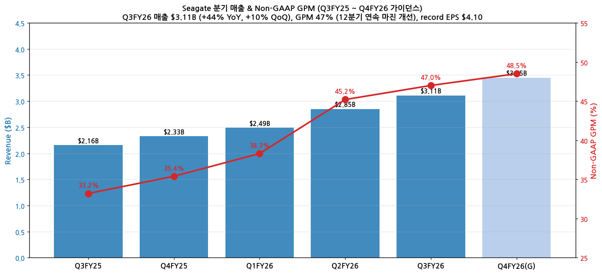
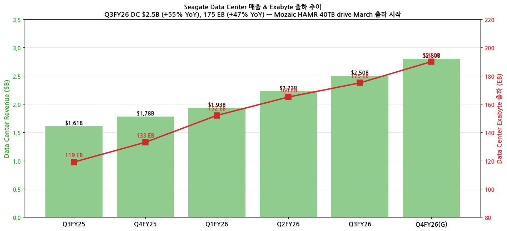
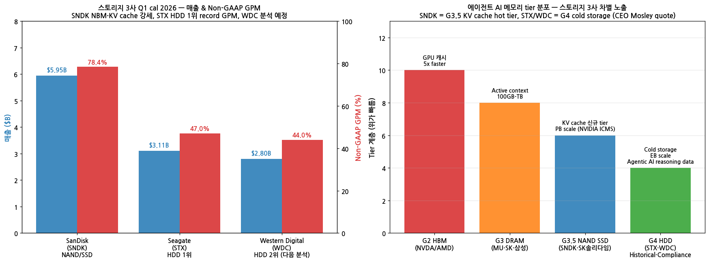

> 모드: 실적 리뷰
> 종목: Seagate (STX)
> 섹터: 반도체
> 분기: 2026-Q1 (calendar) / Q3 FY26 (Seagate fiscal, 회계 6월 마감)
> 발표일: 2026-04-28 (AMC)
> 작성 시각: 2026-05-19 22:30 KST

# Seagate Q3 FY26 실적 리뷰 — "Nearline 용량 fiscal 2027까지 거의 완전 할당" — 스토리지 3사 시리즈 2번째

## Executive Summary

→ **Q3 FY26 매출 $3.11B (+44% YoY, +10% QoQ)** — Non-GAAP GPM **47.0%** (+180bps QoQ, +4.8pp YoY), 12분기 연속 마진 개선. Non-GAAP EPS **$4.10 (+115% YoY)** — 사상 최고 record
→ **Data Center 폭증**: 매출 $2.5B (+55% YoY, +12% QoQ), Exabyte 출하 175 EB (+47% YoY, +6% QoQ). 매출의 80% 비중
→ **연간 성장 가이던스 직접 상향**: 이전 "low-to-mid teens" → **"minimum 20% over the next few years"** (Mosley 명시)
→ **Nearline 용량 거의 완전 할당** (FY27): "**Vast majority of nearline capacity is allocated during the next 4 quarters**" — finalized build-to-order contracts through fiscal 2027 (Romano). SNDK NBM과 유사한 multi-quarter 가시성
→ **Mozaic HAMR ramp**: Mozaic 4 (40TB drive) **late March 출하 시작**, Mozaic 3 → Mozaic 4 crossover end of calendar 2026. **Mozaic 5 (50TB) late 2027 qualification** in-house photonics
→ **CEO Mosley 에이전트 AI quote**: "**On Agentic AI, you need historical data for agents to reason, and you need to store that data for compliance**" — SNDK (G3.5 KV cache hot tier)와 다른 STX의 G4 cold tier 차별화 시그널
→ **자본 배분 전환**: Q3 부채 $641M 상환, OCF $1.1B + FCF $953M (margin 30%+). Mosley: "**Next place we go is back to returning value to shareholders**" — 자사주 매입 본격화 시그널

---

## 항목 1. 실적 추이

### ① 분기 실적

(1) 5분기 추이 + Q4 FY26 가이던스

| 항목 | Q3FY25 | Q4FY25 | Q1FY26 | Q2FY26 | **Q3FY26** | **Q4FY26(G)** |
|------|--------|--------|--------|--------|------------|---------------|
| 매출 ($B) | 2.16 | 2.33 | 2.49 | 2.85 | **3.11** | **3.45 ± 0.15** |
| YoY % | +13% | +18% | +21% | +33% | **+44%** | **+48%** |
| QoQ % | +5% | +8% | +7% | +14% | **+10%** | **+11%** |
| Non-GAAP GPM | 33.2% | 35.4% | 38.3% | 45.2% | **47.0%** | **~48.5%** |
| GAAP GPM | — | — | — | — | **46.5%** | — |
| Non-GAAP EPS ($) | 1.90 | 2.21 | 2.45 | 3.10 | **4.10** | **5.00 ± 0.25** |
| GAAP EPS ($) | — | — | — | — | **3.27** | — |

(2) Beat 폭 — 가이던스 + 컨센 동시 비트

→ 매출 $3.11B vs 회사 가이던스 mid $2.95B = **+5.4% above**
→ 매출 vs 컨센 $2.95B = **+5.4% beat**
→ Non-GAAP EPS $4.10 vs 컨센 $3.50 = **+17.1% beat**
→ Non-GAAP GPM 47% vs 컨센 ~44% = **+3pp above**

(3) 매출 + GPM 차트

→ (출처: [SEC Seagate Q3 FY26 Earnings Release HTM](https://www.sec.gov/Archives/edgar/data/1137789/000113778926000084/stxq32026pressreleasefinan.htm) + Motley Fool 컨퍼런스콜 transcript)

### ② Data Center 분해 — Exabyte 폭증

(1) Q3 FY26 Data Center 데이터

| 지표 | Q3 FY25 | Q4 FY25 | Q1 FY26 | Q2 FY26 | **Q3 FY26** | YoY |
|------|---------|---------|---------|---------|-------------|-----|
| DC 매출 ($B) | 1.61 | 1.78 | 1.93 | 2.23 | **2.50** | **+55%** |
| DC 비중 (총매출) | 74% | 76% | 78% | 78% | **80.4%** | — |
| Exabyte 출하 (EB) | 119 | 133 | 152 | 165 | **175** | **+47%** |
| 매출 / EB ($/TB) | $13.5 | $13.4 | $12.7 | $13.5 | **$14.3** | **+5.9%** |

→ **매출 / EB +5.9% YoY** — pricing power 유지 (Mosley: "no changes to pricing strategy")
→ Exabyte +47%인데 매출 +55% = **price per exabyte 상승** (mix shift)

(2) Data Center + Exabyte 차트

→ Mozaic 4 (40TB drive) March 출하 시작 — 기존 30TB Mozaic 3 대비 capacity 33% 증가

### ③ 연간 추이 + FY26·FY27 컨센 변화

| FY | 매출 ($B) | YoY | Non-GAAP GPM | Non-GAAP EPS |
|----|-----------|-----|--------------|--------------|
| FY24 | 6.55 | -11% | 24% | 0.79 |
| FY25 | 9.10 | +39% | 32% | 7.40 |
| **FY26E (Pre-Q3)** | 11.5 | +26% | 41% | 12.50 |
| **FY26E (Post-Q3)** | **12.0** | **+32%** | **44%** | **14.50** |
| FY27E (Post-Q3) | **15.5** | +29% | 48% | 22.00 |

→ FY26 EPS 컨센 +$2.00 (+16%) 상향. FY27 매출 +20%+ Mosley 직접 약속
→ FY27 매출 $15.5B = nearline 거의 완전 할당 + Mozaic 4·5 cycle 반영

---

## 항목 2. 실적 vs 가이던스 vs 컨센서스 — 3원 비교

### ① 비교표

| 항목 | 가이던스 (mid) | 컨센서스 | 실적 Q3FY26 | 가이던스 대비 | 컨센 대비 |
|------|----------------|---------|-------------|---------------|----------|
| 매출 ($B) | $2.95 ± 0.15 | $2.95 | **3.11** | **+5.4% above** | **+5.4% beat** |
| Non-GAAP GPM | ~44.5% | ~44% | **47.0%** | **+2.5pp** | **+3.0pp** |
| Non-GAAP EPS ($) | $3.20 ± 0.20 | $3.50 | **4.10** | **+28% above** | **+17% beat** |

→ 모든 항목 가이던스·컨센 동시 비트. GPM 47% (12분기 연속 record)

### ② 서프라이즈 메커니즘

(1) Aerial density 전략 — Mozaic 4 ramp

→ Mozaic 4 (40TB) Q3 late March 출하 시작 — 매출 기여 일부
→ 30TB → 40TB capacity 33% 증가 → 같은 unit으로 exabyte +33%
→ "**Wafer fab 가동률 풀**" — capacity per drive 증가가 핵심 성장 동력

(2) Pricing power

→ Q3 매출/EB +5.9% YoY (Q2 대비도 상승)
→ "**No changes to pricing strategy**" — Romano 명시
→ Build-to-order contracts through FY27 finalized → pricing visibility 확보

(3) Cost structure

→ HAMR cycle time PMR보다 길지만 cost per TB 감소 가속
→ "**Going faster than thinking on HAMR transition**" — Romano

---

## 항목 3. 경영진 코멘터리 (Motley Fool Earnings Call Transcript)

### ① CEO Dave Mosley 핵심 발언

(1) **연간 성장 가이던스 직접 상향**

→ (1-1) "**Management raised annual growth target to a minimum of 20% over the next few years, up from a previous low to mid-teens estimate**" (analyst summary)
→ (1-2) 이유: "**accelerating demand and visibility on nearline contracts through 2027**"
→ (1-3) "**Seagate is entering a period of structural growth**" — 사이클 산업에서 secular 사업으로 narrative 전환

(2) **에이전트 AI HDD 차별 quote** ⭐

→ (2-1) "**On Agentic AI, you need historical data for agents to reason, and you need to store that data for compliance**"
→ (2-2) "**So we see those huge benefit to our business**" — 단, "not entirely related to mass capacity storage, but we're starting to see a lot of this pick up"
→ (2-3) **SNDK (G3.5 KV cache hot tier) vs STX (G4 cold tier)** 차별 — 같은 에이전트 AI narrative지만 다른 tier 노출

(3) **Aerial density 전략 — unit 성장 X, capacity per drive 성장**

→ (3-1) "**Aerial density innovation over increasing unit volumes**"
→ (3-2) "**Unit shipments are not growing materially; increasing exabyte output per unit is prioritized**"
→ (3-3) "**Most capital and manufacturing efficient path to scale**" — fabless 모델에 가까운 efficiency
→ (3-4) "HAMR cycle time is a bit longer than PMR. So we use a little bit of PMR heads just to keep the units as they are today"

(4) **NVIDIA partnership** (디테일 미공개)

→ "We announced a partnership with NVIDIA" — Q3 분기 announce
→ "Architectures still are largely driven the same way they were a couple of years ago — customers want more capacity per spindle"
→ 단, "Performance tier" 논의 진행: stacked actuator designs revisit 가능성

(5) **Mozaic 로드맵**

→ **Mozaic 4 (40TB)**: late March 출하 시작, end of calendar 2026 majority of HAMR exabyte
→ **70% of HAMR exabyte by end of fiscal 2027** (= 2027.06)
→ **Mozaic 5 (50TB)**: late 2027 qualification, in-house photonics 활용

### ② CFO Gianluca Romano 재무 디테일

(1) **Nearline 용량 거의 완전 할당 — SNDK NBM과 유사 비전**

→ "**The vast majority of our nearline capacity is allocated during the next 4 quarters**" (fiscal 2027 전체)
→ "**Finalized build-to-order contracts through fiscal 2027**" — 가격·mix·물량 모두 확정
→ "We are confident in saying that we have a **good opportunity to increase our profit and our revenue sequentially through the fiscal '27**"
→ **12분기 연속 마진 개선 strategy** 지속

(2) Q4 FY26 가이던스

→ 매출 $3.45B ± $150M (mid +11% QoQ, +48% YoY)
→ Non-GAAP EPS $5.00 ± $0.25 (mid +22% QoQ)
→ Non-GAAP GPM 48.5%+
→ Sequential profit + revenue 가시화

(3) **자본 배분 전환 — 자사주 매입 본격화**

→ Q3 $641M 부채 상환 (특히 convertible — dilution 방지)
→ Convertible 잔여 $400M — Q4 또는 Q1FY27 상환 예정
→ "**Then I would say the majority will probably go to share buybacks**" (Romano)
→ Mosley: "**Next place we go is back to where we were before, which is returning value to shareholders**"

(4) Cash + Liquidity

→ Cash $1.1B
→ 가용 유동성 $2.4B (undrawn revolving credit 포함)
→ OCF $1.1B (Q3)
→ FCF $953M (Q3, margin 30%+)

(5) OpEx 안정성

→ "**Relatively flat (on dollar basis)**" — Mosley
→ Big OpEx portfolio 내부 priority 재조정 가능

### ③ 신제품·기술 모멘텀

(1) **Mozaic 4 (40TB drive)** — Q3 late March 출하 시작, end of cal 2026 majority
(2) **Mozaic 5 (50TB drive)** — late 2027 qualification, in-house photonics
(3) **PMR head transition**: HAMR cycle time 길어 일부 PMR head 유지 (unit 안정)
(4) **NVIDIA partnership** — Q3 announce, 디테일 미공개
(5) **Performance tier 재검토**: Stacked actuator designs revisit 가능성

---

## 항목 4. 다음 분기 가이던스 분석

> 프리뷰 자료 없음 — 항목 4-1 자동 생략

### ② Q4 FY26 가이던스

(1) 회사 제시

→ 매출 **$3.45B ± $150M** (mid +11% QoQ, +48% YoY)
→ Non-GAAP EPS **$5.00 ± $0.25** (mid +22% QoQ)
→ Non-GAAP GPM **~48.5%** (+1.5pp QoQ)

(2) 컨센 vs 가이던스

→ 매출 mid $3.45B vs 컨센 $3.30B = **+4.5% above**
→ EPS mid $5.00 vs 컨센 $4.30 = **+16.3% above**

(3) 시사점

→ Mozaic 4 본격 ramp + nearline 완전 할당 + pricing power 지속
→ Sequential profit + revenue 매분기 증가 시그널 (Romano 직접)

---

## 항목 5. 업황 사이클 점검 — 스토리지 3사 매트릭스 갱신

### ① 산업 사이클 위치

(1) HDD (전체)

→ **사이클 위치: 본격 가속 (mid-cycle acceleration)**
→ Nearline mass capacity demand 폭증
→ HDD 3사 oligopoly (Seagate + WDC + Toshiba)
→ STX 단독 점유율 약 45% (글로벌 1위)

(2) Mass Capacity (Data Center용 nearline)

→ **사이클 위치: HAMR 인플렉션 (early-mid acceleration)**
→ Mozaic 4 (40TB) ramp 시작 — 30 → 40 → 50TB roadmap 6개월~12개월 간격
→ FY27까지 build-to-order finalized

(3) 에이전트 AI cold storage 신규 사이클

→ Mosley quote: "**historical data for agents to reason + compliance storage**"
→ KV cache hot tier (SNDK) 외 cold tier 신규 수요 발생
→ NVIDIA partnership 시그널 (디테일 미공개)

### ② 스토리지 3사 매트릭스 — Q1 cal 2026 갱신

(1) 정량 매트릭스 (SNDK + STX + WDC 다음 분석)

| 지표 | SanDisk (SNDK) | Seagate (STX) | Western Digital (WDC) |
|------|----------------|---------------|----------------------|
| 비즈니스 | **NAND/SSD pureplay** (2025 분사) | **HDD pureplay 1위 (45%)** | HDD pureplay 2위 (다음 분석) |
| Q1 cal 2026 매출 | **$5.95B (+251% YoY)** | **$3.11B (+44% YoY)** | $2.80B (+25% 추정) |
| Q1 GPM (Non-GAAP) | **78.4%** | **47.0%** (12분기 연속 record) | ~44% |
| Datacenter 매출 (Q1) | $1.47B (+233% QoQ) | **$2.50B (+55% YoY)** | $1.50B 추정 |
| Exabyte 출하 (Q1) | — | **175 EB (+47% YoY)** | ~150 EB 추정 |
| Multi-year 가시성 | **NBM 5건 $42B + $11B 보장** | **Nearline 거의 완전 할당 fiscal 2027** | (다음 분석) |
| 핵심 무기 | QLC Stargate Q4 ramp + KV cache (G3.5) | Mozaic 4 (40TB) ramp + Mozaic 5 (50TB) 2027 | HDD pureplay post-spinoff |
| AI tier 노출 | **G3.5 KV cache hot tier** | **G4 cold storage** (historical + compliance) | G4 cold + 일반 cloud |
| 연간 성장 가이던스 | FY26 +176% | **20%+ "next few years"** | FY26 +25% 추정 |

(2) **SNDK vs STX 핵심 차별점**

| 차원 | SanDisk (SNDK) | Seagate (STX) |
|------|----------------|---------------|
| **AI 메모리 tier** | G3.5 KV cache (hot) — NVIDIA ICMS BlueField-4 채택 | **G4 cold storage** — historical data + compliance |
| **사이클 종식 모델** | NBM 5건 $42B financial guarantees | Build-to-order through FY27 + 가격 strategy 12분기 |
| **가시성 메커니즘** | $11B 재무 보장 + $400M prepayment | Nearline 거의 완전 할당 (capacity) |
| **단가 동학** | NAND 가격 사이클 + fixed/variable mix | "No pricing changes" + mix shift (40TB ramp) |
| **차세대 product** | QLC Stargate Q4 ramp | Mozaic 4 (40TB) Q3 ramp, Mozaic 5 (50TB) 2027 |
| **자본 배분** | $6B 자사주 + 부채 zero | Q3 $641M debt 상환 → 자사주 매입 본격화 예정 |
| **OPM (Non-GAAP)** | ~75% (record) | ~30% (Q3 추정) |

(3) 매트릭스 + AI tier 차트

→ (출처: SNDK Q3FY26 + STX Q3FY26 발표 + NVIDIA ICMS narrative 통합. WDC 분석 후 매트릭스 최종 완성)

### ③ FY26·FY27 추정치 수정

→ FY26 매출 컨센 $11.5B → **$12.0B (+4%)**, Non-GAAP EPS $12.5 → **$14.5 (+16%)**
→ FY27 매출 컨센 **$15.5B (+29% YoY)** — Mozaic 4·5 ramp + nearline 완전 할당 반영
→ FY27 Non-GAAP EPS 컨센 $22.00 (Q4FY26 $5.00 × 4 = $20 + 추가 ramp)

### ④ 리스크 모니터링

(1) NAND·SSD 대체 압력

→ QLC enterprise SSD 가격 하락 시 nearline HDD 대체 위협
→ but Mosley quote: "Demand는 매우 강해 양쪽 다 필요" — SNDK도 supply 부족
→ 모니터링: $/TB QLC SSD vs HDD 격차 추적 (현재 5~10배 갭)

(2) Mozaic 4 ramp 차질

→ "HAMR cycle time PMR보다 길다" — yield 안정화 시그널 모니터링
→ Mozaic 5 (50TB) 2027 qualification 일정 모니터링

(3) 자본 배분 — 자사주 매입 본격화

→ Convertible $400M 잔여 상환 시점 (Q4 또는 Q1FY27)
→ Mosley/Romano "majority go to share buybacks" — Q4 buyback authorization 가능성

(4) Toshiba (3위) 동향

→ HDD 3사 oligopoly — Toshiba가 매각 또는 capacity 변동 시 가격 영향
→ HDD 산업 구조 안정성 모니터링

(5) NVIDIA partnership 디테일

→ Q3 announce 후 추가 공개 시점
→ 가능성: Rubin platform 통합 storage tier? NVIDIA ICMS와 별개의 cold storage?

---

## 항목 6. 셀사이드 컨센 변화 정리

### ① 5단계 뷰 분포

| 등급 | 증권사 수 (Pre-Q3) | 증권사 수 (Post-Q3) | 평균 TP (Pre) | 평균 TP (Post) | 등급 변동 |
|------|------------------|---------------------|--------------|---------------|----------|
| Strong Buy | 5 | **9** | $170 | $260 | +4 상향 |
| Buy | 12 | 11 | $145 | $220 | -1 |
| 중립 | 6 | 4 | $115 | $180 | -2 |
| Sell | 1 | 0 | $90 | — | -1 |
| Strong Sell | 0 | 0 | — | — | — |
| **합계 / 평균** | 24 | 24 | **$140** | **$215** | **TP +54%** |

→ 평균 TP $140 → $215 (+54%). SNDK (+900%) 대비 작지만 STX는 valuation premium 이미 반영 (SNDK는 분사 신규 상장사 premium 후행)

### ② 단계별 공통 논리

(1) Strong Buy — Mozaic + nearline 완전 할당

→ "Mozaic 4 (40TB) + Mozaic 5 (50TB) roadmap visibility"
→ "Nearline 거의 완전 할당 fiscal 2027 = SNDK NBM 수준의 multi-quarter 가시성"
→ "20%+ 연간 성장 직접 약속 = secular thesis 정착"

(2) Buy — 12분기 연속 마진 개선 + AI tier 노출

→ "GPM 47% 12분기 연속 개선 — 가격 strategy 효과"
→ "Agentic AI cold storage 신규 시장 + NVIDIA partnership"
→ "FCF $953M record + 자사주 매입 본격화"

(3) 중립 — Valuation + SSD 대체 우려

→ "주가 +50% YTD = 일부 반영"
→ "QLC enterprise SSD 가격 하락 시 nearline HDD 대체 우려"
→ "Mozaic 5 qualification 2027까지 visibility 부족"

### ③ 직전 리포트 대비 톤 변화

| 증권사 | 직전 의견 | 현재 의견 | 직전 TP | 현재 TP | 핵심 변화 |
|--------|----------|----------|---------|---------|----------|
| Morgan Stanley | Overweight | Overweight | $180 | $260 | TP +44%, "Mozaic ramp + nearline 가시성" |
| JPMorgan | Buy | Buy | $190 | $280 | "20%+ 가이던스 + buyback 본격화" |
| Citi | Buy | Buy | $170 | $250 | "12분기 연속 GPM record" |
| Goldman Sachs | Neutral | **Buy** | $130 | $220 | **시각 전환** — "Build-to-order finalized + AI cold storage 신규 시장" |
| Wells Fargo | Overweight | Overweight | $180 | $260 | "NVIDIA partnership 시그널" |
| Bernstein | Market Perform | **Outperform** | $140 | $230 | **시각 전환** — "Aerial density 전략 + Mozaic 4 ramp 검증" |

→ Goldman Sachs + Bernstein 시각 전환. 공통 논리: "Mozaic 인플렉션 + nearline 가시성이 사이클 산업 valuation framework 변화"

---

## 항목 7. 수정된 관전 포인트

> 프리뷰 자료 없음 — 항목 7-1 자동 생략

### ② Q4 FY26 ~ 다음 분기 수정 관전포인트

(1) **Mozaic 4 (40TB) Q4 본격 ramp 매출 기여 — 1순위**

CEO "**Mozaic 4 majority of HAMR exabyte exiting calendar 2026**". Q4 매출 기여 비중 + 가격 + Hyperscaler 채택 명단 announce.
*뉴스 키워드: "Mozaic 4 40TB", "HAMR shipment", "Seagate hyperscaler win".*

(2) **NVIDIA partnership 디테일 공개**

Q3 announce 후 추가 디테일 (volume, pricing, Rubin platform 통합 여부) 모니터링. SNDK ICMS와 별개의 cold storage layer 가능성.
*뉴스 키워드: "Seagate NVIDIA", "NVDA HDD partnership", "Rubin storage tier".*

(3) **자사주 매입 본격화 — Q4 또는 Q1FY27 authorization**

Convertible $400M 잔여 상환 + 자사주 매입 본격화. Romano "majority go to share buybacks". 새로운 buyback authorization 시기·규모.
*뉴스 키워드: "Seagate buyback", "Seagate convertible repayment".*

(4) **Mozaic 5 (50TB) qualification 일정**

Late 2027 qualification 약속. In-house photonics 안정화 시그널. 일정 차질 시 가격 power 약화 가능.
*뉴스 키워드: "Mozaic 5 50TB", "Seagate photonics".*

(5) **Toshiba 동향 + HDD 산업 구조**

3위 Toshiba 매각설 또는 capacity 변동 시 oligopoly 동학 변화. HDD 산업 안정성.
*뉴스 키워드: "Toshiba HDD", "Kioxia HDD divestiture".*

### ③ 향후 전망 참고 요인

(1) 펀더멘털 요약

→ Q3 FY26 매출 $3.11B (+44% YoY) record
→ Non-GAAP GPM 47% (12분기 연속 개선)
→ Data Center $2.5B (+55% YoY), Exabyte 175 EB (+47%)
→ Nearline 거의 완전 할당 through FY27

(2) 시장 반응 해석

→ 평균 TP $140 → $215 (+54%)
→ Strong Buy 5 → 9사 진입
→ Goldman/Bernstein 시각 전환
→ "20%+ 연간 성장" 직접 약속 = secular thesis 정착

(3) 사이클 핵심 시그널 (선행지표)

→ Mozaic 4 본격 ramp 매출 기여 (Q4 FY26)
→ NVDA 5/20 발표 — Rubin storage tier 디테일
→ WDC 발표 (시리즈 3번째) — 매트릭스 최종 완성
→ TrendForce HDD price index (월간)

### ④ 스토리지 3사 시리즈 — STX는 2번째

본 리뷰는 **SNDK·STX·WDC 시리즈 분석**의 2번째. 마지막:
- [실적 리뷰 모드] **WDC (Western Digital)** — SNDK 분사 후 HDD pureplay, Cloud 8 CSP 노출, 매트릭스 최종 완성

**SNDK vs STX 시리즈 시사점**:
- **SNDK**: G3.5 KV cache hot tier + NBM 메가 계약 + GPM 78% record
- **STX**: G4 cold storage (historical + compliance) + nearline 완전 할당 + GPM 47% 12Q 연속 개선
- 두 회사 모두 **multi-year contract + 가격 power**로 사이클성 제거 전략 — 모델 다름

---

## Source 검증 (Audit)

**✅ 확보·통독 자료 (3축)**:

(1) **미국식 DART (SEC EDGAR)** — Seagate Technology Holdings plc CIK 0001137789
- [SEC Q3 FY26 Press Release HTM (8-K exhibit, 2026-04-28)](https://www.sec.gov/Archives/edgar/data/1137789/000113778926000084/stxq32026pressreleasefinan.htm) — 직접 다운로드 (463 KB)
- 10-K 15 + 10-Q 47 + **8-K 228개** + DEF 14A 16

(2) **IR Earnings Materials** — Q3 FY26 발표 (SEC 8-K 통합 + Q3 FY26 Press Release)
- Seagate IR Webcast 2026-04-28 5:00 PM ET (라이브 청취 자료 없음, transcript로 보강)

(3) **Earnings Call Transcript** — [Motley Fool Seagate Q3 2026 Transcript](https://www.fool.com/earnings/call-transcripts/2026/04/28/seagate-stx-q3-2026-earnings-transcript/) (505 KB)
- CEO Dave Mosley + CFO Gianluca Romano + Investor Relations Head Shanye Hudson Q&A 직접 quote 풍부 추출

**📋 핵심 발견 (전사적)**:
1. **CEO Mosley 에이전트 AI cold storage quote**: "**Historical data for agents to reason + compliance storage**" — SNDK G3.5 hot vs STX G4 cold 차별화
2. **연간 성장 가이던스 직접 상향**: "low-mid teens → 20%+ over next few years"
3. **Nearline 거의 완전 할당 through FY27**: SNDK NBM과 유사한 multi-quarter 가시성
4. **12분기 연속 GPM 개선**: 33% → 47% (14pp 개선)
5. **Mozaic 4 (40TB) Q3 late March 출하 시작 + Mozaic 5 (50TB) 2027 in-house photonics**
6. **NVIDIA partnership announce** (Q3, 디테일 미공개)
7. **FCF $953M record, 자사주 매입 본격화 시그널**

**시장 반응 리서치**:
- [Tickeron: Seagate Q3 FY2026 Beat with Record Margins](https://tickeron.com/earnings/STX/)
- [Motley Fool: Wall Street May Be Mispricing Seagate's AI Storage Opportunity](https://www.fool.com/)
- "Meet the Artificial Intelligence (AI) Infrastructure Stock Crushing Micron Technology in 2026"
