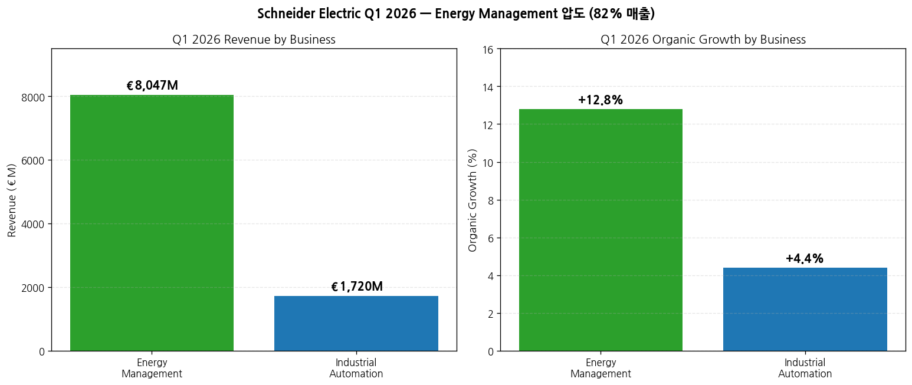
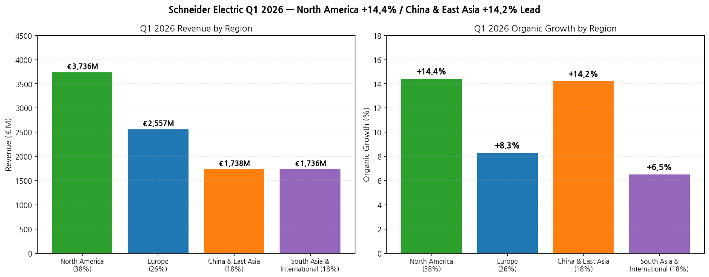
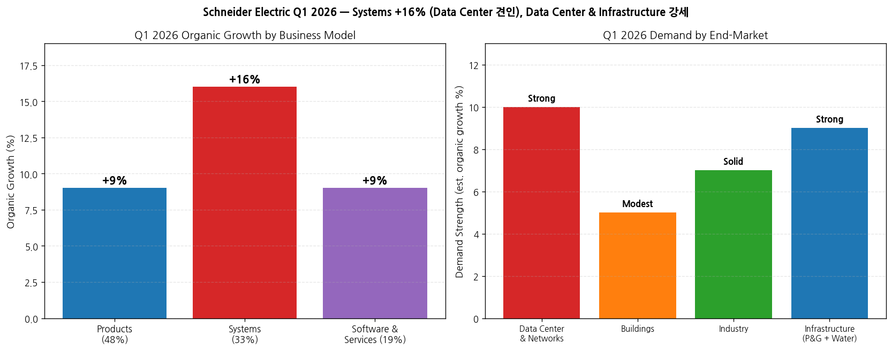
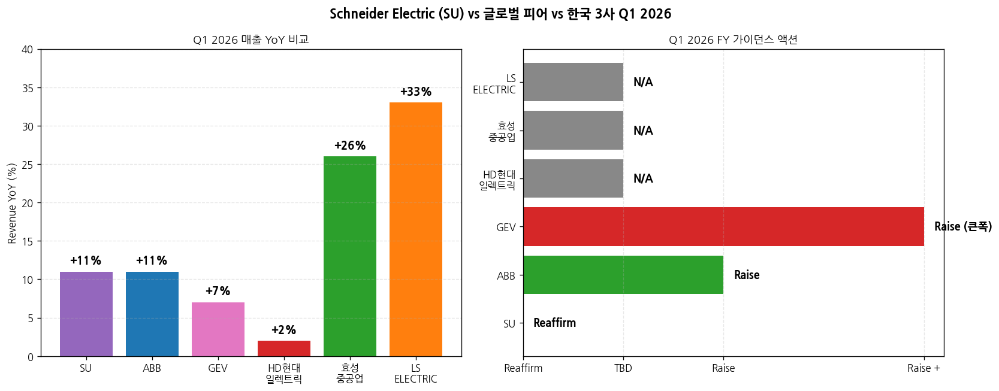

> 모드: 실적 리뷰 (글로벌 피어 — 가벼운 깊이)
> 종목: Schneider Electric SE (SU.PA / Euronext Paris primary)
> 섹터: 전력 인프라
> 분기: 2026-Q1 (Q1 2026 Revenue Release, 분기 종료 2026-03-31)
> 발표일: 2026-04-30 (수, Rueil-Malmaison France) — Press Release + Presentation + Earnings Call (Q&A 8:30 AM CEST) + Sustainability Report 동시 발행
> 작성 시각: 2026-05-03 23:55 KST

# Schneider Electric Q1 2026 실적 리뷰 (글로벌 피어 — 한국 전력 인프라 3사 Cross-ref)

> **본 리뷰는 글로벌 피어 워크플로우 (workflow rule 4)에 따라 한국 종목 review 7개 항목 중 핵심 4-5개로 압축 작성**: 1번 실적 추이 + 사업부 분해, 3번 경영진 코멘터리, 5번 업황 사이클(특히 한국 3사 cross-ref), 7번 관전포인트.
> **유럽 회사 특이사항**: Schneider는 Q1에 **revenue-only release** (full earnings는 H1 결과 7월 30일 발표). EBITA margin·net income·FCF 등은 Q1에 미공개. 본 review는 매출 + 가이던스 + 경영진 코멘터리 중심.
> **본 리뷰의 1차 목적**: ABB(4/16) → LS일렉트릭(4/21) → GEV(4/22) → 효성(4/25) → HD(4/28) → **SU(4/30)** 순서 중 SU는 한국 3사 직후 발표 = 한국 3사 review/인뎁스 분석 단계에 추가 cue로 활용 (특히 Data Center · 유럽 · 신흥국 시장).
> 동일 폴더 한국 3사 + ABB + GEV review (총 5건) 자동 cross-reference.

## Executive Summary — 한국 3사에 미치는 5대 시그널

→ **Q1 매출 €9.77B (+11.2% organic) — Energy Management +12.8% / Data Center 핵심 견인** — ABB Q1 +11% organic과 정확히 동일 수준. 글로벌 전력 인프라 3대장 (ABB·GEV·SU)이 모두 1Q 두 자릿수 매출 성장 = **산업 전체 슈퍼사이클 3중 confirm**. CEO Olivier Blum: "**Data Centers remained the main growth driver, alongside strong growth in Power & Grid among solid contributions across the other end-markets**".
→ **Systems 사업 모델 +16% organic 폭증 (33% 매출 비중)** — Data Center 중심. **한국 3사 적용**: LS일렉트릭의 빅테크 LTA 패키지 + HD AIDC 그룹사 협의체 6,800억 + 효성 765kV 단일 PJT 9,200억 — 모두 systems-style 패키지 수주 narrative와 동조. SU systems 모멘텀 = 글로벌 데이터센터 패키지 수요 정량 추가 confirm.
→ **North America +14.4% organic / China & East Asia +14.2% organic 동반 폭증** — 미국·중국 동시 가속. **한국 3사 적용**: 효성·HD·LS의 미국 비중 확대 + 한국 데이터센터 narrative 모두 강화. 특히 **China & East Asia +17.6% Energy Management 가속 (한국 OEM Semicon demand 견인 명시)** = LS·HD의 한국 반도체 CAPEX cycle 직접 cue. SU 코멘트: "Korea where OEM demand for Semicon manufacture was a key driver".
→ **FY26 가이던스 reaffirmed (raise 아님) — 글로벌 피어 중 유일** — ABB·GEV는 1Q에 가이던스 raise vs SU는 reaffirm. **단, 이는 보수성보다 SU의 conservatism + FX headwind** (-€623M Q1, FY26 -€750-850M est, USD/INR/CNY 약세). 실질 underlying 모멘텀은 ABB·GEV와 동등 (Q1 organic +11.2%). FY26 Adj EBITA margin target **19.1-19.4%** = **HD현대일렉트릭 24.9%·ABB Electrification 24.0%보다 낮은 수준** = 한국 3사 (특히 HD) OPM 우위 reference 확정.
→ **Power & Grid (P&G) 강세 + SF6-free 420kV GIS 모멘텀** — Schneider Infrastructure 부문 중 P&G가 leading. **한국 3사 적용**: SF6-free GIS는 HD현대일렉트릭이 2026 상반기 개발 완료 예정으로 타이밍 정확히 일치. SU의 SF6-free 모멘텀이 유럽에서 본격 가속 = HD의 유럽 SF6-free 수주 가시성 확정. CEO 명시: "Italy: good traction for SF₆-free offers".

---

## 항목 1. 실적 추이 (Q1 2026 Revenue + Outlook)

① 핵심 매출 (Q1 2026 vs Q1 2025, EUR €M)

| 항목 | Q1 2026 | Q1 2025 | YoY (Reported) | YoY Organic | 코멘트 |
|---|---|---|---|---|---|
| **Total Revenue** | **9,767** | ~9,328 | **+4.7%** | **+11.2%** | 사상 최대 분기 매출 |
| ┗ FX impact | -623 | — | — | — | -6.7% (USD/INR/CNY 약세) |
| ┗ Scope (M&A) | +92 | — | — | — | +1.1% (Motivair 등) |
| Energy Management | 8,047 | ~7,572 | +6.3% | **+12.8%** | 82% 매출 비중, Data Center 견인 |
| Industrial Automation | 1,720 | ~1,756 | -2.0% | **+4.4%** | 18% 매출 비중, Discrete 회복 |

→ (출처: Schneider Q1 2026 Press Release page 1-2, Presentation page 4)
→ **Q1은 revenue-only — Adj EBITA margin / Net income / FCF는 미공개**. Full reporting은 7월 30일 H1 2026 결과
→ FY26 가이던스 reaffirmed: Adj EBITA growth +10-15% organic, Revenue +7-10% organic, Adj EBITA margin **19.1-19.4%** (+50-80bps organic)

(1-1) 매출 성장 동력 분해
→ **Volume이 main driver**, price도 positive 기여 (year-on-year로 ramp-up 예상)
→ Products (48% 매출): +9% organic — Energy Management 두 자릿수 + Industrial Automation mid-single digit
→ **Systems (33% 매출): +16% organic** ★ — Energy Management 두 자릿수 (Data Center 견인) + Industrial Automation low-single
→ Software & Services (19%): +9% organic — AVEVA ARR +12%, Field Services +9%

② 사업부별 (Energy Management vs Industrial Automation)

(1) Q1 2026 사업부별 (EUR €M)

| 사업부 | Q1 매출 | 비중 | YoY Organic | 한국 3사 cross-ref |
|---|---|---|---|---|
| **Energy Management** | **8,047** | 82% | **+12.8%** | LS Energy Management (전력) 부문 + HD 전력기기 + 효성 중공업 부문 |
| Industrial Automation | 1,720 | 18% | +4.4% | LS 자동화 (821억원) 부문과 직접 비교 |

(1-1) Energy Management 핵심 (한국 3사 직접 비교)
→ **Data Center**: strong demand, double-digit (high base에도 성장). North America majority, 다른 지역도 강세
→ **Power & Grid (P&G)**: 강세 — electrification momentum, grid digitalization, SF6-free tech
→ **Buildings**: modestly increased revenue (Non-residential strong, Residential weak in China/US)
→ **Industry**: Discrete recovery 지속, Process & Hybrid는 일시 약세
→ Liquid cooling (Motivair 인수) — Data Center 신규 성장축

(1-2) Industrial Automation
→ Discrete automation 회복 지속 (China & East Asia 견인)
→ Process & Hybrid markets 약세 (1H25 base 효과, 2H 회복 본격화 예상)
→ AVEVA ARR +12% YoY (cloud SaaS + on-premise rental 강세)
→ ETAP·RIB Software low-single digit organic

③ 지역별 매출 (Q1 2026)

| 지역 | Revenue (€M) | 비중 | YoY Reported | YoY Organic |
|---|---|---|---|---|
| **North America** | **3,736** | **38%** | +6.3% | **+14.4%** |
| Europe | 2,557 | 26% | +8.5% | +8.3% |
| **China & East Asia** | **1,738** | 18% | +5.9% | **+14.2%** |
| South Asia & International | 1,736 | 18% | -4.2% | +6.5% |
| **Total** | **9,767** | 100% | **+4.7%** | **+11.2%** |

(3-1) 지역별 핵심 시그널 — 한국 3사 cross-ref
→ **North America +14.4% organic** = ABB +48% / GEV +71% / HD 잔고 미국 비중 69% / 효성 53% — 미국 전력 인프라 슈퍼사이클 3중 confirm + 한국 3사 미국 비중 확대 narrative 강화
→ **U.S. double-digit growth, Data Center main driver + liquid cooling 강세** = LS일렉트릭의 빅테크 LTA + HD AIDC 그룹사 패키지와 동조
→ **China & East Asia +17.6% Energy Management organic** = 중국 데이터센터 + Semiconductor 견인. **CEO 명시: "East Asia grew double-digit, led by Semicon demand. Korea where OEM demand for Semicon manufacture was a key driver"** ← **한국 직접 reference**
→ **Europe +8.3% organic** — Spain·UK·Italy double-digit. **Italy SF6-free GIS 강세** = HD현대일렉트릭의 2026 상반기 SF6-free 420kV GIS 개발 완료 + 2H 유럽 본격 수주 narrative 정확히 일치
→ **South Asia & International**: India 두 자릿수 강세, **Middle East down low-single (Saudi down)** = 효성·HD 중동 매출 영향 reference (SU 중동 비중 <5%, 효성 11-12%, HD 16% — 한국 3사가 더 큰 영향)

④ Business Model + End-Market 분해

(4-1) End-Market 분해
→ **Data Center & Networks**: strong double-digit demand (1Q'25에 특별히 큰 단일 주문 high base에도 성장). Pure Data Center 두 자릿수, AI-ready infrastructure 가속, 모든 지역 성장
→ **Buildings**: 강한 demand이나 매출 증가는 modest. Non-residential strong (Public/Healthcare/Retail), Residential weak in China/US
→ **Industry**: 강세 — Discrete recovery 지속 (Industrial manufacturing US/India/Europe/China 회복), Process & Hybrid Semiconductor 견인 + E&C + Metals/Mining 강세
→ **Infrastructure**: P&G leading + Water 강세 + Transportation slightly down

---

## 항목 3. 경영진 코멘터리 (Earnings Call 핵심 인용)

① CEO Olivier Blum 핵심 발언

(1) 시장 환경 — 5번째 산업 혁명 (5th Re-revolution)
→ "We have entered, since probably more than one year already in the new area with **more electrification, renewable, decentralized energy, hybrid AC-DC, acceleration of AI everywhere, which mean more power, more cooling**. The world continues to be very fragmented."
→ "When we combine all of that, we believe we have entered already in what we call the **5th re-revolution**. AI is taking everything to the next level."
→ 5단계: Machines (19c) → Electricity (20c turn) → Automation (late 20c) → Digital (~2024) → **Intelligence (2025+)**

(2) Data Center — 한국 3사 핵심 cue
→ "Data Centers remained the main growth driver, alongside strong growth in Power & Grid among solid contributions across the other end-markets."
→ "The Data Center & Networks end-market continues to see sustained high demand, up double-digit in Q1 despite a high base of comparison."
→ "Customers continued to scale **AI-ready infrastructure**, alongside growth in traditional architectures, across geographies. North America continued to represent the majority of demand, but with strong demand growth recorded in other regions."
→ Liquid cooling (Motivair) 강조: "Strong growth in liquid cooling" (US Data Center)

(3) Energy Intelligence (5단계 비전) — 차별화
→ "Energy Intelligence has the capability to **pre-empt and optimize energy operations**. Your facility doesn't just tell you that something went wrong. It prevents the problem before it happens, in real time."
→ Royal Avebe (Netherlands food & bev) 사례: 그리드 congestion 8-12년 대기 → SU의 Power+Process 통합 솔루션으로 faster access to power + 전기화 + 데이터 인텔리전스 결합

(4) Power & Grid + SF6-free
→ "Demand in the Infrastructure end-market remained strong, led by the P&G segment, with **electrification momentum driving a need for digitalization and flexibility to ease grid congestion** and aid the integration of renewable power generation across multiple geographies."
→ "The Group continues to benefit from its comprehensive portfolio, including digital solutions and **SF₆-free technologies**."
→ Italy: "good traction for SF₆-free offers"

(5) 가이던스 reaffirmed (raise 안 한 이유)
→ "The fundamentals underpinning our markets remain strong, **even if recent macroeconomic and geopolitical developments have increased uncertainty**."
→ "We are Advancing Energy Tech from a position of strength, supported by a balanced global footprint and a resilient, multi-hub operating model, which allow us to remain agile in this more uncertain environment. **Against this backdrop, we reaffirm our financial target for 2026**."
→ Middle East 영향: "South Asia and International region potentially impacted in Q2, specific to the disruption and uncertainty created by the ongoing situation in the Middle East"

(6) Capital Allocation
→ Share buyback: €2.5-3.5B cumulative by 2030 (Dec 2025 CMD 발표)
→ Q1 (3/9 ~ 4/24): €110M / 0.4M shares avg €250
→ SEIPL India 35% 인수 (재무 비용 -€150M FY26)

② CFO Nathan Fast (신임, 4월 6일 취임)

(1) FX & Scope
→ Q1 FX: -€623M (-6.7% revenue) — USD/INR/CNY 약세 vs EUR
→ FY26 FX 추정: -€750M ~ -€850M, EBITA margin -10bps
→ Scope (M&A): +€92M Q1 (Motivair 등), FY26 flat 영향

(2) Pricing
→ "Net Price positive in value (price to offset raw material impact and tariffs), ramping up throughout the year"
→ Volume이 main driver, pricing 기여 점진 확대 예상

② 재무 가이던스 - FY26 Reaffirmed

(1) Group level
→ Adj EBITA growth: **+10-15% organic** (reaffirmed)
→ Revenue: **+7-10% organic** (reaffirmed)
→ Adj EBITA margin: **+50 to +80bps organic**, implied 19.1-19.4% (FX/Scope 포함)

(2) Other parameters
→ 세율: 23-25% range
→ Restructuring: 누적 €500M for 2025-2027 (정상 €100-150M/year)
→ Finance costs: -€150M FY26 (SEIPL 인수 financing)

---

## 항목 5. 업황 사이클 점검 — **한국 3사 cross-reference**

① 산업 사이클 위치 — **확장 가속, 글로벌 3중 confirm**

(1) Data Center — secular thesis 3중 confirm (ABB + GEV + SU)
→ ABB Q1: Data Center triple-digit YoY + CAGR 35% (2019-25)
→ GEV Q1: Data Center 단일 분기 수주 $2.4B = FY25 전체 초과
→ **SU Q1: Data Center "sustained high demand, double-digit (high base에도)"**, AI-ready infrastructure 가속
→ **한국 3사 적용**: LS·HD·효성 데이터센터 narrative 3중 정량 confirm. Schneider의 liquid cooling 진입은 한국 데이터센터 패키지 솔루션의 **제품군 확장** 시그널 (변압기/차단기 외 cooling까지 통합 가능성)

(2) Power & Grid + SF6-free GIS — HD현대일렉트릭 직접 cue
→ SU Q1: P&G leading Infrastructure end-market, SF6-free 강세 (Italy)
→ **HD현대일렉트릭 SF6-free 420kV GIS 2026 상반기 개발 완료 예정** = SU 모멘텀과 정확히 동조
→ **시그널**: HD 유럽 SF6-free 본격 수주 narrative 정량 확정. 2H26 유럽 수주 가속 가능성

(3) North America +14.4% organic = 3중 confirm (ABB +48% / GEV +71% / SU +14.4%)
→ ABB: orders +48% comparable (US +67%)
→ GEV: orders +71% organic (모든 segment)
→ **SU: 매출 +14.4% organic (Data Center 견인)**
→ 3사 절대 수준 다름 (ABB·GEV는 orders, SU는 revenue) but 모두 강한 미국 모멘텀
→ **한국 3사 적용**: 미국 비중 확대 narrative 3중 정량 confirm

(4) **Korea Semicon CAPEX 직접 reference (SU 단독)**
→ SU CEO: "East Asia grew double-digit, led by Semicon demand. **Korea where OEM demand for Semicon manufacture was a key driver**"
→ **한국 3사 적용**: LS일렉트릭·HD현대일렉트릭의 한국 데이터센터·반도체 CAPEX cycle 가속 직접 명시. ABB/GEV에는 없는 SU만의 한국 시장 직접 cue
→ 효성중공업 한국 매출 비중 작으나, LS·HD는 한국 반도체 CAPEX cycle 직접 수혜

(5) Middle East 영향 reference
→ SU 중동 매출 비중 <5% — Q1 -low single digit (Saudi down)
→ Q2 영향 추가 확대 가능성 (CEO 명시)
→ **한국 3사 적용**: 효성 11-12%, HD 16% 중동 비중 → **SU보다 한국 3사 영향이 더 클 가능성** (이미 ABB review에서 동일 논리)

② 글로벌 피어 vs 한국 3사 Q1 2026 비교 (cross-ref 핵심)

(1) 매출 YoY% 비교 (organic for 글로벌, USD for Korea)

| 종목 | Q1 26 매출 YoY | 코멘트 |
|---|---|---|
| **LS ELECTRIC** | **+33% USD** | 3사 + 글로벌 피어 6사 중 최고 |
| 효성중공업 | +26% USD | — |
| **SU** | **+11.2% organic** | ABB와 정확히 동일 |
| **ABB** | **+11% organic** | SU와 동일 |
| GEV | +7% organic (+16% USD) | Wind drag |
| HD현대일렉트릭 | +2.1% USD | 일시 회계 이연 |

→ **시그널**: SU = ABB와 정확히 동일 +11% organic. 두 유럽 글로벌 피어가 동조 = 글로벌 산업 성장 baseline 정량 확정 (~+11%)
→ 한국 3사 LS +33%, 효성 +26%는 글로벌 피어 대비 가속 = **한국 3사가 글로벌 산업 평균보다 빠르게 성장 중**

(2) FY26 가이던스 액션 비교

| 종목 | Q1 발표 시 가이던스 액션 | 핵심 |
|---|---|---|
| **GEV** | **Raise +30% (FCF)** | 가장 공격적 — Revenue +0.5B, EBITDA margin +1pp, FCF +30% |
| **ABB** | **Raise** | mid single → high single/low double comparable revenue |
| **SU** | **Reaffirm** | Adj EBITA growth +10-15% organic, Revenue +7-10% (변동 없음) |
| 한국 3사 | N/A (잠정실적만) | 8월 H1 발표 시 가이던스 상향 가능성 |

→ **시그널**: ABB·GEV vs SU의 가이던스 action 차이 = SU의 conservatism (FX headwind, Middle East 우려) vs ABB·GEV의 backlog 강한 신뢰. SU가 **Q2 (4월 30일 H1 results)에서 raise할 가능성** 모니터링
→ **한국 3사 적용**: SU의 reaffirm은 한국 3사 가이던스 상향 폭이 GEV(+30%)·ABB(+상향)보다 작을 가능성도 시사. SU의 보수성은 FX 영향이 큰 글로벌 기업 특성이므로 한국 3사에는 직접 적용 어려움

(3) Adj EBITA Margin Reference

| 종목 | FY26E EBITA / OPM | 코멘트 |
|---|---|---|
| HD현대일렉트릭 (FY26 컨센) | 약 26-27% | 한국 3사 1위 |
| ABB Group (FY26 추정) | 약 22-23% | Real biz |
| ABB Electrification | 약 24% | HD와 동급 |
| GEV Power | 약 17-18% (FY26 가이드) | — |
| GEV Electrification | 약 18-20% (FY26 가이드) | — |
| **SU FY26 Target** | **19.1-19.4%** | **글로벌 피어 중간 수준** |
| 효성중공업 (FY26 컨센) | 약 14-15% | — |
| LS ELECTRIC (FY26 컨센) | 약 10-11% | 자동화·자회사 dilution |

→ **시그널**: HD가 SU보다 +5-8pp 우위 → HD의 multiple 정당화 강화. ABB Electrification 24% vs SU 19.1-19.4% = ABB Electrification이 SU보다 우위 (multi-hub vs centralized). 한국 3사 vs SU: HD 우위 / 효성 비슷-약세 / LS 약세

③ 독자적 전망 (한국 3사 인뎁스 분석 시 활용)

(1) Schneider 가이던스 reaffirmed의 함의
→ 보수적 자세 = FX headwind + Middle East 우려 + Process Auto 회복 지연 우려
→ **단, underlying organic +11.2%는 ABB와 동등** = 산업 모멘텀은 강한 상태
→ **한국 3사 적용**: SU가 H1 결과 (7월 30일)에서 raise할 가능성 → 한국 3사 가이던스 상향 시점 (8월)과 거의 동시. SU의 raise 여부가 한국 3사 가이던스 상향 폭의 leading indicator

(2) Korea Semicon CAPEX cycle 가속 — LS·HD 핵심 cue
→ SU East Asia +17.6% Energy Management organic + 한국 OEM Semicon demand 직접 명시
→ **한국 3사 적용**:
  - LS일렉트릭: 자동화 부문 (반도체 OEM 고객 비중 확대) + 전력기기 (반도체 팹 전력 인프라) 동시 수혜
  - HD현대일렉트릭: 한국 반도체 클린팹 변압기 수주 가속 가능성
  - 효성중공업: 한국 반도체 비중 작음 (영향 제한)

(3) SF6-free 420kV GIS — HD 직접 기회
→ HD는 2026 상반기 개발 완료 → 2H26 본격 수주 narrative
→ SU Italy SF6-free 모멘텀 = HD 유럽 수주 가능성 정량 reference
→ **시그널**: HD의 2027~2028 유럽 수주 가시성 강화

(4) Liquid cooling — 한국 데이터센터 패키지 솔루션 확장 시그널
→ SU Motivair 인수로 Data Center cooling 진입
→ **한국 3사 적용**: HD AIDC 그룹사 협의체가 향후 cooling까지 확장 가능성. LS도 데이터센터 패키지 cooling 추가 옵션 모니터링

---

## 항목 7. 관전 포인트 — 한국 3사 분석 시 활용 cue

⑦ 한국 3사 다음 분기 분석 시 SU 시그널 활용 가이드

(1) **Data Center secular thesis 3중 confirm (ABB+GEV+SU)**
→ SU Q1 데이터센터 "sustained high demand double-digit (high base에도)" + liquid cooling
→ **활용**: 한국 3사 데이터센터 narrative 정량 강화. **3중 confirm = 단일 기업·일회성 호조 가능성 사실상 배제**

(2) **SF6-free 420kV GIS — HD현대일렉트릭 직접 cue**
→ SU Italy SF6-free 모멘텀 + HD 2026 상반기 개발 완료 = 정확히 동조
→ **활용**: HD 2H26 유럽 수주 narrative 정량 확정. 인뎁스 분석 시 HD 유럽 매출 비중 확대 시나리오 핵심 논점

(3) **한국 OEM Semicon demand — LS·HD 직접 reference**
→ SU CEO 직접 명시: "Korea OEM demand for Semicon manufacture was a key driver"
→ **활용**: LS일렉트릭의 자동화 부문 + HD의 반도체 팹 전력 인프라 narrative 강화 (글로벌 피어 단독 reference)

(4) **가이던스 reaffirm vs raise — SU H1 raise 여부 모니터링**
→ ABB·GEV는 raise vs SU는 reaffirm
→ **활용**: SU H1 (7/30) raise 여부 = 한국 3사 8월 가이던스 상향 폭 leading indicator. SU raise 시 한국 3사 강한 상향 가능성

(5) **Adj EBITA margin reference 19.1-19.4% — HD 우위 정당화**
→ SU FY26 target 19.1-19.4% < HD 24.9% = HD 글로벌 피어 OPM 우위 정량 confirm
→ **활용**: HD 멀티플 정당화 narrative 강화 (ABB Electrification 24% + SU 19% 사이 비교)

(6) **Middle East 우려 — 한국 3사 영향 더 클 수 있음**
→ SU 중동 비중 <5%이고 Q2 영향 우려
→ **활용**: 효성 11-12% + HD 16% 중동 비중 → 한국 3사 Q2 영향 더 클 가능성 risk monitoring

⑦ Schneider 자체 다음 분기 (Q2 2026 + H1 reporting 7월 30일) 모니터링

(1) **H1 2026 결과 (7월 30일)** — Adj EBITA margin 19.1-19.4% 진행도, full P&L 첫 공개
(2) Q2 매출 성장 — Data Center 모멘텀 지속 여부 (1Q +11.2% 유지/가속/감속)
(3) FY26 가이던스 raise 여부 (현재 reaffirm)
(4) Middle East Q2 추가 영향 (South Asia & International 영향)
(5) Process & Hybrid Automation 회복 진행 (CEO 명시: "later in the year")
(6) Liquid cooling (Motivair) Q2 매출 기여
(7) AVEVA ARR +12% 지속 여부

---

## [향후 관찰 포인트] — 한국 3사 분석 timing

→ **2026 5월 중**: Hitachi Energy (4/30 발표) review 추가 작성 → 글로벌 피어 4사 (ABB·GEV·SU·HE) 통합 cross-reference 완성
→ **2026 5/16 quarterly-review Stage 2**: 9사 통합 분석 자동 수행 — **SU는 3번째 글로벌 피어 cue (한국 OEM Semicon 직접 reference)**
→ **2026 7월 중**: 한국 3사 2Q26 프리뷰 작성 시 본 SU review 핵심 5대 시그널 (Data Center 3중 confirm, SF6-free GIS, Korea Semicon, 가이던스 reaffirm, Middle East risk) 자동 활용
→ **2026 7월 30일**: SU H1 결과 발표 = 한국 3사 가이던스 상향 leading indicator (raise 여부)
→ **2026 8월 중**: 한국 3사 2Q26 잠정실적 + 가이던스 발표 시 SU H1 raise 여부와 비교

---

> **다음 단계**: 글로벌 피어 3사 (Hitachi Energy·Eaton·Siemens Energy) 자료 첨부 시 발표일 빠른 순으로 차례 review 작성. SU review 형식 (가벼운 깊이 + 한국 3사 cross-ref 강조) 일관 적용. ABB·GEV·SU 3개 글로벌 피어 cross-ref pattern 정착 — 5/16 Stage 2 통합 분석 9사 통합 cue 풍부.
> **Stage 2 자동 연계**: SU review = `2026-Q1_SU_리뷰.md` + 메타데이터 [섹터: 전력 인프라] 표준 위치 저장 → quarterly-review Stage 2 자동 로드.
> **인뎁스 분석 잠재 논점**: ① SU의 reaffirm vs ABB·GEV raise — 글로벌 피어 conservatism 차이의 함의, ② Liquid cooling (Motivair·Vertiv) = 한국 데이터센터 솔루션 확장 가능성, ③ SF6-free GIS 글로벌 시장 점유율 추정 (HD vs SU 경쟁), ④ 5번째 산업 혁명 (Energy Intelligence) narrative의 한국 3사 반영 가능성, ⑤ Korea OEM Semicon CAPEX cycle 가속의 LS·HD 매출 기여 정량화.
