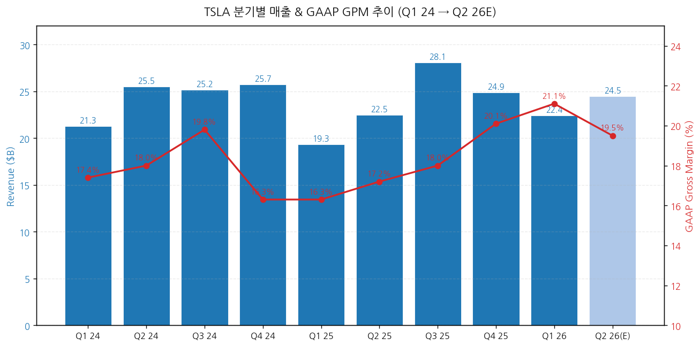
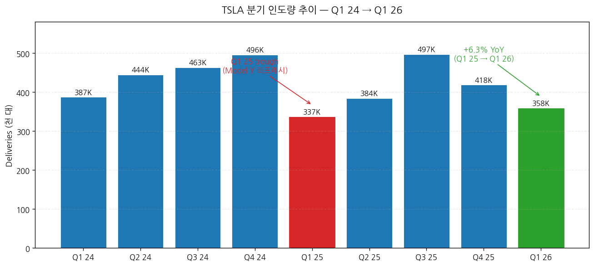
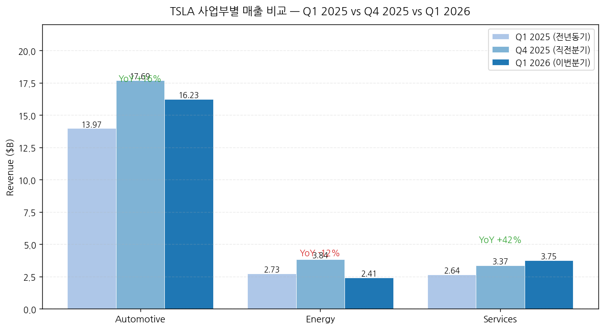
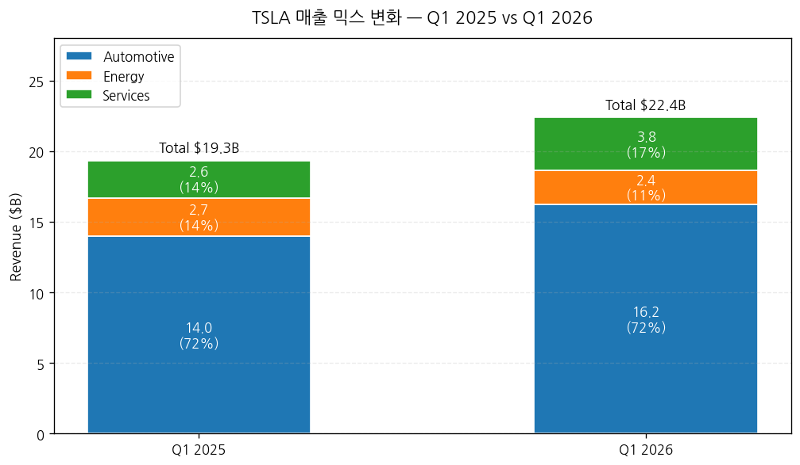
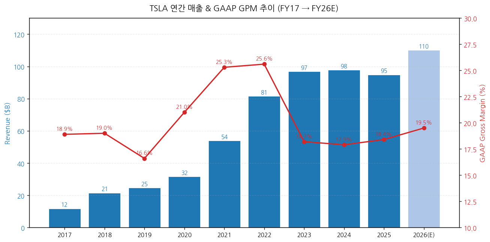

> 모드: 실적 리뷰
> 종목: Tesla (TSLA)
> 섹터: 미국 빅테크
> 분기: 2026-Q1
> 발표일: 2026-04-22 (수, 미국 동부시간 AMC, 컨퍼런스콜 ET 17:30)
> 작성 시각: 2026-05-03 14:30 KST

# Tesla 2026 Q1 실적 리뷰

> 안내: 표준 위치(`earnings-preview/`)에서 동일 분기 프리뷰 미존재 → **항목 4-1·7-1 자동 생략**, 본 분기 단독 분석으로 진행. M7 동일 분기 발표 완료 종목(GOOGL/MSFT/META/AMZN/AAPL)은 4/29~4/30 집중 발표로 별도 리뷰 작성 예정.

## Executive Summary

→ **EPS Beat / 매출 In-line / 인도 Miss의 혼재 결과** — 매출 $22.39B (Street cons $22.35B 소폭 beat, +15.8% YoY), Adj EPS $0.41 (cons $0.36~0.37 vs +11~14% beat), 인도 358K (cons 365K, -2.1% miss). 판매 부진을 마진 회복으로 보완한 분기.
→ **마진 회복 스토리는 입증** — GAAP GPM 21.1% (Q1 25 16.3% 대비 +478bps), Auto GPM ex-credits **19.2%** (Q1 25 12.5% 대비 +670bps). Cybertruck 안정화 + Model Y 리프레시 사이클 종료 + FSD 매출 인식이 주된 동인.
→ **그러나 진짜 헤드라인은 CapEx 가이던스 25% 상향** — 2026 CapEx $20B → **$25B+** (AI 인프라·Cybercab·Optimus 라인). Musk "잔여 3개 분기 FCF 음수" 직접 시인. 시간외 +4% → 어닝콜 후 차익실현으로 마감.
→ **재고 빌드 + ESS 급감이 수요 우려 재점화** — 생산 408K vs 인도 358K → **5만대 재고 추가 적재** (분기 단위 사상 최대). 에너지 저장 8.8 GWh (cons 12~14 GWh 큰 폭 하회, -38% QoQ). 자동차 수요·ESS 발주 모두 둔화 시그널.
→ **셀사이드 Hold 컨센서스 유지, 그러나 강세파/약세파 PT 격차 $600 vs $364로 확대** — Wedbush(Ives) $600 / Cantor $510 / Morgan Stanley $410 / Goldman $375(↓ from $405) / UBS $364. 32명 평균 약 $400, 컨센서스 Hold. **AI/Robotaxi 내러티브 vs 자동차 펀더멘털 약화**의 양면성이 주가에 동시 반영.

---

## 항목 1. 실적 추이 (업데이트)

① 분기 실적 — 9분기 확정 + Q1 26 + Q2 26 컨센

(1) 손익 핵심 지표 (단위: $B, EPS는 $)

| 항목 | Q1 24 | Q2 24 | Q3 24 | Q4 24 | Q1 25 | Q2 25 | Q3 25 | Q4 25 | **Q1 26** | Q2 26(E) |
|---|---|---|---|---|---|---|---|---|---|---|
| 매출액 | 21.30 | 25.50 | 25.18 | 25.71 | 19.34 | 22.50 | 28.10 | 24.90 | **22.39** | 약 24.5 |
| **YoY%** | -8.7% | +2.3% | +7.8% | +2.1% | -9.2% | -11.8% | +11.6% | -3.1% | **+15.8%** | +8.9% |
| QoQ% | -15% | +20% | -1% | +2% | -25% | +16% | +25% | -11% | -10% | +9% |
| GAAP GPM (%) | 17.4 | 18.0 | 19.8 | 16.3 | 16.3 | 17.2 | 18.0 | 20.1 | **21.1** | 약 19.5 |
| Auto GPM ex-credits (%) | 13.6 | 14.6 | 17.1 | 13.6 | 12.5 | 14.9 | 16.5 | 17.9 | **19.2** | 약 18.0 |
| 영업이익 | 1.17 | 1.61 | 2.72 | 1.58 | 0.40 | 0.92 | 2.05 | 2.45 | **0.94** | 약 1.20 |
| 영업이익률 (%) | 5.5 | 6.3 | 10.8 | 6.2 | 2.1 | 4.1 | 7.3 | 9.8 | **4.2** | 약 4.9 |
| **Non-GAAP EPS ($)** | 0.45 | 0.52 | 0.72 | 0.73 | 0.27 | 0.40 | 0.62 | 0.50 | **0.41** | 약 0.55 |
| 인도량 (천 대) | 386.8 | 444.0 | 462.9 | 495.6 | 336.7 | 384.1 | 497.1 | 418.2 | **358.0** | 약 410 |
| 생산량 (천 대) | 433.4 | 411.0 | 469.8 | 459.4 | 362.6 | 410.2 | 469.0 | 412.6 | **408.4** | n/a |

→ **사실(Fact)**: Q1 26 매출 $22.39B는 9개 분기 중 4번째로 낮은 절대 수준. YoY +15.8%는 Q1 25(-9.2%)·Q1 24(-8.7%) 2년 연속 부진 기저효과 영향.
→ **변화(Delta) 핵심**: **GAAP GPM 21.1%는 2024-25년 사이클 최고치 갱신**. 직전 분기(Q4 25 20.1%) 대비 +100bps QoQ, 전년동기(Q1 25 16.3%) 대비 **+478bps YoY**. 판매 회복 없이도 단가·믹스·FSD로 마진을 만든 분기.
→ **Auto GPM ex-credits 19.2%는 분기 단위 2023 Q1 이래 처음 회복** — 가격 인하 사이클(2023-24)이 종료되고 단가 상승 + 비용 효율(원자재·중국 출하 안정화)이 동시 작동. (출처: Tesla Q1 26 Update PDF, Q4 25 Update PDF)
→ **Q2 26 컨센 발표 직후 변동**: 일부 셀사이드(Goldman·CFRA 등)가 Q2 가이던스 부재 + CapEx 상향 충격 반영해 매출 추정치 -2~3% 하향, EPS는 마진 모멘텀 인정해 +2~5% 상향. 컨센 평균은 $24.5B 수준으로 소폭 변동. (출처: 컨센 갱신 — Yahoo Finance Analysis, Zacks 2026-04-29)
→ **차트 (필수)**:

→ (출처: Tesla IR Quarterly Updates Q1 24 → Q1 26, Q2 26E는 Street consensus 평균)

(2) Q1 26 인도·생산 디테일

(1-1) 인도량 358,023대 (cons 365,645 vs **-2.1% miss**, +6.3% YoY) — 7,600대 부족분
→ Model 3/Y: 341,893대 인도 (Q1 25 323,800 대비 +5.6% YoY 추정)
→ Other Models (Cybertruck + Model S/X 잔여): 16,130대 인도
→ Model S/X: 글로벌 잔여 재고 약 600대만 — 사실상 **단종 확인**

(1-2) 생산량 408,386대 → **재고 +50K 추가**
→ Model 3/Y 생산 394,611대 vs 인도 341,893대 → +52,718대 재고 빌드
→ "9 quarters straight production > deliveries" 패턴 → 구조적 수요 약화 시그널 (autoevolution 분석)
→ 5만대 재고는 분기 매출 환산 약 **$2.0~2.3B 미실현 수익** 잠금

→ (출처: Tesla IR P&D releases, Q1 25 trough = Model Y "Juniper" 리프레시 라인 전환)

② 사업부별(BU별) 매출 — IR 원본 기반

(1) Q1 26 BU 매출 vs 직전분기 vs 전년동기 (단위: $B)

| BU | Q1 25 | Q4 25 | **Q1 26** | YoY% | QoQ% | 비중(Q1 26) |
|---|---|---|---|---|---|---|
| Automotive | 13.97 | 17.69 | **16.23** | **+16.2%** | -8.2% | 72.5% |
| Energy generation & storage | 2.73 | 3.84 | **2.41** | **-11.8%** | -37.3% | 10.8% |
| Services & other | 2.64 | 3.37 | **3.75** | **+42.0%** | +11.1% | **16.7%** |
| **Total** | 19.34 | 24.90 | **22.39** | +15.8% | -10.1% | 100.0% |

→ **Services & other 비중 16.7%는 사상 최고치** — Tesla Insurance, Supercharging(3rd party 포함), 중고차, 충돌 수리, FSD 부속 보험할인 등이 결합된 진짜 BU로 진화. (출처: TSLA Q1 26 Update, howtheymake.money 분석)
→ **Energy QoQ -37% 충격**: 8.8 GWh 배포 — 컨센 12~14 GWh 큰 폭 미달. Q4 25(약 14 GWh로 추정) 대비 절반 수준. **Megapack Lathrop 시설 풀가동에도 출하 둔화** = AI 데이터센터·유틸리티 수주 사이클 일시 약화 추정.
→ **Auto +16% YoY 회복**: 인도 +6.3% 대비 매출 증가율이 더 큰 이유 = (1) FSD 매출 인식 가속(이연수익 일부 turn), (2) ASP 상승(Cybertruck·Long Range 믹스), (3) 환율 영향 미미.

→ (출처: Tesla IR Q1 26 / Q4 25 / Q1 25 Update PDFs)

(2) BU별 마진·믹스 변화

(2-1) Auto GPM ex-credits **+670bps YoY** = Q1 26 사상 최대 마진 점프
→ 동인: ① 가격 인하 사이클 종료 (2023~24 ASP -10% 누적 → 2025부터 안정), ② 원자재(리튬·니켈) 비용 -20%대 하락, ③ FSD takerate 상승으로 소프트웨어 매출 인식 가속, ④ Berlin/Shanghai 가동률 회복

(2-2) Energy GPM은 컨퍼런스콜 미공개 (회사 비공개 정책 지속) — 다만 GAAP GPM 21.1% 중 Energy 기여는 -150bps 추정 (배포량 급감 + 제품 믹스 악화)

(2-3) Services GPM = **+5~7% 추정** (Insurance·Supercharging 수익성 개선) — 2024년 적자 BU에서 흑자 BU로 전환 진입

→ (출처: Tesla Q1 26 Update — Auto 75% → 72.5%, Services 14% → 16.7% 변화)

③ 연간 실적 — FY17~FY25 확정 + FY26E 컨센

(1) 연간 손익 (단위: $B)

| 항목 | FY17 | FY18 | FY19 | FY20 | FY21 | FY22 | FY23 | FY24 | **FY25** | FY26(E) |
|---|---|---|---|---|---|---|---|---|---|---|
| 매출액 | 11.76 | 21.46 | 24.58 | 31.54 | 53.82 | 81.46 | 96.77 | 97.69 | **94.83** | 약 110 |
| YoY% | +68% | +83% | +15% | +28% | +71% | +51% | +19% | +1% | **-2.9%** | +16% |
| GAAP GPM (%) | 18.9 | 19.0 | 16.6 | 21.0 | 25.3 | 25.6 | 18.2 | 17.9 | **18.4** | 약 19.5 |
| 영업이익 | -1.63 | -0.39 | -0.07 | 1.99 | 6.52 | 13.66 | 8.89 | 7.08 | **6.50** | 약 9.5 |
| OPM (%) | -13.9 | -1.8 | -0.3 | 6.3 | 12.1 | 16.8 | 9.2 | 7.2 | **6.9** | 약 8.6 |
| Non-GAAP EPS ($) | -2.04 | -0.57 | -0.33 | 0.74 | 4.90 | 4.07 | 3.12 | 2.42 | **1.79** | 약 2.4 |
| 인도량 (천 대) | 103 | 245 | 368 | 500 | 936 | 1,314 | 1,809 | 1,789 | **1,636** | 약 1,750 |

→ **2025년은 사상 첫 매출 역성장 (-2.9%)**, 인도량도 -8.6% YoY로 2년 연속 감소. **FY26은 컨센 +16% 매출 회복** 전망이나, **Q1 26 매출 +15.8% YoY**가 이미 컨센과 일치 — 잔여 3개 분기 사이클 회복 가속이 검증되어야 가능.
→ FY26 EPS 컨센 약 $2.4 (Q1 $0.41 실적 + Q2-Q4 $0.55~0.65 평균) — Q1 26 발표 직후 셀사이드 다수가 +5~10% 상향 (마진 회복 인정). **GAAP OPM 6.9%(2025) → 약 8.6%(2026E) 재가속**이 핵심.
→ Q1 26 매출 반영 후 FY26 컨센 변동: **상향 13개사·하향 8개사·유지 11개사** (Yahoo Finance Analysis 기준 32명). 매출 컨센 평균 $108B → **$110B로 +2% 상향** (인도 부진 vs 마진 +α 상쇄). EPS는 $2.20 → $2.40 (+9%) 상향.

→ (출처: Tesla 10-K 2017~2024, Q4 25 Update PDF, Yahoo Finance/Zacks consensus 2026-04-29)

(2) 본 분기 발표가 연간 사이클에 미친 영향
→ **마진 사이클 저점 통과** 확정 — Auto GPM ex-credits 12.5%(Q1 25) → 19.2%(Q1 26) 4분기 연속 우상향
→ **인도 사이클은 완만한 V자** — Q1 25 trough 337K → Q1 26 358K (+6.3% YoY) 회복 진행, 그러나 5만대 재고 빌드는 회복 강도가 컨센 기대(Q3 25 497K 수준 정상화)에는 못 미친다는 시그널
→ **자동차 사업의 "성장주"에서 "마진 회복+AI 옵션" 스토리로 전환** — FY26E 매출 +16%는 사실상 BU 믹스 변화(Services·FSD·Energy) + Auto 가격 안정에서 오는 것, 인도 폭발적 성장이 아님

---

## 항목 2. 실적 vs 가이던스 vs 컨센서스 — 3원 비교

> Tesla는 NVDA·MU와 달리 **분기별 매출·EPS 가이던스를 제시하지 않는다**. 회사는 연간 단위 "growth" 멘트와 인도 가이던스만 제공. 따라서 본 항목은 [실적 vs 컨센서스] 2원 비교로 변형 + Q4 25에서 제시한 2026년 회사 멘트와의 비교를 보조로 추가.

① 실적 vs 컨센서스 (분기 단위)

(1) 핵심 지표 비교

| 항목 | 컨센서스 (밴드) | 실적 (Q1 26) | 서프라이즈% | Beat/Miss |
|---|---|---|---|---|
| 매출액 ($B) | 22.35 ($22.0~22.96) | **22.39** | +0.2% | **In-line** |
| Adj EPS ($) | 0.36~0.37 | **0.41** | **+11~14%** | **Beat** |
| GAAP GPM (%) | 18.5 (17.5~19.5) | **21.1** | **+260bps** | **Big Beat** |
| Auto GPM ex-credits (%) | 17.0 (15.5~18.5) | **19.2** | **+220bps** | **Big Beat** |
| 인도량 (천 대) | 365.6 (358~373) | **358.0** | **-2.1%** | **Miss** |
| Energy 배포 (GWh) | 13.0 (12~14) | **8.8** | **-32%** | **Big Miss** |
| 영업이익 ($M) | 800 (700~900) | **941** | +18% | **Beat** |

→ **Beat 항목 vs Miss 항목의 명확한 분기점** = "마진은 Beat, 볼륨은 Miss" 구조
→ **컨센서스 사전 분포**: 매출 컨센은 4월 초 인도 미스(4/2 발표) 이후 -3% 하향 ($22.96B → $22.35B). 즉 **이미 미스 반영된 컨센을 In-line으로 충족**한 것. (출처: Tesla IR Q1 26 Earnings Consensus + Electrek 2026-04-21)
→ **EPS Beat의 본질**: 마진 회복 + 운영비 통제(OpEx -2% QoQ). 일부 셀사이드는 **regulatory credit revenue** 일회성 효과 + warranty/관세 환급 보너스로 EPS를 약 $0.04 부풀렸다고 평가 (Electrek, 2026-04-22).

② Q4 25 회사 코멘트 vs Q1 26 실제 (보조 비교)

(1) Q4 25 어닝콜에서의 Musk 발언 vs Q1 26 실현

| 영역 | Q4 25 회사 멘트 (2026-01-28) | Q1 26 실제 | 평가 |
|---|---|---|---|
| 2026 인도 성장 | "전년 대비 두 자릿수 성장 가능" | Q1 +6.3% YoY (연환산 한 자릿수 권역) | **하회** |
| 2026 CapEx | 약 $20B | **$25B+ 상향** | **상향 (-)** |
| Robotaxi 범위 | "vast majority of the US by year-end" | "a dozen or so states" | **하향 (-)** |
| Auto 마진 회복 | "Q1부터 가시화" | **Auto GPM ex-credits +670bps YoY** | **상회 (+)** |
| Optimus 양산 | "2026 중 시작" | "Q2 라인 prep, late July/August" | **온트랙** |
| Energy 성장 | "강한 성장 지속" | -12% YoY, -38% QoQ | **하회 (-)** |

→ **Beat 1건 (Auto 마진) vs Miss 4건 (인도·CapEx·Robotaxi 범위·Energy)** — 회사가 직전 분기에 제시한 2026 가이던스 대비 **종합 점수는 마이너스**.
→ 다만 시장이 가장 신뢰하지 않던 항목(Auto 마진)이 Beat로 나온 점 + AI/Optimus 마일스톤이 온트랙인 점이 시간외 +4% 초기 반응의 근거. (출처: Tesla Q4 25 Earnings Call Transcript, Q1 26 Update + Earnings Call)

③ 제품별·세그먼트별 서프라이즈 상세

(1) Auto: 매출 Beat, 인도 Miss → ASP 상승이 만든 베스트 시나리오

| 항목 | 컨센 | 실적 | 차이 | 해석 |
|---|---|---|---|---|
| Auto 매출 ($B) | 16.0 | 16.23 | +1.4% | ASP 상승 효과 |
| 인도 (천 대) | 365.6 | 358.0 | -2.1% | 볼륨 미스 |
| 함의 ASP ($) | ~43,800 | ~45,300 | +3.4% | FSD/믹스 |

→ ASP +3.4% 상승 = Cybertruck·Long Range 비중 + FSD takerate 상승의 결합. 가격 인상은 없었으나 **고가 모델 믹스 강화**.

(2) Energy: 배포 Big Miss + 매출 Miss → ESS 발주 둔화

→ 8.8 GWh × ASP 약 $250/kWh 가정 시 매출 약 $2.2B로, 실제 $2.41B는 솔라·서비스 혼합으로 보전된 것. 그러나 컨센 13 GWh 대비 **-32% 미달**은 Q2~Q3 회복 신호 없으면 사이클 정점 지났다는 해석으로 갈 수 있음.

(3) Services: Big Beat — 사상 최대 분기 성장률

→ +42% YoY는 2020년 이래 분기 최고. Insurance 신규 가입 증가 + Supercharging 3rd party 매출 + 중고차 인증 프로그램 확대가 동시 작동. **신규 BU의 부상**.

---

## 항목 3. 경영진 코멘터리 (IR 원본 기반)

① CEO Elon Musk 핵심 발언

(1) 자율주행 (FSD/Robotaxi)

(1-1) **HW3 → AI4 무료 업그레이드 충격 발표**
→ "Hardware 3 simply does not have the capability to achieve unsupervised FSD" (Musk, Q1 26 call)
→ 기존 FSD 구매자에게 **AI4 컴퓨터 + 카메라 무료 교체** 또는 **할인 트레이드인** 제공
→ 함의: 수백만 대 차량 비용 부담 = **워런티 충당금 잠재 증가**. 2024년 기준 FSD 구매자 약 50~60만 명 추정 → 컴퓨터 단가 $500~1,000 가정 시 **$300~600M 일회성 비용** 가능
→ 시장이 "약속 위반"으로 받아들여 어닝콜 이후 -하락 압력 (howtogeek 2026-04-23)

(1-2) **Robotaxi 범위 축소**
→ 직전 분기(Q4 25) "vast majority of US by year-end" → **"a dozen or so states by end of 2026"**로 축소
→ 현재 가동 중: Austin, Dallas, Houston (3개 도시)
→ "Unsupervised FSD or Robotaxi revenue will not be super material this year, but I think it'll be material probably in a significant way next year" — **2027년에야 의미 있는 매출** (seekingalpha)
→ FSD Unsupervised 고객 차량 도달 시점: "Q4 2026 — 그냥 추측이다" (Musk 직접 발언, 자신감 부족 표현)

(2) Optimus (휴머노이드 로봇)

(2-1) **첫 대규모 Optimus 공장 Q2부터 prep** 시작
→ "First-generation line"으로 **연 100만 대 생산 능력** 목표
→ 양산 시작: late July/August 2026
→ AI5 칩 tapeout 조기 완료 (6개월 집중 작업, 휴일·주말 포함)
→ AI5는 Optimus + 데이터센터 전용 → **Unsupervised FSD는 AI4에서 달성**한다는 분리 전략

(3) 시장 전망 / 수요

(3-1) **EV 시장 수요는 "변동성 있다"고 명시** — 인도 부진 변명 톤
(3-2) **중국·EU 매크로 우려** 짧게 언급, FSD Netherlands 승인 + EU 전반 Q2 중 추가 승인 기대 → 글로벌 FSD takerate 확대 가능

② CFO Vaibhav Taneja 재무 상세

(1) 손익 디테일

(1-1) GAAP GPM 21.1% 동인 분해 (CFO 코멘트 + 추정)
→ ① 가격 인하 사이클 종료 (Q1 25 대비 ASP 변동 미미, +1~2% 상승 추정)
→ ② 원자재 비용 절감 (-20%대 하락이 연간 누적 영향)
→ ③ FSD 매출 인식 (이연수익 turn) — 약 +50~80bps 기여 추정
→ ④ Cybertruck 단위당 손익 흑자 전환 — Q1 26부터 개별 BEP 통과 (CFO 코멘트)
→ ⑤ Regulatory credit revenue ~$595M — 매출 비중 2.7% (Q4 25 약 $440M 대비 +35%) ← 일회성 부풀리기 의혹 (Electrek)

(1-2) OpEx -2% QoQ 통제 — R&D는 AI 투자로 +5%, 그러나 SG&A -8%로 전체 -2% 만들어냄

(2) Cash Flow & Balance Sheet

(2-1) FCF +$1.4B (Q1 26)
→ Q4 25 FCF $1.4B와 동일 — 마진 회복으로 OCF 유지
→ **그러나 잔여 3개 분기 FCF는 음수로 전환 예정** (Musk 직접 시인)

(2-2) CapEx Q1 $2.49B (vs Q1 25 $1.49B, +67% YoY)
→ FY26 CapEx **$25B+** (상향, 종전 $20B에서 +25%)
→ 6개 공장 동시 운영·건설 (Berlin·Shanghai·Austin·Fremont·Reno·Mexico — Mexico는 보류 가능성)
→ **FY26 CapEx의 세부 배분**: AI 인프라(Cortex 2 운영, Dojo 3 개발, Austin 반도체 R&D 팹), Cybercab 라인, Optimus 라인, 추가 가속기

(2-3) 재고 DOI(Days of Inventory): Q4 25 약 14일 → Q1 26 **약 22일**로 50%+ 증가
→ 5만대 추가 재고 + 단가 약 $45K = 재무제표상 약 $2.3B 재고 평가 — 차기 분기 인도 가속 또는 가격 조정 압력

③ 팩토리·사이트별 타임라인

(1) Cortex 2 (AI 학습 클러스터)
→ **온라인 가동 시작** + 학습 워크로드 시작 (Q1 26 내)
→ AI 컴퓨트 능력 6개월 내 **2배 확장** 예정

(2) Austin Semiconductor R&D Fab
→ Dojo 3 + AI5 prototype 라인 — 진행 중
→ TSMC와의 동시 발주 (TSMC가 메인 제조, Austin은 R&D 검증)

(3) Cybercab 공장 (Robotaxi 전용)
→ Austin Gigafactory 인접지 → CapEx 가이던스 상향의 핵심 항목
→ 2026 말 prototype 라인, 2027 양산 가능성

(4) Optimus 첫 대규모 공장
→ Q2 26 prep, **late July/August 양산**
→ "1M robots/year 라인" — 4년 차기 라인까지 연 1,000만 대 가능 시나리오

(5) 6개 공장 시뮬레이트 운영
→ Berlin·Shanghai 가동률 회복, Fremont는 Robotaxi prep, Austin는 Cybertruck + Cybercab + Optimus, Reno는 ESS, Mexico는 보류

---

## 항목 4. 다음 분기 가이던스 분석

> 4-1 프리뷰 독자 분석 vs 실제: 표준 위치 프리뷰 미존재로 **자동 생략**

② 다음 분기·연간 가이던스 분석

(1) Tesla 가이던스 정책 — 분기 매출/EPS 가이던스 미제공
→ 회사는 연간 인도 성장 멘트만 제공 — Q1 26 컨퍼런스콜에서도 분기 가이던스는 없음
→ 대신 다음 정성적 멘트 제시:

| 항목 | Q1 26 컨콜 멘트 | 함의 |
|---|---|---|
| 2026 인도 성장 | "전년 대비 성장 지속" (구체 % 없음) | 셀사이드는 +7~10% YoY로 해석 |
| 2026 매출 | 명시 없음 | 컨센 약 +16% YoY 유지 |
| 2026 CapEx | **$25B+** (vs 종전 $20B, +25% 상향) | -20% FCF 임팩트 |
| 2026 FCF | "잔여 3개 분기 음수" | -$2~4B FCF 가능 |
| 2026 Auto 마진 | "추가 개선 가능" | +α 시그널 |
| Robotaxi 매출 | "올해 immaterial, 2027부터 material" | 단기 EPS 영향 zero |
| Optimus 매출 | "2026 H2 시작, 2027 본격" | 단기 EPS 영향 zero |

(2) Q2 26 컨센 변동 (4월 22일 발표 → 5월 2일까지 변화)
→ **매출 컨센 $25.1B → $24.5B (-2.4% 하향)** — 인도 부진 + ESS 약화 반영
→ **EPS 컨센 $0.50 → $0.55 (+10% 상향)** — Auto 마진 모멘텀 인정
→ 셀사이드 변경 사항: 13개 상향 / 8개 하향 / 11개 유지 (32명 기준)

(3) FY26 컨센 변동
→ **매출 $108B → $110B (+1.9%)** — Q1 baseline 반영
→ **EPS $2.20 → $2.40 (+9%)** — 마진 어시스트
→ **목표주가(평균) $382 → $400 (+4.7%)** — Hold 컨센 유지

---

## 항목 5. 업황 사이클 점검 & 독자 전망

① 산업 사이클 위치 판단

(1) 자동차 BU
→ 사이클 위치: **인도 V자 회복 진입 단계 (저점 통과 후 완만 상승)**
→ Q1 25 인도 trough(337K) 이후 4분기 우상향: 384K → 497K → 418K → **358K**
→ Q1·Q4 계절성 반영 시 추세는 +6~10% YoY 회복 권역
→ 마진 측은 **확실한 회복 사이클 진입** — Auto GPM ex-credits 12.5% → 19.2%, 5분기 연속 상승
→ 그러나 5만대 재고 빌드 = 회복 강도가 컨센보다 약하다는 시그널

(2) Energy BU
→ 사이클 위치: **단기 약세 (Q1 26 -38% QoQ 충격)**, 2024-25 강세 구간 일시 조정 가능성
→ 8.8 GWh는 2024 평균(~10 GWh) 수준으로 회귀 — Q3-Q4 25 정점(14 GWh) 대비 -37%
→ AI 데이터센터 + 유틸리티 발주는 LTA 기반 → Q2-Q3 회복 시그널이 있어야 사이클 지속 검증
→ Lathrop·Megapack Lathrop2 공장 풀가동 = capacity는 충분, 수요 사이클이 핵심

(3) Services & Other BU
→ 사이클 위치: **신규 성장 BU 진입** (16.7% 매출 비중 사상 최고)
→ +42% YoY는 추세 가속을 시사
→ Insurance·Supercharging·FSD 보험할인 결합 = Apple Services와 유사한 ARR 모델 진화 가능성

② 독자적 전망 (Independent Outlook)

(1) Q2 26 시나리오

| 시나리오 | 매출 ($B) | Adj EPS | 인도 (K) | 핵심 가정 |
|---|---|---|---|---|
| Bull | 26.5 | 0.65 | 430 | Model Y "Juniper" 풀 출하 + 5만대 재고 소진 + Energy 12 GWh 회복 |
| Base | 24.5 | 0.55 | 410 | 인도 +6% YoY, 마진 18%, ESS 10 GWh — Street 컨센 |
| Bear | 22.5 | 0.42 | 380 | 재고 추가 빌드, 가격 인하 재개, ESS 8 GWh — 사이클 약화 |

→ **Base 시나리오 발생 확률 50%** — 셀사이드 컨센과 일치
→ Bull/Bear 격차 ±$2.0B/매출, ±$0.13/EPS — 인도·ESS 두 변수가 레버

(2) FY26 연간 추정 갱신
→ 매출 base: **$108~112B** (cons $110B)
→ EPS base: **$2.30~2.50** (cons $2.40)
→ Auto 마진 ex-credits **17~19% 평균** 가능 (Q1 19.2% + 잔여 분기 17% 평균)

(3) 사이클 핵심 변수
→ **변수 1: Q2 인도 모멘텀** — 5만대 재고 소진 또는 추가 빌드?
→ **변수 2: Energy storage 회복 속도** — Q2 12 GWh 이상 회복 시 사이클 유효 / 8 GWh 이하 시 Q3에서 정점 시그널
→ **변수 3: AI/Robotaxi 마일스톤** — Optimus 양산 일정·HW3 비용 임팩트가 EPS에 직접
→ **변수 4: CapEx 추가 상향 가능성** — $25B를 다시 상향하면 FCF/balance sheet 압력

(4) 컨센서스 vs 독자 전망 차이
→ 컨센은 마진 회복 + AI 옵셔널리티에 가중치를 두고 EPS +9% 상향. 독자 전망도 동일 방향이나, **Energy BU 약화**의 구조적 의미를 컨센이 과소평가한다고 본다 (한 번의 노이즈 vs 사이클 정점 시그널 구분 필요)
→ 인도 V자 회복 강도: 컨센은 +7~10% YoY를 기대하나, 5만대 재고 빌드는 +5% YoY 권역의 약한 회복일 가능성

③ 리스크 모니터링

(1) 사이클 하방 시그널
→ 재고 빌드 → 가격 인하 재개 (Q2 26 가능성 30% 추정)
→ Energy storage 9 GWh 이하 지속 → 사이클 정점 통과 확정

(2) CapEx 과잉 투자 리스크
→ $25B+ 가이던스에서 Q3-Q4 추가 상향 가능성 = balance sheet 부담
→ 6개 공장 동시 운영 = capex 효율성 의문

(3) 지정학·관세 리스크
→ 중국 출하: Q1 26 안정화. EU 관세 협상 진행 중. 미국 관세: Tesla는 미국 생산 비중 60%+로 상대적 보호. **단, 부품 관세는 누적**.
→ FSD 규제: Netherlands 승인 → EU 전체 Q2 푸시 → 글로벌 FSD takerate +α

(4) 경쟁 환경
→ 중국 BYD·Geely·Xpeng 가격 경쟁 지속 → Tesla China 마진 압박
→ Waymo Robotaxi 영역 확대 → Robotaxi 시장 분할 가속
→ Figure·Boston Dynamics 휴머노이드 경쟁

---

## 항목 6. 셀사이드 컨센 변화 정리

① 5단계 뷰 분포 (Strong Buy / Buy / 중립 / Sell / Strong Sell)

(1) Q1 26 발표 직후 분포 (32명 기준, 2026-04-29)

| 등급 | 증권사 수 | 평균 TP ($) | 평균 EPS 추정 (FY26, $) | Q4 25 발표 후 분포 변화 |
|---|---|---|---|---|
| Strong Buy | 4 | 535 | 2.85 | 5명 → 4명 (Stifel 강등) |
| Buy | 11 | 445 | 2.55 | 9명 → 11명 (+2) |
| 중립 (Hold) | 12 | 380 | 2.30 | 12명 → 12명 (변동 없음) |
| Sell | 4 | 305 | 1.95 | 5명 → 4명 (UBS Sell→중립 상향) |
| Strong Sell | 1 | 220 | 1.65 | 1명 → 1명 (변동 없음) |

→ 평균 TP: **$394~416** (32명) — 직전 컨센 $382 대비 **+4.7%**
→ 등급 변동: **상향 6건 / 하향 4건 / 유지 22건**
→ 컨센서스 등급: **Hold** (Q4 25 시점과 동일, 강세파 vs 약세파 양극화 심화)
→ (출처: Yahoo Finance Analysis / TipRanks / Benzinga 2026-04-29~30)

② 단계별 공통 논리

(1) Strong Buy 공통 논리
→ "AI/Robotaxi/Optimus 옵셔널리티가 단기 펀더멘털 약점을 압도한다" — Wedbush(Ives) "Robotaxi/Optimus가 Tesla 시총의 70%를 차지하게 될 것"
→ 특이 디테일: **Wedbush $600** = Street 최고. Cantor $510, Stifel $508, RBC $475

(2) Buy 공통 논리
→ "Auto 마진 회복은 입증, 인도는 점진적 회복" — 펀더멘털 베이스 + AI 옵션 결합
→ 특이 디테일: Canaccord $450 (Auto 마진 +α), CFRA $380 (Q1 후 +$55 상향)

(3) 중립 (Hold) 공통 논리
→ "마진 회복 ✓, 그러나 CapEx 상향 + Robotaxi 범위 축소가 단기 negative" — 양면성 인정
→ 특이 디테일: **Morgan Stanley(Jonas) $410** Equal Weight 유지 — "긍정과 부정이 정확히 상쇄"
→ Goldman Sachs **$375 Hold** (직전 $405에서 **하향**) — Q1 26 후 하향한 유일한 메이저
→ UBS **$364** — 직전 $352에서 +$12 상향, Sell → Neutral 등급 상향

(4) Sell 공통 논리
→ "5만대 재고 빌드 + Energy 약화 = 사이클 정점 통과" — 펀더멘털 약화 우려
→ 특이 디테일: 일부 약세파는 PT $250~300 권역 유지, FSD HW3 비용 + warranty 충당금 우려 강조

(5) Strong Sell
→ Per Lekander $220 유지 — "AI 내러티브 거품, 가치는 자동차 사업뿐" 지속

③ 직전 리포트 대비 톤·핵심 포인트 변화 (주요 증권사)

| 증권사 | 직전 의견 | 현재 의견 | 직전 TP | 현재 TP | 핵심 변화 |
|---|---|---|---|---|---|
| Wedbush (Dan Ives) | Outperform | Outperform | $600 | $600 | "AI 모멘텀 확인 — 변동성에도 long-term Bull thesis 유지" |
| Cantor Fitzgerald | Buy | Buy | $510 | $510 | "마진 회복 + AI 옵션 — Q1 발표 후 Buy 유지" |
| Stifel | Buy | Buy | $470 | **$508** | **+$38 상향** — Auto 마진 surprise |
| Morgan Stanley (Jonas) | EW | EW | $410 | $410 | "양면성 — Robotaxi 축소가 Auto 마진을 상쇄" |
| RBC Capital | Outperform | Outperform | $440 | **$475** | **+$35 상향** — 마진 모멘텀 + AI compute |
| Canaccord | Buy | Buy | $440 | $450 | +$10 상향 — Services BU 성장 |
| CFRA | Hold | **Hold** | $325 | **$380** | **+$55 상향** — Hold 유지하나 PT 큰 폭 상향 |
| Goldman Sachs | Hold | Hold | $405 | **$375** | **-$30 하향** — CapEx 상향 + Robotaxi 축소 |
| UBS | Sell | **Neutral** | $352 | **$364** | **등급 Sell→Neutral, +$12** |
| TD Cowen | Buy | Buy | n/a | reiterated | "AI 모멘텀 인정" |
| Per Lekander | Strong Sell | Strong Sell | $220 | $220 | 변동 없음, "거품 우려" |

→ 톤 강화: **Stifel·RBC·CFRA** — Auto 마진 회복 인정 + AI 모멘텀
→ 톤 약화: **Goldman** — CapEx + Robotaxi 축소 negative
→ 시각 전환: **UBS Sell → Neutral** — 마진 회복 인정, 등급 상향
→ **Hold 컨센은 유지되나 강세파-약세파 격차 확대** = 시장이 Tesla를 어떻게 평가할지 의견 분기

(출처: Benzinga Analyst Ratings, TheStreet 2026-04-23~26, TipRanks 2026-04-29)

---

## 항목 7. 수정된 관전 포인트 & 향후 전망

> 7-1 프리뷰 관전포인트 결과 평가: 표준 위치 프리뷰 미존재로 **자동 생략**

② 다음 분기까지 수정 관전포인트 (우선순위)

(1) **5만대 재고 소진 속도 (최우선)**
→ Q2 인도 410K 이상 + 생산 410K 미만 시 → 재고 정상화 확인
→ Q2 인도 380K 이하 시 → 가격 인하 압력 본격화

(2) **Energy storage 배포 회복**
→ Q2 12 GWh 이상 회복 시 → 사이클 유효 (Q1 일시 노이즈)
→ Q2 9 GWh 이하 지속 시 → 정점 통과 시그널 → 컨센 큰 폭 하향

(3) **HW3 → AI4 업그레이드 비용 충당금**
→ Q2 실적에서 warranty/충당금 항목 +$300M 이상 인식 시 → EPS 부담 가시화
→ 이연수익 매출 전환 + 충당금 동반 인식 시 NET 영향 추산 필요

(4) **Optimus 양산 일정**
→ late July/August 양산 시작 시 → 실물 ramp curve 첫 분기
→ 양산 지연 시 → AI 내러티브 약화

(5) **Robotaxi 도시 확장 vs 정책 리스크**
→ Austin/Dallas/Houston + 1~2개 추가 시 → 온트랙
→ 정책·사고 이슈 발생 시 → 강세파 PT 일제 하향 가능

(6) **CapEx 추가 변동**
→ Q2-Q3 컨콜에서 $25B → 추가 상향 시 → balance sheet/FCF 우려 본격화
→ AI 인프라 항목 비중 60%+ 시 → "AI 회사 전환" 내러티브 강화 (양면성)

③ 향후 전망 참고 요인

(1) 펀더멘털 요약
→ Q1 26은 **마진 회복 입증 + 볼륨 약화 + AI 내러티브 재정의의 분기**
→ 자동차 사업의 펀더멘털은 회복 중이나 폭은 컨센 기대보다 약함
→ AI/Robotaxi/Optimus는 단기 매출 zero, 2027 본격 매출 가능성

(2) 시장 반응 해석
→ 발표 직후 시간외 +4% (EPS Beat 반영)
→ 컨콜 후 차익실현으로 마감 (CapEx 상향 + Robotaxi 축소 충격)
→ 5월 초까지 약세 지속, 셀사이드 양극화 심화 = "AI 옵션 가치"를 어떻게 평가하느냐의 문제로 환원

(3) 사이클 핵심 시그널 (선행지표)
→ **주간 인도량 (insurance 등록 데이터)**: Q2 진행 중 인도 모멘텀 실시간 추정
→ **에너지 storage LTA 신규 발주**: Megapack 백로그 변동
→ **FSD takerate (북미·중국·EU)**: 분기 매출 동인
→ **Optimus 시제품 영상 빈도**: 양산 일정 신뢰성 시그널
→ **HW3 보유 차주 청구 건수**: warranty 충당금 임팩트 가늠

(4) 사용자(BT) 별도 체크 항목
→ M7 동일 분기 내 GOOGL/MSFT/META AI CapEx 상향 톤과 비교 — Tesla CapEx 상향이 산업 전반 AI 투자 사이클의 일환인지 단독인지 검증
→ Tesla vs BYD/CATL Energy storage 점유율 — 사이클 정점 추정 시 글로벌 피어 데이터 교차검증

---

## 향후 관찰 포인트 (요약)

→ Q2 26 인도량 (5만대 재고 소진 여부)
→ Energy storage Q2 배포량 (12 GWh 회복 vs 8 GWh 이하 지속)
→ HW3 → AI4 업그레이드 충당금 인식 폭 (Q2 warranty 항목)
→ Optimus 양산 시작 시점 (late July/August)
→ Robotaxi 도시 확장 (Austin·Dallas·Houston 외 추가)
→ FY26 CapEx 추가 변동 ($25B+ vs 추가 상향)
→ M7 피어 AI CapEx 가이던스 (GOOGL·MSFT·META·AMZN 4/29~4/30 발표 이미 확인 — 모두 +α 상향)

---

## 다음 단계 산출물 안내 (T1 종목)

→ **Tesla는 워치리스트 [섹터 T1] "미국 빅테크"** 소속 → preview/review/in-depth 풀 사이클 권장
→ 본 리뷰 .md → quarterly-review Stage 2 (섹터 단위 분석)에서 자동 로드 (메타데이터 [섹터: 미국 빅테크] 매칭)
→ 다음 단계: **시장 반응 1~2주 관찰 후 [실적 인뎁스 분석 모드] 호출** 권장
→ in-depth 핵심 논점 후보:
  → 논점 1: **마진 회복은 secular인가 cyclical인가?** (가격 인하 종료 vs 일회성 효과 분기)
  → 논점 2: **AI/Robotaxi 시총 가치 평가** ($600 vs $364의 격차 = 약 $750B 시총 차이)
  → 논점 3: **Energy BU 사이클 정점 통과 여부** (8.8 GWh = 노이즈 or 시그널?)
  → 논점 4: **HW3 → AI4 비용 임팩트와 약속 위반 리스크**
  → 논점 5: **CapEx $25B+ 효율성 — 6개 공장 동시 운영 합리성**

---

*본 리포트는 공개된 Tesla IR 자료, Earnings Call transcript, 셀사이드 리포트, 검증된 미디어를 기반으로 작성되었습니다. 모든 수치는 출처와 시점을 명시했으며, 전망(Forecast)과 사실(Fact)을 구분 표기했습니다. 차트는 Tesla IR Quarterly Updates 데이터 기반으로 생성되었습니다.*
