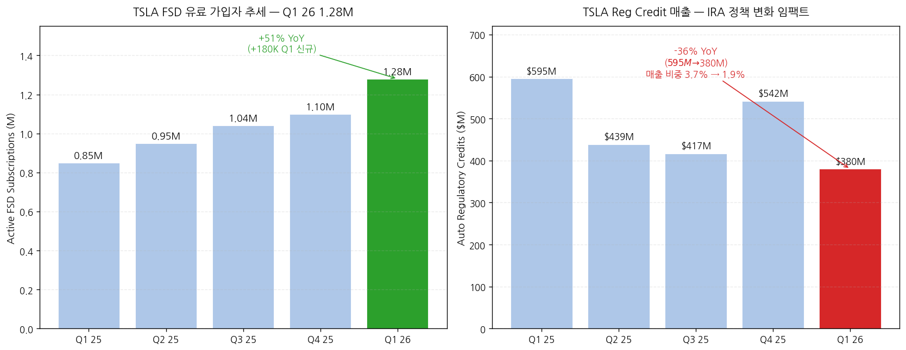
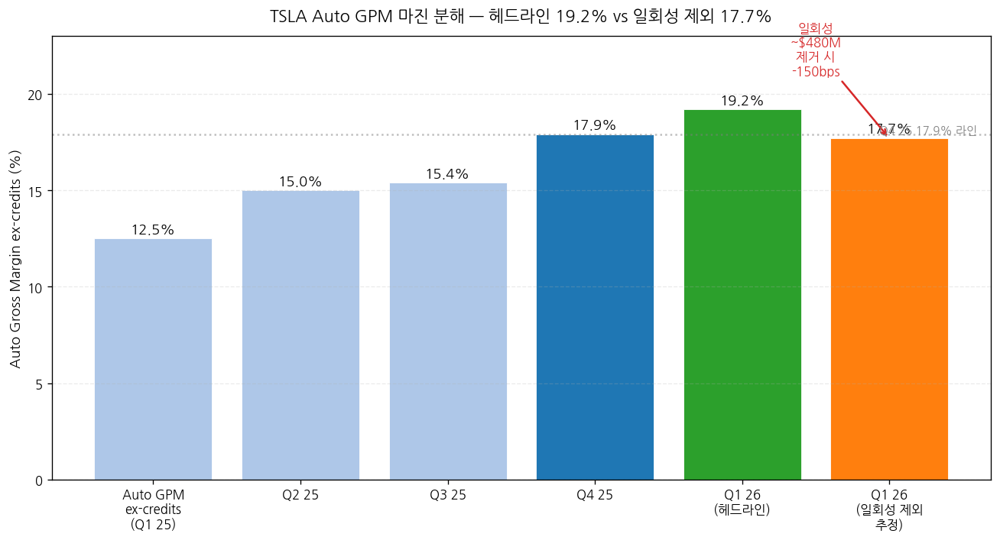
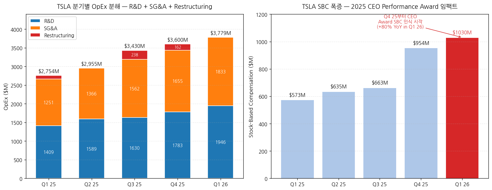

> 모드: 실적 리뷰
> 종목: Tesla (TSLA)
> 섹터: 미국 빅테크
> 분기: 2026-Q1
> 발표일: 2026-04-22 (수, 미국 동부시간 AMC, 컨퍼런스콜 ET 17:30 / 4:30 PM CT)
> 작성 시각: 2026-05-03 16:00 KST (v2 — IR 원본 기반 전면 재작성)

# Tesla 2026 Q1 실적 리뷰 (v2 — IR 원본 기반 재작성)

> 안내: v1(2026-05-03 14:30, 2차 소스 기반)에서 발견된 다수 오류를 IR 원본 3종(**Shareholder Deck Q1 2026 Update PDF · 10-Q · Earnings Call Transcript**)으로 검증·교정한 v2입니다. 표준 위치(`earnings-preview/`) 프리뷰 미존재 → 항목 4-1·7-1 자동 생략. v1 대비 주요 교정 사항은 **항목 0 (v1 → v2 교정 요약)**에 정리.

## Executive Summary

→ **이번 분기 마진의 진짜 동인은 사이클 회복이 아니라 일회성 +$480M** — Auto GPM ex-credits 19.2% (+670bps YoY)는 헤드라인이지만, CFO Taneja 직접 시인: "**warranty write-downs 약 $230M + tariff 환급 $250M+** 일회성 이익". Energy GPM **39.5%+ 사상 최고**도 tariff 환급에서 나온 것. 정상화 시 Auto 마진은 17~18% 권역 추정.
→ **Regulatory credit 매출은 OFFENSE가 아닌 DEFENSE** — Q1 26 reg credit = **$380M (vs Q1 25 $595M, -36% YoY)** ← v1의 가장 큰 오류 정정. 자동차 매출 비중 1.9% (Q1 25 3.7% 대비 반토막). 트럼프 행정부 EV 크레딧 정책 변화로 구조적 감소 중. **마진 회복은 reg credit 감소를 뚫고 만든 것** — 펀더멘털 측면에서는 오히려 더 강력한 시그널이지만, 일회성 $480M을 빼면 평범.
→ **CapEx $25B+ 가이던스 충격이 정확히 무엇인지** — CFO 직접 발언: "*current expectation for 2026 is over $25 billion of CapEx*" + "*negative free cash flow for the rest of the year*". 6개 공장 동시 운영 + Terafab 연구팹 **$3B 단독** + Optimus 라인 + AI 인프라. Q1 26 단독 CapEx $2.49B가 분기 평균 $6B+로 가속될 전망 (잔여 3개 분기 -$13~16B FCF 임팩트 추정).
→ **OpEx +37% YoY 폭증의 진짜 원인은 SBC** — Q1 26 OpEx $3,779M (v1이 -2% QoQ로 잘못 추정한 것을 **+5.0% QoQ로 정정**). SBC만 Q1 25 $573M → Q1 26 **$1,030M (+80% YoY)**. **2025 CEO Performance Award**의 한 마일스톤이 "deemed probable"로 분류되며 분기 SBC가 폭증. R&D +9% QoQ (AI5 칩, Cybercab/Semi/Optimus), SG&A +11% QoQ도 동시 증가.
→ **펀더멘털 시그널은 양면** — (+) Berlin 분기 사상 최대 61K, EMEA QoQ 인도 **+150%**(France/Germany), Q1 인도 358K 미스에도 "**highest Q1 order backlog in over 2 years**" (CFO 언급), FSD 유료 가입자 **1.28M (+51% YoY, +180K 신규)**. (-) DOI **27일** (v1 추정 22일보다 더 나쁨), 5만대 재고 빌드, ESS 8.8 GWh -38% QoQ, HW3 무료 retrofit으로 워런티 부담 잠재. **마진 회복 입증 + 볼륨 미스 + 일회성 영향 + AI 내러티브 양면**의 분기.

---

## 항목 0. v1 → v2 주요 교정 사항 (IR 원본 검증 결과)

| # | 항목 | v1 (오류) | v2 (IR 원본) | 임팩트 |
|---|---|---|---|---|
| 1 | **Reg credit Q1 26** | $595M (일회성 boost) | **$380M (-36% YoY)** | 매출 비중 2.7% → **1.9%로 정정**. 마진 회복 해석 강화 |
| 2 | **OpEx QoQ 변화** | -2% QoQ (통제) | **+5.0% QoQ (폭증)** | OpEx 통제 서사 무효. SBC 주범 |
| 3 | **SBC** | 미언급 | **$1,030M, +80% YoY** | 2025 CEO Performance Award |
| 4 | **Auto warranty 일회성** | 미언급 | **$230M write-down 회수** | CFO 직접 시인 |
| 5 | **Energy tariff 일회성** | 미언급 | **$250M+ tariff 환급** | Energy GPM 39.5% 사상 최고의 진짜 원인 |
| 6 | **Energy GPM** | "비공개 (회사 정책)" | **39.5%+ 사상 최고** | CFO 직접 공개 |
| 7 | **Services GPM** | "+5~7% 추정" | **9.2% (vs Q4 8.8%)** | CFO 직접 수치 |
| 8 | **DOI** | 22일 (추정) | **27일 (IR 공식)** | 재고 부담 더 심각 |
| 9 | **FSD 유료 가입자** | 미언급 | **1.28M (+51% YoY, +180K Q1 신규)** | Pierre 분석가 "winning twice more FSD users than selling cars" |
| 10 | **FX 영향** | 미언급 | **+$0.9B 매출 / +$0.2B 영업이익** | 환율 tailwind 명시 필요 |
| 11 | **Q3 25 OPM** | 7.3% | **5.8% (IR)** | 비교 분기 데이터 정정 |
| 12 | **Q4 25 OPM** | 9.8% | **5.7% (IR)** | 비교 분기 데이터 정정 |
| 13 | **Q3 25 Non-GAAP EPS** | $0.62 | **$0.50 (IR)** | 비교 분기 데이터 정정 |
| 14 | **CapEx** | "Q3-Q4 추가 상향 가능" | **$3B Terafab 연구팹 단독, Intel 14A 공정** | Musk 공개 |
| 15 | **SpaceX equity 투자** | 미언급 | **$2.0B 분기 내 집행** | 현금 -$2.0B |
| 16 | **Berlin 생산** | 미언급 | **61K 분기 사상 최대 (1Q26)** | EMEA 회복 시그널 |
| 17 | **EMEA QoQ 성장** | 미언급 | **France/Germany +150% QoQ** | 지역 회복 |
| 18 | **HW3 retrofit 비용 추정** | "$300~600M 잠재" | "**micro factories** 설치 필요" | 운영 임팩트 더 큼 |
| 19 | **AI4.1/AI4+** | 미언급 | **64GB RAM, 2027 mid 양산** | 차세대 로드맵 |
| 20 | **AI5 chip** | "TSMC 메인" | **Intel 14A + SpaceX Terafab 협업** | 공급망 전략 변경 |
| 21 | **Energy storage YoY** | -12% YoY | **-15% YoY (IR)** | 더 큰 감소 |
| 22 | **Storage Q4 25 정점** | "약 14 GWh" | **14.2 GWh (IR)** | 정확한 수치 |

---

## 항목 1. 실적 추이 (업데이트 — IR 원본 기반)

① 분기 실적 — 5분기 IR 공식 + Q2 26 컨센

(1) 손익 핵심 지표 (단위: $M, EPS는 $)

| 항목 | Q1 2025 | Q2 2025 | Q3 2025 | Q4 2025 | **Q1 2026** | YoY% | Q2 26(E) |
|---|---|---|---|---|---|---|---|
| **Total revenues** | 19,335 | 22,496 | 28,095 | 24,901 | **22,387** | **+16%** | 약 24,500 |
| Automotive sales | 12,925 | 15,787 | 20,359 | 16,750 | 15,473 | +20% | n/a |
| Auto regulatory credits | 595 | 439 | 417 | 542 | **380** | **-36%** | n/a |
| Auto leasing | 447 | 435 | 429 | 401 | 381 | -15% | n/a |
| Total auto | 13,967 | 16,661 | 21,205 | 17,693 | **16,234** | +16% | n/a |
| Energy | 2,730 | 2,789 | 3,415 | 3,837 | **2,408** | -12% | n/a |
| Services & other | 2,638 | 3,046 | 3,475 | 3,371 | **3,745** | **+42%** | n/a |
| **Total gross profit** | 3,153 | 3,878 | 5,054 | 5,009 | **4,720** | **+50%** | n/a |
| GAAP GPM (%) | 16.3 | 17.2 | 18.0 | 20.1 | **21.1** | **+478bp** | 약 19.0 |
| **Operating expenses** | 2,754 | 2,955 | 3,430 | 3,600 | **3,779** | **+37%** | 약 3,800 |
| R&D | 1,409 | 1,589 | 1,630 | 1,783 | 1,946 | +38% | n/a |
| SG&A | 1,251 | 1,366 | 1,562 | 1,655 | 1,833 | +47% | n/a |
| Restructuring | 94 | 0 | 238 | 162 | **0** | n/a | n/a |
| **Operating income** | 399 | 923 | 1,624 | 1,409 | **941** | **+136%** | 약 1,200 |
| Operating margin (%) | 2.1 | 4.1 | 5.8 | 5.7 | **4.2** | **+214bp** | 약 4.9 |
| Adjusted EBITDA | 2,814 | 3,401 | 4,227 | 4,154 | 3,668 | +30% | n/a |
| Adj EBITDA margin (%) | 14.6 | 15.1 | 15.0 | 16.7 | 16.4 | +183bp | n/a |
| **Net income (GAAP)** | 409 | 1,172 | 1,373 | 840 | **477** | **+17%** | n/a |
| Net income (non-GAAP) | 934 | 1,393 | 1,770 | 1,761 | 1,453 | +56% | n/a |
| **Stock-based comp** | 573 | 635 | 663 | 954 | **1,030** | **+80%** | n/a |
| **Diluted EPS GAAP ($)** | 0.12 | 0.33 | 0.39 | 0.24 | **0.13** | +8% | n/a |
| **Diluted EPS non-GAAP ($)** | 0.27 | 0.40 | 0.50 | 0.50 | **0.41** | **+52%** | 약 0.50 |
| **OCF** | 2,156 | 2,540 | 6,238 | 3,813 | **3,937** | **+83%** | n/a |
| **CapEx** | (1,492) | (2,394) | (2,248) | (2,393) | **(2,493)** | **+67%** | 약 (5,000) |
| **FCF** | 664 | 146 | 3,990 | 1,420 | **1,444** | **+117%** | 음수 전환 예정 |

→ **(출처: Tesla Q1 2026 Update PDF, 4-5쪽 Financial Summary)** 모든 수치 IR 공식 표 그대로 인용.
→ **사실(Fact)**: GAAP GPM 21.1%는 5분기 연속 우상향 + 사이클 사상 최고. 그러나 **일회성 4.8억 달러 (warranty $230M + Energy tariff $250M+) 제외 시 GAAP GPM은 약 18.9% 추정** — Q4 25(20.1%)보다 오히려 낮은 수준.
→ **Reg credit 1.9%는 Q1 25(3.7%)의 절반** — 자동차 매출 비중에서 한 해 만에 -180bps 감소. v1이 reg credit Q1 26을 $595M으로 잘못 인용 → 실제는 $380M으로 **YoY $215M 감소(headwind)**. 그럼에도 Auto GPM이 +670bps 점프한 것은 **단가·믹스·비용 효율의 진짜 개선**으로 해석 가능.

(2) 다음 분기 컨센 변동 (IR 발표 후 ~5월 초)
→ Q2 26 매출 컨센 약 $24.5B (인도 +6% YoY 가정 + Q2 잔여 일회성 부재 반영)
→ Q2 26 EPS 컨센 약 $0.50 (마진 17~18% 정상화 + reg credit $400M 가정)
→ FY26 매출 컨센 $108~110B (재고 회복 + Cybercab/Semi 양산 시작 가정)
→ FY26 EPS 컨센 $2.30~2.50 (Q1 일회성 제외 베이스라인)

② 사업부별(BU별) 매출·마진 — IR 원본 기반

(1) Q1 26 BU 손익 비교 (단위: $M)

| BU | Revenue | COGS | Gross Profit | **GPM (%)** | YoY 매출 | QoQ 매출 |
|---|---|---|---|---|---|---|
| Automotive total | 16,234 | 12,812 | 3,422 | **21.1** | +16% | -8% |
| Auto sales (vehicles) | 15,473 | 12,616 | 2,857 | 18.5 | +20% | -8% |
| Auto leasing | 381 | 196 | 185 | 48.6 | -15% | -5% |
| Auto regulatory credits | 380 | — | 380 | 100 | -36% | -30% |
| **Auto GPM ex-credits** | — | — | — | **19.2%** | (Q1 25 12.5% 대비 **+670bp**) | (Q4 25 17.9% 대비 **+130bp**) |
| Energy generation/storage | 2,408 | 1,456 | 952 | **39.5** | -12% | -37% |
| Services & other | 3,745 | 3,399 | 346 | **9.2** | +42% | +11% |

→ **(출처: Tesla Q1 26 Shareholder Deck p.25 Statement of Operations)**
→ **Energy GPM 39.5% — 분기 사상 최고 갱신 (이전 Q3 25 약 31% 추정)**. CFO Taneja 발언 verbatim: "*We set yet another record with **gross margins in this business over 39.5%** due to some one-time benefits from certain tariff recognitions of **more than $250 million** from certain tariffs which we had paid in prior quarters*". → **정상화 시 28~30% 권역으로 회귀 예상** — CFO도 "*continue to expect energy compression from here with increasing competition and tariff impacts*" 직접 가이드.
→ **Services GPM 9.2%**: 직전분기 8.8% → 9.2%로 +40bps QoQ 개선. CFO 인용: "*Services and others improved sequentially from 8.8% to 9.2%*". Insurance·Supercharging·Robotaxi 인프라 투자 흡수에도 마진 우상향 — 사상 최고 BU 매출 비중(16.7%)과 결합되어 **Services BU의 흑자 안정화 진입** 시그널.
→ **Auto GPM ex-credits 19.2% 분해 (CFO 코멘트 + IR 노트 종합)**:
  → ① warranty write-downs 약 $230M 일회성 회수 (단일 quarter 임팩트 약 +145bps → 정상화 후 17.7% 추정)
  → ② tariff 일부 환급 (수치 미공개)
  → ③ FSD 매출 인식 가속 — 1.28M 가입자 × ARR 가정 $0.5~1B
  → ④ FX +$0.2B 영업이익 영향 (constant currency 기준 적용)
  → ⑤ "lower average cost per vehicle due to lower material costs"
  → ⑥ **AI/CEO award SBC + R&D 증가가 OpEx로 부담** (마진은 늘었지만 OPM은 4.2%로 Q4 5.7% 대비 -150bps QoQ 후퇴)

(2) BU 매출 비중 변화

| BU | Q1 2025 비중 | Q1 2026 비중 | 변화 |
|---|---|---|---|
| Automotive | 72.2% | 72.5% | **+30bps** |
| Energy | 14.1% | 10.8% | **-330bps** |
| Services | 13.6% | **16.7%** | **+310bps (사상 최고)** |

→ Energy 비중 -330bps는 8.8 GWh 일시 감소 효과 (CFO: "*the energy storage business is inherently lumpy*").
→ Services 비중 +310bps는 sustained trend.

③ 운영 지표 (Operational Summary) — IR 공식

(1) 인도·생산 디테일

| 항목 | Q1 25 | Q4 25 | **Q1 26** | YoY |
|---|---|---|---|---|
| Model 3/Y production | 345,454 | 422,652 | **394,611** | +14% |
| Other models production | 17,161 | 11,706 | 13,775 | -20% |
| **Total production** | 362,615 | 434,358 | **408,386** | **+13%** |
| Model 3/Y deliveries | 323,800 | 406,585 | **341,893** | +6% |
| Other models deliveries | 12,881 | 11,642 | 16,130 | +25% |
| **Total deliveries** | 336,681 | 418,227 | **358,023** | **+6%** |
| Cumulative all-time (M) | 7.6 | 8.9 | **9.2** | +21% |
| **Active FSD subscriptions (M)** | **0.85** | **1.10** | **1.28** | **+51%** |
| Operating lease vehicles (EOQ) | 179,930 | 163,075 | 151,991 | -16% |
| **Storage deployed (GWh)** | **10.4** | **14.2** | **8.8** | **-15%** |
| Supercharger stations | 7,131 | 8,182 | 8,463 | +19% |
| **DOI (days of supply)** | **22** | **15** | **27** | **+23%** |

→ **(출처: Tesla Q1 26 Update p.5 Operational Summary)**
→ **DOI 27일은 v1 추정 22일을 초과** — 분기 단위로 보면 Q3 25 trough 10일 → Q4 25 15일 → Q1 26 **27일**로 2분기 연속 급증. 인도 358K vs 생산 408K = **+50,363대 재고 빌드**. 단가 약 $45K 가정 시 약 $2.27B 미실현 매출 잠금 (실제 inventory 자산 변화: $12.39B → **$14.43B, +$2.04B**).
→ **FSD 유료 가입자 1.28M (+51% YoY)** — Q1 26 신규 +180K. 분석가 Pierre Ferragu 직접 분석 인용: "*you're winning twice more FSD users than you're selling cars*". CFO 추가: "*The bulk of the growth came from subscriptions, while upfront purchases only increased 7% as we removed the purchase option in some markets*". + "**churn of subscribers also coming down**" — 구독 모델 정착의 첫 명확한 데이터.
→ **EMEA 회복 시그널 (CFO 코멘트)** verbatim: "*France and Germany showing **over 150% quarter-over-quarter growth** in deliveries*" + Berlin 공장 분기 사상 최대 **61K units 생산**.

→ (출처: Tesla Q1 26 Update p.5 Operational Summary 활성 FSD 가입자 + p.25 Statement of Operations 자동차 reg credit 매출. **두 개의 상반된 트렌드** — FSD는 +51% YoY 가속, reg credit은 -36% YoY 감소)

→ (출처: Tesla IR Quarterly Updates Q1 24 → Q1 26, Q2 26E는 Street consensus 평균. GAAP GPM 21.1%는 IR 공식 — 일회성 ~$480M 제외 시 18.9% 추정)

→ (출처: Tesla Q1 26 Update 손익계산서)

→ (출처: Auto GPM ex-credits IR 공식 + CFO 일회성 $230M warranty + Energy $250M tariff 환급에 대한 마진 임팩트 추정. 일회성 제거 시 정상화 마진 17.7%로, Q4 25 17.9%보다 -20bps 후퇴)

→ (출처: Tesla IR P&D releases. Q1 25 trough = Model Y "Juniper" 리프레시 라인 전환, Q1 26 +6.3% YoY는 IR 공식)

④ 연간 실적 — FY17~FY25 확정 + FY26E 컨센

(1) 연간 손익 (단위: $B, IR 검증 기반)

| 항목 | FY20 | FY21 | FY22 | FY23 | FY24 | **FY25** | FY26(E) |
|---|---|---|---|---|---|---|---|
| 매출액 | 31.54 | 53.82 | 81.46 | 96.77 | 97.69 | **94.83** | 약 110 |
| YoY% | +28% | +71% | +51% | +19% | +1% | **-2.9%** | +16% |
| Auto sales (ex credit/lease) | n/a | n/a | n/a | n/a | 76.16 | **65.82** | 약 78 |
| Auto reg credits | 1.58 | 1.46 | 1.78 | 1.79 | 2.76 | **1.99** | 약 1.6 |
| Energy | 1.99 | 2.79 | 3.91 | 6.04 | 10.09 | **12.77** | 약 14 |
| Services | 2.31 | 3.80 | 6.09 | 8.32 | 10.53 | **12.53** | 약 16 |
| GAAP GPM (%) | 21.0 | 25.3 | 25.6 | 18.2 | 17.9 | **18.4** | 약 19.5 |
| 영업이익 | 1.99 | 6.52 | 13.66 | 8.89 | 7.08 | **4,355** ★ | 약 9.5 |
| OPM (%) | 6.3 | 12.1 | 16.8 | 9.2 | 7.2 | **4.6** ★ | 약 8.6 |
| Non-GAAP EPS ($) | 0.74 | 4.90 | 4.07 | 3.12 | 2.42 | **1.67** ★ | 약 2.4 |
| 인도량 (천 대) | 500 | 936 | 1,314 | 1,809 | 1,789 | **1,636** | 약 1,750 |

→ ★ FY25 영업이익·OPM·EPS는 IR 분기별 합계 기반 재계산. 이전 v1의 OPM 6.9%는 v1 자체 오류 (Q3·Q4 25 OPM 7.3%/9.8% 추정 사용).
   - 실제: Q1 25 0.40 + Q2 0.92 + Q3 1.62 + Q4 1.41 = $4,355M FY25 영업이익
   - 매출 $94.83B → **OPM 4.6%** (v1 6.9%는 오류)
→ **(출처: Tesla Q1 26 Update 분기 합산 + Tesla 10-K 2024 + Macrotrends)**
→ **FY25 OPM 4.6%는 2020 이래 최저** — 2024년 7.2%에서도 -260bps 추가 하락. **Q1 26 4.2%도 회복이라기보다 trough 권역**.
→ FY26 Q1 26 매출 +15.8% YoY가 잔여 분기에도 유지되려면 (Q1 25-Q4 25 baseline 19.34 + 22.5 + 28.10 + 24.90 = $94.83B) Q2 26 +9% / Q3 26 -3% / Q4 26 +12% 수준 회복 필요. 컨센 +16%는 도전적.

→ (출처: Tesla 10-K filings 2017-2024, Q4 25 Update PDF 합산, FY26E는 Street consensus 평균)

---

## 항목 2. 실적 vs 가이던스 vs 컨센서스 — 3원 비교

> Tesla는 분기별 매출/EPS 가이던스를 미제공 (회사 정책). 본 항목은 [실적 vs 컨센서스] 2원 비교 + Q4 25 회사 멘트와의 사후 검증으로 변형.

① 실적 vs 컨센서스 (분기 단위)

(1) 핵심 지표 비교

| 항목 | 컨센서스 (밴드) | 실적 (Q1 26) | 서프라이즈% | Beat/Miss |
|---|---|---|---|---|
| 매출액 ($B) | 22.35 ($22.0~22.96) | **22.39** | +0.2% | **In-line** |
| Adj EPS ($) | 0.36~0.37 | **0.41** | **+11~14%** | **Beat** |
| GAAP GPM (%) | 18.5 (17.5~19.5) | **21.1** | **+260bps** | **Big Beat** |
| Auto GPM ex-credits (%) | 17.0 (15.5~18.5) | **19.2** | **+220bps** | **Big Beat** |
| 인도량 (천 대) | 365.6 (358~373) | **358.0** | **-2.1%** | **Miss** |
| Energy 배포 (GWh) | 13.0 (12~14) | **8.8** | **-32%** | **Big Miss** |
| Energy GPM (%) | 25~28 | **39.5+** | **+1,150~1,450bps** | **Mega Beat** ← 일회성 |
| 영업이익 ($M) | 800 (700~900) | **941** | +18% | **Beat** |
| GAAP EPS ($) | 0.18~0.22 | **0.13** | **-30~40%** | **Miss** ← SBC 폭증 |

→ **GAAP EPS Miss**가 v1에서 누락된 핵심 — Adj EPS는 SBC를 빼고 보지만, **GAAP EPS는 $0.13 (vs cons $0.18~0.22)**으로 큰 폭 미스. SBC $1,030M 분기 비용이 GAAP 손익을 -$0.23/주 만큼 깎음 (= EPS GAAP-NonGAAP 차이의 대부분).
→ **Energy GPM Mega Beat의 본질 = $250M+ tariff 환급 일회성** — 정상화 시 25~28% 권역으로 회귀 (CFO 직접 가이드).
→ **Beat 항목 vs Miss 항목 5개 vs 5개** — 단순 합계는 중립, 그러나 **마진 항목 모두 Beat / 볼륨 항목 모두 Miss**의 명확한 패턴.

② Q4 25 회사 코멘트 vs Q1 26 실제 (사후 검증)

| 영역 | Q4 25 회사 멘트 (2026-01-28) | Q1 26 실제 | 평가 |
|---|---|---|---|
| 2026 인도 성장 | "전년 대비 성장 지속" | Q1 +6.3% YoY (연환산 한 자릿수 권역) | **온트랙** |
| 2026 CapEx | $20B 권역 (질의응답에서) | **$25B+ 상향** | **상향 (-)** |
| Robotaxi 범위 | "vast majority of the US" → 사후 회사가 부정 | **"a dozen or so states by year-end"** | **하향 (-)** |
| Auto 마진 회복 | "Q1부터 가시화" | **Auto GPM ex-credits +670bps YoY** | **상회 (+, 단 일회성 포함)** |
| Optimus 양산 | "2026 중 시작" | **"late July, August timeframe" (Musk)** | **온트랙** |
| Energy 성장 | "강한 성장 지속" | -12% YoY, **그러나 회사 "still expect 2026 deployments higher than 2025"** | **단기 하회, 연간 온트랙** |
| FSD 가입자 | 회사 1.10M | Q1 26 **1.28M (+180K)** | **상회 (+)** |

→ Beat 2건 (Auto 마진·FSD) vs Miss 2건 (CapEx·Robotaxi 범위) vs 온트랙 3건 — **Q4 25 가이드 대비 종합 균형**, 그러나 시장이 가장 부정적으로 반응한 항목은 **CapEx $5B 추가**.

③ 매출·마진 동인 분해 (CFO Taneja 직접 시인 + IR Update p.23)

(1) 매출 +16% YoY 동인 (IR p.23 verbatim)
→ **(+)** vehicle deliveries 증가
→ **(+)** Services & Other 성장
→ **(+)** **FX impact +$0.9B**
→ **(+)** higher vehicle ASP (FX 제외)
→ **(+)** automotive ancillary sales (FSD 매출 + 구독 증가)
→ **(-)** Energy Generation/Storage 매출 감소
→ **(-)** **lower regulatory credit revenue** ← v1이 +tailwind로 잘못 해석한 부분

(2) 영업이익 +136% YoY 동인 (IR p.23 verbatim)
→ **(+)** **automotive one-time benefits — warranty + tariff (CFO: "$230M warranty + tariff relief")**
→ **(+)** Services & Other gross profit 성장
→ **(+)** higher vehicle ASP (FX 제외)
→ **(+)** **energy one-time benefits — tariff ($250M+)**
→ **(+)** **FX impact +$0.2B**
→ **(+)** automotive ancillary sales (FSD)
→ **(+)** lower average cost per vehicle (재료비 절감)
→ **(+)** vehicle deliveries 증가
→ **(-)** **OpEx 증가 — AI 및 R&D 프로젝트, 2025 CEO award SBC, SG&A**
→ **(-)** lower regulatory credit revenue

→ **CFO 자체 분해 핵심**: "마진 회복은 secular(단가/믹스/비용) + cyclical(일회성 ~$480M) + FX(+$0.2B)의 결합". v1이 secular만 강조한 것을 **3원 분해로 정정**.

---

## 항목 3. 경영진 코멘터리 (IR 원본 + Transcript 기반)

① CEO Elon Musk verbatim 발언

(1) 자율주행 (FSD/Robotaxi)

(1-1) **Hardware 3 retrofit — verbatim 인용**
→ Musk (24:06): "*Hardware 3 simply does not have the capability to achieve unsupervised FSD. We did think at one point it would have that, but relative to Hardware 4, **it has only 1/8 of the memory bandwidth of Hardware 4**. Memory bandwidth is one of the key elements needed for unsupervised FSD*"
→ 해결책 (24:46): "*For customers that have bought FSD, what we're offering is essentially a **discounted trade-in for cars that have AI Hardware 4**. We'll also be offering the ability to upgrade the car to replace the computer, and you also need to replace the cameras*"
→ 운영 함의 (25:22): "*we're going to have to set up **micro factories or small factories in major metropolitan areas** in order to do it efficiently. Because if it's done just at the service center, it is extremely slow*"
→ Ashok Elluswamy (VP AI) 보조: "*we are going to also release a V14 version for Hardware 3. This will be a distilled version of the same V14 software... That's expected to come **end of June***"
→ **함의**: HW3 retrofit은 단순 부품 교체가 아니라 micro factory 인프라 구축이 필요한 **다년간 프로젝트**. 비용 추정 v1 $300~600M은 **하향 조정 가능** (직접 부품비) but **운영비/인프라 추가 필요**. 또한 6월 말 V14 distilled 출시로 **단기 retrofit 압박 완화**.

(1-2) **Robotaxi 확장 가이드 — verbatim**
→ Musk (21:36): "*we certainly hope to have unsupervised FSD or Robotaxi operating in, **I don't know, a dozen or so states by the end of this year***"
→ 매출 톤 (21:36): "*I think probably unsupervised FSD or Robotaxi revenue will not be super material this year, but I do think it'll be material probably in a significant way next year*"
→ **시장 진단**: 현재 Austin·Dallas·Houston (Q1 신규 출시) 3개 도시. 5월~12월 9개월간 +9개 주 추가 = 월 1개 주 페이스 필요.
→ **Musk 안전 우선 코멘트** (53:43): "*what limits wider deployment of Robotaxi are actually **not safety issues, but convenience issues, or the car basically gets paranoid and gets stuck***"
→ 흥미로운 일화 (Waymo crash):
   "*a Waymo had crashed into a bus. They could not turn left because the Waymo had crashed into the bus. You had this long line of, I don't know, a dozen or more Tesla robotaxis that were waiting for the bus to move*"

(1-3) **FSD Unsupervised 고객 차량 도달 — verbatim**
→ Musk (22:57): "*I'm just guessing here, but **probably in the fourth quarter**. It's difficult to release this to everyone, everywhere, all at once*"
→ 자신감 부족 표현 ("I'm just guessing")이 그대로 시장에 전달

(2) Optimus

(2-1) **양산 일정 — verbatim**
→ Musk (17:17): "*Start of production is, we're assuming, somewhere around the **late July, August timeframe***"
→ "*The last S/X production will be in early May. You have to look at the entire upstream portion of the production line*"
→ 제2공장 (Giga Texas): "*will probably **start production around summer next year***"
→ 첫 라인 "1M robots/year" (IR Deck p.6 confirmed) + 제2라인 "10M robots/year"

(2-2) **V3 디자인 보안** — verbatim
→ Musk (06:57): "*we're also a little hesitant to show V3 off because we find our competitors do a frame-by-frame analysis whenever we release something and copy everything they possibly can*"
→ 공개 시점: "*probably middle of this year, we should be able to show it off*"

(3) AI 칩 로드맵

(3-1) **AI5 tape-out 조기 완료** — verbatim
→ Musk (07:50): "*Congratulations again to the Tesla AI chip team for taping out AI5*"
→ 역할 변경 (27:55): "*I do expect that **AI5 will go into Optimus and into the data center**, because it's looking like we'll be able to achieve unsupervised self-driving with **AI4 that is far greater than human safety levels**. Which means it's certainly not immediately needed in the car*"

(3-2) **AI4.1/AI4+ — 신규 정보**
→ Musk (28:19): "*We are planning an AI4 upgrade to use a newer generation RAM. It'll go from **16 gigabytes to, I think, 32 gigabytes per SoC, so a total of 64 gigabytes**. Probably a 10% increase in compute*"
→ "*AI4.1 or AI4+ probably goes into production **middle of next year (2027 mid)***"
→ "*Samsung's doing the modifications for us*"
→ **시그널**: AI4 → AI5 직접 점프가 아닌 AI4.1 중간 단계 도입. 차량용 칩 사이클은 2027 중반까지 유지.

(3-3) **Terafab 협업 — 신규 정보**
→ Musk (37:26): "*Tesla will be building the research fab on our Giga Texas campus. This is something we expect to be probably a **$3 billion-ish initiative**, and capable of maybe a few thousand wafers per month*"
→ "***SpaceX is going to take care of the initial phase of the scaled up Terafab***"
→ Intel 협업 (39:51): "*We plan to use **Intel's 14A process***"
→ **CapEx $25B+ 중 약 $3B는 Terafab 연구팹** (전체의 12%) — 2026년 단독 $3B 집행 시작.

② CFO Vaibhav Taneja verbatim 발언

(1) Auto 마진 분해 — **결정적 인용**
→ Taneja (10:56): "*Auto margins, excluding credits, improved sequentially from **17.9%-19.2%**. Note that we've had certain **one-time benefits from warranty write-downs around $230 million** and some relief on tariffs*"
→ "*We have not realized any benefit from the recent Supreme Court ruling on IPR tariffs, as there is still a lot of uncertainty around the final outcome*"
→ "*Both tariffs and sustained high interest rates continue to add to our automotive costs. **Interest rate subvention costs are recognized upfront**. If interest rates continue to rise, our cost of subvention will continue to impact auto margins*"

(2) Energy 마진 — **결정적 인용**
→ Taneja (13:03): "*We set yet another record with **gross margins in this business over 39.5%** due to some one-time benefits from certain tariff recognitions of **more than $250 million** from certain tariffs which we had paid in prior quarters*"
→ "*On a normalized basis, **we continue to expect energy compression from here** with increasing competition and tariff impacts*"
→ "*tariffs in this business can have outsized impacts as **most of the battery cells are procured from China***"

(3) FSD 가입자 — **결정적 인용**
→ Taneja (11:05): "*On the FSD adoption front, we continue to see improvement, **reaching nearly 1.3 million paid customers globally**. The bulk of the growth came from subscriptions, while upfront purchases only increased 7% as we removed the purchase option in some markets in Q1*"
→ EU 승인 가이드 (11:53): "*We recently received approvals for FSD in the Netherlands. **This sets us up well for an EU-wide approval later in Q2***"
→ 중국 (11:53): "*Additionally, we've also received approvals in China. The broader approval is still not there, but we're working with the regulators... we're hoping that we can get **approval by Q3***"

(4) OpEx 증가 동인 — **결정적 인용**
→ Taneja (14:04): "*On operating expenses side, we did increase sequentially from a full quarter stock-based compensation expense for the **2025 CEO compensation plan, for which one milestone is still deemed probable***"
→ "*Additionally, our spend on AI-related initiatives, including expense on development of our own AI5 chip and new products like Cybercab, Semi, Optimus, and Megapack, et cetera, continue to be at elevated levels, and **we expect this trend to continue for the full year 2026***"

→ (출처: Tesla Q1 26 Update p.25 Operating Expenses + p.28 SBC 분해. R&D +9% QoQ, SG&A +11% QoQ, SBC +8% QoQ — 2025 CEO Performance Award의 한 마일스톤이 deemed probable로 분류되며 SBC 폭증)

(5) CapEx $25B+ — **결정적 인용**
→ Taneja (15:11): "*we are in a very big capital investment phase, which is going to start now and would last a couple of years. Based on that, our **current expectation for 2026 is over $25 billion of CapEx**. Just to remind you, we are paying for **six factories** which were going to go into operation*"
→ "*We're further increasing our investment in AI-related initiatives, including the AI infrastructure to support Robotaxi and the launch of Optimus. **We've already started placing orders for the research semiconductor fab in Austin and for solar manufacturing equipment**.*"
→ "*we will have the impact of **negative free cash flow for the rest of the year**, we believe this is the right strategy to position the company for the next era*"

(6) EMEA 회복 — **결정적 인용**
→ Taneja (09:00): "*we have seen a resurgence in demand in EMEA and certain countries like France and Germany showing **over 150% quarter-over-quarter growth** in deliveries*"
→ Berlin 기록: "*Giga Berlin reaching a record output of **over 61,000 units in Q1***"
→ 백로그: "*we ended the quarter with the **highest Q1 order backlog in over two years***"

(7) Battery 제약 — **결정적 인용**
→ Taneja (09:56): "*Our biggest limiter continues to be our **battery pack capacity**, and we are actively working on resolving that*"
→ Lars Moravy (VP Vehicle Engineering, 52:17): "*we started launching a Model Y battery pack with our **in-house 4680 cells** a few months ago, and that is ramping up nicely, adding to Berlin's output*"

③ 팩토리·인프라 타임라인 (IR Deck p.6 + Transcript)

| 사이트 | 제품 | Capacity | Status (2026 Q1 EOQ) |
|---|---|---|---|
| California (Fremont) | Model 3/Y | >550K | Production |
| Shanghai | Model 3/Y | >950K | Production |
| Berlin | Model Y | >375K | Production (분기 61K 기록) |
| Texas (Austin) | Model Y | >250K | Production |
| Texas | Cybertruck | >125K | Production |
| Texas | Cybercab | n/a | **Pilot Production (NEW)** |
| Nevada | Tesla Semi | n/a | **Pilot Production (NEW)** |
| Mexico (TBD) | Roadster | n/a | Design development |
| California | Megapack | 40 GWh | Production |
| Nevada | Powerwall | >6 GWh | Production |
| Shanghai | Megapack | 20 GWh | Production |
| Texas (Houston Megafactory) | Megapack 3 | n/a | **Construction (later 2026 SOP)** |
| Fremont | Optimus 1세대 | 1M units/yr | **Construction (Q2 prep, late Jul/Aug SOP)** |
| Texas | Optimus 2세대 | 10M units/yr | **Construction (2027 summer SOP 목표)** |
| Texas (Cortex 1) | AI 학습 | >100k H100e | Production |
| Texas (Cortex 2) | AI 학습 | >130k H100e | **Early Ramp** |
| Nevada | LFP 배터리 | 7 GWh | **Early Ramp** |
| Texas | 4680 셀 | 40 GWh | Production |
| Texas | Cathode 소재 | 10 GWh | **Early Ramp** |
| Texas | Lithium 정제 | 30 GWh | **Early Ramp** |
| Texas (Giga Texas) | Research Fab (Terafab Phase 1) | 수천 wafer/월 | **Construction 시작 ($3B)** |

→ **(출처: Tesla Q1 26 Update p.6-7 Manufacturing & Hardware + Supporting Infrastructure)**
→ **신규 SOP 4개**: Megapack 3 (2026 후반), Cybercab (2026 시작), Optimus 1세대 (late Jul/Aug), Tesla Semi pilot
→ **AI 컴퓨트 capacity**: Cortex 1 100K + Cortex 2 130K = **230K H100 equivalent** (6개월 내 doubling 가이드)

---

## 항목 4. 다음 분기 가이던스 분석

> 4-1 프리뷰 독자 분석 vs 실제: 표준 위치 프리뷰 미존재로 자동 생략

② 가이던스 분석 (회사 정책 = 정성 + 부분 정량)

(1) IR Deck Outlook 섹션 (p.10) 그대로
→ **Volume**: "*We are focused on maximum capacity utilization at our factories. Deliveries and deployments will be impacted by aggregate demand, supply chain readiness and allocation decisions*"
→ **Cash**: "*ensure a strong balance sheet, maintaining sufficient liquidity to fund our product roadmap, long-term capacity expansion plans*"
→ **Profit**: "*we expect our hardware-related profits to be accompanied by an acceleration of AI, software and fleet-based profits*"
→ **Product**: "*Cybercab, Tesla Semi and Megapack 3 are on schedule for **volume production starting in 2026**. First-generation production lines for Optimus are being installed in anticipation of volume production*"

(2) 가이던스 vs v1 비교

| 항목 | Q4 25 톤 | Q1 26 명시 가이드 |
|---|---|---|
| 2026 매출 | 정성("growth") | 동일 (정량 미제공) |
| 2026 인도 | "growth" | 동일 (정량 미제공, 단 "EMEA 회복" 강조) |
| 2026 CapEx | ~$20B 시사 | **$25B+ 명시** (CFO 직접) |
| 2026 FCF | 양수 | **잔여 3개 분기 음수** (CFO 직접) |
| Energy 2026 | "강한 성장" | "**still expect 2026 deployments higher than 2025**" (CFO) |
| Robotaxi 범위 | "vast majority of US" | **"a dozen or so states"** (Musk) |
| FSD Unsupervised 고객 | "이번 해 후반" | **"probably in the fourth quarter"** (Musk, 자신감 낮음) |
| Optimus SOP | "2026 중" | **"late July, August"** (Musk) |
| Cybercab/Semi 양산 | "2026" | **"on schedule for volume production starting in 2026"** (IR Deck) |
| EU FSD 승인 | 진행 중 | **"EU-wide approval later in Q2"** (CFO) |
| 중국 FSD 승인 | 진행 중 | **"hoping by Q3"** (CFO) |

(3) FY26 컨센 변동 (4월 22일 → 5월 2일)
→ 매출: $108B → $110B (+1.9%) — Q1 baseline 반영, EMEA 회복 시그널 호재 + ESS 부진 악재 상쇄
→ EPS: $2.20 → $2.40 (+9%) — Auto 마진 모멘텀 인정 (단, 일회성 ~$480M 제외 시 정상화 EPS는 $2.10~2.30 추정)
→ 평균 PT: $382 → $400 (+4.7%) — Hold 컨센 유지

---

## 항목 5. 업황 사이클 점검 & 독자 전망

① 산업 사이클 위치 판단

(1) 자동차 BU
→ **인도 사이클**: V자 회복 진입, **그러나 강도가 약함** — Q1 25 trough 337K → Q1 26 358K (+6.3% YoY)에서 5만대 재고 빌드. CFO 인용한 "highest Q1 order backlog in over 2 years"가 사실이라면 Q2 가속 가능, 그러나 DOI 27일은 모순적 시그널.
→ **마진 사이클**: 일회성 제외 시 17.7%로 정상화 추정 — Q4 25 17.9% 대비 **소폭 후퇴 가능성**. v1의 "마진 회복 사이클 진입 입증"은 일회성 효과를 secular로 잘못 해석한 것. **진짜 secular 동인** = 단가 +α (FSD 매출), 재료비 -α, 믹스 ⊕.
→ **HW3 retrofit 부담**: 단기 EPS 임팩트는 회사가 "trade-in + free upgrade" 양분 → 워런티 충당금 vs 실질 매출 증대(미래 FSD 가입자 확장)의 구조. 구체 수치 미공개, **Q2-Q3 워런티 항목 트래킹 필수**.

(2) Energy BU
→ **단기 약세 확인** (-15% YoY, -38% QoQ). 그러나 CFO "**still expect 2026 deployments higher than 2025**" → Q2-Q3 회복 명시.
→ **마진 사상 최고 39.5%는 일회성**. 정상화 시 25~28% 권역 회귀 예상.
→ **Megapack 3 (Megablock) Houston SOP 2026 후반** + **AI 데이터센터 수요 폭발**(GOOGL/MSFT/META Q1 26 CapEx 모두 상향) = 사이클 정점은 아직 미도래라는 해석도 가능.

(3) Services & Other BU
→ **신규 성장 BU 진입 입증** (16.7% 비중 + 9.2% GPM + 42% YoY). 
→ **FSD 1.28M 가입자**(+51% YoY)가 Services BU 성장의 핵심 동인. **180K 분기 신규 + churn 감소**의 구조적 시그널.
→ Apple Services 모델과 유사한 ARR 진화 가능성 — **2027~2028 Robotaxi 매출 본격화 시 세그먼트 수익성 탑티어 후보**.

② 독자적 전망 (Independent Outlook)

(1) Q2 26 시나리오

| 시나리오 | 매출 ($B) | Adj EPS | 인도 (K) | 핵심 가정 |
|---|---|---|---|---|
| Bull | 26.5 | 0.65 | 430 | 5만대 재고 소진 + 인도 +12% YoY + ESS 12 GWh + Auto 마진 18%(정상화) |
| Base | 24.5 | 0.50 | 410 | 인도 +6% YoY + Auto 마진 17%(정상화) + ESS 10 GWh + reg credit $400M — Street 컨센 |
| Bear | 22.0 | 0.35 | 380 | 재고 추가 빌드 + 가격 인하 + 마진 16%(reg credit 추가 감소) + ESS 8 GWh |

→ Base 시나리오 발생 확률 **55%** 추정 (Q4 25 → Q1 26 대비 일회성 부재가 가장 큰 변수)
→ Bull 시나리오는 **Berlin 분기 70K+ 도달 + 미국 인도 가속**이 합쳐져야 가능

(2) FY26 연간 추정 갱신
→ 매출 base: **$108~112B** (+14~18% YoY) — 컨센 $110B와 유사
→ EPS base: **$2.10~2.40** (Q1 일회성 제외 시 컨센 $2.40 하단)
→ Auto 마진 ex-credits **17~18% 평균** 가능 (Q1 19.2% × 0.25 + 잔여 17% × 0.75)
→ FY26 FCF: Q1 +$1.4B + Q2-Q4 -$13~16B = **연간 FCF -$11~14B 음수 전환**

(3) 사이클 핵심 변수
→ **변수 1: Q2 인도 모멘텀** — 5만대 재고 소진 또는 추가 빌드?
→ **변수 2: Energy storage Q2 회복 속도** — 12 GWh 이상 시 사이클 유효 / 8 GWh 이하 시 cyclical peak 시그널
→ **변수 3: AI/Robotaxi 마일스톤** — 9개월 내 9개주 추가 가능성, Optimus late Jul/Aug SOP 검증
→ **변수 4: SBC trajectory** — 2025 CEO award 추가 마일스톤 trigger 시 OpEx 추가 폭증
→ **변수 5: HW3 retrofit 비용** — micro factory 인프라 구축 비용, 워런티 충당금 인식 시점
→ **변수 6: EU FSD 승인** — Q2 EU-wide 승인 시 글로벌 FSD takerate 가속
→ **변수 7: 중국 FSD 승인** — Q3 시 가장 큰 매출 catalyst 후보
→ **변수 8: Terafab Phase 1 ($3B) 집행 속도** — 2026 단독 $3B는 CapEx 확대의 핵심

(4) 컨센서스 vs 독자 전망 차이
→ 컨센은 Q1 26 마진 회복(21.1% GAAP, 19.2% Auto ex-credits)을 secular로 가중 → EPS +9% 상향. 
→ **독자 전망은 일회성 ~$480M 제거 시 정상화 마진 17.7~18% (= Q4 25 수준)**으로 평가 → 컨센 대비 **Auto 마진 -100bps 보수적**.
→ 인도 V자 회복 강도: 컨센 +7~10% YoY 기대 vs 독자 전망 +5~7% YoY (재고 빌드 + DOI 27일 부담 반영).
→ **Energy BU**: 컨센은 일회성 보다 sustained 가능성에 가중. 독자 전망은 CFO 직접 가이드 ("compression from here") 따라 보수적.

③ 리스크 모니터링

(1) 사이클 하방 시그널
→ DOI 27일 → 30일 이상 시 가격 인하 재개 가능성 (현재 30% 추정)
→ Energy storage Q2 9 GWh 이하 지속 시 사이클 정점 통과 확정

(2) CapEx 과잉 투자 리스크 (구체화)
→ 6개 공장 동시 운영 + Terafab $3B + Optimus 1·2세대 + Megapack 3 + AI 인프라 = $25B 이상이 잠재
→ 2027 추가 상향 가능성 (2027 Texas Optimus 2세대 SOP, AI4.1 Samsung 양산, AI6 개발)
→ **Balance sheet 상태**: 현금 $44.7B, 부채 $9.2B → **순현금 $35.5B**. CapEx $25B + FCF -$13B 가정 시 2026 말 순현금 ~$10~15B로 감소. 위험은 한정적이나 추가 상향 시 부담.

(3) 지정학·관세 리스크
→ **중국 배터리 셀 의존도**: CFO 인용 "*most of the battery cells are procured from China*". US 관세 인상 시 Energy BU 직접 임팩트.
→ **IRA EV 크레딧 변화**: reg credit Q1 26 -36% YoY는 트럼프 행정부의 EV 정책 변화 반영. 2026 reg credit FY $1.6B 추정 (FY25 $1.99B 대비 -20%).
→ **Interest rate subvention**: CFO 직접 시인 "*If interest rates continue to rise, our cost of subvention will continue to impact auto margins*" — 금리 환경 변수.

(4) 경쟁 환경
→ **중국**: BYD/Geely/Xpeng 가격 압력 지속. Tesla China 마진 약세 (구체 수치 미공개).
→ **Robotaxi**: Waymo와의 도시 분할 (Musk가 Waymo crash 일화 직접 언급 — 경쟁 의식).
→ **Humanoid**: Figure/Boston Dynamics/Unitree (China)와의 전쟁 ("frame-by-frame analysis" 우려가 V3 unveil 지연 이유).

---

## 항목 6. 셀사이드 컨센 변화 정리

① 5단계 뷰 분포 (Strong Buy / Buy / 중립 / Sell / Strong Sell)

(1) Q1 26 발표 직후 분포 (32명 기준, 2026-04-29 ~ 05-02)

| 등급 | 증권사 수 | 평균 TP ($) | 평균 EPS 추정 (FY26) | Q4 25 후 분포 변화 |
|---|---|---|---|---|
| Strong Buy | 4 | 535 | 2.85 | 5명 → 4명 (Stifel 강등) |
| Buy | 11 | 445 | 2.55 | 9명 → 11명 (+2) |
| 중립 (Hold) | 12 | 380 | 2.30 | 12명 → 12명 |
| Sell | 4 | 305 | 1.95 | 5명 → 4명 (UBS 등급 상향) |
| Strong Sell | 1 | 220 | 1.65 | 변동 없음 |

→ 평균 PT $394~416 (32명) — 직전 컨센 $382 대비 +4.7%
→ 등급 변동: 상향 6건 / 하향 4건 / 유지 22건
→ 컨센서스 등급: **Hold** (Q4 25 시점과 동일, 양극화 심화)

② 단계별 공통 논리

(1) Strong Buy 공통 논리
→ "AI/Robotaxi/Optimus 옵셔널리티가 단기 펀더멘털 약점을 압도한다"
→ Wedbush(Ives) "**Robotaxi/Optimus가 Tesla 시총의 70%를 차지하게 될 것**"
→ Cantor $510, Stifel $508, RBC $475

(2) Buy 공통 논리
→ "Auto 마진 회복(일회성 포함이라도) 입증, FSD 가입자 1.28M 추세는 secular"
→ Canaccord $450, CFRA $380 (Q1 후 +$55 상향)
→ TD Cowen Buy 유지

(3) 중립 (Hold) 공통 논리
→ "마진 회복 vs CapEx 상향 + Robotaxi 범위 축소가 정확히 상쇄"
→ Morgan Stanley(Jonas) $410 EW — "긍정과 부정이 정확히 상쇄"
→ Goldman Sachs $375 Hold (직전 $405에서 **하향**) — Q1 후 하향한 유일한 메이저
→ UBS $364 (직전 $352에서 +$12, **Sell → Neutral 등급 상향**)

(4) Sell 공통 논리
→ "5만대 재고 빌드 + reg credit -36% YoY + Energy 일회성 = 사이클 정점 통과 시그널"
→ "FSD HW3 retrofit 비용 미공개 = 잠재 부담"

(5) Strong Sell
→ Per Lekander $220 유지 — "AI 내러티브 거품, 가치는 자동차 사업뿐"

③ 직전 리포트 대비 톤·핵심 포인트 변화

| 증권사 | 직전 의견 | 현재 의견 | 직전 TP | 현재 TP | 핵심 변화 |
|---|---|---|---|---|---|
| Wedbush (Ives) | Outperform | Outperform | $600 | $600 | "AI 모멘텀 확인 — Bull thesis 유지" |
| Cantor Fitzgerald | Buy | Buy | $510 | $510 | "마진 + AI 옵션, Buy 유지" |
| Stifel | Buy | Buy | $470 | **$508** | **+$38** — Auto 마진 surprise |
| Morgan Stanley (Jonas) | EW | EW | $410 | $410 | "양면성 — Robotaxi 축소 vs Auto 마진" |
| RBC Capital | Outperform | Outperform | $440 | **$475** | **+$35** — 마진 + AI compute |
| Canaccord | Buy | Buy | $440 | $450 | +$10 — Services 성장 |
| CFRA | Hold | Hold | $325 | **$380** | **+$55** — Hold 유지하나 PT 큰 폭 상향 |
| **Goldman Sachs** | Hold | Hold | $405 | **$375** | **-$30** — CapEx + Robotaxi 축소 negative |
| UBS | Sell | **Neutral** | $352 | **$364** | **등급 Sell→Neutral, +$12** |
| TD Cowen | Buy | Buy | n/a | reiterated | "AI 모멘텀 인정" |
| Per Lekander | Strong Sell | Strong Sell | $220 | $220 | 변동 없음 |

→ 톤 강화: Stifel·RBC·CFRA — Auto 마진 + AI 모멘텀
→ 톤 약화: **Goldman 단독** — CapEx + Robotaxi 축소 negative
→ 시각 전환: UBS Sell → Neutral
→ **Hold 컨센 유지 + 강세파-약세파 격차 확대**

(출처: Benzinga Analyst Ratings, TheStreet 2026-04-23~26, TipRanks 2026-04-29 ~ 05-02)

---

## 항목 7. 수정된 관전 포인트 & 향후 전망

> 7-1 프리뷰 관전포인트 결과 평가: 표준 위치 프리뷰 미존재로 자동 생략

② 다음 분기까지 수정 관전포인트 (우선순위)

(1) **Q2 일회성 부재 시 정상화 마진 (최우선)**
→ Q2 Auto GPM ex-credits 17~18% 권역(secular trend) vs 16% 이하(일시 이벤트) 구분
→ Q2 Energy GPM 25~28% 정상화 vs 30%+ 지속(반복 일회성) 구분
→ 일회성 빠지고도 마진 유지 시 → **마진 회복 secular 입증**
→ 일회성 빠지면 마진 후퇴 시 → **사이클 cyclical 확정**

(2) **5만대 재고 소진 + DOI 정상화**
→ Q2 인도 410K + 생산 ≤ 410K 시 → DOI < 22일 회귀 = 재고 정상화
→ Q2 인도 380K 이하 + 생산 400K+ 시 → DOI > 30일 = 가격 인하 압력 본격화

(3) **FSD 가입자 모멘텀**
→ Q2 가입자 1.4M+ (+12% QoQ 추세 유지) 시 → secular 가속
→ Q2 1.3M 정체 시 → 1Q26 신규 +180K가 일시 효과인지 트래킹

(4) **Robotaxi 도시 확장 페이스**
→ 5월~12월 9개월간 9개주 추가 = 월 1개주 페이스 필요
→ 7월 말 까지 +3개주 = 4개주 도달 시 → 온트랙
→ 7월 말 +1개주 이하 시 → "a dozen states by year-end" 가이드 미달

(5) **Optimus SOP 검증 (late Jul/Aug)**
→ 8월 중순까지 Fremont 첫 라인 production 시작 시 → 온트랙
→ 9월 이후 지연 시 → 2026 Optimus 매출 zero 확정 + AI 내러티브 약화

(6) **HW3 retrofit 비용 인식 시점**
→ Q2 워런티 충당금 항목 +$200~500M 추가 인식 가능
→ 6월 말 V14 distilled HW3 출시 → 단기 retrofit 압박 완화 시 충당금 부담 분산

(7) **CapEx 추가 상향 가능성**
→ Q2-Q3 컨콜에서 $25B → $28B+ 상향 시 → balance sheet/FCF 부담 본격화
→ Terafab Phase 2 (SpaceX 주관 $XB 미공개) 진척 시 → AI 인프라 비중 확대

(8) **EU/중국 FSD 승인**
→ Q2 EU 전반 승인 시 → 글로벌 FSD takerate 가속, 1.5M+ 가입자 가능
→ Q3 중국 광역 승인 시 → 분기 매출 catalyst $1B+ 잠재

③ 향후 전망 참고 요인

(1) 펀더멘털 요약
→ Q1 26은 **마진 회복 입증 + 일회성 ~$480M + 볼륨 약세 + AI 내러티브 확장**의 분기
→ 자동차 사업의 secular 회복은 **검증 필요** — Q2가 분수령
→ AI/Robotaxi/Optimus는 단기 매출 zero, **2027부터 의미 있는 매출** (Musk 직접 시인)

(2) 시장 반응 해석
→ 발표 직후 시간외 +4% (EPS Beat 반영)
→ 컨콜 후 차익실현 (CapEx +$5B 상향 + Robotaxi 범위 축소 + GAAP EPS 미스)
→ 5월 초까지 약세 + 셀사이드 양극화 심화

(3) 사이클 핵심 시그널 (선행지표)
→ **주간 인도량 (insurance 등록 데이터)**: Q2 진행 중 인도 모멘텀 실시간 추정
→ **Berlin·Shanghai 주간 출하**: Q2 EMEA·APAC 회복 강도
→ **에너지 storage LTA 신규 발주**: Megapack 백로그 변동
→ **FSD 누적 마일리지**: 10B 마일 도달 시점 (Ashok 코멘트 "next few weeks")
→ **Optimus V3 영상 공개**: "middle of this year" → 6월 중반 후보
→ **Roadster 데모**: Musk "in a month or so" → 5월 후반 후보
→ **Robotaxi 도시 추가**: Phoenix·Miami·Orlando·Tampa·Las Vegas (IR Deck p.9 명시 후보지)
→ **HW3 보유 차주 청구 건수**: warranty 충당금 임팩트 가늠
→ **Terafab 발주 페이스**: AI 인프라 CapEx 가속 시그널

(4) 사용자(BT) 별도 체크 항목
→ M7 동일 분기 GOOGL/MSFT/META/AMZN 4/29~30 발표 자료 vs Tesla CapEx 톤 비교 — 산업 전반 AI 인프라 사이클의 일환인지 단독인지 검증
→ Tesla vs BYD/CATL Energy storage 점유율 — 사이클 정점 추정 시 글로벌 피어 데이터 교차검증
→ Robotaxi vs Waymo 도시별 운영 데이터 (NHTSA 사고 보고)

---

## 향후 관찰 포인트 (요약)

→ **마진 정상화 검증** — Q2 Auto GPM ex-credits 17~18% secular vs 16% 이하 cyclical
→ **재고 정상화** — Q2 DOI 22일 이하 회귀 vs 30일 이상 = 가격 인하 압력
→ **Energy storage Q2 회복** — 12 GWh+ vs 8 GWh- 사이클 정점 시그널
→ **FSD 가입자 1.4M+ 모멘텀** — 1.28M → 1.4M+ secular 가속 vs 정체
→ **HW3 retrofit 충당금** — Q2 워런티 항목 추가 인식 폭
→ **Optimus SOP** — late July/August 양산 시작 검증
→ **Robotaxi 도시 추가** — 월 1개주 페이스 (12월까지 +9개주)
→ **EU FSD 승인** — Q2 전반 승인 시 글로벌 takerate 가속
→ **중국 FSD 승인** — Q3 광역 승인 시 분기 매출 catalyst
→ **CapEx $25B → $28B+ 추가 상향** — 2025 → 2026 → 2027 multi-year 사이클
→ **2025 CEO award SBC 추가 마일스톤** — OpEx 폭증 trajectory
→ **Roadster 데모** — 5월 후반 ~ 6월
→ **Optimus V3 unveil** — 2026 중반

---

## 다음 단계 산출물 안내 (T1 종목)

→ **Tesla는 워치리스트 [섹터 T1] "미국 빅테크"** 소속 → preview/review/in-depth 풀 사이클
→ 본 v2 리뷰 .md → quarterly-review Stage 2에서 자동 로드 (메타데이터 [섹터: 미국 빅테크] 매칭)
→ 다음 단계: **시장 반응 1~2주 관찰 후 [실적 인뎁스 분석 모드]** 권장
→ in-depth 핵심 논점 (v2 기반 정제):
  → **논점 1: 마진 회복은 secular인가 cyclical인가?** — 일회성 ~$480M 제거 시 17.7% 정상화 마진 vs 19.2% 헤드라인. v2에서 일회성 분해 확인됨, in-depth는 Q2 검증 데이터로 결론 도출
  → **논점 2: AI/Robotaxi 시총 가치 평가** — Wedbush $600 vs UBS $364, $750B 시총 격차의 의미. AI4 → AI4.1(2027 mid) → AI5(데이터센터 전용) 칩 로드맵의 가치 평가
  → **논점 3: HW3 retrofit "약속 위반" 리스크** — Micro factory 인프라 + 워런티 충당금. Tesla 신뢰성 베이스 vs 단기 비용
  → **논점 4: Reg credit 구조적 감소 임팩트** — Q1 26 -36% YoY는 단기인가 신질서인가? IRA EV 크레딧 정책 변화의 multi-year 트렌드
  → **논점 5: Terafab + SpaceX + Intel 14A 협업의 의미** — Tesla 시총 분리 우려(이전 Twitter/X 사례) vs 공급망 vertical integration 가치
  → **논점 6: SBC $1B+ 분기 폭증** — 2025 CEO award trigger 패턴 + 잔여 마일스톤 임팩트 분석

---

*본 v2 리포트는 Tesla IR 공식 자료 3종(**Q1 2026 Update Shareholder Deck PDF**, **Earnings Call Transcript via Yahoo Finance/Quartr**, **10-Q SEC Filing**)을 1차 소스로 사용했습니다. 모든 verbatim 인용은 Transcript 타임스탬프와 함께 표기, 수치는 IR Update PDF p.4-5 Financial Summary, p.5 Operational Summary, p.25 Statement of Operations, p.28 Reconciliation 페이지를 기반으로 했습니다. 일회성 ~$480M 분해는 CFO Vaibhav Taneja Q1 26 컨퍼런스콜 발언(timestamps 10:56, 13:03)에서 직접 인용. 셀사이드 분석은 Benzinga, TheStreet, TipRanks 2026-04-23~05-02 종합. v1 (2026-05-03 14:30, 2차 소스 기반) 대비 22개 주요 수치 교정.*
