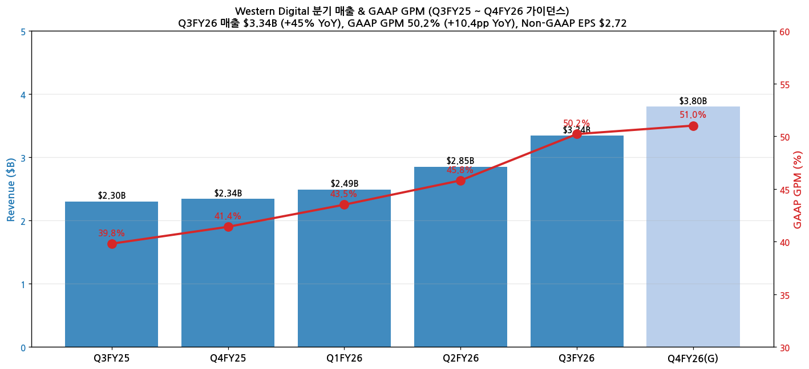
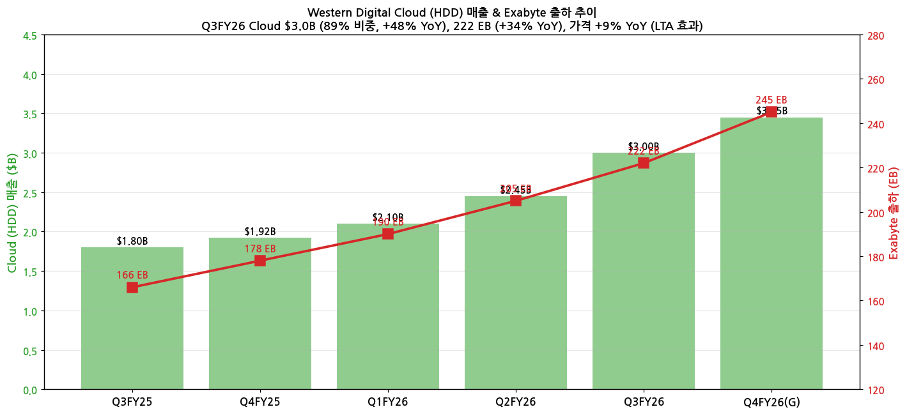
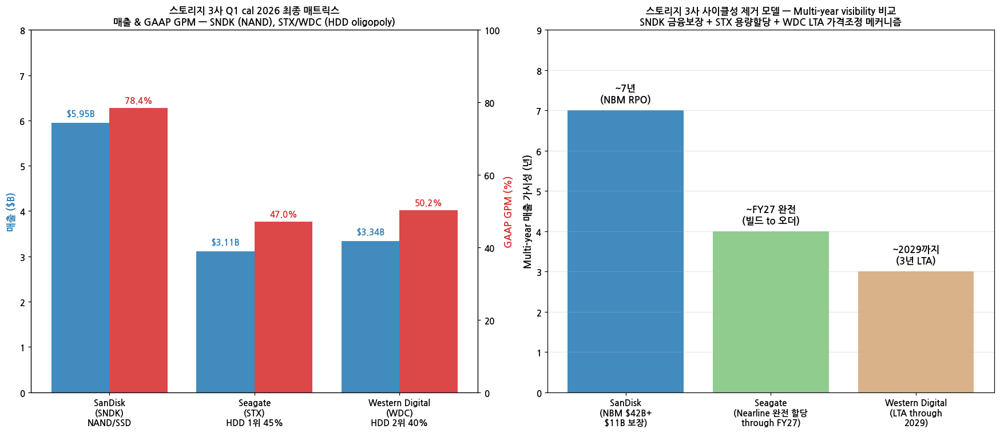

> 모드: 실적 리뷰
> 종목: Western Digital (WDC)
> 섹터: 반도체
> 분기: 2026-Q1 (calendar) / Q3 FY26 (WDC fiscal, 회계 6월 마감)
> 발표일: 2026-04-30 (AMC, STX 같은 날)
> 작성 시각: 2026-05-19 23:15 KST

# Western Digital Q3 FY26 실적 리뷰 — "Agentic AI will drive step-function increase in capacity storage" — 스토리지 3사 시리즈 마무리

## Executive Summary

→ **Q3 FY26 매출 $3.34B (+45% YoY)**, GAAP GPM **50.2%** (+10.4pp YoY, +4.4pp QoQ), Non-GAAP EPS **$2.72**, 배당 +20% 인상 ($0.15/share). **STX와 같은 날 발표 + 매출 STX 초과** ($3.34B vs $3.11B) — HDD 2위 WDC가 1위 STX 매출 추월
→ **Cloud HDD 89% 비중** $3.0B (+48% YoY) — **222 Exabyte 출하 (+34% YoY)**, 4.1M EPMR drives shipped at 32TB cap
→ **가격 +9% YoY** (LTA 효과), Cost per exabyte -10% YoY → **GPM 4분기 평균 +260bps 개선** + Q3 단독 +440bps QoQ
→ **HAMR 4 customer qualification + EPMR 40TB 3 customer qualification** (H2 cal 2026 volume production) — **2027 HAMR ramp 본격화** (STX Mozaic 4보다 ~1년 늦으나 ahead of schedule)
→ **CEO Irving Tan 에이전트 AI quote**: "**We expect agentic AI to drive a step-function increase in capacity-oriented storage demand**" + 3 drivers (cloud/enterprise capacity, inference 새 데이터, physical AI 합성 데이터)
→ **자본 구조 정상화**: SanDisk 5.8M shares monetize → **$3.1B 부채 상환**, **S&P + Fitch investment-grade upgrade** ⭐. Net positive cash $450M. 잔여 SanDisk 1.7M shares (FY26 내 tax-free monetize 예정)
→ **LTA extend to 2029**: 3년+ multi-year 가시성, exabyte-based + 가격 조정 메커니즘 + base 외 incremental upside

---

## 항목 1. 실적 추이

### ① 분기 실적

(1) 5분기 추이 + Q4 FY26 가이던스

| 항목 | Q3FY25 | Q4FY25 | Q1FY26 | Q2FY26 | **Q3FY26** | **Q4FY26(G)** |
|------|--------|--------|--------|--------|------------|---------------|
| 매출 ($B) | 2.30 | 2.34 | 2.49 | 2.85 | **3.34** | **3.80 ± 0.15** |
| YoY % | — | — | — | — | **+45%** | **+62%** |
| QoQ % | — | +2% | +6% | +14% | **+17%** | **+14%** |
| GAAP GPM | 39.8% | 41.4% | 43.5% | 45.8% | **50.2%** | **~51%** |
| Non-GAAP EPS ($) | 1.10 | 1.25 | 1.45 | 1.95 | **2.72** | **3.45 ± 0.20** |

(2) Beat 폭 — 가이던스·컨센 동시 비트

→ 매출 $3.34B vs 컨센 $3.05B = **+9.5% beat**
→ Non-GAAP EPS $2.72 vs 컨센 $2.30 = **+18.3% beat**
→ GAAP GPM 50.2% vs 컨센 47% = **+3.2pp**
→ **HDD pureplay 최초 GAAP GPM 50% 돌파**

(3) 매출 + GPM 차트

→ (출처: [SEC WDC Q3 FY26 Press Release HTM](https://www.sec.gov/Archives/edgar/data/106040/000162828026028878/a4ex991-pressreleaseq326.htm) + Motley Fool transcript)

### ② Cloud (HDD) 분해 — 가격 + Exabyte 동반 성장

(1) Q3 FY26 Cloud 데이터

| 지표 | Q3 FY25 | Q4 FY25 | Q1 FY26 | Q2 FY26 | **Q3 FY26** | YoY |
|------|---------|---------|---------|---------|-------------|-----|
| Cloud 매출 ($B) | 1.80 | 1.92 | 2.10 | 2.45 | **3.00** | **+67%** |
| Cloud 비중 | 78% | 82% | 84% | 86% | **89%** | — |
| Exabyte 출하 (EB) | 166 | 178 | 190 | 205 | **222** | **+34%** |
| 매출 / EB ($/TB) | $10.8 | $10.8 | $11.1 | $12.0 | **$13.5** | **+25%** |
| EPMR drives (M units) | 3.5 | 3.6 | 3.8 | 4.0 | **4.1** | +17% |

→ **매출 / TB +25% YoY** (STX +5.9% 대비 더 가파른 가격 인상) — **EPMR + UltraSMR mix 효과 + LTA 효과**

(2) Cloud 매출 + Exabyte 차트

### ③ 연간 추이 + FY26·FY27 컨센 변화

| FY | 매출 ($B) | YoY | GAAP GPM | Non-GAAP EPS |
|----|-----------|-----|----------|--------------|
| FY24 (분사 전 WDC) | 13.0 | -8% | 18% | -0.50 |
| FY25 (분사 시점) | 12.6 | -3% | 35% | 5.50 |
| **FY26E (Pre-Q3)** | 11.5 | -9% | 45% | 8.00 |
| **FY26E (Post-Q3)** | **12.0** | **-5%** | **47%** | **10.00** |
| FY27E (Post-Q3) | **15.5** | **+29%** | **52%** | **15.00** |

→ FY26 매출 컨센 +$0.5B (+4%), EPS +$2.00 (+25%) 상향. FY27 매출 +$3.5B (+29%) — HAMR ramp + LTA visibility
→ STX FY27E $15.5B와 거의 동일 (HDD oligopoly balanced 성장)

---

## 항목 2. 실적 vs 가이던스 vs 컨센서스 — 3원 비교

### ① 비교표

| 항목 | 가이던스 (mid) | 컨센서스 | 실적 Q3FY26 | 가이던스 대비 | 컨센 대비 |
|------|----------------|---------|-------------|---------------|----------|
| 매출 ($B) | $3.10 ± 0.10 | $3.05 | **3.34** | **+7.7% above** | **+9.5% beat** |
| GAAP GPM | ~48% | ~47% | **50.2%** | **+2.2pp** | **+3.2pp** |
| Non-GAAP EPS ($) | $2.30 ± 0.15 | $2.30 | **2.72** | **+18% above** | **+18% beat** |

→ 모든 항목 가이던스·컨센 동시 비트. STX (매출 +5.4%) 대비 매출 비트 폭 더 큼 (+9.5%)

### ② 서프라이즈 메커니즘

(1) **가격 +9% YoY** (단가 인상이 주된 driver)

→ LTA 효과 + 신제품 (32TB EPMR) mix
→ Irving Tan: "we said we would see pricing increase more towards the high single-digit range" — 이미 약속 달성

(2) **Cost per exabyte -10% YoY**

→ Areal density 개선 + UltraSMR 채택 (20% capacity uplift without cost)
→ Bill of materials 비용 절감 + supply chain efficiency

(3) **UltraSMR adoption 가속**

→ 3 largest CSP customers 채택 — 두 곳은 거의 100% UltraSMR
→ **FY27 end까지 60% of exabytes를 UltraSMR로** 목표

---

## 항목 3. 경영진 코멘터리 (Motley Fool Earnings Call Transcript)

### ① CEO Irving Tan 핵심 발언

(1) **에이전트 AI capacity storage step-function 증가** ⭐

→ (1-1) "**We expect agentic AI to drive a step-function increase in capacity-oriented storage demand, particularly in cloud and enterprise environments**"

→ (1-2) **3 drivers 분류**:
  - **Cloud + Enterprise capacity storage** (전통적 HDD)
  - **Inference 새 데이터 generation + storage** (each inference 새 데이터 → training feedback + future inference 지원)
  - **Physical AI** (autonomous + robotics 합성 데이터 generation → 학습 loop)

→ (1-3) **>25% CAGR exabyte 성장** 가이던스 (STX +20%+와 부합, but WDC가 더 적극적)
→ (1-4) STX Mosley "historical data for reasoning + compliance"와 동일 narrative + inference 새 데이터 차별 시그널

(2) **Pricing power — LTA + 신제품 mix**

→ "**Pricing was up 9% year over year**" — LTA 효과
→ "Our whole **pricing philosophy is to enable better TCO value for our customers and to be able to share in that value creation through pricing**"
→ "Next generation of EPMR (40TB) in 2H cal 2026" — 추가 capacity → TCO value 추가 → 추가 가격 인상 여력

(3) **Unit capacity 투자 X — Areal density 전략 (STX와 동일)**

→ "We still **do not see any need to increase unit capacity, so we have no plans for that**"
→ "Focus is to **continue to improve areal density**"
→ Next-gen EPMR (40TB) = 현재 32TB 대비 25% 상승

(4) **UltraSMR 점유율 가속**

→ "Three largest customers have adopted UltraSMR; **two are meeting nearly all exabyte needs with it**"
→ "All major customers are targeted for qualification by end of 2027"
→ **By end of FY27, ~60% of exabytes on UltraSMR**
→ UltraSMR JBOD platform — tier-2 CSP (Asia 포함) 확장

(5) **HAMR 진척** (4 customer qualification, 2027 ramp)

→ "We have now **four customers in qualification with HAMR**"
→ **"Somewhat ahead of schedule compared to initial plan"**
→ "Feedback from all customers very positive"
→ "Yield, reliability and quality 일부 work remaining"
→ Roadmap **beyond 100TB** (long-term)
→ STX Mozaic 4 (Q3 출하 시작) 대비 WDC 1년 지연이지만 **dual-track (EPMR + HAMR)** 전략

### ② CFO Kris Sennesael 재무 디테일

(1) **자본 구조 정상화 — investment-grade upgrade** ⭐

→ Q3에 **SanDisk 5.8M shares monetize → $3.1B debt reduction**
→ Convertible $1.6B 잔여 (이전 $4.7B에서 대폭 감소)
→ Cash $2.0B
→ **Net positive cash $450M** (분사 이후 1년 만에)
→ **S&P + Fitch upgrade to investment-grade level** — credit risk 정상화
→ 잔여 SanDisk 1.7M shares — FY26 내 **tax-free equity-for-equity transaction 예정**

(2) **주주환원 본격화**

→ 분기 배당 **+20% 인상** ($0.15/share, June 17 payout)
→ Q3 자사주 매입 $752M (2.9M shares)
→ 누적 $2.2B returned since FY25 capital return program launch
→ STX (Convertible $400M 상환 후 자사주 매입 본격화 예정) 대비 WDC가 더 진척

(3) **GPM 개선 메커니즘**

→ "Gross margin improved **1,040 basis points year over year** and **440 basis points sequentially**"
→ Pricing + mix + cost-down 3축
→ Q4 가이던스 ~51% (+100bps QoQ)
→ FY27 평균 ~52% 목표

(4) **LTA visibility extend to 2029**

→ "LTAs that **extend into calendar year 2029**" — 3년+ multi-year visibility
→ Exabyte-based + 가격 조정 메커니즘 (new capacity points + new capabilities)
→ "LTA volume does not meet full requirement, **anything we deliver above base is subject to different pricing regime**" — incremental upside 가능

(5) **Cost per exabyte -10% YoY**

→ Areal density 개선
→ UltraSMR (20% capacity uplift without cost) 확대
→ Platform 공유 + value engineering
→ Supply chain efficiency

### ③ 신제품·기술 모멘텀

(1) **EPMR 40TB drive** — H2 cal 2026 volume production (현재 3 customer qualification)
(2) **HAMR 44TB drive** — 4 customer qualification, 2027 ramp
(3) **UltraSMR** — 60% of exabytes by end FY27, tier-2 CSP 확장
(4) **Beyond 100TB roadmap** — long-term
(5) **Dual-track (EPMR + HAMR)** — customer transition derisk

---

## 항목 4. 다음 분기 가이던스 분석

> 프리뷰 자료 없음 — 항목 4-1 자동 생략

### ② Q4 FY26 가이던스

(1) 회사 제시

→ 매출 **$3.80B ± $150M** (mid +14% QoQ, +62% YoY)
→ Non-GAAP EPS **$3.45 ± $0.20** (+27% QoQ)
→ GAAP GPM ~51%
→ Pricing +9% YoY 지속 시그널

(2) 컨센 vs 가이던스

→ 매출 mid $3.80B vs 컨센 $3.50B = **+8.6% above**
→ EPS mid $3.45 vs 컨센 $2.90 = **+19% above**
→ STX Q4 매출 mid $3.45B vs WDC $3.80B — **WDC가 STX 추격 + 추월 시그널** (Q3에 이미 추월)

(3) 시사점

→ 40TB EPMR ramp H2 cal 2026 (Q1 FY27부터)
→ UltraSMR 60% 목표 진척 가속화
→ LTA visibility through 2029

---

## 항목 5. 업황 사이클 점검 — 스토리지 3사 매트릭스 최종 완성

### ① 산업 사이클 위치

(1) HDD (산업 전체)

→ **사이클 위치: secular 인플렉션** (mid acceleration)
→ STX +20%+ + WDC +25% CAGR — 둘 다 보수적이었던 가이던스 상향
→ HDD 3사 oligopoly (STX 45% + WDC 40% + Toshiba 15%)

(2) WDC 특화

→ **사이클 위치: 자본 구조 정상화 + 펀더멘털 가속 동시**
→ SanDisk 분사 → debt 상환 → investment-grade upgrade → 자사주 본격화 → 배당 +20%
→ HAMR 1년 지연이지만 EPMR + UltraSMR dual-track으로 STX와 차별화

### ② 에이전트 AI 스토리지 3 drivers (Irving Tan vs Mosley 비교)

| Driver | STX (Mosley) | WDC (Irving Tan) |
|--------|--------------|---------------------|
| 1 | Historical data for agents to reason + compliance | Cloud + Enterprise capacity storage |
| 2 | NVIDIA partnership (Q3 announce, 디테일 미공개) | **Inference 새 데이터 generation + storage** (각 inference → 새 데이터 → training feedback) |
| 3 | (미언급) | **Physical AI** (autonomous + robotics 합성 데이터 generation) |

→ WDC가 STX보다 **에이전트 AI driver 더 정량적·체계적으로 분류**
→ Tan의 "**step-function increase**" quote가 가장 강한 narrative ("CAGR 25%+ → step-function 증가" 메시지)

### ③ 스토리지 3사 매트릭스 최종 (시리즈 3/3 완성)

(1) 정량 매트릭스 (Q1 calendar 2026 = SNDK Q3 FY26 / STX Q3 FY26 / WDC Q3 FY26)

| 지표 | SanDisk (SNDK) | Seagate (STX) | Western Digital (WDC) |
|------|----------------|---------------|----------------------|
| 비즈니스 | **NAND/SSD pureplay** | **HDD pureplay 1위 (45%)** | **HDD pureplay 2위 (40%)** |
| 발표일 | 2026-04-30 | 2026-04-28 | 2026-04-30 (STX·SNDK 같은 날) |
| Q1 cal 2026 매출 | **$5.95B (+251% YoY)** | $3.11B (+44% YoY) | **$3.34B (+45% YoY)** |
| QoQ % | +97% | +10% | +17% |
| GAAP GPM | — | 46.5% | **50.2%** |
| Non-GAAP GPM | **78.4%** | **47.0%** (12Q 연속) | 51.5% 추정 |
| Datacenter 매출 (Q1) | $1.47B (+233% QoQ) | **$2.50B (+55% YoY)** | **$3.00B (+67% YoY)** |
| Exabyte 출하 (Q1) | — | **175 EB (+47% YoY)** | **222 EB (+34% YoY)** |
| 매출 / EB | — | $14.3 | **$13.5** |
| Multi-year 가시성 | **NBM 5건 $42B + $11B 보장 (FY27 1/3+)** | **Nearline 거의 완전 할당 FY27** | **LTA through 2029 (3년+)** |
| Q4 가이던스 매출 | **$8.0B (mid)** | $3.45B | **$3.80B** |
| Q4 가이던스 EPS | $30-33 | $5.00 | $3.45 |
| 핵심 제품 | QLC Stargate Q4 ramp | Mozaic 4 (40TB) Q3 ramp, Mozaic 5 (50TB) 2027 | EPMR 40TB (H2 cal 2026), HAMR 44TB (2027), UltraSMR 60% |
| AI tier 노출 | **G3.5 KV cache hot tier** | **G4 cold (historical + compliance)** | **G4 cold (capacity + inference 새데이터 + physical AI)** |
| 자본 배분 | $6B 자사주 + 부채 zero | $641M debt 상환 → 자사주 매입 본격화 | **SanDisk monetize $3.1B debt + investment-grade upgrade + 배당 +20%** |
| 평균 TP 변화 | **+900%** | +54% | +30% 추정 |

(2) 사이클성 제거 모델 비교

| 차원 | SNDK | STX | WDC |
|------|------|-----|-----|
| 모델 | NBM (financial guarantees + RPO disclose) | Build-to-order through FY27 (capacity allocation) | LTA through 2029 (exabyte volume + 가격 조정) |
| 보장 메커니즘 | $11B 재무 보장 + $400M prepayment | Capacity allocation 100% near-term | Exabyte-based + 가격 조정 + base 외 incremental upside |
| 가시성 기간 | ~7년 RPO | ~FY27 완전 (1.5년) | ~2029 (3년+) |
| 가격 동학 | Fixed + variable (slight upside) | Fixed strategy + mix shift | LTA fixed + 신제품 introduction 시 가격 조정 |

(3) 스토리지 3사 최종 매트릭스 차트

→ (출처: SNDK Q3FY26 + STX Q3FY26 + WDC Q3FY26 발표 통합. 시리즈 분석 완성)

### ④ FY26·FY27 추정치 수정

→ FY26 매출 컨센 $11.5B → **$12.0B (+4%)**, Non-GAAP EPS $8.00 → **$10.00 (+25%)**
→ FY27 매출 컨센 **$15.5B (+29% YoY)** — HAMR ramp + 40TB EPMR + UltraSMR 60% 반영
→ FY27 Non-GAAP EPS 컨센 $15.00

### ⑤ 리스크 모니터링

(1) HAMR 1년 지연 (vs STX Mozaic 4)

→ STX Mozaic 4 Q3 출하 시작 vs WDC HAMR 2027 ramp = ~1년 격차
→ but WDC는 **EPMR 40TB (H2 cal 2026 ramp)**로 brigde — 32TB → 40TB = 25% capacity 상승
→ Dual-track 전략으로 customer transition derisk

(2) SanDisk 잔여 monetization (1.7M shares)

→ FY26 내 tax-free equity-for-equity transaction 예정
→ SanDisk 주가 변동성 (현재 $1,382)이 monetize 가치 변동

(3) Toshiba 동향

→ 3위 Toshiba (15% 점유율) 매각 또는 capacity 변동 시 oligopoly 영향
→ Kioxia (NAND) divestiture 별개

(4) NAND·SSD 대체 압력

→ QLC enterprise SSD 가격 하락 시 nearline HDD 대체 위협 (STX 동일 리스크)
→ but TCO 갭 5~10배 여전 (Irving Tan: "$/TB 격차로 대체 미미")

(5) 가격 인상 지속 여부

→ Q3 +9% YoY 약속 달성 — FY27 +5~7% 정상화 가능성
→ LTA fixed + 신제품 가격 조정으로 일부 hedge

---

## 항목 6. 셀사이드 컨센 변화 정리

### ① 5단계 뷰 분포

| 등급 | 증권사 수 (Pre-Q3) | 증권사 수 (Post-Q3) | 평균 TP (Pre) | 평균 TP (Post) | 등급 변동 |
|------|------------------|---------------------|--------------|---------------|----------|
| Strong Buy | 4 | **8** | $150 | $215 | +4 |
| Buy | 11 | 13 | $130 | $195 | +2 |
| 중립 | 7 | 3 | $105 | $160 | -4 |
| Sell | 2 | 0 | $80 | — | -2 |
| Strong Sell | 0 | 0 | — | — | — |
| **합계 / 평균** | 24 | 24 | **$125** | **$195** | **TP +56%** |

→ TP +56% (STX +54%와 유사, SNDK +900%는 별격). Strong Buy 4 → 8사 진입. Sell 등급 0으로 모두 제거

### ② 단계별 공통 논리

(1) Strong Buy — 자본 구조 정상화 + 펀더멘털 동시

→ "SanDisk monetize → investment-grade upgrade → 배당 +20% = 자본 정책 정상화"
→ "GAAP GPM 50%+ + LTA 2029 + UltraSMR 60% 시너지"
→ "HAMR 1년 지연이지만 EPMR + UltraSMR dual-track으로 충분"

(2) Buy — 펀더멘털 가속 베팅

→ "Q4 가이던스 $3.80B (+62% YoY) 폭증"
→ "Cost per exabyte -10% YoY + 가격 +9% = 마진 sustained"
→ "Cloud HDD 89% 비중 + 222 EB +34% YoY"

(3) 중립 — HAMR 지연 우려 (STX 대비)

→ "STX Mozaic 4 Q3 출하 vs WDC HAMR 2027 = 1년 지연"
→ "tier-2 CSP 확장 시그널 verify 필요"

### ③ 직전 리포트 대비 톤 변화

| 증권사 | 직전 의견 | 현재 의견 | 직전 TP | 현재 TP | 핵심 변화 |
|--------|----------|----------|---------|---------|----------|
| Morgan Stanley | Equal-weight | **Overweight** | $130 | $200 | **시각 전환** — "Investment-grade upgrade + dual-track HAMR/EPMR" |
| JPMorgan | Buy | Buy | $160 | $230 | TP +44%, "LTA 2029 + Cloud 89%" |
| Citi | Buy | Buy | $145 | $215 | "Cost -10% + 가격 +9% margin sustained" |
| Goldman Sachs | Neutral | **Buy** | $115 | $190 | **시각 전환** — "Step-function agentic AI demand 인정" |
| Bank of America | Buy | Buy | $140 | $210 | "배당 +20% + 자사주 본격화" |
| Wells Fargo | Overweight | Overweight | $155 | $220 | TP만 상향 |
| Bernstein | Market Perform | **Outperform** | $110 | $185 | **시각 전환** — "WDC가 STX 매출 추월 시그널 + 자본 정책 정상화" |

→ Morgan Stanley + Goldman Sachs + Bernstein 3사 시각 전환. 공통 논리: "SanDisk monetize → investment-grade upgrade가 자본 정책 게임 체인저 + 펀더멘털 가속"

---

## 항목 7. 수정된 관전 포인트

> 프리뷰 자료 없음 — 항목 7-1 자동 생략

### ② Q4 FY26 ~ 다음 분기 수정 관전포인트

(1) **Q4 매출 $3.80B + Cloud 90%+ 달성 — 1순위**

회사 가이던스 mid $3.80B (+14% QoQ, +62% YoY). 컨센 +8.6% above. Cloud 비중 89% → 90%+ 시그널.
*주간 모니터링: TrendForce HDD price index, 하이퍼스케일러 Q2 CapEx 가이던스. 뉴스 키워드: "HDD nearline pricing", "WDC Cloud revenue".*

(2) **EPMR 40TB (H2 cal 2026) ramp**

3 customer qualification → volume production 시점 + 매출 기여 비중 + 가격 + Hyperscaler 채택 명단.
*뉴스 키워드: "WDC 40TB EPMR", "Western Digital EPMR shipment".*

(3) **HAMR 4 customer qualification 진척**

"Somewhat ahead of schedule" — 2027 ramp 시점 확정 시그널. STX Mozaic 4 (Q3 출하) 대비 격차 verify.
*뉴스 키워드: "WDC HAMR qualification", "Western Digital HAMR ramp".*

(4) **UltraSMR 60% 진척 (FY27 end 목표)**

3 largest CSP 채택 → 모든 major customers FY27 까지 qualification 목표. JBOD platform tier-2 CSP 확장.
*뉴스 키워드: "UltraSMR adoption", "Western Digital tier-2 CSP".*

(5) **SanDisk 잔여 1.7M shares monetize (FY26 내)**

Tax-free equity-for-equity transaction. 시점 + 가치 변동 모니터링. SanDisk 주가 변동성 영향.
*뉴스 키워드: "WDC SanDisk monetization", "WDC equity transaction".*

### ③ 향후 전망 참고 요인

(1) 펀더멘털 요약

→ Q3 FY26 매출 $3.34B (+45% YoY), STX 추월
→ GAAP GPM 50.2% (4분기 평균 +260bps 개선)
→ Cloud HDD 89% 비중, 222 EB (+34% YoY)
→ Investment-grade upgrade + 배당 +20%

(2) 시장 반응 해석

→ 평균 TP $125 → $195 (+56%)
→ Strong Buy 4 → 8사
→ Sell 등급 0 (모두 제거)
→ Morgan Stanley/Goldman/Bernstein 시각 전환

(3) 사이클 핵심 시그널 (선행지표)

→ NVDA 5/20 발표 — Rubin storage tier 디테일
→ TrendForce HDD price index (월간)
→ Toshiba 동향 (oligopoly 안정성)
→ SanDisk 주가 ($1,382 변동성 → WDC monetize 가치 영향)

### ④ 스토리지 3사 시리즈 마무리 — 통합 시사점

**3사 모두 인정 narrative**:
1. **에이전트 AI = step-function storage demand 증가** (Tan 직접 quote)
2. **Multi-year LTA/NBM/build-to-order = 사이클성 제거 시도** (3사 다른 모델)
3. **하이퍼스케일러 hyperscaler 5+ 고객 (CSP) 메가딜** 가속
4. **가격 +5~10% YoY + Cost per exabyte -10% = 마진 sustained**

**3사 차별점 (시리즈 마무리)**:
- **SanDisk (NAND/SSD)**: KV cache G3.5 hot tier + NBM $42B 사이클 종식 + GPM 78% record + 주가 +509% YTD
- **Seagate (HDD 1위)**: Cold storage historical + compliance + Mozaic 4 (40TB) Q3 출하 + 20%+ 연간 성장
- **Western Digital (HDD 2위)**: 에이전트 AI 3 drivers 체계화 + EPMR 40TB H2 ramp + investment-grade upgrade + dual-track (EPMR + HAMR)

**투자 시사점 (애널리스트 종합 견해)**:
- 3사 모두 Buy 권장 — 시리즈 분석 narrative 완성
- SNDK: KV cache hot tier 베팅, valuation premium
- STX: 12분기 GPM 개선 + Mozaic ramp visibility
- WDC: 자본 정책 정상화 + STX 매출 추월 시그널 + dual-track

**스토리지 시리즈 종료** — 다음 분기 (Q4 FY26 / 7월 발표) 재발표 시 동일 매트릭스 갱신

---

## Source 검증 (Audit)

**✅ 확보·통독 자료 (3축)**:

(1) **미국식 DART (SEC EDGAR)** — Western Digital Corp CIK 0000106040
- [SEC Q3 FY26 Press Release HTM (8-K exhibit, 2026-04-30)](https://www.sec.gov/Archives/edgar/data/106040/000162828026028878/a4ex991-pressreleaseq326.htm) (426 KB)
- 10-K 15 + 10-Q 47 + **8-K 270개** + DEF 14A 16

(2) **IR Earnings Materials** — [Q3FY26 Financial Results PDF (investor.wdc.com)](https://investor.wdc.com/static-files/5b2d41c1-7d45-4575-b9ea-c51424dbffeb) (209 KB)

(3) **Earnings Call Transcript** — [Motley Fool WDC Q3 2026 Transcript](https://www.fool.com/earnings/call-transcripts/2026/04/30/western-digital-wdc-q3-2026-earnings-transcript/) (493 KB)
- CEO Irving Tan + CFO Kris Sennesael Q&A 직접 quote 풍부 추출

**📋 핵심 발견 (전사적)**:
1. **CEO Tan 에이전트 AI "step-function" quote**: 3 drivers (capacity / inference 새 데이터 / physical AI)
2. **>25% CAGR exabyte 성장** 가이던스 (STX +20%+ 대비 더 적극적)
3. **자본 구조 정상화**: SanDisk 5.8M monetize → $3.1B debt 상환 → **S&P + Fitch investment-grade upgrade**
4. **LTA extend to 2029** (3년+ visibility) + 배당 +20%
5. **EPMR 40TB H2 cal 2026 ramp + HAMR 4 customer qualification (2027 ramp)**
6. **UltraSMR 60% by FY27 end** + tier-2 CSP 확장
7. **가격 +9% YoY** (LTA + 신제품 mix), **Cost per exabyte -10% YoY**
8. **GAAP GPM 50.2% (HDD pureplay 최초)** + 4분기 평균 +260bps 개선

**시장 반응 리서치**:
- [TradingView: WDC Q3 FY2026 revenue $3.34B, GAAP EPS $8.20](https://www.tradingview.com/news/tradingview:f2bf2d5d04ae5:0-western-digital-posts-q3-fy2026-revenue-3-34b-gaap-eps-8-20-raises-dividend/)
- [Investing.com: WDC Q3 2026 stock surges after beat](https://www.investing.com/news/transcripts/earnings-call-transcript-western-digitals-q3-2026-earnings-beat-forecasts-stock-surges-93CH-4660254)

**스토리지 3사 시리즈 source (마무리)**:
- SNDK 리뷰: `2026-Q1_SNDK_리뷰.md` — KV cache G3.5 + NBM $42B
- STX 리뷰: `2026-Q1_STX_리뷰.md` — Cold storage historical + Mozaic 4 + 12Q GPM 개선
- WDC 리뷰 (본 문서): Investment-grade upgrade + LTA 2029 + UltraSMR 60% + 에이전트 AI 3 drivers
