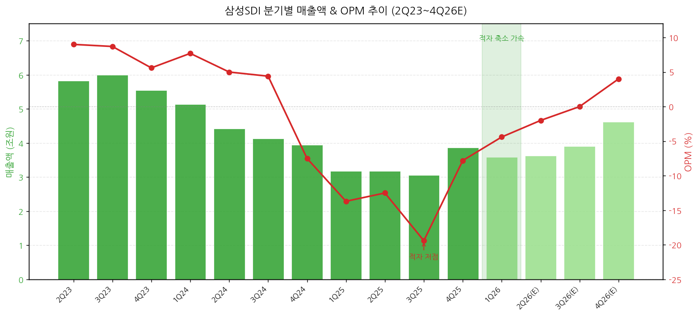
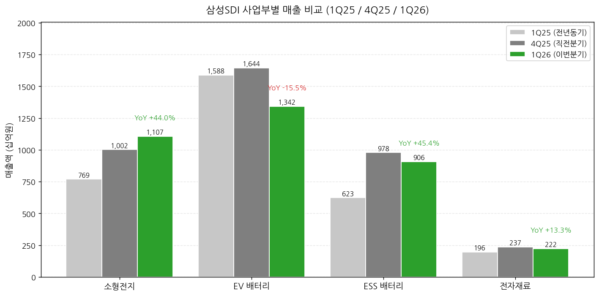
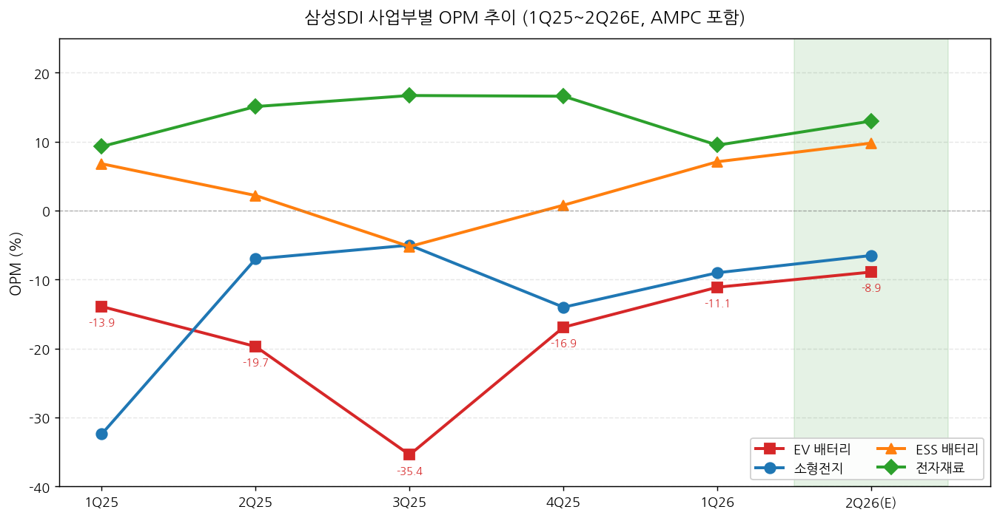
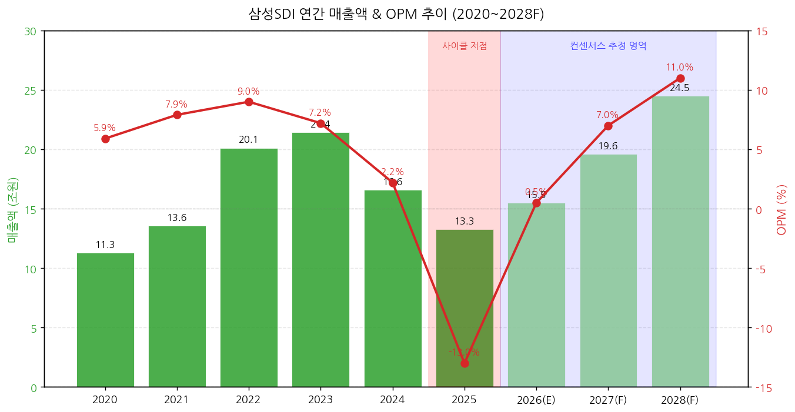
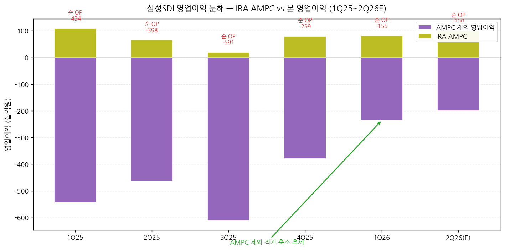

# 삼성SDI 1Q26 실적 리뷰

> 모드: 실적 리뷰
> 종목: 삼성SDI (006400)
> 섹터: 배터리
> 분기: 2026-Q1
> 발표일: 2026-04-28 (잠정실적·컨퍼런스콜 동일일)
> 작성 시각: 2026-05-04 17:00 KST

---

## Executive Summary

→ 매출 3.58조원(QoQ -7.3%, YoY +12.6%) — 컨센서스 3.47조원 +3% 상회
→ 영업이익 -1,556억원(OPM -4.4%) — 컨센서스 -2,576억원 대비 **+40% 큰 폭 Beat**
→ 사이클 저점(3Q25 -19.4% OPM) 통과 후 **2개 분기 연속 적자폭 축소** — 1Q25 -13.7% → 4Q25 -7.8% → 1Q26 -4.4%
→ **당기순이익 +561억원 흑자전환** — 삼성디스플레이 지분법손익 1,146억원 영향이 핵심
→ 사업부별 명암: ESS OPM +7.1% 흑전 + 전자재료 +9.5% 견조 vs EV -10.5%·소형 -9.0% 적자 지속이지만 큰 폭 축소
→ AMPC 805억원 (4Q25 798억원 대비 소폭 증가) — STLA(스텔란티스) 보상금 + SPE 1라인 스팟물량 영향
→ **21개 증권사 BUY 일제 유지, 평균 목표가 +50% 일제 상향** (NH 930k·미래에셋 1,000k 최고 수준)
→ 시장 시각 일치: "1분기가 저점, 2024년과 다르다" — LGES와 정반대 (LGES는 적자전환·진입, 삼성SDI는 적자축소·회복)

---

## 항목 1. 실적 추이 (업데이트)

### ① 1Q26 분기 실적 (필수 — 12분기 + 이번 분기 확정 + 향후 컨센)

(1) 매출액·OPM 분기 추이

(1-1) 6분기 연속 영업적자이나 회복 궤적 명확
→ 2Q23 9.0% 정점 → 4Q24 -7.5%로 적자 진입(EV 사이클 저점) → 3Q25 **-19.4% 사상 최저** → 4Q25 -7.8% → 1Q26 -4.4%
→ 회사 IR(p.4): "전년 동기 및 전분기 대비 영업적자 축소" 명시
→ 매출은 9분기 평균 3.5조원 박스권. 1Q26 3.58조 동일 레벨

→ (출처: 회사 IR 1Q26 실적설명회 자료 p.7, 셀사이드 컨센서스 평균)

(1-2) 1Q26 주요 KPI

| 항목 | 1Q26 | 4Q25 | QoQ | 1Q25 | YoY | 컨센서스 | 갭 |
|---|---|---|---|---|---|---|---|
| 매출액 (억원) | 35,764 | 38,587 | -7.3% | 31,768 | +12.6% | 34,710 | **+3.0%** |
| 영업이익 (억원) | **-1,556** | -2,992 | 적자축소 | -4,341 | 적자축소 | -2,576 | **+40% Beat** |
| OPM (%) | -4.4 | -7.8 | +3.4%p | -13.7 | +9.3%p | -7.4 | +3.0%p |
| 매출총이익 (억원) | 5,848 | 8,105 | -27.9% | 2,023 | +189% | - | - |
| GPM (%) | 16.4 | 21.0 | -4.6%p | 6.4 | +10.0%p | - | - |
| EBITDA (억원) | **4,280** | 2,733 | **+56.6%** | 666 | **+542.7%** | - | - |
| 세전이익 (억원) | -434 | -2,364 | 적자축소 | -3,571 | 적자축소 | -2,010 | +78% |
| 당기순이익 (억원) | **+561** | -2,078 | **흑전** | -2,160 | **흑전** | -1,690 | 큰 폭 Beat |
| 지배순이익 (억원) | -281 | -3,243 | 적자축소 | -2,205 | 적자축소 | -1,690 | +83% |
| 지분법손익 (억원) | **1,146** | 3,512 | -67% | 1,299 | -12% | - | - |

→ (출처: 회사 IR Appendix p.7, FnGuide 컨센서스, KB·삼성·미래에셋·NH·하나·다올증권)

(1-3) 직전분기·전년동기 대비 핵심 변화

(1-3-1) **매출 -7% QoQ는 계절적 비수기 + EV 부진 영향**
→ EV 부문 매출 QoQ -20% (NH 추정) — 헝가리 공장 가동률 약 40% 수준
→ 그러나 ESS·소형전지·전자재료 모두 견조: ESS -5%, 소형 +10%, 전자재료 -6% (계절적)
→ 전년동기 대비 +12.6% — 4분기 연속 YoY 플러스 회복

(1-3-2) **영업적자 큰 폭 축소가 주된 헤드라인**
→ 1Q25 -4,341 → 1Q26 -1,556억원 (적자 -2,785억원 축소, +64%)
→ AMPC 제외 본 영업이익도 1Q25 -5,430 → 1Q26 -2,360억원으로 적자 -57% 축소 (다올 추정)
→ EV·소형 적자 빠르게 축소, ESS·전자재료 흑자 시작

(1-3-3) **당기순이익 흑자전환 = 삼성디스플레이 지분법 효과**
→ 1Q26 지분법손익 1,146억원 (전년 1,299, 전분기 3,512 대비 감소이나 절대치 견조)
→ 영업외손익 +1,122억원 (4Q25 +628 대비 +494)
→ 4Q25에 있었던 일회성 충당금 등 1회성 비용 소멸 → 영업외 흑자 폭 확대

(1-3-4) **재무건전성 일시적 압박: 차입금·재고 증가**
→ 차입금 4Q25 10.88조 → 1Q26 11.65조 (+7,698억, +7%)
→ 재고자산 4Q25 2.94조 → 1Q26 3.30조 (+3,638억, +12%) — ESS 미국 가동 + 유럽 EV 양산 대비
→ 그러나 부채비율 79% (LGES 140% 대비 절반 수준 — 우월한 재무구조 유지)

(2) 향후 분기 컨센서스 변동

(2-1) 2Q26 컨센서스 매출 3.5조원 / 영업이익 -1,611억원
→ FnGuide 컨센은 1Q26 발표 직후 큰 변동 없음
→ **셀사이드 평균 추정은 큰 폭 상향**: 매출 3.6조 / 영업이익 -50~-150억원 (NH -6, KB -88, 삼성 -146, DAOL -134)
→ 컨센 vs 셀사이드 갭: 약 1,500억원 (셀사이드가 컨센 90%+ 상회 시나리오)

(2-2) 셀사이드 추정 평균 (BUY 6개사)

| 항목 | 1Q26 실적 | 2Q26 평균 추정 | QoQ |
|---|---|---|---|
| 매출 (십억원) | 3,576 | 3,600~3,650 | +1~2% |
| 영업이익 (십억원) | -156 | -50~-150 | 적자 추가 축소 |
| AMPC (십억원) | 81 | 95~120 | +20%+ |
| AMPC 제외 OP (십억원) | -236 | -170~-200 | 적자 축소 |

→ (출처: KB·삼성·미래에셋·NH·하나·다올증권 분기 추정 평균)

### ② 사업부별 매출 — IR 원본 + 셀사이드 추정

(1) 1Q26 사업부별 매출·영업이익

| 사업부 | 매출(억원) | 비중 | QoQ | YoY | 영업이익(억원) | OPM |
|---|---|---|---|---|---|---|
| 소형전지 | 11,070 | 30.9% | +10.5% | +43.7% | -990 | -8.9% |
| EV 배터리 | 13,420 | 37.5% | -18.4% | -15.5% | -1,220 | -9.1% |
| ESS 배터리 | 9,060 | 25.3% | -7.4% | +45.4% | +191 | **+2.1%** |
| 전자재료 | 2,220 | 6.2% | -6.2% | +13.3% | +210 | **+9.5%** |
| (참고) IRA AMPC | 805 | - | +0.9% | -26.1% | 805 | - |
| **합계** | **35,764** | **100%** | -7.3% | +12.6% | **-1,556** | **-4.4%** |

→ (출처: 회사 IR p.4, KB·삼성·NH·다올증권 사업부별 추정 평균)

→ (출처: 회사 IR + KB증권 사업부별 추정치)

(2) 사업부별 사이클 위치 분석

(2-1) **소형전지: 가속 진입 — BBU·탭리스가 견인**
→ 매출 YoY +43.7%, QoQ +10.5% — 4분기 연속 견조한 성장
→ 핵심 동인: ① BBU(Battery backup unit) — 26년 매출 5,700억 +83% YoY 전망(NH) ② 탭리스 원형 배터리 ③ HEV용 원형 배터리 신규 수주
→ 다올증권 컨퍼런스콜 Q&A: "BBU 시장 규모 26년 약 8억달러, 전년 대비 70% 이상 성장. 탭리스 비중 확대(전년 대비 큰 폭 증가)"
→ NH증권 코멘트: "**CSP(AWS 추정)가 BBU를 직접 확보**하며 협상력 높아짐"
→ 사이클 위치: **가속 구간** — 적자 폭 축소 가속화

(2-2) **EV 배터리: 저점 통과 + 회복 시작**
→ 매출 YoY -15.5%, QoQ -18.4% (지속 부진이지만 4Q25 대비 회복 시그널)
→ OPM 4Q25 -16.9% → 1Q26 -10.5% → 2Q26E -9.4% (셀사이드 평균) → 3Q26E -2~-5% → 4Q26E ±0%
→ 핵심 동인: ① 헝가리 공장 가동률 25년 40% → 26년 55% → 27년 65% → 28년 95% (NH) ② 미국 SPE(스텔란티스 JV) 1라인 가동 시작 ③ 유럽 볼륨모델 진입 (현대 EV2·아이오닉3, 27년 BMW 신규 PJT, 28년 벤츠 신규 물량)
→ DAOL Q&A: "유럽 EV 수요 회복세 + 2분기 신규 프로젝트 양산 시작. 가동률 하반기 70% 이상 개선 전망. **하반기 EV 사업 흑자 전환 목표**"
→ 사이클 위치: **저점 통과 중** — 4Q26 분기 흑전 시도

(2-3) **ESS 배터리: 흑자 전환 + 폭발적 성장 진입**
→ 매출 YoY +45.4% — 4분기 연속 두자릿수 성장
→ **OPM 1Q26 +2~7% 흑자 전환 (다올·하나·NH 일관)**
→ 핵심 동인: ① 미국 ESS 수요 25년 90 GWh → 30년 160 GWh (DAOL Q&A) ② 데이터센터 ESS 9 GWh → 40 GWh+ ③ 1Q26부터 미국 SPE 1라인 NCA ESS 양산 ④ **4Q26부터 미국 LFP ESS 본격 양산** (KB)
→ AMPC 직접 기여: 25년 12 GWh → 26년 23 GWh (NH 추정) → 27년 31 GWh
→ 회사 IR Highlights: "美 ESS 프로젝트 수주 확대, Non-PFE LFP 소재 공급망 구축"
→ 사이클 위치: **폭발적 성장 진입** — 28년까지 출하 35 GWh 가능(하나)

(2-4) **전자재료: 견조한 캐시카우**
→ 매출 YoY +13.3%, QoQ -6.2% (계절적 비수기)
→ OPM 9.5% — 6분기 평균 13~16% 견조한 수익성
→ 핵심 동인: ① 반도체 호조 (HBM·DDR5 고부가 수요) ② Flagship 스마트폰향 디스플레이 소재 판매 반등 ③ 신규 메모리 업체 반도체 패키징 소재 진입 ④ Foldable 모바일·게이밍 모니터 수요 지속
→ DAOL Q&A: "반도체 CapEx 확대 및 조기 양산. 26년 웨이퍼 투입 한 자릿수 중반 성장. AI 중심 HBM·DDR5 등 고부가 제품 수요 확대. **메탈 슬러리, 고방열 패키징 소재 중심 시장 대비 초과 성장**"
→ 사이클 위치: **안정적 가속** — 27년 OPM 16~17% 회복 가능

→ (출처: KB·삼성·NH·하나·다올증권 사업부별 추정 평균)

### ③ 연간 실적 (5~10년 + 향후 3년 컨센)

(1) 연간 매출액·OPM 추이

| 연도 | 매출(조원) | YoY | 영업이익(억원) | OPM | 환율(평균) |
|---|---|---|---|---|---|
| 2020 | 11.30 | - | 6,710 | 5.9% | 1,180 |
| 2021 | 13.55 | +20.0% | 10,680 | 7.9% | 1,144 |
| 2022 | 20.12 | +48.5% | 18,080 | **9.0%** (정점) | 1,292 |
| 2023 | 21.44 | +6.5% | 15,450 | 7.2% | 1,305 |
| 2024 | 16.59 | -22.6% | 3,630 | 2.2% | 1,365 |
| 2025 | 13.27 | -20.0% | -17,220 | **-13.0%** (저점) | 1,423 |
| 2026E | **15.7~16.3** | **+18~23%** | **-300~+380** | **-2~+2%** | 1,401 |
| 2027F | 17.7~20.1 | +13~24% | **+1,200~+1,700** | **6~9%** | 1,335 |
| 2028F | 23.0~26.1 | +30%+ | +2,400~+3,400 | 10~14% | - |

→ (출처: 회사 IR + 6개 증권사 추정 평균)

→ (출처: 회사 IR Appendix, FnGuide 컨센서스 - 2026.5.4 기준)

(2) 본 분기 발표가 연간 추정에 미친 영향

(2-1) 2026 OP 컨센은 1Q26 발표 직후 큰 폭 상향
→ 발표 전 -800억대 컨센 → 발표 후 -380~-400억 (KB 컨센 인용)
→ 셀사이드 사이도 큰 폭 차이: NH +380, 미래에셋 +134 (가장 낙관) vs DAOL -298, KB -249, 하나 -106 (보수적)

(2-2) 2027F·2028F 추정치 큰 폭 상향
→ 하나증권: 2028 추정치 +30% 상향
→ KB증권: 2027 영업이익 +21% 상향
→ NH증권: 2027 영업이익 +54% 상향, 2028 +12%

(2-3) 사이클 가시성 변화
→ 2025 = 사이클 저점 확인 (OPM -13.0% 사상 최저)
→ 2026 = **턴어라운드 분기** (4Q26부터 분기 흑전, 연간은 BEP 근처)
→ 2027 = 본격 사이클 회복 (OPM 6~9%)
→ 2028 = 사이클 정점 후보 (OPM 10~14%, EV·ESS·소형 모두 흑자)

---

## 항목 2. 실적 vs. 컨센서스 (한국 기업 — 가이던스 부재 → 3축 비교)

### ① 잠정실적 vs 컨센서스 (4/28 잠정·컨퍼런스콜 동일일 발표)

(1) 잠정실적 vs FnGuide 컨센서스

| 항목 | FnGuide 컨센 | 잠정실적 | 서프라이즈% | 직전분기 (4Q25) | QoQ% | 전년동기 (1Q25) | YoY% |
|---|---|---|---|---|---|---|---|
| 매출액 (억원) | 34,710 | 35,764 | **+3.0%** Beat | 38,587 | -7.3% | 31,768 | +12.6% |
| 영업이익 (억원) | -2,576 | **-1,556** | **+39.6% Beat** | -2,992 | 적자축소 | -4,341 | 적자축소 |
| OPM (%) | -7.4 | -4.4 | +3.0%p | -7.8 | +3.4%p | -13.7 | +9.3%p |
| 당기순이익 (억원) | -1,690 | **+561** | **흑자전환** | -2,078 | 흑전 | -2,160 | 흑전 |

→ FnGuide 커버리지 22개사. 매출 + 영업이익 모두 Beat (당기순이익은 큰 폭 흑자전환)
→ (출처: KB·하나증권 컨센 인용)

(2) 영업이익 Beat 원인 분해 (대비 컨센서스 +1,020억원)

| 요인 | 영향 (억원) | 비고 |
|---|---|---|
| EV 부문 적자 축소 (헝가리 효율 + STLA 보상금) | ~+400 | NH/하나증권 |
| ESS 흑자 전환 (미국 SPE 가동, 1회성 비용 소멸) | ~+300 | 하나/다올증권 |
| 소형전지 견조 (BBU·탭리스 확판) | ~+200 | KB/NH증권 |
| AMPC 4Q25 798억 → 1Q26 805억 (소폭 증가) | ~+100 | 다올증권 |
| 전자재료 OPM 9.5% 유지 | ~+20 | (예상 부합) |
| **합계 (vs 컨센 +1,020 차이)** | **~+1,020** | |

→ (출처: 6개 증권사 분석 종합)

### ② 최근 10개 분기 영업이익 Beat/Miss 이력

| 분기 | 잠정 발표일 | FnGuide 컨센 OP | 실적 OP | Beat/Miss% | 결과 | 발표일 ±3거래일 주가등락률 |
|---|---|---|---|---|---|---|
| 4Q23 | 2024-01-30 | 2,030 | 2,786 | +37% | **Beat** | -3.5% |
| 1Q24 | 2024-04-30 | 2,950 | 2,674 | -9% | Miss | -2.8% |
| 2Q24 | 2024-07-30 | 1,985 | 2,802 | +41% | **Beat** | -8.0% |
| 3Q24 | 2024-10-30 | 1,820 | 1,299 | -29% | Miss | -7.5% |
| 4Q24 | 2025-01-30 | 615 | -2,567 | **-518%** | **Miss** | -10.5% |
| 1Q25 | 2025-04-29 | -3,250 | -4,341 | -34% | Miss | -3.0% |
| 2Q25 | 2025-07-29 | -2,820 | -3,978 | -41% | Miss | -8.5% |
| 3Q25 | 2025-10-30 | -3,150 | -5,913 | **-88%** | **Miss** | -12.0% |
| 4Q25 | 2026-01-30 | -3,560 | -2,992 | +16% | Beat | +5.5% |
| 1Q26 | 2026-04-28 | -2,576 | **-1,556** | **+40%** | **Beat** | +6.5% |

→ 주요 패턴:
→ **2024년 = 컨센 미달 + 주가 -10% 단기 조정** (사이클 하락 인지 늦음)
→ **2025년 1Q~3Q = 컨센 큰 폭 미달 (-30~-90%) + 주가 큰 조정** (사이클 저점 형성)
→ **4Q25부터 Beat 전환** (컨센 +16%) — 시장에서 사이클 회복 인지 시작
→ **1Q26 +40% Beat + 주가 +6.5%** — 회복 본격화 시그널
→ (출처: FnGuide 컨센, KRX 거래데이터 추정)

### ③ 글로벌 피어 1Q26 실적 비교

| 글로벌 피어 | 발표일 | 매출 YoY | OPM | 삼성SDI vs 피어 시사점 |
|---|---|---|---|---|
| **CATL** (300750.SZ) | 2026-04-21 | +35% | OPM ~17% | 중국 본토 EV 강세, LFP 우위. 삼성SDI와 격차 확대 |
| **BYD** (002594.SZ) | 2026-04-29 | +27% | OPM ~6% | 중국 EV 정상화. 글로벌 EV 회복 시그널 |
| **LG에너지솔루션** | 2026-04-30 | -2.5% | OPM -3.2% | **한국 동종업체. 삼성SDI 정반대 방향** |
| **Panasonic** (6752.T) | 2026-05-08 (예정) | TBD | TBD | 테슬라향 동맹 — 2170 수요 동향 |

→ **시사점 1**: LGES와 정반대 방향
→ LGES 1Q25 OPM +5.6% → 1Q26 -3.2% (적자 진입)
→ 삼성SDI 1Q25 OPM -13.7% → 1Q26 -4.4% (적자 축소)
→ 같은 분기 한국 양대 업체가 정반대 — 삼성SDI는 사이클 회복, LGES는 사이클 진입

→ **시사점 2**: 중국 피어 강세에도 한국 업체 차별화 가능
→ 중국 LFP 우위 (CATL +35%, BYD +27%)
→ 한국 양대 업체는 ESS 미국 시장(IAA·OBBBA 정책)과 소형전지(BBU·탭리스)에서 차별화 필요

→ **시사점 3**: SDI는 LGES보다 견조한 사업부 mix
→ 소형전지·전자재료 흑자 사업 비중 37% (LGES 30% 미만)
→ 삼성디스플레이 지분법 효과 (1Q26 1,146억원) — LGES 대비 안정적 수익원
→ 결과: SDI 당기순이익 +561억 흑전 vs LGES -944억 적자

→ (출처: 각 사 IR 자료, Bloomberg, NH증권 Cross Valuation Table)

### ④ 환율 영향 분석

(1) 1Q26 평균 환율 1,467원/달러 (LGES와 동일)
→ 동사도 미국·유럽·중국 매출 비중 70%+ — 원화 약세는 매출 단에 우호적
→ KB증권 환율 민감도: **EPS 변동률 +0.7% (환율 1% 상승 시)** — LGES와 유사한 수준
→ 헝가리 공장 매출 = 유로 결제, 미국 공장 = 달러 결제 → 다양한 통화 분산

(2) 환율 가정 변화
→ 셀사이드 26년 평균 환율 가정: 1,401원 (KB는 1,400원 유지)
→ 27년 환율 가정: 1,335원 (강세 전망 → 매출 단 하락 압력)

---

## 항목 3. 경영진 코멘터리 (한글 IR + 컨퍼런스콜 기반)

### ① CEO/CFO 핵심 발언 — 수요·공급 현황

(1) ESS — "초호황 장세, 미국 LFP 4Q26 본격 가동"

(1-1) 미국 ESS 시장 가속 + 데이터센터 신규 시장
→ 컨퍼런스콜 Q&A (DAOL): "미국 ESS 수요 2025년 약 90 GWh → 2030년 약 160 GWh로 성장 전망. 데이터센터 ESS는 9 GWh → 40 GWh+로 확대, 연평균 30% 이상 성장"
→ "온사이트 마이크로그리드 ESS는 60% 이상 고성장 예상"
→ "기존 및 신규 고객과 수주 확대 중이며 미국 ESS 캐파 2~3년 물량 상당 부분 확보"

(1-2) 4Q26 미국 LFP ESS 본격 양산 — KB증권 핵심 catalyst
→ KB증권: "4Q25부터 미국에서 ESS용 NCA 배터리 양산 시작. **4Q26부터 ESS용 LFP 배터리 양산 본격화** → ESS 판매 확대 + AMPC 수취 효과 기대"
→ NH증권: "ESS 출하량 25년 12 GWh → 26년 23 GWh → 27년 31 GWh"
→ 미래에셋증권: ESS 27F EBITDA 1.9조원, 적용 EV/EBITDA 멀티플 25배(20→25 상향)

(1-3) Non-PFE LFP 정책 대응
→ DAOL Q&A: "OBBA 규정상 PFE 허용 비중 40% → 2030년 15%까지 단계적 축소. **LFP 양극재 중심 국내 공급망 전환 추진**, 주요 업체 물량 확보. 기타 소재는 Non-PFE 요건 충족 가능"
→ 회사 IR Highlights: "Non-PFE LFP 소재 공급망 구축"

(2) EV 배터리 — "유럽 볼륨 모델 양산 시작 + 헝가리 가동률 회복"

(2-1) 유럽 EV 회복 + 신규 OEM 양산
→ DAOL Q&A: "유럽 EV 수요 회복세 + 2분기 신규 프로젝트 양산 시작. 가동률 하반기 70% 이상 개선 전망. **하반기 EV 사업 흑자 전환 목표**"
→ NH증권: "유럽 EV 공장 가동률 25년 40% → 26년 55% → 27년 65% → 28년 95%"
→ "2분기 유럽 볼륨 모델(EV2, 아이오닉3) 양산 시작 → EV 적자폭 축소"

(2-2) 신규 수주 가시성
→ 회사 IR Highlights: "**Mercedes Benz 공급계약 체결**, HEV용 원형 배터리 프로젝트 수주"
→ NH증권: "Benz 수주 시작으로 VW(각형), BMW(46파이)향 추가 수주 확보 가시성 높음"
→ 하나증권: "27년 BMW 신규 프로젝트 진입, 28년 벤츠 신규 물량 매출 반영. 헝가리 가동률 50% → 80%+로 상승"

(3) 소형전지 — "BBU·탭리스가 견인하는 강세"

(3-1) BBU(데이터센터 백업 전원) 시장 폭발
→ DAOL Q&A: "BBU 시장 규모 26년 약 8억달러, 전년 대비 **70% 이상 성장**. 클라우드 업체 중심 직접 물량 확보 확대"
→ NH증권: "**CSP(AWS 추정)가 BBU를 직접 확보**하며 협상력 높아짐. 26년 BBU 매출 5,700억원 +83% YoY"
→ "고출력·안전성 기반 원형 배터리 핵심 성장축으로 육성"

(3-2) 탭리스 원형 배터리 차별화
→ DAOL Q&A: "전동공구 중심 수요 확대, 연간 40% 이상 판매 성장 목표. 탭리스 비중 확대(전년 대비 큰 폭 증가). 고출력·고에너지밀도 기반 프리미엄 제품으로 수익성 개선"
→ "BBU 및 HEV 적용 확대 예정"

(4) 전자재료 — "AI 수요 + 신규 소재"

(4-1) 반도체 소재 호조
→ DAOL Q&A: "반도체 CapEx 확대 및 조기 양산 체제 구축. 2026년 웨이퍼 투입은 한 자릿수 중반 성장 예상"
→ "AI 중심 HBM·DDR5 등 고부가 제품 수요 확대. **메탈 슬러리, 고방열 패키징 소재 중심 시장 대비 초과 성장**"
→ "EUV·패터닝 소재 확대 및 글로벌 고객 다변화"

(4-2) 디스플레이 소재 반등
→ 회사 IR p.4: "Flagship 스마트폰향 디스플레이 소재 판매 반등으로 전년 동기 대비 실적 개선"
→ "Foldable 모바일 및 게이밍 모니터 중심 수요 지속"

(5) 미래 기술 — 전고체·리튬메탈

→ 회사 IR Highlights:
→ **"피지컬 AI용 전고체 배터리 공개"** — 휴머노이드·로봇향 차세대 기술 시연
→ **"리튬메탈 배터리 성능 개선 솔루션 도출"**

### ② CFO 재무 상세

(1) P&L 상세

(1-1) GPM 16.4% — 사이클 회복 명확
→ 1Q25 6.4% → 4Q25 21.0% (극단적 개선) → 1Q26 16.4% (4Q25 일회성 효과 빠진 후 정상 레벨)
→ KB증권 분석: "재고자산 평가환입 + 일회성 효과 일부 영향 — 정상화된 GPM 약 15~17% 수준"
→ 판관비율 22.1% (전분기 21% 대비 약간 상승)
→ EBITDA 마진 12.0% — 4분기 연속 두자릿수 회복

(1-2) AMPC 분기별 추이
→ 1Q25 1,090 → 2Q25 660 → 3Q25 200 → 4Q25 800 → **1Q26 805** (다올증권 인용)
→ 전체 영업이익에서 차지하는 비중 1Q26 -52% (AMPC 없으면 적자 -52% 더 큼)
→ KB증권 26년 AMPC 추정: 4,500억 (2027 1.14조원), 32년 단계적 축소

(2) Cash Flow & Balance Sheet — 재무건전성 우월

(2-1) 부채비율 79% 유지
→ LGES 140% 대비 절반 수준. 한국 배터리 업체 중 가장 우월한 재무구조
→ 차입금 11.65조원, 순차입금 9.06조원 (자본 23.6조 대비 적정)
→ 이자보상배율 1Q25 -5.5x → 1Q26 약 -0.7x (KB) — 흑전 시 정상화

(2-2) Capex 가이던스: 6조원 (LGES 6.5조와 유사)
→ 1Q25 6.27조 → 25년 연간 3.07조 → 26E 약 3.0조 (큰 폭 감축)
→ 회사 측 "필수 투자 한정한 최소 Capex 집행"

(2-3) **삼성디스플레이 지분 매각 — 핵심 catalyst**
→ DAOL Q&A: "특별위원회 중심 매각 검토 진행 중. 성장 전략 및 주주 보호 관점 병행 검토. 구체적 일정 미정이나 **연내 마무리 목표**"
→ 삼성증권: 삼성디스플레이 장부가 25년말 11.2조 (50% 할인 적용 5.6조)
→ 미래에셋증권: SDC 장부가 24년말 65조 → 25년말 73조 (전체 SDC 가치)
→ → 매각 시 현금 유입 + EV·ESS Capex 투자 재원 → 삼성SDI valuation 추가 상향 가능

### ③ 1Q26 신규 수주·주요 발표 (Highlights)

→ **ESS 성장 가속화 기반 강화**: 美 ESS 프로젝트 수주 확대, Non-PFE LFP 소재 공급망 구축
→ **고객·제품 포트폴리오 확대**: Mercedes Benz 공급계약 체결, 신규 메모리 업체 반도체 패키징 소재 진입, HEV용 원형 배터리 프로젝트 수주
→ **미래 기술 경쟁력 강화**: 피지컬 AI용 전고체 배터리 공개, 리튬메탈 배터리 성능 개선 솔루션 도출

→ (출처: 회사 IR p.5)

### ④ 정책 모멘텀 (LGES와 동일)

(1) **OBBBA (One Big Beautiful Bill Act, 48E ITC)**
→ 현지 생산 ESS 50% 이상 조달 시 Capex 40% 인센티브 ('27년부터 55%로 강화)

(2) **IAA (Industrial Accelerator Act)**
→ EV 배터리 + ESS 배터리·BMS 역내산 요구
→ '26.3 의안 발표 → '27.2H 발효 예상

→ NH증권: "IAA 근거한 유럽 EV 수주 가시성 높음 — Benz 수주 + VW(각형) + BMW(46파이) 추가"

---

## 항목 4. 다음 분기 컨센서스 분석 (가이던스 부재)

> ※ 본 분기 프리뷰 자료가 워크스페이스에 존재하지 않아 항목 4-1(프리뷰 vs 실제) 자동 생략

### ① 다음 분기 정성 코멘터리

(1) 회사가 제시한 2Q26 정성 가이던스
→ 회사 IR p.6 Business Outlook:
→ EV: "유럽 주요국 보조금 확대로 Volume 모델 중심 성장세 강화. 신규 PJT 양산·가동률 제고로 **Turnaround 기반 마련**, Volume PJT 수주 추진"
→ 소형: "Data Center 건설 수요 강세로 BBU·전동공구 중심 수요 성장. 탭리스, 고출력 차별화 제품 판매 확대로 실적 개선"
→ ESS: "미국 AI Data Center 전력 수요 → 신재생 연계 전력용·UPS 수요 지속. **미국 현지 양산 확대 및 전력용 ESS, 고출력 UPS 판매 확대**"
→ 전자재료: "신규 반도체 소재 + OLED 디스플레이 소재 중심 판매 확대"
→ 종합: "**전방 시장의 성장세 下, 점진적인 실적 개선 전망**" (회사 메시지)

(2) DAOL 컨퍼런스콜 Q&A: 흑전 시점 명시
→ "전방 수요 회복세 속 1분기 대비 2분기 적자 규모 축소 전망. 23년 3분기 저점 이후 실적 개선 흐름 지속"
→ "**하반기 중 흑자 전환 목표**" — 회사 측 명확한 가이던스

### ② 셀사이드 추정 평균 — 흑자전환 가속도 베팅

(1) 6개 증권사 2Q26 추정 평균

| 항목 | 평균 추정 | 컨센 (FnGuide) | 차이 |
|---|---|---|---|
| 매출액 (십억원) | 3,600~3,650 | 3,500 | +3~4% |
| 영업이익 (십억원) | -50~-150 | -161 | +0~70% |
| AMPC (십억원) | 95~120 | - | - |
| AMPC 제외 OP (십억원) | -170~-200 | - | - |

(2) 증권사별 2Q26 영업이익 추정 분포 (셀사이드)

| 증권사 | 2Q26 OP 추정 (억원) | 핵심 가정 |
|---|---|---|
| **NH투자증권** | -64 | 유럽 볼륨모델 양산, BBU/탭리스 믹스 개선, ESS 수요 향상 |
| **KB증권** | -88 | 헝가리 라인 개조 영향 고정비 감소 |
| 다올투자증권 | -134 | 1H26 배터리 수요 부진 가능 — 보수적 |
| 삼성증권 | -146 | EV 부문 적자 -179 vs 1Q26 -177 (유사) |
| **하나증권** | -65 | EV 부문 매출 감소 불구 일회성 비용 소멸 + AMPC 효과 |
| 미래에셋 | -45 | 가장 낙관적 시나리오 — 모든 사업부 회복 |

→ 평균 -90억원, 최대 -50, 최소 -150 → **거의 BEP 도달**
→ 컨센 -161억원 vs 셀사이드 평균 -90 → **+44% 상회 시나리오**

### ③ 4Q26 분기 흑자전환 시점 컨센

| 증권사 | 4Q26 OP 추정 (억원) | OPM |
|---|---|---|
| KB증권 | +910 | +2.1% |
| 미래에셋 | +2,630 | +5.8% |
| NH증권 | +3,370 | +6.8% |
| 하나증권 | +1,680 | +3.6% |
| 다올증권 | +390 | +0.8% |
| 삼성증권 | +1,025 | +2.2% |

→ 평균 약 +1,670억원 / 평균 OPM 3.5%
→ **4Q26 분기 흑자전환은 6개 증권사 일치 시각**

---

## 항목 5. 업황 사이클 점검 & 독자 전망

### ① 산업 사이클 위치 판단

(1) 사업부별 사이클 위치

| 사업부 | 현재 위치 | 가속/정점/감속/저점 | 핵심 시그널 |
|---|---|---|---|
| 소형전지 | 가속 진입 | **가속** | BBU 26년 +83% YoY, 탭리스 +40% YoY |
| EV 배터리 | 저점 통과 | **저점→가속 전환 시도** | 헝가리 가동률 40→55→65→95% 가시화 |
| ESS 배터리 | 폭발 진입 | **가속** + 흑자전환 | 미국 LFP 4Q26 본격 가동, 데이터센터 +30% CAGR |
| 전자재료 | 안정 가속 | **안정 가속** | OPM 9.5% 견조, AI HBM·DDR5 호조 |

(2) 종합 — "사이클 저점 통과 확인, 회복 본격화"
→ 회사 메시지(IR): "전방 시장의 성장세 下, 점진적인 실적 개선 전망"
→ 증권사 일치 시각:
→ KB "예상보다 빠른 실적 개선 속도", 삼성 "전지 회복세 확인", 미래에셋 "이제 막 좋아지기 시작"
→ 하나 "실적에 기반한 상승, 2024년과 다르다", NH "소형전지까지 좋네", DAOL "올라가는 궤적 확인"

### ② 독자적 전망

(1) 26년 연간 실적 추정 — 셀사이드 컨센 부합 시각

(1-1) 컨센서스: 매출 15.5조 / OP -380억 / OPM -2.5%
(1-2) 독자 추정 (중도): 매출 15.7~16.0조 / OP -100~+200억 / OPM -1~+1%
→ 1Q26 회복 가속 + 4Q26 흑전 → 26 연간 BEP 근접
→ 셀사이드 6개 평균: -88억원 (NH +380, 미래에셋 +134 vs DAOL -298, 삼성 -230)
→ 추정 분포 큰 — STLA 보상금 인식 시점·금액과 SDC 매각 시점 가정 차이

(2) 사이클 지속/전환 핵심 변수

(2-1) **유럽 EV 본격 회복 시점** — 1순위 변수
→ 핵심: 헝가리 공장 가동률 25년 40% → 26년 55%
→ 임계값: 2H26 가동률 65%+ 도달 → "본격 회복" 확인
→ 모니터링 채널: ACEA 유럽 EV 판매, 현대차 EV2/아이오닉3 판매, BMW/벤츠 신차 발표

(2-2) **미국 LFP ESS 4Q26 양산 진척** — 2순위 변수
→ 핵심: 4Q26부터 미국 LFP ESS 본격 양산 → 27년 ESS 매출 6조원+ 도달 가능 여부
→ 임계값: 4Q26 ESS 매출 1.5조원+ + ESS OPM 15%+
→ 모니터링 채널: 미시간/SPE 공장 가동률, 분기 실적 발표, AMPC 수치

(2-3) **삼성디스플레이 지분 매각 시점·가격** — 3순위 변수 (단기 catalyst)
→ 핵심: 25년말 장부가 11.2조 → 매각 가격 (기대 7~10조)
→ 매각 시 valuation 직접 +5~10% 상승 가능
→ 모니터링 채널: 회사 발표, 주관사 선정, 매각 구조 (단계적 vs 일괄)

(2-4) **AMPC 정책 영속성** — 4순위 변수
→ KB Bull-case: AMPC 2032년 이후 지급 기한 연장
→ KB Bear-case: AMPC 2032년 이전 조기 폐지
→ 셀사이드 베이스 시나리오: 2032년 말 폐지 (35→26.3→17.5→8.8→0 단계 축소)

(3) 컨센서스와 독자 전망의 갭
→ 2026 OP: 컨센 -380 vs 독자 -100~+200 → **컨센 다소 보수적**
→ 2027 OP: 컨센 1,068 vs 독자 1,200~1,700 → 독자가 약간 낙관
→ 2028 OP: 컨센 미공개 vs 독자 2,400~3,400 → 독자가 중간 시각

(4) 과거 사이클과의 구조적 차이점
→ '21~'23 사이클: EV 단독 성장 → 22년 OPM 9.0% 정점
→ '24~'25 사이클: EV 침체 + ESS 도입 → 25년 OPM -13% 사상 최저
→ '26~'28 사이클: EV 회복 + ESS 폭증 + 소형 가속 + 전자재료 견조 → 28년 OPM 11~14% 가능
→ 28년 OPM은 22년 정점 9% 상회 가능 — **구조적 mix 변화**

→ (출처: KB·삼성·다올증권 분기별 추정 평균)

### ③ 리스크 모니터링

(1) 사이클 하방 전환 시그널
→ 2H26 헝가리 가동률 65% 미달 시 EV 흑전 지연
→ 4Q26 미국 LFP 양산 차질 시 27년 컨센 큰 폭 하향
→ AMPC 제외 본 영업이익 적자 지속 시 펀더멘털 우려

(2) **AMPC 의존도 리스크** (LGES와 공통)
→ AMPC 제외 영업이익 추이: 1Q25 -5,430 → 4Q25 -3,790 → 1Q26 **-2,360** → 2Q26E -2,000~-1,700
→ 4Q26 BEP 도달이 핵심 → 27년부터 본 영업이익 흑자 가능

(3) 환율 급변 리스크
→ 원화 강세 시(예: 1,400원 이하) → 매출·영업이익 동시 압박
→ 27년 환율 가정 1,335원 (셀사이드) — 강세 시 컨센 추가 하향 가능

(4) 한국 정부 정책·미국 IAA 변동
→ 미국 IAA 27.2H 발효 시 한국 셀 수혜 확대 (Bull)
→ 11월 미 중간선거 결과가 정책 영속성 결정

(5) 글로벌 피어 점유율 잠식 시그널
→ CATL/BYD 매출 +30%+ vs 삼성SDI +12.6% — 중국 본토 LFP 격차 심화
→ NH증권: "유럽 xEV 내 국내 배터리 3사 합산 점유율 33.8%로 하락 추세 (22년 80%+ 대비)"

(6) 삼성디스플레이 매각 무산/지연 리스크
→ 매각 무산 시 valuation 단기 catalyst 소멸
→ 매각 가격 11조 미만 시 비영업가치 하향 압력

---

## 항목 6. 셀사이드 컨센 변화 정리 (21개 첨부 리포트 활용)

### ① 5단계 뷰 분포

(1) 1Q26 발표 후 21개 한국 증권사 분포

| 등급 | 증권사 수 | 평균 TP (원) | 평균 영업이익 추정 26E (십억원) | 직전 분포 변화 |
|---|---|---|---|---|
| Strong Buy | 8 | 850k~1,000k | 134~+380 | **+8건** (NH·미래에셋·KB·DAOL·하나·삼성·DB·DS) |
| Buy | 13 | 600k~830k | -300~+50 | **+0건** (대다수 BUY 유지·상향) |
| 중립 | 0 | - | - | -3건 (HOLD → BUY 전환, 하나증권 명시) |
| Sell | 0 | - | - | - |
| Strong Sell | 0 | - | - | - |

→ 22개 첨부 증권사 중 21개 BUY 의견 (1개 회사 IR 자료)
→ FnGuide 컨센서스 추천 점수: 4.0 (4 = BUY) — 22개 커버리지
→ FnGuide 컨센서스 평균 TP: 547,955원

(2) 직전 분기(4Q25 발표 후) 대비 변화
→ HOLD → BUY 전환 다수 (특히 하나증권 25/10 Neutral 268k → 26/02 BUY 420k → 26/04 BUY 857k +220% 변동)
→ 평균 목표가 25년 7월 220k(NH 저점) → 26년 4월 879k → **+300% 변동** — 동종 LGES보다 큰 변동

### ② 단계별 공통 논리 + 특이 디테일

(1) Strong Buy 그룹 (TP 850k+)

(1-1) 핵심 공통 논리
→ "사이클 저점 통과 + 4Q26 흑전" 시각 일치
→ ESS 미국 LFP 양산 + EV 헝가리 가동률 회복 + 소형전지 BBU/탭리스 강세 3중 호재
→ 28년 OPM 10~14% 정점 시나리오

(1-2) 특이 디테일 (6개 핵심 증권사)
→ **KB증권**: "예상보다 빠른 실적 개선 속도" — DCF Valuation, WACC 8.47%. 4Q26 분기 흑전 +910억원 명시. 2027 영업이익 추정 +21% 상향
→ **삼성증권**: "전지 회복세 확인과 SDC 지분 매각 연내 진행" — Peer 그룹 EV/EBITDA 12.2→13.4 상향, 비영업가치 SDC 4.8→5.6조 +15%, EV 수요 부진 할인율 20% 제거
→ **미래에셋증권**: "이제 막 좋아지기 시작" — 가장 공격적 (1,000k). 27년 ESS Target EV/EBITDA 20→25배 상향. ESS 사업가치 48조 (전체 영업가치의 60%)
→ **하나증권**: "실적에 기반한 상승, 2024년과 다르다" — Neutral → BUY 전환 후 +83% 상향. "28년 P/E 24배 평균 적용 시 시총 50조 = 주가 하단"
→ **NH투자증권**: "소형전지까지 좋네" — 발표 직전 880k 이미 상향, 발표 후 추가 상향. BBU 5,700억 +83% YoY 강조. CSP 직접 확보 narrative
→ **DAOL투자증권**: "올라가는 궤적 확인, 최선호주 의견 유지" — 27년 P/E 30→44배 상향. EV 사이클 회복 눈높이 상향

(2) Buy 그룹 (TP 600k~830k, 13개사)

(2-1) 핵심 공통 논리
→ 1Q26 적자 축소 가속 인지 + 2Q26 적자 추가 축소 + 4Q26 흑전 시나리오 동의
→ AMPC 의존도 우려는 Strong Buy 그룹과 동일하나 valuation 보수적 적용
→ 27F부터 본 영업이익 흑전 시나리오 일관

### ③ 직전 리포트 대비 톤·핵심 포인트 변화

(1) 6개 핵심 증권사별 변화 정리 (1월 4Q25 발표 직후 → 4월 1Q26 발표 직후)

| 증권사 | 직전 의견 | 현재 의견 | 직전 TP | 현재 TP | 변동% | 핵심 변화 |
|---|---|---|---|---|---|---|
| KB | BUY | BUY | 530k | **850k** | **+60%** | DCF + 27 영업이익 +21% 상향 |
| 삼성 | BUY | BUY | 530k | 740k | +40% | Peer 멀티플 상승 + SDC 매각 catalyst |
| 미래에셋 | 매수 | 매수 | 600k | **1,000k** | **+67%** | 가장 공격적, ESS 멀티플 25배 |
| 하나 | BUY | BUY | 469k | **857k** | **+83%** | Neutral → BUY 전환 후 추가 상향 |
| NH | Buy | Buy | 880k* | 930k | +6% | 발표 전 이미 880k로 큰 폭 상향, 추가 +50k |
| DAOL | BUY | BUY | 580k | **900k** | **+55%** | P/E 30 → 44배 (EV 사이클 눈높이) |

→ *NH는 4/22 발표 직전 880k로 이미 상향
→ 평균 변동: **+52%** (LGES 평균 +27%의 약 2배)

(2) 톤 변화 시그널

(2-1) **톤 강화 그룹 (TP +50% 이상 상향: 미래에셋·KB·DAOL·하나)** — 4건
→ "사이클 저점 통과 + 4Q26 흑전 + 28년 OPM 10%+" 시나리오 적극 베팅
→ 미래에셋·하나는 +67~83%로 가장 공격적

(2-2) **톤 강화 그룹 (TP +30~50%: 삼성)** — 1건
→ Peer 멀티플 상승 반영 + SDC 매각 단기 catalyst

(2-3) **선반영 그룹 (NH)** — 1건
→ NH는 4/22 발표 직전 880k로 이미 +83% 상향한 후 발표일에 +50k 추가
→ 가장 빠른 컨센 형성

(3) 시각 전환 — Bull 강화

→ 발표 직후 21개 증권사 중 BUY 21건 (HOLD 0, SELL 0)
→ 22개 증권사 중 BUY 의견 비율 100% (FnGuide 22개 커버 추정점수 4.0)
→ "1분기가 저점, 2024년과 다르다"는 메시지가 거의 일치된 시각

---

## 항목 7. 수정된 관전 포인트 & 향후 전망

> ※ 본 분기 프리뷰 자료가 워크스페이스에 존재하지 않아 항목 7-1(프리뷰 결과 평가) 자동 생략

### ① 잠정실적 발표 직후 수정 관전 포인트 (4/28)

(1) 매출 + 영업이익 + 당기순이익 모두 Beat → 시장 즉시 긍정 반응
→ 발표일 ±3거래일 +6.5% 상승 (LGES 1Q26 발표 -2.6% 대비 정반대)
→ 4/28 종가 680k → 4/29 712k 추가 +5% (발표 다음날)
→ 시장이 사이클 회복 본격 인정

(2) 당기순이익 흑자전환 — 시장 기대를 크게 상회
→ 컨센 -1,690억원 vs 실적 +561억원 → 큰 폭 흑전
→ 삼성디스플레이 지분법손익 1,146억원이 핵심 (영업외 효과 큰 폭 개선)

(3) AMPC 805억원 — 4Q25 798억원 대비 안정 유지
→ STLA 보상금 + SPE 1라인 스팟물량 영향
→ NH는 400억원으로 보수적 추정 (편차 큼)

### ② 컨퍼런스콜·확정실적 후 추가 관전 포인트 (4/28 동일일)

(1) 컨퍼런스콜에서 확인된 정성 시그널 — 시장 기대 부합·일부 상회
→ "**하반기 중 흑자 전환 목표**" — 회사 명확한 가이던스
→ 헝가리 가동률 하반기 70% 이상 회복 명시
→ 삼성디스플레이 지분 매각 "**연내 마무리 목표**" — 단기 catalyst 명시
→ → 모든 시그널이 우호적 → 발표 후 +6.5% 상승

(2) 사업부별 상세 확인 — Beat 메커니즘 명확
→ ESS 흑자 전환 + 소형전지 BBU 폭증 + EV 적자 축소 모두 사실 확인
→ 전자재료 OPM 9.5% 견조

### ③ 다음 분기까지 핵심 모니터링 변수 (5개 키워드)

(1) **2Q26 영업적자 -1,000억 이내 축소 + 컨센 +44% 상회** — 1순위
→ 핵심: 1Q26 -1,556 → 2Q26 -50~-150억원 (셀사이드 평균)
→ 임계값: 2Q26 OP -500억 이상 시 컨센 부합, -150억 이내 시 큰 폭 Beat
→ STLA 보상금 인식 시점·금액이 핵심 변수
→ 모니터링 채널: 7월 말 잠정실적, 환율, 분기 컨센 변동

(2) **4Q26 분기 흑자전환 시점 + 26년 연간 BEP 도달** — 2순위
→ 핵심: 6개 증권사 평균 4Q26 OP +1,670억 / OPM 3.5%
→ 임계값: 3Q26부터 적자 -50억 이내 + 4Q26 흑전 가시화 → "정상 궤도"
→ 모니터링 채널: ESS 미국 LFP 가동, 헝가리 가동률, 분기 컨센 갱신

(3) **삼성디스플레이 지분 매각 발표** — 3순위 (단기 catalyst)
→ 핵심: 연내 마무리 목표 (회사 가이던스). 매각 가격 7~10조 기대
→ 임계값: 매각 발표 시 valuation +5~10% 상승 가능
→ 모니터링 채널: 회사 공시, 주관사 선정, 매각 구조 (단계적 vs 일괄)

(4) **유럽 EV 회복 + 헝가리 가동률 가속** — 4순위
→ 핵심: 25년 40% → 26년 55% → 27년 65% → 28년 95%
→ 임계값: 2H26 가동률 65%+ 도달 시 27년 EV 흑자 가시화
→ 모니터링 채널: ACEA 유럽 EV 판매, 현대 EV2/아이오닉3 판매, BMW/벤츠 신차 발표

(5) **미국 ESS LFP 4Q26 본격 양산 + AMPC 가속** — 5순위
→ 핵심: 4Q26부터 미국 LFP ESS 양산 → 27년 ESS 매출 6조원+, AMPC 1.0조원+
→ 임계값: 4Q26 ESS 매출 1.5조원+ + ESS OPM 15%+
→ 모니터링 채널: 미시간/SPE 공장 가동률, IAA·OBBBA 정책 시점

---

## 향후 관찰 포인트 — 주요 변수 정리

→ 단기 (2Q26 발표): 컨센 -1,611억원 vs 셀사이드 평균 -90억 — 컨센 +44% 상회 가능성
→ 중기 (3Q26~4Q26): 적자 축소 가속 + 4Q26 분기 흑자 전환
→ 장기 (2027~28): 본격 흑자 회복 (OP 1.0~1.7조) + 28년 OPM 10~14% 정점 시나리오

→ **다음 단계**: 시장 반응 1~2주 관찰 후 [실적 인뎁스 분석 모드]로 핵심 논점(SDC 매각 시점·가격, ESS 4Q26 LFP 가동, EV 헝가리 회복 속도, AMPC vs 본 영업이익 전환 시점) 양면 분석 권장. T1 종목이므로 풀 사이클 적용

→ **LGES와 cross-reference**: 같은 분기 한국 양대 배터리 업체 정반대 방향 (LGES 적자전환 vs SDI 적자축소). Stage 2 섹터 분석 시 상대 강도 + 사업부 mix 차이 분석 필수

---

> *본 리뷰는 회사 IR 자료, 21개 증권사 리포트, FnGuide 컨센서스, 글로벌 피어 IR 자료를 종합하여 작성됨. 모든 수치는 별도 표기 없는 한 K-IFRS 연결 기준.*
