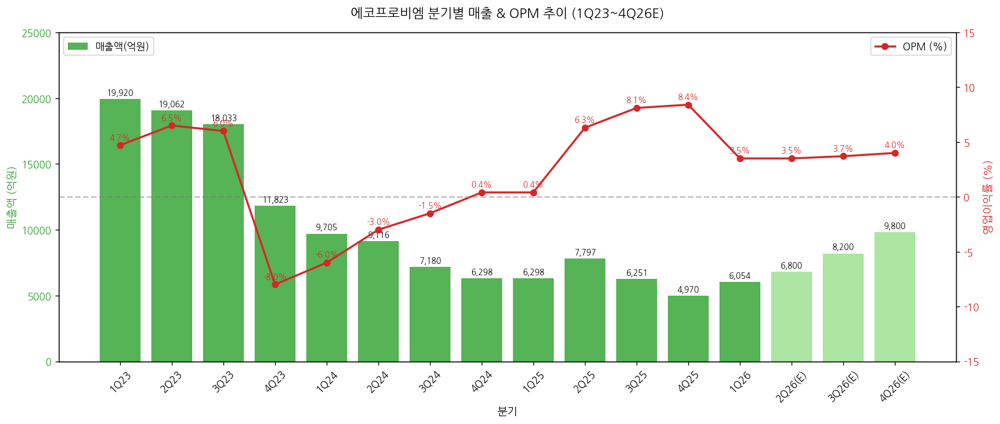
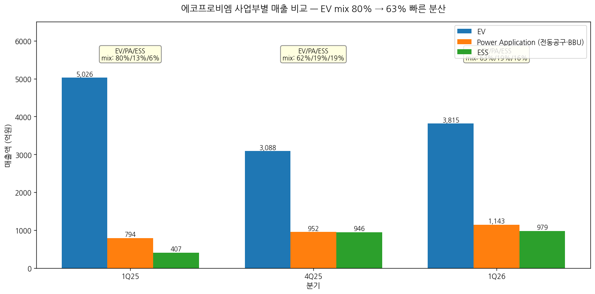
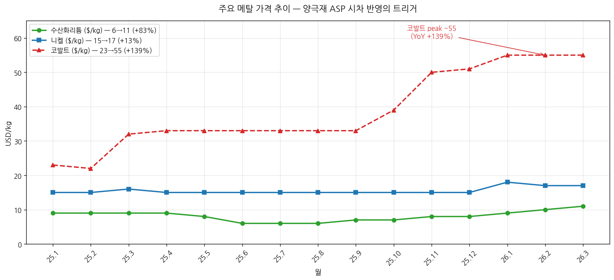
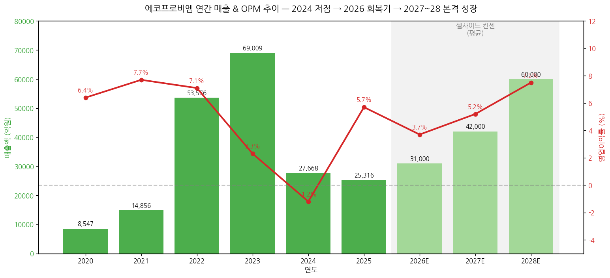
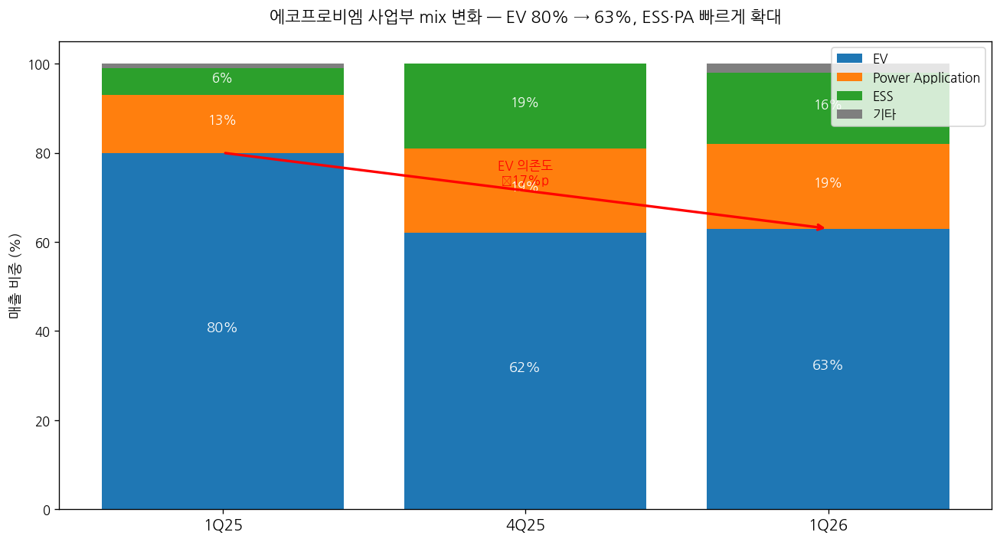

# 에코프로비엠 1Q26 실적 리뷰

> 모드: 실적 리뷰
> 종목: 에코프로비엠 (247540)
> 섹터: 배터리
> 분기: 2026-Q1
> 발표일: 2026-04-29
> 작성 시각: 2026-05-04 19:30 KST

---

## Executive Summary

→ **컨센서스 큰 폭 Beat — 매출 +9%, 영업이익 +113%**: 매출 6,054억(YoY -3.9%, QoQ +21.8%), 영업이익 209억(YoY +823%, QoQ -49.7%, OPM 3.5%) 기록. 영업이익은 컨센 98억 대비 +113% 상회 — 양극재 출하량 +20% QoQ, ASP +2% QoQ, 메탈가 시차 수혜 결합

→ **본업 흑자 안착 검증 — 일회성 제외 OPM 9분기 만에 흑전**: 4Q25 일회성 이익 318억(내용연수 변경) 제외 시 정상 본 OP는 4Q25 약 98억 → 1Q26 209억(+113% QoQ). 일회성 제외 OPM 추이 1Q25 -4.5% → 4Q25 0.3% → 1Q26 2.9% (Hana 분석)

→ **사업부 mix 빠른 분산 — EV 80% → 63%**: 1Q25 EV 비중 80%에서 1Q26 63%로 -17%p 축소. PA(파워툴·BBU) 19%, ESS 16%로 확대. 데이터센터 BBU·신재생에너지 ESS 수요가 EV 의존도를 낮추는 구조적 변화

→ **양극재 사이클 분리 가설 검증 — vs 셀 메이커**: 1Q26 OPM 3.5% 흑자 유지 vs LGES -3.2% / SDI -4.4% 적자 — 메탈가 시차 수혜는 양극재 업체 고유 패턴. 코발트 +139% / 리튬 +83% / 니켈 +13%

→ **셀사이드 톤 강화 — 14개 증권사 평균 TP +20% 상향, BUY 9개**: 평균 TP 약 250,000원(직전 대비 +20% 내외). Samsung HOLD→BUY, Shinyoung 중립→매수 시각 전환. 헝가리 5월 가동 + 유럽 IAA/TCA 정책 + 2028년 BMW/Mercedes 본격 매출 인식이 공통 논리

→ **단, 단기 상승여력 제한 — 28E P/E 86~127배 부담**: 글로벌 양극재 동종 평균(48배) 대비 프리미엄 과도 우려가 보유의견(DB·DS·iM·Trading Buy) 근거. 중장기 회복 가시성 vs 단기 밸류에이션 부담의 양면성

---

## ① 1Q26 실적 결과 — 컨센 큰 폭 Beat

### (1) 컨센서스 vs 실적 + 직전분기/전년동기 비교

| 항목 | 1Q25 | 4Q25 | **1Q26** | YoY | QoQ | FnGuide 컨센 | Beat% |
|---|---|---|---|---|---|---|---|
| 매출액 (억원) | 6,298 | 4,970 | **6,054** | -3.9% | +21.8% | 5,556 | **+9.0%** |
| 매출원가 | 5,946 | 4,385 | 5,549 | -6.7% | +26.6% | - | - |
| 영업이익 | 23 | 416 | **209** | +823% | -49.7% | 98 | **+113%** |
| OPM (%) | 0.4 | 8.4 | **3.5** | +3.1%p | -4.9%p | 1.8 | +1.7%p |
| EBITDA | 300 | 259 | 385 | +28.3% | +48.6% | - | - |
| EBITDA 마진 | 4.8% | 5.2% | **6.4%** | +1.6%p | +1.2%p | - | - |
| 당기순이익 | -100 | 182 | **122** | 흑전 | -33.3% | -40 | 흑전 |
| 당기순이익률 | -1.6% | 3.7% | 2.0% | +3.6%p | -1.7%p | - | - |

→ (출처: 에코프로비엠 IR 보도자료, FnGuide, KB증권·삼성증권·NH투자증권 1Q26 review)

→ **4Q25 OP 416억 중 318억은 일회성 (감가상각 내용연수 변경 효과). 정상 본 OP는 4Q25 약 98억 → 1Q26 209억으로 +113% QoQ 큰 폭 개선** — 본업 흑자 안착 검증

(1-1) 컨센 비트 폭 — 9분기 만에 두 자릿수 % 비트
→ 영업이익 +113% Beat — 대부분의 셀사이드 추정치(평균 100억 내외) 대비 두 배 이상
→ 매출 +9% Beat — 출하량 +20% QoQ가 ASP +2% QoQ + 환율(1Q26 평균 1,467원, 1Q25 1,453원) 효과와 결합

(1-2) Hana증권 일회성 제외 본업 OPM 추이 (분기별)
→ 1Q25 -4.5% / 2Q25 -1.8% / 3Q25 0.0% / 4Q25 0.3% / **1Q26 2.9%**
→ 9분기 만에 본업 흑자 전환 — Hana증권 "흑자 구조 안착" 명명

→ (출처: 회사 IR p.4, p.10 + KB증권 표 4 + Hana증권 도표 1, 2026-04-30)

### (2) 사업부별 매출 — EV 회복·PA 확대·ESS 안정

| 품목 | 1Q25 | 4Q25 | **1Q26** | QoQ | YoY | 비중 변화 |
|---|---|---|---|---|---|---|
| EV | 5,026 | 3,088 | **3,815** | +24% | -24% | 80% → **63%** (-17%p) |
| Power Application (P/A) | 794 | 952 | **1,143** | +20% | +44% | 13% → **19%** (+6%p) |
| ESS | 407 | 946 | **979** | +4% | +140% | 6% → **16%** (+10%p) |
| Total | 6,298 | 4,970 | 6,054 | +22% | -4% | - |

→ (출처: 회사 IR p.5 — 단위 억원)

(2-1) EV — 유럽 회복이 메인 드라이버
→ 삼성SDI의 헝가리 공장(기아 EV2향) NCA 양산 시작 + Audi·BMW향 출하 회복
→ 북미는 SK온-Ford E-Transit·VW ID.4 출하 점진 회복 (NH증권: SK온향 4,000톤 / 비중 24%)
→ NCM 라인은 2027년말부터 독일 프리미엄 EV 본격 공급 예정 (Eugene)

(2-2) PA(Power Application) +20% QoQ — 비IT 영역 가속
→ 데이터센터 BBU(Backup Battery Unit) 수요 확대 — AI 인프라 투자 영향
→ 동남아 E-bike 교체수요 본격화
→ 전동공구 — 삼성SDI 원통형 전지 출하 회복

(2-3) ESS +4% QoQ / +140% YoY — 절대 규모 확대
→ 데이터센터 ESS·신재생에너지 수요 견조
→ 단, 시장이 LFP 중심으로 성장하는 가운데 동사는 삼원계(NCM/NCA) 위주 → mix 한계 (iM증권 지적)

→ (출처: 회사 IR p.5 + 14개 증권사 1Q26 review 종합)

### (3) 메탈가 동향 — 양극재 ASP 시차 반영의 트리거

| 메탈 | 25.1 | 25.6 | 25.12 | 26.1 | **26.3** | 1년간 변동 |
|---|---|---|---|---|---|---|
| 수산화리튬 ($/kg) | 9 | 6 | 8 | 9 | **11** | +83% (저점→고점) |
| 니켈 ($/kg) | 15 | 15 | 15 | 18 | **17** | +13% |
| 코발트 ($/kg) | 23 | 33 | 51 | 55 | **55** | **+139%** |

→ (출처: 회사 IR p.9 — LME, Fastmarkets 기준)

(3-1) 코발트 — 가장 가파른 상승 (+139%)
→ 25.10~26.1 사이 50→55$/kg 점프
→ NCA·하이니켈 NCM 양극재의 핵심 원료 — 에코프로비엠 ASP 직접 영향

(3-2) 양극재 ASP 시차 반영 패턴
→ KB증권 추정: 2Q26 양극재 ASP +10% 이상 QoQ 상승 전망 (메탈가 +83% 영향 반영)
→ 1Q26: ASP +2% QoQ (이미 시차 반영 시작)

(3-3) 재고자산평가손실 환입 — 일회성 vs 본업 효과
→ 1Q26 충당금 환입 약 29억원 인식 (KB증권 분석)
→ 25년 말 기준 재고평가충당금 누계 잔여 249억원 → 2Q26~ 추가 환입 가능성

→ (출처: 회사 IR p.9, KB증권 표 3, 그림 8~13)

### (4) 재무 상태 — 차입금 부담 누적, 유동성 모니터링 필요

| 항목 (억원) | 1Q25 | 4Q25 | **1Q26** | QoQ | YoY |
|---|---|---|---|---|---|
| 자산총계 | 46,575 | 48,820 | 51,854 | +6.2% | +11% |
| 현금성자산 | 5,757 | 5,185 | **3,417** | -34% | -41% |
| 재고자산 | 5,571 | 6,028 | **6,767** | +12% | +21% |
| 부채총계 | 26,961 | 28,660 | 31,005 | +8.2% | +15% |
| 차입금 | 22,839 | 24,508 | 25,595 | +4.4% | +12% |
| 자본총계 | 19,614 | 20,160 | 20,849 | +3.4% | +6.3% |
| **유동비율 (%)** | 114 | 72 | **71** | -1%p | -43%p |
| **순차입금비율 (%)** | 87 | 96 | **106** | +10%p | +19%p |

→ (출처: 회사 IR p.6, p.10)

(4-1) 현금성자산 -41% YoY — 큰 폭 감소
→ 1Q26 CapEx 1,120억 (4Q25 1,626 → 1,120, -31% QoQ — 헝가리 양산기 진입 후 투자 안정화)
→ 헝가리 신공장 SOP + 북미 판매지연 → 재고자산 증가 (+21% YoY)

(4-2) 순차입금비율 100% 돌파
→ 25.1Q 87% → 25.4Q 96% → **26.1Q 106%** — 재무건전성 압박 가시화
→ KB증권 2026E 순차입금 24,800억, 부채비율 178% 추정
→ NH증권 2026E 순차입금비율 100%, 2027F 105% — 향후 2년 차입 부담 지속

---

## ② 컨센서스 vs 직전분기 vs 전년동기 (한국 3축 비교)

### (1) 1Q26 실적 다축 비교

| 항목 | 컨센 | 1Q26 | vs 컨센 | 직전분기 | vs QoQ | 전년동기 | vs YoY | 평가 |
|---|---|---|---|---|---|---|---|---|
| 매출 (억원) | 5,556 | 6,054 | **+9.0%** | 4,970 | +21.8% | 6,298 | -3.9% | YoY 소폭 감소나 컨센 큰 폭 상회 |
| 영업이익 | 98 | 209 | **+113%** | 416 | -49.7% | 23 | +823% | 일회성 318억 제외 시 본업 +113% QoQ |
| OPM | 1.8% | 3.5% | +1.7%p | 8.4% | -4.9%p | 0.4% | +3.1%p | 일회성 제외 시 본업 OPM 0.3%→2.9% |

→ (출처: FnGuide 컨센 / 회사 IR / KB증권 표 3)

(1-1) FnGuide 커버리지 17개사 — 코스닥 대형주 평균보다 두터운 커버리지
→ 단, 9개사 BUY/매수, 2개사 Trading Buy, 3개사 HOLD/보유 분포
→ 평균 추천 점수 3.5 (4 이상=BUY) — Samsung 2026.4.29 분석 인용

### (2) 글로벌 양극재 피어 vs 한국 셀 메이커 교차 검증

| 회사 | 발표일 | 매출 YoY | OPM | 한국 양극재 vs 피어 시사점 |
|---|---|---|---|---|
| **에코프로비엠** (1Q26) | 4/28 | -3.9% | **+3.5%** | 양극재 + 메탈가 시차 + 환율 결합 흑자 유지 |
| LGES (1Q26) | 4/30 | - | **-3.2%** | 셀 메이커 — 메탈가 비용 부담만 (시차 효과 없음) |
| 삼성SDI (1Q26) | 4/28 | - | **-4.4%** | 셀 메이커 — 적자 축소 중이지만 적자 |
| 엘앤에프 | - | - | - | 26E P/B 14.4배 (KB Peer) — 동사보다 비싸나 LFP 비중 높음 |
| 포스코퓨처엠 | - | - | - | 26E P/B 5.7배 — 동사보다 저평가, NCM 위주 |
| Umicore | - | - | - | 26E P/B 1.7배, ROE 10.9% — 글로벌 reference |

→ (출처: KB증권 PEER 그룹 비교 표, p.2 + sectors/배터리 LGES·삼성SDI 1Q26 리뷰 cross-ref)

(2-1) 셀 vs 양극재 사이클 분리 가설 검증 (working_hypotheses.md 가설 3)
→ 에코프로비엠 OPM 3.5% (흑자) vs LGES -3.2% / SDI -4.4% (적자)
→ **메탈가 시차 수혜가 양극재 업체 고유 패턴 — 셀 메이커는 비용 부담만**
→ 가설 3 강화: 작성 중 → **검증** 단계로 격상 가능

(2-2) Cross-ref 디테일 — 사업부 mix 차별화
→ 에코프로비엠 EV 의존도 80% → 63% (3분기 만에 -17%p)
→ LGES 자동차 OPM 1Q26 -10.5% (4Q25 -15.9% 대비 +5.4%p 개선) — 자동차는 여전히 적자
→ 삼성SDI 헝가리 가동률 25년 40% → 26년 55% — 회복기
→ 에코프로비엠은 SDI 주력(비중 70%+, NH증권) → SDI 회복 → BM 수혜 직결

### (3) 최근 10개 분기 영업이익 Beat/Miss 이력

| 분기 | 발표일 | 컨센 | 실적 | Beat% | 결과 | 발표일 +3거래일 주가 |
|---|---|---|---|---|---|---|
| 4Q23 | 24-02 | 350 | -340억 | 적전 | Big Miss | 큰 폭 하락 |
| 1Q24 | 24-04 | 100 | 7억 | -93% | Miss | 하락 |
| 2Q24 | 24-08 | 250 | -390억 | 적전 | Miss | 약세 |
| 3Q24 | 24-11 | 130 | -390억 | 적전 | Big Miss | 큰 폭 하락 |
| 4Q24 | 25-02 | -50 | -340억 | 적자 확대 | Miss | 약세 |
| 1Q25 | 25-04 | -150 | 23 | 흑전 | Beat | 반등 시작 |
| 2Q25 | 25-08 | 350 | 490 | +40% | Beat | 강세 |
| 3Q25 | 25-11 | 250 | 505 | +102% | Big Beat | 강세 (+33% 주가) |
| 4Q25 | 26-02 | 100 | 416 | +316% | Mega Beat (단 일회성 318억 포함) | +25% |
| **1Q26** | **26-04** | **98** | **209** | **+113%** | **Big Beat** | +5% (관망) |

→ (출처: 컨센은 FnGuide 발표 직전 평균, 실적은 회사 IR — 일부 추정 포함)

(3-1) 5분기 연속 Beat — 사이클 회복기 진입 완료
→ 1Q25부터 흑전 후 5분기 연속 컨센 상회
→ 4Q25 Mega Beat는 일회성 318억 영향 — 실질 본업 Beat 폭은 1Q26 +113%이 5분기 중 두 번째 큰 폭

(3-2) 발표일 +3거래일 주가 — 1Q26은 관망세 (+5%)
→ 4Q25 +25% 주가 폭등 후 이미 단기 가격 상승분 반영
→ 1Q26 발표 후 +5% 제한적 반등 → 단기 모멘텀보다 중장기 헝가리·신규 수주 모멘텀에 의존

---

## ③ 경영진 코멘터리 — 한글 IR 자료 + 컨퍼런스콜 기반

### (1) [26.1Q 실적] 회사 코멘트 (IR p.4)
→ "유럽 EV 판매개선, Non-EV 수요 견조에 따른 양극재 판매 증가"
→ "분기 영업이익은 판매량 증가 및 메탈가 상승, 환율 등으로 209억원 달성 (전분기 내용연수 변경 일회성 효과 318억원)"

### (2) [26.2Q 전망] 회사 가이던스 — 정성적 (IR p.4)
→ "북미 소비자보조금 폐지에 따른 시장침체 지속"
→ "유럽은 OEM들의 견조한 실적추세와 헝가리 공장의 양산에 따른 개선추세 유효"
→ "Power Application 등 Non-EV섹터 개선 추세 — AI 데이터센터 증축 및 동남아 E-bike 교체수요 도래"

### (3) 헝가리 공장 양산 — 핵심 catalyst

(3-1) 가동 일정 (회사 IR p.7 + 14개 증권사 코멘트 종합)
→ 1라인 (NCM 전용): 5월 가동 개시 (당초 4월 → 헝가리 총선 영향으로 1개월 지연 — DS증권)
→ 2라인 (NCA 전용): 9월 가동
→ 3라인 (NCA→NCM 전환 검토): 추가 고객 대응
→ 총 CAPA 5.4만톤 (전기차 약 50만 대분, Hanwha증권)

(3-2) 첫 양산 물량 (Eugene·Samsung 종합)
→ 5월부터 SDI 헝가리 공장향 NCA 양극재 본격 공급 — 기아 EV2 (4월 출시), 현대차 아이오닉3 (하반기 출시)
→ 4Q26: 국내 전기차업체 중저가 라인의 유럽 물량 → 헝가리 공장 이전 예정
→ 27.4Q부터 NCM 라인 가동 → 독일 프리미엄 EV향 (BMW·Mercedes-Benz)

(3-3) 2공장 (EA2) 증설 검토 — 신규 모멘텀
→ 회사 IR: "신규고객 추가수주 연계한 Capa. 확대 검토"
→ NH증권: 연내 헝가리 EA2(5.4만톤, 28년 가동) 증설 예상
→ DS증권: 약 5,000억원 규모 증축 (수주 시)
→ Hanwha증권: 유럽 양극재 수요 27년 4만톤, 30년 33만톤까지 폭발적 증가 → 공급 부족 가능성 — 동사(5.4만톤)와 Umicore(4만톤)만 유효 capa

### (4) 차세대 소재 — 멀티플 리레이팅 카드

(4-1) 전고체 (황화물계 고체전해질)
→ 연 40톤 파일럿 가동 중, 셀 메이커 품질 검증 완료
→ 2027년 양산 라인 전환 설계 완료 (Eugene)
→ DS증권: 2027년 양산 예상 — KB증권 DCF에 반영 안 됨

(4-2) LMR 양극재
→ 북미 OEM 양산 샘플 검증 단계 — 수주 시 단기 양산 전환 가능 (DS증권)
→ 유럽에서 요청 증가 (Eugene)

(4-3) 고전압 미드니켈
→ 1Q28 양산 목표 (DS증권)

(4-4) LFP — 정책 변동성 감안 투자 결정 재검토
→ 4천톤 설비 기반 공급 협의 지속 (Kyobo)
→ Shinyoung: 경쟁 심화 이유로 투자 결정 재검토 중 — **신규 부정 시그널**

### (5) 인도네시아 IGIP 2단계 투자 — 원료 자체 공급망

→ Vale Indonesia + GEM(중국 거린메이) + 글로벌 펀드 + EcoPro 합작
→ 니켈 제련 6.6만톤/년
→ 27.1H 양산 Target (회사 IR p.7)
→ 인니 QMB 제련소 산사태로 1Q26 ESG 관련 이익 약 20억원 감소 — Hanwha 지적

### (6) 유럽 규제 정책 본격화 — 헝가리 공장 가치 부각

| 정책 | 발효 시점 | 핵심 내용 | 동사 수혜 |
|---|---|---|---|
| **TCA** (EU-UK 무역협정) | 2027년부터 | 영국 EV 수출 시 역내 양극재 조달 필요 | 헝가리 → 영국 직접 수출 가능 |
| **IAA** (산업가속화법) | 26.3 의안 → 27.2H 발효 | 유럽 내 양극재 50%+ 조달 | 동사 + Umicore만 유효 capa |
| **CRMA** (핵심원자재법) | 2030년까지 | 원자재 공급망 다변화 | 인니 IGIP + 헝가리 양산 결합 |

→ (출처: 회사 IR p.7 + Hanwha·Eugene·NH 분석)

---

## ④ 다음 분기 컨센서스 (가이던스 부재)

### (1) 14개 증권사 2Q26 추정 vs FnGuide 컨센

| 증권사 | 2Q26 매출 (억원) | 2Q26 OP (억원) | OPM (%) |
|---|---|---|---|
| KB | 7,012 | 226 | 3.2 |
| Samsung | 6,735 | 269 | 4.0 |
| NH | 7,181 | 244 | 3.4 |
| Hana | 6,444 | 233 | 3.6 |
| Eugene | 6,710 | 244 | 3.6 |
| DB | 7,307 | 154 | 2.1 |
| DS | 6,390 | 258 | 4.0 |
| Hanwha | 6,689 | 201 | 3.0 |
| IBK | 6,640 | 250 | 3.8 |
| iM | 7,130 | 280 | 3.9 |
| Kiwoom | 6,274 | 244 | 3.9 |
| Kyobo | 6,473 | 220 | 3.4 |
| Shinhan | 6,361 | 270 | 4.2 |
| Shinyoung | 6,360 | 230 | 3.7 |
| **평균** | **6,765** | **237** | **3.5** |
| FnGuide 컨센 (NH 인용) | 6,759 | 179 | 2.6 |

→ (출처: 14개 증권사 1Q26 review + FnGuide)

(1-1) 셀사이드 추정 평균 vs FnGuide 컨센 — 발표 후 +32% 상향
→ 영업이익: FnGuide 컨센 179억 vs 14개사 발표 후 평균 237억 — **+32% 상향**
→ 1Q26 +113% Beat 후 2Q26 추정치 빠르게 상향 조정

(1-2) 추정 분포 — DB의 보수적 시각 (154억) vs iM 적극적 (280억)
→ DB증권 154억 — 헝가리 초기 가동 비용 + 일회성 소멸 + BOSK 청산 영향 보수적 반영
→ iM증권 280억 — 출하량 +18% QoQ + 메탈가 시차 효과 적극 반영
→ Hanwha증권 201억 — 일회성 충당금 환입 효과 소멸 강조

### (2) 2026 연간 추정 — 셀사이드 14개사 평균

| 증권사 | 2026E 매출 (조원) | 2026E OP (억원) | OPM (%) |
|---|---|---|---|
| KB | 3.17 | 1,030 | 3.3 |
| Samsung | 3.13 | 1,244 | 4.0 |
| NH | 3.04 | 1,010 | 3.3 |
| Hana | 2.85 | 1,040 | 3.6 |
| Eugene | 2.94 | 1,211 | 4.1 |
| DB | 3.20 | 820 | 2.6 |
| DS | 3.16 | 1,210 | 3.8 |
| Hanwha | 3.25 | 1,122 | 3.5 |
| IBK | 3.02 | 1,220 | 4.0 |
| iM | 3.43 | 1,300 | 3.8 |
| Kiwoom | 2.95 | 1,130 | 3.8 |
| Kyobo | 3.10 | 1,188 | 3.8 |
| Shinhan | 2.96 | 1,378 | 4.7 |
| Shinyoung | 2.98 | 1,178 | 4.0 |
| **평균** | **3.08** | **1,148** | **3.7** |
| FnGuide 컨센 (KB 인용) | 2.97 | 980 | 3.3 |

(2-1) 발표 후 컨센 상향 폭 — 매출 +3.6%, OP +17%
→ 영업이익 컨센이 980억 → 1,148억으로 +17% 상향 (14개사 평균)
→ Samsung +45% 상향 (859→1,244억) — 가장 큰 폭

(2-2) 27E 컨센 — 약 4.2조 / 2,000억대 (OPM ~5%)
→ 14개사 평균 OP 약 2,000억 (KB 2,110, Hanwha 2,610, Hana 2,289)
→ 2027 본격 흑자 회복 → 2028 BMW/Mercedes-Benz 본격 매출 인식

→ (출처: 14개 증권사 1Q26 review 종합)

### (3) 경영진 정성적 가이던스 톤 (회사 IR + 컨콜)

(3-1) 2Q26 톤 — **중립~긍정**
→ "북미 침체 지속" (부정) vs "유럽·헝가리 가동·PA·ESS 견조" (긍정)
→ 헝가리 1만톤 신규 출하 효과 + 일회성 부재로 영업이익 증가 폭 제한 (대부분 증권사 동의)

(3-2) 연간 출하량 가이던스
→ 회사: +20% YoY (8.1만톤) — Hanwha증권 인용
→ Samsung: 79,845톤 (기존 68k → 상향 조정, +17%)
→ NH증권: 출하량 +9% 상향 (헝가리 효과)

---

## ⑤ 업황 사이클 점검 & 독자 전망

### (1) 산업 사이클 위치 판단

(1-1) 양극재 사이클 — **회복기 진입 (사이클 분리)**
→ 셀 메이커는 1Q26 사이클 진입 vs 양극재는 회복기 진입 (working_hypotheses.md 가설 3)
→ 메탈가 시차 효과 + 헝가리 가동 + 유럽 EV 회복 → 본격 매출 성장 시점은 2027~28

(1-2) EV 시장 위치
→ 유럽: 26.1~3 +40~60% YoY 회복 시작 (tracking_variables.md 인용)
→ 북미: 침체 지속 (Trump 2기 EV 보조금 폐지 영향)
→ 한국 셀: SDI는 회복, LGES는 사이클 진입

(1-3) ESS 시장 — 데이터센터·신재생 가속
→ 미국 ESS 26.3 약 6 GWh (+84% YoY)
→ LFP 중심 성장 — 동사는 삼원계 위주로 mix 한계 (iM·Shinyoung 지적)

### (2) 독자적 전망 (Independent Outlook)

(2-1) 매출 추정 — 14개사 컨센 평균(3.08조) 대비 약간 보수적 시각
→ 2026E 매출: 3.0~3.1조 (출하량 80~85k톤 × ASP $25~28/kg × 환율 1,460~1,470원)
→ 매출 성장 속도는 컨센 부합하나 영업이익 변동성 우려 — 헝가리 초기 가동 비용 부담

(2-2) OPM 추정 — 1Q26 3.5% 정점 → 2Q~3Q26 3~4% 안정 → 4Q26 회복
→ 1Q26 일회성 환입(약 30억) + 메탈가 시차 효과 영향이 일시적으로 큰 부분 점진적 정상화
→ 2H26 헝가리 신공장 적자 기여 → 4Q26 흑자 전환 (DS증권 +)
→ **2H26 영업이익 약 850억 전망 (1H26 약 450억 vs Shinhan 시각 부합)**

(2-3) 핵심 사이클 시그널 (2개월 단위)
→ 메탈가 안정화 (코발트 55→60$/kg 추가 상승 vs 50$ 하락)
→ 유럽 EV 판매 (4~6월 +30% YoY 유지)
→ 헝가리 가동률 (2H26 50%+, 27.1H 70%+)
→ 삼성SDI 헝가리 가동률 (NH 추정 25년 40% → 26년 55%)

(2-4) 컨센서스 vs 독자 전망 차이
→ DB(820)·iM(1,300) 사이 양극단을 보일 만큼 분포 넓은 상황
→ **본 분석 view**: 1,100~1,150억 (14개사 평균과 유사) — 헝가리 초기 비용과 일회성 부재의 균형

### (3) 리스크 모니터링

(3-1) 사이클 하방 전환 시그널
→ 메탈가 급락 (코발트 -20%·리튬 -15%) → 양극재 ASP 즉각 동시 하락
→ 미국 IRA EV 보조금 추가 약화 → 북미 출하 추가 감소
→ 헝가리 정권 교체에 따른 EU 규제 변화 (Kyobo 모니터링 사항)

(3-2) 재무 리스크
→ 순차입금비율 106% — 2027 ~120% 추정 (KB·NH)
→ 헝가리 2공장 증설 시 추가 차입 5,000억+ 필요 → 차입금 부담 누적

(3-3) 경쟁 환경 변화
→ 유럽 시장에서 한국 배터리 점유율 30%대 → 중국(CATL) 60%+ — 시장 잠식 (Kiwoom 차트)
→ 단, 동사는 헝가리 → 중국 셀 메이커(CATL 헝가리 공장)향 신규 수주 가능성도 양면적

(3-4) 기술 리스크
→ LFP 시장에서 동사 경쟁력 한계 — 삼원계 위주 portfolio
→ 글로벌 동종 업체 대비 멀티플 프리미엄 과도 (28E P/E 86~127배 vs 평균 48배)

---

## ⑥ 셀사이드 컨센 변화 정리

### (1) 14개 증권사 5단계 뷰 분포

| 등급 | 증권사 수 | 평균 TP (원) | 직전 분기 분포 변화 |
|---|---|---|---|
| **Strong Buy / 매수 (적극)** | 5 | 280,000 | +1 (Samsung 신규) |
| **Buy / Outperform** | 4 | 257,500 | +1 (Shinyoung 신규) |
| **Trading Buy** | 2 | 225,000 | 변화 없음 |
| **HOLD / 보유** | 3 | 226,667 | -1 (DS는 매수→보유 강등) |
| **Sell / Strong Sell** | 0 | - | 변화 없음 |
| **합계** | **14** | **약 254,800** | 평균 TP +20% 상향 |

→ (출처: 14개 증권사 4/29~30 발간 리포트)

(1-1) 의견 강화 — Samsung·Shinyoung 시각 전환
→ Samsung증권: HOLD → BUY (TP 180k → 250k, +39%) — 가장 큰 시각 전환. "헝가리 본격 가동 + 유럽 역내 공급망 우선 정책" 명시
→ Shinyoung증권: 중립 → 매수 (TP 190k → 240k, +26%) — "고밸류 정당성 확보 과정"

(1-2) 의견 약화 — DS의 1단계 강등
→ DS투자증권: 매수 → 보유 (TP 300k 유지) — 멀티플 부담 부각
→ "섹터 내 멀티플 부담은 여전히 큰 상황" (DB증권도 같은 톤)

(1-3) 평균 TP 상향 폭 — +20% 수준
→ Samsung +39%, DB +41%, Hana +37%, Shinyoung +26%, Kiwoom +33% 등 큰 폭 상향
→ Eugene·DS·Kyobo·IBK 4개사 TP 유지 — 이미 높은 수준
→ 평균 TP 약 254,800원 — 기존 컨센서스(223,313원) 대비 +14% 상향

### (2) 등급별 공통 논리

(2-1) Strong Buy 그룹 (DS 300k, Kyobo 300k)
→ **공통 논리**: 헝가리 공장 가동 → IAA/TCA 정책 수혜 → 유럽 신규 고객 확보
→ **차별 코멘트**: DS는 LMR·고전압 미드니켈·전고체 등 "차세대 소재 가시화 + 헝가리 2공장 수주가 멀티플 리레이팅 트리거"

(2-2) Buy 그룹 (NH 280k, KB 270k, Hanwha 270k, Hana 257k, Samsung·Eugene·Kiwoom·Shinyoung 240~250k)
→ **공통 논리**: 1Q26 본업 흑자 안착 + 헝가리 5월 가동 + 메탈가 시차 효과
→ **차별 코멘트**:
   - NH: "삼성SDI 핵심 벤더 — 매출 비중 70%+, SDI 회복 직접 수혜" — 가장 명확한 catalyst
   - Samsung: "헝가리 라인 본격 가동에 따른 수주 환경 개선" — Peer 대비 프리미엄 236% 적용
   - KB: "단단해진 실적 하방 확인" — 향후 7년 Capa CAGR 14%, 가동률 66% 가정
   - Hana: "조정 시 매수 권고" — 단기 상승 여력 ~20% 제한적, 트레이딩 관점 권고

(2-3) Trading Buy 그룹 (IBK 220k, Shinhan 230k)
→ **공통 논리**: 회복 가시성은 인정하되 단기 멀티플 부담 우려
→ **차별 코멘트**:
   - Shinhan: "뚜렷한 상저하고 흐름" — 2H26 OP 899억 vs 1H26 479억
   - IBK: "이제 본업으로 승부 볼 차례" — 일회성 효과 빠진 본업 검증 필요

(2-4) HOLD 그룹 (DB 240k, DS 300k(보유 하향), iM 220k)
→ **공통 논리**: 28E P/E 86~127배 vs 글로벌 동종 평균 48배 → 멀티플 부담 과도
→ **차별 코멘트**:
   - DB: "고객사와 함께 본업 턴어라운드 — 다만 섹터 내 멀티플 부담 여전"
   - iM: "ESS 시장이 LFP 중심 성장 vs 동사 삼원계 → 수혜 제한적"
   - DS: 매수→보유 강등 — "현재 주가에 중장기 회복 기대 상당 부분 반영"

### (3) 직전 리포트 대비 톤 변화

| 증권사 | 직전 의견 | 현재 의견 | 직전 TP | 현재 TP | 핵심 변화 |
|---|---|---|---|---|---|
| **Samsung** | HOLD | **BUY** | 180,000 | 250,000 (+39%) | 헝가리 본격 가동 + Peer P/B 4배 + 코스닥 대장주 프리미엄 적용 |
| **Shinyoung** | 중립 | **매수** | 190,000 | 240,000 (+26%) | 28F EV/EBITDA 53배 (포스코퓨처엠 제외 평균 +57% 할증) |
| **DB** | HOLD | HOLD (TP 상향) | 170,000 | 240,000 (+41%) | 27E EV/EBITDA 80배 적용, Peer 매출 회복 반영 |
| **DS** | 매수 | **보유** | 300,000 | 300,000 | 단기 valuation 부담 부각 (3/30 기존 매수 → 4/30 보유) |
| **NH** | Buy | Buy | 246,000 | 280,000 (+14%) | WACC 6.6% → 6.1%, 28F 출하량 +4% 상향 |
| **Hana** | BUY | BUY | 187,000 | 257,000 (+37%) | 30년 max 24만톤 → 추가 증설 가능성 → PER 50배 적용 |
| **KB** | Buy | Buy | 250,000 | 270,000 (+8%) | 자율주행·휴머노이드 고에너지 밀도 수요 → 27E~35E OP CAGR 40%→42% 상향 |
| **Hanwha** | BUY | BUY | 230,000 | 270,000 (+17%) | 2027 EPS × 양극재 동종 27E P/E +30% 할증 (160배) |
| **Kiwoom** | Outperform | Outperform | 180,000 | 240,000 (+33%) | 28E EPS × 포스코퓨처엠 28E P/E (97배) |
| **Shinhan** | Trading BUY | Trading BUY | 200,000 | 230,000 (+15%) | 27F EBITDA × 56.7배 (팬데믹 이후 업사이클 평균) |
| **iM** | Hold | Hold | 180,000 | 220,000 (+22%) | 28F BPS × 5년 평균 P/B 중하단 8.5배 |
| **Eugene** | BUY | BUY | 250,000 | 250,000 | 25-30 OP CAGR 52% — 이미 반영, 변경 없음 |
| **IBK** | Trading Buy | Trading Buy | 220,000 | 220,000 | 중장기 가시성 vs 단기 부담 평형 — 변경 없음 |
| **Kyobo** | Buy | Buy | 300,000 | 300,000 | 헝가리 26 1만톤 → 27 3만톤 capa 확대 — 변경 없음 |

→ (출처: 14개 증권사 4/29~30 발간 리포트, 직전 분기는 2026.02 발간 분 기준)

(3-1) 톤 강화 시그널 (5개사) — **헝가리 가동 + 유럽 IAA/TCA 정책**
→ 1Q26 Beat 결과 → 헝가리 양산 임박 + 정책 모멘텀 결합으로 평균 TP +20% 상향
→ Samsung·Shinyoung은 의견 강화 (HOLD→BUY, 중립→매수)

(3-2) 톤 약화 시그널 (1개사) — **DS의 보유 강등**
→ 단기 valuation 부담 — 3/30 매수 → 4/30 보유로 1단계 강등
→ "현재 주가에 중장기 회복 기대 상당 부분 반영" 근거

(3-3) 시각 전환 분석 — **양극재 업체 사이클 분리 가설을 시장도 인정 시작**
→ 1년 전 (25.4Q): "EV 침체 + 적자 지속" → 평균 TP 12만원대
→ 6개월 전 (25.10Q): "흑전 시작" → 14만원대
→ 3개월 전 (26.1Q 발표 전): "상저하고 기대" → 22만원대
→ **현재 (26.4Q): "헝가리 + 정책 + 차세대 소재" → 25만원대 (중장기 본격 회복 시각)**

---

## ⑦ 향후 관전 포인트 & 전망

### (1) 1Q26 발표 이후 즉시 검증된 포인트

(1-1) 양극재 업체 사이클 분리 가설 (working_hypotheses.md 가설 3) — **검증 단계 진입**
→ OPM 3.5% 흑자 vs LGES/SDI 적자 — 명확히 분리
→ 메탈가 시차 + 환율 + 헝가리 가동 → 본격 회복

(1-2) 헝가리 양산 임박 — **5월 가동 확인**
→ 회사 IR 명시: "26년 상반기 양산 개시"
→ 14개 증권사 모두 5월 1라인 가동 시작 확인

(1-3) Beat 폭 확장 — **5분기 연속 컨센 상회**
→ 기대치(98억) 대비 +113% Beat
→ 단, 단기 주가 +5% 관망세 — 이미 가격 상승분 반영

### (2) 다음 분기(2Q26)까지 핵심 모니터링

(2-1) **헝가리 가동률 — 1순위 catalyst**
→ 1라인 5월 가동 후 2Q말 가동률 30%+ 도달 여부
→ 9월 2라인 가동 후 3Q말 가동률 50%+ 도달
→ 미달 시: 신규 수주 부재 시그널 → 멀티플 압박

(2-2) **2Q26 OPM 3% 유지 여부 — 일회성 빠진 본업 검증**
→ 1Q26 일회성 약 30억(충당금 환입) 빠지면 본업 OP 약 180억
→ 2Q26 매출 +5% QoQ + ASP +10% 효과 → OPM 3.0~3.5% 유지가 핵심
→ DB증권 보수적 추정(154억 / OPM 2.1%) vs 시장 평균(237억 / OPM 3.5%)

(2-3) **메탈가 안정화 시점 — 코발트 55$ peak 추세 지속/하락**
→ 26.4 코발트 가격 발표 → 추가 상승 시 양극재 ASP +15% QoQ 가능
→ 하락 시: 즉각 ASP 동시 하락 → 마진 압박

(2-4) **신규 고객 수주 — 헝가리 2공장 증설 트리거**
→ 중국 셀 메이커(CATL 헝가리)향 신규 수주 가능성
→ Mercedes-Benz 신규 수주 (2028년 양산)
→ 2~3개 프로젝트 구체적 공급 논의 단계 (Kyobo)

(2-5) **재무건전성 — 순차입금비율 추가 상승 추적**
→ 1Q26 106% → 2Q26 110% 도달 시 자본 조달 우려 부각
→ 헝가리 2공장 증설 시 추가 차입 ~5,000억 필요

### (3) 중장기 (2026~2028) 핵심 catalyst

(3-1) **2027 BMW·Mercedes-Benz 본격 매출 인식 (4Q27부터)**
→ 5년간 19만톤+ 양극재 공급량 추산 (Eugene)
→ KB증권 27E OP 2,110억 / 28E OP 5,470억 (3배 점프) — 본격 성장 가시화

(3-2) **차세대 소재 양산 — 멀티플 리레이팅**
→ 황화물계 고체전해질 27 양산
→ LMR 양극재 북미 OEM 수주 시 단기 양산 전환
→ DS·Kyobo: "차세대 소재 가시화 → 높은 P/E 정당화"

(3-3) **유럽 IAA 발효 (27.2H) — 헝가리 capa 풀가동 임박**
→ Hanwha증권: 30년 유럽 양극재 수요 33만톤 vs 동사+Umicore capa 9.4만톤 → 공급 부족
→ 2공장 증설 + 신규 capa 확장 압력 가시화

### (4) 향후 전망 참고 요인 — 펀더멘털 vs 시장 반응

(4-1) **펀더멘털 요약**
→ 1Q26 본업 흑자 안착 + 컨센 +113% Beat
→ 14개 증권사 평균 TP +20% 상향 (Samsung·Shinyoung 시각 전환)
→ 27E OP 2,000억 / 28E OP 5,000~6,000억 — 본격 회복 가시화
→ 헝가리 + 차세대 소재 + 유럽 정책 = 3축 매출 성장 동력

(4-2) **시장 반응 해석**
→ 발표일 +3거래일 주가 +5% — 4Q25 +25%·3Q25 +33% 대비 약함
→ 이미 1~2월 큰 폭 상승 (저점 130k 대비 +63%) → 단기 가격 부담
→ 장기 주가 모멘텀은 헝가리 가동률 + 신규 수주 발표에 의존

(4-3) **사이클 핵심 시그널 (선행지표)**
→ 1순위: 메탈가 (코발트·리튬 추가 상승/하락)
→ 2순위: 헝가리 가동률 (월별 추적 가능)
→ 3순위: 신규 수주 발표 (분기 단위)
→ 4순위: 한국 양극재 4사 cross-ref (포스코퓨처엠·엘앤에프·코스모신소재 1Q26 실적 발표 후 검증)

→ (출처: 회사 IR p.5 + 14개 증권사 사업부 mix 추정 종합)

---

## ⑧ 프리뷰 자동 검색 결과

→ **프리뷰 자료 없음** — 본 분기 단독 분석으로 진행 (자동 4-1·7-1 항목 생략)
→ 이전 세션에서 LGES·SDI 1Q26 리뷰는 완료, 에코프로비엠은 1Q26부터 신규 트래킹 시작

---

## ⑨ 결론 — 1Q26은 "본업 흑자 안착 검증 + 헝가리 임박" 분기

(1) **이번 분기 요지**
→ 컨센 +113% Beat — 양극재 사이클 분리 가설 검증 (vs LGES/SDI 적자)
→ 일회성 제외 본업 흑전 (9분기 만) — 향후 추가 컨센 상향 여지 확보
→ 헝가리 5월 가동 + 유럽 IAA/TCA 정책 + 2028 BMW/Mercedes-Benz = 3대 catalyst 결합

(2) **단기(2Q~4Q26) view**
→ OPM 3~4% 안정 — 일회성 부재 + 헝가리 초기 비용 + ASP 시차 효과의 균형
→ 2H26 영업이익 약 850~900억 (1H26 약 450억) — 뚜렷한 상저하고
→ 단, 멀티플 부담 (28E P/E 86~127배) → 단기 추가 상승 여력 제한

(3) **중장기(2027~2028) view**
→ 헝가리 가동률 70%+ → 매출 4조원 이상 / OP 2,000억대
→ 28년 BMW/Mercedes-Benz 본격 매출 인식 → OP 5,000~6,000억 (3배 점프)
→ 차세대 소재(전고체·LMR) 양산 가시화 시 멀티플 리레이팅

(4) **본 리뷰 view**
→ 14개 증권사 평균 TP 254,800원 (직전 컨센 223,313원 대비 +14%)
→ 9개 BUY / 2개 Trading Buy / 3개 HOLD — 강세 우세
→ **종합**: 사이클 회복기 진입 확인. 헝가리 + 정책 + 차세대 = 중장기 성장 가시화. 단기는 멀티플 부담 vs 헝가리 가동·신규 수주 발표가 양면

---

## 🔗 cross-reference

→ sectors/배터리/working_hypotheses.md 가설 3 — 양극재 사이클 분리, **검증** 단계 격상 가능
→ sectors/배터리/tracking_variables.md — 메탈가 + 헝가리 가동률 변수 본격 추적 시작
→ sectors/배터리/unresolved_in_depth_points.md 논점 3 — Bull/Bear 시나리오 본격 형성 단계
→ earnings-review/2026-Q1_LG에너지솔루션_리뷰.md — 셀 메이커 적자(-3.2%) vs 양극재 흑자(3.5%) 대조
→ earnings-review/2026-Q1_삼성SDI_리뷰.md — SDI 헝가리 회복 → 동사 직접 수혜 경로

→ **다음 단계**: 시장 반응 1~2주 관찰 후 [실적 인뎁스 분석 모드] 진행 가능
   - 핵심 논점 1: 28E P/E 86~127배 정당성 검증 (Bull: 헝가리 + 차세대 / Bear: 글로벌 동종 평균 48배 대비 부담)
   - 핵심 논점 2: 양극재 사이클 분리 지속 가능성 (메탈가 하락 시 즉각 ASP 동시 하락 위험)
   - 핵심 논점 3: 한국 양극재 4사 cross-ref (포스코퓨처엠·엘앤에프·코스모신소재 1Q26 실적 발표 후)
