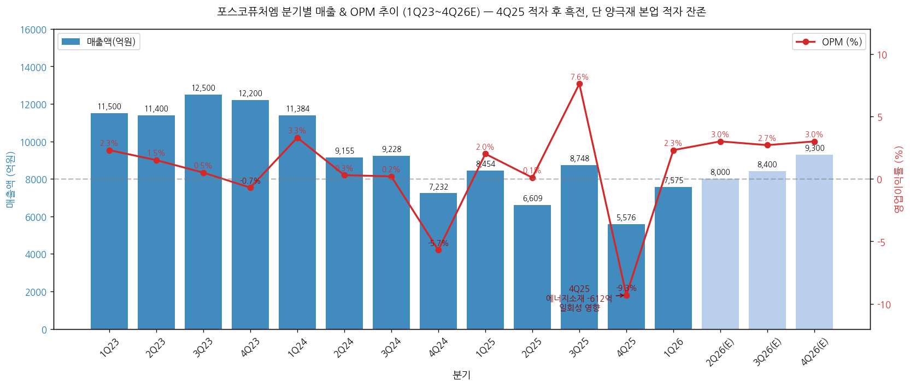
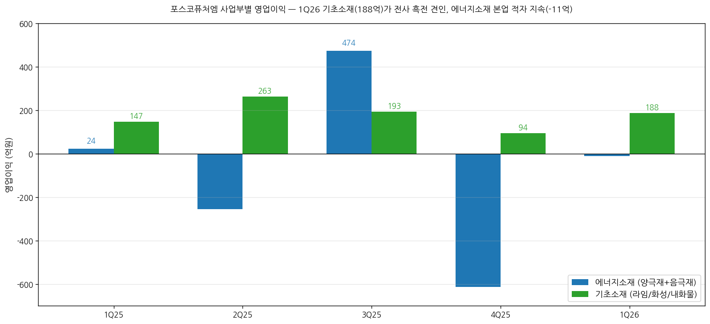
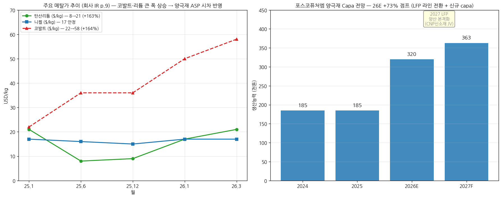
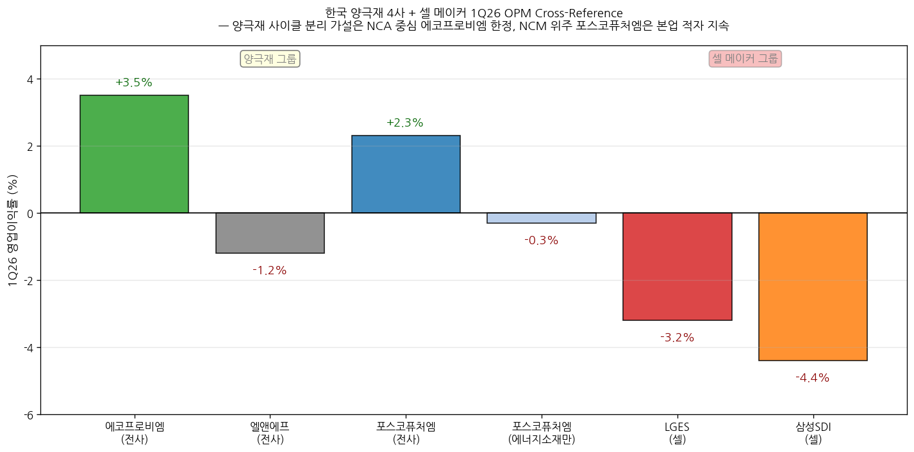
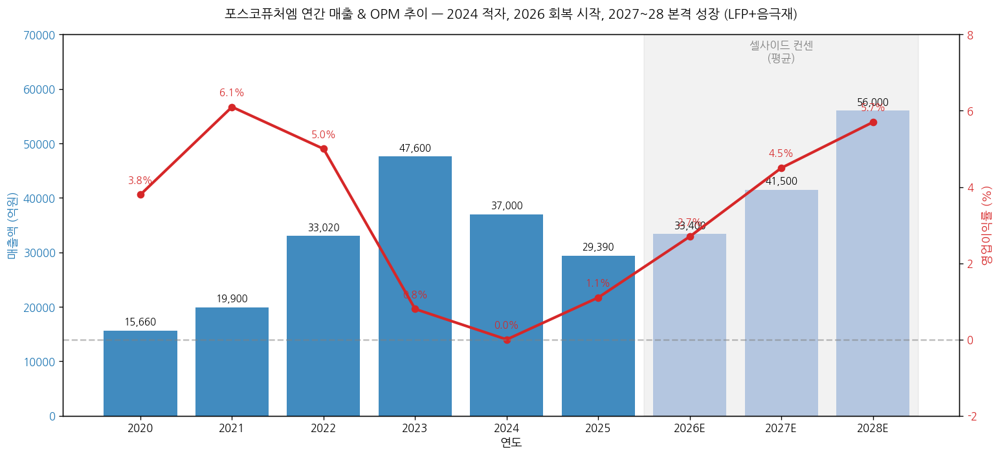

# 포스코퓨처엠 1Q26 실적 리뷰

> 모드: 실적 리뷰
> 종목: 포스코퓨처엠 (003670)
> 섹터: 배터리
> 분기: 2026-Q1
> 발표일: 2026-04-30
> 작성 시각: 2026-05-04 20:30 KST

---

## Executive Summary

→ **컨센서스 큰 폭 Beat — 매출 +22%, 영업이익 +205%**: 매출 7,575억(YoY -10.4%, QoQ +35.9%), 영업이익 177억(YoY +3.2%, QoQ 흑자전환, OPM 2.3%) 기록. FnGuide 컨센(매출 6,215 / OP 58억) 대비 매출 +22% / OP +205% Big Beat. 단, **에너지소재(양극재+음극재) 부문은 -11억 적자 지속** — 4Q25 -612억 → 1Q26 -11억으로 적자 큰 폭 축소이나 흑전 미실현

→ **양극재 사이클 분리 가설 — 부분 검증 (NCA vs NCM 차별화 부각)**: 1Q26 OPM 비교 — **에코프로비엠 +3.5%(NCA 중심) vs 포스코퓨처엠 양극재 본업 -0.3%(NCM 중심)**. 양극재 사이클 분리 가설은 NCA·고객 mix 차별화 업체에 한정. 포스코퓨처엠은 GM 얼티엄셀 가동중단 + 고객 의존도가 구조적 부진 요인

→ **기초소재(라임/화성)가 전사 OP 견인 — 188억 OPM 5.8%**: 양극재 본업이 아닌 부수 사업이 흑자 견인. 원유가 상승(WTI 1Q26 평균 72.7$, 4Q25 59.1$ 대비 +23%)에 따른 화성품 ASP 상승 + 라임 설비 효율화

→ **신규 공급선 확대가 양극재 매출 회복의 driver**: 양극재 매출 4,187억 (+112% QoQ, BNK·DS·미래에셋 종합 +30~99% 출하량 증가). 전동공구·BBU·보조배터리 신규 시장 공급 1,000억원+ — N86 공백을 거래선 다변화로 대응

→ **셀사이드 톤 강화 — 9개 증권사 평균 TP 293,800원(+13% 상향), 매수 7개**: 시각 전환 시그널 — Hana Neutral→BUY(+48%), BNK 보유→매수(+32%), Shinyoung 중립→매수(+32%). 단 NH·Hanwha 2개사는 HOLD 유지(밸류에이션 부담)

→ **차세대 모멘텀 — LFP 양극재 26말 양산 + 음극재 탈중국 + 전고체**: 26.5월 시제품 출하, 하반기 라인전환 양산. 27.4Q CNP신소재 JV 5만톤 가동. 美 Factorial과 전고체 MOU. 일본 자동차사 전고체 양극재 단독 개발업체 선정. AMPC MACR 조건 강화 → 음극재 매출 본격화 기대

---

## ① 1Q26 실적 결과 — 컨센 큰 폭 Beat

### (1) 컨센서스 vs 직전분기 vs 전년동기 (한국 3축 비교)

| 항목 | 1Q25 | 4Q25 | **1Q26** | YoY | QoQ | FnGuide 컨센 | Beat% |
|---|---|---|---|---|---|---|---|
| 매출액 (억원) | 8,454 | 5,576 | **7,575** | -10.4% | +35.9% | 6,215 | **+22%** |
| 매출원가 | 7,706 | 5,501 | 6,853 | -11.0% | +24.6% | - | - |
| 매출총이익 | 748 | 75 | **722** | -3.5% | +860% | - | - |
| GPM (%) | 8.8 | 1.3 | **9.5** | +0.7%p | +8.2%p | - | - |
| 영업이익 | 172 | -518 | **177** | +3.2% | 흑전 | 58 | **+205%** |
| OPM (%) | 2.0 | -9.3 | **2.3** | +0.3%p | +11.6%p | 0.9 | +1.4%p |
| EBITDA | 653 | 14 | **668** | +2.3% | +4,671% | - | - |
| 영업외손익 | 437 | 286 | -77 | -514억 | -363억 | - | - |
| 당기순이익 | 489 | -232 | **63** | -87% | 흑전 | 90 | **-30%** Miss |
| 당기순이익률 | 5.8% | -4.2% | 0.8% | -5.0%p | +5.0%p | - | - |

→ (출처: 포스코퓨처엠 IR p.4 / FnGuide / KB증권·NH증권 1Q26 review)

(1-1) Big Beat — 컨센 매출 +22% / OP +205%
→ 9개 증권사 평균 추정치(약 90억) 대비 +97% Beat — **매우 큰 폭 비트**
→ 4Q25 일회성 -612억 빠진 후 정상화 + 메탈가 시차 + 신규 시장 효과 결합

(1-2) 영업외손익 -77억 — 직전 437/286억 흑자 → 적자전환
→ 지분법손익 +14억은 견조 vs 외환·금융손익 악화
→ 당기순이익 컨센(90억) 대비 -30% Miss — 영업외 영향

### (2) 사업부별 실적 — **기초소재가 전사 흑전 견인, 에너지소재 본업 적자 지속**

| 사업부 | 1Q25 | 4Q25 | **1Q26** | QoQ | YoY |
|---|---|---|---|---|---|
| **에너지소재 매출** | 5,056 | 2,196 | **4,336** | +97% | -14% |
| ㄴ 양극재 | 4,665 | 1,979 | **4,187** | +112% | -10% |
| ㄴ 음극재 | 391 | 217 | **149** | -31% | -62% |
| **기초소재 매출** | 3,398 | 3,380 | **3,239** | -4% | -5% |
| ㄴ 라임/화성 | 2,193 | 2,162 | 2,107 | -3% | -4% |
| ㄴ 내화물/플랜트 | 1,205 | 1,218 | 1,132 | -7% | -6% |
| **에너지소재 OP** | 24 | -612 | **-11** | +601 | -35억 |
| ㄴ 에너지소재 OPM | 0.5% | -27.9% | **-0.3%** | +27.6%p | -0.8%p |
| **기초소재 OP** | 147 | 94 | **188** | +94억 | +41억 |
| ㄴ 기초소재 OPM | 4.3% | 2.8% | **5.8%** | +3.0%p | +1.5%p |
| **전사 OP** | 172 | -518 | **177** | +695 | +5억 |
| ㄴ 전사 OPM | 2.0% | -9.3% | 2.3% | +11.6%p | +0.3%p |

→ (출처: 회사 IR p.4·6·10, 단위 억원)

(2-1) 에너지소재 본업 적자 지속 — **포스코퓨처엠의 가장 큰 약점**
→ 4Q25 -612억(일회성 인조흑연 평가손실 등 포함) → 1Q26 -11억 (BEP 근접)
→ 양극재 매출 +112% QoQ 회복했으나 본업 OPM은 여전히 -0.3% 적자
→ 일회성 충당금 환입 약 100억원(NH·KB 추정) 반영 시에도 본업 적자 유지

(2-2) 양극재 출하량 +30~99% QoQ 추정 (각 증권사 추정 분포)
→ Hanwha증권 1Q26 양극재 출하 12,178톤(+99% QoQ)
→ BNK증권: NCA(삼성SDI), N87(현대차) 출하 +30% QoQ + 신규 어플리케이션 매출
→ 신규 공급처 PT/IT용 매출 1,000억원 — DS증권 강조

(2-3) 음극재 부진 지속 — -31% QoQ / -62% YoY
→ 해외 고객사(주로 일본 파나소닉 등) 회계연도말 분기 도래에 따른 재고조정
→ 천연흑연 부문 낮은 가동률 → 부문 적자 지속 (Hana추정 -100억대)
→ 미국 대중국 음극재 AD/CVD 관세 부과 철폐(25.3) → 음극재 회복 시기 늦춤 (Hanwha 지적)

(2-4) 기초소재가 전사 OP 견인 — **양극재 본업이 아닌 부수 사업**
→ 라임 설비 대수리 완료 → 가동률 상승 + 원가 개선
→ 비철 등 외부 고객사 수주물량 증가
→ WTI 1Q26 평균 72.7$ vs 4Q25 59.1$ (+23%) → 화성품(코크스·타르) 판가 상승

→ (출처: 회사 IR p.4 + 9개 증권사 1Q26 review 종합)

→ (출처: 회사 IR p.6, p.10)

### (3) 메탈가 + 일회성 충당금 환입

| 메탈 | 25.1 | 25.6 | 25.12 | 26.1 | **26.3** | 1년간 변동 |
|---|---|---|---|---|---|---|
| 탄산리튬 ($/kg, 99.5% 한·중·일) | 21 | 8 | 9 | 17 | **21** | 저점→고점 +163% |
| 코발트 ($/kg, FastMarkets) | 22 | 36 | 36 | 50 | **58** | +164% |
| 니켈 ($/kg, LME) | 17 | 16 | 15 | 17 | **17** | 안정 |

→ (출처: 회사 IR p.9 + KB증권 그림 8~13)

(3-1) 메탈가 큰 폭 상승 → 양극재 ASP 시차 반영
→ 양극재 ASP 1Q26 +3% QoQ 상승 (BNK 추정), 2Q26 +6~7% QoQ 추가 상승 예상
→ 재고평가손 환입 1Q26 약 100억원 인식 (KB·NH·BNK 공통 추정)

(3-2) 메탈가는 에코프로비엠과 비교 — 코발트 상승 폭 더 큼
→ 에코프로비엠 IR 코발트 25.1 23 → 26.3 55$ (+139%)
→ 포스코퓨처엠 IR 코발트 22 → 58$ (+164%) — 두 회사 추적 데이터 약간 차이
→ 두 회사 모두 코발트 +140%대 큰 폭 상승 → 양극재 ASP 시차 반영의 핵심 트리거

→ (출처: 회사 IR p.9 + NH증권 그림 1)

### (4) 재무 상태 — 25.8 유상증자 11,025억 영향, 단 차입금 다시 증가

| 항목 (억원) | 1Q25 | 4Q25 | **1Q26** | QoQ | YoY |
|---|---|---|---|---|---|
| 자산총계 | 81,260 | 91,439 | **95,201** | +4.1% | +17.2% |
| 현금성자산 | 4,599 | 7,347 | **6,751** | -8.1% | +46.8% |
| 매출채권 | 5,510 | 3,913 | 7,014 | +79% | +27% |
| 재고자산 | 7,084 | 8,411 | 6,511 | -23% | -8% |
| 부채총계 | 47,263 | 46,318 | 49,025 | +5.8% | +3.7% |
| 총차입금 | 36,535 | 38,670 | **41,052** | +6.2% | +12.4% |
| 자본총계 | 33,997 | 45,121 | **46,176** | +2.3% | +35.8% |
| **부채비율** | 139% | 103% | **106%** | +3%p | -33%p |
| **순차입금** | 31,936 | 31,323 | **34,301** | +9.5% | +7.4% |
| **순차입금비율** | 94% | 69% | **74%** | +5%p | -20%p |

→ (출처: 회사 IR p.5)

(4-1) 25.8 유상증자 11,025억 효과 — 자본금 잉여금 +10,967억
→ 부채비율 139% → 103% → 106% (소폭 재상승)
→ 순차입금비율 94% → 69% → 74% (재상승 추세)

(4-2) 차입금 1Q26 41,052억 (+2,382억 QoQ) — Capex 부담 지속
→ 1Q26 Capex 약 2,500억 (회사 IR 명시 안 됨, 25년 연간 14,989억 대비 분기 평균)
→ KB·BNK 추정 2026 Capex 7,000~9,000억 (헝가리·LFP·음극재 등)
→ NH 추정 26E 부채비율 145%, 27F 155% — 추가 차입 부담 누적 우려

---

## ② 한국 양극재 4사 cross-reference + 셀 메이커 비교

### (1) 1Q26 OPM Cross-Ref — 양극재 사이클 분리 가설 부분 검증

| 회사 | 1Q26 OPM (전사) | 1Q26 OPM (양극재 본업) | mix | 핵심 |
|---|---|---|---|---|
| **에코프로비엠** | **+3.5%** | **+3.5%** (전사 양극재 100%) | NCA·하이니켈 NCM | 본업 흑자 안착 |
| **엘앤에프** | -1.2% | -1.2% | NCM·LFP | 본업 적자 (LGES 의존) |
| **포스코퓨처엠 (전사)** | +2.3% | - | - | 기초소재가 OP 견인 |
| **포스코퓨처엠 (에너지소재만)** | - | **-0.3%** | NCM·하이니켈 | 본업 적자 지속 |
| LGES (셀) | -3.2% | - | - | 적자 진입 |
| 삼성SDI (셀) | -4.4% | - | - | 적자 축소 |

→ (출처: 각 사 IR + 24개 증권사 1Q26 review)

(1-1) 양극재 사이클 분리 가설 (working_hypotheses.md 가설 3) — **부분 검증**
→ 에코프로비엠 OPM +3.5% 흑자 확인
→ **단 포스코퓨처엠 양극재 본업 -0.3% — 가설은 NCA·고객 mix 차별화 업체에 한정**
→ NCM 위주 + GM·SK온 등 EV 의존도 높은 양극재 업체는 셀 메이커와 동조 적자

(1-2) 양극재 4사 차별화 요인
→ 에코프로비엠: NCA 70%+ + 삼성SDI 의존 (회복) + 헝가리 양산 임박 → **사이클 분리**
→ 포스코퓨처엠: NCM 90%+ + GM(얼티엄셀 가동중단) + LGES + 현대차 분산 → **EV 침체 직격탄**
→ 엘앤에프: NCM + LGES 주력 → 셀 메이커와 동조
→ 코스모신소재: NCM + LGES — 미발표

(1-3) 핵심 인사이트
→ **mix 차별화(NCA 노출)가 양극재 사이클 분리의 핵심 변수**
→ 메탈가 시차 효과는 모두 받지만, 본업 흑전 여부는 고객 mix·제품 mix가 결정
→ working_hypotheses.md 가설 3 → **검증 → 부분 검증** 단계로 정밀화 필요

→ (출처: 각 사 IR / sectors/배터리 1Q26 리뷰 종합)

### (2) 글로벌 피어 비교 (KB증권 PEER)

| 회사 | 26E P/E | 26E P/B | 26E EV/EBITDA | 26E ROE |
|---|---|---|---|---|
| **포스코퓨처엠** | 1,000 | 5.5 | 71.1 | 0.6% |
| **에코프로비엠** | 422 | 12.1 | 86.2 | 12.7% |
| 엘앤에프 | 250 | 13.7 | 43.5 | 0.8% |
| Umicore | 11.8 | 1.7 | 6.3 | 10.9% |

→ (출처: KB증권 5/4 PEER 그룹 비교 표)

(2-1) 포스코퓨처엠 P/E 1,000배 — 26E ROE 0.6%로 가장 낮음
→ 27E P/B 5.4배(에코프로비엠 11.4배의 절반)이지만 P/E는 209배로 더 높음
→ 28E 본격 회복(KB 추정 OP 8,210억, OPM 8.9%) 시 적정성 회복

(2-2) Umicore와 비교 — 글로벌 reference
→ Umicore 26E P/B 1.7배, ROE 10.9% — 안정성 모범 케이스
→ 한국 양극재 4사 모두 멀티플 프리미엄 과도 (작년 인뎁스 분석에서도 동일 지적)

---

## ③ 경영진 코멘터리 + 사업 전략

### (1) 회사 IR 코멘트 (p.6·8)

(1-1) 에너지소재 매출 코멘트
→ "양극재: NCA/N87 판매 회복 및 신규시장 판매 증가"
→ "음극재: 해외 고객사 재고조정으로 판매량 감소"

(1-2) 에너지소재 손익 코멘트
→ "운영 효율화 및 판매량 증대에 따른 수익성 개선"
→ "전기 재고평가손실 인식 기저 효과 및 환율 효과"

(1-3) 기초소재 매출 코멘트
→ "전기 플랜트 외부공사 수행에 따른 기저효과"
→ "설비 대수리 완료로 라임 생산·판매량 증가"
→ "화성제품 판가(3개월前 유가 지연 반영) 전기比 하락"

(1-4) 기초소재 손익 코멘트
→ "비철 등 외부 고객사 수주물량 증가"
→ "라임 설비 효율화로 가동률 상승 및 원가 개선"

### (2) 사업 전략 (회사 IR p.8) — 차세대 소재 다변화

(2-1) **LFP 양극재 (3축 진행)**
→ 라인전환: 비용절감 + 시기 단축, **26.5월 시제품 출하, 하반기 양산** (1.5만톤 추정 — DS증권)
→ 합작법인 (CNP신소재 JV with CNGR): 최대 5만톤, **27년말 양산**
→ Non-PFE LFP 전구체 고객 프로모션
→ 주요 고객사 계약협상 마무리 단계 (회사 명시) + 유럽 EV향 다수 고객사 협의 중

(2-2) **인조흑연 음극재**
→ 베트남 1단계 투자 진행 중 — **28년 양산 예정**
→ 1조원 규모 공급계약 체결 (26.3) — 핵심 모멘텀
→ 다수 고객사와 추가 협상 진행 중
→ 하노이·하이퐁 거점 (베트남, 70~170km 중국 인접)

(2-3) **전고체용 소재 / AI 데이터센터용 슈퍼 캐퍼시터**
→ **日 자동차사 전고체용 양극재 단독 개발업체 선정** — 신규 단독 공급권
→ **美 Factorial Inc.(전고체 선두) MOU 및 투자계약 체결** — 글로벌 reference
→ 슈퍼 캐퍼시터용 활성탄소 공급 협의 중 — AI 데이터센터 신규 시장

### (3) 양극재 capa 전망 (NH증권)

| 구분 | 2024 | 2025 | 2026E | 2027F |
|---|---|---|---|---|
| 양극재 (만톤) | 18.5 | 18.5 | **32.0** | 36.3 |
| 천연흑연 음극재 (만톤) | 7.4 | 7.4 | 7.4 | 7.4 |
| 인조흑연 음극재 (만톤) | 0.8 | 0.8 | 0.8 | 0.8 |

→ (출처: NH증권 그림 1)

(3-1) 2026 양극재 capa +73% 점프 — LFP 라인 전환 + 신규 capa
→ 2027 LFP 양산 본격화 (CNP신소재 JV 5만톤 가동)
→ 2030년 max capa 30만톤 (Hana 추정 28F 기준)

---

## ④ 다음 분기 컨센서스 (가이던스 부재)

### (1) 9개 증권사 2Q26 추정 vs FnGuide 컨센

| 증권사 | 2Q26 매출 (억원) | 2Q26 OP (억원) | OPM (%) |
|---|---|---|---|
| KB | 7,638 | 199 | 2.6 |
| Samsung | 8,157 | 346 | 4.2 |
| BNK | 8,620 | 380 | 4.4 |
| Hana | 7,698 | 179 | 2.3 |
| DS | 8,542 | 256 | 3.0 |
| Hanwha | 8,830 | 325 | 3.7 |
| Mirae+Asset | 8,143 | 279 | 3.4 |
| NH | 7,222 | 161 | 2.2 |
| Shinyoung | 8,730 | 300 | 3.4 |
| **평균** | **8,176** | **269** | **3.2** |
| FnGuide 컨센 (NH 인용) | 6,890 | 150 | 2.2 |

→ (출처: 9개 증권사 1Q26 review)

(1-1) 발표 후 컨센 빠른 상향 — 평균 +79% (영업이익)
→ FnGuide 150 → 9개사 평균 269 (+79%)
→ 1Q26 +205% Beat 후 시장 추정치 대폭 상향

(1-2) 추정 분포 — NH(보수적 161) vs BNK(적극적 380)
→ NH증권 N65 판매 감소 우려 + 음극재 적자 지속 보수적
→ BNK증권 양극재 ASP +6~7% QoQ + 기초소재 유가 상승 적극적
→ 평균 269억 / OPM 3.2% — 1Q26(2.3%) 대비 +0.9%p 추가 개선

### (2) 2026 연간 추정 — 9개사 평균

| 증권사 | 2026E 매출 (조원) | 2026E OP (억원) | OPM (%) |
|---|---|---|---|
| KB | 3.21 | 840 | 2.6 |
| Samsung | 3.72 | 1,283 | 3.4 |
| BNK | 3.26 | 980 | 3.0 |
| Hana | 3.17 | 713 | 2.3 |
| DS | 3.45 | 1,080 | 3.1 |
| Hanwha | 3.52 | 1,106 | 3.1 |
| Mirae+Asset | 3.34 | 1,040 | 3.1 |
| NH | 3.24 | 820 | 2.5 |
| Shinyoung | 3.40 | 816 | 2.4 |
| **평균** | **3.37** | **964** | **2.9** |
| FnGuide 컨센 (KB 인용) | 3.11 | 800 | 2.6 |

(2-1) 발표 후 컨센 상향 폭 — 매출 +8%, OP +20%
→ FnGuide 컨센 800억 → 9개사 평균 964억 (+20%)
→ Samsung +18% (1,164→1,283), KB +15% (730→840), BNK +97% (498→980 추정)

(2-2) 27E·28E — 본격 회복 시점
→ 27E OP 평균 약 1,800억 (range 962~2,210)
→ 28E OP 평균 약 3,200억 (Hana 1,554, BNK 1,480, KB 8,210)
→ 2027년 LFP 양산 + 음극재 회복이 본격 회복 트리거

### (3) 경영진 정성적 가이던스 톤

(3-1) 회사 양극재 판매량 가이던스
→ 2026년 5만톤 초반 (+10~15% YoY) — BNK 인용
→ Samsung 추정 5.3만톤, Hanwha 추정 5.3만톤 — 회사 가이던스 부합
→ "GM, Ford향 판매는 부진하나 NCA 출하 2배 가량 증가하고 신규 어플리케이션향 공급도 하반기 더 증가할 것" (회사)

(3-2) LFP 양극재 — 신규 catalyst
→ 회사 IR: "주요 고객사 계약협상 마무리 단계"
→ "유럽 EV向 다수 고객사 협의 진행 중"
→ DS증권: 26.5월 시제품, 하반기 양산 (~1.5만톤), 27.4Q CNP JV (5만톤) — 국내 최대 capa

---

## ⑤ 업황 사이클 점검 & 독자 전망

### (1) 산업 사이클 위치 판단

(1-1) 양극재 사이클 — **포스코퓨처엠은 회복기 진입 늦음**
→ 에코프로비엠은 2.9% 본업 흑전 (9분기 만)
→ 포스코퓨처엠은 -0.3% 본업 적자 지속 (BEP 근접)
→ 회복 시점은 1~2분기 늦을 것으로 추정

(1-2) GM 얼티엄셀 가동중단 — 가장 큰 부담
→ 1Q26 N86 출하 사실상 0
→ 2분기 말부터 GM 얼티엄셀즈 가동 재개에 따른 N86 판매 회복 기대 (Hanwha)
→ 1Q26 BNK 추정: GM 없어도 신규 어플리케이션·NCA·N87로 +30% QoQ 출하 회복

(1-3) 음극재 사이클 — 미국 정책 변동성
→ 25.3 미국 대중국 음극재 AD/CVD 관세 부과 철폐 → 음극재 회복 시기 늦춤
→ 28년 베트남 인조흑연 양산 + 1조원 공급계약(26.3) → 중장기 회복

### (2) 독자적 전망 (Independent Outlook)

(2-1) 매출 추정 — 9개사 컨센 평균(3.37조원) 부합
→ 2026E 매출: 3.3~3.4조원 (양극재 5만톤 + ASP +10% + 기초소재 5% YoY)
→ 양극재 출하 가이던스 회복 가시성 확인

(2-2) OPM 추정 — 1Q26 2.3% → 연간 평균 2.9% 제한적 상승
→ 1Q26 일회성 100억 빠지면 본업 OP 약 80억(OPM 1.0%)
→ 2H26 GM 얼티엄셀 N86 + LFP 시제품 + 기초소재 유가 상승 결합 → OPM 3.0%대
→ **본 분석 view**: 2026E OP 950~1,050억 (9개사 평균 부합)

(2-3) 핵심 사이클 시그널
→ GM 얼티엄셀즈 가동 재개 시점 (2Q26 말 가능성)
→ LFP 양극재 시제품 출하 → 양산 → 수주 발표 (4Q26~1Q27)
→ 음극재 회복 시점 (Hanwha 2Q26 일본향 출하 +45% QoQ 예상)
→ 메탈가 안정화 (코발트 58$ 추가 상승/하락)
→ 기초소재 OPM 6%+ 유지 가능 여부 (유가 의존)

### (3) 리스크 모니터링

(3-1) 사이클 하방 전환 시그널
→ GM 얼티엄셀 가동 추가 지연 → N86 매출 추가 공백
→ 메탈가 -20% 급락 → 양극재 ASP 즉각 동시 하락
→ 미국 EV 보조금 추가 폐지 영향

(3-2) 재무 리스크
→ 순차입금비율 1Q25 94% → 4Q25 69% → 1Q26 74% (재상승)
→ 2026E 부채비율 145% (NH 추정), 27F 155% — 추가 차입 누적
→ Capex 26E 7,000~9,000억 + 27F 5,000억 부담

(3-3) 경쟁 환경 변화
→ 한국 양극재 4사 capa 경쟁 심화 → 마진 압박
→ 글로벌 동종 대비 멀티플 프리미엄 과도 (P/B 5.5배 vs Umicore 1.7배)
→ LFP 시장에서 중국 업체와의 경쟁 심화

(3-4) 기술 리스크
→ 전고체용 양극재 양산 시점 불확실
→ LFP 시제품 → 양산 전환 시 수율 risk
→ 일본 자동차사 전고체 단독 개발업체 선정 시점도 미확정

---

## ⑥ 셀사이드 컨센 변화 정리

### (1) 9개 증권사 5단계 뷰 분포

| 등급 | 증권사 수 | 평균 TP (원) | 직전 분기 분포 변화 |
|---|---|---|---|
| **Strong Buy / 매수 (적극)** | 4 | 312,500 | +1 (BNK 신규) |
| **Buy / Outperform** | 3 | 290,000 | +2 (Hana·Shinyoung 신규) |
| **HOLD / Hold** | 2 | 260,000 | 변화 없음 (NH·Hanwha) |
| **Sell** | 0 | - | 변화 없음 |
| **합계** | **9** | **약 293,800** | 평균 TP +13% 상향 |

→ (출처: 9개 증권사 4/30~5/4 발간 리포트)

(1-1) 의견 강화 — Hana·BNK·Shinyoung 시각 전환
→ Hana증권: Neutral → BUY (TP 198k → 294k, **+48% 가장 큰 변동**) — "프리미엄 정당화 가능"
→ BNK증권: 보유 → 매수 (TP 250k → 330k, **+32% 가장 높은 TP**) — "GM 없어도 버틸만 하네"
→ Shinyoung증권: 중립 → 매수 (TP 220k → 290k, +32%) — "새로운 길을 개척"

(1-2) 의견 유지 — NH·Hanwha의 신중함
→ NH증권 Hold 유지 — "신규 수주 가시성 높아지나 단기 OP 회복 폭 제한적"
→ Hanwha증권 Hold 유지 — "GM 회복·LFP·음극재 가시성 확보 시 투자의견 상향 가능"

(1-3) 평균 TP 상향 폭 — +13% 수준
→ 평균 TP 약 293,800원 — FnGuide 직전 컨센(259,389원) 대비 +13%
→ 에코프로비엠 +14% 상향과 유사 수준

### (2) 등급별 공통 논리

(2-1) Strong Buy 그룹 (BNK 330k, Samsung 320k, KB 310k, Hana 294k)
→ **공통 논리**: GM 얼티엄셀 공백을 거래선 다변화로 대응 + 메탈가 시차 + 기초소재 견조 + LFP·음극재 모멘텀
→ **차별 코멘트**:
   - BNK: "GM 없어도 버틸만 하네 — 양극재 ASP +3% QoQ + 기초소재 5.8% OPM 결합"
   - Samsung: "양극재 판로 확대 + LFP 공급 시작 → 중장기 성장세 개선" (Peer P/B +38% 프리미엄)
   - KB: "BBU·전동공구 소형전지 수요 회복 → 25-28E OP CAGR 140% → 243%"
   - Hana: "프리미엄 정당화 가능 — 음극재 + 양극재 + LFP·미드니켈 포트폴리오"

(2-2) Buy 그룹 (DS 290k, Mirae+Asset 290k, Shinyoung 290k)
→ **공통 논리**: 회복세 진입 + LFP 양산 임박 + 신규 공급선 다변화
→ **차별 코멘트**:
   - DS: "회복세 돌입 기대 — 26 말 LFP 양산 + 27.4Q CNP JV → 국내 최대 capa"
   - Mirae+Asset: "신규 시장 진입이 중요 — 28년 미국 LFP 시장점유율 20% 가정 1.8조 사업가치"
   - Shinyoung: "새로운 길을 개척 — 양극재 경쟁사 대비 EV/EBITDA 20% 할증"

(2-3) HOLD 그룹 (NH 260k, Hanwha 260k)
→ **공통 논리**: 중장기 회복 인정하되 단기 OP 회복 폭 제한적 + 멀티플 부담
→ **차별 코멘트**:
   - NH: "음극재 적자 지속 + 단기 영업이익 회복 폭 제한적 (2Q26 161억)"
   - Hanwha: "탈중국 음극재 입지 독보적 + GM·LFP·음극재 가시성 확보 시 상향 가능"

### (3) 직전 리포트 대비 톤 변화

| 증권사 | 직전 의견 | 현재 의견 | 직전 TP | 현재 TP | 핵심 변화 |
|---|---|---|---|---|---|
| **Hana** | Neutral | **BUY** | 198,000 | 294,000 (**+48%**) | "프리미엄 정당화 가능" — AMPC MACR + 음극재 + LFP 포트폴리오 |
| **BNK** | 보유 | **매수** | 250,000 | 330,000 (+32%) | "GM 없어도 버틸만 하네" — 양극재 ASP + 기초소재 + LFP 모멘텀 |
| **Shinyoung** | 중립 | **매수** | 220,000 | 290,000 (+32%) | "새로운 길을 개척" — 28F EV/EBITDA 43배 |
| **KB** | Buy | Buy | 280,000 | 310,000 (+11%) | 25-28E OP CAGR 140% → 243% |
| **Samsung** | BUY | BUY | 271,000 | 320,000 (+18%) | Peer P/B +38% 프리미엄 |
| **NH** | Hold | Hold | 210,000 | 260,000 (+24%) | WACC 5.2 → 4.8%, 양극재 판매량 +25% 상향 |
| **Hanwha** | Hold | Hold | 220,000 | 260,000 (+18%) | 28년 NOPLAT × Peer P/E +30%(양극재)·+60%(음극재) 할증 |
| **Mirae+Asset** | 매수 | 매수 | 250,000 | 290,000 (+16%) | 양극재·LFP·음극재 SOTP, 28년 미국 LFP 점유 20% |
| **DS** | 매수 | 매수 | 290,000 | 290,000 | LFP 26말 양산 + 27.4Q CNP JV |

→ (출처: 9개 증권사 직전·현재 리포트, 직전은 2026.01~03 발간 분 기준)

(3-1) 톤 강화 시그널 (3개사) — **양극재 사이클 분리 인정 시작**
→ Hana·BNK·Shinyoung은 "보유/중립" 입장에서 매수 전환 → **시장도 양극재 본업 분리 가설을 부분 수용**
→ 다만 포스코퓨처엠 한정 양극재 사이클 분리는 LFP·음극재·차세대 소재로 우회 검증 (직접 검증 X)

(3-2) 톤 약화 시그널 — **없음**
→ 9개사 모두 TP 상향 (or 유지) — 1단계 강등 없음
→ 에코프로비엠과 달리 DS·iM 등 보유 강등 사례 없음 — 멀티플 부담은 적음 (P/E 209배 vs 에코프로비엠 422배)

(3-3) 시각 전환 분석 — **양극재 4사 차별화 부각**
→ 작년 4Q25 -612억 충격 후 BNK·Hana·Shinyoung 보수적 입장 → 1Q26 회복 확인 후 전환
→ 단, **포스코퓨처엠의 양극재 본업 회복은 에코프로비엠보다 1~2분기 늦은 4Q26~1Q27 추정**

---

## ⑦ 향후 관전 포인트 & 전망

### (1) 1Q26 발표 이후 즉시 검증된 포인트

(1-1) 양극재 사이클 분리 가설 — **부분 검증** (NCA·고객 mix 차별화 한정)
→ 에코프로비엠 본업 OPM +3.5% vs 포스코퓨처엠 본업 OPM -0.3% — 명확한 차별화
→ working_hypotheses.md 가설 3을 정밀화: "NCA 중심 + 고객 mix 차별화 양극재 업체에 한정"

(1-2) 거래선 다변화 효과 확인 — **GM 없어도 버틸만 하네** (BNK)
→ N86 출하 사실상 0이지만 NCA(삼성SDI) +30%, N87(현대차) +30%, 신규 어플리케이션 1,000억원
→ 단일 고객 의존도 리스크 일부 해소

(1-3) 기초소재 의외의 강세 — OPM 5.8% 회복
→ 라임 설비 효율화 + 유가 상승에 따른 화성품 ASP 상승
→ 양극재가 아닌 부수 사업이 전사 OP 견인

### (2) 다음 분기(2Q26)까지 핵심 모니터링

(2-1) **GM 얼티엄셀즈 가동 재개 시점 — 1순위 catalyst**
→ Hanwha증권: 2Q26 말부터 N86 판매 회복 기대
→ 6월 GM 공식 발표 가능성 vs 추가 지연 시 리스크
→ 미달 시: N86 매출 추가 공백 → 27년 회복 지연
*주간 모니터링: GM 공식 IR + 셀 메이커 팀 재가동 발표 + 미국 EV 정책*

(2-2) **2Q26 OPM 3% 유지 여부 — 본업 검증**
→ 1Q26 일회성 100억 빠지면 본업 OP 약 80억 (OPM 1.0%)
→ 2Q26 매출 +5~10% QoQ + 양극재 ASP +6~7% QoQ + 기초소재 유가 상승 → 9개사 평균 OPM 3.2%
→ NH증권 보수적 OPM 2.2% vs BNK 적극적 4.4% — 분포 광범위
*뉴스 키워드: "포스코퓨처엠 2분기 잠정실적", "양극재 ASP", "유가 화성품 판가"*

(2-3) **LFP 양극재 시제품 출하 → 수주 발표**
→ 회사 IR: "26.5월 시제품 출하, 하반기 양산"
→ DS증권: 26 말 1.5만톤 라인 전환 capa
→ "주요 고객사 계약협상 마무리 단계" → 1차 수주 발표 시점이 핵심
→ 미달 시: LFP 후발주자 우려 부각
*뉴스 키워드: "포스코퓨처엠 LFP", "CNP신소재 JV", "Non-PFE LFP"*

(2-4) **음극재 회복 시점 — 일본향 출하 + 베트남 양산**
→ Hanwha증권: 2Q26 일본 파나소닉향 출하 +45% QoQ → 적자 폭 절반
→ 베트남 인조흑연 1조원 공급계약(26.3) → 28년 양산 효과
→ 미국 대중국 음극재 AD/CVD 철폐 영향 모니터링
*뉴스 키워드: "포스코퓨처엠 음극재 회복", "베트남 인조흑연", "탈중국 음극재"*

(2-5) **재무건전성 — 순차입금비율 75%+ 추적**
→ 1Q26 74% (4Q25 69% 대비 +5%p 재상승)
→ Capex 26E 7,000~9,000억 + 27F 5,000억 부담 누적
→ 80%+ 도달 시 추가 자본 조달 우려 부각
*뉴스 키워드: "포스코퓨처엠 회사채", "포스코퓨처엠 자본 조달"*

### (3) 중장기 (2026~2028) 핵심 catalyst

(3-1) **2027년 LFP 본격 양산 + CNP JV 가동**
→ 26 말 라인전환 1.5만톤 → 27.4Q CNP JV 5만톤 = 28년 6.5만톤 LFP 라인업
→ 미국 ESS 시장 LFP 중심 성장 → Mirae+Asset 28년 점유율 20% 가정 1.8조 사업가치

(3-2) **2028년 베트남 음극재 양산 + 탈중국 모멘텀**
→ 1조원 공급계약 → 28년 양산
→ 미국 AMPC MACR 조건 강화 → 음극재 매출 본격화
→ Hana 28F 음극재 P/E 50배 6,650억 사업가치

(3-3) **차세대 소재 — 일본 자동차사 전고체 단독 + 美 Factorial MOU**
→ 일본 자동차사(도요타? 닛산?) 전고체 양극재 단독 개발업체 선정
→ 美 Factorial Inc.(전고체 선두) MOU → 글로벌 reference
→ AI 데이터센터 슈퍼 캐퍼시터용 활성탄소 — 신규 시장

### (4) 향후 전망 참고 요인

(4-1) **펀더멘털 요약**
→ 1Q26 컨센 +205% Beat (단 양극재 본업 적자 지속, 기초소재가 견인)
→ 9개 증권사 평균 TP +13% 상향 (Hana·BNK·Shinyoung 시각 전환)
→ 27E OP 1,800억 / 28E OP 3,200억 — 본격 회복은 27년 LFP 양산 후

(4-2) **시장 반응 해석**
→ 발표 후 주가 변화 (5/4 종가 252,000원, 발표 전 대비 +5% 수준)
→ 이미 1~3월 큰 폭 상승 (저점 97k 대비 +160%) → 단기 가격 부담
→ 장기 주가 모멘텀은 LFP·음극재 진척 + GM 회복에 의존

(4-3) **사이클 핵심 시그널 (선행지표)**
→ 1순위: GM 얼티엄셀즈 가동 재개 (월별 추적 가능)
→ 2순위: 양극재 ASP (메탈가 + 환율)
→ 3순위: LFP 시제품 → 수주 발표 (분기 단위)
→ 4순위: 음극재 일본 출하 회복 + 베트남 양산 진척

---

## ⑧ 프리뷰 자동 검색 결과

→ **프리뷰 자료 없음** — 본 분기 단독 분석으로 진행 (자동 4-1·7-1 항목 생략)
→ 포스코퓨처엠은 1Q26부터 신규 트래킹 시작 (sectors/배터리 4번째 종목)

---

## ⑨ 결론 — 1Q26은 "거래선 다변화 + 기초소재 견인 + LFP 임박" 분기

(1) **이번 분기 요지**
→ 컨센 +205% Beat — 단 **에너지소재 본업 -11억 적자 지속** (4Q25 -612억 → 1Q26 -11억으로 적자 축소)
→ **기초소재(라임/화성)가 OP 188억(OPM 5.8%)으로 전사 OP 견인** — 양극재 본업이 아닌 부수 사업
→ GM 공백을 거래선 다변화(NCA·N87·신규 어플리케이션 1,000억)로 대응 → 중장기 회복 가시성 확인

(2) **양극재 사이클 분리 가설 — 부분 검증**
→ 에코프로비엠 OPM +3.5% (NCA·삼성SDI) vs 포스코퓨처엠 양극재 -0.3% (NCM·GM)
→ 가설 정밀화: "NCA 중심 + 고객 mix 차별화 양극재 업체에 한정 — NCM 위주는 셀 메이커와 동조 적자"
→ 한국 양극재 4사 cross-ref 논점 4 (sectors/배터리 unresolved_in_depth_points.md) **부분 형성 → 본격 검증** 단계 진입

(3) **단기(2Q~4Q26) view**
→ 9개사 평균 2Q26 OP 269억 (FnGuide 컨센 150억 → +79% 상향)
→ 2H26 GM N86 회복 + LFP 시제품 + 기초소재 유가 상승 결합 → OPM 3%대
→ 단, 멀티플 부담 (P/E 1,000배 26E, 209배 27E) — 단기 추가 상승 여력 ~15%

(4) **중장기(2027~2028) view**
→ 27년 LFP 양산 본격화 + CNP JV 5만톤 → 매출 4조원 + OP 1,800~2,000억
→ 28년 베트남 음극재 양산 + AMPC MACR 음극재 매출 본격화 → OP 3,200억
→ 차세대 소재(전고체·슈퍼 캐퍼시터) 양산 시 멀티플 리레이팅

(5) **본 리뷰 view**
→ 9개 증권사 평균 TP 293,800원 (직전 컨센 259,389원 대비 +13%)
→ 7개 매수 / 2개 HOLD — 강세 우세 (단 에코프로비엠 9 BUY 대비 약함)
→ **종합**: 회복 시점은 에코프로비엠보다 1~2분기 늦음. GM 회복 + LFP 진척 + 음극재 회복이 3대 catalyst. 단기는 본업 적자 우려 vs 중장기 LFP·음극재 모멘텀의 양면

---

## 🔗 cross-reference

→ sectors/배터리/working_hypotheses.md 가설 3 — **부분 검증** 단계 정밀화 (NCA·고객 mix 차별화 한정)
→ sectors/배터리/tracking_variables.md — 포스코퓨처엠 변수 추가 (양극재 본업 OPM, GM N86 출하, LFP 양산 진척)
→ sectors/배터리/unresolved_in_depth_points.md 논점 4 — 한국 양극재 4사 cross-ref **본격 형성** 단계 (에코프로비엠 + 포스코퓨처엠 데이터 확보)
→ earnings-review/2026-Q1_에코프로비엠_리뷰.md — NCA 중심 흑자 vs NCM 중심 적자 직접 비교
→ earnings-review/2026-Q1_LG에너지솔루션_리뷰.md — 셀 메이커 적자(-3.2%) cross-ref
→ earnings-review/2026-Q1_삼성SDI_리뷰.md — SDI 회복 → 에코프로비엠 직접 수혜 vs 포스코퓨처엠 SDI 비중 낮음 차별화

→ **다음 단계**: 시장 반응 1~2주 관찰 후 [실적 인뎁스 분석 모드] 진행 가능
   - 핵심 논점 1: P/E 209~1,000배 정당성 검증 (Bull: LFP·음극재·전고체 / Bear: 본업 적자 + 멀티플 부담)
   - 핵심 논점 2: 양극재 사이클 분리 가설의 mix 변수 — NCA 비중·고객 mix 영향 정량화
   - 핵심 논점 3: GM 얼티엄셀즈 가동 재개 시나리오 분석 (Bull: 2Q26 / Base: 3Q26 / Bear: 4Q26 이후)
   - 핵심 논점 4: 한국 양극재 4사 + 글로벌(Umicore) 5사 통합 cross-ref — 엘앤에프·코스모신소재 1Q26 발표 후
