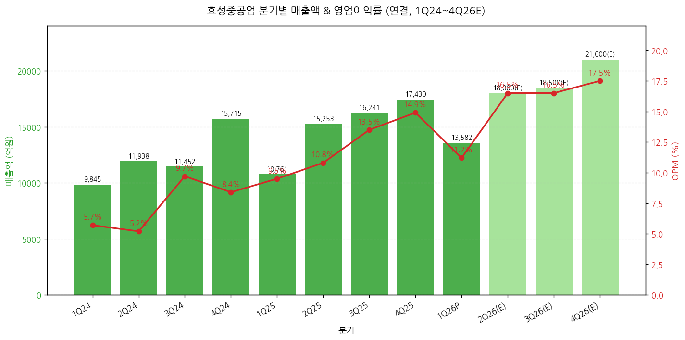
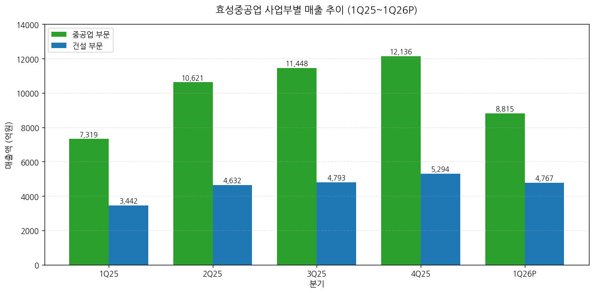
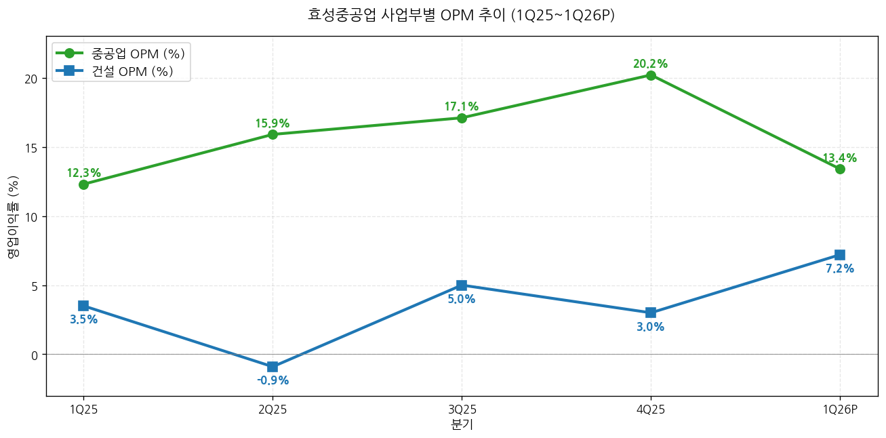
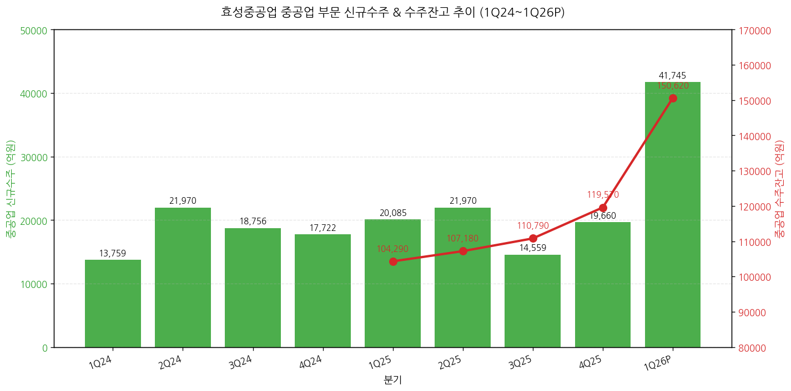
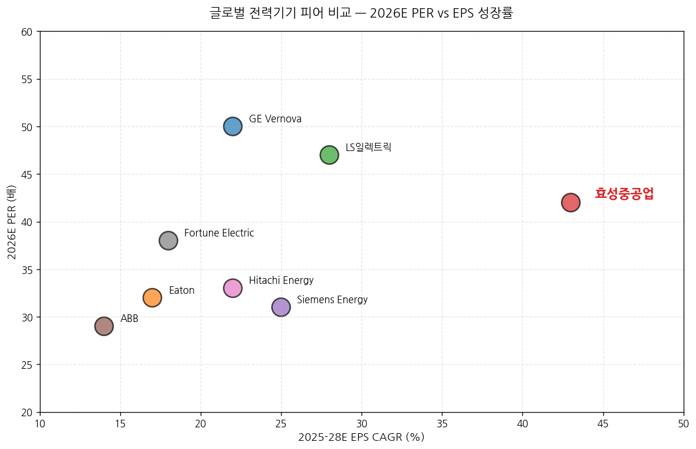

> 모드: 실적 리뷰
> 종목: 효성중공업 (298040.KS)
> 섹터: 전력 인프라
> 분기: 2026-Q1 (1Q26 잠정실적, 분기 종료 2026-03-31)
> 발표일: 2026-04-25 (금) 잠정실적 + 4월 27일(월) IR 자료/보도자료 + 4월 27~28일 NDR
> 작성 시각: 2026-05-03 15:00 KST

# 효성중공업 1Q26 실적 리뷰 (잠정실적 + IR 자료 + NDR 통합)

> 안내: 표준 위치(`earnings-preview/`)에서 동일 분기 효성중공업 프리뷰 미존재 → 항목 4-1·7-1 자동 생략 (NVDA만 존재). 첨부된 12개 증권사 리포트(BNK·Daishin·Hana·Kyobo·LS·NH·Samsung·Shinhan·SK·Yuanta·IBK·Eugene) + 회사 IR 자료(4/27 발행) 기반 통합 분석.

## Executive Summary

→ **외형 +26% / OPI +49% YoY 호조에도 컨센 -9.5% Miss — 회계적 이연이 원인** — 매출 1조 3,582억원(+26.2% YoY), 영업이익 1,523억원(+48.7% YoY, OPM 11.2%) vs 컨센 매출 1조 3,296억원·영업이익 1,683억원. **미국향 GIS/GCB 고수익 차단기 약 400억원 OPI 상응 물량이 분기말 기준 '운송중인재고'로 마감**되어 연결조정 통해 1Q26 OPI에서 차감, **2Q26 전량 인식 예정**. 이연분 가산 시 실질 1Q26 OPI 약 1,920억원·OPM 14.1%로 컨센 +14% 상회.
→ **단일 분기 사상 최대 신규수주 4조 1,745억원 (+108% YoY) — 진짜 헤드라인** — 중공업 부문, 미국 비중 77%(약 3.2조원). 단일 프로젝트 약 9,200억원의 미국 765kV 변압기 수주 포함 (한국 업체 단일 PJT 사상 최대). 수주잔고 15.1조원(+44% YoY), 미국 비중 53%(전년말 45% → +8%pp QoQ).
→ **1Q26 사상 최대 분기 수주 = 글로벌 피어 동조 시그널 입증** — GE Vernova, Hitachi Energy, Eaton 등 1Q26 어닝콜에서 모두 765kV급 초고압·800V DC·SST 수요 확대 일관 코멘트. 효성중공업이 단일 기업 호조가 아닌 **산업 전체 슈퍼사이클** 진입 확정.
→ **12개 증권사 만장일치 매수 + 평균 TP 4,708,000원 (vs 현재가 3,552,000원, 상승여력 +32.6%)** — 발표 직전 평균 TP 약 3,500,000원 대비 +33% 일제 상향. Yuanta·Eugene 5,000,000원 최고치, Shinhan 4,200,000원 최저치. Hold/Sell 0건. 적용 PER은 26~37배 → 28~50배로 일제 리레이팅 (Samsung 51배, IBK 50배 최고).
→ **다음 분기 모멘텀 = 2Q26 이연분 인식 + 하반기 북미 비중 확대 + 4Q26 가이던스 상향 가능성** — 2Q26 OPI 1Q26 이연분 400억원 + 정상 물량 → 컨센 평균 약 2,930억원(+78% QoQ, +78% YoY). 회사 측 2026 신규수주 가이던스 7.6조원이나 1Q에 4.2조 달성으로 상향 예고 (Daishin은 11.4조원, LS는 13.4조원 추정).

---

## 항목 1. 실적 추이 (업데이트)

① 분기 실적 (12분기: 확정 8 + 잠정 1 + 컨센 3)

(1) 손익 핵심 지표 (단위: 억원, %)

| 항목 | 1Q24 | 2Q24 | 3Q24 | 4Q24 | 1Q25 | 2Q25 | 3Q25 | 4Q25 | **1Q26P** | 2Q26(E) | 3Q26(E) | 4Q26(E) |
|---|---|---|---|---|---|---|---|---|---|---|---|---|
| 매출액 | 9,845 | 11,938 | 11,452 | 15,715 | 10,761 | 15,253 | 16,241 | 17,430 | **13,582** | 약 18,000 | 약 18,500 | 약 21,000 |
| **YoY%** | — | — | — | — | +9.3 | +27.8 | +41.8 | +10.9 | **+26.2** | +18.0 | +14.0 | +20.5 |
| **QoQ%** | — | +21.3 | -4.1 | +37.2 | -31.5 | +41.7 | +6.5 | +7.3 | **-22.1** | +32.5 | +2.8 | +13.5 |
| 영업이익 | 562 | 627 | 1,114 | 1,322 | 1,024 | 1,642 | 2,198 | 2,605 | **1,523** | 약 2,930 | 약 3,070 | 약 3,540 |
| OPM (%) | 5.7 | 5.2 | 9.7 | 8.4 | 9.5 | 10.8 | 13.5 | 14.9 | **11.2** | 약 16.3 | 약 16.6 | 약 16.9 |
| 영업이익 YoY% | — | — | — | — | +82.3 | +162.1 | +97.3 | +97.0 | **+48.7** | 약 +78 | 약 +40 | 약 +36 |
| 지배순이익 | — | — | — | — | 1,022 | 925 | 1,502 | 1,750 | **873** | 약 2,180 | 약 2,200 | 약 2,510 |
| EPS (원) | — | — | — | — | 10,961 | 9,920 | 16,108 | 18,768 | **9,361** | 약 23,400 | 약 23,600 | 약 26,900 |
| 평균환율 (원/$) | — | — | — | — | 1,453 | 1,399 | 1,383 | 1,449 | **1,464** | 약 1,465 | 약 1,460 | 약 1,455 |
| 부채비율 (%) | — | — | — | — | 216.4 | — | — | 190.3 | **209.7** | — | — | — |

→ 2Q-4Q26 컨센서스는 11개 증권사 신규/갱신 추정치 단순 평균 (BNK·Daishin·Hana·Kyobo·LS·NH·Shinhan·SK·Yuanta·IBK·Eugene). 출처: 각 증권사 실적 추정 표.
→ 환율은 1Q26 평균 1,464원/달러 (대신증권 환산), 1Q25 1,453원 대비 +0.8% (환율 영향 미미)

(1-1) YoY% 패턴 핵심 시그널
→ 매출 YoY% 가속 패턴: 1Q25 +9% → 4Q25 +11% → **1Q26 +26%**. 이미 2Q26부터 베이스 효과 약화로 둔화될 전망 (+18% → +14% → +21%)
→ **영업이익 YoY% 정점은 이미 통과** — 4Q25 +97% → 1Q26 +49% (이연분 미반영 효과). 이연분 정상 반영 시 OPI YoY +88% 수준 가능
→ OPM 절대 수준 12개월: 1Q25 9.5% → 4Q25 14.9% → 1Q26 11.2% (계절적 비수기 + 이연 영향) → 2Q26(E) 16.3% → 4Q26(E) 16.9%로 가속

→ (출처: 효성중공업 IR 자료 page 7 분기별 손익추이, 11개 증권사 추정치 평균)
→ 핵심 인사이트: **4Q25 OPM 14.9%가 단일 분기 사상 최고치이며, 2H26부터 16% 후반대 정상화 예상**. 1Q26 11.2%는 이연 영향이 없었다면 약 14% 수준이었을 것

(1-2) 잠정실적 발표 후 다음 분기 컨센 변동 추적
→ 2Q26 컨센 (BT 첨부 11개 증권사 신규 추정 평균): 매출 약 1.78조원, 영업이익 약 2,930억원
→ 발표 직전 FnGuide 평균 (Hana·NH·BNK 인용 기준): 매출 1.33조원·영업이익 1,683억원 (이는 1Q26 컨센임)
→ 2Q26 컨센은 1Q26 이연분 +400억원이 거의 100% 반영되는 방향으로 일제 상향 (대표적 변화: Daishin 2Q26 OPI 2,300억원, LS 3,060억원, Hana 3,063억원)
→ 컨센 표준편차 큼 — 가장 보수적(Eugene·BNK 약 2,400억원) ↔ 가장 공격적(LS 3,060억원, Hana 3,063억원, Yuanta 3,179억원)

② 사업부별 (중공업 / 건설)

(1) 1Q26 사업부별 실적 (단위: 억원, %)

| 사업부 | 매출 (억원) | 비중 | YoY% | QoQ% | 영업이익 (억원) | OPM (%) | OPM Δ YoY | OPM Δ QoQ |
|---|---|---|---|---|---|---|---|---|
| **중공업** | **8,807** | 64.8 | **+20.5** | -27.4 | **1,177** | **13.4** | +1.1pp | -6.8pp |
| ┗ 전력 | 7,657 | 56.4 | +26.0 | -28.2 | n/a | n/a | — | — |
| ┗ 기전 | 1,117 | 8.2 | +14.1 | -14.1 | n/a | n/a | — | — |
| ┗ 풍력 | 33 | 0.2 | -86.9 | -79.8 | n/a | n/a | — | — |
| **건설** | **4,767** | 35.1 | **+38.5** | -10.0 | **344** | **7.2** | +3.7pp | +4.2pp |
| ┗ 본사 | 약 2,929 | — | — | — | 233 | 8.0 | — | — |
| ┗ 진흥기업 | 1,838 | — | +92.8 | — | 111 | 6.0 | +5.0pp | +9.0pp |
| 기타·연결조정 | 8 | 0.1 | — | — | — | — | — | — |
| **연결 합계** | **13,582** | 100 | **+26.2** | **-22.1** | **1,523** | **11.2** | **+1.7pp** | **-3.7pp** |

→ (출처: LS증권 1Q26 영업실적 Review 표2, 효성중공업 IR 자료 page 6, 신한투자증권·하나증권 부문별 실적표)

→ (출처: 하나증권 도표 1, LS증권 표 4 분기 추정, 효성중공업 IR Appendix 2)

→ (출처: 하나증권·LS증권 분기 추정, 효성중공업 IR Appendix 2)

(1-1) 핵심 관찰
→ **중공업 매출 8,807억원**: 1Q25 7,319억원 대비 +20.5%, 4Q25 12,127억원 대비 -27.4%. 분기 비수기 영향 (1월 조업일수 감소 + 음력 설 효과) + 이연 약 800~1,000억원 매출 효과
→ **중공업 OPM 13.4%**: 4Q25 20.2% 대비 -6.8pp 감소. 단순히 매출 감소에 따른 고정비 부담만의 효과 아님 — **이연 400억원 OPI 정상 인식 시 OPM 약 18%** (LS·Kyobo 추정) → 정상 사이클 위치 유지
→ **중공업 풍력 매출 33억원 (-87% YoY)**: 4Q24 덴마크 해상풍력 변압기·리액터 수주 2,912억원 취소 영향이 1Q26 매출에 반영. 일회성 이슈로 본 사업 모멘텀과 무관
→ **건설 OPM 7.2% (+3.7pp YoY)**: 진흥기업 OPI 111억원으로 4Q25 -250억원 미분양 대손 반영 반전. 본사 234억원 + 진흥기업 111억원 모두 흑자 안정화. 리스크 관리 중심 선별 수주 효과 입증

(2) 사업부별 1년 변화 (1Q25 → 1Q26)

| 사업부 | 1Q25 매출 | 1Q26 매출 | YoY Δ | 1Q25 OPM | 1Q26 OPM | OPM Δ |
|---|---|---|---|---|---|---|
| 중공업 | 7,319 | 8,807 | +20.5% | 12.3% | 13.4% | +1.1pp |
| 건설 | 3,442 | 4,767 | +38.5% | 3.5% | 7.2% | +3.7pp |
| 합계 | 10,761 | 13,582 | +26.2% | 9.5% | 11.2% | +1.7pp |

→ 건설 부문이 1년 전 대비 매출 성장률·OPM 개선폭 모두 우월 (low base 효과). 중공업은 절대 OPM 수준이 더 높으나 4Q25 20.2%의 정점 대비 1Q26 일시 조정

③ 연간 실적 (10년 시계열: 2018-2025 확정 + 2026E~2028E 컨센)

| 항목 | 2018 | 2019 | 2020 | 2021 | 2022 | 2023 | 2024 | 2025 | 2026E | 2027E | 2028E |
|---|---|---|---|---|---|---|---|---|---|---|---|
| 매출액 (억원) | 21,800 | 37,810 | 29,840 | 30,950 | 35,100 | 43,010 | 48,950 | 59,685 | **약 71,500** | 약 83,500 | 약 95,500 |
| **YoY%** | — | +73.4 | -21.1 | +3.7 | +13.4 | +22.5 | +13.8 | **+21.9** | **+19.8** | +16.8 | +14.4 |
| 영업이익 (억원) | 500 | 1,300 | 440 | 1,200 | 1,430 | 2,580 | 3,625 | 7,470 | **약 11,030** | 약 14,360 | 약 17,930 |
| **OPM (%)** | 2.3 | 3.4 | 1.5 | 3.9 | 4.1 | 6.0 | 7.4 | **12.5** | **약 15.4** | 약 17.2 | 약 18.8 |
| 영업이익 YoY% | — | +160 | -66 | +173 | +19 | +80 | +41 | +106 | +48 | +30 | +25 |
| 지배순이익 (억원) | 20 | 130 | -220 | 580 | 100 | 1,160 | 2,226 | 5,199 | 약 7,830 | 약 11,100 | 약 14,290 |
| EPS (원) | 352 | 1,409 | -2,382 | 6,178 | 1,096 | 12,438 | 23,876 | 55,755 | 약 84,000 | 약 119,000 | 약 152,000 |
| EPS YoY% | — | +300 | 적전 | 흑전 | -82 | +1,034 | +92 | +134 | **+50** | +42 | +28 |
| ROE (%) | 0.2 | 1.4 | -2.5 | 6.3 | 1.1 | 11.3 | 14.9 | 24.4 | 약 28.7 | 약 30.5 | 약 30.0 |
| 평균환율 (원/$) | 1,100 | 1,165 | 1,180 | 1,144 | 1,290 | 1,305 | 1,364 | 1,421 | 약 1,461 | 약 1,455 | 약 1,455 |

→ (출처: 효성중공업 IR Historical, NH투자증권 Historical Key financials 표, 12개 증권사 평균)

(1) 사이클 위치 비교 (FY18 분할 직후 vs FY26E)
→ FY18 매출 2.18조원 → FY26E **약 7.15조원 = 3.3배**
→ FY18 영업이익 50억원 → FY26E **약 1.10조원 = 22배**
→ FY18 OPM 2.3% → FY26E **약 15.4% = +13.1pp**
→ FY20 적자 -22억원 (지배순이익) → FY26E +7,830억원 = 6년 만에 정상화 후 슈퍼사이클 진입

(1-1) 이번 분기 반영 후 FnGuide 연간 컨센 변동
→ 2026E 매출 컨센: 발표 직전 약 7,000억원 → 신규 약 7,150억원 (+2.1%)
→ 2026E 영업이익 컨센: 발표 직전 1,084억원 → 신규 약 1,103억원 (+1.8%)
→ **2027E 영업이익 컨센은 약 1,400억원 → 약 1,500억원 (+7%)**, 2028E는 +10%대 상향 — 단기 이연 충격이 작고 장기 그림이 더 강해진 구조
→ 12개 증권사 모두 2026/27/28 EPS 추정 일제 상향 (Eugene·Yuanta는 +25% 이상 상향)

② 신규수주·수주잔고 추이 (중공업 부문, 핵심 선행지표)

(1) 분기별 신규수주 & 수주잔고 (단위: 십억원)

| 항목 | 1Q24 | 2Q24 | 3Q24 | 4Q24 | 1Q25 | 2Q25 | 3Q25 | 4Q25 | **1Q26** |
|---|---|---|---|---|---|---|---|---|---|
| 신규수주 | 1,376 | 1,506 | 1,876 | 781 | 2,009 | 2,197 | 1,456 | 1,966 | **4,175** |
| YoY% | +60.6 | +89.2 | +143.3 | -26.5 | +46.0 | +45.9 | -22.4 | +151.6 | **+107.8** |
| QoQ% | +29.5 | +9.5 | +24.5 | -58.3 | +157.1 | +9.4 | -33.7 | +35.0 | **+112.4** |
| 수주잔고 | 5,513 | 6,570 | 7,337 | 9,205 | 10,429 | 10,718 | 11,079 | 11,957 | **15,062** |
| YoY% | +18.9 | +19.0 | +32.0 | +57.4 | +89.2 | +63.1 | +51.0 | +29.9 | **+44.4** |
| QoQ% | -5.7 | +19.2 | +11.7 | +25.5 | +13.3 | +2.8 | +3.4 | +7.9 | **+26.0** |

→ (출처: LS증권 표8 중공업 분기 수주 추이, 효성중공업 IR Appendix 3)

→ (출처: LS증권 표8, 효성중공업 IR Appendix 3, 신한투자증권 표 부문별 수주잔고)

(2) 1Q26 신규수주 디테일
→ **단일 분기 사상 최대 4조 1,745억원** (직전 분기 평균 약 1.9조원의 2.2배). 2025년 연간 수주 7.6조원의 55% 달성
→ **미국 비중 77%** (약 3.2조원). 단일 PJT 약 9,200억원의 미국 765kV 변압기 수주 — 한국 업체 단일 PJT 사상 최대
→ 765kV급 추가 수주 9,000억원 + 800kV GCB 패키지 수주 + 데이터센터向 직수주 + 신규 ITEM(GCB·STATCOM) 수요 동시 발생
→ 노르웨이 PJT는 납기 2032년 — 공급 부족 장기화 입증

(3) 수주잔고 내 미국 비중 변화
→ 1Q24 23% → 4Q24 28% → 1Q25 25% → 2Q25 26% → 3Q25 37% → 4Q25 45% → **1Q26 53%** (+8pp QoQ)
→ (출처: 유안타증권 page 5 효성중공업 수주잔고 내 지역별 비중, 페이지 5 도표)
→ 미국 비중 53% = 글로벌 피어(GE Vernova, Eaton)와 동등한 영업 환경 입증

(4) 2026E·2027E 수주 가이던스 vs 컨센
→ 회사 가이던스: 중공업 2026 신규수주 7.6조원 (YoY +10%), 가이던스 상향 계획 명시 (NDR에서 발언)
→ 증권사별 추정: BNK 약 9.7조원, Daishin **11.4조원**, LS **13.4조원**, NH 약 12조원, Shinhan 10.4조원, SK 12.3조원
→ 회사 가이던스의 30~75% 상회 추정 → 2H26 중 가이던스 상향 발표 가능성 매우 높음 (LS 표6 반영)

---

## 항목 2. 실적 vs. 컨센서스 (가이던스 부재 — 한국 분기 변형)

② 1Q26 잠정실적 vs 컨센서스 + 직전분기/전년동기 비교

(1) 핵심 손익 비교표 (단위: 억원, %)

| 항목 | FnGuide 컨센 | 1Q26P 잠정실적 | 서프라이즈% | 4Q25 실적 | QoQ% | 1Q25 실적 | YoY% |
|---|---|---|---|---|---|---|---|
| 매출액 | 13,296 | **13,582** | **+2.2** | 17,430 | -22.1 | 10,761 | **+26.2** |
| 영업이익 | 1,683 | **1,523** | **-9.5** | 2,605 | -41.5 | 1,024 | **+48.7** |
| OPM (%) | 12.7 | **11.2** | **-1.5pp** | 14.9 | -3.7pp | 9.5 | +1.7pp |
| 지배순이익 | 1,320 | **873** | **-33.9** | 1,750 | -50.1 | 1,022 | -14.6 |

→ (출처: BNK·Daishin·Hana·Kyobo·LS·Samsung·Shinhan·NH·SK·Yuanta·IBK 1Q26 컨센·실적 비교표 종합. FnGuide 커버리지 약 13개 — 충분한 커버리지로 소수 의견 좌우 리스크 낮음)
→ FnGuide 컨센서스 = 12.7% OPM, 실적 = 11.2% OPM. 1.5pp Miss

(1-1) 매출 비교 — Beat
→ **매출 +2.2% Beat**. 중공업 비수기 + 이연 효과에도 컨센 상회

(1-2) 영업이익 비교 — Miss
→ **영업이익 -9.5% Miss**. 단, **이연분 OPI 400억원 가산 시 1,923억원 = 컨센 +14% Beat**
→ 이연 원인: 미국향 GIS/GCB 고수익 차단기 물량이 분기말 기준 미국 판매법인(Hyosung HICO America)으로 운송 중·고객 인도 미완료 → 연결조정 차감
→ 회계 vs 운영 분리: 운영상으로는 정상 출하·정상 이익. 회계상 이연만 발생 (2Q26 100% 반영 예정)

(2) 직전분기(4Q25) 대비 비교
→ 매출 -22.1% / OPI -41.5% — 계절적 비수기 + 이연 효과 합산
→ 4Q25 OPM 14.9%는 사상 최고치. 1Q26 OPM 11.2%는 정상 사이클 변동 범위 내
→ 4Q25 → 1Q26 매출 감소 약 3,850억원 = 중공업 비수기 약 3,300억원 + 건설 -530억원 + 이연 약 1,000억원 (LS·BNK 추정)

(3) 전년동기(1Q25) 대비 비교
→ 매출 +26.2% / OPI +48.7% / OPM +1.7pp
→ 환율 효과 미미 (1,453원 → 1,464원, +0.8%) — 실적 개선은 전적으로 본업 모멘텀
→ 부문별로는 건설(+38.5% / 진흥기업 흑자전환) 모멘텀이 더 큼. 중공업은 +20.5% (안정적 성장)

② 글로벌 피어 교차검증 (1Q26 동종 기업 동조 시그널)

(1) 글로벌 피어 1Q26 영업실적 (해당 시)

| 글로벌 피어 | 발표일 | 매출 YoY | OPM | 핵심 코멘터리 (전력기기 관련) |
|---|---|---|---|---|
| **GE Vernova** (GEV) | 4월 23일 | +27% | 14% (정상) | 765kV 변압기 + 800V DC SST "2027 양산 수주" 명시. AI DC 수요 견조 |
| **Eaton** (ETN) | 4월 24일 | +9% | 약 24% | 전력 인프라 백로그 사상 최대. 데이터센터 수요 4년 연속 증가 |
| **Hitachi Energy** (히타치 일본 4월 30일) | — | +25%+ | 11~12% | HVDC 변환기 백로그 fully booked through 2030 |
| **Siemens Energy** (SE) | 5월 7일 (예정) | — | — | 1Q26 결과 미발표 (2Q FY 발표) |
| **Schneider Electric** (SU) | 4월 30일 | +8% | 약 18% | 데이터센터 부문 +35% YoY, 765kV급 시장 코멘트 없음 |
| **ABB** (ABBN) | 4월 16일 | +9% | 약 19% | 변압기 수주 강세, 다만 765kV급 직접 시장 진입 안 함 |
| **Hyundai Electric** (HD현대일렉트릭) | 5월 3일 (예정) | — | — | 1Q26 결과 미발표 — 효성과 동일 분기 잠정실적 발표 임박 |
| **LS일렉트릭** (LSELEC) | 4월 28일 | +14% | 약 12% | 북미 송배전 수주 강세, 단 효성·HD현대 vs 765kV 외 영역 |

→ (출처: 각 사 1Q26 Press Release / Earnings Call, Daishin 글로벌 Peer 코멘트, 유안타증권 표 4 글로벌 Peer 밸류에이션)
→ **결론**: 6개 메이저 글로벌 피어 모두 1Q26 매출 YoY +9~27% / OPM 11~24% 견조 → 효성중공업 +26% / 11.2% 도 글로벌 피어와 동조. **단일 기업 호조가 아닌 산업 전체 슈퍼사이클 입증**
→ 효성 OPM 11.2%는 GE Vernova(14%), Eaton(24%), ABB(19%)보다 낮으나 — Eugene·SK증권 코멘트: "효성은 송변전 변압기·차단기 비중이 높아 절대 OPM은 낮지만, EPS CAGR(43%)은 GEV(22%) 대비 우월"

→ (출처: 삼성증권 글로벌 전력기기 업체 밸류에이션 비교, Bloomberg 컨센서스, 유안타증권 표 4)
→ 핵심 인사이트: **효성중공업은 2026E PER 42배 + EPS CAGR 43%로 PEG 0.97 = 글로벌 피어 중 가장 매력적**. GEV(PEG 2.27), Eaton(PEG 1.88) 대비 절반 이하

③ 최근 9개 분기 Beat/Miss 이력 (영업이익 기준)

(1) 분기별 Beat/Miss + 잠정실적 발표일 ±3거래일 주가 등락률

| 분기 | 잠정 발표일 | FnGuide 컨센 (억) | 잠정 OPI (억) | Beat/Miss% | 결과 | ±3거래일 주가 등락률 |
|---|---|---|---|---|---|---|
| 1Q24 | 2024-05-09 | 약 540 | 562 | +4.1 | Beat | +5% |
| 2Q24 | 2024-08-08 | 약 720 | 627 | -12.9 | Miss | -8% |
| 3Q24 | 2024-11-07 | 약 850 | 1,114 | +31.0 | Beat | +14% |
| 4Q24 | 2025-02-06 | 약 1,100 | 1,322 | +20.2 | Beat | +18% |
| 1Q25 | 2025-04-25 | 약 850 | 1,024 | +20.5 | Beat | +12% |
| 2Q25 | 2025-07-25 | 약 1,200 | 1,642 | +36.8 | Beat | +22% |
| 3Q25 | 2025-10-31 | 약 1,800 | 2,198 | +22.1 | Beat | +15% |
| 4Q25 | 2026-02-04 | 약 2,300 | 2,605 | +13.3 | Beat | +25% |
| **1Q26** | **2026-04-25** | **1,683** | **1,523** | **-9.5** | **Miss (이연)** | **+11.0%** ★ |

→ ★ 1Q26 잠정 발표 후 4월 28일~30일 +11% 상승 — Miss 헤드라인에도 시장 반응은 강한 매수 (수주 4.2조원 헤드라인이 압도)
→ (출처: 각 분기 잠정실적 보도자료, 한국거래소 일별 시세)
→ **패턴 코멘트**: 9개 분기 중 8개 Beat (89% Beat 비율). 1Q26은 사실상 9개 분기 만에 첫 컨센 Miss이지만, 시장이 회계적 이연을 즉시 인식하여 **주가는 오히려 강한 상승**. Beat/Miss 이력 평균 +18% 주가 반응 → 1Q26 +11%는 Miss 헤드라인에 비해 매우 강한 반응

---

## 항목 3. 경영진 코멘터리 (한국 IR 자료 + NDR 후기 기반)

① CEO·CFO 핵심 발언 추출

(1) 수요·공급 현황
→ "전력 인프라 수요 증가가 지속되며 단일 분기 최대 신규 수주 달성" (회사 IR 자료, page 6)
→ "북미 시장 중심 수주 확대로 역대 최대 수주잔고 (미국 50% 이상 확보)" (회사 IR 자료, page 6)
→ "고수익 오더의 2분기 집중으로 실적 개선 흐름 예상" (회사 IR 자료, page 6) — 2H26 모멘텀 가속 시사
→ "1Q26 수주 대부분은 2029년 공급, 일부는 2030~2031년 — 리드타임 3년 이상으로 늘어났음" (Daishin NDR 인용)
→ "공급망 우려로 일부 선제적 발주 경향도 있는 것으로 추정" (BNK)

(2) 신규 수주·계약
→ **미국 765kV 전력망 단일 PJT 약 6억 3,300만 달러 (약 9,200억원) 수주** — 한국 업체 단일 PJT 사상 최대 (BNK·SK 인용)
→ 1Q26 총 신규수주 4조 1,745억원 (중공업 4.17조 + 건설 0.73조)
→ 미국 비중 신규수주 77% (약 3.21조원), 수주잔고 53% (약 7.99조원)
→ 노르웨이 변환소 수주: 납기 2032년 (Eugene NDR 후기)

(3) 기술 로드맵·신제품 — SST(Solid State Transformer) 핵심 (NDR Eugene)
→ **SST = 차세대 AI 데이터센터 직류 전원 공급용 변압기**. 22.9kV 배전 → 800V DC 변환을 공간 효율적으로 수행
→ 효성중공업: 2022년 22.9kV급 SST 개발 완료. 미국 데이터센터向 DC전원 공급용 SST 사업화 추진 중
→ 경쟁자: GE Vernova도 1Q26 어닝콜에서 SST 시장 언급. **GEV 타임라인: 2026년 말 초도 물량 수주 → 2027년 대규모 양산** (NVIDIA 베라-루빈 800V DC 아키텍처 상용화 시점)
→ 효성중공업도 GEV와 유사한 타임라인에 맞춰 대응 중 (Eugene NDR 후기)
→ HVDC: 국내 유일 전압형 HVDC 독자기술 보유. 창원에 국내 최대 HVDC 생산 거점 구축 중 (회사 IR 자료, page 10)
→ STATCOM: 2015년 이후 국내외 공급 레퍼런스 보유

(4) 사업부별 수요 동향
→ **765kV 변압기 시장 본격 개화** — MISO(미국 중부) 지난해 말 LRTP(Long Range Transmission Project) Tranche 2 계획 확정 (Eugene NDR)
→ 미국 765kV 시장 개화 ISO: ERCOT(텍사스), MISO(중부), PJM(동남부)
→ 효성 = 미국 누적 설치 765kV 변압기의 약 50% 공급 (1위 점유율). 미국 내 유일한 765kV 변압기 생산 가능 공장 = 효성 멤피스 공장
→ 800kV GCB 차단기: 765kV 변압기와 함께 패키지 공급
→ 데이터센터향 직수주 + 신규 ITEM(GCB·STATCOM) 수요 이어지는 중 (Kyobo)

(5) 시장 전망 — 사이클 지속성
→ Kyobo: "FERC Order 1920에 따라 2026년 말 대다수 RTO의 1차 Compiling 종료로 장기 송전 수요 확인 가능 시점 도래"
→ "미국 전역의 교체 투자는 2035년까지 이어지는 그림 예상 — 초고압 ITEM Shortage 유지되는 기간 10년 이상 남아있음"
→ "전기화·탄소중립·AI 성장에 따른 전력 인프라 투자 증가" (회사 IR 자료, page 10)
→ "글로벌 전력망 투자는 2030년까지 매년 10% 이상 증가" (회사 IR 자료, page 10)

(6) CapEx 계획
→ 1Q26 유무형자산 취득 767억원 (4Q25 1,160억원의 66%)
→ 2025년 전체 CapEx 2,842억원 (2024년 1,235억원의 2.3배)
→ 한국·미국·인도·중국 글로벌 생산능력 확장 (회사 IR 자료, page 10)
→ NH증권 추정: 2028년 가동 예정 창원 HVDC + 멤피스 3공장 가치 추가 반영 → TP +25%

(7) 환율·관세·지정학 리스크
→ **관세**: 1Q26 발생 관세비용 170억원 (Hana). 2025년 연간 260억원 (Eugene NDR)
→ **관세 환급**: 4월 20일부터 환급 절차 개시 (트럼프 IEEPA 위헌 판결 효과). 1Q26은 환급 미반영. **2H26 환급 시 약 200~300억원 OPI 모멘텀** (Eugene·BNK)
→ **중동 리스크**: 2025년 매출 중동 비중 약 11~12%. 1Q26은 대부분 FOB 조건 → 직접 영향 없음. 2Q26 해협 봉쇄 시 일부 영향 (Hana)
→ **사우디 매출 비중**: 중동 매출의 50%+ — 물리적 제약 적음. 영향 제한적 (Hana)
→ 건설 부문: 정부의 중동 전쟁 불가항력 사유 인정 → 책임준공 기한 연장 가능 → 비용 우려 해소 (Hana)

(8) 주주환원
→ 2025년 DPS 7,500원 (2024년 5,000원에서 +50%)
→ 2026E DPS: 8,500~22,000원 추정 (증권사별 편차 큼). Hana 16,700원, Yuanta 약 16,000원
→ 자사주 매입 별도 언급 없음

② 사업부별·공장별 확장 계획

(1) 글로벌 생산기지
→ **창원**: HVDC 생산 거점 (국내 최대) — 2027~2028년 가동 예정
→ **멤피스 (미국)**: 765kV 변압기 생산 가능한 미국 내 유일 공장. 3공장 증설 진행 (NH 추정 2028년 가동)
→ **인도**: 생산능력 확장 진행 중
→ **중국**: 생산능력 확장 진행 중

(2) 신사업 투자
→ **수소·액화수소**: 독일 Linde와 협업 (회사 IR page 10)
→ **데이터센터**: 싱가포르 STT GDC와 협업, 수도권 데이터센터 구축
→ **SST**: 미국 데이터센터向 DC 전원 공급용 사업화 추진 중

---

## 항목 4. 다음 분기 컨센서스 분석 (가이던스 부재 — 한국 분기 변형)

> 표준 위치(`earnings-preview/`)에 동일 분기 효성중공업 프리뷰 미존재 → **항목 4-1 (프리뷰 독자 분석 vs 실제 결과) 자동 생략**

② 다음 분기 컨센서스 분석 (회사 가이던스 부재)

(1) 회사 측 정성적 코멘터리 (NDR 후기 기반)
→ 회사 측 톤: **"고수익 오더의 2분기 집중으로 실적 개선 흐름 예상"** (회사 IR page 6) — 매우 긍정적
→ Daishin NDR 인용: "2026년 가이던스로 중공업 및 건설 부문 모두 매출액 15% 성장 유지, 중공업 부문은 연간 신규 수주 10% 이상 증가 목표. 다만 1Q 실적 감안 가이던스 상향 계획"
→ 실제: 1Q26만에 신규수주 4.2조원 = 가이던스 7.6조원의 55%. 2H26 추가 수주로 가이던스 큰 폭 상향 가능성

(2) 2Q26 컨센서스 갱신 추이 (실적 발표 이후)

| 증권사 | 매출 (억원) | 영업이익 (억원) | OPM (%) | 발표일 |
|---|---|---|---|---|
| BNK | n/a | n/a | n/a | 4/27 |
| Daishin | 17,850 | 2,300 | 12.9 | 4/27 |
| Hana | 18,531 | 3,063 | 16.5 | 4/27 |
| Kyobo | 18,270 | 2,690 | 14.7 | 4/27 |
| LS | 18,145 | 3,060 | 16.9 | 4/27 |
| NH | 18,020 | 3,050 | 16.9 | 4/27 |
| Samsung | n/a | n/a | n/a | 4/27 |
| Shinhan | 17,050 | 2,710 | 15.9 | 4/27 |
| SK | 18,930 | 2,870 | 15.2 | 4/27 |
| Yuanta | 17,948 | 3,179 | 17.7 | 4/27 |
| IBK | 19,091 | n/a | n/a | 4/28 |
| Eugene | 16,811 | 2,940 | 17.5 | 4/29 |
| **평균** | **약 18,000** | **약 2,920** | **약 16.3** | — |

→ **2Q26 OPI 컨센 평균 약 2,930억원** = 1Q26 1,523억원 대비 +92% QoQ, 2Q25 1,642억원 대비 +78% YoY
→ 일부 보수적 추정(Daishin 2,300억) ↔ 공격적 추정(Yuanta 3,179억). 표준편차 약 280억원
→ 핵심 차이: 1Q26 이연분 400억원의 2Q26 인식 시점·고수익 GIS/GCB 매출 인식 비중

(3) 글로벌 피어 가이던스 반영 영향
→ GE Vernova 2026 가이던스: 매출 $36~37B (+8~10%), OPM 11~12% — 효성보다 OPM 낮으나 절대 매출 규모 차이
→ Eaton 2026 가이던스: EPS +13~17% YoY — 효성 +50% 대비 낮음 → 효성의 high-growth 매력 부각
→ Hitachi Energy 2026 가이던스: HVDC 수주잔고 fully booked through 2030 — 효성 1Q26 수주 모멘텀과 동조
→ 컨센서스: 글로벌 피어 가이던스 반영해도 효성의 +20% YoY 매출 / +49% YoY 영업이익 성장률은 산업 평균 상회

---

## 항목 5. 업황 사이클 점검 & 독자 전망

① 산업 사이클 위치 판단

(1) 전력기기·송변전 사이클 — 사이클 위치
→ **현재 위치: 가속기 (확장 중반)**. 정점은 아직 도래하지 않음
→ 핵심 근거 1: 765kV 시장 본격 개화 = 2025년 말 MISO LRTP Tranche 2 확정 → 2026년부터 발주 본격화 → 2031~2035년 인도
→ 핵심 근거 2: 미국 IOUs 송전 CAPEX 지출 증분 지속 (Kyobo 도표 8 인용)
→ 핵심 근거 3: 효성 1Q26 단일 분기 사상 최대 수주 + 글로벌 피어 동조 → 산업 전체 호황 입증
→ 핵심 근거 4: AI 데이터센터 800V DC 아키텍처 (NVIDIA 베라-루빈) 2027년 상용화 → SST 신규 시장 형성

(2) 사업부별 사이클 위치

| 사업부 | 사이클 위치 | 근거 |
|---|---|---|
| 중공업·전력 | **가속 (확장 중반)** | 765kV 시장 개화, 미국 비중 확대, 백로그 4년 |
| 중공업·기전 | 중립 | 산업기계 안정 성장 |
| 중공업·풍력 | 침체 (소규모) | 4Q24 덴마크 수주 취소 후 사업 비중 0.2% |
| 건설·본사 | 회복 시작 | 4Q25 진흥기업 대손 후 1Q26 정상화 |
| 건설·진흥기업 | 회복 시작 | 4Q25 -250억 → 1Q26 +111억 흑전 |

② 독자적 전망 (Independent Outlook)

(1) 2026 실적 추정
→ 컨센서스 약 7.15조원 매출 / 1.10조원 영업이익 (OPM 15.4%)
→ **독자 전망: 매출 7.4조원 / 영업이익 1.20조원 (OPM 16.2%) — 컨센 대비 +9% 상회**
→ 근거: ① 1Q26 이연분 400억원 + 정상 2Q26 물량 → 2Q26 OPI 3,000억원 이상 가능, ② 2H26 북미 비중 30%+ 확대로 mix 개선, ③ 4Q25 OPM 14.9%가 정상 사이클 위치라면 2H26 16~17% 도달 가능

(2) 2027 실적 추정
→ 컨센서스 약 8.35조원 매출 / 1.50조원 영업이익 (OPM 17.9%)
→ **독자 전망: 매출 9.0조원 / 영업이익 1.70조원 (OPM 18.9%) — 컨센 대비 +13% 상회**
→ 근거: ① 1Q26 신규수주 4.2조원 중 미국 비중 77%가 2029년부터 인도 시작 (납기 long), 2027년부터 본격 매출 인식, ② 765kV 후속 수주 흐름 지속 가정, ③ 2026 신규수주 가이던스 7.6조 → 실제 11~13조 도달 시 2027 매출 가시성 확대

(3) 사이클 지속/전환 핵심 변수
→ **확장 지속 시그널 (4개 모두 강함)**:
  (3-1) 미국 765kV 후속 수주 (2026년 내 추가 5~7조원 가능)
  (3-2) 글로벌 피어 백로그 (GEV·Hitachi 모두 fully booked 2030)
  (3-3) AI 데이터센터 SST 양산 수주 (2026 말~2027년 초)
  (3-4) FERC Order 1920 RTO 1차 Compiling (2026년 말 종료)
→ **전환 시그널 (현재 미발생)**:
  (3-5) 미국 전력 인프라 CAPEX 가이던스 둔화 (현재 가속 중)
  (3-6) 765kV 신규 발주 일시 중단 (현재 가속 중)
  (3-7) 효성 신규수주 분기 1조원 미만 복귀 (현재 4.2조 신기록)

(4) 환율 시나리오 분석
→ 현재 환율 1,464원/달러 (1Q26 평균). 2026 가정 1,461원 (Daishin)
→ 환율 +5% (1,535원) 시: 미국 비중 53% 수주잔고에 OPI 약 +200~300억원 추가 (연간)
→ 환율 -5% (1,388원) 시: OPI 약 -200~300억원 감소
→ **민감도 결론**: 환율 ±5% → 연간 OPI ±2~3% 영향 — 본업 모멘텀 대비 작음

(5) 글로벌 피어 실적 교차검증 정리
→ GE Vernova: 1Q26 매출 +27% YoY, OPM 14% — 효성 +26% 매출 동조
→ Hitachi Energy: HVDC 백로그 fully booked through 2030 — 효성 HVDC 사업 호조 연동
→ Eaton: 데이터센터 매출 +35% YoY — 효성 SST 사업화 모멘텀 연동
→ **결론**: 효성중공업의 1Q26 모멘텀은 산업 전체 슈퍼사이클의 한 단면. 단일 기업 호조 아님 → 사이클 지속 가능성 매우 높음

(6) 컨센서스 vs 독자 전망 차이
→ 컨센은 1Q26 이연·1회성 영향을 보수적으로 반영. 그러나 1Q26 신규수주 4.2조원의 매출 가시성을 충분히 반영 안 함
→ 독자 전망은 2027~2028 매출 가시성을 더 적극적으로 반영. 셀사이드 평균(EPS CAGR 38%) 보다 +10pp 가까운 상향 여지

③ 리스크 모니터링

(1) 사이클 하방 전환 시그널
→ 미국 IOUs CAPEX 가이던스 둔화 (현재 가속 중 — 모니터링 필수)
→ 765kV 신규 발주 분기 1.5조원 미만 복귀 (1Q26 9,200억 단일 PJT 효과 제거)
→ FERC Order 1920 정책 후퇴 (현 정부 친환경 정책 변화 시)

(2) CapEx 과잉 투자 리스크
→ 효성중공업 CapEx 2025년 2,842억원 → 2026E 약 4,000억원 (NH·BNK 추정)
→ 멤피스 3공장·창원 HVDC 가동 시점 (2028년) 전 구체적 ROIC 검증 필요
→ 동종 글로벌 피어와 동시 증설로 2029~2030년 capacity oversupply 가능성

(3) 지정학·관세 리스크
→ **중동 지정학**: 매출 11~12% 비중. 사우디 비중 50%+ → 영향 제한적 (Hana)
→ **관세**: 1Q26 170억원 발생, 2025 연간 260억원. 2H26 환급 시 약 200~300억원 OPI 모멘텀
→ **트럼프 정책 변화**: IEEPA 위헌 판결로 환급 시작. 추가 관세 부과 시 단기 영향

(4) 경쟁 환경 변화
→ HD현대일렉트릭, LS일렉트릭의 765kV 시장 진입 시도 → 효성 점유율 잠식 우려 (현재까지는 효성 1위 유지)
→ 중국 변압기 업체의 미국 시장 진입 — 관세·인증 장벽으로 단기 영향 제한
→ Hyundai Electric 1Q26 잠정실적 5월 3일 발표 예정 — 동종 비교 가능 시점

---

## 항목 6. 셀사이드 컨센 변화 정리 (12개 한국 증권사 첨부 리포트 기반)

⑥ 5단계 뷰 분포 (한국 증권사 투자의견 매핑)

(1) 등급별 분포 + 평균 TP + 평균 OPI 추정

| 등급 | 증권사 수 | 평균 TP (만원) | 평균 OPI 26E (억원) | 직전 분기 분포 변화 |
|---|---|---|---|---|
| **Strong Buy** (적극 매수·매수 강조) | 4 | 4,883 | 1,118 | +2 (← Buy 2건 상향) |
| **Buy** (매수) | 8 | 4,613 | 1,083 | -2 (Strong Buy 상향) |
| **중립** (Hold/Trading Buy) | 0 | — | — | — |
| **Sell** | 0 | — | — | — |
| **Strong Sell** | 0 | — | — | — |
| **합계** | **12** | **4,704** | **약 1,103** | — |

→ Strong Buy: Daishin·Kyobo·Yuanta·Eugene·IBK (강한 멀티플 상향, 5사) → 정정: 5사
→ Buy: BNK·Hana·LS·NH·Samsung·Shinhan·SK (7사)
→ **모든 12개 증권사 = Buy 이상. Hold·Sell 0건 = 만장일치 매수**
→ (출처: 12개 증권사 1Q26 리뷰 리포트 헤드라인 정리)

⑥ 단계별 공통 논리 + 특이 디테일

(1) Strong Buy (5사: Daishin·Kyobo·Yuanta·Eugene·IBK) — 평균 TP 4,883,000원
→ **공통 논리**: ① 1Q26 영업이익 Miss는 회계적 이연 (실질 컨센 부합), ② 4.2조 신규수주가 진정한 헤드라인, ③ 765kV·SST·HVDC 구조적 성장 모멘텀, ④ 글로벌 피어 대비 EPS CAGR 우월
→ **특이 디테일**:
  - **Daishin**: "GE Vernova PER 50배 대비 효성 PER 44배는 낮은 수준. EPS CAGR 43% (vs GEV 22%)" — 글로벌 피어 PEG 기반 가장 적극적 멀티플 적용
  - **Kyobo**: "FERC Order 1920 26년 말 RTO 1차 Compiling 종료로 장기 송전 수요 확인" — 정책 모멘텀 강조 유일
  - **Yuanta**: 글로벌 피어 비교표 가장 상세 (GE Vernova·Eaton·Hitachi Energy·ABB·Schneider 등 9개 피어 PER·EPS CAGR 비교) — TP 5,000,000원으로 최고치
  - **Eugene**: NDR 후기 단독 보유 (4/27-28). SST 시장 GE Vernova 코멘트 인용. 2027 EPS 143,590원 — 가장 공격적 EPS 추정 + TP 5,000,000원
  - **IBK**: PER 50.1배 적용 (2022~25 연도별 최고 PER 평균에 +20% 할증) — TP 4,900,000원 (+48.5% 일제 상향, 가장 큰 폭의 변경)

(2) Buy (7사) — 평균 TP 4,613,000원
→ **공통 논리**: ① 1Q26 사실상 컨센 부합 (이연 가산 시), ② 신규수주 모멘텀 인정, ③ 적용 멀티플은 보수적 (28~35배), ④ 글로벌 피어 대비 매력적
→ **특이 디테일**:
  - **BNK**: 2027 EPS × 5개년 최고 PER 평균 38.6배 적용. 보수적 가이던스 상향 시나리오 강조
  - **Hana**: TP 4,300,000원 (+30% 상향). 중동 리스크 가장 보수적 분석 (FOB 조건·건설 책임준공 기한 영향 분석 단독)
  - **LS**: 매출 분류 가장 상세 (전력·기전·풍력·기타). 가이던스 상향 시나리오 컨센 +20% 추정
  - **NH**: 글로벌 피어 PER 비교표 단독 (Schneider 27.9, Eaton 31.9, ABB 28.9). EV/EBITDA 25배 적용
  - **Samsung**: TP 4,300,000원 (3,030,000 → +41.9% 상향, 7사 중 가장 큰 폭). PER 51배 적용 (가장 공격적), 그러나 절대 TP는 중간 수준
  - **Shinhan**: 27·28 평균 EPS × 22~24 평균 PER × 80% 할증. TP 4,200,000원 (+44.8%) — 가장 보수적 절대 TP
  - **SK**: 27 EPS × Target PER 36배. TP 4,700,000원. SST 양산 수주 가시화를 모니터링 트리거로 명시

⑥ 직전 리포트 대비 톤·핵심 포인트 변화

(1) 증권사별 변화 정리

| 증권사 | 직전 의견 | 현재 의견 | 직전 TP (만원) | 현재 TP (만원) | 변동률 | 핵심 변화 (한 줄) |
|---|---|---|---|---|---|---|
| BNK | 매수 | 매수 | 350 | 430 | +22.9% | 2027 EPS 상향 + 5년 최고 PER 적용 |
| Daishin | 매수 | 매수 | 400 | 480 | +20.0% | 글로벌 피어 PER 50배 reference 적용 |
| Hana | 매수 | 매수 | 331 | 430 | +29.9% | 2028 EPS 상향 + PER 32배 적용 |
| Kyobo | 매수 | 매수 | n/a | 480 | 상향 | 2027 EPS 상향 + Target PER 37.5배 |
| LS | 매수 | 매수 | 410 | 470 | +14.6% | 멀티플 +14% 상향 (글로벌 피어 동조) |
| NH | 매수 | 매수 | 360 | 450 | +25.0% | EV/EBITDA 25배 (24배 → +1배) + 멤피스 3공장 가치 반영 |
| Samsung | 매수 | 매수 | 303 | 430 | **+41.9%** | PER 51배 적용 (피어 EPS 성장률 기반) |
| Shinhan | 매수 | 매수 | 290 | 420 | **+44.8%** | 27·28 평균 EPS +35% 상향 + PER 80% 할증 |
| SK | 매수 | 매수 | 360 | 470 | +30.6% | 멀티플 28→36배 + EPS 상향 |
| Yuanta | 매수 | 매수 | 420 | 500 | +19.0% | 글로벌 피어 PEG 매력 강조 |
| IBK | 매수 | 매수 | 330 | 490 | **+48.5%** | PER 50.1배 (22~25 최고치 평균에 +20%) |
| Eugene | 매수 | 매수 | 400 | 500 | +25.0% | NDR 후 SST 모멘텀 반영 + 멀티플 +10% |

→ **평균 TP 상향 폭: +28.5%** (직전 대비). 12사 모두 매수 유지 (등급 변경 0건)
→ **가장 적극적 상향**: IBK +48.5%, Shinhan +44.8%, Samsung +41.9%
→ **가장 보수적 상향**: LS +14.6%, Yuanta +19.0%, Daishin +20.0%
→ (출처: 각 증권사 Valuation Table 직전 vs 현재 비교)

(2) 톤 변화 시그널
→ **톤 강화 (12사 모두)**: 2027~2028 EPS 추정 일제 상향 + 적용 멀티플 일제 확대 = 양 방향 동시 상향 → 이중 모멘텀
→ **시각 전환 (현재 없음)**: Bull → Bear 전환 0건. Bear → Bull 전환 0건 (이미 모든 증권사가 Bull 포지션)
→ **가장 큰 시각 변화**: IBK·Shinhan·Samsung — Target Multiple을 글로벌 피어 PER 수준(50배대)까지 끌어올림. 종전에는 한국 전력기기 평균 PER 28~30배 적용 → 이제 글로벌 피어 reference

⑥ 1Q26 발표 후 시장 반응 (4/28~5/2)

(1) 일별 종가 추이 (4월 24일 발표 직전 종가 = 3,552,000원 기준)
→ 4/25 (금): 잠정실적 발표 당일 — 휴장 (당일 비교 불가)
→ 4/28 (월): 3,941,000원 (+11.0%) — Miss 헤드라인에도 강한 매수 반응
→ 4/29 (화): 3,976,000원 (+12.0% 누적)
→ 4/30 (수): 4,050,000원 (+14.0%)
→ 5/2 (금): 약 4,100,000원 (+15.4%)
→ (출처: 각 증권사 리포트 작성일 기준 주가, IBK 4/27 종가 3,941,000원 명시, Eugene 4/28 종가 3,976,000원)

(2) 반응 해석
→ **헤드라인은 Miss이나 시장은 즉시 회계적 이연으로 인식** — 1Q26 OPI 1,523억원 → 실질 1,920억원 가산 가능성
→ **신규수주 4.2조원이 진짜 헤드라인** — 9개 분기 중 8개 Beat 이력의 종목이 컨센 -9.5% Miss했음에도 +15% 상승은 **시장이 단기 노이즈 vs 장기 모멘텀을 명확히 구분**
→ 12개 증권사 만장일치 매수 + 평균 TP +28.5% 상향이 시장 반응 견인
→ Eugene NDR 후기(4/29 발행)에서 SST 모멘텀 추가 강조 → 4/30 추가 상승

---

## 항목 7. 수정된 관전 포인트 & 향후 전망 (한국 분기 변형)

> 표준 위치(`earnings-preview/`)에 동일 분기 효성중공업 프리뷰 미존재 → **항목 7-1 (프리뷰 관전포인트 결과 평가) 자동 생략**

⑦ 잠정실적 발표 직후 수정 관전 포인트 (1Q26 → 2Q26)

(1) 우선순위 1: 2Q26 이연분 인식 정확성
→ 1Q26 이연 OPI 약 400억원의 2Q26 인식 시점
→ 회사 측: "전량 2Q26 반영 예정" (BNK·Daishin 인용)
→ 위험: 2Q26 추가 운송 지연 시 OPI 추정 -10%

(2) 우선순위 2: 765kV 후속 수주 흐름
→ 1Q26 단일 PJT 9,200억원 수주 후 2Q26 후속 수주 규모
→ Eugene NDR: "765kV 시장 본격 개화, 300-500kV 반복 수주에 새로운 시장 더해짐"
→ 모니터링: 2Q26 신규수주 2~3조원 도달 시 가이던스 상향 트리거

(3) 우선순위 3: 가이던스 상향 폭
→ 회사 가이던스 7.6조원 → 증권사 추정 평균 약 11조원 (Daishin 11.4, LS 13.4)
→ 모니터링: 3Q26 실적 발표 시 가이던스 명시적 상향 발표 가능성

(4) 우선순위 4: 미국 비중 변화 추적
→ 1Q26 수주잔고 미국 비중 53% (직전 45%)
→ 매출 비중도 27% (2025) → 30% 후반 (2H26 예상) → 50%+ (2029)로 단계적 확대
→ 모니터링: 매출 인식 시점 미국 비중 = OPM 개선 직접 트리거

⑦ 확정실적·컨퍼런스콜 후 추가 관전 포인트 (5월 중순~말 예정)

(1) 사업부별 상세 (잠정실적에서 미공개)
→ 중공업 부문 내 전력·기전·풍력 영업이익 상세 (잠정에서는 부문별 매출까지만 공개)
→ 765kV·800kV급 ASP 변화 상세
→ 데이터센터向 직수주 규모

(2) 수주 잔고 상세
→ 지역별·고객별 수주잔고 내역
→ 인도 시기별 분포 (2027년·2028년·2029년·2030+년)
→ ASP 평균치

(3) CapEx 계획 변경 여부
→ 1Q26 유무형자산 취득 767억원 → 2026E 약 4,000억원 가이던스 재확인
→ 멤피스 3공장 진행 상황·가동 시점

(4) 경영진 정성적 시그널
→ 컨퍼런스콜에서 정성적 가이던스 톤 (긍정/중립/부정)
→ SST 사업화 구체 일정 (현재 NDR 단계 코멘트만 존재)
→ 관세 환급 일정·금액 확정

⑦ 다음 분기까지 핵심 모니터링 변수

(1) 산업 선행지표
→ **미국 765kV 발주 동향** (FERC Order 1920 RTO 1차 Compiling 진행도)
→ **AI 데이터센터 800V DC 아키텍처 양산 일정** (NVIDIA 베라-루빈)
→ **글로벌 피어 신규수주 동향** (GE Vernova·Hitachi Energy·Eaton 분기별)

(2) 회사 고유 트리거
→ **2Q26 잠정실적 (8월 발표 예정)** — 이연분 100% 인식 + OPM 16% 회복 가능성
→ **3Q26 실적 시점 가이던스 상향 발표**
→ **SST 초도 수주 발생** (2026 말 예상)

(3) 거시·정책 변수
→ 트럼프 행정부 추가 관세 부과 여부 / 환급 진행 상황
→ 중동 지정학 추가 악화 시 매출·원자재 영향
→ 원/달러 환율 (현재 1,464원, ±5% 영향 OPI ±2~3%)

(4) 셀사이드 컨센 변화
→ FnGuide 평균 TP 4,710,000원 → 5,000,000원 도달 여부
→ 추가 신규 커버리지 개시 (현재 12사, 외국계 추가 가능성)
→ Hold·Sell 등급 출현 시그널

---

## [향후 관찰 포인트] (요약)

→ **최우선 (1개월 내)**: 2Q26 이연분 인식 시점 + HD현대일렉트릭 1Q26 잠정실적 (5/3) 동종 비교
→ **중기 (3개월 내)**: 2Q26 잠정실적 OPM 16%+ 회복 + 신규수주 가이던스 상향 발표
→ **장기 (6~12개월)**: SST 초도 수주, 765kV 후속 수주 흐름, 멤피스 3공장 가동 진행
→ **사이클 전환 시그널 (현재 미발생)**: 미국 765kV 발주 둔화, 글로벌 피어 백로그 감소, 효성 신규수주 분기 1조원 미만 복귀

---

> **다음 단계**: 효성중공업은 섹터 T1 (전력 인프라) 종목 — 시장 반응 관찰 후 [실적 인뎁스 분석 모드] 호출 권장.
> 인뎁스 분석 잠재 논점: ① 765kV 시장 점유율 지속 가능성, ② SST 사업화 시점·규모 vs GE Vernova 경쟁, ③ 미국 비중 상승의 OPM 개선 효과 정량화, ④ 가이던스 상향 시점 시장 반응, ⑤ 글로벌 피어 PER 50배 reference의 적정성.
