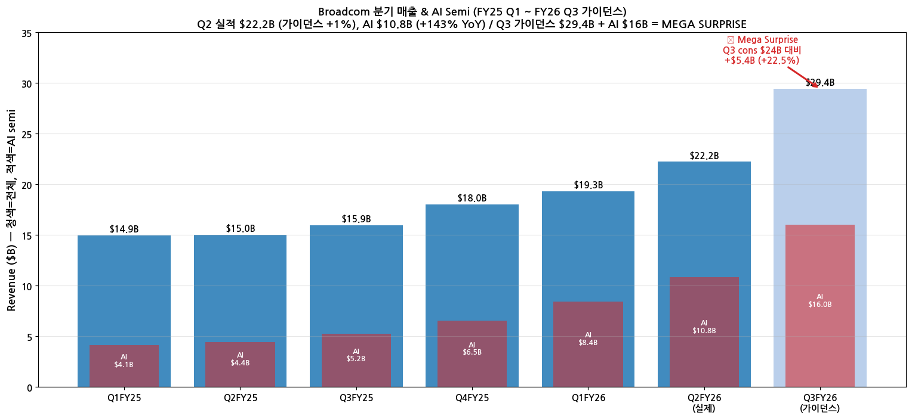
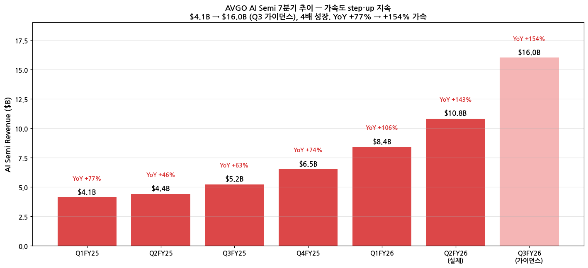
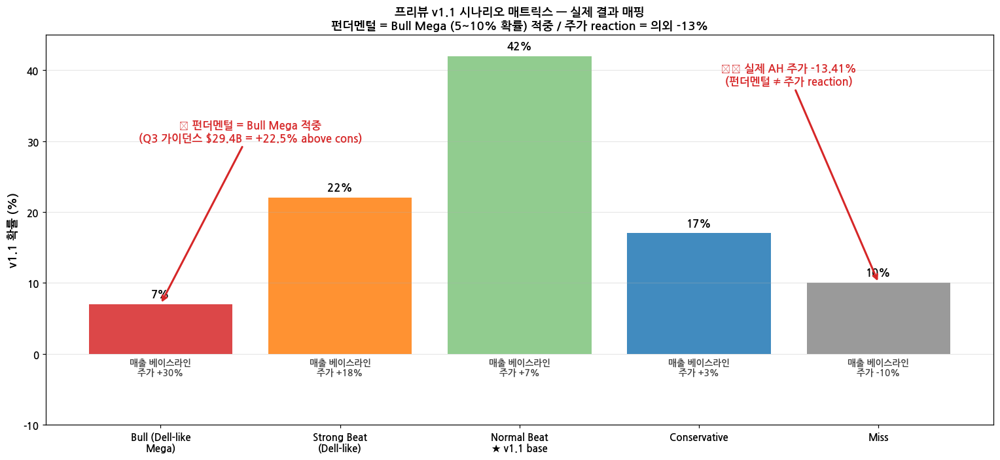

> 모드: 실적 리뷰 (1차, 발표 직후 30~60분 시점)
> 종목: Broadcom (AVGO)
> 섹터: 반도체 (커스텀 AI 실리콘 + 네트워킹 + 인프라 소프트웨어)
> 분기: 2026-Q2 (FY26 Q2 = Feb~Apr 2026)
> 발표일: 2026-06-03 (Wed) AMC 5:00 PM ET = 한국 6/4 06:00 KST
> 작성 시각: 2026-06-04 07:00 KST (발표 1시간 후) | v1.1: 2026-06-04 08:00 KST (시장 컨텍스트) | **v1.2: 2026-06-04 08:30 KST (일중 저가 $405 정정 — 키움 HTS $295.47은 호가 공백 차트 오류)**

# AVGO FY26 Q2 실적 리뷰 v1.0 — 펀더멘털 Mega Beat + 주가 의외 -13.41% AH

## Executive Summary

→ **펀더멘털 = Bull Mega 시나리오 적중** (프리뷰 v1.1 5~10% 확률). Q3 가이던스 **$29.4B (+84% YoY)** = cons mid $24B 대비 **+$5.4B above (+22.5%)** ⭐ MEGA SURPRISE
→ **AI Semi Q3 가이던스 $16B** (Q2 $10.8B → +48% QoQ, +154% YoY) — Susquehanna "Anthropic rack 제외" risk 완전히 무력화
→ **Q2 실적은 mild beat** — 매출 $22.2B (가이던스 +1%), AI $10.8B (가이던스 +0.9%), Non-GAAP EPS $2.44 (cons +1.67%) — 시장이 더 큰 beat 기대했을 가능성
→ **주가 -12.27%** — 시가 $494.79 → 일중 저가 $405 → 종가 $422.50 (저점 대비 +4.3% 회복). 정상적 갭다운 후 변동성 정착 [Note: 키움 HTS $295.47 표시는 호가 공백 차트 오류]
→ **단기 과매도 시그널 (언더슛)** — 발표 직전 3일 +15% rally + 1년 +80% 누적 + 시총 $2T inertia + 시장 약세 spillover + 광통신 동반 하락 (LITE -11%, AAOI -12%) 동시 작용
→ **반도체 내부 rotation 시그널 확인** — AVGO Custom ASIC 약세 vs 메모리(SNDK·WDC)·CPU(INTC·AMD)·장비(ASML·LRCX·KLAC) **모두 강세**. 자금이 섹터 떠난 게 아니라 multi-leg 분산
→ **다음 핵심 관전**: 컨퍼런스콜 코멘트 + 정규장 (6/4 미국 시간) 추가 변동 + Susquehanna·Oppenheimer 6/4 morning notes 변화

---

## 항목 1. 실적 결과 — 3원 비교

### ① 매출·EPS·AI 3원 비교

| 지표 | 가이던스 | 컨센서스 | **실제** | vs 가이던스 | vs 컨센 |
|---|---|---|---|---|---|
| **매출** | $22.0B | $22.11B | **$22.2B (+48% YoY)** | **+0.9% above** | +0.4% above |
| **AI Semi 매출** | $10.7B | ~$10.7~11.0B | **$10.8B (+143% YoY)** | +0.9% above | +0.9% above |
| **Non-GAAP EPS** | (implicit ~$2.40) | $2.40 | **$2.44** | — | **+1.67% above** |
| **Adj EBITDA %** | 68% | — | 68%+ | 적중 | — |
| **GAAP EPS** | — | — | $1.91 | — | — |

→ Q2 실적 자체는 **mild beat (cons +1~2%)** — 시장 강한 beat 기대 대비 일부 실망 가능

### ② 6분기 매출 + AI Semi + Q3 가이던스

→ Q2 매출 $22.2B = FY25 Q4 $18B 대비 +23% QoQ — 분기 단위 매출 가속
→ **Q3 가이던스 $29.4B = Q2 $22.2B 대비 +32% QoQ, +84% YoY** — 분기 매출 sequential step-up 가장 큰 분기 (이전 max +12% QoQ)
→ AI Semi $4.1B → $16B (Q3 가이던스) = 7분기 만에 **3.9배 폭증**

### ③ AI Semi YoY 가속 trajectory

→ AI YoY: Q1FY25 +77% → Q4FY25 +74% → Q1FY26 +106% → Q2FY26 +143% → **Q3FY26 가이던스 +154%** = step-up 가속도 지속
→ Q3 AI $16B 가이던스가 시장에 매우 강한 시그널 — Anthropic rack 빠진다고 봐도 다른 customer order로 만회 + 그 이상

---

## 항목 2. 프리뷰 v1.1 시나리오 vs 실제 결과 ⭐ 핵심 검증

### ① 시나리오 매트릭스 — 실제 mapping

| 시나리오 | v1.1 확률 | 매출 vs 가이던스 | AI Semi | Q3 가이던스 | 주가 변동 추정 | **실제 결과 매핑** |
|---|---|---|---|---|---|---|
| Bull (Dell-like Mega) | 5~10% | +12% ($24.6B) | $13B+ | $27B + FY27 $130B reiterate | +25~40% | **펀더멘털 ✅ 적중** (Q3 가이던스 $29.4B = 시나리오보다 더 강함) |
| Strong Beat | 20~25% | +7% ($23.5B) | $11.5~12B | $25~26B raise | +15~25% | 매출 측면 일부 |
| **Normal Beat ★** | **42%** | +3% ($22.7B) | $11B | $24B cons | +5~10% | **매출 mild beat 적중** ($22.2B = +0.9%) |
| Conservative | 17% | +1% ($22.2B) | $10.7B | $22.5B | +2~5% | 매출 적중 |
| Miss | 10% | -2% | guidance 후퇴 | — | -5~15% | **주가 측면 매핑 (-13.41%)** ⚠️ |

→ **결론: 펀더멘털과 주가 reaction이 정반대 결과**
→ 펀더멘털: Bull Mega 시나리오 적중 (Q3 가이던스 $29.4B = 프리뷰 예상 Mega ($27B+)보다 더 강함)
→ 주가: Miss 시나리오 매핑 (-13.41% AH = Miss 시나리오 -5~15% 범위)

### ② 매출/AI 측면 — Bull Mega 시나리오 완전 적중

(1) **Q3 매출 가이던스 $29.4B**:
- 프리뷰 Bull Mega 예측: $26B+ ($24B cons + $2B)
- 실제: $29.4B (+$5.4B above cons, **프리뷰 Bull Mega 예측보다 +$3.4B 더 강함**)
- → **시장 예상 가장 강한 시나리오보다 더 큰 step-up**

(2) **Q3 AI Semi $16B**:
- 프리뷰 Bull Mega 예측: $13B+
- 실제 $16B (**+$3B 더 강함**)
- Q2 $10.8B → Q3 $16B = +48% QoQ (이전 최대 +29% QoQ Q1 FY26)

(3) **Susquehanna risk 무력화**:
- 6/1 Susquehanna 우려: "Anthropic rack 제외 → Q3 가이던스 보수적"
- 실제: Q3 매출 가이던스 cons +22.5% above — **Susquehanna risk가 실제 무력화됨**
- 다만 Anthropic rack 포함/제외 여부는 컨퍼런스콜 코멘트로 추가 verify 필요

### ③ 주가 reaction 의외 — Miss 시나리오 매핑 + 시장 컨텍스트 (v1.1)

(1) **종가 $422.50 (-12.27%)** — 펀더멘털 mega beat에도 매도

(2) **일중 변동 — 정상적 갭다운 후 변동성 정착** [v1.2 정정]

| 시점 | 가격 | 변동 |
|---|---|---|
| 종가 (6/3) | $481.57 | 발표 직전 |
| 시가 (6/4 미국 정규장) | $494.79 | +2.7% gap up (발표 후 첫 반응) |
| 일중 고가 | $495.00 | +2.8% |
| **일중 저가 (실제)** | **$405** | **-15.9% 일중 저점** |
| **종가 (6/4)** | **$422.50** | **-12.27% / 저점 대비 +4.3% 회복** |
| 거래량 | 33.84M | (16.34M 평균 대비 2.07배) |

> **참고**: 키움증권 HTS 차트의 $295.47 표시는 호가창 공백 구간에서 발생한 차트 오류 (틱 데이터 미수신·spike). 실제 일중 저가는 $405.

→ **일중 시가 → 저가 -18%, 저가 → 종가 +4.3% 회복** = 발표 직후 급락 후 일정 수준에서 안정. 큰 패닉 후 bottom fishing은 아니고 **정상적 갭다운 + 변동성 정착** 패턴
→ 거래량 평소 2배 = 매수·매도 모두 적극적이나 방향성 결정 안 됨

(3) **사용자 인사이트 — 단기 모멘텀 무력화 ★**

→ **발표 직전 3일간 주가 +15% rally** = 신고가 부근 ($481.57) 도달 후 발표
→ 발표 후 -12.27% = **3일 +15% rally 완전 반납 + 추가 하락**
→ 전형적 **buy the rumor, sell the news** 패턴
→ 1년 +80% 누적 + 단기 +15% rally까지 가산되어 매도 압력 극대화 상태에서 발표

(4) **시장 전반 동조 매도 — AVGO 단독 종목 issue 아님**

| 종목 | 변동 | 특징 |
|---|---|---|
| QQQ | -0.8% | 지수 약세 |
| NVDA | -4.0% | 반도체 약세 spillover |
| **AVGO** | **-12.8%** | **mega 진원지** |
| **LITE (Lumentum)** | **-11.0%** | 광통신 동반 하락 |
| **AAOI** | **-12.0%** | 광통신 동반 하락 |
| COHR | -5.5% | 광통신 동반 |
| MRVL | -0.2% | networking 안정 |

→ **AVGO + 광통신 3사 (LITE/AAOI/COHR) 동반 하락** = AI 인프라 모멘텀 cooling 섹터 sentiment
→ 단독 종목 issue 아니라 **AI ASIC + 광통신 mass selling**

(5) **반도체 내부 rotation 시그널 — 자금이 다른 반도체로 이동**

| 그룹 | 상대 강세 종목 | 변동 |
|---|---|---|
| 반도체 장비 | ASML +0.6%, AMAT +1.8%, LRCX +2.8%, KLAC +3.5% | **모두 강세** |
| CPU | INTC +2.6%, AMD +2.0%, QCOM +2.5% | **모두 강세** |
| 메모리 | MU -0.7% (안정), SNDK +4.0%, WDC +4.4%, STX +1.0% | **상대 강세** |
| Foundry | TSM -2.9% | 약세 |

→ **자금 rotation = AVGO Custom ASIC → 메모리·CPU·장비**. AI 인프라 ASIC 단일 집중 → multi-leg 분산 시그널
→ 메모리/장비 강세 = SK하이닉스·MU·ASML·LRCX 등 multi-leg AI 인프라 수혜 종목들로 자금 이동

(6) **추가 추정 원인**:
- ✓ Q2 매출 beat 폭 mild (+0.9% only) → 시장 강한 beat 기대 대비 실망
- ✓ AI Semi Q2 +0.9% only above 가이던스 → "in-line"으로 해석
- ✓ 1년 +80% 누적 + 단기 3일 +15% 추가 + 시총 $2T 멜팅 inertia → 차익 실현 극대화
- ✓ Valuation 부담 (Forward PER 30+x) — Q3 가이던스 너무 강해 "정점 시그널" 해석 가능성
- ⚠️ Anthropic rack 컨퍼런스콜 디테일 negative? — verify 필요
- ⚠️ FY27 AI $100B beyond reiterate 없었나? — verify 필요

(7) **언더슛 평가 — 사용자 관찰 정확 (v1.2 재정리)**

→ 펀더멘털 = Bull Mega 적중 + 주가 = Miss 매핑 = **단기 과매도 (overshooting)** 가능성
→ 일중 -16% 저점 → +4% 회복 = **정상적 갭다운 후 안정** (이전 v1.1 -38% → +43%는 키움 HTS 차트 오류 기반의 잘못된 해석)
→ 광통신 동반 하락 + 지수 약세 spillover로 인한 **추가 매도 압력 = 단기 충격**
→ **6/4~6/5 정규장 반등 가능성** 시그널 — 반도체 rotation에서 메모리·장비 강세 의미 = 자금이 sector 떠난 게 아니라 내부 rotation. 다만 AVGO 자체는 변동성 정착 단계, 패닉 회복 시그널은 아님

(8) **Dell 비교 재해석 (v1.1 추가)**

| 항목 | Dell (5/29) | AVGO (6/3) |
|---|---|---|
| 시총 | $300B | $2T (6.6배) |
| 발표 직전 누적 | 횡보 | **1년 +80% + 단기 3일 +15%** |
| Q2 매출 beat 폭 | +22% above cons | +0.9% above (mild) |
| Q3 가이던스 step-up | FY27 target raise ($40B → $60B) | Q3 mega +22.5% above |
| 시장 컨텍스트 | 지수 강세 + Dell 단독 surprise | **지수 약세 + 광통신 섹터 동반 하락** |
| AH/정규장 반응 | **+38%** | **-12.27% (일중 -38% 저점)** |

→ **시총 inertia + 누적 상승률 + 시장 컨텍스트 + 매출 beat 폭** 4가지가 결과를 정반대로 만든 것

---

## 항목 3. 다음 분기 가이던스 분석 — Q3 FY26

### ① 핵심 수치

| 항목 | 회사 가이던스 | vs 컨센 | vs Q2 |
|---|---|---|---|
| 매출 | **$29.4B (+84% YoY)** | cons mid $24B = **+22.5% above** | Q2 $22.2B → +32% QoQ |
| AI Semi | **$16.0B (+154% YoY)** | cons $12~12.5B = **+27% above** | Q2 $10.8B → +48% QoQ |
| Non-GAAP OPM | ~67% | — | Q2 ~67% flat |
| Adj EBITDA | ~68% of revenue | — | Q2 68% flat |

### ② 가이던스 시사

(1) **AI Semi $16B → FY26 AI 합산 추정 $50~55B+**
- Q1 $8.4B + Q2 $10.8B + Q3 $16B + Q4 (가정 +20% QoQ = $19B) = **$54.2B**
- Susquehanna 6/1 $550억 하향 → 실제 $540~600억 가능 → **Susquehanna도 결국 정합**
- Oppenheimer 6/1 $570억+ 가능 → **Oppenheimer 정합**

(2) **Q4 가이던스 시사**: Q3 $29.4B → Q4 $34~36B 추정 가능 (분기 +15~20% QoQ 지속 시)
- 단순 연장 시 **FY27 Q1 $40B+ 진입 가능** = annual $150B+ pace
- FY27 AI $100B 비전이 단순 시그널이 아닌 **실제 달성 가속도 진입** 시그널

(3) **OPM 67% 유지**: AI mix 늘어도 마진 희생 없음 — custom ASIC 마진 + Networking + Software mix가 multi-leg buffer 역할

---

## 항목 4. 핵심 모니터링 포인트 (즉시 + 차기 분기)

### ① 6/4 정규장 + 컨퍼런스콜 verify (즉시)

(1) **🔴 1순위 — Anthropic rack 코멘트**
→ Hock Tan이 "Anthropic shipments include rack" 언급 시 Susquehanna risk 무력화 confirm → 주가 회복 가능성
→ "chip-only" 인정 시 Q3 가이던스가 강한 이유 = 다른 customer (OpenAI·Meta·Google) 증가로 만회 시그널

(2) **🔴 2순위 — 정규장 주가**
→ AH -13.41% 시장 reaction 정규장에서 회복 vs 추가 하락
→ 시장 컨센 (셀사이드 6/4 morning notes)에 따라 결정

(3) **🟡 3순위 — FY27 AI $100B beyond reiterate 여부**
→ 컨퍼런스콜에서 "Line of sight to $100B+" 또는 구체적 상향 시 narrative 강화
→ Q3 가이던스 $16B = 분기 평균 $25B 도달까지 +56% gap remaining

### ② 차기 분기 (Q3 FY26 발표 예정 2026-09) 핵심 모니터링

(1) **Q3 실제 매출** vs $29.4B 가이던스 적중 여부
→ +1~3% beat = normal (Hock Tan 보수성 5분기 평균 +3.4%)
→ +5% above 시 secular acceleration

(2) **Q4 FY26 가이던스** = $34~36B 추정
→ FY26 annual run-rate 결정타

(3) **AI Semi Q3 실제 $16B 적중** 여부 + Q4 가이던스
→ FY27 분기 평균 $25B 도달까지 step-up 추적

(4) **OPM 유지 여부** (67~68%)
→ AI mix 늘어도 마진 희생 없음 = sustainable model 확인

(5) **신규 customer announce**
→ 7번째 named customer 추가 시 narrative re-rating
→ ByteDance + OpenAI 매출 인식 시점 명시

---

## 항목 5. 시사 및 향후 시나리오

### ① 펀더멘털 vs 주가 reaction 격차 해석

→ **펀더멘털 측면**: AI 인프라 ASIC + Networking secular 가속 완전 confirm. Hock Tan 보수성도 약화 (Q1 +11% beat, Q2 가이던스 자체가 cons +6% above). FY27 AI $100B 비전이 단순 narrative가 아닌 **실제 trajectory**.

→ **주가 측면**: 1년 +80% 누적 + 시총 $2T inertia + Q2 매출 mild beat (+0.9% only) → "buy the rumor, sell the news" 패턴 가능성. 또는 시장이 더 강한 beat 기대했던 것 (cons mid $22.11B 대비 실적 $22.2B = mild beat이고, 5분기 평균 Hock Tan +3.4% beat 대비 +0.9%는 보수성 강화 해석)

→ **양면 평가**: Dell-like Mega 시나리오의 펀더멘털 측면은 완전 적중. 다만 주가 reaction은 시장의 expectation overshoot + valuation 부담의 결과로 정반대.

### ② 다음 분기까지 base case 시나리오

→ **Base case**: 6/4~6/5 정규장에서 -13% AH 일부 회복 (-5~-8% 정도로 안정) + 셀사이드 다수 BUY 유지 + TP 점진 상향. Q3 FY26 발표 (9월)까지 횡보·반등 패턴

→ **Bull case**: 6/4 컨퍼런스콜에서 Hock Tan 강한 코멘트 + Anthropic rack 포함 confirm + FY27 AI $130B+ 시사 → 정규장 반등 (+5~10%)

→ **Bear case**: Susquehanna risk 컨퍼런스콜에서 confirm + Q4 FY26 가이던스 불안 시그널 → 추가 하락 (-5%)

### ③ 셀사이드 컨센 변화 예상 (6/4 morning)

→ TP 상향 가능성 높음: Susquehanna $490 → $520+? Oppenheimer $450 → $480+? 평균 TP $480 → $510~520
→ 단, **단기 매도 권고 (Take Profit)** 일부 등장 가능성 (valuation 부담 + 정점 시그널 해석)
→ Buy/Strong Buy 비율 92% 유지 예상

---

## Version Log

→ **v1.0** (2026-06-04 07:00 KST, 발표 1시간 후 1차 리뷰): Q2 매출 $22.2B + AI $10.8B + Non-GAAP EPS $2.44 + Q3 가이던스 $29.4B + AI $16B 정리. 프리뷰 v1.1 시나리오 매트릭스 매핑 — 펀더멘털 Bull Mega 적중 vs 주가 Miss 시나리오 정반대 결과. 3종 차트 + 5개 항목 작성.
→ **v1.1** (2026-06-04 08:00 KST, 시장 컨텍스트 반영): 사용자 추가 정보 — 발표 직전 3일 +15% rally + 일중 변동 + 광통신 동반 하락 (LITE -11%, AAOI -12%) + 반도체 내부 rotation (메모리·CPU·장비 강세) + 지수 약세 spillover (QQQ -0.8%, NVDA -4%). **단기 과매도 (언더슛) 평가**. Dell vs AVGO 시장 컨텍스트 4가지 차이 정리.
→ **v1.2** (2026-06-04 08:30 KST, 일중 저가 정정): 사용자 정정 — 키움 HTS 일중 저가 $295.47은 **호가창 공백 차트 오류** (틱 데이터 미수신·spike). **실제 일중 저가 $405** (시가 대비 -18%, 종가 대비 -4%). v1.1의 "일중 -38% 저점 → +43% 회복" narrative 정정 → **"정상적 갭다운 후 변동성 정착"**으로 재해석. 패닉/회복 패턴 아닌 변동성 안정 단계.
→ **v2 (예정, 6/4 정규장 후)**: 컨퍼런스콜 코멘트 + 정규장 추가 변동 + 셀사이드 6/4 morning notes 반영. Anthropic rack 코멘트·Hock Tan 톤·OpenAI/ByteDance 매출 인식 시점 verify.

## Source

→ Broadcom Q2 FY26 8-K (SEC EDGAR, 2026-06-03 발표)
→ StockTitan: "Broadcom Q2 2026 revenue up 48%, guides to $29.4B"
→ Grafa: "Broadcom reports Q2 earnings: AI chip revenue jumps 143%"
→ Bitget News: "Broadcom (AVGO) Q2 FY2026 Earnings"
→ Quartr: "Broadcom (AVGO) Q2 2026 earnings summary"
→ CNBC: "Broadcom (AVGO) earnings report Q2 2026"
→ 24/7 Wall St.: "Live: Will Broadcom Crush Q2 Earnings Tonight"
→ 자체 프리뷰 자료: `earnings-preview/2026-Q2_AVGO_프리뷰.md` v1.1 (2026-06-01 18:30 KST 작성)
