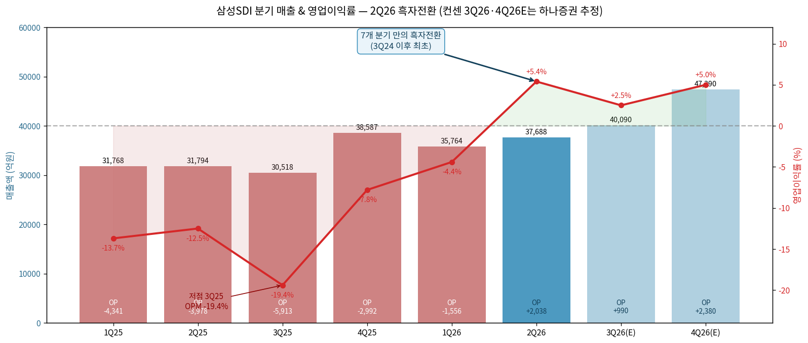
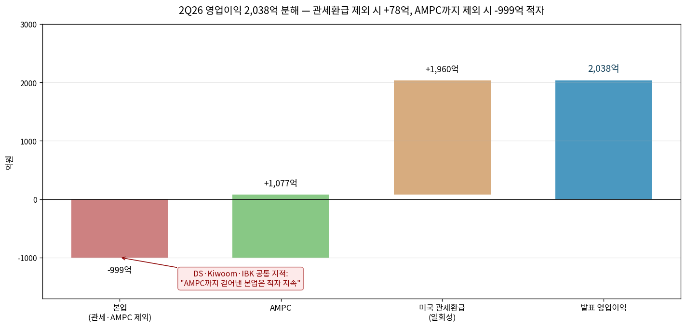
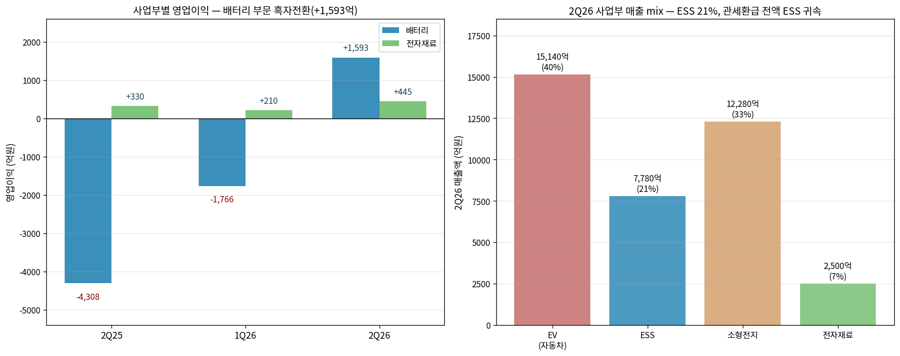
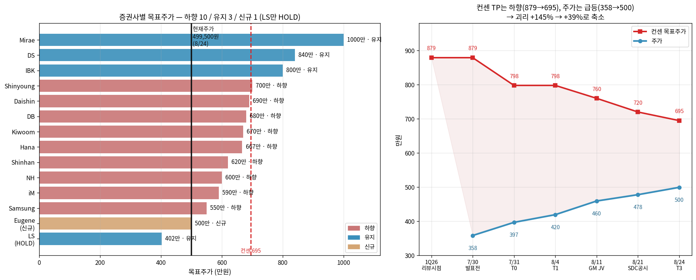
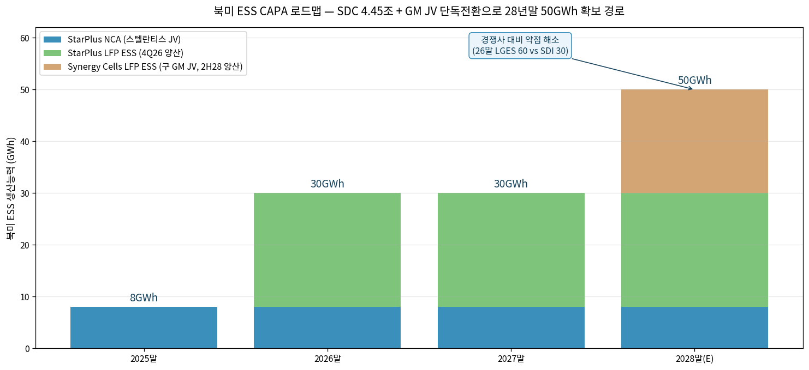
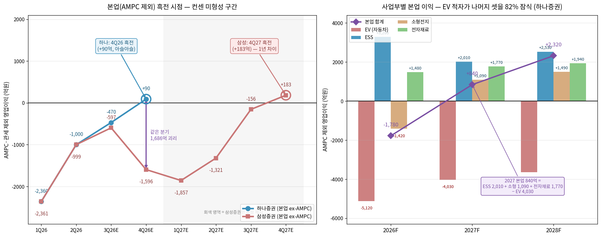

# 삼성SDI 2Q26 실적 리뷰

> 모드: 실적 리뷰
> 종목: 삼성SDI (006400)
> 섹터: 배터리
> 분기: 2026-Q2
> 발표일: 2026-07-30
> 작성 시각: 2026-08-24 16:00 KST
> 분석 소스: 회사 IR + 증권사 21개 리포트 (7/31~8/24, 4개 시점) + Notion ESS 모멘텀 정리

---

## Executive Summary

→ **7개 분기 만의 흑자전환 — 컨센 -273억 vs 실적 +2,038억**: 매출 37,688억(QoQ +5.4%, YoY +18.5%), 영업이익 2,038억(OPM 5.4%). 3Q24 이후 첫 흑자. 상반기 누적 매출 73,452억·영업이익 482억으로 반기 흑자 달성

→ **단, 일회성 해부가 핵심 — 관세환급 1,960억 제외 시 +78억, AMPC 1,077억까지 제외 시 -999억 적자**: 미국 상호관세 위법판결 환급금이 전액 ESS 부문에 귀속. "일회성 제외해도 흑자"라는 다수 표현은 AMPC 포함 기준이며, DS·LS는 "본업은 여전히 적자"로 명확히 구분

→ **애널 톤의 역설 — 실적 Big Beat인데 목표주가는 10개사 하향**: 14개사 중 하향 10 / 유지 3(IBK 800k·DS 840k·Mirae 1,000k) / 신규 1(Eugene 500k). LS는 유일 HOLD(402k). 컨센 TP 1Q26 879,000원 → 7/31 797,783원 → 8/24 **694,842원**으로 2단계 하향

→ **반면 연간 실적 추정은 대폭 상향 — 2026 OP 컨센 855억 → 애널 평균 약 4,120억**: TP 하향과 실적 상향이 동시 발생. TP 하향은 peer 멀티플 하락·밸류 기준시점 변경·주가 급락 반영이며, 실적 상향은 ESS·AMPC 때문. **밸류에이션 리셋과 펀더멘털 개선이 반대 방향으로 작동한 분기**

→ **주가는 오히려 +39% — 괴리 급속 축소**: 7/30 358,500원 → 8/24 499,500원. 컨센 TP 대비 상승여력이 1Q26 시점 +145%에서 현재 +39%로 축소. 시장이 TP 하향보다 ESS 전환 스토리를 먼저 반영

→ **8월 두 공시가 리뷰의 무게중심을 이동 — GM JV 단독전환(8/11) + SDC 지분 5% 4.45조 매각(8/21)**: 실적 자체보다 자본배분 결정이 더 큰 재평가 트리거. 북미 ESS CAPA 26년말 30GWh → 28년말 50GWh+ 경로 확보. NH "악재가 아닌 호재", Hana "완벽한 오해"로 시장 오해를 정면 반박

→ **직전 팔로업 5개 키워드 중 4개 적중·1개 초과 달성**: "4Q26 분기 흑전" 예상을 **두 분기 앞당겨 2Q26 흑전**, "SDC 매각 연내"는 8/21 공시로 **정확히 적중**. 미검증은 "헝가리 가동률 65%↑" 1건

---

## ① 2Q26 실적 결과 — 컨센 대비 방향 자체가 반전

### (1) 컨센서스 vs 직전분기 vs 전년동기 (한국 3축 비교)

| 항목 | 2Q25 | 1Q26 | **2Q26** | QoQ | YoY | FnGuide 컨센 | 결과 |
|---|---|---|---|---|---|---|---|
| 매출액 (억원) | 31,794 | 35,764 | **37,688** | +5.4% | +18.5% | 36,660 | +2.8% 상회 |
| 매출총이익 | 2,807 | 5,848 | **9,373** | +60.3% | +234% | - | - |
| GPM (%) | 8.8 | 16.4 | **24.9** | +8.5%p | +16.1%p | - | - |
| 영업이익 | -3,978 | -1,556 | **+2,038** | 흑전 | 흑전 | **-273** | **방향 반전** |
| OPM (%) | -12.5 | -4.4 | **+5.4** | +9.8%p | +17.9%p | -0.7 | +6.1%p |
| 영업외손익 | 569 | 1,122 | **2,754** | +145% | +384% | - | - |
| ㄴ 지분법손익 | 1,281 | 1,146 | **4,018** | +251% | +214% | - | - |
| 세전이익 | -3,410 | -434 | **+4,792** | 흑전 | 흑전 | - | - |
| 당기순이익 | -1,667 | 561 | **4,716** | +740.5% | 흑전 | - | - |
| 지배주주순이익 | -1,525 | -281 | **3,422** | 흑전 | 흑전 | - | - |
| EBITDA | 1,144 | 4,280 | **8,029** | +87.6% | +601.8% | - | - |

→ (출처: 삼성SDI IR p.3·7 / FnGuide 컨센 / 21개 증권사 리뷰)

(1-1) 서프라이즈의 성격 — 폭이 아니라 **방향**
→ 컨센이 적자(-273억)였으므로 서프라이즈 % 계산이 무의미. **적자 예상 → 흑자 실현**으로 부호가 바뀐 분기
→ 컨센 인용치는 기관별 차이 존재: FnGuide -273억(다수), Daishin -26억(1M 기준), Shinyoung -449억
→ 7개 분기 만의 흑자 (직전 흑자는 3Q24)

(1-2) GPM 24.9% — 1Q26 16.4% 대비 +8.5%p
→ 관세환급이 매출원가 차감으로 인식되며 GPM을 크게 밀어올림
→ 정상화 GPM은 18~19% 수준으로 추정 (환급 1,960억 역산)

(1-3) 지분법손익 4,018억 — 영업이익의 2배
→ 삼성디스플레이(SDC) 관계기업 지분가치 증가 반영 (DS증권 지적)
→ 2025년 연간 지분법이익 8,382억 → 2Q26 단일 분기 4,018억으로 집중
→ **단 SDC 5% 매각 후 연 2,500억 감소 예상** (DB증권) — ④·⑤에서 상술

→ (출처: 회사 IR Appendix p.7 + 하나증권 3Q26·4Q26 추정)

### (2) 영업이익 2,038억 분해 — **리뷰의 가장 중요한 표**

| 구분 | 금액 (억원) | 성격 | 지속성 |
|---|---|---|---|
| 미국 상호관세 환급 | **+1,960** | 일회성 (전액 ESS 귀속) | 3Q26 이후 소멸 |
| AMPC (생산세액공제) | **+1,077** | 정책 보조금 | 2030년 이후 소멸 |
| **본업 (관세·AMPC 제외)** | **-999** | 순수 영업 | 적자 지속 |
| **발표 영업이익** | **+2,038** | - | - |
| 관세만 제외 시 | +78 | 소폭 흑자 | - |

→ (출처: DS증권 8/3 "환급 제외 영업이익 80억, AMPC까지 걷어낸 본업은 적자 지속" / Samsung·IBK "AMPC 1,077억" / DS "환급 1,960억 전액 ESS 귀속")

(2-1) 관세환급 규모 추정치 스펙트럼 — 증권사별 표현 차이
→ DS **1,960억** (가장 구체적) / Kiwoom·IBK·Shinyoung·LS "약 2,000억" / iM "약 1,900억" / NH "2,000억 미만" / Samsung "1,000억 후반대"
→ 회사가 정확한 금액을 공식 공개하지 않아 추정 편차 발생. 실질적으로 1,900~2,000억 수준 컨센

(2-2) "일회성 제외해도 흑자"라는 표현의 함정
→ **다수 증권사(Hana·NH·Shinhan·iM·Daishin·IBK)**: "관세환급 제외해도 소폭 흑자" — AMPC 포함 기준
→ **DS·LS**: "AMPC까지 제외하면 본업 적자" — 더 보수적 기준
→ 같은 실적을 두고 해석이 갈린 지점이며, 이 차이가 3Q26 추정치 분산(526억~1,989억)으로 직결

(2-3) Hana증권의 3단계 분해 (가장 정밀)
→ AMPC 포함 OPM 5.4% / AMPC 제외 2.5% / **관세환급까지 제외 -2.9%**
→ 1Q26 대비 개선폭: AMPC 포함 +9.8%p / AMPC 제외 +9.1%p / 둘 다 제외 +3.7%p
→ 즉 순수 본업 개선은 +3.7%p로, 헤드라인 +9.8%p의 38% 수준

→ (출처: DS증권 8/3, 하나증권 7/31, IBK·삼성증권 AMPC 수치)

### (3) 사업부별 실적 — 배터리 부문 흑자전환

| 사업부 | 2Q25 | 1Q26 | **2Q26** | QoQ | YoY |
|---|---|---|---|---|---|
| **배터리 매출** | 29,612 | 33,544 | **35,190** | +4.9% | +18.8% |
| **전자재료 매출** | 2,182 | 2,220 | **2,498** | +12.5% | +14.5% |
| **배터리 OP** | -4,308 | -1,766 | **+1,593** | 흑전 | 흑전 |
| ㄴ 배터리 OPM | -14.5% | -5.3% | **+4.5%** | +9.8%p | +19.0%p |
| **전자재료 OP** | 330 | 210 | **445** | +112% | +34.8% |
| ㄴ 전자재료 OPM | 15.1% | 9.5% | **17.8%** | +8.3%p | +2.7%p |
| **전사 OP** | -3,978 | -1,556 | **+2,038** | 흑전 | 흑전 |

→ (출처: 회사 IR p.4)

(3-1) 배터리 세부 mix (2Q26, 하나·대신 추정 종합)

| 세그먼트 | 매출 (억원) | 비중 | QoQ | 수익성 코멘트 |
|---|---|---|---|---|
| **EV (자동차)** | 약 15,140 | 40% | +7~10% | AMPC 포함 OPM -2.5%, 제외 -8.2% (Hana). AMPC 1,077억 중 **약 80%가 EV 귀속** (Shinyoung) |
| **ESS** | 약 7,780 | 21% | **-8~-12%** | 관세환급 포함 OPM 30~34.8%. 국내 프로젝트 3Q 이연 |
| **소형전지** | 약 12,280 | 33% | +10~12% | mid single 적자 지속, 적자폭 축소. BBU 수익성 low teen (DB) |
| **전자재료** | 2,498 | 7% | +12.5% | OPM 17.8%. 폴더블 OLED 소재 + 반도체 소재 |

→ (출처: 하나증권 도표1, 대신증권 "EV 1.5조(43%)/ESS 8,094억(23%)/소형 1.2조(34%)", DB·Shinyoung 세부)

(3-2) EV — 매출은 늘었지만 구조는 취약
→ 증가 원인: **미국 스텔란티스 JV(StarPlus) 라인을 유럽 수출용으로 일시 전용** (전 증권사 공통 지적)
→ 유럽 현대·기아 볼륨 모델(아이오닉3, EV2) P6 하이니켈 출하 시작
→ **우려**: 주력 고객 BMW·VW향 출하량은 점유율 하락으로 감소 지속 (iM·DB·Kiwoom·Shinyoung 공통)
→ 스텔란티스 유럽 수출 프로젝트는 3Q26 종료 → EV 매출 QoQ -8~-11% 역성장 전망

(3-3) ESS — 매출은 감소, 수익성은 급등
→ 국내 중앙계약시장 프로젝트 납기가 3Q26으로 이연되며 매출 -8~-12% QoQ
→ 그런데 관세환급 전액이 ESS에 귀속되어 부문 OPM 30%+ (IBK 34.8%)
→ 즉 **ESS의 2Q26 수익성은 실체가 아님**. 3Q26 이후 정상 수익성 검증 필요

(3-4) 소형전지 — 가장 견조한 개선 축
→ BBU(Battery Backup Unit, AI 데이터센터용) + 탭리스 파워툴 수요 호조
→ 매출 +10~12% QoQ, 적자폭 축소 (Hana OPM -6.0%, 1Q26 -9.5% 대비 +3.5%p)
→ **3Q26 흑자전환 전망** (Samsung·DB·iM·DS 공통) — 2년 만
→ 과거 공급과잉 국면 수주 물량(전동공구·e-bike)의 수익성 부담은 잔존 (iM)

→ (출처: 회사 IR p.4 + 하나·대신·DB 세그먼트 추정)

### (4) 재무 상태 — SDC 매각 전 기준

| 항목 (억원) | 2Q25말 | 1Q26말 | **2Q26말** | QoQ | YoY |
|---|---|---|---|---|---|
| 자산총계 | 414,369 | 445,063 | **476,219** | +31,156 | +61,850 |
| 현금성자산 | 21,544 | 17,377 | **15,055** | -2,322 | -6,489 |
| 재고자산 | 25,831 | 33,001 | **36,755** | +3,754 | +10,924 |
| 투자자산 | 103,730 | 122,034 | **141,053** | +19,019 | +37,323 |
| 유·무형자산 | 187,240 | 205,916 | **208,421** | +2,505 | +21,181 |
| 부채총계 | 187,583 | 195,964 | **207,857** | +11,893 | +20,274 |
| ㄴ 유동부채 | 96,021 | 103,050 | **126,498** | +23,448 | +30,477 |
| ㄴ 비유동부채 | 91,562 | 92,913 | **81,359** | -11,554 | -10,203 |
| 자본총계 | 226,786 | 249,099 | **268,362** | +19,263 | +41,576 |
| 차입금 | 114,182 | 116,537 | **121,109** | +4,572 | +6,927 |
| **부채비율** | 82.7% | 78.7% | **77.5%** | -1.2%p | -5.2%p |

→ (출처: 회사 IR p.3·8)

(4-1) 부채비율 77.5% — 셀 3사 중 최우수 유지
→ LGES 140%대 대비 구조적 우위 (1Q26 리뷰 대비 논리 유지)
→ 자본 +19,263억 QoQ 증가는 순이익 4,716억 + 기타포괄이익(SDC 지분 평가) 기여

(4-2) 유동부채 +23,448억 / 비유동부채 -11,554억 — 만기 재분류
→ 1년 내 만기 도래 차입금의 유동성 재분류로 추정
→ 유동비율 하락 요인이지만 SDC 4.45조 유입(8/27)으로 해소 예상

(4-3) 투자자산 141,053억 (+19,019억 QoQ)
→ SDC 지분 평가가치 상승 반영. 2Q26말 SDC 지분 15.2% 장부가 **13.8조원** (DB증권)
→ 이번 5% 매각가 4.45조원은 주당 34만원 → **지분 100% 환산 시 약 89조원 가치**
→ 장부가 수준에서 거래 성립 → **잔여 10.2% 지분(약 9.1조)의 재평가 근거 확보** (DB·Samsung)

---

## ② 경영진 코멘터리 & 하반기 전략 (컨퍼런스콜 기반)

### (1) 회사 공식 메시지 (IR p.5)

→ "분기별 실적 개선 지속으로 **상반기 누적 흑자 달성**" (매출 73,452억, 영업이익 482억)
→ "현지생산 각형배터리 경쟁력 활용 **ESS/EV 수주 확대**"
→ "미래성장동력 확보를 위한 **신규 Apps/고객 다변화**"

### (2) 2Q26 주요 성과 (IR p.5, 1Q26 대비 진척)

→ 전력용ESS·AI Data Center용 BBU 등 **미국 ESS 프로젝트 수주 확대**
→ **Mercedes Benz 공급계약 체결** (1Q26 언급 → 2Q26 체결 완료)
→ **피지컬AI용 전고체배터리 공개**
→ 신규 메모리업체 반도체 패키징 소재 진입
→ 리튬메탈배터리 성능 개선 솔루션 도출
→ Non-PFE LFP 소재 공급망 구축
→ HEV용 원형배터리 프로젝트 수주

### (3) 컨콜 핵심 답변 — 애널리스트들이 공통 인용한 3가지

(3-1) **북미 ESS 추가 증설 가능성 언급** ★
→ DB증권: "동사는 실적발표에서 **수주 잔고 및 논의 건 고려시 북미 추가 ESS 증설 가능성**을 언급"
→ DS증권: "확보 수주는 **2029년까지의 CAPA를 상당 부분 커버**. 하반기 유력 프로젝트 반영하면 **2028년부터 이미 CAPA를 초과**. BBU와 UPS 등 추가 CAPA 확보가 내부 검토 단계"
→ Eugene: "현재 수주잔고는 2029년까지 생산능력의 상당 부분 커버, 하반기 예상 수주 반영시 2028년부터 생산능력 초과 가능"
→ **이 발언이 8/11 GM JV 단독전환 + 8/21 SDC 매각으로 실제 실행됨** — 컨콜이 자본배분 결정의 예고였음

(3-2) **미국 각형 LFP 10월 셀 양산 진입**
→ DS: "미국 각형 LFP는 **10월 셀 양산에 진입**해 연내 **SBB 2.0**로 공급 개시 예정"
→ Eugene: "양산 품질 검증을 거쳐 10월 셀 양산 시작. **Non-PFE 요건을 충족하는 LFP 양극재와 주요 부품 공급망도 확보**"
→ Shinyoung: "4분기 **22GWh 규모** 스타플러스 LFP ESS 라인 신규 가동, SBB 2.0 LFP 제품 출하 본격화"

(3-3) **전고체 2027년 하반기 양산 목표 유지 + 첫 상용화는 휴머노이드**
→ LS증권: 컨콜 답변 인용 — "당초 계획대로 **'27년 하반기 양산을 목표**로 준비중이며, **상용화 프로젝트는 휴머노이드가 될 가능성이 높은 것**"
→ DS: "전고체는 하반기 샘플 공급 중, 2027년 하반기 양산 목표. 첫 상용화 대상으로는 **휴머노이드가 유력**. 휴머노이드향으로는 전고체 외에도 이미 **고출력 원형 배터리를 공급 중**"
→ Eugene: "EV보다 **로보틱스 분야에 먼저 적용**될 가능성 언급. 향후 **위성 시장** 확대와 전고체 수요 증가 수혜 기대"
→ LS의 냉정한 계산: "휴머노이드 한 대당 약 **1.25kWh** vs BEV 한 대당 약 **69kWh**" → 초기 시장 규모는 제한적

---

## ③ ★ 애널리스트 톤 변화 — 4개 시점 정밀 추적

이번 분기의 톤 변화는 **단일 방향이 아니라 두 개의 축이 서로 반대로 움직인** 구조다. 목표주가는 내려가고, 실적 추정과 스토리 확신은 올라갔다.

### (1) 시점별 구조 — 왜 4단계로 나눠야 하는가

| 시점 | 날짜 | 리포트 수 | 트리거 | 주가 |
|---|---|---|---|---|
| **T0** | 7/31 | 12개 | 2Q26 실적 발표 (7/30) | 358,500 → 397,000 |
| **T1** | 8/3~8/5 | 2개 (DS, Eugene) | 실적 소화 + 신규 커버리지 | 419,500 |
| **T2** | 8/11~8/13 | 4개 (NH, Hana, LS, Mirae) | **GM JV 단독전환 공시 (8/11)** | 459,500 → 485,500 |
| **T3** | 8/24 | 3개 (DB, Samsung, Shinyoung) | **SDC 지분 5% 4.45조 매각 공시 (8/21)** | 478,000 → 499,500 |

→ 같은 실적을 놓고 4주간 3개의 서로 다른 사건이 겹쳐 톤이 재조정됨

### (2) T0 — 실적 서프라이즈에도 목표주가 일제 하향 (10/12개사)

| 증권사 | 애널리스트 | 투자의견 | 직전 TP | **T0 TP** | 변동 | 하향 근거 |
|---|---|---|---|---|---|---|
| **Mirae+Asset** | - | 매수 | 1,000,000 | **1,000,000** | **유지** | 26년 OP 2,500억 → **6,800억 대폭 상향** |
| **IBK** | 이현욱 | 매수 | 800,000 | **800,000** | **유지** | "실적 하향 조정 마무리, 바닥 통과 초입" |
| **Shinyoung** | 박진수 | 매수 | 830,000 | **700,000** | **-16%** | 기초 이익체력 재산정 |
| **Daishin** | 김귀연 | 매수 | ~920,000 | **690,000** | **-25%** | 시장 조정 + **상장계열사 지분가치 하락** |
| **DB** | 안회수 | BUY | - | **680,000** | 하향 | 실적 추정치 변경 |
| **Kiwoom** | 권준수 | BUY | - | **670,000** | 하향 | **Peer Multiple 변경** |
| **Hana** | 김현수 | BUY | - | **667,000** | 하향 | Target P/E **상단 → 평균 24배**로 변경 |
| **Shinhan** | 이진명 | 매수 | ~697,000 | **620,000** | **-11%** | **글로벌 피어 멀티플 하향** |
| **NH** | 주민우 | Buy | 800,000 | **600,000** | **-25%** | **실적 기준시점 '28년 → '27년 변경** |
| **iM** | 정원석 | Buy | - | **590,000** | 하향 | 전세계 이차전지 업종 주가 하락 반영 |
| **Samsung** | 장정훈 | BUY | 680,000 | **550,000** | **-19%** | Peer EV/EBITDA 12.7→11.8배 + **변동성 15% 할인** |
| **LS** | 정경희 | **HOLD** | - | **402,000** | 유지 | 유일한 중립 의견 |

→ (출처: 12개 증권사 7/31 발간 리포트)

(2-1) **하향의 3가지 공통 논리** — 실적과 무관한 요인이 지배
→ ① **Peer 멀티플 하락**: Samsung(전지 EV/EBITDA 12.7→11.8배), Shinhan("글로벌 피어 멀티플 하향"), Kiwoom("Peer Multiple 변경"), iM("전세계 이차전지 업종 주가 하락")
→ ② **밸류 기준시점 변경**: NH가 가장 명시적 — "기존에는 유럽향 수주물량을 본격 양산하는 '28년 기준이었으나, **조기 흑자전환에 성공한 만큼** peer와 동일하게 '27년으로 변경". 역설적으로 **실적이 좋아져서 TP가 내려간** 케이스
→ ③ **주가 급락 자체의 반영**: Daishin("시장 조정에 따른 타겟 밸류 조정 + 상장계열사 가치하락"), Samsung("기업 펀더멘털과 상관없이 주식 시장 내 변동성 확대 감안 **15% 할인율 적용**")

(2-2) **TP는 내렸지만 실적 추정은 대폭 올림** — 모순의 정량 증거

| 증권사 | 2026 OP 추정 (억원) | 발표 전 컨센(855억) 대비 |
|---|---|---|
| NH | 7,720 | +803% |
| Mirae+Asset | 6,800 | +695% |
| Eugene (T1) | 5,601 | +555% |
| Kiwoom | 4,075 | +377% |
| iM | 3,960 | +363% |
| Hana | 3,855 | +351% |
| Daishin | 3,810 | +346% |
| DS (T1) | 3,730 | +336% |
| Shinhan | 3,570 | +318% |
| IBK | 3,520 | +312% |
| Samsung | 2,924 | +242% |
| DB | 1,920 | +125% |
| **평균** | **약 4,124** | **+382%** |

→ **핵심**: 2026 영업이익 컨센이 855억에서 애널 평균 4,124억으로 **약 4.8배 상향**됐는데, 목표주가는 하향. 이는 애널들이 "이익은 더 나오지만 그 이익에 시장이 부여할 배수는 낮아졌다"고 판단했다는 뜻

(2-3) **TP를 유지한 3개사의 차별적 논리**
→ **Mirae+Asset (1,000,000, 최고)**: 3Q26 OP 1,210억→1,920억, 4Q26 2,640억→4,440억으로 분기 추정 대폭 상향. "AMPC 제외해도 26년 하반기 영업흑자 가능". 상승여력 178.9%
→ **IBK (800,000)**: ESS CAPA를 가장 구체적으로 계량 — "26년말 ESS CAPA **42GWh**(울산 10 + 중국 3 + 북미 29). AMPC 수취 가능 36GWh 중 7(EV)+7(NCA 가동중)+12(LFP 4Q26)+10(LFP 1Q27) 고려 시 올해 AMPC **10.4GWh, 4,914억원**". 제목도 "ESS가 좋은 날"
→ **DS (840,000, T1)**: 수주잔고 관점 — "2029년까지 CAPA 상당 부분 커버, 2028년부터 CAPA 초과". 제목 "3분기부터는 본업까지 흑전"

(2-4) **LS증권 — 유일한 HOLD의 논리 3축**
→ ① "2분기 실적을 **사업 본원의 성과로 보기는 어려워**" (관세 2,000억 상계)
→ ② "동사 ESS는 주로 UPS와 BBU로 Product Mix는 고부가가치이나 **전체 ESS 시장 내 이들 제품 비중은 약 5~10%로 적어**" — 고부가 니치 의존의 한계 지적
→ ③ "**삼성디스플레이 매각 이후 기업가치 하락 우려**" — 매각을 오히려 리스크로 해석 (다른 증권사와 정반대)
→ TP 402,000원 = 전일 종가 대비 +12% → HOLD 밴드(-15~+15%) 해당

### (3) T1 (8/3~8/5) — 본업 흑전 시점론 + 신규 커버리지 진입

→ **DS 최태용 (8/3, TP 840,000 유지)**: "3분기부터는 **본업까지** 흑전". 2Q26을 "관세·AMPC 제외 시 적자"로 냉정히 규정하되, 3Q26에 그 본업이 흑자 전환한다는 시점론 제시. 관세환급 1,960억이 **전액 ESS 귀속**이라는 가장 구체적 팩트 제공
→ **Eugene 황성현 (8/5, TP 500,000 신규 커버리지 개시)**: 진입 각도가 다름 — **전고체·위성·휴머노이드** 중심. "전고체 배터리 상업화 일정이 가장 앞선 업체". 26년 매출 17조/OP 5,601억/AMPC 4,201억. 밸류는 '26F BPS 1.8배로 보수적

### (4) T2 (8/11~8/13) — GM JV 청산을 둘러싼 해석 전쟁 ★

8/11 GM JV 단독전환 공시 당일 **주가는 하락 마감**했다. 시장이 이를 "EV 수요 둔화 시그널"로 읽었기 때문이다. 여기서 애널 톤이 가장 극적으로 갈렸다.

(4-1) **NH 주민우 (8/11 Spot) — "GM과의 합작투자 종료, 악재가 아닌 호재인 이유"**
→ GM 지분 49.99%를 **GM 누적 출자액(약 2,750억)보다 훨씬 낮은 금액에 인수** 전망
→ 단독 전환 후 CAPA **36 → 45GWh**, 용처 **EV → LFP+EV**로 변경
→ 4개 라인 세분화 추정: **ESS LFP 2라인(23GWh) + EV LFP 각형(12GWh) + EV 46파이(10GWh)**
→ **"ESS라인은 하반기 중 테슬라의 메가팩3(캐파 50GWh)로부터 약 20GWh의 추가 수주를 확보해 가동할 것"** ← 가장 구체적인 수주 전망
→ 연 매출 4.8조원 추정 (ESS LFP 2.5조 + EV LFP 각형 1.1조 + EV 46파이 1.2조)
→ 시사점 ②: "**ESS 캐파가 부족해 수주 여력이 제한된다는 약점을 극복**. 26년말 북미 캐파 LG엔솔 60GWh vs 삼성SDI 30GWh였으나, 28년말 50GWh 이상으로 확대"
→ **"당사는 해당 공장 가동에 대한 실적 반영을 전혀 하지 않은 상태이나 수주 확보 시 반영할 계획"** ← 추정치 상향 여력 명시

(4-2) **Hana 김현수 (8/12) — "완벽한 오해"** (TP 667,000 유지)
→ 제목 자체가 시장 해석에 대한 정면 반박
→ "합작사 청산 공시 이후 시장은 전기차 수요 둔화 시그널로 해석하여 주가 하락 마감했으나 **이는 완벽한 오해다**"
→ 논거: "2028년 추정치는 청산 리스크를 **이미 반영**한 상태이며, 해당 CAPA 역시 전기차 배터리 실적 추정치에 **반영되어 있지 않았다**" → 잃을 것이 없는 구조
→ 북미 CAPA 현실화 경로: 2023년 예상 **100GWh**(스텔란티스 67 + GM 36) → 실제 **약 60GWh**(EV 8 + ESS 50 초반)
→ SPE(스텔란티스 JV)는 청산하지 않고 **CAPA의 약 70%를 ESS로 전환 중** — 26년말 20GWh(NCA 8 + LFP 12), 27년말 30GWh(NCA 8 + LFP 22)
→ GM 공장 절반을 ESS LFP로 대응 가정 시 삼원계→LFP 전환 CAPA 증분 고려해 **2028년 하반기 약 20GWh 추가**
→ **"섹터 내 최선호주로 제시"** — T0의 "Strong Buy" 표현보다 한 단계 강화
→ "상기 ESS 추가 증설 반영 시 **목표주가 상향 여력 크다**"

(4-3) **LS 정경희 (8/12) — HOLD 유지, 정반대 해석**
→ 시사점 ①: "**북미 EV향 배터리 수요 약세 반증**. Stellantis, Ford에 이어 GM의 배터리 증설 계획 중단"
→ 시사점 ②: "GM과 차세대 EV용 각형 공동개발(JDA)은 긍정적일 수 있으나, **GM의 ESS 진출 계획(소듐배터리, '28년내)** 감안시 OEM의 배터리 사업 진출 주시 필요"
→ 시사점 ③: "**상반기 북미 ESS 출하량 기준 중국 M/S가 70~75%**로 나타나 여전히 높은 중국 M/S도 북미 ESS 시장 경쟁에 부정적"
→ 단 "양산 라인 투자 전 계획 조정은 SDI에 긍정적"이라고 부분 인정
→ 주가 459,500원 → TP 402,000원 = **상승여력 -12.5%**로 역전. HOLD 유지

(4-4) **Mirae+Asset (8/13) — TP 1,000,000 유지**
→ "삼성SDI에 대한 목표주가 100만원 유지". ESS LFP 라인 2개 도입 시 **20~24GWh 추가**
→ 상승여력 178.9%(7/31) → **106.0%**(8/13)로 축소 — TP는 그대로인데 주가가 올라온 결과

### (5) T3 (8/24) — SDC 4.45조 매각, 자본배분의 확인

8/21 장 마감 후 SDC 지분 5%(1,308만주)를 4.45조원에 SDC에 양도 결정. 주당 34만원, 8/27 완료 예정.

(5-1) **DB 안회수 (8/24, TP 680,000 유지) — "삼성디스플레이 지분 매각의 의미"**
→ 유입 현금은 **인디애나 시너지셀즈(구 GM JV) 설비투자에 활용** 추정. 기존 27GWh, 최대 36GWh 확장 가능. **1~2개 라인 ESS 운영 시 10~20GWh 추가**
→ **재평가 근거 ①**: "2Q26말 지분 15.2% 장부가는 13.8조였으나 시장에서는 관계기업/디스플레이 Peer Multiple 고려해 **할인 반영**되어 있었음. 그러나 **장부가와 유사하게 책정된 이번 거래로 잔여지분의 반영 가치 재평가 근거도 확보**"
→ **비용 ②**: "5% 매각시 연간 약 **7,000~8,000억의 지분법 이익 중 약 2,500억이 감소**. 그러나 시너지셀즈 재투자로 ESS LFP 생산 + AMPC 수령하면 중장기적으로 상응하는 이익 기여 가능"
→ "지난 2분기 실적발표에서 언급한 북미 추가 ESS 증설 가능성이 **구체화**됨. 미국 ESS 시장 성장성과 추가 수주 가능성에 대한 **회사의 자신감이 반영된 자본배분 결정**"

(5-2) **Samsung 장정훈 (8/24, TP 550,000 유지) — 가장 유보적**
→ 제목: "삼성디스플레이 지분 매각과 **단기 펀딩 부담 해소**"
→ "**전량 아닌 일부 매각은 아쉬우나**, 단기 펀딩 부담 해소라는 측면에서 긍정적"
→ "장부가 13.8조원에 해당하는 **지분 전량에 대한 매각의 가능성도 시장에서 기대했었던 점을 감안하면 다소 아쉬움**"
→ 잔여 지분 10.2%, 평가액 약 9.1조원
→ TP 550,000원 유지 — 21개사 중 LS·Eugene 다음으로 낮음. 주가 499,500원 대비 상승여력 **+10.1%**로 축소

(5-3) **Shinyoung 박진수 (8/24) — CAPA 로드맵 정량화**
→ "북미 ESS CAPA **2026년말 30GWh, 2028년말 50GWh** 가정"
→ 시너지셀즈 ESS 라인 규모 **20GWh 이상**, 양산 가동 시점 **2028년 하반기**
→ "지난 2월 이미 SDC 지분 매각 추진을 공시한 바 있어 **시장에서는 예견되었던 이벤트**"
→ 단기 비용: "관계사 지분 매각으로 지분법이익은 기존 대비 약 **2/3 수준으로 감소**"(2025년 전체 8,382억)
→ **구조적 이점**: "시너지셀즈는 **단독 법인 체제**로 전환되므로, 합작 법인 구조와 달리 생산되는 배터리의 **이익 100%를 지배주주순이익으로 인식**"
→ 수익성 추정: "연 LFP ESS 20GWh 생산 가정 시 예상 매출 약 **3.8조원, AMPC 포함 영업이익 1.4조원**"(환율 1,380원)

### (6) 동일 증권사 2회 발간 — 톤 변화 직접 비교

| 증권사 | 1차 (T0/T1) | 2차 (T2/T3) | TP | 톤 변화 |
|---|---|---|---|---|
| **Hana** | 7/31 "Strong Buy, 하반기에도 흑자 지속" 667k(하향) | 8/12 **"완벽한 오해"** 667k 유지 | → | **강화**. "Strong Buy" → **"섹터 내 최선호주"** + "TP 상향 여력 크다" |
| **NH** | 7/31 "7분기만에 흑자전환 성공" 600k(-25%) | 8/11 **"악재가 아닌 호재인 이유"** | - | **강화**. 테슬라 메가팩3 20GWh 수주 전망 + "수주 확보 시 추정 반영 계획" |
| **LS** | 7/31 "예상외 호실적, 일회성 상호관세 상계" HOLD 402k | 8/12 "GM JV 투자계약 종료 점검" HOLD 402k 유지 | → | **유지·보강**. 중국 M/S 70~75%, GM 소듐 진출 등 반대 논거 추가 |
| **Mirae** | 7/31 1,000k, 상승여력 178.9% | 8/13 1,000k 유지, 상승여력 106.0% | → | **유지**. 주가 상승으로 여력만 축소 |
| **DB** | 7/31 "하반기 흑자 지속, **ESS 증설 가능성**" 680k(하향) | 8/24 "SDC 매각의 의미" 680k 유지 | → | **확인**. "가능성" → **"구체화"**, 잔여지분 재평가 근거 확보 |
| **Samsung** | 7/31 "관세 환입 영향 조기 흑자" 550k(-19%) | 8/24 "단기 펀딩 부담 해소" 550k 유지 | → | **유보 유지**. "일부 매각은 아쉬움" — 21개사 중 가장 보수적 |
| **Shinyoung** | 7/31 "더 큰 서프라이즈" 700k(-16%) | 8/24 CAPA 로드맵 정량화 | → | **정교화**. 28년말 50GWh + 단독법인 이익 100% 인식 논리 추가 |

→ **관찰**: 2차 발간 7개사 중 **TP를 추가 조정한 곳은 하나도 없다**. 전원 유지. 즉 T0의 TP 하향은 실적 실망이 아닌 **밸류에이션 기준 리셋의 일회성 조정**이었고, 이후 4주간 스토리는 개선 방향으로만 움직였다

### (7) 컨센서스 TP 궤적 vs 주가 — 괴리 급속 축소

| 시점 | 컨센 TP | 커버 증권사 | 주가 | 상승여력 |
|---|---|---|---|---|
| 1Q26 리뷰 시점 (4월) | **879,000** | 21개 | ~360,000 | +144% |
| 7/31 (T0) | **797,783** | 23개 | 397,000 | +101% |
| 8/24 (T3) | **694,842** | 19개 | 499,500 | **+39%** |

→ (출처: 삼성증권 7/31·8/24 리포트 내 컨센 인용 / 추천점수 양 시점 모두 **4.0** 유지)

(7-1) 컨센 TP는 4개월간 -21% 하향, 주가는 +39% 상승 → 괴리 +144% → +39%
(7-2) 추천점수 4.0 유지 = **의견 등급(BUY) 자체는 흔들리지 않았음**. LS 1개사만 HOLD
(7-3) 커버 증권사 수 23 → 19로 감소는 발간 시점 차이일 가능성 (분기 리뷰 집중 발간 후 감소)

→ (출처: 21개 증권사 리포트 + 삼성증권 컨센 인용치)

---

## ④ 3Q26 컨센서스 (가이던스 부재)

### (1) 3Q26 영업이익 추정 — 분산이 매우 큼

| 증권사 | 3Q26 매출 (조원) | 3Q26 OP (억원) | 핵심 가정 |
|---|---|---|---|
| **NH** | 4.00 | **1,989** | 전동공구/BBU 확판 + ESS 이연물량, 매출 +38% QoQ |
| **Kiwoom** | 3.90 | 1,321 | ESS +37% QoQ, AMPC + 가동률 |
| **Shinyoung** | - | 1,246 | AMPC 1,192억(+11%), 미국 NCA ESS 급증 |
| **DS** | 4.00 | 1,135 | ESS +30~40%, 소형 흑전, **본업 흑전** |
| **iM** | 4.10 | 1,100 | ESS +35% QoQ |
| **Hana** | 4.01 | 994 | 관세 제외 기준 OPM 2.5% (2Q 0.0% → +2.5%p) |
| **Daishin** | 3.95 | 888 | AMPC 1,217억, 자동차 -11% QoQ, ESS +25% |
| **Samsung** | 4.00 | 756 | AMPC 1,350억 추정, EV 적자 확대 |
| **DB** | 3.96 | 526 | AMPC 1,087억, ESS 매출 +40%, ESS 마진 10% |
| **평균** | **약 3.99** | **약 1,106** | - |
| FnGuide 컨센 (발표 직후) | 3.66 | 320 | - |

→ (출처: 9개 증권사 3Q26 추정)

(1-1) **최고 NH 1,989억 vs 최저 DB 526억 — 3.8배 차이**
→ 이 분산이 이번 분기 톤 불일치의 가장 정량적 증거
→ 차이의 원인: ① ESS 매출 증가율 가정 (+25~40%) ② AMPC 규모 (1,087~1,350억) ③ EV 적자폭 ④ 소형전지 흑전 시점

(1-2) 공통 구조 — **관세환급 소멸에도 본업은 개선**
→ 전 증권사 공통: 2Q26 대비 OP는 감소(관세 1,960억 소멸)하나, 관세 제외 기준으로는 개선
→ Hana 정량화: 관세 제외 OPM 2Q26 0.0% → 3Q26 **2.5%**
→ DS: "표면적으로 영업이익은 환급 소멸로 감소하나 관세와 AMPC를 제외한 **본업은 흑자로 전환**"

(1-3) 3Q26 사업부별 방향 컨센
→ **ESS**: +25~40% QoQ 증가 (국내 이연물량 + 미국 NCA + UPS) — 유일한 성장 축
→ **소형전지**: **흑자전환** 전망 (Samsung·DB·iM·DS) — BBU·파워툴 풀가동
→ **EV**: -8~-11% 역성장, 적자폭 확대 (스텔란티스 유럽 수출 종료 + BMW/VW 감소)
→ **전자재료**: 계절적 성수기 + 반도체 소재 견조

### (2) 2026 연간 컨센 — 대폭 상향

| 구분 | 발표 전 컨센 | 애널 평균 (발표 후) | 변동 |
|---|---|---|---|
| 매출 (조원) | 15.78 | **약 16.1** | +2% |
| 영업이익 (억원) | **855** | **약 4,124** | **+382%** |

→ 2027 OP 평균 약 1.5조원 (range: DB 1.03조 ~ Kiwoom 2.25조)
→ 2028 OP 평균 약 2.4조원

---

## ⑤ 업황 사이클 & ESS 3대 모멘텀

### (1) ESS 수요 — 구조적 전환의 3축 (하나증권 프레임)

(1-1) **에너지 부족**
→ 데이터센터 증가 → 기존 Grid 망 효율성 증대 니즈 → ESS
→ "미국이 전체 발전소의 가용 전력을 절반도 활용하지 못하고 있다"는 지적처럼 **가용 전력 극대화를 위한 ESS 설치 수요는 이제 막 시작 단계**
→ 자체 발전(On-site) 수요 증가 → ESS. 미국 연방정부 납세자 보호 서약 이후 자체 발전·송배전망 설치 증가
→ **PJM(미 동부 전력사업자)은 자체 발전원 미확보 50MW 이상 신규 데이터센터에 대해 전력 부족 시 일반 고객보다 먼저 차단하는 방안 추진 중** — ESS 설치를 사실상 강제하는 규제 압력

(1-2) **에너지 안보**
→ 지난 5년간 2차례 전쟁으로 글로벌 에너지 공급망 취약성 확인 → 서구권 에너지 안보 독립성 확보 위한 재생에너지 설치 증가 → ESS 동반 수요

(1-3) **전력 품질 관리 (Power Quality)**
→ AI 데이터센터 학습·추론 증가 → 전력 급등락 → 전력품질 관리 니즈
→ **"100마이크로초 동안 전력 수요가 70% 감소했다가 다시 급등"**(2Q26 테슬라 컨콜, 일론 머스크) → 수요·공급 간 버퍼 균형을 맞출 저장장치가 필수
→ 하이퍼스케일러들이 최근 강조하기 시작한 개념 — **BBU/UPS 수요의 근본 원인**

→ (출처: Notion "ESS 3가지 모멘텀 발생?" 2026-08-24 / 하나증권 프레임)

(1-4) 선행지표 확인 — **6월 미국향 ESS·태양광 설치량 급증**
→ 2Q26 삼성SDI ESS 매출은 국내 이연으로 -8~-12% 감소했으나, 이는 프로젝트 타이밍 이슈
→ 미국 설치량 급증은 3Q26~4Q26 매출로 시차 반영될 전망

### (2) 삼성SDI의 ESS 포지셔닝 — 강점과 약점

**강점**
→ ESS용 배터리 시장 점유율 1위 (NH 인용)
→ **각형(prismatic) 제조사** — 고객 선호도 높음, ESS 컨테이너 집적도 유리
→ 고부가 제품 mix: UPS·BBU 중심 (AI 데이터센터 직결)
→ Non-PFE 요건 충족 LFP 양극재·부품 공급망 확보 (Eugene)
→ SBB 2.0 (Samsung Battery Box) 제품 경쟁력

**약점 (LS증권 지적 + 컨센)**
→ 북미 ESS CAPA가 경쟁사 대비 작음 (26년말 LGES 60GWh vs SDI 30GWh) → **GM JV 단독전환으로 해소 경로 확보**
→ UPS·BBU는 전체 ESS 시장 내 비중 **약 5~10%**에 불과 (LS) — 니치 의존
→ **상반기 북미 ESS 출하량 기준 중국 M/S 70~75%** (LS) — 가격 경쟁 압력
→ GM의 소듐배터리 ESS 진출 계획('28년내) — OEM의 직접 진입 리스크

### (3) 북미 ESS CAPA 로드맵

| 시점 | StarPlus NCA | StarPlus LFP | Synergy Cells LFP | 합계 |
|---|---|---|---|---|
| 2025말 | 8 | - | - | **8GWh** |
| 2026말 | 8 | 22 (4Q26 양산) | - | **30GWh** |
| 2027말 | 8 | 22 | - | **30GWh** |
| 2028말(E) | 8 | 22 | 20+ (2H28 양산) | **50GWh+** |

→ (출처: Shinyoung 8/24, Hana 8/12, NH 8/11 종합)
→ IBK 기준 전사 ESS CAPA(북미+울산+중국) 26년말 **42GWh**
→ NH 기준 Synergy Cells 4개 라인 세분화: ESS LFP 23GWh + EV LFP 각형 12GWh + EV 46파이 10GWh = 45GWh

→ (출처: Shinyoung·Hana·NH·IBK CAPA 추정 종합)

### (4) 독자 전망

(4-1) 3Q26 OP — **애널 평균(1,106억)보다 다소 보수적인 900~1,100억 view**
→ ESS 이연물량 인식은 확실하나, 국내 프로젝트 마진은 미국 대비 낮음
→ EV 적자폭 확대(스텔란티스 유럽 수출 종료)가 ESS·소형 개선을 상당 부분 상쇄
→ AMPC는 1,100~1,200억 수준 (2Q26 1,077억 대비 소폭 증가)

(4-2) 진짜 변곡점은 **4Q26** — LFP ESS 22GWh 라인 양산 효과
→ 10월 셀 양산 → 4Q26 매출 본격 인식
→ 4Q26 컨센 OP 2,380억(Hana)~4,440억(Mirae)
→ 이 분기가 "ESS 회사로의 전환"이 손익으로 증명되는 시점

(4-3) SDC 매각의 손익 트레이드오프 — 정량 비교
→ **잃는 것**: 연 지분법이익 약 2,500억 감소 (DB) / 전체의 1/3 수준 (Shinyoung)
→ **얻는 것**: 4.45조 현금 → 시너지셀즈 20GWh ESS → 연 매출 3.8조 + AMPC 포함 OP **1.4조** (Shinyoung 추정, 2H28 이후)
→ **단독법인이므로 이익 100%가 지배주주순이익으로 인식** (JV였다면 50%)
→ 시차: 지분법이익 감소는 즉시(3Q26~), ESS 이익 기여는 2H28 이후 → **2년간 손익 공백 구간** 존재

### (5) 리스크 모니터링

(5-1) EV 부문 구조적 취약
→ BMW·VW 점유율 하락이 지속 (다수 증권사 공통 우려)
→ 스텔란티스 유럽 수출 프로젝트 종료 후 대체 물량 불확실
→ 유럽 현대·기아 볼륨 모델이 얼마나 상쇄할지 미검증

(5-2) 일회성 의존 구조
→ 2Q26 OP 2,038억 중 실질 본업은 -999억
→ AMPC 2030년 이후 소멸 예정 (Hana가 Target P/E 하향 근거로 명시)

(5-3) 중국 경쟁 심화
→ 북미 ESS 중국 M/S 70~75% (LS)
→ CATL 대비 밸류에이션: 27년 PER SDI 20배 vs CATL 15배, EV/EBITDA 10.1 vs 9.3 (NH)

(5-4) SDC 잔여 지분 처리 불확실성
→ 잔여 10.2%(약 9.1조) 추가 매각 여부·시점 미정
→ Samsung "전량 매각 기대했으나 일부만" 아쉬움 표명
→ LS는 "매각 후 기업가치 하락 우려"로 반대 해석

---

## ⑥ 직전 팔로업 5개 키워드 verify

2026-Q2 팔로업 리포트에서 제시한 5개 모니터링 키워드의 실제 결과.

| # | 팔로업 키워드 | 실제 결과 | 판정 |
|---|---|---|---|
| 1 | **2Q26 BEP 근접·컨센 +44%↑** | OP +2,038억, OPM 5.4%. 컨센 -273억 대비 **부호 반전** | **초과 달성** |
| 2 | **4Q26 분기 흑전** | **2Q26에 흑전** — 두 분기 앞당김 | **초과 달성** |
| 3 | **SDC 매각 연내** | **8/21 공시, 8/27 완료** (5%, 4.45조) | **적중** |
| 4 | **LFP ESS 4Q26 양산** | 10월 셀 양산 진입 확정, 22GWh 규모 | **적중 (진행중)** |
| 5 | **헝가리 가동률 65%↑** | 리포트상 헝가리 언급은 "BMW·VW향 물량 감소"뿐. 가동률 개선 미확인 | **미검증 / 부정적** |

(6-1) 적중률 4/5 — 특히 "SDC 매각 연내"는 시점까지 정확
→ 단 Shinyoung이 지적했듯 "지난 2월 이미 매각 추진 공시" → 예견 가능한 이벤트였음

(6-2) **가장 크게 빗나간 방향은 흑전 시점** — 보수적으로 잡았던 4Q26이 2Q26으로
→ 원인: 관세환급이라는 예측 불가능한 일회성 + AMPC 증가 + 소형전지 개선 속도
→ 다음 팔로업에서는 **일회성 배제 기준의 본업 흑전 시점**을 별도 트래킹해야 함

(6-3) 헝가리 — 팔로업 가정이 틀린 부분
→ 1Q26 리뷰 시점 NH 추정: 헝가리 가동률 25년 40% → 26년 55% → 27년 65%
→ 2Q26 실적에서 확인된 것은 BMW·VW 물량 감소 → **유럽 EV 회복이 헝가리 가동률로 이어지지 않음**
→ 대신 미국 StarPlus 라인이 유럽 수출을 담당하는 예상 외 구조 등장

---

## ⑦ 향후 관전 포인트

### (1) 3Q26까지 핵심 모니터링

(1-1) **관세환급·AMPC 제외 본업 흑전 여부 — 1순위**
→ DS 주장: "3분기부터는 본업까지 흑전"
→ 검증 기준: 3Q26 OP에서 AMPC(1,100~1,350억 추정) 차감 후 양수 여부
→ 2Q26 기준 본업 -999억 → 3Q26 본업 0억 이상이면 DS view 적중
*모니터링: 회사 IR 사업부별 OP + 증권사 AMPC 추정치 비교*

(1-2) **테슬라 메가팩3 ESS 수주 (약 20GWh) 실현 여부**
→ NH 8/11 전망: "하반기 중 테슬라 메가팩3(캐파 50GWh)로부터 약 20GWh 추가 수주 확보"
→ 실현 시 NH가 "실적 반영 전혀 하지 않은 상태"라 밝힌 연 매출 4.8조가 추정치에 신규 반영
→ 이것이 컨센 TP 재상향의 가장 빠른 트리거
*뉴스 키워드: "삼성SDI 테슬라", "메가팩3 배터리 공급", "Synergy Cells 수주"*

(1-3) **미국 LFP ESS 10월 셀 양산 → 4Q26 매출 인식**
→ 22GWh 라인, SBB 2.0 제품
→ 초기 수율·양산 안정화가 4Q26 OPM을 결정
→ Kiwoom 지적: "올 하반기 미국에서 처음으로 ESS용 LFP 라인을 가동하는 만큼 **양산 안정화와 수익성 검증 필요**"
*모니터링: 4Q26 ESS 부문 OPM, AMPC 수취 GWh*

(1-4) **EV 부문 — BMW·VW 점유율 회복 여부**
→ Kiwoom: "추세적인 주가 상승을 위해서는 **유럽 EV 점유율 회복이 선결**되어야"
→ 3Q26 스텔란티스 유럽 수출 종료 후 EV 매출 낙폭 확인
→ Mercedes-Benz 공급계약(2Q26 체결) 물량 인식 시점
*뉴스 키워드: "삼성SDI BMW 수주", "헝가리 공장 가동률", "Mercedes 배터리"*

(1-5) **SDC 잔여 지분 10.2% 처리 방향**
→ 8/27 5% 매각 완료 후 잔여 9.1조 규모
→ 추가 매각 시 ESS 증설 재원 추가 확보 vs 지분법이익 추가 감소
→ Samsung의 "전량 매각 기대" 시각과 LS의 "매각 후 가치 하락" 시각이 충돌하는 지점
*모니터링: DART 공시, 3Q26 컨콜 자본배분 코멘트*

### (2) 중장기 (2027~2028)

(2-1) **전고체 2027년 하반기 양산 + 휴머노이드 상용화**
→ 컨콜에서 27H2 양산 목표 재확인, 첫 상용화 대상 휴머노이드 유력
→ Eugene의 차별적 시각: 위성·우주항공 신규 수요처
→ LS의 냉정한 반론: 휴머노이드 1대당 1.25kWh vs BEV 69kWh → 초기 시장 규모 제한
→ 검증: 27년 상반기 샘플 공급 → 고객사 검증 통과 여부

(2-2) **2H28 Synergy Cells ESS 20GWh 양산**
→ 연 매출 3.8조 + AMPC 포함 OP 1.4조 (Shinyoung)
→ 단독법인이므로 이익 100% 지배주주순이익 인식
→ 2년간 지분법이익 감소 공백을 메우는 시점

(2-3) **북미 ESS CAPA 50GWh 달성 → LGES와 대등**
→ 26년말 30 vs LGES 60의 열위 → 28년말 50 이상으로 격차 축소

### (3) 시장 반응 해석

(3-1) 주가는 실적보다 **자본배분 결정에 반응**
→ 7/30 실적 발표(358,500) → 7/31 +10.7%
→ 8/11 GM JV 공시 당일 하락 → 이후 회복 (459,500 → 8/12 485,500)
→ 8/21 SDC 공시 → 8/24 499,500 (+4.5%)
→ 4주간 누적 **+39.3%**

(3-2) 52주 최고 712,000원 대비 여전히 -30% 수준
→ 1Q26 고점(4/29 712,000) → 7/30 저점권(358,500, -49.6%) → 8/24 499,500(고점 대비 -30%)
→ 컨센 TP 694,842원은 52주 최고가에 근접 — 즉 **컨센은 "고점 회복" 시나리오를 그리고 있음**

---

## ⑧ 결론 — "ESS 회사로의 전환"이 자본배분으로 증명된 분기

(1) **실적 자체의 평가**
→ 7개 분기 만의 흑자전환은 사실이나, 관세환급 1,960억 + AMPC 1,077억을 제외한 본업은 -999억 적자
→ 진짜 개선 신호는 **소형전지(BBU·파워툴)의 적자폭 축소**와 **전자재료 OPM 17.8%**
→ ESS의 2Q26 고수익성(OPM 30%+)은 관세환급 귀속 효과로 실체가 아님

(2) **애널 톤 변화의 본질 — 두 축이 반대로 움직였다**
→ **목표주가**: 10개사 하향 (컨센 879k → 695k, -21%). 원인은 peer 멀티플 하락·기준시점 변경·주가 급락 반영이며 **실적 실망이 아님**
→ **실적 추정**: 2026 OP 컨센 855억 → 애널 평균 4,124억 (**+382%**)
→ **의견 등급**: 추천점수 4.0 유지, LS 1개사만 HOLD
→ 즉 "이익은 더 나오지만 배수는 낮아진다"는 판단. 2차 발간 7개사 전원이 TP를 유지한 것은 T0 하향이 **일회성 리셋**이었음을 확인

(3) **8월 두 공시가 리뷰의 무게중심을 실적에서 자본배분으로 이동**
→ GM JV 단독전환(8/11): CAPA 36→45GWh, 용처 EV→ESS+EV. NH·Hana가 "악재 아닌 호재"로 시장 오해 반박
→ SDC 5% 4.45조 매각(8/21): 2Q26 컨콜에서 언급한 "북미 추가 ESS 증설 가능성"의 재원 확보 → DB "구체화", Shinyoung "재원 조달 방식 구체화"
→ **컨콜 발언 → 실행까지 3주** — 회사의 ESS 전환 의지가 가장 강하게 확인된 분기

(4) **가장 큰 논쟁점 — 2년의 손익 공백**
→ 지분법이익 감소는 3Q26부터 즉시(연 2,500억), ESS 이익 기여는 2H28부터
→ 이 공백을 EV 적자 축소 + 소형전지 흑전 + StarPlus LFP 22GWh(4Q26)가 메울 수 있는지가 27년 실적의 핵심
→ Bull(Mirae 1,000k, DS 840k, IBK 800k): 수주잔고 2029년까지 커버, CAPA 초과 → 추가 증설이 상향 여력
→ Bear(LS 402k HOLD): 고부가 니치 5~10% 의존 + 중국 M/S 70~75% + SDC 매각 후 가치 하락

(5) **본 리뷰 view**
→ 3Q26은 관세 소멸로 헤드라인 OP 감소하나 본업 개선 지속. **900~1,100억** (애널 평균 1,106억보다 소폭 보수)
→ 진짜 변곡점은 **4Q26** — LFP ESS 22GWh 양산 효과가 손익으로 처음 확인되는 분기
→ TP 하향 사이클은 T0에서 종료된 것으로 판단. 테슬라 메가팩3 수주 실현 시 컨센 재상향 국면 진입
→ **종합**: 실적의 질은 아직 취약하지만, 자본배분 결정이 ESS 전환 방향을 확정했다. Notion의 "AI 다음 병목 = 전력" 프레임에서 미국 노출도가 가장 높은 셀 메이커라는 포지션은 유효

---

## ⑨ 컨센 구도 정밀 분해 — AMPC를 걷어낸 실적 테이블

주도 섹터 편입 조건(**본업 흑자전환 + YoY 모멘텀 폭발**) 관점에서 컨센을 재구성한다. 핵심은 **AMPC를 제외한 본업 손익**이며, 이 기준으로 보면 컨센이 형성되지 않은 구간이 드러난다.

> 소스 한계: 사업부별 AMPC 제외 수치를 공개한 곳은 **하나증권**이 유일하고, 2027년 분기 추정을 제시한 곳은 **삼성증권**이 유일하다. 두 소스를 병렬 제시한다.

### ① 전사 실적 — 분기 (하나증권 기준, 억원)

| 항목 | 1Q26 | 2Q26 | 3Q26E | 4Q26E |
|---|---|---|---|---|
| **매출액** | 35,760 | 37,690 | 40,090 | 47,390 |
| 매출 YoY | +12.6% | +18.5% | +31.4% | +22.8% |
| **영업이익 (발표)** | -1,560 | **2,040** | 990 | 2,380 |
| AMPC | 800 | 1,080 | 1,460 | 2,290 |
| 미국 관세환급 | - | **1,960** | - | - |
| **영업이익 (AMPC 제외)** | -2,360 | 960 | **-470** | **+90** |
| **영업이익 (AMPC·관세 제외)** | -2,360 | **-1,000** | -470 | +90 |
| **OPM** | -4.4% | 5.4% | 2.5% | 5.0% |
| **OPM (AMPC 제외)** | -6.6% | 2.5% | **-1.2%** | **+0.2%** |
| **OPM (AMPC·관세 제외)** | -6.6% | **-2.7%** | -1.2% | +0.2% |

→ 하나 기준 본업 흑전은 **4Q26, 그것도 +90억으로 간신히**

### ② 전사 실적 — 2027 분기 (삼성증권 기준, 억원)

| 항목 | 1Q27E | 2Q27E | 3Q27E | 4Q27E |
|---|---|---|---|---|
| **매출액** | 45,544 | 49,199 | 53,944 | 58,224 |
| 매출 YoY | +27.3% | +30.5% | +34.6% | +22.1% |
| **영업이익** | 1,673 | 2,403 | 4,001 | 4,294 |
| OP YoY | 흑전 | **+17.9%** | +304% | +80% |
| AMPC | 3,530 | 3,724 | 4,157 | 4,111 |
| **영업이익 (AMPC 제외)** | -1,857 | -1,321 | -156 | **+183** |
| **OPM** | 3.7% | 4.9% | 7.4% | 7.4% |
| **OPM (AMPC 제외)** | -4.1% | -2.7% | -0.3% | **+0.3%** |

→ 삼성 기준 본업 흑전은 **4Q27** — 하나와 **1년 차이**
→ **2Q27 OP YoY +17.9%**가 기저효과 소멸 지점. 2Q26 관세환급 1,960억이 기저에 박힌 결과

→ (출처: 하나증권 7/31 도표1, 삼성증권 7/31 분기별 실적 추이 및 전망)

### ③ 연간 실적 — 하나증권 기준 (억원)

| 항목 | 2025 | 2026F | 2027F | 2028F |
|---|---|---|---|---|
| **매출액** | 132,670 | 160,930 | 190,600 | 210,550 |
| **영업이익** | -17,220 | 3,850 | 14,840 | 22,300 |
| AMPC | 2,750 | 5,630 | **14,000** | **19,980** |
| **영업이익 (AMPC 제외)** | -19,970 | **-1,780** | **+840** | **+2,320** |
| **OPM** | -13.0% | 2.4% | 7.8% | 10.6% |
| **OPM (AMPC 제외)** | -15.1% | -1.1% | **+0.4%** | **+1.1%** |

→ **2028년에도 본업 OPM 1.1%**. 영업이익 2.23조 중 AMPC가 2.0조로 **90%**

### ④ 연간 영업이익 — 12개 증권사 분포 (억원)

| 증권사 | 2026F | 2027F | 2028F |
|---|---|---|---|
| NH | **7,720** | 15,110 | 27,440 |
| Mirae+Asset | 6,800 | 18,070 | 28,520 |
| Eugene | 5,601 | 13,920 | 16,470 |
| Kiwoom | 4,075 | **22,467** | - |
| iM | 3,960 | 17,560 | 27,740 |
| Hana | 3,850 | 14,840 | 22,300 |
| Daishin | 3,810 | 16,600 | **31,150** |
| DS | 3,730 | 18,760 | - |
| Shinhan | 3,570 | 16,191 | 26,271 |
| IBK | 3,520 | 17,590 | 25,570 |
| Samsung | 2,924 | 12,372 | - |
| DB | **1,920** | **10,330** | 22,620 |
| **평균** | **4,290** | **16,150** | **25,340** |
| **레인지 배수** | **4.0배** | 2.2배 | 1.9배 |

→ 2026 추정 레인지가 **4배**로 벌어짐. 발표 전 컨센 855억 대비 평균 **+402%**

### ⑤ 3Q26 단일 분기 — 본업 판정이 갈리는 지점 (억원)

| 증권사 | OP | AMPC | **ex-AMPC** | 본업 흑전 view |
|---|---|---|---|---|
| NH | 1,989 | - | - | - |
| Kiwoom | 1,321 | - | - | - |
| **Shinyoung** | 1,246 | 1,192 | **+54** | **3Q26** |
| DS | 1,135 | - | - | **3Q26** (명시) |
| iM | 1,100 | - | - | - |
| Hana | 994 | 1,460 | **-470** | 4Q26 |
| Daishin | 888 | 1,217 | -329 | 4Q26~ |
| Samsung | 756 | 1,353 | -597 | **4Q27** |
| DB | 526 | 1,087 | -561 | 4Q26~ |
| **평균** | **1,106** | 약 1,260 | **약 -380** | - |

### ⑥ 사업부별 분해 — 분기 (하나증권, 억원)

**EV (자동차전지)**

| | 1Q26 | 2Q26 | 3Q26E | 4Q26E |
|---|---|---|---|---|
| 매출 | 14,150 | 15,140 | 13,470 | 14,140 |
| **OP (AMPC 제외)** | -1,730 | -1,240 | -1,090 | -1,060 |
| AMPC | 400 | 860 | 420 | **0** |
| OP (AMPC 포함) | -1,330 | -380 | -670 | -1,060 |
| **OPM (AMPC 제외)** | -12.2% | -8.2% | -8.1% | **-7.5%** |
| OPM (AMPC 포함) | -9.4% | -2.5% | -5.0% | -7.5% |

→ 3Q26 스텔란티스 유럽 수출 종료로 매출 -11% QoQ
→ **4Q26 EV AMPC 0** — EV 라인이 ESS로 전환되며 EV 적자가 그대로 노출

**ESS**

| | 1Q26 | 2Q26 | 3Q26E | 4Q26E |
|---|---|---|---|---|
| 매출 | 8,450 | 7,780 | 10,810 | **16,640** |
| 매출 QoQ | - | -7.9% | +39% | **+54%** |
| **OP (AMPC 제외)** | 190 | 2,490* | 130 | 460 |
| ㄴ 관세환급 제외 | 190 | **530** | 130 | 460 |
| AMPC | 400 | 220 | 1,040 | **2,290** |
| OP (AMPC 포함) | 590 | 2,710 | 1,170 | 2,750 |
| **OPM (AMPC 제외)** | 2.3% | 32.0%* | **1.2%** | **2.8%** |
| OPM (AMPC 포함) | 7.1% | 34.8% | 10.8% | 16.5% |

*관세환급 1,960억 포함

→ 매출은 4Q26 +54% 폭증하는데 **ex-AMPC OPM은 2.8%**. 이익 대부분이 AMPC

**소형전지**

| | 1Q26 | 2Q26 | 3Q26E | 4Q26E |
|---|---|---|---|---|
| 매출 | 10,950 | 12,280 | 13,140 | 14,180 |
| **OP** | -1,040 | -730 | **+10** | **+340** |
| **OPM** | -9.5% | -6.0% | **0.1%** | **2.4%** |

→ **3Q26 흑전(+10억)이 4Q26 전사 본업 흑전의 전제** — 가장 얇은 고리

**전자재료**

| | 1Q26 | 2Q26 | 3Q26E | 4Q26E |
|---|---|---|---|---|
| 매출 | 2,220 | 2,500 | 2,670 | 2,430 |
| **OP** | 210 | 440 | 490 | 340 |
| **OPM** | 9.5% | **17.8%** | **18.2%** | 14.1% |

→ 유일한 두 자릿수 마진. 매출 비중 7%인데 **4Q26 본업 이익(+90억)의 3.8배를 혼자 벌어줌**

### ⑦ 사업부별 분해 — 연간 (하나증권, 억원)

| 사업부 | 항목 | 2026F | 2027F | 2028F |
|---|---|---|---|---|
| **EV** | 매출 | 56,890 | 60,150 | 65,100 |
| | OP (AMPC 제외) | -5,120 | -4,030 | -3,650 |
| | AMPC | 1,680 | 1,030 | 1,660 |
| | **OPM (AMPC 제외)** | **-9.0%** | **-6.7%** | **-5.6%** |
| | OPM (AMPC 포함) | -6.0% | -5.0% | -3.0% |
| **ESS** | 매출 | 43,680 | 62,680 | 74,350 |
| | OP (AMPC 제외) | 3,280 | 2,010 | 2,530 |
| | AMPC | 3,950 | **12,970** | **18,320** |
| | **OPM (AMPC 제외)** | 7.5% | **3.2%** | **3.4%** |
| | OPM (AMPC 포함) | 16.5% | 23.9% | 28.0% |
| **소형전지** | 매출 | 50,540 | 57,210 | 59,610 |
| | 매출 YoY | - | +13.2% | **+4.2%** |
| | OP | -1,420 | 1,090 | 1,490 |
| | **OPM** | -2.8% | 1.9% | 2.5% |
| **전자재료** | 매출 | 9,820 | 10,560 | 11,490 |
| | OP | 1,480 | 1,770 | 1,940 |
| | **OPM** | 15.1% | 16.8% | 16.9% |

### ⑧ 표에서 도출되는 4가지 판단

(8-1) **EV 적자가 본업 흑전의 유일한 병목**
→ 2027 본업 840억 = ESS 2,010 + 소형 1,090 + 전자재료 1,770 **− EV 4,030**
→ EV 적자가 나머지 3개 부문 합계(4,870)의 **82%를 잠식**
→ EV ex-AMPC OPM은 2028년에도 -5.6%로, **컨센에 EV 흑자전환이 아예 없다**

(8-2) **ESS는 매출 성장이 마진으로 오지 않는다**
→ ESS ex-AMPC OP가 2026 3,280 → 2027 2,010으로 **감소**. 같은 기간 매출은 +43% 증가
→ LFP 대량 시장 진입에 따른 마진 희석. 북미 ESS 중국 M/S 70~75% 환경(LS)의 정량 반영
→ ESS ex-AMPC OPM 3%대 고착 = **ASP 상승이 모델에 없음**

(8-3) **AMPC가 실적의 본체**
→ 2027 AMPC 1.4조 / 영업이익 1.48조 → **비중 94%**
→ 2028 AMPC 2.0조 / 영업이익 2.23조 → **비중 90%**
→ AMPC 2030년 소멸이 하나증권의 Target P/E 하향(상단→평균 24배) 근거

(8-4) **소형전지 모멘텀 창이 좁다**
→ 매출 YoY 2027 +13.2% → 2028 **+4.2%**로 급감
→ BBU의 AI 데이터센터 리레이팅이 자리잡기 전에 성장률이 먼저 꺾이는 구조
→ 반면 3Q26 흑전(+10억)은 4Q26 전사 본업 흑전의 전제 조건 — 이 고리가 끊기면 흑전 시점이 밀림

### ⑨ 주도 섹터 조건 대입

| 조건 | 현재 상태 | 충족 구간 |
|---|---|---|
| **본업 흑자전환** | 미충족 (2Q26 -1,000억) | 3Q26(신영·DS) ~ 4Q27(삼성) — **컨센 미형성** |
| **YoY 모멘텀 폭발** | 충족 예정 | **3Q26~1Q27 3개 분기 한정** (2Q27부터 기저효과 소멸) |

→ 두 조건이 겹치는 최적 구간은 **4Q26~1Q27**
→ 단 AMPC를 걷어낸 본업 기준으로는 2027년까지도 OPM 0.4%에 불과해, 주도주 논리의 지속성은 **2H28 Synergy Cells 가동 이후 실적**에 의존

---

## 🔗 cross-reference

→ Notion "ESS 3가지 모멘텀 발생?" (2026-08-24) — 에너지 부족·에너지 안보·전력 품질 3축 + 6월 미국 ESS 설치량 급증 + SDC 매각의 ESS 전환 해석
→ 직전 분기: 2026-Q1 삼성SDI 리뷰 (OPM -4.4%, 컨센 +40% Beat, 21개사 BUY 평균 TP 879k)
→ 직전 팔로업: 2026-Q2 팔로업 5개 키워드 — 4/5 적중
→ 배터리 섹터 가설 2 (한국 양대 셀 메이커 정반대 사이클): **삼성SDI 2Q26 흑전으로 SDI 우위 확인**. LGES 2Q26 결과와 대조 필요
→ 배터리 섹터 가설 1 (미국 ESS 한국 셀 독점): ESS CAPA 로드맵 + 테슬라 메가팩3 수주 전망으로 **강화**

→ **다음 단계**: 시장 반응 관찰 후 [실적 인뎁스 분석 모드] 가능
   - 논점 1: 관세·AMPC 제외 본업 흑전 시점 (DS "3Q26" vs 보수 view "4Q26~1Q27")
   - 논점 2: SDC 매각의 2년 손익 공백 — 지분법 -2,500억/년 vs ESS +1.4조(2H28~)
   - 논점 3: 북미 ESS 중국 M/S 70~75% 환경에서 각형·고부가 전략의 방어력 (LS Bear 논거 검증)
   - 논점 4: 전고체 휴머노이드 상용화의 실질 시장 규모 (1.25kWh/대 × 대수 추정)
   - 논점 5: 컨센 TP 695k vs 주가 500k — 52주 최고가 회복 시나리오의 근거
