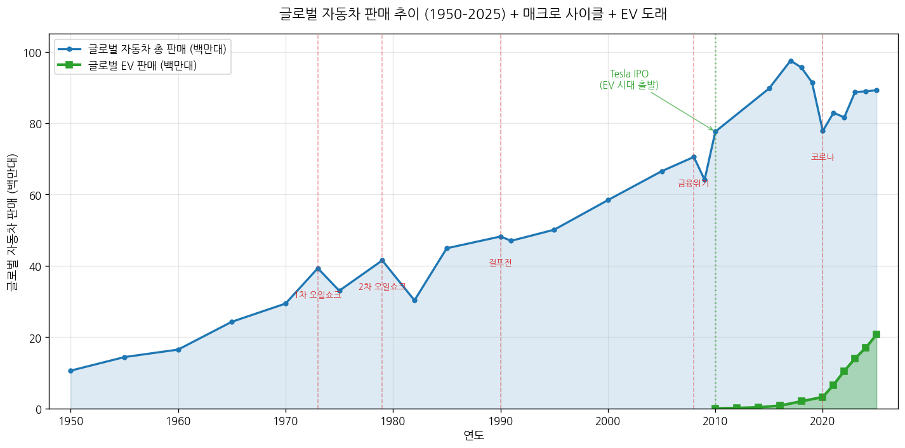
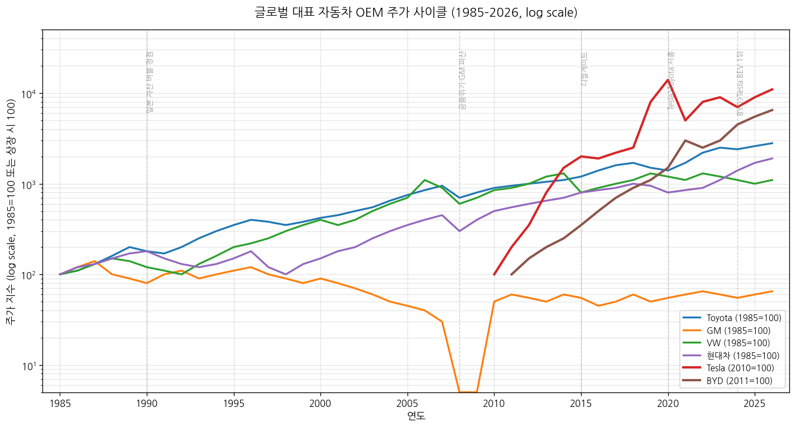
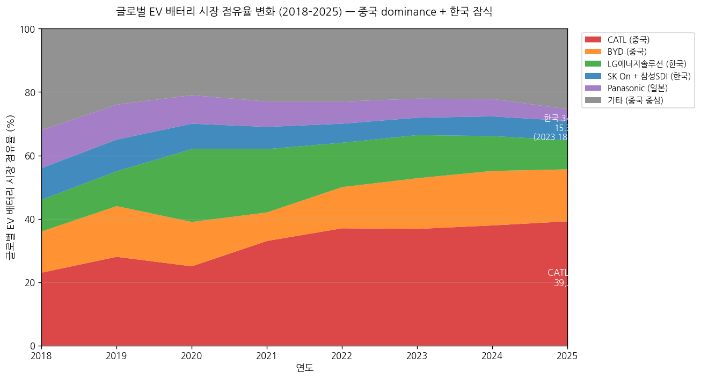
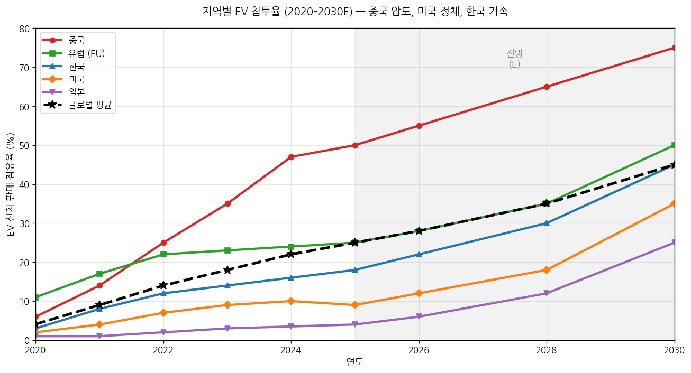

# 자동차 산업 기초 분석 (Industry Basic — Automotive)

> 본 문서는 셀사이드 init(데뷔) 자료 수준의 영구 reference 문서다. 산업의 본질·역사·구조를 처음 접하는 사람이 한 번에 이해할 수 있도록 구성했다. 내연기관(ICE)과 전기차(EV)를 모두 다루며, 두 패러다임의 비교·전환 동력을 분석 전반에 녹였다. 분기 변동·단기 narrative는 다루지 않는다 (실적 분석·테마 분석 영역).

---

## Executive Summary (5줄 이내)

1. 자동차는 1885년 벤츠 페이턴트 모터바겐으로 시작해 **세상에서 가장 큰 단일 제조업 산업**으로 성장 — 2025년 글로벌 판매 8,900만 대, 산업 매출 $3조+, 고용 5,000만 명 (직간접 포함).
2. **패권 이동의 역사**: 미국(1908–1970, Ford·GM·Chrysler) → 일본(1980–2000, Toyota·Honda·Nissan, lean 생산) → 글로벌 다강 시대(2000–2020, VW·현대기아·GM·Toyota) → **중국·EV 시대(2020–현재, BYD·테슬라·중국 OEM 부상)**.
3. **사이클 산업이자 동시에 패러다임 전환 산업** — 7~10년 매크로 사이클(오일쇼크·금융위기·코로나) + 100년에 한 번 오는 파워트레인 전환(ICE→EV). 두 사이클이 겹치며 변동성·승자 교체가 동시 발생.
4. **2026년 현재 산업 위치 (4+5 종합 결론)**: **카테고리 F-수정형 — 공급 과잉 + 수요 일정 (그러나 구성 변화)**. 전체 자동차 판매는 정체(8,900만 대 ±2%), 그러나 EV 비중이 25%→30% 빠르게 상승하며 ICE 공급 과잉(중국 capacity utilization 50% 미만)과 EV 일부 segment(배터리·자율주행 SW)에서 병목 동시 발생. **이중 구조** — ICE는 F(공급 과잉), EV는 B/A(수요 견인·메가 병목)로 양극화.
5. 한국은 **완성차 직접성 높음**(현대차그룹 글로벌 3위, 727만 대) + **배터리 직접성 중간**(LGES·SK On·삼성SDI 합산 글로벌 15% — 중국에 점차 잠식) + **자율주행/자동차반도체 직접성 낮음** (NVIDIA·Mobileye·TSMC 의존).

---

## 1-pager 요약 표 (5단계 핵심 결론)

| 단계 | 핵심 결론 |
|---|---|
| **1. 역사** | 6 chunk: ① 1885–1908 발명·태동 ② 1908–1945 포드주의·대량생산·전쟁 ③ 1945–1973 미국 황금기·GM 패권 ④ 1973–1990 일본 추격·오일쇼크·lean 혁명 ⑤ 1990–2010 글로벌화·플랫폼 통합·중국 시장 개방 ⑥ 2010–2026 전기차·자율주행·중국 부상·미·중 디커플링 |
| **2. 사이클** | 자동차 사이클은 **이중 구조** — (a) 7~10년 매크로 사이클 (1973·1979·1990·2008·2020 5차례 글로벌 침체) (b) 30~40년 파워트레인 사이클 (1908 ICE 도래 → 2010s EV 전환). 매 사이클마다 약자 도태, 패권 교체 |
| **3. BM/밸류체인** | 8 layer: 소재(철강·알루미늄·리튬·니켈) / 1차 부품(배터리·반도체·디스플레이) / Tier 1(모비스·보쉬·콘티넨탈) / Tier 2(부품·전장) / 완성차 OEM / 딜러·금융 / A/S·MRO / 모빌리티 서비스. 영업이익률 -5% (적자 OEM) ~ 25% (Ferrari·BYD 배터리) |
| **4. 공급 (2000 vs 2026)** | 글로벌 완성차 OEM 글로벌화 후 50+개 → **20개+ 메이저 + 중국 신규 20+사** (CR5 약 45%, 분산도 여전). 배터리 → **CR3 65% 중국 압도** (CATL 39% + BYD 16% + LGES 9%). EUV에 해당하는 ICE 진입장벽은 무너졌으나 EV CapEx 신규 진입장벽 형성 ($5B+ 1공장) |
| **5. 수요 (2025)** | 글로벌 판매 8,900만 대 (중국 30%, 유럽 18%, 미국 16%, 인도 5%, 기타 31%). B2C 80% + B2B 상용차 20%. **EV 25%** (1/4가 EV), 2030E 40%+. 메가 트렌드 수요 비중(전동화+자율주행+커넥티드 합산) 40%+. **가격탄력성 중간** (필수재이지만 대체수단·금리 영향 큼). 정부 정책 (보조금·배출규제·관세) 영향 극대 |
| **4+5 종합** | **카테고리 F-수정형: 이중 구조 (양극화)** — 전체 자동차는 공급 과잉·수요 정체, 그러나 EV·배터리·자율주행 SW 등 메가 트렌드 segment는 **카테고리 A/B (구조적 병목 + 수요 견인)**. ICE는 점진적 디플레이션·구조조정 진행 / EV는 P+Q 동반 상승. 향후 5~7년 승자·패자 명확히 갈리는 산업 reset 사이클 |

---

# 1단계. 역사 — 1885년부터 2026년까지

> **layered framework**: 각 chunk를 (a)매크로 배경 (b)패권자 (c)산업 변화 (d)사이클 단계 (e)대표 기업 주가 (f)규제 — 6 layer로 풀어낸다. 트리거 시점은 일반인 친화 비유로 풀이.

## Chunk 1. 1885–1908 — 발명·태동기 (산업의 탄생)

### (a) 매크로 배경

19세기 후반은 **제2차 산업혁명** 절정기. 석유 정제(1859 미국 펜실베이니아 Drake 유정), 전기·통신(1870s 에디슨·벨), 강철 대량 생산(1856 Bessemer 공정)의 3대 혁신이 동시 발생. 도시화 가속 — 1900년 뉴욕·런던 인구 각 350만·650만. 마차·말 분뇨가 도시 위생의 가장 큰 골칫거리(뉴욕 1900년 일일 분뇨 발생 1,100톤). 자동차가 "탈마차 도시 솔루션"으로 주목받기 시작.

> **비유**: 자동차의 탄생은 "도시가 말 분뇨에 질식해가던 시대의 위생 혁명"이었다. 우리가 지금 EV를 "탈ICE 솔루션"으로 보는 시각이, 100년 전엔 자동차 자체가 "탈말 솔루션"이었다는 점이 흥미로운 데자뷔.

### (b) 패권자

**독일·프랑스 발명 주도, 미국 양산 잠재력 부상**. 독일: Karl Benz, Gottlieb Daimler, Wilhelm Maybach. 프랑스: Panhard et Levassor, Peugeot. 미국: Olds·Ford·Cadillac·Buick 등 1900년대 초 군소 OEM 수백 개 난립. 1908년까지 글로벌 자동차 산업은 유럽 발명·미국 양산 경쟁의 양분 구도.

### (c) 산업 변화 (시대별 핵심 이벤트)

| 연도 | 이벤트 | 의미 |
|---|---|---|
| **1885년** | Karl Benz가 세계 최초 가솔린 내연기관 자동차 "페이턴트 모터바겐"(Patent-Motorwagen) 제작 | 자동차 산업의 공식 출발점 |
| **1886년 1월 29일** | Benz가 특허 등록 (DRP 37435) | 1월 29일은 매년 "자동차의 생일"로 기념됨 |
| **1888년** | Bertha Benz가 만하임→포르츠하임 106km 장거리 시운전 — 세계 최초 자동차 여행 | 자동차의 실용성 입증, 마케팅 효과 |
| **1889년** | Daimler·Maybach가 4-stroke 가솔린 엔진 + 4-speed gearbox 차량 출시 | 현대 자동차의 기본 구조 확립 |
| **1893년** | Duryea 형제, 미국 최초 가솔린 자동차 시연 | 미국 자동차 산업 진입 |
| **1896년** | Henry Ford, "Quadricycle" 시제품 제작 | Ford 창업의 전조 |
| **1897년** | Olds Motor Vehicle Company 설립 — 미국 최초 자동차 회사 | 양산 시도 시작 |
| **1903년** | Ford Motor Company 설립 (Henry Ford, $28,000 자본금) | 향후 100년 패권의 출발점 |
| **1903년** | Buick Motor Company 설립 → 후에 GM 모체 | |
| **1908년 8월 12일** | **Ford Model T 출시** ($850) | 자동차 = 부자의 장난감에서 대중 상품으로 전환 — chunk 1 종료 |

> **비유**: 이 시기 자동차는 "마차 시대의 페이턴트 휴대폰(시제품)"이었다. 1900년대 미국 자동차 가격 $2,000~$4,000은 당시 노동자 연봉의 4~10배 — 오늘날로 치면 $400,000+. Model T가 도래하기 전까지 자동차는 록펠러·밴더빌트 같은 "재벌의 액세서리".

### (d) 사이클 단계

**0차 사이클 — 산업 형성기**. 사이클이 존재하지 않음. 매년 신규 OEM 진입, 자동차 등록 대수 기하급수적 증가. 1900년 미국 자동차 등록 8,000대 → 1908년 78,000대 (10배). 산업 표준·인프라(도로·주유소·정비) 부재 — 모든 게 형성 중.

### (e) 대표 기업 주가

당시 대부분의 자동차사는 비상장 또는 소규모 상장 — 주가 사이클이라 부를 데이터 없음. Ford는 1956년에야 NYSE 상장. GM(1908 창업)은 1916년 상장.

### (f) 규제 layer

- **규제 부재 시기** — 자동차 등록·면허·교통 신호·속도 제한 등 모두 미정비. 도시별로 자치 조례 산발 시도.
- **1865년 영국 Red Flag Act**: 자동차가 도시에서 마차 앞을 깃발 든 사람이 걷는 속도로만 주행 가능 (영국 자동차 산업 발전 결정적 지연). 1896년 폐지.
- **특허 분쟁**: 1879년 George Selden이 "가솔린 자동차" 광역 특허 등록 → 미국 자동차사에 라이센스 강요. Ford가 1903–1911년 8년 소송 끝에 무력화 (1911 항소법원 판결) → 미국 자동차 산업 개방.

---

## Chunk 2. 1908–1945 — 포드주의·대량생산·전쟁 동원

### (a) 매크로 배경

1908년 Model T 출시 이후 1차대전(1914–18) → 광란의 1920년대(Roaring Twenties, 미국 호황) → 1929년 대공황 → 1939–45년 2차대전. **자동차 산업이 매크로 사이클과 직접 연동되기 시작한 chunk**. 미국 1인당 GDP 1920년 $7,500 → 1929년 $10,000 (실질) → 1933년 $7,500으로 회귀 → 전후 1950년 $14,000. 자동차 보급률(인구 1,000명당) 1908년 1대 → 1929년 187대 → 1945년 233대.

> **비유**: 1908년 Model T = "오늘날 iPhone 1세대 등장". 자동차가 부자 장난감→일상품으로 전환된 결정적 모멘트. Ford가 만든 건 자동차가 아니라 "자동차를 살 수 있는 중산층"이라는 새로운 시장 자체.

### (b) 패권자

**미국 단독 패권**. 1929년 미국이 글로벌 자동차 생산의 85%, 1939년 75% 점유. Big 3 형성: GM(1908 창업, Alfred Sloan 1923 CEO 취임 후 multibrand 전략), Ford(Model T·A·V8), Chrysler(1925 창업). 유럽은 Benz·Daimler(1926 합병→Mercedes-Benz), Renault·Citroën, Fiat 등이 prestige·중소형 차로 명맥. 일본은 Toyota(1937 설립), Nissan(1933 설립) 등 산업 초기 단계.

### (c) 산업 변화

| 연도 | 이벤트 | 의미 |
|---|---|---|
| **1908년** | Ford Model T 출시 ($850) | 대중 자동차 시대 개막 |
| **1908년** | William Durant이 GM 설립 (Buick·Olds·Oakland·Cadillac 통합) | 멀티브랜드 OEM 모델 출발 |
| **1913년** | Ford Highland Park 공장에 **이동식 조립 라인** 도입 | 차량 생산시간 12.5시간 → 1.5시간 (8배 단축) |
| **1914년** | Ford "5달러 일당" 정책 (당시 평균 2배) — 8시간 노동 도입 | 노동자가 자기가 만든 차를 살 수 있는 임금 |
| **1914년** | Model T 가격 $440 → 1925년 $260 | 노동자 연봉 4개월치로 자동차 구매 가능 |
| **1920년대** | Alfred Sloan GM CEO — "모든 지갑·모든 용도에 맞는 차"(a car for every purse and purpose) 전략 | 다양화·다브랜드 전략 정립 |
| **1923년** | GM 시장점유율이 Ford 추월 시작 | Sloan의 다양화 전략 vs. Ford 단일 모델 한계 노출 |
| **1927년** | Ford Model T 단종 (총생산 1,500만 대) | Ford 패권의 1차 정점·전환점 |
| **1929–1933년** | **대공황** — 미국 자동차 생산 530만 대→140만 대 (-74%) | 1차 자동차 산업 침체 |
| **1932년** | Ford V8 엔진 출시 | 대공황 중에도 기술 혁신 지속 |
| **1937년** | Toyota Motor Corporation 설립 (Kiichiro Toyoda) | 일본 자동차 산업의 미래 패권자 잉태 |
| **1939–1945년** | 2차대전 — 미국 자동차사 군용 차량·항공기 엔진 생산 (소형차 생산 중단) | 산업이 군수산업으로 전환 |

> **비유**: Ford의 이동식 조립 라인은 "도살장의 분해 라인을 거꾸로 한 것"이라고 Henry Ford 본인이 회고했다. 시카고 도살장에서 소를 매달아 컨베이어로 이동시키며 부위별로 해체하는 걸 보고, "이걸 거꾸로 하면 자동차도 만들 수 있겠다"는 발상. 인류 산업 혁명의 가장 큰 productivity 점프(생산성 8배).

### (d) 사이클 단계

**1차 사이클 형성·정점·침체**: 1908–28년 성장기 (생산 0→530만 대) → 1929–33년 대공황 (-74%) → 1934–41년 회복 → 1942–45년 전쟁 동원 시기 (자동차 생산 중단). 2차대전이 자연스러운 capacity reset 역할.

### (e) 대표 기업 주가

- **GM**: 1916년 NYSE 상장. 1920s 상승 → 1929년 폭락 (-90%) → 1934–37년 회복 → 다시 침체. Dow Jones 30 종목 중 핵심.
- **Ford**: 1956년에야 상장 (Henry Ford 가족 소유 유지). 본 chunk에서 주가 데이터 없음.
- **Chrysler**: 1925년 상장, 1928년 Dodge 인수로 Big 3 진입. 1929 폭락·1933 회복.

### (f) 규제 layer

- **1925년 미국 도로 표지 표준화**: U.S. Numbered Highway System (현재 Route 66 등의 출발).
- **1934년 자동차 안전 기준 부재** — 1930년대 미국 자동차 사고 사망률 인구 10만 명당 30명대 (현재 11명). 규제 부재가 사고로 이어졌으나 입법 미미.
- **1932년 RFC(Reconstruction Finance Corporation)**: 대공황 중 GM·Chrysler 등에 정부 신용 공여. 첫 정부의 직접 개입.
- **2차대전 War Production Board**: 1942년 미국 자동차 생산 강제 중단·군수품 전환 명령. Ford "Willow Run" 공장에서 B-24 폭격기 시간당 1대 생산 (1944).

---

## Chunk 3. 1945–1973 — 미국 황금기, GM 패권, 유럽·일본 부활

### (a) 매크로 배경

전후 황금기 — 미국 GDP 1945년 $2.3T → 1973년 $6.6T (실질 2배). 베이비붐(1946–64) 8천만 명. 교외화(suburbanization) — Levittown 등 교외 주택지 확대, 자동차 = 교외 생활 필수재. 1956년 Eisenhower 주간고속도로법(Interstate Highway Act) — 41,000마일 고속도로 건설로 자동차 수요 폭증. 유럽은 Marshall Plan(1948–52) 지원으로 산업 부활. 일본은 1955년 "통산성 국민차 구상" — Toyota·Nissan·Honda 등 글로벌 잠재력 잉태.

> **비유**: 미국 1950–70년대 자동차는 "냉장고·텔레비전과 함께 미국 중산층의 신분증". 1950년 자동차 보유 가구 비율 60% → 1973년 90%. 1대 보유에서 2대 보유 시대로 이행.

### (b) 패권자

**미국 Big 3 절대 패권**. 1950년 미국 자동차 생산 800만 대 (글로벌 75%). GM 50% 점유 (Chevrolet·Pontiac·Oldsmobile·Buick·Cadillac) — Sloan의 multibrand 전략 절정. Ford 25%, Chrysler 15%, 기타(AMC·Studebaker) 10%. 유럽: VW(Beetle 폭발적 인기, 1955년 100만 대 누적 생산), Mercedes·BMW·Audi (luxury·premium), Fiat·Renault (소형). 일본: Toyota Corona·Crown·Corolla 출시, Nissan·Honda 단계적 부상.

### (c) 산업 변화

| 연도 | 이벤트 | 의미 |
|---|---|---|
| **1945–48년** | 전후 미국 자동차 생산 재개. 수요 대기로 잘 팔림 | 황금기 시작 |
| **1948년** | VW Beetle 본격 양산 시작 (1955년 100만, 1972년 1,500만 대 누적) | 글로벌 베스트셀러 등극 |
| **1953년** | Chevrolet Corvette 출시 | 미국 스포츠카 카테고리 형성 |
| **1956년** | **미국 Interstate Highway Act** — 41,000마일 고속도로 건설 | 자동차 수요 영구 lift |
| **1956년** | Ford NYSE 상장 | 미국 자본시장 자동차주 비중 확대 |
| **1957년** | Toyota Crown, 미국 진출 시도 → 실패 (전후 일본 차 품질 미흡) | 일본 차의 글로벌 진출 좌절 |
| **1960년** | 미국 빅3 시장점유율 85% (역대 최대) | 미국 패권 정점 |
| **1964년** | Ford Mustang 출시 — Pony car 카테고리 창출, 출시 첫해 41.8만 대 판매 | 마케팅 신화 |
| **1966년** | Toyota Corolla 출시 — 향후 50년+ 글로벌 베스트셀러 모델 | 일본 추격의 출발점 |
| **1968년** | Honda CVCC 엔진 — 1970년 미국 머스키법(Muskie Act) 배출가스 기준 충족 최초 | 일본 환경 기술 우위 |
| **1970년** | 미국 머스키법(Clean Air Act 개정) — 1975년부터 NOx·HC·CO 90% 저감 의무 | 미국 빅3 기술 부담 |
| **1973년 10월** | **1차 오일쇼크** — OPEC 원유 가격 $2.6→$11.65 (4.5배) | 미국 빅3 위기의 시작 — chunk 3 종료 |

> **비유**: 이 chunk의 자동차는 "거대한 디트로이트 가전제품" — 길이 5.5m·기름 잡아먹는 8기통·연비 5km/L. 1960년대 미국 차는 디자인·크기·옵션으로 경쟁, 연비·품질은 신경 안 씀. 오일쇼크 직전까지 "기름값 신경 쓸 일 없는 시대"의 산물.

### (d) 사이클 단계

**2차 사이클 — 전후 황금기 (1945–73)**. 28년간 글로벌 자동차 생산 1,000만→3,900만 대 (4배). 사이클 변동 미미 (1957–58, 1960–61, 1969–70 미미한 침체만), 본격 침체 없음. 매크로 안정·자동차 보급률 상승 동반 시기.

### (e) 대표 기업 주가

- **GM**: 1950–66년 우상향, S&P 500 대비 outperform. 1966년 정점 후 점진적 약세.
- **Ford**: 1956 상장 후 10년간 안정 상승. Mustang 효과로 1965–66 정점.
- **Chrysler**: 1950년대 안정, 1960년대 점유율 하락 우려로 횡보.
- **Toyota**: 1949 도쿄증시 상장. 1960년대 후반부터 본격 상승, 1970년 부터 가파른 우상향.
- **VW**: 1961 상장. 1960년대 Beetle 효과로 강세, 1970년대 들어 약세 전환.

### (f) 규제 layer

- **1956년 Interstate Highway Act**: 41,000마일 고속도로 건설 — 자동차 수요·연료 인프라 확대.
- **1966년 National Traffic and Motor Vehicle Safety Act**: NHTSA 설립, 안전 기준 의무화. Ralph Nader의 "Unsafe at Any Speed"(1965) 책이 입법 추진력.
- **1970년 Clean Air Act 개정 (머스키법)**: 1975년부터 NOx·HC·CO 90% 저감. 일본·유럽이 미국보다 한발 앞서 적응 → 패권 이동 결정적 배경.
- **1970년 EPA(환경보호청) 설립**: 자동차 배출가스 통제 본격화.
- **CAFE(Corporate Average Fuel Economy) 1975년 도입**: 미국 1차 연비 규제 — 1차 오일쇼크 후 1975년 EPCA법으로 입법.

---

## Chunk 4. 1973–1990 — 오일쇼크, 일본 추격, Lean 생산 혁명, 미국 Big 3 위기

### (a) 매크로 배경

1973년 10월 4차 중동전쟁 → OPEC 원유가 4.5배 폭등 (1차 오일쇼크). 1979년 이란 혁명 → 2차 오일쇼크 ($14→$35, 2.5배). 미국 스태그플레이션 — 인플레 13.5%(1980), 실업률 10%, 금리 20%(Volcker shock). 일본은 환율 강세에도 불구하고 fuel efficiency·품질·납기로 미국·유럽 시장 침투 성공. 1985년 플라자합의(엔화 강제 절상) → 일본 미국 현지 공장 건설 가속. 1989년 베를린 장벽 붕괴 → 동유럽·소련 자동차 시장 잠재력 부상. 1990년 미·일 무역 마찰 절정.

> **비유**: 1973년 오일쇼크는 자동차 산업의 "큰 빙하기"였다. 빙하기에 강한 종(燃費 좋은 일본 소형차)이 살아남고, 거대 공룡(미국 8기통 V8)이 멸종 위기. 일본 차의 미국 침투 = "포유류가 공룡 시대 끝에 살아남아 패권 교체"의 동물생태학적 비유.

### (b) 패권자

- **1973–80**: 미국 Big 3 점유율 86%→73% 하락, **일본 점유율 0%→17% 급등** (1980 미국 자동차 수입 중 일본 80%). 1979년 미국 시장 베스트셀러 1위 Honda Civic·Toyota Corolla 진입.
- **1980–90**: 일본 5사 체제 (Toyota·Nissan·Honda·Mazda·Mitsubishi) 글로벌 자동차 1980년 시장점유율 27% → 1990년 30%. 미국 Big 3 50% → 36% 감소. 1989년 Toyota 글로벌 생산이 Ford 추월.

### (c) 산업 변화

| 연도 | 이벤트 | 의미 |
|---|---|---|
| **1973년 10월** | 1차 오일쇼크 — 미국 가솔린 1갤런 $0.36→$0.55 (50% 상승), 주유소 줄서기 | 미국 대형차 수요 급락, 일본 소형차 수요 폭증 |
| **1974년** | 미국 자동차 생산 -23% YoY, 1차 사이클 침체 진입 | 미국 Big 3 첫 본격 위기 |
| **1975년** | 미국 CAFE 연비 규제 도입 (1985년까지 27.5mpg 의무) | 미국 빅3 기술 부담 vs. 일본 차 자연 우위 |
| **1979년** | **2차 오일쇼크** — 가솔린 $0.86→$1.19. Chrysler 파산 직전 | 미 정부 Chrysler $1.5B 구제 보증 (1980) |
| **1980년** | Toyota·Nissan·Honda 미국 판매 130만 대 (시장점유율 17%) | 일본 침투 본격화 |
| **1981년** | 미·일 자율 수출 규제(VER) — 일본 미국 수출 168만 대로 제한 | 일본의 미국 현지 공장 건설 가속 트리거 |
| **1982년** | Honda Marysville 공장(Ohio) 가동 — 일본 OEM 미국 첫 공장 | 글로벌 OEM 시대 출발 |
| **1984년** | NUMMI 합작 (GM·Toyota Fremont, 캘리포니아) — 미국이 Toyota lean 생산 학습 | 산업 인사이트 이전 |
| **1985년** | 플라자합의 — 엔/달러 240→120 (2배 절상, 1988까지) | 일본 OEM 가격 경쟁력 약화 → 현지 생산 전환 |
| **1986년** | 일본 차 평균 품질 J.D. Power 1위 (미국 차 대비 결함 40% 적음) | 품질 격차 본격 가시화 |
| **1987년** | **The Machine That Changed the World** — MIT IMVP 연구 발표 (1990 책 출간) | "Lean 생산" 용어 정립, Toyota 시스템 글로벌 학습 |
| **1989년** | Toyota Lexus·Honda Acura·Nissan Infiniti — 일본 luxury 브랜드 미국 진출 | 럭셔리 segment까지 침투 |
| **1989년** | 베를린 장벽 붕괴 — 동유럽 자동차 시장 개방 시작 | VW 등 유럽 OEM 동유럽 진출 가속 |
| **1990년** | 일본 자동차 글로벌 생산 1,350만 대 (미국 980만 대 추월) | 일본 패권 정점 — chunk 4 종료 |

> **비유**: Toyota Production System(TPS) = "재고를 빚으로 보는 회계". 미국 GM은 부품 6개월치 재고를 "안전망"으로 봤지만, Toyota는 "그 재고로 묶인 돈을 R&D·자동화에 쓸 수 있는 비용"으로 봤다. JIT(Just In Time) + 무결점(Jidoka) + Kanban(시각 신호)이 lean 생산의 3대 축. 1980년대 일본 차 1대 생산비가 미국 차보다 $1,500 저렴 + 결함 4배 적음 → 산업 모델 전환.

### (d) 사이클 단계

**3차 사이클 — 오일쇼크 침체·일본 패권 형성 사이클**. 1973–75 침체 → 1976–78 짧은 회복 → 1979–82 2차 침체 (Volcker shock + 2차 오일쇼크). 미국 빅3 적자 누적, Chrysler 1979년 적자 $1.1B. 회복 1983–90년 (미국 Big 3 구조조정 + 일본 현지화 동시 진행).

### (e) 대표 기업 주가

- **미국 Big 3**: 1973–82년 -60% 수준 약세. Chrysler는 1979–80년 거의 휴지화. 1983–89년 회복 (Lee Iacocca의 Chrysler turnaround 신화).
- **Toyota**: 1973–1990년 약 20배 상승. 일본 닛케이 핵심 종목.
- **Honda**: 1972년 NYSE 상장 후 1980년대 미국 시장 침투로 10배+ 상승.
- **Nissan**: Toyota 대비 변동성 큼, 1980년대 후반 일본 자산 버블 동조 상승.
- **VW**: 1980년대 후반 동유럽 진출 기대로 강세.

### (f) 규제 layer

- **1981년 미·일 자율 수출 규제(VER)**: 일본 미국 수출 168만 대 한도 (1985년 230만 대로 완화). 무역 마찰의 첫 본격 사례.
- **1985년 플라자합의(Plaza Accord)**: 미국·일본·독일·영국·프랑스 G5 합의로 달러 약세·엔·마르크 절상. 엔/달러 240→120 (2배 절상). 일본 OEM 미국 현지 공장 건설·고급화 전략 가속화 결정적 트리거.
- **1986년 미·일 반도체 협정 (자동차 영향)**: 자동차 반도체·전장 시스템 분야에 미·일 갈등 확산.
- **1990년 미국 Clean Air Act 개정**: 1994년부터 Tier 1 배출가스 기준 (NOx 60% 추가 저감). 일본 OEM 우위 지속.
- **1985년 미국 CAFE 27.5mpg 의무화 완성**: 미국 OEM 소형차 라인업 확대 강제.

---

## Chunk 5. 1990–2010 — 글로벌화·플랫폼 통합·중국 시장 개방, 일본 정점·후퇴, 한국 진입

### (a) 매크로 배경

1990–91년 미국 1차 걸프전·일본 자산 버블 붕괴 (닛케이 38,915p 정점 → 1992년 14,000p). 1995년 WTO 출범 — 자동차 무역 자유화 가속. 1997년 아시아 외환위기 (한국·태국·인도네시아 타격, 한국 자동차 산업 구조조정). 1999년 유로 도입. 2001년 9·11 + 닷컴 폭락 → 저금리 시대 진입. 2001년 중국 WTO 가입 — 글로벌 자동차 시장 새 거대 수요처 개방. 2008년 글로벌 금융위기 → 미국 GM·Chrysler 파산 보호 신청. 2009년 중국 자동차 판매 1,360만 대 (미국 1,040만 대 추월, 글로벌 1위 등극).

> **비유**: 이 chunk는 "자동차 산업의 글로벌화 + 거대 신흥시장 출현"이 핵심. 1990년 글로벌 판매 4,800만 대 → 2007년 7,300만 대 (52% 증가). 그 증가분 중 60%가 중국·인도·러시아·브라질 BRICs에서. 미국·일본·유럽이 글로벌화로 시장 확대를 만끽한 시기.

### (b) 패권자

- **1990–2000**: 일본 정점 → 점진적 후퇴. Toyota·Honda·Nissan 일본 3사 글로벌 점유율 30%→27%. 미국 Big 3 36%→27%. 유럽 VW·Mercedes·BMW·PSA·Fiat 합산 35% 안정. **한국 진입**: 현대(1967 창업, 1986 미국 진출 Excel), 1998년 기아 인수 (현대·기아 합병).
- **2000–2010**: **글로벌 다강 시대 형성**. 1위 GM (2007까지) → 2008 Toyota 추월. VW 약진 (2009 글로벌 2위 진입). 현대기아 글로벌 5위 (2008). 중국 OEM(SAIC·BYD·Geely 등) 초기 단계 — 외국 OEM과 합작(JV) 형태로 중국 시장 70%+ 점유.

### (c) 산업 변화

| 연도 | 이벤트 | 의미 |
|---|---|---|
| **1990년 5월** | 일본 자산 버블 정점 (닛케이 38,915p) | 일본 자동차 산업 정점·이후 점진적 정체 |
| **1991년** | 4차 메모리 침체와 동조 — 글로벌 자동차 -3% YoY | 1차 걸프전 영향 |
| **1994년** | Mercedes-Benz·Daimler-Chrysler 합병 발표 (1998) | 글로벌 메가 OEM 결성 시도 |
| **1995년** | WTO 출범 → 자동차 관세 점진 인하 | 글로벌화 본격화 |
| **1997년** | 도요타 Prius 출시 (세계 최초 양산 하이브리드) | EV·전동화 시대의 진정한 출발점 |
| **1998년** | DaimlerChrysler 합병 ($36B, 사상 최대 산업 M&A) | 글로벌 통합 시도 |
| **1998년** | 현대·기아 합병 (한국 외환위기 후) | 한국 OEM 글로벌 5위 발판 |
| **1999년** | Renault-Nissan 동맹 결성 (Carlos Ghosn) | 동맹·플랫폼 공유 모델 |
| **2001년** | 중국 WTO 가입 — 외국 OEM 합작 50:50 의무 | 중국 시장 외국 OEM 본격 진입 (VW·GM·Toyota·현대 등) |
| **2003년** | Tesla Motors 설립 (Martin Eberhard·Marc Tarpenning) | EV 시대의 미래 패권자 잉태 |
| **2003년** | BYD Auto 설립 (왕전푸, 1995 배터리 회사 모회사) | 중국 EV의 미래 패권자 잉태 |
| **2007년** | Tesla Roadster 출시 (Lithium-ion 배터리 첫 양산 EV) | EV 산업 형성 신호탄 |
| **2007년** | DaimlerChrysler 합병 해소 (시너지 실패) | 메가 합병의 실패 사례 |
| **2007년** | iPhone 출시 — 스마트폰 시대 = 향후 자동차 SDV의 모태 | 인접 산업 연결 |
| **2008년** | 글로벌 금융위기 — 미국 자동차 판매 1,610만→1,040만 대 (-35%) | 사이클 침체 |
| **2009년 4–6월** | Chrysler·GM 파산 보호 (Chapter 11) — 미 정부 $80B 구제 | 미국 Big 3 사실상 정부 관리 |
| **2009년** | **중국 글로벌 1위 자동차 시장 등극** (1,360만 대) | 중국 시대 본격 개막 |
| **2010년** | Tesla Model S 발표 (출시 2012) + IPO ($17/주) | EV 산업화의 출발점 — chunk 5 종료 |

> **비유**: 이 chunk는 "자동차 산업의 글로벌 통합 + 중국이라는 거대 호수의 개방". 1990년대 자동차 산업은 "북미·유럽·일본 3대륙의 폐쇄 경쟁"이었다면 2000년대는 "중국이 글로벌 1위 시장이 되며 게임 룰이 바뀐 시대". 동시에 작은 캘리포니아 벤처(Tesla)가 향후 패권을 가져갈 씨앗을 뿌린 chunk.

### (d) 사이클 단계

**4차 사이클 — 일본 정점 후 글로벌 다강 + 중국 시대 출발**. 1990–91년 1차 걸프전 미니 침체 → 1997–98 아시아 외환위기 (한국 타격) → 1999–2007 글로벌 성장기 (BRICs 견인) → **2008–09 글로벌 금융위기 (글로벌 자동차 -10%, 미국 -35%)** → 2010 회복. 4차 사이클은 매크로 사이클 + 글로벌 시장 통합·확장이 동시 진행된 복합 사이클.

### (e) 대표 기업 주가

- **Toyota**: 1990 정점 후 2000년까지 횡보, 2003–07년 글로벌 1위 등극 모멘텀으로 2배 상승. 2008 금융위기로 -50%.
- **GM**: 1990–2007 무력 횡보, 2009 파산 보호 시 주식 사실상 휴지화. 2010년 11월 재상장 IPO.
- **VW**: 2008년 Porsche의 short squeeze 사건 (단기 글로벌 시총 1위) → 이후 정상화. 2000–10년 약 5배.
- **현대차**: 1998 합병 후 우상향, 2000–10년 약 10배. 2009년 미국 점유율 4%→7% 약진.
- **Tesla**: 2010년 6월 NASDAQ IPO. $17/주 (2024년 분할 조정 기준 $0.21). 이후 폭발적 상승의 출발점.

### (f) 규제 layer

- **1992년 EU 단일 시장 출범**: 유럽 자동차 관세·국경 폐지.
- **1997년 교토 의정서**: 자동차 산업 CO2 규제 글로벌 framework 출발.
- **2001년 중국 WTO 가입**: 외국 OEM 50:50 JV 의무 (2018년에야 폐지 시작). 중국이 외국 OEM 기술 학습·이전 받은 결정적 기간.
- **2004년 EU Euro 4 배출 기준** (2009년 Euro 5, 2014년 Euro 6 연속 강화). 디젤 OEM 비용 부담 증가.
- **2007년 미국 EISA법** — CAFE 2020년까지 35mpg 의무화.
- **2009년 미국 "Cash for Clunkers"**: 노후차 폐차 시 $4,500 보조 → 단기 수요 부양 ($3B 예산).
- **2009년 EU 95g/km CO2 규제 발표** (2021년부터 시행) → 유럽 OEM EV·HEV 전환 압박.

---

## Chunk 6. 2010–2026 — 전기차·자율주행·중국 부상·미·중 디커플링

### (a) 매크로 배경

2010 글로벌 금융위기 회복 → 2010s 저금리·QE 시대 (자동차 판매 회복). 2014–16 글로벌 자동차 정점 (9,500만 대 근처). 2018년 미·중 무역분쟁 시작 (Trump 관세). 2020년 코로나19 → 글로벌 자동차 판매 -16% (7,800만 대) → 반도체 부족 사태 (2021–23). 2022년 우크라이나 전쟁 → 에너지·원자재 가격 폭등. 2024–26년 미국 신정부 EV 보조금 축소·관세 강화 + 중국 EV 글로벌 점유율 폭증·과잉 capacity 우려. ESG·기후 위기 의식 확산.

> **비유**: 이 chunk는 "자동차 산업의 100년 만의 파워트레인 혁명 + 패권 재이동". 1908년 ICE 도래 이후 100여 년 만에 EV가 새 표준으로 등장. 동시에 미국·일본·유럽 패권에서 **중국·미국 EV 2강** 구도로 재편. 마치 1980년대 일본 추격을 보는 2020년대 버전 — 단, 이번엔 중국이 일본보다 10배 빠른 속도와 더 큰 규모로 추격.

### (b) 패권자

- **2010–2018**: GM 회복 + Toyota·VW 글로벌 1위 다툼. 현대기아 글로벌 5위 안정. Tesla 점유율 1% 미만이나 시총 급등.
- **2018–2022**: Tesla 글로벌 EV 1위 (점유율 23–25%), 시총 자동차 산업 최대 ($1T+, 2021 정점). 중국 BYD·NIO·Xpeng·Li Auto 등 EV 신생사 부상.
- **2022–2026**: **BYD 글로벌 EV 1위 등극** (2024년 4분기 BEV 판매 Tesla 추월, 2025년 연간 BEV 226.5만 대 vs Tesla 164만 대). 글로벌 전체 자동차 판매 1위 Toyota 유지 (1,036만 대, 2025), **BYD 글로벌 자동차 2위 진입** (460만 대, 2025). 현대기아 글로벌 자동차 3위 (727만 대, 2024).

### (c) 산업 변화

| 연도 | 이벤트 | 의미 |
|---|---|---|
| **2010년 6월** | Tesla NASDAQ IPO ($17/주, 시총 $1.7B) | EV 산업화의 신호탄 |
| **2010년** | 닛산 LEAF + Chevy Volt 출시 — 양산 BEV·PHEV | EV 양산 시대 시작 |
| **2012년** | Tesla Model S 출시 (시점에 $80K, 426km range) | 럭셔리 EV의 첫 성공 |
| **2013년** | Tesla Model S "Motor Trend Car of the Year" | EV가 메인스트림 인정 |
| **2014–16년** | 디젤게이트 — VW NOx 배출 조작 적발 ($30B+ 벌금) | 디젤 시대 종말 트리거, EV 가속 |
| **2016년** | BYD가 중국 EV 1위 (Tesla 추월). 중국 EV 정부 보조금 본격화 | 중국 EV 시대 개막 |
| **2017년** | Tesla Model 3 출시 ($35K 목표). 대중 EV 첫 시도 | EV 대중화 출발 |
| **2018년 4월** | 중국 EV 보조금 단계적 축소 발표 (2022 종료 예고) | 중국 EV 산업 자생력 시험 |
| **2018년** | 미·중 무역분쟁 — Trump 자동차 관세 25% 시사 | 글로벌 OEM 공급망 재편 |
| **2019년** | Tesla 상하이 기가팩토리 가동 (착공 1년 만) | 중국 진출, 가격 인하 |
| **2020년 3월** | 코로나19 글로벌 확산 → 자동차 공장 일시 폐쇄 | 글로벌 판매 -16% |
| **2020년 6월** | Tesla 시총 Toyota 추월 ($210B vs $202B) | 자동차 산업 평가 paradigm shift |
| **2021년** | 글로벌 반도체 부족 사태 — 자동차 생산 1,000만 대+ 차질 | 자동차반도체 병목 본격 부각 |
| **2021년 11월** | Tesla 시총 $1.2T 정점 | EV 평가 정점 |
| **2022년 2월** | 우크라이나 전쟁 — 와이어링 하네스(우크라이나 생산) 등 공급 차질 | 공급망 재편 가속 |
| **2022년 8월** | 미국 IRA(Inflation Reduction Act) 통과 — EV 보조금 $7,500 + 배터리 미국 생산 의무 | 미국 EV 산업 정책 대전환 |
| **2023년** | **BYD 글로벌 BEV 판매 Tesla 추월** (4분기 기준) | EV 패권 첫 변화 |
| **2023년** | 중국 EV 수출 491만 대 — 일본 추월, 글로벌 1위 자동차 수출국 | 중국 자동차 수출 강국화 |
| **2024년** | **Tesla 글로벌 BEV 1위 자리 BYD에 영구 양도** (BYD 176만 vs Tesla 178만 → 2025 BYD 226만 vs Tesla 164만) | 패권 교체 확정 |
| **2024년** | Hyundai-Kia 글로벌 자동차 3위 등극 (730만 대, GM 추월) | 한국 OEM 역대 최고 위상 |
| **2024년 6월** | EU, 중국 EV 관세 17–38% 추가 부과 발표 | EU·중국 무역 마찰 본격화 |
| **2024년** | 미국 자동차 반도체 부족 완화, AI·자율주행 기술 가속 | NVIDIA Drive·Mobileye 부상 |
| **2025년** | **Waymo 연 1,400만 회 무인 자율주행 운행, 주간 45만 회** | 로보택시 양산 진입 |
| **2025년** | Tesla Austin Robotaxi 파일럿 (Model Y, 안전 모니터 탑승) | Tesla FSD 상용화 출발 |
| **2025년 10월** | Tesla 누적 supervised FSD 100억 마일 돌파 (2026.5 기준) | 자율주행 데이터 확보 격차 |
| **2025년** | 글로벌 EV 판매 2,070만 대 (전체 자동차 25%) | "1/4가 EV" 시대 |
| **2025년** | CATL 글로벌 EV 배터리 점유율 39.2% (역대 최대) | 중국 배터리 패권 강화 |
| **2025–26년** | 미국 IRA EV 보조금 일부 축소·관세 강화 신호 (정권 교체 영향) | 글로벌 EV 정책 dispersion |
| **2026년 (현재)** | Toyota 1위(1,036만 대), BYD 2위(970만 대 추정), Hyundai-Kia 3위(750만 대), VW 4위 | 중국 OEM이 글로벌 빅3 진입 |

> **비유**: 이 chunk를 한 문장으로 — "자동차 산업은 가전화·소프트화·중국화의 3중 변화를 동시 겪고 있다". 가전화 = ICE의 기계적 복잡성이 EV의 전자적 단순성으로(부품 30,000→15,000개), 소프트화 = SDV(software-defined vehicle)·자율주행이 차량 가치의 30%+ 차지, 중국화 = BYD·Geely·Chery 등이 글로벌 OEM 빅10에 진입. 1980년대 일본 추격을 5배 큰 규모·2배 빠른 속도로 재현하는 격.

### (d) 사이클 단계

**5차 사이클 — 코로나·반도체 부족·EV 전환 동시 진행 사이클**. 2010–19 회복·정점(2017년 9,750만 대 정점) → **2020 코로나 침체(-16%)** → 2021–22 반도체 부족 반등 시도 → 2023–24 정상화 (8,900만 대) → 2025–26 정체. 매크로 사이클로는 정점 후 정체기, 그러나 EV·자율주행은 별도 sub-사이클로 성장기 진행 중 (이중 사이클).

### (e) 대표 기업 주가

- **Tesla**: 2010 IPO $17 → 2020 $700+ → 2021.11 $1,243(정점) → 2023.1 $113(저점) → 2024 $250–400 변동 → 2026.5 $300대. 자동차주 중 가장 폭발적이지만 변동성 극심.
- **Toyota**: 2010s 안정 상승, 2020 코로나 V자 반등 후 2023–24 사상 최고치 $250 근처. PE 8–10배 안정.
- **VW**: 2015 디젤게이트로 -40%, 이후 EV 전환 비용 부담으로 약세 횡보. 2025 EV 전략 재점검 단계.
- **GM·Ford**: 2010 재상장 후 횡보. EV 투자 + ICE 매출 동시 진행으로 시총 $40–80B 박스권.
- **BYD**: 2011 홍콩 상장 → 2020–21 $40 폭등 → 2024–26 EV 글로벌 1위 등극으로 시총 $130B (Toyota 다음 글로벌 자동차 2위).
- **현대차**: 2010–20 횡보 → 2021 IONIQ·E-GMP 전환 후 우상향 → 2024–26 사상 최고치.
- **Xiaomi (자동차 진출)**: 2024년 SU7 출시 → 2025 시총 폭등, 글로벌 자동차 시총 톱10 진입.

### (f) 규제 layer

- **2009년 EU 95g/km CO2 규제 (2021 시행)**: 유럽 OEM EV 강제 전환. 위반 시 1g/km 당 95유로 × 판매대수 벌금.
- **2017년 영국·프랑스 2040년 ICE 판매 금지 발표** (이후 2030–35로 단축 시도).
- **2018년 미국 USMCA 발효**: NAFTA 후속, 자동차 부품 75% 북미산 원산 요구.
- **2022년 미국 IRA**: EV 보조금 $7,500 + 배터리·미네랄 미국·FTA국 원산 의무. 한국 OEM 우대 효과 (현대기아 미국 공장 확대).
- **2023년 EU CBAM** (탄소국경조정): 2026년부터 자동차 등 탄소 집약 제품에 탄소세 부과 예정.
- **2024년 EU 중국 EV 추가 관세**: BYD 17%, Geely 19%, SAIC 35% — 본격 무역 장벽.
- **2024년 미국 중국 EV 관세 100%**: 사실상 중국 EV 미국 시장 완전 차단.
- **2025–26년 미국 정권 교체 후 IRA 일부 축소·관세 강화**: 글로벌 EV 정책 dispersion 확대. 한국 OEM 미국 공장 투자 보호 + 중국 OEM 완전 봉쇄.

---

# 2단계. 주가 사이클

> 1단계가 시간축 narrative라면, 2단계는 정량 view + 사이클 framework. 자동차 산업의 핵심 패턴 = **이중 사이클**(매크로 7~10년 + 파워트레인 30~40년).

## 사이클 구조 — 2개의 주기 중첩

자동차 산업의 주가 사이클은 단일이 아닌 **이중 구조**다.

### ① 7~10년 매크로 사이클 (단주기)

매크로 경기·금리·소비자 신뢰·금융 조건에 연동. 자동차는 평균 7~10년 보유 후 교체되는 내구재 — 매크로 충격 시 교체 지연(deferral)으로 판매 변동성 큼. 글로벌 자동차 판매는 매크로 GDP보다 2~3배 변동성.

| 침체 차수 | 시기 | 트리거 | 미국 자동차 판매 변동 |
|---|---|---|---|
| 1차 | 1929–33 | 대공황 | -74% (530만→140만 대) |
| 2차 | 1973–75 | 1차 오일쇼크 | -23% YoY (1974) |
| 3차 | 1979–82 | 2차 오일쇼크 + Volcker shock | -27% (1,090만→800만 대) |
| 4차 | 1990–91 | 1차 걸프전 | -10% |
| 5차 | 2001 | 닷컴 폭락 + 9·11 | -3% (자동차는 9·11 후 0% 할부로 약진) |
| 6차 | 2008–09 | 글로벌 금융위기 | -35% (1,610만→1,040만 대, GM·Chrysler 파산) |
| 7차 | 2020 | 코로나19 | -16% (글로벌 8,800만→7,800만 대) |

> **패턴**: 7~10년에 1번 글로벌 침체, 매번 약자 도태(Chrysler 1979·GM 2009·기타 군소 OEM 다수 인수합병).

### ② 30~40년 파워트레인 사이클 (장주기)

100년 만에 한 번 오는 기술 패러다임 전환. 1908년 ICE 도래 이후 2010년대 EV 전환 — 약 100~110년 주기. 이 사이클은 매크로 사이클과 독립이며 더 깊은 산업 reset을 야기.

| 파워트레인 사이클 | 시기 | 트리거 | 결과 |
|---|---|---|---|
| 1차 — ICE 도래 | 1885–1908 | 내연기관 발명·Model T 양산 | 마차 산업 사실상 소멸 (1900 미국 마차 마차 11,500사 → 1925 단 5사) |
| 1차 — ICE 절정·고도화 | 1908–1973 | 대량생산·하이웨이·교외화 | 미국 Big 3 패권 |
| 1차 — ICE 성숙·일본 추격 | 1973–2010 | 오일쇼크·환경 규제 | 일본 lean 패권 |
| **2차 — EV 도래** | **2010–2030E** | **Tesla Roadster·중국 EV 정책·기후 규제** | **ICE OEM 약자 도태, EV 패권 BYD·테슬라·중국 OEM 부상** |

> **현재 위치**: 2026년은 EV 파워트레인 사이클의 도래기 후반·도입기 초반. 글로벌 EV 침투율 25% (1/4가 EV). 2030년 40%+, 2040년 60–80% 전망 (지역·정책 dispersion 큼). **글로벌 자동차 패권의 90년만의 대전환기**.

## 자동차 산업 사이클 패턴 framework (정량)

| 항목 | 정량 |
|---|---|
| 매크로 사이클 평균 길이 | 7~10년 |
| 매크로 침체기 미국 자동차 판매 변동 | -10% ~ -35% (평균 -20%) |
| 매크로 회복기 판매 회복 시간 | 3~5년 (코로나는 반도체 부족까지 겹쳐 4년+) |
| 파워트레인 사이클 길이 | 100~120년 (현재 2차 사이클 진행 중) |
| 파워트레인 전환 도래기 길이 | 약 20~30년 (1885–1908 = 23년 / 2010–2030E = 20년) |
| 매 사이클 약자 도태 비율 | 글로벌 OEM 10~20% 인수합병·파산 |
| 매 사이클 패권 이동 | 1차 사이클: 유럽 발명→미국 양산 / 2차 사이클: 미·일→중국·EV 신생사 |

## 1단계 chunk와 사이클의 매핑 표

| Chunk | 시기 | 매크로 사이클 위치 | 파워트레인 사이클 위치 |
|---|---|---|---|
| Chunk 1 | 1885–1908 | 0차 (형성기) | 1차 ICE 도래기 |
| Chunk 2 | 1908–1945 | 1차 (대공황·전쟁) | 1차 ICE 절정 진입 |
| Chunk 3 | 1945–1973 | 2차 (전후 황금기) | 1차 ICE 절정 |
| Chunk 4 | 1973–1990 | 3차 (오일쇼크·일본 추격) | 1차 ICE 성숙 |
| Chunk 5 | 1990–2010 | 4차 (글로벌화·금융위기) | 1차 ICE 정점, 2차 EV 도래 신호 |
| Chunk 6 | 2010–2026 | 5차 (코로나·반도체 부족) | **2차 EV 도래기 진행 중** |

> chunk 경계가 사이클 변곡점과 자연스럽게 일치. 매크로 침체와 파워트레인 전환이 겹친 1973–82(오일쇼크 + ICE 효율 강화 시작), 2020–26(코로나 + EV 전환 가속)이 가장 격렬한 산업 reset 시기.



→ (출처: OICA, Statista, 본 분석. 1950–2025년 글로벌 자동차 생산·판매. 5차례 매크로 침체 + 2010년대 EV 도래 시점 강조.)

## 대표 OEM 통합 주가 사이클 차트



→ (출처: 본 분석, Bloomberg·Yahoo Finance 추정. 1985=100 또는 상장 시점=100 기준 log scale. Tesla·BYD의 EV 도래 후 폭발적 상승 vs GM의 2009 파산·횡보가 대비)

→ **핵심 패턴**: (1) Toyota·VW·현대차 등 ICE 전통 OEM은 2010s까지 우상향 → 2020년대 횡보·등락 / (2) GM은 2009 파산 후 -95%·회복 더딤 / (3) Tesla(2010 IPO)·BYD(2011 상장)는 EV 시대 진입과 함께 50~100배 이상 상승 → 자동차 산업 가치 redistribution의 가장 큰 증거.

---

# 3단계. 비즈니스 구조 + 밸류체인

> 자동차 산업 안에서 누가 어떤 역할로 어떤 가치를 창출하고 어떻게 돈을 버는가의 정량 분석. 단순 layer 매핑이 아닌 BM·진입장벽·마진 분석까지.

## 자동차 밸류체인 8 layer 매핑

자동차 산업은 반도체보다 layer가 깊고 분산된 구조다. 글로벌 자동차 산업 매출 $3T 중 완성차 OEM이 약 50% ($1.5T), 부품·소재가 35% ($1.05T), 딜러·금융·A/S가 15% ($450B) 차지.

### Layer 1. 소재 (Upstream)

| 종류 | 대표 기업 | BM | 진입장벽 | 영업이익률 |
|---|---|---|---|---|
| 철강·알루미늄 | POSCO·ArcelorMittal·Alcoa·Novelis | 자동차용 고장력강·알루미늄 판재 공급 | 자본집약 ($1B+ 고로), 자동차 OEM 인증 5년+ | 5~12% |
| 리튬·니켈·코발트·구리 | Albemarle·SQM·Glencore·CMOC | 광산 채굴·정련 | 광산권·환경 인허가·자본집약 | -5% (저점) ~ 30% (호황) |
| 합성수지·고무 | LG화학·SK이노·BASF·Bridgestone | 자동차용 플라스틱·타이어 | 기술 인증 | 5~15% |

### Layer 2. 1차 핵심 부품 (Mid-Upstream)

ICE와 EV에서 가장 큰 변화가 일어나는 layer.

#### (2-1) ICE 핵심 부품 (전통)

| 종류 | 대표 기업 | BM | 진입장벽 | 영업이익률 |
|---|---|---|---|---|
| 엔진·변속기 | Aisin·ZF·Magna Powertrain·Borg-Warner | 파워트레인 시스템 공급 | 수십년 R&D·OEM 동맹 | 5~10% |
| 연료·배기 시스템 | Faurecia·Tenneco·Eberspächer | 배기·연료 부품 | OEM 인증 | 3~8% |

→ ICE 부품 산업은 **구조적 축소**. EV 전환 가속으로 2030년까지 글로벌 ICE 부품 매출 -30~50% 전망.

#### (2-2) EV 핵심 부품 (신생·고성장)

| 종류 | 대표 기업 | BM | 진입장벽 | 영업이익률 |
|---|---|---|---|---|
| 배터리 셀 | CATL·BYD·LGES·SK On·삼성SDI·Panasonic | 셀 제조 (NCM·LFP) | $5B+ Gigafactory CapEx, 전극 노하우 | -5% (한국) ~ 15–20% (CATL·BYD) |
| 배터리 소재 | Posco Future M·Umicore·Sumitomo·중국 BTR·Easpring | 양극재·음극재·전해질·분리막 | 화학 IP·소재 합성 노하우 | 5~15% |
| 자동차반도체 (MCU·전력) | Infineon·NXP·Renesas·STMicro·온세미 | 차량용 MCU·SiC·IGBT | 차량용 인증 (AEC-Q100), 25년+ 신뢰성 | 15~30% |
| 자율주행 SoC | NVIDIA·Qualcomm·Mobileye·Tesla(자체)·화웨이 | AI 추론용 SoC, FSD/ADAS SW | AI 알고리즘·생태계 | 30~60% (NVIDIA·Mobileye 80%+ 자율주행 GPU) |
| 모터·인버터 | Nidec·Bosch·BorgWarner·현대모비스·LG마그나 | EV 구동 모터·인버터 | 자기력 설계, 전력 변환 노하우 | 8~15% |

→ **EV 핵심 부품 = 향후 10년 자동차 산업 가치 redistribution의 결정 layer**. 한국 OEM이 강점 있는 영역(배터리·모터)과 약점 영역(자율주행 SoC·자동차반도체) 명확히 구분됨.

### Layer 3. Tier 1 부품사 (System Integrator)

| 종류 | 대표 기업 | BM | 진입장벽 | 영업이익률 |
|---|---|---|---|---|
| 메가 Tier 1 | Bosch·Continental·Magna·Denso·**현대모비스** | 모듈·시스템 단위 통합 공급 (브레이크·서스펜션·전장 통합) | OEM과 수십년 동맹, R&D 매출 5–8% | 4~8% |
| 전장 Tier 1 | Aptiv·Valeo·Visteon·Harman | 인포테인먼트·ADAS·전장 | SW 통합, OEM 채택 | 5~12% |

### Layer 4. Tier 2 부품·전장 (Specialist)

| 종류 | 대표 기업 | BM | 진입장벽 | 영업이익률 |
|---|---|---|---|---|
| 차체·외장 | Magna(부분)·Plastic Omnium·**SL·만도** | 차체 패널·범퍼·헤드램프 | 금형·표면 처리 | 3~7% |
| 시트·내장 | Adient·Faurecia·Yanfeng·**대원강업** | 시트·내장 모듈 | OEM 인증 | 4~8% |
| 타이어 | Bridgestone·Michelin·Continental·**한국타이어·금호타이어** | 타이어 공급 | 브랜드·R&D | 8~15% |
| 디스플레이·HUD | LG디스플레이·Samsung Display·BOE | 자동차용 디스플레이 | 디스플레이 패널 기술 | 5~12% |

### Layer 5. 완성차 OEM (Assembly·Brand)

산업의 중심. 4가지 sub-카테고리.

| 카테고리 | 대표 기업 | BM | 진입장벽 | 영업이익률 |
|---|---|---|---|---|
| 메가 OEM (글로벌 700만+) | Toyota·VW·**현대기아**·GM·Stellantis·BYD | 글로벌 양산·딜러·금융·A/S 통합 | $20B+ R&D, 글로벌 공장·딜러 망 | 5~12% (Toyota 12%, GM 6%) |
| 럭셔리 OEM | Mercedes·BMW·Audi·Porsche·Ferrari·Lexus·Genesis | 브랜드 프리미엄·고마진 | 100년+ 브랜드, 고품질 인증 | 12~25% (Ferrari 27%, Porsche 18%) |
| EV pure-play | Tesla·BYD(EV부문)·Rivian·Lucid·NIO·Xpeng·Li Auto | EV·SW 중심, 직판 모델 | EV 기술·SW 능력, 자본집약 | -30% (Lucid) ~ 17% (Tesla 2022 정점) |
| 상용차 OEM | Daimler Truck·Volvo·PACCAR·Iveco·**현대상용** | 트럭·버스 | 트럭 특화 노하우 | 8~15% |

### Layer 6. 딜러·금융

| 종류 | 대표 기업 | BM | 진입장벽 | 영업이익률 |
|---|---|---|---|---|
| 딜러 | AutoNation·Penske·Lithia (미국)·**한국 OEM 직판·딜러** | 신차 판매·중고차 매매 | 지역 라이선스·자본 | 2~5% |
| 자동차 금융 | Ford Credit·GM Financial·Toyota Financial·**현대캐피탈** | 할부·리스·보험 | 자본·신용평가 | 자산 ROA 1~2% |

### Layer 7. A/S·MRO·중고차

| 종류 | 대표 기업 | BM | 진입장벽 | 영업이익률 |
|---|---|---|---|---|
| 정비·부품 | OEM 자회사·NAPA·O'Reilly·AutoZone·**현대모비스 A/S** | 부품 도소매·정비 서비스 | 부품 망·진단 SW | 8~20% |
| 중고차 | Carvana·CarMax·**케이카·엔카** | 중고차 판매 | 데이터·물류 | 1~5% |

→ A/S 부문은 자동차 산업 중 가장 영업이익률 높은 segment 중 하나. ICE → EV 전환 시 정비 매출 감소 우려 (EV 부품 30% 적음, 정비 빈도 50% 적음).

### Layer 8. 모빌리티 서비스 (신생)

| 종류 | 대표 기업 | BM | 진입장벽 | 영업이익률 |
|---|---|---|---|---|
| 라이드헤일링 | Uber·Lyft·DiDi·**카카오모빌리티** | 플랫폼·승차공유 | 네트워크 효과·SW | -5% ~ 5% |
| 로보택시 | Waymo·Tesla·Zoox·Cruise·Baidu Apollo | 무인 자율주행 운행 | AI·자율주행 SW·HW | 적자 (Waymo 2025 매출 $286M, 적자) |
| 차량 공유 | Zipcar·SoCar·Turo | 단기 임대·공유 | 차량 풀·SW | 0~5% |
| MaaS 통합 | Whim·Citymapper | 다양한 모빌리티 통합 | 도시별 파트너십 | 적자 |

→ 모빌리티 서비스는 **장기 잠재력 크나 현재 대부분 적자**. Waymo·Tesla FSD가 향후 10년 자동차 산업 가치 가장 큰 변동 layer가 될 가능성.

## 한국 기업 위치 — 별도 분석

> 한국 기업의 글로벌 자동차 산업 내 직접성(높음/중간/낮음)을 layer별로 분석.

### ① 완성차 OEM — **직접성 매우 높음 (글로벌 3위)**

- **현대차그룹** (현대·기아·제네시스·현대상용): 2024년 글로벌 730만 대(글로벌 3위, GM 추월), 2025년 727만 대 (Hyundai 414만 + Kia 314만, Hyundai -0.1%, Kia +2%). 2026년 가이던스 750만 대.
- 영업이익률: Hyundai 2024년 10%·Kia 12% (글로벌 OEM 중 Toyota·Mercedes 다음 수준 — 한국 OEM 사상 최고치).
- EV 라인업: E-GMP 플랫폼 (IONIQ 5·6·9, EV6·EV9). 2025년 글로벌 EV 점유율 7–8% (Tesla·BYD·VW 다음 4–5위 다툼).
- 미국 IRA 수혜: 조지아 메타플랜트 (HMGMA, 2024년 10월 가동) 양산 본격화 → 2025년 미국산 IONIQ 5/9 공급. IRA $7,500 보조금 적용.
- **글로벌 시사점**: 한국 OEM이 ICE 시대 일본 추격 모델을 EV 시대에 재현 시도 중. 글로벌 EV 3대 강자(Tesla·BYD·현대기아) 진입 가능성.

### ② 배터리 — **직접성 중간 (글로벌 15% — 중국에 잠식 中)**

| 기업 | 2025 글로벌 점유율 | 동향 |
|---|---|---|
| LG에너지솔루션 (LGES) | 9.2% (글로벌 3위) | 전년 대비 -1.5%p, 중국 OEM 향 매출 감소 |
| SK On | 3.7% (6위) | 미국 IRA AMPC 의존도 높음, 적자 누적 |
| 삼성SDI | 2.4% (9위) | 프리미엄 OEM (BMW·Audi·Stellantis) 중심 |
| **한국 3사 합산** | **15.3%** | 2023년 18% → 2025년 15% (중국에 점진 잠식) |

- 중국 CATL+BYD 합산 55.6% → 한국 3사 15% 압박 구도.
- 한국 배터리는 **NCM(High-Ni) 고급 셀** 차별화 (Tesla·GM·Ford·Stellantis·BMW 향).
- 미국 IRA AMPC ($35/kWh 셀 + $10/kWh 모듈) 보조금이 한국 3사 수익성 유지 핵심.

### ③ 배터리 소재 — **직접성 중간**

- 양극재: Ecopro BM·Posco Future M·LG화학·삼성SDI(소재 자회사 합병). 글로벌 NCM 양극재 30%+ 점유.
- 음극재: Posco Future M (인조흑연), 중국 BTR·Shanshan에 시장 점유 잠식.
- 분리막: SK이노베이션·LG화학. 글로벌 30%+ 점유.
- 전해질: Soulbrain·Enchem·Cosmo신소재 등 중소기업.

### ④ Tier 1 부품 — **직접성 높음 (현대모비스 글로벌 6위)**

- 현대모비스: 2024년 매출 60조원, 글로벌 자동차 부품사 6~7위. 현대차그룹 의존도 80%+ (vs 글로벌 Tier 1은 30~50%). E-GMP 부품·전장 통합.
- LG마그나: LG전자·Magna 합작 (2021), 전기차 파워트레인 핵심.
- 한온시스템: 글로벌 1위 자동차용 공조 시스템 (Tesla·VW·현대 향).
- 만도: 글로벌 11위 브레이크·조향 시스템. ADAS·자율주행 부품 확대.

### ⑤ 자동차반도체 — **직접성 낮음 (글로벌 의존)**

- 한국 자동차반도체 자급률 5% 미만. 차량용 MCU·SoC·전력반도체 대부분 NXP·Infineon·Renesas·TSMC·NVIDIA에 의존.
- 단, 삼성전자 파운드리에서 Tesla HW3·HW4 SoC 제조 (Samsung 4nm). NVIDIA Drive Thor도 TSMC 의존 — 한국 비중 낮음.
- 향후 변화: 삼성·SK하이닉스의 자동차용 메모리(LPDDR·HBM 자동차 SKU) 진입 시도, 그러나 점유율 미미.

### ⑥ 자율주행 SW·SoC — **직접성 매우 낮음**

- 한국 자체 자율주행 알고리즘은 현대차그룹 NVIDIA Drive 기반 (자체 IP 적음). 모셔널(Hyundai·Aptiv 합작)도 NVIDIA 의존.
- 글로벌 자율주행 SW는 미국(Waymo·Tesla·NVIDIA·Mobileye 이스라엘) + 중국(Baidu Apollo·화웨이·Pony.ai) 양분.

### 직접성 종합 표

| Layer | 한국 직접성 | 비고 |
|---|---|---|
| 완성차 OEM (현대기아) | **매우 높음** | 글로벌 3위, EV 전환 빠름 |
| 배터리 셀 (LGES·SK On·삼성SDI) | **중간** | 글로벌 15%, 중국에 잠식 중 |
| 배터리 소재 | 중간 | 양극재·분리막 강세, 음극재 약점 |
| Tier 1 (현대모비스·만도·한온) | 높음 | 현대차그룹 종속도 높음 |
| 자동차반도체 | **낮음** | 차량용 MCU 자급률 5% 미만 |
| 자율주행 SW/SoC | **매우 낮음** | NVIDIA·Tesla·Waymo 의존 |
| 모빌리티 서비스 | 낮음 | 카카오모빌리티 등 국내 시장 한정 |

---

# 4단계. 공급 구조 점검 — 현재 정량 snapshot

> 자동차 산업의 공급 구조는 반도체와 달리 **여전히 분산형**(CR5 약 45%)이지만, 일부 segment(배터리·자율주행 SoC·자동차반도체)에서 빠른 집중화 진행 중. ICE와 EV에서 공급 구조가 극명히 다름.

## ① 구조조정 이력 — 100년의 OEM 합병·파산·도태 패턴

### (1) 미국 OEM 구조조정 (1920s–2009)

| 시기 | 사건 | 결과 |
|---|---|---|
| 1908 | GM 설립 (Buick·Olds·Cadillac·Oakland 합병) | 4 brand → 1 OEM |
| 1925 | Chrysler 설립, Dodge 인수 (1928) | Big 3 체제 확립 |
| 1928–1960 | 미국 자동차 OEM 200+ → 6사 (Big 3 + AMC·Studebaker·기타) | 250사 도태·인수 |
| 1979–80 | Chrysler 파산 직전 → 미 정부 $1.5B 구제 보증 | 최초 정부 구제 |
| 1987 | Chrysler가 AMC 인수 | Big 3로 수렴 |
| 1998 | DaimlerChrysler 합병 ($36B, 사상 최대 산업 M&A) | 글로벌 메가 OEM 시도 |
| 2007 | DaimlerChrysler 합병 해소 (시너지 실패) | 메가 합병의 실패 |
| **2009** | **GM·Chrysler 파산 보호 신청, 미 정부 $80B 구제** | Big 3 → 사실상 정부 관리 |
| 2014–21 | Fiat·Chrysler 합병 → FCA → 2021 Stellantis (PSA + FCA) 합병 | 글로벌 Top 5 OEM 출범 |

### (2) 유럽 OEM 구조조정 (1990s–2020s)

| 시기 | 사건 | 결과 |
|---|---|---|
| 1990s | VW가 Audi·Seat·Skoda·Bentley·Bugatti·Lamborghini 인수 | 12-brand 메가 OEM |
| 1999 | Renault-Nissan 동맹 (Ghosn) | 단순 합병 아닌 cross-shareholding |
| 1999 | Ford가 Volvo·Jaguar·Land Rover·Aston Martin 인수 (이후 2007–10 매각) | M&A 실패 |
| 2006–08 | Tata Motors가 Jaguar·Land Rover 인수, Geely가 Volvo 인수 (2010) | 중국·인도 자본 유럽 자산 인수 시작 |
| 2014 | Fiat가 Chrysler 인수 완료 → FCA | |
| 2021 | PSA + FCA → **Stellantis** (14 brand: Peugeot·Citroën·Opel·Fiat·Jeep·Chrysler·Dodge·Ram·Maserati·Alfa Romeo 등) | 글로벌 Top 5 OEM |

### (3) 일본 OEM 구조조정 (1990s–2020s)

| 시기 | 사건 | 결과 |
|---|---|---|
| 1996 | Mazda → Ford 33% 지분 (이후 2015 해소) | 일본 OEM의 외자 의존 시작 |
| 1999 | Nissan → Renault 36% (Ghosn 입성) | 동맹 모델 |
| 1999 | Mitsubishi Motors → DaimlerChrysler (이후 매각·해소) | |
| 2017 | Renault-Nissan에 Mitsubishi 합류 → 3사 동맹 | 글로벌 4위 진입 |
| 2024 | Honda·Nissan 합병 협의 (2025년 2월 결렬) | 시장 충격, 일본 OEM 위기감 가시화 |
| 2025 | Nissan 구조조정·공장 폐쇄 발표 | 일본 OEM 약자 신호 |

### (4) 중국 OEM 부상 (2010s–2020s)

| 시기 | 사건 | 결과 |
|---|---|---|
| 2010 | Geely가 Volvo Cars 인수 ($1.8B, Ford에서) | 중국 자본 유럽 진출 |
| 2018 | Geely가 Daimler 9.7% 지분 인수 (글로벌 자동차 자본시장 충격) | |
| 2018 | 중국 EV 보조금 단계적 축소 (2022 종료) — 자생력 시험 | BYD·NIO·Xpeng·Li Auto 강자 부상, 군소 EV 200+개 사 도태 |
| 2020 | 중국 자동차 시장 EV 점유율 6% (2025년 50% 돌파) | 중국 EV 시장 폭발 |
| 2024 | Xiaomi 자동차 진입 (SU7), 시총 폭등으로 글로벌 Top 5 자동차 시총 진입 | 중국 OEM 다원화 |

### 글로벌 OEM 합산 변화 (1990 vs 2026)

| 구분 | 1990 | 2008 | 2026 (현재) |
|---|---|---|---|
| 글로벌 메이저 OEM 수 (연 100만대+ 판매) | 약 25개 | 약 20개 | **약 18개 + 중국 신생 EV 메이저 5개 = 23개** |
| 글로벌 OEM CR5 | 약 50% | 약 50% | 약 45% (BYD·Stellantis 등 부상으로 약간 분산화) |
| 글로벌 OEM CR10 | 약 75% | 약 75% | 약 70% |

> **자동차 OEM은 반도체 메모리만큼 집중화되지 않음**. 글로벌 다양한 시장·세그먼트·가격대 때문에 단일 패권자 형성 어려움. 그러나 segment별 집중화는 빠르게 진행 (특히 EV·배터리·자율주행).

## ② 공급 집중도 — Segment별 큰 차이

### (1) 완성차 OEM — 분산형 (CR5 ~45%)

2025년 글로벌 자동차 판매 순위 (예상):

| 순위 | OEM | 2025 판매 (만대) | M/S |
|---|---|---|---|
| 1 | Toyota | 1,036 | 12% |
| 2 | BYD | 460 (전체) / 226 (BEV) | 5% (전체) / 12% (BEV) |
| 3 | Hyundai-Kia | 727 | 8% |
| 4 | VW Group | 900 (추정) | 10% |
| 5 | GM | 550 | 6% |
| 6 | Stellantis | 540 | 6% |
| 7 | Honda | 380 | 4% |
| 8 | Ford | 410 | 5% |
| 9 | Nissan-Renault-Mitsubishi | 770 (합산) | 9% |
| 10 | Tesla | 178 (BEV) | 2% (전체) / 9% (BEV) |
| **CR5** | | **~45%** | |
| **CR10** | | **~70%** | |

→ 완성차 OEM은 여전히 분산형. **반면 EV BEV segment는 집중화 빠름** — BYD 12% + Tesla 9% + VW 5% + 현대기아 7% = CR4 약 33% (2025).

### (2) 배터리 — 빠른 집중화 (CR3 65%)

| 순위 | 배터리사 | 2025 글로벌 M/S | 비고 |
|---|---|---|---|
| 1 | CATL (중국) | 39.2% | 압도적 1위, LFP·NCM 풀라인업 |
| 2 | BYD (중국, 내재화) | 16.4% | LFP·Blade Battery |
| 3 | LG에너지솔루션 | 9.2% | NCM 고급 셀, GM·테슬라·현대기아 향 |
| 4 | CALB (중국) | 5.3% | 신흥 강자 |
| 5 | Gotion (중국, VW 일부 출자) | 4.5% | |
| 6 | SK On | 3.7% | 미국 IRA 의존 |
| 7 | Panasonic | 3.7% | Tesla 향 (점유율 잠식) |
| 8 | Eve Energy (중국) | 2.6% | |
| 9 | Samsung SDI | 2.4% | BMW·Audi·Stellantis 향 |
| 10 | Svolt (중국) | 2.4% | |
| **CR3** | | **64.8%** | (중국 2사 + 한국 1사) |
| **CR5** | | **74.6%** | |

→ **중국 점유율 합산 69%**. 향후 5년 내 한국 점유율 추가 잠식 우려 ↔ 미국 IRA·EU 관세가 한국 보호 변수.



→ (출처: SNE Research, CnEVPost. 2018→2025 8년간 추이. CATL의 점진적 압도 + 한국 3사의 점유율 잠식 가시화)

### (3) 자동차반도체 — 글로벌 메이저 4사 (CR4 약 50%)

| 순위 | 기업 | 강점 | 2024 매출 |
|---|---|---|---|
| 1 | Infineon (독일) | 차량용 MCU·SiC·IGBT | €15B |
| 2 | NXP (네덜란드) | MCU·차량용 보안 IC | $13B |
| 3 | Renesas (일본) | MCU 1위, 자동차 자체 IDM | $10B |
| 4 | STMicro (이탈리아·프랑스) | SiC·MCU | $13B |
| 5 | Texas Instruments | 자동차 전원·아날로그 | $12B |
| 6 | 온세미 (미국) | 차량 이미지 센서·SiC | $7B |
| 7 | Bosch (독일, IDM) | 자체 칩 + 외주 | n/a |

→ EV·SDV 전환으로 자동차반도체 매출 비중 차량당 $700 (2020) → $1,400 (2025E) → $2,100 (2030E) 2배 확대 전망. **한국 자급률 5% 미만**.

### (4) 자율주행 SoC — 압도적 집중 (NVIDIA·Mobileye·Tesla·Qualcomm)

| 기업 | 자율주행 SoC | 2025 글로벌 점유 (자동차 OEM 채택 기준) |
|---|---|---|
| NVIDIA Drive (Thor·Orin) | Mercedes·Volvo·현대·중국 OEM 다수 | 약 40% |
| Mobileye (Intel 자회사) | BMW·Audi·Ford·Honda·GM | 약 30% |
| Tesla FSD HW3/HW4/HW5 | Tesla 자체 | 약 15% (자체 사용) |
| Qualcomm Snapdragon Ride | GM·BMW·Volvo·Stellantis | 약 10% |
| 화웨이 (중국 OEM 자율주행) | Aito·BAIC·중국 다수 | 약 5% (중국 한정) |
| **CR3** | | **~85%** |

→ 자율주행 SoC는 반도체 GPU와 동일하게 **압도적 집중**. NVIDIA가 자율주행 AI 인프라 사실상 표준.

## ③ 가격결정력 변화

### (1) ICE — 가격결정력 약화 (구조적 디플레이션)

- 글로벌 ICE 자동차 capacity utilization 70% 미만 (중국 50% 미만). 공급 과잉 누적.
- 중국 OEM이 ICE 가격 인하 압박 → 2024–25년 글로벌 ICE OEM 가격 인하 사이클.
- 1.5–3% YoY 자동차 ASP 하락 (인플레이션 이후 실질 기준).
- VW·GM·Ford 등 ICE OEM 영업이익률 압박.

### (2) EV — 가격결정력 양극화

- **Tesla·BYD**: 가격결정력 보유 (수직계열화·규모로 비용 구조 우위). 2023–25년 Tesla·BYD 가격 인하 주도 → 다른 OEM 따라가는 구도.
- **기타 EV OEM**: 가격결정력 약함. 적자 OEM 다수 (Lucid·Rivian·NIO 등 영업적자).
- 향후: EV 가격 = 배터리 비용 결정 → 중국 배터리 가격 하락 (LFP $80/kWh → $60/kWh, 2025E)로 EV ASP 추가 하락 압박.

### (3) 럭셔리 — 가격결정력 유지

- Ferrari·Porsche·Mercedes·BMW: 브랜드 프리미엄으로 12~27% 영업이익률 유지.
- 단, 럭셔리 OEM도 중국 시장에서 BYD·Xiaomi 프리미엄 EV에 점진적 잠식.

## ④ 진입장벽 변화 — ICE 무너지고 EV에 새로 형성

| 진입장벽 | ICE 시대 | EV 시대 (현재) |
|---|---|---|
| 엔진·변속기 노하우 | 매우 높음 (50년+ R&D 필요) | **무력화** — EV에 엔진 없음 |
| 신규 OEM 1공장 CapEx | $3–5B | $5–10B (배터리 공장 포함 시) |
| 배터리 공장 1개 | n/a | **$3–5B**, 신규 진입장벽 |
| 자율주행 SW | 단순 ADAS | **수십억 마일 학습 데이터 + AI 인재** — Tesla·Waymo 격차 |
| 글로벌 딜러망 | 50년+ 구축 | 직판(Tesla 모델) + 온라인이 대안 — **약화** |
| 환경 규제 인증 | 5~10년 | 3~5년 (EV는 배출 측면 단순) |
| 충전 인프라 접근 | n/a | NACS(미국), CCS(유럽), GB/T(중국) 분기 |

→ **EV 시대는 ICE 시대 진입장벽을 무너뜨리고 새로운 진입장벽을 형성**. 그래서 Tesla·BYD·Rivian·Xiaomi 등 신규 OEM 진입이 100년 만에 가능해진 것. 동시에 SW·AI·배터리 노하우가 새 핵심 자산.

---

# 5단계. 수요 구조 점검 — 현재 정량 snapshot

> 자동차 산업의 수요는 자동차 보유율·교체 주기·인구 구조·소득·금융 조건·메가 트렌드(전동화·자율주행)에 동시에 영향받는 다층 구조.

## ① 수요처 구성 — B2C 80% + B2B 상용차 20%

### (1) B2C (승용차) — 글로벌 8,900만 대 중 7,100만 대

- 개인 소비자 80%, fleet 구매(렌트·법인) 20%.
- 지역별 수요는 인구·소득·도시화에 좌우.

### (2) B2B (상용차) — 글로벌 1,800만 대

- 상용 트럭 600만 대 (Daimler Truck·Volvo·PACCAR·중국 FAW·Dongfeng).
- 픽업트럭·LCV 800만 대 (Ford F-150·Toyota Hilux·GM Silverado).
- 버스 200만 대 + 기타 200만 대.

## ② 수요 집중도 — 지역별 분포 (B2C 중심)

### 글로벌 자동차 판매 지역별 분포 (2025)

| 지역 | 판매 (만대) | 비중 | 메모 |
|---|---|---|---|
| 중국 | 2,700 | 30% | 글로벌 1위. EV 50%+ 침투 |
| 유럽 (EU + 영국 + 기타) | 1,600 | 18% | EV 25%+ (노르웨이 95%, 독일 30%) |
| 미국 | 1,450 | 16% | EV 9% 정체 |
| 인도 | 450 | 5% | 신흥 성장 |
| 일본 | 460 | 5% | 정체 |
| 기타 (남미·동남아·중동·아프리카) | 2,240 | 26% | 다양 |
| **글로벌 합산** | **8,900** | **100%** | |

→ 중국이 압도적 1위. 인도가 글로벌 4위 시장으로 부상 (2010년 8위 → 2025년 4위).

### 지역별 EV 침투율 (2025)

| 지역 | EV M/S | 비고 |
|---|---|---|
| 노르웨이 | 95%+ | 세계 1위, 2025년 신차 판매 사실상 100% EV |
| 중국 | 50%+ | BYD·Tesla·중국 신생 EV |
| 유럽 (EU) | 25%+ | 독일 30%, 영국·프랑스 20%대 |
| 한국 | 18% | 현대기아 IONIQ·EV 라인 |
| 미국 | 9% | 침체 — 2024년 10%→2025년 9%로 하락 |
| 일본 | 4% | 가장 느림 |
| 인도 | 4% | 신생 (Tata EV·MG) |
| **글로벌 평균** | **25%** | (BEV 18% + PHEV 7%) |



→ (출처: IEA·ICCT·Counterpoint Research·본 분석. 2020→2030E 지역별 EV 침투율. 중국 압도 (50%+ → 75%+), 미국 정체·후퇴 (10%→2025 9%), 한국 가속 (3%→18%), 일본 가장 느림.)

## ③ 수요 사이클 위치

### (1) 장기 트렌드: 자동차 보유율 vs. 모빌리티 서비스

- 글로벌 자동차 보유 대수: 2010년 10억 대 → 2025년 14억 대 (40% 증가, 주로 중국·인도).
- 1인당 보유율: 미국 0.85대/인 (포화), 한국 0.50, 중국 0.25, 인도 0.05 (성장 여력).
- **장기 전환 변수**: 도시화·MaaS·로보택시 확산 시 1인당 자동차 보유 감소 가능성 (다만 향후 10년은 자동차 판매 큰 영향 미미 — Waymo 4도시 운행 단계).

### (2) 단기 사이클: 글로벌 자동차 판매 정체 + EV 가속

- 2017년 9,750만 대 정점 → 2020 코로나 7,800만 대 → 2023 8,800만 대 회복 → 2025 8,900만 대 → 2026E 9,000만 대 (정체).
- 글로벌 전체 판매는 정체이나 EV 비중 25%→30%로 빠르게 상승. **수요 구조 = 평면적 정체 + 내부 구성 급변**.

### (3) 교체 주기

- 미국 자동차 평균 보유 기간: 12.5년 (2024, 사상 최고치). 코로나 후 연장 추세.
- 유럽 11년, 한국 8.5년, 중국 6.5년 (신차 시장 성장하면서 짧음).
- 교체 주기 연장 = 신차 판매 정체의 구조적 배경.

## ④ 메가 트렌드 수요 비중

### 자동차 산업 내 메가 트렌드 수요 비중 (2025 → 2030E)

| 메가 트렌드 | 2020 비중 | 2025 비중 | 2030E |
|---|---|---|---|
| 전동화 (EV: BEV+PHEV) | 5% | **25%** | 40~50% |
| 자율주행 (L2+ 이상 채택) | 10% | 30% | 60%+ |
| 커넥티드 카 (5G·OTA·차량 IT) | 30% | 60% | 90%+ |
| 모빌리티 서비스 (로보택시·MaaS) | 미미 | 1% | 5~10% |
| **메가 트렌드 직접 수혜 segment 합산** | **~20%** | **~40%** | **~70%** |

→ 자동차 산업 수요의 **40%가 이미 메가 트렌드 영향**. 2030년까지 70%로 확대 전망 — **단순 자동차 산업이 아닌 모빌리티·AI·반도체 산업이 융합되는 단계**.

## ⑤ 대체재·보완재

### (1) 대체재

- **대중교통**: 도시화·고밀도 지역 (도쿄·서울·뉴욕·런던) — 자동차 보유 감소 압박.
- **자전거·전동킥보드**: 단거리 도시 이동 대체. 자동차 판매 영향 미미.
- **라이드헤일링 (Uber·Lyft·DiDi·카카오T)**: 자동차 보유 감소 trigger 가능성. 다만 현재 글로벌 자동차 판매 1~2% 수준 영향.
- **로보택시**: 향후 10년 잠재적 대체재. 1대 로보택시가 5~10대 개인차 대체 가능성 (Waymo 등 추정). **장기 가장 큰 위협 변수**.

### (2) 보완재

- **전기·충전 인프라**: EV 채택 가속 보완재.
- **5G·자율주행 인프라**: SDV·로보택시 보완재.
- **수소 인프라**: FCEV(연료전지차) 보완재 (현재 미미, 상용차 일부).

## ⑥ 가격탄력성 — 중간 (필수재이지만 금융 조건 민감)

- 자동차는 **필수재이나 고가 내구재** — 가격탄력성 중간.
- 금리 1%p 상승 시 미국 신차 판매 -8~12% (할부 의존 70%+).
- 신흥국 신차 판매는 소득에 매우 민감 (소득탄력성 1.5~2.0).
- 럭셔리 자동차 (Ferrari·Porsche): 가격탄력성 매우 낮음 (브랜드 프리미엄).
- EV vs ICE 가격 차이가 EV 채택률에 직접 영향 — Tesla 가격 인하가 글로벌 EV 시장 변동성 trigger.

## ⑦ 수요 driver 분해

| Driver | 2025 자동차 수요 기여도 |
|---|---|
| 인구 증가 (글로벌 +1% YoY) | +1% |
| 소득 증가 (신흥국 견인) | +2~3% |
| 도시화 (긍정/부정 양면) | -0.5~+0.5% |
| 교체 주기 연장 | -1~-2% |
| 금융 조건 (금리·신용) | -3 ~ +3% (변동) |
| 정부 정책 (EV 보조금·관세) | +1~+3% (특히 EV) |
| **순 글로벌 자동차 판매 성장률** | **-1~+2% YoY** (정체) |

→ 글로벌 자동차 판매는 향후 5년 정체 (CAGR 0~2%)이나 EV·자율주행 segment는 CAGR 15~25% 고성장.

## ⑧ 정부 정책 영향 — 자동차 산업은 정책 의존도 가장 큰 산업 중 하나

- **EV 보조금** (중국 NEV 정책·미국 IRA·EU CO2 규제·한국 EV 보조금) — EV 채택률 결정 변수.
- **CO2·배출 규제** (EU Euro 7, 미국 EPA, 중국 5단계) — ICE 비용 압박, EV 가속.
- **관세** (미국 25% 중국 EV, EU 17–38% 중국 EV, 미국·EU 상호 관세) — 글로벌 공급망 재편 trigger.
- **원산지 규제** (미국 IRA·USMCA, EU CBAM) — 배터리·부품 현지화 강요.
- **자율주행 규제** (NHTSA·NTSB·EU UNECE WP.29) — 로보택시 상용화 속도 결정.

## ⑨ 글로벌 vs 한국 수요 분리

| 구분 | 글로벌 (2025) | 한국 (2025) |
|---|---|---|
| 자동차 판매 | 8,900만 대 | 약 170만 대 (-3% YoY, 정체) |
| EV 침투율 | 25% | 18% |
| EV 보조금 (1대당) | 다양 ($2K~$12K) | 약 400만원 + 지자체 100~300만원 |
| 한국 OEM 글로벌 TAM | 727만 대 (현대기아 글로벌 3위) | 한국 내수 약 100만 대 (현대기아 80%+) |
| 한국 OEM 수출 비중 | 75%+ | — |

→ 한국 자동차 산업은 **수출 의존 산업** (현대기아 매출 75%+ 해외). 따라서 한국 수요보다 **글로벌 수요 + 미국·유럽 IRA·관세 정책**이 더 중요한 변수.

---

# 4+5 종합: 수급 매트릭스 현재 위치 결론

> 자동차 산업은 **단일 카테고리로 분류 불가**. 세그먼트별로 양극화된 이중 구조.

## 자동차 산업 = 이중 구조 (양극화)

### Segment 1. ICE (전체 자동차의 75%)

**카테고리 F: 공급 과잉 + 수요 정체**

- **공급 측 fact 요약**:
  - 글로벌 ICE capacity utilization 70% 미만 (중국 50% 미만).
  - 중국 OEM 신규 capacity 확장 (BYD·Geely 등) → ICE 자체에는 추가 capacity 형성 없으나 EV 전환으로 ICE capacity가 사실상 stranded.
  - VW·GM·Ford 등 ICE OEM 공장 축소·폐쇄 신호 (2024–25년 가속).
- **수요 측 fact 요약**:
  - 글로벌 자동차 판매 정체 (-1% ~ +2% YoY).
  - ICE 비중 75% → 2030E 60% → 2035E 30~40% (지역 dispersion 큼).
  - ICE ASP 디플레이션 압박 (-1.5~-3% YoY 실질).

→ **현재 ICE는 점진적 디플레이션 + 구조조정 진행**. 카테고리 G(구조조정 진행/완료)로 점차 이동 중.

### Segment 2. EV·배터리·자율주행 SW (전체 자동차의 25%, 빠른 확대)

**카테고리 B/A: 수요 견인 + 공급 적당/제한 (segment에 따라)**

- **공급 측 fact 요약**:
  - 글로벌 EV capacity 충분 (오히려 일부 과잉 — 중국 EV 50%+ 침투로 글로벌 EV 공장은 가동률 양호).
  - 배터리 공급 → CR3 65% 중국 압도, 한국 잠식 진행. 일부 segment(고급 NCM) 병목 존재.
  - 자율주행 SoC → NVIDIA·Mobileye·Tesla 사실상 독과점 (CR3 85%) → **카테고리 A 메가 병목**.
  - 자동차반도체 → 4사 50%+ 점유.
- **수요 측 fact 요약**:
  - 글로벌 EV 판매 +20~30% YoY 고성장.
  - EV 침투율 25%→30%→40%+ 5년 연속 가속.
  - 자율주행 L2+ 채택 30%→60% 5년 내 전망.

→ **현재 EV·배터리는 카테고리 B (수요 견인)**, 자율주행 SoC·자동차반도체는 카테고리 A (메가 병목).

## 통합 결론: 자동차 산업의 현재 위치

```
[4번 공급 fact 요약]
ICE: 공급 과잉 (글로벌 utilization 70% 미만, 중국 50% 미만)
EV: 공급 적당 + 배터리·자율주행 SoC 일부 병목
완성차 OEM: 분산형 (CR5 ~45%)
배터리: 빠른 집중화 (CR3 65%)
자율주행 SoC: 압도적 집중 (CR3 85%, NVIDIA·Mobileye·Tesla)

[5번 수요 fact 요약]
글로벌 자동차 판매 정체 (8,900만 대, CAGR 0~2%)
EV 비중 25%→2030E 40~50% (고성장)
자율주행 L2+ 30%→60% (고성장)
메가 트렌드 수요 비중 40%→70% (5년 내)
정부 정책 의존도 매우 큼 (IRA·CO2 규제·관세)

→ 현재 산업은 [F-수정형] 카테고리 위치 (이중 구조 양극화)
→ 근거:
   • ICE는 F (공급 과잉 + 수요 정체) → G로 이동 중
   • EV·배터리는 B (수요 견인 + 공급 적당)
   • 자율주행 SoC·자동차반도체는 A (구조적 메가 병목)
```

### 산업 전체 시사점

1. **자동차 산업은 향후 5~7년 산업 reset 사이클**: 1980년대 일본 추격 + 1908년 ICE 도래의 복합 사례 (2배 빠른 속도·5배 큰 규모).
2. **승자·패자가 명확히 갈리는 시기**: ICE 의존도 높은 OEM 도태 위험 (VW·Stellantis·Nissan 자율조정 중), EV·SW·배터리 leader는 가치 폭증 (Tesla·BYD·Xiaomi·NVIDIA).
3. **한국 OEM(현대기아)의 결정적 시기**: 글로벌 3위 진입 + EV 전환 성공 시 향후 5년 한국 사상 최고 위상 가능. 단 배터리·자율주행·반도체 약점 보완 필요.
4. **테마 분석에서 다룰 키워드**: EV 가속·배터리 China dominance·자율주행 NVIDIA·SDV·로보택시·MaaS — 각각 별도 테마 분석으로 깊이 다룸.
5. **분기 변동성 큼**: 매크로 사이클(코로나·반도체·금리)에 따라 단기 변동성 매우 큼. 분기별 실적 분석에서 추가 다룸.

---

# 부록: 자동차 산업 핵심 데이터 sheet

| 항목 | 2010 | 2017 (정점) | 2020 (코로나) | 2025 | 2030E |
|---|---|---|---|---|---|
| 글로벌 자동차 판매 (만대) | 7,500 | 9,750 | 7,800 | 8,900 | 9,000~9,500 |
| 글로벌 EV 판매 (만대) | 1.5 | 110 | 320 | 2,070 | 4,000~5,000 |
| EV 침투율 | 0.02% | 1.1% | 4.1% | 25% | 40~50% |
| 자동차 산업 매출 ($T) | 1.5 | 2.5 | 2.0 | 3.0 | 3.5~4.0 |
| 배터리 시장 ($B) | 5 | 30 | 70 | 200+ | 400+ |
| 자동차반도체 시장 ($B) | 25 | 35 | 38 | 60 | 100+ |
| 자율주행 (L2+) 침투율 | <1% | 10% | 15% | 30% | 60%+ |
| 글로벌 OEM 빅3 | Toyota·VW·GM | Toyota·VW·GM | Toyota·VW·GM | Toyota·VW·**현대기아** | Toyota·**BYD**·VW |

→ 자동차 산업은 향후 5년 그 어느 때보다 큰 변화 진행 중. 본 reference 문서를 토대로 테마 분석(EV·자율주행·배터리)·기업 분석(BYD·테슬라·현대기아·CATL 등)·실적 분석에서 세부 추적.

---

## 출처 및 참고 자료

- OICA (International Organization of Motor Vehicle Manufacturers) — 글로벌 자동차 생산·판매 통계.
- SNE Research — 글로벌 EV 배터리 시장 점유율 데이터 (2025).
- CnEVPost — 중국 EV·배터리 시장 동향.
- Counterpoint Research, ICCT — 글로벌 EV 침투율 통계.
- 본 분석에 인용된 역사 데이터는 Wikipedia·Britannica·Ford·Toyota·VW·현대차 공식 기록을 교차 확인.
- 한국 자동차 산업 데이터: 한국자동차산업협회(KAMA), 통계청.
- 자율주행: Waymo·Tesla 공식 발표 + CNBC·Motley Fool 2025–26 자료.
