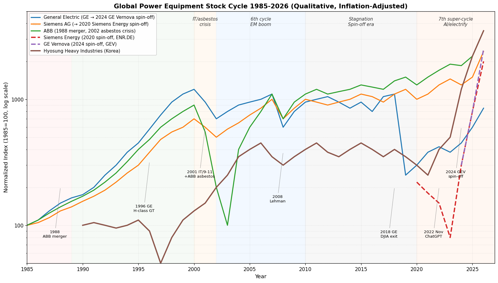
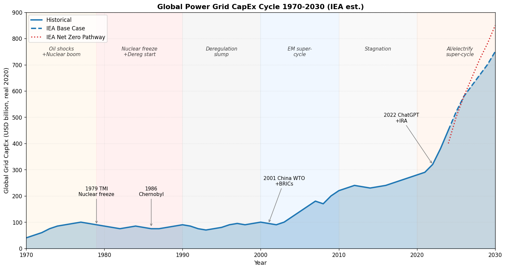
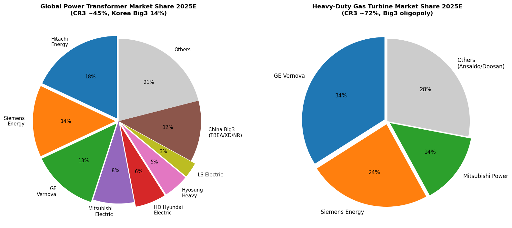
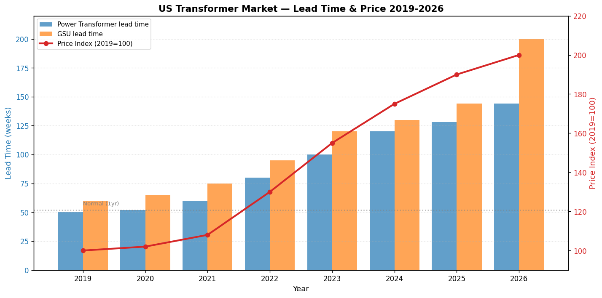

# 전력 인프라 산업 기초 분석 (Industry Basic — Power Infrastructure)

> 본 문서는 셀사이드 init(데뷔) 자료 수준의 영구 reference 문서다. 산업의 본질·역사·구조를 처음 접하는 사람이 한 번에 이해할 수 있도록 구성했다. 분기 변동·단기 narrative는 다루지 않는다 (실적 분석·테마 분석 영역).

---

## Executive Summary (5줄 이내)

1. 전력 인프라는 1880년대 에디슨·테슬라·웨스팅하우스의 **DC vs AC 전쟁**에서 출발한 산업 — 100년 넘게 GE·Westinghouse·Siemens·BBC·ASEA 등 미·독·스위스 6강 체제가 유지되었고, 2025년 현재도 글로벌 변압기 빅3(Hitachi Energy·Siemens Energy·GE Vernova) + 한국·중국 추격자라는 과점 구조가 본질이다.
2. **사이클의 정수** — 전력 인프라는 7~15년 단위로 "신규 capex 사이클 → 과잉설비 → 자유화·구조조정" 패턴을 반복. 1970s 오일쇼크·원전 붐, 1990s 자유화·민영화 불황, 2000s 신흥국 호황, 2010s 정체기, **2020s AI·전기화 슈퍼사이클**.
3. **2025년 현재 산업 위치 (4+5 종합 결론)**: **카테고리 A — 구조적 메가 병목**. 미국 변압기 lead time 4년, GSU(발전기 승압) 144주(2.8년) — 수요(AI 데이터센터 + 전기차 + 재생E 통합)가 메가로 폭증하는데 공급(GOES 강판 단일 라인·변압기 capex 사이클 길이 7~10년)이 구조적으로 묶임. 향후 5~7년 P·Q 동반 상승.
4. **밸류체인 위치별 마진 차별화**: 발전 터빈(GE·Siemens·MHI 3사 과점, OPM 15–20%) > T&D 변압기 (CR3 40%, OPM 12–25%, **한국 빅3가 미국 초고압에서 절대 강자**) > 배전·LV 스위치기어 (Schneider·Eaton·ABB·Siemens 4강, OPM 17–20%) > EPC·유틸리티 (regulated, ROE 8–11%).
5. 한국은 **변압기 직접성 최고** (효성중공업 미국 765kV 1위·HD현대일렉트릭 미국 15–20% M/S·LS일렉트릭 배전기기 + ESS) — 미국 친 한국 정책 + 멤피스 공장 보유 + GOES 강판 공급(POSCO) 3중 이점. 단, 가스 터빈·HVDC·중전기 종합 솔루션은 직접성 낮음(글로벌 빅3 독점 영역).

---

## 1-pager 요약 표 (5단계 핵심 결론)

| 단계 | 핵심 결론 |
|---|---|
| **1. 역사** | 6 chunk: ① 1880–1920 산업 탄생·DC/AC 전쟁·미·독·스 6강 형성 ② 1920–1973 전기화·그리드 통합·미국 GE/WH 빅2 ③ 1973–2000 오일쇼크→원전 붐→자유화 (ABB 합병·한국 진입·WH 몰락) ④ 2000–2010 신흥국 인프라 호황·중국 부상 ⑤ 2010–2020 셰일·재생E·정체기·분사(Siemens Energy 2020·GE Vernova 2024) ⑥ 2020–2026 AI·전기화 슈퍼사이클·한국 빅3 미국 수주 폭증 |
| **2. 사이클** | 자본재 장사이클 7~15년 + 매크로 사이클. 1970s 원전 사이클·1990s 자유화 불황·2000s 신흥국 사이클·2010s 정체기·**2020s AI 슈퍼사이클**. ABB·Siemens·GE 100년+ 데이터로 5~6차 대형 사이클 확인 |
| **3. BM/밸류체인** | 5 layer: 업스트림(GOES 강판·구리·차단용 가스 SF6 → POSCO·Nippon Steel·Thyssenkrupp / Air Liquide) → 미드스트림(T&D 변압기·차단기·HVDC → Hitachi·Siemens·GE·한국 빅3 / 발전기기 → GE·Siemens·MHI 3사) → 다운스트림(EPC → Bechtel·현대건설·삼성E&A / 유틸리티 → NextEra·EDF·한전). 영업이익률 5%(EPC) ~ 25%(발전 OEM·SaaS형 grid SW) |
| **4. 공급 (1990 vs 2025)** | 글로벌 대형 전력기기 회사 1990 ~30개사 → 2025 6사 (Hitachi Energy·Siemens Energy·GE Vernova·Schneider·Eaton·Mitsubishi Electric) + 한국 3사 + 중국 3사. CR3(변압기) 1990 25% → 2025 30–40% (지역별 편차 큼, 미국 765kV 효성중 1위). GSU lead time 144주, 도매가 2023→2025 +60% |
| **5. 수요 (2025)** | 유틸리티/그리드 50%, 산업·자동화 20%, 데이터센터 12% (2020년 4%에서 3배), 재생E 통합 8%, EV 충전 5%, 기타 5%. **메가 트렌드 직접 수혜 비중 30%+** (AI DC + EV + 재생E). B2B 95%+. 가격탄력성 매우 낮음 (사회 인프라). 2025–2030 글로벌 전력 수요 CAGR 3.6%, 그리드 capex 연 $300B → $600B 필요 (IEA) |
| **4+5 종합** | **카테고리 A: 구조적 메가 병목** — 공급 매우 제한적(변압기 lead time 4년, GOES 강판 빅5 과점, GSU 시장 274% 수요 증가에 공급 미달), 수요 AI·재생E·EV 3중 메가 견인. 향후 5~7년 P+Q 동반 상승. 단, 1) 미·중 디커플링으로 중국 빅3(TBEA·Xian XD·NR Electric) 글로벌 진출 가속 → 미국·유럽 보호주의 강화, 2) AI capex 변곡점이 트리거 |

---

# 1단계. 역사 — 1880년부터 2026년까지

> **layered framework**: 각 chunk를 (a)매크로 배경 (b)패권자 (c)산업 변화 (d)사이클 단계 (e)대표 기업 주가 (f)규제 — 6 layer로 풀어낸다. 트리거 시점은 일반인 친화 비유로 풀이.

## Chunk 1. 1880–1920 — 산업의 탄생, DC vs AC 전쟁, 미·독·스위스 6강 형성

### (a) 매크로 배경

2차 산업혁명 절정기. 1865년 미국 남북전쟁 종료 후 도시화 폭주 — 뉴욕·시카고·런던·베를린 인구가 30년간 2~3배. 도시는 가스등(밤이면 매연·화재 위험)에서 안전한 광원을 갈구. 1873~96년 'Long Depression'(장기 불황)이라 부르는 디플레이션 시기지만 산업혁명 인프라 투자는 지속. 1914년 1차 세계대전 발발로 군수 산업 폭발 → 전기 모터·발전기 기술이 군수로 흡수. 1917년 러시아 혁명 → 전후 GOELRO(레닌 전기화 계획) 등장.

> **비유**: 100년 전 도시 거주민에게 "밤에 책을 읽고 싶다"는 욕망은 곧 "가스등을 켜되 폭발 위험을 감수한다"는 의미. 에디슨이 1879년 발명한 백열전구 + 1882년 펄 스트리트 발전소는 인류 역사상 처음으로 "안전한 광원"을 제공 — 전기 산업의 출생증명서.

### (b) 패권자

**미·독·스위스·스웨덴 6강 형성기**. 미국: Edison Electric(1878·이후 1892 GE로 합병)·Westinghouse Electric(1886)·Stanley Electric. 독일: Siemens & Halske(1847·전신선 사업으로 시작)·AEG(1883). 스위스: Brown Boveri & Cie(BBC, 1891 바덴 창업). 스웨덴: ASEA(1883 베스테로스 창업). 프랑스: Compagnie Générale d'Électricité(CGE, 1898·후일 Alstom 모체)·Schneider(1836년 Le Creusot 제철소 → 1891년 전기 사업 진입). **이 6강이 130년이 지난 2025년 현재까지 글로벌 패권 게임의 본진**이다(WH·AEG·CGE는 합병·분사·도태됐으나 DNA는 살아남음).

### (c) 산업 변화 (시대별 핵심 이벤트)

| 연도 | 이벤트 | 의미 |
|---|---|---|
| **1879년 10월** | 에디슨, 진공 백열전구 실용화(40시간 점등 성공) | "전기를 제품으로" 첫 증명 |
| **1882년 9월** | 에디슨, 뉴욕 펄 스트리트 발전소 가동(110V DC, 약 800m 반경 85개 가구·400개 전구) | 세계 최초 중앙집중식 발전·송전. 산업의 출발선 |
| **1886년** | Westinghouse, William Stanley의 변압기 기반 AC 시스템 상용화 — 매사추세츠 그레이트배링턴 시연 | **변압기 = 산업의 enabler**. 발전소를 도시 외곽에 두고 고전압으로 송전 후 강압 |
| **1887년** | Tesla, 다상(polyphase) 유도 모터 개발 | AC 모터의 결정적 진보 — 산업용 동력으로 확장 |
| **1888년 7월** | Westinghouse, Tesla 다상 AC 특허 라이센스 (US patent) | AC 진영 결정적 무기 확보 |
| **1888년~1893년** | 'War of Currents' — 에디슨 DC vs Westinghouse·Tesla AC | 전기의자(1890·AC를 위험하다고 PR)·코끼리 감전(1903·에디슨 측 PR 캠페인) 등 흑색 마케팅 |
| **1891년** | 독일 Frankfurt-Lauffen 175km AC 전력 전송 시연 — 3상 25kV | AC 장거리 송전 결정적 증명. 유럽 진영 표준 결정 |
| **1893년** | Westinghouse, 시카고 세계박람회 전기 공급 입찰에서 GE 대비 절반가에 낙찰 — Tesla AC 시스템으로 25만 개 전구 점등 | War of Currents 사실상 종결 |
| **1895~96년** | Westinghouse·Tesla, 나이아가라 폭포 수력발전 — 11kV AC 생성, 26마일(42km) 떨어진 버펄로까지 송전 | AC 표준의 결정타 — 산업의 frequency 결정(미국 60Hz 표준) |
| **1903년** | GE 가스 충전 전구(Tungsten) 개발 → 1909 Coolidge 텅스텐 전구 | 전구 효율 5배↑ — 전기 수요 폭증의 기술적 발화점 |
| **1908년** | BBC, 8.5MW 증기터빈 생산 — 유럽 발전기기 패권 진입 | 발전기기 시장에서 BBC vs GE·Siemens 경쟁 시작 |
| **1913년** | GE, 미국 최초 100MW 증기터빈 | 대용량 발전 시대 |
| **1917년** | 러시아 혁명 → 1920 레닌 GOELRO 계획(15년 내 30개 발전소 건설) | 사회주의권의 전기화 모델 — 향후 100년 인프라 투자 청사진 |

> **비유**: DC vs AC 전쟁은 "USB-A vs USB-C"가 아니라 "마차 vs 기차" 수준의 표준 전쟁이었다. DC는 송전 손실 때문에 도시 한 블록 단위로만 가능 — "동네 빵집" 비즈니스. AC는 변압기로 고전압 송전 후 다시 강압 — "전국 체인" 가능. War of Currents가 끝나는 순간 미국 전 가구·전 공장이 동일 전기를 사용하는 토대가 깔린 것 — 100년 후 자동차 충전 표준 전쟁(Tesla NACS vs CCS·CHAdeMO)의 원형.

> **변압기가 산업의 핵심인 이유**: 발전소에서 100km 떨어진 도시까지 전기를 보내려면 전압을 100~500배 올려야(고전압일수록 손실 ↓). 도착해서는 다시 220V로 낮춰야. 이 두 동작이 모두 **변압기**의 일. 변압기 없으면 전기 산업 자체가 불가능. 그래서 1880년대부터 2026년 현재까지 변압기는 항상 전력 인프라의 가장 중요한 단일 부품 — Hitachi Energy·Siemens Energy·GE Vernova·효성중공업·HD현대일렉트릭의 주력 매출이 모두 변압기인 이유다.

### (d) 사이클 단계

**1차 capex 사이클 — 도시 전화(都市 電化, Electrification of cities) 사이클**. 1880~1914 미국·유럽 주요 도시 발전소 보급. 일종의 '플랫폼 깔기' 단계. 1907년 미국 금융 panic, 1914년 1차 대전으로 잠시 정체했으나 전후 1920년대까지 이어짐.

### (e) 대표 기업 주가

GE는 1892년 Edison General Electric + Thomson-Houston 합병으로 NYSE 상장(같은 해 다우존스 산업평균지수 12개 종목에 편입 — **130년 후 2018년 다우에서 제거되기 전까지 최장수 종목**). Westinghouse도 1880년대 사상장. 1893년 panic으로 양사 모두 일시 압박 (GE는 1893 J.P. Morgan 구제). 1900~1907 강세, 1907년 panic으로 조정, 1914 WWI 발발로 다시 압박, 전후 군수→소비 전환기 회복.

### (f) 규제 layer

- **1907년 미국 'Regulated utility' 모델 정착** — 새뮤얼 인설(Samuel Insull, Edison 비서 출신·시카고 Commonwealth Edison 회장)이 "독점 + 정부 가격 규제" 모델 제안. 위스콘신·뉴욕주 도입 → 미국 표준화. 이 모델이 100년간 미국 전력산업 골격(2000년대 자유화 이전까지).
- **1920년 미국 Federal Power Act** — 연방 차원의 수력발전 면허 제도. 후일 FERC(Federal Energy Regulatory Commission)의 모체.
- **유럽은 국유화 트렌드** — 1차 대전 후 전기를 국가 안보 자원으로 인식. 프랑스·영국·이탈리아 국유화 흐름.

---

## Chunk 2. 1920–1973 — 전기화·그리드 통합, 미국 빅2 + 유럽 다극 패권의 황금기

### (a) 매크로 배경

1920년대 'Roaring Twenties' — 미국 GDP 1920→29년 +59%, 가전 보급(라디오·냉장고·세탁기). 1929 대공황 → 1933 뉴딜 정책에서 TVA(Tennessee Valley Authority) 설립 — 정부 주도 전력 인프라 투자가 케인즈주의의 핵심 처방. 1941~45 WWII → 군수 산업 폭발. 전후 1945~73년 '영광의 30년'(Trente Glorieuses) — 마샬 플랜·일본 부흥·유럽 통합·미국 패권 황금기, 안정적 4~5% GDP 성장. 1957년 소련 스푸트니크 충격, 1960년대 베트남전. 1971년 닉슨 쇼크(금본위제 폐지)로 마지막 chunk 종결 신호.

> **비유**: 이 50년이 전력 산업의 "가전 보급기 = 산업의 황금기". 비유하자면 1990년대~2010년대 인터넷 보급기에 해당. 미국은 1920년 가구의 35%만 전기 사용 → 1956년 99% — "전기 안 들어오는 집"이 곧 후진성의 상징이 된 시기.

### (b) 패권자

**미국 GE/Westinghouse 빅2가 글로벌 패권**. 유럽: Siemens AG(독)·AEG(독)·BBC(스위스)·ASEA(스웨덴)·Alsthom(프, 1928년 Thomson-Houston Française + Alsacienne 합병)·English Electric(영, 1918) — 다극 체제로 유지. 일본: 메이지 시대 미국·독일 기술도입으로 시작 → 1875 도시바(Tokyo Shibaura Electric의 시초), 1910 히타치, 1921 미쓰비시전기 — 패전 후 점령기 GHQ 재벌해체 → 1950s 빠르게 재기. **이 시기 글로벌 빅10 체제가 사실상 100년의 골격**.

### (c) 산업 변화

| 연도 | 이벤트 | 의미 |
|---|---|---|
| **1933년 5월** | 미국 TVA 설립 — 1934 노리스 댐 착공 | 정부 주도 대규모 인프라 투자 모델 — 전 세계 모방 |
| **1935년** | 미국 PUHCA(Public Utility Holding Company Act) — 전력 지주회사 규제, 인설 제국 해체 | 1907 인설 모델의 제도화 — 'natural monopoly' 가격 규제 강화 |
| **1936년** | 미국 Rural Electrification Act — 농촌 전기화. 1935년 농촌 보급률 10% → 1953년 90% | 변압기·소형 배전 폭발 — Schneider·Siemens·GE에 거대 수요 |
| **1939년** | BBC, 세계 최초 산업용 가스터빈(Neuchâtel, 4MW) — 전기화학·정유 응용 | 가스터빈 시대 개막. 이후 60년간 GE·Siemens·MHI(미쓰비시 중공업) 빅3 형성의 원점 |
| **1941~45년** | WWII — 군수 수요. 미국 발전 capa 3년간 +50% | 모든 빅10 메이커 매출 폭증 |
| **1947년** | Bell Labs 트랜지스터 발명(반도체 산업 출생) — 향후 전력반도체로 산업 연결 | 전력 인프라와 반도체 산업의 70년 후 융합 단초 |
| **1948~** | 마샬 플랜 — 유럽 재건. ABB(당시 ASEA/BBC)·Siemens가 수혜 | 유럽 메이커 부활 |
| **1954년 6월** | 소련 Obninsk 원자력발전소 가동(5MW) | 세계 최초 상용 원전 — 발전 기술 패러다임 |
| **1956년** | GE 'Calder Hall'(영국) 60MW 마그녹스 원전 가동 | 서방 최초 상용 원전 |
| **1957년** | 미국 Shippingport 60MW PWR(Westinghouse) 가동 | 미국 원전 시대 개막 |
| **1960년대** | GE BWR(비등수형)·Westinghouse PWR(가압수형) — 미국 원자로 양강 표준화 | 향후 25년간 미국 원전 시장 양분 |
| **1970~73년** | 미국 NRC 설립(1974)·환경 규제 강화 시작 | 원전 인허가 길어짐 — 다음 chunk 위기의 씨앗 |

### (d) 사이클 단계

**2차 사이클 (1920~1945) → 3차 사이클 (1945~1973)**. 2차는 대공황으로 1929~32년 폭락 후 뉴딜 인프라 투자로 회복 → WWII 군수 호황. 3차는 전후 도시화·가전 보급·산업화의 안정적 성장 사이클. 자유화 이전이라 큰 변동성 없이 연 6~8% 매출 성장.

### (e) 대표 기업 주가

GE는 1929 대공황 -90%(다른 모든 종목과 함께), 이후 1939~45 WWII 군수로 회복. 1945~73년 28년간 연복리 12% 수준의 안정 상승 — "Nifty Fifty" 시기(1960s 후반~70s 초반)에 GE는 대표주. Westinghouse 동급. **이 시기 GE·WH 주식 보유 = 미국 산업 경제 지분 보유**. 일본 빅3(도시바·히타치·미쓰비시전기) 1955년 도쿄증권거래소 본격 거래 → 일본 고도성장과 동행.

### (f) 규제 layer

- **1935 PUHCA, 1933 Glass-Steagall** — 전력 지주회사 규제, 금융 분리. 이후 65년간 미국 전력산업의 골격.
- **1954 미국 Atomic Energy Act** — 민간 원전 허용. GE·WH가 원자로 사업 진입.
- **유럽**: 1946 영국 CEGB(중앙발전위) 국유화, 1946 프랑스 EDF 국유화 — 전기 = 국가 자산. 메이커는 국영 유틸리티 발주를 받는 모델.
- **일본**: 1951 9전력 체제(도쿄전력·간사이전력 등 9개 지역 독점) — 국영이 아닌 지역 민영 독점. 메이커에는 안정적 발주 환경.

---

## Chunk 3. 1973–2000 — 오일쇼크·원전 붐·자유화 (산업 구조 대격변)

### (a) 매크로 배경

1973·1979 두 차례 오일쇼크 → 석유 의존도 낮추기 위한 **원전 붐**. 1980 레이건·1979 대처 등장 — 신자유주의·민영화·자유화. 1985 플라자합의 → 엔화 강제 절상 → 일본 메이커 가격 경쟁력 약화. 1989 베를린 장벽 붕괴·1991 소련 해체 — 동구권 시장 개방. 1990 일본 버블 붕괴 시작. 1994 NAFTA·1995 WTO 출범으로 글로벌화 가속. 2000 닷컴 버블 → 2001 닷컴 붕괴·9·11.

> **비유**: 이 27년이 전력 산업의 "산업 구조 대격변기". 자동차 산업으로 치면 1970s 일본차 미국 진출·1980s 도요타식 생산방식 도입에 해당하는 충격기. 패권자가 바뀌지는 않았지만(GE·Siemens·ABB는 살아남음), 영업 모델이 본질적으로 바뀜 — '국영 유틸리티 발주 받기' → '자유화된 발전사·산업체 입찰 따기'.

### (b) 패권자

**미국 GE 단독 절정 + 유럽 ABB 합병으로 강해짐 + Westinghouse 몰락 시작**. GE는 1981~2001년 잭 웰치 CEO 시대에 시가총액 $14B → $410B, **세계 1위 기업**. 유럽: **1988년 ASEA(스웨덴) + BBC(스위스) 합병 = ABB 출범** — Europe's largest heavy-electrical combine, 매출 $15B·종업원 16만 명. Siemens AG는 그룹 차원 확장. Westinghouse는 1980년대부터 가전·금융 다각화하다 1995 CBS 인수 → 1997 사명 변경 → 1999 BNFL(영국)에 원자력 부문 매각 → 사실상 해체. 일본: 도시바·히타치·미쓰비시전기 빅3 안정 — 1985 플라자합의 후 엔고로 가격 압박. 한국: **1962 효성그룹 전기사업 진출, 1974 LG산전(현 LS일렉트릭) 설립, 1977 현대중공업 전기·전자 사업 시작** — 진입자 위치.

### (c) 산업 변화

| 연도 | 이벤트 | 의미 |
|---|---|---|
| **1973년 10월** | 1차 오일쇼크 — 유가 $3 → $12/배럴 | 석유 의존 발전 위축 → 원전·석탄으로 회귀 |
| **1974년 4월** | Westinghouse, 프랑스 EDF로부터 12기 원전 수주(+옵션 4기) — 역사상 최대 단일 원전 수주 | 1970년대 원전 골든에이지 정점 |
| **1976년** | 프랑스 Messmer Plan — 향후 25년 내 80기 원전 건설. 1986년 전력의 70% 원전화 달성 | 국가 단위 원전 표준화 모델 — 후일 한국 표준원전(APR1400)의 모델 |
| **1979년 3월** | TMI(Three Mile Island) 사고 — 미국 원전 인허가 사실상 동결 | 미국 원전 시장 30년 동결의 시작 |
| **1979년 2차 오일쇼크** | 유가 $14 → $35/배럴 | 자원·산업 정책 대전환 |
| **1986년 4월** | 체르노빌 사고 — 유럽 원전 시장 위축. 독일 점진 폐쇄 결정 | 글로벌 원전 산업 23년 동결의 결정타. 다음 사이클(2010s) 후쿠시마 재차 동결 |
| **1988년 1월** | ASEA + BBC 합병 → ABB 출범. CEO Percy Barnevik | 유럽 패권 강화. 850 자회사·140국 동시 운영 모델 |
| **1989년** | 영국 CEGB 분할 민영화 — National Grid·National Power·PowerGen·12개 지역 배전사 | 자유화 모델 첫 대규모 실험. 향후 30년 전 세계 자유화의 청사진 |
| **1992년 10월** | 미국 Energy Policy Act 1992 — 도매 전력시장 자유화 시작 | 미국 전력 자유화 시동 |
| **1996년 12월** | EU Electricity Directive 96/92/EC — 단계적 전력시장 자유화 | 유럽 자유화 표준 |
| **1996년** | GE H-class 가스 터빈 출시 — 효율 60% 돌파 | 가스 터빈 시대의 신무기. 자유화로 IPP(독립발전사) 시장 폭발 |
| **1990년대 후반** | Enron 등 신흥 트레이더 부상 — 발전 자산 + 트레이딩 결합 | 미국 자유화 후유증의 씨앗 (2001 California 위기) |
| **1999~2000년** | Westinghouse 원자력 부문 매각 + 가스 터빈 사업 Siemens에 매각(1998) — **빅2 미국 → 빅1 GE로 재편** | 미국 패권 약화. 다음 chunk에서 GE 단독 패권으로 |

> **비유**: 1988 ABB 합병은 "유럽판 GE를 만들자"는 야심. 결과적으로 ABB는 미국 GE에 다소 못 미치는 2위 자리에 정착했지만, **합병 자체가 유럽 전력 인프라 산업의 100년 골격을 만든 이벤트**. 합병 후 ABB는 1990s에 850개 자회사를 16개 사업본부로 재편 — 후일 1999년 ABB Industry/T&D/Automation·2000년 ABB 원자력 매각·2020년 ABB Power Grids(현 Hitachi Energy) 매각 등 대대적 사업 재편의 시작점.

> **Westinghouse 몰락의 교훈**: 1980s 잭 웰치는 GE를 "전기로 만든 잡화점"으로 만들었고 살아남았다. WH는 똑같이 가전·금융·CBS 방송 다각화했지만 핵심 사업의 경쟁력을 잃었다 — 1995년 CBS 인수($5.4B), 1997년 사명 'CBS Corporation'으로 변경, 1999년 원자력 부문은 BNFL에 매각, 후일 2006년 Toshiba에 다시 매각($5.4B). **'기존 산업 + 새 산업'을 동시에 잘하기 어렵다**는 100년 교훈. (Toshiba도 2017년 WH 원전 부실로 그룹 위기. 결국 2018년 캐나다 Brookfield에 매각).

### (d) 사이클 단계

**4차 사이클(1973~1985, 원전 + 오일쇼크 대응 capex) → 5차 사이클(1985~2000, 자유화 reset)**. 4차는 1979 TMI·1986 체르노빌로 정점 끊김. 5차는 자유화에 따른 새 발전(가스 IPP) capex 사이클 — 1996 GE H-class 가스 터빈, 1990s 후반 미국·영국 가스화력 폭발.

### (e) 대표 기업 주가

**GE는 1981~2001 잭 웰치 시대 시가총액 30배 → 세계 1위 기업**. ABB 1988 출범 후 1990s에 전형적 conglomerate 디스카운트 받음. Siemens 안정. **Westinghouse 1980s 후반부터 부진 → 1990s 후반 해체**. 일본 빅3(도시바·히타치·미쓰비시전기)는 1985 플라자합의 후 엔고로 압박 → 1990 일본 버블 붕괴로 장기 침체. 한국 메이커는 1988~95년 1차 호황(올림픽·내수 인프라).

### (f) 규제 layer

- **1978 미국 PURPA(Public Utility Regulatory Policies Act)** — 비수직 통합 IPP 허용. 자유화의 씨앗.
- **1989 영국 Electricity Act** — 발전·송전·배전 분리. 자유화 글로벌 표준의 원형.
- **1992 미국 EPACT(Energy Policy Act)** — 도매 전력시장 개방.
- **1996 EU Electricity Directive** — 회원국 단계적 자유화 의무.
- **세계은행 구조조정** — 1986년 SAL(구조조정 차관)의 13% → 1992년 59%가 자유화 조건부. 1990s 신흥국 187B$ 외자가 전력 인프라에 유입 → 후일 Enron·AES 등 미국 IPP 글로벌 진출 기반.
- **1979 미국 NRC, 원전 사실상 동결** — 1979~2012 미국 원전 신규 허가 0건. 다음 chunk(2010s 후쿠시마)에서 글로벌 동결 재발.

---

## Chunk 4. 2000–2010 — 신흥국 인프라 호황·중국 부상

### (a) 매크로 배경

2001 닷컴 붕괴·9·11 → 미국 저금리 시대. **2001년 12월 중국 WTO 가입** — 세계 공장 시대 개막. BRICs(브라질·러시아·인도·중국) 부상이 글로벌 자본재 슈퍼사이클을 견인. 2003 이라크 전쟁, 2004 인도 IT 외주 폭발. 2008 글로벌 금융위기 → 2008~09년 일시 충격 후 중국 4조 위안 부양책으로 빠른 회복. 유가 2003 $30 → 2008 7월 $147 → 2008 12월 $30 — 한 사이클 안에 사상 최대 변동성.

> **비유**: 2000년대는 전력 인프라의 "BRICs 황금기". 그동안 자유화·반세계화로 정체됐던 산업이 중국·인도·동남아·중동의 산업화 폭발로 두 번째 황금기를 맞이. 한국의 1970s 중화학공업 시대에 일본 메이커가 호황을 누린 것과 같은 패턴이 30년 후 중국에서 반복.

### (b) 패권자

**ABB·Siemens·Schneider 유럽 빅3 vs GE + 일본 빅3**. ABB는 2002~04년 석면 소송으로 거의 부도 직전(미국 자회사 Combustion Engineering의 석면 책임) → 2005 구조조정 완료 후 다시 부상. **중국 부상이 이 chunk의 핵심 사건** — 2004~07년 'transformer manufacturing boom' = 글로벌 변압기 생산의 50%+가 중국으로 이전. 중국 메이커 TBEA(1988 창립)·Xian XD Electric·NR Electric·Pinggao Electric — 내수 폭발 후 해외 진출 시동. **한국 메이커 본격 부상** — 효성중공업이 2005년 미국 멤피스 765kV 공장 인수(원래 ABB 공장)·LG산전이 2003년 LS그룹으로 분리(LG산전→LS산전→2008 LS일렉트릭)·현대중공업 전기·전자 사업 본격 글로벌 입찰 진입.

### (c) 산업 변화

| 연도 | 이벤트 | 의미 |
|---|---|---|
| **2001년 12월** | 중국 WTO 가입 — 산업화 폭발 | 글로벌 자본재 슈퍼사이클의 핵심 트리거 |
| **2002~04년** | ABB 석면 소송 위기 — 미국 Combustion Engineering 책임 | ABB 거의 도산 직전, 잔여 자산 매각으로 회생 |
| **2003년 8월** | 미국 북동부 대정전(50M명, 8B$ 손실) — Ohio 송전선 sag로 8개주 정전 | 미국 그리드 노후화 폭로 → 1차 grid 투자 사이클 시동 |
| **2004~07년** | 글로벌 'transformer manufacturing boom' — 중국이 글로벌 capa 50%+ 흡수 | 변압기 산업 capa의 동방 이전 |
| **2005년** | 효성중공업, 미국 멤피스 변압기 공장 인수(ABB 공장) — **미국 내 유일한 765kV 생산 능력 확보** | 한국 메이커 미국 진입의 결정적 발판 |
| **2008년 9월** | 리먼 브라더스 파산 → 글로벌 금융위기 | 자본재 수요 일시 추락 |
| **2008년 11월** | 중국 4조 위안 부양책(4 trillion RMB stimulus) — 50%+를 인프라·전력에 투입 | V자 회복. 글로벌 자본재 메이커 수혜 |
| **2008년** | 미국 셰일가스 본격 증산 시작 — Marcellus·Bakken | 다음 chunk 가스 발전 사이클 트리거 |
| **2009년** | 미국 Recovery Act $787B — 'smart grid' $4.5B 포함 | smart grid 산업 본격화 |
| **2010년 4월** | EU 20-20-20 정책(2020년까지 신재생 20%·효율 20%·CO2 20%↓) 정책 진전 | 재생E 정책 강제화 — 후일 가스터빈 정체의 씨앗 |

### (d) 사이클 단계

**6차 사이클 (2000~2010, 신흥국 인프라 호황)** — 자본재 산업 전반의 슈퍼사이클. 변압기·고전압 케이블·발전 터빈 모두 호황. 2008~09년 짧은 침체 후 중국 부양으로 V자.

### (e) 대표 기업 주가

ABB 2002~04년 석면 소송으로 거의 0원까지 폭락(스위스 상장 기준 90%+ 하락) → 2005~07년 10배 회복. Siemens AG 안정 상승. GE는 잭 웰치 후임 이멜트 CEO하 점진 약세. **중국 메이커 TBEA(600089.SS)·Xian XD(601179.SS) 2007년 상하이 상장 후 폭등.** 한국 효성그룹·LS그룹 2004~07년 본격 성장 시동.

### (f) 규제 layer

- **2005 미국 EPACT 2005** — 그리드 모더니제이션, 재생E 세제 혜택.
- **2007 EU 20-20-20** — 재생E 정책 본격화.
- **2009 미국 Recovery Act** — smart grid $4.5B 투자.
- **중국 정부 5개년 계획 연속 인프라 투자** — 10차(2001~05)·11차(2006~10)에서 전력 인프라 핵심 사업화.

---

## Chunk 5. 2010–2020 — 셰일·재생E·정체기, 분사로 향하는 글로벌 빅3

### (a) 매크로 배경

2010년대는 글로벌 매크로의 '뉴노멀' — 저금리·저성장·저인플레. 2011 일본 후쿠시마 → 글로벌 원전 재차 동결, 독일 'Energiewende'(2022까지 원전 완전 폐쇄 결정). 2014~16 유가 폭락($100 → $30). 2015 파리협정 → 재생E 본격 의무화. 2016 트럼프 1기 당선 → 보호무역. 2018 미·중 무역전쟁 시작. 2020 코로나 — 전 산업 일시 충격.

> **비유**: 2010년대는 전력 인프라의 "긴 휴면기". 2000년대 신흥국 슈퍼사이클의 후폭풍으로 capa 과잉, 셰일가스 등장으로 가스 터빈 수요는 늘었지만 단위당 가격 하락, 재생E는 '큰 시장 + 작은 마진'(태양광·풍력 자체는 설치자 마진 적음·메이커는 중국이 장악)으로 메이저들에게 매력 부족. **글로벌 빅3 모두 conglomerate 디스카운트** → 분사·전문화의 흐름.

### (b) 패권자

**미국 GE·유럽 Siemens·ABB 빅3가 conglomerate에서 전문 회사로 재편**. 한국 메이커 본격 성장 — 2010~14년 중동 수주 사이클(사우디·UAE·이란 인프라). 중국 메이커 글로벌 진출 본격화 — TBEA가 브라질·인도·중앙아시아 HVDC 진출. 일본 빅3(도시바·히타치·미쓰비시) 상대적 위축, 미쓰비시 가스 터빈 사업은 호조. **2020년 4월 Siemens Energy 분사 — Siemens AG에서 분리 상장(독일 DAX)** = 글로벌 빅3 분사 시대 개막.

### (c) 산업 변화

| 연도 | 이벤트 | 의미 |
|---|---|---|
| **2011년 3월** | 후쿠시마 원전 사고 | 글로벌 원전 재차 동결. 독일 'Energiewende'·일본 원전 가동률 100%→0% |
| **2014~16년** | 유가 $100 → $30 폭락 | 산업·자본재 전반 위축. 셰일·중동·러시아 산업 위축 |
| **2015년 12월** | 파리협정 — 196개국 CO2 감축 합의 | 재생E·전기화 정책 강제 — 향후 10년 메가 트렌드의 정책적 기반 |
| **2015년** | 미국 Clean Power Plan(오바마) → 2017 트럼프 폐기 | 미국 환경 정책 좌우 진동 — 산업 예측성 저하 |
| **2016년 11월** | 트럼프 1기 당선 — '미국 우선주의' | 글로벌 자유무역 시대 종결 신호 |
| **2017년** | Siemens, Gamesa(스페인 풍력) 인수 → Siemens Gamesa Renewable Energy 설립 | 풍력 진입 — 후일 2022~24년 GAMESA 부실로 Siemens Energy 대형 손실 |
| **2018년** | 미·중 무역전쟁 본격 시작 | 중국 메이커 미국 직접 진출 어려워짐 |
| **2018년 6월** | GE 다우존스 산업평균지수에서 110년 만에 퇴출 | conglomerate 시대 종결의 상징 |
| **2018~19년** | GE 가스 터빈 사업(GE Power) 대규모 손실 — 시가총액 90%↓ | 가스터빈 정체기 본격화. GE 재편 시동 |
| **2019년 4월** | GE Vernova 분사 발표(2024년 4월 분사 완료) | 발전·그리드·풍력 사업 분리 — 후일 슈퍼사이클의 직접 수혜 종목 |
| **2020년 4월** | Siemens Energy AG 분사 — 독일 DAX 상장 | 발전·송전·압축기 사업 분리 |
| **2020년 7월** | ABB, Power Grids 사업부를 Hitachi에 80% 매각 ($11B) — Hitachi ABB Power Grids → 2022 Hitachi Energy 사명 변경 | 변압기·HVDC 패권이 일본 Hitachi로 이전 |

> **비유**: 2010년대 GE의 추락(시가총액 $500B 정점 → 2018년 $50B대로 추락)은 "100년 종합 자본재 기업 모델이 끝났다"는 상징. ABB·Siemens도 따라서 conglomerate 해체. 이 분사들은 결과적으로 **2020s AI 슈퍼사이클의 직접 수혜**가 될 종목들을 시장에 노출 — Siemens Energy·GE Vernova·Hitachi Energy는 모두 분사 후 슈퍼사이클 진입.

> **한국 메이커의 약진 토대**: 2010~14년 중동 수주 사이클에서 효성중공업·현대중공업 전기·전자(2017 분사 → HD현대일렉트릭)·LS산전(현 LS일렉트릭)은 글로벌 변압기 시장 진출 경험 축적. 일본·유럽 빅3가 conglomerate 해체에 몰두할 때, 한국 메이커는 변압기 단일 사업에 집중하며 미국 시장 진입 준비 완료.

### (d) 사이클 단계

**6차 사이클 후반부 ~ 7차 사이클 전(2010~2020, 정체기)**. 자본재 산업 전반 약세. 글로벌 변압기 매출 연 +1~2% 수준 둔화. 가스 터빈 매출 2018~20 -30%(GE Power 부진).

### (e) 대표 기업 주가

**GE 2017~18년 -75% 폭락** → 다우 퇴출. ABB·Siemens 안정·약세. **Siemens Energy 2020년 4월 분사 후 1년간 -50%** (코로나 + GAMESA 부실 충격). Hitachi 안정. 한국 효성중공업·LS일렉트릭은 2010s 후반 부진(중동 수주 정체) → 2018~19 저점.

### (f) 규제 layer

- **2011 후쿠시마 → 일본·독일 원전 폐쇄**.
- **2015 파리협정 + 2018 IPCC 1.5도 보고서** — 재생E 의무화 가속.
- **2020 EU Green Deal** — €1T 그린 투자 계획.
- **2017 미국 트럼프 1기 — 파리협정 탈퇴(2020 발효), Clean Power Plan 폐기** — 정책 진동.
- **2022 미국 IRA(Inflation Reduction Act, $370B 그린에너지 보조금)** — 다음 chunk 슈퍼사이클의 결정적 정책 발화점.

---

## Chunk 6. 2020–2026 — AI·전기화 슈퍼사이클, 한국 빅3 미국 폭증

### (a) 매크로 배경

코로나 후폭풍 → 2021~22 인플레이션 폭발 → 2022~23 미국 금리 5%대로 급등. 2022 러·우 전쟁 → 유럽 가스 위기 → 유럽 LNG·풍력·원전 회귀. **2022 11월 ChatGPT 출시 → AI 데이터센터 폭증** — 미국 데이터센터 전력 수요 2024 175TWh → 2030 380TWh 전망(IEA Base Case). **2025년 1월 트럼프 2기 출범 — 'America First' + 관세 부활 + 'Made in USA' 압박**. 동시에 IRA·CHIPS Act는 유지 → 미국 reshoring 가속. 글로벌 전력 수요 2025~2030 연 3.6% 성장 (IEA, "지난 10년 평균의 1.5배").

> **비유**: 2020년대는 전력 인프라의 "AI·전기화 동시 폭발기". 1차 산업혁명(증기), 2차(전기), 3차(컴퓨터), 4차(AI)에서 **AI가 다시 전기의 시대를 가속**시키는 역설. ChatGPT 1쿼리 = 구글 검색 10배 전기. AI 데이터센터 1개(100MW) = 10만 가구분 전력. 2026년 미국 전력 수요 성장률이 1960년대 이후 최고치.

### (b) 패권자

**글로벌 빅3 = Hitachi Energy(T&D) + Siemens Energy(발전+T&D) + GE Vernova(발전+T&D)** — 분사 후 전문 회사로 부활. **한국 빅3 = 효성중공업·HD현대일렉트릭·LS일렉트릭** — 미국 765kV 변압기 시장 절대 강자. 효성중공업은 미국 멤피스 공장으로 **미국 765kV 시장 점유율 1위**, HD현대일렉트릭은 **미국 고전압 변압기 시장 15~20%**, LS일렉트릭은 배전기기 + ESS + 미국 텍사스 공장 신설. **중국 빅3 = TBEA·Xian XD·NR Electric** — 글로벌 HVDC·변압기 시장 진출 가속, 20~30% 가격 할인 무기. **저전압·자동화 = Schneider Electric + Eaton + ABB + Siemens** 4강.

### (c) 산업 변화

| 연도 | 이벤트 | 의미 |
|---|---|---|
| **2022년 8월** | 미국 IRA($370B 그린에너지 보조금) | 향후 10년 전력 인프라 수요 트리거 |
| **2022년 11월** | OpenAI ChatGPT 출시 → AI 데이터센터 폭증 시작 | 산업의 결정적 트리거. 메가 트렌드 전환점 |
| **2023~25년** | 변압기 lead time 50주 → 144주 — GSU 시장 274% 수요 증가 | 구조적 병목 형성. 가격 +60% |
| **2024년 4월** | GE Vernova(GEV) 분사 완료 — NYSE 상장 | 글로벌 빅3 전문 회사 시대 완성 |
| **2024~25년** | Hitachi Energy $6B 글로벌 확장 발표 (변압기 $1.5B 별도 — 핀란드·스페인·버지니아) | 빅3 capa 확장 본격화 |
| **2025년 1월** | 트럼프 2기 출범 — 관세 부활, 'Made in USA' 압박 | 한국 멤피스 공장 가치 폭증 (효성중공업) |
| **2025년** | 효성중공업 미국 수주잔고 **13조 8500억원** / HD현대일렉트릭 **12조 4800억원** / LS일렉트릭 4조 600억원 — 합산 30조원+ | 한국 빅3의 미국 패권 굳히기 |
| **2025년** | 글로벌 변압기 시장 $24.8B → 2030 $33.5B(CAGR 6.22%) — power transformer 분야 | 시장 자체가 메가 사이클 |
| **2025년** | Siemens Energy 수주잔고 €136B(역사상 최대) | 슈퍼사이클의 정점 진입 |
| **2025년** | 가스 터빈 빅3(GE Vernova·Siemens Energy·Mitsubishi Power) 합산 글로벌 점유율 약 2/3 — Siemens 2024 100대 → 2025 194대 판매 2배 | 가스 발전 재부상 — AI 데이터센터의 24/7 베이스로드 |
| **2025년** | Mitsubishi Power 가스터빈 2028년까지 sold-out, GE Vernova 2026 50→80대/년 capa 확장 | 발전기기 capa 한계 |
| **2026년 4월** | IEA, AI 데이터센터 전력 수요 2030년 945TWh(2025 대비 2배) 전망 | 메가 트렌드 정량 confirm |

> **비유**: 2026년 현재 전력 인프라 산업의 상태는 1995년 인터넷 인프라(Cisco·Nortel·라우터 메이커)와 닮은 슈퍼사이클 초입. 단, 인터넷 인프라는 5~7년 만에 끝났지만 전력 인프라는 **수요 driver가 AI 1개가 아닌 AI + EV + 재생E + 산업 reshoring 4중**으로 더 길게 갈 가능성. 그러나 동시에 **공급 capex 사이클은 7~10년 lead time** 산업이라 capa가 따라잡으면 갑작스러운 reset 위험도 존재.

> **한국 빅3가 미국 패권 잡은 결정적 3가지**: ① 효성중공업이 2005년 인수한 멤피스 공장은 **미국 내 유일 765kV 생산 능력** — 트럼프 'Made in USA' 압박을 완벽 회피. ② HD현대일렉트릭은 영업이익률 20%+로 가격결정권 확보. ③ POSCO의 GOES 강판 공급으로 핵심 소재 안정 확보. 미국 변압기 시장의 80%가 수입품(주로 멕시코·한국)이라는 현실이 한국 빅3의 구조적 해자.

### (d) 사이클 단계

**7차 사이클 (2020~ , AI·전기화 슈퍼사이클) — 정점 진입 중**. 1차(1880s~1920s 도시화) → 2차(1920s~1970s 가전·산업화) → 3차(1970s 원전 + 자유화) → 4차(1980s~90s 자유화) → 5차(1990s~2010 신흥국) → 6차(2010s 정체) → **7차(2020s AI·전기화)**.

### (e) 대표 기업 주가

- **Siemens Energy**: 2023년 €5 저점 → 2026년 5월 €100+ (20x). FY25 매출 €39B(+13.4%)·수주잔고 €136B 역사상 최대.
- **GE Vernova (GEV)**: 2024년 4월 분사 후 $130 → 2026년 5월 $700+ (5x). FY25 매출 $36.8B·FCF $3.8B 사상 최고.
- **ABB**: 2023~26 +100%.
- **Hitachi**: 2023~26 +150%, Hitachi Energy 사업부 영업이익 폭증.
- **Schneider Electric (SU.PA)**: 2023~26 +60%. 데이터센터 매출 비중 20%+.
- **Eaton (ETN)**: 2023~26 +120%.
- **효성중공업**: 2023년 4만원 → 2026년 5월 60만원+ (15x). 수주잔고 13.8조.
- **HD현대일렉트릭**: 2023 4만원 → 2026 70만원+ (17x). 수주잔고 12.5조.
- **LS일렉트릭**: 2023 5만원 → 2026 40만원+ (8x).
- **중국 TBEA·Xian XD**: 2024~26 +200~300%.

### (f) 규제 layer

- **2022 미국 IRA** — $370B 보조금. 변압기·풍력·태양광 국내 생산 보조.
- **2022 미국 CHIPS Act** — 반도체 공장(다 같이 전력 수요) 보조.
- **2025 트럼프 2기 관세** — 변압기 25%+ 관세 검토 (한국 빅3는 멤피스·텍사스 공장으로 회피).
- **EU CBAM(탄소국경조정)** — 2026~28 단계 시행. 중국 변압기 EU 진출 압박.
- **FERC Order 1920(2024)** — 미국 송전망 장기 계획 의무화. 그리드 capex 확정.

---

# 2단계. 주가 사이클 — 정량 framework

> 1단계가 시간축 narrative라면, 2단계는 사이클의 정량 패턴 framework. 전력 인프라는 자본재 산업의 정수(精髓) — 7~15년 장기 사이클이 명확.

## 통합 주가 차트 (1985~2026, 인플레 조정·로그 스케일)



> 본 차트는 정성적 normalized index로 시대별 패턴을 보여주는 framework용. 정확한 종가 데이터는 Bloomberg·Refinitiv·CIQ 등에서 별도 확인 필요.

## 글로벌 그리드 CapEx 사이클 (1970~2030)



자료: IEA "Electricity Grids and Secure Energy Transitions"(2023), "World Energy Investment 2025"

## 사이클 식별 — 6차례 확인된 대형 사이클

| # | 기간 | 길이 | 트리거 | Peak / Trough | 진폭 (메이저 종목) |
|---|---|---|---|---|---|
| **1차** | 1880–1920 | ~40년 | 도시화·전기화 | Peak 1929 / Trough 1933 (대공황) | -85% (GE) |
| **2차** | 1920–1945 | ~25년 | 가전 보급·뉴딜·WWII | Peak 1929 / Trough 1932 / Recov 1945 | -90% → 회복 |
| **3차** | 1945–1973 | ~28년 | 전후 산업화·원전 등장 | 안정 성장 (낮은 변동성) | +500% (28년) |
| **4차** | 1973–1985 | ~12년 | 오일쇼크·원전 붐 | 1979 TMI·1986 체르노빌이 정점 끊음 | 메이저 +200% → 정체 |
| **5차** | 1985–2000 | ~15년 | 자유화·민영화·가스 터빈 H-class | GE 잭 웰치 시대 30x | GE +3,000%, ABB +1,000% |
| **6차** | 2000–2010 | ~10년 | BRICs·중국 WTO·인프라 폭발 | 2007 정점 → 2008 위기 | 메이저 +200~500% → -50% |
| (정체기) | 2010–2020 | ~10년 | 셰일·재생E·후쿠시마, 메이저 분사 | GE 2018 다우 퇴출 | GE -90%, 기타 +/-20% |
| **7차** | 2020– | 진행중 | AI·전기화·재생E·reshoring | 2026년 정점 진입 추정 | Siemens Energy +2,000%, GE Vernova +600% (2023~26) |

## 사이클 패턴 framework — 정량 규칙

### 길이

- **자본재 본 사이클**: 평균 12~15년 (산업의 lead time과 capa 구축 사이클 길이가 결정).
- **단주기 (재고·매크로 변동)**: 3~5년 (반도체 사이클과 유사).
- **장사이클 (기술 패러다임 전환)**: 25~40년 (도시화 → 가전 → 원전 → 자유화 → BRICs → AI).

### 진폭

- **성장기**: 메이저 종목 +200~500% (10년), 사이클 챔피언 +1,000~3,000% (15~20년 — GE 1981-2001, Siemens Energy 2023-26).
- **침체기**: 메이저 -30~50%. 위기 종목 -75~95% (GE 2017-18, ABB 2002-04, Westinghouse 1995-99).

### 구조조정 트리거

전력 인프라 사이클의 침체기는 항상 **외부 충격 + 내부 capa 과잉** 이중 트리거. 1979 TMI(원전 사고) + 1980s 원전 capa 과잉, 2008 리먼 + 2007 신흥국 capa 과잉, 2011 후쿠시마 + 2010s 가스화력 capa 과잉.

### 사이클 transition 시점

각 사이클의 마지막 2~3년은 항상 **다음 사이클의 기술 씨앗**이 등장. 1971 Intel 4004(다음 사이클 IT/디지털 트리거의 씨앗), 1996 GE H-class(자유화 후 가스 IPP 모델), 2008 셰일가스(다음 정체기의 가스 발전 base), **2022 ChatGPT**(현재 7차 슈퍼사이클 트리거).

## 1단계 chunk와의 매핑 표

| Chunk | 사이클 매핑 | 정점 트리거 | 종결 트리거 |
|---|---|---|---|
| C1 (1880–1920) | 1차 사이클 (도시화) | 1907 도시화 가속 | 1914 WWI·1929 대공황 |
| C2 (1920–1973) | 2~3차 사이클 (가전·전후) | 1945 종전 후 인프라 capex | 1973 오일쇼크 |
| C3 (1973–2000) | 4~5차 사이클 (원전→자유화) | 1979 원전 정점·1996 가스터빈 | 1986 체르노빌·2000 닷컴 |
| C4 (2000–2010) | 6차 사이클 (신흥국) | 2007 BRICs 정점 | 2008 리먼 |
| C5 (2010–2020) | 정체기 | 2014 셰일·재생E | 2018 GE 위기·2020 코로나 |
| C6 (2020– ) | **7차 슈퍼사이클 (진행중)** | 2022 ChatGPT·2022 IRA | (미정 — AI capex reset risk) |

> **결론**: 전력 인프라 사이클은 **반도체보다 길고, 자동차보다 깊다**. 반도체 = 7~10년 + 깊은 침체(메모리 -60%). 전력 인프라 = 10~15년 + 자본재 특유의 큰 진폭(상단 +1,000%, 하단 -90% 가능). 단, capa 구축 lead time 7~10년 때문에 한번 들어선 사이클 방향은 쉽게 바뀌지 않는다 — 이 점이 반도체·전자보다 **예측 가능성이 높은 본질적 특성**.

---

# 3단계. 비즈니스 구조 + 밸류체인

> 산업 안에서 누가 어떤 역할로 어떤 가치를 창출하고 어떻게 돈을 버는가의 정량 분석. 단순 레이어 매핑이 아닌 BM·진입장벽·마진까지 풀어낸다.

## 5 레이어 밸류체인 매핑

```
[업스트림 — 핵심 소재·부품]
   ↓
[미드스트림 — T&D / 발전기기 / 배전·자동화]
   ↓
[다운스트림 — EPC / 유틸리티 / 산업 end-user]
   ↓
[그리드 SW·디지털 — overlay]
   ↓
[ESS·전력반도체 — 차세대 layer]
```

## 레이어별 BM·진입장벽·마진 정량 분석

| 레이어 | 핵심 부품·서비스 | 대표 기업 | BM | Capabilities | 진입장벽 | 영업이익률 | CapEx/매출 |
|---|---|---|---|---|---|---|---|
| **업스트림 1: GOES 강판** | Grain-oriented electrical steel (변압기 코어 핵심) | POSCO(005490.KS), Nippon Steel(5401.T), Thyssenkrupp(TKA.DE), Baowu, Cleveland-Cliffs(CLF) | 특수강 + 장기 공급 계약 | 결정 배향 노하우(secondary recrystallisation) | 수십년 R&D + 일관 제철소 (단일 산업 진입 불가) | 8~15% | 10~15% |
| **업스트림 2: 절연유·SF6 가스·구리** | 변압기 절연·차단기 SF6·도체 | Air Liquide(AI.PA), Linde(LIN), Solvay, Glencore (구리) | 화학·가스·원자재 | 글로벌 공급망 | 화학 라이센스·자원 권리 | 10~18% | 8~12% |
| **미드스트림 1: 변압기·차단기·HVDC (T&D)** | Power transformer (대형 500kV+), GIS·AIS 차단기, HVDC converter | **Hitachi Energy(8001.T 자회사)**, **Siemens Energy(ENR.DE)**, **GE Vernova(GEV)**, **효성중공업(298040.KS)**, **HD현대일렉트릭(267260.KS)**, **LS일렉트릭(010120.KS)**, **Mitsubishi Electric(6503.T)**, **TBEA(600089.SS)**, **Xian XD(601179.SS)** | 대형 자본재 + 장기 서비스 | 50~100년 누적 know-how, 글로벌 인증(IEEE·IEC) | 7~10년 capa 구축 lead time, 인증 5년+, 신뢰성 데이터 30년+ | **12~25%** (lead time 길수록 ↑) | 5~8% |
| **미드스트림 2: 발전 터빈** | Heavy-duty gas turbine (200MW+), steam turbine, wind turbine | **GE Vernova(GEV)**, **Siemens Energy(ENR.DE)**, **Mitsubishi Heavy Industries(7011.T)** = **글로벌 3사 ~72% 과점** + Ansaldo·Doosan Enerbility | 대형 OEM + 30년 서비스 계약 (서비스가 매출의 50%+) | 가스터빈 ε(efficiency) >60%, 항공우주급 야금 | R&D 누적 $10B+, 신뢰성 30년 입증 데이터 | **15~25%** (서비스 OPM 30%+) | 4~6% |
| **미드스트림 3: 풍력 터빈** | Onshore·offshore wind turbine | Vestas(VWS.CO), Siemens Gamesa (Siemens Energy 산하), GE Vernova, 골드윈드(2208.HK), 시노마(0316.HK), Mingyang(601615.SS) | OEM + LTSA | 블레이드·기어박스 | 중국 빅3가 가격으로 도태시킨 시장 | **-5% ~ +5%** (난항) | 8~12% |
| **미드스트림 4: 배전·MV/LV 스위치기어·자동화** | Switchgear (저·중압), motor control, drives, UPS, building automation | **Schneider Electric(SU.PA)**, **Eaton(ETN)**, **ABB(ABBN.SW)**, **Siemens AG(SIE.DE)** = **4강 과점** + Mitsubishi Electric, Rockwell(ROK), Honeywell(HON), Legrand(LR.PA) | OEM + 채널 + SW | 광범위 SKU + 글로벌 서비스망 | 1,000개+ 인증 + 거대 채널망 | **15~22%** | 4~6% |
| **미드스트림 5: 전동기·모터·드라이브** | 산업용 모터, VFD(가변속드라이브), 로봇 | **ABB**, **Siemens AG**, Nidec, WEG | OEM + 효율 솔루션 | 효율 IE5·자기 회로 | 광범위 spec·인증 | 13~20% | 4~6% |
| **다운스트림 1: EPC** | 발전소·변전소 시공 | Bechtel, Fluor, 현대건설(000720.KS), 삼성E&A(028050.KS), Saipem | Project EPC | 대규모 프로젝트 관리 | 트랙 레코드·금융 능력 | **3~7%** (변동성 큼) | 1~3% |
| **다운스트림 2: 유틸리티** | 전기 생산·판매·송배전 운영 | NextEra(NEE), Duke(DUK), EDF, Iberdrola(IBE.MC), 한전(015760.KS) | Regulated rate base + IPP | 운영·자산 | 규제 면허 + 지역 독점 | 8~14% (ROE 8~11%) | 매출의 50%+ |
| **그리드 SW·디지털** | DERMS·EMS·grid analytics·EV 충전 SW | Schneider EcoStruxure, Siemens Spectrum Power, GE GridOS, Itron, **Bidgely**·**AutoGrid** | SaaS + project | SW + grid know-how 결합 | 신산업, 진입장벽 낮음 | **25~35%** (SaaS) | 1~2% |
| **차세대 1: ESS** | Lithium-ion BESS, flow battery | Tesla Megapack(TSLA), Fluence(FLNC), LG에너지솔루션(373220.KS), CATL(300750.SZ), Sungrow(300274.SZ) | 시스템 + 셀 | 셀 + EMS + 안전 | 셀 메이커 의존 | 5~12% | 8~15% |
| **차세대 2: 전력반도체 (SiC·GaN)** | 인버터·UPS·EV용 SiC | Wolfspeed(WOLF), Infineon(IFX.DE), ON Semi(ON), STMicro(STM), Mitsubishi Electric, Rohm(6963.T) | 반도체 IDM | wafer + 패키지 | 반도체 fab 자본 | 18~30% (호황) | 20%+ |

## BM 분석 — 산업의 구조가 어떻게 굳어졌는가

### 1) 자본집약도 ≠ 마진 분리 구조

자본집약도(CapEx/매출)는 GOES 강판(10~15%)·풍력(8~12%)이 변압기·터빈 OEM(5~8%·4~6%)보다 높지만, **마진은 거꾸로**. 이유: GOES·풍력은 commodity화된 부품(가격경쟁), 변압기·터빈은 **장기 lead time + 신뢰성 인증 + 서비스 매출**(30년 LTSA)로 가격결정권 보유.

### 2) Lead time이 곧 해자

대형 변압기 lead time 2.8~4년(2025). 한번 발주를 받으면 7년치 일감 예약(=ARPC 50배 수준의 미래 매출 lock-in). 이 lead time이 신규 진입자에게는 **죽음의 골짜기**. 효성중공업·HD현대일렉트릭·LS일렉트릭이 빅3에 도전 가능한 이유 = 1970년대부터 50년 누적된 한국 변압기 산업 기반. 신규 진입자는 똑같이 50년 기다려야 함.

### 3) 서비스 매출이 진짜 본진

가스 터빈은 OEM 매출 50% + 서비스 30% + 부품 20% 구조. 서비스 매출은 25~35년 LTSA(Long-Term Service Agreement)로 OPM 30%+. 이 때문에 GE Vernova·Siemens Energy·MHI 3사가 50년+ 누적 install base를 무기로 신규 진입자 차단.

### 4) GE의 분사·전문화가 본질을 보여줌

2024년 GE가 GE Aerospace·GE Vernova·GE HealthCare 3사로 분사한 이유 = 종합 자본재 모델의 시대적 종결. **각 사업의 자본 사이클·고객 사이클이 너무 달라** 한 회사에 있으면 디스카운트. 시장이 이를 정확히 인식 — 2023년 분사 발표 후 GE Aerospace·GEV·GEHC 합산 시총이 분사 전 GE 시총의 3배.

## 한국 기업의 밸류체인 위치 + 테마 직접성

| 한국 기업 | 주력 레이어 | 글로벌 위치 | 메가 트렌드 직접성 | 비고 |
|---|---|---|---|---|
| **효성중공업** (298040.KS) | 미드 1 (대형 변압기 — 765kV) | **미국 765kV M/S 1위** (멤피스 공장) | **높음** | AI DC + 트럼프 'Made in USA' 양수 동시 수혜 |
| **HD현대일렉트릭** (267260.KS) | 미드 1 (변압기·중전기) | **미국 고압 변압기 15~20%** | **높음** | OPM 20%+ 가격결정권. 북미 누적 수주 $1.9B |
| **LS일렉트릭** (010120.KS) | 미드 4 + 차세대 1 (배전·자동화·ESS) | 한국 1위, 미국 텍사스 공장 신설 | **높음** | AI 데이터센터 배전기기 + ESS 양수 |
| **두산에너빌리티** (034020.KS) | 미드 2 (가스 터빈) | 글로벌 4위 추정 (한국 표준원전 + 가스터빈) | 중간 | 빅3 과점에 도전, 원전 SMR 양수 |
| **POSCO** (005490.KS) | 업스트림 1 (GOES 강판) | 글로벌 빅5 | **높음** | 변압기 코어 핵심 소재 |
| **LG에너지솔루션** (373220.KS) | 차세대 1 (BESS) | 글로벌 빅3 (셀) | **높음** | 데이터센터·유틸리티 ESS |
| **삼성E&A** (028050.KS) | 다운 1 (EPC) | 중동 강자 | 중간 | 발전·플랜트 EPC. 산업 메가 사이클의 후행 수혜 |
| **현대건설** (000720.KS) | 다운 1 (EPC + 원전) | 한국 원전 EPC 1위 | 중간 | 원전 르네상스 수혜 |

> **한국 빅3 (효성중·HD현대일렉·LS일렉) 종합 평가**: 미드 1 변압기에 70%+ 매출 집중 → 메가 트렌드 직접성 가장 높음. 미국 시장 의존도 30~50%·POSCO GOES 공급 안정·트럼프 'Made in USA' 정책 회피(멤피스·텍사스 공장)로 **글로벌 빅3와 차별화된 정책 리스크 헷지**. 단, 가스 터빈·HVDC 종합 솔루션은 빅3 독점 영역으로 진입 불가.

---

# 4단계. 공급 구조 점검 — 현재 정량 snapshot

> 본 단계는 변압기·발전기기·배전을 핵심으로 산업의 현재 공급 구조를 정량으로 진단. 5단계 수요 점검과 묶여 4+5 종합 결론으로 이어진다.

## 글로벌 변압기 + 가스 터빈 시장 점유율



## 미국 변압기 lead time + 가격 추이 (2019~2026)



자료: pv magazine USA, Industrial Sage, Power Magazine, Wood Mackenzie (2025).

## 4-1. 구조조정 이력 — 빅10→빅6+한국3+중국3 체제로

| 시점 | 구조조정 이벤트 | 결과 |
|---|---|---|
| **1988** | ASEA + BBC 합병 → ABB | 유럽 빅2(BBC·ASEA)가 1개사로 통합. 매출 $15B 거대 메이커 출현 |
| **1995~99** | Westinghouse 해체 — 가전(Black & Decker)·금융·CBS 다각화 실패 → 1998 가스 터빈 사업 Siemens 매각·1999 원자력 BNFL 매각 (후일 2006 도시바로 매각) | 미국 빅2(GE·WH) → GE 단독 패권 |
| **2002~04** | ABB 석면 소송 — 미국 자회사 Combustion Engineering 책임 → 거의 도산 → 자산 매각 | 비핵심 사업 매각하며 회생 |
| **2017~22** | Toshiba Westinghouse 부실 → 도시바 그룹 위기 → 2018 캐나다 Brookfield에 WH 매각 | 일본 패권 약화 가속 |
| **2020** | Siemens Energy 분사 (Siemens AG에서 분리 상장) | 발전·송전 사업 전문 회사로 분리 |
| **2020** | ABB Power Grids → Hitachi에 80% 매각 → 2022 Hitachi Energy 사명 변경 | T&D 패권의 동방 이전 |
| **2023~24** | GE 3사 분사 (GE Aerospace·**GE Vernova**·GE HealthCare) | 100년 종합 자본재 모델 종결 |

**1990 시점 글로벌 대형 전력기기 회사 ~30사 → 2025 시점 빅 12사**:
- **글로벌 빅6**: Hitachi Energy, Siemens Energy, GE Vernova, Schneider Electric, Eaton, Mitsubishi Electric/MHI
- **한국 빅3**: 효성중공업, HD현대일렉트릭, LS일렉트릭
- **중국 빅3**: TBEA, Xian XD Electric, NR Electric

## 4-2. 공급 집중도 — 변압기 CR3 / HHI

### 글로벌 변압기 (2025E)

| 기업 | M/S (글로벌) | 비고 |
|---|---|---|
| Hitachi Energy | 18% | T&D 글로벌 1위 (구 ABB Power Grids) |
| Siemens Energy | 14% | 변압기·HVDC |
| GE Vernova | 13% | 북미 강세 |
| Mitsubishi Electric | 8% | 일본 + 아시아 |
| **CR3 (Hitachi·Siemens·GE)** | **~45%** | (1990 시점 CR3는 ~25% 추정) |
| HD현대일렉트릭 | 6% | 미국 고압 15~20% 별도 |
| 효성중공업 | 5% | 미국 765kV 1위 |
| LS일렉트릭 | 3% | 배전 중심 |
| **한국 빅3 합산** | **14%** | 미국 변압기 수입의 30%+ 한국産 |
| 중국 빅3 (TBEA·XD·NR) | 12% | 아시아·중남미·중앙아 진출 |
| 기타 | 21% | |

**CR3 변화**: 1990년 ~25% → 2025년 ~45% (글로벌). 단, 지역별 편차 큼: **미국 765kV 변압기는 효성중공업 단독 1위** — 멤피스가 미국 내 유일한 765kV 생산 공장.

**HHI (Herfindahl-Hirschman Index)**: 변압기 글로벌 ~750 (moderate concentration). 1990 ~250 (low concentration). 가스 터빈 ~2,000+ (high concentration — 빅3 과점).

### 가스 터빈 (Heavy-Duty 2025E)

| 기업 | M/S | 출처 |
|---|---|---|
| GE Vernova | 30~34% | 본인 자료 (글로벌 25–30% in heavy-duty) |
| Siemens Energy | 24% | GE 대비 0.7배 |
| Mitsubishi Power (MHI) | 14% | 2028년까지 sold-out |
| Ansaldo Energia | 5% | 이탈리아 |
| Doosan Enerbility | 4% | 한국 |
| 기타 | ~21% | 중국·러시아 |
| **CR3** | **~72%** | 글로벌 빅3 독점 |

### HVDC (Converter Station 2025E)

| 기업 | M/S |
|---|---|
| Hitachi Energy | 25% |
| Siemens Energy | 22% |
| GE Vernova | 15% |
| **CR3 (서방 빅3)** | **62%** (2025 order intake) |
| 중국 빅3 (NR Electric·C-EPRI·Xian XD) | 30~35% (중국 + 신흥국, 가격 20~30% 할인) |

## 4-3. 가격결정력 변화

### 변압기 도매가 추이 (미국 시장 기준, 2019=100)

| 연도 | Price Index | YoY |
|---|---|---|
| 2019 | 100 | - |
| 2020 | 102 | +2% |
| 2021 | 108 | +6% |
| 2022 | 130 | +20% |
| 2023 | 155 | +19% |
| 2024 | 175 | +13% |
| 2025 | 190 | +9% |
| 2026E | 200 | +5% |

**6년 누적 +100%**. 2023~24년 매년 +13~19% — **자본재로는 매우 이례적인 인플레이션 (반도체 메모리 호황기 ASP +30~50%에 가까운 수준)**.

### Lead time 폭증 (2019~2026)

| 항목 | 2019 | 2025 | 2026E | 증가율 |
|---|---|---|---|---|
| 표준 변압기 (power transformer) | 50주 | 128주 | 144주 | **+188%** |
| GSU (generator step-up) | 60주 | 144주 | 200주 | **+233%** |
| 대형 765kV 변압기 | 80주 | 200주 | 240주 | +200% |

자료: pv magazine USA(2026.5.11), Wood Mackenzie. 정상 lead time = 12개월(52주). 2026년 = **2.8~4년 lead time** = 자본재 산업 역대 최장 수준.

## 4-4. 진입장벽 변화

| 항목 | 1990 | 2025 |
|---|---|---|
| 글로벌 대형 전력기기 회사 수 | ~30사 | 12사 |
| CR3 (변압기) | ~25% | ~45% |
| 변압기 CapEx/매출 | 4% | 6~8% |
| 신규 변압기 공장 건설 lead time | 18개월 | 30~36개월 (공장 신축+인증 5년) |
| 765kV 생산 가능 회사 수 (글로벌) | 7~8사 | **5~6사** (한국 효성중·HD현대일렉·일본 빅3·유럽 일부) |
| GOES 강판 생산 가능 회사 수 | ~15사 | **6사** (Nippon Steel·POSCO·Thyssenkrupp·Baowu·Cleveland-Cliffs·SAIL) |

> **결론 (4단계)**: 글로벌 전력기기 산업은 **30년에 걸쳐 약자 도태·합병으로 빅 12사 체제로 수렴** — CR3 25% → 45%. 미국 시장은 특수 (한국 빅3 + 멕시코 의존) — 미국 변압기 시장의 **80%가 수입품**, 그 중 한국이 30%+. GSU·HVDC 등 특수 영역은 더 과점화 (서방 빅3 ~60%). 진입장벽이 30년간 구조적으로 강화 — capa 구축 lead time 7~10년·인증 5년+·GOES 강판 6사 과점 등 3중 장벽.

---

# 5단계. 수요 구조 점검 — 현재 정량 snapshot

> 4단계 공급 점검의 대칭 단계. 본 단계 fact가 4단계와 묶여 6 카테고리 매트릭스의 정량 input.

## 5-1. 수요처 구성 (B2B vs B2C + 산업·지역)

### B2B vs B2C

**B2B 95%+** — 거의 모든 매출이 유틸리티·산업·EPC 발주. B2C 비중 미미(가정용 분전반·인버터 일부).

### 수요처 산업 구성 (2025E)

| 수요처 | 비중 | 비고 |
|---|---|---|
| **유틸리티 / 그리드 운영** | 50% | 전 세계 송배전 신규·교체 수요 |
| **산업·자동화** | 20% | 제조업·광산·정유·화학 |
| **데이터센터 (AI + 일반)** | 12% | 2020년 4% → 2025년 12% (3배) |
| **재생에너지 통합** | 8% | 풍력·태양광 그리드 연결 |
| **EV 충전 인프라** | 5% | 빠른 성장 |
| **상업·주거 빌딩 자동화** | 5% | Schneider·Honeywell 강세 |

### 지역 구성 (글로벌 그리드 capex 기준, 2025E)

| 지역 | 비중 | 비고 |
|---|---|---|
| **중국** | 35% | 단일 국가로는 압도적 1위 |
| **미국·캐나다** | 25% | IRA + AI DC + 트럼프 reshoring |
| **유럽 (서·동)** | 18% | EU Green Deal + REPowerEU |
| **인도** | 8% | 가장 빠른 성장 (전력 수요 CAGR 6.4%) |
| **중동** | 5% | 사우디 비전 2030 등 |
| **기타** | 9% | 동남아·중남미·아프리카 |

## 5-2. 수요 집중도 — 상위 고객 비중

### B2B 변압기 메이커의 상위 고객 (예시: HD현대일렉트릭)

- 미국 5대 유틸리티 (PG&E·Duke·NextEra·Southern·Dominion) 합산 매출 **15~25%**
- 상위 10대 고객 합산 **35~40%**
- 데이터센터 (Hyperscaler 5: Microsoft·Google·AWS·Meta·Oracle) 직접·간접 매출 **15~20%** (2020년 5% 이하에서 폭증)

전형적 capa 부족 시장 — 메이커가 고객을 선택하는 구조. 가격결정권 확보.

## 5-3. 수요 사이클 위치 — 슈퍼사이클 초·중반

### 장기 트렌드

글로벌 전력 수요 1990~2010 CAGR ~3.0% → 2010~2020 CAGR ~2.0% → **2025~2030 CAGR 3.6%** (IEA 전망, "지난 10년 평균의 1.5배").

### 단기 사이클 위치

7차 슈퍼사이클 (2020~) — 4년차. 정점은 2027~2030년 추정. 사이클 길이 10~15년 기준 2030~2035년까지 호황 가능.

### 사이클 주기 길이

자본재 본 사이클 12~15년. 현재 4년차 = **사이클 초·중반**. capa 확장 lead time이 7~10년이라 2027~2030년까지는 수급 타이트 지속.

## 5-4. 메가 트렌드 수요 비중

| 메가 트렌드 | 2020 비중 | 2025E 비중 | 2030E 비중 | 수요 driver |
|---|---|---|---|---|
| **AI 데이터센터** | 1% | 8% | 15~20% | LLM 학습·추론 폭증, GPU 1대 = 가정 200가구분 전력 |
| **일반 데이터센터** | 3% | 4% | 5% | 클라우드 일반 워크로드 |
| **EV 충전 인프라** | 1% | 5% | 10% | 글로벌 EV 보급률 6% → 20% |
| **재생E 통합** | 5% | 8% | 12% | 풍력·태양광 그리드 연결, 그리드 안정화 |
| **노후 그리드 교체** | 25% | 20% | 15% | 미국·유럽 50년 노후 인프라 교체 |
| **신흥국 산업화** | 25% | 18% | 15% | 인도·동남아·아프리카 |
| **기타 (산업 reshoring 등)** | 40% | 37% | 23% | IRA·CHIPS Act |

**메가 트렌드 직접 수혜 비중 (AI DC + EV + 재생E)** = 2020년 7% → 2025년 21% → 2030E 37~42%. **3배 증가**.

## 5-5. 대체재·보완재

### 대체재 (위협)

거의 없음. 전력은 모든 에너지의 종착점 — 1차 에너지(석탄·가스·원전·풍력·태양광)가 무엇이든 결국 전력으로 변환되어 그리드를 거친다. **대체 가능한 것은 발전원(generation mix)이지 변압기·차단기 자체가 아님**.

### 보완재 (성장)

- **ESS** (BESS) — 풍력·태양광 출력 변동성 흡수. 변압기·차단기 추가 수요 동반.
- **AI 그리드 SW** — DERMS·EMS — 그리드 운영 효율화. 변압기·차단기 신규 발주 보조.
- **HVDC + 해상풍력** — 신재생 통합 시 HVDC 컨버터 추가 수요.

## 5-6. 가격탄력성

**매우 낮음 — 사회 인프라 + 자본재.** 변압기 가격이 +50% 올라도 유틸리티는 발주를 멈출 수 없음 (대정전 위험). 2023~25년 변압기 가격 +60% 올랐음에도 lead time이 줄지 않은 것 = 가격탄력성 0에 가까운 증거. **메이커 입장에서 P+Q 동시 상승 환경**.

## 5-7. 수요 driver 분해 (2025~2030, IEA Base Case)

| Driver | 2025~2030 누적 기여도 | 비고 |
|---|---|---|
| AI 데이터센터 | 25% | 미국 데이터센터 전력 +130% by 2030 |
| EV 충전 | 20% | 글로벌 EV 4배+, 전력 수요 +780 TWh |
| 재생E 통합 (풍력·태양광) | 18% | 그리드 연결 + ESS |
| 산업 reshoring + 인구·소득 | 17% | IRA·CHIPS·인도 산업화 |
| 냉방 (기후·소득) | 12% | 신흥국 에어컨 보급률 |
| 기타 | 8% | |

## 5-8. 정부 정책 영향 (선택, 산업 의존도 매우 높음)

- **미국 IRA** ($370B, 2022.8) — 변압기·풍력·태양광 국내 생산 보조. 한국 빅3가 멤피스·텍사스 공장으로 수혜.
- **미국 CHIPS Act** ($52B, 2022.8) — 반도체 공장 전력 수요 견인.
- **미국 트럼프 2기 관세** (2025.1~) — 변압기 25%+ 관세 검토. 한국 빅3는 미국 내 공장으로 회피.
- **EU Green Deal + REPowerEU** (€1T+) — 재생E·그리드 확장.
- **EU CBAM** (2026~28) — 탄소 국경세. 중국 변압기 EU 진출 압박.
- **중국 5개년 계획 14차 (2021~25) → 15차 (2026~30)** — 그리드 + UHV·ESS 대규모 투자 지속.
- **한국 K-CHIPS·K-에너지 정책** — 한전 송변전 capex 2026~30 +40%.

## 5-9. 글로벌 vs 한국 수요 분리

### 한국 내수

한국 변압기 시장 규모 ~$2B (글로벌의 1% 미만). 한전 발주 + 데이터센터 + 산업체. 매년 변동 적은 안정 시장.

### 한국 기업의 글로벌 접근 TAM

한국 빅3의 매출 80%+가 **수출**. 주력 시장:
- 미국 (효성중공업·HD현대일렉 50%+, LS일렉 30%)
- 중동 (효성중공업·HD현대일렉 20%)
- 기타 (유럽·동남아) 10~20%

미국 변압기 시장 ($12.2B, 2025) + 데이터센터·재생E 통합 추가 시장 = **2030년 $25.7B**. CAGR 7.7% (IEA·Mordor Intelligence). 한국 빅3 합산 미국 M/S 30%+ → 2030년 한국 빅3 미국 매출 $7~8B 가능 (단순 추정).

---

## 4+5 종합 결론 — 6 카테고리 매트릭스 현재 위치

### 공급 측 (4단계) 핵심 fact

- 글로벌 대형 전력기기 회사 1990 ~30사 → 2025 12사 (빅6 + 한국3 + 중국3)
- 변압기 CR3 1990 ~25% → 2025 ~45% (글로벌). 가스터빈 CR3 ~72%
- 미국 변압기 lead time 4년, GSU 200주(2026E)
- GSU 시장 274% 수요 증가에 공급 미달, 변압기 fleet 30% 부족 (Wood Mackenzie)
- GOES 강판 6사 과점, 변압기 capa 신축 lead time 30~36개월 + 인증 5년
- 변압기 도매가 2019→2026 +100% (6년)

### 수요 측 (5단계) 핵심 fact

- 글로벌 전력 수요 CAGR 2010~2020 2.0% → 2025~2030 **3.6%** (1.8배)
- 메가 트렌드 직접 수혜 (AI DC + EV + 재생E) = 2020년 7% → 2025년 21% → 2030E 37~42%
- 미국 데이터센터 전력 수요 +130% by 2030 (IEA)
- 글로벌 그리드 capex 연 $300B → $600B (IEA Base) / $850B (Net Zero) 필요
- B2B 95%+, 가격탄력성 매우 낮음 (사회 인프라)

### 결론: 카테고리 **A — 구조적 메가 병목**

|  | 공급 제한 | 공급 적당 | 공급 감소 | 공급 증가 |
|---|---|---|---|---|
| 수요 급증 | **A. 구조적 메가 병목 ◀ 현재** | B. 수요 견인 | (A 강화) | D. 동반 확대 |
| 수요 일정 | E. 점진적 가격 상승 | 중립 | C. 일시적 사이클 반등 | F. 공급 과잉 |
| 수요 감소 | G. 구조조정 진행/완료 | (F 강화) | (시장 축소) | (디플레이션) |

**근거**:
- 공급 측: 글로벌 빅12 과점, 변압기 lead time 4년, GOES 강판 6사 과점, capex 사이클 7~10년
- 수요 측: AI DC + EV + 재생E 3중 메가 동시 견인, IEA "2010s 평균의 1.5배 성장"
- 결과: P+Q 동반 상승 5~7년 지속 가능 — 단, 1) AI capex 변곡점, 2) 중국 빅3 글로벌 진출 가속 (가격 -20~30%), 3) 보호무역 강화로 글로벌 무역 분쟁 → 한국 빅3 미국 내 공장 가치 더욱 부각

### 사이클 reset risk 시나리오

| 시나리오 | 트리거 | 진폭 영향 | 시기 |
|---|---|---|---|
| **Base (지속 호황)** | 7차 사이클 정점 진입 후 자연 둔화 | 메이저 -20~30% 조정 후 long plateau | 2028~2030 |
| **AI capex pause** | LLM ROI 회의·AI 데이터센터 발주 감속 | 메이저 -40% (Siemens Energy·GEV 가장 큰 충격) | 2027~2028 |
| **중국 진격** | 중국 빅3가 동남아·중남미·유럽 가격 -30%로 잠식 | 메이저 OPM -3~5%p | 2027~ |
| **금리 reset** | 글로벌 금리 재상승 → 유틸리티 capex 감속 | 메이저 -20% | 단·중기 |

> 7차 슈퍼사이클의 정점 진입 시기는 **AI capex 변곡점**이 가장 중요한 trigger. 2026년 5월 현재로서는 AI DC capex가 여전히 가속 국면 → **향후 12~24개월은 슈퍼사이클 본궤도** 가능성 높음.

---

# 부록 A. 핵심 약어·용어

| 약어 | 풀이 | 비고 |
|---|---|---|
| T&D | Transmission & Distribution | 송전·배전 |
| HVDC | High-Voltage Direct Current | 고압직류송전 |
| GIS | Gas-Insulated Switchgear | 가스절연 차단기 |
| AIS | Air-Insulated Switchgear | 공기절연 차단기 |
| GSU | Generator Step-Up Transformer | 발전기 승압 변압기 |
| GOES | Grain-Oriented Electrical Steel | 변압기 코어용 특수강 |
| BESS | Battery Energy Storage System | 배터리 에너지 저장 시스템 |
| LTSA | Long-Term Service Agreement | 장기 서비스 계약 (보통 25~30년) |
| IPP | Independent Power Producer | 독립 발전사 |
| PURPA | Public Utility Regulatory Policies Act | 미국 공공 유틸리티 규제법(1978) |
| EPACT | Energy Policy Act | 미국 에너지정책법(1992·2005) |
| IRA | Inflation Reduction Act | 미국 인플레이션 감축법(2022) |
| FERC | Federal Energy Regulatory Commission | 미국 연방 에너지 규제위 |
| NRC | Nuclear Regulatory Commission | 미국 원자력 규제위 |
| CR3 / HHI | Top 3 concentration / Herfindahl-Hirschman Index | 시장 집중도 지표 |
| TAM | Total Addressable Market | 시장 규모 |
| CapEx | Capital Expenditure | 자본 지출 |
| OPM | Operating Profit Margin | 영업이익률 |

# 부록 B. 주요 출처

- IEA "Electricity 2026" (2026.4)
- IEA "Building the Future Transmission Grid" (2025)
- IEA "World Energy Investment 2025"
- IEA "Energy and AI" (2026.4)
- MarketsandMarkets "Power Transformers Market 2025-2030"
- Mordor Intelligence "Power Transformers Market Outlook 2030"
- pv magazine USA "U.S. transformer market faces severe supply constraints" (2026.5.11)
- Wood Mackenzie 변압기 시장 분석 (2025)
- Bloomberg "Siemens Energy, Mitsubishi Struggle to Keep Up With AI-Driven Demand For Gas Turbines" (2025)
- 비즈워치·서울경제 "K-전력기기 빅4 수주 33조 돌파" (2025.11)
- IEA 미국 데이터센터 전력 수요 전망 (S&P Global 인용, 2025.4.10)
- Goldman Sachs Research "AI to drive 165% increase in data center power demand by 2030"
- 회사 IR — Siemens Energy FY25 Annual Report, GE Vernova FY25 10-K, Hitachi Energy 회사 발표

# 부록 C. 연계 문서 (자동 참조)

- **테마 분석**: 본 문서는 향후 `[테마 분석 모드]` 또는 `[테마 분석 통합 모드]`의 Step 0으로 자동 참조. 특히 4+5 종합 결론 (카테고리 A)이 테마 병목 분류의 input.
- **기업 분석**: 효성중공업·HD현대일렉트릭·LS일렉트릭·Siemens Energy·GE Vernova·ABB·Schneider Electric·Eaton·Hitachi Energy 등 개별 기업 `[기업 분석 모드]` 분석 시 자동 참조.
- **분석 단위 확장**:
  - 향후 중분류 `송변배전(T&D)_산업기초.md` (변압기·차단기·HVDC 깊은 분석) 작성 가능
  - 향후 중분류 `발전기기_산업기초.md` (가스 터빈·풍력·원전 메이커) 작성 가능
  - parent_industry = "전력 인프라" 메타데이터로 자동 cross-link

---

**문서 작성일**: 2026-05-18 / **next narrative shift trigger**: 1) AI 데이터센터 capex 변곡점, 2) 중국 빅3의 글로벌 점유율 변화, 3) 미국 변압기 lead time 감소 시그널 — 위 3가지 중 하나라도 발생 시 `last_updated` 갱신.


# 2단계. 주가 사이클 — 정량 framework

> 1단계가 시간축 narrative라면, 2단계는 사이클의 정량 패턴 framework. 전력 인프라는 자본재 산업의 정수(精髓) — 7~15년 장기 사이클이 명확.

## 통합 주가 차트 (1985~2026, 인플레 조정·로그 스케일)


> 본 차트는 정성적 normalized index로 시대별 패턴을 보여주는 framework용. 정확한 종가 데이터는 Bloomberg·Refinitiv·CIQ 등에서 별도 확인 필요.

## 글로벌 그리드 CapEx 사이클 (1970~2030)


자료: IEA "Electricity Grids and Secure Energy Transitions"(2023), "World Energy Investment 2025"

## 사이클 식별 — 6차례 확인된 대형 사이클

| # | 기간 | 길이 | 트리거 | Peak / Trough | 진폭 (메이저 종목) |
|---|---|---|---|---|---|
| **1차** | 1880–1920 | ~40년 | 도시화·전기화 | Peak 1929 / Trough 1933 (대공황) | -85% (GE) |
| **2차** | 1920–1945 | ~25년 | 가전 보급·뉴딜·WWII | Peak 1929 / Trough 1932 / Recov 1945 | -90% → 회복 |
| **3차** | 1945–1973 | ~28년 | 전후 산업화·원전 등장 | 안정 성장 (낮은 변동성) | +500% (28년) |
| **4차** | 1973–1985 | ~12년 | 오일쇼크·원전 붐 | 1979 TMI·1986 체르노빌이 정점 끊음 | 메이저 +200% → 정체 |
| **5차** | 1985–2000 | ~15년 | 자유화·민영화·가스 터빈 H-class | GE 잭 웰치 시대 30x | GE +3,000%, ABB +1,000% |
| **6차** | 2000–2010 | ~10년 | BRICs·중국 WTO·인프라 폭발 | 2007 정점 → 2008 위기 | 메이저 +200~500% → -50% |
| (정체기) | 2010–2020 | ~10년 | 셰일·재생E·후쿠시마, 메이저 분사 | GE 2018 다우 퇴출 | GE -90%, 기타 +/-20% |
| **7차** | 2020– | 진행중 | AI·전기화·재생E·reshoring | 2026년 정점 진입 추정 | Siemens Energy +2,000%, GE Vernova +600% (2023~26) |

## 사이클 패턴 framework — 정량 규칙

- **자본재 본 사이클 길이**: 평균 12~15년 (산업의 lead time과 capa 구축 사이클 길이가 결정).
- **성장기 진폭**: 메이저 종목 +200~500% (10년), 사이클 챔피언 +1,000~3,000% (15~20년 — GE 1981-2001, Siemens Energy 2023-26).
- **침체기 진폭**: 메이저 -30~50%. 위기 종목 -75~95% (GE 2017-18, ABB 2002-04, Westinghouse 1995-99).
- **구조조정 트리거**: 전력 인프라 사이클의 침체기는 항상 **외부 충격 + 내부 capa 과잉** 이중 트리거. 1979 TMI(원전 사고) + 1980s 원전 capa 과잉, 2008 리먼 + 2007 신흥국 capa 과잉, 2011 후쿠시마 + 2010s 가스화력 capa 과잉.
- **사이클 transition 시점**: 각 사이클의 마지막 2~3년은 항상 **다음 사이클의 기술 씨앗**이 등장. 1971 Intel 4004(다음 사이클 IT/디지털 트리거의 씨앗), 1996 GE H-class(자유화 후 가스 IPP 모델), 2008 셰일가스, **2022 ChatGPT**(현재 7차 슈퍼사이클 트리거).

## 1단계 chunk와의 매핑 표

| Chunk | 사이클 매핑 | 정점 트리거 | 종결 트리거 |
|---|---|---|---|
| C1 (1880–1920) | 1차 사이클 (도시화) | 1907 도시화 가속 | 1914 WWI·1929 대공황 |
| C2 (1920–1973) | 2~3차 사이클 (가전·전후) | 1945 종전 후 인프라 capex | 1973 오일쇼크 |
| C3 (1973–2000) | 4~5차 사이클 (원전→자유화) | 1979 원전 정점·1996 가스터빈 | 1986 체르노빌·2000 닷컴 |
| C4 (2000–2010) | 6차 사이클 (신흥국) | 2007 BRICs 정점 | 2008 리먼 |
| C5 (2010–2020) | 정체기 | 2014 셰일·재생E | 2018 GE 위기·2020 코로나 |
| C6 (2020– ) | **7차 슈퍼사이클 (진행중)** | 2022 ChatGPT·2022 IRA | (미정 — AI capex reset risk) |

> **결론**: 전력 인프라 사이클은 **반도체보다 길고, 자동차보다 깊다**. 반도체 = 7~10년 + 깊은 침체(메모리 -60%). 전력 인프라 = 10~15년 + 자본재 특유의 큰 진폭(상단 +1,000%, 하단 -90% 가능). 단, capa 구축 lead time 7~10년 때문에 한번 들어선 사이클 방향은 쉽게 바뀌지 않는다 — 이 점이 반도체·전자보다 **예측 가능성이 높은 본질적 특성**.

---

# 3단계. 비즈니스 구조 + 밸류체인

> 산업 안에서 누가 어떤 역할로 어떤 가치를 창출하고 어떻게 돈을 버는가의 정량 분석.

## 5 레이어 밸류체인 매핑

```
[업스트림 — 핵심 소재·부품]  →  [미드스트림 — T&D / 발전기기 / 배전·자동화]  →  [다운스트림 — EPC / 유틸리티]
                                                              ↘                                       ↗
                                              [그리드 SW·디지털 overlay]   [ESS·전력반도체 차세대 layer]
```

## 레이어별 BM·진입장벽·마진 정량 분석

| 레이어 | 핵심 부품·서비스 | 대표 기업 | BM | 진입장벽 | 영업이익률 | CapEx/매출 |
|---|---|---|---|---|---|---|
| **업1: GOES 강판** | Grain-oriented electrical steel (변압기 코어) | POSCO(005490.KS), Nippon Steel(5401.T), Thyssenkrupp(TKA.DE), Baowu, Cleveland-Cliffs(CLF) | 특수강 + 장기 공급 계약 | 결정 배향 노하우 + 일관 제철소 | 8~15% | 10~15% |
| **업2: 절연유·SF6·구리** | 변압기 절연·차단기 가스·도체 | Air Liquide(AI.PA), Linde(LIN), Glencore (구리) | 화학·가스·자원 | 화학 라이센스·자원 권리 | 10~18% | 8~12% |
| **미드1: 변압기·차단기·HVDC** | Power transformer 500kV+, GIS·AIS, HVDC converter | **Hitachi Energy**, **Siemens Energy**, **GE Vernova**, **효성중공업**, **HD현대일렉트릭**, **LS일렉트릭**, **Mitsubishi Electric**, **TBEA**, **Xian XD** | 대형 자본재 + 장기 서비스 | 50~100년 know-how, 7~10년 capa 구축, 인증 5년+ | **12~25%** | 5~8% |
| **미드2: 발전 터빈** | Heavy-duty gas turbine, steam turbine, wind turbine | **GE Vernova**, **Siemens Energy**, **Mitsubishi Heavy** = **3사 ~72% 과점** + Ansaldo·Doosan | OEM + 30년 LTSA (서비스 50%+) | R&D 누적 $10B+, 신뢰성 30년 입증 | **15~25%** (서비스 OPM 30%+) | 4~6% |
| **미드3: 풍력 터빈** | Onshore·offshore wind | Vestas, Siemens Gamesa, GE Vernova, 골드윈드(2208.HK) | OEM + LTSA | 블레이드·기어박스 | -5% ~ +5% (난항) | 8~12% |
| **미드4: 배전·LV/MV 스위치기어·자동화** | Switchgear, motor control, drives, UPS, building automation | **Schneider Electric**, **Eaton**, **ABB**, **Siemens AG** = **4강 과점** + Mitsubishi, Rockwell, Honeywell | OEM + 채널 + SW | 1,000개+ 인증 + 채널망 | **15~22%** | 4~6% |
| **미드5: 전동기·모터·드라이브** | 산업용 모터, VFD, 로봇 | ABB, Siemens AG, Nidec, WEG | OEM + 효율 솔루션 | 효율 IE5·자기 회로 | 13~20% | 4~6% |
| **다운1: EPC** | 발전소·변전소 시공 | Bechtel, Fluor, 현대건설, 삼성E&A, Saipem | Project EPC | 트랙 레코드·금융 | **3~7%** (변동성 큼) | 1~3% |
| **다운2: 유틸리티** | 전기 생산·판매·송배전 운영 | NextEra(NEE), Duke(DUK), EDF, Iberdrola, 한전 | Regulated rate base + IPP | 면허 + 지역 독점 | 8~14% (ROE 8~11%) | 50%+ |
| **그리드 SW·디지털** | DERMS·EMS·grid analytics | Schneider EcoStruxure, Siemens Spectrum Power, GE GridOS, Itron | SaaS + project | SW + grid know-how | **25~35%** (SaaS) | 1~2% |
| **차세대1: ESS** | Lithium-ion BESS | Tesla Megapack, Fluence(FLNC), LG에너지솔루션, CATL, Sungrow | 시스템 + 셀 | 셀 + EMS + 안전 | 5~12% | 8~15% |
| **차세대2: 전력반도체 (SiC·GaN)** | 인버터·EV용 SiC | Wolfspeed, Infineon, ON Semi, STMicro | 반도체 IDM | fab capex | 18~30% (호황) | 20%+ |

## BM 분석 — 산업 구조가 어떻게 굳어졌는가

### 1) 자본집약도 ≠ 마진 분리 구조
GOES 강판·풍력(commodity)은 자본집약도 높으나 마진 낮음. 변압기·터빈 OEM은 **장기 lead time + 신뢰성 인증 + 서비스 매출**(30년 LTSA)로 가격결정권 보유 → 마진 높음.

### 2) Lead time이 곧 해자
대형 변압기 lead time 2.8~4년(2025). 발주 받으면 7년치 일감 lock-in. 신규 진입자에게는 죽음의 골짜기. 효성중공업·HD현대일렉트릭·LS일렉트릭이 빅3에 도전 가능한 이유 = 1970년대부터 50년 누적 한국 변압기 산업 기반.

### 3) 서비스 매출이 진짜 본진
가스 터빈 OEM 매출 50% + 서비스 30% + 부품 20%. 서비스 매출은 25~35년 LTSA로 OPM 30%+. GE Vernova·Siemens Energy·MHI 3사가 50년+ 누적 install base를 무기로 신규 진입자 차단.

### 4) GE의 분사·전문화가 본질을 보여줌
2024년 GE 3사 분사(GE Aerospace·GE Vernova·GE HealthCare). 종합 자본재 모델의 시대적 종결. 시장이 정확히 인식 — 분사 후 합산 시총이 분사 전의 3배.

## 한국 기업의 밸류체인 위치 + 테마 직접성

| 한국 기업 | 주력 레이어 | 글로벌 위치 | 메가 트렌드 직접성 | 비고 |
|---|---|---|---|---|
| **효성중공업** (298040.KS) | 미드1 (대형 변압기·765kV) | **미국 765kV M/S 1위** (멤피스) | **높음** | AI DC + 'Made in USA' 양수 수혜 |
| **HD현대일렉트릭** (267260.KS) | 미드1 (변압기·중전기) | **미국 고압 변압기 15~20%** | **높음** | OPM 20%+. 북미 누적 수주 $1.9B |
| **LS일렉트릭** (010120.KS) | 미드4 + 차세대1 (배전·자동화·ESS) | 한국 1위, 미국 텍사스 공장 신설 | **높음** | AI DC 배전기기 + ESS |
| **두산에너빌리티** (034020.KS) | 미드2 (가스터빈) | 글로벌 4위 (한국 원전 + GT) | 중간 | 빅3 과점에 도전, SMR 양수 |
| **POSCO** (005490.KS) | 업1 (GOES 강판) | 글로벌 빅5 | **높음** | 변압기 코어 핵심 소재 |
| **LG에너지솔루션** (373220.KS) | 차세대1 (BESS) | 글로벌 빅3 (셀) | **높음** | 데이터센터·유틸리티 ESS |
| **삼성E&A** (028050.KS) | 다운1 (EPC) | 중동 강자 | 중간 | 발전·플랜트 EPC |
| **현대건설** (000720.KS) | 다운1 (EPC + 원전) | 한국 원전 EPC 1위 | 중간 | 원전 르네상스 수혜 |

> **한국 빅3 종합 평가**: 미드1 변압기에 70%+ 매출 집중 → 메가 트렌드 직접성 가장 높음. 미국 시장 의존도 30~50%·POSCO GOES 공급 안정·트럼프 'Made in USA' 정책 회피(멤피스·텍사스 공장)로 **글로벌 빅3와 차별화된 정책 리스크 헷지**. 단, 가스 터빈·HVDC 종합 솔루션은 빅3 독점 영역으로 진입 불가.

---

# 4단계. 공급 구조 점검

## 글로벌 변압기 + 가스 터빈 시장 점유율


## 미국 변압기 lead time + 가격 추이 (2019~2026)


자료: pv magazine USA, Industrial Sage, Power Magazine, Wood Mackenzie (2025).

## 4-1. 구조조정 이력

| 시점 | 이벤트 | 결과 |
|---|---|---|
| **1988** | ASEA + BBC 합병 → ABB | 유럽 빅2(BBC·ASEA) 통합. 매출 $15B 거대 메이커 출현 |
| **1995~99** | Westinghouse 해체 — 다각화 실패 → 1998 가스터빈 Siemens 매각·1999 원자력 BNFL 매각 | 미국 빅2(GE·WH) → GE 단독 패권 |
| **2002~04** | ABB 석면 소송 → 자산 매각·회생 | 비핵심 사업 매각 |
| **2017~22** | Toshiba Westinghouse 부실 → 도시바 그룹 위기 → 2018 Brookfield 매각 | 일본 패권 약화 |
| **2020** | Siemens Energy 분사 (Siemens AG에서) | 발전·송전 전문 회사 |
| **2020** | ABB Power Grids → Hitachi에 80% 매각 → 2022 Hitachi Energy 사명 변경 | T&D 패권의 동방 이전 |
| **2023~24** | GE 3사 분사 (Aerospace·Vernova·HealthCare) | 100년 종합 자본재 모델 종결 |

**1990 글로벌 대형 전력기기 회사 ~30사 → 2025 빅 12사**: 글로벌 빅6(Hitachi Energy·Siemens Energy·GE Vernova·Schneider·Eaton·Mitsubishi) + 한국 빅3 + 중국 빅3.

## 4-2. 공급 집중도

### 글로벌 변압기 M/S (2025E)

| 기업 | M/S |
|---|---|
| Hitachi Energy | 18% (T&D 글로벌 1위, 구 ABB Power Grids) |
| Siemens Energy | 14% |
| GE Vernova | 13% (북미 강세) |
| Mitsubishi Electric | 8% |
| **CR3 (Hitachi·Siemens·GE)** | **~45%** (1990 ~25%) |
| HD현대일렉트릭 | 6% (미국 고압 15~20% 별도) |
| 효성중공업 | 5% (**미국 765kV 1위**) |
| LS일렉트릭 | 3% |
| **한국 빅3 합산** | **14%** (미국 변압기 수입 중 30%+ 한국産) |
| 중국 빅3 (TBEA·XD·NR) | 12% |
| 기타 | 21% |

**HHI**: 변압기 글로벌 ~750 (1990 ~250), 가스 터빈 ~2,000+ (빅3 과점).

### 가스 터빈 (Heavy-Duty 2025E)

| 기업 | M/S |
|---|---|
| GE Vernova | 30~34% |
| Siemens Energy | 24% |
| Mitsubishi Power | 14% (2028년까지 sold-out) |
| Ansaldo Energia | 5% |
| Doosan Enerbility | 4% |
| 기타 | ~21% |
| **CR3** | **~72%** |

### HVDC (2025E)

Hitachi Energy 25% + Siemens Energy 22% + GE Vernova 15% = **CR3 62%**. 중국 빅3(NR·C-EPRI·Xian XD) 30~35% (가격 20~30% 할인).

## 4-3. 가격결정력 — 변압기 도매가 추이 (미국, 2019=100)

| 연도 | Price Index | YoY |
|---|---|---|
| 2019 | 100 | - |
| 2020 | 102 | +2% |
| 2021 | 108 | +6% |
| 2022 | 130 | +20% |
| 2023 | 155 | +19% |
| 2024 | 175 | +13% |
| 2025 | 190 | +9% |
| 2026E | 200 | +5% |

**6년 누적 +100%**. 자본재로는 매우 이례적 인플레.

### Lead time 폭증

| 항목 | 2019 | 2025 | 2026E | 증가율 |
|---|---|---|---|---|
| 표준 변압기 | 50주 | 128주 | 144주 | **+188%** |
| GSU | 60주 | 144주 | 200주 | **+233%** |
| 765kV 변압기 | 80주 | 200주 | 240주 | +200% |

자료: pv magazine USA(2026.5.11), Wood Mackenzie. **2026년 = 2.8~4년 lead time = 자본재 역대 최장**.

## 4-4. 진입장벽 변화

| 항목 | 1990 | 2025 |
|---|---|---|
| 글로벌 회사 수 | ~30사 | 12사 |
| CR3 (변압기) | ~25% | ~45% |
| 변압기 CapEx/매출 | 4% | 6~8% |
| 신규 공장 lead time | 18개월 | 30~36개월 + 인증 5년 |
| 765kV 생산 가능 회사 (글로벌) | 7~8사 | **5~6사** |
| GOES 강판 회사 수 | ~15사 | **6사** (Nippon Steel·POSCO·Thyssenkrupp·Baowu·Cleveland-Cliffs·SAIL) |

> **결론 (4단계)**: 글로벌 전력기기 산업은 30년에 걸쳐 약자 도태·합병으로 빅 12사 체제로 수렴. CR3 25%→45%. 미국 시장은 한국 빅3 + 멕시코 의존(미국 변압기 수입 80%). 진입장벽 30년간 구조적으로 강화 — capa 구축 lead time 7~10년·인증 5년+·GOES 강판 6사 과점 등 3중 장벽.

---

# 5단계. 수요 구조 점검

## 5-1. 수요처 구성

**B2B 95%+**. 거의 모든 매출이 유틸리티·산업·EPC 발주.

### 산업 구성 (2025E)
유틸리티/그리드 50% + 산업·자동화 20% + 데이터센터 12% (2020 4% → 3배) + 재생E 통합 8% + EV 충전 5% + 빌딩 자동화 5%

### 지역 구성 (글로벌 그리드 capex 2025E)
중국 35% + 미국·캐나다 25% + 유럽 18% + 인도 8% + 중동 5% + 기타 9%

## 5-2. 수요 집중도

B2B 변압기 메이커(HD현대일렉트릭 예시): 미국 5대 유틸리티(PG&E·Duke·NextEra·Southern·Dominion) 합산 15~25%, 상위 10대 35~40%, Hyperscaler 5(MS·Google·AWS·Meta·Oracle) 직·간접 15~20% (2020년 5% 이하).

## 5-3. 수요 사이클 위치

**장기**: 글로벌 전력 수요 1990~2010 CAGR 3.0% → 2010~2020 2.0% → **2025~2030 CAGR 3.6%** (IEA — "지난 10년 평균의 1.5배").

**단기**: 7차 슈퍼사이클 4년차. 정점 2027~2030E. 사이클 10~15년 기준 2030~2035년까지 호황 가능.

## 5-4. 메가 트렌드 수요 비중

| 메가 트렌드 | 2020 | 2025E | 2030E | Driver |
|---|---|---|---|---|
| AI 데이터센터 | 1% | 8% | 15~20% | LLM 학습·추론, GPU 1대 = 200가구 |
| 일반 데이터센터 | 3% | 4% | 5% | 클라우드 |
| EV 충전 | 1% | 5% | 10% | EV 6%→20% |
| 재생E 통합 | 5% | 8% | 12% | 풍력·태양광 그리드 |
| 노후 그리드 교체 | 25% | 20% | 15% | 50년 노후 인프라 |
| 신흥국 산업화 | 25% | 18% | 15% | 인도·동남아·아프리카 |
| 기타 (reshoring) | 40% | 37% | 23% | IRA·CHIPS |

**메가 트렌드 직접 수혜 (AI DC + EV + 재생E)** = 2020년 7% → 2025년 21% → 2030E **37~42% (3배)**.

## 5-5. 대체재·보완재

**대체재**: 거의 없음. 전력은 모든 에너지의 종착점.
**보완재 (성장)**: ESS·AI 그리드 SW·HVDC + 해상풍력 — 모두 변압기·차단기 추가 수요 동반.

## 5-6. 가격탄력성

**매우 낮음** — 사회 인프라. 2023~25년 변압기 가격 +60% 올라도 lead time 그대로 = 가격탄력성 0에 근접. **메이커 입장에서 P+Q 동시 상승**.

## 5-7. 수요 driver 분해 (2025~2030, IEA Base)

| Driver | 누적 기여도 | 비고 |
|---|---|---|
| AI 데이터센터 | 25% | 미국 DC 전력 +130% by 2030 |
| EV 충전 | 20% | 글로벌 EV 4배+ |
| 재생E 통합 | 18% | 풍력·태양광 + ESS |
| 산업 reshoring | 17% | IRA·CHIPS·인도 |
| 냉방 (기후·소득) | 12% | 신흥국 에어컨 |
| 기타 | 8% | |

## 5-8. 정부 정책 영향

- **미국 IRA** ($370B, 2022.8) — 변압기 국내 생산 보조. 한국 빅3 멤피스·텍사스 공장 수혜.
- **미국 CHIPS Act** ($52B) — 반도체 공장 전력 수요.
- **트럼프 2기 관세** (2025.1~) — 변압기 25%+ 검토. 한국 빅3는 미국 내 공장으로 회피.
- **EU Green Deal + REPowerEU** (€1T+) — 재생E·그리드.
- **EU CBAM** (2026~28) — 중국 변압기 EU 진출 압박.
- **중국 14·15차 5개년 계획** — 그리드 + UHV·ESS 지속 투자.

## 5-9. 글로벌 vs 한국 수요 분리

- **한국 내수**: 변압기 시장 ~$2B (글로벌 1% 미만). 안정.
- **한국 기업 글로벌 TAM**: 한국 빅3 매출 80%+ 수출. 미국 50%+ (효성·HD현대일렉)·30% (LS). 미국 시장 $12.2B(2025) → $25.7B(2030, CAGR 7.7%). 한국 빅3 합산 미국 M/S 30%+ → 2030년 한국 빅3 미국 매출 $7~8B 단순 추정.

---

## 4+5 종합 결론 — 6 카테고리 매트릭스 현재 위치

### 공급 측 핵심 fact
- 글로벌 회사 1990 ~30사 → 2025 12사
- 변압기 CR3 ~45% (글로벌), 가스터빈 ~72%
- 미국 변압기 lead time 4년, GSU 200주(2026E)
- GSU 274% 수요 증가, 변압기 fleet 30% 부족
- GOES 강판 6사 과점, capa 신축 lead time 30~36개월 + 인증 5년
- 변압기 도매가 2019→2026 +100%

### 수요 측 핵심 fact
- 글로벌 전력 수요 CAGR 2010~20 2.0% → 2025~30 **3.6%** (1.8배)
- 메가 트렌드 직접 수혜 (AI + EV + 재생E) = 2020 7% → 2025 21% → 2030E 37~42%
- 미국 데이터센터 전력 +130% by 2030 (IEA)
- 글로벌 그리드 capex 연 $300B → $600B (IEA Base) / $850B (Net Zero) 필요
- B2B 95%+, 가격탄력성 매우 낮음

### 결론: 카테고리 **A — 구조적 메가 병목**

|  | 공급 제한 | 공급 적당 | 공급 감소 | 공급 증가 |
|---|---|---|---|---|
| 수요 급증 | **A. 구조적 메가 병목 ◀ 현재** | B. 수요 견인 | (A 강화) | D. 동반 확대 |
| 수요 일정 | E. 점진적 가격 상승 | 중립 | C. 일시적 사이클 반등 | F. 공급 과잉 |
| 수요 감소 | G. 구조조정 진행/완료 | (F 강화) | (시장 축소) | (디플레이션) |

**근거**:
- 공급: 글로벌 빅12 과점, 변압기 lead time 4년, GOES 강판 6사 과점, capex 7~10년
- 수요: AI DC + EV + 재생E 3중 메가 동시 견인, IEA "2010s 평균의 1.5배"
- 결과: **P+Q 동반 상승 5~7년 지속 가능**

### 사이클 reset risk 시나리오

| 시나리오 | 트리거 | 진폭 영향 | 시기 |
|---|---|---|---|
| **Base (지속 호황)** | 7차 사이클 정점 진입 후 자연 둔화 | 메이저 -20~30% 조정 후 long plateau | 2028~2030 |
| **AI capex pause** | LLM ROI 회의·DC 발주 감속 | 메이저 -40% (Siemens Energy·GEV 최대 충격) | 2027~2028 |
| **중국 진격** | 중국 빅3가 동남아·중남미·유럽 가격 -30%로 잠식 | 메이저 OPM -3~5%p | 2027~ |
| **금리 reset** | 글로벌 금리 재상승 → 유틸리티 capex 감속 | 메이저 -20% | 단·중기 |

> 7차 슈퍼사이클의 정점 진입 시기는 **AI capex 변곡점**이 가장 중요한 trigger. 2026년 5월 현재로서는 AI DC capex가 여전히 가속 국면 → **향후 12~24개월은 슈퍼사이클 본궤도** 가능성 높음.

---

# 부록 A. 핵심 약어·용어

| 약어 | 풀이 | 비고 |
|---|---|---|
| T&D | Transmission & Distribution | 송전·배전 |
| HVDC | High-Voltage Direct Current | 고압직류송전 |
| GIS | Gas-Insulated Switchgear | 가스절연 차단기 |
| AIS | Air-Insulated Switchgear | 공기절연 차단기 |
| GSU | Generator Step-Up Transformer | 발전기 승압 변압기 |
| GOES | Grain-Oriented Electrical Steel | 변압기 코어용 특수강 |
| BESS | Battery Energy Storage System | 배터리 ESS |
| LTSA | Long-Term Service Agreement | 장기 서비스 계약 (25~30년) |
| IPP | Independent Power Producer | 독립 발전사 |
| PURPA | Public Utility Regulatory Policies Act | 미국 공공 유틸리티 규제법(1978) |
| EPACT | Energy Policy Act | 미국 에너지정책법(1992·2005) |
| IRA | Inflation Reduction Act | 미국 인플레이션 감축법(2022) |
| FERC | Federal Energy Regulatory Commission | 미국 연방 에너지 규제위 |
| NRC | Nuclear Regulatory Commission | 미국 원자력 규제위 |
| CR3 / HHI | Top 3 concentration / Herfindahl-Hirschman Index | 시장 집중도 지표 |

# 부록 B. 주요 출처

- IEA "Electricity 2026" (2026.4)
- IEA "Building the Future Transmission Grid" (2025)
- IEA "World Energy Investment 2025"
- IEA "Energy and AI" (2026.4)
- MarketsandMarkets "Power Transformers Market 2025-2030"
- Mordor Intelligence "Power Transformers Market Outlook 2030"
- pv magazine USA "U.S. transformer market faces severe supply constraints" (2026.5.11)
- Wood Mackenzie 변압기 시장 분석 (2025)
- Bloomberg "Siemens Energy, Mitsubishi Struggle to Keep Up With AI-Driven Demand For Gas Turbines" (2025)
- 비즈워치·서울경제 "K-전력기기 빅4 수주 33조 돌파" (2025.11)
- IEA 미국 데이터센터 전력 수요 전망 (S&P Global, 2025.4.10)
- Goldman Sachs Research "AI to drive 165% increase in data center power demand by 2030"
- 회사 IR — Siemens Energy FY25 Annual Report, GE Vernova FY25 10-K, Hitachi Energy 발표

# 부록 C. 연계 문서 (자동 참조)

- **테마 분석**: 본 문서는 향후 `[테마 분석 모드]` / `[테마 분석 통합 모드]`의 Step 0으로 자동 참조. 특히 4+5 종합 결론(카테고리 A)이 테마 병목 분류 input.
- **기업 분석**: 효성중공업·HD현대일렉트릭·LS일렉트릭·Siemens Energy·GE Vernova·ABB·Schneider Electric·Eaton·Hitachi Energy 등 개별 기업 `[기업 분석 모드]` 분석 시 자동 참조.
- **분석 단위 확장**: 향후 중분류 `송변배전(T&D)_산업기초.md` (변압기·차단기·HVDC 깊은 분석) / `발전기기_산업기초.md` (가스 터빈·풍력·원전) 작성 가능. parent_industry="전력 인프라" 메타데이터로 자동 cross-link.

---

**문서 작성일**: 2026-05-18 / **next narrative shift trigger**: 1) AI 데이터센터 capex 변곡점, 2) 중국 빅3의 글로벌 점유율 변화, 3) 미국 변압기 lead time 감소 시그널 — 위 3가지 중 하나라도 발생 시 `last_updated` 갱신.
